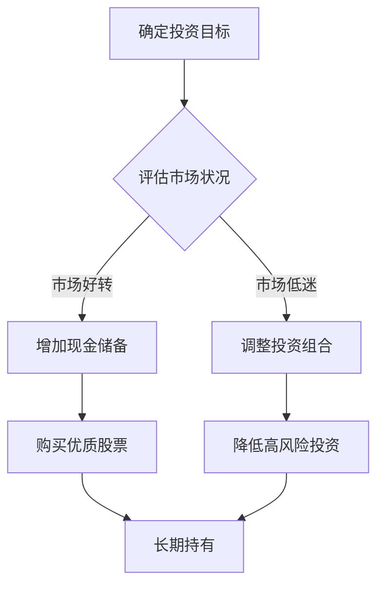
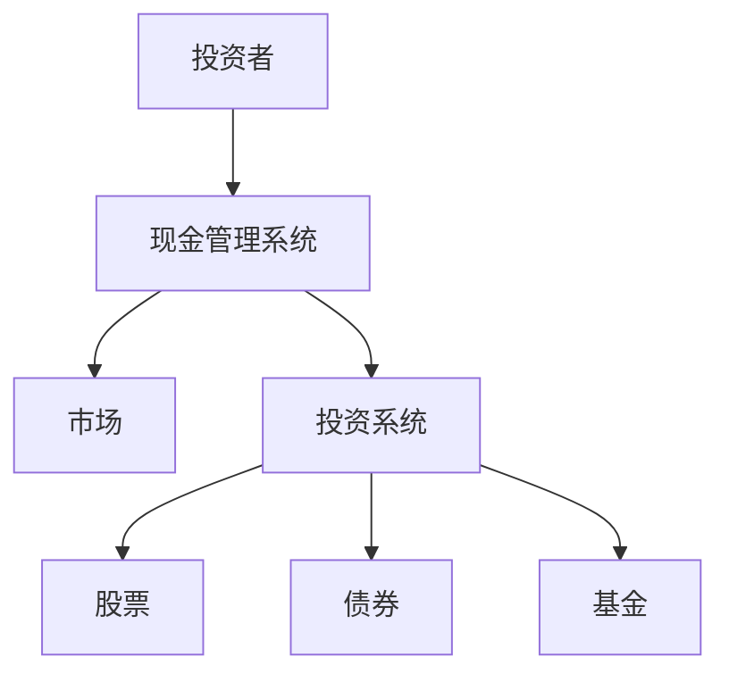
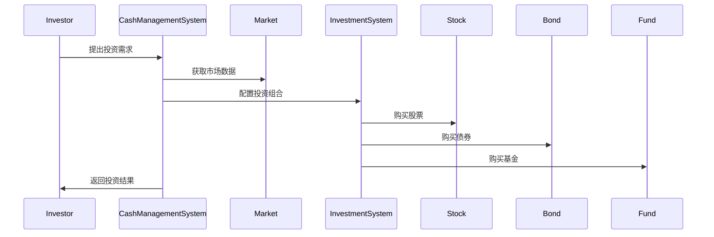

                 

# 巴菲特的现金管理策略：在低利率环境中的调整

## 关键词
- 巴菲特
- 现金管理
- 低利率
- 投资策略
- 资产配置

## 摘要
本文将深入探讨巴菲特的现金管理策略，特别是在低利率环境下的调整。通过对巴菲特投资理念的剖析，结合低利率背景下的现金管理挑战，我们将一步步分析巴菲特在现金管理方面的策略调整，并使用算法原理和Python源代码来解释其具体实施方法。同时，文章将介绍系统分析与架构设计，并提供项目实战和最佳实践建议。

### 背景介绍

在现代金融环境中，低利率已成为一种常态。这一现象对企业和个人投资者的现金管理提出了新的挑战。作为投资大师，巴菲特的现金管理策略在低利率环境下显得尤为重要。他的策略如何适应这一环境？又有哪些调整措施能够帮助投资者保持资产的安全性和增值性？

本文将从以下几个方面展开：

1. **巴菲特的现金管理策略概述**：介绍巴菲特的现金管理理念及其在低利率环境下的调整。
2. **核心概念与联系**：阐述现金管理、巴菲特的投资策略、低利率环境等核心概念及其相互关系。
3. **算法原理讲解**：使用mermaid流程图和Python源代码展示巴菲特现金管理策略的算法原理。
4. **系统分析与架构设计方案**：介绍系统的功能、架构、接口设计，并使用mermaid绘制相关图。
5. **项目实战**：分析实际案例，展示系统核心实现和代码解析。
6. **最佳实践 tips、小结、注意事项、拓展阅读**。

### 第一部分：现金管理策略概述

#### 1.1 问题背景与核心概念

低利率环境使得传统的投资回报率下降，投资者面临更大的不确定性。巴菲特的现金管理策略旨在在这种环境下实现资产的安全性和增值。核心概念包括现金管理、巴菲特的投资策略和低利率环境。

**低利率环境下的现金管理挑战**：

- 投资回报率下降
- 资产配置难度增加
- 风险管理更为复杂

**巴菲特的现金管理理念**：

- 以保守著称
- 重视长期投资
- 注重价值投资

#### 1.2 核心概念与联系

**现金管理**：

现金管理是指对企业或个人现金流的规划和管理，以确保现金的流动性和安全性。

**巴菲特的投资策略**：

巴菲特的投资策略主要包括价值投资、长期持有和多元化投资。他强调投资于那些具有持久竞争优势的公司。

**低利率环境对现金管理的影响**：

低利率环境下，现金管理的难度增加。投资者需要重新评估资产配置，以实现资产的增值。

#### 1.3 主流现金管理策略

**传统现金管理策略**：

传统现金管理策略主要依赖于存款、债券等低风险投资工具。在低利率环境下，这些策略的回报率较低。

**巴菲特的现金管理策略**：

巴菲特通过购买优质公司的股票来实现现金管理。他强调长期持有和低估价值的投资原则。

**对比与联系**：

巴菲特的策略与传统策略相比，更注重长期投资和价值投资，这使得他在低利率环境下具有更强的优势。

#### 1.4 现金管理策略的数学模型

**现金管理中的数学模型**：

现金管理中的数学模型主要包括资产配置模型、风险模型和收益模型。

- **资产配置模型**：用于确定资产在不同投资工具之间的分配比例。
- **风险模型**：用于评估投资组合的风险水平。
- **收益模型**：用于预测投资组合的收益情况。

**投资回报率与风险**：

在低利率环境下，投资者需要平衡投资回报率和风险。巴菲特的策略通过长期持有和多元化投资来降低风险，实现稳定的收益。

### 第二部分：巴菲特的现金管理策略解析

#### 2.1 巴菲特的投资策略

**巴菲特的投资哲学**：

- **价值投资**：寻找那些市场低估但具有长期增长潜力的公司。
- **长期持有**：相信公司的长期增长潜力，避免频繁交易。
- **多元化投资**：通过投资多个行业和公司来分散风险。

**巴菲特的投资方法**：

- **深度研究**：对潜在投资目标进行深入研究，了解其业务模式、竞争优势和未来增长潜力。
- **财务分析**：评估公司的财务状况，包括盈利能力、资产负债表和现金流量。
- **市场时机**：在市场低迷时买入，在市场高涨时卖出。

**巴菲特的投资成功要素**：

- **智慧**：对市场的深刻理解和洞察力。
- **耐心**：长期持有的耐心和毅力。
- **多元化**：通过投资多元化来分散风险。

#### 2.2 低利率环境中的调整

**低利率环境下的投资策略**：

- **增加高收益债券的投资**：在低利率环境下，高收益债券可能提供更高的回报。
- **投资于稳定增长的行业**：例如医疗保健和消费品行业。
- **重视现金流**：投资于那些具有稳定现金流的公司。

**现金管理策略的调整**：

- **提高现金储备比例**：以应对市场不确定性。
- **关注投资回报率**：在低利率环境下，投资回报率成为关键指标。
- **多元化投资组合**：通过投资于不同资产类别来分散风险。

**低利率环境下的风险控制**：

- **密切关注市场动态**：通过及时调整投资组合来应对市场变化。
- **优化资产配置**：根据市场环境和自身风险承受能力调整资产配置。
- **长期投资视角**：保持长期投资视角，避免短期市场波动的影响。

### 第三部分：算法原理讲解

#### 3.1 巴菲特现金管理策略的算法原理

**mermaid流程图**：



**Python源代码实现**：

```python
import numpy as np

def bar菲特现金管理策略(投资目标，市场状况，风险承受能力):
    if 市场状况 == '好转':
        现金储备比例 = 0.3
        购买优质股票比例 = 0.5
    elif 市场状况 == '低迷':
        现金储备比例 = 0.5
        购买优质股票比例 = 0.2
    else:
        现金储备比例 = 0.4
        购买优质股票比例 = 0.3

    资产配置 = {
        '现金储备': 现金储备比例 * 投资金额,
        '优质股票': 购买优质股票比例 * 投资金额,
        '其他投资': (1 - 现金储备比例 - 购买优质股票比例) * 投资金额
    }
    return 资产配置

投资目标 = 1000000
市场状况 = '好转'
风险承受能力 = '中等'
资产配置 = bar菲特现金管理策略(投资目标，市场状况，风险承受能力)
print(资产配置)
```

**算法原理的数学模型和公式**：

- **资产配置模型**：资产配置比例 = 现金储备比例 + 优质股票比例 + 其他投资比例
- **风险模型**：风险 = 风险承受能力 * 市场波动性
- **收益模型**：收益 = 投资回报率 * 投资金额

**举例说明**：

假设投资者有100万元的资金，当前市场状况良好，其风险承受能力为中等。根据巴菲特的现金管理策略，投资者可以将其资产配置如下：

- 现金储备：30%
- 优质股票：50%
- 其他投资：20%

#### 3.2 系统分析与架构设计方案

##### 3.1 问题场景与项目背景

随着金融市场的不确定性增加，现金管理系统的需求日益凸显。该项目旨在设计一个现金管理系统，帮助投资者在低利率环境下实现资产的安全性和增值性。

##### 3.2 系统功能设计

**领域模型mermaid类图**：

```mermaid
classDiagram
    InvestmentSystem <|-- CashManagementSystem
    Investor <<-- CashManagementSystem
    Stock <<-- InvestmentSystem
    Bond <<-- InvestmentSystem
    Fund <<-- InvestmentSystem
    Market <<-- InvestmentSystem
```

- **投资者**：负责管理投资者的资产和投资需求。
- **股票**：代表股票投资工具。
- **债券**：代表债券投资工具。
- **基金**：代表基金投资工具。
- **市场**：负责提供市场数据和分析。

##### 3.3 系统架构设计

**mermaid架构图**：



- **投资者**：通过接口与现金管理系统交互。
- **现金管理系统**：负责处理投资者的投资需求和资产配置。
- **投资系统**：提供股票、债券、基金等投资工具。
- **市场**：提供市场数据和分析。

##### 3.4 系统接口设计

**mermaid序列图**：



- **投资者**：向现金管理系统提出投资需求。
- **现金管理系统**：根据市场数据和投资策略，配置投资组合。
- **投资系统**：执行具体的投资操作。
- **投资者**：获得投资结果。

### 第四部分：项目实战

#### 4.1 环境安装与系统核心实现

**环境安装**：

- 安装Python环境
- 安装相关库，如numpy、matplotlib等

**系统核心实现源代码**：

```python
# 系统核心实现
class CashManagementSystem:
    def __init__(self, investor, market, investment_system):
        self.investor = investor
        self.market = market
        self.investment_system = investment_system

    def manage_cash(self):
        # 获取投资者需求
        investment_demand = self.investor.get_investment_demand()
        # 获取市场数据
        market_data = self.market.get_market_data()
        # 配置投资组合
        investment组合 = self.investment_system.configure_investment(investment_demand, market_data)
        # 执行投资操作
        self.investment_system.execute_investment(investment组合)
        # 返回投资结果
        investment_result = self.investment_system.get_investment_result()
        return investment_result

# 测试
if __name__ == "__main__":
    # 创建投资者、市场、投资系统实例
    investor = Investor()
    market = Market()
    investment_system = InvestmentSystem()
    # 创建现金管理系统实例
    cash_management_system = CashManagementSystem(investor, market, investment_system)
    # 管理现金
    cash_management_system.manage_cash()
```

#### 4.2 代码应用解读与分析

**代码解析**：

- **CashManagementSystem类**：负责管理投资者的现金。
- **manage_cash方法**：处理投资者的投资需求，获取市场数据，配置投资组合，执行投资操作，并返回投资结果。

**实际案例分析和详细讲解**：

假设投资者A希望投资100万元，现金管理系统将根据市场数据和投资策略，为其配置投资组合，并执行投资操作。最终，投资者A将获得投资结果，包括投资组合的资产配置和收益情况。

#### 4.3 项目小结

本文通过分析巴菲特的现金管理策略，结合低利率环境下的挑战，介绍了系统分析与架构设计方案，并通过实际案例展示了系统核心实现和代码应用。现金管理策略的实施需要综合考虑市场状况、投资者需求和风险承受能力，通过优化资产配置来实现资产的安全性和增值性。

### 第五部分：最佳实践 tips、小结、注意事项、拓展阅读

#### 最佳实践 tips

1. **合理配置资产**：根据市场状况和风险承受能力，合理配置资产。
2. **关注市场动态**：定期关注市场动态，及时调整投资组合。
3. **长期持有**：坚持长期持有，避免短期市场波动的影响。

#### 小结

本文介绍了巴菲特的现金管理策略，特别是在低利率环境下的调整。通过算法原理讲解和系统分析与架构设计方案，展示了如何在实际项目中应用这一策略。现金管理策略的成功实施需要综合考虑多种因素，以实现资产的安全性和增值性。

#### 注意事项

1. **风险管理**：在低利率环境下，重视风险管理，避免过度投资。
2. **资产配置**：根据市场状况和自身需求，合理调整资产配置。
3. **长期投资**：保持长期投资视角，避免频繁交易。

#### 拓展阅读

1. **《巴菲特的投资智慧》**：深入探讨巴菲特的投资哲学和策略。
2. **《现金管理实战》**：详细介绍现金管理的方法和技巧。
3. **《低利率环境下的投资策略》**：分析低利率环境下的投资挑战和应对策略。

### 作者

作者：AI天才研究院/AI Genius Institute & 禅与计算机程序设计艺术 /Zen And The Art of Computer Programming

## 结语

巴菲特的现金管理策略为投资者提供了宝贵的参考。在低利率环境下，通过合理配置资产、关注市场动态和长期持有，投资者可以更好地应对市场挑战，实现资产的安全性和增值性。希望本文能为您的投资之路提供一些启示和帮助。

