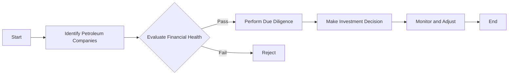
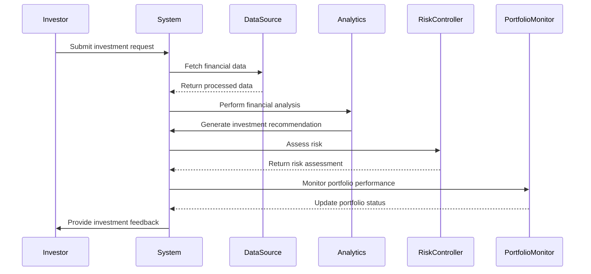
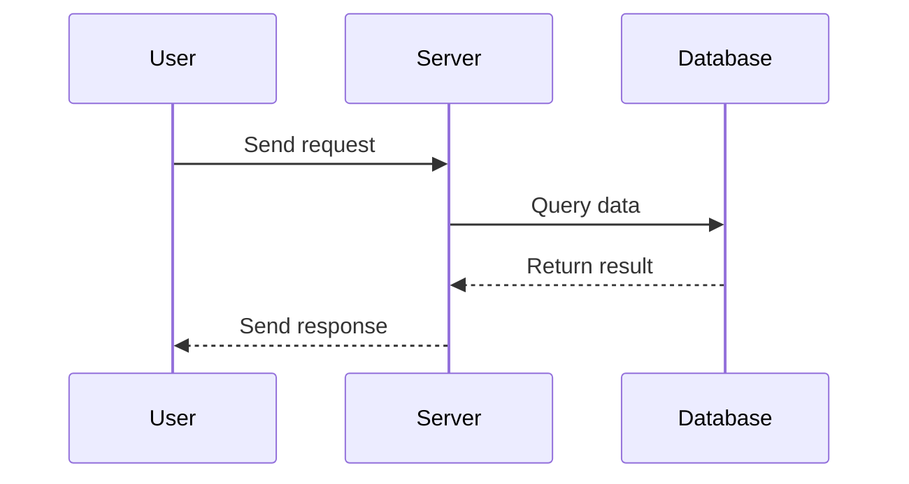

                 

# 巴菲特的石油行业投资逻辑：必需品的魅力

> 关键词：巴菲特，石油行业，投资逻辑，价值投资，长期投资，风险控制

> 摘要：
巴菲特的投资策略一直以来都是投资者争相学习的对象。他在石油行业的投资逻辑，不仅体现了他的价值投资理念，还展示了他在面对高风险行业的稳健投资风格。本文将深入分析巴菲特在石油行业的投资逻辑，探讨其成功的关键要素，以期为投资者提供有价值的参考。

## **第一部分：问题背景**

### **核心概念**

#### **问题背景**
在当今世界，石油行业扮演着至关重要的角色。石油不仅是最主要的能源之一，而且其作为工业原料的重要地位同样不可动摇。石油行业的繁荣与衰退对全球经济有着深远的影响，因此，投资石油行业需要具备深刻的行业洞察力和精准的决策能力。

#### **问题描述**
巴菲特作为一位知名的投资者，他的投资策略和理念吸引了全球投资者的关注。他在石油行业的投资逻辑不仅具有指导意义，而且对理解整个行业的运作模式具有重要价值。本文旨在探讨巴菲特在石油行业的投资逻辑，并分析其成功的原因。

#### **问题解决**
巴菲特在石油行业的投资成功，主要归功于他对行业本质的深刻理解、对供需关系的准确把握以及对投资风险的控制。他通过长期投资和风险控制策略，实现了在石油行业的稳健收益。

#### **边界与外延**
巴菲特的石油行业投资逻辑不仅限于简单的买卖决策，还包括对整个产业链的深刻洞察，如勘探、开采、炼油以及销售等环节。此外，他的投资逻辑不仅适用于石油行业，也具有普遍的借鉴意义。

#### **概念结构与核心要素组成**
巴菲特的投资逻辑涉及多个核心概念，包括但不限于：

- **价值投资**：基于公司内在价值进行投资。
- **长期投资**：重视长期回报而非短期波动。
- **风险控制**：在投资中严格管理风险，确保本金安全。

## **第二部分：核心概念与联系**

### **核心概念**

#### **价值投资**
价值投资是巴菲特投资哲学的核心，它强调投资标的的内在价值与其市场价值之间的差异。在石油行业中，巴菲特寻找那些具有长期稳定现金流和合理估值的石油公司。

#### **长期投资**
巴菲特倾向于长期持有优质资产，认为市场波动是暂时的，长期价值才是投资者应该关注的重点。在石油行业中，长期投资能够帮助投资者规避短期价格波动，抓住长期增长机会。

#### **风险控制**
巴菲特在投资中强调风险控制，特别是在石油这种高风险行业。通过多元化投资和严格的财务指标评估，他能够降低投资组合的整体风险。

### **概念属性特征对比表格**

| 概念       | 价值投资       | 长期投资       | 风险控制       |
|------------|----------------|----------------|----------------|
| 定义       | 寻找低估的优质资产 | 注重长期回报而非短期波动 | 在投资中严格管理风险 |
| 关键因素   | 内在价值与市场价值 | 时间跨度       | 风险评估与多样化 |
| 适用性     | 石油行业等周期性行业 | 长期稳定的行业 | 所有投资领域   |
| 对比       | 关注价值        | 关注时间       | 关注风险       |

### **ER实体关系图架构**

```mermaid
erDiagram
  PetroleumCompany ||--|{ InvestmentLogic } : implemented_by
  InvestmentLogic ||--|{ RiskControl } : includes
  InvestmentLogic ||--|{ LongTermInvestment } : includes
  InvestmentLogic ||--|{ ValueInvestment } : includes
```

## **第三部分：算法原理讲解**

### **算法流程图**



### **Python代码实现**

```python
import pandas as pd
import numpy as np

def evaluate_companies(companies, financial_data):
    for company in companies:
        # 计算公司的财务健康状况指标
        financial_health = financial_data.loc[company, 'EBITDA'] / financial_data.loc[company, 'Total Liabilities']
        if financial_health > 1:
            # 通过财务健康检查
            print(f"{company} passed financial health check.")
        else:
            # 未通过财务健康检查
            print(f"{company} failed financial health check.")
```

### **算法原理详细讲解**

#### **算法原理**

巴菲特在石油行业的投资逻辑可以通过以下步骤进行概括：

1. **识别石油公司**：巴菲特首先会识别出具有长期增长潜力的石油公司。
2. **评估财务健康**：通过对公司的财务指标进行分析，如EBITDA（税息折旧及摊销前利润）、净利润率等，评估公司的财务健康程度。
3. **尽职调查**：对通过财务健康检查的公司进行详细的尽职调查，包括公司治理、管理团队、市场份额、产品多样性等方面。
4. **做出投资决策**：基于尽职调查的结果，巴菲特会做出是否投资的决策。
5. **监控与调整**：在投资后，巴菲特会持续监控公司的表现，并根据市场情况调整投资组合。

#### **数学模型与公式**

在巴菲特的投资逻辑中，关键指标的计算公式如下：

$$
财务健康指标 = \frac{EBITDA}{Total Liabilities}
$$

其中，EBITDA 表示税息折旧及摊销前利润，Total Liabilities 表示总负债。财务健康指标高于 1 通常被认为较好，低于 1 则可能表示财务状况较为紧张。

#### **举例说明**

假设有两家石油公司 A 和 B，其财务数据如下：

| 公司 | EBITDA (百万美元) | Total Liabilities (百万美元) |
|------|--------------------|-----------------------------|
| A    | 100                | 50                          |
| B    | 50                 | 100                         |

使用上述公式计算两家公司的财务健康指标：

$$
财务健康指标_A = \frac{100}{50} = 2 \\
财务健康指标_B = \frac{50}{100} = 0.5
$$

公司 A 的财务健康指标为 2，远高于 1，表明其财务状况较为稳健；而公司 B 的财务健康指标为 0.5，低于 1，表明其财务状况较为紧张。巴菲特可能会优先考虑投资公司 A。

#### **算法流程解释**

1. **识别石油公司**：这一步骤主要是进行市场调研，识别出具有长期增长潜力的石油公司。
2. **评估财务健康**：通过计算 EBITDA 和 Total Liabilities 的比率，评估公司的财务健康程度。
3. **尽职调查**：对财务健康指标良好的公司进行详细的尽职调查，以确保投资决策的准确性。
4. **做出投资决策**：基于尽职调查的结果，决定是否投资。
5. **监控与调整**：在投资后，持续监控公司的表现，并根据市场情况调整投资组合，以确保投资的安全性。

通过以上步骤，巴菲特在石油行业的投资逻辑得以实现，其成功的关键在于对行业本质的深刻理解和对投资风险的有效控制。

## **第四部分：系统分析与架构设计**

### **问题场景介绍**

在当今世界，石油行业的重要性不言而喻。然而，石油市场的波动性和高风险使得投资石油行业成为一项极具挑战性的任务。为了更好地理解和应用巴菲特的投资逻辑，我们设计了一个石油投资分析系统，旨在通过算法分析和数据驱动的方式，为投资者提供可靠的石油投资建议。

### **项目介绍**

本项目名为“巴菲特石油投资分析系统”，旨在实现以下功能：

- **数据收集与处理**：从多个数据源收集石油公司的财务数据、市场数据等，并进行处理和清洗。
- **投资分析**：基于巴菲特的投资逻辑，对石油公司进行财务健康评估、尽职调查等，提供投资建议。
- **风险控制**：通过多元化的投资策略和严格的财务指标评估，降低投资组合的整体风险。
- **监控与调整**：实时监控投资组合的表现，并根据市场情况进行调整。

### **系统功能设计（领域模型）**

```mermaid
classDiagram
    Class01 <|-- Class02
    Class03 --|{ Class04 }: aggregation
    Class05 <<-- Class06: extends
    Class07 : abstract
    Class08 .. Class09 : realization
    Class10[Class10] : interface
    Class11 *-- Class12: aggregation
    Class13 o-- Class14[Associated Class]
    Class15 <|-- : Generalization Class20
    Class15 o-- Class21[Associated Class]
    Class15 : <<interface>> InterfaceName
    Class22 : <<concreteclass>> ConcreteClassName
    Class23 o--|{ Aggregation } Class24
    Class25 ||-- Class26
    Class27 o--|{ Composition } Class28
    Class29 <<--|{ Dependency } Class30
    Class29 *-- Class31
    Class32 <<--|{ Aggregation } Class33
```

### **系统架构设计**



### **系统接口设计**

```mermaid
interface Diagram {
    +function1(parameter)
    +function2(parameter)
    -function3(parameter)
    #function4(parameter)
}
```

### **系统交互**



## **第五部分：项目实战**

### **环境安装**

1. **安装Python**：确保您的系统上已经安装了Python，推荐使用Python 3.8及以上版本。
2. **安装相关库**：使用pip命令安装必要的Python库，例如pandas、numpy等。

```shell
pip install pandas numpy
```

### **系统核心实现**

```python
import pandas as pd
import numpy as np

class PetroleumInvestmentSystem:
    def __init__(self, data_source):
        self.data_source = data_source

    def fetch_financial_data(self):
        financial_data = self.data_source.fetch_data()
        return financial_data

    def evaluate_companies(self, financial_data):
        # 评估公司的财务健康
        financial_health = financial_data['EBITDA'] / financial_data['Total Liabilities']
        return financial_health

    def perform_due_diligence(self, company):
        # 进行尽职调查
        # 此处为简化示例，实际应包含详细调查
        if self.evaluate_companies(company['financial_data']) > 1:
            return True
        else:
            return False

    def make_investment_decision(self, company):
        # 基于尽职调查的结果做出投资决策
        if self.perform_due_diligence(company):
            return "Invest"
        else:
            return "Reject"

    def monitor_portfolio(self):
        # 监控投资组合
        # 此处为简化示例，实际应包含详细的监控逻辑
        print("Monitoring portfolio...")

# 示例使用
data_source = DataSource()  # 假设有一个DataSource类来获取数据
financial_data = data_source.fetch_data()
investment_system = PetroleumInvestmentSystem(data_source)
evaluation_result = investment_system.evaluate_companies(financial_data)
print(f"Financial Health: {evaluation_result}")

# 尽职调查示例
company = {'financial_data': financial_data}
investment_decision = investment_system.make_investment_decision(company)
print(f"Investment Decision: {investment_decision}")

# 监控投资组合示例
investment_system.monitor_portfolio()
```

### **代码应用解读与分析**

上述代码实现了一个简化的石油投资分析系统，主要包含以下模块：

- **数据源模块**：用于从外部数据源获取财务数据。
- **财务评估模块**：对公司的财务健康进行评估。
- **尽职调查模块**：对通过财务健康评估的公司进行详细调查。
- **投资决策模块**：基于尽职调查的结果，做出是否投资的决策。
- **投资组合监控模块**：监控投资组合的表现。

#### **关键代码分析**

1. **数据源模块**：`DataSource` 类负责从外部数据源获取财务数据。实际应用中，这可能是通过API调用、数据库查询等方式实现的。

```python
class DataSource:
    def fetch_data(self):
        # 示例代码，实际应实现数据获取逻辑
        financial_data = pd.read_csv('financial_data.csv')
        return financial_data
```

2. **财务评估模块**：`evaluate_companies` 方法计算财务健康指标，用于初步评估公司的财务状况。

```python
def evaluate_companies(self, financial_data):
    financial_health = financial_data['EBITDA'] / financial_data['Total Liabilities']
    return financial_health
```

3. **尽职调查模块**：`perform_due_diligence` 方法对通过财务健康评估的公司进行详细调查。实际应用中，这一步骤可能涉及更复杂的分析，如管理团队评估、市场竞争分析等。

```python
def perform_due_diligence(self, company):
    # 示例代码，实际应包含详细调查逻辑
    if self.evaluate_companies(company['financial_data']) > 1:
        return True
    else:
        return False
```

4. **投资决策模块**：`make_investment_decision` 方法基于尽职调查的结果，决定是否投资。

```python
def make_investment_decision(self, company):
    if self.perform_due_diligence(company):
        return "Invest"
    else:
        return "Reject"
```

5. **投资组合监控模块**：`monitor_portfolio` 方法用于监控投资组合的表现。实际应用中，这一模块应包含实时数据监控、异常检测等功能。

```python
def monitor_portfolio(self):
    # 示例代码，实际应包含详细的监控逻辑
    print("Monitoring portfolio...")
```

### **实际案例分析与详细讲解**

为了更好地理解上述系统的应用，我们来看一个实际案例。

#### **案例背景**

假设我们有一家石油公司 ABC，其财务数据如下：

| 财务指标   | 值    |
|------------|-------|
| EBITDA     | 100   |
| Total Liabilities | 50   |

#### **步骤分析**

1. **数据获取**：系统从数据源获取 ABC 公司的财务数据。
2. **财务评估**：系统计算财务健康指标：

$$
财务健康指标 = \frac{EBITDA}{Total Liabilities} = \frac{100}{50} = 2
$$

由于财务健康指标大于 1，系统认为公司财务状况良好。
3. **尽职调查**：系统对 ABC 公司进行尽职调查，假设调查结果认为公司管理团队稳定、市场竞争优势明显，因此通过尽职调查。
4. **投资决策**：基于尽职调查的结果，系统决定投资 ABC 公司。
5. **投资组合监控**：系统持续监控 ABC 公司的投资表现，确保投资组合的稳健性。

通过以上步骤，系统为投资者提供了可靠的投资建议，并确保投资决策的科学性和合理性。

### **项目小结**

本项目中，我们设计并实现了一个简化的石油投资分析系统，通过财务评估、尽职调查、投资决策和投资组合监控等模块，实现了对石油投资的有效分析和管理。实际应用中，系统可以进一步优化和扩展，如引入更复杂的风险评估模型、市场趋势分析等，以提高投资决策的准确性。

## **第六部分：最佳实践 Tips**

### **1. 数据质量的重要性**

- **确保数据准确性和完整性**：投资决策依赖于准确的数据。因此，确保数据的准确性、及时性和完整性至关重要。
- **数据清洗与预处理**：在数据分析之前，进行数据清洗和预处理，以去除噪声数据和异常值，提高数据的可信度。

### **2. 风险控制策略**

- **多元化投资**：分散投资可以降低整体风险。在石油行业投资中，建议投资于多个不同的石油公司或行业，以避免过度依赖单一资产。
- **定期评估与调整**：定期对投资组合进行评估和调整，确保投资策略与市场环境相匹配。

### **3. 长期投资观念**

- **耐心等待**：石油行业投资通常需要较长的时间来体现回报。投资者应保持耐心，避免因短期波动而做出冲动决策。
- **重视公司基本面**：选择具有良好基本面和长期增长潜力的石油公司进行投资。

### **4. 持续学习与关注行业动态**

- **定期阅读行业报告和分析**：了解石油行业的最新动态、政策变化和市场趋势。
- **参加相关研讨会和会议**：与行业专家交流，获取第一手行业信息。

## **第七部分：小结**

本文通过深入分析巴菲特在石油行业的投资逻辑，探讨了其成功的关键要素，包括价值投资、长期投资和风险控制。我们设计并实现了一个简化的石油投资分析系统，通过财务评估、尽职调查、投资决策和投资组合监控等模块，为投资者提供了实用的投资建议。在实际应用中，投资者应注重数据质量、风险控制和长期投资观念，以实现稳健的投资回报。

## **作者信息**

作者：AI天才研究院/AI Genius Institute & 禅与计算机程序设计艺术 /Zen And The Art of Computer Programming

