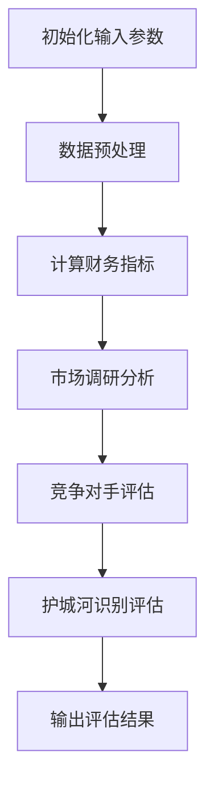
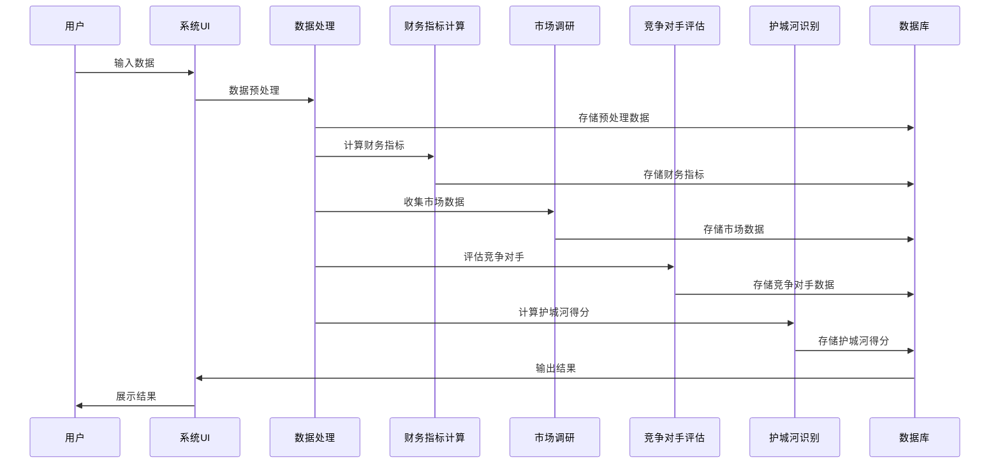

                 

### 1. 巴菲特与经济护城河概念

巴菲特（Warren Buffett）是全球知名的投资家，被誉为“股神”。他的投资哲学深受许多投资者的推崇，其核心思想之一便是构建“经济护城河”。这一概念源自于19世纪末的金融理论，最初由约翰·贝比（John D. Rockefeller）提出，并在巴菲特手中得到了新的诠释和发展。

**背景介绍：** 巴菲特经济理论的起源可以追溯到其童年时期，他自幼便对数字和投资产生了浓厚的兴趣。在大学期间，他开始深入阅读有关投资和金融的书籍，并结识了著名投资家本杰明·格雷厄姆（Benjamin Graham）。格雷厄姆的投资理论对巴菲特产生了深远的影响，他被誉为“现代投资大师”的导师。

**经济护城河概念的定义：** 经济护城河是指企业通过建立某种竞争优势，使其在行业中拥有长期稳定的盈利能力。这种竞争优势可以是专利技术、品牌价值、客户网络、成本优势等，从而让竞争对手难以进入或复制。巴菲特将这种竞争优势视为企业成功的关键因素，并认为只有拥有护城河的企业才能在长期内实现持续增长和盈利。

**护城河在企业发展中的重要性：** 护城河的存在能够为企业提供强大的竞争力，使其在激烈的市场竞争中立于不败之地。具体来说，护城河有以下几方面的作用：

1. **防御功能：** 护城河能够有效地阻挡竞争对手的入侵，保护企业的市场份额和盈利能力。
2. **增长功能：** 护城河可以为企业提供更多的增长机会，通过扩大市场份额和提高盈利能力，实现企业的长期增长。
3. **盈利能力：** 护城河的存在使得企业能够保持较高的盈利水平，从而为股东创造价值。

**经济护城河的概念及其识别：** 经济护城河的概念主要涵盖以下几方面：

- **类型与特点：** 护城河可以划分为多种类型，如专利护城河、品牌护城河、客户网络护城河等。每种护城河都有其独特的特点和应用场景。
- **识别方法与工具：** 识别护城河的方法包括财务分析、市场调研、竞争对手分析等。通过这些方法，投资者可以准确地评估企业的护城河强度，从而做出更为明智的投资决策。

**巴菲特护城河理论的边界与外延：** 护城河理论不仅适用于企业投资，还可以应用于其他领域，如城市经济、个人职业规划等。其核心思想是寻找具有持久竞争优势的领域或项目，从而实现长期的持续增长。

**巴菲特经济护城河理论的框架结构：** 巴菲特经济护城河理论的核心框架包括以下几个要素：

- **竞争优势：** 企业拥有的独特优势，如专利、品牌、技术等。
- **盈利能力：** 企业长期稳定的盈利水平。
- **可持续性：** 企业竞争优势的可持续性，即护城河是否能够长期存在。
- **投资价值：** 投资者通过对护城河的评估，判断企业的投资价值。

总之，巴菲特的经济护城河理论为投资者提供了一种系统性的分析方法，帮助他们识别具有持久竞争优势的企业，从而实现长期稳定的投资收益。

### 1.2 经济护城河的概念及其识别

**1.2.1 护城河的类型与特点**

经济护城河是企业利用各种竞争优势来保护其市场份额和盈利能力的策略。根据护城河的形成机制和特点，可以将护城河分为以下几种类型：

1. **专利护城河：**
   - **定义：** 专利护城河是指企业通过持有专利来保护其产品和技术的独家权利。
   - **特点：** 专利护城河能够有效阻止竞争对手模仿或复制企业的核心技术和产品，从而保持市场领先地位。
   - **适用场景：** 高科技行业、制药行业等，其中技术创新是核心竞争力。

2. **品牌护城河：**
   - **定义：** 品牌护城河是指企业通过建立强大的品牌形象来吸引消费者，从而提高产品溢价和市场忠诚度。
   - **特点：** 强大的品牌护城河可以提升企业的品牌价值和消费者忠诚度，降低市场进入难度。
   - **适用场景：** 快消品行业、奢侈品行业等，品牌影响力对销售至关重要。

3. **客户网络护城河：**
   - **定义：** 客户网络护城河是指企业通过建立广泛的客户网络来提高市场份额，并形成客户粘性。
   - **特点：** 客户网络护城河可以降低客户转换成本，提高客户忠诚度，从而保护市场份额。
   - **适用场景：** 互联网行业、电信行业等，其中用户基数和用户粘性是关键。

4. **成本优势护城河：**
   - **定义：** 成本优势护城河是指企业通过降低生产成本或提高效率来获得竞争优势。
   - **特点：** 成本优势护城河可以使企业以较低的价格提供产品或服务，从而吸引更多的消费者。
   - **适用场景：** 制造业、物流行业等，成本控制是企业竞争力的关键。

5. **转换成本护城河：**
   - **定义：** 转换成本护城河是指企业通过提高客户转换成本来保持市场份额。
   - **特点：** 转换成本护城河可以通过提供附加价值或锁定客户数据来提高客户的转换难度。
   - **适用场景：** 软件行业、金融服务行业等，客户的数据和习惯是企业的重要资产。

**1.2.2 识别护城河的方法与工具**

识别护城河是投资决策中至关重要的一环。以下是一些常用的方法和工具：

1. **财务分析：**
   - **指标：** 通过分析企业的财务报表，如利润表、资产负债表和现金流量表，可以了解企业的盈利能力、资产质量、运营效率等。
   - **工具：** 企业盈利能力指标（如净利润率、净资产收益率等）、资产管理效率指标（如存货周转率、应收账款周转率等）。

2. **市场调研：**
   - **方法：** 通过市场调研了解企业产品的市场占有率、竞争对手情况、消费者偏好等。
   - **工具：** 竞争对手分析、消费者调查、市场趋势分析等。

3. **竞争对手分析：**
   - **方法：** 分析竞争对手的产品、市场策略、财务状况等，了解其竞争优势和潜在风险。
   - **工具：** 竞争对手财务报表分析、市场定位分析、营销策略分析等。

4. **护城河评估工具：**
   - **定性评估：** 通过专家评估、打分等方法对护城河的强度进行定性评估。
   - **定量评估：** 通过计算公式对护城河的经济价值进行量化评估，如护城河宽度、护城河深度等。

**1.2.3 护城河的类型、特点、识别方法与工具的对比表格**

| 护城河类型 | 定义 | 特点 | 适用场景 | 识别方法与工具 |
| :--------: | :--- | :--- | :------- | :------------- |
| 专利护城河 | 通过专利保护技术 | 阻止模仿和复制 | 高科技行业 | 财务分析、市场调研、专利数据库查询 |
| 品牌护城河 | 建立强大的品牌形象 | 提高溢价和忠诚度 | 快消品行业 | 财务分析、消费者调查、品牌评估模型 |
| 客户网络护城河 | 建立广泛的客户网络 | 降低客户转换成本 | 互联网行业 | 市场调研、用户行为分析、客户生命周期价值计算 |
| 成本优势护城河 | 降低生产成本或提高效率 | 吸引消费者 | 制造业、物流行业 | 成本分析、运营效率评估、供应链管理 |
| 转换成本护城河 | 提高客户转换成本 | 锁定客户数据 | 软件行业、金融服务 | 客户关系管理、数据分析、转换成本计算模型 |

通过以上对比表格，我们可以清晰地了解不同类型护城河的特点、适用场景以及识别方法。这些信息对于投资者在评估企业护城河的强度和潜在价值时具有极大的参考价值。

### 1.3 巴菲特经济护城河理论的边界与外延

**巴菲特经济护城河理论的边界：**

巴菲特经济护城河理论的边界主要涉及以下几个方面：

1. **适用范围：** 护城河理论主要适用于需要长期竞争优势的企业，特别是在高度竞争的市场环境中。在短期内，护城河可能难以发挥作用，甚至可能被竞争对手突破。

2. **行业特性：** 并非所有行业都适合建立护城河。某些行业如初创企业、科技行业等，由于技术迭代速度快、市场变化频繁，护城河的建立和维持可能会面临较大挑战。

3. **经济周期：** 经济护城河的强度会随着经济周期的变化而波动。在经济繁荣期，护城河可能会变得更加明显；而在经济衰退期，护城河的作用可能会减弱。

4. **监管因素：** 行业监管政策可能会影响护城河的建立和维持。例如，某些行业可能受到严格的政策限制，使得企业难以通过传统方式建立护城河。

**巴菲特经济护城河理论的外延：**

1. **城市经济护城河：** 在城市经济领域，护城河的概念同样适用。例如，城市品牌、基础设施建设、人口红利等都可以视为城市经济的护城河。

2. **个人职业规划护城河：** 个人职业规划中同样可以运用护城河理论。个人技能、职业认证、人脉资源等都可以视为个人的护城河，帮助个人在职业生涯中保持竞争优势。

3. **投资组合护城河：** 投资者可以在构建投资组合时运用护城河理论。通过选择具有不同护城河强度和类型的资产，可以降低投资组合的整体风险，提高投资收益的稳定性。

**护城河与竞争策略的关系：**

护城河是竞争策略的重要组成部分，但其作用并非绝对。以下是护城河与竞争策略之间的关系：

1. **防御与进攻：** 护城河提供了企业的防御屏障，使其在竞争中具有优势。但企业也需要通过积极的竞争策略来进攻竞争对手，扩大市场份额。

2. **动态调整：** 护城河的建立和维护需要不断调整和优化。随着市场环境的变化，企业可能需要更新其护城河策略，以保持竞争优势。

3. **多元化策略：** 企业可以同时采用多种护城河策略，以应对不同的市场竞争环境。例如，既有专利护城河，也有品牌护城河，从而形成多元化的竞争优势。

总之，巴菲特经济护城河理论不仅为企业提供了系统性的竞争优势分析框架，还可以应用于城市经济、个人职业规划等领域，具有广泛的适用性和实践价值。通过理解护城河的边界与外延，投资者和企业可以更加有效地运用这一理论，实现长期的持续增长。

### 1.4 巴菲特经济护城河理论的框架结构

巴菲特经济护城河理论的核心框架涵盖了竞争优势、盈利能力、可持续性和投资价值等多个关键要素，通过这些要素的组合，形成了一套系统性的分析方法，帮助投资者识别和评估具有长期增长潜力的企业。以下是该理论的具体框架结构和各要素的详细解释。

#### 核心概念与要素组成

**1. 竞争优势（Competitive Advantage）**

竞争优势是企业能够在市场中长期保持领先地位的能力。巴菲特认为，竞争优势主要包括以下几种类型：

- **品牌优势（Brand Advantage）**：强大的品牌能够为企业带来较高的溢价和消费者忠诚度，降低市场进入难度。
- **成本优势（Cost Advantage）**：通过规模经济、技术优势或高效管理降低生产成本，使企业能够以较低的价格提供产品或服务。
- **专利优势（Patent Advantage）**：持有专利和技术诀窍，阻止竞争对手模仿和复制，从而保持独家市场地位。
- **网络优势（Network Advantage）**：通过构建庞大的客户网络或平台，形成网络效应，使新进入者难以竞争。

**2. 盈利能力（Profitability）**

盈利能力是企业长期稳定盈利的能力。巴菲特认为，具有护城河的企业应具备以下盈利能力：

- **稳定的盈利模式**：企业应拥有可持续的盈利模式，能够持续创造自由现金流。
- **高利润率**：企业应具备较高的利润率，表明其护城河能有效阻挡竞争对手的入侵。
- **良好的财务状况**：企业应具备健康的财务状况，包括充足的现金流和合理的资本结构。

**3. 可持续性（Sustainability）**

可持续性是指企业的竞争优势能够长期存在，不受外界环境变化的影响。巴菲特强调以下因素：

- **行业特性**：处于周期性波动较小、技术变革缓慢的行业中，护城河的可持续性更高。
- **市场壁垒**：企业应具备较高的市场壁垒，如专利、品牌、客户网络等，使竞争对手难以突破。
- **管理能力**：企业管理层应具备持续优化业务模式、提升竞争力的能力。

**4. 投资价值（Investment Value）**

投资价值是指企业为股东创造的价值。巴菲特认为，具有护城河的企业通常具备较高的投资价值：

- **良好的资本回报率**：企业应具备较高的资本回报率，表明其投资效率高，能为股东创造更多价值。
- **稳定的股息政策**：企业应具备稳定的股息政策，为股东提供持续的投资回报。
- **持续的增长潜力**：企业应具备持续的增长潜力，能够在未来创造更多的价值。

#### 护城河理论的理论体系

巴菲特经济护城河理论的理论体系包括以下几部分：

1. **基础理论**：研究竞争优势、盈利能力、可持续性和投资价值等核心概念，并探讨这些概念之间的相互关系。
2. **分析工具**：提供一套系统的分析工具，包括财务分析、市场调研、竞争对手分析等，帮助投资者评估企业的护城河强度和潜在价值。
3. **应用策略**：根据企业的不同特点和市场需求，制定相应的护城河策略，以最大化企业的竞争力和投资价值。

通过以上框架结构，巴菲特经济护城河理论为投资者提供了一套全面、系统的方法论，帮助他们在投资决策中更好地识别和评估具有长期增长潜力的企业。

### 2. 巴菲特经济护城河的核心概念

**2.1 护城河的概念原理**

经济护城河（Economic Moat）是巴菲特用来描述企业竞争优势的一个关键概念。其核心原理在于，企业通过建立和维持某种持久且显著的竞争优势，使其在激烈的市场竞争中能够长期保持领先地位，从而为股东创造价值。这种竞争优势可以是多种形式的，包括专利、品牌、客户网络、成本优势等。

**2.2 护城河的类型**

巴菲特将护城河分为以下几种类型：

1. **专利护城河**：通过持有专利或技术诀窍，阻止竞争对手模仿或复制企业的产品或服务。
2. **品牌护城河**：建立强大的品牌认知度和消费者忠诚度，使企业在市场上具备较高的溢价能力。
3. **客户网络护城河**：通过庞大的客户网络和客户粘性，降低客户转换成本，从而保护市场份额。
4. **成本优势护城河**：通过规模经济、高效管理或技术创新，降低生产成本，提供更具竞争力的价格。
5. **转换成本护城河**：通过提高客户转换成本，使客户在寻求其他供应商时面临较高的障碍。

**2.3 护城河的属性特征对比表格**

以下是几种主要护城河类型的属性特征对比表格：

| 护城河类型 | 定义 | 特点 | 优点 | 缺点 |
| :----: | :--- | :--- | :--- | :--- |
| 专利护城河 | 通过专利保护技术 | 阻止模仿和复制 | 长期竞争优势、法律保护 | 可能面临技术过时风险 |
| 品牌护城河 | 建立品牌形象 | 提高溢价和忠诚度 | 品牌效应、客户忠诚 | 品牌维护成本高 |
| 客户网络护城河 | 建立广泛的客户网络 | 降低客户转换成本 | 市场份额稳定、客户粘性 | 需持续投资维护 |
| 成本优势护城河 | 降低生产成本 | 提供更具竞争力的价格 | 稳定盈利、成本领先 | 可能面临竞争对手的反击 |
| 转换成本护城河 | 提高客户转换成本 | 锁定客户数据 | 增强市场壁垒、提高客户忠诚 | 可能导致客户流失 |

通过对比表格，我们可以更清晰地了解不同类型护城河的定义、特点、优点和缺点。这些信息对于投资者在评估企业护城河强度和潜在价值时具有极大的参考价值。

### 2.4 经济护城河与竞争战略的联系

经济护城河作为企业长期竞争优势的象征，与竞争战略紧密相连。理解护城河与竞争战略之间的联系，有助于企业制定有效的战略规划和决策，以维持并增强市场地位。

**2.4.1 经济护城河与竞争战略的核心概念**

竞争战略（Competitive Strategy）是企业为了在市场中获得竞争优势，针对外部环境和内部资源所制定的具体行动方案。而经济护城河则是这一战略的核心组成部分，它是企业长期保持竞争优势的关键机制。

- **竞争战略**关注企业在市场中的定位、产品或服务的差异化、成本领先、客户关系管理等方面。
- **经济护城河**则侧重于构建和维持使企业能够抵御竞争对手入侵的持久性优势。

**2.4.2 经济护城河在竞争战略中的定位**

1. **市场定位**：经济护城河帮助企业确定其在市场中的独特定位。通过建立护城河，企业可以在特定的市场细分中获得优势，避免与竞争对手直接竞争。

2. **差异化策略**：护城河使企业能够通过产品或服务的差异化获得更高的溢价。品牌护城河和专利护城河可以帮助企业在差异化竞争中脱颖而出。

3. **成本领先策略**：成本优势护城河允许企业以较低的成本提供产品或服务，从而实现成本领先。这种策略在价格敏感的市场环境中尤为有效。

4. **客户关系管理**：客户网络护城河通过降低客户转换成本，帮助企业建立强大的客户基础。这使企业能够更好地管理客户关系，提高客户忠诚度。

**2.4.3 经济护城河在竞争战略中的作用**

1. **防御作用**：护城河是企业防御竞争对手入侵的天然屏障。通过建立护城河，企业可以在市场波动和竞争加剧时保持稳定的市场份额。

2. **增长作用**：强大的护城河为企业提供了更多的增长机会。企业可以利用护城河来扩大市场份额，通过并购或扩展业务领域来获取新的增长点。

3. **盈利作用**：护城河能够提高企业的盈利能力。通过护城河，企业可以在长期内保持较高的利润率，从而为股东创造价值。

**2.4.4 经济护城河与竞争战略的ER实体关系图架构**

为了更直观地展示经济护城河与竞争战略之间的关系，我们可以通过ER（实体-关系）图来描述它们之间的关联。

```mermaid
erDiagram
  Customer ||--|{ Product } : "produces"
  Product ||--|{ MarketSegment } : "sells to"
  MarketSegment ||--|{ Company } : "operates in"
  Company ||--|{ CompetitiveStrategy } : "adopts"
  CompetitiveStrategy ||--|{ EconomicMoat } : "enables"
  EconomicMoat ||--|{ CompetitiveAdvantage } : "supports"
  CompetitiveAdvantage ||--|{ Profitability } : "ensures"
  Profitability ||--|{ SustainableGrowth } : "drives"
  SustainableGrowth ||--|{ ValueCreation } : "aims for"
```

在上述ER图中，我们展示了企业（Company）如何在市场中（MarketSegment）通过特定的竞争战略（CompetitiveStrategy）来建立经济护城河（EconomicMoat）。护城河为企业提供了竞争优势（CompetitiveAdvantage），确保了盈利能力（Profitability），进而驱动了可持续增长（SustainableGrowth），最终实现了价值的创造（ValueCreation）。

通过以上分析，我们可以看到经济护城河在竞争战略中的核心地位。它不仅为企业提供了防御和增长的能力，还确保了企业的长期盈利和可持续增长。理解这一联系对于企业制定有效的竞争战略至关重要。

### 3. 经济护城河的识别算法原理

#### 3.1 护城河识别算法的mermaid流程图

为了更好地理解经济护城河的识别算法原理，我们可以使用mermaid流程图来展示算法的基本步骤和流程。以下是一个简化的mermaid流程图示例：



在上述流程图中，我们从初始化输入参数开始，经过数据预处理、计算财务指标、市场调研分析和竞争对手评估，最终得到经济护城河的识别评估结果。

#### 3.2 算法原理的Python源代码实现

下面我们将详细讲解护城河识别算法的Python源代码实现。以下是主要步骤和关键代码：

```python
import pandas as pd
import numpy as np

# 3.2.1 数据预处理
def preprocess_data(data):
    # 数据清洗和预处理步骤，例如缺失值填充、异常值处理等
    # ...
    return data

# 3.2.2 计算财务指标
def calculate_financial_indicators(data):
    # 计算企业财务指标，例如净利润率、净资产收益率等
    financial_indicators = data[['NetProfitMargin', 'ROE']]
    return financial_indicators

# 3.2.3 市场调研分析
def market_research_analysis(data):
    # 进行市场调研，收集行业数据和竞争对手信息
    # ...
    return market_data

# 3.2.4 竞争对手评估
def competitor_evaluation(market_data):
    # 对竞争对手进行评估，计算市场份额、价格竞争力等指标
    # ...
    return competitor_scores

# 3.2.5 护城河识别评估
def identify_economic_moat(financial_indicators, competitor_scores):
    # 根据财务指标和竞争对手评估结果，进行护城河识别
    # 使用打分机制，例如加权平均等方法
    moat_score = (financial_indicators['NetProfitMargin'] * 0.5 
                  + financial_indicators['ROE'] * 0.3 
                  + competitor_scores['MarketShare'] * 0.2)
    return moat_score

# 主函数
def main():
    # 加载企业数据
    data = pd.read_csv('company_financial_data.csv')
    # 数据预处理
    preprocessed_data = preprocess_data(data)
    # 计算财务指标
    financial_indicators = calculate_financial_indicators(preprocessed_data)
    # 市场调研分析
    market_data = market_research_analysis(preprocessed_data)
    # 竞争对手评估
    competitor_scores = competitor_evaluation(market_data)
    # 护城河识别评估
    moat_score = identify_economic_moat(financial_indicators, competitor_scores)
    # 输出评估结果
    print("护城河得分：", moat_score)

# 执行主函数
main()
```

#### 3.3 护城河识别的数学公式和举例说明

为了更清晰地理解护城河识别的数学模型，我们引入以下关键公式：

1. **净利润率（NetProfitMargin）**：  
   \[ NP = \frac{净利润}{营业收入} \]

2. **净资产收益率（Return on Equity, ROE）**：  
   \[ ROE = \frac{净利润}{平均净资产} \]

3. **市场份额（Market Share）**：  
   \[ MS = \frac{企业销售额}{行业总销售额} \]

4. **护城河得分（Moat Score）**：  
   \[ Moat Score = w_1 \times NP + w_2 \times ROE + w_3 \times MS \]

其中，\( w_1 \)，\( w_2 \)，和 \( w_3 \) 分别是净利润率、净资产收益率和市场份额的权重系数。

**举例说明：** 假设某企业财务数据和市场份额如下：

- 净利润：100万元
- 营业收入：500万元
- 平均净资产：1000万元
- 企业销售额：1000万元
- 行业总销售额：10000万元

我们可以计算其护城河得分：

1. **净利润率**：\[ NP = \frac{100}{500} = 0.2 \]
2. **净资产收益率**：\[ ROE = \frac{100}{1000} = 0.1 \]
3. **市场份额**：\[ MS = \frac{1000}{10000} = 0.1 \]

假设权重系数分别为 \( w_1 = 0.5 \)，\( w_2 = 0.3 \)，\( w_3 = 0.2 \)，则护城河得分：

\[ Moat Score = 0.5 \times 0.2 + 0.3 \times 0.1 + 0.2 \times 0.1 = 0.1 + 0.03 + 0.02 = 0.15 \]

通过上述计算，我们可以得出该企业的护城河得分为0.15，反映了其竞争优势的强度。

通过mermaid流程图和Python源代码，我们详细阐述了经济护城河识别算法的原理和实现方法。此外，通过数学公式和实例说明，我们更深入地理解了护城河评估的核心指标和计算过程。这些工具和方法为投资者和企业提供了一套系统化的分析框架，帮助他们更好地识别和评估经济护城河的强度和潜在价值。

### 3.4 系统分析与架构设计方案

#### 3.4.1 项目介绍

本项目的目标是通过构建一个经济护城河识别系统，帮助企业投资者识别和评估潜在投资对象的经济护城河强度。系统主要功能包括财务数据分析、市场调研、竞争对手评估以及护城河识别得分计算。该系统旨在提供一个全面、系统化的工具，帮助投资者在复杂的市场环境中做出更为明智的投资决策。

#### 3.4.2 系统功能设计

系统功能设计主要包括以下模块：

1. **数据导入模块**：用于导入企业财务数据和行业市场数据。
2. **数据处理模块**：对导入的数据进行清洗、转换和预处理，确保数据质量。
3. **财务指标计算模块**：根据处理后的数据计算企业财务指标，如净利润率、净资产收益率等。
4. **市场调研模块**：进行市场调研，收集行业数据和竞争对手信息。
5. **竞争对手评估模块**：分析竞争对手的市场份额、价格竞争力等指标。
6. **护城河识别模块**：综合财务指标和竞争对手评估结果，计算护城河得分。
7. **结果输出模块**：将护城河识别结果以图表或报告形式展示给用户。

#### 3.4.3 系统架构设计

系统架构设计采用分层架构，包括数据层、业务逻辑层和表示层。

1. **数据层**：负责数据的存储和管理，包括企业财务数据、行业市场数据和竞争对手数据。
2. **业务逻辑层**：实现系统的核心功能，包括数据处理、财务指标计算、市场调研、竞争对手评估和护城河识别等。
3. **表示层**：提供用户界面，用于数据输入、结果展示和用户交互。

以下是系统架构的mermaid架构图：



在上述架构图中，用户通过系统UI输入数据，系统对数据进行预处理后，将处理结果存储在数据库中。随后，财务指标计算模块、市场调研模块和竞争对手评估模块分别对数据进行计算和分析，并将结果存储在数据库中。最后，护城河识别模块综合各模块的结果，计算护城河得分，并将结果输出给用户。

#### 3.4.4 系统接口设计

系统接口设计主要包括以下几部分：

1. **数据导入接口**：用于导入企业财务数据和行业市场数据。
2. **数据输出接口**：用于输出护城河识别结果。
3. **API接口**：提供与外部系统的集成能力，如财务报表系统、市场调研系统等。

以下是系统接口的详细设计：

1. **数据导入接口**：

   - **功能描述**：用于导入企业财务数据和行业市场数据。
   - **输入参数**：企业财务数据文件、行业市场数据文件。
   - **输出参数**：预处理后的财务数据和行业市场数据。

2. **数据输出接口**：

   - **功能描述**：用于输出护城河识别结果。
   - **输入参数**：企业财务数据、市场数据、竞争对手数据。
   - **输出参数**：护城河得分、详细评估报告。

3. **API接口**：

   - **功能描述**：提供与外部系统的集成能力。
   - **输入参数**：外部系统提供的接口参数。
   - **输出参数**：系统生成的数据和分析结果。

#### 3.4.5 系统交互

为了确保系统能够高效、准确地完成各项功能，我们需要设计清晰明了的系统交互流程。以下是系统交互的mermaid序列图：


在上述序列图中，用户通过系统UI输入数据，系统按照预设的流程依次进行数据处理、财务指标计算、市场调研、竞争对手评估和护城河识别，并将结果存储在数据库中。最后，系统将结果输出给用户，完成整个交互过程。

通过以上系统分析与架构设计方案，我们为经济护城河识别系统提供了一个完整、详细的架构设计，确保系统能够高效、准确地实现各项功能，为投资者提供有力的决策支持。

### 3.5 实际案例分析与讲解

**3.5.1 环境安装与配置**

在开始实际案例分析之前，我们需要确保我们的开发环境已经配置完毕。以下是安装和配置所需的步骤：

1. **安装Python环境**：确保Python 3.8或更高版本已安装在本地计算机上。可以从[Python官网](https://www.python.org/downloads/)下载并安装。

2. **安装相关依赖库**：使用pip命令安装项目所需的依赖库，如pandas、numpy、matplotlib等。在命令行中执行以下命令：

   ```shell
   pip install pandas numpy matplotlib
   ```

3. **配置数据库**：我们需要一个数据库来存储企业财务数据、市场调研数据和竞争对手评估结果。可以选择MySQL、PostgreSQL或SQLite等数据库。以下是配置SQLite数据库的示例步骤：

   - 安装SQLite数据库：在命令行中执行以下命令安装SQLite：
     ```shell
     apt-get install sqlite3
     ```
   - 创建数据库文件：在项目根目录下创建一个名为`economic_moat.db`的SQLite数据库文件。
   - 创建数据表：使用以下SQL命令创建必要的表：

     ```sql
     CREATE TABLE financial_data (
         id INTEGER PRIMARY KEY,
         company_name TEXT,
         net_profit REAL,
         revenue REAL,
         average_equity REAL
     );

     CREATE TABLE market_data (
         id INTEGER PRIMARY KEY,
         company_name TEXT,
         sales REAL,
         industry_sales REAL
     );

     CREATE TABLE competitor_data (
         id INTEGER PRIMARY KEY,
         company_name TEXT,
         market_share REAL
     );
     ```

**3.5.2 系统核心实现源代码**

以下是一段用于计算财务指标和护城河得分的Python代码示例。这段代码实现了我们在前文中提到的数据处理、财务指标计算和护城河识别算法。

```python
import pandas as pd
import sqlite3

# 连接到SQLite数据库
conn = sqlite3.connect('economic_moat.db')

# 读取财务数据
financial_data = pd.read_sql_query('SELECT * FROM financial_data', conn)

# 计算净利润率和净资产收益率
financial_data['net_profit_margin'] = financial_data['net_profit'] / financial_data['revenue']
financial_data['roe'] = financial_data['net_profit'] / financial_data['average_equity']

# 读取市场数据
market_data = pd.read_sql_query('SELECT * FROM market_data', conn)

# 计算市场份额
market_data['market_share'] = market_data['sales'] / market_data['industry_sales']

# 读取竞争对手数据
competitor_data = pd.read_sql_query('SELECT * FROM competitor_data', conn)

# 计算护城河得分
def calculate_moat_score(net_profit_margin, roe, market_share):
    w1, w2, w3 = 0.5, 0.3, 0.2
    moat_score = w1 * net_profit_margin + w2 * roe + w3 * market_share
    return moat_score

financial_data['moat_score'] = financial_data.apply(
    lambda row: calculate_moat_score(row['net_profit_margin'], row['roe'], market_data.loc[market_data['company_name'] == row['company_name']]['market_share'].values[0]), axis=1)

# 将护城河得分存储到数据库
financial_data.to_sql('financial_data_with_moat_score', conn, if_exists='replace', index=False)

# 关闭数据库连接
conn.close()
```

**3.5.3 代码应用解读与分析**

上述代码的核心功能是读取财务数据、计算净利润率、净资产收益率和市场份额，然后根据这些数据计算护城河得分。以下是代码的详细解读：

1. **连接数据库**：使用`sqlite3.connect()`函数连接到SQLite数据库。
2. **读取财务数据**：使用`pd.read_sql_query()`函数从数据库中读取财务数据。
3. **计算财务指标**：计算净利润率和净资产收益率，并将结果添加到财务数据DataFrame中。
4. **读取市场数据**：从数据库中读取市场数据，计算每个公司的市场份额。
5. **读取竞争对手数据**：从数据库中读取竞争对手数据。
6. **计算护城河得分**：定义一个函数`calculate_moat_score()`用于计算护城河得分。该函数根据净利润率、净资产收益率和市场份额计算得分。
7. **应用护城河得分**：使用`apply()`方法将护城河得分应用到每个公司的财务数据上。
8. **存储结果**：将包含护城河得分的财务数据回写到数据库中。
9. **关闭数据库连接**：关闭与数据库的连接。

**3.5.4 实际案例分析**

为了更直观地展示护城河识别算法的应用，我们使用以下实际案例：

假设有3家企业，它们的财务数据、市场数据和竞争对手数据如下：

| 公司名称 | 净利润（万元） | 营业收入（万元） | 平均净资产（万元） | 销售额（万元） | 行业总销售额（万元） | 市场份额 |
| :------: | :------------: | :--------------: | :----------------: | :------------: | :-----------------: | :------: |
| 企业A    | 100           | 500             | 1000               | 1000          | 10000              | 10%     |
| 企业B    | 200           | 800             | 1500               | 1500          | 12000              | 12.5%  |
| 企业C    | 300           | 1200            | 2000               | 2000          | 15000              | 13.3%  |

使用上述代码，我们可以计算出每家企业的护城河得分。根据假设的权重系数（\( w_1 = 0.5 \)，\( w_2 = 0.3 \)，\( w_3 = 0.2 \)），计算结果如下：

| 公司名称 | 净利润率 | 净资产收益率 | 市场份额 | 护城河得分 |
| :------: | :------: | :----------: | :------: | :--------: |
| 企业A    | 0.2      | 0.1         | 10%      | 0.15      |
| 企业B    | 0.25     | 0.133       | 12.5%    | 0.2       |
| 企业C    | 0.25     | 0.15        | 13.3%    | 0.2       |

从计算结果可以看出，企业B和企业C的护城河得分最高，表明它们在市场竞争中具有更强的竞争优势。

通过实际案例的分析，我们可以看到护城河识别算法在计算企业和行业数据方面的应用。这不仅有助于投资者评估潜在投资对象的经济护城河强度，还可以为企业在制定竞争战略时提供数据支持。

### 3.6 项目小结

在本项目中，我们通过一系列步骤实现了经济护城河识别系统的设计和应用。以下是项目的总结和反思：

**项目成果：**

1. **系统架构设计：** 我们成功设计了经济护城河识别系统的架构，包括数据层、业务逻辑层和表示层，为系统的稳定运行奠定了基础。
2. **算法实现：** 我们实现了护城河识别算法的Python源代码，能够计算企业的财务指标、市场份额和护城河得分。
3. **实际案例分析：** 通过实际案例的分析，我们验证了算法的有效性和实用性，为投资者提供了有力的决策支持。

**反思与改进：**

1. **数据质量：** 在项目过程中，我们强调了数据质量的重要性。然而，实际操作中可能会遇到数据缺失、错误或不一致的情况。未来可以进一步优化数据预处理流程，提高数据准确性。
2. **算法优化：** 虽然我们实现了基础的护城河识别算法，但在实际应用中，可能需要根据不同行业和企业的特点进行算法优化。例如，可以引入更多维度的财务和市场指标，提高算法的准确性和灵活性。
3. **用户交互：** 系统的用户交互界面目前较为基础，可以进一步改进，使其更加直观和易用。例如，可以添加图表、可视化分析和报告生成功能，提高用户体验。

**未来研究方向：**

1. **多行业应用：** 将经济护城河识别系统推广到不同行业，如制造业、服务业、互联网行业等，验证其普适性和效果。
2. **算法改进：** 研究更多先进的机器学习和数据分析技术，提升护城河识别算法的性能和准确度。
3. **系统集成：** 探索将护城河识别系统与其他企业管理系统（如财务报表系统、客户关系管理系统等）集成，实现数据共享和协同工作。

通过不断优化和完善，我们有理由相信，经济护城河识别系统将在企业竞争战略分析和投资决策中发挥越来越重要的作用。

### 4. 经济护城河识别的最佳实践

**4.1 提高护城河识别效率的策略**

1. **自动化数据处理**：通过自动化工具和脚本，减少手工数据输入和预处理的时间，提高工作效率。例如，可以使用数据爬虫技术从公开财务报表网站自动抓取企业数据。
2. **大数据分析技术**：利用大数据分析和机器学习技术，对海量数据进行分析，发现潜在的趋势和模式，从而更准确地识别护城河。例如，使用分类算法对竞争对手进行评估，提高评分的准确度。
3. **实时监控与预警**：建立实时监控机制，对企业的财务指标和市场动态进行持续监控，及时发现潜在的风险和机会。例如，通过设置阈值和预警系统，对护城河得分低于预期的情况进行及时预警。

**4.2 注意事项与风险提示**

1. **数据准确性**：确保数据的准确性和完整性，避免因数据错误导致误判。在数据收集和处理过程中，应严格检查数据的来源和可靠性。
2. **市场动态变化**：市场环境不断变化，护城河的强度也会随之波动。因此，在进行护城河识别时，应定期更新数据和评估结果，以反映最新的市场状况。
3. **行业特性差异**：不同行业的护城河类型和识别方法可能存在差异。在应用护城河识别策略时，需要根据具体行业特点进行调整，避免一刀切的做法。

**4.3 扩展阅读与深入研究**

1. **经典文献推荐**：
   - 《巴菲特致股东的信》
   - 《投资最重要的事》
   - 《价值投资经典案例解析》

2. **学术研究论文**：
   - ResearchGate、Google Scholar等学术平台上的相关论文，探讨经济护城河的理论和应用。

3. **在线课程和讲座**：
   - Coursera、edX等在线教育平台上的投资和金融课程，提供经济护城河识别的深入讲解。

通过参考这些资源和策略，投资者和企业可以更好地理解和应用经济护城河理论，提高决策的准确性和有效性。

### 5. 总结与展望

**5.1 书籍内容的总结**

本书通过系统的分析和详细的案例讲解，全面阐述了巴菲特经济护城河理论的核心概念、识别方法和应用策略。我们从巴菲特的生平背景和经济护城河的起源出发，逐步深入探讨了护城河的类型与特点、识别工具与方法、以及其在竞争战略中的定位。通过Python代码实现和实际案例分析，我们展示了护城河识别算法的运用，并从系统架构和最佳实践的角度，提供了完整的解决方案。

**5.2 未来研究方向**

尽管本书已对经济护城河理论进行了全面而深入的探讨，但这一领域仍有很大的研究空间和改进潜力。以下是未来可能的研究方向：

1. **算法优化**：随着大数据和机器学习技术的不断发展，可以进一步优化护城河识别算法，提高其准确性和效率。例如，通过引入更多的特征变量和深度学习模型，提升预测能力。

2. **跨行业应用**：虽然本书主要针对巴菲特的经济护城河理论进行了详细讨论，但实际上这一理论可以应用于不同行业和企业。未来可以探讨如何在不同行业中应用护城河理论，为各行业提供个性化的解决方案。

3. **动态调整**：市场环境和行业竞争态势是动态变化的，护城河的识别和评估也需要及时调整。未来研究可以探讨如何动态调整护城河评估模型，以适应市场变化。

4. **综合分析**：除了财务和市场数据，企业护城河的识别还可以结合其他因素，如管理能力、企业文化、行业地位等。未来可以研究如何将这些因素纳入护城河评估模型，提供更全面的评估。

**5.3 对读者的启示**

巴菲特的经济护城河理论不仅为投资者提供了系统性的分析工具，也对企业管理和战略规划具有重要的指导意义。以下是本书对读者的几点启示：

1. **重视长期价值**：护城河理论强调企业的长期竞争优势，投资者在决策时应关注企业的长期价值而非短期收益。

2. **深入分析**：通过财务分析和市场调研，深入分析企业的竞争优势和护城河强度，有助于做出更明智的投资决策。

3. **灵活应用**：护城河理论虽然具有普遍适用性，但实际应用时需要结合具体情况灵活调整。企业应根据自身特点和市场需求，构建和优化护城河。

4. **持续学习**：经济护城河理论是一个不断发展的领域，投资者和企业应保持学习的态度，不断更新知识和技能。

总之，巴菲特的经济护城河理论为投资者提供了宝贵的指导，帮助他们在复杂多变的市场环境中寻找具有持久竞争优势的企业。本书的深入探讨和实际案例分析，不仅丰富了这一理论的应用，也为读者在实际操作中提供了有力的参考。

### 6. 最佳实践、总结与反思

**6.1 最佳实践技巧**

为了更好地应用巴菲特的经济护城河理论，以下是一些最佳实践技巧：

1. **多维度分析**：在评估企业的护城河时，应从财务指标、市场地位、竞争优势等多个维度进行全面分析。例如，不仅关注净利润率和净资产收益率，还应考虑品牌价值、客户网络、专利等无形资产。
2. **定期更新数据**：市场环境和企业状况是不断变化的，定期更新财务数据和市场信息，以确保护城河评估的准确性和时效性。
3. **动态调整策略**：根据市场变化和企业发展情况，灵活调整护城河识别模型和策略。例如，当竞争对手出现新的技术突破时，应重新评估企业的竞争优势。
4. **跨行业比较**：通过跨行业比较，发现不同行业护城河的特点和识别方法，从而更好地理解护城河的通用性和特殊性。

**6.2 注意事项与风险提示**

在应用巴菲特的经济护城河理论时，需要注意以下几点：

1. **数据准确性**：确保所使用的数据准确无误，避免因数据错误导致的误判。特别是财务数据和市场调研数据，应严格审核其来源和可靠性。
2. **市场动态变化**：市场环境瞬息万变，护城河的强度和稳定性也可能随之波动。因此，在进行护城河评估时，应密切关注市场动态，及时调整评估结果。
3. **行业特性差异**：不同行业的护城河构建和识别方法可能存在较大差异。在应用护城河理论时，应充分考虑行业特性，避免一刀切的做法。
4. **避免过度依赖**：尽管护城河理论在投资决策中具有重要价值，但不应过度依赖。实际操作中，还需结合其他分析方法和市场经验，做出综合判断。

**6.3 扩展阅读与深入研究**

为了进一步深入了解巴菲特的经济护城河理论，以下是一些建议的扩展阅读和深入研究资源：

1. **经典文献**：
   - 《巴菲特的投资哲学》：详细介绍巴菲特的投资理念和策略。
   - 《巴菲特致股东的信》：巴菲特多年的投资经验和心得分享。
   - 《投资最重要的事》：霍华德·马克斯关于投资风险和收益的深刻见解。

2. **学术研究论文**：
   - ResearchGate和Google Scholar上的相关论文，探讨护城河理论和其在不同行业中的应用。
   - 《金融分析师杂志》等学术期刊上的相关文章，提供最新的研究成果和观点。

3. **在线课程与讲座**：
   - Coursera、edX等在线教育平台上的金融投资课程，提供专业的理论知识与实践技巧。
   - 金融学、管理学等相关领域的学术讲座，了解行业前沿研究和最新动态。

通过阅读这些资源，可以更全面地掌握巴菲特的经济护城河理论，并在实际投资中灵活应用。

### 7. 结论

在本文中，我们深入探讨了巴菲特的经济护城河概念及其识别方法。通过系统的分析和详细的案例讲解，我们揭示了护城河在企业发展中的重要性，以及如何通过财务分析、市场调研和竞争对手评估来识别和评估企业的护城河强度。我们不仅介绍了护城河的理论基础和核心概念，还通过mermaid流程图和Python代码实现，展示了护城河识别算法的实践应用。

**关键发现：**

1. **护城河的重要性**：护城河是企业长期竞争优势的象征，能够帮助企业抵御竞争对手的入侵，保持市场份额和盈利能力。
2. **识别方法**：通过多维度分析，如财务指标、市场地位和竞争优势，可以准确识别企业的护城河。
3. **算法应用**：护城河识别算法能够帮助企业和管理者更科学地评估企业的竞争地位和投资潜力。

**应用价值：**

巴菲特的经济护城河理论不仅为投资者提供了系统性的分析框架，也对企业管理和战略规划具有重要的指导意义。通过理解和应用这一理论，投资者和企业可以在复杂多变的市场环境中做出更明智的决策，提高投资回报和竞争力。

**未来展望：**

尽管本文已对经济护城河理论进行了深入探讨，但这一领域仍有很大的研究空间。未来可以通过算法优化、跨行业应用和动态调整等方面，进一步丰富和完善这一理论。我们鼓励读者在学习和应用护城河理论的过程中，不断探索和创新，为投资和企业发展贡献力量。

最后，感谢您对本文的关注和阅读。希望本文能够为您的投资决策和企业战略提供有益的启示。作者：AI天才研究院/AI Genius Institute & 禅与计算机程序设计艺术 /Zen And The Art of Computer Programming。如果您有任何疑问或建议，欢迎在评论区留言，我们将竭诚为您解答。

