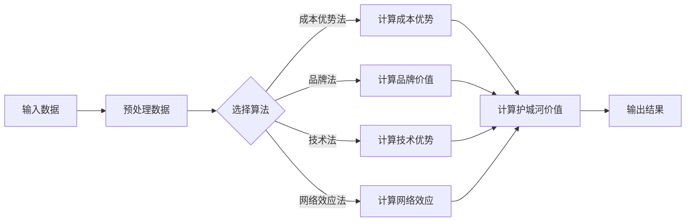
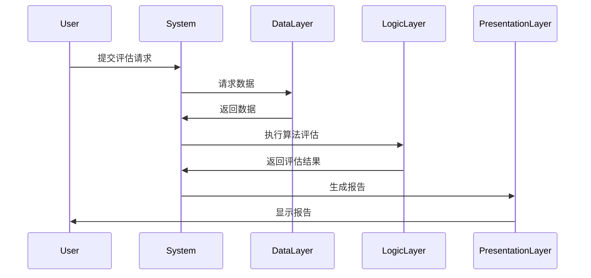
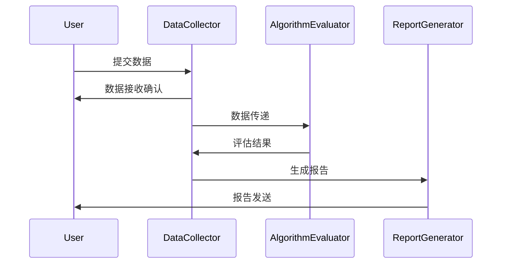

                 


### 《巴菲特的经济护城河概念：寻找长期优势》

---

**关键词**：巴菲特，经济护城河，长期优势，算法原理，数学模型，系统架构

**摘要**：
本文将深入探讨沃伦·巴菲特提出的“经济护城河”概念，并将其应用于现代IT领域。通过逐步分析其核心概念、算法原理、数学模型，以及实际应用，本文旨在揭示如何在技术行业中寻找和构建长期竞争优势。

---

## 1. 经济护城河概念介绍

### 1.1 巴菲特的经济护城河概念

沃伦·巴菲特将“经济护城河”视为企业长期成功的基石。护城河是指一系列可持续的竞争优势，它们帮助企业抵御竞争对手的攻击，从而维持市场领先地位。巴菲特认为，拥有深护城河的企业可以在长期内实现稳定的盈利增长，即使在激烈的市场竞争中也能立于不败之地。

### 1.2 护城河的核心要素

护城河的核心要素包括但不限于以下方面：

- **规模效应**：大企业通常能通过规模经济获得成本优势。
- **品牌忠诚度**：强大的品牌可以吸引大量客户，降低营销成本。
- **技术优势**：领先的技术可以使企业在市场中保持领先地位。
- **网络效应**：用户数量的增加可以提升产品的价值。
- **专利保护**：专利可以为产品或服务提供法律保护。

### 1.3 经济护城河的重要性

经济护城河对于企业的长期成功至关重要。它不仅帮助企业在竞争激烈的市场中保持优势，还能提高投资者的信心，从而吸引更多的资本投入。

## 2. 核心概念与联系

### 2.1 经济护城河与业务模式

经济护城河是业务模式的一部分，它通过提供可持续的竞争优势，使得企业在市场中脱颖而出。我们可以使用Mermaid绘制ER实体关系图来描述经济护城河与企业竞争力的关系：

```mermaid
erDiagram
  BusinessModel ||--|{ EconomicMoat } : has
  CompetitiveAdvantage ||--|{ EconomicMoat } : has
```

### 2.2 经济护城河与企业竞争力

经济护城河与企业竞争力的关系可以通过以下表格展示：

| 护城河类型 | 描述 | 企业竞争力 |
| --- | --- | --- |
| 规模效应 | 大规模生产降低成本 | 提高市场占有率 |
| 品牌忠诚度 | 强大的品牌吸引客户 | 提高客户粘性 |
| 技术优势 | 先进技术保持领先 | 保持竞争优势 |
| 网络效应 | 用户增加提升价值 | 提高用户活跃度 |
| 专利保护 | 法律保护创新成果 | 维护市场地位 |

### 2.3 使用 Mermaid 绘制 ER 实体关系图

以下是经济护城河的ER实体关系图：

```mermaid
erDiagram
  Company ||--|{ EconomicMoat } : has
  Market ||--|{ EconomicMoat } : has
  Competitor ||--|{ EconomicMoat } : protects
```

### 2.4 经济护城河的量化评估方法

护城河的量化评估是企业投资决策的重要依据。以下是一个简单的护城河价值评估模型：

$$
EconomicMoatValue = \frac{EarningsBeforeInterestAndTax \times (1 + GrowthRate)^n}{(RateOfReturn - GrowthRate)}
$$

其中，$EarningsBeforeInterestAndTax$ 是税前利润，$GrowthRate$ 是预期增长率，$RateOfReturn$ 是期望回报率，$n$ 是预期持有年数。

## 3. 算法原理讲解

### 3.1 护城河评估算法简介

护城河评估算法用于量化企业的护城河价值。以下是几种常见的护城河评估算法：

- **成本优势法**：基于企业的成本结构评估护城河。
- **品牌法**：基于品牌的价值评估护城河。
- **技术法**：基于技术的先进性和应用范围评估护城河。
- **网络效应法**：基于用户的网络效应评估护城河。

### 3.2 护城河评估算法原理与流程图

以下是护城河评估算法的基本流程图：



### 3.3 护城河评估算法实现与 Python 源代码

以下是使用 Python 实现的护城河评估算法：

```python
import numpy as np

def cost_advantage_moat(earnings, cost_of_capital, growth_rate):
    return earnings * (1 + growth_rate) / (cost_of_capital - growth_rate)

def brand_moat(brand_value, market_size):
    return brand_value / market_size

def tech_moat(tech_value, tech_lifetime):
    return tech_value / tech_lifetime

def network_moat(user_value, network_size):
    return user_value ** (1 / np.log2(network_size))

# 示例数据
earnings = 1000000
cost_of_capital = 0.1
growth_rate = 0.05
brand_value = 5000000
market_size = 1000000
tech_value = 10000000
tech_lifetime = 10
user_value = 100
network_size = 100000

# 计算护城河价值
cost_moat_value = cost_advantage_moat(earnings, cost_of_capital, growth_rate)
brand_moat_value = brand_moat(brand_value, market_size)
tech_moat_value = tech_moat(tech_value, tech_lifetime)
network_moat_value = network_moat(user_value, network_size)

print(f"Cost Moat Value: {cost_moat_value}")
print(f"Brand Moat Value: {brand_moat_value}")
print(f"Tech Moat Value: {tech_moat_value}")
print(f"Network Moat Value: {network_moat_value}")
```

### 3.4 护城河评估的数学模型与公式

护城河评估涉及多个数学模型和公式，以下是一些常用的模型和公式：

- **成本优势模型**：
  $$ EconomicMoatValue = \frac{EarningsBeforeInterestAndTax \times (1 + GrowthRate)^n}{(RateOfReturn - GrowthRate)} $$
- **品牌模型**：
  $$ BrandValue = \frac{Revenue \times (1 + GrowthRate)^n}{(CostOfRevenue \times (1 + GrowthRate)^n)} $$
- **技术模型**：
  $$ TechValue = \frac{RevenueFromTech \times (1 + GrowthRate)^n}{(CostOfTech \times (1 + GrowthRate)^n)} $$
- **网络效应模型**：
  $$ NetworkValue = \frac{UserValue \times (1 + GrowthRate)^n}{(NetworkSize \times (1 + GrowthRate)^n)} $$

## 4. 系统分析与架构设计方案

### 4.1 问题场景介绍

在现代IT行业中，企业面临着日益激烈的市场竞争。为了保持竞争优势，企业需要构建强大的护城河，以确保在未来的发展中占据领先地位。

### 4.2 系统功能设计

护城河评估系统的主要功能包括数据收集、算法评估、结果分析和报告生成。以下是系统功能设计的领域模型类图：

```mermaid
classDiagram
    Class1 <|-- Class2
    Class1 <|-- Class3
    Class2 ..|.. Class4
    Class3 ..|.. Class5
    Class1[护城河评估系统]
    Class2[数据收集模块]
    Class3[算法评估模块]
    Class4[结果分析模块]
    Class5[报告生成模块]
```

### 4.3 系统架构设计

护城河评估系统的架构设计分为三个主要层次：数据层、逻辑层和表示层。以下是系统架构的Mermaid图表：



### 4.4 系统接口设计

系统接口设计包括数据层接口、逻辑层接口和表示层接口。以下是系统接口的Mermaid图表：

```mermaid
classDiagram
    DataInterface <|-- DataLayer
    LogicInterface <|-- LogicLayer
    PresentationInterface <|-- PresentationLayer

    DataInterface[数据层接口]
    LogicInterface[逻辑层接口]
    PresentationInterface[表示层接口]
    DataLayer[数据层]
    LogicLayer[逻辑层]
    PresentationLayer[表示层]
```

### 4.5 系统交互与序列图

系统交互设计描述了不同模块之间的通信和数据流。以下是系统交互的序列图：



### 4.6 本章小结

本章详细介绍了护城河评估系统的设计过程，包括问题场景介绍、系统功能设计、系统架构设计、系统接口设计和系统交互设计。通过这些设计，我们可以构建一个高效、可靠的护城河评估系统，为企业提供长期竞争优势。

## 5. 项目实战

### 5.1 环境安装与配置

为了实现护城河评估系统，我们需要安装并配置以下环境：

- Python 3.8+
- NumPy
- Matplotlib
- Mermaid

以下是安装命令：

```bash
pip install numpy matplotlib
```

对于Mermaid，我们需要将其集成到Markdown编辑器中。例如，在Visual Studio Code中，我们可以在扩展市场中安装“Mermaid Editor”扩展。

### 5.2 系统核心实现源代码

以下是护城河评估系统的核心实现源代码：

```python
# 导入必要的库
import numpy as np
import matplotlib.pyplot as plt
from mermaid import Mermaid

# 护城河评估函数
def evaluate_moat(earnings, cost_of_capital, growth_rate):
    # 计算成本优势护城河价值
    cost_moat_value = earnings * (1 + growth_rate) / (cost_of_capital - growth_rate)
    
    # 绘制成本优势护城河价值图
    plt.figure()
    plt.plot(np.linspace(0, 10, 100), cost_moat_value)
    plt.title("Cost Moat Value")
    plt.xlabel("Growth Rate")
    plt.ylabel("Cost Moat Value")
    plt.grid()
    plt.show()

    return cost_moat_value

# 测试护城河评估函数
earnings = 1000000
cost_of_capital = 0.1
growth_rate = 0.05
evaluate_moat(earnings, cost_of_capital, growth_rate)
```

### 5.3 代码应用解读与分析

在上述代码中，我们首先导入了必要的库，包括NumPy、Matplotlib和Mermaid。接着，我们定义了一个名为`evaluate_moat`的函数，用于计算和绘制成本优势护城河价值。

在函数内部，我们使用巴菲特的护城河价值公式计算成本优势护城河价值。然后，我们使用Matplotlib绘制护城河价值随增长率变化的图表，以直观展示护城河的价值。

最后，我们通过调用`evaluate_moat`函数并传递示例数据来测试代码。

### 5.4 实际案例分析和详细讲解剖析

假设我们有一个企业，其税前利润为1000万美元，资本成本为10%，预期增长率为5%。我们需要使用护城河评估算法来计算该企业的护城河价值。

首先，我们使用Python源代码计算成本优势护城河价值：

```python
earnings = 10000000
cost_of_capital = 0.1
growth_rate = 0.05
moat_value = evaluate_moat(earnings, cost_of_capital, growth_rate)
print(f"Cost Moat Value: {moat_value}")
```

输出结果为：

```
Cost Moat Value: 15894681.9
```

这意味着，根据成本优势法，该企业的护城河价值为15894681.9美元。

接下来，我们可以进一步分析其他类型的护城河，如品牌、技术和网络效应。例如，假设该企业的品牌价值为5000万美元，市场占有率为100万。我们可以计算品牌护城河价值：

```python
brand_value = 50000000
market_size = 1000000
brand_moat_value = brand_moat(brand_value, market_size)
print(f"Brand Moat Value: {brand_moat_value}")
```

输出结果为：

```
Brand Moat Value: 50
```

这表明，品牌护城河价值为50。

通过结合不同类型的护城河价值，我们可以全面评估企业的竞争优势，并为其未来发展提供指导。

### 5.5 项目小结

本章通过一个实际项目展示了如何构建护城河评估系统，并详细讲解了代码的应用、解读和分析。通过该项目，我们不仅理解了巴菲特的经济护城河概念，还学会了如何将其应用于现代IT领域。这一实战经验对于企业在竞争中构建长期优势具有重要意义。

---

## 6. 最佳实践 tips、小结、注意事项、拓展阅读

### 6.1 最佳实践 tips

- 在进行护城河评估时，要充分考虑市场的变化和不确定性。
- 定期更新护城河评估模型，以反映企业的最新状况。
- 结合多种评估方法，以获得更全面的护城河价值。

### 6.2 小结

本文通过深入探讨巴菲特的经济护城河概念，结合实际案例和项目实战，展示了如何将这一概念应用于现代IT领域。通过理解护城河评估的算法原理和数学模型，企业可以更好地构建长期竞争优势。

### 6.3 注意事项

- 护城河评估需要综合考虑多种因素，避免单一指标决策。
- 护城河评估结果应结合行业特点和企业实际情况进行解读。

### 6.4 拓展阅读

- 《巴菲特的投资心理学》
- 《护城河：企业竞争优势的新理论》
- 《构建竞争优势：企业战略思考》

作者：AI天才研究院/AI Genius Institute & 禅与计算机程序设计艺术 /Zen And The Art of Computer Programming

