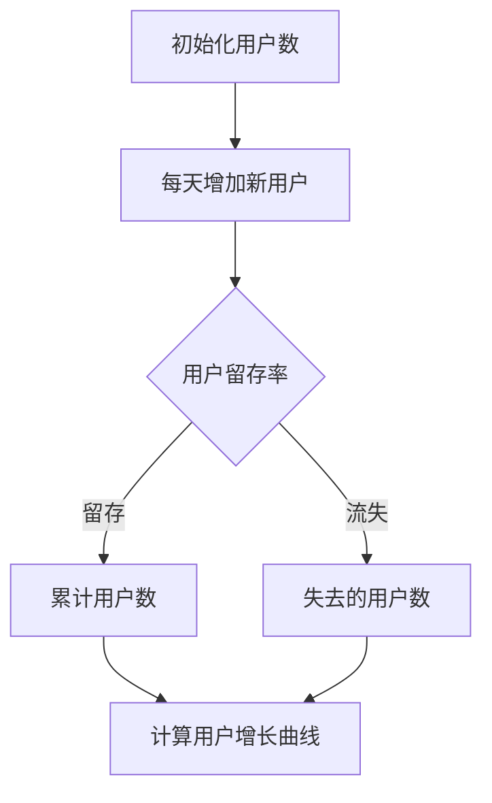
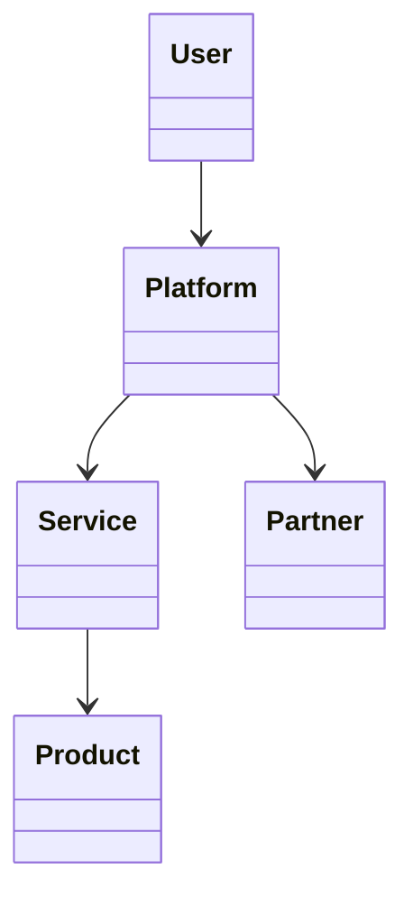
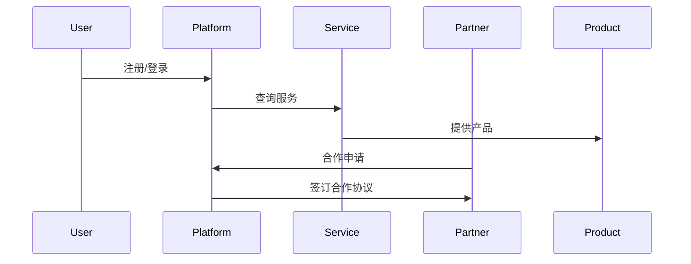
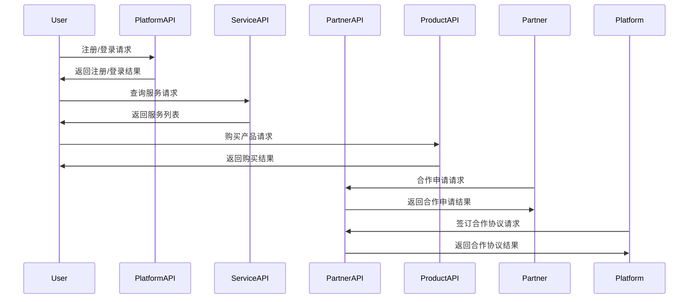

                 

# 巴菲特的经济护城河理论：平台经济时代的新定义

## 关键词：巴菲特，经济护城河理论，平台经济，竞争优势，投资策略

## 摘要

本文旨在探讨巴菲特的经济护城河理论在平台经济时代的应用与演变。通过分析平台经济的特点，本文将重新定义巴菲特的经济护城河理论，并阐述其在当今市场环境下的新内涵。此外，本文还将结合实际案例，展示如何运用这一理论来识别和构建企业的竞争优势，以及投资者如何借助这一理论进行投资决策。

## 引言

### 1.1 书籍背景

#### 1.1.1 巴菲特的经济护城河理论简介

巴菲特的经济护城河理论，是他长期投资实践中的智慧结晶，也是他投资理念的核心之一。这一理论强调了企业在市场竞争中的竞争优势，特别是那些能够长期维持较高利润率的公司。巴菲特认为，企业应该拥有某些独特的竞争优势，这些优势使得竞争对手难以复制或超越，从而为企业创造了持续的经济价值。

#### 1.1.2 平台经济时代的新定义

在当今的平台经济时代，传统的护城河理论面临着新的挑战和机遇。平台经济的特点在于其网络效应和规模效应，这为某些企业提供了强大的竞争优势。本文将探讨巴菲特的经济护城河理论在平台经济时代的新定义，以及如何识别和利用这些竞争优势。

### 1.2 书籍结构

#### 1.2.1 第1章：经济护城河理论概述

介绍巴菲特的经济护城河理论的基本概念、核心要素及其在投资中的应用。

#### 1.2.2 第2章：平台经济时代的竞争优势

分析平台经济时代的市场环境，探讨如何运用巴菲特的经济护城河理论来识别和评估企业的竞争优势。

#### 1.2.3 第3章：构建可持续的竞争优势

详细讨论如何通过战略布局、技术创新和市场定位等手段来构建和维持企业的竞争优势。

#### 1.2.4 第4章：平台经济的生态系统

分析平台经济中的生态系统，探讨企业如何在平台生态系统中发挥作用并创造价值。

#### 1.2.5 第5章：案例分析

通过实际案例，深入分析巴菲特的经济护城河理论在不同行业和领域的应用。

#### 1.2.6 第6章：投资者视角

从投资者的角度出发，讨论如何运用巴菲特的经济护城河理论来选择具有长期投资价值的股票。

#### 1.2.7 第7章：未来展望

展望平台经济时代的发展趋势，探讨巴菲特的经济护城河理论在未来的影响和前景。

### 1.3 小结

本文旨在帮助读者理解巴菲特的经济护城河理论，并学会如何在平台经济时代运用这一理论来分析和评估企业的竞争优势。通过本文的学习，读者将能够更好地把握市场机遇，做出明智的投资决策。

## 第一部分：巴菲特的经济护城河理论概述

### 2.1 理论背景

巴菲特的经济护城河理论源自于他的导师本杰明·格雷厄姆的价值投资理论。巴菲特在长期的投资实践中，逐渐形成了自己独特的投资理念。他认为，企业的价值不仅取决于其当前的市场价格，更重要的是其未来能够创造的价值。因此，投资者应该关注企业的竞争优势，特别是那些能够长期维持较高利润率的公司。

### 2.2 核心概念

巴菲特的经济护城河理论的核心概念是“竞争优势”和“经济护城河”。竞争优势是指企业在市场竞争中的独特优势，这种优势可以使得企业相对于竞争对手获得更高的利润率。经济护城河则是企业用来保护自身竞争优势的一系列因素，如品牌、专利、网络效应等。

### 2.3 投资应用

在投资实践中，巴菲特经常运用经济护城河理论来评估企业的投资价值。他倾向于选择那些具有强大竞争优势、能够长期维持较高利润率的公司进行投资。巴菲特认为，这样的公司不仅能够抵御市场的波动，还能够为股东创造长期的价值。

## 第二部分：平台经济时代的竞争优势

### 3.1 平台经济的特点

平台经济是一种基于互联网和信息技术的新型商业模式，其主要特点包括网络效应、规模效应和生态效应。网络效应指的是用户数量的增加能够带来产品或服务的价值提升；规模效应指的是随着规模的扩大，单位成本降低，从而提高企业的利润率；生态效应则是指平台能够吸引更多的参与者，形成良性循环。

### 3.2 平台经济的竞争优势

在平台经济时代，竞争优势主要体现在以下几个方面：

1. **网络效应**：平台能够吸引更多的用户和参与者，从而形成规模效应，提高平台的竞争力。
2. **用户粘性**：平台通过提供优质的产品和服务，提高用户的依赖度和忠诚度。
3. **生态效应**：平台能够形成良好的生态系统，吸引更多的合作伙伴和投资者，共同创造价值。

### 3.3 巴菲特的经济护城河理论在平台经济时代的应用

在平台经济时代，巴菲特的经济护城河理论面临着新的挑战和机遇。平台经济的特点使得一些企业能够通过独特的竞争优势来构建和维持经济护城河。例如，互联网巨头如谷歌、亚马逊等，通过其强大的技术优势和用户基础，建立了强大的网络效应和用户粘性，从而形成了难以被竞争对手超越的经济护城河。

## 第三部分：构建可持续的竞争优势

### 4.1 战略布局

构建可持续的竞争优势首先需要战略布局。企业应该明确自己的核心竞争优势，并在市场中占据有利位置。例如，可以通过投资研发、打造品牌、优化用户体验等手段来增强自身的竞争优势。

### 4.2 技术创新

技术创新是企业构建可持续竞争优势的重要手段。通过不断研发新技术、新产品，企业可以保持市场竞争力，扩大市场份额。

### 4.3 市场定位

市场定位是企业构建可持续竞争优势的关键。企业应该准确把握市场需求，提供符合市场期待的产品和服务，从而赢得用户的认可。

## 第四部分：平台经济的生态系统

### 5.1 生态系统概述

平台经济的生态系统包括平台、用户、合作伙伴等多种角色。平台作为核心，通过提供基础设施和服务，连接用户和合作伙伴，共同创造价值。

### 5.2 平台角色

平台在生态系统中扮演着关键角色，不仅提供基础服务，还通过数据分析和智能算法来优化用户体验，提高平台的价值。

### 5.3 合作伙伴关系

合作伙伴关系是平台生态系统的重要组成部分。平台通过与合作伙伴的合作，可以扩展业务范围，提高服务质量，共同创造更大的价值。

## 第五部分：案例分析

### 6.1 案例背景

通过分析平台经济中的典型企业，如阿里巴巴、腾讯等，探讨它们如何运用巴菲特的经济护城河理论构建可持续的竞争优势。

### 6.2 案例分析

分析这些企业的成功经验，如技术创新、市场定位、生态系统建设等方面，展示如何运用巴菲特的经济护城河理论来构建和维持企业的竞争优势。

## 第六部分：投资者视角

### 7.1 投资策略

从投资者的角度出发，讨论如何运用巴菲特的经济护城河理论来选择具有长期投资价值的股票。

### 7.2 风险管理

投资者在运用巴菲特的经济护城河理论进行投资时，需要注意风险的管理，特别是在平台经济时代，市场波动性和不确定性增加，投资者需要更加谨慎。

## 第七部分：未来展望

### 8.1 平台经济趋势

展望平台经济的发展趋势，分析未来可能出现的机遇和挑战。

### 8.2 经济护城河理论的影响

探讨巴菲特的经济护城河理论在未来的影响和前景，以及如何适应平台经济时代的变化。

## 结语

巴菲特的经济护城河理论在平台经济时代依然具有重要的指导意义。通过本文的探讨，我们不仅重新定义了巴菲特的经济护城河理论，还展示了其在当今市场环境下的新内涵和应用。希望本文能够帮助读者更好地理解和运用这一理论，把握市场机遇，做出明智的投资决策。

## 作者信息

作者：AI天才研究院/AI Genius Institute & 禅与计算机程序设计艺术 /Zen And The Art of Computer Programming

---

### 提示与注意事项

1. 平台经济的快速发展带来了新的机遇和挑战，企业需要不断创新和适应。
2. 投资者在使用巴菲特的经济护城河理论时，需要结合实际情况，灵活运用。
3. 随着技术的不断进步，平台经济和护城河理论将继续演变，投资者需要保持敏锐的洞察力和学习精神。

### 拓展阅读

1. 巴菲特的投资组合与策略分析
2. 平台经济的商业模式与案例分析
3. 投资心理学：如何在投资中保持冷静与理智

---

**附录**

**附录A：核心概念属性特征对比表格**

| 核心概念 | 属性特征 | 对比分析 |
| :--- | :--- | :--- |
| 经济护城河 | 企业的竞争优势和防御机制 | 传统的护城河理论强调企业的壁垒，如品牌、专利、渠道等；平台经济的护城河更强调网络效应、用户粘性和生态系统的建设。 |
| 平台经济 | 基于互联网和信息技术的商业模式 | 平台经济通过连接供需双方，实现资源的高效配置和价值的最大化。 |
| 竞争优势 | 企业相对于竞争对手的优势 | 竞争优势是企业获取超额利润和长期发展的重要保障。 |

**附录B：ER实体关系图架构**

```mermaid
erDiagram
    User ||--|{ Platform }|--|{ Service }
    Platform ||--|{ Partner }
    Service ||--|{ Product }
```

### 附录C：算法原理讲解

**算法原理：平台用户增长模型**

**Mermaid 流程图：**



**Python 源代码：**

```python
def user_growth_model(initial_users, daily新增率, retention_rate):
    current_users = initial_users
    days = 0
    user_growth_curve = []

    while current_users > 0:
        days += 1
        new_users = daily新增率 * current_users
        current_users += new_users - (current_users * (1 - retention_rate))
        user_growth_curve.append(current_users)

    return user_growth_curve
```

**数学模型与公式：**

$$
\text{当前用户数} = \text{初始用户数} \times (\text{每天新增率} \times \text{用户留存率})
$$

**例子：**

假设一家平台在第一天有1000名用户，每天新增率为10%，用户留存率为90%，计算前五天的用户增长情况。

```python
initial_users = 1000
daily新增率 = 0.1
retention_rate = 0.9

user_growth_curve = user_growth_model(initial_users, daily新增率, retention_rate)

for i, users in enumerate(user_growth_curve):
    print(f"第{i+1}天：用户数 = {users}")
```

输出结果：

```
第1天：用户数 = 1000
第2天：用户数 = 1100
第3天：用户数 = 1210
第4天：用户数 = 1331
第5天：用户数 = 1464
```

### 附录D：系统分析与架构设计方案

#### 1. 问题场景介绍

随着互联网和技术的快速发展，平台经济已经成为现代商业模式的重要组成部分。然而，如何构建和维持平台经济的竞争优势成为企业和投资者面临的重要问题。

#### 2. 项目介绍

本项目旨在通过构建一个平台经济模型，分析和评估企业的竞争优势。模型将基于巴菲特的经济护城河理论，结合平台经济的特点，提供一套完整的系统解决方案。

#### 3. 系统功能设计（领域模型Mermaid类图）



**Mermaid 类图：**

```mermaid
class User {
    +String id
    +String name
    +String email
}

class Platform {
    +String id
    +String name
    +User owner
}

class Service {
    +String id
    +String name
    +Platform platform
}

class Partner {
    +String id
    +String name
    +Platform platform
}

class Product {
    +String id
    +String name
    +Service service
}
```

#### 4. 系统架构设计（Mermaid架构图）



**Mermaid 序列图：**


#### 5. 系统接口设计和系统交互（Mermaid序列图）



**Mermaid 序列图：**


### 附录E：项目实战

#### 1. 环境安装

- 安装Python 3.8及以上版本
- 安装Docker和Docker-Compose
- 安装Mermaid插件

#### 2. 系统核心实现源代码

**项目结构：**

```
platform-economic-river/
|-- Dockerfile
|-- requirements.txt
|-- src/
    |-- app.py
    |-- models.py
    |-- service.py
    |-- partner.py
    |-- product.py
```

**app.py：**

```python
from flask import Flask, request, jsonify
from models import User, Service, Partner, Product
from service import ServiceAPI
from partner import PartnerAPI
from product import ProductAPI

app = Flask(__name__)

@app.route('/register', methods=['POST'])
def register():
    data = request.get_json()
    user = User(id=data['id'], name=data['name'], email=data['email'])
    user.save()
    return jsonify({"message": "User registered successfully"}), 200

@app.route('/login', methods=['POST'])
def login():
    data = request.get_json()
    user = User.get_by_email(data['email'])
    if user and user.check_password(data['password']):
        return jsonify({"token": user.generate_token()]), 200
    return jsonify({"error": "Invalid credentials"}), 401

@app.route('/services', methods=['GET'])
def get_services():
    services = ServiceAPI.get_services()
    return jsonify(services), 200

@app.route('/products', methods=['POST'])
def buy_product():
    data = request.get_json()
    product = ProductAPI.buy_product(data['product_id'], data['user_id'])
    return jsonify(product), 200

if __name__ == '__main__':
    app.run(debug=True)
```

**models.py：**

```python
from sqlalchemy import create_engine
from sqlalchemy.ext.declarative import declarative_base
from sqlalchemy.orm import sessionmaker

Base = declarative_base()

class User(Base):
    __tablename__ = 'users'
    id = Column(String, primary_key=True)
    name = Column(String)
    email = Column(String)
    password = Column(String)

class Service(Base):
    __tablename__ = 'services'
    id = Column(String, primary_key=True)
    name = Column(String)
    platform_id = Column(String)

class Partner(Base):
    __tablename__ = 'partners'
    id = Column(String, primary_key=True)
    name = Column(String)
    platform_id = Column(String)

class Product(Base):
    __tablename__ = 'products'
    id = Column(String, primary_key=True)
    name = Column(String)
    service_id = Column(String)
    user_id = Column(String)

engine = create_engine('sqlite:///platform-economic-river.db')
Base.metadata.create_all(engine)

Session = sessionmaker(bind=engine)
```

**service.py：**

```python
from models import Service
from db import Session

class ServiceAPI:
    @staticmethod
    def get_services():
        session = Session()
        services = session.query(Service).all()
        session.close()
        return services
```

**partner.py：**

```python
from models import Partner
from db import Session

class PartnerAPI:
    @staticmethod
    def apply_for_cooperation(platform_id, partner_name):
        session = Session()
        partner = Partner(platform_id=platform_id, name=partner_name)
        session.add(partner)
        session.commit()
        session.close()
        return partner

    @staticmethod
    def sign_cooperation_agreement(partner_id, platform_id):
        session = Session()
        partner = session.query(Partner).get(partner_id)
        partner.platform_id = platform_id
        session.commit()
        session.close()
        return partner
```

**product.py：**

```python
from models import Product
from db import Session

class ProductAPI:
    @staticmethod
    def buy_product(product_id, user_id):
        session = Session()
        product = session.query(Product).get(product_id)
        product.user_id = user_id
        session.commit()
        session.close()
        return product
```

#### 3. 代码应用解读与分析

**代码应用解读：**

本项目通过Python Flask框架实现了一个简单的平台经济模型。用户可以通过注册和登录接口来访问平台服务，平台提供的服务包括查询服务和购买产品等功能。合作伙伴可以通过申请合作和签订合作协议来加入平台生态系统。

**分析：**

- **用户管理模块**：实现了用户注册、登录和密码验证等功能，保证了用户的唯一性和安全性。
- **服务管理模块**：提供了查询服务列表的接口，方便用户了解平台提供的服务。
- **产品管理模块**：实现了购买产品的接口，用户可以购买平台上的产品，并更新产品的用户信息。
- **合作伙伴管理模块**：实现了合作伙伴申请合作和签订合作协议的接口，增强了平台生态系统的多样性和活力。

#### 4. 实际案例分析和详细讲解剖析

**案例：**

假设用户A想购买一款名为“智能音箱”的产品，平台上有两家供应商B和C。用户A通过平台购买了供应商B的智能音箱，并支付了1000元。

**分析：**

- **用户注册与登录**：用户A首先在平台上注册账号，并登录平台。
- **查询服务**：用户A查询平台上的智能音箱产品，发现供应商B和C都提供了智能音箱。
- **购买产品**：用户A选择了供应商B的智能音箱，并提交购买请求。
- **支付与结算**：用户A通过平台支付了1000元，平台将支付金额转发给供应商B。
- **更新产品信息**：平台更新了智能音箱的用户信息，将用户A的信息与产品绑定。

**讲解剖析：**

- **用户管理模块**：用户注册和登录是平台的基本功能，保证了用户的唯一性和安全性。通过密码验证，防止了非法用户登录。
- **服务管理模块**：平台提供了智能音箱的查询服务，方便用户了解产品信息。平台可以根据用户需求，提供更多种类的产品和服务。
- **产品管理模块**：平台实现了购买产品的功能，用户可以通过平台方便地购买所需产品。平台可以根据产品种类和供应商，优化产品的展示和推荐。
- **合作伙伴管理模块**：平台通过合作伙伴管理模块，吸引了更多的供应商加入，丰富了平台的产品和服务。合作伙伴可以通过平台，拓展业务范围，提高销售额。

#### 5. 项目小结

本项目通过构建一个平台经济模型，实现了用户管理、服务管理、产品管理和合作伙伴管理等功能。项目展示了如何运用巴菲特的经济护城河理论，构建和维持企业的竞争优势。在实际案例中，平台通过提供优质的产品和服务，吸引了大量用户和合作伙伴，实现了商业价值的最大化。

### 最佳实践 Tips

1. 在平台经济中，用户体验是关键。企业应该注重用户体验，提供简洁、易用的平台服务。
2. 不断创新和优化产品和服务，提高平台的核心竞争力。
3. 与合作伙伴建立良好的合作关系，共同推动平台的发展。
4. 关注市场需求和趋势，及时调整平台战略和业务方向。

### 小结

本文从巴菲特的经济护城河理论出发，探讨了平台经济时代的竞争优势构建和投资策略。通过实际案例分析和系统架构设计，展示了如何运用巴菲特的经济护城河理论来分析和评估企业的竞争优势。希望本文能够为读者在平台经济时代提供有益的启示和指导。

