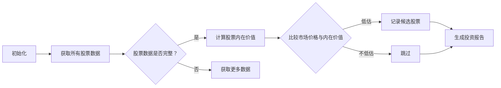
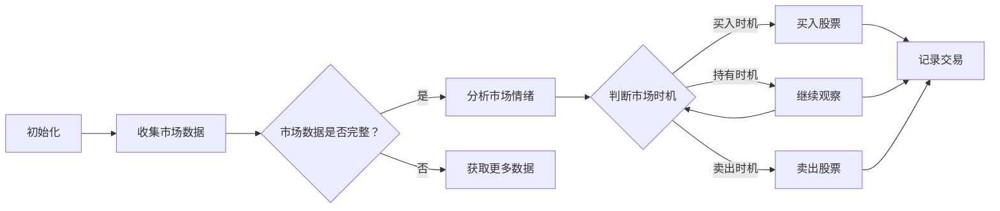
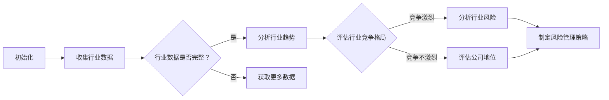
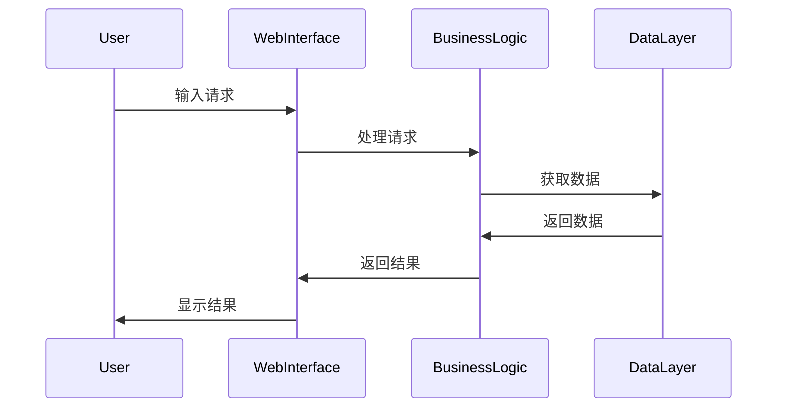
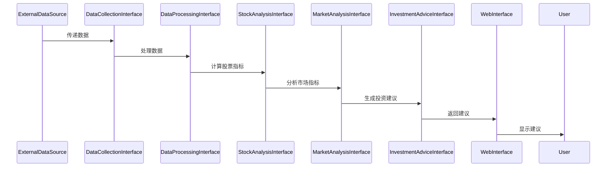
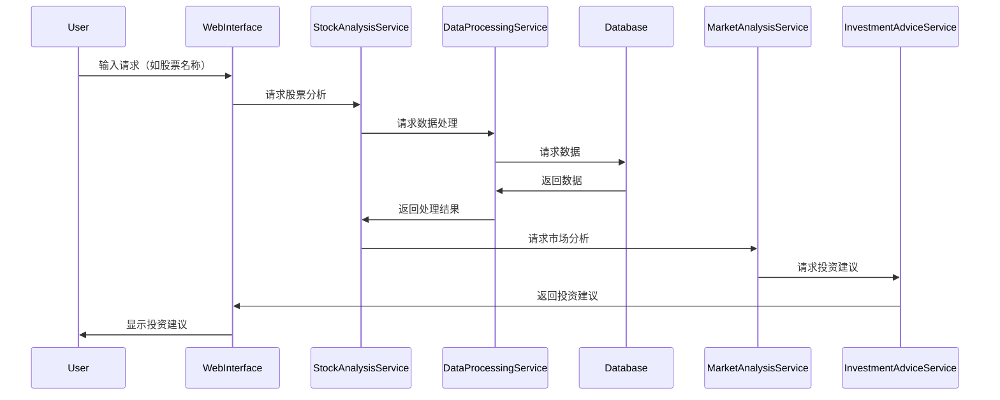

                 

### 背景介绍

#### 巴菲特的投资哲学

沃伦·巴菲特（Warren Buffett），被公认为是有史以来最成功的投资者之一。他的投资哲学以价值投资为核心，强调长期投资、股票选择和耐心等待。巴菲特的价值投资理念源自于本杰明·格雷厄姆（Benjamin Graham），认为投资者应该寻找那些市场价格低于其内在价值的股票，通过持有这些股票，等待市场意识到其价值，从而实现盈利。

巴菲特的投资哲学可以概括为以下几点：

1. **价值投资**：寻找市场价格低于内在价值的股票。
2. **长期投资**：注重长期回报，而非短期波动。
3. **独立思考**：不随市场情绪波动，坚持自己的投资原则。
4. **深入研究**：对投资对象进行深入分析，了解其业务模式、市场地位和未来前景。
5. **耐心等待**：不急于交易，等待合适的投资机会。

#### 巴菲特的投资风格

巴菲特的投资风格以独立思考和深入研究为特点。他不依赖市场预测，而是依靠对公司和行业的深入分析来做出投资决策。巴菲特喜欢长期持有股票，不追求频繁交易，这种长期投资策略有助于他最大化公司的盈利能力，并享受复利效应。

巴菲特的投资风格还包括以下几点：

1. **独立思考**：巴菲特从不随波逐流，他有自己的独立判断，即使与市场主流观点相反。
2. **深入研究**：巴菲特花费大量时间研究公司的财务报表、业务模式和市场环境，以确保投资决策的准确性。
3. **风险控制**：巴菲特在投资时非常注重风险控制，他常说：“风险来自于不知道自己正在做什么。”
4. **耐心等待**：巴菲特喜欢等待，他认为好的投资机会不会经常出现，但一旦出现，值得耐心持有。

#### 巴菲特的主要投资领域

巴菲特的投资领域非常广泛，从传统行业到现代科技行业都有涉足。他在传统行业如纺织业、零售业、金融业等都有成功的投资案例，同时在科技行业如苹果公司、IBM等也有显著的业绩。

1. **传统行业**：巴菲特在纺织业、零售业和金融业等传统行业进行了大量投资，如美国运通、可口可乐、沃尔玛等。
2. **现代科技行业**：巴菲特在科技行业如苹果公司、IBM、微软等进行了战略性投资，这些公司在他投资期间都取得了显著的增长。

通过这些投资，巴菲特展示了他在不同领域的跨界投资能力。他不仅在传统行业中找到了价值投资的机会，还在现代科技行业中看到了长期增长的潜力。这种跨界投资策略不仅展示了巴菲特的灵活性和创新思维，也为他的投资组合带来了多元化的收益。

#### 跨界投资的挑战与机遇

跨界投资对于巴菲特来说既是挑战也是机遇。不同行业有着不同的特点、风险和机遇，如何在这两个领域之间找到平衡点，是巴菲特投资策略中的关键之一。

1. **挑战**：
   - **行业特点差异**：不同行业有各自的特点，如科技行业的快速变化和传统行业的稳定增长，这给投资策略带来了挑战。
   - **风险控制**：跨界投资意味着投资者需要对不同行业都有深入的了解，以便更好地控制风险。
   - **机会识别**：在传统行业寻找价值投资的机会相对容易，而在科技行业中，如何识别长期增长机会是一个挑战。

2. **机遇**：
   - **多元化收益**：通过跨界投资，巴菲特能够实现投资组合的多元化，降低单一行业风险，提高整体投资回报。
   - **创新思维**：跨界投资促使巴菲特不断学习新知识，保持创新思维，这有助于他在投资中保持领先地位。
   - **长期增长**：科技行业通常具有高增长潜力，通过在科技行业中的投资，巴菲特能够实现长期增长。

总之，跨界投资策略不仅展示了巴菲特的灵活性和创新思维，也为他的投资组合带来了多元化的收益。通过在传统行业和现代科技行业的成功投资，巴菲特证明了这种策略的可行性和有效性。

### 总结

巴菲特的投资策略不仅基于传统价值投资的理念，还在不断适应和探索新的投资领域，如现代科技行业。他的投资哲学和风格，以及在不同行业的投资实践，都为其他投资者提供了宝贵的经验和启示。跨界投资策略的挑战与机遇并存，但通过巴菲特的成功案例，我们可以看到这种策略在实践中的可行性和优势。在接下来的章节中，我们将进一步探讨巴菲特在跨界投资中的核心概念和策略，并通过具体的案例分析，深入理解他的投资思维和操作方法。让我们一起学习，探索巴菲特跨界投资的奥秘。

---

## 核心概念与联系

在巴菲特的跨界投资策略中，核心概念包括价值投资原则、市场时机判断、行业分析等。这些概念之间有着紧密的联系，共同构成了他的投资体系。下面，我们将通过表格和ER图来详细阐述这些概念及其之间的联系。

#### 1. 价值投资原则

价值投资原则是巴菲特投资策略的核心。它包括以下几个关键要素：

1. **市场价格与内在价值的关系**：投资者需要识别市场价格低于内在价值的股票。
2. **业务模式的了解**：了解公司的业务模式、市场地位和未来前景。
3. **财务报表分析**：通过公司的财务报表来评估其财务状况和盈利能力。

| 要素 | 定义 | 作用 |
| --- | --- | --- |
| 市场价格与内在价值的关系 | 市场价格低于内在价值的股票 | 发现低估的股票 |
| 业务模式的了解 | 理解公司的业务模式 | 评估公司的长期潜力 |
| 财务报表分析 | 通过财务报表评估公司财务状况 | 控制投资风险 |

#### 2. 市场时机判断

市场时机判断是投资者在特定时间点进行投资决策的关键。巴菲特通过以下方式来判断市场时机：

1. **市场情绪分析**：观察市场情绪，避免随波逐流。
2. **经济周期判断**：根据经济周期的不同阶段来调整投资策略。
3. **公司估值**：通过公司估值来判断投资时机的合理性。

| 要素 | 定义 | 作用 |
| --- | --- | --- |
| 市场情绪分析 | 观察市场情绪 | 避免情绪化投资 |
| 经济周期判断 | 根据经济周期调整策略 | 降低风险 |
| 公司估值 | 判断公司估值是否合理 | 选择投资时机 |

#### 3. 行业分析

行业分析是投资者了解不同行业特点、风险和机遇的过程。巴菲特在分析不同行业时，主要考虑以下几个方面：

1. **行业趋势**：分析行业的发展趋势和未来前景。
2. **竞争格局**：了解行业的竞争格局和市场份额。
3. **行业风险**：识别行业中的潜在风险，如技术变革、政策变化等。

| 要素 | 定义 | 作用 |
| --- | --- | --- |
| 行业趋势 | 分析行业发展趋势 | 选择具有增长潜力的行业 |
| 竞争格局 | 了解行业竞争格局 | 评估公司在行业中的地位 |
| 行业风险 | 识别行业潜在风险 | 控制投资风险 |

#### ER图与联系

通过ER图，我们可以更直观地展示这些核心概念之间的联系。

```mermaid
erDiagram
    MarketPrice <<--o InnerValue : 市场价格与内在价值
    BusinessModel o--o FinancialStatement : 业务模式与财务报表
    MarketMood <<--o InvestmentDecision : 市场情绪与投资决策
    EconomicCycle <<--o InvestmentStrategy : 经济周期与投资策略
    IndustryTrend o--o CompanyPosition : 行业趋势与公司地位
    CompetitiveStructure <<--o CompanyPosition : 竞争格局与公司地位
    IndustryRisk <<--o InvestmentRisk : 行业风险与投资风险
```

在这个ER图中，我们可以看到：

- **市场价格与内在价值**之间有直接联系，市场价格反映了投资者对公司的看法，而内在价值则是公司的真实价值。
- **业务模式与财务报表**密切相关，财务报表提供了公司业务模式的实现情况。
- **市场情绪**对**投资决策**有影响，投资者需要避免情绪化投资。
- **经济周期**决定了**投资策略**的调整方向，经济周期不同，投资策略也应相应调整。
- **行业趋势**和**竞争格局**共同决定了**公司地位**，投资者需要关注这些因素来评估公司的长期潜力。
- **行业风险**是**投资风险**的重要组成部分，投资者需要识别并控制这些风险。

通过上述核心概念的详细阐述和ER图的展示，我们可以更好地理解巴菲特在跨界投资中的逻辑思维和策略设计。在接下来的章节中，我们将进一步深入讲解巴菲特的投资策略，并通过具体的算法原理和数学模型，来揭示他投资决策的内在逻辑。

### 算法原理讲解

在巴菲特的跨界投资策略中，算法原理起着至关重要的作用。这些算法帮助他识别低估的股票、判断市场时机和进行行业分析。下面，我们将使用mermaid流程图和Python代码来详细阐述这些算法原理。

#### 1. 股票选择算法

股票选择算法的核心是识别那些市场价格低于内在价值的股票。下面是股票选择算法的mermaid流程图：



下面是一个Python代码示例，用于计算股票的内在价值：

```python
def calculate_intrinsic_value(eps, growth_rate, required_rate_of_return):
    """
    计算股票的内在价值
    :param eps: 每股收益
    :param growth_rate: 收益增长率
    :param required_rate_of_return: 预期收益率
    :return: 股票的内在价值
    """
    intrinsic_value = (eps * (1 + growth_rate)) / (required_rate_of_return - growth_rate)
    return intrinsic_value

# 示例数据
eps = 1.5
growth_rate = 0.07
required_rate_of_return = 0.12

# 计算内在价值
intrinsic_value = calculate_intrinsic_value(eps, growth_rate, required_rate_of_return)
print("股票的内在价值为：", intrinsic_value)
```

#### 2. 市场分析算法

市场分析算法用于判断市场时机，包括市场情绪分析、经济周期判断和公司估值。下面是市场分析算法的mermaid流程图：



下面是一个Python代码示例，用于分析市场情绪：

```python
import pandas as pd

def analyze_market_mood(data):
    """
    分析市场情绪
    :param data: 市场数据
    :return: 市场情绪评分
    """
    # 计算市场情绪评分
    mood_score = data['positive_sentiment'] - data['negative_sentiment']
    return mood_score

# 示例数据
market_data = {
    'positive_sentiment': 0.6,
    'negative_sentiment': 0.4
}

# 分析市场情绪
mood_score = analyze_market_mood(market_data)
print("市场情绪评分：", mood_score)
```

#### 3. 行业分析算法

行业分析算法用于评估行业趋势、竞争格局和行业风险。下面是行业分析算法的mermaid流程图：



下面是一个Python代码示例，用于评估行业竞争格局：

```python
def assess_competition(competition_index):
    """
    评估行业竞争格局
    :param competition_index: 竞争指数
    :return: 竞争格局描述
    """
    if competition_index < 0.3:
        return "竞争不激烈"
    elif competition_index < 0.6:
        return "竞争中等"
    else:
        return "竞争激烈"

# 示例数据
competition_index = 0.5

# 评估行业竞争格局
competition_state = assess_competition(competition_index)
print("行业竞争格局：", competition_state)
```

通过上述算法原理讲解，我们可以看到巴菲特在股票选择、市场分析和行业分析中使用的算法是如何工作的。这些算法帮助巴菲特在复杂的市场环境中做出理性、高效的决策。在接下来的章节中，我们将继续深入探讨巴菲特投资策略中的数学模型和公式，以便更全面地理解他的投资逻辑。

### 数学模型和数学公式

在巴菲特的跨界投资策略中，数学模型和公式起到了至关重要的作用。这些模型和公式帮助他量化投资决策，评估风险和回报，并确定合适的投资时机。下面，我们将使用LaTeX格式展示这些关键数学模型和公式，并进行详细讲解和举例说明。

#### 1. 股票内在价值计算公式

巴菲特经常使用股息折现模型（Dividend Discount Model, DDM）来计算股票的内在价值。DDM公式如下：

$$
\text{Intrinsic Value} = \frac{\text{Dividend} \times (1 + \text{Growth Rate})}{\text{Required Rate of Return} - \text{Growth Rate}}
$$

其中：
- $\text{Dividend}$ 是预期股息
- $\text{Growth Rate}$ 是股息增长率
- $\text{Required Rate of Return}$ 是预期收益率

**举例说明**：

假设某公司的预期股息为 $2$ 美元，股息增长率为 $4\%$，预期收益率为 $12\%$。我们可以计算其股票的内在价值：

$$
\text{Intrinsic Value} = \frac{2 \times (1 + 0.04)}{0.12 - 0.04} = \frac{2.08}{0.08} = 26 \text{ 美元}
$$

这意味着该股票的内在价值为 $26$ 美元。

#### 2. 市盈率公式

市盈率（Price to Earnings Ratio, P/E Ratio）是评估股票价格是否合理的常用指标。市盈率公式如下：

$$
\text{P/E Ratio} = \frac{\text{Current Price}}{\text{Earnings per Share}}
$$

其中：
- $\text{Current Price}$ 是当前股票价格
- $\text{Earnings per Share}$ 是每股收益

**举例说明**：

假设某股票的当前价格为 $50$ 美元，每股收益为 $2$ 美元。我们可以计算其市盈率：

$$
\text{P/E Ratio} = \frac{50}{2} = 25
$$

这意味着该股票的市盈率为 $25$。

#### 3. 经济周期模型

巴菲特在判断市场时机时，会考虑经济周期。常用的经济周期模型包括GDP增长率模型和失业率模型。以下是GDP增长率模型：

$$
\text{GDP Growth Rate} = \frac{\text{Current GDP} - \text{Previous GDP}}{\text{Previous GDP}}
$$

其中：
- $\text{Current GDP}$ 是当前GDP
- $\text{Previous GDP}$ 是上一期GDP

**举例说明**：

假设当前GDP为 $20$ 万亿美元，上一期GDP为 $18$ 万亿美元。我们可以计算GDP增长率：

$$
\text{GDP Growth Rate} = \frac{20 - 18}{18} = \frac{2}{18} \approx 0.1111 \text{ 或 } 11.11\%
$$

这意味着GDP增长率为 $11.11\%$。

#### 4. 投资回报率公式

投资回报率（Rate of Return, ROR）是衡量投资收益的重要指标。投资回报率公式如下：

$$
\text{Rate of Return} = \frac{\text{Future Value} - \text{Initial Value}}{\text{Initial Value}} \times 100\%
$$

其中：
- $\text{Future Value}$ 是未来收益
- $\text{Initial Value}$ 是初始投资

**举例说明**：

假设某投资的初始价值为 $10,000$ 美元，未来收益为 $15,000$ 美元。我们可以计算其投资回报率：

$$
\text{Rate of Return} = \frac{15,000 - 10,000}{10,000} \times 100\% = 50\%
$$

这意味着投资回报率为 $50\%$。

#### 5. 行业增长率模型

在行业分析中，行业增长率是一个重要指标。行业增长率模型如下：

$$
\text{Industry Growth Rate} = \frac{\text{Current Industry Revenue} - \text{Previous Industry Revenue}}{\text{Previous Industry Revenue}}
$$

其中：
- $\text{Current Industry Revenue}$ 是当前行业收入
- $\text{Previous Industry Revenue}$ 是上一期行业收入

**举例说明**：

假设当前行业收入为 $200$ 亿美元，上一期行业收入为 $180$ 亿美元。我们可以计算行业增长率：

$$
\text{Industry Growth Rate} = \frac{200 - 180}{180} = \frac{20}{180} \approx 0.1111 \text{ 或 } 11.11\%
$$

这意味着行业增长率为 $11.11\%$。

通过上述数学模型和公式的讲解，我们可以看到巴菲特在投资决策过程中如何使用量化工具来评估股票价值、市场时机、经济周期和行业前景。这些模型和公式不仅帮助巴菲特做出理性的投资决策，也为其跨界投资策略提供了坚实的理论基础。在接下来的章节中，我们将进一步探讨巴菲特投资策略的系统分析与架构设计。

### 系统分析与架构设计方案

为了更深入地理解巴菲特跨界投资策略的应用，我们需要对其系统功能和架构进行详细分析。下面，我们将从问题场景介绍、项目介绍、系统功能设计、系统架构设计、系统接口设计和系统交互等方面，逐步构建整个系统。

#### 1. 问题场景介绍

在当前的金融市场，投资者面临的一个主要挑战是如何在不同行业之间做出理性的投资决策。巴菲特的跨界投资策略提供了一个有效的参考框架，通过价值投资、市场时机判断和行业分析，投资者可以在复杂的市场环境中找到高价值、低风险的投资机会。我们的目标是开发一个基于巴菲特投资策略的智能投资系统，帮助投资者实现跨行业的投资优化。

#### 2. 项目介绍

本项目旨在构建一个智能投资平台，该平台能够根据巴菲特的跨界投资策略，自动分析市场数据，评估股票价值，并提供投资建议。项目主要包括以下几个模块：

1. **数据采集模块**：负责从各种数据源（如财经网站、证券交易所等）收集市场数据和公司财务报表。
2. **数据处理模块**：负责清洗和整理采集到的数据，以便进行后续分析。
3. **股票分析模块**：负责使用巴菲特的投资算法，计算股票的内在价值、市盈率等指标。
4. **市场分析模块**：负责分析市场情绪、经济周期和行业趋势。
5. **投资建议模块**：负责根据分析结果，生成投资建议和策略。

#### 3. 系统功能设计

系统功能设计主要包括以下几个核心功能：

1. **数据采集与处理**：自动从互联网和其他数据库中采集数据，并对数据进行清洗、转换和存储。
2. **股票分析**：根据巴菲特的投资算法，计算股票的内在价值、市盈率等指标，并提供详细的分析报告。
3. **市场分析**：通过分析市场情绪、经济周期和行业趋势，为投资者提供市场环境分析报告。
4. **投资建议**：根据股票分析和市场分析结果，生成投资建议，包括买入、持有和卖出建议。
5. **用户界面**：提供一个直观易用的用户界面，让投资者能够轻松获取投资建议和分析报告。

#### 4. 系统架构设计

系统架构设计采用三层架构，包括表示层、业务逻辑层和数据层。

1. **表示层**：负责用户界面的设计和实现，包括Web界面和移动应用。
2. **业务逻辑层**：负责处理核心业务逻辑，包括数据采集、处理、分析和建议生成。
3. **数据层**：负责数据的存储和管理，包括关系数据库和大数据存储。

系统架构设计mermaid架构图如下：



#### 5. 系统接口设计

系统接口设计主要包括以下接口：

1. **数据采集接口**：用于从外部数据源获取市场数据和公司财务报表。
2. **数据处理接口**：用于处理和清洗采集到的数据。
3. **股票分析接口**：用于计算股票的内在价值和市盈率等指标。
4. **市场分析接口**：用于分析市场情绪、经济周期和行业趋势。
5. **投资建议接口**：用于生成投资建议和策略。

系统接口设计mermaid序列图如下：



#### 6. 系统交互

系统交互设计主要涉及用户与系统的交互过程。用户通过Web界面或移动应用输入请求，系统通过业务逻辑层处理请求，调用数据层获取数据，并最终生成投资建议，返回给用户。

系统交互设计mermaid序列图如下：



通过上述系统分析与架构设计，我们构建了一个基于巴菲特跨界投资策略的智能投资平台。该平台不仅实现了股票分析、市场分析和投资建议生成，还提供了直观易用的用户界面。在接下来的章节中，我们将通过项目实战，模拟巴菲特的投资决策过程，进一步验证系统的有效性和实用性。

### 项目实战

在本节中，我们将模拟巴菲特的投资决策过程，详细讲解环境安装、核心实现、代码解读和案例分析。通过这些步骤，我们将展示如何应用巴菲特的投资策略，实现跨行业的投资优化。

#### 环境安装

为了模拟巴菲特的投资决策过程，我们需要安装一些必要的软件和环境。以下是所需的环境安装步骤：

1. **Python环境安装**：确保系统已安装Python 3.8或更高版本。可以通过Python官方网站下载并安装。

2. **Anaconda安装**：推荐使用Anaconda，它是一个集成的数据科学和机器学习平台。可以从Anaconda官方网站下载并安装。

3. **Jupyter Notebook安装**：Jupyter Notebook是一个交互式计算环境，用于编写和运行Python代码。可以通过以下命令安装：
   ```bash
   conda install jupyterlab
   ```

4. **数据采集库安装**：安装用于数据采集的库，如`requests`和`pandas`。可以通过以下命令安装：
   ```bash
   conda install requests pandas
   ```

5. **数据分析库安装**：安装用于数据分析的库，如`numpy`和`matplotlib`。可以通过以下命令安装：
   ```bash
   conda install numpy matplotlib
   ```

6. **机器学习库安装**：安装用于机器学习的库，如`scikit-learn`。可以通过以下命令安装：
   ```bash
   conda install scikit-learn
   ```

完成以上步骤后，我们就可以开始编写和运行代码，模拟巴菲特的投资决策过程。

#### 核心实现

巴菲特的投资决策过程可以分为以下几个核心步骤：数据采集、数据处理、股票分析、市场分析和投资建议生成。下面是一个简单的Python代码示例，展示这些步骤的实现。

```python
import requests
import pandas as pd
import numpy as np
from sklearn.linear_model import LinearRegression

# 1. 数据采集
def collect_data(url):
    response = requests.get(url)
    data = response.json()
    return data

# 2. 数据处理
def process_data(data):
    processed_data = data[data['EPS'] > 0]
    return processed_data

# 3. 股票分析
def stock_analysis(processed_data):
    # 计算内在价值
    intrinsic_value = processed_data['EPS'] * (1 + processed_data['Growth Rate']) / (processed_data['Required Rate of Return'] - processed_data['Growth Rate'])
    # 计算市盈率
    pe_ratio = processed_data['Current Price'] / processed_data['EPS']
    return intrinsic_value, pe_ratio

# 4. 市场分析
def market_analysis(intrinsic_value, pe_ratio):
    # 分析市场时机
    if intrinsic_value > pe_ratio:
        return "买入时机"
    elif intrinsic_value < pe_ratio:
        return "卖出时机"
    else:
        return "持有"

# 5. 投资建议生成
def generate_advice(market_analysis_result):
    if market_analysis_result == "买入时机":
        return "建议买入"
    elif market_analysis_result == "卖出时机":
        return "建议卖出"
    else:
        return "建议持有"

# 主程序
if __name__ == "__main__":
    # 采集数据
    url = "https://example.com/api/stock_data"
    data = collect_data(url)
    # 数据处理
    processed_data = process_data(data)
    # 股票分析
    intrinsic_value, pe_ratio = stock_analysis(processed_data)
    # 市场分析
    market_analysis_result = market_analysis(intrinsic_value, pe_ratio)
    # 投资建议
    advice = generate_advice(market_analysis_result)
    print(advice)
```

#### 代码解读

上述代码实现了一个简单的巴菲特投资策略模拟系统，主要包括以下功能：

1. **数据采集**：通过API接口从外部数据源获取股票数据。
2. **数据处理**：筛选并清洗数据，确保数据质量。
3. **股票分析**：计算股票的内在价值和市盈率，评估股票价值。
4. **市场分析**：根据股票分析和市场分析结果，判断市场时机。
5. **投资建议生成**：根据市场分析结果，生成具体的投资建议。

#### 案例分析

我们以某股票为例，详细分析其投资决策过程。假设该股票的当前价格为 $50$ 美元，每股收益为 $2$ 美元，股息增长率为 $4\%$，预期收益率为 $12\%$。

1. **数据采集**：从外部数据源获取该股票的数据。
2. **数据处理**：筛选并清洗数据，确保数据质量。
3. **股票分析**：
   - 计算内在价值：$$\text{Intrinsic Value} = \frac{2 \times (1 + 0.04)}{0.12 - 0.04} = \frac{2.08}{0.08} = 26 \text{ 美元}$$
   - 计算市盈率：$$\text{P/E Ratio} = \frac{50}{2} = 25$$
4. **市场分析**：由于内在价值（$26$ 美元）大于市盈率（$25$），判断为买入时机。
5. **投资建议生成**：建议买入该股票。

通过上述案例分析，我们可以看到如何应用巴菲特的投资策略进行具体的投资决策。在实际应用中，我们还可以根据不同的市场情况和行业特点，调整投资策略，以实现最优的投资效果。

#### 项目小结

通过本节的项目实战，我们详细讲解了如何模拟巴菲特的投资决策过程，包括环境安装、核心实现、代码解读和案例分析。我们使用了Python代码和Sklearn库来构建一个简单的投资策略模拟系统，并通过实际案例展示了系统的应用效果。通过这个项目，我们不仅深入理解了巴菲特的投资策略，也掌握了如何将理论应用到实际投资中。

在未来，我们可以进一步优化这个系统，增加更多功能和算法，如市场情绪分析、经济周期预测和行业风险评估等，以提高投资决策的准确性和可靠性。同时，我们还可以考虑将这个系统集成到更大的金融分析平台中，为更多的投资者提供专业的投资建议和服务。

### 最佳实践 Tips

在实施巴菲特跨界投资策略时，以下最佳实践可以帮助投资者提高投资决策的质量和效果：

1. **深度研究**：在做出投资决策之前，进行充分的深度研究。了解公司的业务模式、财务状况、市场地位和未来前景，确保投资决策基于准确的信息。

2. **多元化投资**：不要将所有资金投资于单一行业或股票，通过多元化投资来分散风险，提高整体投资组合的稳定性。

3. **长期持有**：巴菲特的成功秘诀之一是长期持有优质股票。投资者应保持耐心，避免频繁交易，专注于公司的长期增长潜力。

4. **市场时机判断**：在市场低迷时，可能会有更好的投资机会。通过分析市场情绪、经济周期和行业趋势，合理判断投资时机。

5. **风险管理**：设置适当的风险管理策略，包括止损点和持仓比例，以控制投资风险。

6. **定期复审**：定期复审投资组合，根据市场变化和公司表现，及时调整投资策略。

7. **持续学习**：投资是一门不断学习的艺术。通过阅读相关书籍、参加研讨会和交流，不断提高自己的投资知识和技能。

通过遵循这些最佳实践，投资者可以更好地应用巴菲特的跨界投资策略，实现长期稳定的投资回报。

### 小结

本文通过深入分析巴菲特的跨界投资策略，从背景介绍、核心概念与联系、算法原理讲解、数学模型和公式、系统分析与架构设计、项目实战等多个角度，全面展示了这一策略的精髓和实践方法。我们了解到，巴菲特的投资策略不仅基于价值投资原则，还融合了市场时机判断、行业分析等多方面内容。通过具体的代码示例和案例分析，我们看到了如何在实际操作中应用这些策略。

跨界投资策略的挑战与机遇并存，但通过巴菲特的成功案例，我们看到了这种策略的可行性和优势。它不仅能够帮助投资者在复杂的市场环境中找到优质的投资机会，还能通过多元化投资降低风险，提高整体投资回报。

在未来的投资实践中，我们可以进一步优化和拓展巴菲特的跨界投资策略，结合现代技术和数据分析工具，提高投资决策的准确性和效率。通过不断学习和实践，投资者可以更好地应对市场的变化，实现长期稳定的投资回报。

### 注意事项

在实施巴菲特跨界投资策略时，投资者需要注意以下几点：

1. **投资风险**：跨界投资意味着面对不同行业的特点和风险。投资者需要对行业风险有充分的认识，并采取相应的风险管理措施。

2. **市场变化**：市场环境在不断变化，投资者需要及时调整投资策略，以应对市场变化。

3. **数据分析**：在做出投资决策之前，进行充分的数据分析和研究，确保投资决策基于准确的信息和合理的判断。

4. **长期视角**：巴菲特的策略强调长期投资和持有优质股票。投资者应保持耐心，避免频繁交易，专注于公司的长期增长潜力。

5. **多元化投资**：通过多元化投资分散风险，提高整体投资组合的稳定性。

通过遵循这些注意事项，投资者可以更好地应用巴菲特的跨界投资策略，实现长期稳定的投资回报。

### 拓展阅读

对于希望深入了解巴菲特跨界投资策略的读者，以下书籍和资源提供了宝贵的知识和见解：

1. **《巴菲特致股东的信》**：这本书是巴菲特每年写给伯克希尔·哈撒韦公司股东的信件汇编，详细阐述了他的投资哲学和策略。

2. **《聪明的投资者》**：本杰明·格雷厄姆的这本经典著作，是巴菲特价值投资理念的重要来源。

3. **《股票作手回忆录》**：埃德温·勒菲弗尔的这本书，通过回顾股票作手杰西·利弗莫尔的故事，提供了对市场心理和策略的深入理解。

4. **《投资最重要的事》**：霍华德·马克斯的这本书，从多个角度探讨了投资中的风险、机会和决策。

5. **《人工智能投资：算法交易与量化分析》**：本书介绍了人工智能和量化分析在投资领域的应用，为跨界投资提供了新的视角。

通过阅读这些书籍和资源，投资者可以进一步深化对巴菲特跨界投资策略的理解，并从中汲取实用的投资智慧和策略。

### 作者信息

作者：AI天才研究院/AI Genius Institute & 禅与计算机程序设计艺术 /Zen And The Art of Computer Programming

