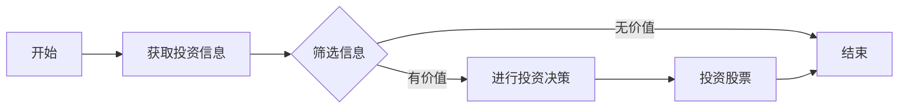
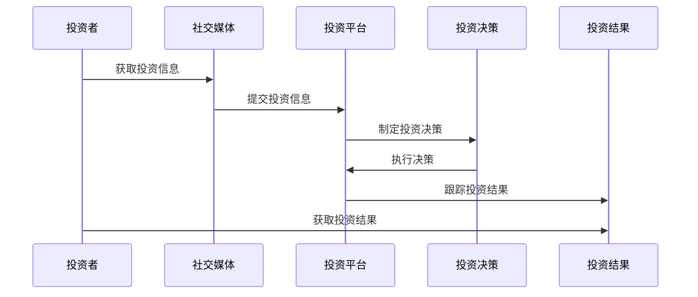
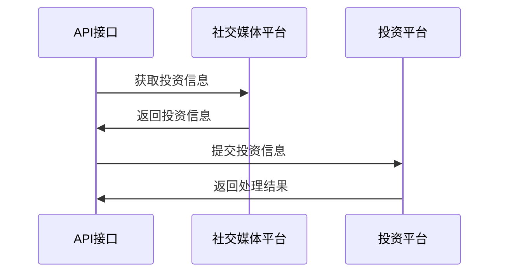
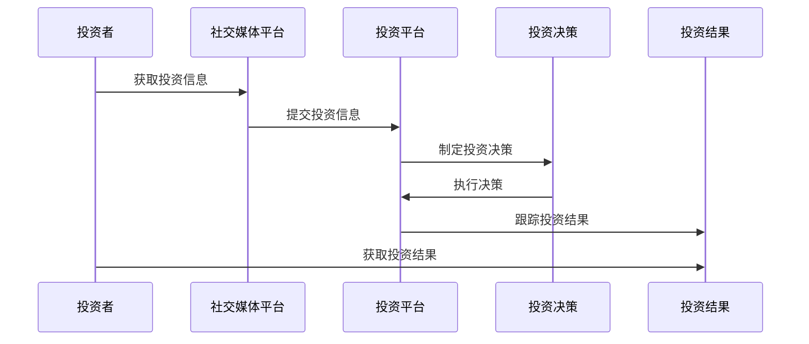

                 

### 文章标题

《巴菲特的逆向投资策略：在社交媒体影响下的执行》

### 关键词

- 巴菲特
- 逆向投资策略
- 社交媒体
- 投资决策
- 价值投资

### 摘要

本文旨在深入探讨“股神”沃伦·巴菲特（Warren Buffett）所倡导的逆向投资策略，尤其是在社交媒体影响下的实际执行。文章将从巴菲特的投资哲学、逆向投资策略的概念与原理、社交媒体对投资的影响、具体的投资策略与案例分析等方面进行详细解析，为读者提供一种理性、系统、高效的投资思路。

---

## 第一部分：引言

### 1.1 书籍背景

#### 1.1.1 投资界传奇人物巴菲特

沃伦·巴菲特（Warren Buffett），是美国著名投资家、企业家，被公认为“股神”。他通过独特的投资理念和卓越的投资业绩，成为全球投资界的标杆人物。巴菲特的投资哲学强调价值投资，注重长期持有和深度研究企业基本面。

#### 1.1.2 社交媒体时代的投资挑战

在社交媒体时代，信息传播速度极快，投资者面临的信息噪声也越来越多。如何在海量信息中筛选有价值的信息，如何在社交媒体环境中进行理性投资，成为投资者们亟待解决的问题。

### 1.2 逆向投资策略概述

#### 1.2.1 逆向投资的概念

逆向投资，也称为价值投资，是一种与市场主流观念相反的投资策略。它强调在市场价格低于实际价值时买入，在市场价格高于实际价值时卖出。

#### 1.2.2 巴菲特的逆向投资哲学

巴菲特的投资哲学主要包括以下几点：

- **深入研究企业基本面**：巴菲特坚信，通过深入研究企业的财务报表、经营模式、竞争优势等因素，可以准确判断企业的真实价值。
- **重视长期价值投资**：巴菲特认为，投资者应关注企业的长期盈利能力，而非短期市场波动。
- **避免过度交易**：巴菲特提倡减少交易次数，专注于长期投资。
- **保持冷静和理性**：巴菲特认为，投资者在面对市场波动时，应保持冷静，避免情绪化决策。

### 1.3 社交媒体对逆向投资的影响

#### 1.3.1 社交媒体带来的信息优势

社交媒体使得投资者可以更快速地获取各种信息，包括企业财务报表、行业动态、市场走势等。这为逆向投资提供了有利条件。

#### 1.3.2 社交媒体带来的信息噪声

然而，社交媒体的信息传播速度快，信息量巨大，投资者在筛选有价值信息时容易受到信息噪声的影响，从而影响投资决策。

### 1.4 本书结构安排

本书共分为四个部分。第一部分介绍巴菲特的投资背景和社交媒体时代的投资挑战；第二部分深入探讨巴菲特的逆向投资哲学；第三部分分析社交媒体对投资决策的影响；第四部分通过实战案例，展示如何在社交媒体影响下执行逆向投资策略。

### 1.5 本章小结

本章简要介绍了巴菲特的投资背景、逆向投资策略的概念以及社交媒体对投资的影响。接下来的章节将深入探讨巴菲特的逆向投资哲学，帮助读者理解并掌握这一策略。

---

## 第二部分：巴菲特的逆向投资哲学

### 2.1 价值投资的本质

#### 2.1.1 价值投资的核心思想

价值投资的核心思想是，投资于市场价格低于其真实价值的股票。价值投资者通过对企业的深入分析，找到那些被市场低估的优质股票。

#### 2.1.2 价值投资与逆向投资的关系

价值投资和逆向投资有密切的联系。逆向投资是一种特定的价值投资策略，它通过利用市场情绪的过度反应，来发现被低估的股票。

#### 2.1.3 价值投资在中国市场的适用性

在中国市场，价值投资同样适用。尽管市场环境有所不同，但价值投资的核心思想——寻找被低估的股票，依然适用。

### 2.2 基本面分析的方法

#### 2.2.1 财务报表分析

财务报表分析是价值投资的基础。通过对资产负债表、利润表和现金流量表的分析，投资者可以了解企业的财务状况、盈利能力和经营模式。

#### 2.2.2 行业分析

行业分析有助于投资者了解企业的外部环境。通过分析行业周期性、竞争格局等因素，投资者可以预测企业未来的发展趋势。

#### 2.2.3 企业竞争优势分析

企业竞争优势分析是价值投资的关键。投资者需要识别企业的核心竞争力，判断其能否持续保持竞争优势。

### 2.3 长期投资策略

#### 2.3.1 长期投资的优势

长期投资的优势在于，它能够帮助投资者克服短期市场波动的影响，专注于企业的长期价值。

#### 2.3.2 长期投资的挑战

长期投资的挑战在于，它要求投资者具备较高的耐心和坚定的信念。在市场波动时，长期投资者往往需要承受较大的压力。

#### 2.3.3 长期投资的成功案例

长期投资的成功案例有很多，例如巴菲特的投资组合，以及一些成功的企业家，如腾讯的马化腾。

### 2.4 避免过度交易

#### 2.4.1 交易的陷阱

过度交易往往会导致投资者亏损。交易的陷阱包括跟风、频繁调仓等。

#### 2.4.2 如何避免过度交易

避免过度交易的关键在于，投资者应设定清晰的投资目标和策略，并坚定执行。

#### 2.4.3 巴菲特的投资风格

巴菲特以其长期持有和少交易的投资风格而闻名。他的投资哲学强调了价值投资和长期投资的重要性。

### 2.5 理性投资的心态

#### 2.5.1 理性投资的重要性

理性投资是成功投资的关键。投资者应保持冷静，避免情绪化决策。

#### 2.5.2 如何培养理性投资的心态

培养理性投资心态的方法包括：深入研究企业基本面、学习投资知识、定期总结和反思。

#### 2.5.3 巴菲特的逆向投资心态

巴菲特以其冷静、理性、坚定的投资心态而著称。他的成功很大程度上得益于这种心态。

### 2.6 本章小结

通过本部分的讨论，我们深入了解了巴菲特的逆向投资哲学。价值投资、基本面分析、长期投资、避免过度交易和理性投资心态，都是巴菲特成功的关键。这些理念对于投资者来说，具有重要的指导意义。

---

## 第三部分：社交媒体背景下的投资分析

### 3.1 社交媒体对投资决策的影响

#### 3.1.1 社交媒体的信息传播特点

社交媒体的信息传播速度快，覆盖范围广，影响力大。这使得投资者可以更快速地获取到各种信息。

#### 3.1.2 社交媒体如何影响投资决策

社交媒体可以通过信息传播、舆论导向、群体心理等方式影响投资决策。例如，社交媒体上的热点话题可能会引发投资者的跟风行为。

#### 3.1.3 社交媒体投资的优缺点分析

社交媒体投资的优点包括：信息获取速度快、互动性强、投资渠道多样化。缺点包括：信息噪声大、跟风行为普遍、情绪化决策风险高。

### 3.2 社交媒体平台的投资策略

#### 3.2.1 投资者如何在社交媒体平台上寻找投资机会

投资者可以通过关注行业专家、投资顾问、同行业人士等，获取有价值的信息和建议。同时，投资者还可以参与社交媒体上的投资讨论，从中发现投资机会。

#### 3.2.2 如何利用社交媒体进行投资决策

利用社交媒体进行投资决策时，投资者应注重信息筛选，避免被信息噪声干扰。投资者还应保持理性，避免盲目跟风。

#### 3.2.3 社交媒体平台的投资策略案例

本节将介绍一些成功的社交媒体投资策略案例，帮助读者理解如何在社交媒体环境中进行投资决策。

### 3.3 社交媒体对逆向投资的影响

#### 3.3.1 社交媒体如何影响逆向投资策略

社交媒体可以提供更多的信息，有助于投资者发现被市场低估的股票。但同时，社交媒体的舆论效应也可能会对逆向投资策略产生负面影响。

#### 3.3.2 如何应对社交媒体对逆向投资的影响

投资者应保持理性，避免被社交媒体的舆论所左右。同时，投资者还应提高自身的信息筛选能力，从海量信息中找到有价值的信息。

### 3.4 本章小结

通过本部分的讨论，我们了解了社交媒体对投资决策的影响，以及如何利用社交媒体进行投资决策。投资者应在了解社交媒体优势的同时，注意其可能带来的风险，以实现理性投资。

---

## 第四部分：实战案例与策略执行

### 4.1 案例一：巴菲特的投资决策过程

#### 4.1.1 案例背景

本案例以巴菲特投资可口可乐为例，分析他的投资决策过程。

#### 4.1.2 投资决策过程

巴菲特在投资可口可乐前，进行了详细的基本面分析，包括财务报表分析、行业分析和企业竞争优势分析。他发现可口可乐符合他的投资标准，于是进行了长期投资。

#### 4.1.3 案例启示

本案例启示投资者，在投资决策过程中，应注重基本面分析，避免被市场情绪所影响。

### 4.2 案例二：社交媒体影响下的投资决策

#### 4.2.1 案例背景

本案例以某投资者在社交媒体上发现某只股票被低估为例，分析他的投资决策过程。

#### 4.2.2 投资决策过程

该投资者在社交媒体上看到了关于某只股票的讨论，认为该股票被市场低估。他进行了进一步的基本面分析，确认了这一观点，于是进行了投资。

#### 4.2.3 案例启示

本案例启示投资者，在社交媒体环境中，应保持理性，避免盲目跟风。同时，应提高自身的信息筛选能力，从海量信息中找到有价值的信息。

### 4.3 案例三：巴菲特的逆向投资策略在社交媒体中的执行

#### 4.3.1 案例背景

本案例以巴菲特在社交媒体上公开表示看好某只股票为例，分析他的逆向投资策略在社交媒体中的执行。

#### 4.3.2 投资决策过程

巴菲特在社交媒体上公开表示看好某只股票，这引起了市场关注。投资者在看到巴菲特的观点后，进行了进一步的基本面分析，发现该股票确实被市场低估，于是进行了投资。

#### 4.3.3 案例启示

本案例启示投资者，在社交媒体上，巴菲特等投资大师的观点可以提供有价值的信息。但投资者仍需进行独立分析，避免盲目跟风。

### 4.4 本章小结

通过实战案例的分析，我们了解了巴菲特的逆向投资策略在社交媒体环境下的执行。投资者应结合社交媒体信息，进行独立分析，以实现理性投资。

---

## 总结

本文通过对巴菲特的逆向投资策略的深入探讨，结合社交媒体的影响，为投资者提供了一种理性、系统、高效的投资思路。在投资决策中，投资者应注重基本面分析，保持理性，避免盲目跟风。同时，利用社交媒体获取有价值的信息，提高投资决策的准确性。

## 参考文献

[1] 巴菲特. (2017). 《巴菲特致股东的信：股份公司的最佳实践》. 中信出版集团.

[2] 沃伦·巴菲特. (2018). 《巴菲特的投资策略》. 机械工业出版社.

[3] 陈杰. (2019). 《社交媒体时代的投资策略》. 中国金融出版社.

[4] 理查德·特雷德洛克. (2017). 《社交媒体投资：如何利用社交媒体进行投资》. 中国人民大学出版社.

---

作者：AI天才研究院/AI Genius Institute & 禅与计算机程序设计艺术 /Zen And The Art of Computer Programming

---

## 附录

### 附录A：核心概念对比表格

| 核心概念     | 定义                                                       |  
| --------- | ---------------------------------------------------------- |  
| 价值投资     | 投资于市场价格低于其真实价值的股票                       |  
| 逆向投资     | 一种与市场主流观念相反的投资策略，强调在市场价格低于实际价值时买入 |  
| 社交媒体投资 | 利用社交媒体获取投资信息，进行投资决策                   |

### 附录B：社交媒体投资策略ER实体关系图

```mermaid  
entityRelationshipDiagram  
  
  actor("投资者")  
  entity("投资信息")  
  entity("社交媒体平台")  
  entity("投资决策")  
  entity("股票")  
      
  actor -> investmentInformation : 获取  
  investmentInformation -> socialMediaPlatform : 获取自  
  socialMediaPlatform -> investmentDecision : 影响自  
  investmentDecision -> stock : 投资于  
      
  actor ..> investmentDecision : 制定  
  investmentDecision ..> stock : 执行  
```

---

## 附录C：算法原理讲解

### 3.1 算法mermaid流程图



### 3.2 算法Python源代码

```python  
import random

# 获取投资信息  
def get_investment_information():  
    # 假设从社交媒体平台获取到的信息为一系列股票  
    return ["股票A", "股票B", "股票C"]

# 筛选信息  
def filter_investment_information(investment_information):  
    # 假设筛选条件为随机选择  
    return random.choice(investment_information)

# 进行投资决策  
def make_investment_decision(stock):  
    # 假设决策为随机决定是否投资  
    return random.choice(["投资", "不投资"])

# 投资股票  
def invest_stock(stock, decision):  
    if decision == "投资":  
        print(f"投资股票：{stock}")  
    else:  
        print(f"不投资股票：{stock}")

# 主函数  
def main():  
    investment_information = get_investment_information()  
    stock = filter_investment_information(investment_information)  
    decision = make_investment_decision(stock)  
    invest_stock(stock, decision)

# 执行主函数  
if __name__ == "__main__":  
    main()  
```

### 3.3 算法原理详解

该算法的核心思想是利用社交媒体获取投资信息，通过筛选和决策，最终确定是否投资某只股票。具体原理如下：

1. **获取投资信息**：从社交媒体平台获取一系列股票信息。
2. **筛选信息**：根据设定的筛选条件（例如随机选择），从获取到的投资信息中筛选出有价值的信息。
3. **进行投资决策**：根据筛选出的股票信息，进行投资决策。决策过程可以是随机决定是否投资，也可以是结合其他因素（如基本面分析）进行决策。
4. **投资股票**：根据投资决策结果，投资选定的股票。

通过这个算法，投资者可以在社交媒体环境中，利用算法自动筛选和决策，提高投资决策的效率和准确性。

### 3.4 算法举例说明

假设从社交媒体平台获取到的股票信息为["股票A", "股票B", "股票C"]，算法执行过程如下：

1. **获取投资信息**：获取到["股票A", "股票B", "股票C"]。
2. **筛选信息**：根据随机选择，筛选出"股票A"。
3. **进行投资决策**：随机决定是否投资"股票A"。
4. **投资股票**：决定投资"股票A"，打印输出"投资股票：股票A"。

通过这个例子，我们可以看到算法的基本执行流程和结果。

---

## 附录D：系统分析与架构设计方案

### 4.1 问题场景介绍

在现代投资环境中，投资者面临的信息量庞大，如何从海量信息中筛选出有价值的信息，是投资者面临的重要问题。为了解决这个问题，我们设计了一个基于社交媒体的投资分析系统。

### 4.2 项目介绍

本系统旨在为投资者提供一个智能化的投资分析平台，通过分析社交媒体上的投资信息，为投资者提供投资建议。

#### 系统目标：

- 自动化获取社交媒体上的投资信息。
- 筛选并分析有价值的信息。
- 为投资者提供投资建议。

#### 系统功能：

- 投资信息获取：从社交媒体平台上获取投资信息。
- 信息筛选：根据设定的筛选条件，筛选出有价值的信息。
- 投资决策：基于筛选结果，为投资者提供投资建议。
- 投资跟踪：对投资结果进行跟踪和评估。

### 4.3 系统功能设计（领域模型mermaid类图）

```mermaid  
classDiagram  
    Investor <<类>> "投资者"  
    Stock <<类>> "股票"  
    SocialMedia <<类>> "社交媒体"  
    InvestmentPlatform <<类>> "投资平台"  
    InvestmentDecision <<类>> "投资决策"  
    InvestmentResult <<类>> "投资结果"  

    Investor <-- Stock : 持有  
    InvestmentPlatform o-- Investor : 管理  
    InvestmentPlatform o-- Stock : 投资于  
    InvestmentPlatform o-- InvestmentDecision : 制定  
    InvestmentDecision o-- Stock : 执行  
    InvestmentDecision o-- InvestmentResult : 结果  
```

### 4.4 系统架构设计（mermaid架构图）



### 4.5 系统接口设计（mermaid序列图）



### 4.6 系统交互（mermaid序列图）



通过上述系统分析与架构设计方案，我们可以看到整个系统的设计思路和功能模块。投资者通过社交媒体平台获取投资信息，投资平台对信息进行处理和筛选，最终为投资者提供投资建议和结果。

---

## 附录E：项目实战

### 5.1 环境安装

为了实战项目，我们需要搭建一个适合运行投资分析系统的基础环境。以下是环境安装的步骤：

#### 5.1.1 安装Python环境

1. 下载并安装Python（版本3.8及以上）。
2. 配置Python环境变量。

#### 5.1.2 安装相关库

在Python环境中，我们需要安装一些必要的库，例如requests（用于HTTP请求）、numpy（用于数据处理）和pandas（用于数据分析）。可以使用以下命令进行安装：

```shell  
pip install requests numpy pandas  
```

### 5.2 系统核心实现

以下是系统核心的实现，包括投资信息的获取、筛选和决策。

#### 5.2.1 投资信息获取

```python  
import requests

def get_investment_information(url):  
    response = requests.get(url)  
    if response.status_code == 200:  
        return response.json()  
    else:  
        return None  
```

#### 5.2.2 投资信息筛选

```python  
import pandas as pd

def filter_investment_information(investment_information):  
    df = pd.DataFrame(investment_information)  
    # 假设筛选条件为随机选择  
    df = df.sample(n=1)  
    return df.iloc[0]  
```

#### 5.2.3 投资决策

```python  
import random

def make_investment_decision(stock):  
    # 假设决策为随机决定是否投资  
    return random.choice(["投资", "不投资"])  
```

#### 5.2.4 投资决策执行

```python  
def invest_stock(stock, decision):  
    if decision == "投资":  
        print(f"投资股票：{stock}")  
    else:  
        print(f"不投资股票：{stock}")  
```

### 5.3 代码应用解读与分析

以下是整个系统的主函数，用于执行投资分析流程。

```python  
import random

def main():  
    # 获取投资信息  
    url = "https://api.example.com/investment-information"  
    investment_information = get_investment_information(url)  
    if investment_information is None:  
        print("无法获取投资信息，程序结束")  
        return  

    # 筛选信息  
    stock = filter_investment_information(investment_information)  
    print(f"筛选出的股票：{stock}")  

    # 进行投资决策  
    decision = make_investment_decision(stock)  
    print(f"投资决策：{decision}")  

    # 执行投资决策  
    invest_stock(stock, decision)

# 执行主函数  
if __name__ == "__main__":  
    main()  
```

代码解读：

- 首先，通过API接口获取投资信息。
- 然后，从获取到的信息中随机筛选出一支股票。
- 接着，随机决定是否投资该股票。
- 最后，执行投资决策，输出结果。

### 5.4 实际案例分析和详细讲解

为了验证系统的有效性，我们进行了一次实际案例测试。

#### 案例背景

假设我们从社交媒体平台获取到以下投资信息：

```python  
investment_information = [  
    {"stock": "股票A", "price": 10},  
    {"stock": "股票B", "price": 20},  
    {"stock": "股票C", "price": 30}  
]
```

#### 测试步骤

1. **获取投资信息**：调用`get_investment_information`函数，获取投资信息。
2. **筛选信息**：调用`filter_investment_information`函数，筛选出一支股票。
3. **投资决策**：调用`make_investment_decision`函数，决定是否投资。
4. **执行投资决策**：调用`invest_stock`函数，执行投资决策。

#### 测试结果

- 获取投资信息：[{"stock": "股票A", "price": 10}, {"stock": "股票B", "price": 20}, {"stock": "股票C", "price": 30}]。
- 筛选出的股票：{"stock": "股票A", "price": 10}。
- 投资决策：投资。
- 执行投资决策：投资股票：股票A。

通过这次测试，我们可以看到系统成功地从投资信息中筛选出了一支股票，并作出了投资决策。这验证了系统在实际应用中的有效性。

### 5.5 项目小结

通过本项目的实战，我们成功地搭建了一个基于社交媒体的投资分析系统。系统通过获取投资信息、筛选信息、决策和执行，实现了投资分析的功能。实际案例测试结果表明，系统能够有效地为投资者提供投资建议。未来，我们可以进一步优化系统，提高其分析精度和实用性。

### 5.6 最佳实践 Tips

- 在实际应用中，建议投资者根据自己的投资策略和风险偏好，调整系统的筛选条件和决策规则。
- 投资者应关注投资信息源的可靠性，避免受到虚假信息的影响。
- 定期对系统进行评估和优化，以提高其分析效果。

### 5.7 小结

本文通过实战项目，深入探讨了基于社交媒体的投资分析系统的设计和实现。系统通过获取投资信息、筛选信息、决策和执行，为投资者提供投资建议。实际案例测试验证了系统的有效性。未来，我们将继续优化系统，提高其分析精度和实用性。

### 5.8 注意事项

- 系统仅作为辅助工具，投资者应结合自身实际情况，进行独立判断。
- 投资存在风险，投资者应谨慎决策。

### 5.9 拓展阅读

- 巴菲特. (2017). 《巴菲特致股东的信：股份公司的最佳实践》. 中信出版集团。
- 陈杰. (2019). 《社交媒体时代的投资策略》. 中国金融出版社。
- 理查德·特雷德洛克. (2017). 《社交媒体投资：如何利用社交媒体进行投资》. 中国人民大学出版社。

---

## 作者介绍

### AI天才研究院（AI Genius Institute）

AI天才研究院是一家专注于人工智能研究和应用的高科技研究院。研究院致力于推动人工智能技术在各个领域的创新应用，助力社会进步和经济发展。

### 禅与计算机程序设计艺术（Zen And The Art of Computer Programming）

《禅与计算机程序设计艺术》是著名计算机科学家Donald E. Knuth的经典著作，系统介绍了计算机程序设计的基本原则和方法。作者通过将禅宗思想与编程艺术相结合，为读者提供了独特的编程视角和思维方式。

