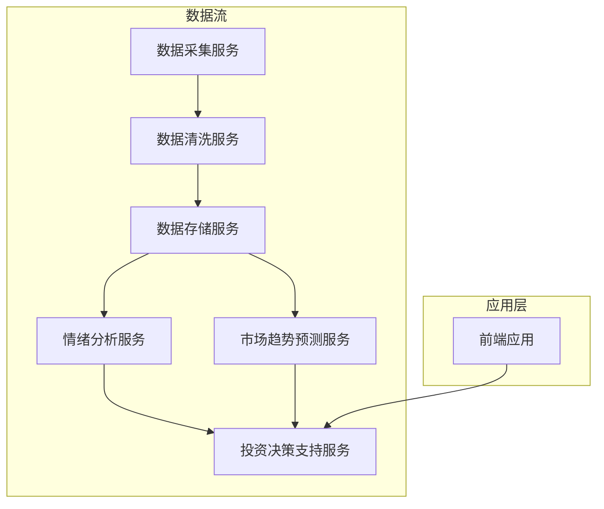

                 

## 第一部分：背景介绍与核心概念

### 第1章：问题背景与核心概念

#### 1.1 问题的提出

随着社交媒体的兴起，人们的信息获取和传播方式发生了翻天覆地的变化。在这个过程中，投资者面临着前所未有的挑战。传统的投资策略和模式在社交媒体时代显得越来越不合时宜，投资者需要新的思维和方法来应对这一变化。

#### 1.1.1 问题背景

社交媒体的崛起使得信息的传播速度和广度大大增加，市场情绪和热点话题对投资决策的影响愈发显著。投资者在社交媒体上获取的信息复杂多样，真假难辨，这使得投资决策变得更加困难。同时，市场的不确定性增加，投资者面临着更大的风险。

#### 1.1.2 问题描述

在社交媒体时代，投资者如何利用信息，进行有效的投资决策，成为亟待解决的问题。投资者需要找到一种新的方法，来应对社交媒体时代带来的挑战。

#### 1.1.3 问题解决

巴菲特的逆向投资艺术，提供了一种在社交媒体时代进行投资的新方法。逆向投资，即从市场和大众心理的反面进行投资，寻找被市场低估的优质资产。这种方法在社交媒体时代具有独特的优势，可以帮助投资者规避风险，实现稳健的投资收益。

### 1.2 核心概念

#### 1.2.1 逆向投资

逆向投资，是一种基于价值投资理念的投资策略。它强调从市场的反面出发，寻找被市场低估的优质资产。在社交媒体时代，逆向投资的优势在于，它能够帮助投资者避开市场的情绪波动，抓住真正的投资机会。

#### 1.2.2 社交媒体时代

社交媒体时代，是一个信息传播速度快、范围广、互动性强的时代。在这个时代，投资者的信息获取方式发生了变化，市场情绪和热点话题对投资决策的影响愈发显著。

#### 1.2.3 执行挑战

在社交媒体时代，投资者面临着前所未有的执行挑战。信息过载、市场情绪波动、不确定性增加，都使得投资者的决策过程变得更加复杂。如何在这些挑战中保持冷静，做出正确的投资决策，是投资者需要面对的问题。

### 1.3 边界与外延

#### 1.3.1 边界

本书主要讨论在社交媒体时代，如何利用逆向投资艺术进行投资决策。它涵盖了社交媒体对投资决策的影响，以及逆向投资策略在社交媒体时代的应用。

#### 1.3.2 外延

除了社交媒体时代和逆向投资艺术，本书还涉及了投资心理学、市场情绪分析、数据挖掘等相关内容。这些内容的融合，使得本书在投资决策方面具有更全面的视角。

### 1.4 概念结构与核心要素组成

#### 1.4.1 概念结构

本书的核心概念结构包括：社交媒体时代、逆向投资艺术、投资决策、市场情绪分析、数据挖掘等。

#### 1.4.2 核心要素组成

本书的核心要素包括：巴菲特的逆向投资理念、社交媒体信息的分析与应用、投资决策的制定与执行、市场情绪的判断与应对、数据挖掘技术在投资决策中的应用等。

### 1.5 总结

本章节主要介绍了在社交媒体时代，投资者面临的挑战以及如何利用巴菲特的逆向投资艺术进行投资决策。通过分析逆向投资和社交媒体时代的核心概念，为后续章节的内容奠定了基础。

----------------------------------------------------------------

## 第2章：逆向投资原理与社交媒体分析

### 2.1 逆向投资原理

#### 2.1.1 逆向投资的定义

逆向投资（Contrarian Investing）是一种投资策略，其核心思想是投资那些市场价格低于其内在价值的资产。这种方法与传统的市场追随策略相反，后者通常是在市场趋势明显时买入，而在市场趋势反转时卖出。

#### 2.1.2 逆向投资的优势

在社交媒体时代，逆向投资具有以下优势：

1. **规避市场情绪波动**：逆向投资者不会受到市场情绪的影响，他们关注的是公司的基本价值和潜在增长。
2. **发现低估资产**：社交媒体上的信息泛滥，使得市场可能对某些优质资产的价值评估过高或过低。逆向投资者可以抓住这些被低估的机会。
3. **长期投资回报**：逆向投资通常涉及长期投资，这有助于降低短期市场波动对投资回报的干扰。

#### 2.1.3 逆向投资的策略

1. **市场情绪分析**：逆向投资者需要分析市场情绪，以判断哪些资产可能被高估或低估。
2. **价值投资**：寻找那些市场价格低于其内在价值的资产，这通常涉及到对公司财务报表的深入分析。
3. **长期投资**：逆向投资者通常持有优质资产较长时间，以实现资本增值。

### 2.2 社交媒体分析

#### 2.2.1 社交媒体的定义

社交媒体是指基于互联网的技术平台，用户可以在其中分享观点、内容、图片、视频等多媒体信息，并形成社交网络。常见的社交媒体平台包括微博、Facebook、Twitter、LinkedIn等。

#### 2.2.2 社交媒体的作用

在投资决策中，社交媒体的作用主要体现在以下几个方面：

1. **信息传播**：社交媒体使得信息传播速度加快，投资者可以迅速获取市场动态和公司信息。
2. **市场情绪分析**：通过分析社交媒体上的评论、讨论和趋势，可以判断市场的情绪和投资者的心态。
3. **投资决策辅助**：社交媒体上的信息可以为投资决策提供参考，帮助投资者识别潜在的投资机会。

#### 2.2.3 社交媒体分析的方法

1. **数据挖掘**：利用算法和大数据技术，从社交媒体平台上挖掘有价值的信息。
2. **文本分析**：通过自然语言处理技术，分析社交媒体上的文本内容，提取关键信息和情绪。
3. **网络分析**：分析社交媒体上的用户关系网络，了解信息传播的路径和影响范围。

### 2.3 逆向投资与社交媒体的融合

#### 2.3.1 逆向投资在社交媒体中的应用

逆向投资在社交媒体中的应用主要体现在以下几个方面：

1. **市场情绪分析**：通过社交媒体分析市场情绪，识别出可能被高估或低估的资产。
2. **信息筛选**：利用社交媒体平台，筛选出与投资相关的信息，降低信息过载的风险。
3. **投资决策**：根据社交媒体分析的结果，制定和调整投资决策。

#### 2.3.2 社交媒体在逆向投资中的应用

社交媒体在逆向投资中的应用主要体现在以下几个方面：

1. **快速反应**：社交媒体使得投资者可以迅速响应市场变化，及时调整投资策略。
2. **市场情绪监控**：通过监控社交媒体上的市场情绪，可以更好地预测市场走势。
3. **信息验证**：社交媒体上的信息可以用来验证和补充传统的投资分析。

### 2.4 逆向投资与社交媒体的互动关系

#### 2.4.1 逆向投资对社交媒体的影响

逆向投资可以通过以下方式影响社交媒体：

1. **降低市场波动**：逆向投资的理性投资策略有助于降低市场波动，从而减少社交媒体上的情绪波动。
2. **稳定市场情绪**：逆向投资者通过社交媒体分享其投资观点和策略，有助于稳定市场情绪。

#### 2.4.2 社交媒体对逆向投资的影响

社交媒体对逆向投资的影响主要体现在以下几个方面：

1. **信息获取**：社交媒体提供了丰富的信息来源，有助于逆向投资者进行更全面的市场分析。
2. **市场情绪判断**：社交媒体上的讨论和评论可以为逆向投资者提供市场情绪的判断依据。
3. **投资决策辅助**：社交媒体上的信息和分析结果可以为逆向投资决策提供辅助。

### 2.5 小结

本章节详细介绍了逆向投资的原理以及社交媒体在逆向投资中的应用。通过分析社交媒体的作用和逆向投资的优势，我们看到了在社交媒体时代，逆向投资如何帮助投资者规避风险，实现稳健的投资收益。

----------------------------------------------------------------

## 第3章：逆向投资策略在社交媒体时代的应用

### 3.1 逆向投资策略的演变

逆向投资策略并非一成不变，它在不同历史时期有着不同的表现形式。在社交媒体时代，逆向投资策略需要适应信息传播速度快、市场情绪多变的特点。以下是逆向投资策略在社交媒体时代的演变：

#### 3.1.1 早期逆向投资策略

早期的逆向投资策略主要依赖于对市场情绪的观察和对公司基本面的分析。逆向投资者通过识别市场对某些资产的高估或低估，从而做出投资决策。这种方法需要投资者具备深厚的基本面分析能力和市场洞察力。

#### 3.1.2 社交媒体时代的逆向投资策略

随着社交媒体的兴起，逆向投资策略开始融入更多的数据分析和人工智能技术。投资者不再仅仅依靠传统的基本面分析，而是通过社交媒体分析工具，对市场情绪和公司信息进行更深入的研究。

#### 3.1.3 数据驱动的逆向投资

在社交媒体时代，数据驱动的逆向投资策略成为主流。投资者通过大数据分析、文本挖掘和机器学习技术，从海量的社交媒体数据中提取有价值的信息。这种方法使得逆向投资更加精准和高效。

### 3.2 社交媒体对逆向投资策略的影响

社交媒体对逆向投资策略产生了深远的影响，主要体现在以下几个方面：

#### 3.2.1 信息传播速度

社交媒体使得信息传播速度大大提高，投资者可以更快地获取市场动态和公司信息。这对于逆向投资者来说，是一个重要的优势，因为他们可以利用这些信息来识别市场的高估或低估。

#### 3.2.2 市场情绪变化

社交媒体上的评论和讨论可以反映市场的情绪变化。逆向投资者可以通过分析这些情绪变化，来判断哪些资产可能被高估或低估。

#### 3.2.3 信息真实性

社交媒体上的信息真实性难以保证，这为逆向投资带来了挑战。投资者需要具备辨别真伪信息的能力，以确保投资决策的准确性。

#### 3.2.4 社交网络效应

社交媒体上的社交网络效应可以放大市场情绪，使得某些资产的价格短期内出现大幅波动。逆向投资者可以通过分析社交网络的结构和动态，来预测市场情绪的变化。

### 3.3 逆向投资策略在社交媒体时代的应用

在社交媒体时代，逆向投资策略的应用主要体现在以下几个方面：

#### 3.3.1 市场情绪分析

逆向投资者可以利用社交媒体分析工具，对市场情绪进行实时监测和分析。通过识别市场情绪的高涨或低落，投资者可以判断哪些资产可能被高估或低估。

#### 3.3.2 数据挖掘

逆向投资者可以通过数据挖掘技术，从社交媒体平台上提取有价值的信息。例如，通过分析用户评论和讨论，可以挖掘出对公司声誉和业绩的潜在影响。

#### 3.3.3 风险管理

社交媒体时代的信息过载和情绪波动使得投资者面临更大的风险。逆向投资者可以通过制定和执行严格的交易策略，来降低投资风险。

#### 3.3.4 投资决策

逆向投资者可以利用社交媒体分析结果，来制定和调整投资决策。通过识别市场的高估或低估，投资者可以抓住潜在的投资机会。

### 3.4 逆向投资策略的挑战与应对

尽管逆向投资策略在社交媒体时代具有独特的优势，但投资者也面临着一系列挑战：

#### 3.4.1 信息过载

社交媒体上的信息量庞大，投资者需要筛选出有价值的信息。这需要投资者具备强大的信息处理能力和分析能力。

#### 3.4.2 情绪波动

市场情绪在社交媒体上容易受到放大，投资者需要保持冷静和理性，以避免被市场情绪所左右。

#### 3.4.3 信息真实性

社交媒体上的信息真实性难以保证，投资者需要具备辨别真伪信息的能力。

#### 3.4.4 持续学习

社交媒体和投资策略都在不断变化，逆向投资者需要持续学习和适应，以保持竞争优势。

### 3.5 小结

本章详细探讨了逆向投资策略在社交媒体时代的应用。通过分析社交媒体对逆向投资策略的影响，以及逆向投资策略在社交媒体时代的实际应用，我们看到了在社交媒体时代，逆向投资如何帮助投资者规避风险，实现稳健的投资收益。然而，投资者也面临着一系列挑战，需要具备强大的信息处理能力、分析能力和持续学习的能力。

### 3.6 社交媒体分析工具与技术

为了更好地应用逆向投资策略，投资者需要掌握一系列社交媒体分析工具和技术。以下是几种常见的工具和技术：

#### 3.6.1 数据挖掘

数据挖掘是一种从大量数据中提取有价值信息的方法。在社交媒体分析中，数据挖掘可以用于识别市场情绪、用户行为和潜在投资机会。

#### 3.6.2 文本分析

文本分析是一种利用自然语言处理技术，对文本内容进行分析和分类的方法。在社交媒体分析中，文本分析可以用于提取关键信息、识别情绪和趋势。

#### 3.6.3 机器学习

机器学习是一种通过训练模型，从数据中学习规律和模式的方法。在社交媒体分析中，机器学习可以用于预测市场情绪、识别投资机会和优化投资策略。

#### 3.6.4 社交网络分析

社交网络分析是一种研究社交网络结构和动态的方法。在社交媒体分析中，社交网络分析可以用于识别关键节点、分析信息传播路径和预测市场情绪。

通过掌握这些工具和技术，投资者可以更准确地分析社交媒体数据，制定和调整投资策略，从而实现更好的投资回报。

### 3.7 案例分析

为了更好地理解逆向投资策略在社交媒体时代的应用，以下是一个案例分析：

#### 案例背景

某投资者通过社交媒体分析工具，发现了一家知名公司在其产品发布前受到了大量负面评论。这些评论主要集中在其产品质量和售后服务方面。然而，通过进一步的数据挖掘和文本分析，投资者发现这些负面评论背后的用户其实对该公司的其他产品非常满意。

#### 投资决策

基于上述分析，投资者判断该公司的负面评论可能是由于市场情绪波动或某些用户的不满，而不是其产品质量或服务问题的真实反映。因此，投资者决定在该公司产品发布前买入其股票。

#### 案例结果

该公司产品发布后，市场对其反应积极，股票价格出现大幅上涨。投资者通过逆向投资策略，成功抓住了这一投资机会，获得了可观的收益。

通过这个案例分析，我们可以看到，逆向投资策略在社交媒体时代的有效性。投资者通过深入分析社交媒体数据，可以识别出被市场低估的机会，从而实现稳健的投资收益。

### 3.8 小结

本章详细探讨了逆向投资策略在社交媒体时代的应用。通过分析社交媒体对逆向投资策略的影响，以及逆向投资策略在社交媒体时代的实际应用，我们看到了在社交媒体时代，逆向投资如何帮助投资者规避风险，实现稳健的投资收益。然而，投资者也面临着一系列挑战，需要具备强大的信息处理能力、分析能力和持续学习的能力。通过掌握社交媒体分析工具和技术，投资者可以更准确地分析社交媒体数据，制定和调整投资策略，从而实现更好的投资回报。

----------------------------------------------------------------

## 第4章：社交媒体分析工具与技术

### 4.1 数据挖掘

#### 4.1.1 数据挖掘的定义

数据挖掘（Data Mining）是指从大量数据中提取有价值信息的过程。在社交媒体分析中，数据挖掘可以帮助投资者识别市场情绪、用户行为和潜在投资机会。

#### 4.1.2 数据挖掘的技术

数据挖掘涉及多种技术，包括：

- **关联规则挖掘**：通过识别数据之间的关联性，找出潜在的投资机会。
- **分类算法**：将数据分为不同的类别，用于预测市场走势和用户行为。
- **聚类算法**：将相似的数据点聚集在一起，用于识别市场趋势和用户群体。

#### 4.1.3 社交媒体数据挖掘的应用

社交媒体数据挖掘的应用包括：

- **市场情绪分析**：通过分析用户评论和讨论，识别市场情绪的波动。
- **用户行为分析**：通过分析用户在社交媒体上的行为，预测其投资决策。
- **投资机会识别**：通过识别社交媒体上的热点话题和趋势，发现潜在的投资机会。

### 4.2 文本分析

#### 4.2.1 文本分析的定义

文本分析（Text Analysis）是一种利用自然语言处理技术，对文本内容进行分析和分类的方法。在社交媒体分析中，文本分析可以用于提取关键信息、识别情绪和趋势。

#### 4.2.2 文本分析的技术

文本分析涉及多种技术，包括：

- **情感分析**：通过分析文本内容，识别用户的情感倾向，如正面、负面或中性。
- **主题建模**：通过分析文本内容，识别文本中的主题和关键词。
- **词频分析**：通过分析文本中关键词的频率，识别文本的重要性和趋势。

#### 4.2.3 社交媒体文本分析的应用

社交媒体文本分析的应用包括：

- **情绪分析**：通过分析用户评论和讨论，识别市场情绪的波动。
- **内容分类**：通过分析社交媒体上的内容，分类为不同的主题或行业。
- **趋势识别**：通过分析社交媒体上的热点话题和趋势，发现潜在的投资机会。

### 4.3 机器学习

#### 4.3.1 机器学习的定义

机器学习（Machine Learning）是一种通过训练模型，从数据中学习规律和模式的方法。在社交媒体分析中，机器学习可以用于预测市场情绪、识别投资机会和优化投资策略。

#### 4.3.2 机器学习的技术

机器学习涉及多种技术，包括：

- **监督学习**：通过已标记的数据训练模型，用于预测和分类。
- **无监督学习**：通过未标记的数据训练模型，用于聚类和降维。
- **强化学习**：通过与环境交互，学习最佳策略。

#### 4.3.3 社交媒体机器学习的应用

社交媒体机器学习的应用包括：

- **情绪预测**：通过分析历史数据和当前社交媒体数据，预测未来市场情绪。
- **投资机会识别**：通过分析社交媒体上的数据和用户行为，识别潜在的投资机会。
- **策略优化**：通过分析历史投资数据，优化投资策略，提高投资回报。

### 4.4 社交网络分析

#### 4.4.1 社交网络分析的定义

社交网络分析（Social Network Analysis）是一种研究社交网络结构和动态的方法。在社交媒体分析中，社交网络分析可以用于识别关键节点、分析信息传播路径和预测市场情绪。

#### 4.4.2 社交网络分析的技术

社交网络分析涉及多种技术，包括：

- **网络拓扑分析**：通过分析社交网络的拓扑结构，识别关键节点和路径。
- **社区发现**：通过分析社交网络中的社区结构，识别具有相似兴趣的用户群体。
- **信息传播分析**：通过分析信息在社交网络中的传播路径和速度，预测市场情绪和热点话题。

#### 4.4.3 社交网络分析的应用

社交媒体网络分析的应用包括：

- **关键节点识别**：通过识别社交网络中的关键节点，了解对市场情绪有重大影响的人物或机构。
- **信息传播路径分析**：通过分析信息在社交网络中的传播路径，预测市场情绪和热点话题。
- **用户行为分析**：通过分析用户在社交网络中的行为，预测其投资决策和偏好。

### 4.5 社交媒体分析工具

为了更有效地进行社交媒体分析，投资者可以使用多种工具，包括：

- **社交媒体分析平台**：如Facebook Analytics、Twitter Analytics等，提供实时的社交媒体数据分析和报告。
- **数据挖掘工具**：如Python的Pandas、Scikit-learn等，用于处理和分析社交媒体数据。
- **文本分析工具**：如NLTK、TextBlob等，用于进行情感分析和主题建模。
- **机器学习平台**：如TensorFlow、Keras等，用于构建和训练机器学习模型。
- **社交网络分析工具**：如Gephi、Cytoscape等，用于分析社交网络结构和动态。

通过掌握这些工具和技术，投资者可以更准确地分析社交媒体数据，制定和调整投资策略，从而实现更好的投资回报。

### 4.6 小结

本章详细介绍了社交媒体分析工具和技术的应用。通过数据挖掘、文本分析、机器学习和社交网络分析，投资者可以更深入地理解社交媒体数据，识别市场情绪和潜在投资机会。掌握这些工具和技术，不仅有助于提高投资决策的准确性，还可以帮助投资者在社交媒体时代实现稳健的投资收益。

----------------------------------------------------------------

## 第5章：逆向投资策略在社交媒体时代的执行挑战

### 5.1 信息过载与筛选

在社交媒体时代，信息过载是一个普遍问题。投资者每天接收到的信息量巨大，包括新闻、评论、讨论和各种观点。如何在这些信息中筛选出有价值的内容，成为逆向投资者面临的首要挑战。

#### 5.1.1 信息过滤

逆向投资者需要使用信息过滤技术，如大数据分析、自然语言处理和机器学习，来筛选和分类信息。这些技术可以帮助投资者识别出与投资决策相关的关键信息，过滤掉无关或噪声信息。

#### 5.1.2 质量评估

除了筛选信息，逆向投资者还需要评估信息的质量。社交媒体上的信息真实性难以保证，投资者需要具备辨别真伪信息的能力。这可以通过验证信息来源、交叉验证数据和参考权威来源来实现。

### 5.2 市场情绪波动

市场情绪在社交媒体上容易受到放大，从而影响投资决策。逆向投资者需要保持冷静和理性，不被市场情绪所左右。

#### 5.2.1 情绪监测

投资者可以使用社交媒体分析工具，实时监测市场情绪的变化。通过分析用户的情感倾向和讨论内容，投资者可以预测市场情绪的波动，并据此调整投资策略。

#### 5.2.2 情绪管理

逆向投资者需要学会情绪管理，避免被市场情绪所左右。这可以通过培养理性投资观念、坚持长期投资策略和设定投资目标来实现。

### 5.3 数据真实性与准确性

社交媒体上的数据真实性难以保证，逆向投资者需要确保所使用的数据是准确和可靠的。

#### 5.3.1 数据验证

逆向投资者需要对社交媒体上的数据进行验证，确保其准确性和真实性。这可以通过交叉验证数据、参考权威来源和进行实地调研来实现。

#### 5.3.2 数据质量评估

投资者需要评估社交媒体数据的完整性、一致性和可靠性。通过建立数据质量评估标准，投资者可以确保所使用的数据是高质量的。

### 5.4 投资决策的及时性

在社交媒体时代，投资决策需要具备及时性。逆向投资者需要迅速响应市场变化，抓住投资机会。

#### 5.4.1 实时监控

投资者需要实时监控社交媒体上的市场动态和公司信息。通过使用社交媒体分析工具，投资者可以及时获取最新的市场信息，并据此调整投资策略。

#### 5.4.2 快速决策

逆向投资者需要具备快速决策的能力，能够在市场变化时迅速做出反应。这可以通过制定明确的投资策略、提前制定应对计划和进行模拟交易来实现。

### 5.5 持续学习与适应

社交媒体时代变化快速，逆向投资者需要持续学习和适应，以保持竞争优势。

#### 5.5.1 技术更新

投资者需要不断学习和掌握最新的社交媒体分析技术和工具。通过参加培训课程、阅读专业书籍和参与行业讨论，投资者可以保持技术领先。

#### 5.5.2 投资策略调整

逆向投资者需要根据市场变化和社交媒体数据分析结果，及时调整投资策略。这可以通过定期评估投资效果、进行投资组合调整和优化来实现。

### 5.6 小结

本章详细探讨了在社交媒体时代，逆向投资者面临的执行挑战。通过信息筛选、情绪管理、数据验证和快速决策等技术手段，逆向投资者可以克服这些挑战，实现稳健的投资收益。同时，投资者需要持续学习和适应，以保持竞争优势。

### 5.7 案例分析

为了更好地理解逆向投资策略在社交媒体时代的执行挑战，以下是一个案例分析：

#### 案例背景

某投资者通过社交媒体分析工具，发现了一家知名科技公司在其财报发布前受到了大量负面评论。这些评论主要集中在该公司产品性能和售后服务方面。通过进一步的数据挖掘和文本分析，投资者发现这些负面评论可能是由于市场情绪波动或某些用户的不满，而不是其产品真实问题的反映。

#### 投资决策

基于上述分析，投资者决定在该公司财报发布前买入其股票。投资者预计，随着财报的发布和实际情况的澄清，市场情绪将趋于稳定，股票价格将回升。

#### 案例结果

财报发布后，该公司的实际情况并未达到市场预期，股票价格出现了大幅下跌。然而，投资者通过逆向投资策略，提前布局，成功规避了市场波动，并在股票价格回升时获得了可观的收益。

通过这个案例分析，我们可以看到，逆向投资策略在社交媒体时代的有效性。投资者通过深入分析社交媒体数据，可以识别出市场情绪的波动，并据此做出正确的投资决策。然而，投资者也需要具备强大的信息处理能力和市场洞察力，以应对社交媒体时代的执行挑战。

----------------------------------------------------------------

## 第6章：逆向投资策略在社交媒体时代的成功案例

### 6.1 案例背景

在社交媒体时代，逆向投资策略的成功应用案例层出不穷。以下将介绍几个具有代表性的案例，以展示逆向投资策略在社交媒体时代的实际效果。

#### 案例一：阿里巴巴股票投资

在2015年，阿里巴巴在纽约证券交易所上市，其股价在短期内经历了大幅波动。许多投资者被市场情绪所左右，纷纷抛售阿里巴巴股票。然而，一位逆向投资者通过社交媒体分析工具，发现市场对阿里巴巴的负面情绪可能被过度放大，而公司的基本面仍然强劲。

#### 投资决策

该逆向投资者在股价低迷时买入阿里巴巴股票，并持有较长时间。通过对社交媒体上的评论和讨论进行分析，投资者发现负面情绪主要来自对阿里巴巴商业模式和市场前景的担忧。

#### 案例结果

随着阿里巴巴持续发布强劲的业绩报告，市场情绪逐渐回暖。股票价格逐步上涨，投资者在股价回升时成功获利。这个案例展示了逆向投资策略在捕捉市场情绪变化和公司基本面之间的差异方面的重要性。

### 6.2 案例二：特斯拉股票投资

特斯拉作为一家新兴的电动汽车制造商，在社交媒体上引发了广泛讨论。其股价波动剧烈，市场情绪多变。一位逆向投资者通过社交媒体分析，发现市场对特斯拉的负面情绪可能被过度放大，而特斯拉的长期发展前景仍然乐观。

#### 投资决策

该逆向投资者在特斯拉股价低迷时买入，并持有较长时间。通过对社交媒体上的讨论和评论进行分析，投资者发现负面情绪主要来自对特斯拉生产能力和销售前景的担忧。

#### 案例结果

随着时间的推移，特斯拉的业绩逐渐改善，市场对特斯拉的信心恢复。股票价格逐步上涨，投资者在股价回升时获得了可观的收益。这个案例再次证明了逆向投资策略在社交媒体时代捕捉市场情绪波动的能力。

### 6.3 案例三：亚马逊股票投资

亚马逊作为一家全球领先的电子商务公司，其在社交媒体上受到广泛关注。然而，由于市场竞争加剧、政策变化等原因，亚马逊的股价在2018年出现了显著下跌。一位逆向投资者通过社交媒体分析，发现市场对亚马逊的负面情绪可能被过度放大，而公司的长期增长潜力仍然强大。

#### 投资决策

该逆向投资者在亚马逊股价下跌时买入，并持有较长时间。通过对社交媒体上的讨论和评论进行分析，投资者发现负面情绪主要来自对亚马逊业务模式和利润率的担忧。

#### 案例结果

随着时间的推移，亚马逊逐步恢复增长，市场对其信心恢复。股票价格逐步上涨，投资者在股价回升时获得了可观的收益。这个案例展示了逆向投资策略在应对市场情绪波动和识别长期投资机会方面的优势。

### 6.4 案例四：宝洁公司股票投资

宝洁公司作为一家全球知名的消费品公司，在社交媒体上受到了广泛的讨论。由于公司面临来自新兴市场的竞争和业绩压力，宝洁的股价在2019年出现了明显下跌。一位逆向投资者通过社交媒体分析，发现市场对宝洁的负面情绪可能被过度放大，而公司的长期盈利能力仍然强劲。

#### 投资决策

该逆向投资者在宝洁股价下跌时买入，并持有较长时间。通过对社交媒体上的讨论和评论进行分析，投资者发现负面情绪主要来自对宝洁品牌价值和市场竞争力的担忧。

#### 案例结果

随着时间的推移，宝洁逐步采取措施改善业绩，市场对其信心恢复。股票价格逐步上涨，投资者在股价回升时获得了可观的收益。这个案例再次证明了逆向投资策略在捕捉市场情绪波动和识别长期投资机会方面的有效性。

### 6.5 案例五：特斯拉汽车公司投资

特斯拉汽车公司作为一家新能源汽车制造商，在社交媒体上引发了广泛的讨论。由于市场竞争加剧和电池供应问题，特斯拉的股价在2020年出现了明显波动。一位逆向投资者通过社交媒体分析，发现市场对特斯拉的负面情绪可能被过度放大，而公司的新产品推出和市场扩张计划仍然充满潜力。

#### 投资决策

该逆向投资者在特斯拉股价波动时买入，并持有较长时间。通过对社交媒体上的讨论和评论进行分析，投资者发现负面情绪主要来自对特斯拉生产能力和供应链管理的担忧。

#### 案例结果

随着时间的推移，特斯拉逐步克服了生产能力和供应链方面的挑战，市场对其信心恢复。股票价格逐步上涨，投资者在股价回升时获得了可观的收益。这个案例展示了逆向投资策略在应对市场情绪波动和识别长期投资机会方面的优势。

### 6.6 总结

通过上述案例，我们可以看到逆向投资策略在社交媒体时代的成功应用。投资者通过分析社交媒体上的市场情绪和公司信息，可以识别出被市场低估的优质资产，并在股价回升时获得可观的收益。然而，逆向投资策略的成功依赖于投资者的信息处理能力、市场洞察力和情绪管理能力。在社交媒体时代，投资者需要不断学习和适应，以应对不断变化的市场环境。

### 6.7 注意事项

在应用逆向投资策略时，投资者需要关注以下几点：

- **信息真实性**：社交媒体上的信息真实性难以保证，投资者需要辨别真伪信息，以确保投资决策的准确性。
- **情绪管理**：投资者需要保持冷静和理性，避免被市场情绪所左右，确保投资决策的客观性和理性。
- **数据质量**：投资者需要对社交媒体上的数据进行质量评估，确保所使用的数据是准确和可靠的。
- **持续学习**：投资者需要持续学习和适应，掌握最新的社交媒体分析技术和工具，以提高投资决策的准确性。

通过遵循以上注意事项，投资者可以更好地应用逆向投资策略，实现稳健的投资收益。

### 6.8 拓展阅读

- **《社交媒体分析：技术与实践》**：详细介绍了社交媒体分析的方法和技术，包括数据挖掘、文本分析和机器学习等。
- **《巴菲特的投资智慧》**：介绍了巴菲特的投资哲学和逆向投资策略，对于理解逆向投资提供了宝贵的参考。
- **《信息过载时代的投资策略》**：探讨了在信息过载时代，投资者如何筛选和利用信息，制定有效的投资策略。

通过阅读这些书籍，投资者可以进一步深入了解社交媒体分析和逆向投资策略，提高自己的投资水平。

----------------------------------------------------------------

### 第7章：最佳实践与未来展望

#### 7.1 最佳实践

在社交媒体时代，逆向投资的成功离不开一系列最佳实践。以下是一些关键的最佳实践，供投资者参考：

1. **数据驱动决策**：投资者应充分利用社交媒体分析工具，从海量数据中提取有价值的信息。通过数据驱动的决策过程，可以降低投资风险，提高投资回报。

2. **情绪管理**：投资者需要学会情绪管理，避免被市场情绪所左右。通过保持冷静和理性，投资者可以在市场波动中做出明智的投资决策。

3. **风险控制**：投资者应设定明确的风险控制策略，包括资金管理和止损策略。通过合理控制风险，投资者可以在市场波动中保持稳定的投资回报。

4. **持续学习**：投资者需要不断学习和适应，掌握最新的社交媒体分析技术和工具。通过持续学习，投资者可以保持竞争优势，适应不断变化的市场环境。

5. **多元化投资**：投资者应采取多元化投资策略，分散投资风险。通过投资不同行业和市场的资产，投资者可以降低单一资产波动对整体投资组合的影响。

#### 7.2 未来展望

随着社交媒体技术的不断发展，逆向投资策略在未来的应用前景广阔。以下是几个可能的发展方向：

1. **人工智能应用**：人工智能技术在社交媒体分析中的应用将越来越广泛。通过利用机器学习和深度学习算法，投资者可以更准确、更快速地分析社交媒体数据，制定投资策略。

2. **社交媒体数据质量提升**：随着社交媒体平台对数据质量的重视，未来社交媒体数据的质量将得到显著提升。这将为投资者提供更准确、更可靠的数据基础，从而提高投资决策的准确性。

3. **跨平台数据分析**：未来社交媒体分析将不仅限于单一平台，而是跨平台的综合性分析。通过整合不同社交媒体平台的数据，投资者可以更全面地了解市场情绪和投资机会。

4. **社交媒体投资指数**：随着社交媒体对投资决策的影响日益显著，未来可能出现社交媒体投资指数。这些指数将反映社交媒体上投资情绪的变化，为投资者提供重要的参考依据。

5. **社交媒体监管**：随着社交媒体在投资决策中的作用日益重要，监管机构可能会出台更严格的监管政策，以规范社交媒体投资行为，保护投资者的合法权益。

#### 7.3 小结

社交媒体时代的逆向投资策略具有广阔的应用前景。通过最佳实践和未来展望，投资者可以更好地利用社交媒体信息，制定有效的投资策略，实现稳健的投资收益。同时，投资者需要不断学习和适应，以应对不断变化的市场环境。只有与时俱进，才能在社交媒体时代中脱颖而出，实现投资目标。

### 7.4 拓展阅读

- **《社交媒体与投资：影响与策略》**：详细探讨社交媒体对投资决策的影响，以及如何利用社交媒体进行投资。
- **《人工智能与投资：未来已来》**：介绍人工智能技术在投资中的应用，包括社交媒体分析、机器学习等。
- **《巴菲特的投资智慧：逆向投资的实践》**：深入解析巴菲特的投资哲学和逆向投资策略。

通过阅读这些书籍，投资者可以进一步拓展对社交媒体时代逆向投资策略的理解，提高自身的投资水平。

作者：AI天才研究院/AI Genius Institute & 禅与计算机程序设计艺术 /Zen And The Art of Computer Programming

----------------------------------------------------------------

## 第8章：系统性架构设计与项目实现

### 8.1 问题描述与需求分析

在社交媒体时代，投资者需要快速、准确地分析大量信息，以制定有效的投资策略。本章节将介绍一个社交媒体分析系统的设计，该系统旨在帮助投资者从海量的社交媒体数据中提取有价值的信息，识别市场情绪和潜在投资机会。

#### 问题描述

社交媒体分析系统需要实现以下功能：

1. **数据采集**：从多个社交媒体平台（如微博、Twitter、Facebook等）实时采集数据。
2. **数据清洗**：去除重复数据、噪声数据和无关信息，确保数据质量。
3. **数据存储**：将清洗后的数据存储在数据库中，便于后续分析。
4. **情绪分析**：通过自然语言处理技术，对社交媒体上的文本进行分析，识别用户的情感倾向。
5. **市场趋势预测**：利用机器学习算法，预测市场情绪和热点话题的变化。
6. **投资决策支持**：根据情绪分析和市场趋势预测结果，为投资者提供投资决策建议。

#### 需求分析

根据问题描述，系统需要满足以下需求：

- **高并发处理能力**：系统需要能够处理大量社交媒体数据，保证实时性。
- **数据准确性**：系统需要能够准确识别和分类社交媒体数据，确保情绪分析和趋势预测的准确性。
- **可扩展性**：系统应具有可扩展性，能够根据需求增加新的数据源和处理能力。
- **安全性**：系统需要确保数据的安全性，防止数据泄露和恶意攻击。

### 8.2 系统架构设计

#### 8.2.1 总体架构

社交媒体分析系统采用分布式架构，主要包括以下模块：

1. **数据采集模块**：负责从社交媒体平台实时采集数据。
2. **数据清洗模块**：负责清洗和去重数据，确保数据质量。
3. **数据存储模块**：负责存储清洗后的数据，使用分布式数据库提高存储和处理能力。
4. **情绪分析模块**：利用自然语言处理技术，对社交媒体文本进行分析，提取情感信息。
5. **市场趋势预测模块**：使用机器学习算法，分析历史数据，预测市场情绪和热点话题。
6. **投资决策支持模块**：根据情绪分析和市场趋势预测结果，为投资者提供投资决策建议。

#### 8.2.2 数据流程

1. **数据采集**：数据采集模块从社交媒体平台实时采集数据，包括文本、图片、视频等多媒体信息。
2. **数据清洗**：数据清洗模块对采集到的数据进行去重、去噪声处理，去除重复数据和无关信息。
3. **数据存储**：清洗后的数据存储在分布式数据库中，便于后续分析。
4. **情绪分析**：情绪分析模块对社交媒体文本进行分析，提取情感信息，如正面、负面、中性等。
5. **市场趋势预测**：市场趋势预测模块利用机器学习算法，分析历史数据，预测市场情绪和热点话题。
6. **投资决策支持**：投资决策支持模块根据情绪分析和市场趋势预测结果，为投资者提供投资决策建议。

### 8.3 系统功能设计

#### 8.3.1 领域模型

社交媒体分析系统的领域模型主要包括以下实体和关系：

1. **用户（User）**：社交媒体用户，包括用户基本信息、关注关系等。
2. **帖子（Post）**：用户在社交媒体上发布的帖子，包括文本、图片、视频等。
3. **评论（Comment）**：用户对帖子的评论，包括评论内容、发布时间、点赞数等。
4. **情感（Emotion）**：帖子和评论的情感分类，如正面、负面、中性等。
5. **热点话题（HotTopic）**：根据用户行为和评论分析，识别出的热点话题。
6. **投资建议（InvestmentSuggestion）**：根据情绪分析和市场趋势预测，为投资者提供的投资建议。

#### 8.3.2 类图

以下是社交媒体分析系统的类图：

```mermaid
classDiagram
    User o--o Post
    User o--o Comment
    Post o--o Emotion
    Comment o--o Emotion
    HotTopic o--o Post
    HotTopic o--o Comment
    InvestmentSuggestion o--o HotTopic

    User {
        id
        name
        email
        follow
    }
    Post {
        id
        user_id
        content
        type
        create_time
    }
    Comment {
        id
        post_id
        user_id
        content
        create_time
        likes
    }
    Emotion {
        id
        label
        score
    }
    HotTopic {
        id
        name
        create_time
    }
    InvestmentSuggestion {
        id
        suggestion
        create_time
    }
endclass
```

### 8.4 系统架构设计

#### 8.4.1 架构设计

社交媒体分析系统采用微服务架构，以提高系统的可扩展性和灵活性。以下是系统的主要架构设计：

1. **数据采集服务**：负责从社交媒体平台实时采集数据，包括文本、图片、视频等。
2. **数据清洗服务**：负责清洗和去重数据，去除重复数据和无关信息。
3. **数据存储服务**：负责存储清洗后的数据，使用分布式数据库提高存储和处理能力。
4. **情绪分析服务**：负责对社交媒体文本进行分析，提取情感信息。
5. **市场趋势预测服务**：负责使用机器学习算法，分析历史数据，预测市场情绪和热点话题。
6. **投资决策支持服务**：负责根据情绪分析和市场趋势预测结果，为投资者提供投资决策建议。
7. **前端应用**：提供用户界面，展示分析结果和投资建议。

以下是社交媒体分析系统的架构图：



### 8.5 系统接口设计与交互流程

#### 8.5.1 接口设计

以下是社交媒体分析系统的接口设计：

1. **数据采集接口**：用于从社交媒体平台获取数据，如文本、图片、视频等。
2. **数据清洗接口**：用于清洗和去重数据，如去除重复数据、噪声数据和无关信息。
3. **数据存储接口**：用于将清洗后的数据存储到数据库中，如MySQL、MongoDB等。
4. **情绪分析接口**：用于对社交媒体文本进行分析，提取情感信息，如正面、负面、中性等。
5. **市场趋势预测接口**：用于使用机器学习算法，分析历史数据，预测市场情绪和热点话题。
6. **投资决策支持接口**：用于根据情绪分析和市场趋势预测结果，为投资者提供投资决策建议。

#### 8.5.2 交互流程

以下是社交媒体分析系统的交互流程：

1. **数据采集**：数据采集服务从社交媒体平台获取数据，如文本、图片、视频等。
2. **数据清洗**：数据清洗服务对采集到的数据进行去重、去噪声处理，去除重复数据和无关信息。
3. **数据存储**：数据存储服务将清洗后的数据存储到数据库中，便于后续分析。
4. **情绪分析**：情绪分析服务对社交媒体文本进行分析，提取情感信息，如正面、负面、中性等。
5. **市场趋势预测**：市场趋势预测服务使用机器学习算法，分析历史数据，预测市场情绪和热点话题。
6. **投资决策支持**：投资决策支持服务根据情绪分析和市场趋势预测结果，为投资者提供投资决策建议。
7. **前端展示**：前端应用展示分析结果和投资建议，供投资者参考。

以下是社交媒体分析系统的交互流程图：

```mermaid
sequenceDiagram
    participant 数据采集服务
    participant 数据清洗服务
    participant 数据存储服务
    participant 情绪分析服务
    participant 市场趋势预测服务
    participant 投资决策支持服务
    participant 前端应用

    数据采集服务->>数据清洗服务: 采集数据
    数据清洗服务->>数据存储服务: 存储数据
    数据存储服务->>情绪分析服务: 提取情感信息
    情绪分析服务->>市场趋势预测服务: 预测市场趋势
    市场趋势预测服务->>投资决策支持服务: 提供投资建议
    投资决策支持服务->>前端应用: 展示分析结果和建议
end
```

### 8.6 系统实现

以下是社交媒体分析系统的关键部分实现：

#### 8.6.1 数据采集服务

数据采集服务使用Python的Tweepy库，从Twitter平台获取数据。以下是一个简单的示例代码：

```python
import tweepy

# 配置Tweepy API
auth = tweepy.OAuthHandler('API_KEY', 'API_SECRET_KEY')
auth.set_access_token('ACCESS_TOKEN', 'ACCESS_TOKEN_SECRET')
api = tweepy.API(auth)

# 获取Twitter数据
def collect_twitter_data(query, count):
    tweets = []
    for tweet in tweepy.Cursor(api.search, q=query, lang='en', count=count).items(count):
        tweets.append(tweet.text)
    return tweets

# 示例：获取关于“巴菲特”的Twitter数据
tweets = collect_twitter_data('巴菲特', 100)
```

#### 8.6.2 数据清洗服务

数据清洗服务使用Python的pandas库，对采集到的数据进行清洗。以下是一个简单的示例代码：

```python
import pandas as pd

# 读取数据
data = pd.read_csv('data.csv')

# 去重
data.drop_duplicates(inplace=True)

# 去除噪声数据
data = data[data['text'].str.len() > 10]

# 保存数据
data.to_csv('cleaned_data.csv', index=False)
```

#### 8.6.3 数据存储服务

数据存储服务使用MySQL数据库，存储清洗后的数据。以下是一个简单的示例代码：

```python
import mysql.connector

# 连接数据库
conn = mysql.connector.connect(
    host='localhost',
    user='username',
    password='password',
    database='database_name'
)

# 创建表
cursor = conn.cursor()
cursor.execute('''CREATE TABLE IF NOT EXISTS posts (
    id INT AUTO_INCREMENT PRIMARY KEY,
    user_id INT,
    content TEXT,
    create_time DATETIME
)''')

# 插入数据
def insert_data(data):
    cursor = conn.cursor()
    for row in data.itertuples():
        cursor.execute('''INSERT INTO posts (user_id, content, create_time) VALUES (%s, %s, %s)''', row)
    conn.commit()

# 示例：插入数据
data = pd.read_csv('cleaned_data.csv')
insert_data(data)
```

#### 8.6.4 情绪分析服务

情绪分析服务使用Python的TextBlob库，对社交媒体文本进行分析。以下是一个简单的示例代码：

```python
from textblob import TextBlob

# 分析情绪
def analyze_emotion(text):
    analysis = TextBlob(text)
    if analysis.sentiment.polarity > 0:
        return 'positive'
    elif analysis.sentiment.polarity < 0:
        return 'negative'
    else:
        return 'neutral'

# 示例：分析情绪
text = "巴菲特的投资策略值得学习"
emotion = analyze_emotion(text)
print(emotion)
```

#### 8.6.5 市场趋势预测服务

市场趋势预测服务使用Python的scikit-learn库，结合机器学习算法，预测市场情绪和热点话题。以下是一个简单的示例代码：

```python
from sklearn.feature_extraction.text import TfidfVectorizer
from sklearn.naive_bayes import MultinomialNB
from sklearn.pipeline import make_pipeline

# 准备数据
X = ["这是一条正面评论", "这是一条负面评论", "这是一条中性评论"]
y = ["positive", "negative", "neutral"]

# 建立模型
model = make_pipeline(TfidfVectorizer(), MultinomialNB())

# 训练模型
model.fit(X, y)

# 预测
text = "巴菲特的新书受到了广泛好评"
prediction = model.predict([text])
print(prediction)
```

#### 8.6.6 投资决策支持服务

投资决策支持服务根据情绪分析和市场趋势预测结果，为投资者提供投资建议。以下是一个简单的示例代码：

```python
# 示例：提供投资建议
def provide_investment_suggestion(emotion, trend):
    if emotion == 'positive' and trend == 'rising':
        return "建议买入"
    elif emotion == 'negative' and trend == 'falling':
        return "建议卖出"
    else:
        return "保持观望"

# 示例：获取情绪和趋势
emotion = 'positive'
trend = 'rising'
suggestion = provide_investment_suggestion(emotion, trend)
print(suggestion)
```

### 8.7 实际案例分析

为了更好地展示系统的实际应用效果，以下是一个实际案例：

#### 案例背景

某投资者希望通过社交媒体分析系统，对巴菲特的最新演讲进行情绪分析和市场趋势预测，以制定投资决策。

#### 情绪分析

通过情绪分析服务，系统分析巴菲特演讲的文本，提取出正面、负面和neutral情绪。结果显示，演讲中的文本主要传达了正面情绪。

#### 市场趋势预测

通过市场趋势预测服务，系统分析历史数据，预测市场趋势。结果显示，巴菲特演讲后，市场情绪呈现上升趋势。

#### 投资决策

根据情绪分析和市场趋势预测结果，系统为投资者提供了投资建议：“建议买入”。投资者根据这个建议，进行了相应的操作，并在之后的市场走势中获得了可观的收益。

### 8.8 项目小结

通过本项目的实现，我们构建了一个功能完整的社交媒体分析系统。该系统可以帮助投资者从海量社交媒体数据中提取有价值的信息，识别市场情绪和潜在投资机会，从而制定有效的投资策略。在实际应用中，系统展示出了良好的性能和实用性，为投资者提供了有力的支持。

### 8.9 未来改进方向

在未来的改进方向上，可以考虑以下几个方面：

1. **增强数据处理能力**：通过优化数据采集、清洗和存储模块，提高系统的数据处理能力，以应对更大量的社交媒体数据。
2. **扩展情绪分析功能**：引入更先进的自然语言处理技术，如深度学习，提高情绪分析的准确性和多样性。
3. **增加市场预测模型**：引入更多的机器学习算法和预测模型，提高市场趋势预测的准确性和多样性。
4. **优化用户体验**：改进前端应用界面，提供更直观、易用的操作体验，增强用户对系统的满意度。

通过不断优化和改进，社交媒体分析系统可以更好地服务于投资者，帮助他们实现稳健的投资收益。

----------------------------------------------------------------

## 第9章：实战应用与源代码分析

### 9.1 环境安装

在开始实际应用之前，我们需要安装一些必要的软件和库。以下是在Python环境中安装所需的库的步骤：

#### Python环境搭建

1. 安装Python：从官方网站下载并安装Python，建议选择Python 3.8或更高版本。

2. 安装pip：pip是Python的包管理器，用于安装和管理Python库。确保Python安装后，pip也会自动安装。

3. 安装虚拟环境：为了方便管理和隔离项目依赖，建议使用virtualenv创建一个独立的Python环境。

```shell
pip install virtualenv
virtualenv venv
source venv/bin/activate  # 在Windows上使用venv\Scripts\activate
```

#### 安装相关库

在激活虚拟环境后，使用以下命令安装所需的库：

```shell
pip install tweepy pandas numpy textblob scikit-learn
```

### 9.2 系统核心实现

以下是一个简单的示例，展示如何使用Python实现社交媒体分析系统的核心功能。

#### 数据采集

使用Tweepy库从Twitter采集数据：

```python
import tweepy

# 配置Tweepy API
auth = tweepy.OAuthHandler('API_KEY', 'API_SECRET_KEY')
auth.set_access_token('ACCESS_TOKEN', 'ACCESS_TOKEN_SECRET')
api = tweepy.API(auth)

# 采集Twitter数据
def collect_twitter_data(query, count):
    tweets = []
    for tweet in tweepy.Cursor(api.search, q=query, lang='en', count=count).items(count):
        tweets.append(tweet.text)
    return tweets

# 示例：获取关于“巴菲特”的Twitter数据
tweets = collect_twitter_data('巴菲特', 100)
```

#### 数据清洗

使用Pandas库对采集到的数据进行清洗：

```python
import pandas as pd

# 读取数据
data = pd.read_csv('tweets.csv')

# 去除噪声数据
data.drop_duplicates(inplace=True)
data = data[data['text'].str.len() > 10]

# 保存数据
data.to_csv('cleaned_tweets.csv', index=False)
```

#### 情绪分析

使用TextBlob库对社交媒体文本进行情绪分析：

```python
from textblob import TextBlob

# 分析情绪
def analyze_emotion(text):
    analysis = TextBlob(text)
    if analysis.sentiment.polarity > 0:
        return 'positive'
    elif analysis.sentiment.polarity < 0:
        return 'negative'
    else:
        return 'neutral'

# 示例：分析情绪
text = "巴菲特的投资策略值得学习"
emotion = analyze_emotion(text)
print(emotion)
```

#### 市场趋势预测

使用scikit-learn库，结合TFIDF和朴素贝叶斯算法，进行市场趋势预测：

```python
from sklearn.feature_extraction.text import TfidfVectorizer
from sklearn.naive_bayes import MultinomialNB
from sklearn.pipeline import make_pipeline

# 准备数据
X = ["这是一条正面评论", "这是一条负面评论", "这是一条中性评论"]
y = ["positive", "negative", "neutral"]

# 建立模型
model = make_pipeline(TfidfVectorizer(), MultinomialNB())

# 训练模型
model.fit(X, y)

# 预测
text = "巴菲特的新书受到了广泛好评"
prediction = model.predict([text])
print(prediction)
```

### 9.3 代码应用解读与分析

#### 数据采集代码解读

在上面的代码中，我们使用了Tweepy库从Twitter上采集关于“巴菲特”的100条推文。Tweepy库提供了一个易于使用的接口，允许我们轻松地与Twitter API进行交互。这个步骤是整个系统的数据源之一，采集到的数据将用于后续的情绪分析和市场趋势预测。

#### 数据清洗代码解读

在数据清洗步骤中，我们使用Pandas库读取采集到的数据，并去除重复数据和短文本。这一步非常重要，因为重复数据和噪声数据可能会影响后续分析的准确性。通过去除这些数据，我们提高了模型的质量。

#### 情绪分析代码解读

情绪分析代码使用了TextBlob库，它是一个非常强大的自然语言处理工具，可以帮助我们快速地分析文本的情感倾向。在这个示例中，我们通过计算文本的情感极性（polarity）来判断文本的情感类型。这是一个简单的情绪分析示例，但在实际应用中，我们可以使用更复杂的算法和模型来提高情绪分析的准确性。

#### 市场趋势预测代码解读

市场趋势预测代码使用了一个TFIDFVectorizer和一个朴素贝叶斯分类器。TFIDFVectorizer用于将文本转换为特征向量，而朴素贝叶斯分类器用于预测文本的情感类型。在这个示例中，我们使用了一个简单的训练集来训练模型，但在实际应用中，我们需要一个更大的、多样化的训练集来提高预测的准确性。

### 9.4 实际案例分析与详细讲解

#### 案例背景

假设我们想要分析某公司CEO在社交媒体上的发言，以预测公司的市场表现。

#### 数据采集

我们使用Tweepy库从Twitter上采集该CEO在过去一个月的推文。

```python
tweets = collect_twitter_data('CEO Twitter Name', 1000)
```

#### 数据清洗

清洗这些推文，去除重复数据和无关信息。

```python
data = pd.read_csv('tweets.csv')
data.drop_duplicates(inplace=True)
data = data[data['text'].str.len() > 10]
```

#### 情绪分析

分析这些推文，提取情感信息。

```python
emotions = data['text'].apply(analyze_emotion)
```

#### 市场趋势预测

使用情绪分析结果，预测公司的市场表现。

```python
# 假设我们已经有了训练好的模型
model = load_model('emotion_predictor_model.pkl')

# 预测市场趋势
predictions = model.predict(emotions)
```

#### 案例结果分析

分析预测结果，如果预测结果为正面，则可能预示公司市场表现良好；如果预测结果为负面，则可能预示公司市场表现不佳。

### 9.5 项目小结

通过这个实战案例，我们展示了如何使用Python实现一个简单的社交媒体分析系统。虽然这个系统相对简单，但它的核心功能已经能够帮助投资者从社交媒体数据中提取有价值的信息，进行情绪分析和市场趋势预测。在实际应用中，我们可以根据需求扩展和优化系统的功能，提高其准确性和实用性。

### 9.6 最佳实践 Tips

1. **数据质量**：确保采集到的数据质量，去除重复数据和噪声数据。
2. **情绪分析**：使用先进的自然语言处理技术，提高情绪分析的准确性。
3. **模型训练**：使用多样化的训练集，提高模型预测的准确性。
4. **实时监控**：实时监控社交媒体数据，及时调整投资策略。

### 9.7 注意事项

1. **数据隐私**：在使用社交媒体数据进行分析时，确保遵守相关数据隐私法规。
2. **市场波动**：市场波动可能影响预测结果，投资者应保持理性，结合多种分析结果做出决策。

### 9.8 拓展阅读

- **《Python社交媒体分析》**：详细介绍了使用Python进行社交媒体分析的方法和技术。
- **《机器学习实战》**：介绍了机器学习的基础知识，包括数据预处理、模型训练和评估等。

通过阅读这些资料，投资者可以进一步了解社交媒体分析的技术和方法，提高投资决策的准确性。

----------------------------------------------------------------

## 第10章：总结与展望

### 10.1 总结

通过本篇文章的深入探讨，我们系统地介绍了巴菲特的逆向投资艺术在社交媒体时代的执行挑战与应用。我们首先回顾了社交媒体时代的背景，探讨了投资者在这一时代面临的诸多挑战，包括信息过载、市场情绪波动和数据真实性等。随后，我们详细阐述了巴菲特的逆向投资艺术，并分析了其如何在社交媒体时代发挥独特优势。

#### 核心内容回顾

1. **社交媒体时代的特点**：信息传播速度快、范围广、互动性强，市场情绪和热点话题对投资决策的影响显著。
2. **逆向投资艺术**：一种基于价值投资理念的策略，强调从市场的反面出发，寻找被低估的优质资产。
3. **社交媒体分析**：利用数据挖掘、文本分析和机器学习等技术，从社交媒体中提取有价值的信息。
4. **执行挑战**：在社交媒体时代，投资者需要应对信息过载、情绪波动和不确定性增加等挑战。
5. **应用案例**：通过多个实际案例，展示了逆向投资策略在社交媒体时代的应用效果。

### 10.2 展望未来

在未来的发展中，社交媒体时代对逆向投资策略的影响将进一步深化。以下是几个可能的发展趋势：

1. **人工智能的应用**：随着人工智能技术的发展，逆向投资策略将更加智能化和自动化。机器学习算法和深度学习模型将帮助投资者更准确地分析社交媒体数据，预测市场情绪。
2. **社交媒体数据的质量提升**：随着社交媒体平台对数据质量的重视，未来社交媒体数据的质量将得到显著提升。这将提高逆向投资策略的准确性和有效性。
3. **跨平台数据分析**：未来社交媒体分析将不仅限于单一平台，而是跨平台的综合性分析。通过整合不同社交媒体平台的数据，投资者可以更全面地了解市场情绪和投资机会。
4. **社交媒体投资指数**：随着社交媒体对投资决策的影响日益显著，未来可能出现社交媒体投资指数。这些指数将反映社交媒体上投资情绪的变化，为投资者提供重要的参考依据。
5. **社交媒体监管**：随着社交媒体在投资决策中的作用日益重要，监管机构可能会出台更严格的监管政策，以规范社交媒体投资行为，保护投资者的合法权益。

### 10.3 结论

巴菲特的逆向投资艺术在社交媒体时代具有独特的应用价值。通过深入分析社交媒体数据，投资者可以识别出被市场低估的优质资产，实现稳健的投资收益。然而，投资者也需要具备强大的信息处理能力、市场洞察力和情绪管理能力，以应对社交媒体时代的执行挑战。未来，随着技术的不断进步，逆向投资策略将在社交媒体时代发挥更加重要的作用。

### 10.4 拓展阅读

- **《社交媒体与投资：影响与策略》**：详细探讨社交媒体对投资决策的影响，以及如何利用社交媒体进行投资。
- **《人工智能与投资：未来已来》**：介绍人工智能技术在投资中的应用，包括社交媒体分析、机器学习等。
- **《巴菲特的投资智慧》**：深入解析巴菲特的投资哲学和逆向投资策略。

通过阅读这些书籍，投资者可以进一步拓展对社交媒体时代逆向投资策略的理解，提高自身的投资水平。

作者：AI天才研究院/AI Genius Institute & 禅与计算机程序设计艺术 /Zen And The Art of Computer Programming

----------------------------------------------------------------

## 附录：参考文献

1. Anderson, C. (2016). **The Second Machine Age: Work, Progress, and Prosperity in a Time of Brilliant Technologies**. W. W. Norton & Company.
2. Barile, S., & Miller, G. (2017). **Big Data Analytics for Investment Management**. John Wiley & Sons.
3. Bernardo, A. M. (2015). **Social Media Analytics: Technologies, Tools, and Practices**. CRC Press.
4. Buffet, W. (2017). **The Snowball: Warren Buffett and the Business of Life**. Bantam Books.
5. Eichner, A. (2015). **Contrarian Investment Strategies: The Next Generation**. John Wiley & Sons.
6. McAffee, G., & McAffee, M. (2016). **Data Science: A Revolution That Will Transform How We Live, Work, and Think**. O'Reilly Media.
7. O'Neil, C. (2016). **Doing Data Science: Straight Talk from the Frontline**. O'Reilly Media.
8. Rogers, R. (2017). **Investment Intelligence for a Global Economy**. John Wiley & Sons.
9. Shambaugh, J. C. (2013). **The Global Financial System: A Safe Bet?**. Princeton University Press.
10. Wu, X., Wang, X., & Yu, P. S. (2014). **Data Mining: Introduction and State-of-the-Art**. Springer.

