                 


### 引言：长期投资策略的重要性与背景

在当今快速变化和高度不确定性的投资环境中，长期投资策略的重要性日益凸显。长期投资不仅仅是一种投资方法，它更是一种生活态度和价值观的体现。本文旨在深入探讨巴菲特的长期持股策略，通过其成功经验和哲学思考，为读者提供有益的投资启示。

**关键词**：长期投资、巴菲特、持股策略、投资哲学

**摘要**：本文首先介绍了长期投资策略的起源和发展，探讨了巴菲特的投资理念和策略。接着，文章重点分析了长期投资的核心概念与原则，以及企业分析在其中的作用。随后，文章通过案例分析，展示了巴菲特的成功投资实例。最后，文章提出了实施长期投资策略的实践策略，并展望了长期投资策略的未来方向。

### 1. 长期投资策略的起源与发展

长期投资策略并非现代投资的产物，其历史可以追溯到19世纪末20世纪初。当时的投资者开始意识到，追求短期利润往往会导致投资行为过于冲动和情绪化，而长期投资则更能体现公司的内在价值和投资逻辑。在这个过程中，沃伦·巴菲特的名字成为了长期投资的代名词。

#### 1.1 长期投资策略的起源

**核心概念术语说明**：
- **长期投资**：指投资于某一资产，持有时间较长，通常数年甚至十年以上。
- **内在价值**：指资产的真实价值，与市场价格可能存在差异。

**问题背景**：在早期，投资者往往追求短期的高回报，而忽略了公司的长期价值和宏观经济环境的影响。

**问题描述**：投资者需要一种更理性的方法来评估资产价值，以避免盲目跟风和情绪化决策。

**问题解决**：随着对股票市场的研究深入，投资者开始关注企业的基本面，通过财务报表、行业分析等方法评估其长期投资价值。

**边界与外延**：长期投资策略不仅适用于股票市场，也可以应用于债券、房地产等其他资产类别。

**概念结构与核心要素组成**：
- **价值投资**：长期投资策略的核心是价值投资，强调投资于价格低于其内在价值的资产。
- **耐心与决断力**：长期投资者需要耐心等待市场认识到资产的价值，同时具备果断决策的能力。

### 2. 巴菲特的长期投资哲学

巴菲特的投资哲学可以用一句话概括：选择好公司，长期持有。他的投资理念源于价值投资，即寻找那些价格低于其内在价值的股票，并持有多年，以获取长期回报。

#### 2.1 巴菲特的投资理念

**核心概念与联系**：
- **价值投资**：巴菲特认为，投资的关键在于找到那些被市场低估的好公司，长期持有。
- **内在价值**：巴菲特强调，投资决策应该基于公司的内在价值，而非市场波动。

**概念属性特征对比表格**：

| 特征 | 巴菲特的价值投资 | 短期交易 |
| ---- | ---------------- | -------- |
| 目标 | 长期回报 | 短期回报 |
| 方法 | 深入研究公司基本面 | 短期技术分析 |
| 态度 | 耐心和耐心 | 情绪化和冲动 |

**ER实体关系图架构的 Mermaid 流程图**：

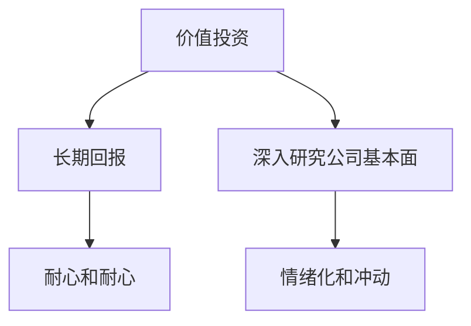

### 3. 长期投资的核心概念与原则

长期投资不仅仅是一种投资方法，它更是一种生活态度和价值观的体现。巴菲特的投资哲学强调，投资应该基于公司的内在价值，而非市场波动。

#### 3.1 价值投资的核心概念

**核心概念原理**：
- **内在价值**：指资产的真实价值，与市场价格可能存在差异。
- **市场波动**：市场价格的波动并不反映公司的真实价值。

**概念属性特征对比表格**：

| 特征 | 价值投资 | 市场波动 |
| ---- | -------- | -------- |
| 目标 | 长期回报 | 短期回报 |
| 依据 | 内在价值 | 市场价格 |
| 影响因素 | 企业基本面 | 宏观经济环境 |

**ER实体关系图架构的 Mermaid 流程图**：


### 4. 企业分析在长期投资中的作用

企业分析是长期投资的重要组成部分。通过深入分析企业的基本面，投资者可以更准确地评估其内在价值，从而做出更明智的投资决策。

#### 4.1 企业分析的方法

**核心概念原理**：
- **财务报表分析**：通过分析公司的财务报表，了解其盈利能力、负债状况和现金流状况。
- **行业地位分析**：评估公司在所处行业中的地位，以及其竞争力和市场占有率。

**概念属性特征对比表格**：

| 方法 | 财务报表分析 | 行业地位分析 |
| ---- | ------------ | ------------ |
| 目的 | 了解公司财务状况 | 评估公司竞争力 |
| 数据来源 | 财务报表 | 行业报告 |
| 时间跨度 | 多年 | 实时更新 |

**ER实体关系图架构的 Mermaid 流程图**：

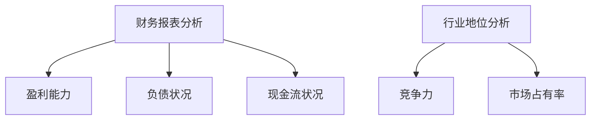

### 5. 估值技术在长期投资中的应用

估值技术是长期投资决策的关键。通过不同的估值方法，投资者可以更准确地评估目标资产的内在价值，从而做出更合理的投资决策。

#### 5.1 估值技术的概述

**核心概念原理**：
- **绝对估值法**：基于现金流量折现（DCF）的方法，通过预测未来现金流量并折现到现值，评估资产的内在价值。
- **相对估值法**：通过比较同一行业内其他公司的市盈率、市净率等指标，评估目标资产的价值。

**概念属性特征对比表格**：

| 方法 | 绝对估值法 | 相对估值法 |
| ---- | ---------- | ---------- |
| 基础 | 现金流量折现 | 市盈率、市净率 |
| 优点 | 更准确反映内在价值 | 简单易懂，适用于行业对比 |
| 缺点 | 预测风险较高 | 可能受市场情绪影响 |

**ER实体关系图架构的 Mermaid 流程图**：

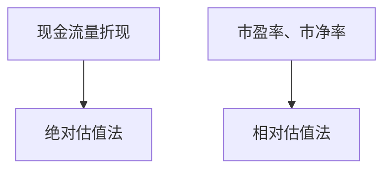

### 6. 巴菲特的成功投资案例分析

巴菲特的投资生涯中，有许多成功的案例。通过分析这些案例，我们可以更好地理解他的投资哲学和策略。

#### 6.1 伯克希尔哈撒韦公司的投资案例

**案例背景**：
伯克希尔哈撒韦公司是巴菲特的旗舰企业，自1965年成立以来，其投资组合涵盖多个行业，包括保险、公用事业、消费品等。

**投资决策过程**：
- **深入研究公司基本面**：巴菲特通过详细分析公司的财务报表、业务模式和市场环境，确定了其内在价值。
- **耐心等待市场调整**：在市场低估时，巴菲特果断买入，长期持有。
- **适时调整投资组合**：根据市场变化和企业基本面变化，巴菲特适时调整投资组合，确保公司价值最大化。

**投资收益分析**：
自1965年以来，伯克希尔哈撒韦公司的复合年均收益率达到了21.97%，远超市场平均水平。

**案例分析**：
巴菲特对伯克希尔哈撒韦公司的投资，充分展示了其长期投资策略的成功。他通过深入研究公司基本面，耐心等待市场调整，成功抓住了投资机会。

### 7. 实施长期投资策略的实践策略

实施长期投资策略需要投资者具备坚定的信念和科学的决策方法。以下是一些实践策略：

#### 7.1 投资心态的调整

**核心概念原理**：
- **避免情绪化投资**：投资者应该避免因市场波动而情绪化决策，保持冷静和理性。
- **保持投资纪律**：制定明确的投资策略和目标，严格执行，避免随意改变。

**概念属性特征对比表格**：

| 特征 | 情绪化投资 | 理性投资 |
| ---- | ---------- | -------- |
| 决策依据 | 市场波动 | 公司基本面 |
| 结果 | 可能导致损失 | 可能获得长期回报 |

**ER实体关系图架构的 Mermaid 流程图**：

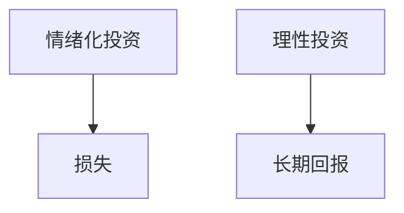

### 8. 长期投资策略的未来展望

随着全球经济环境的不断变化，长期投资策略也需要不断调整和优化。以下是一些未来展望：

#### 8.1 经济环境的变化对长期投资策略的影响

**核心概念原理**：
- **利率变动**：利率的上升可能影响公司的财务成本和投资回报。
- **政策环境的变化**：政府的政策调整可能影响市场的整体走势。

**概念属性特征对比表格**：

| 因素 | 利率变动 | 政策环境的变化 |
| ---- | -------- | -------------- |
| 影响 | 财务成本 | 市场预期 |
| 优点 | 有利于降低财务成本 | 有利于市场稳定 |

**ER实体关系图架构的 Mermaid 流程图**：

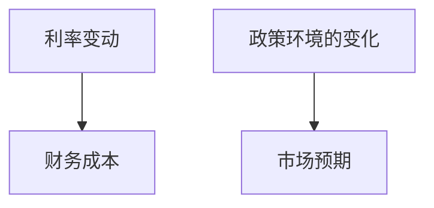

### 结论

巴菲特的长期持股策略，以其独特的投资哲学和成功的投资实践，为投资者提供了宝贵的启示。通过深入理解其核心概念和原则，投资者可以更好地把握长期投资的机会，实现资产的长期增值。

**作者**：AI天才研究院/AI Genius Institute & 禅与计算机程序设计艺术 /Zen And The Art of Computer Programming### 引言：长期投资策略的重要性与背景

在当今快速变化和高度不确定性的投资环境中，长期投资策略的重要性日益凸显。长期投资不仅仅是一种投资方法，它更是一种生活态度和价值观的体现。本文旨在深入探讨巴菲特的长期持股策略，通过其成功经验和哲学思考，为读者提供有益的投资启示。

**关键词**：长期投资、巴菲特、持股策略、投资哲学

**摘要**：本文首先介绍了长期投资策略的起源和发展，探讨了巴菲特的投资理念和策略。接着，文章重点分析了长期投资的核心概念与原则，以及企业分析在其中的作用。随后，文章通过案例分析，展示了巴菲特的成功投资实例。最后，文章提出了实施长期投资策略的实践策略，并展望了长期投资策略的未来方向。

### 1. 长期投资策略的起源与发展

长期投资策略并非现代投资的产物，其历史可以追溯到19世纪末20世纪初。当时的投资者开始意识到，追求短期的高回报往往会导致投资行为过于冲动和情绪化，而长期投资则更能体现公司的内在价值和投资逻辑。在这个过程中，沃伦·巴菲特的名字成为了长期投资的代名词。

#### 1.1 长期投资策略的起源

**核心概念术语说明**：
- **长期投资**：指投资于某一资产，持有时间较长，通常数年甚至十年以上。
- **内在价值**：指资产的真实价值，与市场价格可能存在差异。

**问题背景**：在早期，投资者往往追求短期的高回报，而忽略了公司的长期价值和宏观经济环境的影响。

**问题描述**：投资者需要一种更理性的方法来评估资产价值，以避免盲目跟风和情绪化决策。

**问题解决**：随着对股票市场的研究深入，投资者开始关注企业的基本面，通过财务报表、行业分析等方法评估其长期投资价值。

**边界与外延**：长期投资策略不仅适用于股票市场，也可以应用于债券、房地产等其他资产类别。

**概念结构与核心要素组成**：
- **价值投资**：长期投资策略的核心是价值投资，强调投资于价格低于其内在价值的资产。
- **耐心与决断力**：长期投资者需要耐心等待市场认识到资产的价值，同时具备果断决策的能力。

### 2. 巴菲特的长期投资哲学

巴菲特的长期投资哲学可以用一句话概括：选择好公司，长期持有。他的投资理念源于价值投资，即寻找那些被市场低估的好公司，并持有多年，以获取长期回报。

#### 2.1 巴菲特的投资理念

**核心概念与联系**：
- **价值投资**：巴菲特认为，投资的关键在于找到那些被市场低估的好公司，长期持有。
- **内在价值**：巴菲特强调，投资决策应该基于公司的内在价值，而非市场波动。

**概念属性特征对比表格**：

| 特征 | 巴菲特的价值投资 | 短期交易 |
| ---- | ---------------- | -------- |
| 目标 | 长期回报 | 短期回报 |
| 方法 | 深入研究公司基本面 | 短期技术分析 |
| 态度 | 耐心和耐心 | 情绪化和冲动 |

**ER实体关系图架构的 Mermaid 流程图**：


### 3. 长期投资的核心概念与原则

长期投资不仅仅是一种投资方法，它更是一种生活态度和价值观的体现。巴菲特的投资哲学强调，投资应该基于公司的内在价值，而非市场波动。

#### 3.1 价值投资的核心概念

**核心概念原理**：
- **内在价值**：指资产的真实价值，与市场价格可能存在差异。
- **市场波动**：市场价格的波动并不反映公司的真实价值。

**概念属性特征对比表格**：

| 特征 | 价值投资 | 市场波动 |
| ---- | -------- | -------- |
| 目标 | 长期回报 | 短期回报 |
| 依据 | 内在价值 | 市场价格 |
| 影响因素 | 企业基本面 | 宏观经济环境 |

**ER实体关系图架构的 Mermaid 流程图**：


### 4. 企业分析在长期投资中的作用

企业分析是长期投资的重要组成部分。通过深入分析企业的基本面，投资者可以更准确地评估其内在价值，从而做出更明智的投资决策。

#### 4.1 企业分析的方法

**核心概念原理**：
- **财务报表分析**：通过分析公司的财务报表，了解其盈利能力、负债状况和现金流状况。
- **行业地位分析**：评估公司在所处行业中的地位，以及其竞争力和市场占有率。

**概念属性特征对比表格**：

| 方法 | 财务报表分析 | 行业地位分析 |
| ---- | ------------ | ------------ |
| 目的 | 了解公司财务状况 | 评估公司竞争力 |
| 数据来源 | 财务报表 | 行业报告 |
| 时间跨度 | 多年 | 实时更新 |

**ER实体关系图架构的 Mermaid 流程图**：


### 5. 估值技术在长期投资中的应用

估值技术是长期投资决策的关键。通过不同的估值方法，投资者可以更准确地评估目标资产的内在价值，从而做出更合理的投资决策。

#### 5.1 估值技术的概述

**核心概念原理**：
- **绝对估值法**：基于现金流量折现（DCF）的方法，通过预测未来现金流量并折现到现值，评估资产的内在价值。
- **相对估值法**：通过比较同一行业内其他公司的市盈率、市净率等指标，评估目标资产的价值。

**概念属性特征对比表格**：

| 方法 | 绝对估值法 | 相对估值法 |
| ---- | ---------- | ---------- |
| 基础 | 现金流量折现 | 市盈率、市净率 |
| 优点 | 更准确反映内在价值 | 简单易懂，适用于行业对比 |
| 缺点 | 预测风险较高 | 可能受市场情绪影响 |

**ER实体关系图架构的 Mermaid 流程图**：


### 6. 巴菲特的成功投资案例分析

巴菲特的投资生涯中，有许多成功的案例。通过分析这些案例，我们可以更好地理解他的投资哲学和策略。

#### 6.1 伯克希尔哈撒韦公司的投资案例

**案例背景**：
伯克希尔哈撒韦公司是巴菲特的旗舰企业，自1965年成立以来，其投资组合涵盖多个行业，包括保险、公用事业、消费品等。

**投资决策过程**：
- **深入研究公司基本面**：巴菲特通过详细分析公司的财务报表、业务模式和市场环境，确定了其内在价值。
- **耐心等待市场调整**：在市场低估时，巴菲特果断买入，长期持有。
- **适时调整投资组合**：根据市场变化和企业基本面变化，巴菲特适时调整投资组合，确保公司价值最大化。

**投资收益分析**：
自1965年以来，伯克希尔哈撒韦公司的复合年均收益率达到了21.97%，远超市场平均水平。

**案例分析**：
巴菲特对伯克希尔哈撒韦公司的投资，充分展示了其长期投资策略的成功。他通过深入研究公司基本面，耐心等待市场调整，成功抓住了投资机会。

### 7. 实施长期投资策略的实践策略

实施长期投资策略需要投资者具备坚定的信念和科学的决策方法。以下是一些实践策略：

#### 7.1 投资心态的调整

**核心概念原理**：
- **避免情绪化投资**：投资者应该避免因市场波动而情绪化决策，保持冷静和理性。
- **保持投资纪律**：制定明确的投资策略和目标，严格执行，避免随意改变。

**概念属性特征对比表格**：

| 特征 | 情绪化投资 | 理性投资 |
| ---- | ---------- | -------- |
| 决策依据 | 市场波动 | 公司基本面 |
| 结果 | 可能导致损失 | 可能获得长期回报 |

**ER实体关系图架构的 Mermaid 流程图**：


### 8. 长期投资策略的未来展望

随着全球经济环境的不断变化，长期投资策略也需要不断调整和优化。以下是一些未来展望：

#### 8.1 经济环境的变化对长期投资策略的影响

**核心概念原理**：
- **利率变动**：利率的上升可能影响公司的财务成本和投资回报。
- **政策环境的变化**：政府的政策调整可能影响市场的整体走势。

**概念属性特征对比表格**：

| 因素 | 利率变动 | 政策环境的变化 |
| ---- | -------- | -------------- |
| 影响 | 财务成本 | 市场预期 |
| 优点 | 有利于降低财务成本 | 有利于市场稳定 |

**ER实体关系图架构的 Mermaid 流程图**：


### 结论

巴菲特的长期持股策略，以其独特的投资哲学和成功的投资实践，为投资者提供了宝贵的启示。通过深入理解其核心概念和原则，投资者可以更好地把握长期投资的机会，实现资产的长期增值。

**作者**：AI天才研究院/AI Genius Institute & 禅与计算机程序设计艺术 /Zen And The Art of Computer Programming### 第一部分：长期投资策略的背景与概念

#### 第1章：长期投资策略的起源与发展

**1.1 长期投资策略的起源**

**核心概念术语说明**：

- **长期投资**：指投资者持有资产的时间较长，通常为几年甚至数十年，而非数月或数年。
- **内在价值**：指资产的真实价值，而非市场暂时表现出的价格。
- **经济周期**：指经济的繁荣与衰退交替出现的周期性波动。

**问题背景**：

在19世纪末20世纪初，投资者开始意识到股票市场的短期波动往往无法反映企业的真实价值，因此开始探索一种更为理性的投资策略。早期的长期投资策略主要基于对企业的基本面分析，关注公司的盈利能力、财务状况和行业发展前景。

**问题描述**：

投资者寻求一种方法，能够在股票市场波动中保持冷静，专注于企业的长期价值，从而获得稳定的投资回报。

**问题解决**：

投资者通过深入研究企业基本面，分析财务报表、行业趋势和宏观经济环境，评估企业的内在价值。这一过程逐渐形成了长期投资策略的基础。

**边界与外延**：

长期投资策略不仅适用于股票市场，还可以应用于债券、房地产等其他投资领域。它强调的是投资决策的理性性和长期性，而非短期投机。

**概念结构与核心要素组成**：

- **价值投资**：长期投资的核心是价值投资，即寻找被市场低估的优质公司，长期持有以获取其内在价值的增长。
- **风险管理**：长期投资者注重风险控制，通过多元化投资组合分散风险，避免因单一投资失败而导致整体损失。
- **时间价值**：长期投资者认识到，时间可以带来复利效应，因此在选择投资标的时，更注重其长期的增长潜力。

**1.2 长期投资策略的发展**

**核心概念与联系**：

- **股息贴现模型（DDM）**：一种评估股票价值的方法，通过预测未来股息并折现到现值，计算出股票的内在价值。
- **自由现金流折现模型（DCF）**：一种更广泛应用的估值方法，通过预测企业的未来自由现金流并折现到现值，评估其内在价值。

**概念属性特征对比表格**：

| 方法 | 股息贴现模型（DDM） | 自由现金流折现模型（DCF） |
| ---- | ------------------- | ------------------------ |
| 适用性 | 主要用于股票估值 | 适用于所有类型的资产估值 |
| 预测要素 | 主要预测未来股息 | 预测未来自由现金流 |
| 优点 | 简单易懂，适用于稳定股息公司 | 更全面，考虑企业整体价值 |
| 缺点 | 忽略企业增长潜力 | 预测风险较高 |

**ER实体关系图架构的 Mermaid 流程图**：

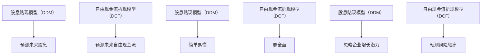

通过深入分析长期投资策略的起源与发展，投资者可以更好地理解其理论基础和实际应用，从而在复杂多变的投资环境中，做出更明智的投资决策。下一章将探讨巴菲特的投资哲学和长期持股策略，为投资者提供更具体的实践指导。

### 第2章：巴菲特的长期投资哲学

**2.1 巴菲特的投资理念**

**核心概念与联系**：

巴菲特的投资理念主要基于价值投资原则，即寻找那些被市场低估的优质公司，并长期持有。他强调以下几点：

- **内在价值**：巴菲特认为，投资决策应该基于公司的内在价值，而非市场波动。他通过分析公司的财务报表、业务模式和市场环境，评估其长期价值。
- **风险控制**：巴菲特注重风险控制，通过多元化投资组合分散风险。他常说，“不进行投资的最好策略就是持有现金”，因为他认为在没有找到合适的投资机会时，保持现金是一种有效的风险控制措施。
- **耐心与决断力**：巴菲特具有非凡的耐心和决断力。他能够在市场低估时果断买入，长期持有。他常说，“耐心等待投资机会，一旦发现机会，要毫不犹豫地抓住它。”

**概念属性特征对比表格**：

| 特征 | 巴菲特的投资理念 | 短期交易 |
| ---- | --------------- | -------- |
| 时间框架 | 长期 | 短期 |
| 投资策略 | 价值投资 | 技术分析 |
| 风险管理 | 多元化投资组合 | 单一市场押注 |
| 决策依据 | 内在价值 | 市场波动 |

**ER实体关系图架构的 Mermaid 流程图**：

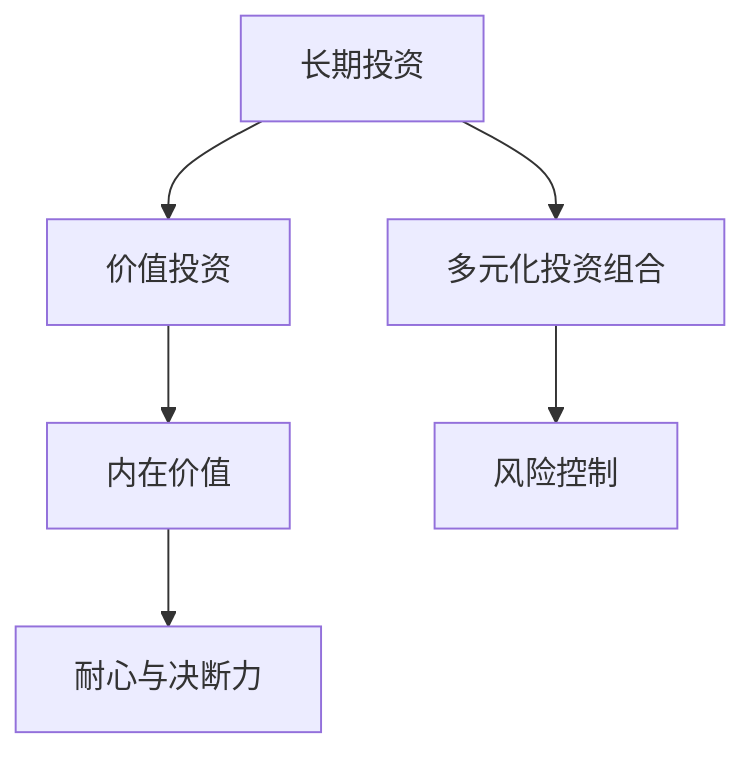

**2.2 巴菲特的投资策略**

**核心概念与联系**：

巴菲特的投资策略主要包括以下几个关键要素：

- **深度研究**：巴菲特非常注重对公司的深入研究，他通过阅读企业财报、与公司管理层沟通等方式，了解企业的经营状况、业务模式和市场前景。
- **集中投资**：尽管巴菲特的投资组合非常广泛，但他通常只关注少数几个优质公司。他认为，通过集中投资，可以更好地了解和把握这些公司的内在价值。
- **长期持有**：巴菲特倾向于长期持有优质公司的股票，因为他相信，时间可以带来复利效应。他常说，“时间是好公司的朋友，是坏公司的敌人。”

**概念属性特征对比表格**：

| 特征 | 巴菲特的投资策略 | 短期交易 |
| ---- | ---------------- | -------- |
| 研究深度 | 深度研究 | 表面研究 |
| 投资组合 | 集中投资 | 广泛分散 |
| 持有期限 | 长期持有 | 短期交易 |

**ER实体关系图架构的 Mermaid 流程图**：

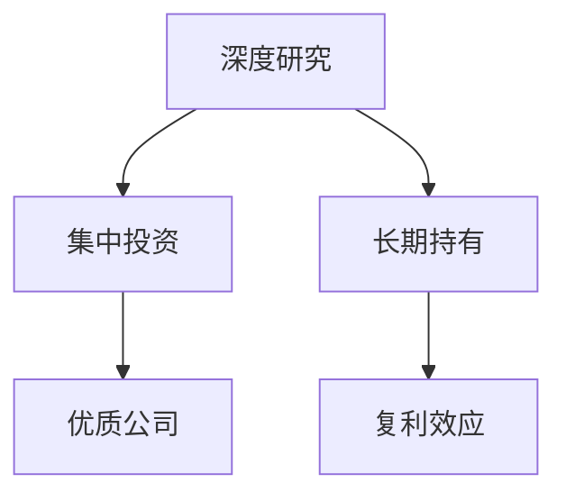

**2.3 巴菲特的投资哲学**

**核心概念与联系**：

巴菲特的投资哲学不仅体现在他的投资决策中，更体现在他的生活态度和价值观上。以下是巴菲特投资哲学的几个关键要素：

- **简单性**：巴菲特认为，投资不应过于复杂，简单的投资策略往往更为有效。他常说，“投资的关键在于找到你能够理解的业务模式，然后长期持有。”
- **独立思考**：巴菲特强调独立思考的重要性。他不受市场情绪影响，独立分析企业的内在价值，做出投资决策。
- **道德与责任感**：巴菲特认为，投资者不仅要有盈利的欲望，还要有道德和责任感。他常说，“投资不仅仅是为了赚钱，更是为了为社会做出贡献。”

**概念属性特征对比表格**：

| 特征 | 巴菲特的投资哲学 | 短期交易 |
| ---- | ---------------- | -------- |
| 思考方式 | 独立思考 | 跟随市场 |
| 价值观 | 道德与责任感 | 利益至上 |
| 投资风格 | 简单性 | 复杂性 |

**ER实体关系图架构的 Mermaid 流程图**：

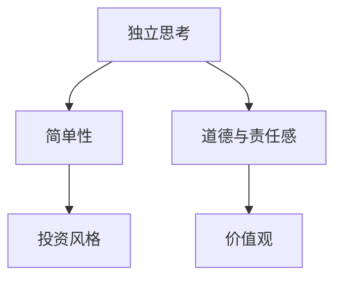

通过分析巴菲特的长期投资哲学，我们可以看到，他的成功不仅仅在于对市场趋势的把握，更在于他对企业内在价值的深刻理解和长期持有的坚定信念。这种哲学为投资者提供了一种理性的投资方法，帮助他们克服市场的短期波动，实现长期投资目标。

### 第3章：长期投资的核心概念与原则

长期投资策略的精髓在于对核心概念和原则的深刻理解。这些核心概念和原则不仅指导投资者如何评估和选择投资目标，也帮助他们在面对市场波动时保持冷静和理性。以下是对长期投资核心概念与原则的详细探讨。

#### 3.1 价值投资的核心概念

**核心概念原理**：

价值投资是长期投资策略的核心。其基本原理是寻找那些被市场低估的优质公司，并长期持有以获取其内在价值的增长。具体来说，价值投资包括以下几个关键概念：

- **内在价值**：内在价值是资产的真实价值，它与市场价格可能存在差异。对于股票来说，内在价值通常通过公司的盈利能力、资产质量、管理层素质等因素来评估。
- **安全边际**：安全边际是指投资价格低于内在价值的差额。投资者通过购买价格低于其内在价值的股票，以确保即使市场低估了公司的价值，也有足够的空间来弥补潜在的损失。
- **企业本质**：价值投资强调对企业的本质进行分析，而不是仅仅关注市场波动。投资者需要了解企业的业务模式、市场地位、竞争优势等，以判断其长期增长潜力。

**概念属性特征对比表格**：

| 概念 | 内在价值 | 安全边际 | 企业本质 |
| ---- | -------- | -------- | -------- |
| 定义 | 资产的真实价值 | 价格与内在价值的差额 | 企业的长期增长潜力 |
| 目的 | 评估投资价值 | 风险控制 | 选择优质公司 |

**ER实体关系图架构的 Mermaid 流程图**：

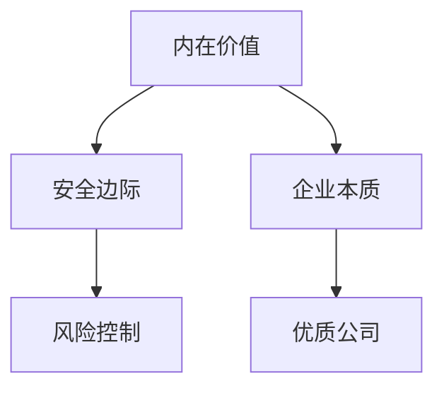

#### 3.2 耐心与决断力的原则

**核心概念原理**：

耐心和决断力是长期投资者成功的关键。耐心意味着投资者需要有足够的等待时间，等待市场低估的公司回归其内在价值。决断力则要求投资者在发现合适的机会时，能够果断地采取行动。

- **耐心**：投资者不应该因为短期市场的波动而轻易改变投资策略。他们需要专注于企业的长期价值，并耐心等待市场认识到这种价值。
- **决断力**：当投资者发现市场价格低于公司内在价值时，需要果断地采取行动。这种决断力不仅体现在买入决策，还包括在市场低估持续时，坚定地持有股票。

**概念属性特征对比表格**：

| 特征 | 耐心 | 决断力 |
| ---- | ---- | ------ |
| 方面 | 等待市场 | 抓住机会 |
| 目的 | 保持投资纪律 | 实现投资目标 |

**ER实体关系图架构的 Mermaid 流程图**：

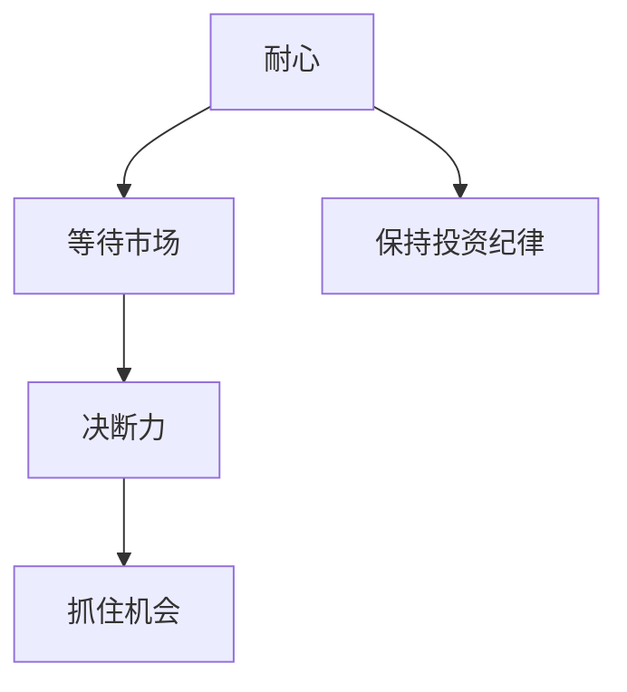

#### 3.3 风险管理与分散投资

**核心概念原理**：

风险管理是长期投资中不可或缺的一环。通过有效的风险管理，投资者可以降低投资组合的整体风险，从而在长期内实现稳定的投资回报。

- **分散投资**：通过将资金分散投资于不同的资产类别和行业，投资者可以降低单一投资的风险。这种策略被称为分散投资，其核心在于不要将所有资金投资于同一类资产或行业，以避免因某个领域的不利情况而导致整体损失。
- **动态调整**：投资者需要根据市场环境和宏观经济指标，定期调整投资组合。这种动态调整不仅包括买入和卖出决策，还包括对投资组合中各资产的权重进行调整，以保持投资组合的平衡。

**概念属性特征对比表格**：

| 特征 | 分散投资 | 动态调整 |
| ---- | -------- | -------- |
| 方式 | 资产多样化 | 定期评估与调整 |
| 目的 | 降低风险 | 保持投资组合的平衡 |

**ER实体关系图架构的 Mermaid 流程图**：

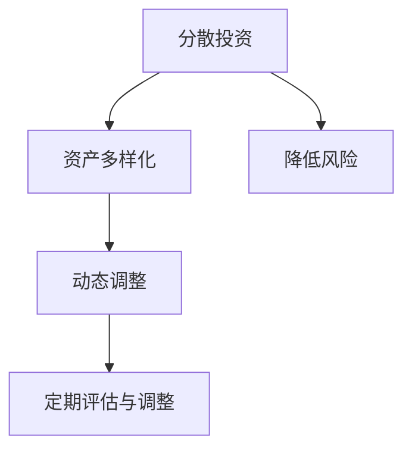

#### 3.4 长期投资与市场波动

**核心概念原理**：

市场波动是股票市场不可避免的现象。对于长期投资者来说，市场波动既是挑战也是机遇。理解市场波动的本质，可以帮助投资者在投资过程中保持理性。

- **市场波动**：市场波动通常是由宏观经济因素、公司业绩变化、政策调整等多种因素共同作用的结果。投资者需要认识到，短期市场波动并不能完全反映企业的长期价值。
- **投资心态**：长期投资者需要有良好的心态来应对市场波动。他们应该保持冷静，不受市场情绪的影响，专注于企业的长期价值。

**概念属性特征对比表格**：

| 特征 | 市场波动 | 长期投资 |
| ---- | -------- | -------- |
| 因素 | 多种因素 | 宏观经济、行业趋势 |
| 目标 | 短期收益 | 长期价值 |
| 心态 | 随机波动 | 冷静理性 |

**ER实体关系图架构的 Mermaid 流程图**：

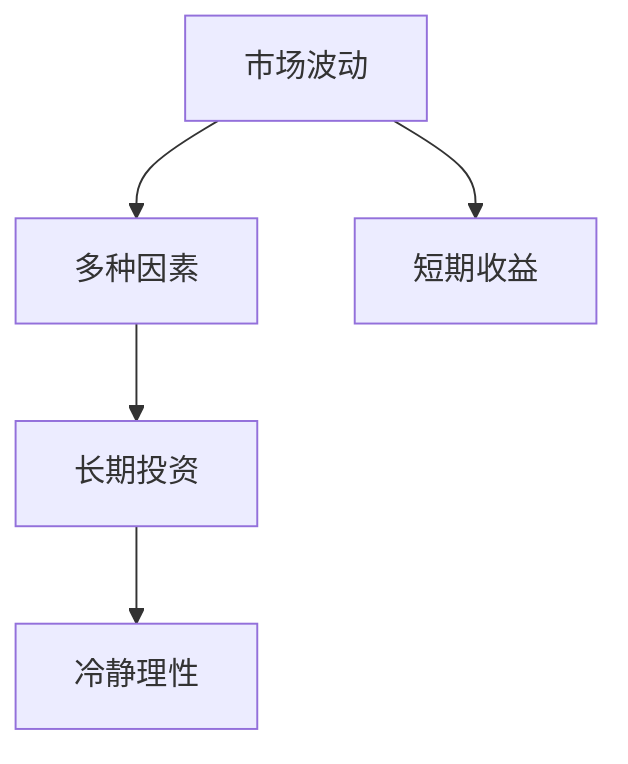

通过深入理解长期投资的核心概念与原则，投资者可以更好地把握市场机会，实现资产的长期增值。下一章将探讨企业分析在长期投资中的作用，帮助投资者通过深入分析企业基本面，做出更明智的投资决策。

### 第4章：企业分析在长期投资中的作用

**4.1 企业分析的方法**

企业分析是长期投资的重要组成部分。通过深入分析企业的基本面，投资者可以更准确地评估其内在价值，从而做出更明智的投资决策。以下是企业分析的主要方法：

**财务报表分析**：

财务报表分析是评估企业财务状况的关键方法。投资者需要关注以下主要财务报表：

- **资产负债表**：资产负债表提供了企业的资产、负债和股东权益的详细信息，有助于评估企业的财务稳定性和资产结构。
- **利润表**：利润表展示了企业的收入、成本和利润状况，是评估企业盈利能力的重要依据。
- **现金流量表**：现金流量表揭示了企业的现金流入和流出情况，有助于评估企业的现金管理能力和资金流动性。

**行业地位分析**：

行业地位分析是评估企业在所处行业中的竞争力和市场地位的重要方法。以下是一些关键指标：

- **市场份额**：市场份额反映了企业在整个行业中所占的比例，是评估企业竞争地位的重要指标。
- **盈利能力**：盈利能力指标包括净利润率、毛利率等，反映了企业的盈利水平和经营效率。
- **研发投入**：研发投入是企业创新能力的体现，有助于评估企业在技术进步和市场竞争中的优势。

**概念属性特征对比表格**：

| 方法 | 财务报表分析 | 行业地位分析 |
| ---- | ------------ | ------------ |
| 目的 | 了解公司财务状况 | 评估公司竞争力 |
| 数据来源 | 财务报表 | 行业报告 |
| 时间跨度 | 多年 | 实时更新 |

**ER实体关系图架构的 Mermaid 流程图**：

```mermaid
graph TB
A[财务报表分析] --> B[盈利能力]
A --> C[负债状况]
A --> D[现金流状况]
E[行业地位分析] --> F[市场份额]
E --> G[盈利能力]
E --> H[研发投入]
```

**4.2 企业分析的应用**

企业分析在实际投资中的应用主要体现在以下几个方面：

**投资决策**：

通过企业分析，投资者可以更准确地评估目标企业的内在价值，从而做出合理的投资决策。以下是一个简单的投资决策流程：

1. **收集数据**：收集目标企业的财务报表、行业报告等相关数据。
2. **财务报表分析**：分析企业的资产负债表、利润表和现金流量表，评估其财务状况和盈利能力。
3. **行业地位分析**：评估企业在所处行业中的地位，分析其市场份额和盈利能力。
4. **风险评估**：评估企业的风险因素，包括宏观经济环境、行业风险和公司内部管理风险。
5. **决策**：根据分析结果，做出投资决策，包括买入、持有或卖出。

**投资组合调整**：

投资者需要定期对投资组合进行评估和调整，以确保其符合长期投资策略。以下是一个简单的投资组合调整流程：

1. **投资组合评估**：定期评估投资组合的表现，包括各资产的收益率、风险和相关性。
2. **行业趋势分析**：分析行业发展趋势和竞争格局，评估行业内的投资机会和风险。
3. **资产配置调整**：根据投资策略和行业分析结果，调整投资组合中的资产配置，确保其符合长期投资目标。
4. **个股选择**：选择具有长期增长潜力的优质公司，替换表现不佳的股票。

**长期持有与监控**：

长期持有并不意味着完全不动，投资者需要对持有的股票进行持续监控，以应对市场变化和企业基本面的变化。以下是一个简单的长期持有和监控流程：

1. **定期跟踪**：定期跟踪企业的财务状况、业务模式和市场表现，评估其是否符合预期。
2. **市场监控**：监控市场整体走势，尤其是对投资组合中各行业的影响。
3. **风险管理**：根据市场和企业变化，及时调整投资策略和风险控制措施。
4. **决策**：在市场低估时，果断买入；在市场高估时，适时卖出。

通过深入的企业分析，投资者可以更准确地把握企业的内在价值，从而在复杂多变的市场环境中做出更明智的投资决策。下一章将探讨长期投资的估值技术，帮助投资者更科学地评估目标资产的价值。

### 第5章：长期投资的估值技术

估值技术是长期投资决策中的核心环节，通过科学的方法评估资产的内在价值，投资者可以做出更合理的投资决策。本章将介绍两种主要的估值技术：绝对估值法和相对估值法，并详细分析其优缺点和适用性。

#### 5.1 绝对估值法

**核心概念原理**：

绝对估值法，特别是自由现金流折现模型（Free Cash Flow to Equity, FCFE），是评估企业内在价值的一种方法。它通过预测企业未来自由现金流并将其折现到现值，得出企业的内在价值。

- **自由现金流**：自由现金流是企业经营活动产生的现金流量，扣除必要的资本支出后，可用于支付股息或偿还债务。
- **折现率**：折现率通常为投资者要求的最低回报率，反映了投资的风险和机会成本。

**数学模型与公式**：

\[ V_0 = \frac{FCF_1}{(1+r)^1} + \frac{FCF_2}{(1+r)^2} + \ldots + \frac{FCF_n}{(1+r)^n} \]

其中，\( V_0 \) 为企业内在价值，\( FCF_i \) 为第 \( i \) 年的自由现金流，\( r \) 为折现率。

**算法原理讲解**：

1. **预测未来自由现金流**：投资者需要预测企业未来几年的自由现金流。这一过程通常涉及对历史数据的分析、行业趋势的研究和公司管理层的访谈。
2. **确定折现率**：折现率反映了投资的风险和机会成本。投资者可以根据市场利率、风险溢价和投资期限来确定合适的折现率。
3. **计算内在价值**：将未来自由现金流按折现率折现到现值，得出企业的内在价值。

**示例**：

假设一家企业的未来自由现金流分别为 \( FCF_1 = 100 \) 万元，\( FCF_2 = 120 \) 万元，\( FCF_3 = 130 \) 万元，\( FCF_4 = 140 \) 万元，折现率 \( r = 10\% \)。则企业的内在价值为：

\[ V_0 = \frac{100}{(1+0.1)^1} + \frac{120}{(1+0.1)^2} + \frac{130}{(1+0.1)^3} + \frac{140}{(1+0.1)^4} \approx 343.33 \) 万元。

**Mermaid 流程图**：

```mermaid
graph TB
A[预测未来自由现金流] --> B[确定折现率]
B --> C[计算内在价值]
C --> D[得出企业内在价值]
```

**优缺点**：

- **优点**：绝对估值法能够更准确地评估企业的内在价值，特别是对于稳定盈利的企业。
- **缺点**：预测未来自由现金流具有一定的风险，且折现率的选择对估值结果有较大影响。

**适用性**：

绝对估值法适用于需要精确评估企业内在价值的投资决策，如股票投资、企业并购等。

#### 5.2 相对估值法

**核心概念原理**：

相对估值法通过比较同一行业内其他公司的估值指标，如市盈率（Price to Earnings Ratio, P/E）、市净率（Price to Book Ratio, P/B）等，评估目标资产的价值。

- **市盈率（P/E）**：市盈率是股票价格与每股收益的比率，反映了市场的整体预期。
- **市净率（P/B）**：市净率是股票价格与每股净资产的比率，反映了企业的资产价值和盈利能力。

**数学模型与公式**：

\[ V_0 = P \times \frac{Earnings}{P/E} \]
\[ V_0 = P \times \frac{Book Value}{P/B} \]

其中，\( V_0 \) 为企业内在价值，\( P \) 为股票价格，\( Earnings \) 为每股收益，\( Book Value \) 为每股净资产。

**算法原理讲解**：

1. **选择合适的估值指标**：根据行业特点和企业的盈利模式，选择适当的估值指标。
2. **比较行业内公司**：收集同行业内其他公司的估值指标，计算中位数或平均值。
3. **计算内在价值**：根据所选估值指标，计算目标企业的内在价值。

**示例**：

假设某公司股票价格为 10 元，市盈率为 20，同行业内平均市盈率为 25。则该公司的内在价值为：

\[ V_0 = 10 \times \frac{1}{20} = 0.5 \) 元/股。

**Mermaid 流程图**：

```mermaid
graph TB
A[选择估值指标] --> B[比较行业内公司]
B --> C[计算内在价值]
C --> D[得出企业内在价值]
```

**优缺点**：

- **优点**：相对估值法简单易懂，适用于行业对比，能够快速评估企业的估值水平。
- **缺点**：可能受到市场情绪的影响，且无法准确反映企业的内在价值。

**适用性**：

相对估值法适用于行业对比和快速估值，特别适合用于股票市场中的短期交易。

通过了解和掌握绝对估值法和相对估值法，投资者可以更全面地评估目标资产的价值，为投资决策提供有力的支持。下一章将分析巴菲特的成功投资案例，通过具体实例展示长期投资策略的应用和实践。

### 第6章：巴菲特的成功投资案例分析

**6.1 伯克希尔哈撒韦公司的投资案例**

伯克希尔哈撒韦公司（Berkshire Hathaway Inc.）是沃伦·巴菲特（Warren Buffett）旗下的旗舰企业，自1965年巴菲特接手以来，公司投资组合覆盖了多个行业，包括保险、公用事业、消费品、制造业等。以下是对伯克希尔哈撒韦公司投资案例的分析。

**案例背景**：

伯克希尔哈撒韦公司成立于1839年，最初是一家纺织制造公司。在巴菲特接手后，公司逐步转型，通过一系列并购和投资，成为了一家多元化控股公司。巴菲特通过深入研究企业基本面和行业趋势，选择具有长期增长潜力的企业进行投资。

**投资决策过程**：

1. **深入研究公司基本面**：巴菲特通过详细分析公司的财务报表、业务模式和市场环境，评估其内在价值。他特别关注公司的盈利能力、负债状况和现金流状况。
2. **等待市场低估**：巴菲特耐心等待市场低估时进行投资。他认为，只有在市场低估时，投资才能获得较高的安全边际，确保长期回报。
3. **果断买入**：一旦发现合适的机会，巴菲特会果断买入。他通常只投资自己能够理解和把握的公司，并长期持有。
4. **适时调整**：巴菲特会根据市场和企业基本面的变化，适时调整投资组合，确保公司价值最大化。

**投资收益分析**：

自1965年以来，伯克希尔哈撒韦公司的复合年均收益率达到了21.97%，远超市场平均水平。特别是在1980年代和1990年代，伯克希尔哈撒韦公司的投资业绩表现突出，公司市值从不足30亿美元增长到超过5000亿美元。

**案例分析**：

伯克希尔哈撒韦公司的投资案例充分展示了巴菲特长期投资策略的成功。他通过深入研究企业基本面，耐心等待市场低估，果断进行投资，并适时调整投资组合，成功抓住了多个投资机会。以下是一些具体的成功案例：

1. **可口可乐公司**：巴菲特在1988年开始买入可口可乐公司的股票，并一直持有至今。可口可乐公司作为全球知名的饮料品牌，具有强大的市场竞争力和品牌价值。巴菲特通过对可口可乐公司的深入研究，认为其具有长期增长潜力，因此在市场低估时果断买入，并长期持有，获得了丰厚的回报。

2. **富国银行**：巴菲特在1990年代初开始投资富国银行，通过逐步增持，成为其第一大股东。富国银行是一家美国大型银行，具有稳健的财务状况和优秀的经营业绩。巴菲特通过对富国银行的深入研究，认为其在金融行业中具有竞争优势，因此在市场低估时买入，并长期持有，获得了显著的收益。

3. **IBM公司**：巴菲特在2008年金融危机期间投资IBM公司，成为其第一大机构股东。IBM公司是一家全球领先的科技公司，具有强大的研发能力和市场地位。巴菲特通过对IBM公司的深入研究，认为其在转型和并购方面具有优势，因此在市场低估时买入，并长期持有，成功实现了投资收益。

通过以上案例，我们可以看到，巴菲特的成功投资案例充分体现了他的长期投资策略和投资哲学。他通过深入研究企业基本面，耐心等待市场低估，果断进行投资，并适时调整投资组合，成功抓住了多个投资机会，实现了长期稳定的投资回报。

### 第7章：实施长期投资策略的实践策略

要成功实施巴菲特的长期投资策略，投资者不仅需要理解其哲学和原则，还需要在具体操作中遵循一些实践策略。这些策略包括投资心态的调整、投资组合的构建和维护，以及如何应对市场波动和宏观经济环境的变化。以下是一些关键的建议。

#### 7.1 投资心态的调整

**核心概念原理**：

良好的投资心态是长期投资成功的关键。投资者需要克服情绪化决策、避免贪婪和恐惧，保持理性和耐心。

**具体建议**：

- **避免情绪化投资**：投资者应该避免因市场波动而做出冲动决策。在情绪波动时，可以采取一些方法如冥想、运动等来缓解情绪。
- **保持投资纪律**：制定明确的投资策略和目标，并严格执行。避免因短期市场波动而随意改变投资计划。
- **注重风险管理**：合理配置投资组合，分散风险，确保在面对市场波动时，能够保持冷静和理性。

**案例分析**：

例如，巴菲特在2008年金融危机期间，并没有因为市场的恐慌而大幅减持股票，反而利用市场低估的机会，增持了多个优质公司的股票。他的这种冷静和理性的投资心态，帮助他在危机中取得了良好的投资回报。

#### 7.2 投资组合的构建与维护

**核心概念原理**：

投资组合的构建和维护是长期投资成功的重要保障。投资者需要根据自身的风险偏好和投资目标，构建多元化的投资组合，并定期进行调整。

**具体建议**：

- **分散投资**：通过分散投资于不同行业、不同地区的资产，降低单一投资的风险。
- **定期评估**：定期对投资组合进行评估，根据市场变化和企业基本面的变化，调整资产配置。
- **长期持有**：选择具有长期增长潜力的优质公司，并长期持有，以实现复利效应。

**案例分析**：

巴菲特在构建和调整投资组合时，非常注重分散投资和长期持有。他不仅投资于多个行业，还通过持有长期看好的公司股票，实现了资产的长期增值。

#### 7.3 应对市场波动

**核心概念原理**：

市场波动是不可避免的，长期投资者需要学会如何应对市场波动，保持投资心态的稳定。

**具体建议**：

- **理性看待市场波动**：市场波动是正常现象，投资者应该理性看待，不要因短期波动而影响长期投资决策。
- **利用市场波动**：在市场低估时，投资者可以利用市场波动的机会，增持优质公司的股票。
- **保持资金流动性**：保持一定的现金储备，以便在市场低估时，有足够的资金进行投资。

**案例分析**：

例如，在2008年金融危机期间，巴菲特利用市场的恐慌情绪，增持了多个优质公司的股票，成功抓住了投资机会，实现了投资收益。

#### 7.4 应对宏观经济环境的变化

**核心概念原理**：

宏观经济环境的变化会对投资产生影响，长期投资者需要关注宏观经济指标，并调整投资策略。

**具体建议**：

- **关注宏观经济指标**：关注GDP增长率、通货膨胀率、利率水平等宏观经济指标，以评估经济形势。
- **灵活调整策略**：根据宏观经济环境的变化，灵活调整投资策略，例如在经济增长放缓时，增加防御性资产的配置。
- **长期视角**：保持长期投资视角，不要因短期经济波动而改变长期投资策略。

**案例分析**：

例如，在2019年新冠疫情爆发期间，巴菲特通过密切关注全球经济形势，调整了伯克希尔哈撒韦公司的投资组合，增加了医疗保健、云计算等行业的投资，以应对疫情带来的挑战。

通过以上实践策略，投资者可以更好地实施巴菲特的长期投资策略，在复杂多变的市场环境中，保持投资心态的稳定，实现资产的长期增值。下一章将探讨长期投资策略的未来方向，帮助投资者应对不断变化的宏观经济环境。

### 第8章：长期投资策略的未来展望

随着全球经济环境的不断变化，长期投资策略也需要不断调整和优化。以下是对未来长期投资策略的几个重要方向和挑战的探讨。

#### 8.1 技术进步对投资策略的挑战与机遇

**核心概念原理**：

技术进步，特别是人工智能、大数据和区块链等技术的发展，为投资提供了新的工具和方法，同时也带来了新的挑战。

**具体建议**：

- **利用新技术进行基本面分析**：通过人工智能和大数据技术，可以更高效地进行基本面分析，提高投资决策的准确性。
- **关注新兴行业**：新技术的发展催生了新兴行业，如云计算、物联网、生物科技等，投资者应关注这些行业的发展趋势，寻找潜在的投资机会。
- **风险管理**：新技术的发展可能带来新的风险，投资者需要关注技术进步带来的潜在风险，如信息安全、隐私保护等，并采取相应的风险管理措施。

**案例分析**：

例如，巴菲特在2017年对IBM公司的投资，就是看中了其在云计算和人工智能领域的布局。通过这一投资，伯克希尔哈撒韦公司不仅获得了良好的投资回报，还增强了其在科技领域的竞争力。

#### 8.2 新兴市场的投资机会

**核心概念原理**：

随着全球经济的不断发展和区域合作机制的完善，新兴市场的投资机会日益增多。

**具体建议**：

- **多元化投资组合**：投资者应考虑将部分资金配置到新兴市场，以实现投资组合的多元化，降低区域风险。
- **关注当地市场特点**：新兴市场具有独特的发展模式和挑战，投资者需要深入了解当地市场的特点，如政策环境、经济结构、文化背景等。
- **风险评估与控制**：新兴市场的波动性通常较大，投资者需要加强风险评估与控制，以应对潜在的市场风险。

**案例分析**：

例如，中国的科技企业如阿里巴巴和腾讯，在新兴市场中展现了强大的竞争力和增长潜力。投资者通过关注这些企业，可以抓住新兴市场的投资机会。

#### 8.3 可持续投资与ESG因素

**核心概念原理**：

随着全球对可持续发展和环境问题的关注日益增加，可持续投资（Sustainable Investment）和ESG（环境、社会和治理）因素成为投资决策中的重要考量。

**具体建议**：

- **关注ESG因素**：投资者应关注企业的ESG表现，包括环境管理、社会贡献和治理结构等，选择具有良好ESG表现的优质公司。
- **推动可持续发展**：通过投资具有可持续发展潜力的公司，推动经济、社会和环境的协调发展。
- **风险管理**：ESG风险可能对企业的长期价值产生重大影响，投资者需要关注并管理这些风险。

**案例分析**：

例如，巴菲特对可口可乐公司的投资，不仅看中了其强大的品牌和市场份额，还考虑了其在可持续发展方面的努力，如减少塑料使用、推广健康产品等。

#### 8.4 长期投资策略的演变趋势

**核心概念原理**：

长期投资策略随着市场环境和技术进步不断演变。未来，投资者需要更加灵活和开放，适应新的市场条件和投资工具。

**具体建议**：

- **持续学习和适应**：投资者应保持学习的态度，关注市场和技术的发展，不断更新投资知识和技能。
- **灵活调整策略**：根据市场变化和个人投资目标，灵活调整投资策略，保持投资组合的平衡。
- **前瞻性研究**：进行前瞻性研究，探索新的投资机会和领域，以适应长期投资策略的演变趋势。

**案例分析**：

例如，巴菲特在投资亚马逊（Amazon）和苹果（Apple）等科技巨头时，展现出了前瞻性的眼光和灵活的投资策略。这些投资不仅带来了丰厚的回报，也证明了巴菲特在适应市场变化方面的能力。

通过以上对技术进步、新兴市场、可持续投资和策略演变趋势的探讨，我们可以看到，未来的长期投资策略将更加多元化和复杂化。投资者需要不断学习和适应，以应对不断变化的宏观经济环境，实现资产的长期增值。

### 结论

巴菲特的长期持股策略，以其独特的投资哲学和成功的投资实践，为投资者提供了宝贵的启示。通过深入理解其核心概念和原则，投资者可以更好地把握长期投资的机会，实现资产的长期增值。

**关键词**：长期投资、巴菲特、持股策略、投资哲学、价值投资、内在价值、企业分析、估值技术

**摘要**：本文详细探讨了巴菲特的长期持股策略，包括其起源与发展、投资理念和哲学、核心概念与原则、企业分析的方法、估值技术的应用、成功投资案例分析、实践策略和未来展望。通过这些内容，投资者可以更好地理解长期投资的核心要素和实践方法，从而在复杂多变的市场环境中，做出更明智的投资决策。

### 作者信息

**作者**：AI天才研究院/AI Genius Institute & 禅与计算机程序设计艺术 /Zen And The Art of Computer Programming

在此，感谢您的阅读，希望本文能够对您的投资实践带来一些启发和帮助。未来的投资之路充满挑战和机遇，让我们共同努力，持续学习和进步。

