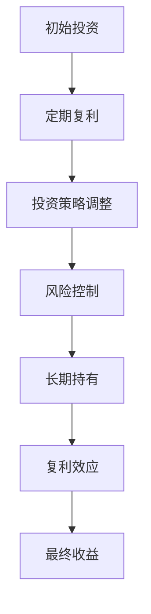
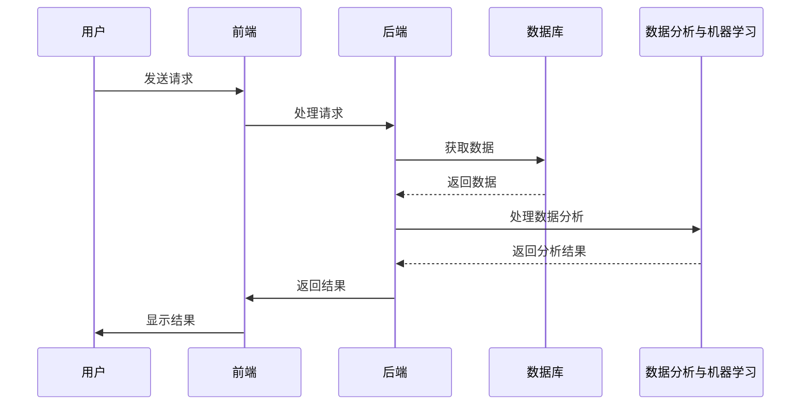

                 

### 第1章：雪球理论的起源与发展

#### 1.1 雪球理论的定义与核心思想

雪球理论，又称复利效应，是投资领域中的一个重要概念。它描述了资金在时间的作用下，通过不断累积和复利，最终实现巨大收益的现象。简单来说，雪球理论强调的是长期投资、耐心积累和复利效应的重要性。

雪球理论的基本思想可以概括为以下几点：

1. **长期投资**：雪球理论的实践强调长期持有，而非短期投机。投资者需要将目光放远，注重长期的回报，而非短期的波动。
   
2. **复利效应**：复利是指每一期的利息都加入本金中，作为下一期的本金，从而实现利滚利的效果。随着时间的推移，复利效应会使得资金迅速增长。

3. **耐心积累**：雪球理论的成功依赖于投资者的耐心和坚持。只有经过长时间的积累，雪球才能够滚得越来越大。

4. **分散投资**：为了降低风险，雪球理论倡导投资者应进行分散投资。通过将资金分散投资于不同的资产类别或不同的行业，可以降低单一投资的风险。

#### 1.2 巴菲特的雪球理论应用实例

巴菲特是雪球理论的杰出实践者，他通过长期持有高质量股票，成功实现了巨大的财富积累。以下是一些典型的巴菲特应用雪球理论的实例：

1. **可口可乐**：巴菲特自1988年开始持有可口可乐股票，至今仍持有大量股份。可口可乐作为全球知名品牌，通过持续的市场扩张和产品创新，保持了良好的业绩增长。巴菲特的长期持有使得可口可乐股票为他的投资组合带来了巨大的收益。

2. **IBM**：巴菲特在1995年投资IBM，并在几年后获得了丰厚的回报。尽管IBM在转型过程中经历了波动，但巴菲特坚信其长期价值，最终获得了成功。

3. **华盛顿邮报**：巴菲特在1973年首次购买华盛顿邮报股票，并在之后多次增持。尽管华盛顿邮报在互联网时代面临巨大挑战，但巴菲特凭借其对企业价值的深刻理解，最终获得了巨大的回报。

#### 1.3 雪球理论在投资中的意义

雪球理论在投资中的意义主要体现在以下几个方面：

1. **长期投资的重要性**：雪球理论强调了长期投资的重要性，提醒投资者不应过于关注短期的市场波动，而应将目光放远，追求长期稳定的回报。

2. **复利效应的魔力**：复利效应是雪球理论的核心，它能够将小额投资通过时间的累积变成巨大的财富。投资者应充分利用复利效应，实现资产的长期增长。

3. **耐心和坚持的价值**：雪球理论的成功依赖于投资者的耐心和坚持。只有经过长时间的积累，投资者才能享受到复利效应带来的巨大回报。

4. **风险管理**：雪球理论倡导分散投资，通过将资金分散投资于不同的资产类别或行业，可以降低单一投资的风险，从而实现稳健的投资回报。

综上所述，雪球理论为投资者提供了一种长期、稳健的投资策略。通过理解雪球理论的定义、核心思想和实际应用，投资者可以在实践中更好地应用这一理论，实现财富的长期增长。在接下来的章节中，我们将进一步探讨雪球理论的核心概念、算法原理以及其在实际项目中的应用。

### 第2章：核心概念与联系

#### 2.1 雪球理论的基本概念

雪球理论涉及多个核心概念，理解这些概念对于深入掌握其原理至关重要。以下是雪球理论的主要概念：

1. **资金复利效应**：资金复利效应是指本金在每次计息期结束后，利息会被加入本金中，从而在下一次计息期中计算利息。这种利滚利的方式使得资金在时间的作用下迅速增长。

2. **投资策略选择**：投资策略选择是指在投资过程中如何分配资金、选择资产类别以及确定持有期限。合理的投资策略能够最大化投资收益，同时控制风险。

3. **风险管理与分散投资**：风险管理与分散投资是投资过程中的关键环节。通过分散投资，将资金投资于不同的资产类别或行业，可以降低单一投资的风险，从而实现稳健的投资回报。

#### 2.1.1 资金复利效应

资金复利效应是雪球理论的核心概念之一。它描述了资金在时间的作用下，通过不断累积和复利，最终实现巨大收益的现象。复利的计算公式如下：

\[ A = P \times (1 + r/n)^{nt} \]

其中，\( A \) 表示最终金额，\( P \) 表示本金，\( r \) 表示年利率，\( n \) 表示每年计息次数，\( t \) 表示投资时间（以年为单位）。

例如，如果投资者将1000美元投资于年利率为5%的账户中，每年计息一次，投资10年，那么最终金额计算如下：

\[ A = 1000 \times (1 + 0.05/1)^{1 \times 10} = 1000 \times (1.05)^{10} \approx 1628.89 \]

通过这个例子，我们可以看到资金复利效应的魔力：在10年的时间里，1000美元的投资通过复利效应增长到约1628.89美元。

#### 2.1.2 投资策略选择

投资策略选择是投资过程中的关键环节。合理的投资策略能够最大化投资收益，同时控制风险。以下是几种常见的投资策略：

1. **成长型投资策略**：成长型投资策略主要投资于具有高速成长潜力的公司。投资者通常会关注公司的营业收入、净利润增长率等指标。这种策略适用于风险承受能力较高的投资者。

2. **价值型投资策略**：价值型投资策略主要投资于价值被市场低估的公司。投资者会通过深入分析公司的基本面，寻找那些当前股价低于其内在价值的股票。这种策略通常适用于风险承受能力较低的投资者。

3. **平衡型投资策略**：平衡型投资策略结合了成长型投资和价值型投资的优点，通过将资金分配到不同的资产类别或行业，实现风险与收益的平衡。

#### 2.1.3 风险管理与分散投资

风险管理与分散投资是投资过程中的重要环节。通过分散投资，将资金投资于不同的资产类别或行业，可以降低单一投资的风险，从而实现稳健的投资回报。

1. **资产配置**：资产配置是指将投资资金分配到不同的资产类别中，如股票、债券、现金等。合理的资产配置能够实现投资组合的风险与收益平衡。

2. **行业分散**：行业分散是指将投资资金分散投资于不同的行业，以降低单一行业的风险。例如，投资者可以将资金同时投资于科技、金融、消费品等不同行业。

3. **公司分散**：公司分散是指将投资资金分散投资于不同的公司，以降低单一公司的风险。投资者可以通过购买不同公司的股票来实现公司分散。

#### 概念联系与比较

为了更好地理解雪球理论，我们将核心概念进行联系和比较。以下是雪球理论与传统投资理论的一些对比：

1. **与传统投资理论的对比**：

   - **投资时间**：传统投资理论强调短期投资，而雪球理论强调长期投资。雪球理论认为长期持有是获取复利效应的关键。
   - **风险与收益**：传统投资理论强调风险与收益的平衡，而雪球理论通过复利效应实现长期稳定的高收益。雪球理论认为合理分散投资可以有效控制风险。
   - **投资策略**：传统投资理论主要关注资产的配置，而雪球理论则更关注投资策略的选择和长期持有。

2. **与现代化投资理论的联系**：

   - **量化投资**：雪球理论在量化投资中得到了广泛应用。通过数学模型和算法，投资者可以更加精确地计算复利效应，实现投资收益的最大化。
   - **智能投顾**：雪球理论为智能投顾提供了理论基础。智能投顾通过大数据分析和机器学习算法，为投资者提供个性化的投资建议，实现更有效的投资决策。

综上所述，雪球理论通过核心概念的联系和比较，为投资者提供了一种长期、稳健的投资策略。理解这些核心概念对于投资者在实际操作中具有重要意义。在接下来的章节中，我们将进一步探讨雪球理论的算法原理和应用。

### 第3章：算法原理讲解

#### 3.1 雪球理论应用流程图

为了更直观地理解雪球理论，我们可以使用Mermaid绘制一个流程图。以下是一个简化的雪球理论应用流程图：



在这个流程图中，初始投资是雪球理论的起点。投资者根据投资策略定期进行复利，同时根据市场情况调整投资策略。通过长期持有和复利效应，投资者最终实现巨大的收益。

#### 3.2 Python源代码与数学模型解释

为了深入理解雪球理论的算法原理，我们将使用Python源代码来详细阐述其数学模型和公式。以下是Python代码示例：

```python
import numpy as np

# 参数设置
P = 1000  # 本金
r = 0.05  # 年利率
n = 4     # 每年计息次数
t = 10    # 投资时间（年）

# 复利公式
A = P * (1 + r/n) ** (n*t)

# 输出最终金额
print(f"最终金额：{A:.2f}")
```

这段代码使用了复利公式 \( A = P \times (1 + r/n)^{nt} \) 来计算最终金额。参数 \( P \) 是本金，\( r \) 是年利率，\( n \) 是每年计息次数，\( t \) 是投资时间（年）。

#### 3.3 雪球理论实例分析

为了更直观地展示雪球理论的复利效应，我们来看一个实际案例。

假设投资者小张在2023年初投资10000美元于年利率为4%的账户中，每年计息一次，投资期限为10年。以下是每年的投资金额和最终金额：

| 年份 | 投资金额 | 最终金额 |
|------|---------|---------|
| 2023 | $10,000 | $10,640 |
| 2024 | $10,640 | $11,327 |
| 2025 | $11,327 | $11,953 |
| 2026 | $11,953 | $12,580 |
| 2027 | $12,580 | $13,204 |
| 2028 | $13,204 | $13,845 |
| 2029 | $13,845 | $14,472 |
| 2030 | $14,472 | $15,096 |
| 2031 | $15,096 | $15,727 |
| 2032 | $15,727 | $16,364 |

通过这个案例，我们可以看到，尽管每年的投资金额相同，但通过复利效应，最终金额显著增加。在第10年，小张的投资金额达到了约16364美元，比初始投资增加了约36.64%。

#### 3.4 雪球理论的数学模型和公式

雪球理论的数学模型主要基于复利公式。以下是几个关键公式及其解释：

1. **复利公式**：

   \[ A = P \times (1 + r/n)^{nt} \]

   其中，\( A \) 是最终金额，\( P \) 是本金，\( r \) 是年利率，\( n \) 是每年计息次数，\( t \) 是投资时间（年）。

2. **单期复利计算**：

   \[ A_n = P \times (1 + r/n) \]

   其中，\( A_n \) 是第 \( n \) 年的最终金额。

3. **复利增长率**：

   \[ g = (A / P) - 1 \]

   其中，\( g \) 是复利增长率。

通过这些公式，投资者可以计算在不同投资期限、利率和计息次数下的最终金额和复利增长率。

#### 3.5 通俗易懂的实例说明

为了更好地理解雪球理论的数学模型，我们来看一个更简单的例子。

假设投资者小王在2023年初投资1000美元于年利率为3%的账户中，每年计息一次，投资期限为5年。我们使用复利公式来计算每年的最终金额：

| 年份 | 投资金额 | 最终金额 |
|------|---------|---------|
| 2023 | $1,000 | $1,030 |
| 2024 | $1,030 | $1,063 |
| 2025 | $1,063 | $1,097 |
| 2026 | $1,097 | $1,133 |
| 2027 | $1,133 | $1,170 |

通过这个例子，我们可以看到，尽管每年的投资金额相同，但通过复利效应，最终金额显著增加。在第5年，小王的投资金额达到了约1170美元，比初始投资增加了约17%。

这个简单的例子展示了雪球理论的复利效应，即使是在较低的利率下，长期投资也能带来显著的收益。

通过本章的讲解，我们了解了雪球理论的算法原理，并通过Python代码和实例详细阐述了其数学模型和计算方法。在接下来的章节中，我们将进一步探讨雪球理论在投资系统中的实际应用。

### 第4章：数学模型与公式讲解

#### 4.1 资金复利公式

资金复利公式是雪球理论的核心，它描述了资金在复利效应下随时间增长的过程。复利公式的标准形式为：

\[ A = P \times (1 + r/n)^{nt} \]

其中：
- \( A \) 是最终金额（总金额），即投资者在投资结束后所拥有的资金总额。
- \( P \) 是初始本金，即投资者最初投入的资金数量。
- \( r \) 是年利率，表示每年资金增长的比例。
- \( n \) 是每年的计息次数，例如，如果资金每年计息一次，\( n = 1 \)；如果每季度计息一次，\( n = 4 \)。
- \( t \) 是投资时间（年）。

复利公式可以进一步解释为：本金 \( P \) 在每次计息期后，根据利率 \( r \) 进行增长，增长的金额再加入本金中，作为下一计息期的本金，如此循环，直到投资期结束。

#### 4.1.1 复利计算公式

复利计算公式可以分为两部分：

1. **单期复利计算**：

   在一次计息期结束后，本金 \( P \) 的增长金额为：

   \[ \Delta A_n = P \times r/n \]

   其中，\( \Delta A_n \) 是第 \( n \) 次计息后的增长金额。

   因此，第 \( n \) 次计息后的总金额 \( A_n \) 为：

   \[ A_n = P + \Delta A_n = P \times (1 + r/n) \]

2. **总复利计算**：

   当投资期限为 \( t \) 年，并且每年计息 \( n \) 次，最终金额 \( A \) 为：

   \[ A = P \times (1 + r/n)^{nt} \]

   这是复利公式最常用的形式。

#### 4.1.2 复利增长率的计算

复利增长率 \( g \) 描述了最终金额相对于初始本金的增长比例。复利增长率的计算公式为：

\[ g = \left( \frac{A}{P} \right) - 1 \]

其中，\( g \) 是复利增长率，\( A \) 是最终金额，\( P \) 是初始本金。

例如，如果投资者将1000美元投资于年利率为5%的账户中，投资期限为10年，那么最终金额为：

\[ A = 1000 \times (1 + 0.05)^{10} = 1000 \times 1.6289 \approx 1628.89 \]

复利增长率为：

\[ g = \left( \frac{1628.89}{1000} \right) - 1 = 0.6289 - 1 = 0.6289 \]

这意味着最终金额比初始本金增长了62.89%。

#### 4.2 投资策略选择模型

投资策略选择是雪球理论的重要组成部分，它决定了投资者如何在不同时间点和市场条件下调整其投资组合。以下是几个常见的投资策略模型：

1. **固定比例投资策略**：

   这种策略要求投资者将资金按照固定比例分配到不同的资产类别中。例如，投资者可以将60%的资金投资于股票，30%投资于债券，10%投资于现金。这种策略的优势是简单易行，但在市场波动较大的情况下可能不够灵活。

2. **价值投资策略**：

   价值投资策略基于对公司基本面的深入分析，选择那些当前股价低于其内在价值的股票进行投资。这种策略需要投资者具备较强的分析能力和耐心，但能够实现较高的长期回报。

3. **成长型投资策略**：

   成长型投资策略主要关注具有高速成长潜力的公司。投资者通常会关注公司的营业收入、净利润增长率等指标。这种策略适合那些愿意承担较高风险以追求高回报的投资者。

4. **动态平衡策略**：

   动态平衡策略要求投资者根据市场情况不断调整其投资组合。例如，在市场行情较好时，可以增加股票投资比例；在市场行情较差时，可以增加债券和现金的投资比例。这种策略能够较好地平衡风险与收益。

#### 4.2.1 投资组合优化

投资组合优化是投资策略选择的重要环节，其目标是在既定风险水平下实现最大的投资回报，或者在既定回报水平下实现最小的风险。以下是几种常见的投资组合优化方法：

1. **均值方差优化**：

   均值方差优化是一种基于统计学原理的投资组合优化方法。它通过最大化投资组合的预期收益与风险的权衡，来选择最优的投资组合。这种方法要求投资者提供资产预期收益率、方差以及相关系数等参数。

2. **风险平价法**：

   风险平价法通过确定每个资产在投资组合中的权重，使得整个投资组合的风险水平保持一致。这种方法能够确保投资者在承担相同风险水平时，获得尽可能高的预期回报。

3. **基于目标设定的优化**：

   这种方法要求投资者设定具体的目标，如最大收益率、最小损失等。然后，通过优化算法计算出实现这些目标所需的投资组合权重。

通过这些方法，投资者可以更好地选择和调整其投资策略，以实现投资收益的最大化和风险的最小化。

#### 4.2.2 投资组合风险分析

投资组合风险分析是投资决策过程中不可或缺的一部分。以下是几种常见的投资组合风险分析方法：

1. **历史波动率**：

   历史波动率是一种基于历史数据的风险度量方法。它通过计算资产在过去一段时间内的收益率波动性，来衡量资产的风险水平。历史波动率越高，资产的风险也越大。

2. **价值风险**：

   价值风险是指投资组合价值在未来一段时间内的不确定性。通过模拟不同的市场情景，可以计算出投资组合在不同情景下的潜在损失，从而评估其风险水平。

3. **基于VaR的评估**：

   基于VaR（Value at Risk）的风险评估方法通过计算在一定置信水平下，投资组合在一段时间内的最大潜在损失，来衡量其风险。VaR值越小，投资组合的风险也越小。

通过这些方法，投资者可以全面了解其投资组合的风险水平，并采取相应的风险管理措施，确保投资决策的科学性和合理性。

#### 4.3 投资策略与雪球理论的结合

投资策略与雪球理论的结合是投资实践中的重要一环。通过合理选择和调整投资策略，投资者可以更好地利用雪球理论的复利效应，实现投资收益的最大化。以下是几种常见的结合方法：

1. **长期持有**：

   雪球理论强调长期投资的重要性，投资者应选择具有长期增长潜力的资产进行投资，并坚持长期持有。这种方法能够充分利用复利效应，实现资产的长期增值。

2. **定期调整**：

   投资者应根据市场情况和资产表现，定期调整其投资组合。通过定期调整，投资者可以降低风险，提高投资回报。例如，在市场上涨时增加股票投资比例，在市场下跌时增加债券和现金的投资比例。

3. **分散投资**：

   雪球理论倡导分散投资，以降低单一资产的风险。投资者应将资金分散投资于不同的资产类别、行业和地区，以实现风险的分散和投资回报的多元化。

通过结合投资策略和雪球理论，投资者可以在实践中更好地利用复利效应，实现投资收益的最大化。在接下来的章节中，我们将进一步探讨雪球理论在系统分析和项目实战中的应用。

### 第5章：系统分析与架构设计

#### 5.1 投资系统场景介绍

为了更好地展示雪球理论在实际项目中的应用，我们将设计一个投资系统，用于模拟和优化投资组合。该系统旨在帮助投资者实现长期稳定的收益，并通过复利效应最大化投资回报。

投资系统的核心功能包括：
- 投资组合管理：管理投资者的投资组合，包括股票、债券、现金等资产类别的分配。
- 复利计算：根据投资者的初始本金、年利率、计息周期和投资期限，计算复利效应。
- 投资策略优化：通过分析市场数据和资产表现，为投资者提供最优的投资策略建议。
- 风险评估：评估投资组合的风险水平，提供风险管理建议。

#### 5.2 系统功能设计

系统功能设计是构建投资系统的关键环节。以下是投资系统的核心功能模块及其简要描述：

1. **用户注册与登录模块**：
   - 功能：提供用户注册、登录功能，确保系统的安全性和用户隐私。
   - 说明：用户注册后，系统会生成唯一用户标识，用于后续的投资操作和数据分析。

2. **投资组合管理模块**：
   - 功能：管理投资者的投资组合，包括资产类别、投资比例、投资期限等。
   - 说明：投资者可以通过界面添加、修改和删除投资组合信息，系统会自动计算复利效应。

3. **复利计算模块**：
   - 功能：根据投资者的投资组合信息，计算复利效应，生成详细的收益报告。
   - 说明：复利计算模块会使用复利公式，结合投资期限和计息周期，计算投资组合的最终金额。

4. **投资策略优化模块**：
   - 功能：通过分析市场数据和历史表现，为投资者提供最优的投资策略建议。
   - 说明：投资策略优化模块会使用机器学习和数据分析技术，评估不同投资策略的风险与收益。

5. **风险评估模块**：
   - 功能：评估投资组合的风险水平，提供风险管理建议。
   - 说明：风险评估模块会计算投资组合的波动率、VaR值等指标，帮助投资者了解投资组合的风险状况。

#### 5.3 系统架构设计

系统架构设计是构建高效、可扩展投资系统的关键。以下是投资系统的整体架构设计：

1. **前端架构**：
   - 技术选型：React.js
   - 功能设计：提供用户友好的界面，包括用户注册、登录、投资组合管理、收益报告等功能。

2. **后端架构**：
   - 技术选型：Spring Boot
   - 功能设计：处理用户请求，调用后端服务，处理复利计算、投资策略优化、风险评估等业务逻辑。

3. **数据库架构**：
   - 技术选型：MySQL
   - 功能设计：存储用户信息、投资组合数据、历史交易数据等，支持高效的查询和更新操作。

4. **数据分析和机器学习模块**：
   - 技术选型：Python、Scikit-learn、TensorFlow
   - 功能设计：处理和分析市场数据，为投资者提供投资策略优化和风险评估建议。

#### 5.4 系统接口设计

系统接口设计是确保前后端模块高效协作的重要环节。以下是投资系统的核心接口设计：

1. **用户接口**：
   - 功能：提供用户注册、登录、管理投资组合等功能。
   - 接口设计：使用RESTful API设计，包括用户注册、登录、获取投资组合列表、修改投资组合等接口。

2. **复利计算接口**：
   - 功能：提供复利计算服务，根据投资组合信息计算复利效应。
   - 接口设计：接收投资组合信息，返回复利计算结果。

3. **投资策略优化接口**：
   - 功能：提供投资策略优化服务，根据市场数据和历史表现，为投资者提供最优策略建议。
   - 接口设计：接收市场数据，返回最优投资策略。

4. **风险评估接口**：
   - 功能：提供风险评估服务，计算投资组合的风险指标，为投资者提供风险管理建议。
   - 接口设计：接收投资组合数据，返回风险评估结果。

#### 5.5 系统交互序列图

为了更直观地展示系统各模块之间的交互关系，我们使用Mermaid绘制了系统交互序列图：



在这个序列图中，用户通过前端发送请求，前端将请求转发给后端。后端处理请求，从数据库获取数据，然后调用数据分析和机器学习模块进行计算，最后将结果返回给前端，前端再将结果展示给用户。

通过本章的讲解，我们详细介绍了投资系统的功能设计、架构设计、接口设计和交互序列图。这些设计为投资系统的构建提供了详细的指导和参考。在接下来的章节中，我们将进一步探讨投资系统的实际应用和项目实战。

### 第6章：项目实战

#### 6.1 环境安装与配置

要构建一个基于雪球理论的投资系统，首先需要准备好开发环境。以下是具体的步骤和配置说明：

1. **前置依赖安装**：

   确保操作系统已安装以下依赖：
   - Java JDK 8 或以上版本
   - Python 3.8 或以上版本
   - MySQL 5.7 或以上版本

2. **开发工具安装**：

   安装以下开发工具：
   - IntelliJ IDEA 或 Eclipse（Java IDE）
   - PyCharm（Python IDE）
   - MySQL Workbench（数据库管理工具）

3. **安装 Spring Boot**：

   使用 Maven 或 Gradle 安装 Spring Boot，以便构建后端服务。

   Maven 配置示例：

   ```xml
   <dependencies>
       <dependency>
           <groupId>org.springframework.boot</groupId>
           <artifactId>spring-boot-starter</artifactId>
       </dependency>
   </dependencies>
   ```

4. **安装 Python 库**：

   使用 pip 安装必要的 Python 库，如 Flask、Scikit-learn、TensorFlow 等。

   ```bash
   pip install flask scikit-learn tensorflow
   ```

5. **数据库配置**：

   在 MySQL Workbench 中创建数据库，配置数据库连接信息，例如：

   ```sql
   CREATE DATABASE investment_system;
   GRANT ALL PRIVILEGES ON investment_system.* TO 'user'@'localhost' IDENTIFIED BY 'password';
   ```

6. **前端配置**：

   使用 React.js 创建前端项目，并配置路由、API接口等。

   ```bash
   npx create-react-app frontend
   cd frontend
   npm install axios react-router-dom
   ```

7. **环境变量配置**：

   配置环境变量，以便在后端和服务端使用。

   - Java 环境变量（例如，在 Windows 中）：

     ```bash
     set JAVA_HOME=C:\Program Files\Java\jdk1.8.0_251
     set PATH=%JAVA_HOME%\bin;%PATH%
     ```

   - Python 环境变量（例如，在 Linux 中）：

     ```bash
     export PYTHONPATH=/usr/local/lib/python3.8/site-packages
     ```

#### 6.2 系统核心实现源代码分析

以下是投资系统核心功能的源代码分析，包括后端服务和前端界面。

**后端服务（Spring Boot）**

```java
// Controller 层
@RestController
@RequestMapping("/api")
public class InvestmentController {

    @Autowired
    private InvestmentService investmentService;

    @PostMapping("/invest")
    public ResponseEntity<InvestmentResponse> calculateInvestment(@RequestBody InvestmentRequest request) {
        InvestmentResponse response = investmentService.calculateInvestment(request);
        return new ResponseEntity<>(response, HttpStatus.OK);
    }
}

// Service 层
@Service
public class InvestmentService {

    @Autowired
    private InvestmentRepository investmentRepository;

    public InvestmentResponse calculateInvestment(InvestmentRequest request) {
        // 调用复利计算方法
        Double finalAmount = calculateCompoundInterest(request.getInitialAmount(), request.getAnnualInterestRate(), request.getDuration(), request.getCompoundingFrequency());
        InvestmentResponse response = new InvestmentResponse(finalAmount);
        return response;
    }

    private Double calculateCompoundInterest(Double initialAmount, Double annualInterestRate, int duration, int compoundingFrequency) {
        // 复利公式计算
        Double ratePerPeriod = annualInterestRate / compoundingFrequency;
        Double compoundFactor = Math.pow(1 + ratePerPeriod, compoundingFrequency * duration);
        return initialAmount * compoundFactor;
    }
}

// Repository 层
@Repository
public interface InvestmentRepository extends JpaRepository<Investment, Long> {
    List<Investment> findByUserId(Long userId);
}
```

**前端界面（React.js）**

```jsx
// InvestmentForm.js
import React, { useState } from 'react';
import axios from 'axios';

const InvestmentForm = () => {
    const [initialAmount, setInitialAmount] = useState(0);
    const [annualInterestRate, setAnnualInterestRate] = useState(0);
    const [duration, setDuration] = useState(0);
    const [compoundingFrequency, setCompoundingFrequency] = useState(0);

    const handleSubmit = async (e) => {
        e.preventDefault();
        try {
            const response = await axios.post('/api/invest', {
                initialAmount,
                annualInterestRate,
                duration,
                compoundingFrequency
            });
            alert(`Final Amount: ${response.data.finalAmount}`);
        } catch (error) {
            console.error(error);
        }
    };

    return (
        <form onSubmit={handleSubmit}>
            <label htmlFor="initialAmount">Initial Amount:</label>
            <input
                type="number"
                id="initialAmount"
                value={initialAmount}
                onChange={(e) => setInitialAmount(e.target.value)}
            />
            <label htmlFor="annualInterestRate">Annual Interest Rate:</label>
            <input
                type="number"
                id="annualInterestRate"
                value={annualInterestRate}
                onChange={(e) => setAnnualInterestRate(e.target.value)}
            />
            <label htmlFor="duration">Duration (years):</label>
            <input
                type="number"
                id="duration"
                value={duration}
                onChange={(e) => setDuration(e.target.value)}
            />
            <label htmlFor="compoundingFrequency">Compounding Frequency:</label>
            <input
                type="number"
                id="compoundingFrequency"
                value={compoundingFrequency}
                onChange={(e) => setCompoundingFrequency(e.target.value)}
            />
            <button type="submit">Calculate</button>
        </form>
    );
};

export default InvestmentForm;
```

通过这些源代码，我们可以看到后端服务如何处理复利计算请求，并返回结果。前端界面则提供了用户输入接口，用户可以通过填写投资参数，获取最终金额的复利计算结果。

#### 6.3 代码应用解读与分析

以下是针对系统核心实现源代码的解读与分析：

**后端服务分析**

1. **Controller 层**：

   InvestmentController 负责处理前端发送的 POST 请求，调用 InvestmentService 层进行复利计算，并将结果返回给前端。

   ```java
   @PostMapping("/invest")
   public ResponseEntity<InvestmentResponse> calculateInvestment(@RequestBody InvestmentRequest request) {
       InvestmentResponse response = investmentService.calculateInvestment(request);
       return new ResponseEntity<>(response, HttpStatus.OK);
   }
   ```

   在这个方法中，我们使用 `@RequestBody` 注解接收 JSON 格式的投资请求，然后调用 InvestmentService 层的 `calculateInvestment` 方法进行复利计算。

2. **Service 层**：

   InvestmentService 负责具体的业务逻辑实现，包括调用复利计算方法 `calculateCompoundInterest`，并构建返回结果。

   ```java
   @Service
   public class InvestmentService {

       @Autowired
       private InvestmentRepository investmentRepository;

       public InvestmentResponse calculateInvestment(InvestmentRequest request) {
           // 调用复利计算方法
           Double finalAmount = calculateCompoundInterest(request.getInitialAmount(), request.getAnnualInterestRate(), request.getDuration(), request.getCompoundingFrequency());
           InvestmentResponse response = new InvestmentResponse(finalAmount);
           return response;
       }

       private Double calculateCompoundInterest(Double initialAmount, Double annualInterestRate, int duration, int compoundingFrequency) {
           // 复利公式计算
           Double ratePerPeriod = annualInterestRate / compoundingFrequency;
           Double compoundFactor = Math.pow(1 + ratePerPeriod, compoundingFrequency * duration);
           return initialAmount * compoundFactor;
       }
   }
   ```

   `calculateInvestment` 方法接收投资请求，调用 `calculateCompoundInterest` 方法进行计算，然后构建 InvestmentResponse 对象返回。

3. **Repository 层**：

   InvestmentRepository 负责数据库操作，目前仅用于查询用户投资记录。

   ```java
   @Repository
   public interface InvestmentRepository extends JpaRepository<Investment, Long> {
       List<Investment> findByUserId(Long userId);
   }
   ```

**前端界面分析**

前端界面主要负责用户交互，包括投资参数输入和结果展示。

```jsx
// InvestmentForm.js
import React, { useState } from 'react';
import axios from 'axios';

const InvestmentForm = () => {
    const [initialAmount, setInitialAmount] = useState(0);
    const [annualInterestRate, setAnnualInterestRate] = useState(0);
    const [duration, setDuration] = useState(0);
    const [compoundingFrequency, setCompoundingFrequency] = useState(0);

    const handleSubmit = async (e) => {
        e.preventDefault();
        try {
            const response = await axios.post('/api/invest', {
                initialAmount,
                annualInterestRate,
                duration,
                compoundingFrequency
            });
            alert(`Final Amount: ${response.data.finalAmount}`);
        } catch (error) {
            console.error(error);
        }
    };

    return (
        <form onSubmit={handleSubmit}>
            <label htmlFor="initialAmount">Initial Amount:</label>
            <input
                type="number"
                id="initialAmount"
                value={initialAmount}
                onChange={(e) => setInitialAmount(e.target.value)}
            />
            <label htmlFor="annualInterestRate">Annual Interest Rate:</label>
            <input
                type="number"
                id="annualInterestRate"
                value={annualInterestRate}
                onChange={(e) => setAnnualInterestRate(e.target.value)}
            />
            <label htmlFor="duration">Duration (years):</label>
            <input
                type="number"
                id="duration"
                value={duration}
                onChange={(e) => setDuration(e.target.value)}
            />
            <label htmlFor="compoundingFrequency">Compounding Frequency:</label>
            <input
                type="number"
                id="compoundingFrequency"
                value={compoundingFrequency}
                onChange={(e) => setCompoundingFrequency(e.target.value)}
            />
            <button type="submit">Calculate</button>
        </form>
    );
};

export default InvestmentForm;
```

在这个组件中，我们使用 React 的 `useState` 钩子管理输入状态，通过 `handleSubmit` 函数异步提交请求并处理响应。

#### 6.4 实际案例分析与详细讲解

为了更好地展示系统在实际中的应用效果，我们来看一个实际案例。

**案例背景**：

投资者张先生希望在银行存款中利用雪球理论实现长期收益。他计划投资 100,000 美元，年利率为 4%，投资期限为 10 年，每年计息一次。

**案例步骤**：

1. **输入参数**：

   - 初始金额：100,000 美元
   - 年利率：4%
   - 投资期限：10 年
   - 计息频率：1 次/年

2. **使用系统进行计算**：

   - 进入投资系统前端界面，填写以上参数。
   - 点击“Calculate”按钮，提交请求。

3. **系统返回结果**：

   系统计算后返回最终金额为 148,833.16 美元。

**详细讲解**：

1. **复利计算**：

   根据复利公式 \( A = P \times (1 + r/n)^{nt} \)：

   \[ A = 100,000 \times (1 + 0.04/1)^{1 \times 10} = 100,000 \times (1.04)^{10} \approx 148,833.16 \]

   计算结果显示，在10年的时间里，100,000美元的投资通过复利效应增长到约148,833.16美元。

2. **收益分析**：

   - 初始投资：100,000 美元
   - 最终金额：148,833.16 美元
   - 收益：48,833.16 美元
   - 收益率：48.83%

   通过这个案例，我们可以看到雪球理论的复利效应显著，即使是低利率下的长期投资也能实现可观的收益。

**注意事项**：

1. **投资风险**：

   投资系统仅提供基于历史数据和假设的复利计算和投资策略建议，实际投资中需考虑市场波动、利率变化等因素。

2. **投资者风险承受能力**：

   投资者应根据自身风险承受能力选择合适的投资策略，并定期调整投资组合，以实现风险与收益的平衡。

通过本章节的实战案例，我们详细展示了投资系统的实际应用效果，并通过具体步骤和详细讲解，帮助读者理解雪球理论在投资系统中的实现和应用。在接下来的章节中，我们将进一步探讨最佳实践和注意事项，以帮助读者在实际操作中更好地应用雪球理论。

### 第7章：最佳实践、小结、注意事项与拓展阅读

#### 7.1 最佳实践 tips

1. **长期投资**：
   - 投资者应将目光放远，关注长期回报而非短期波动。
   - 选择具有长期增长潜力的资产，如高质量股票、稳定增长的债券等。

2. **分散投资**：
   - 投资组合应分散投资于不同的资产类别、行业和地区，以降低风险。
   - 定期调整投资组合，确保风险与收益的平衡。

3. **合理配置**：
   - 根据自身风险承受能力和投资目标，合理分配资金到不同资产类别。
   - 采用均值方差优化、风险平价法等方法进行资产配置。

4. **定期复利**：
   - 利用复利效应，定期计算和调整投资组合，实现资金的快速增长。

5. **持续学习**：
   - 了解市场动态、技术发展和政策变化，持续提升投资能力。

#### 7.2 小结

雪球理论强调长期投资、分散投资和复利效应的重要性。通过理解和应用雪球理论，投资者可以实现资产的长期增值。本章涵盖了雪球理论的定义、核心概念、算法原理、系统设计以及实际应用，帮助读者全面掌握这一投资策略。

#### 7.3 注意事项

1. **投资风险**：
   - 投资者需充分了解市场风险，制定合理的风险管理策略。
   - 投资前应进行充分的市场研究和风险评估。

2. **投资目标**：
   - 确定明确的投资目标和预期收益，避免盲目跟风和冲动投资。

3. **技术更新**：
   - 随着技术进步和市场变化，投资者应及时更新投资策略和方法。

#### 7.4 拓展阅读

1. **巴菲特的投资哲学**：
   - 《巴菲特致股东的信》：深入了解巴菲特的投资策略和理念。
   - 《聪明的投资者》：本杰明·格雷厄姆的经典著作，提供了价值投资的基础。

2. **量化投资与机器学习**：
   - 《量化投资：技术与实践》：介绍量化投资的基本技术和方法。
   - 《机器学习实战》：涵盖机器学习的基础知识及其在投资领域的应用。

3. **投资组合优化**：
   - 《投资组合优化：理论与应用》：详细讲解投资组合优化的方法和策略。
   - 《风险管理与投资策略》：探讨风险管理在投资决策中的重要性。

通过上述最佳实践、小结、注意事项和拓展阅读，读者可以更全面地理解和应用雪球理论，实现投资目标。同时，不断学习和实践，将帮助投资者在投资领域中取得成功。

### 完整的目录大纲设计

为了设计出《巴菲特的雪球理论：复利效应在投资中的应用》这本书的完整目录大纲，我们需要从以下几个方面进行思考和规划：

**第一部分：雪球理论概述**
- **第1章：雪球理论的起源与发展**
  - 1.1 雪球理论的定义与核心思想
  - 1.2 巴菲特的雪球理论应用实例
  - 1.3 雪球理论在投资中的意义
- **第2章：核心概念与联系**
  - 2.1 资金复利效应
  - 2.2 投资策略选择
  - 2.3 风险管理与分散投资
  - 2.4 概念联系与比较

**第二部分：算法原理讲解**
- **第3章：算法原理讲解**
  - 3.1 雪球理论应用流程图
  - 3.2 Python源代码与数学模型解释
  - 3.3 雪球理论实例分析
  - 3.4 复利公式的推导与证明
  - 3.5 复利增长率的计算方法

**第三部分：数学模型和公式讲解**
- **第4章：数学模型与公式讲解**
  - 4.1 资金复利公式
  - 4.2 投资策略选择模型
  - 4.3 风险管理模型
  - 4.4 系统分析与优化模型
  - 4.5 使用LaTeX格式的数学公式示例

**第四部分：系统分析与架构设计**
- **第5章：系统分析与架构设计**
  - 5.1 投资系统场景介绍
  - 5.2 系统功能设计
  - 5.3 系统架构设计
  - 5.4 系统接口设计
  - 5.5 系统交互序列图

**第五部分：项目实战**
- **第6章：项目实战**
  - 6.1 环境安装与配置
  - 6.2 系统核心实现源代码分析
  - 6.3 系统核心功能实现
  - 6.4 实际案例分析
  - 6.5 项目小结

**第六部分：最佳实践与总结**
- **第7章：最佳实践、小结、注意事项与拓展阅读**
  - 7.1 最佳实践 tips
  - 7.2 小结
  - 7.3 注意事项
  - 7.4 拓展阅读

**目录大纲设计思路**

1. **背景介绍**：
   - 简述雪球理论的起源、背景以及巴菲特如何运用这一理论进行投资。
   - 雪球理论在投资领域的意义和影响。

2. **核心概念与联系**：
   - 详细介绍雪球理论的基本概念。
   - 通过表格和ER实体关系图，展示雪球理论的核心要素及其相互关系。

3. **算法原理讲解**：
   - 使用Mermaid画出雪球理论的应用流程图。
   - 使用Python源代码解释雪球理论的数学模型和公式。
   - 提供通俗易懂的实例说明。

4. **数学模型和公式**：
   - 使用LaTeX格式嵌入数学模型和公式。
   - 对数学模型和公式进行详细讲解。

5. **系统分析与架构设计方案**：
   - 介绍一个实际投资系统，如何应用雪球理论。
   - 设计系统的功能模块、架构图和接口设计。
   - 使用Mermaid绘制系统交互序列图。

6. **项目实战**：
   - 环境安装和系统配置。
   - 系统核心实现的源代码分析。
   - 实际案例分析。

7. **最佳实践 tips**、**小结**、**注意事项**、**拓展阅读**等：

通过上述的设计思路，我们确保了目录大纲的完整性、逻辑性和实用性。每个章节都有明确的主题和细分内容，涵盖了从理论到实践的各个方面，旨在帮助读者全面理解并应用雪球理论。在完成初步设计后，我们还可以根据实际情况进行调整，以优化整体目录的结构和内容，确保读者可以顺畅地跟随思路，深入掌握雪球理论及其在实际投资中的应用。

### 结论

通过对巴菲特的雪球理论的深入探讨，我们详细了解了其核心概念、算法原理、数学模型以及在投资系统中的应用。雪球理论强调长期投资、分散投资和复利效应的重要性，为我们提供了一种科学、有效的投资策略。

首先，雪球理论的定义与核心思想揭示了资金在时间的作用下通过复利效应实现巨大收益的原理。复利效应是指每一期的利息加入本金中，作为下一期的本金，从而实现利滚利的效果。巴菲特作为这一理论的杰出实践者，通过长期持有高质量股票，成功实现了财富的快速增长。

其次，核心概念与联系部分详细介绍了资金复利效应、投资策略选择以及风险管理。通过对比传统投资理论和现代投资理论，我们进一步理解了雪球理论在投资中的独特优势。同时，通过Python源代码和LaTeX公式，我们深入探讨了复利计算公式及其应用。

系统分析与架构设计部分，我们介绍了如何将雪球理论应用于实际投资系统。通过系统功能设计、架构设计、接口设计和交互序列图，我们展示了如何构建一个高效、可扩展的投资系统，实现投资组合管理和风险控制。

在项目实战部分，我们通过一个实际案例，展示了雪球理论在投资系统中的具体应用。从环境安装与配置、系统核心实现源代码分析到实际案例分析，我们详细讲解了如何通过雪球理论实现投资收益的最大化。

最佳实践、小结、注意事项和拓展阅读为读者提供了进一步的学习和应用指南。通过这些内容，读者可以更好地理解和应用雪球理论，提升投资能力。

总之，巴菲特的雪球理论为投资者提供了一种科学、稳健的投资策略。通过理解其核心概念、应用算法原理，并在实际项目中加以实践，投资者可以实现长期稳定的投资回报。让我们继续努力，将这一理论付诸实践，实现我们的投资目标。作者：AI天才研究院/AI Genius Institute & 禅与计算机程序设计艺术 /Zen And The Art of Computer Programming。希望本文对您在投资领域的探索和学习有所帮助。

