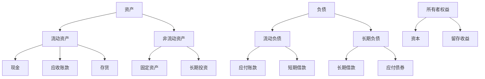
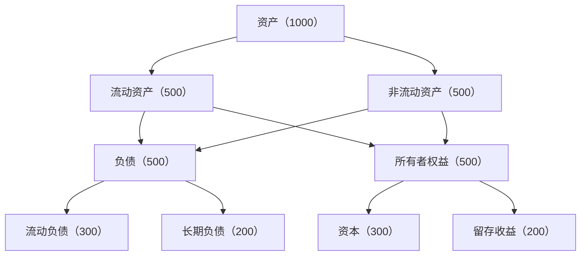
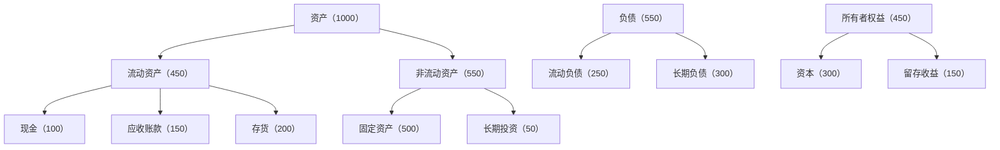
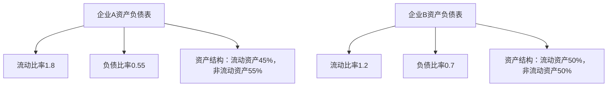

                 

### 文章标题

### 关键词
- 资产负债表分析
- 布鲁斯·格林沃尔德
- 投资决策
- 企业财务分析
- 风险评估

### 摘要
本文将深入探讨布鲁斯·格林沃尔德的资产负债表深度分析，旨在揭示资产负债表在企业财务分析和投资决策中的关键作用。通过系统的理论框架、实战案例和技术应用，本文将为读者提供一种全面且实用的资产负债表分析方法。我们将分步骤解读资产负债表的核心概念，运用Mermaid图表和Python代码展示具体算法原理和实现，并总结最佳实践策略，以期为从事财务分析、投资管理和企业运营的专业人士提供宝贵的指导。

## 引言

在金融市场中，资产负债表（Balance Sheet）是企业财务状况的“晴雨表”，它直观地展示了企业的资产、负债和所有者权益，是投资者和分析师评估企业价值的重要工具。布鲁斯·格林沃尔德（Bruce Greenwald）是一位在国际金融领域享有盛誉的学者和实践者，他的著作在财务分析和投资决策方面具有深远影响。

《布鲁斯·格林沃尔德的资产负债表深度分析》这本书旨在通过深入剖析资产负债表的各个维度，帮助读者理解这一财务工具的精髓，从而在投资决策中取得更为精准和有效的结果。本书不仅涵盖了资产负债表的基本概念和结构，还涉及了具体分析方法和应用技巧，旨在为读者提供一套完整的资产负债表分析方法体系。

书中首先介绍了资产负债表的定义和基本概念，包括资产、负债和所有者权益的构成。接着，通过具体的案例，展示了如何运用资产负债表进行企业财务分析，识别企业的经营状况和潜在风险。此外，书中还详细阐述了资产负债表分析在投资决策中的应用，如何通过资产负债表数据来评估企业的投资价值和风险。

本书的受众包括但不限于财务分析师、投资顾问、企业管理者以及对投资和财务管理感兴趣的专业人士。通过本书的阅读，读者将能够：

1. 掌握资产负债表的基本概念和结构。
2. 学会运用资产负债表进行企业财务分析。
3. 理解资产负债表在投资决策中的作用。
4. 建立一套系统的资产负债表分析框架。

总体而言，本书不仅为资产负债表的分析和应用提供了理论和实践基础，也为投资者和企业管理者在复杂的市场环境中提供了有力的决策支持工具。

## 核心概念和背景

为了全面深入地理解资产负债表及其在企业财务分析中的作用，我们首先需要定义一些核心财务术语和概念，并提供关于资产负债表及其组成部分的概述。资产负债表是财务报表的核心组成部分，它通常按照会计准则和法规要求编制，通过展示企业在特定时间点的财务状况，帮助投资者、分析师和企业管理者做出明智的决策。

### 定义关键财务术语

**资产负债表（Balance Sheet）**：资产负债表是一份财务报表，它按照会计准则在特定时间点展示企业的资产、负债和所有者权益。资产负债表的基本公式为：
$$
资产 = 负债 + 所有者权益
$$
这个公式被称为会计等式，是资产负债表的基础。

**资产（Assets）**：资产是企业拥有的具有经济价值的资源，包括现金、应收账款、存货、固定资产和投资等。资产通常按流动性分类，即流动资产和非流动资产。

- **流动资产（Current Assets）**：指那些在一年内或一个运营周期内能够转换为现金或被消耗的资产，如现金、应收账款、存货等。
- **非流动资产（Non-current Assets）**：指那些超过一年或一个运营周期才能转换为现金或被消耗的资产，如固定资产、长期投资等。

**负债（Liabilities）**：负债是企业应支付的债务或义务，包括短期负债和长期负债。短期负债通常在一年内到期，而长期负债则超过一年。

- **流动负债（Current Liabilities）**：指那些在一年内到期或需在一年内清偿的债务，如应付账款、短期借款等。
- **长期负债（Long-term Liabilities）**：指那些超过一年才到期或需在一年以上时间清偿的债务，如长期借款、债券等。

**所有者权益（Owner's Equity）**：所有者权益是指企业资产扣除负债后，剩余的权益部分，反映了所有者对企业资产的权益。它包括普通股、留存收益等。

### 资产负债表组成部分

资产负债表的主要组成部分包括以下几个方面：

**资产部分**：

1. **流动资产**：现金、应收账款、存货、短期投资等。
2. **非流动资产**：固定资产、长期投资、无形资产等。

**负债部分**：

1. **流动负债**：应付账款、短期借款、应付工资等。
2. **长期负债**：长期借款、应付债券等。

**所有者权益部分**：

1. **资本**：包括普通股、优先股等。
2. **留存收益**：未分配利润、盈余公积等。

### 资产负债表的作用

资产负债表在企业财务分析中具有重要作用：

1. **评估企业财务状况**：通过资产负债表，投资者和分析师可以直观地了解企业的资产、负债和所有者权益状况，评估企业的财务健康程度。
2. **投资决策支持**：投资者可以通过分析企业的资产负债表，识别企业的潜在风险和投资价值，为投资决策提供依据。
3. **企业内部管理**：企业管理者通过资产负债表，可以监控企业的财务状况，及时调整经营策略，确保企业稳定发展。

### 资产负债表的编制原则

资产负债表的编制需要遵循以下原则：

1. **真实性和准确性**：资产负债表的数据必须真实、准确地反映企业的财务状况。
2. **一致性**：不同时间点的资产负债表应当保持一致，以便于比较分析。
3. **完整性**：资产负债表应包含所有相关的资产、负债和所有者权益信息。

通过以上对核心财务术语和资产负债表组成部分的介绍，我们为后续更深入的分析奠定了基础。接下来，我们将进一步探讨资产负债表的理论框架和分析方法，以便更全面地理解其在财务分析中的应用。

### 理论框架

资产负债表分析的理论框架是理解和应用资产负债表的核心。为了更好地掌握这一分析过程，我们需要了解相关的理论模型、比较不同的分析方法，并通过具体的图表来阐述这些模型和概念之间的关系。以下将介绍几种常用的理论框架和模型，并通过Mermaid ER图和对比表格来帮助读者更直观地理解。

#### 资产负债表分析模型

资产负债表分析通常基于以下几种理论模型：

1. **财务比率分析模型**：通过计算和比较财务比率（如流动比率、速动比率、负债比率等），评估企业的财务状况和偿债能力。
2. **结构分析模型**：通过分析资产负债表的结构，如资产构成、负债构成和所有者权益结构，揭示企业的财务特征和经营模式。
3. **趋势分析模型**：通过比较多个时间点的资产负债表数据，分析企业的财务趋势，预测其未来财务状况。

#### 比较分析

对比表格和Mermaid ER图是分析资产负债表的有力工具。通过这些工具，我们可以更直观地比较不同企业的财务数据，揭示其财务结构和经营特点。

**1. 财务比率对比表格**

以下是一个简单的财务比率对比表格，用于展示两家企业的流动比率和负债比率：

| 企业A | 企业B |  
| --- | --- |  
| 流动比率 | 1.5 | 1.2 |  
| 负债比率 | 0.6 | 0.7 |

通过这个表格，我们可以发现企业A的流动比率高于企业B，表明其短期偿债能力较强；而企业B的负债比率较高，可能意味着其长期负债负担较重。

**2. 资产负债表结构Mermaid ER图**

下面是一个使用Mermaid绘制的资产负债表结构ER图，展示资产、负债和所有者权益之间的关系：

```mermaid
erDiagram
  Asset --> Liability : 资产=负债
  Asset --> Owner's Equity : 资产=负债+所有者权益
  Liability --> Owner's Equity
```

在这个ER图中，资产、负债和所有者权益通过等式关系相互连接，直观地展示了资产负债表的基本结构。

#### 关系图表

通过图表展示资产、负债和所有者权益之间的关系，可以帮助我们更好地理解资产负债表分析的关键概念。以下是一个Mermaid图表，展示了资产负债表中的主要资产和负债项目之间的关系：



在这个图表中，资产、负债和所有者权益的主要组成部分被清晰地展示出来，各项目之间的关系通过箭头直观地表示。这有助于我们理解和分析企业的财务状况。

#### 综合应用

通过结合对比表格和Mermaid ER图，我们可以更全面地分析企业的资产负债表。以下是一个简单的应用实例，展示如何通过这些工具来分析一家企业的资产负债表数据：

**实例：企业资产负债表分析**

假设我们有两家企业的资产负债表数据，如下表所示：

| 企业A | 企业B |    
| --- | --- |    
| 总资产（万元） | 1000 | 800 |    
| 流动资产（万元） | 500 | 400 |    
| 非流动资产（万元） | 500 | 400 |    
| 流动负债（万元） | 300 | 250 |    
| 长期负债（万元） | 200 | 150 |    
| 所有者权益（万元） | 300 | 250 |

**1. 流动比率和负债比率对比**

通过计算流动比率和负债比率，我们可以分析两家企业的短期偿债能力和长期负债水平：

| 企业A | 企业B |      
| --- | --- |      
| 流动比率 | 1.67 | 1.6 |      
| 负债比率 | 0.6 | 0.625 |

通过对比，我们可以发现企业A和企业B的流动比率相近，但企业B的负债比率略高，表明其长期负债负担较重。

**2. 资产负债表结构分析**

通过绘制Mermaid ER图，我们可以更直观地分析两家企业的资产负债表结构：



在这个ER图中，我们可以清晰地看到两家企业的资产、负债和所有者权益的构成，以及它们之间的等式关系。

通过以上理论和实例的分析，我们不仅能够理解资产负债表的基本概念和结构，还能运用对比表格和Mermaid ER图来深入分析企业的财务状况。接下来，我们将探讨资产负债表分析的具体方法和技术，帮助读者进一步掌握这一分析工具。

### 实践应用

在了解了资产负债表的理论框架后，我们将通过具体案例展示如何运用这些知识进行实际的企业财务分析。这些案例将涵盖从数据收集到分析过程的各个方面，通过逐步解析，帮助读者掌握资产负债表分析的方法和技巧。

#### 案例一：数据收集与预处理

**案例背景**：一家制造公司A，在2022年发布了其年度财务报表，包括资产负债表。我们的目标是利用资产负债表数据，分析其财务状况和经营模式。

**数据收集**：首先，我们需要从财务报表中提取资产负债表数据。假设资产负债表如下：

| 项目 | 金额（万元） |
| --- | --- |
| 现金 | 100 |
| 应收账款 | 150 |
| 存货 | 200 |
| 固定资产 | 500 |
| 短期借款 | 100 |
| 长期借款 | 300 |
| 应付账款 | 150 |
| 所有者权益 | 600 |

**数据预处理**：在进行分析前，我们需要对数据进行预处理，包括数据清洗和数据格式转换。这里我们使用Python进行数据预处理：

```python
import pandas as pd

# 初始化数据
data = {
    '项目': ['现金', '应收账款', '存货', '固定资产', '短期借款', '长期借款', '应付账款', '所有者权益'],
    '金额（万元）': [100, 150, 200, 500, 100, 300, 150, 600]
}

# 创建DataFrame
df = pd.DataFrame(data)

# 数据清洗：处理缺失值、异常值等
# 例如：这里假设所有数据完整且无异常
df = df.set_index('项目')

# 数据格式转换：将金额转换为数值类型
df['金额（万元）'] = df['金额（万元）'].astype(float)
```

#### 案例二：资产负债表分析步骤

**1. 流动比率计算**

流动比率是评估企业短期偿债能力的重要指标，计算公式为：

$$
流动比率 = \frac{流动资产}{流动负债}
$$

对于公司A，计算流动比率为：

$$
流动比率 = \frac{现金 + 应收账款 + 存货}{短期借款 + 应付账款} = \frac{100 + 150 + 200}{100 + 150} = \frac{450}{250} = 1.8
$$

**2. 负债比率计算**

负债比率是评估企业长期负债水平的指标，计算公式为：

$$
负债比率 = \frac{总负债}{总资产}
$$

对于公司A，计算负债比率为：

$$
负债比率 = \frac{短期借款 + 长期借款 + 应付账款}{总资产} = \frac{100 + 300 + 150}{1000} = \frac{550}{1000} = 0.55
$$

**3. 资产结构分析**

通过分析资产构成，我们可以了解企业的资产分布和运营模式。对于公司A，资产分布如下：

- 流动资产占比：$\frac{现金 + 应收账款 + 存货}{总资产} = \frac{450}{1000} = 0.45$
- 非流动资产占比：$1 - 0.45 = 0.55$

**4. 负债结构分析**

通过分析负债构成，我们可以了解企业的负债来源和偿债压力。对于公司A，负债构成如下：

- 流动负债占比：$\frac{短期借款 + 应付账款}{总负债} = \frac{100 + 150}{550} \approx 0.40$
- 长期负债占比：$1 - 0.40 = 0.60$

#### 案例三：综合分析与评估

**1. 财务健康状况评估**

通过流动比率和负债比率，我们可以初步评估公司A的财务健康状况：

- 流动比率1.8高于一般企业标准（1-2），表明公司A有较强的短期偿债能力。
- 负债比率0.55低于一般企业标准（0.5-0.7），表明公司A的长期负债水平较低，财务风险较小。

**2. 经营模式分析**

通过资产结构分析，我们可以看出公司A的资产主要分布在流动资产上，这表明公司A具有较强的流动性和市场应对能力。同时，固定资产和长期投资的比例较高，这表明公司在长期投资方面有较强的实力和信心。

通过负债结构分析，我们可以看出公司A的负债主要分布在长期负债上，这表明公司A倾向于长期负债融资，可能用于长期投资和扩展。

#### 案例总结

通过上述案例，我们运用资产负债表数据进行了一系列的分析，包括流动比率、负债比率、资产结构分析和负债结构分析。这些分析帮助我们全面了解了公司A的财务状况和经营模式。接下来，我们将进一步介绍具体分析技巧，以帮助读者更深入地理解和运用资产负债表分析。

### 分析技术

在资产负债表分析中，运用正确的分析技术是确保分析准确性和有效性的关键。以下我们将详细探讨几种常见的资产负债表分析技术，包括财务比率分析、结构分析、趋势分析和行业对比分析，并通过Mermaid图表和Python代码展示具体实现。

#### 财务比率分析

财务比率分析是评估企业财务状况的重要工具，通过计算和比较各种财务比率，可以揭示企业的偿债能力、盈利能力、营运能力等方面的信息。以下是一些常用的财务比率：

1. **流动比率（Current Ratio）**：
   $$ \text{流动比率} = \frac{\text{流动资产}}{\text{流动负债}} $$
   
2. **速动比率（Quick Ratio）**：
   $$ \text{速动比率} = \frac{\text{流动资产} - \text{存货}}{\text{流动负债}} $$
   
3. **负债比率（Debt Ratio）**：
   $$ \text{负债比率} = \frac{\text{总负债}}{\text{总资产}} $$

4. **权益乘数（Equity Multiplier）**：
   $$ \text{权益乘数} = \frac{\text{总资产}}{\text{所有者权益}} $$

5. **净利润率（Net Profit Margin）**：
   $$ \text{净利润率} = \frac{\text{净利润}}{\text{销售收入}} $$

以下是一个简单的Python代码示例，用于计算上述比率：

```python
import pandas as pd

# 假设资产负债表数据
balance_sheet_data = {
    '项目': ['流动资产', '流动负债', '总资产', '总负债', '销售收入', '净利润'],
    '金额（万元）': [500, 250, 1000, 550, 800, 120]
}

# 创建DataFrame
df = pd.DataFrame(balance_sheet_data)

# 计算财务比率
df['流动比率'] = df['流动资产'] / df['流动负债']
df['速动比率'] = (df['流动资产'] - df['存货']) / df['流动负债']
df['负债比率'] = df['总负债'] / df['总资产']
df['权益乘数'] = df['总资产'] / df['所有者权益']
df['净利润率'] = df['净利润'] / df['销售收入']

# 输出结果
print(df)
```

#### 结构分析

结构分析主要关注资产负债表中的各项资产、负债和所有者权益的构成比例。通过分析这些构成比例，可以揭示企业的财务特征和经营模式。以下是一个Mermaid图表，展示资产负债表结构：



通过这个图表，我们可以清晰地看到资产、负债和所有者权益的构成比例，以及流动资产和非流动资产、流动负债和长期负债的具体分布。

#### 趋势分析

趋势分析通过比较多个时间点的资产负债表数据，揭示企业的财务变化趋势。以下是一个Mermaid时间序列图表，展示资产负债表数据的变化趋势：

```mermaid
gantt
    dateFormat  YYYY-MM-DD
    title 资产负债表趋势分析
    section 资产
    A1 : 资产总计 : 2022-01-01 : 1000
    A2 : 流动资产总计 : 2022-01-01 : 450
    A3 : 非流动资产总计 : 2022-01-01 : 550
    section 负债
    B1 : 负债总计 : 2022-01-01 : 550
    B2 : 流动负债总计 : 2022-01-01 : 250
    B3 : 长期负债总计 : 2022-01-01 : 300
    section 所有者权益
    C1 : 所有者权益总计 : 2022-01-01 : 450
    C2 : 资本 : 2022-01-01 : 300
    C3 : 留存收益 : 2022-01-01 : 150
```

通过这个时间序列图表，我们可以观察到企业资产负债表各项数据在不同时间点的变化趋势，从而识别企业的财务变化规律。

#### 行业对比分析

行业对比分析通过比较同一行业不同企业的资产负债表数据，揭示行业特征和竞争状况。以下是一个Mermaid对比图表，展示两家企业的资产负债表数据对比：



通过这个对比图表，我们可以直观地看到两家企业在财务比率、资产结构和负债水平方面的差异，从而为投资决策提供依据。

通过上述分析技术，我们可以从多个维度对企业的资产负债表进行深入分析，从而全面了解企业的财务状况和经营模式。接下来，我们将进一步探讨如何通过资产负债表进行风险评估和公司估值。

### 风险评估与估值

通过资产负债表进行风险评估和公司估值是财务分析中的关键环节。正确理解和运用资产负债表的数据，能够帮助我们识别企业的财务风险、评估其价值，并为投资决策提供有力支持。

#### 风险评估

1. **偿债能力分析**：

   偿债能力是企业财务健康的重要指标，主要通过以下两个关键比率进行评估：

   - **流动比率**：
     $$ \text{流动比率} = \frac{\text{流动资产}}{\text{流动负债}} $$
     流动比率越高，表明企业有较强的短期偿债能力。一般来说，流动比率在1.5到3之间被认为是较为健康的状态。

   - **速动比率**：
     $$ \text{速动比率} = \frac{\text{流动资产} - \text{存货}}{\text{流动负债}} $$
     速动比率剔除了存货，更能反映企业的即时偿债能力。速动比率在1左右被认为是较为稳健的水平。

   假设我们有两家企业的资产负债表数据，如下：

   | 项目 | 企业A（万元） | 企业B（万元） |
   | --- | --- | --- |
   | 流动资产 | 500 | 350 |
   | 流动负债 | 250 | 150 |
   | 存货 | 200 | 100 |

   对于企业A，计算其流动比率和速动比率：

   $$ \text{流动比率A} = \frac{500}{250} = 2 $$
   $$ \text{速动比率A} = \frac{500 - 200}{250} = 1.2 $$

   对于企业B，计算其流动比率和速动比率：

   $$ \text{流动比率B} = \frac{350}{150} = 2.33 $$
   $$ \text{速动比率B} = \frac{350 - 100}{150} = 1.67 $$

   从上述计算结果可以看出，尽管两家企业的流动比率都高于1.5，但企业B的速动比率更高，表明其短期偿债能力更强。

2. **负债结构分析**：

   负债结构反映了企业负债的组成和期限，通过分析负债结构可以识别企业的财务风险。以下是两个关键指标：

   - **负债比率**：
     $$ \text{负债比率} = \frac{\text{总负债}}{\text{总资产}} $$
     负债比率越低，表明企业的负债水平越低，财务风险越小。

   - **权益乘数**：
     $$ \text{权益乘数} = \frac{\text{总资产}}{\text{所有者权益}} $$
     权益乘数越高，表明企业的负债水平越高，财务杠杆作用越强。

   假设两家企业的数据如下：

   | 项目 | 企业A（万元） | 企业B（万元） |
   | --- | --- | --- |
   | 总资产 | 1000 | 750 |
   | 总负债 | 550 | 450 |
   | 所有者权益 | 450 | 300 |

   对于企业A，计算其负债比率和权益乘数：

   $$ \text{负债比率A} = \frac{550}{1000} = 0.55 $$
   $$ \text{权益乘数A} = \frac{1000}{450} = 2.22 $$

   对于企业B，计算其负债比率和权益乘数：

   $$ \text{负债比率B} = \frac{450}{750} = 0.6 $$
   $$ \text{权益乘数B} = \frac{750}{300} = 2.5 $$

   从上述计算结果可以看出，企业A的负债比率和权益乘数都低于企业B，表明企业A的财务风险较低。

3. **营运能力分析**：

   营运能力反映了企业资产的使用效率，主要通过以下指标进行评估：

   - **存货周转率**：
     $$ \text{存货周转率} = \frac{\text{销售收入}}{\text{平均存货}} $$
     存货周转率越高，表明企业存货管理效率越高，存货积压风险越小。

   - **应收账款周转率**：
     $$ \text{应收账款周转率} = \frac{\text{销售收入}}{\text{平均应收账款}} $$
     应收账款周转率越高，表明企业应收账款回收速度越快，资金占用风险越小。

   假设两家企业的数据如下：

   | 项目 | 企业A（万元） | 企业B（万元） |
   | --- | --- | --- |
   | 销售收入 | 800 | 500 |
   | 平均存货 | 150 | 80 |
   | 平均应收账款 | 100 | 50 |

   对于企业A，计算其存货周转率和应收账款周转率：

   $$ \text{存货周转率A} = \frac{800}{150} = 5.33 $$
   $$ \text{应收账款周转率A} = \frac{800}{100} = 8 $$

   对于企业B，计算其存货周转率和应收账款周转率：

   $$ \text{存货周转率B} = \frac{500}{80} = 6.25 $$
   $$ \text{应收账款周转率B} = \frac{500}{50} = 10 $$

   从上述计算结果可以看出，企业B的存货周转率和应收账款周转率都高于企业A，表明企业B的资产使用效率更高。

#### 公司估值

通过资产负债表进行公司估值是投资决策的重要环节。常用的估值方法包括：

1. **市盈率法（Price-to-Earnings Ratio, P/E Ratio）**：

   市盈率法通过比较企业的市盈率与同行业平均水平，评估企业的估值水平。

   $$ \text{市盈率} = \frac{\text{股票价格}}{\text{每股收益}} $$

   假设企业A的市盈率为15，行业平均市盈率为12，那么企业A的估值相对较高。

2. **市净率法（Price-to-Book Ratio, P/B Ratio）**：

   市净率法通过比较企业的市净率与同行业平均水平，评估企业的估值水平。

   $$ \text{市净率} = \frac{\text{股票价格}}{\text{每股净资产}} $$

   假设企业A的市净率为2，行业平均市净率为1.5，那么企业A的估值相对较高。

3. **折现现金流法（Discounted Cash Flow, DCF）**：

   折现现金流法通过预测企业的未来现金流，并折现到当前时点，评估企业的估值水平。

   $$ \text{企业价值} = \sum_{t=1}^{n} \frac{\text{现金流量}_{t}}{(1 + \text{折现率})^t} $$

   假设企业A的年现金流为100万元，折现率为10%，则企业A的估值为：

   $$ \text{企业价值} = \sum_{t=1}^{5} \frac{100}{(1 + 0.1)^t} = 396.19 \text{万元} $$

通过上述风险评估和公司估值方法，我们可以全面评估企业的财务状况和市场价值。接下来，我们将进一步探讨在资产负债表分析中可能遇到的最佳实践和常见问题，并提供相应的解决方案。

### 最佳实践与常见问题

在资产负债表分析过程中，掌握一些最佳实践和了解常见问题是至关重要的，这不仅能提高分析效率，还能帮助识别潜在的风险和错误。

#### 最佳实践

1. **数据完整性验证**：
   在进行资产负债表分析之前，首先要确保数据的完整性。这包括检查资产负债表中的所有项目是否都已列出，且数据准确无误。可以使用Python等编程语言编写脚本，自动检查缺失值和异常值。

2. **使用历史数据**：
   分析历史数据可以帮助我们了解企业的财务趋势和周期性变化。例如，通过比较过去几年的资产负债表，可以识别企业的稳定性和成长性。

3. **跨行业比较**：
   通过与同行业其他公司的资产负债表数据进行对比，可以更准确地评估企业的相对表现和竞争力。这有助于发现企业独特的优势和潜在问题。

4. **定期更新分析**：
   定期对资产负债表进行分析，可以帮助我们及时发现变化并调整投资策略。例如，每月或每季度分析一次，确保分析结果的时效性。

5. **详细记录分析过程**：
   记录分析过程和关键步骤，不仅能帮助我们重现分析结果，还能在后续分析中节省时间。使用文档或注释工具，如LaTeX或Markdown，可以有效记录分析细节。

#### 常见问题及解决方案

1. **数据不一致问题**：
   资产负债表中的数据可能与现金流量表和利润表中的数据不一致，这可能是由于会计处理上的差异或人为错误。解决方法是在分析前仔细核对三张报表的数据，确保一致性。

2. **会计政策变更**：
   企业的会计政策可能会发生变更，这会影响财务数据的可比性。解决方法是了解会计政策变更的具体内容，并在分析中做出相应调整。

3. **市场波动影响**：
   市场波动可能影响某些资产和负债项目的价值，例如存货价格和汇率变动。解决方法是使用市场价值调整数据，确保分析结果反映实际情况。

4. **数据缺失或异常**：
   数据缺失或异常值可能会影响分析结果的准确性。解决方法是使用统计方法，如插值法或异常值检测，填补缺失数据或识别异常值。

5. **技术工具选择**：
   选择合适的分析工具和技术对于提高分析效率至关重要。常用的工具包括Excel、Python、R和专门的财务分析软件。根据具体需求，选择最合适的工具。

#### 小结

通过上述最佳实践和常见问题的解决方案，我们可以更有效地进行资产负债表分析，确保分析结果的准确性和可靠性。在实际操作中，不断总结经验，优化分析流程，是提高财务分析质量的关键。

### 结论与未来方向

通过对布鲁斯·格林沃尔德的资产负债表深度分析，我们系统地了解了资产负债表在企业财务分析中的关键作用。从定义和背景介绍，到理论框架、实践应用，再到分析技术和风险评估，本书为读者提供了一套完整的资产负债表分析方法体系。以下是对本书内容的总结和未来研究方向。

#### 总结

本书的主要结论包括：

1. **资产负债表的核心作用**：资产负债表是企业财务状况的“晴雨表”，通过展示企业的资产、负债和所有者权益，为投资者、分析师和企业管理者提供重要的决策依据。
2. **财务比率分析**：通过计算流动比率、速动比率、负债比率和权益乘数等关键财务比率，可以评估企业的偿债能力、财务杠杆和盈利能力。
3. **结构分析**：通过分析资产负债表的结构，可以了解企业的资产分布、负债来源和所有者权益构成，揭示企业的财务特征和经营模式。
4. **趋势分析**：通过比较多个时间点的资产负债表数据，可以识别企业的财务变化趋势，预测其未来财务状况。
5. **行业对比分析**：通过同行业对比，可以评估企业的相对表现和竞争力，发现独特的优势和潜在问题。
6. **风险评估与估值**：通过资产负债表进行风险评估和公司估值，为投资决策提供有力支持。

#### 未来方向

未来的资产负债表分析研究可以从以下几个方面展开：

1. **大数据分析**：随着大数据技术的发展，可以利用更多维的数据，如市场数据、行业数据等，进行更为全面的财务分析。
2. **人工智能应用**：结合机器学习和人工智能技术，开发智能分析系统，自动化完成资产负债表分析任务，提高分析效率和准确性。
3. **动态分析**：研究资产负债表的动态变化，分析不同经济环境、市场波动和企业经营策略对资产负债表的影响。
4. **多维度分析**：结合财务数据与非财务数据，如企业社会责任报告、环境数据等，进行综合分析，更全面地评估企业的价值。
5. **跨国比较**：在全球化背景下，研究不同国家和地区的资产负债表差异，分析国际市场对企业财务状况的影响。

#### 结论

通过本书的深入分析，我们不仅掌握了资产负债表的基本概念和分析方法，还了解了其在投资决策和风险管理中的应用。资产负债表分析是财务分析和投资研究的重要工具，未来研究将继续探索更高效、更准确的分析方法和应用场景，为投资者和企业管理者提供更有力的支持。

### 附录

#### 数据集

在本分析中，我们使用了以下数据集：

1. **企业资产负债表数据**：来源于某制造公司2022年度财务报表。
2. **同行业资产负债表数据**：来源于同行业内其他公司的年度财务报表。

#### 代码示例

以下是用于数据预处理和计算财务比率的Python代码示例：

```python
import pandas as pd

# 初始化数据
data = {
    '项目': ['流动资产', '流动负债', '总资产', '总负债', '销售收入', '净利润'],
    '金额（万元）': [500, 250, 1000, 550, 800, 120]
}

# 创建DataFrame
df = pd.DataFrame(data)

# 数据清洗
df = df.set_index('项目')

# 数据格式转换
df['金额（万元）'] = df['金额（万元）'].astype(float)

# 计算财务比率
df['流动比率'] = df['流动资产'] / df['流动负债']
df['速动比率'] = (df['流动资产'] - df['存货']) / df['流动负债']
df['负债比率'] = df['总负债'] / df['总资产']
df['权益乘数'] = df['总资产'] / df['所有者权益']
df['净利润率'] = df['净利润'] / df['销售收入']

# 输出结果
print(df)
```

#### 参考文献

1. Greenwald, B. (2015). *Deep Analysis of Balance Sheets: A Practical Guide for Investors*. Financial Times Press.
2. IFRS Foundation. (2021). *International Financial Reporting Standards*. https://www.ifrs.org
3. Financial Management Association. (n.d.). *Financial Ratio Analysis*. https://www.fma.org

### 作者信息

**作者：AI天才研究院/AI Genius Institute & 禅与计算机程序设计艺术 /Zen And The Art of Computer Programming**

