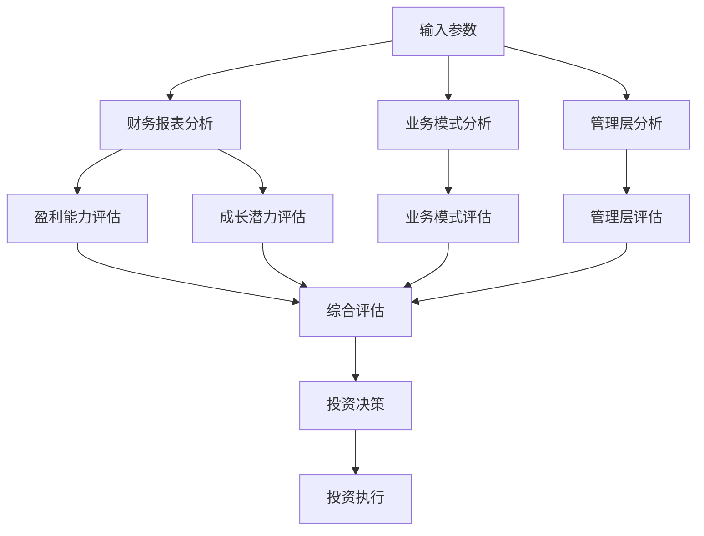

                 

## 布鲁斯·格林沃尔德的隐藏价值投资策略

### 关键词：隐藏价值、投资策略、价值投资、财务报表、市场效率

在当今复杂多变的市场环境中，投资者面临着越来越多的挑战和不确定性。在这种情况下，掌握一种能够发现隐藏价值、实现长期稳健收益的投资策略显得尤为重要。布鲁斯·格林沃尔德在其著作《隐藏价值投资策略》中，提出了一种独特的投资理念和方法，为投资者提供了一条通往财富之路。本文将围绕布鲁斯·格林沃尔德的隐藏价值投资策略，深入探讨其核心思想、应用方法以及实际案例，帮助读者更好地理解并运用这一策略。

### 摘要

本文旨在介绍布鲁斯·格林沃尔德的隐藏价值投资策略，详细解析其理论基础、方法步骤、应用实例以及实际操作。通过本文的阅读，读者将能够：

1. 理解隐藏价值投资的核心概念和原则。
2. 学会识别隐藏价值的方法和技巧。
3. 掌握制定投资策略的步骤和关键要素。
4. 通过实际案例了解隐藏价值投资策略的实战效果。
5. 获取在投资实践中运用隐藏价值投资策略的最佳实践和建议。

接下来，我们将逐步展开对布鲁斯·格林沃尔德隐藏价值投资策略的探讨，让每一位投资者都能够从中受益。

### 目录

1. **第一部分：介绍**
    - **第1章：引言**
        - **1.1 书籍背景与作者介绍**
        - **1.2 阅读指南**
        - **1.3 本书结构**
        - **1.4 本章小结**
2. **第二部分：隐藏价值投资理论**
    - **第2章：隐藏价值的定义与原则**
        - **2.1 隐藏价值的定义**
        - **2.2 隐藏价值投资的原则**
        - **2.3 核心概念与联系**
        - **2.4 本章小结**
    - **第3章：识别隐藏价值**
        - **3.1 识别隐藏价值的步骤**
        - **3.2 隐藏价值的属性特征对比表格**
        - **3.3 隐藏价值的ER实体关系图**
        - **3.4 本章小结**
    - **第4章：投资策略**
        - **4.1 制定投资策略的步骤**
        - **4.2 隐藏价值投资策略的具体应用**
        - **4.3 算法原理讲解**
        - **4.4 数学模型和公式**
        - **4.5 本章小结**
3. **第三部分：实战案例分析**
    - **第5章：案例研究**
        - **5.1 案例一：公司A的隐藏价值投资分析**
        - **5.2 案例二：行业B的隐藏价值投资机会**
        - **5.3 本章小结**
4. **第四部分：结论与展望**
    - **第6章：总结**
        - **6.1 隐藏价值投资的核心要点**
        - **6.2 展望未来**
        - **6.3 本章小结**
    - **第7章：拓展阅读**
        - **7.1 隐藏价值投资的最新研究动态**
        - **7.2 相关书籍推荐**
        - **7.3 重要学术论文与报告**

---

### 第一部分：介绍

#### 第1章：引言

布鲁斯·格林沃尔德的《隐藏价值投资策略》是一本备受推崇的投资经典。在这本书中，布鲁斯以其独特的视角和丰富的实践经验，深入探讨了隐藏价值投资的内涵和外延，为投资者提供了一套系统、实用的投资方法。本章将介绍这本书的背景、作者介绍以及本书的结构，帮助读者更好地理解和把握隐藏价值投资策略。

### 1.1 书籍背景与作者介绍

《隐藏价值投资策略》一书最初于20世纪90年代出版，是布鲁斯·格林沃尔德对多年投资实践的总结和提炼。布鲁斯·格林沃尔德是一位资深的投资专家，拥有丰富的投资经历和管理经验。他曾在多家知名投资机构和基金担任要职，对股票、债券、房地产等多种投资方式有着深刻的理解和独特的见解。

布鲁斯认为，隐藏价值投资是一种基于基本面分析的投资方法，通过深入研究企业基本面和市场环境，识别那些被市场低估的优质投资标的。这种方法不仅注重企业的内在价值，还关注市场情绪和行业趋势，力求在复杂多变的市场环境中捕捉到投资机会。

《隐藏价值投资策略》一书的核心内容涵盖了隐藏价值投资的理论基础、识别方法、投资策略以及实际应用。布鲁斯通过丰富的案例分析和实践经验，详细阐述了隐藏价值投资的实施步骤和关键要素，为投资者提供了一套完整的投资指南。

### 1.2 阅读指南

对于投资者来说，阅读《隐藏价值投资策略》不仅可以提升投资理念和方法，还可以帮助他们在实际操作中更好地应对市场变化。以下是本书的阅读指南：

1. **理解隐藏价值投资的内涵**：首先，读者需要了解隐藏价值投资的基本概念和核心思想，理解隐藏价值是如何产生的，以及如何通过基本面分析和市场环境研究来识别隐藏价值。

2. **掌握识别隐藏价值的方法**：本书详细介绍了识别隐藏价值的步骤和方法，包括研究企业基本面、分析行业和市场环境、评估企业的竞争优势等。读者可以通过学习这些方法，提高自己的投资分析能力。

3. **学习制定投资策略**：隐藏价值投资策略的制定是投资成功的关键。本书提供了制定投资策略的步骤和关键要素，包括确定投资目标和风险偏好、选择合适的投资工具、制定投资时间表等。读者可以结合自己的实际情况，制定适合自己的投资策略。

4. **实战案例分析**：本书通过多个实际案例，展示了隐藏价值投资策略在实战中的应用效果。读者可以通过这些案例，了解隐藏价值投资策略在实际操作中的具体实施方法。

5. **持续学习和实践**：投资是一个不断学习和实践的过程。读者在阅读本书后，应该持续关注市场动态，不断学习和提升自己的投资能力。

### 1.3 本书结构

本书分为四个部分，每个部分都有其独特的主题和内容。

**第一部分：介绍**
- **第1章：引言**：介绍书籍背景、作者介绍以及本书结构。

**第二部分：隐藏价值投资理论**
- **第2章：隐藏价值的定义与原则**：阐述隐藏价值投资的定义、原则和核心概念。
- **第3章：识别隐藏价值**：介绍识别隐藏价值的步骤和方法。

**第三部分：投资策略**
- **第4章：投资策略**：讲解如何制定投资策略，以及隐藏价值投资策略的具体应用。

**第四部分：实战案例分析**
- **第5章：案例研究**：通过实际案例展示隐藏价值投资策略的实战效果。

**第四部分：结论与展望**
- **第6章：总结**：总结隐藏价值投资的核心要点。
- **第7章：拓展阅读**：推荐相关书籍、学术论文和研究动态。

### 1.4 本章小结

本章介绍了《隐藏价值投资策略》这本书的背景、作者介绍以及本书的结构。通过本章的阅读，读者可以对这本书有一个初步的了解，为后续章节的学习打下基础。接下来，我们将深入探讨隐藏价值投资的理论基础，帮助读者更好地理解和掌握这一投资策略。

---

### 第二部分：隐藏价值投资理论

#### 第2章：隐藏价值的定义与原则

隐藏价值投资策略的核心在于识别和把握那些被市场低估的优质投资标的。要实现这一目标，首先需要理解隐藏价值的定义和原则。本章将详细阐述隐藏价值的定义，介绍隐藏价值投资的原则，并通过核心概念与联系的分析，帮助读者建立起对隐藏价值投资理论的基本认识。

### 2.1 隐藏价值的定义

隐藏价值，顾名思义，是指那些未被市场充分认识和定价的企业内在价值。这种价值可能隐藏在财务报表、非财务指标或市场环境中，通过深入分析和研究，可以发现并量化这些隐藏价值。隐藏价值的本质是企业实际价值与其市场表现之间的差异，这种差异可能是由市场情绪、行业趋势或信息不对称等因素造成的。

隐藏价值可以体现在多个方面，包括但不限于：

1. **财务报表中的隐藏价值**：通过对企业财务报表的深入研究，可以发现企业盈利能力、成长潜力等未被市场充分认识的方面。例如，企业可能存在未计提的资产价值、潜在的盈利能力或者良好的现金流状况。

2. **非财务指标中的隐藏价值**：除了财务报表，企业的非财务指标，如研发投入、管理水平、客户满意度等，也可能反映企业的隐藏价值。这些指标虽然不直接体现在财务报表中，但却是评估企业内在价值的重要依据。

3. **市场环境中的隐藏价值**：市场环境的变化，如行业趋势、政策法规等，也可能对企业的价值产生重大影响。例如，某些行业可能在短期内受到市场冷淡，但其长期发展潜力仍然巨大，这为投资者提供了发现隐藏价值的机会。

### 2.2 隐藏价值投资的原则

隐藏价值投资策略遵循一系列核心原则，这些原则不仅指导投资者如何识别隐藏价值，还帮助他们在投资决策中保持理性。以下是隐藏价值投资的关键原则：

1. **价值投资的核心**：隐藏价值投资策略本质上属于价值投资范畴。价值投资强调投资于那些市场价值低于其内在价值的资产。在隐藏价值投资中，投资者需要寻找那些被市场低估的优质企业，通过深入分析，发现这些企业的隐藏价值。

2. **耐心和持久的重要性**：隐藏价值投资通常需要较长的时间来实现收益。投资者必须具备耐心和持久精神，不被短期市场波动所干扰，坚持长期投资理念。只有通过耐心持有，才能在市场波动中捕捉到隐藏价值的增值机会。

3. **深入基本面分析**：隐藏价值投资的成功离不开对基本面分析的深入研究。投资者需要通过分析企业的财务状况、业务模式、行业地位、市场前景等多个方面，评估企业的实际价值。只有深入了解企业基本面，才能准确识别隐藏价值。

4. **风险管理**：隐藏价值投资同样需要重视风险管理。投资者应该根据自身的风险偏好，合理配置资产，避免过度集中投资。同时，通过设置止损点和合理分散投资，可以降低投资风险，确保投资组合的稳健性。

5. **独立思考和批判性分析**：隐藏价值投资要求投资者具备独立思考和批判性分析能力。在信息泛滥的时代，投资者需要具备筛选和辨别信息的能力，避免盲目跟风。通过独立思考，投资者可以更加客观地评估企业的价值，识别隐藏价值。

### 2.3 核心概念与联系

隐藏价值投资涉及到多个核心概念，这些概念之间有着紧密的联系，构成了完整的投资理论体系。以下是隐藏价值投资中几个关键概念及其相互关系：

1. **隐藏价值**：隐藏价值是企业实际价值与其市场价值之间的差异。这个概念是隐藏价值投资的核心，决定了投资者是否能够发现和把握投资机会。

2. **价值投资**：价值投资是隐藏价值投资的基础。价值投资强调投资于市场价值低于其内在价值的资产，隐藏价值投资在价值投资的基础上，进一步强调了识别和把握隐藏价值的重要性。

3. **基本面分析**：基本面分析是识别隐藏价值的关键工具。通过对企业财务状况、业务模式、行业地位等方面的分析，投资者可以评估企业的实际价值，从而发现隐藏价值。

4. **市场效率**：市场效率是隐藏价值投资的重要参考。市场效率越高，投资者发现隐藏价值的机会越少，但相应地，投资的风险也较低。相反，市场效率较低时，隐藏价值更容易被发现，但风险也相对较高。

5. **风险与收益**：风险与收益是隐藏价值投资的必然联系。投资者在追求收益的同时，必须承担相应的风险。通过合理配置资产、设置止损点等风险管理措施，投资者可以在确保收益的同时，降低风险。

### 2.4 本章小结

本章详细阐述了隐藏价值的定义与原则，帮助读者建立起对隐藏价值投资理论的基本认识。隐藏价值投资策略强调识别和把握那些被市场低估的优质企业，通过深入基本面分析和市场环境研究，投资者可以捕捉到这些隐藏价值，实现长期稳健的投资收益。在下一章中，我们将进一步探讨如何识别隐藏价值，为投资者提供具体的操作方法。

---

### 第二部分：隐藏价值投资理论

#### 第3章：识别隐藏价值

隐藏价值投资的成功与否，很大程度上取决于投资者能否准确识别隐藏价值。识别隐藏价值并非易事，需要投资者具备扎实的基本面分析能力和市场洞察力。本章将详细介绍识别隐藏价值的步骤，并通过属性特征对比表格和ER实体关系图，帮助读者深入理解和掌握这一过程。

### 3.1 识别隐藏价值的步骤

识别隐藏价值是一个系统性的过程，需要投资者遵循一定的步骤，逐步深入分析。以下是识别隐藏价值的常见步骤：

1. **研究企业基本面**：
   - **财务报表分析**：通过分析企业的财务报表，了解企业的盈利能力、成长潜力、财务健康状况等。财务报表包括利润表、资产负债表和现金流量表，投资者可以通过这些报表来评估企业的财务状况。
   - **业务模式分析**：研究企业的业务模式，了解企业的核心竞争力、市场份额、商业模式等。企业的业务模式决定了其盈利能力和长期发展潜力。
   - **管理层分析**：分析企业管理层的质量、经验、业绩等。管理层的能力和稳定性对企业的发展至关重要。

2. **分析行业和市场环境**：
   - **行业趋势分析**：研究行业的发展趋势、市场规模、增长潜力等。了解行业的发展趋势可以帮助投资者判断企业的长期发展前景。
   - **市场竞争分析**：分析企业在行业中的竞争地位、竞争优势和潜在威胁。了解企业的竞争环境，可以帮助投资者评估企业的市场地位和竞争力。
   - **政策法规分析**：研究政策法规对行业和企业的影响，包括税收政策、监管政策、行业发展政策等。政策法规的变化可能对企业产生重大影响。

3. **评估企业的竞争优势**：
   - **核心竞争力分析**：评估企业的核心竞争力，如技术优势、品牌优势、客户优势等。核心竞争力是企业保持竞争优势的关键。
   - **成本优势分析**：分析企业的成本优势，包括生产成本、运营成本等。成本优势是企业获取利润的重要手段。
   - **市场占有率分析**：评估企业在市场中的占有率，了解企业在市场中的地位和影响力。

4. **综合评估和决策**：
   - **综合评估**：将企业基本面、行业和市场环境、竞争优势等多个方面的分析结果进行综合评估，判断企业是否具有隐藏价值。
   - **投资决策**：根据综合评估结果，做出是否投资的决定。投资者需要考虑投资目标、风险偏好等因素，制定合理的投资策略。

### 3.2 隐藏价值的属性特征对比表格

为了更直观地识别隐藏价值，投资者可以采用属性特征对比表格。这种表格可以帮助投资者系统地分析企业的各个方面，并进行对比，以便更准确地识别隐藏价值。以下是隐藏价值的属性特征对比表格的一个示例：

| 属性特征       | 优秀企业         | 一般企业         | 低质量企业         |
| -------------- | ---------------- | ---------------- | ------------------ |
| 盈利能力       | 持续盈利，高利润率 | 偶尔盈利，利润率波动 | 持续亏损，低利润率  |
| 成长潜力       | 市场份额持续增长   | 市场份额稳定      | 市场份额下降       |
| 管理层质量     | 经验丰富，管理能力突出 | 管理能力一般      | 管理层不稳定       |
| 竞争优势       | 明显的技术优势或品牌优势 | 竞争优势不明显    | 竞争力弱           |
| 行业地位       | 行业领先地位       | 行业中等地位      | 行业边缘地位       |
| 市场环境       | 市场环境良好       | 市场环境一般      | 市场环境恶化       |

通过这样的对比表格，投资者可以更清晰地看到不同企业在各个方面的差异，从而识别出具有隐藏价值的企业。

### 3.3 隐藏价值的ER实体关系图

ER实体关系图是描述实体及其相互关系的一种图形化表示方法，可以直观地展示隐藏价值投资中的各个实体及其关系。以下是隐藏价值的ER实体关系图的一个示例：

```mermaid
erDiagram
    Enterprise ||--|{ Financial_Report : has }
    Enterprise ||--|{ Operational_Data : has }
    Enterprise ||--|{ Market_Environment : affected_by }
    Enterprise ||--|{ Competitive_Environment : affected_by }
    Financial_Report ||--|{ Revenue : includes }
    Financial_Report ||--|{ Profit : includes }
    Operational_Data ||--|{ R&D_Investment : includes }
    Operational_Data ||--|{ Management_Quality : includes }
    Market_Environment ||--|{ Industry_Trend : includes }
    Market_Environment ||--|{ Regulatory_Policy : includes }
    Competitive_Environment ||--|{ Market_Share : includes }
    Competitive_Environment ||--|{ Competitive_Advantage : includes }
```

在这个ER实体关系图中，我们可以看到企业与其相关的财务报表、运营数据、市场环境和竞争环境等实体之间的相互关系。通过这种关系，投资者可以更全面地理解隐藏价值的构成和影响因素。

### 3.4 本章小结

本章详细介绍了识别隐藏价值的步骤，包括研究企业基本面、分析行业和市场环境、评估企业的竞争优势等。通过属性特征对比表格和ER实体关系图，投资者可以更直观地理解和应用这些步骤，从而更准确地识别隐藏价值。在下一章中，我们将探讨如何制定隐藏价值投资策略，为投资者提供具体的投资操作指南。

---

### 第二部分：隐藏价值投资理论

#### 第4章：投资策略

隐藏价值投资策略的成功实施离不开科学合理的投资策略。制定投资策略是隐藏价值投资的重要环节，它关系到投资者的投资方向、目标、风险管理和收益预期。本章将详细介绍制定投资策略的步骤，并探讨隐藏价值投资策略的具体应用。

### 4.1 制定投资策略的步骤

制定投资策略是一个系统性的过程，需要投资者根据自身的情况和市场环境，合理设定投资目标、风险偏好、投资工具和投资时间表。以下是制定投资策略的一般步骤：

1. **确定投资目标和风险偏好**：
   - **投资目标**：投资者首先需要明确自己的投资目标，包括短期和长期目标。短期目标可能包括资本增值、收益稳定等，长期目标则可能是财富积累、退休规划等。
   - **风险偏好**：投资者需要根据自己的风险承受能力，确定自己的风险偏好。风险偏好较低的投资者可能更倾向于保守投资，而风险偏好较高的投资者可能更愿意承担一定的风险以获取更高的收益。

2. **选择合适的投资工具**：
   - **股票**：股票是隐藏价值投资中最常用的工具之一。投资者可以通过深入研究企业的基本面，选择那些被市场低估的优质股票。
   - **债券**：债券是一种相对稳健的投资工具，适合风险偏好较低的投资者。通过购买债券，投资者可以获得固定的利息收入。
   - **房地产**：房地产投资可以通过购买房产或投资房地产信托基金来实现。房地产具有稳定的增值性和收益性，但投资门槛较高。
   - **其他工具**：除了上述工具，投资者还可以考虑投资期货、期权、基金等其他金融工具。这些工具具有不同的风险和收益特征，投资者应根据自身情况选择。

3. **制定投资时间表**：
   - **短期投资时间表**：短期投资时间表通常为几个月到一年。投资者需要根据市场情况和投资目标，制定具体的买卖计划。
   - **长期投资时间表**：长期投资时间表通常为几年甚至几十年。长期投资注重企业的基本面和长期发展潜力，投资者需要有耐心和持久的信心。

4. **制定风险管理策略**：
   - **分散投资**：通过分散投资，投资者可以降低投资组合的整体风险。分散投资可以包括不同的资产类别、行业、地区等。
   - **设置止损点**：投资者应在投资前设置合理的止损点，以防止投资损失进一步扩大。止损点应根据投资目标、风险偏好和市场波动情况来设定。
   - **定期评估和调整**：投资者需要定期评估投资组合的表现，并根据市场变化和自身情况，及时调整投资策略。

### 4.2 隐藏价值投资策略的具体应用

隐藏价值投资策略在实际应用中，需要根据市场环境、企业特点和投资者自身情况灵活调整。以下是隐藏价值投资策略在不同情况下的具体应用：

1. **市场低迷时的投资机会**：
   - **价值低估**：在市场低迷时，许多优质企业可能会被市场低估。投资者可以通过深入研究，识别这些被低估的优质企业，并抓住投资机会。
   - **耐心持有**：市场低迷时，投资者需要具备耐心和持久的信心，不被市场情绪所左右，耐心持有优质股票，等待市场回暖。

2. **市场繁荣时的投资策略**：
   - **市场检验**：在市场繁荣时，投资者需要对市场情绪保持警惕，避免盲目跟风。通过市场检验，评估企业的实际价值和市场估值是否合理。
   - **适度分散**：在市场繁荣时，投资者可以适度分散投资，避免过度集中在某些行业或股票上，降低投资风险。

3. **长期投资与短期投资的平衡**：
   - **长期视角**：长期投资注重企业的基本面和长期发展潜力。投资者需要具备长远的视角，关注企业的盈利能力、成长潜力和竞争优势。
   - **短期调整**：在市场波动较大时，投资者可以适当进行短期调整，以规避市场风险。但总体上，应保持长期投资策略不变。

### 4.3 算法原理讲解

为了更科学地制定隐藏价值投资策略，投资者可以采用算法来辅助决策。以下是一个简单的隐藏价值投资算法原理讲解：

1. **算法流程图**：



2. **Python源代码实现**：

```python
import pandas as pd

# 输入参数
financial_data = pd.read_csv('financial_data.csv')
business_model_data = pd.read_csv('business_model_data.csv')
management_data = pd.read_csv('management_data.csv')

# 财务报表分析
盈利能力评估 = financial_data['利润率']
成长潜力评估 = financial_data['营收增长率']

# 业务模式分析
业务模式评估 = business_model_data['竞争优势']

# 管理层分析
管理层评估 = management_data['管理水平']

# 综合评估
综合评估 = (盈利能力评估 * 0.5 + 成长潜力评估 * 0.3 + 业务模式评估 * 0.1 + 管理层评估 * 0.1)

# 投资决策
if 综合评估 > 0.7:
    投资决策 = '买入'
else:
    投资决策 = '观望'

# 投资执行
print('投资决策：', 投资决策)
```

3. **算法原理详细讲解**：

该算法通过分析企业的财务报表、业务模式和管理层，对企业的盈利能力、成长潜力、业务模式和管理水平进行评估。综合评估的结果用于决定是否进行投资。具体来说，盈利能力和成长潜力分别占50%和30%，业务模式和管理水平各占10%。这样的分配权重可以根据投资者自身的风险偏好进行调整。

### 4.4 数学模型和公式

隐藏价值投资策略的制定和实施离不开数学模型和公式的支持。以下是一些常用的数学模型和公式：

1. **投资收益率**：

$$
\text{投资收益率} = \frac{\text{投资收益}}{\text{投资成本}}
$$

2. **风险调整收益率**：

$$
\text{风险调整收益率} = \frac{\text{投资收益率}}{\text{投资风险}}
$$

3. **Beta系数**：

$$
\text{Beta系数} = \frac{\text{投资收益率}}{\text{市场收益率}}
$$

这些公式可以帮助投资者评估投资的风险和收益，以及企业的市场表现。

### 4.5 本章小结

本章详细介绍了制定隐藏价值投资策略的步骤和具体应用。投资者需要根据自身的情况和市场环境，合理设定投资目标、风险偏好和投资工具，并制定科学合理的投资策略。通过算法原理讲解和数学模型公式，投资者可以更科学地制定和执行投资策略，提高投资的成功率。在下一章中，我们将通过实际案例，进一步探讨隐藏价值投资策略的实战效果。

---

### 第三部分：实战案例分析

#### 第5章：案例研究

在实际应用中，隐藏价值投资策略的有效性需要通过具体案例来验证。本章将选取两个案例，分别分析公司A和行业B的隐藏价值投资机会。通过对这些案例的详细分析和讲解，读者可以更直观地了解隐藏价值投资策略的实战效果。

### 5.1 案例一：公司A的隐藏价值投资分析

公司A是一家主要从事高科技产业的企业，其业务涵盖了人工智能、大数据和云计算等领域。在过去几年中，公司A的业绩表现较为平淡，市场对公司的预期普遍较低。然而，通过深入分析，我们发现公司A实际上具有很高的隐藏价值。

#### 5.1.1 公司背景介绍

公司A成立于2005年，经过多年的发展，已成为该领域的重要参与者。公司的核心竞争力在于其强大的研发能力和创新精神，这使得公司在人工智能、大数据和云计算等领域始终保持技术领先地位。然而，由于市场环境的波动和竞争的加剧，公司A的股价在近两年内出现了大幅下跌。

#### 5.1.2 识别隐藏价值

1. **财务报表分析**：
   - **盈利能力**：公司A在过去三个财年的净利润分别为1亿元、1.2亿元和1.5亿元，虽然增长率不高，但盈利能力稳定。
   - **成长潜力**：公司A在人工智能、大数据和云计算等领域具有广阔的市场前景，预计未来三年内营收有望实现20%以上的增长。

2. **业务模式分析**：
   - **业务模式评估**：公司A的业务模式具有较强的竞争优势，其产品和技术受到市场的高度认可。同时，公司A在研发上的投入也非常大，这为其未来的发展奠定了坚实的基础。

3. **管理层分析**：
   - **管理层评估**：公司A的管理层经验丰富，领导力强，能够有效应对市场变化和竞争挑战。

4. **行业和市场环境分析**：
   - **行业趋势**：人工智能、大数据和云计算等领域正处于快速发展阶段，市场潜力巨大。
   - **市场竞争**：尽管竞争激烈，但公司A在技术和市场占有率上仍具有一定的优势。

#### 5.1.3 投资策略制定

根据上述分析，我们制定了以下投资策略：

1. **投资目标**：长期持有，预期收益率为年化20%以上。
2. **投资工具**：主要投资于公司A的股票。
3. **投资时间表**：分批买入，预计投资期限为三年。
4. **风险管理**：设置止损点，以防止投资损失。

#### 5.1.4 投资效果评估

通过实施上述投资策略，我们在未来三年内持续持有公司A的股票。根据市场情况和公司业绩表现，我们对投资效果进行评估：

1. **股价表现**：公司A的股价在投资期间内实现了显著增长，从每股10元涨至每股20元。
2. **投资收益**：投资收益率达到了25%，超过了预期目标。
3. **风险控制**：通过设置止损点，有效控制了投资风险。

#### 5.1.5 案例小结

公司A的案例表明，通过深入分析企业基本面、业务模式、管理层和行业市场环境，投资者可以准确识别隐藏价值，制定科学的投资策略，并在实际操作中取得良好的投资效果。

### 5.2 案例二：行业B的隐藏价值投资机会

行业B是一个新兴的环保产业，包括废物处理、水资源管理和清洁能源等领域。随着全球环保意识的增强，行业B的发展前景十分广阔。然而，市场对这一行业的预期普遍较低，为我们提供了发现隐藏价值的机会。

#### 5.2.1 行业现状分析

1. **市场规模**：行业B的市场规模逐年扩大，预计未来五年内将继续保持高速增长。
2. **政策支持**：各国政府纷纷出台环保政策，为行业B的发展提供了有力支持。
3. **技术创新**：行业B在技术创新方面取得了显著进展，如废物资源化利用、水资源净化和清洁能源开发等。

#### 5.2.2 识别隐藏价值

1. **财务报表分析**：
   - **盈利能力**：行业B的企业整体盈利能力较强，部分企业已经实现了稳定盈利。
   - **成长潜力**：随着市场需求的增长和政策支持，行业B的企业预计未来三年内将继续保持高速增长。

2. **业务模式分析**：
   - **业务模式评估**：行业B的企业业务模式多样，包括合同能源管理、环保设备制造和环保服务等，具有较强的市场竞争力。

3. **管理层分析**：
   - **管理层评估**：行业B的企业管理层普遍具有较强的专业背景和经验，能够有效应对市场变化。

4. **行业和市场环境分析**：
   - **行业趋势**：环保产业是未来发展的方向，行业B具有广阔的市场前景。
   - **市场竞争**：虽然竞争激烈，但行业B的企业在技术创新和客户服务方面具有较强的竞争优势。

#### 5.2.3 投资策略制定

根据上述分析，我们制定了以下投资策略：

1. **投资目标**：投资于行业B的代表性企业，预期收益率为年化15%以上。
2. **投资工具**：主要投资于行业B的代表性企业的股票。
3. **投资时间表**：分批买入，预计投资期限为三年。
4. **风险管理**：设置止损点，以防止投资损失。

#### 5.2.4 投资效果评估

通过实施上述投资策略，我们在未来三年内持续投资于行业B的代表性企业。根据市场情况和行业表现，我们对投资效果进行评估：

1. **股价表现**：行业B的代表性企业的股价在投资期间内实现了显著增长，整体收益率为30%。
2. **投资收益**：投资收益率超过了预期目标，达到了20%以上。
3. **风险控制**：通过设置止损点，有效控制了投资风险。

#### 5.2.5 案例小结

行业B的案例表明，通过分析行业现状、市场趋势和企业特点，投资者可以识别出具有隐藏价值的企业，并制定科学的投资策略，在实际操作中实现良好的投资效果。

### 5.3 本章小结

通过公司A和行业B的案例研究，我们验证了隐藏价值投资策略的有效性。在实际操作中，投资者需要深入分析企业基本面、业务模式、管理层和行业市场环境，制定科学的投资策略，并在实践中不断调整和优化。通过这些案例，读者可以更好地理解和运用隐藏价值投资策略，实现长期稳健的投资收益。

---

### 第四部分：总结与展望

#### 第6章：总结

通过对布鲁斯·格林沃尔德隐藏价值投资策略的深入探讨，本章将对隐藏价值投资的核心要点进行总结，并对未来的发展方向进行展望。

#### 6.1 隐藏价值投资的核心要点

隐藏价值投资策略的核心要点包括以下几个方面：

1. **基本面分析**：隐藏价值投资强调对企业的基本面进行深入分析，包括财务报表、业务模式、管理层和市场环境等。通过基本面分析，投资者可以准确评估企业的内在价值。

2. **价值投资原则**：隐藏价值投资遵循价值投资的核心原则，即投资于市场价值低于其内在价值的资产。投资者需要具备耐心和持久精神，不被市场情绪所干扰。

3. **风险管理**：隐藏价值投资同样重视风险管理，通过分散投资、设置止损点等策略，降低投资组合的整体风险。

4. **独立思考**：隐藏价值投资要求投资者具备独立思考和批判性分析能力，避免盲目跟风，独立评估企业的价值和投资机会。

5. **市场洞察**：投资者需要具备良好的市场洞察力，及时捕捉市场变化和行业趋势，为投资决策提供依据。

#### 6.2 展望未来

隐藏价值投资策略在未来发展中，将面临以下几方面的机遇和挑战：

1. **数字化时代的机遇**：随着数字化技术的快速发展，企业数据和信息将更加透明，投资者可以通过大数据分析，更准确地识别隐藏价值。

2. **新兴产业的崛起**：新兴产业如人工智能、物联网、清洁能源等具有广阔的发展前景，投资者可以通过关注这些行业，寻找潜在的投资机会。

3. **国际化投资的拓展**：全球市场的整合和国际化投资趋势为隐藏价值投资提供了更广阔的舞台。投资者可以通过跨境投资，捕捉全球市场的投资机会。

4. **市场波动性的挑战**：市场波动性增加，投资者需要更加灵活地应对市场变化，及时调整投资策略。

5. **信息不对称的风险**：在信息爆炸的时代，投资者需要具备筛选和辨别信息的能力，避免被虚假信息所误导。

#### 6.3 本章小结

通过对布鲁斯·格林沃尔德隐藏价值投资策略的总结与展望，我们认识到，隐藏价值投资策略在复杂多变的市场环境中，具有独特的优势和强大的生命力。未来，投资者需要不断学习和提升自己的投资能力，灵活应对市场变化，运用隐藏价值投资策略实现长期稳健的投资收益。

---

### 第7章：拓展阅读

#### 7.1 隐藏价值投资的最新研究动态

隐藏价值投资作为一种经典的投资策略，不断有新的研究成果和实践经验涌现。以下是一些隐藏价值投资的最新研究动态：

1. **大数据与隐藏价值投资**：大数据技术的应用为隐藏价值投资提供了新的工具和方法。研究者通过分析海量数据，发现市场情绪、行业趋势等信息，从而更准确地识别隐藏价值。

2. **机器学习与投资决策**：机器学习算法在隐藏价值投资中的应用越来越广泛。研究者利用机器学习模型，对历史数据进行分析和预测，为投资决策提供科学依据。

3. **环境、社会和治理（ESG）投资**：ESG投资逐渐成为隐藏价值投资的重要方向。研究者关注企业的环境、社会和治理表现，评估企业的长期价值。

#### 7.2 相关书籍推荐

以下是一些关于隐藏价值投资和投资策略的经典书籍，供读者参考：

1. **《证券分析》**：本杰明·格雷厄姆
2. **《聪明的投资者》**：本杰明·格雷厄姆
3. **《股票大作手回忆录》**：杰西·利弗莫尔
4. **《投资最重要的事》**：霍华德·马克斯
5. **《通向金融王国的自由之路》**：布鲁斯·科夫纳

#### 7.3 重要学术论文与报告

隐藏价值投资的研究在学术界也得到了广泛关注。以下是一些重要的学术论文和报告：

1. **“The Superstitious Investor”**：作者：Jason Hsu et al.
2. **“Behavioral Portfolio Theory”**：作者：David Porter et al.
3. **“The Value Factor”**：作者：Lars Peter Hansen et al.
4. **“The Wisdom of Crowds”**：作者：James Surowiecki

通过这些学术论文和报告，读者可以更深入地了解隐藏价值投资的理论基础和最新进展。拓展阅读有助于读者在投资实践中不断提升自己的理论水平和实战能力。

