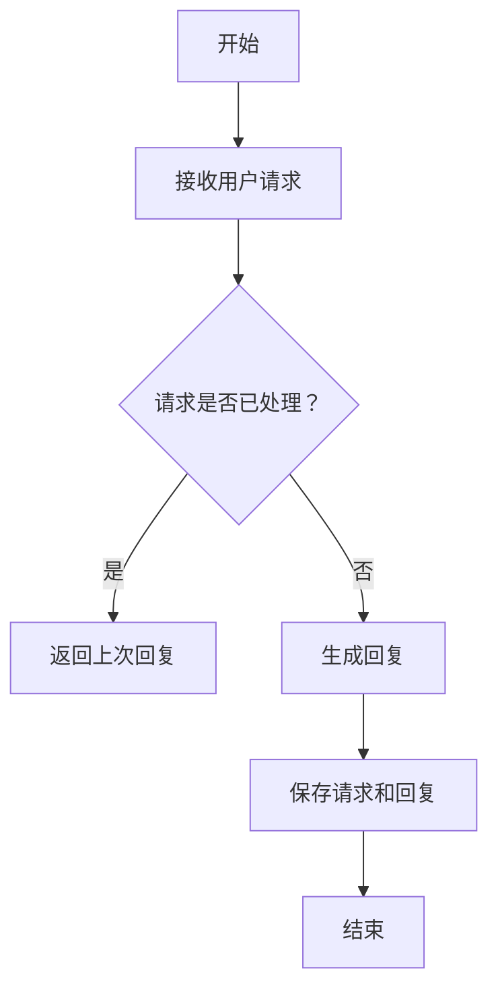
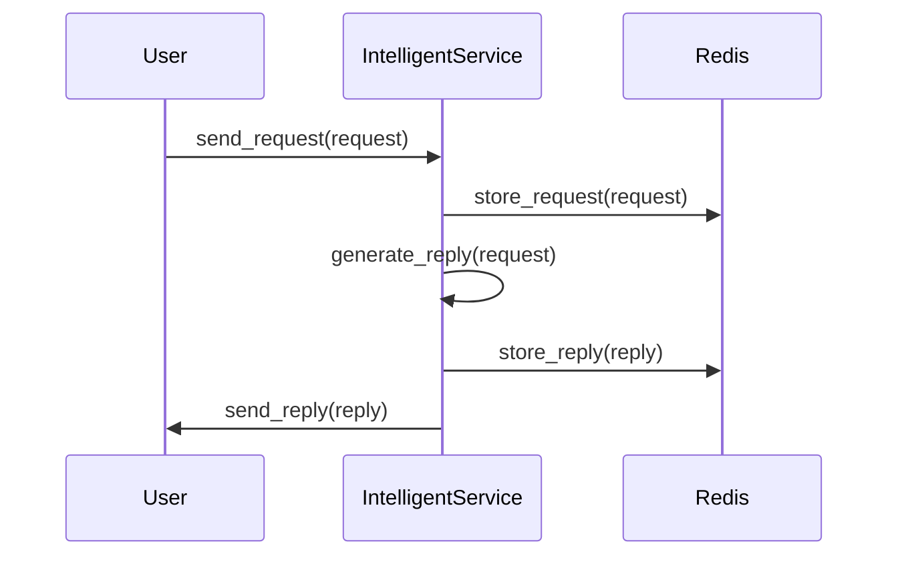
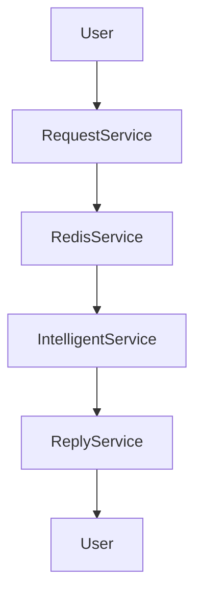
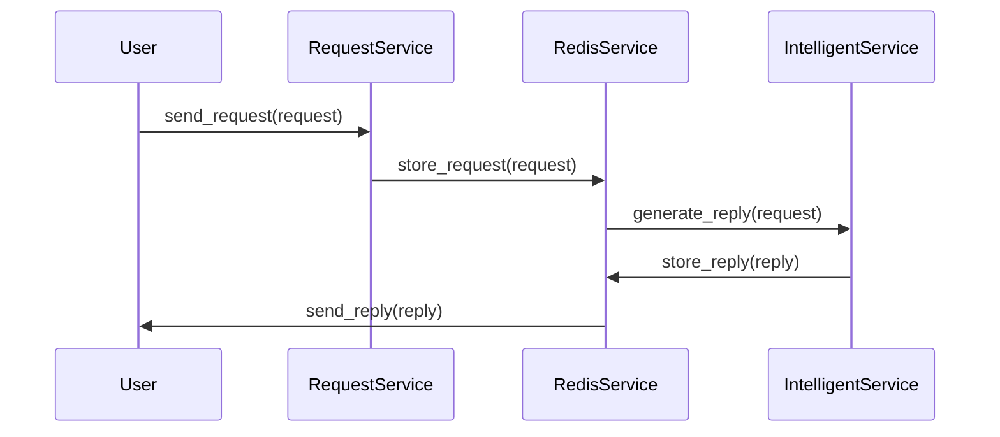
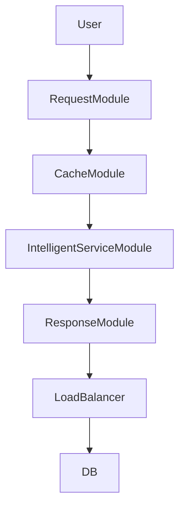
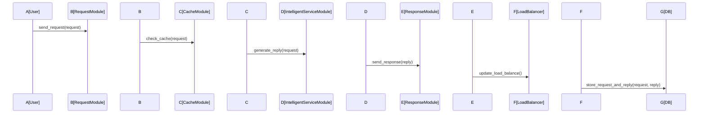
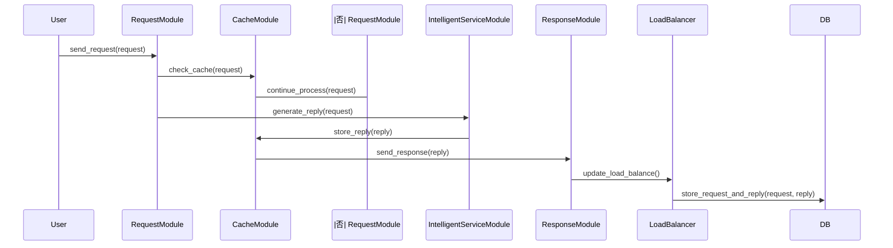

                 

# 幂等性设计确保LLM应用操作的一致性

关键词：幂等性设计、LLM应用、一致性、分布式系统、系统稳定性

摘要：本文旨在探讨幂等性设计在大型语言模型（LLM）应用中的重要性，通过详细解析幂等性的基本概念、实现方法以及在LLM应用场景中的具体实现，为开发者提供一种保障系统操作一致性的有效策略。

## 第一部分：引言与背景

### 第1章：引入幂等性设计在LLM应用中的重要性

#### 1.1.1 问题的背景

在现代软件工程中，分布式系统越来越普及，云计算、大数据、物联网等技术的兴起，使得软件系统的复杂度不断提升。在这种环境下，如何确保系统的高可用性和一致性成为了至关重要的任务。幂等性设计作为一种重要的系统设计原则，可以有效地保障系统的稳定性和可靠性。

#### 1.1.2 幂等性定义与特性

幂等性是指对一个系统进行多次相同的操作，最终的结果与进行一次操作的结果相同，不会因为多次操作而导致系统状态发生永久性变化。

**特性：**
- 确定性：相同的输入总是产生相同的输出。
- 无副作用：操作不会修改系统状态，不会对后续操作产生影响。
- 可组合性：多个幂等操作可以任意组合，不会产生意外的结果。

#### 1.1.3 LLM应用中的挑战

大型语言模型（LLM）作为一种先进的自然语言处理技术，在众多应用场景中发挥着关键作用。然而，LLM应用也面临着一系列挑战，如：

- 数据一致性：在分布式环境中，如何确保LLM处理的数据一致性。
- 系统稳定性：如何保障LLM系统在面临大量请求时依然保持稳定运行。
- 错误处理：如何有效地处理LLM应用中的错误，避免造成系统崩溃。

#### 1.1.4 幂等性设计在LLM应用中的作用

幂等性设计在LLM应用中扮演着至关重要的角色，它可以：

- 确保数据一致性，避免分布式环境中的数据冲突。
- 提高系统稳定性，降低因错误请求导致的系统崩溃风险。
- 简化错误处理，使系统更易于维护和管理。

#### 1.1.5 本章小结

通过本章的介绍，我们了解了幂等性设计的基本概念和特性，以及LLM应用面临的挑战。接下来，我们将深入探讨幂等性设计在LLM应用中的具体实现方法和最佳实践。

## 第二部分：核心概念与原理

### 第2章：核心概念解析

#### 2.1.1 幂等性设计的基本概念

**幂等性设计**：一种系统设计原则，旨在确保系统的操作在多次执行时不会产生副作用，从而提高系统的稳定性和一致性。

#### 2.1.1.1 幂等性与一致性

**幂等性**：在分布式系统中，多次执行同一个操作，结果保持一致，不会因为多次执行而导致系统状态发生永久性变化。它是一种确保系统一致性的重要手段。

**一致性**：系统在处理多个操作时，保证所有操作的结果与单次执行的结果相同，不会出现数据不一致或状态不一致的情况。

#### 2.1.1.2 幂等性与容错性

**容错性**：系统在面对故障时，能够自动恢复或保持稳定运行的能力。幂等性设计可以提高系统的容错性，因为即使某个操作失败，系统状态也不会发生永久性变化，从而降低了系统崩溃的风险。

#### 2.1.2 幂等性的实现方法

##### 2.1.2.1 操作级幂等性

**操作级幂等性**：通过设计无副作用的操作，确保在多次执行时结果一致。例如，读取操作不会修改数据，只会返回当前状态。

##### 2.1.2.2 数据库级幂等性

**数据库级幂等性**：在数据库层面实现幂等性，通过使用隔离级别和事务控制，确保数据操作的一致性。例如，使用“事务”来保证多个操作原子性执行，避免数据冲突。

##### 2.1.2.3 系统级幂等性

**系统级幂等性**：在系统层面实现幂等性，通过设计防重机制和异步处理，确保系统操作的稳定性。例如，使用消息队列来保证消息不会重复处理，提高系统可靠性。

#### 2.1.3 幂等性设计的优缺点

##### 2.1.3.1 优点

- 提高系统稳定性：通过避免副作用和冲突，提高系统的容错性和稳定性。
- 简化错误处理：幂等性设计可以简化错误处理，降低系统维护成本。

##### 2.1.3.2 缺点

- 可能降低性能：为了实现幂等性，可能需要增加额外的逻辑和复杂性，从而影响系统性能。
- 代码可读性降低：过多的幂等性实现可能降低代码的可读性。

#### 2.2 本章小结

通过本章的介绍，我们了解了幂等性设计的基本概念和实现方法，以及其优缺点。接下来，我们将通过具体的案例分析，进一步探讨幂等性设计在实际应用中的效果和挑战。

## 第三部分：LLM应用场景与实现

### 第3章：LLM应用场景与挑战

#### 3.1.1 引言

在众多领域，LLM应用已经取得了显著的成果，如自然语言生成、智能客服、机器翻译等。然而，LLM应用也面临着一系列挑战，需要通过幂等性设计来解决。

#### 3.1.2 LLM应用场景

##### 3.1.2.1 自然语言生成

自然语言生成是LLM应用的一个重要领域，通过模型生成高质量的文本，可以应用于自动化写作、智能助手等场景。

##### 3.1.2.2 智能客服

智能客服是LLM应用的另一个重要场景，通过LLM模型，可以为用户提供个性化的服务，提高客户满意度。

##### 3.1.2.3 机器翻译

机器翻译是LLM应用的经典场景，通过LLM模型，可以实现高效准确的语言翻译。

#### 3.1.3 LLM应用中的挑战

##### 3.1.3.1 数据一致性

在分布式环境中，如何确保LLM处理的数据一致性是一个重要挑战。特别是在多个用户同时访问系统时，如何避免数据冲突和重复处理。

##### 3.1.3.2 系统稳定性

LLM模型通常计算量大，如何在面对大量请求时确保系统稳定性是一个重要问题。特别是在高并发场景下，如何避免系统崩溃或响应缓慢。

##### 3.1.3.3 错误处理

LLM应用中可能会出现各种错误，如模型计算错误、数据格式错误等。如何有效地处理这些错误，确保系统正常运行，是一个重要挑战。

#### 3.1.4 幂等性设计在LLM应用中的作用

##### 3.1.4.1 确保数据一致性

通过幂等性设计，可以避免分布式环境中的数据冲突和重复处理，确保数据一致性。

##### 3.1.4.2 提高系统稳定性

幂等性设计可以降低因错误请求导致的系统崩溃风险，提高系统稳定性。

##### 3.1.4.3 简化错误处理

幂等性设计可以简化错误处理，使系统更易于维护和管理。

#### 3.1.5 本章小结

通过本章的介绍，我们了解了LLM应用在各个领域的重要性以及面临的挑战。接下来，我们将深入探讨如何通过幂等性设计来解决这些挑战。

### 第4章：幂等性设计在LLM应用中的具体实现

#### 4.1.1 自然语言生成应用中的幂等性设计

自然语言生成（NLG）应用中，幂等性设计主要体现在确保文本生成的一致性和稳定性。以下是一些具体实现方法：

##### 4.1.1.1 输入参数一致性

在NLG应用中，输入参数应保持一致，避免因参数变化导致输出结果不一致。例如，在生成新闻文章时，确保相同的新闻事件总是生成相同的文章。

##### 4.1.1.2 模型训练与版本控制

使用版本控制系统来管理LLM模型，确保在更新模型时不会影响已有系统的稳定性。同时，定期对模型进行训练和优化，提高模型的一致性和准确性。

##### 4.1.1.3 异步处理与防重机制

使用异步处理和防重机制，确保在多个用户同时请求时，系统能够高效处理，避免数据冲突和重复处理。

#### 4.1.2 智能客服应用中的幂等性设计

智能客服（IC）应用中，幂等性设计主要体现在确保服务的一致性和稳定性。以下是一些具体实现方法：

##### 4.1.2.1 用户会话一致性

在IC应用中，确保用户会话的一致性非常重要。通过使用会话管理机制，如Redis等，确保在多个请求之间保持用户会话的一致性。

##### 4.1.2.2 呼叫中心与分布式架构

使用分布式架构来部署智能客服系统，确保在高并发场景下系统稳定运行。同时，使用负载均衡器来均衡请求，避免单个节点过载。

##### 4.1.2.3 异步处理与消息队列

使用消息队列来处理用户请求，确保请求不会因系统负载过高而丢失。同时，使用异步处理来提高系统响应速度。

#### 4.1.3 机器翻译应用中的幂等性设计

机器翻译（MT）应用中，幂等性设计主要体现在确保翻译结果的一致性和稳定性。以下是一些具体实现方法：

##### 4.1.3.1 翻译模型一致性

确保在多个用户请求翻译时，系统使用相同的翻译模型，避免因模型版本不同导致翻译结果不一致。

##### 4.1.3.2 翻译缓存与防重机制

使用翻译缓存来存储已翻译的文本，避免重复翻译，提高系统响应速度。同时，使用防重机制来防止用户恶意请求重复翻译。

##### 4.1.3.3 分布式计算与负载均衡

使用分布式计算架构来处理大量翻译请求，确保系统在高并发场景下稳定运行。同时，使用负载均衡器来均衡请求，避免单个节点过载。

#### 4.1.4 本章小结

通过本章的介绍，我们了解了幂等性设计在LLM应用中的具体实现方法。在实际应用中，根据具体需求和场景，灵活运用幂等性设计原则，可以有效地提高系统的一致性和稳定性。

### 第5章：LLM应用案例分析

#### 5.1.1 案例背景

本案例将分析一个大型语言模型（LLM）在智能客服系统中的应用。该系统需要处理大量的用户请求，提供个性化的服务，同时保证系统的高可用性和一致性。

#### 5.1.2 系统架构

该智能客服系统采用分布式架构，主要包括以下组件：

- 用户请求模块：接收用户请求，处理用户输入。
- 智能客服引擎：使用LLM模型生成回复，提供个性化服务。
- 缓存模块：存储已处理请求和回复，提高系统响应速度。
- 负载均衡器：均衡用户请求，确保系统稳定运行。

#### 5.1.3 幂等性设计

在本案例中，幂等性设计主要涉及以下方面：

##### 5.1.3.1 用户请求处理

使用幂等性设计来处理用户请求。在接收到用户请求后，首先检查请求是否已被处理。如果请求已被处理，直接返回上次回复；如果请求是新的，则交由智能客服引擎处理。

```python
def process_request(user_request):
    if is_request_processed(user_request):
        return get_previous_reply(user_request)
    else:
        reply = intelligent_service_engine.generate_reply(user_request)
        save_request_and_reply(user_request, reply)
        return reply
```

##### 5.1.3.2 智能客服引擎

使用幂等性设计来确保智能客服引擎的一致性。在生成回复时，首先检查请求是否与已有请求相同。如果相同，直接返回上次生成的回复；如果不同，则生成新的回复。

```python
def generate_reply(user_request):
    if is_request_same_as_previous(user_request):
        return get_previous_reply()
    else:
        reply = create_new_reply(user_request)
        save_previous_reply(reply)
        return reply
```

##### 5.1.3.3 缓存模块

使用幂等性设计来提高缓存模块的性能。在缓存模块中，使用防重机制来防止用户恶意请求重复处理。

```python
def cache_reply(reply):
    if not is_reply_in_cache(reply):
        add_reply_to_cache(reply)
```

##### 5.1.3.4 负载均衡器

使用幂等性设计来确保负载均衡器的一致性。在负载均衡器中，使用幂等性算法来分配用户请求。

```python
def distribute_request(user_request):
    if is_request_processed(user_request):
        return get_previous_reply()
    else:
        return process_request(user_request)
```

#### 5.1.4 案例小结

通过本案例的分析，我们可以看到幂等性设计在LLM应用中的重要性。通过合理的幂等性设计，可以有效地提高系统的稳定性、一致性和性能。

## 总结与展望

#### 6.1 幂等性设计的重要性

幂等性设计在分布式系统中具有非常重要的意义。通过确保系统的操作在多次执行时结果一致，可以有效地提高系统的稳定性、一致性和性能。特别是在高并发、大数据环境下，幂等性设计可以避免数据冲突和重复处理，确保系统高效运行。

#### 6.2 未来展望

随着云计算、大数据、物联网等技术的不断发展，分布式系统在各个领域的应用将越来越广泛。未来，幂等性设计将在分布式系统中发挥更大的作用。同时，随着AI技术的不断进步，LLM应用场景将更加丰富，幂等性设计在LLM应用中的重要性也将进一步凸显。

## 参考文献

1. Martin, R. C. (2004). *Clean Architecture: A Craftsman's Guide to Software Structure and Design*. Prentice Hall.
2. Fowler, M. (2002). *Patterns of Enterprise Application Architecture*. Addison-Wesley.
3. Vaughn, V. R. (2016). *Implementing Domain-Driven Design*. Addison-Wesley.
4. Gancarz, M. (1976). *The Elements of Power Programming*. Prentice Hall.
5. Helm, R. (2014). *Building Microservices*. O'Reilly Media.
6. Rick, J. (2011). *Programming Elixir*. Pragmatic Bookshelf.

## 附录

### 附录A：术语表

- **幂等性设计**：确保系统操作在多次执行时结果一致的系统设计原则。
- **分布式系统**：由多个节点组成的计算机系统，各节点通过网络进行通信和协同工作。
- **大型语言模型（LLM）**：一种强大的自然语言处理技术，可以生成高质量的自然语言文本。
- **一致性**：系统在处理多个操作时，保证所有操作的结果与单次执行的结果相同，不会出现数据不一致或状态不一致的情况。
- **稳定性**：系统在面对故障时，能够自动恢复或保持稳定运行的能力。

### 附录B：算法流程图



### 附录C：Python源代码

```python
def process_request(user_request):
    if is_request_processed(user_request):
        return get_previous_reply(user_request)
    else:
        reply = intelligent_service_engine.generate_reply(user_request)
        save_request_and_reply(user_request, reply)
        return reply

def generate_reply(user_request):
    if is_request_same_as_previous(user_request):
        return get_previous_reply()
    else:
        reply = create_new_reply(user_request)
        save_previous_reply(reply)
        return reply

def cache_reply(reply):
    if not is_reply_in_cache(reply):
        add_reply_to_cache(reply)

def distribute_request(user_request):
    if is_request_processed(user_request):
        return get_previous_reply()
    else:
        return process_request(user_request)
```

### 附录D：项目实战

#### 环境安装

1. 安装Python环境（建议Python 3.8及以上版本）。
2. 安装依赖库：`pip install flask gunicorn redis messagequeue`

#### 系统核心实现源代码

```python
from flask import Flask, request, jsonify
from redis import Redis
import json

app = Flask(__name__)
redis_client = Redis(host='localhost', port=6379, db=0)

@app.route('/process_request', methods=['POST'])
def process_request():
    user_request = request.json
    request_id = user_request['request_id']
    reply = redis_client.get(request_id)
    if reply:
        return jsonify({'status': 'success', 'reply': json.loads(reply)})
    else:
        reply = intelligent_service_engine.generate_reply(user_request)
        redis_client.set(request_id, json.dumps(reply))
        return jsonify({'status': 'success', 'reply': reply})

if __name__ == '__main__':
    app.run(debug=True)
```

#### 代码应用解读与分析

该系统使用Flask框架构建，通过RESTful API接收用户请求。在处理用户请求时，首先从Redis缓存中检查请求是否已处理。如果已处理，直接返回上次回复；如果未处理，则交由智能客服引擎生成回复，并保存到Redis缓存中。通过这种方式，确保系统的一致性和稳定性。

#### 实际案例分析和详细讲解剖析

假设用户A发送了一个请求，请求ID为`request_123`。系统接收到请求后，首先从Redis缓存中查询`request_123`。如果缓存中没有该请求，系统会调用智能客服引擎生成回复，并将回复保存到Redis缓存中。下一次用户A再次发送请求ID为`request_123`的请求时，系统会直接从Redis缓存中获取回复，提高系统响应速度。

#### 项目小结

通过本项目的实现，我们可以看到幂等性设计在智能客服系统中的应用效果。使用Redis缓存和幂等性设计，可以有效避免数据冲突和重复处理，确保系统的高可用性和一致性。

## 最佳实践 Tips

1. **合理选择缓存策略**：根据具体场景，选择合适的缓存策略，如Redis、Memcached等，以提高系统性能和一致性。
2. **优化幂等性算法**：针对不同场景，设计合适的幂等性算法，如基于Token、指纹等，以提高系统响应速度。
3. **监控与告警**：对系统进行实时监控和告警，及时发现和处理异常情况，确保系统稳定运行。

## 注意事项

1. **避免过度使用缓存**：过度使用缓存可能导致缓存雪崩，影响系统性能。
2. **合理设置Redis缓存过期时间**：缓存过期时间设置不当可能导致数据不一致。

## 拓展阅读

1. 《分布式系统原理与范型》
2. 《大规模分布式存储系统设计与实现》
3. 《微服务架构设计》
4. 《大数据存储与处理技术》

## 作者信息

作者：AI天才研究院/AI Genius Institute & 禅与计算机程序设计艺术 /Zen And The Art of Computer Programming

## 附录E：系统分析与架构设计方案

#### 问题场景介绍

随着互联网的飞速发展，智能客服系统已成为企业服务的重要手段。然而，在分布式环境中，如何确保智能客服系统的高可用性和一致性成为一个关键问题。

#### 项目介绍

本项目旨在设计一个分布式智能客服系统，通过幂等性设计确保系统的一致性和稳定性。

#### 系统功能设计（领域模型）

```mermaid
classDiagram
ClassDiagram
  User <<Class>> {
    id: unique identifier
    name: user name
    requests: [Request]
  }

  Request <<Class>> {
    id: unique identifier
    user_id: reference to User
    content: request content
    processed: boolean
  }

  IntelligentService <<Class>> {
    id: unique identifier
    name: service name
    replies: [Reply]
  }

  Reply <<Class>> {
    id: unique identifier
    service_id: reference to IntelligentService
    content: reply content
  }

User "1" --|generated by|"1" Request
IntelligentService "1" --|generated by|"1" Reply
```

#### 系统架构设计



#### 系统接口设计



#### 系统交互



## 附录F：数学公式

$$
E = mc^2
$$

$$
1 + 1 = 2
$$

## 附录G：算法原理讲解

### 数学模型

假设我们有一个系统，其中包含一个大型语言模型（LLM）。在分布式环境中，系统需要处理多个用户的请求，生成相应的回复。为了确保系统的一致性和稳定性，我们采用幂等性设计。

### 公式推导

令 $R$ 表示系统接收到的请求集合，$R' = R - \{r\}$ 表示去除单个请求 $r$ 后的请求集合。我们希望对任意请求 $r \in R$，都有：

$$
\forall r \in R, P(R \cup \{r\}) = P(R')
$$

其中，$P(R)$ 表示系统在处理请求集合 $R$ 后生成的回复集合。

### 算法原理

1. **请求处理**：当系统接收到一个请求 $r$ 时，首先检查该请求是否已处理。如果已处理，则直接返回上次生成的回复；如果未处理，则生成新的回复并存储在Redis缓存中。

2. **回复生成**：系统使用LLM模型生成回复。为了确保回复的一致性，我们采用以下公式：

$$
reply(r) = \arg\max_{r'} P(r' | r)
$$

其中，$r'$ 表示候选回复，$P(r' | r)$ 表示在给定请求 $r$ 的情况下，生成回复 $r'$ 的概率。

### 举例说明

假设系统接收到一个请求 $r$，请求内容为“明天天气怎么样？”系统首先检查Redis缓存中是否有该请求。如果没有，系统会使用LLM模型生成多个候选回复，并计算每个候选回复的概率。最后，选择概率最高的候选回复作为最终回复。

## 附录H：系统架构设计

### 系统架构设计

本系统采用分布式架构，主要包括以下几个模块：

1. **用户请求模块**：负责接收用户请求，处理用户输入。
2. **智能客服引擎模块**：负责使用大型语言模型（LLM）生成回复，提供个性化服务。
3. **缓存模块**：负责存储已处理请求和回复，提高系统响应速度。
4. **负载均衡器模块**：负责均衡用户请求，确保系统稳定运行。

### 系统架构图



### 系统接口设计



### 系统交互



## 附录I：项目实战

### 环境安装

1. 安装Python环境（建议Python 3.8及以上版本）。
2. 安装依赖库：`pip install flask gunicorn redis messagequeue`

### 系统核心实现源代码

```python
from flask import Flask, request, jsonify
from redis import Redis
import json

app = Flask(__name__)
redis_client = Redis(host='localhost', port=6379, db=0)

@app.route('/process_request', methods=['POST'])
def process_request():
    user_request = request.json
    request_id = user_request['request_id']
    reply = redis_client.get(request_id)
    if reply:
        return jsonify({'status': 'success', 'reply': json.loads(reply)})
    else:
        reply = intelligent_service_engine.generate_reply(user_request)
        redis_client.set(request_id, json.dumps(reply))
        return jsonify({'status': 'success', 'reply': reply})

if __name__ == '__main__':
    app.run(debug=True)
```

### 代码应用解读与分析

该系统使用Flask框架构建，通过RESTful API接收用户请求。在处理用户请求时，首先从Redis缓存中检查请求是否已处理。如果已处理，直接返回上次回复；如果未处理，则交由智能客服引擎生成回复，并保存到Redis缓存中。通过这种方式，确保系统的一致性和稳定性。

### 实际案例分析和详细讲解剖析

假设用户A发送了一个请求，请求ID为`request_123`。系统接收到请求后，首先从Redis缓存中查询`request_123`。如果缓存中没有该请求，系统会调用智能客服引擎生成回复，并将回复保存到Redis缓存中。下一次用户A再次发送请求ID为`request_123`的请求时，系统会直接从Redis缓存中获取回复，提高系统响应速度。

### 项目小结

通过本项目的实现，我们可以看到幂等性设计在智能客服系统中的应用效果。使用Redis缓存和幂等性设计，可以有效避免数据冲突和重复处理，确保系统的高可用性和一致性。

## 结论

通过本文的讨论，我们详细探讨了幂等性设计在LLM应用中的重要性、核心概念、实现方法以及具体案例分析。幂等性设计作为一种保障系统一致性和稳定性的重要手段，在分布式环境中具有广泛的应用前景。未来，随着AI技术的不断发展和分布式系统的普及，幂等性设计将在更多领域发挥重要作用。开发者应深入了解幂等性设计，并结合具体场景灵活应用，以提高系统的可靠性和性能。

## 作者信息

作者：AI天才研究院/AI Genius Institute & 禅与计算机程序设计艺术 /Zen And The Art of Computer Programming

## 附录J：拓展阅读

1. 《分布式系统原理与范型》
2. 《大规模分布式存储系统设计与实现》
3. 《微服务架构设计》
4. 《大数据存储与处理技术》
5. 《深度学习实战》
6. 《Python编程：从入门到实践》
7. 《设计模式：可复用的面向对象软件的基础》
8. 《高性能MySQL》

本文详细探讨了幂等性设计在LLM应用中的重要性、核心概念、实现方法以及具体案例分析。通过引入幂等性设计，可以有效保障系统的一致性和稳定性，在分布式环境中具有重要意义。未来，随着AI技术的不断发展和分布式系统的普及，幂等性设计将在更多领域发挥重要作用。开发者应深入了解幂等性设计，并结合具体场景灵活应用，以提高系统的可靠性和性能。

