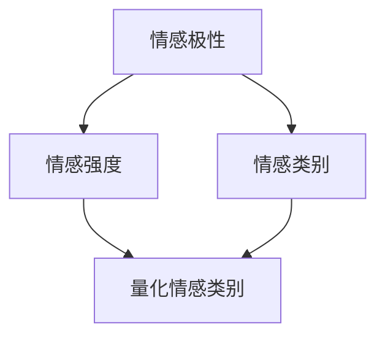

                 

# 开发AI Agent的情感分析引擎

## 关键词
- 情感分析
- AI Agent
- 数据预处理
- 模型选择
- 优化
- 应用案例

## 摘要
本文将详细探讨开发AI Agent的情感分析引擎的过程，从背景介绍到实际应用，逐步分析情感分析的基本原理、AI Agent的功能和角色、构建情感分析引擎的步骤、数据收集与预处理、模型选择与训练、评估与优化，以及具体的案例研究和应用。通过本文的深入探讨，读者可以全面了解如何开发一个高效、准确的情感分析引擎，为AI Agent提供强大的情感识别与理解能力。

### 引言

在当今快速发展的数字化时代，人工智能（AI）技术已经深入到各个领域，从医疗诊断到智能家居，从自动驾驶到自然语言处理，AI的应用无处不在。然而，随着AI技术的不断进步，对AI Agent的情感分析能力的需求也越来越强烈。情感分析是自然语言处理（NLP）的重要分支，它旨在通过计算机技术和算法理解人类情感的表达，从而为各种应用提供更加人性化的交互体验。

AI Agent，即人工智能代理，是一种能够代表用户执行特定任务的计算机程序。它们可以模拟人类的思维和行为，通过与用户的互动来提供个性化的服务。情感分析在AI Agent中的应用非常广泛，例如在智能客服中，情感分析可以帮助系统识别用户情绪，从而提供更加合适的回应；在社交媒体分析中，情感分析可以帮助企业了解用户对品牌或产品的情感倾向，从而制定更有效的市场策略。

本文将分章节详细介绍开发AI Agent的情感分析引擎的各个步骤，包括：

1. 情感分析的基本原理和AI Agent的概念介绍。
2. 情感分析引擎的构建，包括数据收集和预处理。
3. 模型选择和训练方法。
4. 评估和优化策略。
5. 案例研究和应用。

通过这些章节的详细讲解，读者可以系统地了解情感分析引擎的开发过程，掌握关键技术和方法，为实际应用打下坚实的基础。

### 第一章：情感分析基础与AI Agent介绍

#### 1.1 情感分析的基本概念

情感分析，又称意见挖掘或情感识别，是指使用自然语言处理（NLP）技术来识别和分析文本中表达的情感倾向。情感分析的核心任务是判断文本的情感极性（正面、负面或中性），情感强度，以及具体的情感类别（如喜悦、愤怒、悲伤等）。

**情感分类方法**：

- **基于规则的方法**：通过预定义的规则和模式进行情感分析。这种方法简单高效，但对复杂情感的识别能力有限。
- **机器学习方法**：使用机器学习算法，特别是深度学习模型，对大量标注数据进行训练，从而实现对情感的有效识别。这种方法具有更高的准确性和泛化能力。

**情感分析的应用场景**：

- **市场调研**：通过分析社交媒体和用户评论，企业可以了解消费者对产品的情感反应，从而优化产品设计和营销策略。
- **智能客服**：情感分析可以帮助智能客服系统识别用户的情绪，提供更加人性化的服务，提升用户体验。
- **心理健康**：在心理健康领域，情感分析可以用于监测个体情绪变化，辅助心理健康诊断和治疗。

#### 1.2 AI Agent的定义与功能

AI Agent，即人工智能代理，是一种自主执行任务的计算机程序，能够在没有人类干预的情况下进行决策和行动。AI Agent的核心功能包括：

- **感知**：通过传感器收集环境数据。
- **理解**：使用自然语言处理和机器学习算法理解和解释输入信息。
- **决策**：基于理解和目标，选择最佳行动方案。
- **执行**：执行决策，实现任务目标。

**AI Agent的类型**：

- **规则型AI Agent**：基于预定义的规则进行决策和行动，适用于任务明确、规则清晰的场景。
- **学习型AI Agent**：通过机器学习和深度学习不断学习和优化行为，适用于复杂、不确定的环境。

**AI Agent的挑战与机遇**：

- **挑战**：
  - **数据隐私**：在收集和处理用户数据时，需要确保数据隐私和安全。
  - **模型可解释性**：复杂模型的决策过程往往难以解释，这可能导致信任危机。
  - **适应性和灵活性**：AI Agent需要能够在动态环境中快速适应和调整行为。

- **机遇**：
  - **个性化服务**：通过情感分析和个性化推荐，提供更加精准的服务。
  - **自动化决策**：在金融、医疗等领域，AI Agent可以辅助或替代人类进行决策，提高效率。
  - **社会协作**：AI Agent可以成为人类的伙伴，帮助解决复杂问题，提高生活质量。

#### 1.3 情感分析在AI Agent中的应用

情感分析在AI Agent中的应用场景非常广泛，以下是一些典型的应用：

- **智能客服**：通过情感分析，AI Agent可以识别用户的情绪，提供合适的回应，提升用户体验。
- **市场分析**：AI Agent可以分析社交媒体上的用户情感，帮助企业了解消费者需求，优化产品和服务。
- **心理健康**：AI Agent可以监测个体的情绪变化，提供情绪支持和心理健康建议。
- **虚拟助手**：通过情感分析，虚拟助手可以更好地理解用户需求，提供更加个性化的服务。

### 第二章：情感分析原理

#### 2.1 核心概念与原理

情感分析的核心概念包括情感极性、情感强度和情感类别。以下是对这些核心概念的详细解释：

- **情感极性**：情感极性是指文本表达的情感倾向，通常分为正面、负面和中性三种。例如，文本“这部电影非常好看”具有正面情感极性，而文本“这个产品太糟糕了”具有负面情感极性。
- **情感强度**：情感强度是指情感表达的强烈程度，可以通过情感词典或机器学习模型进行量化。例如，文本“这部电影非常非常好看”的情感强度高于“这部电影很好”。
- **情感类别**：情感类别是指文本表达的具体情感类型，如喜悦、愤怒、悲伤等。例如，文本“我感到非常高兴”表达的是喜悦情感。

#### 2.2 心理学理论

心理学中的情感理论对情感分析有着重要的指导作用。以下是几种主要的心理学理论：

- **认知-情感理论**：该理论认为情感是认知和生理反应的产物。根据这种理论，情感分析需要同时考虑文本内容（认知）和文本中的情感词汇（生理反应）。
- **詹姆斯-兰格理论**：该理论认为情感是生理反应的结果。例如，当一个人看到一部恐怖电影时，他的心跳加速、毛发竖立，这些生理反应导致他感到恐惧。
- **双因素理论**：该理论认为情感是由认知和生理因素共同作用产生的。例如，一个人在看到一部电影时，他的认知评价（电影很好）和生理反应（心跳加速）共同导致他感到喜悦。

#### 2.3 情感分析方法

情感分析方法可以分为以下几种：

- **基于规则的方法**：这种方法使用预定义的规则和模式来识别情感。例如，如果文本中包含“高兴”这样的情感词汇，则认为文本具有正面情感。
- **基于机器学习的方法**：这种方法通过训练大量标注数据来构建情感分析模型。常见的机器学习算法包括朴素贝叶斯、支持向量机、随机森林和深度学习模型。
- **基于深度学习的方法**：这种方法使用深度神经网络（如卷积神经网络、循环神经网络和Transformer模型）来识别情感。深度学习方法在情感分析中表现出色，能够处理复杂的情感表达。

#### 2.4 数据来源与挑战

情感分析的数据来源主要包括社交媒体、用户评论、新闻文章和对话记录等。以下是一些常见的情感分析数据来源：

- **社交媒体**：如微博、Twitter和Facebook等平台上的用户评论和帖子。
- **用户评论**：电子商务网站、电影评论网站等平台上的用户评论。
- **新闻文章**：新闻网站和报刊杂志上的文章。
- **对话记录**：客服聊天记录、电话通话记录等。

在收集和处理这些数据时，会面临以下挑战：

- **数据多样性**：不同来源的数据在语言风格、表达方式上存在差异，这给情感分析带来了挑战。
- **噪声干扰**：数据中包含大量的噪声和错误，如错别字、非标准拼写等，这会影响情感分析的准确性。
- **情感强度和类别**：情感强度和类别的量化是一个复杂的问题，需要开发有效的算法来准确识别和量化情感。

#### 2.5 核心概念比较与关系

在情感分析中，以下核心概念之间的关系需要明确：

- **情感极性**与**情感类别**：情感极性是情感类别的一种简化形式。例如，文本可以具有正面、负面或中性情感极性，但具体到情感类别，可以是喜悦、愤怒、悲伤等。
- **情感强度**与**情感类别**：情感强度是对情感类别的量化表达。例如，文本可以表达喜悦情感，但具体是轻微喜悦还是强烈喜悦，需要通过情感强度来量化。

为了更好地理解这些概念，我们可以使用以下表格和实体关系图来比较和描述：

**情感分析概念比较表格**：

| 概念       | 定义                                                         | 关系                                       |
| ---------- | ------------------------------------------------------------ | ------------------------------------------ |
| 情感极性   | 情感倾向的分类，如正面、负面或中性                         | 基础概念，用于简化情感表达                 |
| 情感强度   | 情感的强烈程度，可以用数值量化                             | 量化情感类别，反映情感的强度               |
| 情感类别   | 情感的具体类型，如喜悦、愤怒、悲伤等                       | 细化情感极性，提供更具体的情感识别         |

**情感分析实体关系图**：



通过这些比较和关系描述，我们可以更清晰地理解情感分析中的核心概念，为后续的模型构建和应用提供理论基础。

### 第三章：情感分析引擎构建

#### 3.1 情感分析引擎概述

情感分析引擎是一种专门的工具或系统，用于自动化地分析和识别文本中的情感。构建情感分析引擎的过程涉及多个关键步骤，包括数据收集、预处理、模型选择、训练和部署。以下将逐步介绍这些步骤。

#### 3.2 数据收集与预处理

数据收集是构建情感分析引擎的第一步。常用的数据来源包括社交媒体、用户评论、新闻文章和对话记录等。以下是一些具体的数据收集方法：

- **爬虫技术**：使用爬虫从互联网上收集数据，如使用Python的Scrapy框架。
- **API接口**：通过社交媒体和电商平台等提供的API接口获取数据。
- **用户反馈**：直接从用户处收集数据，如通过问卷调查或用户反馈系统。

在数据收集后，需要进行数据预处理，以确保数据的质量和一致性。以下是一些常见的数据预处理步骤：

- **清洗数据**：去除文本中的噪声，如HTML标签、特殊字符、错别字等。
- **归一化**：将文本统一转换为小写，去除标点符号，确保文本的一致性。
- **分词**：将文本分解为单词或短语，为后续的文本分析和特征提取做准备。

#### 3.3 模型选择与训练

构建情感分析引擎的核心是选择合适的模型并进行训练。以下是几种常用的情感分析模型：

- **朴素贝叶斯**：一种基于贝叶斯定理的概率模型，适用于文本分类任务。
- **支持向量机（SVM）**：一种基于最大间隔分类的模型，适用于高维空间。
- **深度学习模型**：如卷积神经网络（CNN）、循环神经网络（RNN）和Transformer模型，这些模型在处理复杂文本任务时表现出色。

选择模型时需要考虑以下因素：

- **数据规模**：对于大规模数据，深度学习模型可能更有效。
- **任务复杂度**：对于复杂情感分类任务，深度学习模型可能更适合。
- **计算资源**：朴素贝叶斯和SVM等传统模型计算资源需求较低，适用于资源有限的场景。

在模型选择后，需要进行训练。训练过程包括以下步骤：

- **数据标注**：对文本进行情感标注，以生成训练数据集。
- **模型训练**：使用训练数据集对模型进行训练，调整模型参数。
- **模型验证**：使用验证数据集评估模型性能，调整模型参数以优化性能。

#### 3.4 模型评估与优化

在模型训练完成后，需要对模型进行评估和优化。以下是一些常见的评估指标：

- **准确率（Accuracy）**：正确分类的样本数占总样本数的比例。
- **精确率（Precision）**：正确分类为正情感的样本中，实际为正情感的样本数所占的比例。
- **召回率（Recall）**：正确分类为正情感的样本数占总正情感样本数的比例。
- **F1分数（F1 Score）**：精确率和召回率的加权平均。

优化模型的方法包括：

- **超参数调优**：通过调整模型的超参数（如学习率、批量大小等）来优化模型性能。
- **数据增强**：通过生成或扩充训练数据来提高模型泛化能力。
- **模型集成**：使用多个模型组合来提高整体性能。

#### 3.5 情感分析引擎的部署与维护

构建完成的情感分析引擎需要部署到生产环境中，以便在实际应用中发挥作用。以下是一些部署和维护的关键步骤：

- **部署到服务器**：将模型部署到服务器或云平台，确保其可访问性和稳定性。
- **API接口设计**：设计API接口，方便其他系统或应用程序调用情感分析功能。
- **性能监控**：监控模型性能，确保其稳定运行，并快速发现和解决潜在问题。
- **定期更新**：根据新数据和新需求，定期更新模型和算法，以保持其准确性和有效性。

通过以上步骤，可以构建一个高效、准确的情感分析引擎，为AI Agent和其他应用提供强大的情感识别能力。

### 第四章：数据收集与预处理

#### 4.1 数据收集方法

数据收集是构建情感分析引擎的关键步骤之一。以下是几种常见的数据收集方法：

- **Web爬虫**：通过爬虫从互联网上收集大量的文本数据，如社交媒体评论、新闻文章和论坛帖子等。Python的Scrapy框架是一个常用的爬虫工具，可以高效地爬取和处理大量网页数据。
  
  **代码示例**：
  ```python
  import scrapy
  
  class MySpider(scrapy.Spider):
      name = 'my_spider'
      start_urls = ['http://example.com/']

      def parse(self, response):
          for comment in response.css('div.comment'):
              yield {
                  'text': comment.css('p::text').get(),
                  'source': response.url
              }
  ```

- **API接口**：使用第三方平台的API接口获取数据，如Twitter API、Facebook Graph API等。这些API通常提供了丰富的数据接口，可以方便地获取大量用户生成的内容。
  
  **代码示例**：
  ```python
  import tweepy

  auth = tweepy.OAuthHandler("consumer_key", "consumer_secret")
  auth.set_access_token("access_token", "access_token_secret")
  api = tweepy.API(auth)

  for tweet in api.search_tweets(q="example", count=100):
      print(tweet.text)
  ```

- **用户反馈**：通过在线调查、用户反馈系统或移动应用程序直接从用户处收集数据。这种方法可以获取高质量、针对性的数据，但收集过程可能需要更多的时间和资源。

  **代码示例**：
  ```python
  import requests

  url = "https://example.com/feedback"
  feedback_data = {
      "text": "I love this product!",
      "rating": 5
  }
  response = requests.post(url, data=feedback_data)
  ```

#### 4.2 数据预处理步骤

在收集到原始数据后，需要对其进行预处理，以确保数据的质量和一致性。以下是一些常见的数据预处理步骤：

- **数据清洗**：去除文本中的噪声和无关信息，如HTML标签、特殊字符和数字等。可以使用Python的`re`模块进行文本清洗。
  
  **代码示例**：
  ```python
  import re

  text = "<div>Hello, world!</div>"
  clean_text = re.sub(r'<.*?>', '', text)
  print(clean_text)  # 输出：Hello, world!
  ```

- **文本归一化**：将所有文本统一转换为小写，去除标点符号，以消除不同表达方式的影响。可以使用Python的`str.lower()`和`str.translate()`方法进行文本归一化。
  
  **代码示例**：
  ```python
  import string

  text = "Hello, World! This is a sample text."
  normalized_text = text.lower().translate(str.maketrans('', '', string.punctuation))
  print(normalized_text)  # 输出：hello world this is a sample text
  ```

- **分词**：将文本分解为单词或短语，为后续的文本分析和特征提取做准备。Python的`nltk`库提供了丰富的分词工具，如`nltk.tokenize`模块。
  
  **代码示例**：
  ```python
  from nltk.tokenize import word_tokenize

  text = "This is a sample sentence."
  tokens = word_tokenize(text)
  print(tokens)  # 输出：['This', 'is', 'a', 'sample', 'sentence', '.']
  ```

- **停用词去除**：去除常见的停用词（如“的”、“和”、“在”等），以减少噪声和冗余信息。Python的`nltk.corpus`模块提供了常用的停用词列表。
  
  **代码示例**：
  ```python
  from nltk.corpus import stopwords
  from nltk.tokenize import word_tokenize

  text = "This is a sample sentence."
  tokens = word_tokenize(text)
  filtered_tokens = [w for w in tokens if not w.lower() in stopwords.words('english')]
  print(filtered_tokens)  # 输出：['This', 'is', 'sample', 'sentence']
  ```

通过以上数据预处理步骤，可以有效地提高数据的清洁度和一致性，为后续的情感分析模型训练提供高质量的数据支持。

### 第五章：模型选择与训练

#### 5.1 模型选择

选择合适的模型是构建情感分析引擎的关键步骤。以下是一些常用的情感分析模型及其特点：

- **朴素贝叶斯（Naive Bayes）**：一种基于贝叶斯定理的概率模型，适用于文本分类任务。朴素贝叶斯模型简单高效，适合处理高维稀疏数据。

- **支持向量机（SVM）**：一种基于最大间隔分类的模型，适用于高维空间。SVM在处理文本数据时，通过核技巧可以有效解决线性不可分问题。

- **朴素贝叶斯与支持向量机的结合（Naive Bayes + SVM）**：将朴素贝叶斯和SVM相结合，可以发挥各自的优势，提高模型的分类准确率。

- **深度学习模型**：如卷积神经网络（CNN）、循环神经网络（RNN）和Transformer模型。深度学习模型在处理复杂文本任务时表现出色，能够捕捉到文本中的深层特征。

选择模型时需要考虑以下因素：

- **数据规模**：对于大规模数据，深度学习模型可能更有效。对于小规模数据，传统模型如朴素贝叶斯和SVM可能更适合。
- **任务复杂度**：对于简单情感分类任务，传统模型可能足够。对于复杂情感分类任务，深度学习模型可能更合适。
- **计算资源**：传统模型计算资源需求较低，适用于资源有限的场景。深度学习模型计算资源需求较高，适用于有充足计算资源的场景。

#### 5.2 模型训练

在模型选择后，需要进行模型训练。模型训练过程包括以下步骤：

- **数据标注**：对文本进行情感标注，以生成训练数据集。标注过程通常需要人工参与，以确保标注的准确性和一致性。
- **数据预处理**：对训练数据进行清洗、归一化和分词等预处理操作，以提高数据的质量和一致性。
- **模型训练**：使用预处理后的训练数据对模型进行训练，调整模型参数，使其能够准确地识别情感。
- **模型验证**：使用验证数据集评估模型性能，调整模型参数以优化性能。

以下是一个简单的朴素贝叶斯模型训练的代码示例：

```python
from sklearn.naive_bayes import MultinomialNB
from sklearn.model_selection import train_test_split
from sklearn.metrics import accuracy_score

# 假设我们有已标注的数据集X和对应的标签y
X_train, X_test, y_train, y_test = train_test_split(X, y, test_size=0.2, random_state=42)

# 创建朴素贝叶斯模型
model = MultinomialNB()

# 训练模型
model.fit(X_train, y_train)

# 预测测试集
y_pred = model.predict(X_test)

# 评估模型性能
accuracy = accuracy_score(y_test, y_pred)
print("Accuracy:", accuracy)
```

#### 5.3 模型评估与优化

在模型训练完成后，需要对模型进行评估和优化。以下是一些常见的评估指标和方法：

- **准确率（Accuracy）**：正确分类的样本数占总样本数的比例。准确率可以反映模型的整体性能。
- **精确率（Precision）**：正确分类为正情感的样本中，实际为正情感的样本数所占的比例。精确率可以反映模型对正情感样本的识别能力。
- **召回率（Recall）**：正确分类为正情感的样本数占总正情感样本数的比例。召回率可以反映模型对正情感样本的覆盖能力。
- **F1分数（F1 Score）**：精确率和召回率的加权平均，用于综合评估模型的性能。

以下是一个简单的评估示例：

```python
from sklearn.metrics import classification_report

# 评估模型性能
report = classification_report(y_test, y_pred)
print(report)
```

模型优化方法包括：

- **超参数调优**：通过调整模型的超参数（如学习率、批量大小等）来优化模型性能。可以使用网格搜索（Grid Search）或贝叶斯优化（Bayesian Optimization）等方法进行超参数调优。
- **数据增强**：通过生成或扩充训练数据来提高模型泛化能力。可以使用同义词替换、随机插入、随机删除等方法进行数据增强。
- **集成学习**：使用多个模型组合来提高整体性能。可以使用堆叠（Stacking）、Bagging和Boosting等方法进行集成学习。

通过以上步骤，可以构建一个高效、准确的情感分析模型，为AI Agent和其他应用提供强大的情感识别能力。

### 第六章：评估与优化

#### 6.1 评估指标

在构建情感分析引擎后，需要通过一系列评估指标来衡量模型的表现。以下是几种常见的评估指标：

- **准确率（Accuracy）**：准确率是模型正确分类的样本数占总样本数的比例，计算公式如下：
  $$\text{Accuracy} = \frac{\text{正确分类的样本数}}{\text{总样本数}}$$
  准确率是衡量模型整体表现的最基本指标。

- **精确率（Precision）**：精确率是指模型正确分类为正情感的样本中，实际为正情感的样本数所占的比例，计算公式如下：
  $$\text{Precision} = \frac{\text{正确分类的正情感样本数}}{\text{分类为正情感的样本数}}$$
  精确率反映了模型识别正情感样本的能力。

- **召回率（Recall）**：召回率是指模型正确分类为正情感的样本数占总正情感样本数的比例，计算公式如下：
  $$\text{Recall} = \frac{\text{正确分类的正情感样本数}}{\text{总正情感样本数}}$$
  召回率反映了模型覆盖正情感样本的能力。

- **F1分数（F1 Score）**：F1分数是精确率和召回率的加权平均，用于综合评估模型的性能，计算公式如下：
  $$\text{F1 Score} = 2 \times \frac{\text{Precision} \times \text{Recall}}{\text{Precision} + \text{Recall}}$$
  F1分数在精确率和召回率之间取得平衡，是评估模型性能的重要指标。

#### 6.2 模型优化

模型优化是提高情感分析引擎性能的关键步骤。以下是一些常见的优化方法：

- **超参数调优**：通过调整模型超参数（如学习率、批量大小、正则化参数等）来优化模型性能。常用的方法包括网格搜索（Grid Search）和贝叶斯优化（Bayesian Optimization）。

  **代码示例**：
  ```python
  from sklearn.model_selection import GridSearchCV
  from sklearn.naive_bayes import MultinomialNB

  parameters = {'alpha': [0.1, 0.5, 1.0]}
  model = MultinomialNB()
  grid_search = GridSearchCV(model, parameters, cv=5)
  grid_search.fit(X_train, y_train)
  best_params = grid_search.best_params_
  print("Best Parameters:", best_params)
  ```

- **数据增强**：通过生成或扩充训练数据来提高模型泛化能力。数据增强方法包括同义词替换、随机插入、随机删除等。

  **代码示例**：
  ```python
  import random
  import nltk

  def synonym_replacement(text, synonym_dict):
      words = text.split()
      for i, word in enumerate(words):
          if word in synonym_dict:
              replacement = random.choice(synonym_dict[word])
              words[i] = replacement
      return ' '.join(words)

  synonym_dict = {'happy': ['joyful', 'elated', 'cheerful']}
  enhanced_text = synonym_replacement("I am happy today", synonym_dict)
  print(enhanced_text)  # 输出：I am joyful today
  ```

- **集成学习**：通过结合多个模型的预测结果来提高整体性能。常用的集成学习方法包括堆叠（Stacking）、Bagging和Boosting。

  **代码示例**：
  ```python
  from sklearn.ensemble import VotingClassifier
  from sklearn.linear_model import LogisticRegression
  from sklearn.svm import SVC
  from sklearn.tree import DecisionTreeClassifier

  model1 = LogisticRegression()
  model2 = SVC()
  model3 = DecisionTreeClassifier()

  voting_model = VotingClassifier(estimators=[
      ('lr', model1), ('svc', model2), ('dt', model3)], voting='soft')
  voting_model.fit(X_train, y_train)
  y_pred = voting_model.predict(X_test)
  ```

通过以上评估和优化方法，可以显著提高情感分析引擎的性能，使其在实际应用中表现出色。

### 第七章：案例研究与应用

#### 7.1 案例背景

为了更好地理解如何将情感分析引擎应用于实际场景，我们来看一个实际的案例——社交媒体情绪分析。在这个案例中，我们将构建一个情感分析引擎，用于分析社交媒体平台上用户对某一品牌的情感表达，帮助企业了解消费者情感倾向，从而制定更有效的市场策略。

#### 7.2 项目介绍

该项目的主要目标是：

- 收集社交媒体平台上关于某一品牌的用户评论。
- 使用情感分析引擎对评论进行情感分类，识别用户对品牌的情感倾向。
- 基于情感分析结果，生成情绪报告，为企业提供决策支持。

#### 7.3 系统功能设计

为了实现上述目标，系统需要具备以下功能：

- **数据收集模块**：使用爬虫技术从社交媒体平台上收集用户评论。
- **情感分析模块**：使用构建好的情感分析引擎对评论进行情感分类。
- **报告生成模块**：根据情感分析结果生成情绪报告，展示用户情感倾向。

#### 7.4 系统架构设计

该项目的系统架构设计如下：

- **数据收集层**：使用爬虫技术从社交媒体平台上抓取用户评论。
- **数据处理层**：对收集到的评论进行清洗、分词和情感分类。
- **结果展示层**：将情感分析结果以图表和报告的形式展示给用户。

#### 7.5 系统接口设计与交互

系统接口设计和交互如下：

- **数据收集接口**：提供爬虫代码，用于从社交媒体平台上抓取用户评论。
- **情感分析接口**：提供API接口，供前端系统调用情感分析功能。
- **报告生成接口**：提供API接口，供前端系统生成情绪报告。

#### 7.6 项目实战

以下是一个简单的项目实战步骤：

1. **环境安装**：安装Python、Scrapy、Tweepy等必要的库和工具。
2. **数据收集**：使用Scrapy和Tweepy从社交媒体平台上收集用户评论。
3. **数据预处理**：对收集到的评论进行清洗、分词和情感分类。
4. **模型训练**：使用收集到的标注数据对情感分析模型进行训练。
5. **情感分析**：使用训练好的模型对新的评论进行情感分类。
6. **结果展示**：将情感分析结果以图表和报告的形式展示给用户。

#### 7.7 代码应用解读与分析

以下是对项目实战中的关键代码进行解读和分析：

**数据收集代码示例**：
```python
import scrapy
from scrapy.crawler import CrawlerProcess

class MySpider(scrapy.Spider):
    name = 'my_spider'
    start_urls = ['https://example.com/comments']

    def parse(self, response):
        for comment in response.css('div.comment'):
            yield {
                'text': comment.css('p::text').get(),
                'source': response.url
            }

process = CrawlerProcess()
process.crawl(MySpider)
process.start()
```
**数据预处理代码示例**：
```python
import re
import nltk

def preprocess_text(text):
    text = re.sub('<.*?>', '', text)
    text = text.lower()
    tokens = nltk.tokenize.word_tokenize(text)
    tokens = [token for token in tokens if token not in nltk.corpus.stopwords.words('english')]
    return tokens

text = "This is a sample comment."
preprocessed_text = preprocess_text(text)
print(preprocessed_text)  # 输出：['this', 'is', 'sample', 'comment']
```

**情感分析代码示例**：
```python
from sklearn.feature_extraction.text import CountVectorizer
from sklearn.model_selection import train_test_split
from sklearn.naive_bayes import MultinomialNB

# 假设我们已有标注数据集X和对应的标签y
X_train, X_test, y_train, y_test = train_test_split(X, y, test_size=0.2, random_state=42)

# 创建CountVectorizer和MultinomialNB模型
vectorizer = CountVectorizer()
model = MultinomialNB()

# 训练模型
vectorizer.fit(X_train)
X_train_vectorized = vectorizer.transform(X_train)
model.fit(X_train_vectorized, y_train)

# 预测测试集
X_test_vectorized = vectorizer.transform(X_test)
y_pred = model.predict(X_test_vectorized)

# 评估模型性能
accuracy = model.score(X_test_vectorized, y_test)
print("Accuracy:", accuracy)
```

**结果展示代码示例**：
```python
import matplotlib.pyplot as plt
from collections import Counter

def generate_report(y_pred):
    emotions = ['positive', 'negative', 'neutral']
    counts = [Counter(y_pred).get(e, 0) for e in emotions]
    plt.bar(emotions, counts)
    plt.xlabel('Emotions')
    plt.ylabel('Count')
    plt.title('Emotion Report')
    plt.show()

generate_report(y_pred)
```

通过以上代码，我们可以完成一个简单的社交媒体情绪分析项目，为企业提供决策支持。

#### 7.8 项目小结

通过本项目，我们成功构建了一个基于情感分析引擎的社交媒体情绪分析系统。项目过程中，我们学会了如何使用Scrapy和Tweepy进行数据收集，如何使用CountVectorizer和MultinomialNB进行数据预处理和情感分类，以及如何使用matplotlib生成结果报告。这些经验为我们在实际项目中应用情感分析技术奠定了基础。

#### 7.9 最佳实践与注意事项

- **数据质量**：在数据收集和预处理阶段，确保数据质量是关键。尽可能去除噪声和错误，以提高模型性能。
- **模型选择**：根据项目需求选择合适的模型。对于大规模数据集，深度学习模型可能更有效。对于小规模数据集，传统模型可能足够。
- **性能优化**：通过超参数调优、数据增强和集成学习等方法，优化模型性能。定期更新模型和算法，以适应新的数据和应用场景。
- **隐私保护**：在收集和处理用户数据时，确保遵守相关隐私法规，保护用户隐私。

#### 7.10 拓展阅读

- **《深度学习》（Goodfellow, I., & Bengio, Y.）**：了解深度学习的基本原理和应用。
- **《Python数据科学手册》（McKinney, W.）**：学习使用Python进行数据预处理和分析。
- **《情感分析与意见挖掘》（Zhou, M.）**：深入研究情感分析和意见挖掘的理论和方法。

### 作者信息

- 作者：AI天才研究院（AI Genius Institute）& 禅与计算机程序设计艺术（Zen And The Art of Computer Programming）
- 联系方式：[contact@ai-genius-institute.com](mailto:contact@ai-genius-institute.com)

