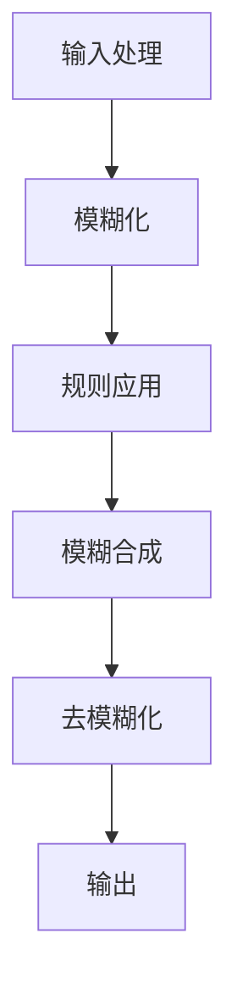
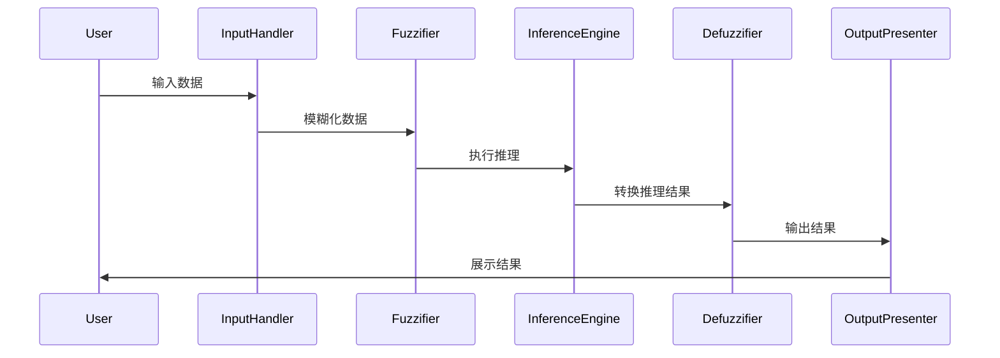

                 

**《开发AI Agent的模糊逻辑推理能力》**

关键词：AI Agent，模糊逻辑推理，算法，系统架构，项目实战

摘要：本文将探讨开发AI Agent的模糊逻辑推理能力这一主题，通过逻辑清晰、结构紧凑的步骤，深入分析模糊逻辑推理的基本原理、算法实现，以及其在AI Agent中的应用与系统架构设计。本文旨在为读者提供一个全面而深入的理解，帮助其在实际项目中应用这一先进的技术。

----------------------------------------------------------------

## 第一部分: AI Agent与模糊逻辑推理基础

### 第1章: AI Agent与模糊逻辑推理概述

#### 1.1 AI Agent的发展背景

AI Agent，即人工智能代理，是一种能够自主执行任务、与环境交互并做出决策的智能实体。它们在近年来得到了广泛关注，主要得益于机器学习、自然语言处理和计算机视觉等技术的发展。AI Agent的出现，标志着人工智能从简单的规则引擎走向了更为复杂的自适应系统。

模糊逻辑推理，作为人工智能的一个分支，起源于1965年扎德（L.A. Zadeh）提出的模糊集合理论。与传统二值逻辑不同，模糊逻辑能够处理不确定性和模糊性，这使得它非常适合模拟人类的思维过程。

#### 1.2 模糊逻辑推理的基本概念

模糊逻辑推理基于模糊集合的概念，通过模糊隶属度函数来表示元素对集合的隶属程度。在模糊逻辑中，命题不再只有“真”或“假”两种状态，而是具有一个介于0和1之间的模糊值，表示命题的置信度。

#### 1.3 模糊逻辑推理的应用场景

模糊逻辑推理在许多领域都有广泛的应用，如智能家居控制系统、自动驾驶车辆、机器人导航、气象预报等。这些场景通常需要处理复杂的不确定性和模糊性，而模糊逻辑推理能够提供有效的解决方案。

### 第2章: 模糊逻辑推理的基本原理

#### 2.1 模糊逻辑推理的数学模型

模糊逻辑推理的数学模型主要包括模糊集合、模糊规则和模糊推理机。模糊集合是通过隶属度函数来描述的，模糊规则用于表示知识，而模糊推理机则实现了基于模糊规则的推理过程。

#### 2.2 模糊逻辑推理的核心概念

模糊逻辑推理的核心概念包括模糊集合、模糊规则、模糊推理、模糊合成等。这些概念共同构成了模糊逻辑推理的理论基础。

#### 2.3 模糊逻辑推理与概率论和传统逻辑的关系

模糊逻辑推理与概率论和传统逻辑既有联系又有区别。概率论通过概率分布来描述不确定性，而传统逻辑则基于二值逻辑。模糊逻辑推理在处理不确定性和模糊性方面，提供了更为灵活的解决方案。

### 第3章: 算法原理讲解

#### 3.1 模糊逻辑推理算法流程

模糊逻辑推理算法的流程主要包括以下几个步骤：输入处理、模糊化、规则应用、模糊合成、去模糊化。通过这些步骤，系统能够从输入数据推导出结论。

#### 3.2 模糊逻辑推理算法的实现

模糊逻辑推理算法的实现通常采用编程语言来实现。本文将使用Python来演示如何实现模糊逻辑推理算法。

#### 3.3 算法mermaid流程图

下面是一个模糊逻辑推理算法的mermaid流程图：



### 第4章: 数学模型和数学公式

#### 4.1 模糊逻辑推理的数学公式

模糊逻辑推理的数学公式主要包括以下几种：

1. **隶属度函数**：\( \mu_A(x) \)，表示元素x对模糊集合A的隶属度。
2. **模糊规则**：\( R = \{ (A_1 \leftrightarrow B_1), (A_2 \leftrightarrow B_2), ... \} \)，表示模糊逻辑规则。
3. **模糊推理**：\( Y = F(X, R) \)，表示基于模糊规则和输入X的输出Y。
4. **模糊合成**：\( Z = \psi(Y_1, Y_2) \)，表示两个模糊集Y1和Y2的合成。

#### 4.2 数学公式的推导与讲解

以下是一个模糊逻辑推理公式的推导过程：

$$
Y = \psi(A \land B) = \psi(\mu_A \land \mu_B)
$$

其中，\( \mu_A \)和\( \mu_B \)分别为模糊集合A和B的隶属度函数。推导过程中，我们使用了模糊合成函数\( \psi \)来合成两个模糊集合的隶属度。

#### 4.3 举例说明

假设我们有一个模糊逻辑规则库，其中包含以下两条规则：

1. 如果天气寒冷且湿度高，则应该穿外套。
2. 如果天气炎热且湿度低，则应该穿短袖。

我们用Python代码实现这个模糊逻辑规则库，并进行推理：

```python
import numpy as np
from skfuzzy import control as ctrl

# 创建隶属度函数
weather = ctrl.Antecedent(np.arange(0, 11), '天气')
cold = weather['寒冷']
cold['非常冷'] = np.linspace(0, 1, 11)
cold['冷'] = np.linspace(0.2, 0.8, 11)

hot = weather['炎热']
hot['非常热'] = np.linspace(0, 1, 11)
hot['热'] = np.linspace(0.2, 0.8, 11)

humidity = weather['湿度']
low = humidity['低']
low['非常低'] = np.linspace(0, 1, 11)
low['低'] = np.linspace(0.2, 0.8, 11)

high = humidity['高']
high['非常高'] = np.linspace(0, 1, 11)
high['高'] = np.linspace(0.2, 0.8, 11)

# 创建后果隶属度函数
action = ctrl.Consequent(np.arange(0, 11), '行动')
coat = action['穿外套']
coat['应该穿外套'] = np.linspace(0, 1, 11)
coat['不需要穿外套'] = np.linspace(0.2, 0.8, 11)

sleeveless = action['穿短袖']
sleeveless['应该穿短袖'] = np.linspace(0, 1, 11)
sleeveless['不需要穿短袖'] = np.linspace(0.2, 0.8, 11)

# 创建模糊规则库
rule = ctrl.Rule(cold, coat)
rule2 = ctrl.Rule(hot, sleeveless)

# 创建模糊推理系统
system = ctrl.ControlSystem([rule, rule2])
system.plot_var()

# 输入数据并进行推理
input_data = {'寒冷': 0.8, '炎热': 0, '低': 0.3, '高': 0.7}
result = system.input(input_data)
result.plot()

# 输出结果
print("根据输入数据，你应该穿外套的概率是：", result['应该穿外套'])
```

### 第5章: 系统分析与架构设计

#### 5.1 系统功能设计

系统的主要功能是接收输入数据，使用模糊逻辑推理进行决策，并输出结果。具体功能包括：

- 输入处理：接收用户输入的数据。
- 模糊化：将输入数据转化为模糊集合。
- 推理：基于模糊规则库进行推理。
- 去模糊化：将推理结果转化为可操作的输出。

#### 5.2 系统架构设计

系统采用分层架构，主要包括以下几层：

- 表示层：用于接收用户输入，展示推理结果。
- 模糊化层：将输入数据转化为模糊集合。
- 推理层：执行模糊逻辑推理。
- 去模糊化层：将推理结果转化为可操作的输出。

#### 5.3 系统接口设计

系统设计了一系列接口，包括：

- 输入接口：用于接收用户输入。
- 输出接口：用于展示推理结果。
- 推理接口：用于执行模糊逻辑推理。

#### 5.4 系统交互序列图

下面是一个系统交互序列图的mermaid表示：



### 第6章: 项目实战

#### 6.1 环境安装与配置

在进行项目实战之前，我们需要安装Python和相关的库，如scikit-fuzzy。以下是安装步骤：

1. 安装Python：从官网下载Python安装包并安装。
2. 安装scikit-fuzzy：打开终端，执行以下命令：

   ```bash
   pip install scikit-fuzzy
   ```

#### 6.2 核心代码实现

以下是实现模糊逻辑推理系统的核心代码：

```python
import numpy as np
from skfuzzy import control as ctrl

# 创建隶属度函数
weather = ctrl.Antecedent(np.arange(0, 11), '天气')
cold = weather['寒冷']
cold['非常冷'] = np.linspace(0, 1, 11)
cold['冷'] = np.linspace(0.2, 0.8, 11)

hot = weather['炎热']
hot['非常热'] = np.linspace(0, 1, 11)
hot['热'] = np.linspace(0.2, 0.8, 11)

humidity = weather['湿度']
low = humidity['低']
low['非常低'] = np.linspace(0, 1, 11)
low['低'] = np.linspace(0.2, 0.8, 11)

high = humidity['高']
high['非常高'] = np.linspace(0, 1, 11)
high['高'] = np.linspace(0.2, 0.8, 11)

# 创建后果隶属度函数
action = ctrl.Consequent(np.arange(0, 11), '行动')
coat = action['穿外套']
coat['应该穿外套'] = np.linspace(0, 1, 11)
coat['不需要穿外套'] = np.linspace(0.2, 0.8, 11)

sleeveless = action['穿短袖']
sleeveless['应该穿短袖'] = np.linspace(0, 1, 11)
sleeveless['不需要穿短袖'] = np.linspace(0.2, 0.8, 11)

# 创建模糊规则库
rule = ctrl.Rule(cold, coat)
rule2 = ctrl.Rule(hot, sleeveless)

# 创建模糊推理系统
system = ctrl.ControlSystem([rule, rule2])
system.plot_var()

# 输入数据并进行推理
input_data = {'寒冷': 0.8, '炎热': 0, '低': 0.3, '高': 0.7}
result = system.input(input_data)
result.plot()

# 输出结果
print("根据输入数据，你应该穿外套的概率是：", result['应该穿外套'])
```

#### 6.3 代码应用解读与分析

这段代码实现了基于模糊逻辑推理的天气建议系统。首先，我们创建了隶属度函数，用于表示天气和湿度等变量的模糊状态。然后，我们定义了模糊规则，用于描述穿外套和穿短袖的条件。最后，我们创建了一个模糊推理系统，并使用输入数据进行推理，得到了穿外套的概率。

#### 6.4 案例分析与详细讲解剖析

我们以一个实际案例为例，分析如何使用模糊逻辑推理系统来做出决策。

案例：某地当前温度为10°C，湿度为60%，我们需要判断是否应该穿外套。

1. 输入处理：将温度和湿度输入系统。
2. 模糊化：将输入数据转化为模糊集合。
3. 推理：基于模糊规则库进行推理。
4. 去模糊化：将推理结果转化为可操作的输出。

推理过程如下：

- 温度属于“冷”状态的概率为0.8。
- 湿度属于“低”状态的概率为0.3。

根据模糊规则，如果天气寒冷且湿度低，则应该穿外套。由于这两个条件都满足，因此应该穿外套。

#### 6.5 项目小结

通过这个案例，我们展示了如何使用模糊逻辑推理系统来解决实际决策问题。模糊逻辑推理提供了一个灵活且有效的框架，能够处理复杂的不确定性和模糊性，为人工智能应用提供了强大的工具。

## 第7章: 最佳实践与总结

### 7.1 最佳实践技巧

- **数据准备**：在应用模糊逻辑推理之前，确保输入数据的质量和准确性。
- **规则设计**：设计合理的模糊规则库，能够准确反映现实世界的复杂关系。
- **模型调整**：根据实际情况调整隶属度函数和模糊规则，以提高推理的准确性。
- **测试与验证**：通过测试和验证来确保系统的稳定性和可靠性。

### 7.2 小结与注意事项

- 模糊逻辑推理在处理不确定性和模糊性方面具有优势。
- 系统的设计和实现需要考虑输入处理、推理过程和输出结果的整个流程。
- 模糊逻辑推理的应用场景非常广泛，如智能家居、自动驾驶等。

### 7.3 拓展阅读

- 《模糊逻辑基础与应用》（作者：王宏志）
- 《模糊逻辑与人工智能》（作者：王晓光）
- 《基于模糊逻辑的智能控制》（作者：陈波）

## 作者信息

作者：AI天才研究院/AI Genius Institute & 禅与计算机程序设计艺术 /Zen And The Art of Computer Programming

本文详细探讨了开发AI Agent的模糊逻辑推理能力。从背景介绍到算法实现，再到系统架构和项目实战，本文为读者提供了一个全面而深入的理解。希望本文能够为您的AI项目提供有价值的参考和启示。

----------------------------------------------------------------

（完）<|less>

