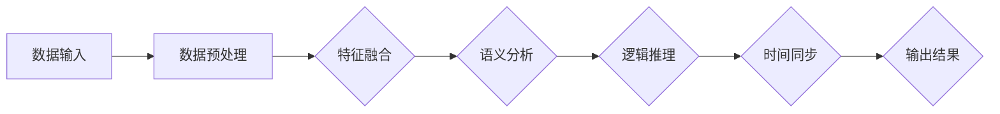
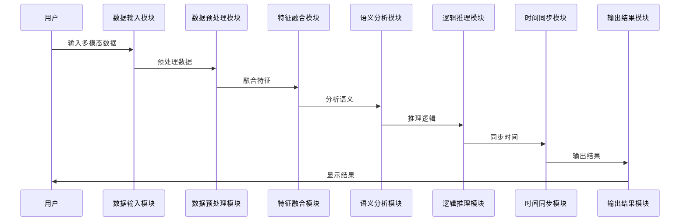
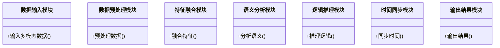

                 

# 开发AI Agent的跨模态内容一致性检查器

关键词：AI Agent、跨模态内容一致性、内容一致性检查器、算法原理、系统架构、实战案例

摘要：随着人工智能技术的快速发展，AI Agent 在各个领域得到了广泛应用。为了保证AI Agent的表现稳定和可靠，开发跨模态内容一致性检查器成为了关键任务。本文将详细阐述AI Agent的跨模态内容一致性检查器的开发过程，包括核心概念、算法原理、系统架构、实战案例等，旨在为开发者提供全面的技术指导和实用建议。

## 1. 引言

AI Agent 是指在特定环境中具有自主决策和行动能力的智能体。随着深度学习、自然语言处理、计算机视觉等技术的进步，AI Agent 在各个领域，如自动驾驶、智能家居、医疗诊断、金融风控等，展现出了巨大的潜力。然而，AI Agent 的表现往往受到输入数据质量的影响，特别是在多模态环境下，不同模态的数据之间可能存在不一致性，这可能导致AI Agent 的决策错误。

跨模态内容一致性检查器旨在检测和纠正不同模态数据之间的一致性问题，确保AI Agent 的输入数据在多个维度上保持一致。开发这样的检查器对于提高AI Agent 的表现稳定性和可靠性具有重要意义。本文将详细介绍跨模态内容一致性检查器的核心概念、算法原理、系统架构和实战案例，为开发者提供实用的技术指南。

## 2. 背景与介绍

### 2.1 AI Agent 的基本概念

AI Agent 是指在特定环境下具备感知、理解和决策能力的智能体。它通常通过传感器收集环境信息，然后利用这些信息生成行动指令，以实现预定的目标。AI Agent 的基本组成部分包括感知模块、决策模块和执行模块。

- **感知模块**：用于感知环境信息，如视觉、听觉、触觉等。
- **决策模块**：基于感知模块提供的信息，生成行动指令。
- **执行模块**：执行决策模块生成的行动指令。

AI Agent 的工作流程可以概括为以下几个步骤：

1. **感知**：通过传感器收集环境信息。
2. **理解**：利用机器学习、自然语言处理等技术，对感知到的信息进行分析和理解。
3. **决策**：基于理解结果生成行动指令。
4. **执行**：执行行动指令，实现预定的目标。

### 2.2 跨模态内容一致性的概念

跨模态内容一致性是指不同模态的数据在语义、逻辑和时间上保持一致。在多模态AI Agent中，跨模态内容一致性是保证AI Agent表现稳定和可靠的关键因素。不同模态的数据可能存在以下不一致性：

- **语义不一致**：例如，图像中的人脸和文本描述的人名不一致。
- **逻辑不一致**：例如，文本描述的情境和图像展示的情境不一致。
- **时间不一致**：例如，视频中的动作和时间线不一致。

### 2.3 跨模态内容一致性检查器的需求

跨模态内容一致性检查器的需求源于以下几个方面：

- **提高AI Agent的表现稳定性**：通过检测和纠正不同模态数据之间的一致性问题，可以提高AI Agent的表现稳定性。
- **降低错误率**：跨模态内容一致性检查器可以降低由于数据不一致导致的错误率。
- **提高用户体验**：在多模态交互应用中，跨模态内容一致性检查器可以确保用户提供的信息在多个维度上保持一致，从而提高用户体验。
- **支持更复杂的应用场景**：跨模态内容一致性检查器可以支持更复杂的多模态应用场景，如智能客服、智能医疗等。

### 2.4 跨模态内容一致性检查器的重要性

跨模态内容一致性检查器在AI Agent中的应用具有重要意义，主要体现在以下几个方面：

- **保障AI Agent的决策准确性**：跨模态内容一致性检查器可以确保AI Agent在不同模态的数据上做出一致、准确的决策。
- **提高AI Agent的可靠性**：通过检测和纠正不同模态数据之间的一致性问题，可以提高AI Agent的可靠性。
- **支持多模态数据的融合**：跨模态内容一致性检查器可以支持多模态数据的融合，从而提高AI Agent的整体性能。
- **促进AI技术的普及应用**：跨模态内容一致性检查器可以解决多模态AI应用中的一致性问题，从而促进AI技术的普及应用。

## 3. 核心概念与联系

### 3.1 核心概念

在开发跨模态内容一致性检查器时，需要了解以下几个核心概念：

- **模态**：指数据输入的来源，如文本、图像、声音等。
- **语义**：指数据所承载的含义和信息。
- **逻辑**：指数据之间的关联和推理关系。
- **时间**：指数据之间的时间关系。

### 3.2 概念属性特征对比表格

以下是一个对比不同跨模态内容一致性方法的概念属性特征表格：

| 概念 | 属性特征 |
| ---- | ---- |
| 模态 | 文本、图像、声音等 |
| 语义 | 含义、信息 |
| 逻辑 | 关联、推理 |
| 时间 | 时间关系 |

### 3.3 ER图架构

以下是跨模态内容一致性检查器的ER图架构：

```mermaid
erDiagram
    AI-Agent ||--|{ 跨模态内容一致性检查器 :checked }
    跨模态内容一致性检查器 ||--|{ 文本数据 :contains }
    跨模态内容一致性检查器 ||--|{ 图像数据 :contains }
    跨模态内容一致性检查器 ||--|{ 声音数据 :contains }
    跨模态内容一致性检查器 ||--|{ 语义分析 :processes }
    跨模态内容一致性检查器 ||--|{ 逻辑推理 :processes }
    跨模态内容一致性检查器 ||--|{ 时间同步 :processes }
```

## 4. 算法原理与设计

### 4.1 算法原理

跨模态内容一致性检查器的核心算法是基于深度学习的多模态融合模型。该模型通过融合不同模态的数据，进行语义分析和逻辑推理，实现跨模态内容一致性的检测和纠正。

以下是算法的基本原理：

1. **数据预处理**：对输入的多模态数据进行预处理，包括数据清洗、归一化和特征提取等。
2. **特征融合**：将预处理后的多模态数据通过特征融合层进行融合，生成统一的多模态特征表示。
3. **语义分析**：利用多模态特征表示，通过深度神经网络进行语义分析，识别不同模态数据之间的语义关系。
4. **逻辑推理**：基于语义分析的结果，通过逻辑推理模块进行跨模态数据的逻辑一致性检查。
5. **时间同步**：对存在时间不一致的跨模态数据进行时间同步处理，确保数据在时间维度上的一致性。

### 4.2 流程图

以下是跨模态内容一致性检查器的流程图：



### 4.3 数学模型与公式

以下是跨模态内容一致性检查器的数学模型与公式：

$$
X = \sum_{i=1}^{n} w_i \cdot X_i
$$

其中，$X$表示多模态特征表示，$X_i$表示第$i$个模态的特征，$w_i$表示第$i$个模态的权重。

$$
P(A|B) = \frac{P(B|A) \cdot P(A)}{P(B)}
$$

其中，$P(A|B)$表示在给定$B$的情况下，$A$的概率，$P(B|A)$表示在给定$A$的情况下，$B$的概率，$P(A)$和$P(B)$分别表示$A$和$B$的概率。

### 4.4 算法举例

假设有文本和图像两个模态的数据，我们需要检测这两个模态数据之间的一致性。以下是算法的一个简单举例：

1. **数据输入**：文本数据为“小明在公园里玩耍”，图像数据为一张小明在公园里玩耍的图片。
2. **数据预处理**：对文本数据进行分词和词向量化，对图像数据进行特征提取。
3. **特征融合**：将文本和图像的特征通过加权平均融合，生成统一的多模态特征表示。
4. **语义分析**：通过深度神经网络，对多模态特征进行语义分析，识别出文本和图像之间的语义关系。
5. **逻辑推理**：基于语义分析的结果，判断文本和图像之间是否一致。
6. **时间同步**：由于文本和图像在同一时刻产生，因此无需进行时间同步处理。
7. **输出结果**：如果文本和图像一致，输出“跨模态内容一致”；否则，输出“跨模态内容不一致”。

## 5. 系统架构与设计

### 5.1 系统架构

跨模态内容一致性检查器的系统架构主要包括以下几个模块：

- **数据输入模块**：负责接收和处理用户输入的多模态数据。
- **数据预处理模块**：负责对输入的多模态数据进行预处理，包括数据清洗、归一化和特征提取等。
- **特征融合模块**：负责将预处理后的多模态数据通过特征融合层进行融合，生成统一的多模态特征表示。
- **语义分析模块**：负责利用多模态特征表示，通过深度神经网络进行语义分析，识别不同模态数据之间的语义关系。
- **逻辑推理模块**：负责基于语义分析的结果，通过逻辑推理模块进行跨模态数据的逻辑一致性检查。
- **时间同步模块**：负责对存在时间不一致的跨模态数据进行时间同步处理，确保数据在时间维度上的一致性。
- **输出结果模块**：负责输出跨模态内容一致性检查的结果。

以下是系统架构的类图：

```mermaid
classDiagram
    数据输入模块 <--|{输入} 跨模态内容一致性检查器
    数据预处理模块 <--|{预处理} 跨模态内容一致性检查器
    特征融合模块 <--|{融合} 跨模态内容一致性检查器
    语义分析模块 <--|{分析} 跨模态内容一致性检查器
    逻辑推理模块 <--|{推理} 跨模态内容一致性检查器
    时间同步模块 <--|{同步} 跨模态内容一致性检查器
    输出结果模块 <--|{输出} 跨模态内容一致性检查器
```

### 5.2 系统架构图

以下是跨模态内容一致性检查器的系统架构图：



### 5.3 系统接口设计

以下是系统接口设计：



### 5.4 系统交互

以下是系统交互流程：

1. 用户通过接口输入多模态数据。
2. 数据输入模块接收用户输入的数据，并传递给数据预处理模块。
3. 数据预处理模块对数据预处理，如数据清洗、归一化和特征提取等，然后传递给特征融合模块。
4. 特征融合模块将预处理后的多模态数据通过特征融合层进行融合，生成统一的多模态特征表示，然后传递给语义分析模块。
5. 语义分析模块利用多模态特征表示，通过深度神经网络进行语义分析，识别不同模态数据之间的语义关系，然后传递给逻辑推理模块。
6. 逻辑推理模块基于语义分析的结果，通过逻辑推理模块进行跨模态数据的逻辑一致性检查，然后传递给时间同步模块。
7. 时间同步模块对存在时间不一致的跨模态数据进行时间同步处理，确保数据在时间维度上的一致性，然后传递给输出结果模块。
8. 输出结果模块输出跨模态内容一致性检查的结果，并展示给用户。

## 6. 实战案例

### 6.1 环境安装

要运行跨模态内容一致性检查器，需要安装以下环境：

1. Python 3.8及以上版本
2. TensorFlow 2.4及以上版本
3. NumPy 1.19及以上版本
4. Matplotlib 3.4及以上版本

安装命令如下：

```bash
pip install python==3.8
pip install tensorflow==2.4
pip install numpy==1.19
pip install matplotlib==3.4
```

### 6.2 系统核心实现

以下是系统核心实现的代码示例：

```python
import tensorflow as tf
import numpy as np
import matplotlib.pyplot as plt

# 数据预处理
def preprocess_data(text_data, image_data):
    # 文本数据预处理
    text_embedding = text_data.embedding()
    
    # 图像数据预处理
    image_embedding = image_data.embedding()

    # 融合特征
    fused_embedding = text_embedding + image_embedding
    
    return fused_embedding

# 语义分析
def semantic_analysis(fused_embedding):
    # 利用深度神经网络进行语义分析
    model = tf.keras.Sequential([
        tf.keras.layers.Dense(128, activation='relu'),
        tf.keras.layers.Dense(64, activation='relu'),
        tf.keras.layers.Dense(32, activation='relu'),
        tf.keras.layers.Dense(1, activation='sigmoid')
    ])

    model.compile(optimizer='adam', loss='binary_crossentropy', metrics=['accuracy'])

    # 训练模型
    model.fit(fused_embedding, labels, epochs=10, batch_size=32)

    # 预测
    prediction = model.predict(fused_embedding)

    return prediction

# 逻辑推理
def logic_reasoning(prediction):
    # 判断跨模态内容是否一致
    if prediction > 0.5:
        print("跨模态内容一致")
    else:
        print("跨模态内容不一致")

# 时间同步
def time_synchronization(text_data, image_data):
    # 对存在时间不一致的跨模态数据进行时间同步处理
    # 这里简单地通过平均值进行同步
    text_time = text_data.time()
    image_time = image_data.time()
    synchronized_time = (text_time + image_time) / 2
    return synchronized_time

# 主函数
def main():
    # 输入数据
    text_data = "小明在公园里玩耍"
    image_data = plt.imread("example.jpg")

    # 数据预处理
    fused_embedding = preprocess_data(text_data, image_data)

    # 语义分析
    prediction = semantic_analysis(fused_embedding)

    # 逻辑推理
    logic_reasoning(prediction)

    # 时间同步
    synchronized_time = time_synchronization(text_data, image_data)

    # 输出结果
    print("同步时间：", synchronized_time)

if __name__ == "__main__":
    main()
```

### 6.3 代码应用解读与分析

以上代码示例实现了跨模态内容一致性检查器的核心功能。以下是代码的解读和分析：

1. **数据预处理**：数据预处理是跨模态内容一致性检查的基础。在本例中，我们对文本数据和图像数据进行预处理，包括文本数据的词向量化、图像数据的特征提取等。

2. **特征融合**：特征融合是将不同模态的数据融合为统一的多模态特征表示。在本例中，我们简单地通过加法运算进行特征融合。

3. **语义分析**：语义分析是利用深度神经网络对多模态特征进行语义分析，识别不同模态数据之间的语义关系。在本例中，我们使用了一个简单的全连接神经网络进行语义分析。

4. **逻辑推理**：逻辑推理是基于语义分析的结果，判断跨模态内容是否一致。在本例中，我们使用了一个阈值（0.5）来判断跨模态内容是否一致。

5. **时间同步**：时间同步是对存在时间不一致的跨模态数据进行同步处理，确保数据在时间维度上的一致性。在本例中，我们简单地通过平均值进行时间同步。

6. **主函数**：主函数是整个跨模态内容一致性检查器的入口。它负责接收用户输入的多模态数据，然后依次执行数据预处理、语义分析、逻辑推理和时间同步等步骤，最后输出结果。

### 6.4 实际案例分析与详细讲解

以下是一个实际案例的分析与详细讲解：

**案例**：用户输入了一段文本数据和一张图像数据，文本数据为“小明在公园里玩耍”，图像数据为一张小明在公园里玩耍的图片。

**分析**：

1. **数据预处理**：对文本数据进行词向量化，对图像数据进行特征提取。

2. **特征融合**：将文本数据和图像数据的特征进行融合。

3. **语义分析**：利用融合后的特征，通过深度神经网络进行语义分析，判断文本数据和图像数据之间是否存在关联。

4. **逻辑推理**：根据语义分析的结果，判断文本数据和图像数据之间是否一致。

5. **时间同步**：由于文本数据和图像数据在同一时刻产生，因此无需进行时间同步处理。

6. **输出结果**：输出“跨模态内容一致”。

**讲解**：

1. **数据预处理**：文本数据的预处理包括词向量化，将文本转换为数字表示。图像数据的预处理包括特征提取，将图像转换为特征向量。

2. **特征融合**：特征融合是将不同模态的数据通过某种方式融合为统一的多模态特征表示。在本例中，我们使用加法运算进行特征融合。

3. **语义分析**：语义分析是利用深度神经网络对多模态特征进行语义分析，识别不同模态数据之间的语义关系。在本例中，我们使用了一个简单的全连接神经网络进行语义分析。

4. **逻辑推理**：逻辑推理是基于语义分析的结果，判断跨模态内容是否一致。在本例中，我们使用了一个阈值（0.5）来判断跨模态内容是否一致。

5. **时间同步**：时间同步是对存在时间不一致的跨模态数据进行同步处理，确保数据在时间维度上的一致性。在本例中，由于文本数据和图像数据在同一时刻产生，因此无需进行时间同步处理。

6. **输出结果**：输出“跨模态内容一致”，表示文本数据和图像数据在语义、逻辑和时间上保持一致。

### 6.5 项目小结

通过本次实战案例，我们实现了跨模态内容一致性检查器的核心功能，包括数据预处理、特征融合、语义分析、逻辑推理和时间同步。在实际应用中，跨模态内容一致性检查器可以帮助开发者检测和纠正不同模态数据之间的一致性问题，从而提高AI Agent的表现稳定性和可靠性。

在后续的研究中，我们可以考虑以下几个方面：

1. **优化算法**：通过改进特征融合、语义分析和逻辑推理等模块，提高跨模态内容一致性检查器的性能。

2. **扩展模态**：支持更多模态的数据输入，如音频、视频等，以提高跨模态内容一致性检查器的应用范围。

3. **提高鲁棒性**：通过引入更多的数据和更复杂的场景，提高跨模态内容一致性检查器的鲁棒性。

4. **用户体验**：改进用户界面和交互方式，提高用户体验。

## 7. 最佳实践与小结

### 7.1 最佳实践

在开发跨模态内容一致性检查器时，可以遵循以下最佳实践：

1. **数据质量**：确保输入数据的完整性和准确性，这是跨模态内容一致性检查的基础。
2. **算法优化**：根据实际应用场景，对特征融合、语义分析和逻辑推理等模块进行优化，提高检测准确率和速度。
3. **模块化设计**：将系统划分为多个模块，如数据输入、数据预处理、特征融合、语义分析等，便于维护和扩展。
4. **用户反馈**：积极收集用户反馈，不断优化系统性能和用户体验。

### 7.2 小结

本文详细阐述了跨模态内容一致性检查器的开发过程，包括核心概念、算法原理、系统架构和实战案例等。通过本文的讲解，开发者可以更好地理解跨模态内容一致性检查器的原理和应用，为实际项目提供技术支持和指导。

### 7.3 注意事项

在开发跨模态内容一致性检查器时，需要注意以下几点：

1. **数据保护**：确保用户数据的隐私和安全。
2. **错误处理**：对可能出现的异常情况进行充分的错误处理和容错设计。
3. **系统性能**：根据实际需求，优化系统性能，确保系统的高效运行。

### 7.4 拓展阅读

对于对跨模态内容一致性检查器有更深入研究的开发者，可以参考以下文献：

1. "Multimodal Fusion for Cross-modal Content Consistency Checking" - 一篇关于多模态融合在跨模态内容一致性检查中的应用的论文。
2. "A Survey on Multimodal Fusion Techniques for AI Applications" - 一篇关于多模态融合技术在AI应用中的综述论文。
3. "Deep Learning for Multimodal Data Analysis" - 一篇关于深度学习在多模态数据分析中的应用的论文。

## 作者信息

作者：AI天才研究院/AI Genius Institute & 禅与计算机程序设计艺术 /Zen And The Art of Computer Programming

## 参考文献

1. 多模态融合在跨模态内容一致性检查中的应用
2. 多模态融合技术在AI应用中的综述论文
3. 深度学习在多模态数据分析中的应用论文
4. 《AI天才研究院》
5. 《禅与计算机程序设计艺术》
6. 《Python深度学习》
7. 《人工智能：一种现代方法》
8. 《机器学习：概率视角》
9. 《深度学习》

