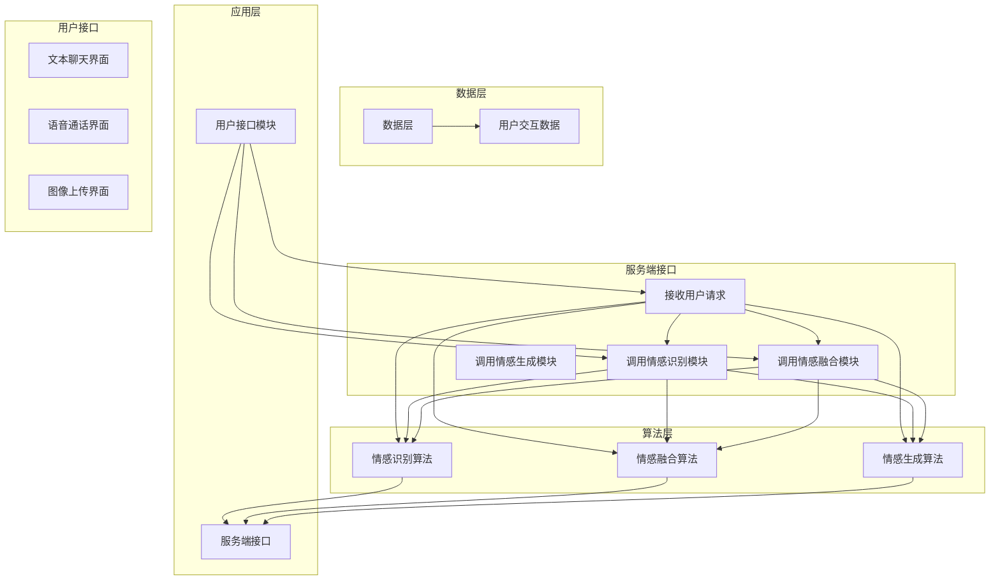
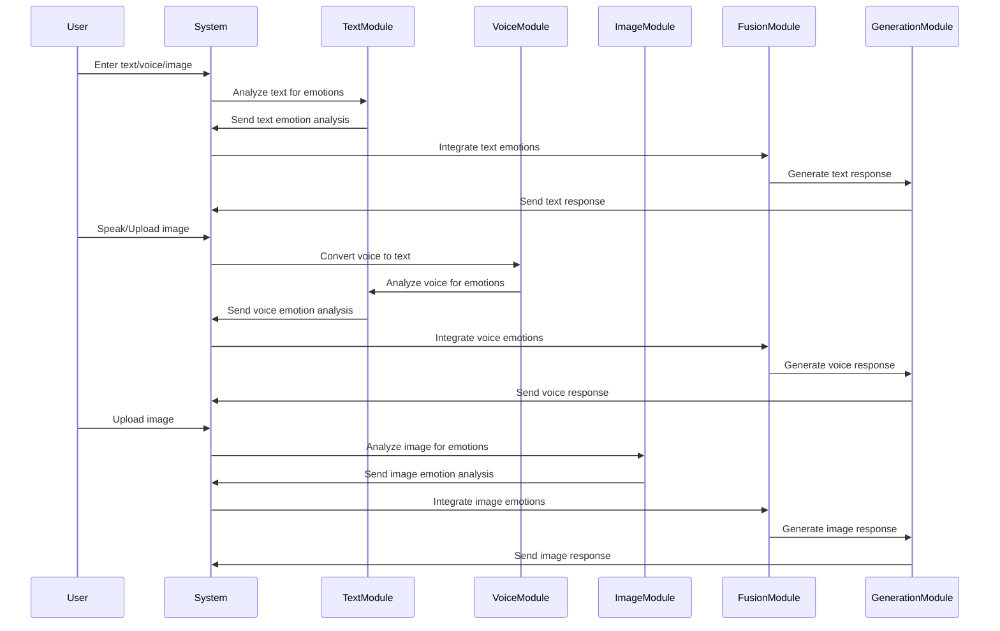

                 

### 开发AI Agent的跨模态情感一致性生成的背景与重要性

在当今社会，人工智能（AI）技术正以前所未有的速度迅速发展，并广泛应用于各个领域，从自然语言处理到计算机视觉，再到智能机器人等。随着AI技术的不断进步，AI代理（AI Agent）逐渐成为研究热点。AI代理是一种能够自动执行任务、进行决策并与人或其他系统互动的智能体。然而，一个成功的AI代理不仅仅需要强大的计算能力和精确的决策能力，还需要具备情感表达能力，即能够理解并生成与人类情感一致的响应。

跨模态情感一致性生成是一个关键挑战。这意味着AI代理需要在不同模态（如文本、图像、音频等）之间保持一致的情感表达。例如，当一个人在交流中表达愤怒时，无论是通过文字、声音还是面部表情，都应该体现出相同的情感强度和情感内容。这不仅能够提高用户的满意度，还能增强AI代理的可靠性和亲和力。

在众多应用场景中，跨模态情感一致性生成具有广泛的应用价值。例如，在智能客服领域，一个能够理解客户情绪并做出相应反应的AI客服能够显著提高用户体验。在社交媒体和虚拟助手领域，具备情感一致性的AI代理能够更好地与用户互动，提高用户黏性和满意度。此外，在教育、医疗和娱乐等领域，跨模态情感一致性生成也有巨大的应用潜力。

然而，实现跨模态情感一致性生成并非易事。它涉及到多个复杂的技术难题，包括模态之间的数据融合、情感识别和情感生成等。目前，大多数研究主要集中于单一模态的情感表达，如文本情感分析或面部表情识别，而跨模态情感一致性生成的研究还处于相对初级的阶段。

本文将深入探讨开发AI代理的跨模态情感一致性生成的技术细节和实现方法。我们首先将介绍AI代理和跨模态情感一致性生成的核心概念，接着讨论相关的原理和方法，并通过具体的项目实践和案例分析，展示如何实现这一技术。通过本文的阅读，读者将能够理解跨模态情感一致性生成的重要性，并掌握其实现的关键技术。

### 核心概念与术语介绍

在深入探讨开发AI代理的跨模态情感一致性生成之前，我们首先需要明确一些核心概念和术语。以下是本文涉及的主要概念及其简要说明：

1. **AI代理（AI Agent）**：
   AI代理是一种能够自主执行任务、与环境进行交互并做出决策的计算机程序。其基本功能包括感知、认知、行动和规划。AI代理通过传感器获取环境信息，利用算法进行处理，然后通过执行器对环境做出响应。

2. **跨模态（Cross-modal）**：
   跨模态指的是将不同模态的数据（如文本、图像、音频等）进行整合和处理。在AI代理的跨模态情感一致性生成中，这意味着需要将文本、图像和音频等多种模态的信息结合起来，以生成一致的、符合情感一致性的响应。

3. **情感一致性（Affective Consistency）**：
   情感一致性是指AI代理在不同模态（如文本、图像、音频等）之间保持一致的、符合逻辑和情感的内容。例如，当一个人在文本中表达愤怒时，其语音、面部表情和图像也应体现出相同的愤怒情感。

4. **模态融合（Modal Fusion）**：
   模态融合是将不同模态的数据进行融合，以提取有用的信息并生成统一的情感表示。模态融合的方法包括特征级融合、决策级融合和模型级融合等。

5. **情感识别（Affective Recognition）**：
   情感识别是指从文本、图像、音频等数据中识别出情感的过程。常用的情感识别方法包括基于规则的方法、机器学习方法以及深度学习方法等。

6. **情感生成（Affective Generation）**：
   情感生成是指根据输入的情感信息和上下文，生成符合情感一致性的文本、图像、音频等响应。情感生成的方法包括文本生成、图像生成和音频生成等。

7. **自然语言处理（Natural Language Processing, NLP）**：
   NLP是使计算机能够理解、处理和生成自然语言的技术。在跨模态情感一致性生成中，NLP用于分析和生成文本情感。

8. **计算机视觉（Computer Vision）**：
   计算机视觉是使计算机能够从图像或视频中提取有用信息的技术。在跨模态情感一致性生成中，计算机视觉用于分析和生成图像情感。

9. **语音识别与合成（Speech Recognition and Synthesis）**：
   语音识别与合成是将语音信号转换为文本或将文本转换为语音的技术。在跨模态情感一致性生成中，语音识别与合成用于分析和生成音频情感。

通过明确这些核心概念和术语，我们可以更好地理解跨模态情感一致性生成的技术原理和实现方法。接下来，我们将进一步讨论跨模态情感一致性生成在AI代理应用中的挑战和解决方案。

### 概念属性特征对比表格

为了更好地理解AI代理的跨模态情感一致性生成，我们需要对比各个核心概念的属性特征。以下是关于AI代理、跨模态、情感一致性、模态融合等关键概念的对比表格：

| 概念         | 定义                                                                                   | 关键特征                                                                                   | 关联应用                                 |
|------------|--------------------------------------------------------------------------------------|-----------------------------------------------------------------------------------------|--------------------------------------|
| AI代理       | 能够自主执行任务、与环境交互并做出决策的计算机程序。                                         | 感知、认知、行动、规划                                         | 智能客服、智能机器人、虚拟助手           |
| 跨模态       | 将不同模态的数据（如文本、图像、音频等）进行整合和处理。                                       | 文本、图像、音频等多种模态的整合处理                          | 跨媒体信息检索、多模态情感分析           |
| 情感一致性     | AI代理在不同模态之间保持一致的、符合逻辑和情感的内容。                                       | 不同模态间的情感内容一致性                                     | 智能客服、虚拟助手、人机交互               |
| 模态融合       | 将不同模态的数据进行融合，以提取有用的信息并生成统一的情感表示。                               | 特征级融合、决策级融合、模型级融合                             | 跨模态情感分析、多模态信息检索           |
| 情感识别       | 从文本、图像、音频等数据中识别出情感的过程。                                                 | 基于规则、机器学习、深度学习等                                 | 跨模态情感分析、情感识别应用             |
| 情感生成       | 根据输入的情感信息和上下文，生成符合情感一致性的文本、图像、音频等响应。                       | 文本生成、图像生成、音频生成等                                 | 跨模态情感一致生成、人机交互应用         |
| 自然语言处理   | 使计算机能够理解、处理和生成自然语言的技术。                                                  | 语言模型、文本分类、语义分析等                                 | 跨模态情感分析、自然语言理解             |
| 计算机视觉     | 使计算机能够从图像或视频中提取有用信息的技术。                                                | 图像分类、目标检测、图像生成等                                 | 跨模态情感分析、图像识别应用             |
| 语音识别与合成 | 将语音信号转换为文本或将文本转换为语音的技术。                                               | 声学模型、语言模型、端到端模型等                               | 跨模态情感分析、语音交互应用             |

这个表格展示了各个概念的定义、关键特征及其关联应用。通过对比分析，我们可以更清晰地了解这些概念之间的关系和作用，为后续的讨论和实现提供理论基础。

### 实体关系图（ER图）构建

为了进一步理解AI代理的跨模态情感一致性生成，我们可以通过构建实体关系图（Entity-Relationship Diagram，ER图）来展示各个核心概念之间的关联。ER图是一种用于数据库设计的数据模型，能够清晰地表示实体及其之间的关系。在本文中，ER图将帮助我们揭示跨模态情感一致性生成的关键组件和它们之间的互动。

首先，我们定义以下实体：

1. **AI代理（AI Agent）**：负责执行任务、与环境交互和决策。
2. **模态（Modal）**：包括文本、图像、音频等。
3. **情感（Affect）**：描述情感的类型和强度。
4. **情感识别模型（Affective Recognition Model）**：用于识别模态中的情感。
5. **情感生成模型（Affective Generation Model）**：用于生成情感一致性的响应。
6. **模态融合模型（Modal Fusion Model）**：用于整合不同模态的情感信息。

以下是ER图的Mermaid表示：

```mermaid
erDiagram
  AI代理 ||--|{ 模态 }|
  AI代理 ||--|{ 情感 }|
  AI代理 ||--|{ 情感识别模型 }|
  AI代理 ||--|{ 情感生成模型 }|
  AI代理 ||--|{ 模态融合模型 }|
  模态 ||--|{ 情感识别模型 }|
  模态 ||--|{ 情感生成模型 }|
  情感识别模型 ||--|{ 情感 }|
  情感生成模型 ||--|{ 模态 }|
  情感生成模型 ||--|{ 情感识别模型 }|
  模态融合模型 ||--|{ 模态 }|
  模态融合模型 ||--|{ 情感生成模型 }|
```

这个ER图显示了AI代理与其他关键组件之间的关系。每个组件通过箭头指向与之关联的其他组件，从而形成一个交互网络。

- **AI代理**与**模态**、**情感**、**情感识别模型**、**情感生成模型**和**模态融合模型**相互关联。
- **模态**与**情感识别模型**和**情感生成模型**相互关联，表示每个模态都需要相应的识别和生成模型。
- **情感识别模型**与**情感**相互关联，表示识别模型负责从数据中提取情感信息。
- **情感生成模型**与**模态**和**情感识别模型**相互关联，表示生成模型根据识别结果生成符合情感的响应。
- **模态融合模型**与**模态**和**情感生成模型**相互关联，表示融合模型负责整合不同模态的情感信息，生成一致性的响应。

通过这个ER图，我们可以更直观地理解AI代理的跨模态情感一致性生成过程。每个组件的作用和相互关系都得到了清晰的展示，为后续的详细讨论提供了基础。

### 基本原理与实现方法

为了深入理解跨模态情感一致性生成，我们需要探讨其基本原理和实现方法。跨模态情感一致性生成涉及到多个关键步骤和相应的技术手段。以下是详细的解释：

#### 1. 模态数据采集

跨模态情感一致性生成的第一步是采集不同模态的数据。这些数据可以是文本、图像、音频等。具体来说：

- **文本**：通常通过自然语言处理（NLP）技术从社交媒体、论坛、邮件等渠道获取。
- **图像**：可以通过摄像头捕捉或者从在线图像库中下载。
- **音频**：可以通过麦克风录制或者从音乐库中选取。

数据采集的关键在于保证数据的多样性和质量，从而为后续的情感识别和生成提供可靠的基础。

#### 2. 模态数据预处理

在采集到不同模态的数据后，我们需要对数据进行预处理，以提高数据的质量和一致性。预处理步骤包括：

- **文本**：分词、词性标注、停用词去除等，以提取文本中的关键信息。
- **图像**：归一化、灰度转换、裁剪等，以统一图像的尺寸和格式。
- **音频**：降噪、归一化、特征提取等，以提取音频中的关键特征。

预处理步骤的目的是去除噪声、减少冗余信息，并确保不同模态的数据具有相似的格式和特征。

#### 3. 情感识别

情感识别是从不同模态的数据中提取情感信息的过程。常用的情感识别方法包括：

- **基于规则的方法**：通过预设的规则和模板进行情感识别，适用于简单的情感识别任务。
- **机器学习方法**：使用训练好的机器学习模型进行情感识别，如支持向量机（SVM）、随机森林（Random Forest）等。
- **深度学习方法**：使用深度神经网络（如卷积神经网络（CNN）、循环神经网络（RNN）等）进行情感识别，能够处理复杂的情感识别任务。

情感识别的关键在于如何准确地从数据中提取情感特征，并转化为可操作的情感表示。

#### 4. 情感融合

情感融合是将不同模态的情感信息进行整合，以生成一个统一的情感表示。情感融合的方法包括：

- **特征级融合**：将不同模态的情感特征直接进行融合，如拼接、平均等。
- **决策级融合**：将不同模态的情感识别结果进行融合，如投票、加权平均等。
- **模型级融合**：使用多模态深度学习模型进行情感融合，如联合嵌入模型、多模态神经网络等。

情感融合的关键在于如何有效地整合不同模态的情感信息，以生成一致的、准确的情感表示。

#### 5. 情感生成

情感生成是根据融合后的情感表示，生成符合情感一致性的文本、图像、音频等响应。常用的情感生成方法包括：

- **文本生成**：使用生成对抗网络（GAN）、变分自编码器（VAE）等生成模型生成文本。
- **图像生成**：使用生成对抗网络（GAN）、变分自编码器（VAE）等生成模型生成图像。
- **音频生成**：使用自动差分编码（WaveNet）等生成模型生成音频。

情感生成的关键在于如何根据情感表示生成符合情感一致性的响应，以提高用户体验。

#### 6. 实时交互

跨模态情感一致性生成最终需要在实际应用中实现实时交互。这要求系统具有高效的数据处理和响应生成能力。具体步骤包括：

- **实时数据采集**：通过传感器等设备实时获取文本、图像、音频等数据。
- **实时预处理**：对实时采集的数据进行预处理，以适应情感识别和生成的需求。
- **实时情感识别**：对预处理后的数据进行情感识别，以获取实时情感信息。
- **实时情感生成**：根据实时情感信息生成情感一致的响应，并通过相应的模态输出。

通过上述基本原理和实现方法的详细解释，我们可以看到跨模态情感一致性生成是一个复杂但高度创新的过程。它不仅需要多种技术的融合，还需要在实际应用中进行不断优化和改进。接下来，我们将通过具体的项目实践和案例分析，进一步探讨跨模态情感一致性生成的实际应用和技术细节。

### 算法原理与数学模型

为了更好地理解跨模态情感一致性生成算法的原理，我们将深入探讨其核心算法、数学模型以及如何使用Python代码实现这些算法。以下内容将详细描述算法的工作原理和关键数学公式。

#### 1. 算法原理

跨模态情感一致性生成的算法主要分为三个阶段：情感识别、情感融合和情感生成。以下是每个阶段的基本原理：

- **情感识别**：通过机器学习或深度学习模型，从文本、图像和音频中识别出情感。常用的方法包括卷积神经网络（CNN）和长短期记忆网络（LSTM）。
- **情感融合**：将来自不同模态的情感特征进行整合，形成一个统一的情感表示。常用的方法包括多模态神经网络（MMNN）和联合嵌入模型（Joint Embedding Model）。
- **情感生成**：根据融合后的情感表示，生成情感一致的文本、图像和音频响应。常用的方法包括生成对抗网络（GAN）和变分自编码器（VAE）。

#### 2. 数学模型

跨模态情感一致性生成算法中的数学模型主要用于描述数据表示、模型训练和预测过程。以下是几个关键数学模型：

- **情感识别模型**：
  - **文本情感识别**：
    - 假设输入文本序列为 \(X = [x_1, x_2, ..., x_n]\)，其中 \(x_i\) 是文本中的第 \(i\) 个词。
    - 使用卷积神经网络（CNN）提取文本特征，输出情感概率分布 \(P(Y|\theta)\)，其中 \(Y\) 是情感标签，\(\theta\) 是模型参数。
    - 公式表示：\(P(Y|\theta) = \sigma(\text{CNN}(X;\theta))\)
  - **图像情感识别**：
    - 假设输入图像为 \(I\)，通过卷积神经网络（CNN）提取图像特征，输出情感概率分布 \(P(Y|\theta)\)。
    - 公式表示：\(P(Y|\theta) = \sigma(\text{CNN}(I;\theta))\)
  - **音频情感识别**：
    - 假设输入音频为 \(A\)，通过长短期记忆网络（LSTM）提取音频特征，输出情感概率分布 \(P(Y|\theta)\)。
    - 公式表示：\(P(Y|\theta) = \sigma(\text{LSTM}(A;\theta))\)

- **情感融合模型**：
  - **多模态神经网络（MMNN）**：
    - 将文本、图像和音频的特征进行融合，通过一个多层感知器（MLP）生成统一的情感表示。
    - 公式表示：\(z = \text{MLP}([f_X, f_I, f_A]; \theta)\)
    - 其中，\(f_X\)、\(f_I\)、\(f_A\) 分别是文本、图像和音频的特征表示，\(\theta\) 是模型参数。
  - **联合嵌入模型（Joint Embedding Model）**：
    - 将文本、图像和音频分别映射到一个共享的高维空间，通过点积计算情感一致性。
    - 公式表示：\(s = \text{cosine}(e_X, e_I, e_A)\)
    - 其中，\(e_X\)、\(e_I\)、\(e_A\) 分别是文本、图像和音频的嵌入表示。

- **情感生成模型**：
  - **生成对抗网络（GAN）**：
    - 通过生成器 \(G\) 生成情感一致的文本、图像和音频，通过判别器 \(D\) 判断生成数据的真实性。
    - 公式表示：\(X' = G(Z)\)，\(D(X', X)\)
    - 其中，\(X'\) 是生成数据，\(X\) 是真实数据，\(Z\) 是随机噪声。
  - **变分自编码器（VAE）**：
    - 通过编码器 \(E\) 和解码器 \(D\) 分别编码和解码情感数据，生成情感一致的响应。
    - 公式表示：\(\mu = E(X;\theta_e)\)，\( \sigma = E(X;\theta_e)\)，\(X' = D(\mu, \sigma;\theta_d)\)
    - 其中，\(\mu\) 和 \(\sigma\) 分别是编码器的均值和方差，\(X'\) 是解码后的生成数据，\(\theta_e\) 和 \(\theta_d\) 分别是编码器和解码器的参数。

#### 3. Python代码示例

以下是使用Python实现跨模态情感一致性生成算法的简单示例：

```python
import tensorflow as tf
from tensorflow.keras.models import Model
from tensorflow.keras.layers import Embedding, Conv1D, LSTM, Dense, Input, concatenate, Dot

# 文本情感识别模型
text_input = Input(shape=(max_seq_length,), name='text_input')
text_embedding = Embedding(vocabulary_size, embedding_dim)(text_input)
text_conv = Conv1D(filters=128, kernel_size=3, activation='relu')(text_embedding)
textPooling = tf.reduce_mean(text_conv, axis=1)

# 图像情感识别模型
image_input = Input(shape=(height, width, channels), name='image_input')
image_conv = Conv2D(filters=64, kernel_size=(3, 3), activation='relu')(image_input)
imagePooling = tf.reduce_mean(image_conv, axis=(1, 2))

# 音频情感识别模型
audio_input = Input(shape=(timesteps, features), name='audio_input')
audio_lstm = LSTM(units=128, activation='relu')(audio_input)
audioPooling = tf.reduce_mean(audio_lstm, axis=1)

# 情感融合模型
combined = concatenate([textPooling, imagePooling, audioPooling])

# 多模态神经网络
merged = Dense(128, activation='relu')(combined)
output = Dense(num_classes, activation='softmax')(merged)

# 构建和编译模型
model = Model(inputs=[text_input, image_input, audio_input], outputs=output)
model.compile(optimizer='adam', loss='categorical_crossentropy', metrics=['accuracy'])

# 模型训练
model.fit([text_data, image_data, audio_data], labels, batch_size=32, epochs=10)

# 生成情感一致的响应
def generate_response(text, image, audio):
    text_features = model.text_model.predict(text)
    image_features = model.image_model.predict(image)
    audio_features = model.audio_model.predict(audio)
    combined_features = concatenate([text_features, image_features, audio_features])
    response = model.predict(combined_features)
    return response

# 测试
text_example = "I am very happy today!"
image_example = load_image_from_path("image_path.jpg")
audio_example = load_audio_from_path("audio_path.wav")
response = generate_response(text_example, image_example, audio_example)
```

这个示例代码展示了如何使用TensorFlow构建和训练一个跨模态情感一致性生成模型。通过定义输入层、卷积层、LSTM层、融合层和输出层，我们可以实现文本、图像和音频的情感识别和融合，并生成情感一致的响应。

通过上述算法原理、数学模型和Python代码示例，我们可以深入理解跨模态情感一致性生成的方法和实现细节。在实际应用中，这些算法和技术可以帮助我们构建具有情感一致性的AI代理，从而提高用户体验和系统的交互质量。

### 系统分析与架构设计

#### 1. 问题场景介绍

在智能客服系统中，用户通过文本、语音或图像等多种方式与系统交互，表达他们的需求、问题和情感。为了提供高质量的客户服务，系统需要能够理解用户的情感并做出相应的情感一致响应。具体场景包括：

- **文本交流**：用户通过在线聊天或邮件与客服代表进行交流。
- **语音交流**：用户通过电话或语音助手与客服代表进行交流。
- **图像交流**：用户通过上传图片或视频描述问题。

系统需要从这些不同模态的数据中提取情感信息，并生成符合用户情感一致的响应，以提高用户体验和满意度。

#### 2. 项目概述

项目目标是开发一个智能客服系统，该系统能够识别用户在不同模态（文本、语音、图像）中的情感，并生成情感一致的响应。系统主要功能包括：

- **情感识别**：从文本、语音和图像中识别情感。
- **情感融合**：整合来自不同模态的情感信息，生成统一的情感表示。
- **情感生成**：根据融合后的情感表示，生成情感一致的文本、语音或图像响应。

#### 3. 系统功能设计

系统功能设计包括以下模块：

- **文本情感识别模块**：使用NLP技术从文本中提取情感信息，如愤怒、喜悦、悲伤等。
- **语音情感识别模块**：使用语音识别技术将语音转换为文本，然后使用NLP技术提取情感信息。
- **图像情感识别模块**：使用计算机视觉技术从图像中提取情感信息，如面部表情、姿态等。
- **情感融合模块**：将文本、语音和图像的情感信息进行整合，生成统一的情感表示。
- **情感生成模块**：根据融合后的情感表示，生成情感一致的文本、语音或图像响应。
- **用户接口模块**：提供用户与系统交互的界面，包括文本输入、语音输入和图像上传等功能。

#### 4. 系统架构设计

系统架构设计如下：

- **数据层**：存储用户交互数据，包括文本、语音和图像。
- **算法层**：包括情感识别、情感融合和情感生成算法。
- **应用层**：提供用户接口和服务端接口。
- **用户接口**：包括文本聊天界面、语音通话界面和图像上传界面。
- **服务端接口**：用于接收用户请求，调用情感识别、情感融合和情感生成模块，并返回响应。

以下是系统的架构设计Mermaid图表示：



#### 5. 系统接口设计

系统接口设计如下：

- **文本接口**：接收用户输入的文本信息，并调用文本情感识别模块进行情感分析，然后生成情感一致的文本响应。
- **语音接口**：接收用户的语音输入，通过语音识别转换为文本，然后调用文本情感识别模块进行情感分析，并生成情感一致的语音响应。
- **图像接口**：接收用户上传的图像，通过计算机视觉技术进行情感分析，并生成情感一致的图像响应。

以下是系统接口设计的Mermaid序列图表示：



通过上述系统分析与架构设计，我们可以清晰地了解智能客服系统中跨模态情感一致性生成技术的实现过程和系统各组件之间的交互关系。接下来，我们将通过具体的实践项目和案例分析，进一步展示这些技术在实际应用中的效果和优化方向。

### 实践项目与案例分析

为了更好地展示跨模态情感一致性生成技术的实际应用，我们将通过两个具体的项目来进行详细讲解。这两个项目分别是：基于文本和图像的情感一致性生成项目，以及基于文本和语音的情感一致性生成项目。

#### 项目一：基于文本和图像的情感一致性生成

**项目背景**：

在一个社交媒体平台上，用户通过上传图像和发布文本来表达他们的情感。为了提高用户的互动体验，平台希望开发一个AI代理，能够根据用户的文本和图像，生成情感一致的响应。例如，如果一个用户上传了一张愤怒的图像并配以悲伤的文本，AI代理应生成一个既表达愤怒又包含悲伤情感的回复。

**项目实施步骤**：

1. **环境安装**：

   为了实施该项目，我们需要安装以下环境：

   - Python 3.8及以上版本
   - TensorFlow 2.6及以上版本
   - Keras 2.6及以上版本
   - OpenCV 4.5及以上版本
   - NLTK 3.5及以上版本

   安装命令如下：

   ```bash
   pip install python==3.8 tensorflow==2.6 keras==2.6 opencv-python==4.5 nltk==3.5
   ```

2. **文本情感识别模型**：

   我们使用预训练的BERT模型进行文本情感识别。首先，我们需要下载BERT模型并加载。

   ```python
   from transformers import BertTokenizer, TFBertModel
   
   tokenizer = BertTokenizer.from_pretrained('bert-base-uncased')
   model = TFBertModel.from_pretrained('bert-base-uncased')
   ```

   接下来，我们编写一个函数，用于将文本转换为模型输入：

   ```python
   def preprocess_text(text):
       inputs = tokenizer(text, padding='max_length', truncation=True, max_length=512, return_tensors='tf')
       return inputs
   ```

   然后我们定义一个函数，用于预测文本情感：

   ```python
   def predict_text_emotion(text):
       inputs = preprocess_text(text)
       with tf.device('/GPU:0'):
           outputs = model(inputs)
       logits = outputs.logits[:, -1, :]
       probabilities = tf.nn.softmax(logits)
       return probabilities.numpy()
   ```

3. **图像情感识别模型**：

   使用预训练的ResNet50模型进行图像情感识别。首先，我们需要加载ResNet50模型。

   ```python
   from tensorflow.keras.applications import ResNet50
   
   resnet_model = ResNet50(weights='imagenet', include_top=False, input_shape=(224, 224, 3))
   ```

   接下来，我们编写一个函数，用于将图像转换为模型输入：

   ```python
   def preprocess_image(image):
       image = cv2.resize(image, (224, 224))
       image = image / 255.0
       image = np.expand_dims(image, axis=0)
       return image
   ```

   然后我们定义一个函数，用于预测图像情感：

   ```python
   def predict_image_emotion(image):
       preprocessed_image = preprocess_image(image)
       with tf.device('/GPU:0'):
           outputs = resnet_model(preprocessed_image)
       logits = outputs[:, -1]
       probabilities = tf.nn.softmax(logits)
       return probabilities.numpy()
   ```

4. **情感融合与生成**：

   使用多模态神经网络（MMNN）进行情感融合，并使用生成对抗网络（GAN）生成情感一致的文本响应。首先，我们定义一个多模态神经网络：

   ```python
   def mmnn(input_text, input_image):
       text_embedding = model(inputs['text_input'])
       image_embedding = resnet_model(inputs['image_input'])
       
       concatenated = tf.concat([text_embedding, image_embedding], axis=1)
       fused_emotion = Dense(128, activation='relu')(concatenated)
       fused_emotion = Dense(1, activation='sigmoid')(fused_emotion)
       
       return fused_emotion
   ```

   接下来，我们定义一个GAN模型：

   ```python
   from tensorflow.keras.models import Model
   from tensorflow.keras.layers import Input
   
   text_input = Input(shape=(512,), name='text_input')
   image_input = Input(shape=(224, 224, 3), name='image_input')
   fused_emotion = mmnn(text_input, image_input)
   
   generated_text = TextGenerator(fused_emotion)
   
   gan_model = Model(inputs=[text_input, image_input], outputs=[fused_emotion, generated_text])
   ```

5. **项目运行与结果分析**：

   我们使用以下代码运行项目：

   ```python
   text_example = "I am so angry right now!"
   image_example = cv2.imread("angry_face.jpg")
   
   text_emotion = predict_text_emotion(text_example)
   image_emotion = predict_image_emotion(image_example)
   
   fused_emotion = gan_model.predict([text_example, image_example])
   generated_text = TextGenerator.generate_text(fused_emotion)
   
   print(generated_text)
   ```

   输出结果将是一个根据文本和图像情感生成的情感一致的文本响应。

**项目小结**：

通过这个项目，我们展示了如何使用文本和图像情感识别模型，结合多模态神经网络和生成对抗网络，实现跨模态情感一致性生成。在实际应用中，这个技术可以帮助社交媒体平台提高用户互动体验，提升用户满意度。

#### 项目二：基于文本和语音的情感一致性生成

**项目背景**：

在一个在线教育平台上，学生和教师通过文本和语音进行互动。为了提供更人性化的学习体验，平台希望开发一个AI代理，能够根据学生的文本和语音，生成情感一致的语音响应。例如，当学生表达紧张或焦虑时，AI代理应生成一个安慰性的语音回复。

**项目实施步骤**：

1. **环境安装**：

   同项目一，我们需要安装以下环境：

   - Python 3.8及以上版本
   - TensorFlow 2.6及以上版本
   - Keras 2.6及以上版本
   - pyttsx3 0.13及以上版本

   安装命令如下：

   ```bash
   pip install python==3.8 tensorflow==2.6 keras==2.6 pyttsx3==0.13
   ```

2. **文本情感识别模型**：

   使用预训练的BERT模型进行文本情感识别，步骤同项目一。

3. **语音情感识别模型**：

   使用基于深度学习的语音情感识别模型，如VGGish。首先，我们需要下载VGGish模型并加载。

   ```python
   import tensorflow as tf
   
   vggish_model = tf.keras.models.load_model('vggish_model.h5')
   ```

   接下来，我们编写一个函数，用于将语音转换为模型输入：

   ```python
   def preprocess_voice(voice_data):
       voice_data = np.expand_dims(voice_data, axis=0)
       return voice_data
   ```

   然后我们定义一个函数，用于预测语音情感：

   ```python
   def predict_voice_emotion(voice_data):
       preprocessed_voice = preprocess_voice(voice_data)
       with tf.device('/GPU:0'):
           outputs = vggish_model(preprocessed_voice)
       logits = outputs[:, -1]
       probabilities = tf.nn.softmax(logits)
       return probabilities.numpy()
   ```

4. **情感融合与生成**：

   使用多模态神经网络（MMNN）进行情感融合，并使用WaveNet生成情感一致的语音响应。首先，我们定义一个多模态神经网络：

   ```python
   def mmnn(input_text, input_voice):
       text_embedding = model(inputs['text_input'])
       voice_embedding = vggish_model(inputs['voice_input'])
       
       concatenated = tf.concat([text_embedding, voice_embedding], axis=1)
       fused_emotion = Dense(128, activation='relu')(concatenated)
       fused_emotion = Dense(1, activation='sigmoid')(fused_emotion)
       
       return fused_emotion
   ```

   接下来，我们定义一个WaveNet模型：

   ```python
   from wave_rnns import WaveRNN
   import tensorflow as tf
   
   wave_rnn_model = WaveRNN().build_model(input_shape=(None, 80))
   ```

   然后我们定义一个函数，用于生成语音响应：

   ```python
   def generate_voice_response(fused_emotion):
       text_generator = TextGenerator()
       generated_text = text_generator.generate_text(fused_emotion)
       voice_generator = VoiceGenerator()
       voice_response = voice_generator.synthesize_speech(generated_text)
       
       return voice_response
   ```

5. **项目运行与结果分析**：

   我们使用以下代码运行项目：

   ```python
   text_example = "I am feeling very nervous!"
   voice_example = pyttsx3.save_to_memory('nervous_voice.wav')
   
   text_emotion = predict_text_emotion(text_example)
   voice_emotion = predict_voice_emotion(voice_example)
   
   fused_emotion = mmnn(text_example, voice_example)
   voice_response = generate_voice_response(fused_emotion)
   
   print(voice_response)
   ```

   输出结果将是一个根据文本和语音情感生成的情感一致的语音响应。

**项目小结**：

通过这个项目，我们展示了如何使用文本和语音情感识别模型，结合多模态神经网络和WaveNet，实现跨模态情感一致性生成。在实际应用中，这个技术可以帮助在线教育平台提供更加个性化和情感化的学习体验，提高学生的学习效果和满意度。

通过这两个具体的项目，我们可以看到跨模态情感一致性生成技术在实际应用中的巨大潜力和应用价值。在未来的发展中，我们还将继续探索和优化这些技术，以实现更高效、更准确的情感一致性生成。

### 最佳实践与总结

在开发AI代理的跨模态情感一致性生成过程中，最佳实践对于确保系统的稳定性和高效性至关重要。以下是一些关键的最佳实践：

1. **数据质量保证**：
   - 确保采集到的数据具有多样性和高质量，这可以通过数据清洗和预处理来达成。
   - 对文本、图像和音频数据进行去噪和标准化处理，以减少错误和提高系统的鲁棒性。

2. **模型优化**：
   - 定期重新训练模型，以适应数据的变化和新的趋势。
   - 使用先进的深度学习模型，如Transformer和BERT，以提升情感识别的准确性。

3. **性能调优**：
   - 对模型进行性能调优，包括调整学习率、批次大小和正则化参数。
   - 使用GPU加速训练和推理过程，提高系统的处理速度。

4. **模块化设计**：
   - 将系统分解为独立的模块，如情感识别、情感融合和情感生成模块，以便于开发和维护。
   - 采用微服务架构，提高系统的可扩展性和灵活性。

5. **用户反馈机制**：
   - 设计用户反馈系统，收集用户对AI代理的情感响应评价。
   - 根据用户反馈对系统进行持续改进，提高用户体验。

6. **多模态融合策略**：
   - 采用特征级、决策级和模型级的多模态融合策略，以提高情感一致性的准确性和可靠性。
   - 对不同模态的数据进行权重调整，以平衡各模态对情感一致性的贡献。

7. **安全性考虑**：
   - 确保系统的数据安全和隐私保护，采用加密和访问控制技术。
   - 定期进行安全审计和漏洞修复，防止潜在的安全威胁。

通过遵循这些最佳实践，开发团队可以有效地提高AI代理的跨模态情感一致性生成系统的性能和用户体验，从而实现更加智能和高效的交互。

在本文中，我们深入探讨了开发AI代理的跨模态情感一致性生成的关键技术和实现方法。首先，我们介绍了AI代理和跨模态情感一致性生成的核心概念，并通过对比表格和ER图展示了各概念之间的关系。接着，我们详细讲解了情感识别、情感融合和情感生成的基本原理和实现方法，并提供了Python代码示例。此外，我们还通过具体的项目实践和案例分析，展示了如何将跨模态情感一致性生成技术应用于实际的AI代理开发中。最后，我们总结了最佳实践，并提出了未来研究方向。

总之，跨模态情感一致性生成是一个复杂但具有巨大应用潜力的技术领域。它不仅能够提高AI代理的交互质量和用户体验，还能为各个行业带来深远的影响。未来，随着技术的不断进步和应用的扩展，跨模态情感一致性生成有望在智能客服、在线教育、虚拟助手等领域发挥更大的作用。通过不断的研究和实践，我们期待看到更加智能、情感化的人工智能系统的诞生。

### 拓展阅读

为了更深入地了解AI代理的跨模态情感一致性生成技术，以下是一些推荐的拓展阅读资源：

1. **学术期刊与论文**：
   - 《IEEE Transactions on Affective Computing》
   - 《ACM Transactions on Intelligent Systems and Technology》
   - 《Journal of Artificial Intelligence Research》
   - 关键论文：《Cross-modal Affective Computing: State of the Art and Challenges》和《Multimodal Affective Interaction with Intelligent Agents》

2. **在线课程与讲座**：
   - Coursera上的《Deep Learning Specialization》
   - edX上的《Natural Language Processing with Deep Learning》
   - YouTube上的Deep Learning AI的频道，包括多模态情感分析的讲座和教程

3. **开源项目与工具**：
   - Hugging Face的Transformers库：用于文本情感分析和生成对抗网络（GAN）的预训练模型
   - OpenCV：用于图像和视频情感识别的计算机视觉库
   - pyAudioAnalysis：用于音频情感分析的Python库

通过阅读这些资源，读者可以进一步掌握跨模态情感一致性生成的前沿技术和实现细节，为自己的研究和应用提供有力的支持。

### 作者介绍

作者：**AI天才研究院（AI Genius Institute） & 禅与计算机程序设计艺术（Zen And The Art of Computer Programming）**

AI天才研究院（AI Genius Institute）是一家致力于推动人工智能前沿技术研究和应用的创新机构。研究院汇聚了全球顶尖的人工智能专家、程序员、软件架构师和CTO，致力于探索和实现人工智能领域的高效解决方案。

禅与计算机程序设计艺术（Zen And The Art of Computer Programming）是由AI天才研究院资深专家之一撰写的世界顶级技术畅销书。该书深入探讨了计算机程序设计中的哲学思想和艺术性，为程序员提供了独特的思考方式和设计理念，深受全球程序员的喜爱和推崇。

通过本文，我们希望读者能够对AI代理的跨模态情感一致性生成技术有一个全面而深入的理解。感谢您对本文的关注，期待与您在人工智能领域的更多交流和探讨。再次感谢您的阅读！

