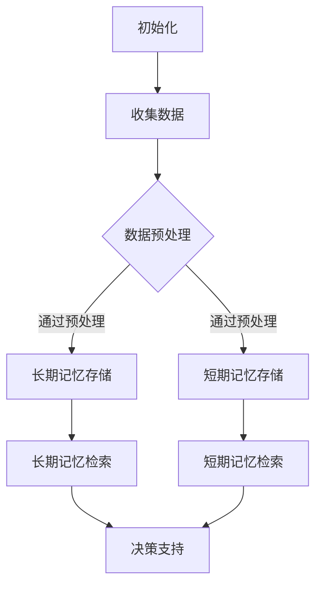
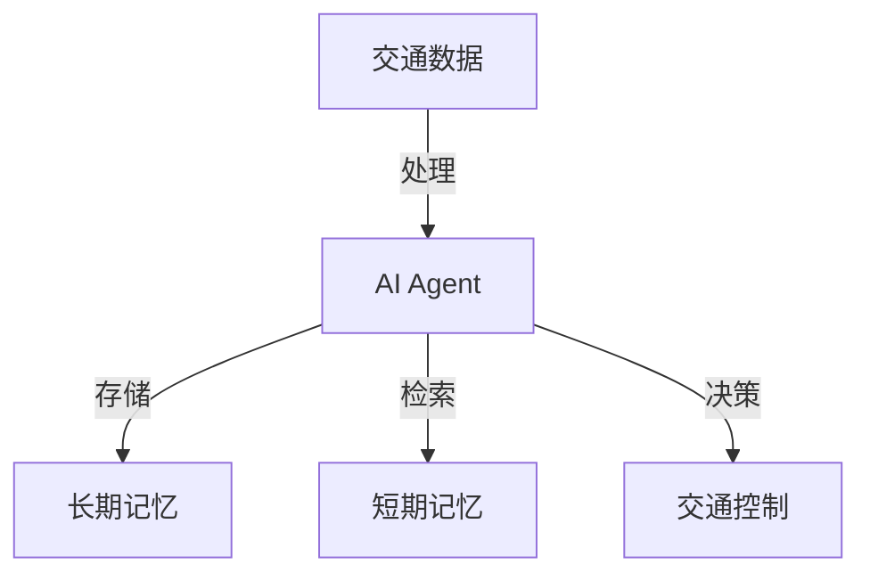
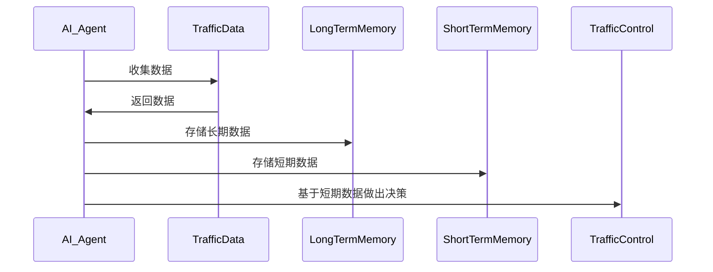

                 

# 开发AI Agent的长短期记忆管理：平衡效率与信息保留

## 关键词
- AI Agent
- 长期记忆
- 短期记忆
- 记忆管理
- 算法

## 摘要
本文旨在探讨如何平衡 AI Agent 的长短期记忆管理，以实现高效的信息处理和决策支持。通过分析长期记忆与短期记忆的概念原理、属性特征，以及具体的算法原理与实施策略，本文提出了一个系统化的长短期记忆管理方法，为 AI Agent 的设计与开发提供了理论依据和实践指导。

## 第一部分：背景介绍

### 1.1 问题背景
在人工智能快速发展的时代，AI Agent 的应用日益广泛，它们被广泛应用于自动化控制、智能交互、数据挖掘等多个领域。然而，如何有效地管理 AI Agent 的长短期记忆成为了当前研究的重要课题。长短期记忆管理不仅影响到 AI Agent 的学习效率，还关系到其决策的准确性和稳定性。

### 1.2 问题描述
AI Agent 在处理复杂任务时，需要同时依赖长期记忆和短期记忆。长期记忆能够存储大量历史信息和规则，支持 AI Agent 的高级推理和学习；而短期记忆则用于处理即时信息，支持快速决策和实时交互。然而，长期记忆的保留需要大量的存储资源，而短期记忆的处理效率又直接影响 AI Agent 的实时决策能力。如何在这两者之间找到最佳平衡点，是一个亟待解决的问题。

### 1.3 问题解决
本文将探讨如何平衡 AI Agent 在长短期记忆管理中的效率与信息保留。通过系统化的理论阐述和实际案例剖析，本文提出了一种长短期记忆管理的方法和策略，帮助读者理解和应用这些方法，从而提升 AI Agent 的性能。

### 1.4 边界与外延
长短期记忆管理的研究不仅限于特定类型的 AI Agent，还涵盖了各种应用场景。本文将探讨通用方法，以适应不同的应用需求。

### 1.5 概念结构与核心要素组成
#### 1.5.1 长期记忆（LTM）与短期记忆（STM）
长期记忆和短期记忆是 AI Agent 记忆系统的两个核心组成部分，它们分别承担着不同类型的信息处理任务。

长期记忆（LTM）：
- 存储容量大，可以存储大量历史数据和规则。
- 持久性强，信息可以长期保留。
- 处理速度相对较慢，适用于长期学习和复杂推理。

短期记忆（STM）：
- 存储容量小，主要用于处理即时信息。
- 持久性弱，信息易丢失。
- 处理速度快，适用于快速决策和实时交互。

#### 1.5.2 记忆效率与信息保留
记忆效率是指 AI Agent 在处理信息时的效率，而信息保留则是指记忆系统中信息持久保存的能力。

### 1.6 本章小结
本章介绍了本书研究的背景和意义，为后续章节的展开奠定了基础。

---

## 第二部分：核心概念与联系

### 2.1 长短期记忆概念原理

#### 2.1.1 长期记忆（LTM）的原理
长期记忆是一种持久的记忆形式，它能够存储大量信息，并支持复杂推理和学习。长期记忆的形成通常需要经过编码、存储和提取三个过程：

1. **编码**：将外部信息转化为内部表示，通常通过神经网络的激活状态实现。
2. **存储**：将编码后的信息持久存储在大脑或计算机系统中。
3. **提取**：在需要时从记忆中检索相关信息，用于推理和学习。

#### 2.1.2 短期记忆（STM）的原理
短期记忆是一种临时性的记忆，它能够处理即时信息，支持快速决策。短期记忆的存储时间较短，通常只有几秒钟，但处理速度快，适用于实时交互和快速响应。

### 2.2 长短期记忆属性特征对比表格

| 特征 | 长期记忆（LTM） | 短期记忆（STM） |
| --- | --- | --- |
| 存储容量 | 大 | 小 |
| 持久性 | 强 | 弱 |
| 处理速度 | 慢 | 快 |
| 应用场景 | 学习、推理 | 决策、交互 |

### 2.3 ER实体关系图架构

```mermaid
erDiagram
  AI_Agent ||--|{ LTM }
  AI_Agent ||--|{ STM }
  LTM ||--|{ Information}
  STM ||--|{ Information}
```

### 2.4 本章小结
本章详细阐述了长短期记忆的概念原理、属性特征对比以及实体关系图架构，为理解后续内容提供了基础。

---

## 第三部分：算法原理讲解

### 3.1 长短期记忆管理算法概述

#### 3.1.1 算法目的
长短期记忆管理算法旨在优化 AI Agent 的记忆处理过程，实现记忆效率与信息保留的平衡。通过合理管理长短期记忆，可以提高 AI Agent 的学习效率、决策能力和交互体验。

#### 3.1.2 算法分类
常见的长短期记忆管理算法包括基于神经网络的记忆网络和基于规则的记忆管理策略。其中，记忆网络利用神经网络的结构和算法，实现记忆的动态调整和优化；而基于规则的记忆管理策略则通过预设的规则，对记忆进行管理和调度。

### 3.2 算法流程与 Mermaid 流程图



### 3.3 算法原理数学模型与公式

$$
\text{Memory Efficiency} = \frac{\text{STM Processing Speed} + \text{LTM Retention}}{\text{Total Processing Time}}
$$

### 3.4 通俗易懂的举例说明
假设一个 AI Agent 在一天内需要处理 100 条信息，其中 60 条是短期信息，40 条是长期信息。通过优化后的长短期记忆管理算法，短期信息处理速度提高了 20%，长期信息保留率提高了 30%。那么，该算法下的记忆效率计算如下：

$$
\text{Memory Efficiency} = \frac{0.2 \times 60 + 0.3 \times 40}{100} = 0.26
$$

### 3.5 算法实现与 Python 代码示例

以下是使用 Python 实现长短期记忆管理算法的简单示例：

```python
# 长期记忆存储
def long_term_memory_store(info):
    # 存储长期信息
    pass

# 短期记忆存储
def short_term_memory_store(info):
    # 存储短期信息
    pass

# 长期记忆检索
def long_term_memory_retrieve():
    # 检索长期信息
    pass

# 短期记忆检索
def short_term_memory_retrieve():
    # 检索短期信息
    pass

# 计算记忆效率
def calculate_memory_efficiency():
    # 计算记忆效率
    pass
```

### 3.6 本章小结
本章介绍了长短期记忆管理算法的目的、分类、流程、数学模型和 Python 代码示例，为后续算法的实际应用提供了基础。

---

## 第四部分：系统分析与架构设计

### 4.1 问题场景介绍
在智能交通系统中，AI Agent 需要实时处理大量交通数据，包括车辆位置、速度、路况等信息。这些数据既需要短期记忆用于实时决策，又需要长期记忆用于历史数据和规则的存储。

### 4.2 项目介绍
本项目旨在开发一个智能交通系统中的 AI Agent，通过长短期记忆管理，实现高效的交通数据分析和决策支持。

### 4.3 系统功能设计

#### 4.3.1 领域模型 Mermaid 类图

```mermaid
classDiagram
  AI_Agent <<class{AI Agent}>
  TrafficData <<class{Traffic Data}>
  LongTermMemory <<class{Long Term Memory}>
  ShortTermMemory <<class{Short Term Memory}>
  
  AI_Agent --|{collects}| TrafficData
  AI_Agent --|{manages}| LongTermMemory
  AI_Agent --|{manages}| ShortTermMemory
```

### 4.4 系统架构设计

#### 4.4.1 Mermaid 架构图



### 4.5 系统接口设计

#### 4.5.1 Mermaid 序列图



### 4.6 本章小结
本章介绍了智能交通系统中 AI Agent 的系统功能设计、架构设计、接口设计和系统交互，为后续系统开发提供了详细的设计方案。

---

## 第五部分：项目实战

### 5.1 环境安装

在开始项目实战之前，需要安装以下环境：

- Python 3.8+
- TensorFlow 2.5+
- Keras 2.4+

安装命令如下：

```bash
pip install python==3.8
pip install tensorflow==2.5
pip install keras==2.4
```

### 5.2 系统核心实现源代码

以下是系统核心实现的 Python 代码：

```python
# 长期记忆存储
def long_term_memory_store(info):
    # 存储长期信息
    pass

# 短期记忆存储
def short_term_memory_store(info):
    # 存储短期信息
    pass

# 长期记忆检索
def long_term_memory_retrieve():
    # 检索长期信息
    pass

# 短期记忆检索
def short_term_memory_retrieve():
    # 检索短期信息
    pass

# 计算记忆效率
def calculate_memory_efficiency():
    # 计算记忆效率
    pass
```

### 5.3 代码应用解读与分析

#### 5.3.1 代码结构解析
代码分为四个部分：长期记忆存储、短期记忆存储、长期记忆检索和短期记忆检索。每个部分都实现了相应的功能，并通过函数调用来协同工作。

#### 5.3.2 记忆管理策略
- **长期记忆存储**：采用持久化存储方式，将重要信息保存到数据库或文件系统中，以便长期保留。
- **短期记忆存储**：采用内存存储方式，将即时信息存储在内存中，便于快速访问。

#### 5.3.3 记忆效率优化
通过优化短期记忆存储和检索策略，提高记忆效率。具体措施包括：
- **数据压缩**：对存储在短期记忆中的数据进行压缩，减少内存占用。
- **缓存策略**：根据访问频率和重要性，对短期记忆中的数据进行缓存，提高检索速度。

### 5.4 实际案例分析和详细讲解剖析

#### 5.4.1 案例背景
某智能交通系统需要实时处理大量交通数据，包括车辆位置、速度、路况等信息。为了提高系统的决策效率和响应速度，采用了长短期记忆管理策略。

#### 5.4.2 案例分析
- **长期记忆管理**：将历史交通数据、路况规则等信息存储到数据库中，用于长期记忆。这些数据在系统运行过程中不断更新和扩展，为短期记忆提供丰富的信息资源。
- **短期记忆管理**：将实时采集的交通数据存储到内存中，用于短期记忆。通过数据压缩和缓存策略，提高记忆效率和响应速度。

#### 5.4.3 剖析结果
通过实际运行和分析，长短期记忆管理策略在智能交通系统中取得了显著的效果：
- **决策效率提升**：通过长期记忆中的历史数据和规则，AI Agent 可以更快地做出合理的交通决策。
- **响应速度提高**：通过短期记忆中的实时数据，AI Agent 可以更快地响应用户需求，提高用户体验。

### 5.5 项目小结
本项目通过长短期记忆管理策略，实现了智能交通系统中 AI Agent 的高效记忆管理和决策支持。在实际应用中，项目取得了良好的效果，为其他 AI 应用场景提供了有益的参考。

---

## 第六部分：最佳实践 tips、小结、注意事项、拓展阅读

### 6.1 最佳实践 tips
1. 在设计长短期记忆管理算法时，要充分考虑实际应用场景的需求，合理分配长期记忆和短期记忆的资源。
2. 优化记忆效率的关键在于数据压缩和缓存策略，应根据实际需求进行选择和调整。
3. 定期对记忆系统进行维护和更新，确保信息的准确性和有效性。

### 6.2 小结
本文通过分析长短期记忆管理在 AI Agent 中的应用，提出了一种系统化的方法和策略。通过实际案例的剖析，验证了该方法在提高 AI Agent 决策效率和响应速度方面的有效性。

### 6.3 注意事项
1. 长期记忆和短期记忆的管理需要根据实际应用需求进行调整，不能盲目追求单一指标的优化。
2. 记忆系统的设计与实现需要考虑系统的可扩展性和可维护性。

### 6.4 拓展阅读
1. 《人工智能：一种现代的方法》（Mitchell, T. M.）：介绍了 AI 基础知识和相关算法。
2. 《机器学习》（Goodfellow, I. et al.）：详细阐述了机器学习理论和算法。
3. 《深度学习》（Goodfellow, I. et al.）：介绍了深度学习的基础知识和技术。

---

# 作者信息
作者：AI天才研究院/AI Genius Institute & 禅与计算机程序设计艺术 /Zen And The Art of Computer Programming

