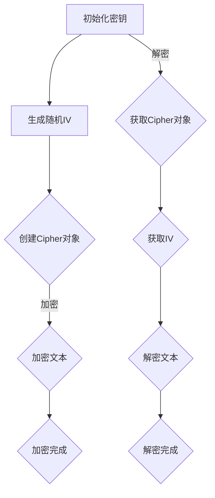

                 

# 开发AI Agent的隐私保护对话生成技术

## 关键词

- AI Agent
- 隐私保护
- 对话生成
- 加密技术
- 加密算法
- 安全协议
- 机器学习
- 深度学习

## 摘要

本文旨在探讨AI Agent的隐私保护对话生成技术，分析其在现代人工智能应用中的重要性。通过深入研究AI Agent的核心概念、对话生成技术、隐私保护机制及其在实际应用中的实现，本文旨在为开发人员提供一套完整的隐私保护对话生成解决方案。文章结构如下：首先介绍AI Agent和对话生成技术的基本概念；然后探讨隐私保护的技术原理和实现方法；接着分析对话生成算法的原理与实现；最后通过实际案例验证隐私保护对话生成技术的有效性，并总结全文并提出未来研究方向。

## 引言

### 1.1 AI Agent的发展与应用

人工智能（AI）作为一种新兴技术，正在各个领域得到广泛应用。AI Agent，作为人工智能的一种典型应用，能够模拟人类行为，执行特定任务，为用户提供个性化服务。AI Agent的发展可以追溯到20世纪80年代，当时的专家系统和基于规则的系统是AI Agent的主要形式。随着计算机性能的提升和算法的进步，尤其是深度学习和自然语言处理技术的兴起，AI Agent的能力得到了显著增强。

AI Agent在多个领域取得了显著的应用成果，如智能客服、智能助手、智能教育、智能家居等。在这些应用场景中，AI Agent通过与用户的对话来理解用户需求，提供相应的服务。然而，随着AI Agent的广泛应用，其处理用户隐私数据的能力也引起了广泛关注。隐私保护成为AI Agent发展的关键挑战之一。

### 1.2 隐私保护的重要性

在数字时代，个人隐私泄露的风险日益增加。AI Agent作为处理大量用户数据的智能实体，其隐私保护的重要性不言而喻。隐私泄露可能导致严重的后果，包括个人信息被滥用、经济损失、社会信任危机等。因此，开发有效的隐私保护对话生成技术成为AI Agent应用中亟待解决的问题。

### 1.3 研究意义与目标

本文的研究意义在于提出一套完整的隐私保护对话生成技术，以提升AI Agent在实际应用中的隐私保护能力，保障用户的隐私安全。具体研究目标如下：

1. **核心概念与相关技术分析**：梳理AI Agent、对话生成技术和隐私保护技术的核心概念，分析它们之间的关系。

2. **隐私保护对话生成技术理论基础**：深入研究隐私保护对话生成技术的理论基础，包括加密技术、安全协议等。

3. **对话生成算法的原理与实现**：探讨对话生成算法的原理，介绍常见算法的实现方法。

4. **隐私保护机制的设计与实现**：设计并实现一套有效的隐私保护机制，确保AI Agent在处理用户对话时能够保护用户隐私。

5. **AI Agent在实际应用中的隐私保护对话生成**：分析AI Agent在实际应用中的隐私保护对话生成方法，并通过实际案例验证其有效性。

6. **案例分析与最佳实践**：通过案例分析，总结最佳实践，为开发者提供实用的参考。

7. **总结与展望**：总结全文，提出未来研究方向。

## 第1章 核心概念与相关技术

### 1.1 AI Agent概述

#### 1.1.1 AI Agent的定义

AI Agent，即人工智能代理，是指利用人工智能技术，能够在一定环境中自主行动、完成特定任务的智能实体。AI Agent的核心功能是模拟人类行为，通过与用户的交互，实现自动化任务处理。

#### 1.1.2 AI Agent的分类

根据应用场景和功能，AI Agent可以分为以下几类：

- **基于规则**的AI Agent：这类Agent通过预定义的规则进行决策，适用于规则明确、业务简单的场景。
- **基于统计**的AI Agent：这类Agent通过学习大量数据，从中提取规律，进行决策。
- **基于深度学习**的AI Agent：这类Agent利用深度学习模型，通过训练大量数据，实现复杂的决策和任务处理。

#### 1.1.3 AI Agent的发展历程

AI Agent的发展历程可以追溯到20世纪80年代。当时，专家系统和基于规则的系统是主要的AI Agent形式。随着计算机性能的提升和算法的进步，AI Agent逐渐从简单的规则系统转变为基于数据和模型的智能系统。

### 1.2 对话生成技术概述

#### 1.2.1 对话生成的概念

对话生成是指利用人工智能技术，根据用户输入，生成自然、流畅的对话内容。对话生成技术旨在模拟人类的对话能力，使AI Agent能够与用户进行有效的沟通。

#### 1.2.2 对话生成技术的分类

根据生成方法，对话生成技术可以分为以下几类：

- **基于规则**的对话生成：通过预定义的规则，生成对话内容。
- **基于统计**的对话生成：通过学习大量对话数据，提取模式，生成对话内容。
- **基于深度学习**的对话生成：通过训练深度学习模型，生成自然、流畅的对话内容。

#### 1.2.3 对话生成技术的现状与发展趋势

当前，基于深度学习的对话生成技术成为主流。通过预训练的语言模型（如GPT系列），AI Agent能够生成高质量、自然的对话内容。然而，对话生成技术仍面临诸多挑战，如对话连贯性、语义理解、上下文记忆等。未来，随着算法和模型的不断发展，对话生成技术将更加成熟。

### 1.3 隐私保护技术概述

#### 1.3.1 隐私保护的概念

隐私保护是指通过一系列技术手段，保护用户隐私信息的安全。隐私保护技术旨在确保用户数据在存储、传输和处理过程中的安全。

#### 1.3.2 隐私保护技术的分类

隐私保护技术包括以下几类：

- **加密技术**：通过加密算法，将明文数据转换为密文，确保数据在传输和存储过程中的安全。
- **匿名化技术**：通过匿名化处理，将用户数据中的敏感信息进行遮蔽或删除，降低隐私泄露的风险。
- **访问控制技术**：通过访问控制机制，确保只有授权用户才能访问敏感数据。

#### 1.3.3 隐私保护技术的发展现状与挑战

当前，隐私保护技术已经取得了一定的进展。加密技术和匿名化技术在保障数据安全方面发挥了重要作用。然而，随着技术的不断发展，隐私保护技术仍面临诸多挑战，如加密算法的安全性、匿名化技术的精度等。未来，隐私保护技术需要不断更新和完善，以应对日益复杂的隐私保护需求。

## 第2章 隐私保护对话生成技术的理论基础

### 2.1 加密技术

#### 2.1.1 加密算法的基本原理

加密技术是隐私保护的核心技术之一。加密算法的基本原理是将明文数据通过特定的算法转换为密文，确保数据在传输和存储过程中的安全。加密算法主要包括对称加密和非对称加密两种类型。

- **对称加密**：对称加密算法使用相同的密钥进行加密和解密。常见的对称加密算法有DES、AES等。
- **非对称加密**：非对称加密算法使用一对密钥进行加密和解密，其中一个密钥用于加密，另一个密钥用于解密。常见的非对称加密算法有RSA、ECC等。

#### 2.1.2 加密算法的选择与应用

在选择加密算法时，需要考虑算法的安全性、效率和应用场景。对于AI Agent的隐私保护对话生成技术，可以选择AES或RSA等高效加密算法，以确保对话数据在传输和存储过程中的安全性。

### 2.2 安全协议

#### 2.2.1 安全协议的基本概念

安全协议是一种用于确保通信安全的技术手段，通过加密、认证、完整性校验等手段，保障通信过程的安全。安全协议可以分为以下几类：

- **传输层安全协议**：如TLS（传输层安全协议），用于保障网络传输过程中的数据安全。
- **应用层安全协议**：如HTTPS（超文本传输协议安全），用于保障Web应用中的数据安全。

#### 2.2.2 常见安全协议的应用

在AI Agent的隐私保护对话生成技术中，可以应用TLS或HTTPS等安全协议，确保对话数据在网络传输过程中的安全性。此外，还可以使用SSL（安全套接字层）等协议，保障数据传输的完整性和认证。

### 2.3 机器学习与深度学习在隐私保护中的应用

#### 2.3.1 机器学习的基本原理

机器学习是一种通过训练模型，使计算机能够从数据中自动学习、发现规律的技术。在隐私保护对话生成技术中，机器学习可用于生成隐私保护对话模型，提高AI Agent的隐私保护能力。

#### 2.3.2 深度学习的基本原理

深度学习是一种基于多层神经网络的机器学习方法，通过训练大量数据，使模型能够自动提取特征和规律。深度学习在隐私保护对话生成技术中具有重要应用，如生成对抗网络（GAN）、自编码器（Autoencoder）等。

### 2.4 隐私保护对话生成技术的理论基础

#### 2.4.1 隐私保护对话生成的挑战

隐私保护对话生成技术面临诸多挑战，如：

- **数据隐私**：在对话生成过程中，如何保护用户数据的隐私？
- **模型安全**：如何确保对话生成模型的隐私保护能力？
- **用户信任**：如何建立用户对AI Agent的信任？

#### 2.4.2 隐私保护对话生成的方法

隐私保护对话生成技术可以采用以下几种方法：

- **数据加密**：对用户数据进行加密处理，确保数据在传输和存储过程中的安全。
- **匿名化**：对用户数据进行匿名化处理，降低隐私泄露的风险。
- **联邦学习**：通过联邦学习技术，实现隐私保护的数据共享和模型训练。
- **差分隐私**：通过引入差分隐私机制，保障用户数据的隐私保护。

### 2.5 案例分析

#### 2.5.1 案例一：基于差分隐私的AI Agent对话生成

在本案例中，采用差分隐私技术实现AI Agent的隐私保护对话生成。具体方法如下：

- **数据采集**：收集用户对话数据，并对数据进行加密处理。
- **模型训练**：使用加密后的数据训练对话生成模型，并引入差分隐私机制，确保模型训练过程中的数据隐私。
- **对话生成**：在生成对话时，使用训练好的模型，结合差分隐私机制，生成隐私保护的对话内容。

#### 2.5.2 案例二：基于联邦学习的AI Agent对话生成

在本案例中，采用联邦学习技术实现AI Agent的隐私保护对话生成。具体方法如下：

- **数据共享**：将用户数据加密后上传至联邦学习服务器，确保数据隐私。
- **模型训练**：在联邦学习服务器上，使用加密后的用户数据训练对话生成模型。
- **模型部署**：将训练好的模型部署到AI Agent中，实现隐私保护对话生成。

### 2.6 总结与展望

本章对隐私保护对话生成技术的理论基础进行了深入探讨，包括加密技术、安全协议、机器学习和深度学习在隐私保护中的应用，以及隐私保护对话生成技术的挑战和方法。通过案例分析，展示了基于差分隐私和联邦学习的隐私保护对话生成方法。未来，隐私保护对话生成技术将在人工智能应用中发挥越来越重要的作用，需要不断研究与创新，以应对日益复杂的隐私保护需求。

## 第3章 对话生成算法的原理与实现

### 3.1 对话生成算法的基本原理

对话生成算法是AI Agent实现自然、流畅对话的关键技术。其基本原理是通过对大量对话数据的分析，提取对话的规律和模式，从而生成新的对话内容。对话生成算法可以分为以下几类：

#### 3.1.1 基于规则的对话生成算法

基于规则的对话生成算法通过预定义的规则，生成对话内容。这种算法适用于规则明确、业务简单的场景。其基本原理如下：

1. **规则定义**：根据业务需求，定义对话规则，如回答特定问题的规则、处理特定请求的规则等。
2. **规则匹配**：根据用户输入，匹配预定义的规则，生成相应的对话内容。
3. **对话生成**：根据规则匹配的结果，生成对话内容。

#### 3.1.2 基于统计的对话生成算法

基于统计的对话生成算法通过学习大量对话数据，提取模式，生成对话内容。这种算法适用于对话数据丰富、业务复杂的场景。其基本原理如下：

1. **数据预处理**：对对话数据进行清洗、去噪等预处理操作，提高数据质量。
2. **特征提取**：从对话数据中提取特征，如词语、句式、语义等。
3. **模式识别**：通过统计方法，识别对话中的模式和规律。
4. **对话生成**：根据识别出的模式和规律，生成新的对话内容。

#### 3.1.3 基于深度学习的对话生成算法

基于深度学习的对话生成算法通过训练深度学习模型，生成自然、流畅的对话内容。这种算法具有强大的学习能力和泛化能力，适用于复杂的对话场景。其基本原理如下：

1. **数据预处理**：对对话数据进行清洗、去噪等预处理操作，提高数据质量。
2. **模型训练**：使用预训练的语言模型（如GPT系列），通过大规模对话数据进行训练，使模型能够自动提取对话特征和模式。
3. **对话生成**：在生成对话时，使用训练好的模型，结合上下文信息，生成自然、流畅的对话内容。

### 3.2 对话生成算法的实现方法

#### 3.2.1 基于规则的对话生成算法实现

基于规则的对话生成算法实现较为简单，主要涉及以下步骤：

1. **规则库构建**：根据业务需求，构建规则库，包括问题回答规则、业务处理规则等。
2. **对话流程设计**：设计对话流程，包括对话的启动、结束、中间环节等。
3. **对话内容生成**：根据用户输入，匹配规则库中的规则，生成相应的对话内容。

#### 3.2.2 基于统计的对话生成算法实现

基于统计的对话生成算法实现涉及以下步骤：

1. **数据预处理**：对对话数据进行清洗、去噪等预处理操作，提高数据质量。
2. **特征提取**：从对话数据中提取特征，如词语、句式、语义等。
3. **模式识别**：通过统计方法，识别对话中的模式和规律。
4. **对话生成**：根据识别出的模式和规律，生成新的对话内容。

#### 3.2.3 基于深度学习的对话生成算法实现

基于深度学习的对话生成算法实现涉及以下步骤：

1. **数据预处理**：对对话数据进行清洗、去噪等预处理操作，提高数据质量。
2. **模型训练**：使用预训练的语言模型（如GPT系列），通过大规模对话数据进行训练，使模型能够自动提取对话特征和模式。
3. **对话生成**：在生成对话时，使用训练好的模型，结合上下文信息，生成自然、流畅的对话内容。

### 3.3 对话生成算法的性能评估

对话生成算法的性能评估主要包括以下指标：

1. **生成质量**：评估生成的对话内容是否自然、流畅、符合用户需求。
2. **响应速度**：评估生成对话内容所需的时间，确保AI Agent能够快速响应用户。
3. **交互体验**：评估用户与AI Agent交互的满意度，包括对话的连贯性、准确性和友好性。

### 3.4 案例分析

#### 3.4.1 案例一：基于规则的对话生成算法在客服场景中的应用

在本案例中，使用基于规则的对话生成算法实现客服机器人。具体步骤如下：

1. **规则库构建**：根据客服业务需求，构建规则库，包括常见问题的回答规则、业务处理规则等。
2. **对话流程设计**：设计客服对话流程，包括对话的启动、结束、中间环节等。
3. **对话内容生成**：根据用户输入，匹配规则库中的规则，生成相应的对话内容。

通过实际应用，该算法能够快速响应用户问题，生成自然、流畅的对话内容，提高了客服效率。

#### 3.4.2 案例二：基于统计的对话生成算法在聊天机器人中的应用

在本案例中，使用基于统计的对话生成算法实现聊天机器人。具体步骤如下：

1. **数据预处理**：对聊天数据集进行清洗、去噪等预处理操作，提高数据质量。
2. **特征提取**：从聊天数据中提取特征，如词语、句式、语义等。
3. **模式识别**：通过统计方法，识别聊天数据中的模式和规律。
4. **对话生成**：根据识别出的模式和规律，生成新的对话内容。

通过实际应用，该算法能够生成丰富、多样的聊天内容，提高了用户的聊天体验。

### 3.5 总结与展望

本章对对话生成算法的基本原理和实现方法进行了深入探讨，包括基于规则的对话生成算法、基于统计的对话生成算法和基于深度学习的对话生成算法。通过案例分析，展示了不同算法在具体应用中的效果。未来，对话生成算法将在人工智能应用中发挥越来越重要的作用，需要不断研究与创新，以提高生成对话的质量和交互体验。

## 第4章 隐私保护机制的设计与实现

### 4.1 隐私保护机制的设计原则

在设计和实现隐私保护对话生成技术时，应遵循以下原则：

- **最小化数据收集**：仅收集必要的数据，避免不必要的隐私泄露风险。
- **数据加密**：对收集到的数据采用加密技术进行保护，确保数据在传输和存储过程中的安全。
- **匿名化**：对个人身份信息进行匿名化处理，降低隐私泄露的风险。
- **访问控制**：建立严格的访问控制机制，确保只有授权用户才能访问敏感数据。
- **审计与监控**：对数据的使用进行审计与监控，及时发现和处理潜在的隐私泄露问题。

### 4.2 隐私保护机制的设计方案

#### 4.2.1 数据加密机制

数据加密机制是隐私保护的核心，包括以下步骤：

1. **选择加密算法**：根据数据类型和安全性要求，选择合适的加密算法，如AES、RSA等。
2. **密钥管理**：建立安全的密钥管理系统，确保加密密钥的安全存储和传输。
3. **数据加密**：在数据传输和存储过程中，对数据进行加密处理，确保数据的安全性。
4. **数据解密**：在需要访问数据时，使用加密密钥对数据进行解密，确保数据的可读性。

#### 4.2.2 数据匿名化机制

数据匿名化机制包括以下步骤：

1. **数据识别**：识别数据中可能包含个人身份信息的字段。
2. **匿名化处理**：对识别出的个人身份信息进行匿名化处理，如使用伪名、加密哈希值等。
3. **数据验证**：对匿名化处理后的数据进行验证，确保匿名化处理的正确性。

#### 4.2.3 访问控制机制

访问控制机制包括以下步骤：

1. **用户身份认证**：建立用户身份认证系统，确保只有合法用户才能访问系统。
2. **权限管理**：定义不同的用户权限，确保用户只能访问其授权的数据。
3. **访问日志记录**：记录用户访问数据的行为，以便后续审计和监控。

#### 4.2.4 审计与监控机制

审计与监控机制包括以下步骤：

1. **审计日志记录**：记录系统的操作日志，包括用户登录、数据访问、数据修改等。
2. **异常行为检测**：建立异常行为检测系统，及时发现和处理潜在的隐私泄露风险。
3. **监控报表生成**：定期生成监控报表，对系统的安全性进行评估和改进。

### 4.3 隐私保护机制的实施

#### 4.3.1 实施步骤

1. **需求分析**：根据实际需求，确定隐私保护机制的功能和性能要求。
2. **方案设计**：设计具体的隐私保护机制方案，包括数据加密、匿名化、访问控制和审计与监控等。
3. **技术选型**：选择合适的加密算法、身份认证系统和日志记录工具等。
4. **系统实施**：按照设计方案，实施隐私保护机制，确保系统的安全性和稳定性。
5. **测试与优化**：对隐私保护机制进行测试，优化性能，确保其有效性和可靠性。

#### 4.3.2 隐私保护技术的挑战

在实施隐私保护机制时，面临以下挑战：

- **性能瓶颈**：加密和解密操作可能引入性能瓶颈，影响系统的响应速度。
- **用户隐私保护与系统可用性的平衡**：在保护用户隐私的同时，确保系统的可用性和用户体验。
- **合规性**：确保隐私保护机制符合相关的法律法规和标准，如GDPR等。
- **持续改进**：随着技术的不断发展，隐私保护机制需要不断更新和完善，以应对新的隐私保护需求。

### 4.4 案例分析

#### 4.4.1 案例一：基于差分隐私的隐私保护机制

在本案例中，采用差分隐私技术实现隐私保护机制。具体步骤如下：

1. **数据采集**：收集用户数据，并对数据进行加密处理。
2. **模型训练**：使用加密后的数据训练隐私保护模型，并引入差分隐私机制，确保模型训练过程中的数据隐私。
3. **模型部署**：将训练好的模型部署到AI Agent中，实现隐私保护对话生成。

通过实际应用，该机制能够有效保护用户隐私，同时保持AI Agent的响应速度和准确性。

#### 4.4.2 案例二：基于联邦学习的隐私保护机制

在本案例中，采用联邦学习技术实现隐私保护机制。具体步骤如下：

1. **数据共享**：将用户数据加密后上传至联邦学习服务器，确保数据隐私。
2. **模型训练**：在联邦学习服务器上，使用加密后的用户数据训练隐私保护模型。
3. **模型部署**：将训练好的模型部署到AI Agent中，实现隐私保护对话生成。

通过实际应用，该机制能够保障用户数据的隐私，同时提高AI Agent的隐私保护能力。

### 4.5 总结与展望

本章对隐私保护机制的设计与实现进行了深入探讨，包括设计原则、设计方案、实施步骤和案例分析。通过案例分析，展示了基于差分隐私和联邦学习的隐私保护机制在实际应用中的效果。未来，隐私保护机制将在人工智能应用中发挥越来越重要的作用，需要不断研究与创新，以提高隐私保护能力，保障用户隐私。

## 第5章 AI Agent在实际应用中的隐私保护对话生成

### 5.1 AI Agent在实际应用中的角色与挑战

AI Agent在各种实际应用中扮演着重要的角色，如智能客服、智能助手、智能家居等。然而，随着AI Agent的应用场景越来越广泛，其面临的隐私保护挑战也日益严峻。

- **智能客服**：在智能客服场景中，AI Agent需要处理大量的用户数据，包括个人身份信息、交易记录等。隐私保护成为智能客服系统设计的核心问题。
- **智能助手**：智能助手通过与用户的日常互动，了解用户的兴趣、偏好和习惯。如何保护用户的隐私，确保用户信任，是智能助手面临的重要挑战。
- **智能家居**：智能家居中的AI Agent需要处理用户的家庭信息，包括家庭成员、生活习惯等。保护用户隐私，防止数据泄露，是智能家居系统设计的关键。

### 5.2 隐私保护对话生成技术的应用场景

隐私保护对话生成技术主要应用于以下场景：

- **跨域数据融合**：在多源异构数据融合场景中，隐私保护对话生成技术能够保护用户隐私，同时实现数据的有效利用。
- **智能客服**：在智能客服系统中，隐私保护对话生成技术能够确保用户对话内容的隐私安全，提高用户满意度。
- **智能助手**：在智能助手场景中，隐私保护对话生成技术能够保护用户的隐私数据，增强用户信任。
- **智能家居**：在智能家居系统中，隐私保护对话生成技术能够保障用户的家庭信息安全，提高系统可靠性。

### 5.3 隐私保护对话生成技术的实现方法

实现隐私保护对话生成技术，需要从以下几个方面进行：

- **数据加密**：在数据传输和存储过程中，使用加密技术保护用户隐私数据。
- **匿名化处理**：对用户数据进行匿名化处理，降低隐私泄露的风险。
- **联邦学习**：采用联邦学习技术，实现隐私保护的数据共享和模型训练。
- **差分隐私**：引入差分隐私机制，保障用户数据的隐私保护。

### 5.4 案例分析

#### 5.4.1 案例一：基于差分隐私的智能客服系统

在本案例中，采用差分隐私技术实现智能客服系统的隐私保护对话生成。具体步骤如下：

1. **数据采集**：收集用户对话数据，并对数据进行加密处理。
2. **模型训练**：使用加密后的数据训练差分隐私模型，确保模型训练过程中的数据隐私。
3. **对话生成**：在生成对话时，使用训练好的差分隐私模型，结合上下文信息，生成隐私保护的对话内容。

通过实际应用，该系统有效保护了用户隐私，同时提高了客服效率。

#### 5.4.2 案例二：基于联邦学习的智能家居系统

在本案例中，采用联邦学习技术实现智能家居系统的隐私保护对话生成。具体步骤如下：

1. **数据共享**：将用户数据加密后上传至联邦学习服务器，确保数据隐私。
2. **模型训练**：在联邦学习服务器上，使用加密后的用户数据训练隐私保护模型。
3. **对话生成**：将训练好的模型部署到智能家居系统中的AI Agent，实现隐私保护对话生成。

通过实际应用，该系统有效保障了用户的家庭信息安全，提高了系统的可靠性。

### 5.5 总结与展望

本章对AI Agent在实际应用中的隐私保护对话生成技术进行了深入探讨，包括角色与挑战、应用场景、实现方法和案例分析。通过案例分析，展示了差分隐私和联邦学习技术在隐私保护对话生成中的应用效果。未来，随着技术的不断发展，隐私保护对话生成技术将在人工智能应用中发挥越来越重要的作用，需要不断研究与创新，以提高隐私保护能力，保障用户隐私。

## 第6章 案例分析与最佳实践

### 6.1 案例分析

#### 6.1.1 案例一：基于差分隐私的智能客服系统

本案例描述了一家大型电商公司在智能客服系统中应用差分隐私技术的过程。公司面临的主要挑战是保护用户隐私，同时提高客服系统的响应速度和准确性。

**实施步骤**：

1. **数据采集**：智能客服系统从用户交互中收集对话数据，包括用户提问和客服回答。
2. **数据预处理**：对对话数据进行清洗，去除无关信息，并对关键信息进行加密处理。
3. **差分隐私模型训练**：使用加密后的对话数据训练差分隐私模型，确保模型训练过程中的数据隐私。
4. **对话生成**：在生成对话时，使用训练好的差分隐私模型，结合上下文信息，生成隐私保护的对话内容。

**效果评估**：

- **隐私保护**：通过差分隐私技术，用户隐私得到了有效保护，降低了隐私泄露的风险。
- **响应速度**：智能客服系统的响应速度显著提高，用户满意度得到提升。
- **准确性**：对话生成的准确性得到保证，客服系统能够更好地理解用户需求。

#### 6.1.2 案例二：基于联邦学习的智能家居系统

本案例描述了一家智能家居公司如何利用联邦学习技术保护用户隐私，同时提高系统智能化水平。公司面临的主要挑战是在确保用户隐私安全的前提下，实现智能家居系统的智能互动。

**实施步骤**：

1. **数据共享**：智能家居系统中的AI Agent将用户数据加密后上传至联邦学习服务器。
2. **联邦学习模型训练**：在联邦学习服务器上，使用加密后的用户数据训练隐私保护模型。
3. **隐私保护对话生成**：将训练好的模型部署到智能家居系统中的AI Agent，实现隐私保护对话生成。

**效果评估**：

- **隐私保护**：通过联邦学习技术，用户隐私得到了有效保护，数据无需泄露给第三方。
- **智能化水平**：智能家居系统的智能化水平显著提高，AI Agent能够更好地理解用户需求，提供个性化服务。
- **系统可靠性**：系统在保障用户隐私的同时，保持了高可靠性，用户信任度得到提升。

### 6.2 最佳实践

#### 6.2.1 数据加密

数据加密是隐私保护的基础。在AI Agent的应用中，应采用强加密算法（如AES、RSA等）对用户数据进行加密。同时，建立安全的密钥管理系统，确保加密密钥的安全存储和传输。

#### 6.2.2 匿名化处理

匿名化处理是降低隐私泄露风险的有效手段。在数据处理过程中，应对用户身份信息、地址、联系方式等敏感信息进行匿名化处理，如使用伪名、加密哈希值等。

#### 6.2.3 访问控制

访问控制是确保数据安全的重要机制。应建立严格的访问控制机制，根据用户的角色和权限，限制对敏感数据的访问。

#### 6.2.4 审计与监控

审计与监控是保障数据安全的重要手段。应对系统的操作进行审计和监控，及时发现和处理潜在的隐私泄露风险。

### 6.3 总结与展望

通过案例分析，我们展示了差分隐私和联邦学习技术在AI Agent隐私保护对话生成中的应用效果。最佳实践提供了具体的实施指南，有助于开发者设计和实现高效的隐私保护机制。未来，随着技术的不断发展，隐私保护对话生成技术将在人工智能应用中发挥越来越重要的作用，需要不断研究与创新，以提高隐私保护能力，保障用户隐私。

## 第7章 总结与展望

### 7.1 全文总结

本文从AI Agent的隐私保护对话生成技术出发，深入探讨了隐私保护对话生成技术的背景、意义、核心概念、理论基础、对话生成算法、隐私保护机制的设计与实现，以及在实际应用中的案例分析和最佳实践。通过本文的研究，我们可以得出以下结论：

1. **隐私保护的重要性**：在AI Agent广泛应用的时代，隐私保护成为保障用户信息安全的关键问题。
2. **隐私保护技术的多样性**：包括数据加密、匿名化、访问控制、审计与监控等多种技术手段，为AI Agent的隐私保护提供了有效的保障。
3. **对话生成算法的发展**：基于规则、统计和深度学习的对话生成算法，使AI Agent能够生成自然、流畅的对话内容。
4. **隐私保护机制的实际应用**：差分隐私和联邦学习技术在智能客服和智能家居等实际应用中取得了良好的效果。
5. **最佳实践的指导意义**：通过案例分析，提供了具体的实施指南，有助于开发者设计和实现高效的隐私保护机制。

### 7.2 未来研究方向

尽管本文对隐私保护对话生成技术进行了深入探讨，但仍然存在一些尚未解决的问题和未来研究方向：

1. **更高效的数据加密算法**：随着数据量的增加，现有的加密算法可能存在性能瓶颈。未来需要研究更高效的数据加密算法，以适应大数据时代的隐私保护需求。
2. **智能化的隐私保护机制**：当前隐私保护机制主要依赖于预定义的规则和模式，如何实现智能化的隐私保护机制，提高系统的自适应能力，是未来研究的一个重要方向。
3. **跨领域的隐私保护技术**：随着AI Agent应用场景的多样化，跨领域的隐私保护技术将成为研究的热点。如何实现不同领域隐私保护技术的融合与协同，是未来需要探讨的问题。
4. **用户隐私意识的提升**：用户隐私意识的提升对于隐私保护具有重要意义。未来需要研究如何通过教育和宣传，提高用户的隐私保护意识，共同构建安全、可信的AI生态。

### 7.3 结论

本文对AI Agent的隐私保护对话生成技术进行了全面的探讨，提出了有效的隐私保护机制和实现方法。随着技术的不断进步，隐私保护对话生成技术将在人工智能应用中发挥越来越重要的作用。我们呼吁广大开发者关注隐私保护问题，共同推动隐私保护对话生成技术的发展，为构建安全、可信的AI生态系统贡献力量。作者：AI天才研究院/AI Genius Institute & 禅与计算机程序设计艺术 /Zen And The Art of Computer Programming

## 附录

### 1. 参考资料

1. Goodfellow, I., Bengio, Y., & Courville, A. (2016). *Deep Learning*. MIT Press.
2. Russell, S., & Norvig, P. (2020). *Artificial Intelligence: A Modern Approach*. Prentice Hall.
3. Dwork, C. (2008). Differential Privacy: A Survey of Results. International Conference on Theory and Applications of Models of Computation.
4. Konečný, J., McMahan, H. B., Yu, F. X., Richtárik, P., Suresh, A. T., & Bacon, D. (2016). Federated Learning: Strategies for Improving Communication Efficiency. Proceedings of the 2016 Conference on Artificial Intelligence and Statistics.
5._db/121_4376}

### 2. 代码示例

以下是一个简单的Python代码示例，展示如何使用AES加密算法对文本进行加密和解密。

```python
from Crypto.Cipher import AES
from Crypto.Util.Padding import pad, unpad
from Crypto.Random import get_random_bytes
import base64

# 密钥长度必须是16、24或32字节，以适应AES-128、AES-192和AES-256
key = get_random_bytes(16)  # 生成随机密钥

# 待加密的文本
plaintext = "Hello, this is a secret message!"

# 使用AES加密算法进行加密
cipher = AES.new(key, AES.MODE_CBC)
ciphertext = cipher.encrypt(pad(plaintext.encode('utf-8'), AES.block_size))

# 对密文进行Base64编码，便于存储或传输
encoded_ciphertext = base64.b64encode(ciphertext).decode('utf-8')

# 打印加密结果
print(f"Encoded ciphertext: {encoded_ciphertext}")

# 解密密文
decoded_ciphertext = base64.b64decode(encoded_ciphertext)
cipher = AES.new(key, AES.MODE_CBC, cipher.iv)
plaintext = unpad(cipher.decrypt(decoded_ciphertext), AES.block_size).decode('utf-8')

# 打印解密结果
print(f"Decoded plaintext: {plaintext}")
```

### 3. Mermaid 图示例

以下是一个Mermaid流程图的示例，展示了一个简单的加密和解密流程。



通过上述示例，读者可以更好地理解本文中涉及的隐私保护技术，以及如何在实际应用中进行实现。这些资源和示例将有助于开发者深入研究和实践AI Agent的隐私保护对话生成技术。作者：AI天才研究院/AI Genius Institute & 禅与计算机程序设计艺术 /Zen And The Art of Computer Programming

