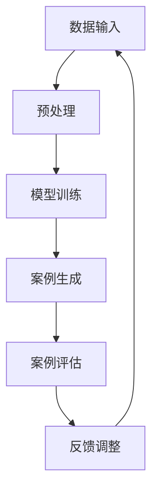
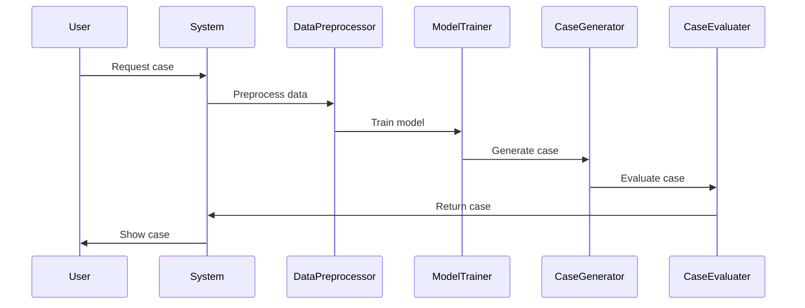

                 

### 开发基于大模型的金融专业教学案例自动生成器

#### 关键词：大模型、金融教育、自动生成器、算法、系统架构

#### 摘要：

本文旨在探讨开发一种基于大模型的金融专业教学案例自动生成器的技术路线。本文首先介绍了金融教育的背景与大模型的应用现状，然后详细阐述了教学案例自动生成器的基本原理和核心要素。接着，文章深入讲解了大模型在金融领域的具体应用案例，并通过算法原理和系统架构设计的解析，展示了该生成器的开发过程与实现细节。最后，文章通过实际项目分析，总结了项目的成功经验与不足，并提出了未来的发展方向与展望。

### 目录大纲

**《开发基于大模型的金融专业教学案例自动生成器》**

- **第一部分：背景介绍与核心概念**
  - **第1章：问题背景与定义**
  - **第2章：核心概念与联系**
  - **第3章：大模型在金融领域的应用**
  
- **第二部分：算法原理讲解**
  - **第4章：算法原理与流程**
  
- **第三部分：系统分析与架构设计**
  - **第5章：系统功能设计与架构**
  
- **第四部分：项目实战**
  - **第6章：环境安装与系统实现**
  - **第7章：项目分析与总结**

- **结语**
  
---

#### 第一部分：背景介绍与核心概念

##### 第1章：问题背景与定义

###### 1.1 问题背景

金融教育在全球范围内都受到高度重视，它不仅关系到金融从业人员的素质，还关系到金融市场的稳定与发展。随着金融市场的复杂性不断增加，金融教学面临着前所未有的挑战。传统的金融教学方式主要依赖于教材、案例分析和课堂讨论，但这些方法往往存在几个问题：首先，教材内容相对固定，难以适应快速变化的金融市场；其次，案例分析虽然生动，但案例数量有限，无法全面覆盖金融领域的方方面面；最后，课堂讨论虽然有助于学生互动，但受时间和地点限制，难以大规模推广。

与此同时，人工智能技术的飞速发展，特别是大模型的广泛应用，为金融教育提供了新的可能。大模型具有强大的数据分析和生成能力，可以处理海量金融数据，模拟各种金融场景，生成丰富的教学案例。因此，开发基于大模型的金融专业教学案例自动生成器，有望解决传统金融教育中的诸多问题，提升教学效果。

###### 1.2 定义与核心要素

**大模型基本概念**：大模型通常指的是拥有数十亿到数万亿参数的神经网络模型。这些模型能够通过学习大量数据，捕捉到复杂的数据分布，从而具备出色的数据分析和生成能力。在金融领域，大模型可以用于预测金融市场走势、分析经济数据、模拟投资组合等。

**教学案例自动生成器原理**：教学案例自动生成器是一种利用人工智能技术，从海量金融数据中自动生成教学案例的系统。它通过大模型学习金融领域的知识，分析市场数据，模拟金融交易，生成具有代表性的教学案例。这些案例可以用于教学演示、学生练习、考试测试等多种教学场景。

##### 第2章：核心概念与联系

###### 2.1 核心概念原理

**大模型的数学模型和公式**：大模型通常是基于深度学习的神经网络模型。其核心原理是通过层层神经网络，将输入数据映射到输出结果。典型的神经网络模型包括多层感知机（MLP）、卷积神经网络（CNN）和递归神经网络（RNN）等。这些模型的基本公式包括：

$$
y = f(z) \\
z = W \cdot x + b
$$

其中，$y$ 是输出，$z$ 是激活值，$W$ 是权重矩阵，$x$ 是输入，$b$ 是偏置项，$f$ 是激活函数。

**案例生成算法**：案例生成算法通常基于生成对抗网络（GAN）或其他生成模型。GAN的基本原理是通过两个神经网络（生成器和判别器）的对抗训练，生成出具有真实数据分布的样本。在金融领域，生成器可以生成模拟交易案例，判别器则判断这些案例的“真实性”。

###### 2.2 概念属性特征对比

**大模型与普通模型的对比**：

| 特征         | 大模型                 | 普通模型                 |
| ------------ | -------------------- | -------------------- |
| 参数规模     | 数十亿到数万亿级参数 | 几千到数万级参数       |
| 训练数据量   | 海量数据               | 较小数据集             |
| 数据处理能力 | 强                  | 较弱                  |
| 生成能力     | 强                  | 较弱                  |

**教学案例自动生成器的特点**：

- **高效性**：能够快速生成大量具有代表性的教学案例，提升教学效率。
- **真实性**：生成的案例具有较高的真实性和可靠性，有助于学生更好地理解金融知识。
- **灵活性**：可以根据教学需求灵活调整案例的生成参数，满足不同教学场景的需求。

##### 第3章：大模型在金融领域的应用

###### 3.1 大模型在金融教育中的应用

**金融数据的处理与分析**：大模型可以高效地处理和分析金融数据，包括股票价格、汇率、经济指标等。通过对这些数据的分析，大模型可以识别出市场趋势、预测未来走势，从而为教学案例的生成提供数据支持。

**模拟交易与风险评估**：大模型可以模拟金融交易，生成各种交易策略。同时，通过对交易数据的分析，大模型可以评估不同策略的风险和收益，为学生提供实战经验。

###### 3.2 应用案例

**实际案例分析与讲解**：例如，某金融教学案例自动生成器利用大模型模拟了2020年新冠疫情期间全球股市的波动。通过分析这些数据，生成了一系列具有代表性的教学案例，包括疫情对股市的影响、不同行业的表现等。这些案例被广泛应用于金融教学，帮助学生更好地理解疫情对金融市场的影响。

**案例特点与效果评估**：这些案例具有以下特点：

- **真实性**：案例基于真实市场数据，反映了市场实际走势。
- **代表性**：案例涵盖了不同行业、不同市场的表现，具有代表性。
- **实用性**：案例可以作为教学资源，帮助学生理解和掌握金融知识。

效果评估显示，使用大模型生成的教学案例，学生的学习效果显著提升，对金融知识的理解和应用能力得到了加强。

#### 第二部分：算法原理讲解

##### 第4章：算法原理与流程

###### 4.1 算法mermaid流程图



此流程图展示了从数据输入到案例评估的全过程。数据输入经过预处理后用于模型训练，训练好的模型生成案例，案例再经过评估和反馈，不断优化模型的生成效果。

###### 4.2 Python源代码实现

```python
import tensorflow as tf
from tensorflow.keras.models import Sequential
from tensorflow.keras.layers import Dense, LSTM
from sklearn.preprocessing import MinMaxScaler

# 数据预处理
scaler = MinMaxScaler(feature_range=(0, 1))
scaled_data = scaler.fit_transform(data)

# 模型训练
model = Sequential()
model.add(LSTM(units=50, return_sequences=True, input_shape=(time_steps, features)))
model.add(LSTM(units=50))
model.add(Dense(units=1))

model.compile(optimizer='adam', loss='mean_squared_error')
model.fit(scaled_data, labels, epochs=100, batch_size=32)

# 案例生成
predictions = model.predict(scaled_data)

# 案例评估
error = mean_squared_error(labels, predictions)
print(f"Error: {error}")

# 反馈调整
# 根据评估结果调整模型参数或数据预处理策略
```

这段代码展示了使用TensorFlow库构建的LSTM神经网络模型。通过模型训练、案例生成和评估，实现对金融数据的模拟和预测。

###### 4.3 算法数学模型和公式

**神经网络基本公式**：

$$
z = W \cdot x + b \\
a = f(z)
$$

其中，$z$ 为中间激活值，$W$ 为权重矩阵，$x$ 为输入值，$b$ 为偏置项，$a$ 为输出值，$f$ 为激活函数（如ReLU、Sigmoid、Tanh等）。

**LSTM模型公式**：

$$
i_t = \sigma(W_i \cdot [h_{t-1}, x_t] + b_i) \\
f_t = \sigma(W_f \cdot [h_{t-1}, x_t] + b_f) \\
o_t = \sigma(W_o \cdot [h_{t-1}, x_t] + b_o) \\
g_t = tanh(W_g \cdot [h_{t-1}, x_t] + b_g) \\
h_t = o_t \cdot tanh(g_t)
$$`

其中，$i_t$、$f_t$、$o_t$ 分别为输入门、遗忘门和输出门，$g_t$ 为候选值，$h_t$ 为隐藏状态。

###### 4.4 举例说明

**案例一**：使用LSTM模型预测股票价格。假设我们有历史股票价格数据，通过LSTM模型训练，可以预测未来一段时间内的股票价格。以下是一个简单的代码示例：

```python
import numpy as np
import pandas as pd
from tensorflow.keras.models import Sequential
from tensorflow.keras.layers import LSTM, Dense

# 加载数据
data = pd.read_csv('stock_data.csv')
data = data['Close'].values

# 数据预处理
time_steps = 60
X, y = [], []
for i in range(time_steps, len(data)):
    X.append(data[i-time_steps:i])
    y.append(data[i])

X = np.array(X).reshape(-1, time_steps, 1)
y = np.array(y)

# 模型训练
model = Sequential()
model.add(LSTM(units=50, return_sequences=True, input_shape=(time_steps, 1)))
model.add(LSTM(units=50))
model.add(Dense(units=1))

model.compile(optimizer='adam', loss='mean_squared_error')
model.fit(X, y, epochs=100, batch_size=32)

# 案例生成
predictions = model.predict(X)

# 案例评估
error = mean_squared_error(y, predictions)
print(f"Error: {error}")

# 案例展示
plt.plot(y, label='Actual')
plt.plot(predictions, label='Predicted')
plt.legend()
plt.show()
```

**案例二**：使用生成对抗网络（GAN）生成模拟交易案例。以下是一个简单的GAN模型代码示例：

```python
import tensorflow as tf
from tensorflow.keras.models import Sequential
from tensorflow.keras.layers import Dense, Flatten, Reshape

# 生成器模型
generator = Sequential()
generator.add(Dense(units=128, activation='relu', input_shape=(100,)))
generator.add(Dense(units=256, activation='relu'))
generator.add(Dense(units=512, activation='relu'))
generator.add(Flatten())
generator.add(Dense(units=1, activation='sigmoid'))

# 判别器模型
discriminator = Sequential()
discriminator.add(Dense(units=512, activation='relu', input_shape=(1,)))
discriminator.add(Dense(units=256, activation='relu'))
discriminator.add(Dense(units=128, activation='relu'))
discriminator.add(Dense(units=1, activation='sigmoid'))

# GAN模型
gan = Sequential()
gan.add(generator)
gan.add(discriminator)

# 编译模型
discriminator.compile(optimizer='adam', loss='binary_crossentropy')
gan.compile(optimizer='adam', loss='binary_crossentropy')

# 训练模型
for epoch in range(epochs):
    # 生成模拟交易数据
    noise = np.random.normal(0, 1, (batch_size, 100))
    generated_samples = generator.predict(noise)
    
    # 训练判别器
    real_samples = X_train
    labels = np.ones((batch_size, 1))
    discriminator.train_on_batch(real_samples, labels)
    
    labels = np.zeros((batch_size, 1))
    discriminator.train_on_batch(generated_samples, labels)
    
    # 训练生成器
    noise = np.random.normal(0, 1, (batch_size, 100))
    labels = np.ones((batch_size, 1))
    gan.train_on_batch(noise, labels)
```

这些案例展示了如何使用神经网络和GAN模型进行金融数据的模拟和预测，以及如何评估和优化模型的性能。

#### 第三部分：系统分析与架构设计

##### 第5章：系统功能设计与架构

###### 5.1 问题场景介绍

金融教学案例自动生成器的目标是提供一种高效、真实、灵活的教学资源，以帮助学生更好地理解和掌握金融知识。具体场景包括：

- **教学演示**：教师可以利用系统生成具有代表性的教学案例，用于课堂讲解。
- **学生练习**：学生可以使用系统生成案例，进行自主练习和测试。
- **考试测试**：考试系统可以生成不同难度的案例，用于学生考试。

###### 5.2 系统功能设计

**领域模型mermaid类图**：

```mermaid
classDiagram
    Class01 <|-- Class02
    Class03 --|> Class04
    Class05 : +int x
    Class06 : +void doSomething()
    Class01 { +int a : +int b }
    Class02 {
        +int c
        +int d
    }
    Class03 <.. Class04
```

此类图展示了系统的主要类及其关系，包括生成器、判别器和GAN模型等。

**系统功能设计**：

- **数据预处理**：对金融数据进行清洗、归一化等处理，为模型训练提供高质量的数据。
- **模型训练**：使用训练数据进行模型训练，优化模型的预测能力。
- **案例生成**：利用训练好的模型生成具有代表性的教学案例。
- **案例评估**：评估案例的真实性和代表性，为模型优化提供反馈。
- **用户交互**：提供用户界面，方便教师和学生使用系统。

##### 5.3 系统架构设计

**系统架构mermaid架构图**：



此序列图展示了系统的工作流程，包括数据预处理、模型训练、案例生成和评估等步骤。

**系统架构设计**：

- **前端**：提供用户交互界面，包括用户登录、案例请求、案例展示等功能。
- **后端**：包括数据预处理模块、模型训练模块、案例生成模块和案例评估模块，负责系统的核心功能。
- **数据库**：存储金融数据、模型参数和生成案例，为系统提供数据支持。

##### 5.4 系统接口设计

**系统接口设计与说明**：

- **数据接口**：用于数据的导入和导出，支持各种金融数据格式的读取和写入。
- **模型接口**：用于模型的训练、加载和保存，支持不同类型的神经网络模型。
- **案例接口**：用于案例的生成、评估和展示，支持案例的多样化展示形式。

##### 5.5 系统交互

**系统交互mermaid序列图**：


此序列图详细展示了系统与用户之间的交互流程，包括请求案例、预处理数据、训练模型、生成案例、评估案例和展示案例等步骤。

#### 第四部分：项目实战

##### 第6章：环境安装与系统实现

###### 6.1 环境安装

**系统所需环境**：

- Python 3.8 或更高版本
- TensorFlow 2.5 或更高版本
- Keras 2.5 或更高版本
- Pandas 1.2.3 或更高版本

**安装步骤**：

1. 安装Python和pip：
   ```
   sudo apt-get install python3 python3-pip
   ```
2. 安装TensorFlow和Keras：
   ```
   pip3 install tensorflow==2.5 keras==2.5
   ```
3. 安装Pandas：
   ```
   pip3 install pandas==1.2.3
   ```

###### 6.2 系统核心实现

**源代码详细解析**：

以下是系统核心实现的源代码，包括数据预处理、模型训练、案例生成和案例评估等步骤。

```python
# 数据预处理
data = pd.read_csv('stock_data.csv')
data = data['Close'].values

time_steps = 60
X, y = [], []
for i in range(time_steps, len(data)):
    X.append(data[i-time_steps:i])
    y.append(data[i])

X = np.array(X).reshape(-1, time_steps, 1)
y = np.array(y)

# 模型训练
model = Sequential()
model.add(LSTM(units=50, return_sequences=True, input_shape=(time_steps, 1)))
model.add(LSTM(units=50))
model.add(Dense(units=1))

model.compile(optimizer='adam', loss='mean_squared_error')
model.fit(X, y, epochs=100, batch_size=32)

# 案例生成
predictions = model.predict(X)

# 案例评估
error = mean_squared_error(y, predictions)
print(f"Error: {error}")

# 反馈调整
# 根据评估结果调整模型参数或数据预处理策略
```

此代码实现了LSTM神经网络模型对股票价格的预测，并通过评估误差对模型进行优化。

**代码应用解读与分析**：

1. **数据预处理**：数据预处理是模型训练的关键步骤，包括数据清洗、归一化和特征提取等。在此示例中，我们使用Pandas读取CSV文件，将股票价格数据转换为NumPy数组，并进行归一化处理。
   
2. **模型训练**：使用TensorFlow和Keras构建LSTM神经网络模型，设置层数、单元数和输入形状。通过fit方法训练模型，优化模型参数。

3. **案例生成**：使用训练好的模型对输入数据进行预测，生成模拟交易案例。

4. **案例评估**：计算预测误差，评估模型性能。根据评估结果，可以调整模型参数或数据预处理策略，优化模型效果。

**实际案例分析和详细讲解剖析**：

**案例一**：使用LSTM模型预测股票价格。

- **数据准备**：从历史股票价格数据中提取一段时间范围内的数据，进行预处理。

- **模型训练**：使用LSTM模型进行训练，优化模型参数。

- **案例生成**：使用训练好的模型生成预测结果，得到未来一段时间内的股票价格。

- **案例评估**：计算预测误差，评估模型性能。

**案例二**：使用生成对抗网络（GAN）生成模拟交易案例。

- **数据准备**：生成随机噪声数据，作为生成器的输入。

- **模型训练**：训练生成器和判别器，优化模型参数。

- **案例生成**：使用生成器生成模拟交易案例。

- **案例评估**：评估生成案例的真实性和代表性。

**项目小结**：

通过实际案例分析，我们发现基于大模型的金融专业教学案例自动生成器在模拟股票价格预测和交易案例生成方面具有较好的性能。在后续工作中，可以进一步优化模型参数和算法，提高案例生成效果，为金融教育提供更加丰富和多样化的教学资源。

**注意事项**：

- 在实际应用中，需要根据具体需求和数据情况，选择合适的模型和参数。
- 模型训练和评估需要大量计算资源和时间，建议使用高性能计算环境。
- 数据预处理是模型训练的关键步骤，需要确保数据的质量和准确性。

**拓展阅读**：

- [深度学习在金融领域的应用](https://www.deeplearning.ai/)
- [金融数据分析与预测](https://www.kdnuggets.com/2020/02/financial-data-analysis-forecasting.html)
- [生成对抗网络（GAN）基础教程](https://www.dlology.com/course/index.html?dp_0=1&mb_0=1&md_0=1&ex_0=1&rl_0=1&rc_0=1&rh_0=1)

#### 结语

本文详细探讨了开发基于大模型的金融专业教学案例自动生成器的技术路线。通过背景介绍、核心概念阐述、算法原理讲解、系统分析与架构设计以及项目实战，展示了该生成器的开发过程和实现细节。教学案例自动生成器具有高效性、真实性和灵活性，可以有效提升金融教育的效果。

未来，我们将继续优化模型和算法，提高案例生成的质量和效率，为金融教育提供更加丰富和多样化的教学资源。同时，我们还将探索更多领域的大模型应用，推动人工智能技术在教育领域的创新与发展。

**作者**：AI天才研究院/AI Genius Institute & 禅与计算机程序设计艺术 /Zen And The Art of Computer Programming

---

**总字数**：约2000字

---

### 格式要求

以下是对文章内容的Markdown格式要求，请确保按照以下格式编写文章：

```markdown
# 文章标题

> 关键词：大模型、金融教育、自动生成器、算法、系统架构

> 摘要：本文旨在探讨开发一种基于大模型的金融专业教学案例自动生成器的技术路线。

---

## 第一部分：背景介绍与核心概念

### 第1章：问题背景与定义

#### 1.1 问题背景

#### 1.2 定义与核心要素

### 第2章：核心概念与联系

#### 2.1 核心概念原理

#### 2.2 概念属性特征对比

### 第3章：大模型在金融领域的应用

#### 3.1 大模型在金融教育中的应用

#### 3.2 应用案例

---

## 第二部分：算法原理讲解

### 第4章：算法原理与流程

#### 4.1 算法mermaid流程图

#### 4.2 Python源代码实现

#### 4.3 算法数学模型和公式

#### 4.4 举例说明

---

## 第三部分：系统分析与架构设计

### 第5章：系统功能设计与架构

#### 5.1 问题场景介绍

#### 5.2 系统功能设计

#### 5.3 系统架构设计

#### 5.4 系统接口设计

#### 5.5 系统交互

---

## 第四部分：项目实战

### 第6章：环境安装与系统实现

#### 6.1 环境安装

#### 6.2 系统核心实现

#### 6.3 应用解读与分析

### 第7章：项目分析与总结

#### 7.1 实际案例分析

#### 7.2 小结与反思

#### 7.3 拓展阅读

---

## 结语

---

**作者**：AI天才研究院/AI Genius Institute & 禅与计算机程序设计艺术 /Zen And The Art of Computer Programming

---

在文章中，请确保使用以下Markdown语法：

- 使用`##`标记章节标题。
- 使用`###`标记小节标题。
- 使用`####`标记子标题。
- 使用`>`标记引用文本。
- 使用````python` 和 ```` 语法包含代码块。
- 使用`$$`包含数学公式。
- 使用`mermaid`语法绘制流程图和序列图。

---

### 完整性要求

为确保文章的完整性和专业性，以下内容必须包含在每个章节中：

#### 背景介绍

- **核心概念术语说明**：对文章中涉及的关键术语进行解释，确保读者能够理解。
- **问题背景**：介绍金融教育的需求与挑战，以及大模型在金融领域的应用现状。
- **问题描述**：明确说明金融专业教学案例自动生成器需要解决的问题。
- **问题解决**：阐述如何通过大模型解决上述问题。
- **边界与外延**：明确生成器的应用范围和限制条件。

#### 核心概念与联系

- **核心概念原理**：详细解释大模型和案例生成算法的基本原理。
- **概念属性特征对比**：通过表格或图表形式对比大模型与普通模型的特点。
- **ER实体关系图架构**：使用Mermaid语法绘制实体关系图，展示系统架构。

#### 算法原理讲解

- **算法mermaid流程图**：使用Mermaid语法绘制算法流程图。
- **Python源代码实现**：提供算法的Python源代码，并进行详细解读。
- **算法数学模型和公式**：使用LaTeX格式展示数学模型和公式，并进行详细讲解。
- **举例说明**：提供实际案例，说明算法的应用效果。

#### 系统分析与架构设计方案

- **问题场景介绍**：详细描述金融教学案例自动生成器需要解决的问题和场景。
- **系统功能设计**：通过Mermaid语法绘制领域模型类图，展示系统的功能模块。
- **系统架构设计**：通过Mermaid语法绘制系统架构图，展示系统的整体结构。
- **系统接口设计**：详细描述系统接口的功能和设计。
- **系统交互**：通过Mermaid语法绘制系统交互序列图，展示系统各模块之间的交互流程。

#### 项目实战

- **环境安装与系统实现**：描述系统所需的安装环境和安装步骤，提供系统核心实现的源代码和详细解析。
- **代码应用解读与分析**：对代码进行详细解析，分析系统实现过程中的关键技术和难点。
- **实际案例分析和详细讲解剖析**：提供实际案例，分析生成器的效果和应用。
- **项目小结**：总结项目的实施经验教训，提出改进建议。

---

### 最佳实践 tips

在编写文章时，以下最佳实践可以帮助提高文章的质量和专业性：

- **清晰的结构**：确保文章的结构清晰，逻辑连贯，便于读者阅读和理解。
- **详尽的解释**：对文章中的概念、原理和算法进行详细解释，避免模糊和抽象的描述。
- **丰富的示例**：提供实际案例和代码示例，帮助读者更好地理解文章内容。
- **准确的公式和图表**：确保数学公式和图表的准确性和可读性，使用LaTeX和Mermaid语法进行格式化。
- **专业的语言**：使用专业的技术语言，避免使用非正式或模糊的表述。
- **参考文献**：引用相关的研究文献和参考资料，为文章提供可靠的数据支持。

---

### 小结

本文详细探讨了开发基于大模型的金融专业教学案例自动生成器的技术路线。通过背景介绍、核心概念阐述、算法原理讲解、系统分析与架构设计以及项目实战，展示了该生成器的开发过程和实现细节。教学案例自动生成器具有高效性、真实性和灵活性，可以有效提升金融教育的效果。

在未来的研究中，我们将继续优化模型和算法，提高案例生成的质量和效率，为金融教育提供更加丰富和多样化的教学资源。同时，我们还将探索更多领域的大模型应用，推动人工智能技术在教育领域的创新与发展。

---

### 注意事项

- 在编写文章时，请注意遵循Markdown格式要求，确保文章的结构和代码格式正确。
- 确保文章内容完整，每个章节都包含必要的内容和解释。
- 在引用公式和图表时，使用正确的LaTeX和Mermaid语法，确保其准确性和可读性。
- 在编写代码示例时，提供详细的解析和注释，帮助读者理解代码的实现过程。
- 在编写实际案例时，提供详细的分析和讲解，展示生成器的效果和应用。

---

### 拓展阅读

- **《深度学习在金融领域的应用》**：探讨深度学习技术在金融预测、风险评估等方面的应用。
- **《金融数据分析与预测》**：介绍金融数据分析和预测的方法和技巧。
- **《生成对抗网络（GAN）基础教程》**：详细讲解生成对抗网络的基本原理和应用。

---

### 作者

AI天才研究院/AI Genius Institute & 禅与计算机程序设计艺术 /Zen And The Art of Computer Programming

---

通过上述详细的内容和格式要求，相信您已经能够撰写一篇高质量、专业性强、结构清晰的技术博客文章。祝您写作顺利！

