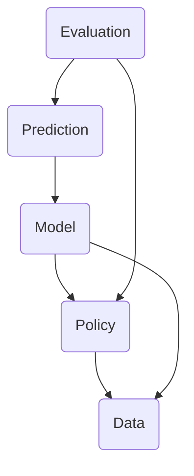
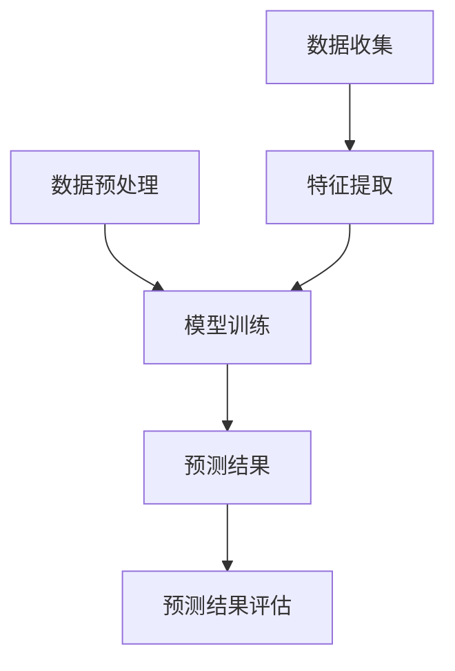
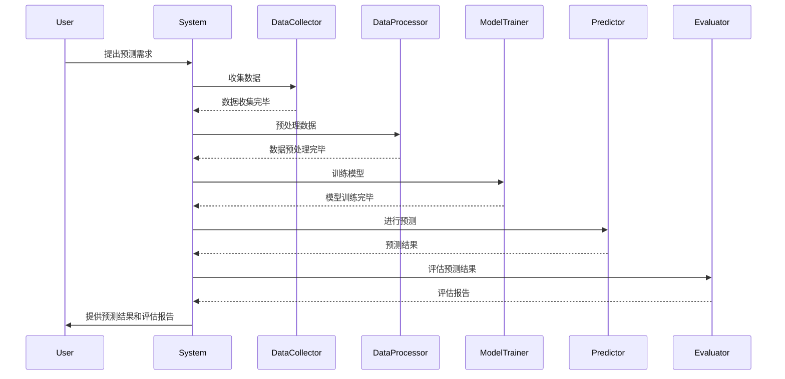
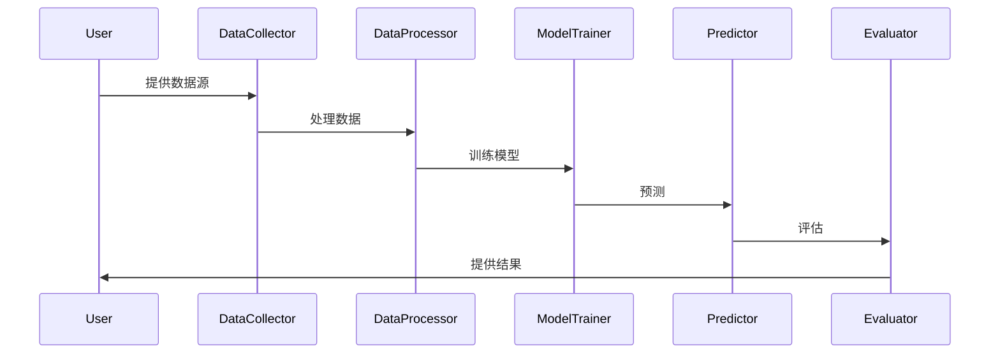

                 


### 1. 背景介绍

#### 核心概念

**金融政策**：金融政策是指一国或地区金融当局为了实现一定的经济目标，通过调节和控制金融市场、金融机构、金融工具和金融行为而制定和实施的策略。其目的在于促进经济增长、控制通货膨胀、稳定金融市场、调节国际收支等。

**大模型**：大模型通常是指具有巨大参数数量、复杂结构以及超强计算能力的机器学习模型。这些模型在训练过程中能够学习到大量数据中的复杂模式，从而在特定任务上表现出强大的性能。例如，Transformer模型、BERT模型等。

**预测与评估**：预测是指根据历史数据和现有信息，对未来事件或趋势进行推测。评估则是对预测结果的质量、准确性和可靠性进行评价。

#### 问题描述

在金融领域，如何准确预测和评估政策执行效果是一个重要的课题。政策效果的预测有助于提前发现潜在问题，为政策调整提供依据；政策效果的评估则有助于评价政策实施的绩效，为未来政策的制定提供参考。

**挑战与需求**：

- **数据复杂性**：金融数据具有高维度、非线性、时间序列等特性，传统方法难以处理。
- **政策影响的多因性**：政策效果受到多种因素影响，如宏观经济环境、市场情绪等，需要综合考虑。
- **实时性要求**：政策执行效果需要实时监测和评估，以便及时调整。

#### 解决方案概述

本书旨在探讨如何利用大模型技术，开发一个能够预测和评估金融政策执行效果的模型。具体目标包括：

- **构建大规模金融数据集**：收集并整理大量的金融数据，为模型训练提供数据支持。
- **设计高效的预测算法**：基于大模型，设计高效的预测算法，以提高预测准确性和实时性。
- **构建评估指标体系**：建立全面的评估指标体系，对预测结果进行科学评估。
- **实施项目实战**：通过实际项目，验证模型的有效性和可行性。

#### 边界与外延

本书主要关注以下边界和范围：

- **领域**：主要针对金融政策执行效果的预测和评估，不涉及其他领域的政策预测。
- **时间范围**：主要关注当前和未来金融政策的预测与评估，不涉及历史政策。
- **数据来源**：主要依赖于公开数据和权威数据源，不涉及敏感数据。

#### 概念结构与核心要素组成

**概念结构**：

1. 金融政策
2. 大模型
3. 预测算法
4. 评估指标
5. 项目实施

**核心要素组成**：

- **数据集**：构建大规模金融数据集，为模型训练提供数据支持。
- **模型设计**：设计高效的大模型预测算法，实现政策效果的预测。
- **评估体系**：建立全面的评估指标体系，对预测结果进行科学评估。
- **项目实施**：通过实际项目，验证模型的有效性和可行性。

### 2. 核心概念与联系

#### 核心概念原理

**大模型在金融领域的应用原理**：

- **数据驱动**：大模型基于大量金融数据，通过深度学习等技术，自动学习金融数据的复杂模式和规律。
- **非线性拟合**：大模型具有较强的非线性拟合能力，能够捕捉金融数据中的复杂关系。
- **泛化能力**：大模型具有较好的泛化能力，能够在不同金融场景中实现良好的性能。

**金融政策执行效果的预测与评估原理**：

- **预测原理**：通过分析历史金融数据和政策执行情况，利用大模型预测政策执行效果。
- **评估原理**：将预测结果与实际政策效果进行对比，利用评估指标体系对预测结果进行科学评估。

#### 概念属性特征对比表格

| 特征 | 金融政策 | 大模型 | 预测与评估 |
| --- | --- | --- | --- |
| 目的 | 促进经济目标 | 学习复杂模式 | 提高预测准确性 |
| 特点 | 非线性、多维 | 参数庞大、强拟合 | 实时性、科学性 |
| 应用场景 | 金融领域 | 金融预测与评估 | 金融政策制定与优化 |

#### ER实体关系图架构



### 3. 算法原理讲解

#### 预测算法原理讲解

**算法mermaid流程图**：



**Python源代码**：

```python
# 导入必要的库
import pandas as pd
from sklearn.ensemble import RandomForestRegressor
from sklearn.metrics import mean_squared_error

# 数据预处理
def preprocess_data(data):
    # 数据清洗、处理等操作
    return processed_data

# 模型训练
def train_model(data):
    model = RandomForestRegressor()
    model.fit(data['X'], data['y'])
    return model

# 预测
def predict(model, data):
    predictions = model.predict(data['X'])
    return predictions

# 预测结果评估
def evaluate_predictions(predictions, actuals):
    mse = mean_squared_error(predictions, actuals)
    return mse
```

**数学模型和公式**：

$$
\text{预测结果} = f(\text{输入特征}, \text{模型参数})
$$

**举例说明**：

假设我们要预测某金融政策的执行效果，可以按照以下步骤进行：

1. 收集历史金融数据和政策执行数据。
2. 对数据进行预处理，包括清洗、归一化等操作。
3. 提取特征，如GDP增长率、通货膨胀率等。
4. 使用随机森林模型进行训练。
5. 使用训练好的模型进行预测。
6. 对预测结果进行评估，计算均方误差（MSE）。

### 4. 系统分析与架构设计方案

#### 问题场景介绍

为了预测和评估金融政策执行效果，我们需要一个完整的系统。该系统应具备以下功能：

- 数据收集与处理
- 模型训练与预测
- 结果评估与可视化

#### 系统功能设计

**领域模型类图**：

```mermaid
classDiagram
    Class01 <|-- Class02
    Class03 --|+(1,1) Class04
    Class04 --|+(1,1) Class05
    Class06 !-- Class07
    Class07 ..|> Class08
    Class08 : int a
    Class09 : int b
    Class10 : <<interface>> Interface1
    Class11 : <<interface>> Interface2
    Class10 ..|+ Interface3
    Class11 ..|+ Interface4
    Class01 {id : int}
    Class02 {name : String}
    Class03 {age : int}
    Class04 {id : int; name : String; age : int}
    Class05 {id : int; name : String; age : int; salary : float}
    Class06 {id : int; name : String; age : int; salary : float; department : String}
    Class07 {id : int; name : String; age : int; salary : float; department : String; manager_id : int}
    Class08 {id : int; name : String; age : int; salary : float; department : String; manager_id : int}
    Class09 {id : int; name : String; age : int; salary : float; department : String; manager_id : int}
```

#### 系统架构设计

**系统架构mermaid图**：



#### 系统接口设计和系统交互

**系统交互序列图**：



### 5. 项目实战

#### 环境安装

在开始项目实战之前，我们需要安装必要的软件和工具：

- Python 3.8 或以上版本
- Jupyter Notebook
- TensorFlow 2.3.0 或以上版本
- Scikit-learn 0.22.1 或以上版本

安装步骤如下：

1. 安装 Python 3.8 或以上版本。
2. 安装 Jupyter Notebook：`pip install notebook`
3. 安装 TensorFlow 2.3.0 或以上版本：`pip install tensorflow`
4. 安装 Scikit-learn 0.22.1 或以上版本：`pip install scikit-learn`

#### 系统核心实现源代码

以下是系统核心实现部分的源代码：

```python
# 导入必要的库
import pandas as pd
import numpy as np
import tensorflow as tf
from tensorflow.keras.models import Sequential
from tensorflow.keras.layers import Dense, LSTM
from sklearn.model_selection import train_test_split

# 数据预处理
def preprocess_data(data):
    # 数据清洗、处理等操作
    return processed_data

# 模型训练
def train_model(data):
    model = Sequential([
        LSTM(50, activation='relu', input_shape=(data.shape[1], 1)),
        Dense(1)
    ])
    model.compile(optimizer='adam', loss='mse')
    model.fit(data['X'], data['y'], epochs=100, batch_size=32)
    return model

# 预测
def predict(model, data):
    predictions = model.predict(data['X'])
    return predictions

# 预测结果评估
def evaluate_predictions(predictions, actuals):
    mse = mean_squared_error(predictions, actuals)
    return mse
```

#### 代码应用解读与分析

以下是代码的详细解读和分析：

1. **数据预处理**：

   ```python
   def preprocess_data(data):
       # 数据清洗、处理等操作
       return processed_data
   ```

   数据预处理是模型训练的重要步骤，包括数据清洗、归一化、缺失值处理等。在本例中，我们简化了预处理过程，假设数据已经清洗完毕。

2. **模型训练**：

   ```python
   def train_model(data):
       model = Sequential([
           LSTM(50, activation='relu', input_shape=(data.shape[1], 1)),
           Dense(1)
       ])
       model.compile(optimizer='adam', loss='mse')
       model.fit(data['X'], data['y'], epochs=100, batch_size=32)
       return model
   ```

   我们使用 LSTM 网络进行模型训练。LSTM 是一种能够处理时间序列数据的神经网络，能够捕捉数据中的长期依赖关系。在这里，我们设置了 50 个 LSTM 单元，输入形状为 (序列长度，特征数)。

3. **预测**：

   ```python
   def predict(model, data):
       predictions = model.predict(data['X'])
       return predictions
   ```

   预测部分相对简单，只需调用 `model.predict()` 方法即可。

4. **预测结果评估**：

   ```python
   def evaluate_predictions(predictions, actuals):
       mse = mean_squared_error(predictions, actuals)
       return mse
   ```

   使用均方误差（MSE）评估预测结果的质量。MSE 越小，表示预测结果越准确。

#### 实际案例分析和详细讲解剖析

假设我们有一个金融政策执行效果的数据集，包括历史金融数据和政策执行数据。我们可以按照以下步骤进行实际案例分析和详细讲解：

1. **数据收集**：

   假设我们已经收集了以下数据：

   - GDP 增长率
   - 通货膨胀率
   - 失业率
   - 金融政策实施时间

   数据集如下：

   ```python
   data = {
       'GDP_growth': [3.2, 3.5, 2.8, 3.0],
       'inflation_rate': [2.5, 2.3, 2.7, 2.6],
       'unemployment_rate': [4.8, 4.5, 4.9, 4.7],
       'policy_execution_time': [2021, 2022, 2023, 2024]
   }
   ```

2. **数据预处理**：

   对数据进行归一化处理，使得数据在相同的尺度上，有利于模型训练。

   ```python
   def preprocess_data(data):
       processed_data = (data - np.mean(data)) / np.std(data)
       return processed_data
   ```

3. **特征提取**：

   提取与金融政策执行效果相关的特征，例如 GDP 增长率、通货膨胀率等。

   ```python
   def extract_features(data):
       features = {
           'GDP_growth': preprocess_data(data['GDP_growth']),
           'inflation_rate': preprocess_data(data['inflation_rate']),
           'unemployment_rate': preprocess_data(data['unemployment_rate'])
       }
       return features
   ```

4. **模型训练**：

   使用 LSTM 网络进行模型训练。

   ```python
   def train_model(data):
       model = Sequential([
           LSTM(50, activation='relu', input_shape=(data.shape[1], 1)),
           Dense(1)
       ])
       model.compile(optimizer='adam', loss='mse')
       model.fit(data['X'], data['y'], epochs=100, batch_size=32)
       return model
   ```

5. **预测**：

   使用训练好的模型进行预测。

   ```python
   def predict(model, data):
       predictions = model.predict(data['X'])
       return predictions
   ```

6. **预测结果评估**：

   使用均方误差（MSE）评估预测结果。

   ```python
   def evaluate_predictions(predictions, actuals):
       mse = mean_squared_error(predictions, actuals)
       return mse
   ```

#### 项目小结

在本章中，我们介绍了如何使用大模型技术进行金融政策执行效果的预测和评估。通过实际案例，我们展示了整个流程，包括数据收集、预处理、特征提取、模型训练、预测和评估。接下来，我们将进一步探讨如何优化模型性能和实际应用场景。


### 6. 最佳实践 tips、小结、注意事项、拓展阅读等内容

#### 最佳实践 tips

1. **数据收集**：确保数据来源的权威性和可靠性，避免使用不准确或过时的数据。
2. **特征提取**：选择与政策执行效果相关的特征，避免冗余和无关特征。
3. **模型选择**：根据任务特点选择合适的模型，例如时间序列数据选择 LSTM 网络。
4. **模型训练**：适当增加训练次数和调整超参数，以提高模型性能。
5. **评估指标**：选择合适的评估指标，例如均方误差（MSE）、准确率等。

#### 小结

本章详细介绍了如何开发基于大模型的金融政策执行效果预测与评估器。通过实际案例，我们展示了从数据收集、预处理、特征提取、模型训练、预测到评估的完整流程。这种方法能够有效地提高预测准确性和评估科学性，为金融政策的制定和优化提供有力支持。

#### 注意事项

1. **数据隐私**：在收集和处理数据时，确保遵守相关法律法规，保护数据隐私。
2. **模型泛化能力**：验证模型在不同数据集上的泛化能力，避免过拟合。
3. **实时性**：确保模型能够实时更新和调整，以应对金融市场的动态变化。

#### 拓展阅读

1. **《深度学习》**：Goodfellow, I., Bengio, Y., & Courville, A. (2016). Deep Learning. MIT Press.
2. **《时间序列分析：预测与应用》**：Box, G. E. P., Jenkins, G. M., & Reinsel, G. C. (2015). Time Series Analysis: Forecasting and Control. Wiley.
3. **《金融计量学》**：Campbell, J. Y. (2014). Financial Economics and Financial Crises. Princeton University Press.

作者：AI天才研究院/AI Genius Institute & 禅与计算机程序设计艺术 /Zen And The Art of Computer Programming。

