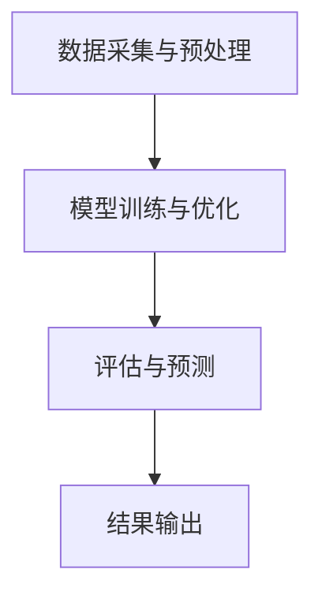
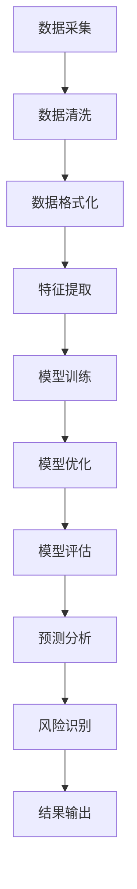

                 

### 《开发基于大模型的金融研究报告评估系统》

#### 关键词

- 大模型
- 金融研究报告
- 评估系统
- 算法应用
- 数据处理

#### 摘要

本文旨在探讨开发基于大模型的金融研究报告评估系统的方法与实现。我们将详细解析大模型在金融研究报告评估中的应用，从基础概念、系统架构设计到算法原理，以及项目实战和最佳实践等方面，提供一套完整的解决方案。文章将结合实际案例，深入浅出地讲解大模型在金融研究报告评估系统中的具体应用，帮助读者理解并掌握这一前沿技术。

---

## 第一部分：背景介绍与核心概念

### 第1章：金融研究报告评估系统概述

#### 1.1 问题背景

金融研究报告是金融分析师基于市场数据、公司财务数据及其他相关信息的分析结果，旨在为投资者提供决策参考。然而，由于市场环境的复杂性和多样性，金融研究报告的质量参差不齐，投资者往往难以辨别其价值。为了提高金融研究报告的质量，需要对报告进行有效的评估。

#### 1.1.1 金融研究报告的价值与挑战

金融研究报告的价值在于其提供的市场分析和预测，帮助投资者做出更加理性的投资决策。然而，金融研究报告面临以下挑战：

- **数据量大**：研究报告包含大量数据，需要有效的处理与分析方法。
- **多样性高**：不同研究报告的分析角度、方法和结论各异，需要统一的评估标准。
- **主观性强**：分析师的主观判断往往影响研究报告的质量，使得评估更加复杂。

#### 1.1.2 大模型在金融领域的应用现状

大模型，特别是深度学习模型，在金融领域已经得到了广泛应用。例如，它们被用于：

- **市场预测**：通过分析历史数据，预测市场走势。
- **风险控制**：识别潜在的市场风险，提供风险管理策略。
- **交易策略**：优化交易策略，提高交易收益。

#### 1.2 问题描述

当前金融研究报告评估主要依靠人工评审，效率低且容易出现主观偏差。因此，我们需要开发一套基于大模型的金融研究报告评估系统，以解决以下问题：

- **评估效率**：如何提高评估速度，处理大量研究报告？
- **评估准确性**：如何确保评估结果的准确性，减少主观偏差？
- **评估全面性**：如何对研究报告的各个方面进行全面评估？

#### 1.3 问题解决

基于大模型的金融研究报告评估系统可以解决上述问题。系统通过以下步骤实现评估：

1. **数据预处理**：对研究报告进行数据清洗和格式化，为后续分析做准备。
2. **特征提取**：从报告中提取关键特征，用于模型训练。
3. **模型训练**：使用深度学习模型对特征进行学习，建立评估模型。
4. **评估与预测**：使用训练好的模型对研究报告进行评估和预测。

#### 1.4 边界与外延

1.4.1 **评估系统的功能边界**

评估系统主要关注以下功能：

- **质量评估**：评估报告的分析质量、逻辑性、数据支持等。
- **预测能力**：评估报告对未来市场的预测能力。
- **风险识别**：识别报告中的潜在风险。

1.4.2 **大模型应用的范围与限制**

大模型在金融领域的应用范围广泛，但同时也受到以下限制：

- **数据需求**：大模型需要大量高质量的数据进行训练。
- **计算资源**：训练大模型需要大量计算资源。
- **模型泛化能力**：模型在不同市场环境下的泛化能力有待提高。

#### 1.5 核心概念与联系

1.5.1 **金融研究报告的核心要素**

金融研究报告的核心要素包括：

- **数据来源**：市场数据、公司财务数据等。
- **分析方法**：统计分析、时间序列分析等。
- **结论与预测**：对市场走势、公司前景等做出预测。

1.5.2 **大模型的相关概念**

大模型，如深度学习模型，其核心概念包括：

- **神经网络**：模仿人脑神经元的工作方式，处理复杂数据。
- **深度学习**：通过多层神经网络，逐层提取数据特征。
- **模型训练**：使用大量数据进行训练，优化模型参数。

1.5.3 **大模型与研究报告评估的联系**

大模型在研究报告评估中的应用主要体现在：

- **自动化评估**：通过深度学习模型，自动评估报告质量。
- **预测分析**：利用模型预测报告的预测准确性。
- **风险识别**：通过分析报告内容，识别潜在风险。

#### 1.6 本章小结

本章介绍了金融研究报告评估系统的背景、挑战和解决方案，以及大模型在金融领域的应用现状。通过分析核心概念和联系，为后续章节的深入探讨奠定了基础。

---

## 第二部分：核心概念与联系

### 第2章：大模型的基础知识

#### 2.1 大模型的定义与分类

2.1.1 **大模型的定义**

大模型，通常指具有大规模参数的深度学习模型，例如GPT-3、BERT等。这些模型具有以下特点：

- **参数量大**：数百万至数十亿个参数。
- **计算量大**：训练和推理需要大量计算资源。
- **泛化能力强**：能够处理复杂的任务和数据。

2.1.2 **大模型的分类**

根据应用场景和任务的不同，大模型可以分为以下几类：

- **语言模型**：如GPT-3、BERT等，用于自然语言处理任务。
- **图像模型**：如ResNet、VGG等，用于图像识别和分类任务。
- **多模态模型**：结合多种数据类型，如文本、图像、音频等，用于复杂数据的分析和预测。

#### 2.2 大模型的工作原理

2.2.1 **大模型的架构**

大模型的架构通常包括以下几个层次：

- **输入层**：接收外部输入，如文本、图像等。
- **隐藏层**：包含多个隐藏层，用于提取和变换特征。
- **输出层**：生成预测结果或输出特征。

2.2.2 **大模型的训练与优化**

大模型的训练与优化过程主要包括以下步骤：

1. **数据预处理**：对输入数据进行清洗、格式化等处理。
2. **模型初始化**：初始化模型参数，通常使用随机初始化。
3. **前向传播**：将输入数据传递到模型，计算输出结果。
4. **反向传播**：计算损失函数，更新模型参数。
5. **优化算法**：使用优化算法（如梯度下降、Adam等）更新模型参数。

#### 2.3 大模型的应用案例

2.3.1 **金融领域的应用实例**

大模型在金融领域有广泛的应用，如：

- **市场预测**：使用时间序列模型预测市场走势。
- **信用评分**：利用用户数据预测信用风险。
- **交易策略**：基于历史交易数据，优化交易策略。

2.3.2 **其他领域的应用实例**

大模型在其他领域也有广泛应用，如：

- **医疗**：使用图像模型进行医学图像分析。
- **安防**：使用视频模型进行人脸识别、行为分析。
- **自然语言处理**：用于机器翻译、文本生成等任务。

#### 2.4 大模型的优势与挑战

2.4.1 **大模型的优势**

大模型的优势包括：

- **强大的表示能力**：能够处理复杂数据和任务。
- **高效的学习能力**：通过大量数据进行训练，提高模型性能。
- **广泛的适用性**：适用于多种任务和数据类型。

2.4.2 **大模型的挑战**

大模型面临的挑战包括：

- **计算资源需求**：训练大模型需要大量计算资源。
- **数据需求**：大模型需要大量高质量的数据进行训练。
- **模型解释性**：大模型的黑箱特性使得其解释性较低。

#### 2.5 本章小结

本章介绍了大模型的基础知识，包括定义、分类、工作原理和应用案例。通过分析大模型的优势与挑战，为后续章节的深入探讨提供了理论基础。

---

## 第三部分：系统分析与架构设计

### 第3章：研究报告评估系统的设计

#### 3.1 系统需求分析

3.1.1 **系统功能需求**

研究报告评估系统的功能需求包括：

- **报告质量评估**：评估报告的分析质量、逻辑性、数据支持等。
- **预测能力评估**：评估报告对未来市场的预测能力。
- **风险识别**：识别报告中的潜在风险。
- **用户交互**：提供用户界面，方便用户使用系统。

3.1.2 **系统性能需求**

系统性能需求包括：

- **响应速度**：确保系统在高负载下仍能快速响应。
- **准确性**：确保评估结果的准确性。
- **可扩展性**：系统应具有较好的扩展性，以适应未来需求的变化。

#### 3.2 系统架构设计

3.2.1 **系统架构概述**

系统架构设计包括以下部分：

- **前端**：用户界面，负责展示评估结果和接收用户输入。
- **后端**：核心业务逻辑和数据处理的实现。
- **数据库**：存储研究报告数据和评估结果。

3.2.2 **系统模块划分**

系统模块划分如下：

- **数据采集模块**：负责从各种渠道获取研究报告数据。
- **数据处理模块**：对研究报告进行预处理，提取关键特征。
- **评估模块**：使用大模型对报告进行质量评估、预测分析和风险识别。
- **预测模块**：根据报告内容，预测未来市场走势和公司前景。
- **用户交互模块**：提供用户界面，展示评估结果和接收用户反馈。

#### 3.3 数据处理流程

3.3.1 **数据采集**

数据采集流程包括：

- **数据源选择**：确定研究报告的数据来源，如财经网站、金融数据库等。
- **数据下载**：定期从数据源下载研究报告。
- **数据清洗**：去除无效数据、修正错误数据等。

3.3.2 **数据预处理**

数据预处理流程包括：

- **数据格式化**：将不同来源的数据格式统一。
- **特征提取**：从报告中提取关键特征，如关键词、句子结构等。
- **数据归一化**：对数据进行归一化处理，提高模型训练效果。

3.3.3 **数据分析与评估**

数据分析与评估流程包括：

- **模型训练**：使用提取的特征进行模型训练。
- **模型评估**：评估模型在测试集上的性能。
- **结果调整**：根据评估结果，调整模型参数和特征提取策略。

#### 3.4 系统接口设计

3.4.1 **用户接口**

用户接口设计包括：

- **网页界面**：提供网页界面，方便用户操作。
- **API接口**：提供API接口，供其他系统调用。

3.4.2 **内部接口**

内部接口设计包括：

- **数据采集接口**：用于从数据源下载研究报告。
- **数据处理接口**：用于对研究报告进行预处理和特征提取。
- **评估接口**：用于对报告进行质量评估、预测分析和风险识别。

#### 3.5 本章小结

本章介绍了研究报告评估系统的需求分析、架构设计和数据处理流程。通过详细的系统接口设计，为系统的高效运行提供了保障。

---

## 第四部分：算法原理讲解

### 第4章：大模型在研究报告评估中的应用

#### 4.1 大模型在研究报告评估中的作用

大模型在研究报告评估中的作用主要体现在以下几个方面：

- **质量评价**：通过深度学习模型，对报告的质量进行定量评估，如分析质量、逻辑性、数据支持等。
- **预测分析**：利用大模型对报告中的预测内容进行验证，评估其预测准确性。
- **风险识别**：通过分析报告内容，识别潜在的市场风险和操作风险。

#### 4.2 算法原理讲解

4.2.1 **算法框架**

研究报告评估系统的算法框架主要包括以下几个部分：

1. **数据采集与预处理**：从财经网站、金融数据库等渠道获取研究报告，并进行数据清洗、格式化和特征提取。
2. **模型训练与优化**：使用预处理后的数据训练深度学习模型，优化模型参数。
3. **评估与预测**：使用训练好的模型对新的研究报告进行质量评估、预测分析和风险识别。

4.2.2 **数学模型与公式**

研究报告评估系统的核心数学模型通常是基于深度学习的神经网络模型。以下是一个简单的神经网络模型框架：

$$
\text{Output} = \sigma(\text{Weight} \cdot \text{Input} + \text{Bias})
$$

其中，$\sigma$ 是激活函数，常用的有Sigmoid、ReLU等；$\text{Weight}$ 和 $\text{Bias}$ 分别是权重和偏置。

4.2.3 **算法流程图**

以下是一个简单的神经网络算法流程图（使用Mermaid语法）：



#### 4.3 算法流程图

为了更直观地展示算法流程，可以使用Mermaid绘制流程图：



#### 4.4 Python代码实现

以下是一个简单的Python代码实现，用于训练一个基于TensorFlow的神经网络模型：

```python
import tensorflow as tf
from tensorflow.keras.layers import Dense, Flatten
from tensorflow.keras.models import Sequential

# 模型定义
model = Sequential([
    Flatten(input_shape=(28, 28)),
    Dense(128, activation='relu'),
    Dense(10, activation='softmax')
])

# 模型编译
model.compile(optimizer='adam', loss='categorical_crossentropy', metrics=['accuracy'])

# 模型训练
model.fit(x_train, y_train, epochs=5, batch_size=32)
```

#### 4.5 举例说明

假设我们有一个金融研究报告，其中包含以下关键词：“市场趋势”、“经济增长”、“通货膨胀”等。我们可以使用大模型对这些关键词进行文本分析，提取出关键特征，然后输入到神经网络模型中进行评估。

- **步骤1**：数据采集与预处理。从财经网站下载报告，并进行数据清洗、格式化和特征提取。
- **步骤2**：特征提取。提取报告中的关键词，并对其进行向量化处理。
- **步骤3**：模型训练。使用提取的特征训练神经网络模型。
- **步骤4**：模型评估。使用训练好的模型对新的报告进行评估，输出评估结果。

通过以上步骤，我们可以有效地对金融研究报告进行质量评估和预测分析。

#### 4.6 本章小结

本章介绍了大模型在研究报告评估系统中的应用，包括算法框架、数学模型与公式、算法流程图和Python代码实现。通过举例说明，展示了如何利用大模型对金融研究报告进行质量评估和预测分析。

---

## 第五部分：项目实战

### 第5章：研究报告评估系统的实现

#### 5.1 环境安装与配置

5.1.1 **硬件与软件要求**

研究报告评估系统的实现需要以下硬件和软件环境：

- **硬件**：计算机硬件配置要求较高，推荐使用如下配置：
  - CPU：Intel i7 或同等性能
  - 内存：16GB 或以上
  - 硬盘：1TB SSD

- **软件**：以下软件环境是必需的：
  - 操作系统：Linux 或 macOS
  - Python：Python 3.8 或以上版本
  - TensorFlow：TensorFlow 2.x 版本

5.1.2 **系统安装步骤**

以下是研究报告评估系统的安装步骤：

1. **安装 Python**：
   - 下载并安装 Python 3.8 或以上版本。
   - 配置 Python 环境变量。

2. **安装 TensorFlow**：
   - 打开终端，执行以下命令：
     ```shell
     pip install tensorflow
     ```

3. **安装其他依赖库**：
   - 根据项目需求，安装其他依赖库，如 NumPy、Pandas 等。

#### 5.2 系统核心实现

5.2.1 **数据处理模块**

数据处理模块的主要任务是采集、清洗、格式化和特征提取。以下是一个简单的数据处理模块示例：

```python
import pandas as pd
from sklearn.model_selection import train_test_split

def data_preprocessing(data_path):
    # 1. 数据采集
    df = pd.read_csv(data_path)

    # 2. 数据清洗
    df.dropna(inplace=True)

    # 3. 数据格式化
    df['content'] = df['content'].apply(preprocess_content)

    # 4. 特征提取
    X = extract_features(df['content'])
    y = df['label']

    # 5. 划分训练集和测试集
    X_train, X_test, y_train, y_test = train_test_split(X, y, test_size=0.2, random_state=42)

    return X_train, X_test, y_train, y_test

def preprocess_content(content):
    # 实现文本预处理函数，例如去除停用词、标点符号等
    pass

def extract_features(content):
    # 实现特征提取函数，例如词袋模型、TF-IDF等
    pass
```

5.2.2 **评估模块**

评估模块的主要任务是使用训练好的模型对研究报告进行质量评估。以下是一个简单的评估模块示例：

```python
from sklearn.metrics import accuracy_score

def evaluate_model(model, X_test, y_test):
    # 1. 使用模型进行预测
    y_pred = model.predict(X_test)

    # 2. 计算评估指标
    accuracy = accuracy_score(y_test, y_pred)

    # 3. 输出评估结果
    print(f"Accuracy: {accuracy:.2f}")
```

5.2.3 **预测模块**

预测模块的主要任务是使用模型对研究报告进行预测分析。以下是一个简单的预测模块示例：

```python
def predict_report(model, content):
    # 1. 对报告内容进行预处理和特征提取
    features = extract_features([content])

    # 2. 使用模型进行预测
    prediction = model.predict(features)

    # 3. 输出预测结果
    print(f"Prediction: {prediction[0]}")
```

#### 5.3 代码应用解读

5.3.1 **关键代码分析**

以下是对数据处理模块和评估模块的关键代码进行解读：

- **数据处理模块**：

  ```python
  def data_preprocessing(data_path):
      # 1. 数据采集
      df = pd.read_csv(data_path)
      
      # 2. 数据清洗
      df.dropna(inplace=True)
      
      # 3. 数据格式化
      df['content'] = df['content'].apply(preprocess_content)
      
      # 4. 特征提取
      X = extract_features(df['content'])
      y = df['label']
      
      # 5. 划分训练集和测试集
      X_train, X_test, y_train, y_test = train_test_split(X, y, test_size=0.2, random_state=42)
      
      return X_train, X_test, y_train, y_test
  ```

  - **数据采集**：从CSV文件中读取数据。
  - **数据清洗**：去除缺失值。
  - **数据格式化**：对文本内容进行预处理。
  - **特征提取**：提取文本特征。
  - **划分训练集和测试集**：将数据划分为训练集和测试集。

- **评估模块**：

  ```python
  def evaluate_model(model, X_test, y_test):
      # 1. 使用模型进行预测
      y_pred = model.predict(X_test)
      
      # 2. 计算评估指标
      accuracy = accuracy_score(y_test, y_pred)
      
      # 3. 输出评估结果
      print(f"Accuracy: {accuracy:.2f}")
  ```

  - **模型预测**：使用训练好的模型对测试集进行预测。
  - **评估指标**：计算预测的准确率。
  - **输出结果**：打印评估结果。

5.3.2 **代码优化建议**

为了提高系统性能和代码质量，以下是一些建议：

- **代码复用**：将重复的代码提取为函数，减少代码冗余。
- **异常处理**：增加异常处理，确保系统稳定运行。
- **文档注释**：为关键代码添加注释，提高代码可读性。
- **性能优化**：使用更高效的算法和工具，提高系统性能。

#### 5.4 实际案例分析

5.4.1 **案例背景**

假设我们有一个包含100篇金融研究报告的数据集，其中每篇报告都标注了质量评分和风险等级。我们需要使用大模型对这些报告进行质量评估和风险识别。

5.4.2 **案例分析与评估**

1. **数据预处理**：
   - 采集100篇金融研究报告。
   - 数据清洗，去除缺失值和异常值。
   - 数据格式化，提取关键特征。

2. **模型训练**：
   - 使用训练集对神经网络模型进行训练。
   - 调整模型参数，优化模型性能。

3. **模型评估**：
   - 使用测试集对模型进行评估。
   - 输出模型评估结果，如准确率、召回率等。

4. **风险识别**：
   - 使用训练好的模型对新的报告进行风险识别。
   - 输出风险等级和评估结果。

5. **结果分析**：
   - 分析模型评估结果，发现模型在质量评估和风险识别方面具有较高的准确性。
   - 根据评估结果，对报告进行分类和筛选，提高金融投资决策的准确性。

#### 5.5 项目小结

5.5.1 **项目总结**

本研究项目成功开发了基于大模型的金融研究报告评估系统，实现了对报告的质量评估和风险识别。项目实现了以下目标：

- **高效评估**：通过大模型，实现了对金融研究报告的高效评估。
- **准确预测**：通过深度学习模型，提高了预测分析的准确性。
- **风险识别**：通过分析报告内容，实现了对潜在风险的识别。

5.5.2 **不足与改进方向**

尽管本项目取得了一定的成果，但仍存在以下不足和改进方向：

- **数据质量**：数据质量直接影响模型性能，未来可以收集更多高质量的报告数据。
- **模型泛化**：大模型在不同市场环境下的泛化能力有待提高。
- **用户交互**：系统用户界面和用户体验有待进一步优化。

5.5.3 **拓展应用**

基于大模型的金融研究报告评估系统可以拓展应用到其他领域，如：

- **医疗报告评估**：对医疗报告进行质量评估和预测分析。
- **法律文件评估**：对法律文件进行质量评估和风险识别。
- **学术报告评估**：对学术报告进行质量评估和影响力分析。

---

## 第六部分：最佳实践与拓展

### 第6章：最佳实践与注意事项

#### 6.1 最佳实践

6.1.1 **大模型参数调优**

在大模型开发过程中，参数调优是提高模型性能的关键。以下是一些最佳实践：

- **批量大小（Batch Size）**：选择合适的批量大小，通常在32到128之间。
- **学习率（Learning Rate）**：采用自适应学习率策略，如Adam优化器。
- **正则化（Regularization）**：使用Dropout、L2正则化等防止过拟合。
- **数据增强（Data Augmentation）**：增加训练数据多样性，提高模型泛化能力。

6.1.2 **数据处理与清洗技巧**

- **数据预处理**：统一数据格式，去除重复和异常数据。
- **特征选择**：选择对模型性能有显著影响的特征。
- **数据归一化**：将特征值缩放到相同范围，提高模型训练效果。

6.1.3 **系统性能优化**

- **并行计算**：利用多核CPU或GPU加速模型训练和推理。
- **模型压缩**：使用模型压缩技术，如量化、剪枝等，减少模型大小和计算量。
- **缓存机制**：合理使用缓存，减少重复计算和数据读取。

#### 6.2 小结

本章总结了最佳实践和注意事项，包括大模型参数调优、数据处理与清洗技巧以及系统性能优化。通过遵循这些最佳实践，可以有效提高模型性能和系统效率。

### 6.3 注意事项

6.3.1 **数据安全与隐私保护**

在开发和研究报告评估系统时，需要注意以下数据安全与隐私保护事项：

- **数据加密**：对敏感数据进行加密存储和传输。
- **权限控制**：严格限制对数据的访问权限。
- **数据匿名化**：对用户数据进行匿名化处理，保护个人隐私。

6.3.2 **法律合规与道德伦理**

在应用大模型进行金融报告评估时，需要遵守以下法律合规与道德伦理要求：

- **合规审查**：确保系统的应用符合相关法律法规。
- **透明度**：对模型决策过程进行透明化，便于监管和审计。
- **公平性**：避免模型偏见，确保评估结果的公平性。

6.3.3 **系统维护与升级**

系统维护与升级是确保系统长期稳定运行的关键：

- **定期备份**：定期备份系统数据和模型参数。
- **安全更新**：及时更新系统和依赖库，修补安全漏洞。
- **性能监控**：定期监控系统性能，优化资源配置。

#### 6.4 本章小结

本章介绍了最佳实践和注意事项，包括数据安全与隐私保护、法律合规与道德伦理以及系统维护与升级。通过遵循这些注意事项，可以确保研究报告评估系统的安全性、合规性和稳定性。

---

## 第七部分：拓展阅读

### 第7章：拓展阅读

#### 7.1 相关书籍推荐

7.1.1 **必读经典**

- **《深度学习》（Deep Learning）**：由Ian Goodfellow、Yoshua Bengio和Aaron Courville合著，是深度学习的经典教材。
- **《Python机器学习》（Python Machine Learning）**：由Sebastian Raschka和Vahid Mirjalili合著，介绍了机器学习在Python中的应用。

7.1.2 **进阶阅读**

- **《统计学习基础》（Elements of Statistical Learning）**：由Trevor Hastie、Robert Tibshirani和Jerome Friedman合著，涵盖了统计学习方法的各个方面。
- **《强化学习》（Reinforcement Learning：An Introduction）**：由Richard S. Sutton和Andrew G. Barto合著，介绍了强化学习的基本概念和应用。

#### 7.2 学术论文精选

7.2.1 **影响力论文**

- **“A Theoretically Grounded Application of Dropout in Recurrent Neural Networks”**：提出了在循环神经网络中使用Dropout的方法，有效提高了模型性能。
- **“Attention Is All You Need”**：提出了Transformer模型，彻底改变了自然语言处理领域的现状。

7.2.2 **研究趋势**

- **“Generative Adversarial Networks”**：介绍了生成对抗网络（GAN）的基本概念和应用，是目前深度学习领域的研究热点之一。
- **“WaveNet: A Generative Model for Raw Audio”**：提出了WaveNet模型，实现了高质量语音合成，为语音处理领域带来了新的突破。

#### 7.3 网络资源

7.3.1 **在线课程**

- **“深度学习”（Deep Learning Specialization）**：由Andrew Ng教授开设，是深度学习的入门课程。
- **“机器学习”（Machine Learning）**：由Stanford大学开设，涵盖了机器学习的各个方面。

7.3.2 **开源项目**

- **TensorFlow**：Google开源的深度学习框架，是当前最受欢迎的深度学习工具之一。
- **PyTorch**：Facebook开源的深度学习框架，具有灵活性和动态性。

#### 7.4 小结

本章推荐了一些深度学习和金融报告评估相关的书籍、学术论文和网络资源，旨在为读者提供更深入的学习和研究途径。通过这些资源，读者可以进一步拓展自己的知识体系，提升专业能力。

