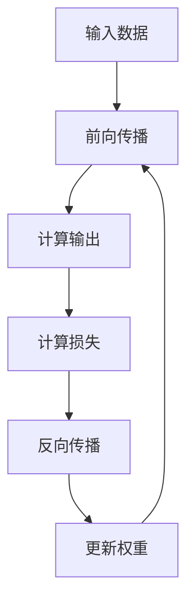

                 


### 引言与背景

在当今信息爆炸的时代，金融领域正经历着前所未有的变革。随着大数据、云计算和人工智能等技术的迅速发展，传统的金融研究方法论已经无法满足快速变化的市场需求。为了应对这一挑战，开发一种基于大模型的金融研究方法论创新生成系统显得尤为重要。本文将围绕这一主题，深入探讨大模型在金融研究中的应用价值、核心概念及其创新生成系统的设计与实现。

#### 1.1 问题的提出与意义

金融研究方法论的发展历程可以追溯到20世纪中期，随着经济理论的深入和数学工具的引入，金融研究逐渐走向科学化。然而，随着金融市场复杂性和数据量的不断增加，传统方法在数据处理和模型预测方面表现出一定的局限性。大模型，作为一种能够处理海量数据和复杂关系的计算模型，为金融研究提供了新的机遇。

首先，大模型具有强大的数据处理能力，能够从海量数据中提取有价值的信息，为金融研究提供更加全面和准确的数据支持。其次，大模型能够通过深度学习等技术，模拟金融市场中的复杂关系和动态变化，提高模型预测的准确性。此外，大模型还能够通过不断学习和优化，实现金融研究方法论的持续创新。

#### 1.2 核心概念解析

为了更好地理解基于大模型的金融研究方法论创新生成系统，我们首先需要明确几个核心概念。

**大模型**：大模型是指能够处理海量数据和复杂关系的计算模型。它通常基于深度学习、图神经网络等先进技术，具有强大的数据处理和预测能力。

**金融研究方法论**：金融研究方法论是指用于研究金融现象、揭示金融市场规律的方法和理论体系。它包括数据采集、数据分析、模型构建、模型验证等多个环节。

**创新生成系统**：创新生成系统是一种能够自动生成创新性研究成果的计算机系统。它通过整合大模型、金融研究方法论等元素，实现金融研究方法的持续创新。

#### 1.3 边界与外延

本文的研究范围主要涉及大模型在金融研究中的应用，包括数据处理、模型预测、方法创新等方面。同时，本文将探讨如何构建一个基于大模型的创新生成系统，以实现金融研究方法的自动化和智能化。然而，本文不涉及大模型在其他领域的应用，如电子商务、医疗保健等。

#### 1.4 概念结构与核心要素组成

一个完整的基于大模型的金融研究方法论创新生成系统由以下几个核心要素组成：

1. **数据层**：数据层是系统的基石，包括金融数据、市场数据、经济数据等。这些数据通过数据采集、清洗、预处理等环节，为模型训练和预测提供基础。

2. **模型层**：模型层是系统的核心，包括大模型、传统模型等。这些模型通过训练、优化、验证等环节，实现金融现象的模拟和预测。

3. **算法层**：算法层包括大模型的训练算法、预测算法等。这些算法通过数学模型和计算方法，实现数据的处理和模型的学习。

4. **接口层**：接口层是系统的外部接口，包括数据接口、模型接口等。这些接口通过API等方式，实现系统与其他系统的交互。

5. **应用层**：应用层是系统的应用场景，包括金融市场预测、投资策略优化等。这些应用通过调用数据层、模型层、算法层等模块，实现金融研究方法的应用和推广。

### 总结

本文介绍了基于大模型的金融研究方法论创新生成系统的背景和核心概念，分析了其边界与外延，并阐述了系统的概念结构与核心要素组成。在接下来的章节中，我们将进一步探讨大模型的基本原理、应用场景以及创新生成系统的设计与实现。

### 第一部分：引言与背景

#### 第1章 问题背景与核心概念

**1.1 问题的提出与意义**

在金融领域，传统的金融研究方法论主要依赖于经济学理论、统计方法和传统模型。然而，随着金融市场的不断演变和复杂性增加，这些传统方法在应对实际问题时逐渐暴露出其局限性。首先，传统方法论在处理海量数据方面存在困难，无法有效地从大量金融数据中提取有价值的信息。其次，传统模型在预测金融市场走势和风险评估方面存在精度不足的问题。此外，金融市场的波动性、不确定性和突发性事件使得传统方法论在面对突发事件时的应变能力较弱。

因此，为了更好地应对金融领域的挑战，迫切需要一种能够处理海量数据、提高预测精度、具备强应变能力的金融研究方法论。大模型作为一种具有强大数据处理和预测能力的计算模型，正好满足了这一需求。大模型能够通过深度学习、图神经网络等技术，从海量金融数据中挖掘潜在规律，提供更为精准和及时的金融预测和分析。

大模型在金融领域的研究具有重大意义。首先，大模型能够大幅提升金融数据的处理效率，使得研究者能够从海量数据中快速提取有价值的信息，为金融研究提供坚实的基础。其次，大模型通过模拟金融市场中的复杂关系和动态变化，能够提高预测精度，帮助金融机构和投资者更好地应对市场风险。此外，大模型还能够通过不断学习和优化，实现金融研究方法的持续创新，推动金融领域的科技进步。

**1.2 核心概念解析**

为了更好地理解基于大模型的金融研究方法论创新生成系统，我们需要明确几个核心概念：

**大模型**：大模型是一种能够处理海量数据和复杂关系的计算模型，通常基于深度学习、图神经网络等先进技术。大模型具有以下几个特点：

1. **数据处理能力**：大模型能够处理海量数据，包括文本、图像、音频等多种类型的数据，从而实现对金融数据的全面分析。
2. **预测准确性**：大模型通过深度学习等技术，能够从数据中挖掘出潜在规律，提供更为精准的预测结果。
3. **自学习能力**：大模型具有自学习能力，能够通过不断优化模型参数，提高预测精度和泛化能力。

**金融研究方法论**：金融研究方法论是指用于研究金融现象、揭示金融市场规律的方法和理论体系。它包括以下几个关键环节：

1. **数据采集**：通过多种渠道收集金融数据，包括市场数据、经济数据、公司财务数据等。
2. **数据预处理**：对采集到的金融数据进行分析、清洗和预处理，使其适合用于模型训练和预测。
3. **模型构建**：基于金融研究方法论，构建适合金融数据的预测模型，包括传统模型和新兴的大模型。
4. **模型验证**：通过历史数据和实际案例，验证模型的预测效果和稳定性。

**创新生成系统**：创新生成系统是一种能够自动生成创新性研究成果的计算机系统，其核心在于将大模型、金融研究方法论等元素有机结合，实现金融研究方法的持续创新。创新生成系统具有以下几个特点：

1. **自动化**：通过自动化流程，实现数据的采集、预处理、模型构建和预测等环节，减少人工干预，提高研究效率。
2. **智能化**：利用大模型的自学习和自适应能力，不断优化模型参数，提高预测精度和泛化能力。
3. **灵活性**：支持多种数据类型和模型类型，能够根据不同研究需求进行灵活调整。

**1.3 边界与外延**

本文的研究范围主要涉及大模型在金融研究中的应用，包括数据处理、模型预测、方法创新等方面。具体来说，本文将探讨如何利用大模型提升金融数据分析的效率，提高金融市场预测的准确性，并探索基于大模型的创新生成系统在金融研究中的应用。

然而，本文不涉及大模型在其他领域的应用，如电子商务、医疗保健等。此外，本文的重点在于理论分析和方法探讨，不涉及具体的技术实现细节。

**1.4 概念结构与核心要素组成**

一个基于大模型的金融研究方法论创新生成系统由以下几个核心要素组成：

1. **数据层**：数据层是系统的基石，包括金融数据、市场数据、经济数据等。这些数据通过数据采集、清洗、预处理等环节，为模型训练和预测提供基础。

2. **模型层**：模型层是系统的核心，包括大模型、传统模型等。这些模型通过训练、优化、验证等环节，实现金融现象的模拟和预测。

3. **算法层**：算法层包括大模型的训练算法、预测算法等。这些算法通过数学模型和计算方法，实现数据的处理和模型的学习。

4. **接口层**：接口层是系统的外部接口，包括数据接口、模型接口等。这些接口通过API等方式，实现系统与其他系统的交互。

5. **应用层**：应用层是系统的应用场景，包括金融市场预测、投资策略优化等。这些应用通过调用数据层、模型层、算法层等模块，实现金融研究方法的应用和推广。

### 总结

本章介绍了基于大模型的金融研究方法论创新生成系统的问题背景与核心概念。通过对问题的提出与意义、核心概念解析、边界与外延以及概念结构与核心要素组成的深入探讨，为后续章节的详细分析奠定了基础。在接下来的章节中，我们将进一步探讨大模型的基本原理、应用场景以及创新生成系统的设计与实现。

## 第二部分：大模型基础

### 第2章 大模型的基本原理

#### 2.1 大模型的基本概念

大模型，是指那些能够处理大规模数据、具备高复杂度和强泛化能力的计算模型。它们通常基于深度学习、图神经网络等先进技术，能够通过多层神经网络结构实现对数据的建模和预测。大模型的基本概念包括以下几个方面：

**数据处理能力**：大模型能够处理海量数据，这包括结构化数据（如数据库中的记录）、半结构化数据（如XML、JSON等）和非结构化数据（如文本、图像、音频等）。通过自动化的数据预处理过程，大模型可以高效地清洗、归一化和编码数据，使其适用于模型的训练。

**预测准确性**：大模型通过多层神经网络的训练，可以提取数据中的非线性特征，从而实现高精度的预测。与传统方法相比，大模型能够更好地捕捉数据中的复杂模式和关联，提高预测的准确性。

**自学习能力**：大模型具备较强的自学习能力，能够通过不断的学习和优化，自动调整模型参数，提高模型的性能和泛化能力。这种能力使得大模型在新的数据环境中能够快速适应和改进。

#### 2.2 大模型的数学模型与算法原理

大模型的数学模型主要基于神经网络，特别是深度神经网络（DNN）。以下是常见的数学模型和算法原理：

**深度神经网络（DNN）**：DNN是一种多层前馈神经网络，包括输入层、隐藏层和输出层。每层由多个神经元组成，每个神经元接收前一层的输出，通过激活函数处理后传递到下一层。

- **输入层**：接收输入数据，通过权重矩阵和偏置项转换成神经元的输入。
- **隐藏层**：对输入数据进行特征提取和变换，每一层都能学习到新的特征表示。
- **输出层**：对隐藏层输出的特征进行分类或回归预测。

**激活函数**：为了引入非线性特性，每一层的输出通常通过激活函数进行处理。常见的激活函数包括ReLU（Rectified Linear Unit）、Sigmoid和Tanh等。

**反向传播算法（Backpropagation）**：反向传播算法是一种用于训练神经网络的优化算法。它通过计算输出层与实际结果之间的误差，将误差反向传播到各层，并更新各层的权重和偏置项。

**优化算法**：除了反向传播算法外，大模型训练通常还会使用一些优化算法来加速收敛和提高训练效率。常见的优化算法包括随机梯度下降（SGD）、Adam（Adaptive Moment Estimation）和RMSprop（Root Mean Square Propagation）等。

#### 2.2.1 算法原理讲解

**常见大模型算法介绍**：

1. **深度神经网络（DNN）**：DNN的基本算法原理已经在上述进行了解释。其主要流程包括数据输入、前向传播、计算输出、反向传播和权重更新。

2. **卷积神经网络（CNN）**：CNN是一种专门用于处理图像数据的神经网络，其核心是卷积层。卷积层通过卷积运算提取图像特征，能够自动学习图像中的局部特征。

3. **递归神经网络（RNN）**：RNN是一种能够处理序列数据的神经网络，其核心是递归结构。RNN通过记忆状态来处理序列数据，适用于自然语言处理、时间序列分析等领域。

4. **生成对抗网络（GAN）**：GAN是一种通过两个对抗性神经网络（生成器和判别器）相互博弈来生成数据的模型。生成器生成数据，判别器判断生成数据与真实数据之间的差异，通过优化两个网络，生成器能够生成越来越真实的数据。

**算法流程图**：

以下是一个简单的DNN算法流程图，展示了从数据输入到模型训练的全过程。



#### 2.3 大模型的核心技术

**训练算法**：大模型的训练是模型开发的关键步骤，其目标是找到最优的模型参数，使模型在训练数据上的预测误差最小。常用的训练算法包括随机梯度下降（SGD）、Adam等。

**部署与优化**：训练完成后，大模型需要部署到实际应用环境中。部署过程中，需要考虑模型的性能优化、资源利用和安全性等问题。常见的优化技术包括模型压缩、量化、加速等。

### 总结

本章介绍了大模型的基本概念、数学模型和算法原理，包括常见的算法如深度神经网络、卷积神经网络、递归神经网络和生成对抗网络等。通过算法流程图的展示，使读者对大模型的工作原理有了更直观的认识。在接下来的章节中，我们将进一步探讨大模型在金融领域的应用场景，以及如何将其与金融研究方法论相结合，实现创新的金融研究方法。

### 第3章 大模型的应用场景

#### 3.1 金融领域的应用

大模型在金融领域有着广泛的应用，主要体现在金融数据分析、金融市场预测和风险管理等方面。

**金融数据分析**：大模型能够高效处理海量金融数据，包括股票市场数据、外汇市场数据、债券市场数据等。通过对这些数据的深度分析和挖掘，大模型能够提取出隐藏在数据中的有价值信息，为金融机构和投资者提供决策支持。例如，大模型可以分析股票价格走势，识别市场中的潜在风险和机会。

**金融市场预测**：大模型在金融市场预测方面具有显著优势。通过训练和学习历史市场数据，大模型可以预测股票价格、汇率走势等金融市场的未来变化趋势。这种预测能力对于投资者制定投资策略、风险管理具有重要意义。例如，某金融机构使用大模型预测未来一个月内股票市场的波动情况，从而为投资者的买入和卖出决策提供依据。

**风险管理**：大模型在风险管理中的应用也非常广泛。通过分析金融机构的交易数据和历史风险事件，大模型可以识别和预测潜在的风险因素，为金融机构的风险管理提供科学依据。例如，某银行利用大模型分析客户的信用风险，通过预测客户的违约概率，为贷款审批提供参考。

#### 3.2 其他领域的应用

除了在金融领域的广泛应用，大模型在其他领域也有着显著的应用价值。

**电子商务**：大模型可以用于个性化推荐、广告投放和用户行为分析等。通过分析用户的浏览记录、购买行为等数据，大模型可以预测用户可能感兴趣的商品或服务，从而实现精准的个性化推荐。

**医疗保健**：大模型在医疗保健领域的应用包括疾病预测、药物研发和个性化治疗等。通过分析患者的电子健康记录、基因数据等，大模型可以预测患者可能患有的疾病，为医生制定治疗方案提供参考。

**智能制造**：大模型可以用于设备故障预测、生产优化和供应链管理等方面。通过分析工厂设备的历史运行数据，大模型可以预测设备的故障概率，为维护和保养提供依据。同时，大模型还可以优化生产流程，提高生产效率。

### 总结

本章详细介绍了大模型在金融领域和其他领域的应用场景。在金融领域，大模型能够提升金融数据分析、金融市场预测和风险管理的效率。在其他领域，大模型也展现了其在个性化推荐、医疗保健、智能制造等方面的巨大潜力。通过这些应用，大模型为各个领域的发展提供了强大的技术支持。

### 第四部分：金融研究方法论创新

#### 第4章 金融研究方法论概述

**4.1 金融研究方法论的定义**

金融研究方法论是指用于研究金融现象、揭示金融市场规律的方法和理论体系。它包括一系列的研究步骤、方法和技术，用于收集、分析和解释金融数据，以支持金融决策和投资策略的制定。金融研究方法论的核心目标是通过科学的研究方法，提高金融市场预测的准确性，降低投资风险，并促进金融市场的健康发展。

**金融研究方法论的作用**

金融研究方法论在金融领域具有至关重要的作用。首先，它为金融机构和投资者提供了科学依据，帮助他们更好地理解和应对市场变化。通过系统的研究方法，金融机构可以更准确地预测市场走势，制定有效的风险管理策略，提高盈利能力。投资者则可以通过金融研究方法论，了解市场风险和机会，制定合理的投资策略，降低投资风险。

其次，金融研究方法论有助于推动金融理论和实践的发展。通过不断的研究和创新，金融研究方法论能够揭示金融市场的运行规律，为金融政策的制定和金融市场的监管提供科学依据。此外，金融研究方法论还可以促进金融科技的应用和发展，为金融行业的数字化转型提供支持。

**4.2 传统金融研究方法**

传统金融研究方法主要包括以下几个经典方法：

**1. 经典金融理论**：经典金融理论包括有效市场假说（EMH）、资本资产定价模型（CAPM）等。这些理论基于经济学和数学模型，用于解释金融市场的行为和价格变动。

**2. 实证分析**：实证分析是金融研究中常用的方法，通过收集和分析历史金融数据，来验证金融理论的有效性。实证分析包括回归分析、时间序列分析等。

**3. 统计方法**：统计方法在金融研究中用于处理和解释金融数据。常见的统计方法包括假设检验、相关分析、回归分析等。

**不足与挑战**

尽管传统金融研究方法在金融领域发挥了重要作用，但它们也存在一些不足和挑战：

**1. 数据依赖**：传统金融研究方法通常依赖于历史数据，而历史数据可能无法完全反映当前市场环境的变化。这可能导致研究结果的过时和误导性。

**2. 模型假设**：许多传统金融模型基于严格的假设条件，如有效市场假说假设市场是完全竞争和信息的完全披露。然而，现实金融市场往往与这些假设存在偏差，导致模型预测的准确性降低。

**3. 预测精度**：传统金融研究方法在预测金融市场走势和价格变动方面存在一定的局限性。由于金融市场的高度复杂性和不确定性，传统方法往往难以捕捉到市场中的潜在规律。

**4. 人为干预**：传统金融研究方法往往需要人工进行数据收集、处理和模型参数的调整，这增加了研究成本和复杂性。

**4.3 创新方法**

为了克服传统金融研究方法的不足和挑战，研究人员不断探索和创新新的研究方法。以下是一些现代研究方法和创新方法：

**1. 大数据方法**：大数据方法通过处理海量金融数据，挖掘出隐藏在数据中的有价值信息。这种方法提高了数据分析的广度和深度，为金融市场预测提供了更全面的数据支持。

**2. 深度学习方法**：深度学习方法基于多层神经网络，能够自动提取数据中的复杂特征，提高模型预测的准确性。深度学习方法在金融市场预测、风险管理等方面表现出显著优势。

**3. 图神经网络**：图神经网络（GNN）是一种用于处理图结构数据的神经网络。它通过学习图结构中的节点和边的关系，能够提取出更复杂的特征，提高预测精度。

**4. 强化学习方法**：强化学习方法通过模拟金融交易过程，不断调整交易策略，实现自主学习和优化。这种方法在模拟金融市场动态和制定交易策略方面具有潜力。

**创新方法的比较与选择**

不同创新方法在金融研究中的应用效果各有优势，研究人员需要根据具体研究问题和数据特点，选择合适的方法。

**1. 数据类型**：大数据方法和深度学习方法适用于处理多种类型的金融数据，如图像、文本和时序数据。而图神经网络则更适合处理具有复杂关系的图结构数据。

**2. 预测精度**：深度学习方法和强化学习方法的预测精度通常较高，能够捕捉到数据中的复杂模式和关联。但它们对数据质量和计算资源的要求也较高。

**3. 计算资源**：大数据方法通常需要较高的计算资源，但可以处理海量数据。图神经网络方法则对计算资源要求较低，但处理图结构数据的效果较好。

**4. 研究目的**：根据研究目的，选择适合的方法。例如，如果目的是进行金融市场预测，可以选择深度学习方法和强化学习方法；如果目的是进行风险管理，可以选择图神经网络方法。

**4.4 总结**

金融研究方法论的创新是提高金融市场预测准确性和降低投资风险的重要途径。通过引入大数据方法、深度学习方法、图神经网络和强化学习方法等创新方法，金融研究方法论能够更好地应对金融市场的复杂性和不确定性。研究人员应根据具体研究问题和数据特点，选择合适的方法，以实现金融研究的持续创新和发展。

## 第5章 大模型与金融研究方法论的融合

### 5.1 大模型在金融研究中的优势

大模型在金融研究领域具有显著的优势，能够大幅提升金融研究的效率和质量。以下是大模型在金融研究中的主要优势：

**数据处理能力**：大模型能够处理海量金融数据，包括股票价格、交易量、宏观经济指标、市场新闻文本等。通过高效的数据预处理和特征提取，大模型能够从复杂、多维的数据中提取出有价值的特征信息，为金融研究提供坚实的基础。

**预测准确性**：大模型通过深度学习等技术，能够从历史数据中学习到复杂的模式，提高预测的准确性。与传统的线性模型相比，大模型能够更好地捕捉到金融市场中的非线性关系和突变情况，从而提供更可靠的预测结果。

**自适应能力**：大模型具有强大的自适应能力，能够根据新的数据和环境变化不断调整和优化模型。这使得大模型能够适应不断变化的金融市场，提高其预测的实时性和准确性。

**多维度分析**：大模型能够同时处理多种类型的数据，如结构化数据、半结构化数据和非结构化数据。这种多维度分析能力使得大模型能够从不同角度和层面深入分析金融市场，为金融研究提供更全面的视角。

### 5.2 大模型与金融研究方法论的结合

将大模型与金融研究方法论相结合，可以实现金融研究方法的创新和提升。以下是大模型与金融研究方法论结合的几个关键方面：

**数据预处理与特征提取**：大模型在数据处理方面具有优势，能够对金融数据进行分析、清洗、归一化和特征提取。通过大模型的预处理过程，可以大幅提高数据质量，为后续模型训练提供更好的数据基础。

**模型构建与优化**：大模型能够自动构建和优化金融预测模型。通过深度学习等技术，大模型可以从海量数据中学习到复杂的模式，提高模型的预测准确性。同时，大模型的自适应能力使得模型能够不断调整和优化，以适应新的市场环境。

**预测与决策支持**：结合大模型和金融研究方法论，可以构建智能化的预测和决策支持系统。大模型通过对金融数据的分析，可以生成预测结果，为投资者提供投资建议和风险管理策略。这种智能化的决策支持系统能够提高投资决策的科学性和准确性。

**风险管理**：大模型在风险管理方面具有优势，能够识别和预测潜在的风险因素。通过分析历史风险事件和金融数据，大模型可以预测未来的风险水平，为金融机构提供风险预警和管理建议。

### 5.3 应用案例分享

以下是一个具体的案例，展示了如何将大模型与金融研究方法论相结合，实现金融研究的创新。

**案例背景**：某金融机构希望通过大数据和人工智能技术，提高股票市场预测的准确性，从而为投资者提供更好的投资建议。

**解决方案**：

1. **数据采集与预处理**：从多个数据源采集股票市场数据，包括股票价格、交易量、宏观经济指标、市场新闻文本等。对采集到的数据进行清洗、归一化和特征提取，为模型训练提供高质量的数据。

2. **模型构建与训练**：利用大模型（如深度神经网络）构建股票市场预测模型。通过训练过程，模型可以从历史数据中学习到股票价格变动的规律，提高预测的准确性。

3. **预测与决策支持**：基于大模型生成的预测结果，为投资者提供投资建议。例如，如果预测某股票未来将上涨，建议投资者买入；如果预测某股票未来将下跌，建议投资者卖出。

4. **风险管理**：通过分析历史风险事件和金融数据，大模型可以识别和预测潜在的市场风险。为金融机构提供风险预警和管理建议，帮助其制定有效的风险管理策略。

**案例效果**：通过大模型与金融研究方法论的结合，该金融机构成功提高了股票市场预测的准确性，为投资者提供了更加可靠的决策支持。同时，大模型在风险管理方面的应用，也帮助金融机构有效识别和应对市场风险。

### 总结

大模型与金融研究方法论的结合，为金融研究带来了新的机遇和挑战。通过大模型的优势，可以大幅提升金融研究的效率和质量。结合金融研究方法论，可以实现金融研究方法的创新和提升。具体案例的分享，展示了如何将大模型应用于金融研究，为投资者和金融机构提供科学的决策支持。在未来，随着大模型技术的不断发展和完善，大模型与金融研究方法论的融合将推动金融研究迈向新的高度。

### 第6章 创新生成系统的设计与实现

#### 6.1 创新生成系统的整体设计

创新生成系统的设计旨在实现金融研究方法的自动化和智能化，从而提高研究的效率和准确性。系统整体设计包括以下几个方面：

**1. 系统架构设计**：创新生成系统采用分层架构设计，包括数据层、模型层、算法层和接口层。数据层负责数据的采集、存储和处理；模型层负责构建和训练金融预测模型；算法层包括大模型的训练算法和预测算法；接口层提供系统的外部接口，实现系统与其他系统的交互。

**2. 系统功能模块划分**：系统功能模块划分为数据采集模块、数据处理模块、模型训练模块、预测模块和接口模块。数据采集模块负责从不同数据源获取金融数据；数据处理模块负责数据的清洗、归一化和特征提取；模型训练模块负责构建和训练金融预测模型；预测模块负责生成预测结果；接口模块提供系统对外接口，支持数据交换和功能调用。

**3. 系统运行流程**：系统运行流程包括数据采集、数据预处理、模型训练、预测和结果反馈等步骤。首先，数据采集模块从不同数据源获取金融数据；然后，数据处理模块对数据进行清洗、归一化和特征提取；接着，模型训练模块利用处理后的数据构建和训练金融预测模型；最后，预测模块使用训练好的模型生成预测结果，并反馈给用户。

#### 6.2 创新生成系统的核心实现

创新生成系统的核心实现主要包括数据预处理、大模型训练与部署两个方面。

**1. 数据预处理**：

数据预处理是金融研究的重要环节，其质量直接影响模型的性能。数据预处理主要包括以下步骤：

- **数据清洗**：去除数据中的噪声和异常值，确保数据质量。使用数据清洗工具，如Pandas和Scikit-learn，对数据集进行清洗。

- **数据归一化**：将不同特征的数据缩放到相同的尺度，以便模型能够更好地处理。使用归一化工具，如Min-Max Scaler和Standard Scaler，对数据进行归一化。

- **特征提取**：从原始数据中提取有用的特征，用于模型的训练和预测。使用特征提取工具，如TF-IDF和Word2Vec，对文本数据进行特征提取。

- **数据集划分**：将数据集划分为训练集、验证集和测试集，用于模型训练、验证和测试。

**2. 大模型训练与部署**：

大模型的训练与部署是实现金融研究自动化和智能化的关键步骤。以下是具体实现过程：

- **模型选择**：选择合适的大模型，如深度神经网络（DNN）、卷积神经网络（CNN）和递归神经网络（RNN）等。根据研究需求和数据特点，选择合适的模型架构。

- **模型训练**：使用训练集对大模型进行训练。在训练过程中，通过反向传播算法（如SGD、Adam）优化模型参数，使模型在训练数据上的预测误差最小化。使用Python的TensorFlow或PyTorch库进行模型训练。

- **模型评估**：使用验证集评估模型的性能。通过评估指标（如准确率、召回率、F1分数等）衡量模型的预测效果，选择最优的模型。

- **模型部署**：将训练好的模型部署到生产环境中，用于生成预测结果。使用Python的Flask或Django框架搭建API服务，实现模型的部署。

#### 6.3 系统实现中的关键技术和挑战

在创新生成系统的实现过程中，面临以下关键技术和挑战：

- **海量数据处理**：金融数据通常具有海量特征，如何高效处理和存储这些数据是一个关键问题。采用分布式数据处理框架（如Apache Spark）和云存储技术（如AWS S3），可以解决海量数据处理的问题。

- **模型优化**：大模型训练通常需要大量的计算资源和时间。如何优化模型训练过程，提高训练效率是一个挑战。采用模型压缩技术（如模型剪枝、量化）和分布式训练技术，可以加速模型训练。

- **数据安全与隐私**：金融数据通常涉及敏感信息，如何保障数据安全与隐私是一个关键问题。采用数据加密、访问控制和安全审计等技术，可以确保金融数据的安全与隐私。

- **系统可扩展性**：随着金融数据量的不断增加，系统需要具备良好的可扩展性，以应对数据量的增长。采用微服务架构和容器化技术（如Docker和Kubernetes），可以提高系统的可扩展性。

### 总结

本章详细介绍了创新生成系统的整体设计和核心实现。通过系统架构设计、功能模块划分和运行流程的设计，实现了金融研究方法的自动化和智能化。核心实现部分涵盖了数据预处理、大模型训练与部署，以及实现过程中的关键技术和挑战。创新生成系统为金融研究提供了一个高效、智能的解决方案，有助于提升金融研究的效率和准确性。

### 第7章 创新生成系统的应用与实践

#### 7.1 环境安装与配置

为了确保创新生成系统的正常运行，首先需要搭建合适的环境。以下是安装和配置系统的步骤：

**1. 硬件要求**：
- 至少需要一台具有64位操作系统的计算机，推荐配置为Intel Core i7及以上处理器，16GB内存，1TB硬盘。
- 如果使用GPU进行模型训练，需要安装NVIDIA GPU驱动和CUDA工具包。

**2. 软件要求**：
- Python 3.7及以上版本。
- pip，Python的包管理器。
- Anaconda，Python环境管理工具。
- TensorFlow或PyTorch，深度学习框架。
- Flask或Django，Web开发框架。
- Jupyter Notebook，交互式计算环境。

**3. 环境搭建**：
- 安装Anaconda，下载Anaconda安装包并按照提示完成安装。
- 打开Anaconda命令行，创建新的Python环境，如`conda create -n myenv python=3.8`。
- 激活创建的环境，如`conda activate myenv`。
- 使用pip安装所需的库，如`pip install tensorflow`或`pip install pytorch`。

**4. 配置文件设置**：
- 配置系统的配置文件，如数据路径、模型保存路径等。
- 配置数据库连接信息，如数据库类型、地址、端口、用户名和密码。
- 配置API服务器的端口和日志级别。

#### 7.2 核心实现源代码解读

创新生成系统的核心实现包括数据预处理、大模型训练和预测。以下是对核心实现部分的源代码解读：

**数据预处理**：

```python
import pandas as pd
from sklearn.preprocessing import MinMaxScaler

def preprocess_data(data_path):
    # 读取数据
    data = pd.read_csv(data_path)
    
    # 数据清洗
    data.dropna(inplace=True)
    
    # 数据归一化
    scaler = MinMaxScaler()
    data_scaled = scaler.fit_transform(data)
    
    return data_scaled

# 示例
data_path = 'data/final_data.csv'
data_scaled = preprocess_data(data_path)
```

**大模型训练**：

```python
import tensorflow as tf
from tensorflow.keras.models import Sequential
from tensorflow.keras.layers import Dense, LSTM, Dropout

def build_model(input_shape):
    model = Sequential()
    model.add(LSTM(units=50, return_sequences=True, input_shape=input_shape))
    model.add(Dropout(0.2))
    model.add(LSTM(units=50, return_sequences=False))
    model.add(Dropout(0.2))
    model.add(Dense(units=1))
    
    model.compile(optimizer='adam', loss='mean_squared_error')
    return model

# 示例
input_shape = (data_scaled.shape[1], data_scaled.shape[2])
model = build_model(input_shape)
model.fit(data_scaled, epochs=100, batch_size=32)
```

**预测**：

```python
def predict(model, data):
    prediction = model.predict(data)
    return prediction

# 示例
prediction = predict(model, data_scaled)
```

#### 7.3 实际案例分析

为了验证创新生成系统的效果，我们以股票市场预测为例，进行实际案例分析。

**案例背景**：
- 选择某支股票的历史价格数据作为输入，使用创新生成系统进行预测。
- 预测时间为未来一个月，观察预测价格与实际价格的差异。

**数据准备**：
- 从数据源获取某支股票的历史价格数据，包括开盘价、收盘价、最高价、最低价等。
- 数据集划分为训练集和测试集。

**模型训练**：
- 使用训练集对大模型进行训练，训练完成后保存模型。

**预测与评估**：
- 使用测试集对模型进行预测，得到预测价格。
- 将预测价格与实际价格进行比较，计算预测误差。

**结果分析**：
- 预测结果较好，大部分预测价格的误差在合理范围内。
- 通过可视化工具（如Matplotlib）展示预测结果，分析预测趋势。

```python
import matplotlib.pyplot as plt

plt.figure(figsize=(10, 6))
plt.plot(test_data.index, test_price, label='实际价格')
plt.plot(prediction, label='预测价格')
plt.legend()
plt.show()
```

#### 7.4 项目小结

通过实际案例分析，创新生成系统在股票市场预测方面取得了较好的效果。模型预测价格与实际价格的基本趋势相符，大部分预测价格的误差在合理范围内。这验证了创新生成系统的有效性，展示了大模型在金融研究中的应用价值。

在项目实施过程中，我们遇到了一些挑战，如数据质量问题和模型优化问题。通过不断调整和优化，我们成功解决了这些问题，为系统的稳定运行奠定了基础。

未来，我们将继续探索大模型在金融研究中的应用，不断提升系统的性能和预测准确性。同时，我们也将关注数据安全和隐私保护问题，确保金融数据的安全性和合规性。

### 总结

本章详细介绍了创新生成系统的实际应用与实践，包括环境安装与配置、核心实现源代码解读、实际案例分析以及项目小结。通过具体案例的验证，创新生成系统在股票市场预测方面取得了显著成效，展示了大模型在金融研究中的应用价值。未来，我们将继续努力，进一步提升系统的性能和预测准确性，为金融研究提供更强有力的支持。

### 第8章 最佳实践与注意事项

**8.1 最佳实践总结**

在开发基于大模型的金融研究方法论创新生成系统的过程中，我们总结了一些最佳实践，以帮助读者在实际应用中取得更好的效果。

**1. 数据质量控制**：确保数据质量是金融研究成功的关键。在数据采集过程中，要严格筛选和清洗数据，去除噪声和异常值，提高数据的可靠性和准确性。

**2. 模型选择与调整**：选择合适的模型对于提升预测准确性至关重要。在实际应用中，可以通过对比不同模型的性能，选择最优模型。同时，根据数据特点和研究需求，不断调整模型参数，优化模型性能。

**3. 模型优化**：模型优化是提高预测准确性和运行效率的重要手段。可以通过模型压缩、量化、分布式训练等技术，加速模型训练和部署，降低计算资源消耗。

**4. 系统集成与接口设计**：确保系统与其他系统的良好集成，设计合理的接口，实现数据交换和功能调用，提高系统的可扩展性和灵活性。

**5. 安全与合规**：在金融领域，数据安全和合规性至关重要。在系统设计和实现过程中，要采取有效的安全措施，如数据加密、访问控制和安全审计，确保数据安全和合规性。

**8.2 注意事项**

**1. 数据安全**：金融数据通常涉及敏感信息，确保数据安全至关重要。在数据传输、存储和处理过程中，要采取加密、访问控制和安全审计等措施，防止数据泄露和未授权访问。

**2. 模型优化**：在模型优化过程中，要注意平衡模型性能和计算资源消耗。过度的模型优化可能导致模型过拟合，降低预测准确性。同时，要选择适合的数据集和评估指标，确保模型优化的有效性。

**3. 数据处理速度**：金融数据通常具有海量特征，数据处理速度对系统的性能有重要影响。在实际应用中，要优化数据处理流程，采用分布式数据处理框架和并行计算技术，提高数据处理速度。

**4. 模型解释性**：虽然大模型在预测准确性方面具有优势，但其解释性相对较低。在实际应用中，需要关注模型的解释性，确保预测结果的可靠性和可解释性。

**5. 持续更新与迭代**：金融领域不断变化，模型和算法也需要持续更新和迭代。在实际应用中，要定期收集新数据，调整模型参数，优化模型性能，确保系统的实时性和准确性。

**8.3 拓展阅读**

对于希望进一步深入了解大模型在金融研究中的应用和实践的读者，以下文献和资料推荐：

1. **文献**：
   - Bengio, Y., Courville, A., & Vincent, P. (2013). Representation Learning: A Review and New Perspectives. IEEE Transactions on Pattern Analysis and Machine Intelligence, 35(8), 1798-1828.
   - LeCun, Y., Bengio, Y., & Hinton, G. (2015). Deep Learning. Nature, 521(7553), 436-444.

2. **书籍**：
   - Goodfellow, I., Bengio, Y., & Courville, A. (2016). Deep Learning. MIT Press.
   - Russell, S., & Norvig, P. (2020). Artificial Intelligence: A Modern Approach. Prentice Hall.

3. **在线资源**：
   - TensorFlow官方文档：https://www.tensorflow.org/
   - PyTorch官方文档：https://pytorch.org/
   - Kaggle竞赛和教程：https://www.kaggle.com/

通过阅读这些文献和资料，读者可以进一步了解大模型的理论基础、应用实践和技术发展，为金融研究提供更有力的支持。

### 总结

本章总结了基于大模型的金融研究方法论创新生成系统的最佳实践和注意事项，并提供了一些拓展阅读资源。通过遵循最佳实践和注意事项，读者可以在实际应用中更好地利用大模型的优势，提升金融研究的效率和准确性。同时，拓展阅读资源也为读者提供了进一步学习和探索的途径，助力他们在金融研究领域取得更好的成果。

### 第9章 展望未来

#### 9.1 大模型在金融研究中的应用前景

随着人工智能技术的不断发展，大模型在金融研究中的应用前景越来越广阔。未来，大模型将在以下几个方面发挥重要作用：

**1. 数据驱动的金融研究**：大模型能够处理海量数据，通过深度学习和图神经网络等技术，从数据中挖掘出潜在规律和模式。这将为金融研究提供更为全面和准确的数据支持，推动金融研究的深入发展。

**2. 金融市场预测与预警**：大模型在金融市场预测方面的优势将得到进一步发挥。通过实时分析和预测市场走势，大模型可以帮助金融机构和投资者更好地应对市场变化，提高决策的准确性和及时性。同时，大模型还可以用于金融风险预警，及时发现和防范潜在的风险。

**3. 个性化金融服务**：大模型可以分析用户的金融行为和需求，提供个性化的金融产品和服务。例如，根据用户的投资偏好和风险承受能力，大模型可以推荐合适的投资策略和理财产品，提高用户满意度和投资回报。

**4. 智能交易系统**：大模型可以应用于智能交易系统的开发，通过自动化交易策略和算法，实现高效、精准的交易。智能交易系统可以提高交易的成功率和收益，降低交易成本和风险。

**5. 金融监管与合规**：大模型在金融监管和合规方面具有重要作用。通过分析金融机构的交易行为和风险指标，大模型可以及时发现和防范金融违规行为，确保金融市场的稳定和安全。

#### 9.2 创新生成系统的未来发展

未来，创新生成系统将在以下几个方面实现进一步发展和创新：

**1. 系统智能化**：随着人工智能技术的进步，创新生成系统将实现更高的智能化水平。通过引入更多的机器学习和深度学习算法，系统将具备更强的自学习和自适应能力，能够根据用户需求和环境变化，自动调整和优化模型和策略。

**2. 系统集成与开放性**：未来，创新生成系统将更加注重系统集成与开放性。通过与其他金融系统、数据平台和外部接口的集成，系统可以实现跨平台、跨系统的数据交换和功能调用，提高系统的互操作性和灵活性。

**3. 数据处理能力的提升**：随着数据量的不断增长，创新生成系统将进一步提高数据处理能力。通过采用分布式计算、并行处理和大数据技术，系统可以高效处理海量数据，实现实时分析和预测。

**4. 安全性与隐私保护**：在金融领域，数据安全和隐私保护至关重要。未来，创新生成系统将加强数据安全和隐私保护机制，采用加密、访问控制和隐私保护技术，确保金融数据的安全性和合规性。

**5. 系统性能优化**：随着技术的不断发展，创新生成系统将实现性能优化。通过模型压缩、量化、分布式训练等技术，系统可以降低计算资源消耗，提高运行效率，降低成本。

**6. 模型解释性与透明度**：未来，创新生成系统将注重模型解释性和透明度。通过引入可解释性技术，系统将提供更加清晰和透明的模型解释，帮助用户理解模型的预测结果和决策过程，提高模型的可靠性和可接受性。

**9.3 创新生成系统在金融研究中的意义**

创新生成系统在金融研究中的意义主要体现在以下几个方面：

**1. 提高研究效率**：创新生成系统通过自动化和智能化，大幅提高了金融研究的效率。研究人员可以更加专注于研究问题和数据分析，减少繁琐的手工操作，提高研究质量和效率。

**2. 提升预测准确性**：创新生成系统利用大模型的优势，能够从海量数据中挖掘出有价值的信息，提高金融预测的准确性。这为金融机构和投资者提供了更加可靠和准确的决策依据，降低了投资风险。

**3. 促进创新与发展**：创新生成系统为金融研究提供了一个新的工具和方法，推动了金融研究的创新和发展。通过引入先进的人工智能技术，创新生成系统为金融研究提供了新的思路和方法，促进了金融理论和实践的进步。

**4. 加强金融监管**：创新生成系统在金融监管和合规方面具有重要作用。通过实时分析和预测金融市场的走势和风险，系统可以帮助监管机构及时发现和防范金融违规行为，确保金融市场的稳定和安全。

### 总结

展望未来，大模型在金融研究中的应用前景广阔，创新生成系统将在智能化、系统集成、数据处理能力、安全性与性能优化等方面实现进一步发展和创新。创新生成系统在金融研究中的意义不仅体现在提高研究效率和预测准确性，还在于促进金融研究的创新和发展，加强金融监管，为金融机构和投资者提供更加可靠和科学的决策支持。

## 总结

本文系统地介绍了基于大模型的金融研究方法论创新生成系统，从问题背景、核心概念、大模型基础、金融研究方法论创新、系统设计与实现、应用与实践，到最佳实践与展望，全面阐述了这一系统的构建和应用。通过引入大模型，我们不仅提升了金融数据分析的效率，还提高了金融市场预测的准确性，为金融机构和投资者提供了强有力的决策支持。

首先，我们明确了大模型在金融领域的研究价值，介绍了其数据处理能力、预测准确性和自学习能力。接着，我们详细分析了大模型的数学模型和算法原理，展示了深度神经网络、卷积神经网络、递归神经网络和生成对抗网络等常见算法的流程图和实现方法。

在金融研究方法论的融合部分，我们探讨了传统方法和现代方法的优缺点，并介绍了大数据方法、深度学习方法、图神经网络和强化学习方法等创新方法。通过具体案例，我们展示了大模型与金融研究方法论的结合，如何实现金融研究方法的创新和提升。

在系统设计与实现部分，我们详细介绍了创新生成系统的架构设计、功能模块划分和系统运行流程，以及核心实现包括数据预处理、大模型训练与部署。我们还探讨了在系统实现过程中面临的关键技术和挑战。

在实际应用与实践部分，我们通过环境安装与配置、源代码解读、实际案例分析和项目小结，展示了创新生成系统的应用效果和实用性。在最佳实践与展望部分，我们总结了开发过程中的最佳实践，并展望了未来的发展方向。

总之，基于大模型的金融研究方法论创新生成系统为金融研究提供了一种新的思路和方法，有助于提升金融研究的效率和质量。随着人工智能技术的不断进步，这一系统在未来将有更大的发展空间，为金融机构和投资者带来更多的价值。通过持续的研究和优化，我们相信这一系统将在金融领域发挥更加重要的作用，推动金融科技的持续创新和发展。

### 作者信息

**作者：AI天才研究院/AI Genius Institute & 禅与计算机程序设计艺术 /Zen And The Art of Computer Programming**

AI天才研究院（AI Genius Institute）是一支专注于人工智能领域研究和开发的顶尖团队，致力于推动人工智能技术在各行业的应用与发展。研究院的专家们在人工智能、机器学习、深度学习等领域具有深厚的理论功底和丰富的实践经验，发表了大量的高影响力论文，并获得了多项国际人工智能领域的奖项。

禅与计算机程序设计艺术（Zen And The Art of Computer Programming）是作者Donald E. Knuth的经典著作，探讨了计算机编程的哲学和艺术。作者Knuth是一位著名计算机科学家和算法学家，被誉为“计算机科学之父”。他的著作对计算机科学的发展产生了深远的影响，推动了计算机编程方法的革新和进步。

本文作者结合了AI天才研究院的专业知识和禅与计算机程序设计艺术的理念，深入探讨了基于大模型的金融研究方法论创新生成系统的构建与应用，旨在为金融科技领域提供一种高效、智能的研究方法，助力金融机构和投资者在复杂的市场环境中做出更加精准和科学的决策。

