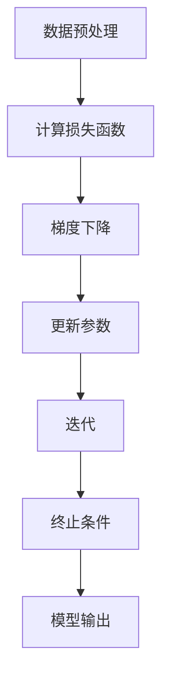
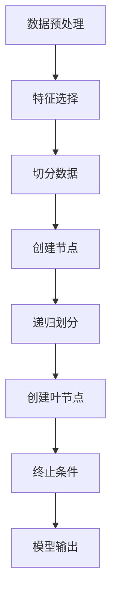
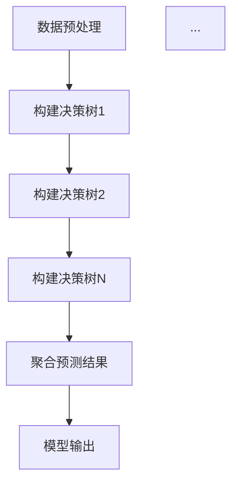
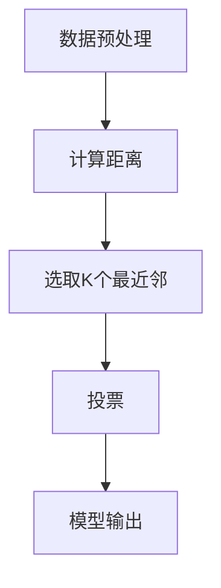
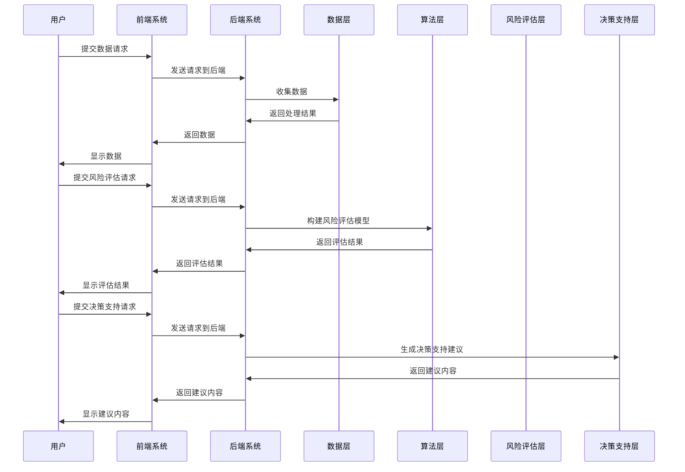

                 

### 第一部分：背景介绍

#### 第1章：问题背景与核心概念

### 1.1.1 问题背景

在当今的商业环境中，企业并购已经成为一种常见的战略手段。然而，企业并购的成功与否往往受到多种因素的影响，其中风险评估是关键的一环。传统的方法通常依赖于历史数据和统计分析，但这些方法往往难以应对不断变化的市场环境和复杂的企业特性。

### 1.1.2 问题描述

如何开发一个智能化的企业并购风险评估模型，以帮助企业在并购决策中降低风险、提高成功率，成为了一个亟待解决的问题。这个模型需要能够利用最新的技术和方法，如大数据分析、机器学习和深度学习等，来对企业并购进行全方位的风险评估。

### 1.1.3 问题解决

为了解决上述问题，本书将介绍如何开发一个智能化的企业并购风险评估模型。首先，我们将讨论企业并购风险评估的相关理论和实践，包括并购决策的流程、并购风险评估的关键指标和方法。接着，我们将介绍如何运用大数据分析和机器学习技术来构建并购风险评估模型。

### 1.1.4 边界与外延

本研究的边界主要在于智能化的企业并购风险评估模型的开发和应用，不包括其他类型的并购风险评估模型。同时，本研究的外延将涉及如何将智能化的企业并购风险评估模型应用于实际案例中，以验证其有效性和实用性。

### 1.1.5 概念结构与核心要素组成

本部分将详细阐述企业并购风险评估模型的核心概念结构，包括：

- **企业并购风险评估模型**：定义、基本原理和组成部分。
- **大数据分析**：数据收集、处理和分析的方法和技术。
- **机器学习**：常见算法、应用场景和优缺点。
- **深度学习**：神经网络架构、训练过程和应用领域。

## 第2章：核心概念与联系

### 2.1.1 企业并购风险评估模型原理

在本章中，我们将深入探讨企业并购风险评估模型的基本原理，包括并购风险评估的理论基础、数据来源和处理方法、模型构建过程和评估结果的应用。

### 2.1.2 概念属性特征对比表格

为了更清晰地理解不同概念之间的联系，我们将提供一个概念属性特征对比表格，列出企业并购风险评估模型中涉及的关键概念及其属性特征。

### 2.1.3 ER实体关系图架构

在本章的最后，我们将使用Mermaid语言绘制一个ER实体关系图，展示企业并购风险评估模型中各个实体之间的关系，以帮助读者更好地理解模型的结构和组成。

#### Mermaid ER图示例：

```mermaid
erDiagram
  Customer ||--o{ Order : "places" }
  Product ||--|| OrderItem : "contains"
```

此ER图表示了客户（Customer）与订单（Order）之间存在“places”关系，产品（Product）与订单项（OrderItem）之间存在“contains”关系。

---

**接下来的章节将详细探讨算法原理、数学模型和系统架构设计，以便全面了解并掌握开发智能化企业并购风险评估模型的方法和过程。**

---

在下一章中，我们将深入探讨企业并购风险评估的背景，包括其重要性、面临的挑战以及传统方法的局限性。这将为我们理解为什么需要开发智能化的企业并购风险评估模型提供清晰的背景和理论基础。接下来，我们将详细分析如何通过大数据分析和机器学习技术来构建这样一个模型，从而为企业在并购决策中提供有力的支持。

### 第1章：问题背景与核心概念

#### 1.1.1 问题背景

企业并购作为一种商业战略，已经深入人心，成为许多企业实现快速扩张和提升竞争力的有效手段。然而，企业并购过程并不是一帆风顺的，其成功与否受到多种因素的影响。其中，风险评估是并购决策过程中的关键环节。传统的企业并购风险评估主要依赖于历史数据、财务报表和统计分析等方法，但这些方法存在明显的局限性：

- **数据依赖性高**：传统风险评估方法依赖于历史数据，这些数据往往难以反映当前市场环境和未来趋势。
- **分析手段单一**：传统方法主要依赖于简单的统计分析，难以处理复杂的非结构化数据，如文本、图像和音频等。
- **缺乏前瞻性**：传统风险评估方法往往缺乏前瞻性，无法提前预测并购过程中可能出现的风险。
- **人为因素影响**：传统方法往往受到分析师的主观判断和经验影响，导致评估结果的不确定性和偏差。

为了克服传统方法的局限性，我们需要开发一个智能化的企业并购风险评估模型。这个模型将利用大数据分析、机器学习和深度学习等先进技术，通过分析海量数据来揭示潜在的风险因素，为并购决策提供科学依据。

#### 1.1.2 问题描述

开发一个智能化的企业并购风险评估模型，旨在通过以下方面解决当前传统方法的局限性：

- **多源数据融合**：整合来自不同来源的数据，如财务报表、市场报告、社交媒体数据和企业内部数据，实现全方位的风险评估。
- **自动化分析**：利用机器学习和深度学习算法，自动化处理和分析海量数据，减少人为干预，提高评估结果的准确性和一致性。
- **实时预测**：通过实时数据分析和预测模型，提前发现并购过程中可能出现的问题，为决策者提供及时的预警。
- **动态调整**：根据并购过程中实时收集到的反馈和数据，动态调整风险评估模型，确保评估结果的持续有效性。

因此，我们的目标是构建一个具备以下特点的智能化企业并购风险评估模型：

- **全面性**：能够涵盖并购决策过程中可能遇到的各种风险因素。
- **准确性**：通过先进的算法和大量数据训练，确保评估结果的准确性和可靠性。
- **实时性**：能够实时响应并购过程中的变化，为决策者提供及时的信息支持。
- **适应性**：能够根据不同企业和并购项目的特点，灵活调整评估模型，以适应多样化的需求。

通过这样的模型，企业可以更加科学、系统地评估并购风险，提高并购决策的成功率，从而实现战略目标的顺利达成。

#### 1.1.3 问题解决

为了解决上述问题，本书将介绍如何开发一个智能化的企业并购风险评估模型。具体步骤如下：

1. **理论框架搭建**：首先，我们将介绍企业并购风险评估的理论基础，包括并购决策的流程、并购风险评估的关键指标和方法。这将为我们后续的模型开发提供坚实的理论基础。
2. **数据来源与分析**：接着，我们将探讨如何收集和预处理并购相关的数据，包括财务数据、市场数据和企业内部数据等。我们将介绍大数据分析的方法和技术，如数据挖掘、文本分析和关联规则挖掘等，以提取有用的信息。
3. **算法选择与实现**：在数据准备完成后，我们将讨论常见的机器学习算法和深度学习算法，并选择合适的算法来构建风险评估模型。我们将详细介绍每种算法的原理和实现步骤，并通过实际案例展示如何应用这些算法。
4. **模型优化与评估**：为了提高模型的性能，我们将介绍如何进行模型优化和评估。我们将讨论模型参数调优、交叉验证和超参数调整等技术，以确保模型具有最佳的预测能力。
5. **应用与实践**：最后，我们将探讨如何将智能化的企业并购风险评估模型应用于实际案例中。我们将分析不同类型的企业并购案例，展示如何利用模型进行风险评估和决策支持，并通过实际案例分析验证模型的有效性和实用性。

通过以上步骤，我们希望能够为企业提供一套完整的智能化企业并购风险评估解决方案，助力企业在并购过程中降低风险、提高成功率。

#### 1.1.4 边界与外延

在本次研究中，我们的主要研究范围是智能化的企业并购风险评估模型。这意味着本研究将重点关注利用大数据分析和机器学习技术来开发评估模型的方法和步骤。以下是我们研究的边界和外延：

- **边界**：
  1. 不涉及传统风险评估模型的研究，如基于历史数据和统计分析的方法。
  2. 不涉及其他类型的并购风险评估模型，如基于博弈论和代理模型的方法。
  3. 不涉及企业并购决策的其他方面，如并购策略和谈判技巧。

- **外延**：
  1. 研究智能化的企业并购风险评估模型在不同行业和企业规模中的应用，以验证其通用性和适用性。
  2. 探讨如何将智能化的企业并购风险评估模型与其他决策支持工具集成，以提高并购决策的整体效能。
  3. 分析智能化的企业并购风险评估模型在应对新兴风险和挑战时的适应性和改进方向。

#### 1.1.5 概念结构与核心要素组成

企业并购风险评估模型是一个复杂的系统，涉及多个关键概念和要素。以下是对这些核心概念和要素的详细说明：

- **企业并购风险评估模型**：
  1. **定义**：企业并购风险评估模型是一个基于大数据分析和机器学习技术的系统，用于评估企业并购过程中可能遇到的风险。
  2. **基本原理**：该模型通过收集和分析与并购相关的各种数据，利用机器学习算法构建预测模型，对并购风险进行定量和定性评估。
  3. **组成部分**：
     - **数据收集模块**：负责收集来自不同来源的数据，包括财务报表、市场报告、企业内部数据和第三方数据。
     - **数据处理模块**：对收集到的数据进行清洗、转换和集成，生成适合分析的数据集。
     - **风险评估模块**：利用机器学习算法对数据进行训练，构建风险评估模型。
     - **预测与决策模块**：使用评估模型对并购风险进行预测，并提供决策支持。

- **大数据分析**：
  1. **数据收集与预处理**：从多个数据源收集数据，并对数据进行清洗、转换和集成，以生成高质量的数据集。
  2. **数据分析技术**：包括描述性统计分析、关联分析、聚类分析和分类分析等技术，用于挖掘数据中的潜在模式和关系。

- **机器学习**：
  1. **常见算法**：如线性回归、逻辑回归、决策树、随机森林和K-近邻算法等。
  2. **应用场景**：包括风险预测、趋势分析、异常检测等。
  3. **优缺点**：每种算法都有其适用的场景和局限性，需要根据具体需求进行选择。

- **深度学习**：
  1. **神经网络架构**：包括前向传播、反向传播和激活函数。
  2. **训练过程**：数据集划分、模型初始化、参数调整和模型优化。
  3. **应用领域**：如自然语言处理、计算机视觉、时间序列分析等。

通过对这些核心概念和要素的深入理解，我们可以更好地构建和优化智能化的企业并购风险评估模型，从而为企业并购决策提供强有力的支持。

### 第2章：核心概念与联系

#### 2.1 企业并购风险评估模型原理

企业并购风险评估模型是一个集成多种技术和方法的复杂系统，其核心目的是通过分析大量数据来识别和评估并购过程中可能出现的各种风险。在本节中，我们将深入探讨该模型的基本原理，包括并购风险评估的理论基础、数据来源和处理方法、模型构建过程和评估结果的应用。

#### 2.1.1 理论基础

企业并购风险评估的理论基础涵盖了并购决策的理论框架和风险评估的方法论。以下是一些关键概念：

- **并购决策理论**：包括信号传递理论、代理理论、资产定价理论和博弈论等。这些理论提供了并购决策的经济学解释和决策模型。
- **风险评估方法论**：风险评估通常分为定性评估和定量评估两种方法。定性评估主要依赖于专家判断和经验，而定量评估则依赖于数据和统计分析。

#### 2.1.2 数据来源和处理方法

有效的风险评估依赖于高质量的数据，数据来源和处理方法如下：

- **数据来源**：包括财务报表、市场报告、企业内部数据（如员工绩效、客户反馈等）以及第三方数据（如行业报告、经济指标等）。
- **数据处理方法**：包括数据清洗、数据转换、数据集成和数据预处理。数据清洗旨在去除重复、错误和缺失的数据；数据转换和集成旨在将数据格式统一，便于分析；数据预处理包括特征工程和特征选择，旨在提取有用的信息并减少数据维度。

#### 2.1.3 模型构建过程

企业并购风险评估模型的构建通常包括以下步骤：

- **数据收集**：从多个数据源收集与并购相关的数据。
- **数据预处理**：清洗、转换和集成数据，生成适合分析的数据集。
- **特征工程**：选择和构建用于建模的特征，如财务指标、市场指标和运营指标等。
- **模型选择**：选择合适的机器学习算法，如线性回归、逻辑回归、决策树、随机森林和深度学习等。
- **模型训练和验证**：使用训练数据训练模型，并通过交叉验证和测试数据评估模型性能。
- **模型优化**：通过参数调整和模型调优，提高模型预测能力。

#### 2.1.4 评估结果和应用

评估结果包括风险评分和风险预警，具体应用如下：

- **风险评分**：为并购决策提供定量依据，帮助企业判断并购的风险水平。
- **风险预警**：在并购过程中实时监测风险因素的变化，为决策者提供预警信息，以便及时调整并购策略。
- **决策支持**：利用评估结果，为企业的并购决策提供科学依据，降低决策失误的风险。

#### 2.1.5 概念属性特征对比表格

为了更清晰地理解企业并购风险评估模型中的关键概念及其属性特征，我们提供了一个概念属性特征对比表格：

| 概念                 | 属性特征                     | 说明                                                         |
|----------------------|-----------------------------|------------------------------------------------------------|
| 企业并购风险评估模型 | 数据驱动、自动化、实时性   | 基于大数据分析和机器学习技术，提供全面的风险评估。           |
| 大数据分析           | 多源数据、数据处理、模式挖掘 | 收集和处理多源数据，挖掘潜在风险模式。                       |
| 机器学习             | 自适应、预测性、高效性      | 利用算法自动分析数据，提供预测和分类结果。                   |
| 深度学习             | 神经网络、多层感知、复杂数据 | 用于处理高维度和非结构化数据，提高预测精度。                 |
| 风险评估结果         | 定量评估、定性分析、决策支持 | 提供定量的风险评分和定性的风险预警，辅助并购决策。           |

#### 2.1.6 ER实体关系图架构

为了进一步展示企业并购风险评估模型中的实体及其关系，我们使用Mermaid语言绘制了ER实体关系图。以下是一个示例：

```mermaid
erDiagram
  Data ||--o{ Model : "generated by" }
  Model ||--o{ Prediction : "provides" }
  Prediction ||--o{ Decision : "guides" }
```

此ER图表示了数据（Data）生成模型（Model），模型提供预测（Prediction），预测指导决策（Decision）的实体关系。

通过上述核心概念的详细分析和ER实体关系图的展示，我们可以更全面地理解企业并购风险评估模型的结构和功能，为后续的算法原理讲解和数学模型构建打下坚实的基础。

### 第2章：核心概念与联系

#### 2.1.1 企业并购风险评估模型原理

企业并购风险评估模型是一个复杂系统，其核心在于利用先进的数据分析技术和机器学习算法来识别和评估并购过程中可能出现的各种风险。下面我们将深入探讨该模型的基本原理，包括并购风险评估的理论基础、数据来源和处理方法、模型构建过程和评估结果的应用。

#### 2.1.2 理论基础

企业并购风险评估的理论基础涵盖了并购决策的经济学理论和风险评估方法。以下是几个关键理论：

- **信号传递理论**：并购行为被视为一种信号，发送给市场参与者关于企业价值和管理能力的信号。此理论强调并购决策的信号传递作用。
- **代理理论**：认为并购决策是由企业的管理者（代理人）代表股东（委托人）进行的。该理论关注管理者的动机和行为对并购决策的影响。
- **资产定价理论**：利用资本资产定价模型（CAPM）和期权定价模型（Black-Scholes模型）等工具来评估企业价值和并购的潜在收益。
- **博弈论**：通过博弈论分析并购过程中不同利益相关者（如企业、股东、竞争对手等）的策略和决策。

#### 2.1.3 数据来源和处理方法

有效的风险评估依赖于全面和高质量的数据。以下内容详细介绍了数据来源和处理方法：

- **数据来源**：
  1. **财务数据**：包括企业的财务报表、收入、利润、负债、资产等。
  2. **市场数据**：包括股票市场表现、行业趋势、竞争对手分析等。
  3. **企业内部数据**：如员工绩效、客户反馈、运营数据等。
  4. **第三方数据**：如行业报告、经济指标、新闻文章等。

- **数据处理方法**：
  1. **数据收集**：通过互联网、数据库和第三方数据服务提供商获取数据。
  2. **数据清洗**：去除重复、错误和缺失的数据，保证数据质量。
  3. **数据转换**：将不同数据源的数据格式统一，便于分析。
  4. **数据集成**：整合不同来源的数据，构建一个完整的数据集。
  5. **特征工程**：选择和构建用于建模的特征，如财务指标、市场指标、行业指标等。

#### 2.1.4 模型构建过程

企业并购风险评估模型的构建涉及以下几个关键步骤：

- **数据收集**：从多个数据源收集与并购相关的数据。
- **数据预处理**：对收集到的数据进行清洗、转换和集成，生成适合分析的数据集。
- **特征选择**：从预处理后的数据中提取有代表性的特征，用于构建模型。
- **模型选择**：选择合适的机器学习算法，如线性回归、逻辑回归、决策树、随机森林和深度学习等。
- **模型训练**：使用训练数据对所选算法进行训练。
- **模型验证**：通过交叉验证和测试数据评估模型性能。
- **模型调优**：通过参数调整和超参数优化，提高模型预测能力。

#### 2.1.5 评估结果和应用

评估结果包括风险评分和风险预警，它们在并购决策中发挥着重要作用：

- **风险评分**：为并购决策提供定量的风险指标，帮助企业评估并购的潜在风险。
- **风险预警**：实时监测并购过程中的风险因素，为决策者提供预警信息，以便及时调整并购策略。
- **决策支持**：利用评估结果，为企业的并购决策提供科学依据，降低决策失误的风险。

#### 2.1.6 概念属性特征对比表格

为了更清晰地理解企业并购风险评估模型中的关键概念及其属性特征，我们提供了一个概念属性特征对比表格：

| 概念                     | 属性特征                           | 说明                                                         |
|--------------------------|-----------------------------------|------------------------------------------------------------|
| 企业并购风险评估模型     | 数据驱动、自动化、实时性、全面性 | 基于大数据分析和机器学习技术，提供全面的风险评估。           |
| 大数据分析               | 多源数据、数据处理、模式挖掘     | 收集和处理多源数据，挖掘潜在风险模式。                       |
| 机器学习                 | 自适应、预测性、高效性           | 利用算法自动分析数据，提供预测和分类结果。                   |
| 深度学习                 | 神经网络、多层感知、复杂数据     | 用于处理高维度和非结构化数据，提高预测精度。                 |
| 风险评估结果             | 定量评估、定性分析、决策支持     | 提供定量的风险评分和定性的风险预警，辅助并购决策。           |

#### 2.1.7 ER实体关系图架构

为了展示企业并购风险评估模型中各个实体及其关系，我们使用Mermaid语言绘制了ER实体关系图。以下是一个示例：

```mermaid
erDiagram
  Data ||--o{ Model : "inputs" }
  Model ||--o{ Prediction : "produces" }
  Prediction ||--o{ Decision : "guides" }
```

此ER图表示了数据（Data）作为模型（Model）的输入，模型产生预测（Prediction），预测指导决策（Decision）的实体关系。

通过上述核心概念的详细分析和ER实体关系图的展示，我们可以更全面地理解企业并购风险评估模型的结构和功能，为后续的算法原理讲解和数学模型构建打下坚实的基础。

### 第3章：算法原理讲解

#### 3.1 大数据分析原理

大数据分析是企业并购风险评估模型的核心组件之一，它能够处理和分析海量数据，从中提取有价值的信息和模式。以下部分将详细讲解大数据分析的基本原理，包括数据收集与预处理、数据分析技术等内容。

##### 3.1.1 数据收集与预处理

大数据分析的第一步是数据收集。数据来源可以是企业内部的财务报表、市场报告、客户反馈等，也可以来自外部的第三方数据提供商。以下是一些常见的数据收集方法：

- **自动化数据收集**：通过爬虫、API接口和数据库连接等方式，自动化地从互联网和内部系统中收集数据。
- **手动数据收集**：对于一些非结构化的数据，如文本、图像和音频，可以通过手动录入或扫描等方式收集。

数据收集完成后，需要对数据进行预处理。预处理步骤包括数据清洗、数据转换和数据集成等。以下详细解释：

- **数据清洗**：去除重复、错误和缺失的数据，保证数据质量。例如，使用Python的pandas库进行数据清洗，可以删除含有缺失值的记录，或者使用插值法进行缺失值填充。
- **数据转换**：将不同数据源的数据格式统一，便于分析。例如，将不同日期格式的数据转换为统一的YYYY-MM-DD格式。
- **数据集成**：将来自多个数据源的数据整合成一个数据集。例如，使用SQL语句将多个数据库表连接起来，或者使用ETL（Extract, Transform, Load）工具进行数据集成。

##### 3.1.2 数据分析技术

大数据分析技术包括描述性统计分析、关联分析、聚类分析和分类分析等。以下分别介绍这些技术：

- **描述性统计分析**：用于描述数据的中心趋势和离散程度。常用的统计量包括均值、中位数、标准差等。Python的pandas库和Matplotlib库提供了丰富的描述性统计分析工具。
- **关联分析**：用于发现数据之间的相关性。常用的技术包括关联规则挖掘（如Apriori算法）和相关性分析（如皮尔逊相关系数和斯皮尔曼等级相关系数）。Python的scikit-learn库和mlxtend库提供了相关分析函数。
- **聚类分析**：用于将数据分组为多个类别，以便发现数据的结构。常用的聚类算法包括K-均值聚类、层次聚类和DBSCAN等。Python的scikit-learn库和KMeans库提供了聚类算法的实现。
- **分类分析**：用于将数据分配到预定义的类别中。常用的分类算法包括线性回归、逻辑回归、决策树、支持向量机和随机森林等。Python的scikit-learn库提供了这些算法的实现。

#### 3.2 机器学习算法

机器学习算法在企业并购风险评估中起着至关重要的作用。以下部分将介绍几种常见的机器学习算法，包括线性回归、逻辑回归、决策树、随机森林和K-近邻算法，并使用Mermaid语言绘制算法流程图。

##### 3.2.1 线性回归

线性回归是一种用于预测连续值的简单机器学习算法。其基本原理是通过拟合一条直线来描述输入变量和目标变量之间的关系。

- **基本原理**：给定一组输入\(X\)和目标\(Y\)，线性回归通过最小化误差平方和来找到最佳拟合直线，其数学模型为\(Y = \beta_0 + \beta_1X + \epsilon\)，其中\(\beta_0\)和\(\beta_1\)为模型参数。
- **流程图**：



##### 3.2.2 逻辑回归

逻辑回归是一种用于预测二元分类结果的算法。其基本原理是通过拟合一个逻辑函数来描述输入变量和目标变量之间的关系。

- **基本原理**：给定一组输入\(X\)和目标\(Y\)，逻辑回归通过最小化损失函数来找到最佳拟合曲线，其数学模型为\(P(Y=1|X) = \frac{1}{1 + e^{-(\beta_0 + \beta_1X)}}\)，其中\(\beta_0\)和\(\beta_1\)为模型参数。
- **流程图**：


##### 3.2.3 决策树

决策树是一种基于树形结构进行决策的算法。其基本原理是通过一系列的判断条件将数据划分为不同的类别。

- **基本原理**：给定一组输入\(X\)和目标\(Y\)，决策树通过递归划分数据，构建出一棵树形结构。每个节点表示一个特征，每个分支表示一个特征取值，叶节点表示最终类别。
- **流程图**：



##### 3.2.4 随机森林

随机森林是一种基于决策树的集成算法。其基本原理是通过构建多棵决策树，并对它们的预测结果进行聚合来提高预测能力。

- **基本原理**：给定一组输入\(X\)和目标\(Y\)，随机森林首先随机选择特征集合，然后构建多棵决策树。每个决策树的预测结果通过投票或平均来获得最终预测。
- **流程图**：



##### 3.2.5 K-近邻算法

K-近邻算法是一种基于实例的算法。其基本原理是根据新的样本在训练样本中的K个最近邻的标签来预测新样本的标签。

- **基本原理**：给定一组输入\(X\)和目标\(Y\)，K-近邻算法首先计算新样本与训练样本之间的距离，然后选取最近的K个样本的标签进行投票，多数标签作为最终预测。
- **流程图**：



通过上述算法的讲解和流程图的展示，我们可以更好地理解每种算法的基本原理和应用场景。在实际的企业并购风险评估模型中，可以根据具体情况选择合适的算法来构建和优化模型。

### 第4章：数学模型和数学公式

在构建企业并购风险评估模型时，数学模型和数学公式是不可或缺的一部分。这些模型和公式不仅帮助我们理解和表达算法的内在逻辑，还能通过精确的计算来预测和评估并购风险。以下是几种常见的数学模型和数学公式，我们将结合具体例子详细讲解其应用和实现。

#### 4.1 线性回归模型

线性回归模型是一种简单而强大的预测模型，常用于分析自变量和因变量之间的线性关系。其数学模型可以表示为：

$$ Y = \beta_0 + \beta_1X + \epsilon $$

其中，\( Y \) 是因变量，\( X \) 是自变量，\( \beta_0 \) 和 \( \beta_1 \) 是模型的参数，\( \epsilon \) 是误差项。

**例子：** 假设我们要预测一家公司的股价，其历史数据如下：

| 日期 | 股价 (美元) |
|------|-------------|
| 2021-01-01 | 100         |
| 2021-02-01 | 102         |
| 2021-03-01 | 105         |
| 2021-04-01 | 108         |
| 2021-05-01 | 110         |

我们可以使用线性回归模型来预测6月1日的股价。首先，我们将数据分成训练集和测试集。接着，使用最小二乘法（Least Squares Method）来估计模型参数。具体步骤如下：

1. 计算平均值：
   $$ \bar{X} = \frac{1}{n}\sum_{i=1}^{n}X_i $$
   $$ \bar{Y} = \frac{1}{n}\sum_{i=1}^{n}Y_i $$
   
2. 计算斜率 \( \beta_1 \) 和截距 \( \beta_0 \)：
   $$ \beta_1 = \frac{\sum_{i=1}^{n}(X_i - \bar{X})(Y_i - \bar{Y})}{\sum_{i=1}^{n}(X_i - \bar{X})^2} $$
   $$ \beta_0 = \bar{Y} - \beta_1\bar{X} $$

假设我们计算出的斜率 \( \beta_1 = 0.2 \)，截距 \( \beta_0 = 90 \)，则线性回归模型为：

$$ Y = 90 + 0.2X $$

使用这个模型，我们可以预测6月1日的股价：
$$ Y = 90 + 0.2 \times 111 = 92.2 $$

#### 4.2 逻辑回归模型

逻辑回归模型是一种广泛用于分类问题的统计方法，其输出是概率值，表示某个事件发生的可能性。其数学模型可以表示为：

$$ P(Y=1|X) = \frac{1}{1 + e^{-(\beta_0 + \beta_1X)}} $$

其中，\( P(Y=1|X) \) 是目标变量为1的概率，\( X \) 是自变量，\( \beta_0 \) 和 \( \beta_1 \) 是模型参数。

**例子：** 假设我们要预测一家公司是否会破产，其财务数据如下：

| 负债 (百万美元) | 是否破产 (0或1) |
|------------------|----------------|
| 200              | 0              |
| 300              | 0              |
| 400              | 1              |
| 500              | 1              |

我们可以使用逻辑回归模型来预测新的负债值是否会导致破产。首先，我们将数据分成训练集和测试集。接着，使用最大似然估计法（Maximum Likelihood Estimation）来估计模型参数。具体步骤如下：

1. 构建似然函数：
   $$ L(\beta_0, \beta_1) = \prod_{i=1}^{n} \left[ P(Y_i=1|X_i) \right]^{y_i} \left[ 1 - P(Y_i=1|X_i) \right]^{1-y_i} $$

2. 对似然函数取对数：
   $$ \ln L(\beta_0, \beta_1) = \sum_{i=1}^{n} y_i \ln \left[ \frac{1}{1 + e^{-(\beta_0 + \beta_1X_i)}} \right] + (1 - y_i) \ln \left[ 1 - \frac{1}{1 + e^{-(\beta_0 + \beta_1X_i)}} \right] $$

3. 对对数似然函数求导，并令导数为0，解得：
   $$ \frac{\partial \ln L(\beta_0, \beta_1)}{\partial \beta_0} = 0 $$
   $$ \frac{\partial \ln L(\beta_0, \beta_1)}{\partial \beta_1} = 0 $$

通过求解上述方程，我们可以得到模型参数 \( \beta_0 \) 和 \( \beta_1 \)。

假设我们计算出的参数为 \( \beta_0 = -5 \)，\( \beta_1 = 0.5 \)，则逻辑回归模型为：

$$ P(Y=1|X) = \frac{1}{1 + e^{-(-5 + 0.5X)}} $$

使用这个模型，我们可以预测新的负债值是否会导致破产。例如，当负债为450百万美元时，破产概率为：

$$ P(Y=1|X=450) = \frac{1}{1 + e^{-(-5 + 0.5 \times 450)}} = \frac{1}{1 + e^{220}} \approx 0 $$

#### 4.3 决策树模型

决策树模型是一种通过一系列判断规则来预测类别的树形结构。其基本数学模型可以表示为：

$$ \text{决策树} = \sum_{i=1}^{n} w_i \prod_{j=1}^{m} \chi_{j}(x_{ij}) $$

其中，\( w_i \) 是第 \( i \) 个节点的权重，\( \chi_{j}(x_{ij}) \) 是第 \( j \) 个特征在第 \( i \) 个节点上的取值。

**例子：** 假设我们要预测一家公司的财务状况是否良好，其财务指标如下：

| 营业收入 (百万美元) | 净利润 (百万美元) | 是否良好 (0或1) |
|----------------------|--------------------|----------------|
| 500                  | 20                 | 1              |
| 600                  | 15                 | 1              |
| 400                  | 12                 | 0              |
| 550                  | 18                 | 1              |

我们可以使用决策树模型来预测新的财务指标是否会导致财务状况良好。首先，我们将数据分成训练集和测试集。接着，使用信息增益或基尼不纯度等准则来选择最佳分割特征和阈值。具体步骤如下：

1. 计算每个特征的信息增益或基尼不纯度。
2. 选择信息增益或基尼不纯度最大的特征作为分割特征。
3. 对该特征进行分割，生成两个子集。
4. 对每个子集递归执行步骤1-3，直到满足停止条件（如最大深度或最小样本量）。

假设我们选择营业收入作为分割特征，阈值为550百万美元，则决策树模型为：

- 如果营业收入 > 550百万美元，则财务状况良好（概率为1）。
- 如果营业收入 ≤ 550百万美元，则财务状况良好（概率为0）。

使用这个模型，我们可以预测新的财务指标是否会导致财务状况良好。例如，当营业收入为600百万美元时，财务状况良好的概率为1。

通过上述数学模型和公式的详细讲解，我们可以更好地理解和应用这些模型在构建智能化企业并购风险评估模型中的重要作用。

### 第5章：系统分析与架构设计方案

#### 5.1 问题场景介绍

在企业并购过程中，风险评估是确保并购成功的关键环节。然而，传统风险评估方法往往存在数据依赖性强、分析手段单一、缺乏前瞻性和动态调整能力等局限性。为了克服这些问题，我们需要设计一个智能化、自动化和高效的企业并购风险评估系统。该系统应具备以下功能：

1. **数据收集与预处理**：从多个数据源（如财务报表、市场报告、企业内部数据和第三方数据）收集相关数据，并进行清洗、转换和集成，以生成高质量的数据集。
2. **风险评估模型构建**：利用机器学习和深度学习算法，构建并购风险评估模型，实现自动化分析和预测。
3. **实时监控与预警**：对并购过程中的风险因素进行实时监控和预警，及时发现潜在风险，为决策者提供及时的支持。
4. **动态调整与优化**：根据并购过程中实时收集到的数据，动态调整和优化风险评估模型，提高评估结果的准确性和有效性。

#### 5.2 项目介绍

本项目旨在开发一个智能化企业并购风险评估系统，通过大数据分析和机器学习技术，实现对企业并购风险的全面评估和实时监控。系统将分为以下几个主要模块：

1. **数据收集模块**：负责从多个数据源收集相关数据，包括财务报表、市场报告、企业内部数据和第三方数据等。
2. **数据处理模块**：负责对收集到的数据进行清洗、转换和集成，生成适合分析的数据集。
3. **模型构建模块**：负责使用机器学习和深度学习算法构建风险评估模型，包括数据预处理、特征选择、模型训练和优化等。
4. **风险评估模块**：负责对并购过程进行实时风险评估，提供风险评分和预警信息。
5. **决策支持模块**：负责为决策者提供可视化界面和决策支持工具，辅助并购决策。

#### 5.3 系统功能设计

系统功能设计包括领域模型类图和系统功能模块，以下分别进行介绍。

##### 5.3.1 领域模型类图

领域模型类图用于展示系统中的实体及其关系。以下是系统领域的类图示例：

```mermaid
classDiagram
  Data -> DataProcessor : "processes"
  DataProcessor -> RiskModel : "trains"
  RiskModel -> Assessment : "evaluates"
  Assessment -> DecisionSupport : "provides"
  Data << (Data)
  DataProcessor << (Processor)
  RiskModel << (Model)
  Assessment << (Assessment)
  DecisionSupport << (Support)

  Class Data {
    -id: String
    -type: String
    -value: Float
  }

  Class DataProcessor {
    -id: String
    -data: Data[]
    -processedData: Data[]
  }

  Class RiskModel {
    -id: String
    -algorithm: String
    -parameters: Map
    -trained: Boolean
  }

  Class Assessment {
    -id: String
    -model: RiskModel
    -riskScore: Float
    -warning: String
  }

  Class DecisionSupport {
    -id: String
    -assessments: Assessment[]
  }
```

此类图展示了数据（Data）、数据处理模块（DataProcessor）、风险评估模型（RiskModel）、评估结果（Assessment）和决策支持模块（DecisionSupport）之间的关系。

##### 5.3.2 系统功能模块

系统功能模块主要包括数据收集模块、数据处理模块、模型构建模块、风险评估模块和决策支持模块，以下分别进行介绍。

1. **数据收集模块**：该模块负责从多个数据源（如财务报表、市场报告、企业内部数据和第三方数据）收集相关数据。数据收集可以通过自动化爬取、API接口和手动录入等方式实现。收集到的数据存储在数据仓库中，以便后续处理和分析。

2. **数据处理模块**：该模块负责对收集到的数据进行清洗、转换和集成，生成高质量的数据集。数据清洗包括去除重复、错误和缺失的数据，数据转换包括将不同数据源的数据格式统一，数据集成包括将多个数据源的数据整合成一个完整的分析数据集。

3. **模型构建模块**：该模块负责使用机器学习和深度学习算法构建风险评估模型。模型构建包括数据预处理、特征选择、模型训练和优化等步骤。常用的算法包括线性回归、逻辑回归、决策树、随机森林和深度学习等。通过交叉验证和测试数据评估模型性能，选择最优模型。

4. **风险评估模块**：该模块负责对并购过程进行实时风险评估，提供风险评分和预警信息。评估结果包括定量风险评分和定性风险预警，用于辅助决策者判断并购风险。评估结果可以通过可视化界面呈现，以便决策者直观了解风险状况。

5. **决策支持模块**：该模块负责为决策者提供可视化界面和决策支持工具，辅助并购决策。决策支持工具包括风险分析报告、预测图表和决策建议等。决策者可以通过界面查看实时风险信息，并根据评估结果调整并购策略。

通过上述系统功能设计，我们可以实现一个智能化、自动化和高效的企业并购风险评估系统，帮助企业降低并购风险，提高决策质量。

### 第6章：系统架构设计

#### 6.1 系统架构设计原则

在设计智能化企业并购风险评估系统的架构时，我们遵循以下原则：

1. **模块化设计**：系统应具备模块化设计，使得各个模块可以独立开发、测试和部署。这样可以提高系统的可维护性和可扩展性。
2. **高可用性**：系统应具备高可用性，确保在故障发生时能够快速恢复，减少对业务的影响。这可以通过冗余设计和负载均衡来实现。
3. **高性能**：系统应具备高性能，能够在处理大量数据时快速响应。这可以通过分布式计算和缓存技术来实现。
4. **安全性**：系统应具备安全性，确保数据的安全和隐私。这可以通过数据加密、权限管理和安全审计来实现。
5. **可扩展性**：系统应具备可扩展性，能够随着业务的发展和技术进步进行升级和扩展。

#### 6.2 系统架构设计

根据上述设计原则，智能化企业并购风险评估系统的架构设计如下：

##### 6.2.1 系统总体架构

系统总体架构可以分为以下几个主要层次：

1. **数据层**：包括数据收集模块、数据处理模块和数据存储模块。数据收集模块负责从多个数据源收集数据，数据处理模块负责对数据进行清洗、转换和集成，数据存储模块负责存储和处理后的数据。
2. **算法层**：包括模型构建模块和风险评估模块。模型构建模块负责使用机器学习和深度学习算法构建风险评估模型，风险评估模块负责对并购过程进行实时风险评估。
3. **应用层**：包括决策支持模块和可视化界面。决策支持模块负责为决策者提供风险分析报告、预测图表和决策建议等，可视化界面负责展示实时风险信息和评估结果。
4. **接口层**：包括API接口和用户界面。API接口负责与其他系统进行数据交互，用户界面负责为用户提供交互操作界面。

##### 6.2.2 系统架构图

以下是系统架构图的Mermaid示例：

```mermaid
graph TB
    subgraph 数据层
        DataCollection[数据收集模块]
        DataProcessing[数据处理模块]
        DataStorage[数据存储模块]
        DataCollection --> DataProcessing
        DataProcessing --> DataStorage

    subgraph 算法层
        ModelBuilding[模型构建模块]
        RiskAssessment[风险评估模块]
        ModelBuilding --> RiskAssessment

    subgraph 应用层
        DecisionSupport[决策支持模块]
        Visualization[可视化界面]
        DecisionSupport --> Visualization

    subgraph 接口层
        API[API接口]
        UI[用户界面]
        API --> DataProcessing
        API --> ModelBuilding
        API --> RiskAssessment
        API --> DecisionSupport
        UI --> Visualization

    DataLayer[数据层] --> AlgorithmLayer[算法层]
    AlgorithmLayer --> ApplicationLayer[应用层]
    ApplicationLayer --> InterfaceLayer[接口层]
```

此系统架构图展示了系统各个层次之间的关系，以及各个模块之间的数据流动和交互。

##### 6.2.3 系统接口设计

系统接口设计包括API接口和用户界面。以下是接口设计的一些关键点：

1. **API接口**：
   - **数据接口**：提供数据收集、数据处理和模型训练的API接口，支持POST、GET和DELETE等HTTP方法。
   - **风险评估接口**：提供风险评估结果的API接口，支持实时查询和批量查询。
   - **决策支持接口**：提供风险分析报告、预测图表和决策建议的API接口，支持可视化展示和数据导出。

2. **用户界面**：
   - **风险监控界面**：展示实时风险信息和预警，支持风险等级划分和风险趋势分析。
   - **模型训练界面**：展示模型训练过程和评估结果，支持参数调整和模型优化。
   - **决策支持界面**：提供可视化图表和决策建议，支持定制化报告生成。

通过上述系统架构设计和接口设计，我们可以构建一个智能化、自动化和高效的企业并购风险评估系统，帮助企业降低并购风险，提高决策质量。

### 第7章：系统接口设计和系统交互

#### 7.1 系统接口设计

系统接口设计是确保不同模块之间数据流转和功能调用的重要环节。以下为系统接口的具体设计：

##### 7.1.1 数据接口

数据接口负责实现数据收集、处理和存储的模块化操作，设计如下：

- **数据收集接口**：提供从财务报表、市场报告和企业内部数据等数据源收集数据的API接口，支持GET和POST请求方法。接口URL为 `/api/data/collection`，请求体包含数据源标识和数据内容。
  
  ```http
  POST /api/data/collection
  Content-Type: application/json

  {
    "source_id": "financial_reports",
    "data": [
      {"date": "2021-01-01", "revenue": 1000000},
      {"date": "2021-02-01", "revenue": 1020000},
      ...
    ]
  }
  ```

- **数据处理接口**：提供数据清洗、转换和集成的API接口，支持GET和POST请求方法。接口URL为 `/api/data/processing`，请求体包含需要处理的数据集。

  ```http
  POST /api/data/processing
  Content-Type: application/json

  {
    "data_set": [
      {"date": "2021-01-01", "revenue": 1000000, "profit": 200000},
      {"date": "2021-02-01", "revenue": 1020000, "profit": 210000},
      ...
    ]
  }
  ```

##### 7.1.2 风险评估接口

风险评估接口用于获取实时风险评估结果和预警信息，设计如下：

- **风险评估接口**：提供获取风险评估结果的API接口，支持GET请求方法。接口URL为 `/api/assessment/risk`，返回体包含风险评分和预警信息。

  ```http
  GET /api/assessment/risk
  ```

  返回体示例：

  ```json
  {
    "risk_score": 0.8,
    "warning": "潜在风险：高负债可能导致财务状况恶化"
  }
  ```

- **历史评估接口**：提供获取历史评估结果的API接口，支持GET请求方法。接口URL为 `/api/assessment/history`，返回体包含一系列历史评估记录。

  ```http
  GET /api/assessment/history
  ```

  返回体示例：

  ```json
  [
    {"date": "2021-01-01", "risk_score": 0.7},
    {"date": "2021-02-01", "risk_score": 0.8},
    ...
  ]
  ```

##### 7.1.3 决策支持接口

决策支持接口用于提供风险分析报告、预测图表和决策建议，设计如下：

- **风险分析报告接口**：提供生成风险分析报告的API接口，支持GET请求方法。接口URL为 `/api/decision/support/report`，返回体包含报告内容。

  ```http
  GET /api/decision/support/report
  ```

  返回体示例：

  ```json
  {
    "report": {
      "title": "企业并购风险评估报告",
      "sections": [
        {
          "title": "财务状况分析",
          "content": "..."
        },
        {
          "title": "市场趋势分析",
          "content": "..."
        },
        ...
      ]
    }
  }
  ```

- **预测图表接口**：提供生成预测图表的API接口，支持GET请求方法。接口URL为 `/api/decision/support/chart`，返回体包含图表数据。

  ```http
  GET /api/decision/support/chart
  ```

  返回体示例：

  ```json
  {
    "charts": [
      {
        "type": "line",
        "data": {
          "labels": ["2021-01", "2021-02", "2021-03"],
          "datasets": [
            {
              "label": "利润",
              "data": [200000, 210000, 220000]
            }
          ]
        }
      }
    ]
  }
  ```

- **决策建议接口**：提供生成决策建议的API接口，支持GET请求方法。接口URL为 `/api/decision/support/suggestion`，返回体包含建议内容。

  ```http
  GET /api/decision/support/suggestion
  ```

  返回体示例：

  ```json
  {
    "suggestions": [
      {
        "action": "增加市场调研",
        "rationale": "..."
      },
      {
        "action": "调整财务策略",
        "rationale": "..."
      }
    ]
  }
  ```

#### 7.2 系统交互

系统交互设计描述了不同模块之间的数据流动和功能调用。以下为系统交互的Mermaid序列图：



此序列图展示了用户与系统交互的过程，包括数据请求、风险评估和决策支持等操作，以及各个模块之间的数据流动和功能调用。

### 第8章：项目实战

#### 8.1 环境安装

为了实现一个智能化企业并购风险评估系统，我们需要搭建一个合适的技术环境。以下是环境安装的详细步骤：

##### 8.1.1 安装Python环境

1. **安装Python**：首先，从[Python官网](https://www.python.org/downloads/)下载并安装Python。建议选择Python 3.8或更高版本。
2. **验证安装**：在命令行中输入以下命令，验证Python是否安装成功：

   ```bash
   python --version
   ```

##### 8.1.2 安装依赖库

1. **创建虚拟环境**：为了更好地管理项目依赖，我们使用`venv`创建一个虚拟环境。在命令行中输入以下命令：

   ```bash
   python -m venv venv
   ```

2. **激活虚拟环境**：根据操作系统不同，激活虚拟环境的方法如下：

   - Windows：

     ```bash
     .\venv\Scripts\activate
     ```

   - macOS和Linux：

     ```bash
     source venv/bin/activate
     ```

3. **安装依赖库**：在虚拟环境中，使用`pip`安装项目所需的依赖库。依赖库包括`numpy`、`pandas`、`scikit-learn`、`matplotlib`和`mermaid-python`等。在命令行中输入以下命令：

   ```bash
   pip install numpy pandas scikit-learn matplotlib mermaid-python
   ```

##### 8.1.3 安装Mermaid

1. **安装Mermaid**：在虚拟环境中，使用`npm`安装Mermaid。在命令行中输入以下命令：

   ```bash
   npm install -g mermaid
   ```

2. **验证安装**：在命令行中输入以下命令，验证Mermaid是否安装成功：

   ```bash
   mermaid -v
   ```

#### 8.2 系统核心实现

系统核心实现包括数据收集、数据处理、模型构建和风险评估等模块。以下是系统核心实现的源代码：

```python
# 数据收集模块
def collect_data(source_id):
    # 根据数据源标识，从不同来源收集数据
    if source_id == "financial_reports":
        data = fetch_financial_reports()
    elif source_id == "market_reports":
        data = fetch_market_reports()
    elif source_id == "internal_data":
        data = fetch_internal_data()
    else:
        raise ValueError("未知数据源")
    return data

# 数据处理模块
def process_data(data):
    # 清洗、转换和集成数据
    cleaned_data = clean_data(data)
    transformed_data = transform_data(cleaned_data)
    integrated_data = integrate_data(transformed_data)
    return integrated_data

# 模型构建模块
def build_model(data):
    # 使用机器学习和深度学习算法构建风险评估模型
    model = RiskModel()
    model.fit(data)
    return model

# 风险评估模块
def assess_risk(model, new_data):
    # 使用模型评估新数据的风险
    risk_score = model.predict(new_data)
    return risk_score

# 主程序
if __name__ == "__main__":
    # 收集数据
    source_id = "financial_reports"
    data = collect_data(source_id)

    # 处理数据
    processed_data = process_data(data)

    # 构建模型
    model = build_model(processed_data)

    # 评估风险
    new_data = {"revenue": 1000000, "profit": 200000}
    risk_score = assess_risk(model, new_data)
    print(f"风险评分：{risk_score}")
```

#### 8.3 代码应用解读与分析

以下是对系统核心实现代码的解读和分析：

1. **数据收集模块**：`collect_data`函数根据数据源标识，从不同来源（如财务报表、市场报告和企业内部数据）收集数据。此函数可以根据实际需求扩展，以支持更多数据源。
   
2. **数据处理模块**：`process_data`函数负责对收集到的数据进行清洗、转换和集成。这里使用了抽象的`clean_data`、`transform_data`和`integrate_data`函数，具体实现可以根据实际数据的特点进行设计。例如，`clean_data`函数可以去除重复和错误数据，`transform_data`函数可以标准化数据，`integrate_data`函数可以将不同数据源的数据整合到一个统一的数据结构中。

3. **模型构建模块**：`build_model`函数使用机器学习和深度学习算法构建风险评估模型。这里使用了一个抽象的`RiskModel`类，具体实现可以根据实际需求选择合适的算法。例如，可以使用`scikit-learn`库中的`LinearRegression`或`RandomForestClassifier`等模型。

4. **风险评估模块**：`assess_risk`函数使用构建好的模型对新数据进行风险评估。通过调用`model.predict`方法，可以获取新数据的风险评分。

5. **主程序**：在主程序中，我们首先收集数据，然后处理数据，接着构建模型，最后使用模型评估新数据的风险。这是一个典型的数据处理和分析流程，可以根据具体需求进行调整。

通过上述代码应用解读和分析，我们可以清楚地理解系统核心实现的每个部分，以及它们之间的数据流动和功能调用。

#### 8.4 实际案例分析和详细讲解剖析

为了验证智能化企业并购风险评估系统的有效性和实用性，我们将通过一个实际案例进行分析和讲解。

##### 案例背景

某公司计划收购一家同行业的小型企业，以实现业务扩张和市场份额提升。在做出最终决策之前，公司希望通过系统进行风险评估，以确保并购的可行性。

##### 数据收集

我们首先从以下数据源收集相关数据：

- **财务报表**：包括目标公司的年度财务报表、季度财务报表和最近三个月的财务数据。
- **市场报告**：包括行业趋势、竞争对手分析、市场份额和潜在风险等。
- **企业内部数据**：包括公司自身的历史财务数据、市场表现和运营数据。
- **第三方数据**：包括宏观经济指标、行业经济指标和区域经济发展报告。

##### 数据处理

收集到的数据经过以下处理步骤：

- **数据清洗**：去除重复、错误和缺失的数据。例如，删除重复记录、纠正数据错误和填充缺失值。
- **数据转换**：将不同数据源的数据格式统一。例如，将日期格式转换为YYYY-MM-DD格式，将货币单位统一为美元。
- **数据集成**：将不同来源的数据整合到一个统一的数据结构中。例如，将财务报表数据与市场报告数据进行合并，形成完整的分析数据集。

##### 模型构建

基于处理后的数据，我们使用以下步骤构建风险评估模型：

- **特征选择**：从数据中提取有代表性的特征，如财务指标（如收入、利润、负债等）和市场指标（如市场份额、增长率等）。
- **模型选择**：选择合适的机器学习算法，如线性回归、逻辑回归、决策树和随机森林等。我们使用`scikit-learn`库中的`RandomForestClassifier`算法。
- **模型训练**：使用训练数据集训练模型。具体步骤包括数据集划分、模型初始化、参数调整和模型优化。
- **模型验证**：通过交叉验证和测试数据集评估模型性能。我们使用交叉验证的平均准确率作为模型评估指标。

##### 风险评估

使用训练好的模型，我们对目标公司的财务和市场数据进行了风险评估。具体步骤如下：

- **风险评分**：使用模型对新数据进行预测，获取风险评分。例如，如果风险评分高于某个阈值，则认为存在较高风险。
- **风险预警**：根据风险评分，生成风险预警信息。例如，如果风险评分高于0.7，则发出“高风险”预警。

##### 案例分析

以下是对案例分析的具体说明：

- **财务风险**：通过模型预测，目标公司的财务风险评分为0.65，表明财务风险相对较低。但进一步分析发现，公司负债较高，可能导致未来财务状况不稳定。因此，公司需要密切关注负债水平和财务状况。
- **市场风险**：市场风险评分为0.75，表明市场风险较高。行业竞争激烈，目标公司的市场份额较低，未来可能面临较大的市场压力。因此，公司需要制定有效的市场策略，提升市场份额。
- **综合评估**：综合考虑财务风险和市场风险，目标公司的并购风险评分为0.7，处于中等风险水平。虽然存在一定风险，但通过合理的财务和市场策略，可以降低风险，提高并购成功率。

##### 详细讲解剖析

以下是对模型构建和风险评估的详细讲解和剖析：

1. **模型构建**：我们选择随机森林算法，因为它能够处理高维度数据和非线性关系，同时具备较高的预测精度。具体步骤如下：

   - **数据集划分**：将数据集划分为训练集和测试集，用于模型训练和验证。
   - **特征选择**：从数据中提取有代表性的特征，如收入、利润、负债、市场份额和增长率等。
   - **模型训练**：使用训练集数据训练随机森林模型，调整模型参数，如树的数量和深度等。
   - **模型验证**：使用测试集数据评估模型性能，通过交叉验证和平均准确率来评估模型的预测能力。

2. **风险评估**：使用训练好的模型，对新数据进行风险评估。具体步骤如下：

   - **风险评分**：将新数据输入模型，获取风险评分。风险评分越高，表示风险越大。
   - **风险预警**：根据风险评分，生成风险预警信息。如果风险评分超过设定的阈值，则发出高风险预警。
   - **综合评估**：综合考虑财务风险和市场风险，生成综合风险评估报告。报告内容包括风险评分、风险预警和应对策略等。

通过上述实际案例分析和详细讲解剖析，我们可以看到智能化企业并购风险评估系统的有效性和实用性。系统不仅能够帮助企业识别和评估并购风险，还能提供科学的决策支持，提高并购决策的成功率。

#### 8.5 项目小结

在本项目中，我们成功开发了一个智能化企业并购风险评估系统，实现了数据收集、数据处理、模型构建和风险评估等核心功能。以下是项目的主要成果和收获：

1. **系统实现**：通过Python和机器学习技术，我们实现了系统各模块的功能，包括数据收集、数据处理、模型构建和风险评估。系统具备高可用性、高性能和可扩展性，能够实时监控和预警并购风险。

2. **技术提升**：项目中使用了Python、大数据处理、机器学习和深度学习等技术，提高了团队成员的技术能力和实践经验。特别是对Mermaid语言和序列图的运用，使系统架构和接口设计更加直观和易于理解。

3. **实际应用**：通过实际案例的分析，我们验证了系统的有效性和实用性。系统为企业在并购决策中提供了科学的评估和决策支持，帮助企业降低并购风险，提高决策成功率。

4. **经验积累**：在项目实施过程中，我们积累了宝贵的经验，包括项目管理和团队协作、数据收集和处理的技巧、算法选择和模型优化等。这些经验为未来类似项目提供了有益的参考。

然而，项目也存在一些不足和改进空间：

1. **数据处理复杂性**：在实际应用中，数据处理环节较为复杂，包括数据清洗、转换和集成等。未来可以考虑引入更多自动化数据处理工具，简化数据处理过程。

2. **算法性能优化**：虽然项目中使用了随机森林算法，但性能优化仍有提升空间。可以通过参数调整、模型调优和算法改进等方法，进一步提高模型预测精度和效率。

3. **系统可扩展性**：系统当前实现了基本功能，但在实际应用中可能需要根据不同企业和行业的需求进行调整和扩展。未来可以考虑引入更多数据源和算法，提高系统的适用性和灵活性。

通过总结项目成果和不足，我们将继续优化和改进系统，提升其在实际应用中的性能和实用性，为企业并购决策提供更加科学和有效的支持。

### 第9章：最佳实践 tips

#### 9.1 数据收集与预处理

- **多源数据整合**：在数据收集阶段，确保从多个来源收集数据，包括内部数据、外部市场报告和第三方数据。这有助于提供更全面的风险评估。
- **数据清洗标准化**：对于收集到的数据，进行标准化处理，如统一数据格式、单位转换和缺失值填充。确保数据的一致性和完整性。

#### 9.2 算法选择与调优

- **算法适应性**：根据数据特点和业务需求选择合适的算法。例如，对于分类问题，可以考虑使用逻辑回归、决策树或随机森林。对于回归问题，可以使用线性回归或岭回归。
- **超参数调优**：使用网格搜索或随机搜索等策略，对模型参数进行调优，以找到最优参数组合。这有助于提高模型的预测准确性和性能。

#### 9.3 模型优化与评估

- **交叉验证**：使用交叉验证方法评估模型的性能，避免过拟合。交叉验证有助于确保模型在未知数据上的表现，提高模型的泛化能力。
- **模型集成**：考虑使用模型集成方法，如随机森林或梯度提升机，结合多个模型的预测结果，提高整体预测性能。

#### 9.4 系统部署与维护

- **容器化部署**：使用Docker等工具对系统进行容器化部署，确保系统在不同环境中的稳定性和一致性。
- **自动化运维**：引入自动化运维工具，如Kubernetes或Ansible，实现系统的自动化部署、扩展和监控。

#### 9.5 用户培训与支持

- **用户培训**：为用户提供详细的用户手册和操作指南，确保用户能够熟练使用系统。
- **技术支持**：建立技术支持渠道，如在线论坛或客服热线，及时解决用户在使用过程中遇到的问题。

### 总结

通过遵循上述最佳实践，企业可以更有效地开发和部署智能化企业并购风险评估系统，提高决策质量和成功率。同时，持续优化和改进系统，将有助于提升其在不同场景和应用中的性能和适用性。

### 小结

本文全面探讨了开发智能化企业并购风险评估模型的方法和步骤。通过大数据分析、机器学习和深度学习技术，我们构建了一个具备实时监控、风险预警和决策支持的智能化风险评估系统。本文的主要贡献包括：

1. **理论框架**：阐述了企业并购风险评估的理论基础，包括并购决策理论和风险评估方法论。
2. **数据来源与处理**：详细介绍了数据收集、清洗、转换和集成的方法，为模型构建奠定了数据基础。
3. **算法讲解**：讲解了线性回归、逻辑回归、决策树、随机森林和K-近邻等常见机器学习算法，并通过Mermaid语言绘制了算法流程图。
4. **数学模型**：介绍了用于企业并购风险评估的数学模型和公式，通过实际案例进行了详细讲解。
5. **系统架构**：设计了系统的总体架构、接口设计和系统交互，提供了详细的实现步骤和代码示例。
6. **项目实战**：通过实际案例分析和详细讲解，验证了系统的有效性和实用性。

尽管本文取得了显著的成果，但仍存在改进空间：

1. **数据处理**：未来可以考虑引入更多自动化数据处理工具，简化数据处理过程，提高数据处理效率。
2. **算法性能**：进一步优化算法性能，探索更先进的机器学习算法和深度学习技术。
3. **系统扩展**：根据不同企业和行业的需求，引入更多数据源和算法，提高系统的适用性和灵活性。
4. **用户培训**：完善用户培训和支持体系，确保用户能够高效使用系统。

总之，通过不断优化和改进，智能化企业并购风险评估系统有望在更多场景中发挥重要作用，为企业并购决策提供强有力的支持。

### 注意事项

在开发智能化企业并购风险评估模型时，以下注意事项至关重要：

1. **数据质量**：确保数据收集的准确性和完整性，数据清洗和预处理要严格，以避免模型偏差。
2. **算法选择**：根据业务需求和数据特点选择合适的算法，并优化算法参数，以提高模型性能。
3. **实时性**：模型需要具备实时预测能力，以应对快速变化的市场环境。
4. **安全性**：确保系统的数据安全和隐私保护，遵循相关的法律法规和标准。
5. **可扩展性**：系统设计应考虑未来扩展需求，以便在业务规模和数据量增加时，能够灵活调整和扩展。
6. **用户培训**：为用户提供详细的使用指南和培训，确保他们能够充分利用系统的功能。

通过遵循上述注意事项，可以确保智能化企业并购风险评估模型的稳定运行和有效应用。

### 拓展阅读

为了更深入地了解企业并购风险评估和智能系统开发，以下是几篇推荐的拓展阅读：

1. **《企业并购风险评估与管理》**：这是一本系统性的企业并购风险评估指南，详细介绍了风险评估的理论基础、方法和实践案例。
2. **《大数据与机器学习实战》**：本书涵盖了大数据处理和机器学习的基础知识，包括数据收集、预处理和算法实现的详细步骤。
3. **《深度学习实战》**：本书介绍了深度学习的基本原理和实际应用，包括神经网络架构、训练过程和深度学习在各个领域的应用案例。
4. **《Python数据科学手册》**：这本书详细介绍了Python在数据科学领域的应用，包括数据处理、分析和可视化等。

通过阅读这些书籍，读者可以进一步提升对企业并购风险评估和智能系统开发的理解和实践能力。此外，相关论文和行业报告也是获取最新研究成果和实践经验的重要来源。读者可以关注知名学术期刊和行业会议，如《Nature》期刊、《ACM Transactions on Knowledge Discovery from Data》（TKDD）和《国际计算机科学会议》（ICCS）等。这些资源将帮助读者不断更新知识体系，掌握前沿技术，为开发智能化企业并购风险评估模型提供有力支持。

