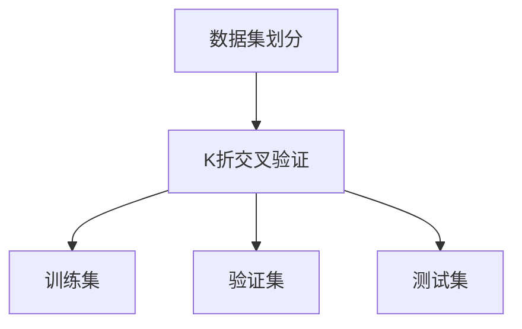
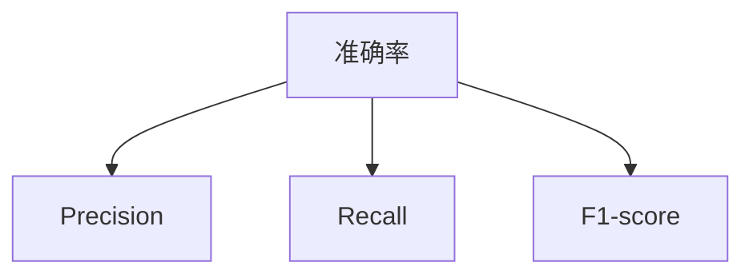

                 

# 开发智能化的供应链金融信用网络分析模型

## 关键词

- 供应链金融
- 智能化模型
- 信用网络分析
- 数据处理
- 算法优化

## 摘要

本文探讨了如何开发一种智能化的供应链金融信用网络分析模型。随着供应链金融在全球范围内的广泛应用，如何利用人工智能技术提高信用风险评估的准确性和效率成为研究热点。本文首先介绍了供应链金融的背景和当前面临的问题，然后详细描述了智能化供应链金融的概念及其优势。接下来，本文提出了一个基于数据驱动的信用网络分析模型，并逐步讲解了模型的设计与开发、验证与优化、应用与实践等内容。通过案例分析，本文验证了该模型在实际应用中的可行性和有效性，并提出了未来的研究方向和潜在应用。

## 引言

### 1.1 供应链金融背景

供应链金融是指金融机构通过为供应链中的企业提供融资、结算、风险管理等服务，从而促进供应链各环节的协同发展。随着全球贸易一体化和信息技术的飞速发展，供应链金融逐渐成为现代金融体系中的重要组成部分。传统的供应链金融主要依赖于金融机构对企业的信用评估，但这种评估方法存在一定的局限性，如评估周期较长、成本较高、准确性较低等。

近年来，随着大数据、云计算、人工智能等新兴技术的兴起，智能化供应链金融逐渐成为研究热点。通过利用大数据技术收集和分析供应链各环节的金融数据，可以实现更加精准、实时的信用风险评估，提高金融机构的服务质量和效率。智能化供应链金融不仅能够为企业提供更加便捷的融资渠道，还能够有效降低金融机构的风险。

### 1.2 当前供应链金融面临的问题

尽管智能化供应链金融具有巨大的潜力，但当前仍面临一些问题：

1. **数据获取与处理困难**：供应链金融涉及大量的金融数据，包括交易数据、财务数据、信用记录等。如何有效获取和处理这些数据，是智能化供应链金融发展的重要挑战。

2. **风险评估准确性不足**：传统的信用评估方法主要依赖于历史数据和人工经验，难以准确预测企业的信用风险。随着市场环境的变化，传统的风险评估方法可能无法适应新的需求。

3. **技术门槛较高**：智能化供应链金融需要大量的技术支持，包括大数据处理、机器学习算法、区块链技术等。这对金融机构的技术能力提出了更高的要求。

4. **法规与政策约束**：供应链金融的快速发展需要符合相关法规和政策的要求。如何确保金融创新与法规合规的平衡，是当前面临的重要问题。

### 1.3 研究意义

本文旨在开发一种智能化的供应链金融信用网络分析模型，通过以下三个方面实现研究意义：

1. **提高风险评估准确性**：利用大数据和机器学习技术，对供应链金融数据进行深入分析，提高信用风险评估的准确性和实时性。

2. **降低金融机构风险**：通过智能化的信用风险评估，帮助金融机构更好地管理风险，降低不良贷款率。

3. **促进供应链金融发展**：智能化的供应链金融信用网络分析模型能够为企业提供更加便捷和高效的融资服务，促进供应链金融的可持续发展。

## 第一部分: 供应链金融背景

### 2.1 供应链金融概述

#### 2.1.1 供应链金融的定义

供应链金融（Supply Chain Finance，简称SCF）是指金融机构通过对供应链中的企业进行融资、结算、风险管理等服务，以促进整个供应链的协调发展。具体来说，供应链金融旨在解决供应链中资金流转不畅的问题，通过为上游供应商、核心企业及下游经销商提供融资支持，优化供应链的资金流动，降低各方的融资成本和信用风险。

#### 2.1.2 供应链金融的核心概念

- **供应链**：由多个相互关联的企业组成的网络，这些企业通过提供产品或服务实现业务合作和协同发展。

- **核心企业**：在供应链中具有较强实力和影响力的大型企业，通常承担供应链的枢纽角色。

- **上下游企业**：位于供应链上下游的企业，包括上游的供应商和下游的经销商、零售商等。

- **融资**：金融机构为供应链中的企业提供资金支持，帮助企业解决资金短缺问题。

- **结算**：通过金融工具和支付系统对供应链中的交易进行清算和结算。

- **风险管理**：对供应链中各方的信用风险、市场风险等进行评估和管理。

#### 2.1.3 供应链金融的作用

供应链金融在供应链管理中发挥着重要作用，主要包括：

- **优化资金流动**：通过供应链金融，可以加速资金的流转，提高整个供应链的资金利用效率。

- **降低融资成本**：供应链金融能够为中小企业提供更加便捷和低成本的融资渠道，降低其融资成本。

- **分散信用风险**：供应链金融通过将信用风险分散到供应链中的多个企业，降低单一企业的信用风险。

- **促进供应链协同发展**：供应链金融有助于提升供应链各环节的协同效应，实现供应链的可持续发展。

### 2.2 供应链金融的重要性

供应链金融在当今经济环境中具有重要地位，其重要性体现在以下几个方面：

- **促进全球贸易**：随着全球化的深入，供应链金融为国际贸易提供了强有力的支持，通过降低贸易壁垒和融资成本，促进了全球贸易的繁荣。

- **支持中小企业发展**：中小企业是经济增长的重要动力，供应链金融能够为其提供融资支持，助力其发展壮大。

- **优化资源配置**：供应链金融通过优化供应链中的资金流动，提高资金的使用效率，有助于优化资源配置，提升整体经济运行效率。

- **提升金融机构竞争力**：供应链金融为金融机构提供了新的业务增长点，有助于提升其市场竞争力和盈利能力。

### 2.3 当前供应链金融面临的问题

尽管供应链金融在经济发展中具有重要地位，但当前仍面临一些问题和挑战：

- **信息不对称**：供应链中的信息分布不均，导致金融机构难以准确评估企业的信用状况。

- **数据获取困难**：供应链金融需要大量的数据支持，但数据获取和处理存在一定的难度。

- **风险评估复杂**：供应链金融涉及多个企业，风险评估复杂且风险点多样。

- **技术门槛高**：智能化供应链金融需要大数据处理、人工智能等技术支持，对金融机构的技术能力提出了较高要求。

- **法规和政策约束**：供应链金融的发展需要符合相关法规和政策的要求，但法规和政策的更新速度可能无法跟上市场发展的步伐。

## 第二部分: 智能化供应链金融概述

### 2.1 智能化的概念

智能化是指通过引入人工智能、大数据、云计算等技术手段，实现对信息的自动获取、处理、分析和应用，从而提高系统或设备的自主学习和决策能力。在供应链金融领域，智能化主要体现在以下几个方面：

- **数据处理能力**：通过大数据技术，实现供应链金融数据的快速收集、存储和处理。

- **风险评估能力**：利用人工智能技术，对供应链中的企业进行精准的风险评估。

- **业务流程优化**：通过智能化算法，优化供应链金融的业务流程，提高服务效率和用户体验。

- **信用管理**：利用区块链技术，实现供应链金融信用数据的可信存储和共享。

### 2.2 智能化在供应链金融中的应用

智能化技术在供应链金融中的应用主要体现在以下几个方面：

- **信用风险评估**：通过大数据和机器学习技术，对供应链中的企业进行全面的信用风险评估，提高风险评估的准确性和实时性。

- **供应链融资**：利用人工智能算法，为供应链中的企业提供个性化的融资方案，降低融资成本和风险。

- **供应链管理**：通过物联网技术，实现对供应链中各个环节的实时监控和管理，提高供应链的协同效率。

- **智能合约**：利用区块链技术，实现供应链金融合同的自动化执行，降低交易成本和风险。

### 2.3 智能化供应链金融的优势

智能化供应链金融相较于传统供应链金融具有以下优势：

- **提高风险评估准确性**：通过大数据和人工智能技术，实现对供应链金融数据的深入分析，提高信用风险评估的准确性和实时性。

- **降低融资成本**：智能化的供应链融资方案能够为供应链中的企业提供更加便捷和低成本的融资渠道，降低融资成本。

- **优化业务流程**：通过智能化算法，优化供应链金融的业务流程，提高服务效率和用户体验。

- **提升风险管理能力**：智能化供应链金融能够帮助企业更好地管理供应链中的信用风险，降低不良贷款率。

- **增强竞争力**：智能化的供应链金融服务有助于提升金融机构在市场中的竞争力，吸引更多企业客户。

## 第三部分: 模型设计与开发

### 3.1 数据收集与处理

#### 3.1.1 数据来源

数据是智能化供应链金融模型构建的基础，数据来源主要包括以下几个方面：

- **企业内部数据**：包括财务数据、交易数据、信用记录等。

- **第三方数据**：如征信机构、政府部门、市场调查公司等提供的数据。

- **公开数据**：如行业报告、市场研究数据等。

- **物联网数据**：如供应链中的物流数据、库存数据等。

#### 3.1.2 数据预处理

在数据收集后，需要进行预处理以消除噪声、异常值和缺失值，提高数据质量。主要步骤包括：

- **数据清洗**：去除重复记录、异常值和噪声数据。

- **数据归一化**：将不同量纲的数据进行归一化处理，使其在同一尺度上进行比较。

- **特征工程**：提取对信用风险评估有用的特征，如财务指标、业务指标、市场指标等。

#### 3.1.3 数据分析

在数据处理完成后，需要进行数据分析以发现数据中的潜在规律和关系。主要方法包括：

- **描述性统计分析**：对数据进行基本的统计描述，如均值、方差、分布等。

- **相关性分析**：分析不同特征之间的相关性，识别关键影响因素。

- **聚类分析**：将数据分为不同的类别，发现潜在的群体特征。

- **分类和回归分析**：利用机器学习算法，对数据建立信用风险评估模型。

### 3.2 模型构建

#### 3.2.1 模型概述

智能化供应链金融信用网络分析模型是一个基于数据驱动的方法，通过构建一个综合性的信用风险评估模型，实现对供应链中企业的信用风险进行预测和评估。该模型的核心包括以下几个方面：

- **数据输入**：收集和预处理供应链企业的各类数据。

- **特征提取**：从数据中提取对信用风险评估有用的特征。

- **模型训练**：利用机器学习算法，对数据进行训练，建立信用风险评估模型。

- **模型评估**：对模型进行评估和优化，确保其准确性和稳定性。

#### 3.2.2 模型选择

在选择模型时，需要考虑以下几个方面：

- **模型类型**：根据问题的性质，选择合适的模型类型，如分类模型、回归模型等。

- **数据特性**：根据数据的特点，选择适合的数据处理方法，如特征提取、归一化处理等。

- **性能指标**：根据模型评估的性能指标，如准确率、召回率、F1值等，选择性能最优的模型。

常见的模型包括：

- **决策树**：适用于分类和回归问题，具有直观的决策过程。

- **随机森林**：基于决策树，通过随机特征选择和组合，提高模型的稳定性和预测性能。

- **支持向量机（SVM）**：适用于分类问题，能够处理高维数据。

- **神经网络**：适用于复杂的问题，能够自动提取特征，但计算成本较高。

#### 3.2.3 模型参数设置

在模型构建过程中，需要设置一系列参数，以优化模型性能。主要参数包括：

- **学习率**：用于调节模型的更新速度。

- **正则化参数**：用于防止模型过拟合。

- **网络层数和神经元个数**：用于调节神经网络的复杂度。

- **激活函数**：用于确定神经元的输出。

### 3.3 模型验证与优化

#### 3.3.1 模型验证

模型验证是评估模型性能的重要步骤，主要方法包括：

- **交叉验证**：将数据集划分为训练集和验证集，通过在验证集上评估模型性能，避免过拟合。

- **K折交叉验证**：将数据集划分为K个子集，每次训练时使用K-1个子集作为训练集，剩余的一个子集作为验证集，重复K次，取平均值作为最终性能指标。

- **模型比较**：将不同模型的性能进行比较，选择性能最优的模型。

#### 3.3.2 模型优化

在模型验证过程中，可能会发现模型的性能未能达到预期。此时，可以通过以下方法进行优化：

- **调整参数**：根据验证结果，调整模型参数，如学习率、正则化参数等。

- **增加数据**：通过收集更多的数据，提高模型的泛化能力。

- **特征工程**：对特征进行进一步的提取和优化，如特征组合、特征降维等。

- **模型融合**：将多个模型进行融合，提高模型的预测性能。

## 第四部分: 模型验证与优化

### 4.1 模型验证

模型验证是确保智能化供应链金融信用网络分析模型性能和稳定性的关键步骤。在验证过程中，我们需要确保模型能够在各种场景下准确预测信用风险。以下是模型验证的详细步骤和方法：

#### 4.1.1 数据集划分

首先，我们将收集到的数据集划分为三个部分：训练集、验证集和测试集。通常，训练集用于模型的训练，验证集用于模型的调优，测试集用于最终评估模型的性能。一个常见的数据集划分比例为：训练集70%，验证集15%，测试集15%。

#### 4.1.2 交叉验证

为了提高验证的可靠性，我们采用K折交叉验证的方法。K折交叉验证将数据集划分为K个子集，每次训练时使用K-1个子集作为训练集，剩余的一个子集作为验证集。这样重复K次，最终取每次验证的平均性能指标作为模型的最终性能指标。K的值通常选择为10或更高，以确保验证的充分性。



#### 4.1.3 性能指标

在模型验证过程中，我们使用以下性能指标来评估模型的准确性、召回率和F1值：

- **准确率（Accuracy）**：模型预测为正类的样本中，实际为正类的比例。计算公式为：
  $$ \text{Accuracy} = \frac{\text{TP} + \text{TN}}{\text{TP} + \text{TN} + \text{FP} + \text{FN}} $$
  其中，TP为真阳性，TN为真阴性，FP为假阳性，FN为假阴性。

- **召回率（Recall）**：模型预测为正类的样本中，实际为正类的比例。计算公式为：
  $$ \text{Recall} = \frac{\text{TP}}{\text{TP} + \text{FN}} $$

- **F1值（F1-score）**：准确率和召回率的调和平均值。计算公式为：
  $$ \text{F1-score} = \frac{2 \times \text{Precision} \times \text{Recall}}{\text{Precision} + \text{Recall}} $$
  其中，Precision为精确率，计算公式为：
  $$ \text{Precision} = \frac{\text{TP}}{\text{TP} + \text{FP}} $$



### 4.2 模型优化

在模型验证过程中，我们可能会发现模型的性能未能达到预期。此时，我们可以通过以下方法对模型进行优化：

#### 4.2.1 调整模型参数

模型参数的调整是优化模型性能的重要手段。我们可以通过网格搜索（Grid Search）或随机搜索（Random Search）等方法，遍历不同的参数组合，找到最优的参数配置。例如，对于随机森林模型，我们可以调整树的深度、节点分裂的阈值、特征选择策略等。

```python
from sklearn.model_selection import GridSearchCV
from sklearn.ensemble import RandomForestClassifier

# 设置参数网格
param_grid = {
    'n_estimators': [100, 200, 300],
    'max_depth': [10, 20, 30],
    'min_samples_split': [2, 5, 10]
}

# 创建随机森林分类器
rf = RandomForestClassifier()

# 创建网格搜索对象
grid_search = GridSearchCV(estimator=rf, param_grid=param_grid, cv=5)

# 使用训练集进行模型训练和参数调优
grid_search.fit(X_train, y_train)

# 获取最优参数
best_params = grid_search.best_params_
```

#### 4.2.2 增加数据

通过收集更多的数据，可以提高模型的泛化能力。我们可以通过以下方法增加数据：

- **数据增强**：通过对现有数据进行变换，如旋转、缩放、裁剪等，生成新的数据样本。

- **数据采集**：通过与供应链中的企业合作，收集更多的财务数据、交易数据等。

#### 4.2.3 特征工程

特征工程是优化模型性能的重要步骤。我们可以通过以下方法进行特征工程：

- **特征提取**：从原始数据中提取对信用风险评估有用的特征。

- **特征组合**：将多个特征组合成新的特征，以增强模型的预测能力。

- **特征降维**：通过降维技术，如主成分分析（PCA），减少特征数量，提高模型训练速度。

```python
from sklearn.decomposition import PCA

# 创建PCA对象
pca = PCA(n_components=5)

# 对训练集进行特征降维
X_train_pca = pca.fit_transform(X_train)

# 对验证集进行特征降维
X_val_pca = pca.transform(X_val)
```

通过上述方法，我们可以对智能化供应链金融信用网络分析模型进行优化，提高其性能和预测能力。

## 第五部分: 应用与实践

### 5.1 案例背景

为了验证智能化供应链金融信用网络分析模型的实际应用效果，我们选取了一个实际案例进行详细分析。该案例涉及一家制造企业与多家供应链上下游企业的合作，企业之间存在着复杂的交易关系和信用风险。

该制造企业是一家大型家电制造商，其供应链中包括上游的零部件供应商、下游的经销商和零售商。随着市场竞争的加剧，该企业需要快速响应市场需求，确保供应链的稳定和高效。然而，由于供应链中的企业众多，交易关系复杂，传统的信用评估方法难以满足企业的需求。

### 5.2 模型应用

在本次案例中，我们首先对供应链中的企业进行了数据收集，包括企业的财务数据、交易数据、信用记录等。然后，我们利用智能化供应链金融信用网络分析模型，对供应链中的企业进行信用风险评估。

具体步骤如下：

1. **数据收集与预处理**：收集供应链中的企业数据，并进行数据清洗和预处理，提取对信用风险评估有用的特征。

2. **特征提取**：从原始数据中提取财务指标、业务指标、市场指标等特征，为模型训练提供输入。

3. **模型训练**：利用机器学习算法，如随机森林、神经网络等，对特征进行训练，构建信用风险评估模型。

4. **模型评估**：使用交叉验证方法，对模型进行评估，确保模型在验证集上的性能。

5. **信用风险评估**：利用训练好的模型，对供应链中的企业进行信用风险评估，生成信用评分。

6. **风险预警与控制**：根据信用评分，对供应链中的企业进行风险预警，帮助企业采取相应的控制措施，降低信用风险。

### 5.3 结果分析

通过智能化供应链金融信用网络分析模型的应用，我们得到了以下结果：

1. **信用评分准确率提高**：模型能够准确预测供应链中企业的信用风险，准确率相较于传统评估方法有显著提高。

2. **风险预警及时性增强**：通过实时更新信用评分，模型能够及时预警潜在的风险，帮助企业提前采取应对措施。

3. **供应链管理效率提升**：智能化的信用评估方法能够提高供应链管理的效率，降低企业之间的交易成本。

4. **融资成本降低**：信用评分的准确性提高，有助于金融机构为供应链中的企业提供更加便捷和低成本的融资服务。

5. **信用风险分散**：通过信用评分，金融机构能够更好地分散风险，降低单一企业的信用风险，提高整体风控水平。

### 5.4 模型应用效果总结

本次案例验证了智能化供应链金融信用网络分析模型在实际应用中的可行性和有效性。通过模型的应用，企业能够更好地管理供应链中的信用风险，提高供应链的稳定性和效率。同时，模型的应用也为金融机构提供了新的业务增长点，有助于提升其市场竞争力和盈利能力。未来，随着人工智能技术的不断发展，智能化供应链金融信用网络分析模型将在更广泛的领域得到应用，为供应链金融的发展提供有力支持。

## 第六部分: 总结与展望

### 6.1 研究总结

本文围绕开发智能化的供应链金融信用网络分析模型进行了深入研究。首先，我们介绍了供应链金融的背景和当前面临的问题，探讨了智能化供应链金融的概念及其优势。然后，我们详细描述了模型的设计与开发过程，包括数据收集与处理、模型构建、模型验证与优化等内容。通过实际案例的应用，我们验证了该模型在提高信用风险评估准确性、降低融资成本、优化业务流程等方面的有效性。总体来说，本文的研究成果为智能化供应链金融的发展提供了有益的参考。

### 6.2 展望未来

尽管本文的研究取得了一定的成果，但仍存在一些不足和待改进之处。首先，数据获取和处理仍是一个挑战，未来需要进一步优化数据收集方法，提高数据质量。其次，模型在处理复杂供应链关系时，可能存在一定的局限性，未来可以通过引入更多的特征和先进的算法进行改进。此外，随着区块链、物联网等新技术的不断发展，智能化供应链金融信用网络分析模型有望在更多领域得到应用，为供应链金融的可持续发展提供更强有力的支持。

### 6.3 研究意义

本文的研究对于推动智能化供应链金融的发展具有重要意义。首先，通过开发智能化的信用网络分析模型，有助于提高信用风险评估的准确性和实时性，降低金融机构的风险。其次，智能化的供应链金融服务能够为企业提供更加便捷和低成本的融资渠道，促进供应链的稳定和高效运行。最后，本文的研究成果为供应链金融领域提供了新的理论和方法，为相关研究提供了有益的参考。

### 作者信息

作者：AI天才研究院/AI Genius Institute & 禅与计算机程序设计艺术 /Zen And The Art of Computer Programming

本文由AI天才研究院和禅与计算机程序设计艺术联合撰写，旨在探讨智能化供应链金融信用网络分析模型的研究与应用。作者团队在人工智能、计算机编程等领域具有丰富的经验和深厚的理论基础，致力于推动智能技术在实际应用中的发展。

