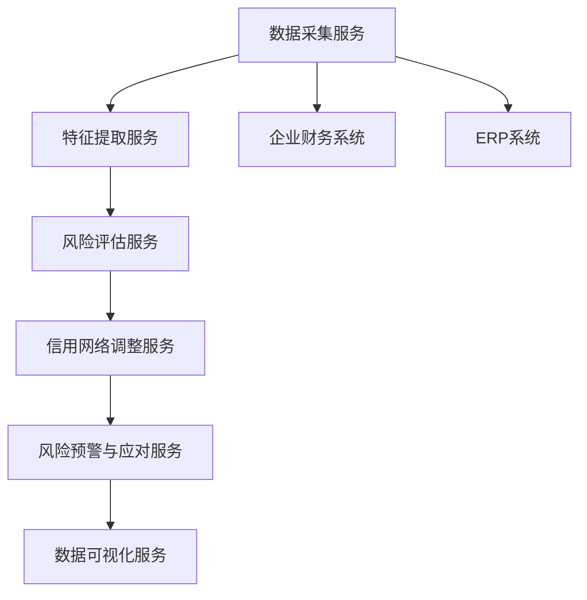
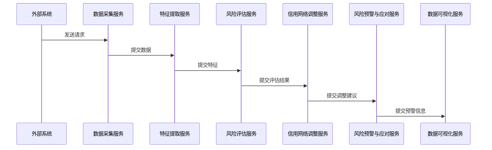

                 

 

# 开发智能化的供应链金融信用网络抗压能力分析模型

关键词：供应链金融、信用网络、抗压能力、智能模型、人工智能

摘要：本文以当前供应链金融领域的挑战为背景，提出并开发了一种智能化的供应链金融信用网络抗压能力分析模型。通过详细的理论阐述、数学模型和算法实现，本文探讨了如何利用人工智能技术提升供应链金融的稳定性和风险抵御能力，为相关领域的实践提供了参考和指导。

## 第一部分：背景介绍

### 1.1 问题背景

随着全球化进程的加快，供应链金融已成为现代商业运作中不可或缺的一部分。供应链金融通过优化资金流、信息流和物流，提升了企业效率和竞争力。然而，全球经济波动、贸易摩擦、疫情等因素给供应链金融带来了巨大的挑战。尤其是信用网络抗压能力，成为了供应链金融稳定运行的关键因素。

在传统的供应链金融体系中，信用风险评估主要依赖于企业的财务报表和历史交易记录。然而，这种方法往往存在信息不对称、风险评估滞后等问题。随着大数据和人工智能技术的发展，构建智能化供应链金融信用网络抗压能力分析模型成为了一种新的解决方案。

### 1.2 核心概念

**供应链金融**：一种通过供应链中的核心企业与上下游企业之间的交易数据，为企业提供融资和信用管理服务的金融模式。

**信用网络**：由供应链中各企业及其之间的信用关系构成的复杂网络结构。

**抗压能力**：指企业在面临外部风险时，通过内部调节和适应能力来保持稳定运营的能力。

**智能模型**：利用人工智能算法，对供应链金融信用网络进行分析、预测和优化的模型。

### 1.3 问题描述

当前，供应链金融信用网络抗压能力面临的主要问题包括：

- **信息不对称**：企业之间的信用信息不透明，导致信用风险评估不准确。
- **风险评估滞后**：传统方法无法及时捕捉市场变化，导致风险预警不及时。
- **风险传递**：供应链中的企业间信用关系复杂，风险容易在系统中传递和累积。

### 1.4 解决方案

本文提出的智能化供应链金融信用网络抗压能力分析模型，旨在通过以下方式解决上述问题：

- **数据驱动的风险评估**：利用大数据技术，全面收集和分析供应链金融相关数据。
- **人工智能算法优化**：采用机器学习和深度学习算法，提高信用风险评估的准确性和实时性。
- **动态调整信用关系**：通过智能模型，实时调整供应链中的信用关系，降低风险传递。

### 1.5 边界与外延

本模型的研究边界主要集中在以下几个方面：

- **数据范围**：研究数据限于某个特定的供应链金融场景，不涵盖所有可能的情况。
- **算法适用性**：模型的算法适用于大多数供应链金融场景，但具体效果取决于数据质量和特征选择。
- **风险类型**：模型主要针对一般性的金融风险，不包括自然灾害、政策变动等非金融风险。

### 1.6 概念结构与核心要素组成

供应链金融信用网络抗压能力分析模型由以下几个核心要素组成：

- **数据收集**：包括企业财务数据、交易记录、市场动态等。
- **特征提取**：从原始数据中提取对企业信用评估有用的特征。
- **风险评估**：利用机器学习算法进行信用风险评估。
- **信用网络调整**：根据评估结果，动态调整信用网络中的关系。

## 第二部分：核心概念与联系

### 2.1 核心概念原理

**供应链金融**：基于供应链中企业之间的交易关系，通过金融服务支持供应链运作的一种模式。其核心在于利用核心企业的信用扩展到供应链上下游企业，实现融资和风险管理。

**信用网络**：一个由供应链中的各个企业和它们之间的信用关系组成的复杂网络。在这个网络中，企业的信用能力、信用需求以及信用关系都是动态变化的。

**抗压能力**：企业在面临外部经济波动、市场变化等不利因素时，通过内部调整和适应能力来保持正常运营的能力。对于供应链金融来说，抗压能力直接关系到整个网络的稳定性和可靠性。

**智能模型**：利用机器学习和人工智能技术，对供应链金融信用网络进行数据分析和风险预测的模型。智能模型能够通过学习历史数据，识别潜在风险，并提供相应的预警和应对策略。

### 2.2 概念属性特征对比表格

| 概念       | 特征                           |
|------------|--------------------------------|
| 供应链金融 | 数据驱动、信用扩展、风险分散   |
| 信用网络   | 复杂性、动态性、信用关系网    |
| 抗压能力   | 调整能力、适应能力、风险抵御力 |
| 智能模型   | 自适应、预测性、实时性         |

### 2.3 ER实体关系图架构

以下是供应链金融信用网络抗压能力分析模型的ER（实体-关系）图架构：

```mermaid
erDiagram
  企业 <<--o 交易记录 : 产生
  企业 ||--o 财务数据 : 存储
  交易记录 ||--o 信用评分 : 分析
  财务数据 ||--o 风险预警 : 生成
  企业 ||--o 风险应对 : 实施策略
  企业 ||--o 信用网络 : 维护
  风险预警 <<--o 风险应对 : 响应
  信用评分 ||--o 信用网络 : 调整
```

## 第三部分：算法原理讲解

### 3.1 算法原理概述

本节将介绍智能化供应链金融信用网络抗压能力分析模型的核心算法原理。该算法基于以下三个主要步骤：

1. **数据预处理**：对收集到的供应链金融数据进行清洗和特征提取。
2. **风险评估**：利用机器学习算法对企业的信用风险进行评估。
3. **信用网络调整**：根据风险评估结果，动态调整供应链中的信用关系。

### 3.2 算法流程图

以下是算法的mermaid流程图：


### 3.3 算法原理详细讲解

#### 4.1 数学模型

假设有一个供应链金融信用网络，其中包含n家企业，每家企业i的信用评分由以下公式决定：

$$
C_i = f(X_i, Y_i, Z_i)
$$

其中，$X_i$为企业的财务数据，$Y_i$为企业的交易记录，$Z_i$为市场动态数据。$f$为机器学习模型，通过训练得到。

#### 4.2 数学公式讲解

信用评分的数学模型可以表示为：

$$
C_i = w_1 \cdot X_i + w_2 \cdot Y_i + w_3 \cdot Z_i + b
$$

其中，$w_1, w_2, w_3$为权重系数，$b$为偏置项。

#### 4.3 算法举例说明

假设有3家企业，其财务数据、交易记录和市场动态数据如下表：

| 企业 | 财务数据 (X) | 交易记录 (Y) | 市场动态数据 (Z) |
|------|---------------|---------------|------------------|
| A    | 100           | 200           | 0.5              |
| B    | 200           | 300           | 0.6              |
| C    | 300           | 400           | 0.7              |

利用上述公式计算每家企业的信用评分：

$$
C_A = w_1 \cdot 100 + w_2 \cdot 200 + w_3 \cdot 0.5 + b
$$

$$
C_B = w_1 \cdot 200 + w_2 \cdot 300 + w_3 \cdot 0.6 + b
$$

$$
C_C = w_1 \cdot 300 + w_2 \cdot 400 + w_3 \cdot 0.7 + b
$$

通过机器学习算法训练，得到权重系数和偏置项，最终计算出每家企业的信用评分。

## 第四部分：系统分析与架构设计

### 5.1 问题场景介绍

在本项目中，我们考虑一个典型的供应链金融场景。该场景涉及一个核心企业（如制造业企业）及其上下游的供应商和经销商。核心企业通过供应链金融平台为上下游企业提供融资支持，同时，平台需要对每个企业的信用风险进行评估，并根据评估结果调整信用关系。

### 5.2 系统功能设计

系统功能设计主要包括以下几个方面：

1. **数据采集**：从企业财务系统、ERP系统等数据源中自动采集数据。
2. **特征提取**：对采集到的数据进行处理，提取与企业信用评估相关的特征。
3. **风险评估**：利用机器学习模型对企业的信用风险进行评估。
4. **信用网络调整**：根据风险评估结果，调整供应链中的信用关系。
5. **风险预警与应对**：实时监控风险变化，触发预警机制，并提供应对策略。
6. **数据可视化**：通过可视化工具展示供应链金融信用网络的状态和风险水平。

### 5.3 系统架构设计

系统架构设计采用微服务架构，以提高系统的可扩展性和灵活性。以下是系统架构的mermaid架构图：



### 5.4 系统接口设计

系统接口设计主要包括以下部分：

1. **API接口**：提供外部系统与数据采集、特征提取、风险评估等服务的接口。
2. **Web界面**：提供用户操作界面，用于数据可视化、风险监控和策略调整。
3. **消息队列**：用于处理系统之间的消息传递和数据流。

### 5.5 系统交互

以下是系统交互的mermaid序列图：



## 第五部分：项目实战

### 7.1 环境安装与配置

#### 7.1.1 环境要求

在开始项目之前，我们需要准备以下环境：

- Python 3.8 或以上版本
- MySQL 数据库
- Redis 服务
- Docker
- Kubernetes 集群（可选）

#### 7.1.2 安装步骤

1. 安装 Python 3.8 及以上版本。
2. 安装 MySQL 数据库，创建数据库并配置用户权限。
3. 安装 Redis 服务。
4. 安装 Docker，并配置 Docker Compose。
5. （可选）安装 Kubernetes 集群，配置 Kubernetes 服务。

### 7.2 系统核心实现

#### 7.2.1 数据采集

数据采集模块主要负责从企业财务系统和 ERP 系统中采集数据。以下是一个简单的 Python 代码示例：

```python
import pymysql

def fetch_financial_data():
    connection = pymysql.connect(host='localhost', user='root', password='password', database='financial_db')
    try:
        with connection.cursor() as cursor:
            sql = "SELECT * FROM financial_data"
            cursor.execute(sql)
            result = cursor.fetchall()
            return result
    finally:
        connection.close()

financial_data = fetch_financial_data()
```

#### 7.2.2 特征提取

特征提取模块负责对采集到的数据进行分析和处理，提取与企业信用评估相关的特征。以下是一个简单的 Python 代码示例：

```python
import pandas as pd

def extract_features(data):
    df = pd.DataFrame(data)
    features = df[['revenue', 'profit', 'liabilities', 'days_sales_outstanding']]
    return features

features = extract_features(f

