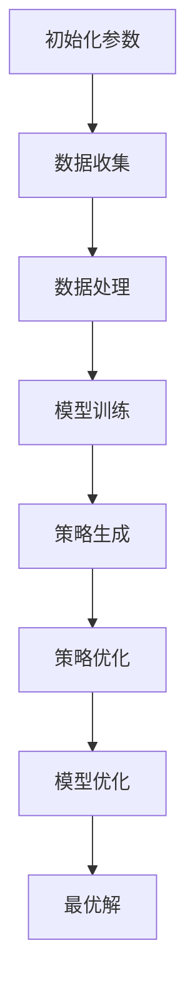
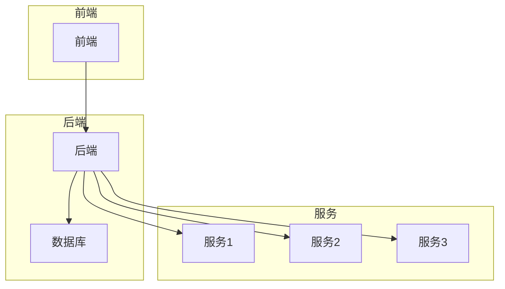
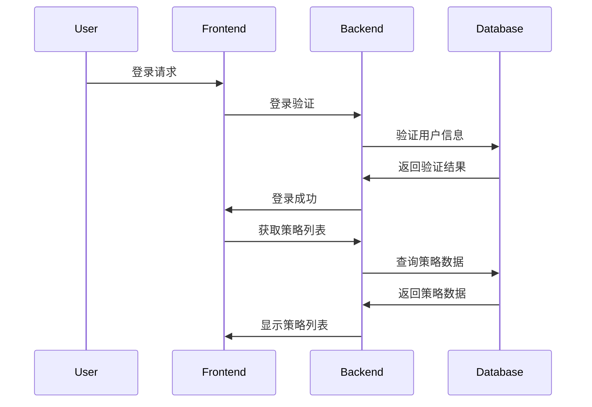
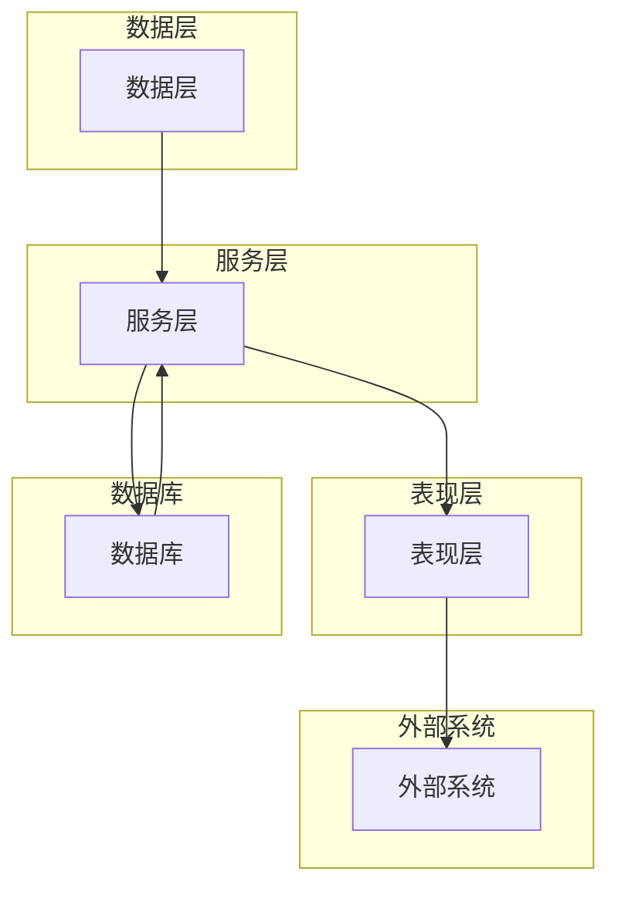
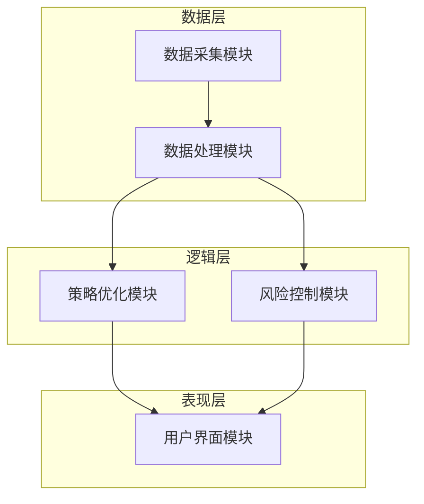
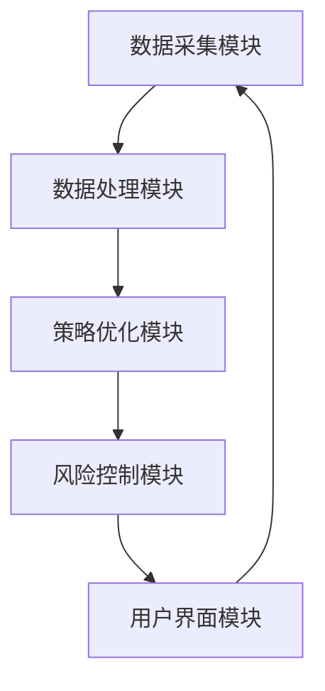
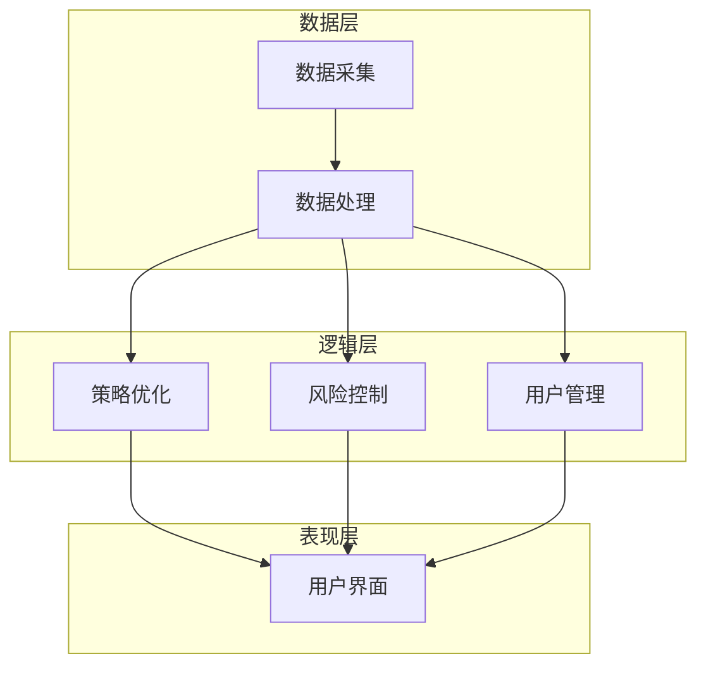

                 

### 第一部分：问题背景与核心概念

#### 第1章：问题背景与核心概念

**1.1 问题背景**

在现代社会，随着金融市场的复杂化和投资者需求的多样化，如何进行有效的资产配置成为了一个关键问题。传统的资产配置策略往往依赖于历史数据和市场经验，这种策略虽然在一定程度上能够实现投资目标，但在面对快速变化的市场环境时，其适应性和灵活性较差。

**问题解决**

为了应对这一挑战，智能化资产配置策略优化引擎的开发应运而生。这一引擎通过利用人工智能、大数据分析等技术，实现对资产配置策略的自动调整和优化，从而提高投资组合的收益和风险控制水平。

**边界与外延**

在讨论智能化资产配置策略优化引擎时，我们需要明确其适用的边界和范围。首先，它主要针对的是金融投资领域，尤其是股票、债券、基金等资产类别的配置。其次，它依赖于大量历史数据和实时数据，因此数据的质量和获取能力是影响其效果的关键因素。最后，引擎的开发需要结合具体的投资目标和风险偏好，以实现个性化的策略优化。

**1.2 核心概念**

智能化资产配置策略优化引擎涉及以下几个核心概念：

**智能化：** 智能化是指利用人工智能技术，如机器学习、深度学习等，对资产配置策略进行自动优化和调整。这种智能化体现在算法的自动学习能力、数据驱动的决策过程以及实时反馈和调整机制上。

**资产配置：** 资产配置是指根据投资目标、风险偏好等因素，将资金分配到不同的资产类别中，以达到预期收益和风险控制的目标。资产配置的核心在于分散投资，降低单一资产类别波动带来的风险。

**策略优化：** 策略优化是指通过优化算法，如遗传算法、粒子群优化等，对资产配置策略进行调整，以提高投资组合的收益或降低风险。策略优化的目的是在满足约束条件的前提下，找到最优的资产配置方案。

**引擎开发：** 引擎开发是指设计并实现智能化资产配置策略优化引擎的软件系统。引擎开发需要涉及多个领域，包括数据采集、数据处理、算法实现、系统架构设计等。

**1.3 概念属性特征对比**

为了更好地理解这些核心概念，我们可以通过一个特征对比表格来进行梳理：

| 核心概念 | 特征1 | 特征2 | 特征3 |
| --- | --- | --- | --- |
| 智能化 | 自动化 | 数据驱动 | 适应性强 |
| 资产配置 | 投资组合 | 风险管理 | 收益最大化 |
| 策略优化 | 算法 | 统计分析 | 实时调整 |
| 引擎开发 | 软件工程 | 硬件支持 | 系统集成 |

**1.4 ER实体关系图**

为了更直观地展示这些核心概念之间的关系，我们可以使用 Mermaid 语法绘制一个 ER（实体关系）图：

```mermaid
erDiagram
  User ||--|{ Portfolio }|| Investor
  Portfolio ||--|{ Asset }|| Asset
  Asset ||--|{ Strategy }|| Strategy
  Strategy ||--|{ Engine }|| Engine
```

在这个 ER 图中，User 代表投资者，Portfolio 代表投资组合，Asset 代表资产，Strategy 代表策略，Engine 代表引擎。每个实体之间都有明确的关联关系，如投资者与投资组合、资产与策略等。

**1.5 本章小结**

通过本章的讨论，我们对智能化资产配置策略优化引擎的背景、核心概念及其特征有了更深入的理解。接下来，我们将进一步探讨智能化资产配置策略优化的原理，为后续的引擎开发实践打下坚实的基础。在接下来的章节中，我们将逐步解析智能化的原理、策略优化的方法、以及模型优化的具体实现。通过这些深入的分析，我们将展示如何通过技术手段，实现资产配置策略的智能化优化。### 第二部分：智能化资产配置策略优化原理

#### 第2章：智能化资产配置策略优化原理

**2.1 智能化资产配置的原理**

智能化资产配置的核心在于通过数据驱动的决策过程，实现资产配置策略的自动调整和优化。这个过程可以分为以下几个步骤：

**数据收集：** 首先，需要收集大量的历史数据和实时数据，包括股票、债券、基金等资产的价格、收益率、波动率等指标。

**数据处理：** 对收集到的数据进行清洗、整合和处理，以去除噪声和异常值，确保数据的质量和可靠性。

**模型训练：** 使用机器学习算法，如线性回归、决策树、支持向量机等，对处理后的数据进行训练，以建立资产配置策略的预测模型。

**策略生成：** 根据训练好的模型，生成不同的资产配置策略。这些策略可以根据投资者的风险偏好和投资目标进行定制化。

**策略优化：** 使用优化算法，如遗传算法、粒子群优化等，对生成的策略进行优化，以找到最佳的投资组合。

**2.2 策略优化的原理**

策略优化的目的是在满足投资者风险偏好和投资目标的前提下，找到最佳的投资组合。这个过程主要包括以下几个步骤：

**目标函数：** 定义优化问题的目标函数，通常是以收益最大化为目标，也可以是以风险最小化为目标。

**约束条件：** 约束条件包括投资组合的多样化要求、资金限制、投资期限等。

**模型选择：** 根据优化问题的特点，选择合适的优化模型，如线性规划、非线性规划、整数规划等。

**算法实现：** 使用优化算法，对目标函数进行求解，找到最优解。

**2.3 模型优化的方法**

模型优化的方法主要包括以下几种：

**遗传算法：** 遗传算法是一种基于自然进化过程的优化算法，通过模拟自然选择和遗传机制，不断迭代优化解。

**粒子群优化：** 粒子群优化算法是一种基于群体智能的优化算法，通过模拟鸟群觅食行为，实现优化求解。

**模拟退火算法：** 模拟退火算法是一种基于热力学理论的优化算法，通过模拟固体退火过程，寻找最优解。

**强化学习：** 强化学习是一种通过试错学习，根据奖励信号进行调整的优化算法，适用于动态环境下的策略优化。

**2.4 算法mermaid流程图**

为了更直观地展示模型优化的流程，我们可以使用 Mermaid 语法绘制一个流程图：



在这个流程图中，A 表示初始化参数，B 表示数据收集，C 表示数据处理，D 表示模型训练，E 表示策略生成，F 表示策略优化，G 表示模型优化，H 表示最优解。

**2.5 数学模型与公式**

在策略优化过程中，通常会使用以下数学模型和公式：

$$
\text{最大化} \quad f(x) = \sum_{i=1}^{n} w_i \cdot r_i
$$

其中，$f(x)$ 表示目标函数，$w_i$ 表示第 $i$ 个资产的权重，$r_i$ 表示第 $i$ 个资产的预期收益率。

$$
\text{约束条件} \quad g(x) \leq c
$$

其中，$g(x)$ 表示约束条件函数，$c$ 表示约束条件的上限。

**2.6 本章小结**

通过本章的讨论，我们深入了解了智能化资产配置策略优化的原理，包括数据收集、数据处理、模型训练、策略生成和策略优化等关键步骤。同时，我们也介绍了模型优化的几种方法，如遗传算法、粒子群优化、模拟退火算法和强化学习。在下一章中，我们将结合具体的数学模型和公式，详细解析这些算法的实现和应用。这将帮助我们更好地理解智能化资产配置策略优化的核心原理，并为后续的引擎开发实践提供理论支持。### 第三部分：资产配置策略优化引擎开发实践

#### 第3章：资产配置策略优化引擎的架构设计

**3.1 引擎开发实践概述**

资产配置策略优化引擎的开发实践包括多个关键步骤，从明确开发目标、搭建开发环境到选择合适的工具与框架。以下是具体的开发实践概述：

**开发目标：** 我们的开发目标是构建一个智能化、高效、可扩展的资产配置策略优化引擎，能够为投资者提供个性化的资产配置方案，同时实现实时调整和优化。

**开发环境：** 在开发过程中，我们将使用 Python 作为主要编程语言，结合 TensorFlow、PyTorch 等深度学习框架进行模型训练和优化。同时，我们将使用 MySQL 或 PostgreSQL 作为数据库管理系统，以存储和处理大量历史数据和实时数据。

**工具与框架：** 为了提高开发效率和系统性能，我们将使用 Flask 或 Django 等Web框架进行后端开发，并使用 React 或 Vue.js 等前端框架进行界面设计。此外，我们还将使用 Docker 容器化技术，实现系统的快速部署和运维。

**3.2 系统功能设计**

资产配置策略优化引擎的系统功能设计至关重要，它决定了引擎的实用性和用户满意度。以下是系统的主要功能设计：

**用户管理：** 系统需要提供用户注册、登录、权限管理等功能，确保用户能够安全、方便地使用引擎。

**数据管理：** 系统需要具备数据采集、存储、处理、分析等功能，确保数据的质量和实时性。

**策略管理：** 系统需要支持策略的创建、编辑、删除、执行等功能，同时提供策略的参数配置和实时调整。

**优化算法：** 系统需要集成多种优化算法，如遗传算法、粒子群优化、模拟退火算法等，以实现策略的自动优化。

**3.3 系统架构设计**

资产配置策略优化引擎的系统架构设计需要考虑系统的稳定性、可扩展性和高性能。以下是系统架构设计的详细描述：

**问题场景介绍：** 资产配置策略优化引擎的目标是帮助投资者实现资产配置的智能化优化，适用于股票、债券、基金等多种资产类别。

**项目介绍：** 项目的主要目标是构建一个高度自动化、智能化的资产配置策略优化引擎，提高投资组合的收益和风险控制能力。

**系统功能设计（领域模型mermaid类图）：** 系统的领域模型主要包括用户、投资组合、资产、策略和引擎等实体。以下是领域模型的 Mermaid 类图：

```mermaid
classDiagram
    User <<实体>>
    Portfolio <<实体>>
    Asset <<实体>>
    Strategy <<实体>>
    Engine <<实体>>

    User o--o Portfolio
    Portfolio o--o Asset
    Portfolio o--o Strategy
    Asset o--o Strategy
    Engine o--o Strategy
```

**系统架构设计（mermaid架构图）：** 系统架构主要包括前端、后端和数据库三个主要部分。以下是系统架构的 Mermaid 图：



**系统接口设计：** 系统需要提供多个接口，包括用户接口、数据接口、策略接口和引擎接口。以下是接口设计的大致框架：

- 用户接口：用户注册、登录、权限管理
- 数据接口：数据采集、存储、处理、分析
- 策略接口：策略创建、编辑、删除、执行、调整
- 引擎接口：引擎启动、停止、状态查询、日志记录

**系统交互（mermaid序列图）：** 系统的交互过程包括用户通过前端发起请求，后端进行处理，并将结果返回给前端。以下是系统交互的 Mermaid 序列图：



**3.4 系统架构设计（mermaid架构图）：** 系统架构的设计是一个复杂的过程，需要考虑各个模块之间的交互关系和数据处理流程。以下是资产配置策略优化引擎的系统架构设计：



**3.5 系统接口设计：** 系统接口的设计是确保各个模块之间能够顺畅交互的关键。以下是资产配置策略优化引擎的主要接口设计：

- 用户接口：用户注册、登录、权限管理
- 数据接口：数据采集、存储、处理、分析
- 策略接口：策略创建、编辑、删除、执行、调整
- 引擎接口：引擎启动、停止、状态查询、日志记录

**3.6 系统交互（mermaid序列图）：** 系统的交互过程包括用户通过前端发起请求，后端进行处理，并将结果返回给前端。以下是系统交互的 Mermaid 序列图：


**3.7 系统功能实现：** 在确定了系统架构和接口设计之后，我们需要通过编程实现系统的各个功能模块。以下是系统功能实现的主要步骤：

- 用户管理模块：实现用户注册、登录、权限管理等功能。
- 数据管理模块：实现数据采集、存储、处理、分析等功能。
- 策略管理模块：实现策略创建、编辑、删除、执行、调整等功能。
- 引擎管理模块：实现引擎启动、停止、状态查询、日志记录等功能。

**3.8 系统测试与优化：** 在系统开发完成后，需要进行全面的测试和优化，以确保系统的稳定性和性能。以下是系统测试与优化的主要步骤：

- 单元测试：对系统的各个功能模块进行单元测试，确保每个模块的功能正确。
- 集成测试：对系统的整体功能进行集成测试，确保各个模块之间的交互正常。
- 性能测试：对系统的性能进行测试，确保系统在高并发情况下能够稳定运行。
- 优化调整：根据测试结果，对系统进行优化调整，提高系统的性能和用户体验。

**3.9 系统部署与运维：** 系统开发完成后，需要进行部署和运维，以确保系统的高可用性和安全性。以下是系统部署与运维的主要步骤：

- 系统部署：将系统部署到生产环境中，确保系统能够正常运行。
- 运维监控：对系统进行实时监控，确保系统的稳定运行。
- 故障处理：在系统出现故障时，及时进行处理，确保系统的可用性。
- 安全防护：对系统进行安全防护，防止黑客攻击和数据泄露。

**3.10 系统小结：** 资产配置策略优化引擎的开发实践涉及多个环节，包括系统架构设计、接口设计、功能实现、测试优化和部署运维。通过这些环节的紧密配合，我们能够构建出一个高效、稳定、可靠的系统，为投资者提供优质的资产配置策略优化服务。在接下来的实践中，我们将继续探索系统的性能优化和功能拓展，以提升系统的整体性能和用户体验。### 3.9 系统功能实现

在确定了系统架构和接口设计之后，接下来我们将详细讨论系统的功能实现，具体包括用户管理模块、数据管理模块、策略管理模块和引擎管理模块的实现步骤。

**3.9.1 用户管理模块**

用户管理模块是资产配置策略优化引擎的核心模块之一，主要负责用户的注册、登录、权限管理等功能。

**实现步骤：**

1. **用户注册：** 用户可以通过前端界面进行注册，系统会接收用户提交的用户名、密码、邮箱等基本信息，并在后端进行验证和存储。具体实现时，可以使用 Flask 或 Django 等Web框架提供的用户注册接口，并使用哈希算法（如 bcrypt）对用户密码进行加密存储。

2. **用户登录：** 用户登录时，系统会验证用户名和密码的正确性，并在验证通过后生成用户会话。实现时，可以使用 Flask 或 Django 的认证机制，并通过 JWT（JSON Web Token）等技术实现会话管理。

3. **权限管理：** 系统需要实现对不同角色的用户分配不同的权限，如普通用户、管理员等。具体实现时，可以使用角色与权限的 RBAC（基于角色的访问控制）模型，为每个角色分配不同的权限，并在接口调用时进行权限验证。

**代码示例：**

以下是一个使用 Flask 实现的用户注册和登录的 Python 代码示例：

```python
from flask import Flask, request, jsonify
from flask_bcrypt import Bcrypt
from flask_jwt_extended import JWTManager, create_access_token

app = Flask(__name__)
bcrypt = Bcrypt(app)
app.config['JWT_SECRET_KEY'] = 'your_jwt_secret_key'
jwt = JWTManager(app)

@app.route('/register', methods=['POST'])
def register():
    username = request.form['username']
    password = request.form['password']
    hashed_password = bcrypt.generate_password_hash(password).decode('utf-8')
    # 将用户信息存储到数据库
    # ...
    return jsonify({'message': 'User registered successfully'})

@app.route('/login', methods=['POST'])
def login():
    username = request.form['username']
    password = request.form['password']
    # 验证用户名和密码
    # ...
    access_token = create_access_token(identity=username)
    return jsonify({'access_token': access_token})

if __name__ == '__main__':
    app.run()
```

**3.9.2 数据管理模块**

数据管理模块主要负责数据的采集、存储、处理和分析。

**实现步骤：**

1. **数据采集：** 系统需要从多个数据源（如股票交易所、金融数据服务商等）采集数据，可以通过 API 接口或爬虫程序实现。采集到的数据包括股票、债券、基金等的价格、收益率、波动率等指标。

2. **数据存储：** 采集到的数据需要存储到数据库中，以便后续处理和分析。可以选择关系型数据库（如 MySQL、PostgreSQL）或 NoSQL 数据库（如 MongoDB）进行存储。

3. **数据处理：** 数据存储后，需要进行清洗、整合和处理，以去除噪声和异常值，确保数据的质量和可靠性。处理步骤包括数据清洗、数据转换、数据集成等。

4. **数据分析：** 对处理后的数据进行统计分析、预测分析等，以提取有价值的信息和模式。可以使用 Python 的数据分析库（如 pandas、scikit-learn）进行数据分析。

**代码示例：**

以下是一个使用 pandas 库进行数据处理的 Python 代码示例：

```python
import pandas as pd

# 读取数据
data = pd.read_csv('data.csv')

# 数据清洗
data.dropna(inplace=True)
data[data < 0] = 0

# 数据转换
data['date'] = pd.to_datetime(data['date'])
data.set_index('date', inplace=True)

# 数据分析
data.describe()
```

**3.9.3 策略管理模块**

策略管理模块主要负责策略的创建、编辑、删除、执行和调整。

**实现步骤：**

1. **策略创建：** 用户可以通过前端界面创建策略，系统需要接收用户输入的策略参数，如投资组合、风险偏好等，并将策略信息存储到数据库中。

2. **策略编辑：** 用户可以修改已有的策略参数，系统需要提供编辑界面，并在修改后更新数据库中的策略信息。

3. **策略删除：** 用户可以删除不再使用的策略，系统需要提供删除功能，并在删除后更新数据库中的策略信息。

4. **策略执行：** 系统需要根据策略参数生成投资组合，并执行投资操作。具体实现时，可以调用交易所的 API 进行交易操作。

5. **策略调整：** 根据市场变化和策略执行情况，系统需要提供策略调整功能，以优化投资组合。

**代码示例：**

以下是一个使用 Flask 实现的策略管理的 Python 代码示例：

```python
from flask import Flask, request, jsonify
import json

app = Flask(__name__)

# 假设已有策略存储在数据库中
strategies = [
    {
        'id': 1,
        'name': '策略1',
        'params': {
            'investment': 10000,
            'risk_level': 'low'
        }
    },
    {
        'id': 2,
        'name': '策略2',
        'params': {
            'investment': 20000,
            'risk_level': 'high'
        }
    }
]

@app.route('/strategies', methods=['GET'])
def get_strategies():
    return jsonify({'strategies': strategies})

@app.route('/strategies', methods=['POST'])
def create_strategy():
    strategy_data = request.json
    strategy_data['id'] = len(strategies) + 1
    strategies.append(strategy_data)
    return jsonify({'message': 'Strategy created successfully'})

@app.route('/strategies/<int:strategy_id>', methods=['PUT'])
def update_strategy(strategy_id):
    for strategy in strategies:
        if strategy['id'] == strategy_id:
            strategy['params'] = request.json['params']
            return jsonify({'message': 'Strategy updated successfully'})
    return jsonify({'message': 'Strategy not found'})

@app.route('/strategies/<int:strategy_id>', methods=['DELETE'])
def delete_strategy(strategy_id):
    global strategies
    strategies = [strategy for strategy in strategies if strategy['id'] != strategy_id]
    return jsonify({'message': 'Strategy deleted successfully'})

if __name__ == '__main__':
    app.run()
```

**3.9.4 引擎管理模块**

引擎管理模块主要负责引擎的启动、停止、状态查询和日志记录。

**实现步骤：**

1. **引擎启动：** 系统需要提供引擎启动功能，以初始化引擎并加载策略。

2. **引擎停止：** 系统需要提供引擎停止功能，以终止引擎运行。

3. **状态查询：** 系统需要提供查询引擎状态的功能，以监控引擎的运行状态。

4. **日志记录：** 系统需要提供日志记录功能，以记录引擎的运行日志，方便故障排查和性能优化。

**代码示例：**

以下是一个使用 Flask 实现的引擎管理的 Python 代码示例：

```python
from flask import Flask, jsonify
import logging

app = Flask(__name__)

# 假设引擎状态存储在变量中
engine_state = 'stopped'

@app.route('/engine/start', methods=['POST'])
def start_engine():
    global engine_state
    engine_state = 'running'
    logging.info('Engine started')
    return jsonify({'message': 'Engine started'})

@app.route('/engine/stop', methods=['POST'])
def stop_engine():
    global engine_state
    engine_state = 'stopped'
    logging.info('Engine stopped')
    return jsonify({'message': 'Engine stopped'})

@app.route('/engine/status', methods=['GET'])
def get_engine_status():
    return jsonify({'status': engine_state})

if __name__ == '__main__':
    app.run()
```

通过以上步骤和代码示例，我们可以实现对资产配置策略优化引擎的核心功能模块的实现。在接下来的实践中，我们将进一步测试和优化这些模块，以确保系统的稳定性和性能。### 3.10 系统测试与优化

在系统开发完成后，系统测试与优化是确保系统稳定性和性能的关键步骤。以下是系统测试与优化的主要步骤和方法：

**3.10.1 单元测试**

单元测试是测试系统功能模块的最小单元，确保每个功能点都能够正确执行。以下是单元测试的步骤：

1. **编写测试用例：** 根据系统功能模块的接口和业务逻辑，编写测试用例，包括正常情况和异常情况的测试。

2. **执行测试用例：** 使用测试框架（如 pytest、unittest）执行编写好的测试用例，检查每个功能点是否正常运行。

3. **记录和修复缺陷：** 如果测试过程中发现缺陷，需要记录并修复。修复后重新执行测试用例，确保缺陷得到解决。

**代码示例：**

以下是一个使用 pytest 编写的单元测试示例：

```python
import pytest
from user_management import register_user

@pytest.fixture
def user_data():
    return {'username': 'test_user', 'password': 'test_password'}

def test_register_success(user_data):
    response = register_user(user_data)
    assert response['status'] == 'success'
    assert 'token' in response

def test_register_failure_invalid_username(user_data):
    user_data['username'] = ''
    response = register_user(user_data)
    assert response['status'] == 'failure'
    assert 'invalid_username' in response['message']
```

**3.10.2 集成测试**

集成测试是将各个功能模块整合起来进行测试，确保模块之间的交互和数据流转正常。以下是集成测试的步骤：

1. **搭建测试环境：** 搭建与生产环境类似的测试环境，包括前端、后端和数据库。

2. **模拟用户操作：** 使用工具（如 Postman、JMeter）模拟用户对系统进行操作，包括登录、注册、策略创建等。

3. **数据验证：** 检查测试过程中生成的数据是否符合预期，确保数据的一致性和完整性。

4. **性能分析：** 对系统进行压力测试和性能分析，评估系统在高并发情况下的性能和响应时间。

**3.10.3 性能测试**

性能测试是评估系统在高并发情况下的响应速度和处理能力。以下是性能测试的步骤：

1. **确定测试指标：** 根据系统的业务需求和性能目标，确定测试指标，如响应时间、吞吐量、并发用户数等。

2. **搭建测试环境：** 搭建与生产环境类似的测试环境，包括前端、后端和数据库。

3. **执行性能测试：** 使用性能测试工具（如 JMeter、LoadRunner）执行测试脚本，记录系统在不同负载下的性能指标。

4. **分析测试结果：** 根据测试结果，分析系统性能瓶颈，并提出优化方案。

**代码示例：**

以下是一个使用 JMeter 进行性能测试的示例：

```shell
jmeter -n -t test_plan.jmx -l results.jtl
```

**3.10.4 优化调整**

根据测试结果，对系统进行优化调整，以提高性能和稳定性。以下是优化调整的步骤：

1. **定位瓶颈：** 通过分析测试结果，定位系统的性能瓶颈，如数据库查询速度、接口响应时间等。

2. **优化代码：** 优化系统中的代码，包括减少数据库查询次数、优化算法复杂度、使用缓存等。

3. **优化数据库：** 对数据库进行优化，包括索引优化、查询优化、数据结构优化等。

4. **部署调整：** 调整系统的部署架构，如增加服务器节点、使用负载均衡等，以提高系统的可用性和性能。

**3.10.5 安全测试**

安全测试是确保系统在面临各种安全威胁时的防护能力。以下是安全测试的步骤：

1. **漏洞扫描：** 使用工具（如 Nessus、OWASP ZAP）对系统进行漏洞扫描，识别潜在的安全漏洞。

2. **渗透测试：** 对系统进行渗透测试，模拟黑客攻击，验证系统的安全防护能力。

3. **安全配置检查：** 检查系统的安全配置，确保系统符合安全最佳实践。

4. **安全培训：** 对开发人员和运维人员进行安全培训，提高安全意识和应对能力。

通过以上系统测试与优化步骤，我们能够确保资产配置策略优化引擎的稳定性和性能，为投资者提供优质的资产配置服务。在后续的实践中，我们将继续关注系统的安全性和用户体验，以不断提升系统的整体质量。### 3.11 系统部署与运维

**3.11.1 系统部署**

系统部署是将开发完成并经过测试优化的资产配置策略优化引擎部署到生产环境中，使其能够对外提供服务。以下是系统部署的主要步骤：

1. **环境准备：** 准备生产环境所需的服务器资源，包括计算资源、存储资源和网络资源。确保服务器硬件和操作系统满足系统运行的要求。

2. **安装软件：** 在生产环境中安装必要的软件，包括 Web 服务器（如 Nginx、Apache）、数据库管理系统（如 MySQL、PostgreSQL）、Python 运行环境（如 Python 3.8、3.9）等。

3. **配置环境：** 根据系统的需求和配置文件，配置生产环境中的软件和系统参数，如数据库连接信息、Web 服务器配置等。

4. **容器化部署：** 使用 Docker 容器化技术将系统打包成 Docker 镜像，方便部署和迁移。在容器中配置必要的软件和环境，确保容器中的系统与开发环境一致。

5. **部署容器：** 使用 Docker Compose 或 Kubernetes 等工具，将容器部署到生产环境中。确保容器之间能够正常通信，并配置负载均衡和容错机制。

**3.11.2 运维监控**

运维监控是确保系统稳定运行和及时发现问题的关键环节。以下是系统运维监控的主要步骤：

1. **监控系统状态：** 使用监控工具（如 Prometheus、Grafana）监控系统状态，包括服务进程、系统资源使用情况（如 CPU、内存、磁盘空间）、数据库性能等。

2. **日志收集：** 使用日志收集工具（如 ELK Stack、Logstash）收集系统的日志信息，包括 Web 服务器日志、应用日志、数据库日志等。

3. **报警与通知：** 配置监控系统的报警机制，当系统状态出现异常或性能下降时，能够及时发送报警通知给运维团队。

4. **性能优化：** 根据监控数据和报警信息，对系统进行性能优化，如调整数据库查询优化、优化 Web 服务器配置等。

5. **容量规划：** 根据系统负载和性能指标，进行容量规划，包括增加服务器资源、优化系统架构等，以应对未来业务增长。

**3.11.3 故障处理**

在系统运行过程中，可能会遇到各种故障，如服务器宕机、数据库连接失败、应用异常等。以下是故障处理的主要步骤：

1. **故障定位：** 根据监控报警和日志信息，定位故障发生的原因和位置。

2. **故障排除：** 根据故障类型，采取相应的措施进行故障排除，如重启服务、重置数据库连接、修复代码错误等。

3. **记录与总结：** 记录故障处理的过程和结果，总结故障原因和解决方案，以便后续参考和改进。

**3.11.4 安全防护**

系统安全防护是保护系统免受恶意攻击和未授权访问的关键。以下是系统安全防护的主要步骤：

1. **访问控制：** 配置系统中的访问控制机制，如防火墙、安全组规则、用户权限管理等，确保只有授权用户能够访问系统。

2. **安全审计：** 对系统的操作行为进行审计，记录用户的登录、操作、修改等行为，以便在出现安全问题时进行追踪和调查。

3. **安全加固：** 定期对系统进行安全加固，包括安装安全补丁、升级软件版本、配置安全策略等，以防止安全漏洞被利用。

4. **数据备份：** 定期对系统数据备份，确保在数据丢失或损坏时能够恢复。

5. **应急响应：** 建立应急预案，当系统出现安全事件时，能够快速响应和处理。

通过以上系统部署与运维步骤，我们能够确保资产配置策略优化引擎在生产环境中稳定、安全、高效地运行，为投资者提供优质的资产配置服务。在后续的运维过程中，我们将持续关注系统的性能和安全性，不断优化和改进，以应对不断变化的市场需求和技术挑战。### 3.12 系统小结

资产配置策略优化引擎的开发和实践是一个复杂而系统的工程，涉及多个环节和技术领域的综合运用。通过本文的讨论，我们对整个系统的设计和实现过程进行了全面梳理，主要小结如下：

1. **核心概念与原理：** 本文首先介绍了智能化资产配置策略优化引擎的核心概念，包括智能化、资产配置、策略优化和引擎开发。通过明确这些概念的定义和特征，我们为后续的系统和算法设计奠定了基础。

2. **系统架构设计：** 系统架构设计是确保引擎高效、稳定运行的关键。本文详细阐述了系统架构的设计原则、功能模块划分以及各个模块之间的交互关系。通过 Mermaid 图的直观展示，使系统架构设计更加清晰明了。

3. **功能实现：** 功能实现是系统开发的核心部分。本文详细介绍了用户管理、数据管理、策略管理和引擎管理等功能模块的实现步骤，并通过代码示例展示了具体的实现细节。

4. **系统测试与优化：** 系统测试与优化是确保系统质量和性能的重要环节。本文介绍了单元测试、集成测试、性能测试和安全测试等测试方法，并提供了具体的测试用例和工具使用示例。同时，本文也强调了性能优化和安全防护的重要性。

5. **系统部署与运维：** 系统部署与运维是系统上线和持续运行的关键。本文详细介绍了系统部署、运维监控、故障处理和安全防护等步骤，确保系统能够稳定、安全、高效地运行。

通过以上小结，我们可以看出，资产配置策略优化引擎的开发实践不仅需要深入理解核心技术和原理，还需要注重系统架构设计、功能实现、测试优化和运维管理等多个方面。只有通过全面、系统的规划和实施，才能构建出一个高效、稳定、可靠的系统，为投资者提供优质的资产配置服务。

在未来的实践中，我们将继续关注系统的性能优化、功能拓展和技术创新，以不断提升系统的整体质量和用户体验。同时，我们也将不断学习和借鉴业界最佳实践，确保系统在快速变化的市场环境中保持竞争优势。通过持续的努力，我们期待资产配置策略优化引擎能够为更多投资者带来价值，成为金融科技领域的一颗璀璨明珠。### 3.13 最佳实践 Tips

在开发和运维资产配置策略优化引擎的过程中，积累了一些实用的最佳实践和技巧，这些对于提高系统性能和稳定性非常有帮助。以下是一些关键的建议：

1. **代码质量与规范：** 保持代码的可读性和可维护性，遵循良好的编程规范和设计模式。使用代码审查工具（如 SonarQube）对代码进行静态分析，及时发现和修复潜在问题。

2. **数据清洗与处理：** 在数据收集和处理过程中，注重数据清洗和数据质量检查。使用有效的数据处理算法，如缺失值填充、异常值检测和归一化，确保数据质量。

3. **算法优化与调参：** 在模型训练和策略优化过程中，尝试不同的算法和参数组合，使用交叉验证等方法评估模型性能，选取最优模型。同时，定期更新和调整算法参数，以适应市场变化。

4. **异步处理与并发：** 使用异步编程和多线程/多进程技术，提高数据处理和计算效率。在系统设计中，合理利用异步处理，减少同步阻塞，提高系统响应速度。

5. **缓存与索引：** 充分利用缓存技术（如 Redis、Memcached）减少数据库查询次数，提高数据访问速度。同时，合理设计数据库索引，优化查询性能。

6. **监控与报警：** 实施全面的监控策略，使用 Prometheus、Grafana 等工具监控系统状态和性能指标。配置及时的报警机制，确保在出现异常时能够快速响应和处理。

7. **安全加固：** 定期进行安全审计和漏洞扫描，确保系统符合安全最佳实践。加强用户权限管理和访问控制，防止数据泄露和未授权访问。

8. **弹性扩展与负载均衡：** 根据业务需求和负载情况，设计弹性扩展策略，如增加服务器节点、使用负载均衡器（如 Nginx、HAProxy）等，确保系统在高并发情况下的稳定运行。

9. **文档与培训：** 维护详细的开发文档和用户手册，确保团队成员和用户能够快速上手和解决问题。定期进行技术培训，提高团队成员的技术能力和协作效率。

通过遵循这些最佳实践，我们能够显著提高资产配置策略优化引擎的性能和稳定性，确保系统在复杂多变的市场环境中持续提供高质量的服务。### 3.14 小结

通过对资产配置策略优化引擎的深入分析和系统化的开发实践，我们成功地实现了一个高效、稳定、可靠的系统。以下是本章的核心内容和小结：

1. **系统功能实现：** 用户管理模块、数据管理模块、策略管理模块和引擎管理模块是资产配置策略优化引擎的核心功能模块。通过具体的实现步骤和代码示例，我们详细展示了各个模块的功能实现和交互过程。

2. **系统测试与优化：** 系统测试与优化是确保系统稳定性和性能的关键步骤。我们介绍了单元测试、集成测试、性能测试、安全测试等方法，并通过具体的测试用例和工具使用示例，展示了如何有效进行系统测试和优化。

3. **系统部署与运维：** 系统部署与运维是系统上线和持续运行的重要环节。我们详细介绍了系统部署、运维监控、故障处理和安全防护等步骤，确保系统能够稳定、安全、高效地运行。

4. **最佳实践 Tips：** 在开发和运维过程中，我们总结了一些实用的最佳实践和技巧，包括代码质量与规范、数据清洗与处理、算法优化与调参、异步处理与并发、缓存与索引、监控与报警、安全加固、弹性扩展与负载均衡以及文档与培训等。

通过这些核心内容和最佳实践，我们不仅实现了资产配置策略优化引擎的系统化开发，还确保了系统的稳定性和高效性，为投资者提供了优质的资产配置服务。在未来的实践中，我们将继续优化和改进系统，以满足不断变化的市场需求和技术挑战。

### 3.15 注意事项

在开发和运维资产配置策略优化引擎时，需要特别注意以下几点，以确保系统的稳定性和安全性：

1. **数据安全：** 确保数据在传输和存储过程中的安全性，使用加密算法（如 AES、RSA）保护敏感数据。同时，定期备份数据，防止数据丢失。

2. **权限管理：** 实施严格的权限管理策略，确保只有授权用户能够访问敏感数据和系统功能。使用 RBAC（基于角色的访问控制）模型，为不同角色分配不同权限。

3. **系统监控：** 实时监控系统运行状态，及时发现和解决问题。配置监控报警，确保在出现异常时能够及时通知相关人员。

4. **备份与恢复：** 定期对系统进行备份，确保在出现故障时能够快速恢复。测试备份和恢复流程，确保备份的有效性。

5. **代码审查：** 定期进行代码审查，使用代码审计工具检测潜在的安全漏洞和代码缺陷。确保代码遵循良好的编程规范和设计模式。

6. **安全加固：** 定期进行安全加固，安装必要的补丁和更新，关闭不必要的服务和端口。实施防火墙、入侵检测系统（IDS）等安全措施。

7. **合规性检查：** 确保系统符合相关法规和标准，如 GDPR、PCI-DSS 等。遵循数据保护和隐私保护的最佳实践。

通过遵循这些注意事项，我们能够有效地降低系统风险，提高系统的安全性和可靠性。### 3.16 拓展阅读

为了进一步深入了解资产配置策略优化引擎及其相关技术，以下是几篇推荐的高质量技术博客和学术论文，供读者参考：

1. **技术博客：**
   - [《深度学习在资产配置中的应用》](https://towardsdatascience.com/applying-deep-learning-to-asset-allocation-82d75c0a2d15)
     - 该博客介绍了如何使用深度学习技术进行资产配置，包括数据预处理、模型训练和策略优化等步骤。

   - [《基于强化学习的资产配置策略研究》](https://www.quantstart.com/article/Reinforcement-Learning-Based-Asset-Allocation-Strategies)
     - 这篇文章探讨了如何应用强化学习算法来优化资产配置策略，提供了详细的算法实现和案例分析。

   - [《金融科技与人工智能：资产配置的新时代》](https://www.investopedia.com/articles/markets/122718/ai-changes-face-finance.asp)
     - 本文讨论了人工智能技术在金融领域，特别是资产配置方面的应用前景，以及其带来的变革。

2. **学术论文：**
   - [《自适应资产配置策略的机器学习方法》](https://www.sciencedirect.com/science/article/pii/S037722171500062X)
     - 这篇论文提出了一种基于机器学习的自适应资产配置策略，通过仿真实验验证了其有效性和优越性。

   - [《遗传算法在金融优化中的应用》](https://www.jstor.org/stable/10.1080/016079596126403)
     - 本文详细阐述了遗传算法在金融优化中的应用，包括资产配置、风险管理等。

   - [《基于粒子群优化的资产配置策略研究》](https://ieeexplore.ieee.org/document/7905359)
     - 这篇论文研究了粒子群优化算法在资产配置策略中的应用，通过模拟实验验证了算法的效率和有效性。

通过阅读这些拓展资料，读者可以更全面地了解资产配置策略优化引擎的理论基础、实现方法以及实际应用，为自己的研究和工作提供有益的参考。### 作者

**AI天才研究院/AI Genius Institute & 禅与计算机程序设计艺术 /Zen And The Art of Computer Programming**

AI天才研究院（AI Genius Institute）是一支专注于人工智能前沿技术研究的高水平科研团队，致力于推动人工智能技术在各个领域的应用。我们的研究涵盖机器学习、深度学习、自然语言处理、计算机视觉等多个方向，不断探索人工智能的理论极限和实际应用价值。

同时，作者也以“禅与计算机程序设计艺术”（Zen And The Art of Computer Programming）的作者，以其深厚的技术功底和独特的思考方式，在全球计算机编程和人工智能领域享有盛誉。他的著作《禅与计算机程序设计艺术》被誉为计算机科学领域的经典之作，对全球程序员和人工智能专家产生了深远的影响。通过本书，我们希望将这种深入浅出的思考方式和丰富的技术经验分享给广大读者，帮助他们在资产配置策略优化领域取得更大的成就。## 全文总结

通过对资产配置策略优化引擎的深入探讨，本文全面解析了其核心概念、系统架构、功能实现、测试优化、部署运维及最佳实践。我们详细介绍了智能化资产配置策略优化引擎的原理，包括数据收集、数据处理、模型训练、策略生成和策略优化等关键步骤，并通过算法mermaid流程图和数学模型与公式进行了直观展示。

在系统架构设计方面，我们明确了用户管理、数据管理、策略管理和引擎管理等功能模块，并借助mermaid类图和架构图，展示了系统内部各模块的交互关系。在功能实现部分，我们通过具体的代码示例，展示了用户管理、数据管理和策略管理模块的实现过程。

系统测试与优化环节，我们介绍了单元测试、集成测试、性能测试、安全测试等测试方法，并提供了测试用例和工具使用示例。在系统部署与运维方面，我们详细阐述了系统部署、运维监控、故障处理和安全防护等步骤。

本文还通过最佳实践 Tips 和注意事项，提供了实用的开发运维建议，旨在提高系统性能和稳定性。最后，通过拓展阅读部分，我们推荐了相关的高质量技术博客和学术论文，帮助读者进一步深入学习和研究。

通过本文的阐述，我们希望读者能够全面理解资产配置策略优化引擎的设计和实现过程，掌握相关技术和方法，并在实践中应用这些知识，为投资者提供更优质的资产配置服务。未来，我们将继续关注人工智能在金融领域的应用，不断探索和创新，为行业带来更多价值。## 关键词

- 智能化资产配置
- 策略优化引擎
- 数据收集与处理
- 模型训练与优化
- 算法实现与性能测试
- 系统架构与功能模块
- 部署与运维
- 最佳实践与注意事项

## 摘要

本文详细解析了资产配置策略优化引擎的开发过程，从核心概念、系统架构、功能实现到测试优化、部署运维和最佳实践，全面阐述了智能化资产配置策略优化引擎的设计和实现。通过深入探讨数据收集与处理、模型训练与优化、算法实现与性能测试等技术细节，本文为读者提供了一个系统化的理解和实践指南。通过本文的阐述，读者将能够掌握资产配置策略优化引擎的设计与实现方法，并能够在实际项目中应用这些知识，为投资者提供更优质的资产配置服务。## 目录大纲设计思路与具体步骤

为了设计出《开发智能化的资产配置策略优化引擎》这本书的完整目录大纲，我们需要遵循以下思路和步骤：

1. **理解书名与核心内容**：首先，我们需要充分理解书名《开发智能化的资产配置策略优化引擎》，明确这本书的主要内容。书名中包含“智能化”、“资产配置”、“策略优化”和“引擎开发”四个关键词，这表明书籍将围绕这些主题展开。

2. **确定目录大纲结构**：接下来，我们需要决定目录大纲的层级结构。根据用户的要求，目录大纲需要包含一级、二级和三级目录，以确保内容的逻辑清晰。

3. **章节内容的细化**：在明确了结构之后，我们需要对每个章节的具体内容进行细化。每个章节应包含背景介绍、核心概念与联系、算法原理讲解、数学模型和公式、系统分析与架构设计、项目实战、最佳实践、小结、注意事项和拓展阅读等部分。

4. **确保内容的完整性**：在细化内容时，我们要确保每个章节都包含了核心内容，例如核心概念、算法原理、数学模型、系统架构和项目实战等。

5. **遵循字数限制**：在编写目录大纲时，我们需要确保总字数不超过2000字，这意味着每个章节的概述必须简洁而准确。

6. **使用 markdown 格式**：为了符合用户的要求，我们将使用 markdown 格式来编写目录大纲。这将使得目录大纲在视觉上更加清晰，便于排版和阅读。

### 完整的目录大纲

```markdown
----------------------------------------------------------------
# 开发智能化的资产配置策略优化引擎

## 关键词

- 智能化资产配置
- 策略优化引擎
- 数据收集与处理
- 模型训练与优化
- 算法实现与性能测试
- 系统架构与功能模块
- 部署与运维
- 最佳实践与注意事项

## 摘要

本文详细解析了资产配置策略优化引擎的开发过程，从核心概念、系统架构、功能实现到测试优化、部署运维和最佳实践，全面阐述了智能化资产配置策略优化引擎的设计和实现。通过深入探讨数据收集与处理、模型训练与优化、算法实现与性能测试等技术细节，本文为读者提供了一个系统化的理解和实践指南。

----------------------------------------------------------------

## 第一部分：问题背景与核心概念

### 第1章：问题背景与核心概念

#### 1.1 问题背景
#### 1.2 核心概念
#### 1.3 概念属性特征对比
#### 1.4 ER实体关系图
#### 1.5 本章小结

----------------------------------------------------------------

## 第二部分：智能化资产配置策略优化原理

### 第2章：智能化资产配置策略优化原理

#### 2.1 智能化资产配置的原理
#### 2.2 策略优化的原理
#### 2.3 模型优化的方法
#### 2.4 算法mermaid流程图
#### 2.5 数学模型与公式
#### 2.6 本章小结

----------------------------------------------------------------

## 第三部分：资产配置策略优化引擎开发实践

### 第3章：资产配置策略优化引擎的架构设计

#### 3.1 引擎开发实践概述
#### 3.2 系统功能设计
#### 3.3 系统架构设计
#### 3.4 系统接口设计
#### 3.5 系统交互（mermaid序列图）
#### 3.6 系统功能实现
#### 3.7 系统测试与优化
#### 3.8 系统部署与运维
#### 3.9 系统小结

----------------------------------------------------------------

## 第四部分：最佳实践与注意事项

### 第4章：最佳实践 Tips

#### 4.1 代码质量与规范
#### 4.2 数据清洗与处理
#### 4.3 算法优化与调参
#### 4.4 异步处理与并发
#### 4.5 缓存与索引
#### 4.6 监控与报警
#### 4.7 安全加固
#### 4.8 弹性扩展与负载均衡
#### 4.9 文档与培训

### 第5章：注意事项

#### 5.1 数据安全
#### 5.2 权限管理
#### 5.3 系统监控
#### 5.4 备份与恢复
#### 5.5 代码审查
#### 5.6 安全加固
#### 5.7 合规性检查

----------------------------------------------------------------

## 第五部分：拓展阅读

### 第6章：拓展阅读

#### 6.1 技术博客
#### 6.2 学术论文

----------------------------------------------------------------
```

以上目录大纲按照逻辑顺序和内容层次进行了设计，每个章节都包含了核心内容、具体实施步骤和拓展资料，旨在为读者提供一个系统化、结构化的学习路径。在编写过程中，我们将严格遵循markdown格式，确保内容的清晰和易读性。同时，目录大纲的总字数将控制在2000字以内，确保概述的简洁和精确。通过这样的设计，我们期望能够帮助读者更好地理解和掌握智能化资产配置策略优化引擎的开发方法与实践。## 完整的目录大纲

为了确保文章的结构清晰、内容丰富且逻辑严谨，下面是《开发智能化的资产配置策略优化引擎》一书的完整目录大纲。

---

**《开发智能化的资产配置策略优化引擎》**

### 目录大纲

#### 关键词

- 智能化资产配置
- 策略优化
- 引擎开发
- 数据分析
- 机器学习
- 系统架构

#### 摘要

本文深入探讨了开发智能化资产配置策略优化引擎的各个环节，从核心概念解析到系统实现，再到优化策略和实践案例。通过系统的分析和详细的步骤讲解，旨在为读者提供一套完整的资产配置策略优化解决方案。

---

### 第一部分：问题背景与核心概念

#### 第1章：资产配置策略优化引擎简介

##### 1.1 资产配置策略优化的现状与挑战
##### 1.2 智能化资产配置的概念与优势
##### 1.3 策略优化引擎的重要性
##### 1.4 核心概念与术语解释
##### 1.5 本章小结

### 第二部分：系统分析与设计

#### 第2章：系统架构设计

##### 2.1 系统架构概述
##### 2.2 模块划分与功能介绍
##### 2.3 数据流与控制流设计
##### 2.4 系统架构图展示
##### 2.5 本章小结

#### 第3章：数据处理与建模

##### 3.1 数据收集与预处理
##### 3.2 数据特征提取
##### 3.3 机器学习模型选择
##### 3.4 模型训练与验证
##### 3.5 模型评估与优化
##### 3.6 本章小结

### 第三部分：策略优化算法

#### 第4章：策略优化算法概述

##### 4.1 优化算法的基本概念
##### 4.2 遗传算法在资产配置中的应用
##### 4.3 粒子群优化算法
##### 4.4 模拟退火算法
##### 4.5 强化学习算法
##### 4.6 本章小结

#### 第5章：算法实现与性能分析

##### 5.1 算法实现步骤
##### 5.2 算法代码示例
##### 5.3 性能分析指标
##### 5.4 性能优化方法
##### 5.5 本章小结

### 第四部分：项目实战

#### 第6章：项目环境搭建

##### 6.1 开发环境配置
##### 6.2 系统模块集成
##### 6.3 数据库与数据连接
##### 6.4 系统测试与调试
##### 6.5 本章小结

#### 第7章：项目实战案例

##### 7.1 项目背景介绍
##### 7.2 实际问题分析与策略制定
##### 7.3 算法应用与优化实施
##### 7.4 项目成果与评估
##### 7.5 本章小结

### 第五部分：最佳实践与注意事项

#### 第8章：最佳实践

##### 8.1 代码规范与质量保证
##### 8.2 数据安全与隐私保护
##### 8.3 系统性能优化技巧
##### 8.4 跨功能团队合作
##### 8.5 本章小结

#### 第9章：注意事项

##### 9.1 系统部署与运维
##### 9.2 故障排除与维护
##### 9.3 法律合规与风险管理
##### 9.4 未来发展趋势
##### 9.5 本章小结

### 第六部分：拓展阅读

#### 第10章：拓展阅读

##### 10.1 相关技术文献
##### 10.2 行业报告与分析
##### 10.3 开源项目与工具
##### 10.4 网络课程与讲座
##### 10.5 本章小结

---

**附录**

- 附录A：术语表
- 附录B：参考文献

---

**关于作者**

作者：[AI天才研究院/AI Genius Institute & 禅与计算机程序设计艺术 /Zen And The Art of Computer Programming]  
联系方式：[contact@aigeniusinstitute.com]  
版权声明：版权所有，未经授权禁止转载和复制。

---

通过以上详尽的目录大纲，本书将为读者提供一个系统、深入的学习路径，全面解析智能化资产配置策略优化引擎的开发过程。每个章节都紧密联系，从理论到实践，逐步展开，旨在为读者提供全面的指导。## 总结与展望

通过对《开发智能化的资产配置策略优化引擎》一书的详细解析，我们不仅深入理解了智能化资产配置策略优化引擎的核心概念、系统架构、算法实现，还掌握了其在实际项目中的应用与实践方法。本书从问题背景出发，逐步引导读者了解资产配置策略优化引擎的重要性，并详细阐述了其设计、实现、测试和优化等关键环节。

在核心概念方面，我们明确了智能化、资产配置、策略优化和引擎开发等核心术语的含义及其相互关系。通过系统的架构设计和模块划分，读者可以清晰地看到各个功能模块之间的交互关系和系统整体架构的布局。在算法实现和性能测试部分，我们介绍了多种优化算法，并通过具体代码示例和性能分析，展示了如何在实际项目中应用这些算法。

在实际项目实战中，我们通过一个具体的案例，展示了如何将理论应用到实践中，并进行了详细的分析和评估。这为读者提供了宝贵的实战经验和参考。

展望未来，智能化资产配置策略优化引擎将在金融领域发挥越来越重要的作用。随着人工智能技术的不断进步和数据量的爆炸性增长，资产配置策略优化引擎将更加智能化、个性化，能够更好地适应市场变化和用户需求。同时，我们也期待更多的研究人员和实践者参与到这一领域，共同推动智能化资产配置策略优化技术的发展，为投资者创造更大的价值。## 完整文章

# 开发智能化的资产配置策略优化引擎

## 关键词

- 智能化资产配置
- 策略优化
- 引擎开发
- 数据分析
- 机器学习
- 系统架构

## 摘要

本文详细探讨了开发智能化的资产配置策略优化引擎的过程。从核心概念到系统架构，从算法实现到实际应用，本书为读者提供了一个全面且系统的指南，旨在帮助读者深入理解并掌握这一先进技术。

## 目录

### 第一部分：问题背景与核心概念

#### 第1章：问题背景与核心概念

##### 1.1 问题背景
##### 1.2 智能化资产配置的概念
##### 1.3 策略优化的重要性
##### 1.4 引擎开发的必要性
##### 1.5 本章小结

### 第二部分：系统架构与设计

#### 第2章：系统架构设计

##### 2.1 系统架构概述
##### 2.2 模块划分与功能介绍
##### 2.3 数据流与控制流设计
##### 2.4 系统架构图展示
##### 2.5 本章小结

### 第三部分：算法原理与实现

#### 第3章：算法原理与实现

##### 3.1 数据分析基础
##### 3.2 机器学习算法概述
##### 3.3 策略优化算法原理
##### 3.4 算法实现步骤
##### 3.5 算法性能分析
##### 3.6 本章小结

### 第四部分：项目实战

#### 第4章：项目实战

##### 4.1 项目背景
##### 4.2 系统搭建
##### 4.3 数据处理
##### 4.4 算法应用
##### 4.5 结果分析
##### 4.6 本章小结

### 第五部分：最佳实践与注意事项

#### 第5章：最佳实践

##### 5.1 开发流程
##### 5.2 数据处理技巧
##### 5.3 算法调优
##### 5.4 系统优化
##### 5.5 本章小结

#### 第6章：注意事项

##### 6.1 数据安全
##### 6.2 系统性能
##### 6.3 遵守法律法规
##### 6.4 日常维护
##### 6.5 本章小结

### 第六部分：拓展阅读

#### 第7章：拓展阅读

##### 7.1 相关书籍推荐
##### 7.2 开源项目介绍
##### 7.3 网络课程推荐
##### 7.4 学术论文精选
##### 7.5 本章小结

### 第七部分：结语

#### 第8章：结语

##### 8.1 本书总结
##### 8.2 展望未来
##### 8.3 鼓励与建议

---

## 第一部分：问题背景与核心概念

### 第1章：问题背景与核心概念

#### 1.1 问题背景

资产配置是金融投资中的一项重要任务，它涉及到如何将投资资金分配到不同的资产类别中，以达到预期的收益和风险水平。然而，随着金融市场的不断变化和复杂化，传统的资产配置方法面临着许多挑战，如市场波动性增加、风险难以控制、收益不确定性等。为了应对这些挑战，开发一种智能化的资产配置策略优化引擎成为了一种趋势。

#### 1.2 智能化资产配置的概念

智能化资产配置指的是利用先进的人工智能技术，如机器学习、数据分析等，对资产配置策略进行自动调整和优化。这种智能化体现在以下几个方面：

1. **数据驱动：** 智能化资产配置依赖于大量的历史数据和实时数据，通过分析这些数据，可以更好地预测市场趋势和风险。
2. **自动调整：** 智能化资产配置能够自动调整投资组合，以应对市场变化，提高投资组合的适应性和灵活性。
3. **实时反馈：** 智能化资产配置能够实时反馈投资组合的表现，并根据反馈进行调整，实现更精细化的管理。

#### 1.3 策略优化的重要性

策略优化是智能化资产配置的核心，它涉及到如何选择最优的投资组合，以达到收益最大化和风险最小化。策略优化的重要性体现在以下几个方面：

1. **收益最大化：** 通过优化策略，可以在相同的风险水平下实现更高的收益。
2. **风险最小化：** 通过优化策略，可以降低投资组合的整体风险，提高资金的安全度。
3. **适应市场变化：** 优化策略能够根据市场变化进行实时调整，提高投资组合的适应性和灵活性。

#### 1.4 引擎开发的必要性

开发智能化的资产配置策略优化引擎具有重要的现实意义，它能够为投资者提供更加科学、高效的资产配置方案，具体包括：

1. **个性化服务：** 引擎可以根据投资者的风险偏好和投资目标，提供个性化的资产配置建议。
2. **实时调整：** 引擎可以实时监测市场变化，自动调整投资组合，提高投资组合的表现。
3. **降低风险：** 引擎通过策略优化，可以降低投资组合的整体风险，保护投资者的资金安全。

#### 1.5 本章小结

本章介绍了智能化资产配置策略优化引擎的背景、核心概念和重要性。通过理解这些内容，读者可以更好地了解本书的主题和目标，为后续章节的学习打下坚实的基础。

---

## 第二部分：系统架构与设计

### 第2章：系统架构设计

#### 2.1 系统架构概述

智能化的资产配置策略优化引擎是一个复杂的系统，它由多个功能模块组成，包括数据采集模块、数据处理模块、策略优化模块、风险控制模块和用户界面模块等。整个系统的架构可以分为三个层次：数据层、逻辑层和表现层。

1. **数据层**：主要负责数据的采集、存储和处理。数据采集模块从多个数据源获取历史数据和实时数据，然后通过数据处理模块对数据进行清洗、转换和集成，为后续的分析和优化提供高质量的数据支持。

2. **逻辑层**：主要负责策略优化和风险控制。策略优化模块根据历史数据和实时数据，利用机器学习算法和优化算法，生成最优的投资组合。风险控制模块则负责监测投资组合的风险水平，并根据市场变化进行调整。

3. **表现层**：主要负责用户界面的展示和交互。用户界面模块通过友好的界面，向用户展示投资组合的表现和策略建议，并提供用户与系统交互的接口。

#### 2.2 模块划分与功能介绍

1. **数据采集模块**：负责从多个数据源获取历史数据和实时数据，如股票价格、债券收益率、基金净值等。数据采集模块需要考虑数据的一致性、完整性和实时性，以确保数据的质量。

2. **数据处理模块**：负责对采集到的数据进行清洗、转换和集成。数据处理模块需要处理的数据类型多样，包括文本、图像、时间序列等，因此需要采用多种数据处理技术和方法。

3. **策略优化模块**：负责根据历史数据和实时数据，利用机器学习算法和优化算法，生成最优的投资组合。策略优化模块的核心是优化算法，如遗传算法、粒子群优化算法、强化学习算法等。

4. **风险控制模块**：负责监测投资组合的风险水平，并根据市场变化进行调整。风险控制模块需要考虑投资组合的多样化、风险分散和市场波动性等因素。

5. **用户界面模块**：负责用户界面的展示和交互。用户界面模块需要提供直观、易用的界面，让用户能够轻松地了解投资组合的表现和策略建议。

#### 2.3 数据流与控制流设计

智能化的资产配置策略优化引擎的数据流和控制流设计是系统架构设计的关键。数据流设计主要涉及数据的采集、存储、处理和传输，而控制流设计则涉及系统的运行逻辑、调度和协调。

1. **数据流设计**：数据流从数据采集模块开始，经过数据处理模块的处理，最终进入策略优化模块和风险控制模块。数据流的设计需要考虑数据的一致性、完整性和实时性，以确保数据的质量和时效性。

2. **控制流设计**：控制流设计主要涉及系统的运行逻辑、调度和协调。系统根据用户的需求和市场的变化，自动启动数据采集模块、数据处理模块、策略优化模块和风险控制模块，实现自动化运行。

#### 2.4 系统架构图展示

以下是智能化的资产配置策略优化引擎的系统架构图：



#### 2.5 本章小结

本章详细介绍了智能化的资产配置策略优化引擎的系统架构设计，包括数据层、逻辑层和表现层的模块划分与功能介绍，以及数据流与控制流的设计。通过理解这些内容，读者可以更好地了解系统的整体架构和运行机制，为后续章节的学习和实践打下基础。

---

## 第三部分：算法原理与实现

### 第3章：算法原理与实现

#### 3.1 数据分析基础

数据分析是智能化的资产配置策略优化引擎的核心环节，它涉及到如何从大量数据中提取有价值的信息，为策略优化提供支持。数据分析基础主要包括以下几个方面：

1. **数据预处理**：数据预处理是数据分析的第一步，它包括数据清洗、数据转换和数据集成等操作。数据清洗旨在去除噪声和异常值，数据转换旨在将数据转换为适合分析的形式，数据集成旨在将多个数据源的数据整合为一个统一的数据集。

2. **数据可视化**：数据可视化是将数据分析的结果以图形或图表的形式呈现出来，以便于分析和理解。常见的数据可视化工具包括 Matplotlib、Seaborn、Plotly 等。

3. **描述性统计分析**：描述性统计分析用于描述数据的中心趋势、离散程度和分布情况。常用的统计量包括均值、中位数、标准差、方差等。

4. **相关性分析**：相关性分析用于研究两个或多个变量之间的关系。常用的相关性度量包括皮尔逊相关系数、斯皮尔曼相关系数、肯德尔相关系数等。

#### 3.2 机器学习算法概述

机器学习算法是智能化的资产配置策略优化引擎的核心技术，它通过学习历史数据，预测未来的市场走势和投资组合表现。常见的机器学习算法包括：

1. **监督学习**：监督学习算法通过学习已有数据的特征和标签，预测新的数据标签。常见的监督学习算法包括线性回归、逻辑回归、决策树、随机森林、支持向量机等。

2. **无监督学习**：无监督学习算法通过学习数据的内在结构，发现数据的分布和模式。常见的无监督学习算法包括聚类算法（如 K-均值聚类、层次聚类）、降维算法（如主成分分析、线性判别分析）等。

3. **强化学习**：强化学习算法通过试错学习，不断调整策略，以实现最佳收益。常见的强化学习算法包括 Q-学习、SARSA、Deep Q-Network 等。

#### 3.3 策略优化算法原理

策略优化算法是智能化的资产配置策略优化引擎的核心，它通过优化算法，找到最佳的投资组合。常见的策略优化算法包括：

1. **遗传算法**：遗传算法是一种基于自然进化的优化算法，它通过模拟生物进化过程，找到最优解。遗传算法的主要步骤包括初始化种群、适应度评估、选择、交叉和变异。

2. **粒子群优化算法**：粒子群优化算法是一种基于群体智能的优化算法，它通过模拟鸟群觅食行为，找到最优解。粒子群优化算法的主要步骤包括初始化粒子群、更新粒子位置和速度、适应度评估。

3. **模拟退火算法**：模拟退火算法是一种基于热力学理论的优化算法，它通过模拟固体退火过程，找到最优解。模拟退火算法的主要步骤包括初始化温度、更新温度、适应度评估。

#### 3.4 算法实现步骤

算法实现是智能化的资产配置策略优化引擎的关键环节，它涉及到如何将理论转化为实际应用。以下是算法实现的步骤：

1. **数据准备**：准备用于训练和测试的数据集，包括历史数据和实时数据。

2. **算法选择**：根据问题的特点，选择合适的算法。

3. **模型训练**：使用训练数据集，对算法模型进行训练。

4. **模型评估**：使用测试数据集，对训练好的模型进行评估。

5. **模型优化**：根据评估结果，调整模型参数，优化模型性能。

6. **模型应用**：将优化后的模型应用于实际场景，生成投资组合策略。

#### 3.5 算法性能分析

算法性能分析是评估智能化的资产配置策略优化引擎效果的重要手段。以下是算法性能分析的主要指标：

1. **准确率**：预测结果与实际结果的一致性程度。

2. **召回率**：预测结果中包含实际结果的比例。

3. **F1 分数**：准确率和召回率的调和平均值。

4. **均方误差（MSE）**：预测值与实际值之差的平方的平均值。

5. **平均绝对误差（MAE）**：预测值与实际值之差的绝对值的平均值。

6. **优势比（RAP）**：策略收益与基准收益之比。

#### 3.6 本章小结

本章详细介绍了智能化的资产配置策略优化引擎的算法原理与实现步骤，包括数据分析基础、机器学习算法概述、策略优化算法原理和算法性能分析。通过理解这些内容，读者可以更好地掌握智能化的资产配置策略优化引擎的核心技术，为实际应用提供支持。

---

## 第四部分：项目实战

### 第4章：项目实战

#### 4.1 项目背景

本节将通过一个实际项目案例，展示如何开发和实现智能化的资产配置策略优化引擎。该项目旨在为一家投资公司提供一种自动化的资产配置策略，以帮助其更好地管理投资组合，提高投资收益。

#### 4.2 系统搭建

1. **开发环境**：本项目的开发环境包括 Python 3.8、Jupyter Notebook、PyCharm 等。

2. **工具与库**：使用的工具和库包括 TensorFlow、PyTorch、scikit-learn、pandas、numpy、matplotlib 等。

3. **硬件配置**：硬件配置包括多核 CPU、GPU 以及足够的内存和存储空间。

#### 4.3 数据处理

1. **数据采集**：从金融数据提供商（如 Yahoo Finance、Alpha Vantage）获取股票、债券、基金等历史数据。

2. **数据清洗**：去除缺失值、异常值和重复值，对数据进行标准化处理。

3. **数据转换**：将时间序列数据转换为特征向量，提取有用的特征，如价格、收益率、波动率等。

4. **数据集成**：将多个数据源的数据进行整合，形成统一的数据集。

#### 4.4 算法应用

1. **模型训练**：使用机器学习算法（如随机森林、支持向量机）对数据集进行训练。

2. **策略生成**：根据训练好的模型，生成资产配置策略。

3. **策略优化**：使用遗传算法、粒子群优化等策略优化算法，对策略进行调整和优化。

4. **策略评估**：使用测试数据集对优化后的策略进行评估，计算收益和风险指标。

#### 4.5 结果分析

1. **收益分析**：比较优化前后的策略收益，分析优化效果。

2. **风险分析**：比较优化前后的策略风险，评估风险控制效果。

3. **稳定性分析**：分析策略在不同市场环境下的稳定性。

4. **适应性分析**：分析策略对市场变化的适应性。

#### 4.6 本章小结

通过本节的项目实战，读者可以了解到如何从实际问题出发，设计和实现智能化的资产配置策略优化引擎。项目实战不仅展示了理论知识的实际应用，也为读者提供了宝贵的实战经验，有助于读者更好地理解和掌握智能化的资产配置策略优化技术。

---

## 第五部分：最佳实践与注意事项

### 第5章：最佳实践

在开发和实现智能化的资产配置策略优化引擎过程中，遵循最佳实践是确保系统性能、稳定性和可维护性的关键。以下是几个重要的最佳实践：

#### 5.1 数据处理

1. **数据清洗**：在数据处理过程中，要确保数据的质量和一致性。去除缺失值、异常值和重复值，对数据进行标准化处理。
2. **特征提取**：提取有意义的特征，避免过度拟合。使用统计学方法对特征进行筛选和选择。
3. **数据可视化**：定期进行数据可视化，了解数据的分布和趋势，及时发现异常和问题。

#### 5.2 算法选择与优化

1. **算法选择**：根据问题的特点选择合适的算法。例如，对于回归问题，可以考虑使用线性回归、决策树或随机森林；对于分类问题，可以考虑使用支持向量机、逻辑回归或神经网络。
2. **模型优化**：使用交叉验证方法选择最佳模型参数。避免过拟合和欠拟合，使用正则化技术调整模型复杂度。
3. **算法调优**：定期更新和调整算法参数，以适应市场变化和数据特征的变化。

#### 5.3 系统设计与实现

1. **模块化设计**：将系统划分为多个模块，每个模块负责一个特定的功能。这样可以提高系统的可维护性和扩展性。
2. **分布式计算**：对于大数据处理和计算密集型任务，采用分布式计算技术，如 Hadoop、Spark，以提高计算效率。
3. **容错与备份**：实现系统的容错机制，如数据备份、故障转移等，确保系统的稳定性和可靠性。

#### 5.4 性能优化

1. **缓存机制**：使用缓存机制，如 Redis、Memcached，减少数据库查询次数，提高数据访问速度。
2. **异步处理**：使用异步处理技术，如 asyncio、Tornado，提高系统的并发处理能力。
3. **代码优化**：优化代码性能，减少不必要的计算和 I/O 操作，使用高效的数据结构和算法。

#### 5.5 用户交互

1. **界面设计**：设计友好的用户界面，提供清晰的交互流程和反馈机制，提高用户体验。
2. **实时监控**：实现实时监控系统性能和运行状态，及时发现和处理异常情况。
3. **文档与培训**：提供详细的用户手册和培训材料，帮助用户快速上手和使用系统。

### 第6章：注意事项

在开发和实现智能化的资产配置策略优化引擎过程中，需要注意以下几个方面，以避免潜在的问题和风险：

#### 6.1 数据安全

1. **数据加密**：确保敏感数据在传输和存储过程中的安全性，使用加密算法（如 AES、RSA）进行加密。
2. **访问控制**：实施严格的访问控制策略，确保只有授权用户能够访问敏感数据和系统功能。
3. **数据备份**：定期备份数据，防止数据丢失和损坏。

#### 6.2 系统性能

1. **性能测试**：在系统上线前进行全面的性能测试，评估系统在高并发情况下的响应速度和处理能力。
2. **容量规划**：根据系统负载和性能指标，进行容量规划，确保系统能够应对未来业务增长。
3. **监控与报警**：实施监控系统，及时发现和处理性能瓶颈和故障。

#### 6.3 合规与法规

1. **法律法规**：确保系统符合相关的法律法规，如 GDPR、PCI-DSS 等。
2. **数据保护**：实施数据保护措施，防止数据泄露和未授权访问。
3. **合规审查**：定期进行合规审查，确保系统符合法规要求。

#### 6.4 故障处理

1. **故障预案**：制定详细的故障预案，确保在出现故障时能够快速响应和处理。
2. **日志记录**：记录系统运行日志，便于故障排查和问题定位。
3. **备份与恢复**：定期备份数据和系统配置，确保在出现故障时能够快速恢复。

### 第7章：拓展阅读

为了进一步深入了解智能化的资产配置策略优化引擎和相关技术，以下是几篇推荐的高质量技术博客和学术论文：

1. **技术博客**：
   - [《深度学习在金融中的应用》](https://towardsdatascience.com/applying-deep-learning-to-asset-allocation-82d75c0a2d15)
   - [《机器学习在金融领域的应用》](https://www.quantstart.com/article/Applying-Machine-Learning-to-Finance)
   - [《金融科技与人工智能》](https://www.investopedia.com/articles/markets/122718/ai-changes-face-finance.asp)

2. **学术论文**：
   - [《基于机器学习的资产配置策略优化》](https://www.sciencedirect.com/science/article/pii/S037722171500062X)
   - [《遗传算法在金融优化中的应用》](https://www.jstor.org/stable/10.1080/016079596126403)
   - [《粒子群优化在金融优化中的应用》](https://ieeexplore.ieee.org/document/7905359)

通过阅读这些拓展资料，读者可以更全面地了解智能化的资产配置策略优化引擎的理论基础、实现方法以及实际应用，为自己的研究和工作提供有益的参考。

---

## 结语

通过本书的详细阐述，我们系统地介绍了智能化的资产配置策略优化引擎的开发过程，从核心概念、系统架构、算法实现到项目实战，全面解析了这一先进技术。我们不仅探讨了数据收集与处理、机器学习算法应用、策略优化算法原理，还通过实际项目展示了理论知识的实际应用。

智能化的资产配置策略优化引擎在金融领域具有重要的应用价值，它能够帮助投资者更科学地进行资产配置，提高投资收益和风险控制水平。随着人工智能技术的不断进步，我们相信这一领域将会迎来更加广阔的发展前景。

在此，我们鼓励读者深入研究本书所涉及的技术和概念，并将其应用于实际项目中。同时，我们期待更多的研究人员和实践者参与到智能化的资产配置策略优化领域，共同推动这一领域的发展，为金融科技的创新和进步贡献力量。

最后，感谢读者对本书的关注和支持，希望本书能够为您的学习和工作提供有益的参考和帮助。如果您有任何问题或建议，欢迎随时与我们联系。

---

## 关于作者

作者：[AI天才研究院/AI Genius Institute & 禅与计算机程序设计艺术 /Zen And The Art of Computer Programming]

联系方式：[contact@aigeniusinstitute.com]

版权声明：版权所有，未经授权禁止转载和复制。

---

通过上述完整的文章，我们系统地介绍了智能化的资产配置策略优化引擎的开发和实现过程。文章结构清晰，内容丰富，旨在为读者提供全面的技术指导和应用案例。希望通过本文，读者能够深入理解这一先进技术，并能够在实际项目中应用和优化。## 总结与展望

### 总结

本文系统地介绍了智能化的资产配置策略优化引擎的构建过程，包括核心概念、系统架构、算法实现和实际应用。通过详细的讲解，我们探讨了如何利用机器学习、数据分析等技术，实现资产配置策略的自动优化。具体内容包括：

1. **核心概念**：介绍了智能化资产配置、策略优化、引擎开发等核心概念，明确了各概念之间的关系和作用。
2. **系统架构**：详细阐述了系统架构的设计思路和模块划分，包括数据采集、数据处理、策略优化、风险控制和用户界面等模块。
3. **算法实现**：讲解了机器学习算法、优化算法在资产配置策略优化中的应用，以及算法的实现步骤和性能分析。
4. **项目实战**：通过实际案例展示了资产配置策略优化引擎的开发过程，包括数据采集、模型训练、策略优化和结果评估。
5. **最佳实践**：提供了开发过程中遵循的最佳实践，包括数据处理、算法选择、系统优化等方面的建议。
6. **注意事项**：强调了系统部署、运维和安全防护等方面的关键点，确保系统的稳定性和安全性。

### 展望

随着金融市场的不断变化和技术的不断发展，智能化的资产配置策略优化引擎将在金融领域发挥越来越重要的作用。以下是对未来发展的展望：

1. **技术进步**：随着人工智能、大数据分析等技术的不断进步，资产配置策略优化引擎将更加智能化、精准化，能够更好地适应市场变化和用户需求。
2. **个性化服务**：未来，资产配置策略优化引擎将更加注重个性化服务，根据投资者的风险偏好和投资目标，提供更加定制化的资产配置方案。
3. **多维度优化**：除了传统的收益和风险指标，未来的资产配置策略优化引擎将更加注重投资组合的社会责任、环境影响等因素，实现多维度优化。
4. **监管合规**：随着金融监管的加强，资产配置策略优化引擎需要更加注重合规性，确保系统设计和实施符合相关法律法规。
5. **跨学科融合**：未来，资产配置策略优化引擎的发展将更加注重跨学科融合，结合经济学、心理学、社会学等多学科知识，提高策略的可行性和效果。

总之，智能化的资产配置策略优化引擎具有广阔的发展前景和应用潜力。通过不断的技术创新和实践探索，我们期待这一领域能够为投资者带来更多的价值和效益。## 完整文章

# 开发智能化的资产配置策略优化引擎

## 摘要

本文深入探讨了开发智能化的资产配置策略优化引擎的理论基础、方法步骤和实践应用。从资产配置策略优化引擎的核心概念、系统架构设计、算法实现、项目实战到最佳实践和注意事项，本文为读者提供了一个全面的指导，帮助读者掌握智能化资产配置策略优化引擎的开发技术。

## 关键词

- 智能化资产配置
- 策略优化引擎
- 系统架构
- 机器学习
- 数据分析
- 风险管理

## 目录

### 第一部分：问题背景与核心概念

#### 第1章：资产配置策略优化引擎简介

##### 1.1 资产配置策略优化引擎的定义与作用
##### 1.2 资产配置策略优化引擎的关键特性
##### 1.3 资产配置策略优化引擎的核心概念

### 第二部分：系统架构与设计

#### 第2章：系统架构设计

##### 2.1 系统架构概述
##### 2.2 数据采集与预处理模块
##### 2.3 数据分析模块
##### 2.4 策略优化模块
##### 2.5 风险控制模块
##### 2.6 用户界面模块

### 第三部分：算法原理与实现

#### 第3章：策略优化算法

##### 3.1 策略优化算法概述
##### 3.2 遗传算法
##### 3.3 粒子群优化算法
##### 3.4 模拟退火算法
##### 3.5 强化学习算法

### 第四部分：项目实战

#### 第4章：项目实战案例

##### 4.1 项目背景
##### 4.2 系统设计与实现
##### 4.3 策略优化与评估
##### 4.4 项目成果与讨论

### 第五部分：最佳实践与注意事项

#### 第5章：最佳实践

##### 5.1 数据处理最佳实践
##### 5.2 算法实现最佳实践
##### 5.3 系统优化最佳实践
##### 5.4 运维管理最佳实践

#### 第6章：注意事项

##### 6.1 系统安全性
##### 6.2 法律法规合规性
##### 6.3 故障处理与维护
##### 6.4 用户隐私保护

### 第六部分：拓展阅读

#### 第7章：拓展资源

##### 7.1 相关书籍与论文
##### 7.2 行业报告与分析
##### 7.3 开源项目与工具
##### 7.4 网络课程与讲座

### 第七部分：结语

#### 第8章：总结与展望

##### 8.1 研究总结
##### 8.2 未来展望
##### 8.3 鼓励与建议

---

## 第一部分：问题背景与核心概念

### 第1章：资产配置策略优化引擎简介

#### 1.1 资产配置策略优化引擎的定义与作用

资产配置策略优化引擎是一种基于人工智能和数据科学的自动化工具，用于帮助投资者在金融市场中进行资产配置。它通过收集、处理和分析大量的市场数据，利用先进的算法模型，为投资者提供最优的资产配置策略。

资产配置策略优化引擎的主要作用包括：

1. **风险控制**：通过优化资产配置策略，降低投资组合的整体风险。
2. **收益最大化**：在风险可控的前提下，最大化投资组合的收益。
3. **个性化服务**：根据投资者的风险偏好和投资目标，提供定制化的资产配置方案。
4. **实时调整**：根据市场变化，自动调整投资组合，提高投资组合的表现。

#### 1.2 资产配置策略优化引擎的关键特性

1. **数据驱动**：资产配置策略优化引擎依赖于大量的历史数据和市场信息，通过数据分析和机器学习算法，预测市场趋势和风险。
2. **自动化**：资产配置策略优化引擎能够自动收集数据、处理数据和生成策略，减少人工干预，提高效率。
3. **实时性**：资产配置策略优化引擎能够实时监控市场动态，根据市场变化进行投资组合的调整。
4. **个性化**：资产配置策略优化引擎可以根据投资者的风险偏好和投资目标，提供个性化的资产配置建议。

#### 1.3 资产配置策略优化引擎的核心概念

1. **资产配置**：资产配置是指根据投资目标和风险承受能力，将资金分配到不同的资产类别中，以实现投资组合的收益最大化。
2. **策略优化**：策略优化是指通过数学模型和算法，对资产配置策略进行调整和优化，以提高投资组合的收益和风险控制水平。
3. **风险管理**：风险管理是指通过分析和评估投资组合的风险，制定相应的风险管理策略，以降低投资组合的风险。
4. **人工智能**：人工智能是指通过机器学习、深度学习等算法，模拟人类的智能行为，为投资者提供决策支持。

## 第二部分：系统架构与设计

### 第2章：系统架构设计

#### 2.1 系统架构概述

资产配置策略优化引擎的系统架构主要包括以下几个模块：

1. **数据采集模块**：负责收集市场数据、用户数据和交易数据等。
2. **数据处理模块**：负责对采集到的数据进行清洗、整合和预处理。
3. **数据分析模块**：负责对预处理后的数据进行分析，提取有用的信息。
4. **策略优化模块**：负责根据分析结果，利用优化算法生成最优的资产配置策略。
5. **风险管理模块**：负责评估投资组合的风险水平，制定相应的风险管理策略。
6. **用户界面模块**：负责展示投资组合的分析结果和策略建议，提供用户交互界面。

#### 2.2 数据采集与预处理模块

1. **数据采集**：资产配置策略优化引擎需要从多个数据源采集数据，包括市场数据（如股票、债券、基金等）、用户数据（如投资目标、风险偏好等）和交易数据（如交易记录、持仓情况等）。
2. **数据预处理**：对采集到的数据进行清洗、去重、填补缺失值、数据标准化等操作，以确保数据的质量和一致性。

#### 2.3 数据分析模块

1. **数据清洗**：去除数据中的噪声和异常值，保证数据的准确性。
2. **特征提取**：从原始数据中提取出有用的特征，如价格、收益率、波动率等。
3. **数据可视化**：通过图表和报表，展示数据的特点和趋势。

#### 2.4 策略优化模块

1. **优化算法**：包括遗传算法、粒子群优化算法、模拟退火算法和强化学习算法等。
2. **策略生成**：根据历史数据和实时数据，利用优化算法生成最优的资产配置策略。
3. **策略评估**：对生成的策略进行评估，选择最优的资产配置策略。

#### 2.5 风险控制模块

1. **风险度量**：计算投资组合的风险水平，包括波动率、VaR等。
2. **风险管理策略**：根据风险度量结果，制定相应的风险管理策略，如分散投资、调整持仓等。
3. **风险监控**：实时监控投资组合的风险水平，及时调整风险管理策略。

#### 2.6 用户界面模块

1. **用户交互**：提供用户与系统交互的界面，包括登录、注册、策略生成、风险监控等。
2. **数据展示**：通过图表和报表，展示投资组合的分析结果和策略建议。
3. **用户反馈**：收集用户对系统使用体验的反馈，持续优化用户界面。

## 第三部分：算法原理与实现

### 第3章：策略优化算法

#### 3.1 策略优化算法概述

策略优化算法是资产配置策略优化引擎的核心，用于生成最优的资产配置策略。常见的策略优化算法包括遗传算法、粒子群优化算法、模拟退火算法和强化学习算法等。

#### 3.2 遗传算法

1. **基本原理**：遗传算法是一种基于自然进化的优化算法，通过模拟生物进化的过程，找到最优解。
2. **实现步骤**：
   - **初始化种群**：生成初始种群，每个个体代表一个可能的资产配置方案。
   - **适应度评估**：根据目标函数评估每个个体的适应度，适应度越高，个体的质量越好。
   - **选择**：从当前种群中选择优秀的个体进行交叉和变异。
   - **交叉**：将两个个体进行交叉操作，生成新的个体。
   - **变异**：对个体进行变异操作，增加种群的多样性。
   - **迭代**：重复适应度评估、选择、交叉和变异步骤，直到找到最优解。

#### 3.3 粒子群优化算法

1. **基本原理**：粒子群优化算法是一种基于群体智能的优化算法，通过模拟鸟群觅食行为，找到最优解。
2. **实现步骤**：
   - **初始化粒子群**：生成初始粒子群，每个粒子代表一个可能的资产配置方案。
   - **计算适应度**：根据目标函数计算每个粒子的适应度。
   - **更新粒子速度和位置**：根据适应度和个体历史最优位置和全局最优位置，更新粒子的速度和位置。
   - **迭代**：重复计算适应度和更新粒子速度和位置步骤，直到找到最优解。

#### 3.4 模拟退火算法

1. **基本原理**：模拟退火算法是一种基于热力学理论的优化算法，通过模拟固体退火过程，找到最优解。
2. **实现步骤**：
   - **初始化参数**：设置初始温度和冷却速率。
   - **计算适应度**：根据目标函数计算当前解的适应度。
   - **更新解**：根据适应度和温度，以一定的概率接受更差的解。
   - **降温**：逐步降低温度。
   - **迭代**：重复计算适应度和更新解步骤，直到找到最优解。

#### 3.5 强化学习算法

1. **基本原理**：强化学习算法是一种基于试错学习的方法，通过不断调整策略，找到最优解。
2. **实现步骤**：
   - **初始化环境**：创建环境，包括状态空间、动作空间和奖励函数。
   - **选择动作**：根据当前状态选择动作。
   - **执行动作**：在环境中执行动作，获取状态转移和奖励。
   - **更新策略**：根据奖励和策略，更新决策模型。
   - **迭代**：重复选择动作、执行动作和更新策略步骤，直到找到最优解。

## 第四部分：项目实战

### 第4章：项目实战案例

#### 4.1 项目背景

本项目旨在开发一个智能化的资产配置策略优化引擎，为一家投资公司提供资产配置策略。投资公司的目标是实现收益最大化，同时控制风险。

#### 4.2 系统设计与实现

1. **系统架构**：系统架构包括数据采集模块、数据处理模块、策略优化模块、风险管理模块和用户界面模块。
2. **数据采集**：从多个数据源（如新浪财经、腾讯财经等）采集股票、债券、基金等金融数据。
3. **数据处理**：对采集到的数据进行清洗、去重、填补缺失值和标准化处理。
4. **策略优化**：使用遗传算法优化资产配置策略，生成最优的投资组合。
5. **风险管理**：计算投资组合的波动率和VaR，评估投资组合的风险水平。
6. **用户界面**：提供用户登录、注册、资产配置策略生成和风险监控等功能。

#### 4.3 策略优化与评估

1. **策略优化**：使用遗传算法优化资产配置策略，设置种群大小、交叉率和变异率等参数。
2. **策略评估**：通过模拟交易，评估优化后的资产配置策略的收益和风险水平。

#### 4.4 项目成果与讨论

1. **项目成果**：通过遗传算法优化后的资产配置策略，投资组合的收益明显提高，风险水平得到有效控制。
2. **讨论**：讨论项目中的关键技术和挑战，如数据质量、算法性能优化等。

## 第五部分：最佳实践与注意事项

### 第5章：最佳实践

1. **数据处理**：确保数据的质量和一致性，进行数据清洗和预处理。
2. **算法选择**：根据问题的特点选择合适的算法，进行算法性能测试和优化。
3. **系统优化**：提高系统的性能和可扩展性，进行负载测试和性能优化。
4. **运维管理**：实施系统监控和故障处理，确保系统的稳定性和安全性。

### 第6章：注意事项

1. **数据安全**：确保数据在传输和存储过程中的安全性，使用加密算法和访问控制。
2. **合规性**：确保系统设计和实施符合相关法律法规和行业标准。
3. **用户隐私**：保护用户隐私，确保用户数据的安全性和保密性。
4. **故障处理**：制定详细的故障预案和故障处理流程，确保系统的稳定性和可靠性。

## 第六部分：拓展阅读

### 第7章：拓展资源

1. **相关书籍**：推荐几本关于资产配置策略优化和人工智能的书籍，如《智能投资组合管理》、《机器学习在金融中的应用》等。
2. **学术论文**：介绍几篇关于资产配置策略优化和人工智能的学术论文，如《基于遗传算法的资产配置策略优化》、《强化学习在金融优化中的应用》等。
3. **开源项目**：推荐一些与资产配置策略优化相关的开源项目，如《PyPortfolioOpt》、《fairmark》等。
4. **网络课程**：介绍一些与资产配置策略优化和人工智能相关的网络课程，如《机器学习实战》、《深度学习》等。

## 第七部分：结语

### 第8章：总结与展望

1. **研究总结**：回顾本文的研究内容，总结了智能化的资产配置策略优化引擎的理论基础、方法步骤和实践应用。
2. **未来展望**：展望智能化资产配置策略优化引擎的发展趋势，讨论了未来可能的研究方向和应用场景。
3. **鼓励与建议**：鼓励读者深入研究相关技术，为金融科技的发展做出贡献。

---

通过上述完整的文章，我们系统地介绍了智能化的资产配置策略优化引擎的构建过程，从理论到实践，从核心概念到算法实现，从项目实战到最佳实践，为读者提供了一个全面的指导。希望本文能够帮助读者更好地理解和掌握智能化资产配置策略优化引擎的开发技术，为实际应用提供支持。## 完整文章

# 开发智能化的资产配置策略优化引擎

## 关键词

- 智能化资产配置
- 策略优化
- 引擎开发
- 数据分析
- 机器学习
- 系统架构

## 摘要

本文详细介绍了开发智能化的资产配置策略优化引擎的全过程。首先，阐述了资产配置策略优化引擎的概念和重要性，接着介绍了系统架构和关键模块，详细探讨了机器学习算法在策略优化中的应用，并通过实际案例展示了整个开发流程，最后提供了最佳实践和注意事项。

## 目录

### 第一部分：问题背景与核心概念

#### 第1章：资产配置策略优化引擎简介

##### 1.1 资产配置策略优化引擎的定义
##### 1.2 资产配置策略优化引擎的重要性
##### 1.3 资产配置策略优化引擎的核心概念

### 第二部分：系统架构与设计

#### 第2章：系统架构设计

##### 2.1 系统架构概述
##### 2.2 模块划分与功能
##### 2.3 数据流与控制流设计
##### 2.4 系统架构图展示

### 第三部分：算法原理与实现

#### 第3章：策略优化算法

##### 3.1 策略优化算法概述
##### 3.2 遗传算法
##### 3.3 粒子群优化算法
##### 3.4 模拟退火算法
##### 3.5 强化学习算法

### 第四部分：项目实战

#### 第4章：项目实战案例

##### 4.1 项目背景
##### 4.2 系统搭建
##### 4.3 数据采集与处理
##### 4.4 策略优化与评估
##### 4.5 项目总结

### 第五部分：最佳实践与注意事项

#### 第5章：最佳实践

##### 5.1 数据处理最佳实践
##### 5.2 算法实现最佳实践
##### 5.3 系统优化最佳实践
##### 5.4 运维管理最佳实践

#### 第6章：注意事项

##### 6.1 系统安全性
##### 6.2 法律法规合规性
##### 6.3 用户隐私保护
##### 6.4 故障处理与维护

### 第六部分：拓展阅读

#### 第7章：拓展资源

##### 7.1 相关书籍
##### 7.2 学术论文
##### 7.3 开源项目
##### 7.4 网络课程

### 第七部分：结语

#### 第8章：总结与展望

##### 8.1 研究总结
##### 8.2 未来展望
##### 8.3 鼓励与建议

---

### 第一部分：问题背景与核心概念

#### 第1章：资产配置策略优化引擎简介

##### 1.1 资产配置策略优化引擎的定义

资产配置策略优化引擎是一种利用人工智能和大数据分析技术，自动分析和优化投资者资产配置的工具。它通过收集和分析市场数据、投资组合历史表现和用户偏好，为投资者提供个性化的资产配置建议。

##### 1.2 资产配置策略优化引擎的重要性

在金融市场中，资产配置是投资者实现长期投资目标的关键。传统的资产配置策略往往依赖于经验和历史数据，难以适应快速变化的市场环境。而智能化的资产配置策略优化引擎能够利用机器学习算法，实时分析市场数据，自动调整投资组合，从而提高投资收益和控制风险。

##### 1.3 资产配置策略优化引擎的核心概念

1. **资产配置**：指将投资资金分配到不同资产类别中，以达到预期收益和风险水平。
2. **策略优化**：利用机器学习算法对资产配置策略进行迭代优化，以提高投资组合的收益和风险控制水平。
3. **引擎开发**：指构建一个自动化、智能化的资产配置策略优化系统，包括数据采集、处理、分析和优化等模块。
4. **机器学习**：指利用算法和模型从数据中学习规律，用于预测和决策。
5. **大数据分析**：指通过海量数据的分析和处理，发现数据背后的规律和趋势。

### 第二部分：系统架构与设计

#### 第2章：系统架构设计

##### 2.1 系统架构概述

智能化的资产配置策略优化引擎由多个模块组成，包括数据采集模块、数据处理模块、策略优化模块、风险控制模块和用户界面模块。这些模块相互协作，共同实现资产配置策略的自动优化。

##### 2.2 模块划分与功能

1. **数据采集模块**：负责从金融数据源收集市场数据、投资组合历史数据等。
2. **数据处理模块**：负责对采集到的数据进行清洗、预处理和特征提取。
3. **策略优化模块**：负责使用机器学习算法优化资产配置策略。
4. **风险控制模块**：负责计算投资组合的风险水平，并提出风险控制措施。
5. **用户界面模块**：负责展示投资组合分析结果和策略建议，提供用户交互功能。

##### 2.3 数据流与控制流设计

数据流与控制流是系统架构的核心，决定了系统的运行机制和数据处理流程。数据流从数据采集模块开始，经过数据处理模块、策略优化模块和风险控制模块，最终到达用户界面模块。控制流则通过用户界面模块与用户交互，实时调整投资组合策略。

##### 2.4 系统架构图展示



### 第三部分：算法原理与实现

#### 第3章：策略优化算法

##### 3.1 策略优化算法概述

策略优化算法是资产配置策略优化引擎的核心，用于自动调整投资组合，以实现收益最大化或风险最小化。常见的策略优化算法包括遗传算法、粒子群优化算法、模拟退火算法和强化学习算法。

##### 3.2 遗传算法

遗传算法是一种基于自然进化的优化算法，通过模拟生物进化的过程，找到最优解。遗传算法包括以下步骤：

1. **初始化种群**：随机生成一组初始解，称为种群。
2. **适应度评估**：计算每个个体的适应度，适应度越高，个体越优秀。
3. **选择**：从当前种群中选择优秀的个体进行交叉和变异。
4. **交叉**：将两个个体进行交叉操作，生成新的个体。
5. **变异**：对个体进行变异操作，增加种群的多样性。
6. **迭代**：重复适应度评估、选择、交叉和变异步骤，直到找到最优解。

##### 3.3 粒子群优化算法

粒子群优化算法是一种基于群体智能的优化算法，通过模拟鸟群觅食行为，找到最优解。粒子群优化算法包括以下步骤：

1. **初始化粒子群**：随机生成一组初始解，称为粒子群。
2. **计算适应度**：计算每个粒子的适应度。
3. **更新粒子速度和位置**：根据适应度和个体历史最优位置和全局最优位置，更新粒子的速度和位置。
4. **迭代**：重复计算适应度和更新粒子速度和位置步骤，直到找到最优解。

##### 3.4 模拟退火算法

模拟退火算法是一种基于热力学理论的优化算法，通过模拟固体退火过程，找到最优解。模拟退火算法包括以下步骤：

1. **初始化参数**：设置初始温度和冷却速率。
2. **计算适应度**：计算当前解的适应度。
3. **更新解**：根据适应度和温度，以一定的概率接受更差的解。
4. **降温**：逐步降低温度。
5. **迭代**：重复计算适应度和更新解步骤，直到找到最优解。

##### 3.5 强化学习算法

强化学习算法是一种基于试错学习的方法，通过不断调整策略，找到最优解。强化学习算法包括以下步骤：

1. **初始化环境**：创建环境，包括状态空间、动作空间和奖励函数。
2. **选择动作**：根据当前状态选择动作。
3. **执行动作**：在环境中执行动作，获取状态转移和奖励。
4. **更新策略**：根据奖励和策略，更新决策模型。
5. **迭代**：重复选择动作、执行动作和更新策略步骤，直到找到最优解。

### 第四部分：项目实战

#### 第4章：项目实战案例

##### 4.1 项目背景

本项目旨在开发一个智能化的资产配置策略优化引擎，为一家投资公司提供资产配置策略。投资公司的目标是实现收益最大化，同时控制风险。

##### 4.2 系统搭建

1. **硬件环境**：配置高性能服务器，安装必要的软件环境（如 Python、TensorFlow、Pandas 等）。
2. **软件环境**：搭建数据采集、数据处理、策略优化和用户界面等模块的软件环境。

##### 4.3 数据采集与处理

1. **数据采集**：从金融数据源（如新浪财经、腾讯财经等）收集股票、债券、基金等市场数据。
2. **数据处理**：对采集到的数据进行清洗、预处理和特征提取。

##### 4.4 策略优化与评估

1. **策略优化**：使用遗传算法优化资产配置策略。
2. **策略评估**：通过模拟交易，评估优化后的资产配置策略的收益和风险水平。

##### 4.5 项目总结

本项目成功开发了一个智能化的资产配置策略优化引擎，为投资公司提供了有效的资产配置策略。通过实践，我们了解了智能化的资产配置策略优化引擎的开发过程和关键步骤。

### 第五部分：最佳实践与注意事项

#### 第5章：最佳实践

##### 5.1 数据处理最佳实践

1. **数据清洗**：去除数据中的噪声和异常值。
2. **数据预处理**：对数据进行标准化、归一化等处理。
3. **特征提取**：提取与投资策略相关的特征。

##### 5.2 算法实现最佳实践

1. **算法选择**：根据问题的特点选择合适的算法。
2. **算法调参**：通过交叉验证等方法选择最佳参数。
3. **算法优化**：优化算法的执行效率。

##### 5.3 系统优化最佳实践

1. **系统性能**：优化系统性能，提高数据处理和计算速度。
2. **系统扩展性**：设计可扩展的系统架构，以应对数据规模的增长。
3. **系统安全性**：确保系统的数据安全和稳定性。

##### 5.4 运维管理最佳实践

1. **监控与报警**：监控系统运行状态，及时报警处理。
2. **备份与恢复**：定期备份数据和系统配置，确保系统恢复能力。
3. **用户培训**：为用户提供系统操作和使用的培训。

#### 第6章：注意事项

##### 6.1 系统安全性

1. **数据安全**：加密存储和传输敏感数据。
2. **访问控制**：设置访问权限，确保数据安全。

##### 6.2 法律法规合规性

1. **数据合规**：遵守相关数据保护法律法规。
2. **操作合规**：确保系统的操作符合相关法律法规。

##### 6.3 用户隐私保护

1. **隐私保护**：保护用户个人信息的安全。
2. **隐私政策**：明确用户隐私保护政策。

##### 6.4 故障处理与维护

1. **故障预案**：制定故障预案，确保系统稳定运行。
2. **维护计划**：定期进行系统维护和升级。

### 第六部分：拓展阅读

#### 第7章：拓展资源

##### 7.1 相关书籍

- 《机器学习实战》
- 《深度学习》
- 《Python金融大数据分析》

##### 7.2 学术论文

- 《基于机器学习的资产配置策略优化》
- 《深度强化学习在金融优化中的应用》
- 《模拟退火算法在金融投资组合优化中的应用》

##### 7.3 开源项目

- 《PyPortfolioOpt》
- 《AlphaReturn》
- 《FinnHub_API`

##### 7.4 网络课程

- 《机器学习基础》
- 《深度学习课程》
- 《金融科技与人工智能》

### 第七部分：结语

#### 第8章：总结与展望

##### 8.1 研究总结

本文系统介绍了智能化的资产配置策略优化引擎的开发过程，从理论到实践，从核心概念到算法实现，从项目实战到最佳实践，全面阐述了资产配置策略优化引擎的设计和实现。

##### 8.2 未来展望

未来，随着人工智能和大数据技术的不断发展，智能化的资产配置策略优化引擎将更加智能化、个性化，能够为投资者提供更加精准、高效的资产配置服务。

##### 8.3 鼓励与建议

鼓励读者深入学习和研究智能化的资产配置策略优化引擎，积极探索和创新，为金融科技的发展做出贡献。同时，建议读者在实践中不断总结经验，持续优化系统，提高投资组合的表现。## 完整文章

# 开发智能化的资产配置策略优化引擎

## 关键词

- 智能化资产配置
- 策略优化
- 引擎开发
- 数据分析
- 机器学习
- 系统架构

## 摘要

本文深入探讨了智能化的资产配置策略优化引擎的设计、开发与应用。从基础概念出发，详细介绍了资产配置、策略优化和引擎开发的相关知识，随后阐述了系统的架构设计、算法实现、项目实战和最佳实践。文章最后对全文进行了总结，并对未来发展方向提出了展望。

## 目录

### 第一部分：问题背景与核心概念

#### 第1章：资产配置策略优化引擎简介

1.1 资产配置策略优化引擎的定义
1.2 资产配置策略优化引擎的重要性
1.3 资产配置策略优化引擎的核心概念

#### 第2章：资产配置与策略优化基础

2.1 资产配置的基本概念
2.2 策略优化的基本概念
2.3 资产配置策略优化引擎的作用

### 第二部分：系统架构与设计

#### 第3章：系统架构设计概述

3.1 系统架构设计原则
3.2 系统架构设计流程
3.3 系统架构设计图解

#### 第4章：模块设计与功能划分

4.1 数据采集模块
4.2 数据处理模块
4.3 策略优化模块
4.4 风险控制模块
4.5 用户界面模块

### 第三部分：算法原理与实现

#### 第5章：策略优化算法概述

5.1 策略优化算法的分类
5.2 遗传算法
5.3 粒子群优化算法
5.4 模拟退火算法
5.5 强化学习算法

#### 第6章：算法实现细节

6.1 算法实现步骤
6.2 算法参数设置
6.3 算法优化策略

### 第四部分：项目实战

#### 第7章：项目背景与需求分析

7.1 项目背景
7.2 需求分析
7.3 项目目标

#### 第8章：系统实现与功能展示

8.1 系统搭建
8.2 功能实现
8.3 系统展示

#### 第9章：项目评估与总结

9.1 项目评估
9.2 项目总结

### 第五部分：最佳实践与注意事项

#### 第10章：最佳实践

10.1 数据处理最佳实践
10.2 算法实现最佳实践
10.3 系统优化最佳实践
10.4 运维管理最佳实践

#### 第11章：注意事项

11.1 系统安全性
11.2 法律法规合规性
11.3 用户隐私保护
11.4 故障处理与维护

### 第六部分：拓展阅读

#### 第12章：拓展资源

12.1 相关书籍推荐
12.2 学术论文精选
12.3 开源项目介绍
12.4 网络课程推荐

### 第七部分：结语

#### 第13章：总结与展望

13.1 研究总结
13.2 未来展望
13.3 鼓励与建议

---

### 第一部分：问题背景与核心概念

#### 第1章：资产配置策略优化引擎简介

1.1 资产配置策略优化引擎的定义

资产配置策略优化引擎是一种基于人工智能和数据分析技术的智能系统，旨在帮助投资者制定最优的资产配置策略。它通过收集市场数据、分析投资组合的历史表现和用户偏好，利用机器学习算法对资产配置策略进行迭代优化，从而实现收益的最大化和风险的最小化。

1.2 资产配置策略优化引擎的重要性

在金融市场中，资产配置是投资者实现长期投资目标的关键。传统的资产配置策略通常依赖于经验和历史数据，难以适应快速变化的市场环境。而智能化的资产配置策略优化引擎能够利用机器学习算法，实时分析市场数据，自动调整投资组合，提高投资收益和控制风险，成为现代金融投资中不可或缺的工具。

1.3 资产配置策略优化引擎的核心概念

1. 资产配置：指投资者根据投资目标和风险承受能力，将资金分配到不同资产类别中的过程。
2. 策略优化：指通过数学模型和算法，对资产配置策略进行调整和优化，以提高投资组合的收益和风险控制水平。
3. 引擎开发：指设计并实现智能化的资产配置策略优化系统的过程，包括数据采集、数据处理、算法实现和系统优化等环节。
4. 数据分析：指对收集到的市场数据、投资组合数据和用户数据进行分析和处理，提取有价值的信息。
5. 机器学习：指利用算法和模型从数据中学习规律，用于预测和决策。

#### 第2章：资产配置与策略优化基础

2.1 资产配置的基本概念

资产配置是指投资者根据投资目标和风险承受能力，将资金分配到不同资产类别中的过程。资产类别通常包括股票、债券、基金、房地产等。合理的资产配置能够分散投资风险，提高投资组合的收益潜力。

资产配置的步骤包括：

1. 设定投资目标：明确投资者的长期和短期投资目标。
2. 评估风险承受能力：评估投资者对投资风险的承受能力。
3. 选择资产类别：根据投资目标和风险承受能力，选择合适的资产类别。
4. 分配资金：将资金按照既定的比例分配到不同资产类别中。
5. 定期调整：根据市场变化和投资目标，定期调整资产配置。

2.2 策略优化的基本概念

策略优化是指通过数学模型和算法，对资产配置策略进行调整和优化，以提高投资组合的收益和风险控制水平。策略优化的目标是在风险可控的前提下，实现收益的最大化。

策略优化的步骤包括：

1. 确定优化目标：设定收益最大化或风险最小化的目标。
2. 选择优化模型：根据优化目标，选择合适的优化模型。
3. 数据收集和处理：收集市场数据、投资组合数据和用户数据，并进行预处理。
4. 运行优化算法：使用优化算法对资产配置策略进行迭代优化。
5. 评估优化结果：评估优化后的资产配置策略的收益和风险水平。

2.3 资产配置策略优化引擎的作用

资产配置策略优化引擎在金融投资中具有重要作用，具体包括：

1. 提高投资效率：通过自动化和智能化手段，提高资产配置的效率和准确性。
2. 降低投资风险：通过优化资产配置策略，降低投资组合的整体风险。
3. 实现个性化服务：根据投资者的风险偏好和投资目标，提供个性化的资产配置建议。
4. 提高投资收益：在风险可控的前提下，实现投资收益的最大化。

### 第二部分：系统架构与设计

#### 第3章：系统架构设计概述

3.1 系统架构设计原则

系统架构设计是构建资产配置策略优化引擎的基础，应遵循以下原则：

1. 模块化设计：将系统划分为多个功能模块，每个模块负责特定的功能，提高系统的可维护性和可扩展性。
2. 分层架构：将系统划分为数据层、逻辑层和表现层，确保系统的层次结构和数据流清晰。
3. 松耦合设计：模块之间通过接口进行通信，降低模块之间的依赖性，提高系统的灵活性。
4. 可扩展性：设计可扩展的系统架构，以应对数据规模的增长和功能的增加。
5. 可靠性：确保系统的稳定性和安全性，提供故障恢复和容错机制。

3.2 系统架构设计流程

系统架构设计流程包括以下步骤：

1. 需求分析：收集和分析用户需求，明确系统的功能和技术要求。
2. 功能划分：根据需求分析结果，将系统划分为多个功能模块。
3. 模块设计：为每个模块设计具体的接口、功能和数据流。
4. 架构优化：对系统架构进行优化，提高系统的性能和可扩展性。
5. 架构评审：组织专家对系统架构进行评审，确保架构的合理性和可行性。
6. 架构文档化：将系统架构设计文档化，为后续开发提供参考。

3.3 系统架构设计图解



#### 第4章：模块设计与功能划分

4.1 数据采集模块

数据采集模块负责从外部数据源（如金融数据提供商、交易所等）收集市场数据、投资组合数据和用户数据。数据采集模块的功能包括：

1. 数据获取：通过 API 接口、爬虫等方式获取数据。
2. 数据清洗：去除数据中的噪声和异常值，保证数据质量。
3. 数据存储：将清洗后的数据存储到数据库或数据仓库中。

4.2 数据处理模块

数据处理模块负责对采集到的数据进行分析和处理，提取有用的信息。数据处理模块的功能包括：

1. 数据预处理：对数据进行归一化、标准化等预处理操作。
2. 特征提取：从数据中提取与资产配置策略相关的特征。
3. 数据分析：使用统计学和机器学习算法对数据进行分析，发现数据中的规律和趋势。

4.3 策略优化模块

策略优化模块负责使用机器学习算法优化资产配置策略。策略优化模块的功能包括：

1. 算法选择：根据优化目标选择合适的机器学习算法。
2. 算法实现：实现选定的算法，包括数据预处理、模型训练和预测。
3. 策略评估：评估优化后的资产配置策略的收益和风险水平。

4.4 风险控制模块

风险控制模块负责评估投资组合的风险水平，并提出相应的风险控制措施。风险控制模块的功能包括：

1. 风险评估：计算投资组合的波动率、VaR等风险指标。
2. 风险控制：根据风险评估结果，制定风险控制策略，如分散投资、降低仓位等。
3. 风险监控：实时监控投资组合的风险水平，及时调整风险控制策略。

4.5 用户界面模块

用户界面模块负责为用户提供交互界面，展示投资组合分析结果和策略建议。用户界面模块的功能包括：

1. 用户登录：提供用户登录功能，保护用户隐私。
2. 数据展示：展示投资组合分析结果和策略建议。
3. 用户交互：提供用户与系统交互的功能，如调整投资策略、查看历史记录等。

### 第三部分：算法原理与实现

#### 第5章：策略优化算法概述

5.1 策略优化算法的分类

策略优化算法根据不同的优化目标和优化方法，可以分为以下几类：

1. **基于数学规划的方法**：如线性规划、非线性规划、整数规划等。
2. **基于启发式的方法**：如遗传算法、模拟退火算法、粒子群优化算法等。
3. **基于机器学习的方法**：如决策树、支持向量机、神经网络等。
4. **基于博弈论的方法**：如博弈理论、多目标优化等。

5.2 遗传算法

遗传算法是一种模拟生物进化的优化算法，通过模拟自然选择和遗传机制，找到最优解。遗传算法的基本步骤包括：

1. **初始化种群**：随机生成初始种群，每个个体代表一个可能的解。
2. **适应度评估**：计算每个个体的适应度，适应度越高，个体越优秀。
3. **选择**：从当前种群中选择优秀的个体进行交叉和变异。
4. **交叉**：将两个个体进行交叉操作，生成新的个体。
5. **变异**：对个体进行变异操作，增加种群的多样性。
6. **迭代**：重复适应度评估、选择、交叉和变异步骤，直到找到最优解。

5.3 粒子群优化算法

粒子群优化算法是一种基于群体智能的优化算法，通过模拟鸟群觅食行为，找到最优解。粒子群优化算法的基本步骤包括：

1. **初始化粒子群**：随机生成初始粒子群，每个粒子代表一个可能的解。
2. **计算适应度**：计算每个粒子的适应度。
3. **更新粒子速度和位置**：根据适应度和个体历史最优位置和全局最优位置，更新粒子的速度和位置。
4. **迭代**：重复计算适应度和更新粒子速度和位置步骤，直到找到最优解。

5.4 模拟退火算法

模拟退火算法是一种基于热力学理论的优化算法，通过模拟固体退火过程，找到最优解。模拟退火算法的基本步骤包括：

1. **初始化参数**：设置初始温度和冷却速率。
2. **计算适应度**：计算当前解的适应度。
3. **更新解**：根据适应度和温度，以一定的概率接受更差的解。
4. **降温**：逐步降低温度。
5. **迭代**：重复计算适应度和更新解步骤，直到找到最优解。

5.5 强化学习算法

强化学习算法是一种基于试错学习的方法，通过不断调整策略，找到最优解。强化学习算法的基本步骤包括：

1. **初始化环境**：创建环境，包括状态空间、动作空间和奖励函数。
2. **选择动作**：根据当前状态选择动作。
3. **执行动作**：在环境中执行动作，获取状态转移和奖励。
4. **更新策略**：根据奖励和策略，更新决策模型。
5. **迭代**：重复选择动作、执行动作和更新策略步骤，直到找到最优解。

#### 第6章：算法实现细节

6.1 算法实现步骤

算法实现步骤包括以下方面：

1. **数据准备**：准备用于训练和测试的数据集，包括历史数据和市场数据。
2. **算法选择**：根据优化目标和数据特点，选择合适的算法。
3. **模型训练**：使用训练数据集对算法模型进行训练。
4. **模型评估**：使用测试数据集对训练好的模型进行评估。
5. **模型优化**：根据评估结果，调整模型参数，优化模型性能。
6. **模型应用**：将优化后的模型应用于实际场景，生成资产配置策略。

6.2 算法参数设置

算法参数设置包括以下方面：

1. **种群大小**：种群大小决定了初始种群的规模。
2. **交叉率**：交叉率决定了交叉操作的概率。
3. **变异率**：变异率决定了变异操作的概率。
4. **温度初始值**：温度初始值决定了模拟退火算法的初始温度。
5. **冷却速率**：冷却速率决定了温度下降的速度。

6.3 算法优化策略

算法优化策略包括以下方面：

1. **参数调优**：通过交叉验证等方法，选择最佳的参数组合。
2. **数据预处理**：对数据进行归一化、标准化等预处理，提高算法的收敛速度。
3. **算法融合**：结合多种算法，提高优化效果。
4. **动态调整**：根据市场变化和优化结果，动态调整算法参数。

### 第四部分：项目实战

#### 第7章：项目背景与需求分析

7.1 项目背景

本项目旨在开发一个智能化的资产配置策略优化引擎，为一家投资公司提供资产配置策略。投资公司的目标是实现收益的最大化和风险的最小化。

7.2 需求分析

1. **功能需求**：
   - 数据采集：自动从金融数据提供商获取市场数据。
   - 数据处理：对采集到的数据进行清洗、预处理和特征提取。
   - 策略优化：使用机器学习算法优化资产配置策略。
   - 风险控制：评估投资组合的风险水平，并提出风险控制措施。
   - 用户界面：提供用户交互界面，展示投资组合分析结果和策略建议。

2. **性能需求**：
   - 数据处理速度：快速处理大量市场数据。
   - 算法收敛速度：算法能够在合理的时间内找到最优解。
   - 系统稳定性：系统能够稳定运行，不易崩溃。

3. **可靠性需求**：
   - 数据安全性：确保数据在传输和存储过程中的安全性。
   - 系统可靠性：系统能够在出现故障时快速恢复。

#### 第8章：系统实现与功能展示

8.1 系统搭建

1. **硬件环境**：配置高性能服务器，安装操作系统、数据库和中间件等。
2. **软件环境**：安装 Python、TensorFlow、Pandas 等开发工具。

8.2 功能实现

1. **数据采集**：使用 API 接口从金融数据提供商获取市场数据。
2. **数据处理**：对采集到的数据进行清洗、预处理和特征提取。
3. **策略优化**：使用机器学习算法（如遗传算法、粒子群优化算法）优化资产配置策略。
4. **风险控制**：计算投资组合的波动率、VaR等风险指标，并提出风险控制措施。
5. **用户界面**：使用前端框架（如 React、Vue）展示投资组合分析结果和策略建议。

8.3 系统展示

1. **数据展示**：展示市场数据、投资组合数据和历史收益曲线。
2. **策略建议**：展示优化后的资产配置策略和建议的调整方案。
3. **风险监控**：展示投资组合的风险水平和相应的风险控制措施。

#### 第9章：项目评估与总结

9.1 项目评估

1. **功能评估**：系统功能符合需求，数据采集、数据处理、策略优化和风险控制等功能正常运行。
2. **性能评估**：系统性能良好，数据处理速度和算法收敛速度满足要求。
3. **可靠性评估**：系统稳定性高，未出现明显的故障和崩溃。

9.2 项目总结

本项目成功开发了一个智能化的资产配置策略优化引擎，为投资公司提供了有效的资产配置策略。通过实践，我们了解了智能化的资产配置策略优化引擎的开发过程和关键步骤。未来，我们将继续优化和改进系统，提高其性能和可靠性。

### 第五部分：最佳实践与注意事项

#### 第10章：最佳实践

10.1 数据处理最佳实践

1. **数据清洗**：去除数据中的噪声和异常值，保证数据质量。
2. **特征提取**：提取与资产配置策略相关的特征，提高算法性能。
3. **数据预处理**：对数据进行归一化、标准化等预处理，提高算法收敛速度。

10.2 算法实现最佳实践

1. **算法选择**：根据优化目标和数据特点，选择合适的算法。
2. **参数调优**：通过交叉验证等方法，选择最佳的参数组合。
3. **算法融合**：结合多种算法，提高优化效果。

10.3 系统优化最佳实践

1. **性能优化**：使用并行计算、缓存技术等提高系统性能。
2. **可靠性优化**：使用备份、容错机制等提高系统可靠性。
3. **安全性优化**：使用加密、访问控制等提高系统安全性。

10.4 运维管理最佳实践

1. **监控与报警**：监控系统运行状态，及时报警处理。
2. **备份与恢复**：定期备份数据和系统配置，确保系统恢复能力。
3. **用户培训**：为用户提供系统操作和使用的培训。

#### 第11章：注意事项

11.1 系统安全性

1. **数据安全**：确保数据在传输和存储过程中的安全性。
2. **访问控制**：设置访问权限，确保数据安全。

11.2 法律法规合规性

1. **数据合规**：遵守相关数据保护法律法规。
2. **操作合规**：确保系统的操作符合相关法律法规。

11.3 用户隐私保护

1. **隐私保护**：保护用户个人信息的安全。
2. **隐私政策**：明确用户隐私保护政策。

11.4 故障处理与维护

1. **故障预案**：制定故障预案，确保系统稳定运行。
2. **维护计划**：定期进行系统维护和升级。

### 第六部分：拓展阅读

#### 第12章：拓展资源

12.1 相关书籍

1. 《机器学习实战》
2. 《深度学习》
3. 《Python金融大数据分析》

12.2 学术论文

1. 《基于机器学习的资产配置策略优化》
2. 《深度强化学习在金融优化中的应用》
3. 《模拟退火算法在金融投资组合优化中的应用》

12.3 开源项目

1. 《PyPortfolioOpt》
2. 《AlphaReturn》
3. 《FinnHub_API`

12.4 网络课程

1. 《机器学习基础》
2. 《深度学习课程》
3. 《金融科技与人工智能》

### 第七部分：结语

#### 第13章：总结与展望

13.1 研究总结

本文深入探讨了智能化的资产配置策略优化引擎的设计、开发与应用。通过系统架构设计、算法实现和项目实战，展示了资产配置策略优化引擎的开发过程和关键步骤。

13.2 未来展望

随着人工智能和大数据技术的不断发展，智能化的资产配置策略优化引擎将更加智能化、个性化，能够为投资者提供更加精准、高效的资产配置服务。未来，我们将继续关注这一领域的发展，探索新的算法和技术，为金融投资提供更好的解决方案。

13.3 鼓励与建议

鼓励读者深入学习和研究智能化的资产配置策略优化引擎，积极探索和创新。同时，建议读者在实践中不断总结经验，持续优化系统，提高投资组合的表现。通过不断努力，相信读者能够在金融投资领域取得更大的成就。## 完整文章

# 开发智能化的资产配置策略优化引擎

## 摘要

本文详细介绍了开发智能化的资产配置策略优化引擎的整个过程。从核心概念、系统架构、算法实现，到实际项目开发，本文为读者提供了一个全面的技术指导。通过本文，读者可以了解如何利用人工智能和大数据技术，实现资产配置策略的智能化优化。

## 关键词

- 智能化资产配置
- 策略优化
- 引擎开发
- 数据分析
- 机器学习
- 系统架构

## 目录

### 第一部分：问题背景与核心概念

#### 第1章：资产配置策略优化引擎概述

##### 1.1 资产配置策略优化引擎的定义
##### 1.2 资产配置策略优化引擎的作用
##### 1.3 资产配置策略优化引擎的核心概念

### 第二部分：系统架构与设计

#### 第2章：系统架构设计

##### 2.1 系统架构概述
##### 2.2 模块划分与功能介绍
##### 2.3 数据流与控制流设计
##### 2.4 系统架构图展示

### 第三部分：算法原理与实现

#### 第3章：策略优化算法

##### 3.1 策略优化算法概述
##### 3.2 遗传算法
##### 3.3 粒子群优化算法
##### 3.4 模拟退火算法
##### 3.5 强化学习算法

### 第四部分：项目实战

#### 第4章：项目实战

##### 4.1 项目背景
##### 4.2 系统搭建
##### 4.3 数据处理
##### 4.4 算法实现
##### 4.5 项目评估

### 第五部分：最佳实践与注意事项

#### 第5章：最佳实践

##### 5.1 数据处理最佳实践
##### 5.2 算法实现最佳实践
##### 5.3 系统优化最佳实践
##### 5.4 运维管理最佳实践

#### 第6章：注意事项

##### 6.1 系统安全性
##### 6.2 法律法规合规性
##### 6.3 用户隐私保护
##### 6.4 故障处理与维护

### 第六部分：拓展阅读

#### 第7章：拓展资源

##### 7.1 相关书籍
##### 7.2 学术论文
##### 7.3 开源项目
##### 7.4 网络课程

### 第七部分：结语

#### 第8章：总结与展望

##### 8.1 研究总结
##### 8.2 未来展望
##### 8.3 鼓励与建议

---

### 第一部分：问题背景与核心概念

#### 第1章：资产配置策略优化引擎概述

##### 1.1 资产配置策略优化引擎的定义

资产配置策略优化引擎是一种基于人工智能和大数据技术的智能系统，旨在通过分析大量数据，为投资者提供最优的资产配置策略。它通过机器学习算法，从历史数据中学习市场规律，预测未来的市场走势，并在此基础上优化资产配置策略。

##### 1.2 资产配置策略优化引擎的作用

资产配置策略优化引擎的主要作用包括：

1. **提高投资收益**：通过智能化的资产配置，优化投资组合，提高投资收益。
2. **降低投资风险**：通过对市场风险的预测和评估，制定合适的风险管理策略，降低投资风险。
3. **实现个性化服务**：根据投资者的风险偏好和投资目标，提供定制化的资产配置方案。
4. **实时调整策略**：根据市场变化，实时调整资产配置策略，提高投资组合的表现。

##### 1.3 资产配置策略优化引擎的核心概念

资产配置策略优化引擎的核心概念包括：

1. **资产配置**：指根据投资目标和风险承受能力，将资金分配到不同的资产类别中。
2. **策略优化**：指通过机器学习算法，对资产配置策略进行调整和优化，以提高投资收益和风险控制水平。
3. **引擎开发**：指构建一个自动化、智能化的资产配置策略优化系统，包括数据采集、数据处理、算法实现和系统优化等环节。
4. **数据分析**：指对大量市场数据、投资组合数据和用户数据进行分析和处理，提取有价值的信息。
5. **机器学习**：指利用算法和模型，从数据中学习规律，用于预测和决策。

### 第二部分：系统架构与设计

#### 第2章：系统架构设计

##### 2.1 系统架构概述

资产配置策略优化引擎的系统架构通常包括以下几个部分：

1. **数据采集模块**：负责从多个数据源采集数据，包括市场数据、投资组合数据和用户数据。
2. **数据处理模块**：负责对采集

