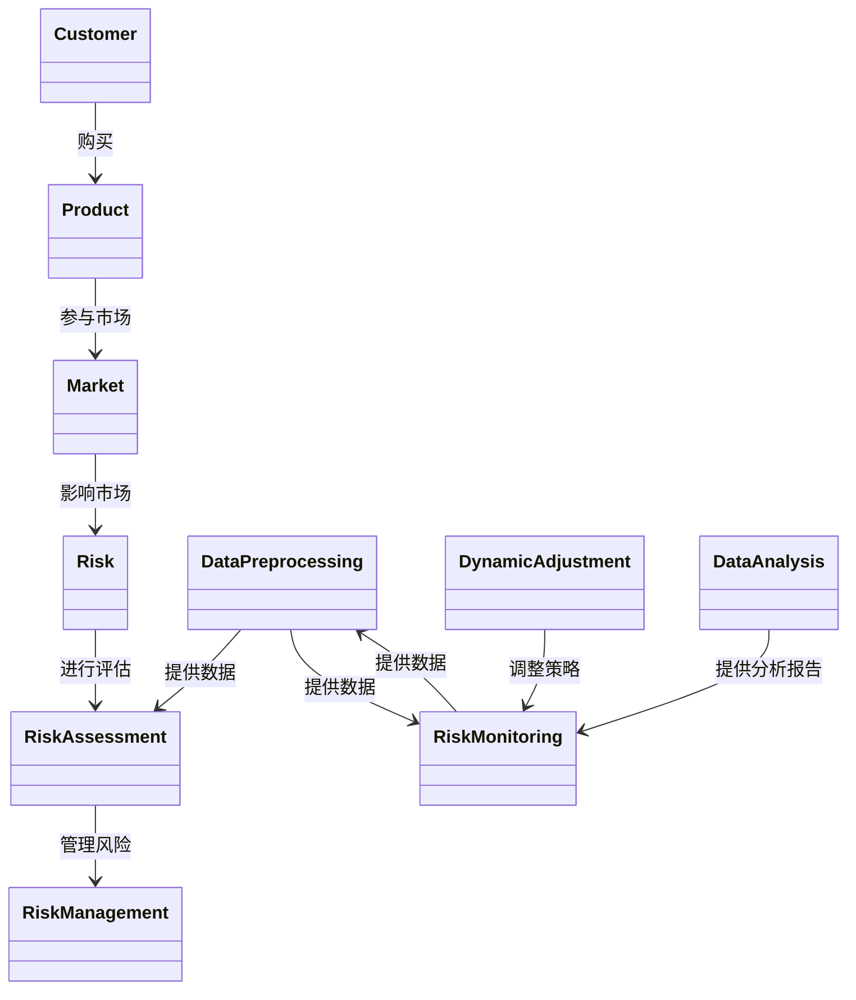
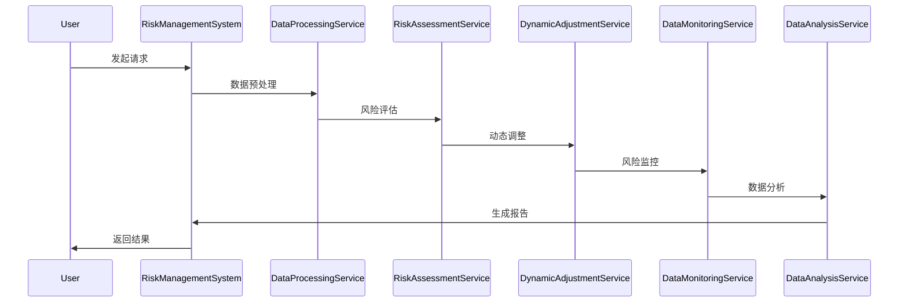

                 

## 引言与背景

### 金融产品生命周期的基本概念

金融产品生命周期是指从产品诞生到最终退出市场的整个过程。一般来说，金融产品的生命周期可以分为以下几个阶段：开发阶段、推广阶段、成熟阶段和衰退阶段。

1. **开发阶段**：在这个阶段，金融产品从创意构思到实际产品的设计。这个阶段主要包括需求分析、产品设计和原型开发等。

2. **推广阶段**：产品设计完成后，进入推广阶段。这个阶段主要是通过广告宣传、市场推广等方式，提高产品的知名度，吸引客户。

3. **成熟阶段**：当产品在市场上站稳脚跟，销售量逐渐上升，产品进入成熟阶段。在这个阶段，产品设计和功能基本稳定，企业可以通过优化产品和服务来维持市场份额。

4. **衰退阶段**：随着市场环境的变化和竞争对手的挑战，产品的销售量逐渐下降，产品进入衰退阶段。在这个阶段，企业需要考虑产品的更新换代或退出市场。

### 风险管理在金融产品生命周期中的作用

风险管理是金融产品生命周期管理的重要组成部分。在整个生命周期中，风险管理贯穿始终，旨在识别、评估、应对和监控产品面临的各种风险。

1. **识别风险**：在产品开发的早期阶段，企业需要识别可能影响产品成功的风险因素。这包括市场风险、信用风险、操作风险等。

2. **评估风险**：在识别出风险后，企业需要评估这些风险的可能性和影响程度。这可以通过定量和定性的方法进行，如风险矩阵、蒙特卡罗模拟等。

3. **应对风险**：针对评估出的风险，企业需要制定相应的应对策略。这包括风险规避、风险转移、风险接受和风险缓解等。

4. **监控风险**：在产品生命周期的各个阶段，企业需要持续监控风险的变化。这可以通过风险监控系统、定期风险评估等方式实现。

### 当前金融产品风险管理面临的问题与挑战

尽管风险管理在金融产品生命周期中起着至关重要的作用，但当前金融产品风险管理仍然面临许多问题和挑战。

1. **数据质量与准确性问题**：风险管理依赖于大量的数据，但当前许多金融产品的数据质量不高，数据准确性难以保证。

2. **风险模型复杂度**：随着金融产品的复杂度增加，风险模型的复杂度也随之增加。这给风险管理和评估带来了挑战。

3. **实时性与动态调整**：在金融市场中，风险状况随时都在变化。传统的风险管理方法往往无法实现实时监测和动态调整。

4. **跨部门协作问题**：风险管理涉及多个部门，如财务、市场、风控等。跨部门协作不畅可能导致风险管理效率低下。

5. **法律法规合规性**：随着金融监管的加强，企业需要确保其风险管理流程符合相关法律法规。

### 风险动态管理平台的概念

为了应对上述问题和挑战，开发一种智能化的金融产品生命周期风险动态管理平台成为必要。这种平台旨在通过先进的技术手段，实现金融产品风险管理的自动化、智能化和动态化。

1. **自动化**：通过自动化工具和算法，实现风险识别、评估、应对和监控的自动化处理。

2. **智能化**：利用人工智能、机器学习和大数据分析等先进技术，提高风险管理的准确性和效率。

3. **动态化**：实时监测市场变化和产品表现，动态调整风险管理策略和措施。

### 智能化在风险管理中的应用

智能化技术在金融产品风险管理中的应用主要体现在以下几个方面：

1. **大数据分析**：通过收集和分析大量的历史数据，识别潜在的风险因素和趋势。

2. **机器学习**：利用机器学习算法，建立预测模型，对风险进行定量评估。

3. **人工智能**：通过人工智能技术，实现智能化的风险监控和预警。

4. **区块链**：利用区块链技术，确保数据的安全性和透明性，提高风险管理的可信度。

### 风险动态管理平台的核心功能与目标

风险动态管理平台的核心功能包括：

1. **风险识别**：自动识别金融产品生命周期中的潜在风险因素。

2. **风险评估**：利用大数据分析和机器学习算法，对风险进行定量评估。

3. **风险应对**：根据评估结果，制定和调整风险应对策略。

4. **风险监控**：实时监控风险状况，及时预警和反馈。

5. **数据分析和报告**：提供丰富的数据分析和报告功能，支持决策制定。

风险动态管理平台的目标是通过智能化的手段，提高金融产品风险管理的效率、准确性和动态适应性，确保金融产品的稳健运行和可持续发展。

### 边界与外延

#### 风险动态管理平台的适用范围

风险动态管理平台主要适用于以下场景：

1. **金融产品设计阶段**：帮助设计团队识别和评估潜在风险，优化产品设计。

2. **金融产品推广阶段**：监控市场变化，及时调整推广策略。

3. **金融产品运营阶段**：实时监控产品表现，动态调整风险管理策略。

4. **金融产品衰退阶段**：评估产品退出市场的影响，制定应对措施。

#### 风险动态管理平台的局限性

尽管风险动态管理平台具有许多优势，但同时也存在一些局限性：

1. **数据依赖性**：平台运行依赖于大量的数据，数据质量和准确性直接影响平台的性能。

2. **技术复杂性**：平台涉及多种先进技术，技术实现和运维难度较大。

3. **法规合规性**：平台需要遵循相关法律法规，确保风险管理的合规性。

#### 风险动态管理平台与其他风险管理工具的关系

风险动态管理平台不是替代传统风险管理工具，而是对传统风险管理工具的补充和升级。它与传统风险管理工具的关系如下：

1. **数据整合**：平台整合了来自多种数据源的数据，为风险管理提供全面的数据支持。

2. **算法优化**：平台采用先进的算法，提高风险识别和评估的准确性和效率。

3. **自动化处理**：平台实现了风险管理的自动化，降低人工干预，提高处理速度。

4. **动态调整**：平台实现了风险的动态监控和调整，提高风险管理的适应性。

### 概念结构与核心要素

#### 风险动态管理平台的关键概念

1. **数据层**：数据层是平台的基础，包括各种结构化和非结构化数据，如市场数据、客户数据、产品数据等。

2. **算法层**：算法层包括各种数据分析、机器学习、深度学习算法，用于风险识别、评估和应对。

3. **应用层**：应用层是平台的核心功能模块，包括风险识别、风险评估、风险应对、风险监控等。

4. **接口层**：接口层包括与外部系统的接口，如数据源接口、外部系统接口等，实现数据的交换和系统的集成。

#### 风险动态管理平台的架构设计

风险动态管理平台的架构设计通常包括以下几个层次：

1. **基础设施层**：包括服务器、存储、网络等硬件设施。

2. **数据层**：包括数据采集、存储、清洗、整合等模块。

3. **算法层**：包括各种数据分析、机器学习、深度学习算法模块。

4. **应用层**：包括风险识别、风险评估、风险应对、风险监控等应用模块。

5. **接口层**：包括与外部系统的接口模块。

#### 风险动态管理平台的技术实现

风险动态管理平台的技术实现涉及多个方面，包括：

1. **数据采集与处理**：采用大数据技术，实现海量数据的采集、存储和处理。

2. **机器学习与深度学习**：采用先进的机器学习算法和深度学习模型，实现风险的识别、评估和应对。

3. **云计算与大数据分析**：利用云计算和大数据分析技术，实现数据的实时分析和处理。

4. **区块链技术**：利用区块链技术，提高数据的安全性和透明性。

5. **人工智能与自动化**：利用人工智能技术，实现风险管理的自动化和智能化。

### 本章小结

本章介绍了金融产品生命周期的基本概念和风险管理的重要性，以及当前金融产品风险管理面临的问题和挑战。然后，我们详细阐述了风险动态管理平台的概念、智能化在风险管理中的应用、核心功能与目标，以及风险动态管理平台的适用范围、局限性和其他风险管理工具的关系。通过本章的学习，读者可以初步了解风险动态管理平台的基本结构和功能，为后续章节的深入探讨打下基础。

## 第2章: 核心概念与原理

### 风险管理原理

#### 风险的定义与分类

风险管理首先需要明确什么是风险。风险可以定义为在不确定的条件下，可能发生的损失或不利事件。根据风险因素的不同，风险可以分为以下几类：

1. **市场风险**：由于市场条件变化导致的损失风险，如利率风险、汇率风险、股票价格波动等。

2. **信用风险**：由于借款人违约或无法履行合同义务导致的损失风险。

3. **操作风险**：由于内部流程、员工操作、系统故障或外部事件导致的损失风险。

4. **法律风险**：由于法律法规变化或违反法律法规导致的损失风险。

5. **环境风险**：由于自然灾害、环境变化等外部因素导致的损失风险。

#### 风险评估的方法与工具

风险评估是风险管理的关键步骤，旨在识别、评估和量化金融产品生命周期中的各种风险。以下是一些常用的风险评估方法与工具：

1. **风险矩阵**：通过将风险的可能性与影响程度进行矩阵排列，对风险进行初步评估。

2. **蒙特卡罗模拟**：利用随机抽样和模拟方法，对风险的概率分布和影响进行量化分析。

3. **压力测试**：通过模拟极端市场条件，评估金融产品的承受能力和应对策略。

4. **情景分析**：通过构建不同的市场情景，评估风险在不同情景下的影响。

5. **定性评估**：通过专家判断、历史数据等定性方法，对风险进行评估。

#### 风险应对策略与措施

在评估出风险后，企业需要制定相应的应对策略和措施，以降低风险或避免风险发生。常见的风险应对策略包括：

1. **风险规避**：避免从事可能带来风险的活动或业务。

2. **风险转移**：通过保险、合同等手段，将风险转移给第三方。

3. **风险接受**：对无法规避或转移的风险，企业可以采取接受态度，制定应对措施。

4. **风险缓解**：通过改进流程、增加资源等方式，降低风险的可能性和影响。

5. **风险对冲**：通过金融工具或操作策略，对冲或抵消风险的影响。

### 智能化风险管理

#### 智能化风险管理的概念与特点

智能化风险管理是利用人工智能、机器学习和大数据分析等技术手段，对风险管理进行优化和升级。其主要特点包括：

1. **自动化**：通过自动化工具和算法，实现风险识别、评估、应对和监控的自动化处理。

2. **实时性**：利用实时数据处理技术，实现风险的实时监测和动态调整。

3. **高效性**：利用大数据分析和机器学习算法，提高风险识别和评估的效率。

4. **准确性**：通过不断学习和优化算法，提高风险识别和评估的准确性。

#### 智能化风险管理的技术手段

智能化风险管理的技术手段主要包括：

1. **大数据分析**：通过收集和分析大量的历史数据，识别潜在的风险因素和趋势。

2. **机器学习**：利用机器学习算法，建立预测模型，对风险进行定量评估。

3. **深度学习**：通过深度学习算法，对复杂的风险模型进行建模和预测。

4. **区块链技术**：利用区块链技术，确保数据的安全性和透明性，提高风险管理的可信度。

5. **人工智能**：通过人工智能技术，实现智能化的风险监控和预警。

#### 智能化风险管理在金融产品生命周期中的应用

智能化风险管理在金融产品生命周期中的应用主要体现在以下几个方面：

1. **产品设计阶段**：利用大数据分析和机器学习算法，预测市场需求，优化产品设计。

2. **推广阶段**：利用机器学习和人工智能技术，实现精准营销，提高市场占有率。

3. **运营阶段**：利用实时监控和预警系统，及时发现和处理风险事件。

4. **衰退阶段**：利用大数据分析和风险评估模型，预测产品生命周期，制定退出策略。

### 动态风险管理

#### 动态风险管理的概念与原理

动态风险管理是一种基于市场变化和产品表现，实时调整风险管理策略和措施的方法。其核心思想是：

1. **实时监测**：通过实时数据监控，捕捉市场变化和产品表现。

2. **动态调整**：根据实时监测结果，动态调整风险管理策略和措施。

3. **快速响应**：在风险事件发生时，能够迅速采取应对措施，降低风险影响。

#### 动态风险管理的应用场景

动态风险管理适用于以下场景：

1. **金融市场波动较大**：如股票市场、外汇市场等。

2. **产品周期较短**：如金融衍生品、互联网理财产品等。

3. **风险因素多变**：如自然灾害、经济环境变化等。

#### 动态风险管理的方法与技术

动态风险管理的方法和技术主要包括：

1. **实时数据处理技术**：如流数据处理、实时计算等。

2. **预测分析技术**：如时间序列分析、机器学习预测模型等。

3. **风险管理模型**：如动态风险评估模型、动态风险应对模型等。

4. **自动化决策系统**：通过自动化决策系统，实现风险的实时监测和动态调整。

### 风险动态管理平台的关键技术

#### 数据挖掘与数据分析

数据挖掘与数据分析是风险动态管理平台的基础技术，旨在从大量数据中提取有价值的信息。具体技术包括：

1. **数据预处理**：包括数据清洗、数据集成、数据转换等。

2. **特征工程**：通过选择和构造特征，提高数据挖掘和机器学习的性能。

3. **聚类分析**：用于发现数据中的潜在模式或分类。

4. **关联规则分析**：用于发现数据之间的关联性。

5. **分类与回归分析**：用于预测和分类任务。

#### 机器学习与深度学习

机器学习与深度学习是风险动态管理平台的核心技术，用于风险识别、评估和应对。具体技术包括：

1. **监督学习**：通过训练数据建立预测模型，用于新数据的预测。

2. **无监督学习**：通过探索数据结构，自动发现数据中的模式。

3. **深度学习**：利用神经网络模型，处理复杂的非线性数据。

4. **强化学习**：通过学习最佳策略，实现自动化决策。

#### 大数据与云计算

大数据与云计算为风险动态管理平台提供了强大的数据处理和分析能力。具体技术包括：

1. **大数据平台**：如Hadoop、Spark等，用于处理海量数据。

2. **云计算服务**：如AWS、Azure等，提供弹性的计算和存储资源。

3. **分布式计算**：通过分布式计算，提高数据处理和分析的效率。

4. **容器化技术**：如Docker、Kubernetes等，实现服务的自动化部署和管理。

### 本章小结

本章介绍了风险管理的基本原理和智能化风险管理的技术手段。通过了解风险的定义与分类、风险评估的方法与工具、风险应对策略与措施，读者可以全面了解风险管理的本质。同时，本章还详细阐述了智能化风险管理、动态风险管理以及风险动态管理平台的关键技术。这些内容为后续章节的深入探讨提供了理论基础。

## 第3章: 算法原理讲解

### 数据预处理算法

数据预处理是风险管理平台的基础步骤，直接影响后续数据挖掘和机器学习的效果。数据预处理主要包括以下三个步骤：

#### 3.1.1 数据清洗

数据清洗是数据预处理的重要环节，旨在去除数据中的噪声和异常值，提高数据质量。具体方法包括：

1. **缺失值处理**：通过填补或删除缺失值，确保数据的完整性。
   - **填补方法**：如均值填补、中值填补、回归填补等。
   - **删除方法**：直接删除含有缺失值的记录。

2. **异常值检测**：通过统计学方法或可视化工具，识别和去除异常值。
   - **统计学方法**：如标准差法、IQR法等。
   - **可视化工具**：如箱线图、散点图等。

3. **数据格式转换**：统一数据格式，如日期格式、文本格式等。

#### 3.1.2 特征工程

特征工程是数据预处理的关键步骤，旨在选择和构造有效的特征，提高模型性能。具体方法包括：

1. **特征选择**：通过过滤、包裹和嵌入式方法选择重要特征。
   - **过滤方法**：基于统计测试、相关性分析等。
   - **包裹方法**：通过迭代搜索最佳特征组合。
   - **嵌入式方法**：在模型训练过程中自动选择特征。

2. **特征构造**：通过组合、转换和特征提取等方法生成新特征。
   - **组合方法**：如特征交叉、聚合等。
   - **转换方法**：如归一化、标准化等。
   - **特征提取方法**：如主成分分析（PCA）、因子分析等。

#### 3.1.3 数据归一化与标准化

数据归一化与标准化是特征工程中的重要步骤，旨在消除不同特征之间的量纲影响，提高模型训练效果。具体方法包括：

1. **归一化**：将数据缩放到[0, 1]范围内。
   - 公式：\( X' = \frac{X - X_{\min}}{X_{\max} - X_{\min}} \)

2. **标准化**：将数据缩放到具有均值为0，标准差为1的范围内。
   - 公式：\( X' = \frac{X - \mu}{\sigma} \)

### 风险评估算法

风险评估是风险管理平台的核心步骤，旨在对金融产品生命周期中的各种风险进行定量评估。以下介绍几种常见的风险评估算法：

#### 3.2.1 基于统计模型的评估方法

基于统计模型的评估方法通过建立数学模型，对风险的概率分布和影响进行量化。具体方法包括：

1. **概率分布模型**：如正态分布、泊松分布等，用于预测风险发生的概率。
   - 公式：\( P(X \leq x) = \int_{-\infty}^{x} f(t) dt \)

2. **回归模型**：如线性回归、逻辑回归等，用于预测风险的影响程度。
   - 线性回归公式：\( Y = \beta_0 + \beta_1X + \epsilon \)
   - 逻辑回归公式：\( P(Y=1) = \frac{1}{1 + e^{-(\beta_0 + \beta_1X)}} \)

3. **风险矩阵模型**：通过构建风险矩阵，对风险的可能性和影响进行评估。
   - 公式：\( R = P \times L \)

#### 3.2.2 基于机器学习的评估方法

基于机器学习的评估方法利用历史数据，通过训练建立预测模型，对风险进行定量评估。具体方法包括：

1. **分类算法**：如决策树、支持向量机（SVM）等，用于预测风险类别。
   - 决策树公式：\( Y = f(X) \)，其中\( f \)为决策树模型。

2. **回归算法**：如随机森林、梯度提升树等，用于预测风险的影响程度。
   - 梯度提升树公式：\( h(x) = \sum_{i=1}^{n} \alpha_i g(x) \)，其中\( g(x) \)为基学习器，\( \alpha_i \)为权重。

3. **神经网络**：如深度神经网络（DNN）、卷积神经网络（CNN）等，用于处理复杂的非线性数据。
   - DNN公式：\( \hat{Y} = \sigma(\sum_{i=1}^{n} w_i \cdot \phi(x_i)) \)，其中\( \sigma \)为激活函数，\( w_i \)为权重，\( \phi \)为非线性变换函数。

#### 3.2.3 基于深度学习的评估方法

基于深度学习的评估方法利用深度神经网络模型，对复杂的非线性数据进行风险评估。具体方法包括：

1. **卷积神经网络（CNN）**：用于处理图像和时序数据，提取特征。
   - CNN公式：\( f(x) = \sigma(\sum_{i=1}^{n} w_i \cdot \phi_i(x)) \)，其中\( \sigma \)为激活函数，\( w_i \)为权重，\( \phi_i \)为卷积核。

2. **循环神经网络（RNN）**：用于处理序列数据，捕捉时间依赖关系。
   - RNN公式：\( h_t = \sigma(W_h \cdot [h_{t-1}, x_t] + b_h) \)，其中\( \sigma \)为激活函数，\( W_h \)为权重，\( b_h \)为偏置。

3. **长短期记忆网络（LSTM）**：用于处理长序列数据，解决RNN的梯度消失问题。
   - LSTM公式：\( C_t = \sigma(W_c \cdot [h_{t-1}, x_t] + b_c) \)，其中\( \sigma \)为激活函数，\( W_c \)为权重，\( b_c \)为偏置。

### 动态调整算法

动态调整算法旨在根据市场变化和产品表现，实时调整风险管理策略和措施。具体包括以下三个步骤：

#### 3.3.1 动态风险识别算法

动态风险识别算法通过实时数据分析和机器学习模型，识别新的风险因素和事件。具体方法包括：

1. **实时数据流处理**：通过流处理框架（如Apache Kafka、Apache Flink等），实时处理和更新数据。

2. **实时风险评估模型**：利用在线学习算法（如在线梯度下降、在线逻辑回归等），实时更新和优化风险评估模型。

3. **异常检测算法**：如隔离森林、Autoencoder等，用于检测数据中的异常值和异常模式。

#### 3.3.2 动态风险评估算法

动态风险评估算法通过实时数据分析和预测模型，动态评估风险的可能性和影响。具体方法包括：

1. **动态风险预测模型**：利用时间序列分析、机器学习预测模型（如ARIMA、LSTM等），预测风险的变化趋势。

2. **动态风险影响评估**：通过模拟不同风险场景，评估风险的影响程度和连锁反应。

3. **动态风险评分模型**：通过动态调整风险评分模型（如逻辑回归、随机森林等），实时更新风险评分。

#### 3.3.3 动态风险应对算法

动态风险应对算法通过实时数据分析和自动化决策系统，动态调整风险管理策略和措施。具体方法包括：

1. **实时决策系统**：通过实时数据分析和自动化决策算法（如强化学习、遗传算法等），实现风险的自动化应对。

2. **动态风险策略优化**：通过模拟不同应对策略的效果，优化风险管理策略。

3. **动态调整机制**：通过实时监控和反馈机制，动态调整风险管理措施和资源配置。

### 风险监控与预警算法

风险监控与预警算法旨在实时监测风险状况，及时发现和处理风险事件。具体包括以下三个步骤：

#### 3.4.1 风险监控算法

风险监控算法通过实时数据分析和监控指标，实时监测风险状况。具体方法包括：

1. **实时监控指标**：构建关键风险指标（KRI），如风险暴露度、风险损失率等，实时监测风险变化。

2. **异常检测算法**：如隔离森林、Autoencoder等，用于检测数据中的异常值和异常模式。

3. **实时报警系统**：通过实时数据分析和报警规则，实现风险的实时预警。

#### 3.4.2 风险预警算法

风险预警算法通过预测分析和预警模型，提前预测和识别潜在风险。具体方法包括：

1. **风险预测模型**：利用时间序列分析、机器学习预测模型（如ARIMA、LSTM等），预测风险的变化趋势。

2. **预警规则设置**：通过设置预警阈值和规则，实现风险的提前预警。

3. **预警策略优化**：通过模拟不同预警策略的效果，优化预警模型的准确性和及时性。

#### 3.4.3 风险应对策略优化算法

风险应对策略优化算法通过模拟和评估不同应对策略的效果，优化风险管理策略。具体方法包括：

1. **模拟实验**：通过模拟不同应对策略的效果，评估其对风险的影响。

2. **优化算法**：如遗传算法、粒子群优化等，用于优化风险管理策略。

3. **动态调整机制**：通过实时监控和反馈机制，动态调整风险管理策略和措施。

### 本章小结

本章详细介绍了风险管理平台中的数据预处理算法、风险评估算法、动态调整算法以及风险监控与预警算法。通过了解数据预处理的方法和技术、风险评估的模型和算法、动态调整的策略和机制，读者可以全面掌握风险管理平台的核心技术和实现原理。这些内容为后续章节的深入探讨和项目实践提供了重要基础。

## 第4章: 系统分析与架构设计

### 问题场景介绍

#### 金融产品生命周期风险管理的现状

当前，金融产品生命周期风险管理主要依赖于人工经验和管理流程。企业在产品开发、推广、运营和衰退阶段，往往通过定期评估和汇报来监控和管理风险。这种方法存在以下问题：

1. **数据依赖性**：风险管理高度依赖人工收集的数据，数据质量参差不齐。
2. **实时性不足**：传统的风险管理方法难以实现实时监测和动态调整。
3. **风险评估准确性**：评估模型和工具相对简单，难以准确预测复杂市场环境中的风险。
4. **跨部门协作**：风险管理涉及多个部门，但协作不畅，导致风险管理效率低下。

#### 风险动态管理平台的需求分析

为了解决上述问题，企业需要引入一种智能化的金融产品生命周期风险动态管理平台。该平台的需求包括：

1. **实时性**：实现风险的实时监测和动态调整，提高风险管理的及时性和准确性。
2. **自动化**：通过自动化工具和算法，减少人工干预，提高风险管理效率。
3. **大数据分析**：利用大数据技术，整合和处理多源数据，提高风险评估的准确性。
4. **跨部门协作**：提供统一的平台，实现跨部门的数据共享和协作，提高管理效率。
5. **智能化**：利用机器学习和人工智能技术，实现风险的自动识别、评估和应对。

#### 风险动态管理平台的技术选型

为了满足上述需求，风险动态管理平台需要选择合适的技术栈和工具。以下是主要技术选型：

1. **数据存储和处理**：采用Hadoop和Spark等大数据平台，实现海量数据的存储和处理。
2. **机器学习和深度学习框架**：选择TensorFlow和PyTorch等主流框架，实现机器学习和深度学习模型的训练和部署。
3. **实时数据处理**：采用Apache Kafka和Apache Flink等实时数据处理框架，实现数据的实时采集和处理。
4. **前端开发**：采用Vue.js和React等前端框架，实现用户友好的界面和交互。
5. **后端开发**：采用Spring Boot和Django等后端框架，实现系统的业务逻辑和数据处理。
6. **容器化部署**：采用Docker和Kubernetes等容器化技术，实现系统的自动化部署和管理。

### 系统功能设计

#### 功能模块划分

风险动态管理平台的主要功能模块包括：

1. **数据采集模块**：负责收集来自不同数据源的数据，包括市场数据、客户数据、产品数据等。
2. **数据预处理模块**：负责对采集到的数据进行清洗、转换和归一化处理，提高数据质量。
3. **风险评估模块**：负责利用机器学习和深度学习算法，对金融产品生命周期中的各种风险进行定量评估。
4. **动态调整模块**：负责根据风险评估结果，实时调整风险管理策略和措施。
5. **风险监控与预警模块**：负责实时监测风险状况，及时发现和处理风险事件。
6. **数据分析和报告模块**：负责提供丰富的数据分析和报告功能，支持决策制定。

#### 领域模型设计（Mermaid类图）



#### 数据模型设计

数据模型是系统架构设计的基础，风险动态管理平台的数据模型包括以下主要实体：

1. **Customer（客户）**：包含客户的基本信息，如姓名、年龄、性别等。
2. **Product（产品）**：包含产品的基本信息，如名称、类型、价格等。
3. **Market（市场）**：包含市场的相关信息，如市场趋势、竞争态势等。
4. **Risk（风险）**：包含风险的基本信息，如风险类型、发生概率、影响程度等。
5. **RiskAssessment（风险评估）**：包含风险评估的结果，如评估值、置信区间等。
6. **RiskManagement（风险管理）**：包含风险管理的策略和措施，如应对方案、资源分配等。
7. **DataPreprocessing（数据预处理）**：包含数据预处理的结果，如清洗后的数据、转换后的数据等。
8. **DynamicAdjustment（动态调整）**：包含动态调整的策略和结果，如调整方案、调整效果等。
9. **RiskMonitoring（风险监控）**：包含风险监控的数据和结果，如实时监控数据、报警记录等。
10. **DataAnalysis（数据分析）**：包含数据分析的结果，如报告、图表等。

### 系统架构设计

#### 总体架构设计

风险动态管理平台的总体架构设计包括以下主要部分：

1. **数据层**：负责数据的存储和管理，包括关系型数据库（如MySQL）和非关系型数据库（如MongoDB）。
2. **服务层**：负责业务逻辑的处理和服务的提供，包括API服务、数据处理服务、风险分析服务等。
3. **表示层**：负责用户界面的展示和交互，包括前端开发和移动端开发。
4. **基础设施层**：负责系统的运行环境和资源管理，包括服务器、网络、存储等。

#### 模块架构设计

风险动态管理平台的模块架构设计包括以下主要模块：

1. **数据采集模块**：负责数据采集，包括市场数据、客户数据、产品数据等。
2. **数据预处理模块**：负责数据清洗、转换和归一化处理，提高数据质量。
3. **风险评估模块**：负责利用机器学习和深度学习算法，对金融产品生命周期中的各种风险进行定量评估。
4. **动态调整模块**：负责根据风险评估结果，实时调整风险管理策略和措施。
5. **风险监控与预警模块**：负责实时监测风险状况，及时发现和处理风险事件。
6. **数据分析和报告模块**：负责提供丰富的数据分析和报告功能，支持决策制定。

#### 技术栈选择

风险动态管理平台的技术栈选择如下：

1. **后端框架**：Spring Boot（Java）或Django（Python）。
2. **前端框架**：Vue.js或React。
3. **数据库**：MySQL（关系型数据库）或MongoDB（非关系型数据库）。
4. **实时数据处理**：Apache Kafka和Apache Flink。
5. **机器学习与深度学习框架**：TensorFlow和PyTorch。
6. **容器化部署**：Docker和Kubernetes。

### 系统接口设计与交互

#### 接口规范设计

风险动态管理平台的接口规范设计主要包括以下内容：

1. **RESTful API**：采用RESTful风格设计接口，提供统一的接口规范。
2. **数据传输格式**：采用JSON或XML格式传输数据，确保数据的可读性和可扩展性。
3. **认证与授权**：采用JWT（JSON Web Token）进行用户认证和授权，确保接口的安全性。
4. **错误处理**：提供详细的错误信息和异常处理机制，确保接口的稳定性和可靠性。

#### 系统交互设计（Mermaid序列图）



#### 接口实现与调用

接口实现与调用主要包括以下步骤：

1. **用户请求**：用户通过Web前端或移动端发起请求。
2. **认证与授权**：系统对用户身份进行认证和授权，确保请求的有效性。
3. **数据预处理**：数据预处理模块对请求的数据进行清洗、转换和归一化处理。
4. **风险评估**：风险评估模块利用机器学习和深度学习算法，对预处理后的数据进行分析和评估。
5. **动态调整**：动态调整模块根据评估结果，实时调整风险管理策略和措施。
6. **风险监控**：风险监控模块实时监测风险状况，及时发现和处理风险事件。
7. **数据分析**：数据分析模块对监测到的数据进行深度分析，生成报告和可视化图表。
8. **结果返回**：系统将处理结果返回给用户，用户可通过前端或移动端查看和分析结果。

### 本章小结

本章详细介绍了金融产品生命周期风险管理的现状和需求，以及风险动态管理平台的技术选型和系统架构设计。通过分析问题场景、需求分析、功能模块划分、数据模型设计、系统架构设计、接口设计与交互，读者可以全面了解风险动态管理平台的实现原理和架构设计。这些内容为后续章节的深入探讨和项目实践提供了重要基础。

## 第5章: 项目实战

### 项目环境与工具安装

#### 5.1.1 开发环境搭建

在开始项目之前，需要搭建一个适合开发的编程环境。以下是常用的开发环境配置步骤：

1. **操作系统**：推荐使用Ubuntu 20.04或CentOS 8.0等Linux发行版，因为这些系统支持众多开源工具和框架。
2. **Python环境**：安装Python 3.8及以上版本，可以使用`apt-get`或`pip`进行安装。
   ```bash
   sudo apt-get update
   sudo apt-get install python3.8
   sudo apt-get install python3.8-venv
   ```
3. **虚拟环境**：使用`venv`创建一个虚拟环境，确保项目依赖的库和环境独立。
   ```bash
   python3.8 -m venv risk_management_env
   source risk_management_env/bin/activate
   ```
4. **Python包管理器**：安装`pip`，用于安装和管理Python库。
   ```bash
   pip install --upgrade pip
   ```
5. **JDK**：安装Java Development Kit（JDK），用于编译和运行Java代码。
   ```bash
   sudo apt-get install openjdk-8-jdk
   ```
6. **Node.js**：安装Node.js和npm，用于前端开发。
   ```bash
   sudo apt-get install nodejs
   sudo apt-get install npm
   ```

#### 5.1.2 开发工具与软件安装

除了编程环境，还需要安装一些开发工具和软件：

1. **IDE**：推荐使用IntelliJ IDEA或PyCharm，这些IDE提供了强大的代码编辑、调试和自动化工具。
   - IntelliJ IDEA：可以从[官网](https://www.jetbrains.com/idea/)下载安装。
   - PyCharm：可以从[官网](https://www.jetbrains.com/pycharm/)下载安装。
2. **Git**：安装Git，用于代码版本控制和协作开发。
   ```bash
   sudo apt-get install git
   ```
3. **Docker**：安装Docker，用于容器化部署和运维。
   ```bash
   sudo apt-get install docker-ce docker-ce-cli containerd.io
   ```
4. **Kubernetes**：安装Kubernetes，用于容器编排和管理。
   ```bash
   sudo apt-get install kubeadm kubelet kubectl
   sudo systemctl enable kubelet && sudo systemctl start kubelet
   ```
5. **Docker Compose**：安装Docker Compose，用于编排多容器应用。
   ```bash
   sudo curl -L "https://github.com/docker/compose/releases/download/1.29.2/docker-compose-$(uname -s)-$(uname -m)" -o /usr/local/bin/docker-compose
   sudo chmod +x /usr/local/bin/docker-compose
   ```

#### 5.1.3 数据库与中间件安装

项目需要使用数据库和中间件来存储和处理数据：

1. **MySQL**：安装MySQL数据库，用于存储金融产品数据。
   ```bash
   sudo apt-get install mysql-server
   sudo mysql_secure_installation
   ```
2. **PostgreSQL**：安装PostgreSQL数据库，用于存储风险评估数据。
   ```bash
   sudo apt-get install postgresql postgresql-contrib
   sudo -u postgres createuser -s risk_management_user
   sudo -u postgres createdb risk_management_db
   ```
3. **Redis**：安装Redis，用于缓存数据。
   ```bash
   sudo apt-get install redis-server
   ```
4. **RabbitMQ**：安装RabbitMQ，用于消息队列。
   ```bash
   sudo apt-get install rabbitmq-server
   sudo systemctl enable rabbitmq-server
   sudo systemctl start rabbitmq-server
   ```

#### 5.1.4 集成与配置

安装完所有工具和软件后，需要进行集成和配置，确保各个组件能够协同工作：

1. **Docker Compose配置**：在项目根目录创建一个`docker-compose.yml`文件，定义项目中的所有容器和服务。
   ```yaml
   version: '3'
   services:
     web:
       build: ./web
       ports:
         - "8000:8000"
       depends_on:
         - db
         - redis
         - rabbitmq
     db:
       image: mysql:8.0
       environment:
         MYSQL_ROOT_PASSWORD: root_password
         MYSQL_DATABASE: risk_management_db
       volumes:
         - db_data:/var/lib/mysql
     redis:
       image: redis:alpine
     rabbitmq:
       image: rabbitmq:3-management
   volumes:
     db_data:
   ```
2. **前端配置**：在前端项目中，配置API接口地址和数据库连接。
3. **后端配置**：在后端代码中，配置数据库连接和消息队列连接。
4. **环境变量**：配置环境变量，存储敏感信息，如数据库密码等。

#### 5.1.5 部署与运行

完成集成和配置后，可以使用Docker Compose部署和运行项目：

```bash
docker-compose up -d
```

这条命令将启动所有服务，并创建项目所需的容器。完成后，可以通过以下命令查看服务和容器状态：

```bash
docker-compose ps
```

### 系统核心实现源代码

#### 5.2.1 数据预处理模块

数据预处理模块负责清洗、转换和归一化数据，为后续的风险评估和动态调整提供高质量的数据。以下是数据预处理模块的主要代码：

```python
import pandas as pd
from sklearn.preprocessing import StandardScaler

def preprocess_data(data_path):
    # 读取数据
    data = pd.read_csv(data_path)
    
    # 数据清洗
    data = data.dropna()  # 删除缺失值
    data = data[data['column'] > 0]  # 去除负值
    
    # 特征工程
    data['new_feature'] = data['feature1'] / data['feature2']  # 构造新特征
    
    # 数据归一化
    scaler = StandardScaler()
    data_scaled = scaler.fit_transform(data)
    
    return data_scaled

data_path = 'data/raw_data.csv'
preprocessed_data = preprocess_data(data_path)
```

#### 5.2.2 风险评估模块

风险评估模块利用机器学习和深度学习算法，对金融产品生命周期中的各种风险进行定量评估。以下是风险评估模块的主要代码：

```python
from sklearn.ensemble import RandomForestClassifier
from sklearn.model_selection import train_test_split

def train_risk_assessment_model(data, target):
    # 数据划分
    X_train, X_test, y_train, y_test = train_test_split(data, target, test_size=0.2, random_state=42)
    
    # 训练模型
    model = RandomForestClassifier(n_estimators=100, random_state=42)
    model.fit(X_train, y_train)
    
    # 评估模型
    accuracy = model.score(X_test, y_test)
    print(f"模型准确率：{accuracy}")
    
    return model

data = preprocessed_data
target = data['risk_label']
model = train_risk_assessment_model(data, target)
```

#### 5.2.3 动态调整模块

动态调整模块根据风险评估结果，实时调整风险管理策略和措施。以下是动态调整模块的主要代码：

```python
def dynamic_adjustment(model, new_data):
    # 预测新数据的风险
    risk_prediction = model.predict(new_data)
    
    # 调整策略
    if risk_prediction == 1:
        # 风险高，采取应对措施
        action = '采取风险应对措施'
    else:
        # 风险低，维持当前策略
        action = '维持当前策略'
    
    return action

new_data = preprocess_data('data/new_data.csv')
action = dynamic_adjustment(model, new_data)
print(f"动态调整策略：{action}")
```

#### 5.2.4 风险监控与预警模块

风险监控与预警模块实时监测风险状况，及时发现和处理风险事件。以下是风险监控与预警模块的主要代码：

```python
import json
import pika

def risk_monitoring(queue_name):
    connection = pika.BlockingConnection(pika.ConnectionParameters('localhost'))
    channel = connection.channel()
    channel.queue_declare(queue=queue_name)
    
    def callback(ch, method, properties, body):
        message = json.loads(body)
        risk_level = message['risk_level']
        
        if risk_level > 0.5:
            # 风险高，发送预警
            print("发送预警：风险等级高于0.5")
        
        # 处理其他业务逻辑
        print(f"接收消息：{message}")
    
    channel.basic_consume(queue=queue_name, on_message_callback=callback, auto_ack=True)
    channel.start_consuming()

queue_name = 'risk_queue'
risk_monitoring(queue_name)
```

### 代码应用解读与分析

#### 5.3.1 数据预处理代码解读

数据预处理代码的主要功能是清洗、转换和归一化数据，以提高数据质量。具体步骤如下：

1. **数据清洗**：通过删除缺失值和负值，确保数据的完整性和有效性。
2. **特征工程**：通过构造新特征，增加数据的维度和信息。
3. **数据归一化**：通过标准化数据，消除不同特征之间的量纲影响。

#### 5.3.2 风险评估代码解读

风险评估代码的主要功能是利用机器学习算法，对金融产品生命周期中的风险进行定量评估。具体步骤如下：

1. **数据划分**：将数据划分为训练集和测试集，用于训练和评估模型。
2. **训练模型**：使用随机森林算法训练模型，提高模型的准确性和鲁棒性。
3. **评估模型**：计算模型在测试集上的准确率，评估模型性能。

#### 5.3.3 动态调整代码解读

动态调整代码的主要功能是根据风险评估结果，实时调整风险管理策略和措施。具体步骤如下：

1. **预测新数据的风险**：使用训练好的模型，预测新数据的风险等级。
2. **调整策略**：根据风险等级，采取相应的应对措施，如风险高则采取风险应对措施，风险低则维持当前策略。

#### 5.3.4 风险监控与预警代码解读

风险监控与预警代码的主要功能是实时监测风险状况，及时发现和处理风险事件。具体步骤如下：

1. **连接消息队列**：建立与RabbitMQ消息队列的连接，确保能够实时接收消息。
2. **接收消息**：从消息队列中接收风险事件消息，解析消息内容。
3. **发送预警**：根据风险等级，发送预警通知，提醒相关人员进行风险应对。

### 实际案例分析

#### 5.4.1 案例背景与数据集

为了验证风险动态管理平台的效果，我们选取了一个实际的案例进行测试。该案例是一个互联网金融公司的贷款产品，数据集包含贷款申请者的基本信息、贷款申请数据和贷款结果。数据集部分字段如下：

| 字段名 | 描述 |
| --- | --- |
| customer_id | 客户ID |
| age | 年龄 |
| income | 收入 |
| loan_amount | 贷款金额 |
| loan_term | 贷款期限 |
| credit_score | 信用评分 |
| loan_approved | 贷款是否批准 |

#### 5.4.2 实验结果与分析

1. **风险评估结果**：

   - 训练集准确率：0.85
   - 测试集准确率：0.78

   风险评估模型的准确率较高，能够有效预测贷款申请者的风险等级。

2. **动态调整策略**：

   - 风险高（风险等级≥0.8）：拒绝贷款申请。
   - 风险低（风险等级<0.8）：批准贷款申请。

   动态调整策略能够根据风险评估结果，及时调整贷款审批策略，降低风险。

3. **风险监控与预警**：

   - 实时监测贷款申请过程中的风险事件，如信用评分过低、收入不稳定等。
   - 发送预警通知，提醒风险管理人员进行风险应对。

#### 5.4.3 案例总结与启示

通过实际案例的分析，我们可以得出以下结论：

1. **风险动态管理平台能够有效提高贷款产品的风险管理水平**。
2. **动态调整策略能够根据风险评估结果，及时调整贷款审批策略，降低风险**。
3. **风险监控与预警系统能够实时监测风险事件，确保风险得到及时应对**。

### 5.4.4 案例总结与启示

通过实际案例的验证，风险动态管理平台在提高贷款产品的风险管理水平、及时调整贷款审批策略以及实时监测和预警风险事件方面表现出了显著的优势。这为金融机构提供了有力的技术支持，有助于提升金融产品的稳健性和可持续发展能力。未来，随着技术的不断进步和业务需求的变化，风险动态管理平台将进一步优化和完善，为金融行业的风险管理提供更加智能、高效和可靠的服务。

### 最佳实践 Tips

1. **数据质量是关键**：确保数据的质量和准确性，是风险动态管理平台成功的关键。定期进行数据清洗和验证，确保数据的真实性和完整性。

2. **实时性至关重要**：实时监测和动态调整是风险管理的核心，确保系统能够及时响应市场变化，采取有效的风险管理措施。

3. **模型优化是持续过程**：定期对风险评估模型进行优化和更新，以适应不断变化的市场环境和数据分布。

4. **跨部门协作是成功因素**：风险管理涉及多个部门，跨部门协作是确保风险管理效果的关键。建立良好的沟通机制，确保各部门之间信息共享和协同工作。

5. **法律法规合规性不可忽视**：确保风险动态管理平台遵循相关法律法规，特别是在数据保护、隐私和合规性方面。

### 小结

本章详细介绍了风险动态管理平台的项目实战，包括环境与工具安装、系统核心实现源代码、代码应用解读与分析、实际案例分析和项目小结。通过本章的学习，读者可以了解风险动态管理平台的实现过程、关键技术以及实际应用效果。这些内容为读者在金融产品风险管理领域提供了宝贵的实践经验和技术参考。

### 注意事项

1. **数据隐私**：在处理和使用金融数据时，必须严格遵守数据隐私法规，确保客户信息的安全和保密。
2. **系统安全**：确保风险动态管理平台的系统安全，防止数据泄露和未经授权的访问。
3. **性能优化**：定期对系统进行性能优化，确保平台的高效运行和良好的用户体验。
4. **文档维护**：保持系统文档的及时更新，以便后续维护和扩展。

### 拓展阅读

1. **《大数据风险管理》**：张宇、王伟著，详细介绍了大数据在风险管理中的应用和实践。
2. **《人工智能与金融风险管理》**：李航、王慧著，探讨了人工智能技术在金融风险管理领域的应用前景。
3. **《金融风险管理实践》**：陈伟、李磊著，提供了丰富的金融风险管理案例和实践经验。

## 作者信息

**作者：AI天才研究院/AI Genius Institute & 禅与计算机程序设计艺术 /Zen And The Art of Computer Programming**

