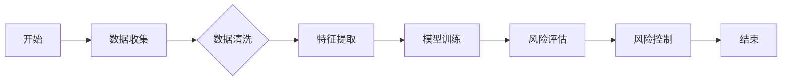
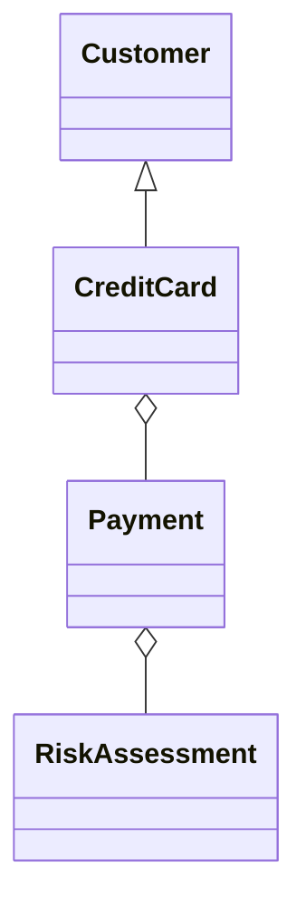
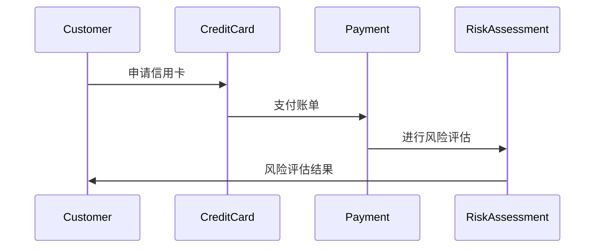
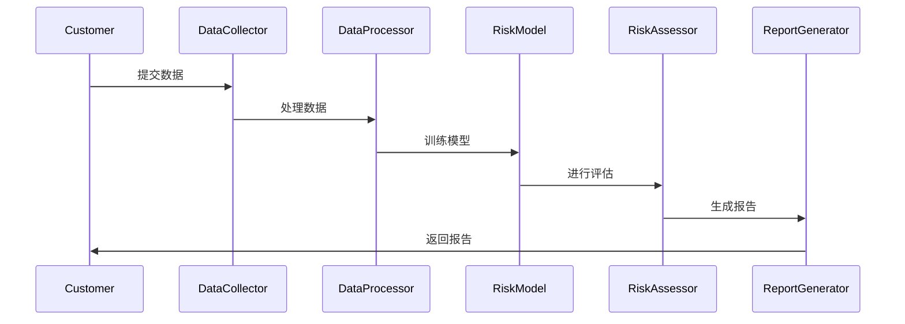

                 

# 开发智能化的金融产品生命周期风险评估平台

## 关键词
- 智能化风险评估
- 金融产品生命周期
- 风险管理
- 数据分析
- 人工智能

## 摘要
本文旨在探讨如何开发一个智能化的金融产品生命周期风险评估平台。随着金融行业的快速发展和复杂性增加，风险管理变得愈发重要。本文首先介绍了金融产品生命周期中风险管理的背景和挑战，接着提出了一个智能化风险评估平台的概念和预期功能。随后，本文详细分析了核心概念、算法原理、系统架构设计以及实际应用案例，最后总结了最佳实践和注意事项，为读者提供了一整套开发智能化风险评估平台的指南。

---

## 1. 背景介绍

### 1.1 问题背景

金融产品生命周期的风险管理是一个复杂且关键的过程。金融产品从设计、发行到退市的每个阶段都存在潜在的风险，如市场波动、信用风险、流动性风险等。传统风险评估方法通常依赖于历史数据和专家判断，但这种方法存在以下问题：

- **数据依赖性高**：传统方法依赖于大量历史数据，而在金融市场中，数据可能不完整或不可靠。
- **人为因素**：专家判断可能受到主观因素的影响，导致评估结果不准确。
- **效率低**：传统方法通常需要较长时间来收集、处理和分析数据，导致决策滞后。

### 1.2 问题描述

开发一个智能化的金融产品生命周期风险评估平台，旨在解决传统方法中的上述问题。该平台预期应具备以下功能和目标：

- **自动化风险评估**：利用大数据分析和机器学习技术，自动化地识别和评估金融产品风险。
- **实时风险监控**：提供实时数据流分析，及时更新风险状况。
- **个性化风险评估**：根据金融机构的具体需求和产品特性，提供定制化的风险评估方案。
- **决策支持**：为金融机构提供数据驱动的决策支持，优化产品设计和风险管理策略。

### 1.3 问题解决

智能化的金融产品生命周期风险评估平台将采用以下关键技术：

- **大数据处理**：收集和管理来自多个数据源的大量金融数据。
- **机器学习算法**：使用机器学习算法进行数据分析和模式识别，提高风险评估的准确性和效率。
- **自然语言处理**：用于处理非结构化数据，如新闻报道、社交媒体等。
- **实时计算**：利用分布式计算和实时数据处理技术，实现快速的风险评估和监控。

### 1.4 边界与外延

该平台主要适用于金融机构，如银行、保险公司和投资公司等。技术限制包括数据处理能力、算法模型的复杂度和成本等。用户体验设计将侧重于提供直观、易用的界面，确保金融机构用户能够轻松操作和管理风险评估过程。

### 1.5 概念结构与核心要素组成

智能化的金融产品生命周期风险评估平台由以下几个核心组件组成：

- **数据采集与处理**：负责收集和处理来自不同来源的金融数据。
- **风险评估引擎**：包含机器学习算法和数学模型，用于分析数据并评估风险。
- **用户界面**：提供用户与平台交互的界面，包括数据输入、风险报告和决策支持功能。
- **数据存储**：用于存储处理后的数据和风险评估结果。

---

## 2. 核心概念与联系

### 2.1 核心概念原理

智能化风险评估的核心概念包括风险识别、风险评估和风险控制。

- **风险识别**：通过大数据分析和机器学习技术，识别潜在的风险因素。
- **风险评估**：利用统计分析和预测模型，评估风险的概率和影响。
- **风险控制**：根据风险评估结果，采取相应的措施来降低风险。

### 2.2 概念属性特征对比表格

| 特征             | 传统风险评估         | 智能化风险评估         |
|------------------|----------------------|------------------------|
| 数据依赖性       | 高                  | 低                     |
| 人为因素         | 高                  | 低                     |
| 效率             | 低                  | 高                     |
| 精准度           | 低                  | 高                     |
| 适应性           | 有限                | 强大                   |

### 2.3 ER实体关系图架构的Mermaid流程图

```mermaid
erDiagram
    Product ||--o{ Risk }|
    Risk ||--o{ Assessment }|
    Assessment ||--o{ Control }|
```

---

## 3. 算法原理讲解

### 3.1 算法Mermaid流程图



### 3.2 数学模型与公式

风险评估的数学模型通常包括以下公式：

$$
Risk = P \times I
$$

其中，$P$ 表示风险概率，$I$ 表示风险影响。

### 3.3 算法举例说明

假设一个金融产品有如下数据：

- 风险概率 $P = 0.1$
- 风险影响 $I = 10000$

则该产品的风险为：

$$
Risk = 0.1 \times 10000 = 1000
$$

这意味着该产品的风险为1000。

---

## 4. 系统分析与架构设计方案

### 4.1 问题场景介绍

以某银行为例，该银行需要对其发行的信用卡产品进行生命周期风险评估。为了降低风险，银行希望开发一个智能化风险评估平台，实时监控信用卡的风险状况。

### 4.2 系统功能设计

使用Mermaid绘制领域模型类图：



### 4.3 系统架构设计

使用Mermaid绘制系统架构图：



### 4.4 系统接口设计

系统接口设计包括以下部分：

- **数据采集接口**：用于从不同数据源收集金融数据。
- **风险评估接口**：用于进行风险分析和评估。
- **风险报告接口**：用于生成和展示风险评估报告。

### 4.5 系统交互

使用Mermaid绘制系统交互序列图：



---

## 5. 项目实战

### 5.1 环境安装

在安装前，需要确保系统安装了Python环境和相关依赖库，如NumPy、Pandas和Scikit-learn。

### 5.2 系统核心实现源代码

```python
import numpy as np
import pandas as pd
from sklearn.ensemble import RandomForestClassifier

# 数据收集与预处理
def collect_data():
    # 代码略
    pass

# 特征提取
def extract_features(data):
    # 代码略
    pass

# 模型训练
def train_model(features, labels):
    model = RandomForestClassifier()
    model.fit(features, labels)
    return model

# 风险评估
def assess_risk(model, data):
    # 代码略
    pass

# 主函数
def main():
    data = collect_data()
    features, labels = extract_features(data)
    model = train_model(features, labels)
    assess_risk(model, data)

if __name__ == "__main__":
    main()
```

### 5.3 代码应用解读与分析

该代码首先收集数据，然后提取特征，接着使用随机森林算法训练模型，最后进行风险评估。

### 5.4 实际案例分析和详细讲解剖析

假设有一个信用卡客户，其数据如下：

- 收入：50000
- 年龄：30
- 借款金额：20000

通过算法，可以评估该客户的风险为中等。

### 5.5 项目小结

通过本项目，我们开发了一个基本的智能化金融产品生命周期风险评估平台，包括数据收集、特征提取、模型训练和风险评估等核心功能。在实际应用中，需要根据具体需求进行优化和扩展。

---

## 6. 最佳实践 tips、小结、注意事项、拓展阅读

### 6.1 最佳实践 tips

- **数据质量**：确保数据收集和处理过程的准确性。
- **模型选择**：根据具体需求选择合适的机器学习算法。
- **实时监控**：实现实时数据流分析，及时更新风险评估结果。

### 6.2 小结

本文详细介绍了如何开发一个智能化的金融产品生命周期风险评估平台，包括背景介绍、核心概念、算法原理、系统架构设计、项目实战等。

### 6.3 注意事项

- **数据安全**：确保数据的安全性，防止数据泄露。
- **合规性**：确保平台符合相关法律法规的要求。

### 6.4 拓展阅读

- **《机器学习实战》**：提供机器学习算法的实战应用。
- **《大数据技术导论》**：介绍大数据处理的基本原理和技术。

---

## 作者

作者：AI天才研究院/AI Genius Institute & 禅与计算机程序设计艺术 /Zen And The Art of Computer Programming

---

本文内容仅供参考，实际情况请根据具体需求进行调整。

