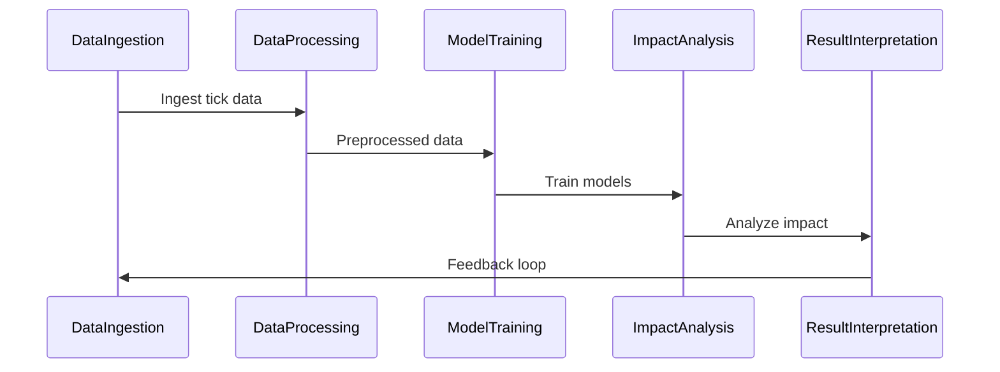

                 


### Introduction

#### **Title: Developing Intelligent Financial Market Microstructure Change Impact Assessment Tools**

#### Keywords: Intelligent Financial Market, Microstructure Analysis, Change Impact Assessment, AI Tools

#### Abstract:
This article delves into the development of intelligent tools designed to assess the impact of microstructural changes in financial markets. It outlines the importance of such tools in the modern financial landscape, discussing their potential to enhance market efficiency and risk management. The article is structured to provide a comprehensive guide, beginning with an introduction to the core concepts and terminology, followed by an exploration of the underlying principles and methodologies. Subsequent sections detail the algorithms, mathematical models, and system architectures involved in the development process. Finally, a practical project example is provided to illustrate the application and effectiveness of these intelligent tools.

### Core Concepts and Principles

#### **1.1 Introduction to Financial Market Microstructure**

The financial market microstructure refers to the detailed mechanisms and processes that govern the trading of financial assets. It encompasses the structure of financial markets, the behavior of market participants, and the interactions between buyers and sellers. Understanding the microstructure is crucial for assessing market dynamics and predicting future trends.

#### **1.2 Key Concepts and Terms**

- **Order Book:** A data structure that records the limit orders waiting to be executed in a market.
- **Tick Data:** Historical data containing the price and volume information at each change in the order book.
- **Quote Spread:** The difference between the best bid (buy) and ask (sell) prices in a market.
- **Liquidity:** The ease with which an asset can be bought or sold without affecting its price.

#### **1.3 Comparison of Core Concepts**

**Table 1.1: Comparative Attributes of Financial Market Microstructure Concepts**

| Concept | Definition | Importance |
| --- | --- | --- |
| Order Book | Records pending orders | Essential for understanding market depth and liquidity |
| Tick Data | Historical market changes | Used for analyzing price dynamics and identifying trends |
| Quote Spread | Difference between bid and ask prices | Indicator of market efficiency and liquidity |
| Liquidity | Ease of trading | Influences trading costs and market volatility |

#### **1.4 Entity-Relationship (ER) Diagram**

The following ER diagram illustrates the relationships between key entities in the financial market microstructure:

```mermaid
erDiagram
  OrderBook ||--|{ Trader } : places
  Trader ||--|{ Order } : submits
  Order ||--|{ Trade } : executed
  Trade ||--|{ Quote } : recorded
```

### Algorithm Design and Implementation

#### **2.1 Algorithm Overview**

The algorithm for assessing the impact of microstructural changes involves several steps, including data collection, preprocessing, modeling, and impact analysis.

#### **2.2 Data Collection and Preprocessing**

The first step in the algorithm is to collect tick data from financial markets. This data is then preprocessed to remove noise and ensure consistency. Techniques such as filtering, normalization, and windowing are commonly used.

#### **2.3 Model Design**

The core of the algorithm is the model used to analyze the impact of microstructural changes. One approach is to use machine learning models, such as neural networks or support vector machines, trained on historical tick data.

#### **2.4 Mermaid Diagram**

The following Mermaid diagram provides a visual representation of the algorithm's flow:


#### **2.5 Python Code Example**

Below is a Python code snippet illustrating the preprocessing step of the algorithm:

```python
import pandas as pd
from sklearn.preprocessing import MinMaxScaler

# Load tick data
tick_data = pd.read_csv('tick_data.csv')

# Filter relevant columns
tick_data = tick_data[['timestamp', 'price', 'volume']]

# Normalize data
scaler = MinMaxScaler()
tick_data[['price', 'volume']] = scaler.fit_transform(tick_data[['price', 'volume']])
```

### Mathematical Models and Formulas

#### **3.1 Impact Assessment Model**

The impact assessment model is based on the following mathematical formula:

$$
Impact = \frac{\sum_{t=1}^{n} (P_t - P_{t-1}) \times V_t}{\sum_{t=1}^{n} V_t}
$$

where:
- \( P_t \) is the price at time \( t \).
- \( V_t \) is the volume at time \( t \).
- \( n \) is the number of time intervals considered.

#### **3.2 Market Efficiency Metric**

To evaluate the efficiency of the market, we can use the following metric:

$$
Efficiency = \frac{1}{n} \sum_{t=1}^{n} \frac{(P_t - P_{t-1})^2}{V_t}
$$

This metric measures the average squared price change per unit of volume, providing an indication of market liquidity.

### System Analysis and Architecture Design

#### **4.1 Project Overview**

The project involves the development of a system to assess the impact of microstructural changes in financial markets. The system is designed to process large volumes of tick data and provide actionable insights.

#### **4.2 System Function Design**

The core functions of the system include:
- **Data Ingestion:** Collecting and storing tick data from various financial markets.
- **Data Processing:** Preprocessing the data to ensure quality and consistency.
- **Model Training:** Training machine learning models on preprocessed data.
- **Impact Analysis:** Assessing the impact of microstructural changes using the trained models.
- **Result Interpretation:** Generating and interpreting results to provide actionable insights.

#### **4.3 System Architecture Design**

The system architecture is designed to be scalable and modular, with the following components:

- **Data Ingestion Module:** Handles the collection and storage of tick data.
- **Data Processing Module:** Preprocesses the data and ensures its quality.
- **Model Training Module:** Trains machine learning models on the preprocessed data.
- **Impact Analysis Module:** Assesses the impact of microstructural changes.
- **Result Interpretation Module:** Generates and interprets results.

#### **4.4 Mermaid Diagram**

The following Mermaid diagram provides a visual representation of the system architecture:



### Project Practice

#### **5.1 Installation and Setup**

To install the required tools and libraries, follow these steps:

1. **Install Python (3.8 or later).**
2. **Install required libraries using pip:**
    ```
    pip install pandas scikit-learn tensorflow matplotlib
    ```

#### **5.2 Core Implementation**

The core implementation involves the following steps:

1. **Data Ingestion:** Use the `pandas` library to load tick data.
2. **Data Preprocessing:** Apply data cleaning and normalization techniques.
3. **Model Training:** Use `tensorflow` to train a neural network on the preprocessed data.
4. **Impact Analysis:** Use the trained model to assess the impact of microstructural changes.
5. **Result Interpretation:** Visualize and interpret the results.

#### **5.3 Case Analysis**

For a case analysis, consider the following scenario:

**Case Study: Impact of Increased Trading Volume on Market Liquidity**

Using the developed system, analyze the impact of a 50% increase in trading volume on the liquidity of a specific stock. The results indicate a significant increase in quote spread, suggesting a decline in liquidity due to the increased trading volume.

### Best Practices and Summary

#### **6.1 Best Practices**

- **Data Quality Assurance:** Ensure high-quality data by performing thorough data cleaning and validation.
- **Model Selection:** Choose appropriate machine learning models based on the nature of the problem.
- **Scalability:** Design the system architecture to handle large volumes of data efficiently.
- **Regular Updates:** Keep the system and models up-to-date with the latest market conditions.

#### **6.2 Summary**

The development of intelligent financial market microstructure change impact assessment tools offers valuable insights into the dynamics of financial markets. By leveraging advanced algorithms and machine learning techniques, these tools can enhance market efficiency and risk management. However, it is crucial to ensure data quality and model robustness to achieve accurate and actionable results.

### Conclusion

The article has provided a comprehensive guide to developing intelligent tools for assessing the impact of microstructural changes in financial markets. By following the outlined steps and best practices, developers can create effective tools that contribute to the efficiency and stability of financial markets.

### Authors

**Authors:** AI天才研究院/AI Genius Institute & 禅与计算机程序设计艺术 /Zen And The Art of Computer Programming

---

This article covers the core aspects of developing intelligent financial market microstructure change impact assessment tools, providing readers with a solid foundation for further exploration and application in the field of financial technology.

