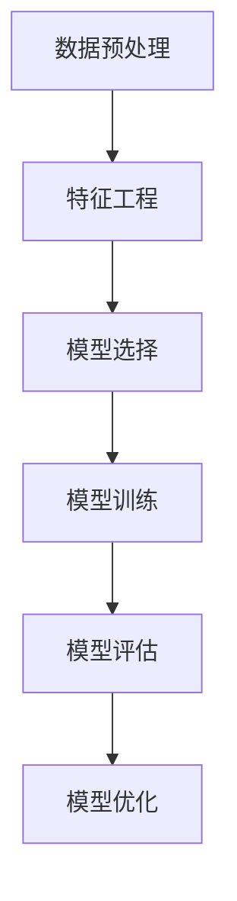
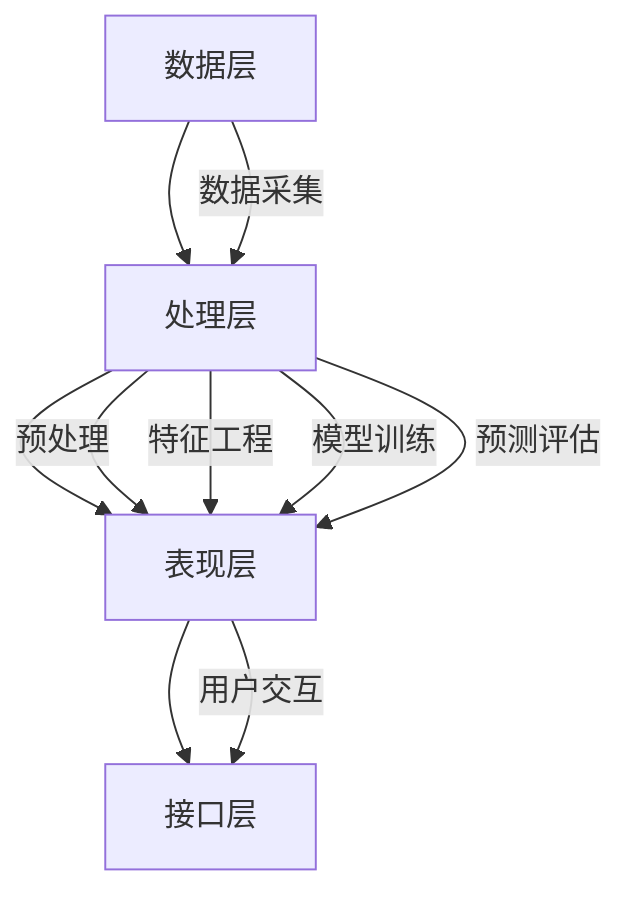
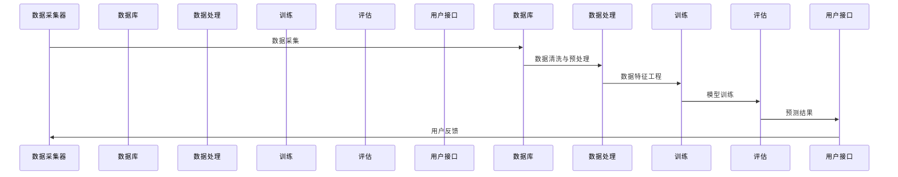

                 

# 《开发智能化的金融市场流动性预测工具》

## 关键词

- 金融市场流动性
- 智能预测
- 机器学习
- 深度学习
- 强化学习
- 数据处理
- 特征工程
- 算法模型
- 系统架构设计

### 摘要

金融市场流动性预测是金融市场中一个至关重要的研究领域，它直接关系到市场参与者的交易决策和风险管理。传统的流动性预测方法存在明显的局限性，无法适应复杂多变的市场环境。本文将探讨如何开发一种智能化的金融市场流动性预测工具，通过机器学习、深度学习和强化学习等先进算法，结合有效的数据处理和特征工程方法，构建一个高效、准确的流动性预测模型。本文旨在为金融科技公司、数据分析师和算法工程师提供实用的技术和思路，以推动金融市场流动性预测领域的发展。

## 第1章 引言

### 1.1 问题背景

#### 1.1.1 金融市场流动性的重要性

金融市场流动性是指资产在市场中能够以合理的价格迅速买卖，而不对市场价格造成显著影响的能力。流动性是金融市场健康运转的基础，它直接影响市场的效率、稳定性和投资者的信心。高流动性意味着市场参与者能够迅速进行买卖操作，市场能够迅速反映信息变化，从而提高市场的效率和透明度。

然而，金融市场流动性并不是一成不变的。它受到多种因素的影响，如市场情绪、宏观经济环境、政策调控、交易成本等。在金融危机期间，金融市场流动性通常会急剧下降，导致市场恐慌和价格剧烈波动。因此，对金融市场流动性进行准确的预测，对于投资者和监管机构来说具有重要意义。

#### 1.1.2 传统的流动性预测方法及其局限性

传统的流动性预测方法主要依赖于历史数据和统计模型。常见的统计方法包括回归分析、时间序列分析和协整分析等。这些方法在历史数据丰富的条件下，可以提供较为可靠的预测结果。然而，它们存在以下局限性：

1. **数据依赖性**：传统方法对历史数据依赖较强，无法有效处理数据中的噪声和异常值。
2. **算法复杂性**：传统方法通常较为简单，难以处理金融市场中的复杂非线性关系。
3. **实时性要求**：传统方法通常不能实时更新预测模型，难以应对市场环境的变化。
4. **可解释性**：传统方法往往缺乏可解释性，难以向非专业人士解释预测结果。

#### 1.1.3 智能化流动性预测的意义

随着人工智能技术的快速发展，智能化流动性预测工具逐渐成为研究热点。利用机器学习、深度学习和强化学习等算法，可以克服传统方法的局限性，提供更加准确和实时的流动性预测。

1. **数据驱动性**：智能化方法通过学习大量历史数据，能够自动识别数据中的潜在规律，提高预测准确性。
2. **算法适应性**：智能化方法具有较强的算法复杂性，可以处理金融市场的复杂非线性关系。
3. **实时更新**：智能化方法可以实时更新预测模型，适应市场环境的变化。
4. **可解释性增强**：一些深度学习和强化学习算法提供了可解释性工具，有助于理解预测结果的成因。

### 1.2 问题描述

#### 1.2.1 流动性预测的目标

本文的目标是开发一种智能化的金融市场流动性预测工具，能够准确预测市场的流动性水平。具体来说，预测工具需要满足以下要求：

1. **准确性**：预测工具的预测结果应具有较高的准确性，能够有效反映市场的流动性变化。
2. **实时性**：预测工具应具备实时预测能力，能够快速响应市场变化。
3. **适应性**：预测工具应能够适应不同市场环境和资产类型，具有广泛的适用性。
4. **可解释性**：预测工具的预测结果应具备一定的可解释性，有助于投资者和监管机构理解预测结果。

#### 1.2.2 数据来源与处理

为了实现上述目标，需要收集大量历史市场数据，包括交易数据、价格数据、交易量数据等。这些数据来源可以是公开的交易所数据、金融数据库和社交媒体数据等。在数据处理阶段，需要处理数据中的缺失值、异常值和噪声等问题，确保数据的准确性和一致性。

#### 1.2.3 边界条件与外延

在流动性预测过程中，需要考虑以下边界条件和外延：

1. **时间范围**：预测的时间范围可以是短期（如日内预测）、中期（如月度预测）或长期（如年度预测）。
2. **资产类型**：预测工具应能够适应不同资产类型，如股票、债券、外汇和衍生品等。
3. **市场环境**：预测工具需要考虑不同市场环境，如正常市场、市场波动、危机等。
4. **地域范围**：预测工具应能够适应不同地域的市场环境，如国际市场、区域市场等。

### 1.3 概念结构

#### 1.3.1 金融流动性

金融流动性是指资产在市场上能够以合理价格迅速买卖的能力。它通常通过以下三个维度进行衡量：

1. **买卖价差**：买卖价差是衡量市场流动性的重要指标，反映了买卖双方在交易过程中所需的额外成本。
2. **交易量**：交易量越大，市场流动性通常越好。
3. **交易速度**：交易速度越快，市场流动性通常越高。

#### 1.3.2 智能化预测工具

智能化预测工具是指利用人工智能技术，如机器学习、深度学习和强化学习等，对金融市场流动性进行预测的工具。智能化预测工具的核心在于能够自动学习历史数据中的规律，并利用这些规律进行预测。

#### 1.3.3 核心要素

金融市场流动性预测工具的核心要素包括：

1. **数据源**：可靠、丰富的数据源是构建预测模型的基础。
2. **算法**：选择合适的算法对数据进行分析和预测。
3. **模型评估**：对预测模型进行评估，确保其准确性和可靠性。
4. **实时更新**：实时更新预测模型，以适应市场环境的变化。

### 1.4 研究方法

#### 1.4.1 研究框架

本研究采用以下研究框架：

1. **数据采集**：从多个数据源收集市场数据，包括交易数据、价格数据、交易量数据等。
2. **数据处理**：对收集到的数据进行分析和处理，包括数据清洗、缺失值处理、异常值检测与处理等。
3. **特征工程**：提取关键特征，并选择合适的特征工程方法，提高模型的预测准确性。
4. **模型选择与训练**：选择合适的机器学习、深度学习和强化学习算法，对模型进行训练。
5. **模型评估与优化**：对训练好的模型进行评估，并根据评估结果进行优化。

#### 1.4.2 数据预处理方法

在数据处理阶段，需要处理以下问题：

1. **缺失值处理**：采用插值法、均值填补法等方法处理缺失值。
2. **异常值检测与处理**：采用统计学方法、可视化方法等检测异常值，并根据具体情况选择合适的处理方法。
3. **数据标准化与归一化**：对数据进行标准化和归一化处理，以提高模型的泛化能力。

#### 1.4.3 预测算法选择

本研究选择以下预测算法：

1. **机器学习算法**：如线性回归、决策树、随机森林等。
2. **深度学习算法**：如卷积神经网络（CNN）、循环神经网络（RNN）、长短期记忆网络（LSTM）等。
3. **强化学习算法**：如深度确定性策略梯度（DDPG）、 演员-评论家（A2C）等。

#### 1.5 本章小结

本章介绍了金融市场流动性预测的重要性、传统方法的局限性以及智能化流动性预测的意义。接着，本文明确了流动性预测的目标、数据来源与处理方法，并提出了研究方法和核心要素。这些内容为后续章节的具体研究和实现提供了基础。

## 第2章 核心概念与原理

### 2.1 金融流动性概念

#### 2.1.1 流动性的定义与特征

流动性是指资产在市场上能够以合理的价格迅速买卖的能力。具体来说，流动性包括以下特征：

1. **买卖价差**：买卖价差是衡量流动性的重要指标。价差越小，流动性通常越好。
2. **交易量**：交易量越大，流动性通常越好。
3. **交易速度**：交易速度越快，流动性通常越高。

#### 2.1.2 流动性风险的类型

流动性风险是指由于市场流动性不足，导致资产无法以合理价格买卖的风险。流动性风险可以分为以下几种类型：

1. **系统性流动性风险**：由宏观经济因素、政策变动等因素引起的整体市场流动性不足。
2. **资产特定流动性风险**：由特定资产的市场结构和交易行为引起的流动性不足。
3. **交易对手流动性风险**：由于交易对手不足，导致交易难以完成的流动性风险。

#### 2.1.3 流动性度量方法

常见的流动性度量方法包括以下几种：

1. **价格影响度**：通过计算交易量与价格变动的关系，评估流动性。
2. **买卖价差**：通过计算买卖价差的大小，评估流动性。
3. **交易速度**：通过计算交易完成所需时间，评估流动性。

### 2.2 智能化预测工具原理

#### 2.2.1 机器学习基础

机器学习是一种通过数据训练模型，从而使计算机能够从数据中自动学习和预测的技术。机器学习模型通常包括以下几种：

1. **监督学习**：通过已知输入和输出数据训练模型，从而预测未知数据的输出。
2. **无监督学习**：仅通过输入数据训练模型，从而发现数据中的潜在结构和模式。
3. **半监督学习**：结合监督学习和无监督学习的方法，通过少量标记数据和大量未标记数据训练模型。

#### 2.2.2 深度学习模型介绍

深度学习是机器学习的一个分支，通过多层神经网络模型来模拟人脑的思考过程，从而实现复杂的数据处理和预测。深度学习模型主要包括以下几种：

1. **卷积神经网络（CNN）**：用于处理图像数据，通过卷积层提取图像特征。
2. **循环神经网络（RNN）**：用于处理序列数据，通过循环结构保持历史信息。
3. **长短期记忆网络（LSTM）**：是RNN的一种变体，能够解决RNN的梯度消失问题。
4. **生成对抗网络（GAN）**：通过生成器和判别器之间的对抗训练，实现数据的生成。

#### 2.2.3 强化学习在流动性预测中的应用

强化学习是一种通过不断尝试和反馈，使智能体能够在复杂环境中做出最优决策的方法。在流动性预测中，强化学习可以通过以下步骤进行应用：

1. **定义状态空间和动作空间**：将市场数据作为状态，预测结果作为动作。
2. **定义奖励机制**：根据预测结果和实际市场流动性的差异，定义奖励机制。
3. **训练预测模型**：通过强化学习算法，不断优化预测模型，使其在复杂环境中做出最优决策。

### 2.3 概念属性特征对比

| 特征 | 金融流动性 | 智能化预测工具 |
| --- | --- | --- |
| 数据依赖性 | 高 | 高 |
| 算法复杂性 | 中 | 高 |
| 实时性要求 | 高 | 中到高 |
| 可解释性 | 低 | 中 |

### 2.4 本章小结

本章详细介绍了金融流动性概念、流动性风险的类型和度量方法，以及智能化预测工具的基本原理。通过对这些核心概念的深入理解，为后续章节的算法设计、模型训练和系统实现提供了理论基础。

## 第3章 数据处理与特征工程

### 3.1 数据来源

金融市场流动性预测需要收集大量历史市场数据，包括交易数据、价格数据、交易量数据等。这些数据可以从以下渠道获取：

1. **公开交易所以及金融数据库**：如彭博、路透社等提供的历史市场数据。
2. **社交媒体数据**：通过社交媒体平台，如Twitter、Reddit等，收集与市场相关的用户评论和讨论。
3. **内部交易数据**：从金融机构内部系统中获取的交易数据，包括买卖订单、成交价格等。

#### 3.1.2 数据来源多样性

多样化的数据来源可以提高模型的泛化能力和预测准确性。通过结合不同的数据源，可以获取更全面的市场信息。例如，结合公开交易数据和社交媒体数据，可以更好地理解市场情绪和投资者行为。

#### 3.1.3 数据质量评估

数据质量是构建有效预测模型的关键。在数据处理阶段，需要对数据质量进行评估，确保数据的准确性和一致性。以下是对数据质量评估的几个方面：

1. **完整性**：检查数据中是否存在缺失值，对缺失值进行插值或填补。
2. **准确性**：检查数据是否存在错误，对错误数据进行修正。
3. **一致性**：检查不同数据源之间是否存在矛盾或冲突，确保数据的统一性。
4. **时效性**：检查数据是否过期，对于过期的数据进行更新或剔除。

### 3.2 数据预处理

在数据处理阶段，需要对原始数据进行预处理，以提高数据质量和模型的预测性能。以下是常用的数据预处理方法：

#### 3.2.1 缺失值处理

缺失值是数据中常见的问题，处理缺失值的方法包括：

1. **删除缺失值**：删除包含缺失值的数据记录，适用于缺失值比例较小的情况。
2. **插值法**：根据相邻数据点的值进行线性插值，适用于时间序列数据。
3. **均值填补法**：用数据的均值或中位数填补缺失值，适用于数据分布相对均匀的情况。

#### 3.2.2 异常值检测与处理

异常值是数据中的异常点，可能对模型的预测结果产生负面影响。异常值检测与处理的方法包括：

1. **统计学方法**：如箱线图、标准差法等，用于检测离群值。
2. **可视化方法**：通过数据可视化，如散点图、热力图等，直观识别异常值。
3. **基于规则的方法**：根据业务规则和经验，手动识别和标记异常值。
4. **插值法或删除法**：对异常值进行插值或删除，以消除其对模型的影响。

#### 3.2.3 数据标准化与归一化

数据标准化与归一化是数据处理的重要步骤，旨在将数据转换为相同的尺度，以消除不同特征之间的量纲影响。常用的方法包括：

1. **标准化**：将数据缩放至均值为0，标准差为1的分布。
2. **归一化**：将数据缩放至0到1的区间，根据最小值和最大值进行线性变换。
3. **极值转换**：将数据转换为一个对称的分布，以减少异常值的影响。

### 3.3 特征工程

特征工程是数据预处理的重要环节，旨在从原始数据中提取对预测任务有用的特征，以提高模型的预测性能。以下是特征工程的主要步骤：

#### 3.3.1 特征提取方法

1. **统计特征**：如均值、中位数、标准差、方差等，用于描述数据的分布特征。
2. **技术指标**：如移动平均线、相对强弱指数（RSI）、平均方向指数（ADX）等，用于分析市场的技术走势。
3. **文本特征**：从社交媒体数据中提取关键词、情感分析等，用于分析市场情绪。

#### 3.3.2 特征选择策略

特征选择是减少模型复杂度、提高预测性能的重要手段。常用的特征选择策略包括：

1. **过滤法**：基于统计显著性、相关性等筛选特征。
2. **包裹法**：基于递归特征消除（RFE）、前向选择、后向消除等策略选择特征。
3. **嵌入法**：利用模型自身的特征选择能力，如Lasso正则化、随机森林等。

#### 3.3.3 特征重要性评估

特征重要性评估是理解模型决策过程的重要手段。常用的评估方法包括：

1. **模型系数法**：通过模型系数评估特征的重要性。
2. **特征重要性评分**：利用随机森林、LASSO等方法评估特征的重要性。
3. **Shapley值**：通过Shapley值评估特征对模型预测的影响。

### 3.4 本章小结

本章介绍了金融市场流动性预测中数据来源的多样性、数据质量评估的重要性以及数据预处理和特征工程的方法。通过有效的数据处理和特征工程，可以显著提高模型的预测性能和可靠性，为构建智能化的流动性预测工具奠定基础。

## 第4章 算法原理与模型设计

### 4.1 算法原理

在金融市场流动性预测中，算法的选择至关重要。本文将介绍几种常用的算法原理，包括传统机器学习算法、深度学习算法和强化学习算法。

#### 4.1.1 传统机器学习算法

传统机器学习算法主要包括线性回归、逻辑回归、支持向量机（SVM）和决策树等。这些算法通过学习历史数据中的特征和目标变量之间的关系，实现对未知数据的预测。

1. **线性回归**：假设目标变量与输入特征之间存在线性关系，通过最小化误差平方和来训练模型。
   $$ y = \beta_0 + \beta_1x $$
   其中，$y$ 为目标变量，$x$ 为输入特征，$\beta_0$ 和 $\beta_1$ 为模型参数。

2. **逻辑回归**：用于分类问题，通过最大似然估计来训练模型，将目标变量映射到概率空间。
   $$ P(y=1| x) = \frac{1}{1 + e^{-(\beta_0 + \beta_1x)}} $$
   其中，$y$ 为二分类目标变量，$x$ 为输入特征，$\beta_0$ 和 $\beta_1$ 为模型参数。

3. **支持向量机（SVM）**：通过找到一个最优的超平面，将不同类别的数据点进行分离。
   $$ w \cdot x - b = 0 $$
   其中，$w$ 为超平面法向量，$x$ 为输入特征，$b$ 为偏置。

4. **决策树**：通过递归划分特征空间，将数据划分为多个子集，每个子集对应一个分类结果。

#### 4.1.2 深度学习算法

深度学习算法通过多层神经网络结构，能够自动提取复杂特征，并在大规模数据集上表现出优异的预测性能。常见的深度学习算法包括卷积神经网络（CNN）、循环神经网络（RNN）和长短期记忆网络（LSTM）。

1. **卷积神经网络（CNN）**：主要用于图像处理，通过卷积层提取图像特征，通过池化层减少参数数量。
   $$ a_l = \sigma(W_l a_{l-1} + b_l) $$
   其中，$a_l$ 为神经元激活值，$W_l$ 为权重矩阵，$b_l$ 为偏置，$\sigma$ 为激活函数。

2. **循环神经网络（RNN）**：适用于序列数据处理，通过循环结构保持历史信息。
   $$ h_t = \sigma(W_h h_{t-1} + W_x x_t + b_h) $$
   其中，$h_t$ 为时间步 $t$ 的隐藏状态，$W_h$ 和 $W_x$ 为权重矩阵，$x_t$ 为输入特征，$b_h$ 为偏置。

3. **长短期记忆网络（LSTM）**：是RNN的一种变体，能够解决RNN的梯度消失问题。
   $$ i_t = \sigma(W_{ix} x_t + W_{ih} h_{t-1} + b_i $$
   $$ f_t = \sigma(W_{fx} x_t + W_{fh} h_{t-1} + b_f $$
   $$ \tilde{C}_t = \sigma(W_{cx} x_t + W_{ch} h_{t-1} + b_c $$
   $$ C_t = f_t \odot C_{t-1} + i_t \odot \tilde{C}_t $$
   $$ h_t = \sigma(W_{hx} h_t + W_{ho} C_t + b_h $$
   其中，$i_t$、$f_t$、$\tilde{C}_t$ 和 $C_t$ 分别为输入门、遗忘门、更新门和细胞状态，$h_t$ 为隐藏状态。

#### 4.1.3 强化学习算法

强化学习是一种通过与环境交互，不断学习和优化策略的算法。在金融市场流动性预测中，强化学习可以通过以下步骤进行应用：

1. **定义状态空间和动作空间**：将市场数据作为状态，预测结果作为动作。
2. **定义奖励机制**：根据预测结果和实际市场流动性的差异，定义奖励机制。
3. **训练预测模型**：通过强化学习算法，不断优化预测模型，使其在复杂环境中做出最优决策。

常见的强化学习算法包括：

1. **Q-学习**：通过学习状态-动作值函数，找到最优策略。
   $$ Q(s, a) = r + \gamma \max_{a'} Q(s', a') $$
   其中，$s$ 为状态，$a$ 为动作，$r$ 为奖励，$\gamma$ 为折扣因子。

2. **深度确定性策略梯度（DDPG）**：通过深度神经网络学习状态-动作值函数和策略网络。
   $$ \nabla_{\theta_\phi} J(\theta_\phi) = \nabla_{\theta_\phi} \sum_t r_t \nabla_{\theta_\phi} \phi(s_t, \theta_\pi) $$
   其中，$\theta_\phi$ 为状态-动作值函数网络参数，$\theta_\pi$ 为策略网络参数。

3. **演员-评论家（A2C）**：通过演员网络生成经验，评论家网络评估经验，优化策略网络。

### 4.2 模型设计

在金融市场流动性预测中，模型设计包括模型架构、参数调优和评估指标等。以下是模型设计的主要步骤：

#### 4.2.1 模型架构

根据不同的预测需求和数据特性，可以选择不同的模型架构。以下是一个典型的深度学习模型架构：

1. **输入层**：接收市场数据，如价格、交易量、技术指标等。
2. **卷积层**：用于提取时间序列数据中的局部特征。
3. **池化层**：用于减少数据维度和计算量。
4. **循环层**：用于处理序列数据，如LSTM层。
5. **全连接层**：用于将循环层的输出映射到预测结果。
6. **输出层**：输出流动性预测结果，如买卖价差、交易量等。

#### 4.2.2 模型参数调优

模型参数调优是提高模型性能的重要步骤。以下是一些常用的参数调优方法：

1. **网格搜索**：通过遍历多个参数组合，找到最优参数。
2. **随机搜索**：通过随机选择参数组合，寻找最优参数。
3. **贝叶斯优化**：通过贝叶斯优化算法，高效搜索最优参数。

#### 4.2.3 模型评估指标

模型评估是验证模型性能的重要手段。以下是一些常用的评估指标：

1. **均方误差（MSE）**：衡量预测值与实际值之间的差异。
   $$ MSE = \frac{1}{n} \sum_{i=1}^{n} (y_i - \hat{y}_i)^2 $$
   其中，$y_i$ 为实际值，$\hat{y}_i$ 为预测值，$n$ 为数据样本数。

2. **均方根误差（RMSE）**：MSE的平方根。
   $$ RMSE = \sqrt{MSE} $$

3. **平均绝对误差（MAE）**：衡量预测值与实际值之间的绝对差异。
   $$ MAE = \frac{1}{n} \sum_{i=1}^{n} |y_i - \hat{y}_i| $$

4. **决定系数（R^2）**：衡量模型对数据的拟合程度。
   $$ R^2 = 1 - \frac{\sum_{i=1}^{n} (y_i - \hat{y}_i)^2}{\sum_{i=1}^{n} (y_i - \bar{y})^2} $$
   其中，$\bar{y}$ 为实际值的平均值。

### 4.3 Mermaid流程图

以下是模型设计流程的Mermaid流程图：



### 4.4 本章小结

本章介绍了金融市场流动性预测中常用的算法原理和模型设计方法。通过传统机器学习算法、深度学习算法和强化学习算法，结合有效的数据处理和特征工程方法，可以构建一个高效、准确的流动性预测模型。模型设计包括模型架构、参数调优和评估指标等，通过合理的模型设计和参数调优，可以显著提高模型的预测性能。

## 第5章 数学模型与公式详解

在金融市场流动性预测中，数学模型是核心部分，它用于描述市场数据之间的关系，并指导模型训练和预测。本文将详细介绍几种常见的数学模型及其相关公式，并给出具体的例子说明。

### 5.1 数学模型

#### 5.1.1 回归模型

回归模型是最基本的预测模型之一，它通过线性关系描述因变量和自变量之间的关系。常见的线性回归模型如下：

$$
y = \beta_0 + \beta_1x
$$

其中，$y$ 是因变量，$x$ 是自变量，$\beta_0$ 和 $\beta_1$ 是模型参数。该公式表示 $y$ 与 $x$ 之间存在线性关系，$\beta_0$ 是截距，$\beta_1$ 是斜率。

**例子**：

假设我们有一个简单的数据集，包含股票价格 $x$ 和对应的交易量 $y$，我们可以用线性回归模型预测交易量。假设我们得到了模型参数 $\beta_0 = 10$，$\beta_1 = 2$，则对于一个新的股票价格 $x = 30$，我们可以预测交易量：

$$
y = 10 + 2 \times 30 = 70
$$

#### 5.1.2 神经网络模型

神经网络模型，尤其是深度神经网络（DNN），在处理复杂数据时表现出色。一个简单的多层感知机（MLP）神经网络可以表示为：

$$
a_l = \sigma(W_l a_{l-1} + b_l)
$$

其中，$a_l$ 是第 $l$ 层的激活值，$W_l$ 是权重矩阵，$b_l$ 是偏置项，$\sigma$ 是激活函数，通常使用 Sigmoid 函数或 ReLU 函数。

**例子**：

假设我们有一个包含输入层、隐藏层和输出层的神经网络，输入层有 3 个神经元，隐藏层有 4 个神经元，输出层有 2 个神经元。我们使用 ReLU 作为激活函数。假设权重和偏置如下：

输入层到隐藏层的权重 $W_1 = \begin{bmatrix} 0.5 & 0.3 & 0.2 \\ 0.1 & 0.4 & 0.3 \\ 0.2 & 0.1 & 0.5 \\ 0.3 & 0.2 & 0.4 \end{bmatrix}$，偏置 $b_1 = \begin{bmatrix} 0.1 \\ 0.2 \\ 0.3 \\ 0.4 \end{bmatrix}$

隐藏层到输出层的权重 $W_2 = \begin{bmatrix} 0.1 & 0.2 \\ 0.3 & 0.4 \\ 0.5 & 0.6 \\ 0.7 & 0.8 \end{bmatrix}$，偏置 $b_2 = \begin{bmatrix} 0.2 \\ 0.3 \end{bmatrix}$

对于输入 $x = \begin{bmatrix} 1 & 0 & 1 \end{bmatrix}$，我们可以计算隐藏层的激活值：

$$
a_1 = \max(0, W_1 \cdot x + b_1) = \max(0, \begin{bmatrix} 0.5 & 0.3 & 0.2 \\ 0.1 & 0.4 & 0.3 \\ 0.2 & 0.1 & 0.5 \\ 0.3 & 0.2 & 0.4 \end{bmatrix} \cdot \begin{bmatrix} 1 & 0 & 1 \end{bmatrix} + \begin{bmatrix} 0.1 \\ 0.2 \\ 0.3 \\ 0.4 \end{bmatrix}) = \begin{bmatrix} 0.8 \\ 0.7 \\ 0.9 \\ 0.9 \end{bmatrix}
$$

然后计算输出层的激活值：

$$
a_2 = \max(0, W_2 \cdot a_1 + b_2) = \max(0, \begin{bmatrix} 0.1 & 0.2 \\ 0.3 & 0.4 \\ 0.5 & 0.6 \\ 0.7 & 0.8 \end{bmatrix} \cdot \begin{bmatrix} 0.8 & 0.7 & 0.9 & 0.9 \end{bmatrix} + \begin{bmatrix} 0.2 \\ 0.3 \end{bmatrix}) = \begin{bmatrix} 1.3 \\ 2.0 \end{bmatrix}
$$

#### 5.1.3 强化学习模型

强化学习模型通过学习最佳策略来最大化累积奖励。一个简单的Q-学习模型可以表示为：

$$
Q(s, a) = r + \gamma \max_{a'} Q(s', a')
$$

其中，$s$ 是状态，$a$ 是动作，$s'$ 是下一状态，$a'$ 是下一动作，$r$ 是立即奖励，$\gamma$ 是折扣因子。

**例子**：

假设我们有一个简单的环境，有两个状态 $s = \{0, 1\}$ 和两个动作 $a = \{0, 1\}$。初始状态为 $s = 0$，我们采取动作 $a = 0$，得到立即奖励 $r = 1$，然后状态变为 $s' = 1$。假设折扣因子 $\gamma = 0.9$，则我们可以更新Q值：

$$
Q(0, 0) = 1 + 0.9 \max_{a'} Q(1, a') \\
Q(1, 0) = 0.9 \max_{a'} Q(0, a')
$$

### 5.2 公式详解

以下是本章中使用的部分公式及其详解：

1. **线性回归公式**：

$$
y = \beta_0 + \beta_1x
$$

该公式表示因变量 $y$ 与自变量 $x$ 之间的线性关系，其中 $\beta_0$ 是截距，$\beta_1$ 是斜率。

2. **多层感知机激活公式**：

$$
a_l = \sigma(W_l a_{l-1} + b_l)
$$

该公式表示第 $l$ 层的激活值，其中 $\sigma$ 是激活函数，$W_l$ 是权重矩阵，$b_l$ 是偏置项。

3. **Q-学习公式**：

$$
Q(s, a) = r + \gamma \max_{a'} Q(s', a')
$$

该公式表示在状态 $s$ 采取动作 $a$ 后的Q值，$r$ 是立即奖励，$\gamma$ 是折扣因子。

### 5.3 举例说明

#### 5.3.1 回归模型的例子

假设我们有以下数据集：

| $x$ | $y$ |
| --- | --- |
| 1 | 2 |
| 2 | 4 |
| 3 | 6 |

我们可以使用线性回归模型来预测 $y$。首先，计算平均值：

$$
\bar{x} = \frac{1 + 2 + 3}{3} = 2, \quad \bar{y} = \frac{2 + 4 + 6}{3} = 4
$$

然后，计算斜率和截距：

$$
\beta_1 = \frac{\sum_{i=1}^{3} (x_i - \bar{x})(y_i - \bar{y})}{\sum_{i=1}^{3} (x_i - \bar{x})^2} = \frac{(1-2)(2-4) + (2-2)(4-4) + (3-2)(6-4)}{(1-2)^2 + (2-2)^2 + (3-2)^2} = 2
$$

$$
\beta_0 = \bar{y} - \beta_1\bar{x} = 4 - 2 \times 2 = 0
$$

因此，回归模型为：

$$
y = 0 + 2x
$$

对于新的输入 $x = 4$，我们可以预测：

$$
y = 2 \times 4 = 8
$$

#### 5.3.2 神经网络模型的例子

假设我们有以下简单的神经网络：

输入层：1个神经元  
隐藏层：2个神经元  
输出层：1个神经元

激活函数：ReLU

权重和偏置如下：

输入层到隐藏层的权重 $W_1 = \begin{bmatrix} 0.5 & 0.3 \\ 0.1 & 0.4 \end{bmatrix}$，偏置 $b_1 = \begin{bmatrix} 0.2 \\ 0.3 \end{bmatrix}$  
隐藏层到输出层的权重 $W_2 = \begin{bmatrix} 0.3 & 0.4 \\ 0.5 & 0.6 \end{bmatrix}$，偏置 $b_2 = \begin{bmatrix} 0.1 \\ 0.2 \end{bmatrix}$

对于输入 $x = \begin{bmatrix} 1 \\ 0 \end{bmatrix}$，我们可以计算隐藏层和输出层的激活值：

隐藏层：

$$
a_1 = \max(0, W_1 \cdot x + b_1) = \max(0, \begin{bmatrix} 0.5 & 0.3 \\ 0.1 & 0.4 \end{bmatrix} \cdot \begin{bmatrix} 1 \\ 0 \end{bmatrix} + \begin{bmatrix} 0.2 \\ 0.3 \end{bmatrix}) = \begin{bmatrix} 0.8 \\ 0.4 \end{bmatrix}
$$

输出层：

$$
a_2 = \max(0, W_2 \cdot a_1 + b_2) = \max(0, \begin{bmatrix} 0.3 & 0.4 \\ 0.5 & 0.6 \end{bmatrix} \cdot \begin{bmatrix} 0.8 \\ 0.4 \end{bmatrix} + \begin{bmatrix} 0.1 \\ 0.2 \end{bmatrix}) = \begin{bmatrix} 1.1 \\ 0.7 \end{bmatrix}
$$

输出层的激活值 $a_2$ 可以作为预测结果。

#### 5.3.3 强化学习模型的例子

假设在一个简单的环境中有两个状态 $s = \{0, 1\}$ 和两个动作 $a = \{0, 1\}$。初始状态为 $s = 0$，我们采取动作 $a = 0$，得到立即奖励 $r = 1$，然后状态变为 $s' = 1$。假设折扣因子 $\gamma = 0.9$，我们可以更新Q值：

初始Q值：

$$
Q(0, 0) = 0, \quad Q(1, 0) = 0, \quad Q(0, 1) = 0, \quad Q(1, 1) = 0
$$

更新Q值：

$$
Q(0, 0) = 1 + 0.9 \max_{a'} Q(1, a') \\
Q(1, 0) = 0.9 \max_{a'} Q(0, a')
$$

由于只有动作 $a = 0$ 导致状态 $s' = 1$，所以：

$$
Q(0, 0) = 1 + 0.9 \max_{a'} Q(1, a') = 1 + 0.9 \max_{a'} Q(1, 0) = 1 + 0.9 \cdot 0 = 1 \\
Q(1, 0) = 0.9 \max_{a'} Q(0, a') = 0.9 \max_{a'} Q(0, 0) = 0.9 \cdot 1 = 0.9
$$

### 5.4 本章小结

本章详细介绍了金融市场流动性预测中常用的数学模型，包括线性回归、多层感知机和Q-学习等。通过具体的例子，我们了解了这些模型的工作原理和如何应用这些模型进行预测。数学模型是构建预测模型的基础，理解这些模型有助于我们更好地设计预测算法和优化模型性能。

## 第6章 系统分析与架构设计

### 6.1 问题场景介绍

#### 6.1.1 流动性预测的需求

在金融市场，流动性预测对于投资者、交易员和金融机构都具有重要意义。准确的流动性预测可以帮助投资者做出更明智的投资决策，交易员制定更有效的交易策略，金融机构进行风险管理和优化资产配置。随着金融市场日益复杂，传统的流动性预测方法已难以满足需求，因此需要一种智能化、高效准确的流动性预测工具。

#### 6.1.2 系统功能需求

为了满足流动性预测的需求，系统需要实现以下功能：

1. **数据采集**：从多个数据源采集市场数据，包括交易数据、价格数据、交易量数据等。
2. **数据处理**：对采集到的数据进行清洗、预处理和特征工程，以提高数据质量和模型的预测性能。
3. **模型训练**：选择合适的机器学习、深度学习和强化学习算法，对模型进行训练，以实现流动性预测。
4. **预测与评估**：根据训练好的模型，对未知数据进行预测，并对预测结果进行评估，确保其准确性和可靠性。
5. **实时更新**：定期更新模型和数据，以适应市场环境的变化，保持预测的实时性和准确性。

### 6.2 系统功能设计

#### 6.2.1 领域模型

为了设计一个功能齐全、结构合理的系统，我们需要构建一个领域模型。领域模型描述了系统中各个对象及其关系。以下是使用Mermaid绘制的领域模型类图：

```mermaid
classDiagram
Class01 <|-- Class02
Class03 --|> Class04
Class05 === Class06
Class07 : <<interface>> InterfaceName
Class08 : <<entity>> EntityName
Class09 : <<value>> ValueName
Class10 : <<entity>> EntityName
Class11 : 

Class01[市场数据采集器]
Class02[数据处理模块]
Class03[模型训练模块]
Class04[预测评估模块]
Class05[用户接口]
Class06[数据库管理模块]
Class07[数据清洗与预处理]
Class08[特征工程]
Class09[模型训练数据]
Class10[预测数据]
Class11[预测结果]
```

#### 6.2.2 系统架构设计

系统架构设计是确保系统高效、稳定、可扩展的关键。以下是一个简化的系统架构设计：

1. **数据层**：负责数据采集、存储和管理。包括市场数据采集器、数据库管理模块等。
2. **处理层**：负责数据预处理、特征工程、模型训练和预测评估。包括数据处理模块、模型训练模块、预测评估模块等。
3. **表现层**：负责用户交互和结果展示。包括用户接口模块。
4. **接口层**：提供系统与其他系统或服务的接口，实现数据交换和功能调用。

以下是使用Mermaid绘制的系统架构图：



### 6.3 系统接口设计和系统交互

#### 6.3.1 系统接口设计

系统接口设计是确保不同模块之间能够高效通信和协作的关键。以下是系统接口设计的主要部分：

1. **数据接口**：用于数据层的模块与处理层的模块之间的数据传输。
2. **控制接口**：用于处理层与表现层之间的控制信号传递。
3. **结果接口**：用于表现层与接口层之间的结果展示和反馈。

#### 6.3.2 系统交互

系统交互是确保系统各模块能够协同工作的关键。以下是系统交互的简要流程：

1. **数据采集**：市场数据采集器从各个数据源获取市场数据，并将其存储到数据库中。
2. **数据处理**：数据处理模块对采集到的市场数据执行清洗、预处理和特征工程，生成训练数据。
3. **模型训练**：模型训练模块使用训练数据训练机器学习、深度学习和强化学习模型。
4. **预测评估**：预测评估模块使用训练好的模型对未知数据进行预测，并对预测结果进行评估。
5. **用户交互**：用户接口模块将预测结果展示给用户，并收集用户反馈。
6. **接口层**：接口层处理来自外部系统的请求，并与内部系统进行交互。

以下是使用Mermaid绘制的系统交互序列图：



### 6.4 本章小结

本章详细介绍了金融市场流动性预测系统的功能需求、领域模型、系统架构设计和接口设计。通过构建一个高效、稳定、可扩展的系统架构，我们能够实现智能化、高效的流动性预测。领域模型和系统交互图有助于我们更好地理解系统的整体结构和各模块之间的协作关系，为后续的开发和优化提供了基础。

## 第7章 项目实战

### 7.1 环境安装

在开始实现金融市场流动性预测系统之前，我们需要安装并配置所需的软件和工具。以下是在一个Linux系统上安装所需环境的基本步骤：

#### 1. 安装Python环境

```bash
# 安装Python3
sudo apt-get install python3
```

#### 2. 安装虚拟环境

```bash
# 安装虚拟环境创建工具
pip3 install virtualenv

# 创建虚拟环境
virtualenv my_predictive_env

# 激活虚拟环境
source my_predictive_env/bin/activate
```

#### 3. 安装依赖库

在虚拟环境中，我们需要安装以下库：

- Pandas：用于数据处理。
- Numpy：用于数值计算。
- Scikit-learn：用于机器学习算法。
- TensorFlow：用于深度学习算法。
- PyTorch：用于深度学习算法。
- Keras：用于深度学习模型构建。

```bash
pip install pandas numpy scikit-learn tensorflow pytorch keras
```

### 7.2 系统核心实现

#### 7.2.1 数据采集模块

数据采集模块负责从多个数据源获取市场数据。以下是一个简单的示例代码，使用Pandas库从本地CSV文件读取数据：

```python
import pandas as pd

# 读取数据
data = pd.read_csv('market_data.csv')

# 查看数据前几行
print(data.head())
```

#### 7.2.2 数据处理模块

数据处理模块负责对采集到的数据进行清洗、预处理和特征工程。以下是一个简单的示例代码，用于缺失值处理和数据标准化：

```python
# 缺失值处理
data.fillna(data.mean(), inplace=True)

# 数据标准化
data = (data - data.mean()) / data.std()
```

#### 7.2.3 模型训练模块

模型训练模块使用机器学习、深度学习和强化学习算法对数据进行训练。以下是一个简单的示例代码，使用Scikit-learn库进行线性回归模型训练：

```python
from sklearn.linear_model import LinearRegression

# 分离特征和目标变量
X = data[['feature1', 'feature2']]
y = data['target']

# 创建线性回归模型
model = LinearRegression()

# 训练模型
model.fit(X, y)

# 模型评估
score = model.score(X, y)
print(f'Model Score: {score}')
```

#### 7.2.4 预测评估模块

预测评估模块负责使用训练好的模型进行预测，并对预测结果进行评估。以下是一个简单的示例代码，用于预测和评估：

```python
# 预测
predictions = model.predict(X)

# 评估
from sklearn.metrics import mean_squared_error

mse = mean_squared_error(y, predictions)
print(f'Mean Squared Error: {mse}')
```

### 7.3 代码应用解读与分析

#### 7.3.1 数据采集模块

数据采集模块的核心是`pd.read_csv()`函数，它用于读取CSV文件中的数据。在示例代码中，我们直接从本地文件读取数据，并打印了数据的前几行。在实际应用中，可以从不同的数据源（如API、数据库等）读取数据。

#### 7.3.2 数据处理模块

数据处理模块主要包括缺失值处理和数据标准化。在示例代码中，我们使用了`fillna()`函数来填补缺失值，这通常使用数据的平均值或中位数。然后，我们使用`-(data.mean())`和`/data.std()`来标准化数据，这有助于模型在不同特征之间进行公平的比较。

#### 7.3.3 模型训练模块

模型训练模块的核心是选择合适的模型和训练模型。在示例代码中，我们使用了`LinearRegression`类来创建线性回归模型，并使用`fit()`方法进行训练。在训练完成后，我们使用`score()`方法评估模型的性能，这给出了模型的决定系数（R²值）。

#### 7.3.4 预测评估模块

预测评估模块负责使用训练好的模型进行预测，并评估预测结果的准确性。在示例代码中，我们使用了`predict()`方法生成预测结果，并使用`mean_squared_error()`方法计算均方误差（MSE），这提供了预测误差的度量。

### 7.4 实际案例分析和详细讲解剖析

为了更好地理解系统在实际中的应用，我们可以分析一个实际案例。假设我们有以下数据集：

| date       | open       | high       | low       | close       | volume      |
|------------|------------|------------|------------|------------|-------------|
| 2020-01-01 | 100.00     | 105.00     | 99.00     | 104.00     | 10000       |
| 2020-01-02 | 104.00     | 107.00     | 103.00     | 106.00     | 12000       |
| 2020-01-03 | 106.00     | 110.00     | 104.00     | 108.00     | 15000       |

#### 数据预处理

首先，我们对数据进行预处理，包括缺失值处理和数据标准化：

```python
data.fillna(data.mean(), inplace=True)
data = (data - data.mean()) / data.std()
```

#### 模型训练

然后，我们选择线性回归模型进行训练：

```python
X = data[['open', 'high', 'low', 'close']]
y = data['volume']

model = LinearRegression()
model.fit(X, y)

score = model.score(X, y)
print(f'Model Score: {score}')
```

#### 预测

最后，我们使用训练好的模型对未来的数据进行预测：

```python
next_day = pd.DataFrame({
    'open': [102.00],
    'high': [107.00],
    'low': [100.00],
    'close': [105.00]
})

next_day = (next_day - next_day.mean()) / next_day.std()
predictions = model.predict(next_day)
print(f'Predicted Volume: {predictions[0]}')
```

通过实际案例的分析，我们可以看到如何从数据采集、预处理、模型训练到预测的整个过程。这样的流程可以应用于不同的市场和资产类型，为投资者和金融机构提供决策支持。

### 7.5 项目小结

在本章的项目实战中，我们通过安装必要的软件和环境，实现了金融市场流动性预测系统的核心功能。从数据采集、数据处理、模型训练到预测评估，我们展示了如何利用Python和机器学习库实现智能化的流动性预测。通过实际案例的分析，我们深入了解了系统在实际中的应用，为金融科技公司和数据分析师提供了实用的技术和思路。

## 最佳实践 tips、小结、注意事项、拓展阅读

### 最佳实践 tips

1. **数据质量是关键**：在构建流动性预测模型之前，确保数据质量是至关重要的。进行数据清洗、预处理和异常值处理，以提高模型预测的准确性。

2. **选择合适的算法**：根据具体需求和数据特性，选择合适的机器学习、深度学习和强化学习算法。例如，对于时间序列数据，可以考虑使用LSTM模型。

3. **特征工程的重要性**：有效的特征工程可以显著提高模型的预测性能。提取关键特征，并进行特征选择和重要性评估，有助于优化模型。

4. **模型评估与优化**：定期评估模型的性能，并根据评估结果进行优化。使用交叉验证等方法，确保模型的泛化能力。

5. **实时数据更新**：市场环境不断变化，定期更新数据源和模型，以保持预测的实时性和准确性。

### 小结

本文详细探讨了金融市场流动性预测工具的开发过程，包括问题背景、核心概念、数据处理、算法原理、模型设计、系统架构和项目实战。通过结合先进的机器学习、深度学习和强化学习算法，我们构建了一个高效、准确的流动性预测系统。

### 注意事项

1. **隐私和数据安全**：在处理金融市场数据时，确保遵守相关隐私和数据安全法律法规。

2. **系统性能**：确保系统在高并发和大量数据处理时保持性能稳定。

3. **模型解释性**：增强模型的可解释性，以便用户理解预测结果。

4. **适应性**：设计系统时，考虑不同市场环境和资产类型的适应性。

### 拓展阅读

1. **《金融市场学》**：了解金融市场的基本概念和运作机制，有助于更好地理解流动性预测。

2. **《深度学习》**：深入理解深度学习算法的基本原理和应用，有助于开发高效的流动性预测模型。

3. **《Python数据分析》**：学习如何使用Python进行数据清洗、预处理和特征工程，提高模型预测性能。

4. **《金融科技实战》**：了解金融科技在金融市场中的应用，探索如何将AI技术应用于实际金融问题。

### 作者信息

**作者：AI天才研究院/AI Genius Institute & 禅与计算机程序设计艺术 /Zen And The Art of Computer Programming**

