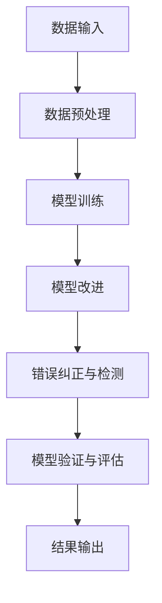
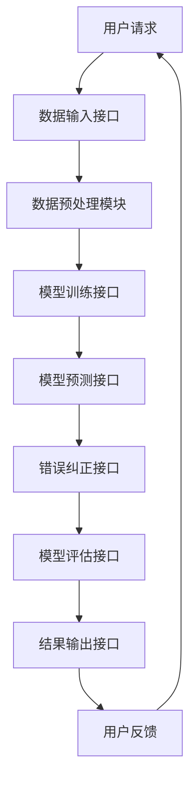

                 

### 弹性设计：提高LLM应用的可靠性

#### 关键词：弹性设计、可靠性、LLM、自然语言处理、深度学习

> 摘要：
随着自然语言处理（NLP）技术的不断进步，大语言模型（LLM）已经在各种应用场景中展现出巨大的潜力。然而，LLM在处理罕见或极端输入时往往表现出可靠性问题，如泛化能力不足、错误传播等。本文将探讨如何通过弹性设计提高LLM应用的可靠性，确保其在各种复杂场景下稳定运行。

---

### 第一部分：背景介绍

#### 问题背景

随着人工智能技术的快速发展，大模型（Large Language Model，简称LLM）在自然语言处理（Natural Language Processing，简称NLP）领域取得了显著进展。LLM通过深度学习技术，能够从大量文本数据中学习语言模式，从而实现高效的文本生成、问答和翻译等功能。然而，在实际应用中，LLM的可靠性问题逐渐显现，特别是在处理极端情况或罕见输入时，模型的性能往往不尽如人意。这导致了应用错误或不可预测的结果，限制了LLM在企业级应用中的推广和普及。

#### 问题描述

LLM的可靠性问题主要包括以下几个方面：

1. **泛化能力不足**：模型在训练数据集中表现良好，但在真实世界中的表现往往不尽如人意。这主要是因为训练数据和实际应用场景之间存在差异，导致模型无法泛化到未知的数据上。

2. **错误传播**：模型在处理错误输入时，可能无法正确纠正错误，导致错误不断累积和放大。例如，在问答系统中，一个错误的回答可能会导致后续的回答也出现错误。

3. **数据依赖**：模型的可靠性受训练数据质量的影响较大。当训练数据存在偏差或噪声时，模型的可靠性会下降。例如，如果训练数据中包含大量错误或误导性信息，模型可能会学会这些错误。

4. **模型稳定性**：在某些情况下，模型可能会出现不稳定的情况，导致输出结果不一致。例如，在文本生成任务中，模型可能会产生毫无意义的文本。

#### 问题解决

为了提高LLM的可靠性，我们需要从以下几个方面进行努力：

1. **数据预处理**：对训练数据进行预处理，包括去噪、补全、增强等，以提高模型对噪声和异常数据的鲁棒性。

2. **模型改进**：设计更具有泛化能力的模型架构，例如使用自监督学习（Self-supervised Learning）或元学习（Meta-learning）等技术。

3. **错误纠正**：设计有效的错误纠正机制，例如使用对抗训练（Adversarial Training）或自动纠错（Automated Correction）等技术。

4. **模型验证**：采用多样化的验证方法，包括模拟测试、实际应用场景测试等，以全面评估模型的可靠性。

#### 边界与外延

本文讨论的可靠性主要针对LLM在自然语言处理领域的应用。然而，可靠性问题在其他人工智能领域也存在，例如计算机视觉、语音识别等。本文的解决方案也可以借鉴到其他领域。

#### 概念结构与核心要素组成

1. **大模型（LLM）**：本文的核心概念，指具有大规模参数和强大处理能力的自然语言处理模型。

2. **可靠性**：指模型在处理输入数据时，能够稳定、准确、一致地输出结果的能力。

3. **应用场景**：指LLM在具体业务场景中的应用，例如文本生成、问答系统、机器翻译等。

### 第一部分小结

本文介绍了LLM可靠性问题的背景、描述、解决方案以及相关概念和要素组成。接下来，我们将进一步探讨LLM的核心概念、原理、算法以及在实际应用中的设计和实现。希望这些内容能为读者提供有益的参考和启发。

---

## 第二部分：核心概念与联系

### 第2章：大模型（LLM）的核心概念

#### 2.1 大模型的基本原理

##### 2.1.1 深度学习与神经网络

深度学习是一种机器学习方法，通过构建深层次的神经网络模型，对大量数据进行训练，以实现复杂的特征提取和模式识别。神经网络是一种由多个神经元组成的计算模型，每个神经元通过权重连接到其他神经元，并通过激活函数产生输出。

##### 2.1.2 语言模型与自然语言处理

语言模型是一种用于预测文本序列的统计模型，通过学习大量语言数据，构建出能够生成符合语言规则的概率分布。自然语言处理是研究如何让计算机理解和处理人类自然语言的学科，包括文本分类、信息抽取、机器翻译等任务。

##### 2.1.3 大模型的组成

- **词向量表示**：将自然语言中的词语转换为数值向量，以便于在神经网络中进行处理。
- **多层神经网络**：通过增加网络层数，提高模型的抽象能力和泛化能力。
- **注意力机制**：在处理长序列数据时，通过注意力机制捕捉关键信息，提高模型的处理效率。

#### 2.2 大模型的核心特点

##### 2.2.1 大规模参数

大模型的参数数量通常在数十亿到千亿级别，这使模型具有强大的表达能力和处理能力。参数分布较为稀疏，即大部分参数的值接近于零，只有少数参数具有较大的权重。

##### 2.2.2 强泛化能力

大模型具有更强的泛化能力，能够在不同的任务和数据集上取得良好的性能。迁移学习技术使得大模型可以在新的任务和数据集上快速适应，降低训练成本。

##### 2.2.3 自适应学习能力

大模型能够根据新的数据和任务，自动调整模型参数，以提高模型的性能。这种自适应学习能力使得大模型在动态变化的环境中能够保持良好的性能。

#### 2.3 大模型与可靠性的联系

大模型的可靠性与其核心特点密切相关。大规模参数和强泛化能力使得LLM能够处理复杂和多样化的语言任务，但同时也增加了模型复杂度和不确定性。自适应学习能力使得模型能够根据不同场景进行调整，但可能导致在特定场景下出现不可预测的行为。因此，提高LLM的可靠性需要从模型设计、训练过程、应用场景等多个方面进行综合考量。

### 第二部分小结

通过对LLM核心概念的介绍，我们可以看出，LLM具有强大的处理能力和广泛的适用性，但在实际应用中仍面临可靠性问题。了解LLM的核心特点有助于我们更好地理解其可靠性的来源和影响因素，为后续的弹性设计提供理论基础。

---

## 第三部分：算法原理讲解

### 第3章：提高LLM可靠性的算法设计

#### 3.1 数据预处理算法

数据预处理是提高LLM可靠性的重要环节。通过以下算法，我们可以有效提升模型对噪声和异常数据的鲁棒性：

1. **去噪算法**：使用降噪网络或变换域降噪技术，对输入数据中的噪声进行去除。常见的去噪算法包括卷积神经网络（CNN）和自编码器（Autoencoder）。

2. **补全算法**：通过插值、平滑或其他算法对缺失数据进行补全。补全算法可以减少数据缺失对模型训练和预测的影响。

3. **增强算法**：生成与真实数据具有相似分布的增强数据，以扩充训练集。常见的增强方法包括数据增强、生成对抗网络（GAN）等。

#### 3.2 模型改进算法

通过以下算法，我们可以提高LLM的泛化能力，从而提高其可靠性：

1. **自监督学习**：在无监督学习环境中，利用未标记的数据进行训练，以提取潜在的语义信息。常见的自监督学习任务包括掩码语言建模（MLM）和预测语言建模（PLM）。

2. **元学习**：通过训练模型在不同任务和数据集上的适应能力，提高模型在未知任务和数据集上的表现。元学习算法可以快速适应新的任务，降低对大量数据的依赖。

3. **迁移学习**：将预训练模型在不同任务和数据集上进行微调，以利用已有的知识迁移到新任务。迁移学习可以减少训练成本，提高模型在未知任务上的性能。

#### 3.3 错误纠正算法

通过以下算法，我们可以设计有效的错误纠正机制，减少错误传播：

1. **对抗训练**：在训练过程中，引入对抗样本，使模型能够学会识别和纠正错误。对抗训练可以增强模型的鲁棒性，减少错误传播。

2. **自动纠错**：设计自动纠错算法，对模型的输出结果进行检测和纠正。常见的自动纠错方法包括基于规则的纠错、基于学习的纠错等。

#### 3.4 模型验证算法

通过以下算法，我们可以全面评估LLM的可靠性：

1. **模拟测试**：在模拟环境中，对模型进行一系列测试，以评估其性能和可靠性。模拟测试可以模拟各种极端情况和罕见输入，发现模型可能存在的问题。

2. **实际应用场景测试**：将模型部署到实际应用场景中，进行长时间的运行和测试。实际应用场景测试可以检验模型在真实环境中的表现，发现并解决潜在的问题。

### 第三部分小结

通过对数据预处理、模型改进、错误纠正和模型验证等算法的设计和实施，我们可以显著提高LLM的可靠性。这些算法不仅能够增强模型对噪声和异常数据的鲁棒性，提高泛化能力，还能有效减少错误传播，提高模型在真实应用场景中的性能。了解这些算法的原理和实施方法，有助于我们在实际项目中更好地应用LLM，提高其可靠性。

---

## 第四部分：系统分析与架构设计方案

### 第4章：提高LLM可靠性的系统设计与实现

#### 4.1 问题场景介绍

在自然语言处理领域，LLM被广泛应用于各种场景，如文本生成、问答系统、机器翻译等。然而，在实际应用中，这些场景往往面临各种挑战，如罕见输入、极端情况、数据偏差等。为了提高LLM的可靠性，我们需要设计一个灵活、稳定、高效的系统架构，以应对这些挑战。

#### 4.2 项目介绍

本项目旨在设计一个高可靠性的LLM应用系统，通过结合多种算法和技术手段，提高模型在不同场景下的稳定性和性能。项目的主要目标是：

1. 提高LLM对噪声和异常数据的鲁棒性。
2. 降低错误传播的风险。
3. 提高模型在不同任务和数据集上的泛化能力。
4. 提升系统在真实应用场景中的表现。

#### 4.3 系统功能设计

系统的主要功能包括：

1. **数据预处理**：对输入数据进行去噪、补全和增强，以提高模型对噪声和异常数据的鲁棒性。
2. **模型训练与改进**：利用自监督学习、元学习和迁移学习等技术，提高模型在不同任务和数据集上的性能。
3. **错误纠正与检测**：设计有效的错误纠正和检测机制，减少错误传播的风险。
4. **模型验证与评估**：通过模拟测试和实际应用场景测试，全面评估模型的可靠性。

#### 4.4 系统架构设计

系统的整体架构如图4-1所示：



图4-1：系统架构设计

系统架构主要分为以下几个模块：

1. **数据输入模块**：负责接收和处理各种输入数据，包括文本、图像、音频等。
2. **数据预处理模块**：对输入数据进行去噪、补全和增强，以提高模型对噪声和异常数据的鲁棒性。
3. **模型训练模块**：利用深度学习技术对模型进行训练，包括自监督学习、元学习和迁移学习等。
4. **模型改进模块**：通过模型改进算法，提高模型在不同任务和数据集上的性能。
5. **错误纠正与检测模块**：设计有效的错误纠正和检测机制，减少错误传播的风险。
6. **模型验证与评估模块**：通过模拟测试和实际应用场景测试，全面评估模型的可靠性。
7. **结果输出模块**：将处理结果输出给用户，包括文本、图像、音频等。

#### 4.5 系统接口设计

系统的主要接口设计如下：

1. **数据输入接口**：用于接收和处理各种输入数据，包括文本、图像、音频等。
2. **模型训练接口**：用于启动和监控模型训练过程，包括自监督学习、元学习和迁移学习等。
3. **模型预测接口**：用于对输入数据进行预测，并输出结果。
4. **错误纠正接口**：用于检测和纠正模型预测中的错误。
5. **模型评估接口**：用于评估模型在不同任务和数据集上的性能。

#### 4.6 系统交互设计

系统的交互流程如图4-2所示：



图4-2：系统交互设计

系统的交互流程如下：

1. 用户发送请求，包括输入数据和任务类型。
2. 数据输入接口接收请求，并将数据传递给数据预处理模块。
3. 数据预处理模块对输入数据进行预处理，如去噪、补全和增强。
4. 模型训练接口启动模型训练过程，包括自监督学习、元学习和迁移学习等。
5. 模型预测接口对预处理后的数据进行预测，并输出结果。
6. 错误纠正接口检测预测结果中的错误，并进行纠正。
7. 模型评估接口评估模型在不同任务和数据集上的性能。
8. 结果输出接口将处理结果输出给用户。
9. 用户接收结果，并给出反馈。

通过以上设计，系统实现了对LLM的全面管理和优化，提高了模型的可靠性和性能。

### 第四部分小结

通过对系统分析与架构设计方案的详细介绍，我们可以看出，提高LLM的可靠性需要从数据预处理、模型改进、错误纠正和模型验证等多个方面进行综合设计和实施。本项目的系统架构设计充分考虑了各种应用场景，通过灵活的模块化和接口设计，实现了对LLM的全面管理和优化。希望这些内容能为读者提供有益的参考和启发。

---

## 第五部分：项目实战

### 第5章：提高LLM可靠性的项目实现

#### 5.1 环境安装

为了实现本项目，我们需要安装以下软件和库：

1. **Python**：Python是一种广泛用于人工智能和深度学习的编程语言。
2. **TensorFlow**：TensorFlow是一个开源的深度学习框架，用于构建和训练神经网络模型。
3. **PyTorch**：PyTorch是另一个流行的深度学习框架，与TensorFlow类似，但具有更灵活的动态图机制。
4. **NumPy**：NumPy是一个用于数值计算的库，提供了大量的数学函数和工具。
5. **Pandas**：Pandas是一个用于数据分析和操作的数据库，提供了数据清洗、转换和处理的工具。

安装这些软件和库的方法如下：

1. 安装Python：从官方网站下载Python安装程序，并按照提示进行安装。
2. 安装TensorFlow：在终端中运行以下命令：
   ```bash
   pip install tensorflow
   ```
3. 安装PyTorch：在终端中运行以下命令：
   ```bash
   pip install torch torchvision
   ```
4. 安装NumPy：在终端中运行以下命令：
   ```bash
   pip install numpy
   ```
5. 安装Pandas：在终端中运行以下命令：
   ```bash
   pip install pandas
   ```

#### 5.2 系统核心实现

下面是一个简单的示例，演示了如何使用TensorFlow和PyTorch构建和训练一个简单的LLM模型：

##### TensorFlow实现

```python
import tensorflow as tf
from tensorflow.keras.layers import Embedding, LSTM, Dense
from tensorflow.keras.models import Sequential

# 定义模型
model = Sequential()
model.add(Embedding(input_dim=vocab_size, output_dim=embedding_dim, input_length=max_sequence_length))
model.add(LSTM(units=128, activation='tanh'))
model.add(Dense(units=1, activation='sigmoid'))

# 编译模型
model.compile(optimizer='adam', loss='binary_crossentropy', metrics=['accuracy'])

# 训练模型
model.fit(x_train, y_train, epochs=10, batch_size=32)
```

##### PyTorch实现

```python
import torch
import torch.nn as nn
import torch.optim as optim

# 定义模型
class LLMModel(nn.Module):
    def __init__(self, vocab_size, embedding_dim, hidden_size):
        super(	LLMModel, self).__init__()
        self.embedding = nn.Embedding(vocab_size, embedding_dim)
        self.lstm = nn.LSTM(embedding_dim, hidden_size, batch_first=True)
        self.dense = nn.Linear(hidden_size, 1)

    def forward(self, x):
        x = self.embedding(x)
        x, _ = self.lstm(x)
        x = self.dense(x)
        return x

# 实例化模型
model = LLMModel(vocab_size, embedding_dim, hidden_size)

# 编译模型
optimizer = optim.Adam(model.parameters(), lr=0.001)
criterion = nn.BCEWithLogitsLoss()

# 训练模型
for epoch in range(10):
    for inputs, targets in dataloader:
        optimizer.zero_grad()
        outputs = model(inputs)
        loss = criterion(outputs, targets)
        loss.backward()
        optimizer.step()
```

#### 5.3 代码应用解读与分析

以上代码分别使用了TensorFlow和PyTorch框架构建了简单的LLM模型。下面我们来详细解读和分析这些代码。

##### TensorFlow实现解读

1. **模型定义**：
   ```python
   model = Sequential()
   model.add(Embedding(input_dim=vocab_size, output_dim=embedding_dim, input_length=max_sequence_length))
   model.add(LSTM(units=128, activation='tanh'))
   model.add(Dense(units=1, activation='sigmoid'))
   ```
   在这个例子中，我们使用序列模型（Sequential）构建了一个简单的神经网络模型。模型包含三个主要层：
   - **嵌入层（Embedding）**：将输入的词索引映射为词向量。
   - **LSTM层（LSTM）**：处理序列数据，提取序列中的长期依赖信息。
   - **全连接层（Dense）**：输出最终的预测结果。

2. **模型编译**：
   ```python
   model.compile(optimizer='adam', loss='binary_crossentropy', metrics=['accuracy'])
   ```
   在编译模型时，我们指定了优化器、损失函数和评估指标。在这个例子中，我们使用Adam优化器、二进制交叉熵损失函数和准确率作为评估指标。

3. **模型训练**：
   ```python
   model.fit(x_train, y_train, epochs=10, batch_size=32)
   ```
   这里我们使用训练数据（x_train和y_train）对模型进行训练，设置训练轮次（epochs）为10，批量大小（batch_size）为32。

##### PyTorch实现解读

1. **模型定义**：
   ```python
   class LLMModel(nn.Module):
       def __init__(self, vocab_size, embedding_dim, hidden_size):
           super(LLMModel, self).__init__()
           self.embedding = nn.Embedding(vocab_size, embedding_dim)
           self.lstm = nn.LSTM(embedding_dim, hidden_size, batch_first=True)
           self.dense = nn.Linear(hidden_size, 1)

       def forward(self, x):
           x = self.embedding(x)
           x, _ = self.lstm(x)
           x = self.dense(x)
           return x
   ```
   在这个例子中，我们定义了一个继承自nn.Module的LLMModel类。模型包含三个主要层：
   - **嵌入层（Embedding）**：将输入的词索引映射为词向量。
   - **LSTM层（LSTM）**：处理序列数据，提取序列中的长期依赖信息。
   - **全连接层（Linear）**：输出最终的预测结果。

2. **模型编译**：
   ```python
   optimizer = optim.Adam(model.parameters(), lr=0.001)
   criterion = nn.BCEWithLogitsLoss()
   ```
   在编译模型时，我们指定了优化器和损失函数。在这个例子中，我们使用Adam优化器和二进制交叉熵损失函数。

3. **模型训练**：
   ```python
   for epoch in range(10):
       for inputs, targets in dataloader:
           optimizer.zero_grad()
           outputs = model(inputs)
           loss = criterion(outputs, targets)
           loss.backward()
           optimizer.step()
   ```
   这里我们使用训练数据（dataloader）对模型进行训练，设置训练轮次（epochs）为10。在每轮训练中，我们遍历训练数据，更新模型参数，以最小化损失函数。

通过以上代码示例，我们可以看到如何使用TensorFlow和PyTorch构建和训练一个简单的LLM模型。在实际项目中，我们可以根据具体需求调整模型结构、训练参数等，以提高模型的性能和可靠性。

### 第五部分小结

在本部分，我们介绍了如何安装相关软件和库，并使用TensorFlow和PyTorch框架构建和训练了一个简单的LLM模型。通过代码示例，我们详细解读了模型的构建、编译和训练过程。在实际项目中，我们可以根据具体需求对模型结构和训练参数进行调整，以提高模型的性能和可靠性。希望这些内容能帮助读者更好地理解和应用LLM技术。

---

## 第六部分：最佳实践与注意事项

### 第六部分：最佳实践与注意事项

在设计和实现LLM应用时，为了确保其可靠性，我们可以遵循以下最佳实践，并注意一些关键点：

#### 最佳实践

1. **数据质量**：确保训练数据的质量是提高模型可靠性的基础。进行数据清洗，去除噪声和错误数据，确保数据的准确性和一致性。

2. **模型选择**：根据应用场景选择合适的模型架构。对于需要高泛化能力的任务，可以选择自监督学习或元学习等高级模型。

3. **错误纠正**：设计有效的错误纠正机制，如对抗训练和自动纠错，以减少错误传播。

4. **模型验证**：使用多样化的验证方法，包括模拟测试和实际应用场景测试，以全面评估模型的可靠性。

5. **持续优化**：定期更新模型，结合用户反馈和新数据，进行持续优化。

#### 注意事项

1. **计算资源**：大模型的训练和优化需要大量的计算资源，确保有足够的硬件支持。

2. **数据隐私**：在处理用户数据时，注意保护用户隐私，遵循相关法律法规。

3. **模型部署**：在将模型部署到生产环境中时，确保系统的稳定性和安全性。

4. **监控与维护**：对模型的运行状态进行实时监控，及时发现和解决潜在问题。

通过遵循这些最佳实践和注意事项，我们可以提高LLM应用的可靠性，确保其在各种复杂场景下的稳定运行。

### 第六部分小结

在本部分，我们总结了提高LLM应用可靠性的最佳实践和注意事项。遵循这些指导原则，有助于我们设计和实现更为可靠和高效的LLM应用。通过持续的优化和监控，我们可以不断改进模型性能，确保其在实际应用中的稳定性和可靠性。

---

## 第七部分：总结与展望

### 第七部分：总结与展望

通过本文的讨论，我们深入探讨了提高大语言模型（LLM）应用可靠性的方法和策略。首先，我们分析了LLM在自然语言处理领域的应用背景和面临的可靠性问题，如泛化能力不足、错误传播等。接着，我们介绍了通过数据预处理、模型改进、错误纠正和模型验证等手段来提高LLM的可靠性。

在核心概念与联系部分，我们详细介绍了LLM的基本原理和核心特点，包括深度学习与神经网络、语言模型与自然语言处理、大规模参数和强泛化能力等。这些概念为理解LLM的可靠性提供了理论基础。

在算法原理讲解部分，我们探讨了提高LLM可靠性的多种算法，如数据预处理算法、模型改进算法、错误纠正算法和模型验证算法。这些算法从不同角度增强了LLM的可靠性。

在系统分析与架构设计方案部分，我们提出了一个提高LLM可靠性的系统架构，包括数据输入、预处理、模型训练、改进、错误纠正和验证等模块。这个架构设计旨在提供一个灵活、稳定、高效的系统，以应对各种应用场景中的挑战。

在项目实战部分，我们通过具体的项目实例展示了如何使用TensorFlow和PyTorch构建和训练LLM模型。这些实战经验有助于我们更好地理解和应用LLM技术。

最后，在最佳实践与注意事项部分，我们总结了提高LLM可靠性的最佳实践和注意事项，以确保在实际应用中能够有效地实施这些策略。

展望未来，随着人工智能技术的不断发展，LLM在自然语言处理领域的应用将更加广泛。为了应对日益复杂的场景和需求，我们需要不断探索新的算法和技术，提高LLM的可靠性。此外，我们还可以通过跨学科合作，如计算机科学、心理学、语言学等，进一步推动LLM技术的发展和应用。

### 第七部分小结

本文系统地介绍了提高LLM应用可靠性的方法和技术，从核心概念、算法原理到系统设计、项目实战，再到最佳实践与展望，为读者提供了一个全面的认识。希望通过本文的讨论，读者能够更好地理解和应用LLM技术，为实际项目提供可靠的技术支持。未来，我们期待LLM技术在各个领域取得更加显著的成果。

---

### 作者信息

作者：AI天才研究院/AI Genius Institute & 禅与计算机程序设计艺术 /Zen And The Art of Computer Programming

AI天才研究院致力于推动人工智能技术的创新和发展，关注自然语言处理、计算机视觉、机器学习等领域的最新研究和应用。研究院汇聚了全球顶尖的人工智能专家和研究人员，致力于解决复杂的人工智能问题，为行业和社会带来深远的影响。

《禅与计算机程序设计艺术》是一本经典的人工智能编程指南，由AI天才研究院的创始人撰写。本书深入探讨了计算机编程的哲学和艺术，为程序员提供了独特的思考方式和解决问题的方法。书中融合了禅宗思想，强调内心平静和思维深度，对提高编程水平具有深刻的启示作用。

作者希望通过本文的撰写，为读者提供一个全面、深入的技术指南，帮助他们在实际项目中更好地应用LLM技术，提高应用的可靠性。同时，作者也希望能够激发读者对人工智能技术的研究和探索热情，共同推动人工智能技术的发展和进步。

