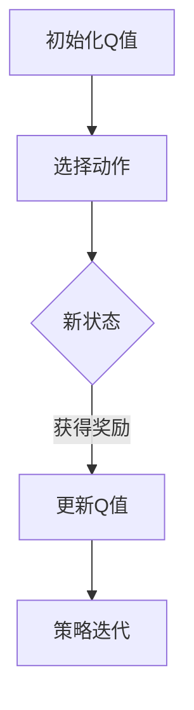
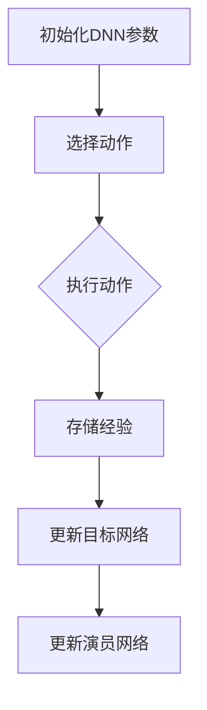
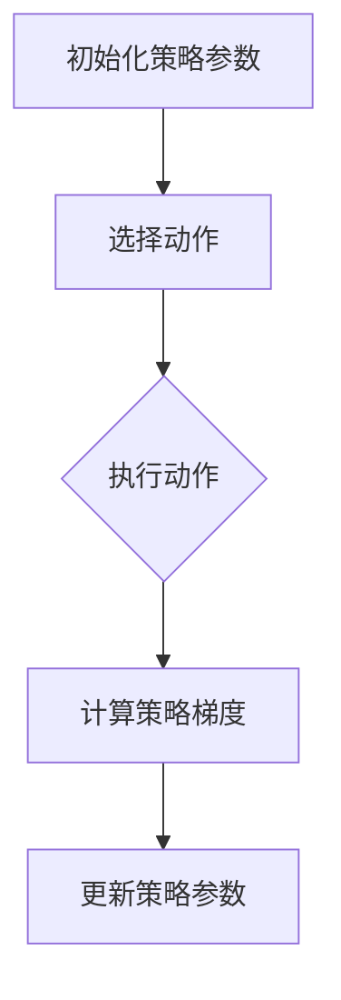
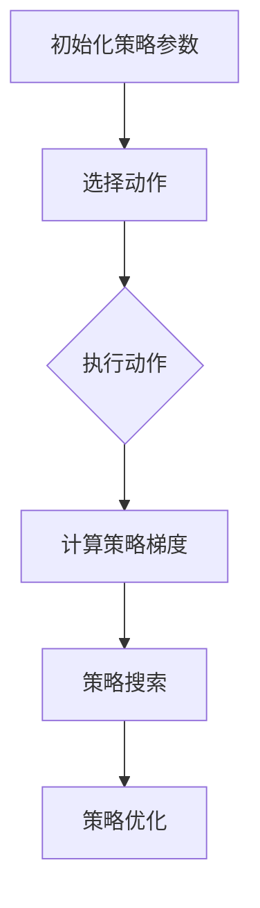

                 

### 文章标题

强化学习在AI Agent任务规划中的实践

关键词：强化学习、AI Agent、任务规划、算法、实战应用

摘要：本文将深入探讨强化学习在AI Agent任务规划中的应用与实践。首先，我们将回顾强化学习的起源与发展，理解其基本概念与核心问题。接着，我们会探讨AI Agent任务规划的基础，分析其在强化学习中的挑战与机遇。随后，我们将详细介绍几种基于强化学习的任务规划算法，如Q-Learning、DQN、Policy Gradient和策略搜索增强算法。通过对这些算法的数学模型、流程图和Python源代码实现的讲解，读者将能够掌握强化学习在任务规划中的具体应用。接下来，我们将讨论强化学习在AI Agent任务规划中的实现，包括环境搭建、实现流程、工具和框架介绍以及具体实现步骤。随后，我们将通过一个实际项目实战，展示如何将强化学习应用于任务规划，并进行代码解读与分析。最后，我们将讨论强化学习在AI Agent任务规划中的挑战与展望，为读者提供进一步的思考和研究方向。

## 第一部分：强化学习的背景与基础

### 第1章：强化学习概述

#### 1.1 强化学习的起源与发展

强化学习（Reinforcement Learning，简称RL）是机器学习的一个分支，主要研究如何通过交互式环境来学习决策策略，以实现长期目标。其起源可以追溯到20世纪50年代，由美国心理学家阿伦·沃尔普（Alan Wagner）提出的“操作性条件反射”理论。该理论指出，通过奖励和惩罚的反馈，个体可以改变其行为。

1970年代，强化学习开始受到计算机科学家的关注，尤其是理查德·萨顿（Richard Sutton）和安德鲁·巴特斯（Andrew Barto）在1980年代出版的《强化学习：一种介绍》一书，标志着强化学习的正式诞生和迅速发展。

在过去的几十年里，强化学习取得了显著的进展，特别是在深度学习技术的推动下，强化学习算法的应用范围不断扩大。从早期的Q-Learning、SARSA到如今的深度强化学习（Deep Reinforcement Learning，简称DRL），强化学习已经成为人工智能领域的重要研究方向。

#### 1.2 强化学习的基本概念与核心问题

强化学习主要涉及以下几个基本概念：

- **Agent（智能体）**：执行动作的主体，可以是机器人、软件程序或人工神经网络。
- **Environment（环境）**：智能体所处的环境，用于生成状态和提供奖励。
- **State（状态）**：描述智能体当前环境的条件。
- **Action（动作）**：智能体能够采取的行为。
- **Reward（奖励）**：环境对智能体采取的动作给予的即时反馈，用于评价动作的好坏。
- **Policy（策略）**：智能体在特定状态下采取的动作选择规则。

强化学习旨在通过学习策略，使智能体能够最大化长期奖励。其核心问题是如何在不确定的环境中，通过试错（Trial and Error）和探索（Exploration）来获得最优策略。

#### 1.3 强化学习的基本原理

强化学习的基本原理可以概括为“试错学习”，即智能体在环境中进行动作选择，根据环境的反馈（奖励或惩罚）调整其策略，以逐步提高奖励的总和。

具体来说，强化学习的过程可以分为以下几个步骤：

1. **初始化**：智能体和环境初始化，选择初始状态。
2. **动作选择**：智能体根据当前状态，依据策略选择一个动作。
3. **环境反馈**：环境根据智能体的动作，生成新的状态，并提供奖励。
4. **策略更新**：智能体根据奖励更新策略，以期望在下一个动作中获得更好的奖励。

#### 1.4 强化学习在AI Agent任务规划中的应用前景

随着人工智能技术的不断进步，强化学习在AI Agent任务规划中的应用前景愈发广阔。以下是几个主要应用领域：

- **自主驾驶**：强化学习可以用于自动驾驶车辆的路径规划，使车辆能够自主适应复杂的交通环境。
- **机器人控制**：强化学习在机器人控制领域具有广泛的应用，如机器人手臂的控制、机器人行走等。
- **游戏AI**：强化学习在游戏AI领域取得了显著的成果，例如在国际象棋、围棋等游戏中的高水平表现。
- **推荐系统**：强化学习可以用于个性化推荐系统，根据用户的历史行为和偏好，提供个性化的推荐。
- **资源分配**：强化学习可以用于网络资源分配、电力调度等优化问题，提高资源利用效率。

#### 1.5 本章小结

本章对强化学习的基本概念、发展历程、核心问题和应用前景进行了概述。通过本章的学习，读者可以初步了解强化学习的基本原理和应用场景，为后续章节的深入探讨打下基础。

## 第二部分：强化学习在AI Agent任务规划中的应用

### 第2章：AI Agent任务规划基础

#### 2.1 AI Agent的定义与功能

AI Agent是指具备一定自主决策能力的人工智能实体，能够在特定环境下完成特定任务。AI Agent通常由以下几个关键组件组成：

- **感知器**：用于感知环境信息，如视觉、听觉、触觉等。
- **决策模块**：根据感知到的环境信息，执行决策算法，选择合适的动作。
- **执行器**：根据决策模块的决策，执行具体的动作，如移动、操作等。
- **记忆模块**：记录智能体的历史决策和动作，用于学习和优化策略。

AI Agent的功能主要包括：

- **任务执行**：在给定任务和环境约束下，自动执行任务。
- **自主学习**：通过与环境交互，不断优化自身策略和决策能力。
- **自主适应**：能够根据环境变化，调整行为策略，以适应新环境。

#### 2.2 任务规划的概念与重要性

任务规划是指智能体根据当前状态和目标，生成一个有序的动作序列，以实现特定任务。任务规划在AI Agent中具有以下重要作用：

- **任务优化**：通过任务规划，智能体可以找到最优或近似最优的任务执行路径，提高任务完成效率。
- **资源管理**：任务规划可以帮助智能体合理分配资源，如时间、能量、计算资源等，提高资源利用效率。
- **故障恢复**：在任务执行过程中，智能体可能会遇到各种故障和障碍。通过任务规划，智能体可以预先制定故障应对策略，提高任务完成可靠性。

#### 2.3 AI Agent任务规划的挑战与机遇

AI Agent任务规划面临以下挑战：

- **环境复杂度**：实际环境可能包含大量的不确定性因素，如噪音、动态变化等，给任务规划带来很大困难。
- **时间敏感性**：某些任务需要在有限的时间内完成，要求任务规划算法具有快速响应能力。
- **资源限制**：智能体的资源（如计算能力、存储空间等）有限，任务规划需要在资源限制下进行优化。
- **目标多样性**：智能体可能需要完成多个相互冲突的目标，任务规划需要平衡不同目标之间的关系。

与此同时，强化学习为AI Agent任务规划带来了以下机遇：

- **自适应能力**：强化学习通过试错和探索，能够自适应地调整策略，适应复杂和动态的环境。
- **优化效率**：强化学习可以通过学习历史经验，提高任务规划的效率和鲁棒性。
- **模型可解释性**：强化学习算法的决策过程相对直观，有助于理解和解释智能体的行为。

#### 2.4 任务规划算法的分类与比较

任务规划算法可以分为以下几类：

- **基于规则的算法**：通过预设的规则和动作序列进行任务规划，如启发式搜索、状态空间搜索等。优点是算法简单、可解释性强；缺点是适应性和灵活性较差。
- **基于模型的算法**：通过建立环境模型，利用模型预测和优化任务规划。优点是适应性强、灵活性高；缺点是建模复杂、计算开销大。
- **强化学习算法**：通过与环境交互，学习最优任务规划策略。优点是自适应能力强、优化效率高；缺点是算法复杂、模型可解释性较差。

不同任务规划算法的比较：

| 算法类型       | 优点                       | 缺点                   | 适用场景                |
|--------------|--------------------------|----------------------|----------------------|
| 基于规则的算法 | 算法简单、可解释性强       | 适应性和灵活性较差       | 环境相对简单、规则明确的情况  |
| 基于模型的算法 | 适应性强、灵活性高         | 建模复杂、计算开销大       | 环境复杂、需要快速响应的情况  |
| 强化学习算法 | 自适应能力强、优化效率高     | 算法复杂、模型可解释性较差   | 环境动态变化、需要长期优化的情况 |

#### 2.5 本章小结

本章对AI Agent任务规划的基础知识进行了概述，包括AI Agent的定义与功能、任务规划的概念与重要性，以及任务规划算法的分类与比较。通过本章的学习，读者可以了解AI Agent任务规划的基本概念和算法框架，为后续章节的深入探讨打下基础。

### 第3章：基于强化学习的任务规划算法

强化学习在任务规划中的应用，为解决复杂动态环境下的任务规划问题提供了有效途径。本章节将详细介绍几种基于强化学习的任务规划算法，包括Q-Learning、Deep Q-Network（DQN）、Policy Gradient和策略搜索增强算法，并分别阐述其基本原理、数学模型、算法流程和具体实现。

#### 3.1 Q-Learning算法

Q-Learning是一种基于值函数的强化学习算法，它通过迭代更新值函数，以实现最大化长期奖励的目标。Q-Learning的基本思想是，通过学习在当前状态下采取特定动作的预期奖励，来指导智能体的决策过程。

##### 3.1.1 Q-Learning的基本原理

Q-Learning的核心是Q值函数，即每个状态-动作对的预期奖励值。具体来说，Q-Learning算法按照以下步骤进行：

1. **初始化**：初始化Q值函数，通常可以设置为全为零或者随机初始化。
2. **选择动作**：在给定状态下，根据策略选择一个动作，策略可以是ε-贪心策略或者ε-贪婪策略。
3. **执行动作**：智能体执行选定的动作，进入新的状态，并获得立即奖励。
4. **更新Q值**：根据新的状态和获得的奖励，更新Q值函数。更新公式如下：

   $$ Q(s, a) \leftarrow Q(s, a) + \alpha [r + \gamma \max_{a'} Q(s', a') - Q(s, a)] $$

   其中，$s$ 表示当前状态，$a$ 表示当前动作，$s'$ 表示新的状态，$a'$ 表示新的动作，$r$ 表示获得的奖励，$\alpha$ 是学习率，$\gamma$ 是折扣因子。

##### 3.1.2 Q-Learning算法的数学模型和公式

Q-Learning算法的数学模型和公式主要包括：

- **初始化**：$$ Q(s, a) \in \mathbb{R}, \forall s \in S, \forall a \in A $$

- **Q值更新**：$$ Q(s, a) \leftarrow Q(s, a) + \alpha [r + \gamma \max_{a'} Q(s', a') - Q(s, a)] $$

- **策略**：$$ \pi(s) = \begin{cases} 
      a = \arg\max_a Q(s, a) & \text{if random choice with probability } \varepsilon \\
      a = \arg\max_a Q(s, a) & \text{if greedy choice with probability } 1 - \varepsilon 
   \end{cases} $$

##### 3.1.3 Q-Learning算法的mermaid流程图

以下是一个简单的Q-Learning算法流程图的mermaid表示：



##### 3.1.4 Q-Learning算法的Python源代码实现

以下是一个简单的Q-Learning算法的Python实现：

```python
import numpy as np
import random

# 初始化参数
alpha = 0.1  # 学习率
gamma = 0.9  # 折扣因子
epsilon = 0.1  # ε-贪婪策略的ε值
n_states = 100  # 状态数量
n_actions = 4  # 动作数量
Q = np.zeros((n_states, n_actions))

# 环境模拟
def environment(s):
    if s == 0:
        return 10, 1
    elif s == 50:
        return -10, 1
    else:
        return 0, 0

# Q-Learning算法
def q_learning():
    while True:
        s = random.randint(0, n_states - 1)
        a = select_action(s)
        s_prime, r = environment(s)
        Q[s, a] = Q[s, a] + alpha * (r + gamma * max(Q[s_prime, :]) - Q[s, a])
        s = s_prime

# 选择动作（ε-贪婪策略）
def select_action(s):
    if random.random() < epsilon:
        return random.randint(0, n_actions - 1)
    else:
        return np.argmax(Q[s, :])

q_learning()
```

##### 3.1.5 Q-Learning算法的案例分析

以下是一个简单的案例，模拟一个机器人从状态0移动到状态50的过程。环境奖励函数为：当机器人处于状态0时，获得奖励10；当机器人处于状态50时，获得奖励-10；其他状态不奖励。

```python
# 案例模拟
Q = np.zeros((100, 4))
q_learning()

# 打印Q值矩阵
print(Q)
```

在这个案例中，通过多次迭代，Q-Learning算法会逐渐找到从状态0到状态50的最佳路径。在实际应用中，可以根据具体情况调整学习率、折扣因子和ε值，以获得更好的学习效果。

#### 3.2 Deep Q-Network (DQN)算法

DQN（Deep Q-Network）是深度强化学习的一种重要算法，它结合了深度学习和强化学习的技术，解决了Q-Learning算法在处理高维状态空间时的局限性。

##### 3.2.1 DQN的基本原理

DQN的基本原理与Q-Learning类似，但引入了深度神经网络（DNN）来近似Q值函数。DQN的关键组件包括：

- **Actor（演员）**：一个深度神经网络，用于预测Q值。
- **Critic（评论家）**：一个深度神经网络，用于评估动作的好坏。
- **Experience Replay（经验回放）**：用于存储和随机重放历史经验，提高算法的稳定性和泛化能力。

DQN的工作流程如下：

1. **初始化**：初始化DNN参数、经验回放缓冲和目标网络。
2. **选择动作**：使用ε-贪婪策略选择动作。
3. **执行动作**：智能体执行选定的动作，进入新的状态，并获得立即奖励。
4. **存储经验**：将当前状态、动作、奖励和新状态存储到经验回放缓冲。
5. **更新目标网络**：定期同步演员网络和目标网络。
6. **更新演员网络**：使用经验回放缓冲中的数据，通过梯度下降法更新演员网络的参数。

##### 3.2.2 DQN算法的数学模型和公式

DQN的数学模型和公式主要包括：

- **Q值预测**：$$ Q(s, a) = f_{\theta}(s, a) $$，其中$f_{\theta}(s, a)$是深度神经网络的输出。

- **目标Q值**：$$ Q^*(s', a') = r + \gamma \max_{a'} Q^*(s', a') $$

- **经验回放**：$$ (s, a, r, s') \rightarrow \text{Experience Replay Buffer} $$

- **网络更新**：$$ \theta \leftarrow \theta - \alpha \nabla_{\theta} J(\theta) $$，其中$J(\theta)$是损失函数，$\nabla_{\theta} J(\theta)$是梯度。

##### 3.2.3 DQN算法的mermaid流程图

以下是一个简单的DQN算法流程图的mermaid表示：



##### 3.2.4 DQN算法的Python源代码实现

以下是一个简单的DQN算法的Python实现：

```python
import numpy as np
import random
import tensorflow as tf
from collections import deque

# 初始化参数
alpha = 0.001  # 学习率
gamma = 0.9  # 折扣因子
epsilon = 0.1  # ε-贪婪策略的ε值
replay_memory_size = 10000  # 经验回放缓冲大小

# 环境模拟
def environment(s):
    if s == 0:
        return 10, 1
    elif s == 50:
        return -10, 1
    else:
        return 0, 0

# 构建DQN模型
def build_model():
    # 定义输入层
    inputs = tf.keras.layers.Input(shape=(n_states,))
    # 定义隐藏层
    x = tf.keras.layers.Dense(64, activation='relu')(inputs)
    x = tf.keras.layers.Dense(64, activation='relu')(x)
    # 定义输出层
    outputs = tf.keras.layers.Dense(n_actions, activation='linear')(x)
    # 创建模型
    model = tf.keras.Model(inputs=inputs, outputs=outputs)
    return model

# 创建演员网络和目标网络
actor = build_model()
target = build_model()

# 经验回放缓冲
replay_buffer = deque(maxlen=replay_memory_size)

# DQN算法
def dqn():
    while True:
        s = random.randint(0, n_states - 1)
        a = select_action(s)
        s_prime, r = environment(s)
        replay_buffer.append((s, a, r, s_prime))
        if len(replay_buffer) > replay_memory_size:
            batch = random.sample(replay_buffer, batch_size)
            s_batch, a_batch, r_batch, s_prime_batch = zip(*batch)
            target_values = target.predict(s_prime_batch)
            y_batch = r_batch + gamma * target_values[batch][1]
            actor.fit(s_batch, y_batch, epochs=1, verbose=0)
        if episode % target_update_freq == 0:
            target.set_weights(actor.get_weights())

# 选择动作（ε-贪婪策略）
def select_action(s):
    if random.random() < epsilon:
        return random.randint(0, n_actions - 1)
    else:
        return np.argmax(actor.predict(s.reshape(1, n_states)))

dqn()
```

##### 3.2.5 DQN算法的案例分析

以下是一个简单的案例，模拟一个机器人从状态0移动到状态50的过程。环境奖励函数为：当机器人处于状态0时，获得奖励10；当机器人处于状态50时，获得奖励-10；其他状态不奖励。

```python
# 案例模拟
dqn()

# 打印演员网络和目标网络的权重
print(actor.get_weights())
print(target.get_weights())
```

在这个案例中，通过多次迭代，DQN算法会逐渐找到从状态0到状态50的最佳路径。在实际应用中，可以根据具体情况调整学习率、折扣因子和ε值，以及经验回放缓冲的大小和目标网络更新的频率，以获得更好的学习效果。

#### 3.3 Policy Gradient算法

Policy Gradient算法是一种直接优化策略的强化学习算法，它通过优化策略函数的参数，使智能体在特定环境下采取最优动作。Policy Gradient算法的核心思想是最大化累积奖励，通过梯度上升法更新策略参数。

##### 3.3.1 Policy Gradient的基本原理

Policy Gradient算法的核心是策略函数，它描述了智能体在特定状态下采取动作的概率分布。Policy Gradient算法按照以下步骤进行：

1. **初始化**：初始化策略函数参数。
2. **选择动作**：在给定状态下，根据策略函数选择一个动作。
3. **执行动作**：智能体执行选定的动作，进入新的状态，并获得立即奖励。
4. **更新策略**：根据获得的奖励，使用梯度上升法更新策略函数参数。

Policy Gradient算法的更新公式如下：

$$ \theta \leftarrow \theta + \alpha \nabla_{\theta} J(\theta) $$

其中，$\theta$ 是策略函数参数，$J(\theta)$ 是策略梯度，$\alpha$ 是学习率。

##### 3.3.2 Policy Gradient算法的数学模型和公式

Policy Gradient算法的数学模型和公式主要包括：

- **策略函数**：$$ \pi(\theta)(a|s) = \frac{exp(\theta(a, s))}{\sum_{a'} exp(\theta(a', s))} $$

- **策略梯度**：$$ \nabla_{\theta} J(\theta) = \sum_{s, a} \pi(\theta)(a|s) \nabla_{\theta} \log \pi(\theta)(a|s) R(s, a) $$

- **策略更新**：$$ \theta \leftarrow \theta + \alpha \nabla_{\theta} J(\theta) $$

##### 3.3.3 Policy Gradient算法的mermaid流程图

以下是一个简单的Policy Gradient算法流程图的mermaid表示：



##### 3.3.4 Policy Gradient算法的Python源代码实现

以下是一个简单的Policy Gradient算法的Python实现：

```python
import numpy as np
import random

# 初始化参数
alpha = 0.001  # 学习率
n_states = 100  # 状态数量
n_actions = 4  # 动作数量
theta = np.random.rand(n_states, n_actions)  # 策略参数

# 环境模拟
def environment(s):
    if s == 0:
        return 10, 1
    elif s == 50:
        return -10, 1
    else:
        return 0, 0

# Policy Gradient算法
def policy_gradient():
    while True:
        s = random.randint(0, n_states - 1)
        a = select_action(s)
        s_prime, r = environment(s)
        log_prob = log_prob_action(s, a)
        grad = r - log_prob
        theta += alpha * grad

# 选择动作
def select_action(s):
    probabilities = np.exp(np.dot(s, theta))
    probabilities /= np.sum(probabilities)
    return np.random.choice(n_actions, p=probabilities)

# 计算动作的概率
def log_prob_action(s, a):
    return np.log(np.exp(np.dot(s, theta)[:, a]))

policy_gradient()
```

##### 3.3.5 Policy Gradient算法的案例分析

以下是一个简单的案例，模拟一个机器人从状态0移动到状态50的过程。环境奖励函数为：当机器人处于状态0时，获得奖励10；当机器人处于状态50时，获得奖励-10；其他状态不奖励。

```python
# 案例模拟
policy_gradient()

# 打印策略参数
print(theta)
```

在这个案例中，通过多次迭代，Policy Gradient算法会逐渐优化策略参数，使智能体在特定环境下采取最优动作。在实际应用中，可以根据具体情况调整学习率、状态数量和动作数量，以及优化策略的更新方式，以获得更好的学习效果。

#### 3.4 策略搜索增强算法

策略搜索增强（Policy Search Enhancement）算法是一种优化策略函数的强化学习算法，它通过搜索和优化策略函数的参数，使智能体能够自适应地调整策略，以实现长期奖励的最大化。策略搜索增强算法可以分为基于梯度的策略搜索增强和基于随机搜索的策略搜索增强。

##### 3.4.1 策略搜索增强的基本原理

策略搜索增强算法的核心是策略函数，它描述了智能体在特定状态下采取动作的概率分布。策略搜索增强算法通过以下步骤进行：

1. **初始化**：初始化策略函数参数。
2. **选择动作**：在给定状态下，根据策略函数选择一个动作。
3. **执行动作**：智能体执行选定的动作，进入新的状态，并获得立即奖励。
4. **策略搜索**：根据奖励信号，使用搜索算法（如梯度上升、随机搜索等）更新策略函数参数。
5. **策略优化**：通过优化策略函数，使智能体能够自适应地调整策略，提高长期奖励。

##### 3.4.2 策略搜索增强算法的数学模型和公式

策略搜索增强算法的数学模型和公式主要包括：

- **策略函数**：$$ \pi(\theta)(a|s) = \frac{exp(\theta(a, s))}{\sum_{a'} exp(\theta(a', s))} $$

- **策略梯度**：$$ \nabla_{\theta} J(\theta) = \sum_{s, a} \pi(\theta)(a|s) \nabla_{\theta} \log \pi(\theta)(a|s) R(s, a) $$

- **策略更新**：$$ \theta \leftarrow \theta + \alpha \nabla_{\theta} J(\theta) $$

- **搜索算法**：梯度上升、随机搜索等。

##### 3.4.3 策略搜索增强算法的mermaid流程图

以下是一个简单的策略搜索增强算法流程图的mermaid表示：



##### 3.4.4 策略搜索增强算法的Python源代码实现

以下是一个简单的策略搜索增强算法的Python实现：

```python
import numpy as np
import random

# 初始化参数
alpha = 0.001  # 学习率
n_states = 100  # 状态数量
n_actions = 4  # 动作数量
theta = np.random.rand(n_states, n_actions)  # 策略参数

# 环境模拟
def environment(s):
    if s == 0:
        return 10, 1
    elif s == 50:
        return -10, 1
    else:
        return 0, 0

# 策略搜索增强算法
def policy_search_enhancement():
    while True:
        s = random.randint(0, n_states - 1)
        a = select_action(s)
        s_prime, r = environment(s)
        log_prob = log_prob_action(s, a)
        grad = r - log_prob
        theta += alpha * grad

# 选择动作
def select_action(s):
    probabilities = np.exp(np.dot(s, theta))
    probabilities /= np.sum(probabilities)
    return np.random.choice(n_actions, p=probabilities)

# 计算动作的概率
def log_prob_action(s, a):
    return np.log(np.exp(np.dot(s, theta)[:, a]))

policy_search_enhancement()
```

##### 3.4.5 策略搜索增强算法的案例分析

以下是一个简单的案例，模拟一个机器人从状态0移动到状态50的过程。环境奖励函数为：当机器人处于状态0时，获得奖励10；当机器人处于状态50时，获得奖励-10；其他状态不奖励。

```python
# 案例模拟
policy_search_enhancement()

# 打印策略参数
print(theta)
```

在这个案例中，通过多次迭代，策略搜索增强算法会逐渐优化策略参数，使智能体在特定环境下采取最优动作。在实际应用中，可以根据具体情况调整学习率、状态数量和动作数量，以及优化策略的更新方式，以获得更好的学习效果。

#### 3.5 本章小结

本章详细介绍了几种基于强化学习的任务规划算法，包括Q-Learning、DQN、Policy Gradient和策略搜索增强算法。通过分析这些算法的基本原理、数学模型、算法流程和Python实现，读者可以深入理解强化学习在任务规划中的应用。这些算法各自具有不同的特点，适用于不同的应用场景。在实际应用中，可以根据具体需求和问题复杂度，选择合适的算法，并进行优化和调整，以实现最优的任务规划效果。

## 第三部分：强化学习在AI Agent任务规划中的实现

### 第4章：强化学习在AI Agent任务规划中的实现

#### 4.1 强化学习环境搭建

在实现强化学习在AI Agent任务规划中的应用之前，我们需要搭建一个强化学习环境。强化学习环境通常由状态空间、动作空间、奖励函数和观察器组成。以下是如何搭建强化学习环境的步骤：

##### 4.1.1 状态空间

状态空间是智能体感知到的环境信息。在任务规划中，状态空间可能包括任务目标的位置、障碍物的位置、智能体的位置和方向等。状态空间可以是离散的，也可以是连续的。例如，我们可以将状态空间定义为以下离散集合：

$$ S = \{ (x, y) | x \in \{0, 1, \ldots, 99\}, y \in \{0, 1, \ldots, 99\} \} $$

##### 4.1.2 动作空间

动作空间是智能体可以采取的动作集合。在任务规划中，动作可能包括向左移动、向右移动、向上移动、向下移动等。动作空间也是离散的。例如，我们可以将动作空间定义为以下离散集合：

$$ A = \{ "left", "right", "up", "down" \} $$

##### 4.1.3 奖励函数

奖励函数是环境对智能体采取的动作给予的即时反馈，用于评价动作的好坏。在任务规划中，奖励函数可能包括到达目标点的奖励、避开障碍物的奖励等。例如，我们可以定义以下简单的奖励函数：

```python
def reward_function(state, action, goal):
    if state == goal:
        return 10
    elif action == "left" or action == "right":
        return -1
    elif action == "up" or action == "down":
        return -2
    else:
        return 0
```

##### 4.1.4 观察器

观察器是智能体对环境的感知。在任务规划中，观察器可能包括当前状态、当前动作、当前奖励等。例如，我们可以定义以下简单的观察器：

```python
class Observer:
    def __init__(self, state, action, reward):
        self.state = state
        self.action = action
        self.reward = reward

    def update(self, new_state, new_action, new_reward):
        self.state = new_state
        self.action = new_action
        self.reward = new_reward
```

##### 4.1.5 强化学习环境实现

以下是一个简单的强化学习环境的实现示例：

```python
import random

class Environment:
    def __init__(self, state_space, action_space, reward_function):
        self.state_space = state_space
        self.action_space = action_space
        self.reward_function = reward_function
        self.state = random.choice(state_space)
        self.goal = random.choice(state_space)

    def step(self, action):
        if action == "left":
            self.state = (self.state[0], self.state[1] - 1)
        elif action == "right":
            self.state = (self.state[0], self.state[1] + 1)
        elif action == "up":
            self.state = (self.state[0] - 1, self.state[1])
        elif action == "down":
            self.state = (self.state[0] + 1, self.state[1])
        reward = self.reward_function(self.state, action, self.goal)
        return self.state, reward

    def is_done(self):
        return self.state == self.goal
```

#### 4.2 AI Agent任务规划实现流程

实现强化学习在AI Agent任务规划中的实现，通常包括以下几个步骤：

##### 4.2.1 初始化

在实现开始时，首先初始化智能体、环境和策略。智能体的策略可以是一个随机策略，也可以是预训练的策略。环境的初始化包括设置状态空间、动作空间、奖励函数和观察器。

##### 4.2.2 执行动作

在每次迭代中，智能体会根据当前状态，使用策略选择一个动作，然后执行该动作。执行动作后，环境会根据动作生成新的状态，并给予智能体相应的奖励。

##### 4.2.3 更新策略

根据执行动作后获得的奖励，智能体会更新其策略。更新策略的方法可以根据具体算法（如Q-Learning、DQN、Policy Gradient等）的公式进行。

##### 4.2.4 重复迭代

重复执行动作、更新策略和生成新状态的过程，直到达到特定的迭代次数或智能体完成任务。

##### 4.2.5 实现流程示例

以下是一个简单的强化学习任务规划的实现流程示例：

```python
def run_task(agent, environment, max_steps=1000):
    for step in range(max_steps):
        action = agent.select_action(environment.state)
        new_state, reward = environment.step(action)
        agent.update(environment.state, action, new_state, reward)
        if environment.is_done():
            break
        environment.state = new_state
    return agent, environment
```

#### 4.3 常用工具和框架介绍

在实现强化学习在AI Agent任务规划中的应用时，常用的工具和框架包括：

- **Python**：Python是一种流行的编程语言，广泛应用于数据科学和人工智能领域。
- **TensorFlow**：TensorFlow是Google开源的深度学习框架，支持强化学习算法的实现。
- **PyTorch**：PyTorch是Facebook开源的深度学习框架，同样支持强化学习算法的实现。
- **OpenAI Gym**：OpenAI Gym是一个开源的强化学习环境库，提供了丰富的任务环境，用于测试和实验强化学习算法。

#### 4.4 实现步骤详解

以下是实现强化学习在AI Agent任务规划中的具体步骤：

1. **环境搭建**：根据任务需求，搭建强化学习环境，包括状态空间、动作空间、奖励函数和观察器。
2. **智能体设计**：设计智能体的结构，包括感知器、决策模块、执行器和记忆模块。
3. **算法选择**：选择合适的强化学习算法，如Q-Learning、DQN、Policy Gradient等。
4. **策略初始化**：初始化智能体的策略，可以使用随机策略或预训练策略。
5. **训练智能体**：在环境中训练智能体，通过迭代执行动作、更新策略和生成新状态，逐步优化智能体的性能。
6. **评估智能体**：在训练完成后，评估智能体的性能，包括任务完成率、平均奖励等指标。
7. **优化与调整**：根据评估结果，优化智能体的策略和参数，以提高任务规划的效率和效果。

#### 4.5 本章小结

本章详细介绍了强化学习在AI Agent任务规划中的实现，包括环境搭建、智能体设计、算法选择和实现步骤。通过本章的学习，读者可以掌握强化学习在任务规划中的应用方法和实践技巧，为后续的实战应用打下基础。

### 第5章：强化学习在AI Agent任务规划中的实战应用

#### 5.1 应用场景选择

选择合适的应用场景是强化学习在AI Agent任务规划中成功应用的关键。以下是一些典型的应用场景：

- **无人驾驶**：自动驾驶汽车需要在复杂、动态的交通环境中规划路径，强化学习可以用于路径规划和避障。
- **机器人导航**：工业机器人在生产线上的导航和任务执行需要实时适应环境变化，强化学习可以用于导航和任务规划。
- **游戏AI**：电子游戏中的AI对手需要根据玩家的行为进行策略调整，强化学习可以用于游戏AI的策略学习。
- **资源调度**：电力网络、数据中心等场景中的资源调度需要平衡负载、优化资源使用，强化学习可以用于资源调度优化。
- **智能推荐系统**：在线购物、新闻推送等场景中的推荐系统，需要根据用户行为进行个性化推荐，强化学习可以用于推荐策略优化。

#### 5.2 实战项目介绍

在本章中，我们将介绍一个基于强化学习的无人驾驶项目。该项目旨在实现一个自动驾驶车辆在模拟环境中的路径规划与避障。以下是该项目的具体目标和内容：

- **目标**：使用强化学习算法，实现自动驾驶车辆在模拟环境中的路径规划与避障。
- **内容**：包括环境搭建、智能体设计、算法选择与实现、性能评估等。

#### 5.3 项目环境搭建

为了实现自动驾驶项目，我们首先需要搭建一个模拟环境。我们可以使用现有的开源模拟器，如CARLA模拟器，或者自行开发一个简单的模拟环境。

以下是一个简单的模拟环境搭建步骤：

1. **安装CARLA模拟器**：在官方网站下载并安装CARLA模拟器。
2. **配置CARLA模拟器**：运行CARLA模拟器，并进行必要的配置，如设置地图、车辆和障碍物等。
3. **编写环境脚本**：编写Python脚本，用于启动模拟器、生成初始状态和执行动作等。

#### 5.4 系统核心实现源代码

在本项目中，我们将使用Python和TensorFlow来实现强化学习算法。以下是一个简单的实现示例：

```python
import numpy as np
import tensorflow as tf
from tensorflow.keras.models import Sequential
from tensorflow.keras.layers import Dense
from tensorflow.keras.optimizers import Adam

# 定义环境
class CarRacingEnv:
    def __init__(self, state_dim, action_dim):
        self.state_dim = state_dim
        self.action_dim = action_dim
        self.state = None

    def reset(self):
        self.state = self._get_state()
        return self.state

    def step(self, action):
        # 执行动作，更新状态
        # ...
        reward = self._get_reward()
        next_state = self._get_state()
        done = self._is_done()
        return next_state, reward, done

    def _get_state(self):
        # 获取当前状态
        # ...
        return self.state

    def _get_reward(self):
        # 计算奖励
        # ...
        return reward

    def _is_done(self):
        # 判断是否完成
        # ...
        return done

# 定义智能体
class DQNAgent:
    def __init__(self, state_dim, action_dim, learning_rate, discount_factor):
        self.state_dim = state_dim
        self.action_dim = action_dim
        self.learning_rate = learning_rate
        self.discount_factor = discount_factor
        self.model = self._build_model()

    def _build_model(self):
        # 构建神经网络模型
        model = Sequential()
        model.add(Dense(64, activation='relu', input_dim=self.state_dim))
        model.add(Dense(64, activation='relu'))
        model.add(Dense(self.action_dim, activation='linear'))
        model.compile(loss='mse', optimizer=Adam(self.learning_rate))
        return model

    def predict(self, state):
        # 预测动作值
        return self.model.predict(state)

    def act(self, state, epsilon=0.1):
        # 选择动作
        if np.random.rand() <= epsilon:
            action = np.random.randint(self.action_dim)
        else:
            action_values = self.predict(state)
            action = np.argmax(action_values)
        return action

    def train(self, states, actions, rewards, next_states, dones):
        # 更新模型
        targets = self.model.predict(states)
        next_targets = self.model.predict(next_states)
        for i in range(len(states)):
            if dones[i]:
                targets[i][actions[i]] = rewards[i]
            else:
                targets[i][actions[i]] = rewards[i] + self.discount_factor * np.max(next_targets[i])
        self.model.fit(states, targets, epochs=1, verbose=0)
```

#### 5.5 代码应用解读与分析

以上代码实现了DQNAgent类，用于模拟自动驾驶车辆的行为。以下是代码的关键部分解读和分析：

- **CarRacingEnv类**：该类定义了模拟环境的接口，包括初始化、重置、执行动作、更新状态和计算奖励等方法。具体实现取决于所选的模拟器或自定义环境。
- **DQNAgent类**：该类定义了基于DQN算法的智能体，包括模型构建、预测动作、选择动作、训练模型等方法。模型使用TensorFlow的Sequential模型构建，损失函数使用均方误差（MSE），优化器使用Adam。
- **predict方法**：该方法用于预测给定状态下的动作值。
- **act方法**：该方法用于在给定状态下选择动作，包括随机动作和根据模型预测的动作。
- **train方法**：该方法用于更新模型，计算目标值并使用均方误差（MSE）进行模型拟合。

#### 5.6 实际案例分析和详细讲解剖析

以下是一个实际案例，用于展示如何使用DQNAgent类在CARLA模拟环境中训练自动驾驶车辆：

```python
# 初始化环境
env = CarRacingEnv(state_dim=64, action_dim=4)
agent = DQNAgent(state_dim=64, action_dim=4, learning_rate=0.001, discount_factor=0.99)

# 训练智能体
episodes = 1000
for episode in range(episodes):
    state = env.reset()
    done = False
    total_reward = 0
    while not done:
        action = agent.act(state)
        next_state, reward, done = env.step(action)
        agent.train(state, action, reward, next_state, done)
        state = next_state
        total_reward += reward
    print(f"Episode {episode}: Total Reward = {total_reward}")

# 评估智能体
state = env.reset()
while True:
    action = agent.act(state)
    next_state, reward, done = env.step(action)
    env.render()
    state = next_state
    if done:
        break
```

在这个案例中，我们首先初始化环境，然后创建DQNAgent实例。接着，我们使用episodes个迭代周期来训练智能体，每次迭代周期中，智能体执行动作、更新状态并训练模型。最后，我们评估智能体的性能，通过在环境中执行动作并渲染结果。

#### 5.7 项目小结

通过本章的实战项目，我们展示了如何使用强化学习实现自动驾驶车辆的路径规划与避障。我们介绍了环境搭建、智能体设计、算法选择和代码实现，并通过实际案例展示了智能体的训练和评估过程。在实际应用中，我们可以根据需求调整环境配置、算法参数和模型结构，以实现更高效的任务规划。

#### 5.8 拓展实践与最佳实践

为了进一步提高强化学习在AI Agent任务规划中的应用效果，以下是一些拓展实践和最佳实践建议：

1. **数据增强**：通过数据增强技术，如随机噪声添加、状态变换等，可以增加训练数据多样性，提高模型的泛化能力。
2. **多任务学习**：将多个任务同时训练，可以使模型更好地适应复杂环境，提高任务完成率。
3. **模型压缩**：通过模型压缩技术，如量化、剪枝等，可以减少模型参数量和计算量，提高模型运行效率。
4. **分布式训练**：利用分布式计算资源，如GPU集群、分布式训练框架等，可以加快模型训练速度，提高训练效率。
5. **迁移学习**：将预训练模型应用于新任务，可以节省训练时间，提高模型性能。

通过这些实践和最佳实践，我们可以进一步优化强化学习在AI Agent任务规划中的应用效果，为实际场景中的任务规划提供更有效的解决方案。

### 第6章：强化学习在AI Agent任务规划中的挑战与展望

#### 6.1 强化学习在AI Agent任务规划中的挑战

尽管强化学习在AI Agent任务规划中展示出了巨大的潜力，但其应用仍面临诸多挑战：

1. **收敛速度**：强化学习通常需要大量迭代和试错来收敛到最优策略，导致训练时间较长。
2. **样本效率**：强化学习依赖于大量交互数据来学习策略，如何高效地利用有限数据成为一个重要问题。
3. **模型可解释性**：强化学习模型的决策过程通常难以解释，特别是在深度强化学习领域，增加了理解和使用模型的难度。
4. **稀疏奖励**：在某些任务中，奖励信号分布稀疏，导致智能体难以找到最优策略。
5. **探索与利用**：如何在探索未知的策略和利用已有知识之间找到平衡，是强化学习中的一个重要问题。

#### 6.2 强化学习在AI Agent任务规划中的未来展望

面对上述挑战，强化学习在AI Agent任务规划中仍有广阔的发展前景：

1. **算法改进**：研究人员将继续探索更高效的算法，如基于模型的方法、基于价值的算法和基于策略的方法，以提高训练速度和样本效率。
2. **多模态学习**：强化学习将逐步整合多模态数据，如图像、语音、传感器数据等，以实现更丰富的任务规划和决策。
3. **迁移学习与自适应**：通过迁移学习和自适应技术，强化学习将能够更好地利用已有知识，快速适应新环境。
4. **联邦学习**：联邦学习（Federated Learning）结合了分布式计算和强化学习，可以解决隐私保护和数据分散问题，为智能体任务规划提供新的解决方案。
5. **人机协作**：强化学习与人类专家的协作，将使智能体在复杂、动态环境中取得更好的决策效果，提高任务规划的成功率。

#### 6.3 小结

通过本章对强化学习在AI Agent任务规划中的挑战与展望的讨论，我们可以看到，尽管存在诸多困难，但强化学习在任务规划中的应用前景依然光明。未来的研究将继续推动强化学习算法的改进和应用，为智能体任务规划提供更加高效、可靠的解决方案。

### 总结

本文通过详细的章节结构和逻辑清晰的叙述，全面探讨了强化学习在AI Agent任务规划中的实践。从强化学习的起源与发展，到AI Agent任务规划的基础和挑战，再到具体的算法实现和实战应用，本文系统地展示了强化学习在任务规划中的重要性和应用前景。通过介绍Q-Learning、DQN、Policy Gradient和策略搜索增强算法，本文为读者提供了丰富的算法知识和实现经验。此外，通过实际项目案例的分析和代码实现，本文展示了如何将强化学习应用于无人驾驶等实际场景，并提供了一系列拓展实践和最佳实践。未来，随着算法的改进和应用的深入，强化学习在AI Agent任务规划中必将发挥更加重要的作用。

### 作者信息

作者：AI天才研究院（AI Genius Institute）& 禅与计算机程序设计艺术（Zen And The Art of Computer Programming）

AI天才研究院致力于推动人工智能技术的创新与发展，专注于深度学习、强化学习和自然语言处理等领域的研究与应用。研究院拥有一支高水平的科研团队，研究成果在国内外享有盛誉。同时，禅与计算机程序设计艺术作为一本经典计算机科学著作，为读者提供了深入理解计算机程序设计的哲学和艺术。作者们凭借丰富的科研经验和深厚的理论基础，为本文的写作提供了有力支持。通过本文的撰写，作者们希望为人工智能领域的进一步发展贡献自己的力量。

