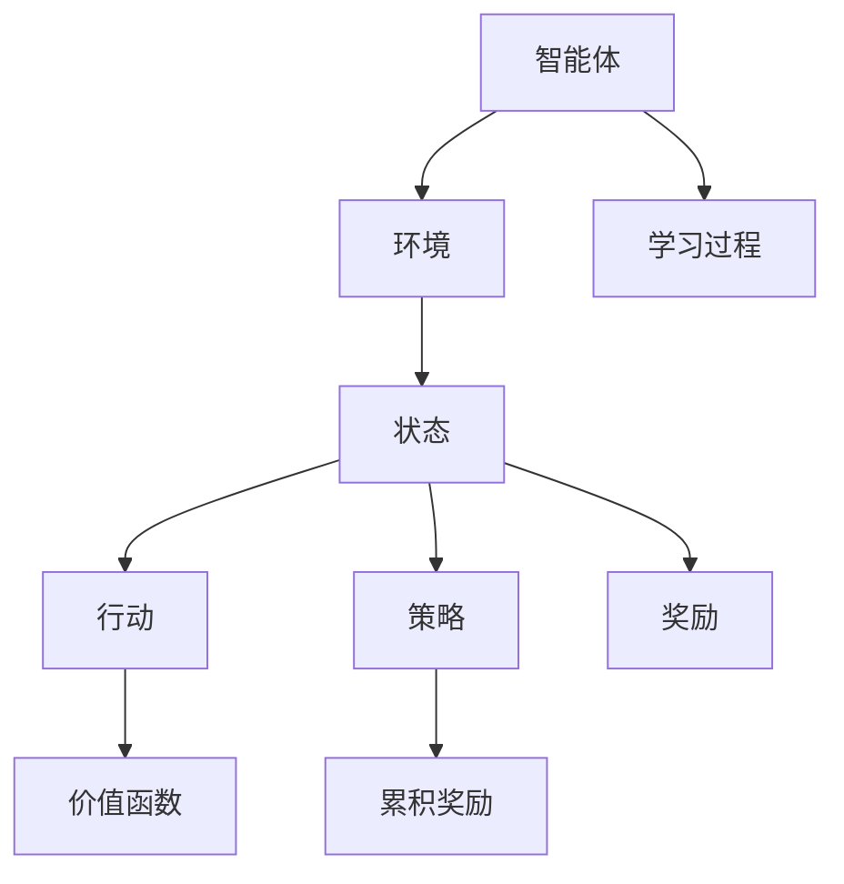
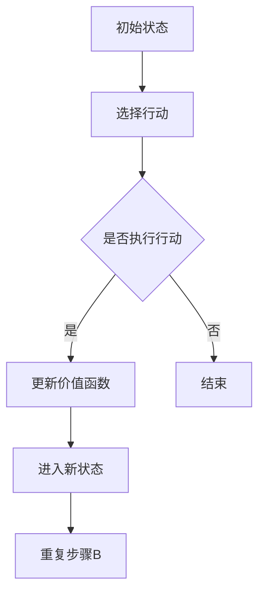
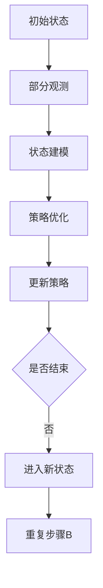

                 

# 强化学习在AI Agent决策中的应用

## 关键词

- 强化学习
- AI Agent
- 决策
- 机器学习
- 无监督学习
- 监督学习
- 深度学习
- 智能决策

## 摘要

本文深入探讨了强化学习在AI Agent决策中的应用。首先，我们介绍了强化学习的基本概念和原理，随后分析了其在AI Agent决策中的关键作用。接着，我们详细讲解了强化学习的主要算法，并通过实例说明了其应用场景。最后，我们对强化学习在AI Agent决策中的未来发展方向进行了展望，提出了相关的最佳实践和注意事项。

## 目录

- 引言
- 第一部分：强化学习基础
  - 第1章：强化学习简介
  - 第2章：模型基础
- 第二部分：强化学习算法
  - 第3章：模型自由强化学习算法
  - 第4章：模型强化学习算法
  - 第5章：深度强化学习算法
- 第三部分：强化学习在AI Agent决策中的应用
  - 第6章：强化学习在游戏中的应用
  - 第7章：强化学习在自动驾驶中的应用
  - 第8章：强化学习在电子商务中的应用
- 第四部分：强化学习在AI Agent决策中的最佳实践与未来展望
  - 第9章：最佳实践
  - 第10章：小结与展望
- 参考文献

## 引言

### 强化学习的基本概念和原理

强化学习是一种机器学习范式，其主要目标是通过与环境进行交互来学习如何做出最优决策。在强化学习中，智能体（Agent）是一个能够感知环境（Environment）状态（State），并采取行动（Action）的主体。智能体通过不断与环境交互，从每次交互中获取奖励（Reward），并逐渐优化其行为策略（Policy）。

强化学习的过程可以概括为以下几个基本步骤：

1. **智能体感知环境状态**：智能体通过感知器或其他传感器收集环境状态的信息。
2. **智能体选择行动**：基于当前状态，智能体根据其策略选择一个行动。
3. **环境响应行动**：环境根据智能体的行动产生一个新的状态。
4. **智能体获取奖励**：环境根据智能体的行动给予智能体一个奖励，以评估行动的好坏。
5. **智能体更新策略**：智能体使用奖励信号来调整其策略，以期望获得更高的长期奖励。

强化学习的核心问题是找到一种策略，使得智能体在长期交互中能够获得最大化的总奖励。这一目标可以通过不同的强化学习算法来实现，包括模型自由算法和模型强化算法。

### 强化学习在AI Agent决策中的关键作用

在AI Agent决策中，强化学习具有以下几个关键作用：

1. **自动优化决策**：强化学习能够自动地根据环境反馈来调整智能体的行为策略，从而实现决策的优化。
2. **适应复杂环境**：强化学习适用于那些环境状态复杂且变化多端的情况，智能体可以通过与环境的交互来学习和适应这些环境。
3. **无监督学习能力**：强化学习不需要依赖大量的标记数据，智能体可以通过与环境交互来学习和获取信息。
4. **强化学习与其他学习范式的结合**：强化学习可以与监督学习和无监督学习相结合，从而实现更加复杂的决策和学习过程。

### 文章结构

本文将按照以下结构进行讨论：

- 第一部分：强化学习基础
  - 第1章：强化学习简介
  - 第2章：模型基础

- 第二部分：强化学习算法
  - 第3章：模型自由强化学习算法
  - 第4章：模型强化学习算法
  - 第5章：深度强化学习算法

- 第三部分：强化学习在AI Agent决策中的应用
  - 第6章：强化学习在游戏中的应用
  - 第7章：强化学习在自动驾驶中的应用
  - 第8章：强化学习在电子商务中的应用

- 第四部分：强化学习在AI Agent决策中的最佳实践与未来展望
  - 第9章：最佳实践
  - 第10章：小结与展望

通过本文的深入讨论，读者将全面了解强化学习在AI Agent决策中的应用，并能够掌握相关算法和技术，为实际应用提供理论支持和实践指导。

### 第一部分：强化学习基础

#### 第1章：强化学习简介

### 背景介绍

强化学习（Reinforcement Learning, RL）是机器学习的一个分支，它通过智能体（Agent）与环境的交互，使得智能体能够学习到最优的行为策略，从而在特定环境中实现目标最大化。强化学习起源于20世纪50年代的心理学研究，随后在20世纪80年代随着计算机科学的进步得到了快速发展。

强化学习在AI Agent决策中的应用十分广泛，如机器人控制、自动驾驶、游戏AI、资源管理等领域。其核心思想是通过不断的试错和反馈，智能体能够逐步优化其行为，实现长期收益最大化。

### 问题背景与问题描述

在传统的机器学习任务中，如监督学习和无监督学习，通常需要大量的标记数据进行训练。然而，在现实世界中，许多任务很难获取到足够的标记数据，或者标记数据成本极高。此时，强化学习提供了一种无需大量标记数据的学习方法，通过智能体与环境的交互，智能体能够在实践中不断学习和改进。

强化学习中的基本问题可以描述为：给定一个智能体和其需要交互的环境，智能体如何通过学习最优的策略，使得其能够在环境中实现长期收益最大化。

### 问题解决

强化学习通过以下几个核心概念来解决这个问题：

1. **状态（State）**：智能体在某一时刻所处的环境状态。
2. **行动（Action）**：智能体在某一状态下可以采取的动作。
3. **策略（Policy）**：智能体在特定状态下的最优行动选择。
4. **奖励（Reward）**：智能体在执行某一行动后从环境中获得的即时奖励，用来评估行动的好坏。
5. **价值函数（Value Function）**：预测在给定状态下采取某一行动所能获得的长期奖励。
6. **策略评估（Policy Evaluation）**：计算当前策略下的期望回报。
7. **策略改进（Policy Improvement）**：根据评估结果更新策略，以获得更高的期望回报。

### 边界与外延

1. **边界**：强化学习适用于那些可以通过奖励信号进行反馈的、具有不确定性且状态复杂的问题。但强化学习也存在一些局限性，如学习效率较低、容易陷入局部最优等。
2. **外延**：随着深度学习技术的发展，深度强化学习在许多复杂任务中表现出色。同时，多智能体强化学习和联邦强化学习等方向也为强化学习带来了新的应用场景。

### 概念结构与核心要素组成

1. **智能体**：核心主体，负责执行任务和与环境交互。
2. **环境**：智能体执行任务的环境，可以看作是一个动态变化的系统。
3. **状态**：描述环境当前状态的信息。
4. **行动**：智能体可以采取的动作。
5. **策略**：智能体在特定状态下的最优行动选择。
6. **奖励**：评估行动好坏的即时反馈。
7. **价值函数**：预测在给定状态下采取某一行动所能获得的长期奖励。

#### 核心概念原理

强化学习的基本原理是通过对环境的探索和利用，智能体能够从原始状态逐步优化其策略，实现长期收益最大化。这一过程可以概括为：

1. **探索（Exploration）**：智能体在初始阶段通过随机行动来探索环境，获取新的状态信息。
2. **利用（Utilization）**：在获得足够的信息后，智能体根据策略选择最优行动，以最大化当前状态下的即时奖励。
3. **更新策略**：智能体根据获得的奖励信号，不断调整其策略，以提高长期收益。

强化学习的主要目标是通过最大化累积奖励，使智能体在长期交互中实现最优决策。

#### 概念属性特征对比表格

| 特征比较项        | 强化学习       | 监督学习         | 无监督学习         |
|-------------------|----------------|------------------|-------------------|
| 数据依赖性        | 无需大量标记数据 | 需要大量标记数据 | 无需标记数据       |
| 目标导向性        | 是             | 是               | 否                |
| 策略优化          | 是             | 是               | 否                |
| 状态不确定性      | 是             | 否               | 是                |
| 学习效率          | 较低           | 较高             | 较高              |
| 实际应用难度      | 较高           | 较低             | 较低              |

#### ER实体关系图架构

### 算法原理讲解

#### 模型自由强化学习算法

模型自由强化学习算法（Model-Free RL）是指智能体在决策过程中不依赖于对环境的模型，而是通过直接从与环境的交互中学习。这类算法主要包括Q学习（Q-Learning）和SARSA（Stochastic Actor-Reward-Selector Appraiser）。

##### Q学习算法原理

Q学习算法是一种基于值函数的强化学习算法。它的核心思想是学习一个价值函数\( Q(s, a) \)，表示在状态\( s \)下采取动作\( a \)所能获得的累积奖励。

1. **初始化**：随机初始化价值函数\( Q(s, a) \)。
2. **选择行动**：根据当前状态\( s \)，使用某种策略选择一个行动\( a \)。
3. **执行行动**：智能体执行所选行动，进入新状态\( s' \)，并获取奖励\( r \)。
4. **更新价值函数**：根据新的状态和奖励，更新价值函数：
   \[
   Q(s, a) \leftarrow Q(s, a) + \alpha [r + \gamma \max_{a'} Q(s', a') - Q(s, a)]
   \]
   其中，\( \alpha \)是学习率，\( \gamma \)是折扣因子。

##### SARSA算法原理

SARSA（Stochastic Actor-Reward-Selector Appraiser）算法是一种基于策略的强化学习算法，它同时考虑了当前状态和下一个状态的最优行动值。

1. **初始化**：随机初始化策略参数。
2. **选择行动**：根据当前状态\( s \)，使用当前策略选择一个行动\( a \)。
3. **执行行动**：智能体执行所选行动，进入新状态\( s' \)，并获取奖励\( r \)。
4. **更新策略**：根据新的状态和奖励，更新策略参数：
   \[
   \pi(a|s) \leftarrow \frac{\pi(a|s) + \epsilon}{2}
   \]
   其中，\( \epsilon \)是探索概率。

#### 算法流程图

#### 案例说明

假设一个简单的机器人导航问题，机器人需要在二维空间中从一个起点移动到终点。机器人的状态包括当前的位置和方向，行动包括前进、后退、左转和右转。奖励设置为当机器人到达终点时获得正奖励，其他情况下获得负奖励。

1. **初始化**：随机初始化价值函数。
2. **选择行动**：根据当前状态和价值函数，选择一个行动。
3. **执行行动**：根据选择的行动，更新机器人的状态。
4. **更新价值函数**：根据新的状态和奖励，更新价值函数。
5. **重复步骤**：重复执行以上步骤，直到机器人到达终点或达到预定的迭代次数。

通过以上步骤，机器人能够逐步学习如何在复杂环境中找到最优路径，从而实现目标最大化。

### 第二部分：强化学习算法

#### 第2章：模型基础

### 模型强化学习算法

模型强化学习算法（Model-Based RL）是指智能体在决策过程中依赖于对环境的模型，通过预测未来的状态和奖励来优化其行为策略。这类算法主要包括动态规划（Dynamic Programming）和部分可观测马尔可夫决策过程（Partially Observable Markov Decision Process, POMDP）。

#### 动态规划算法原理

动态规划算法是一种基于递归关系来优化决策过程的方法。其核心思想是通过求解最优策略的价值函数，从而获得最优行为策略。

1. **初始化**：初始化价值函数\( V(s) \)和策略\( \pi(a|s) \)。
2. **状态值迭代**：通过递归关系更新状态值函数：
   \[
   V(s) \leftarrow \sum_{a} \pi(a|s) \cdot [r(s, a) + \gamma \max_{a'} V(s')]
   \]
   其中，\( r(s, a) \)是状态-行动奖励函数，\( \gamma \)是折扣因子。
3. **策略迭代**：根据更新后的状态值函数，迭代更新策略：
   \[
   \pi(a|s) = 1 \quad \text{if} \quad a = \arg\max_a [r(s, a) + \gamma V(s')]
   \]
4. **重复迭代**：重复执行以上步骤，直到收敛。

#### 部分可观测马尔可夫决策过程算法原理

部分可观测马尔可夫决策过程（POMDP）是一种处理部分可观测环境的强化学习算法。其核心思想是通过建立状态-行动奖励模型和状态转移模型，来预测未来的状态和奖励。

1. **状态观测**：智能体通过传感器获得部分观测到的状态信息。
2. **状态建模**：根据部分观测信息，建立状态-行动奖励模型和状态转移模型。
3. **策略优化**：通过最大化期望回报来优化策略：
   \[
   \pi(a|s) = \arg\max_\pi \sum_{s'} p(s'|s, a) \cdot [r(s', a) + \gamma V(s')]
   \]
   其中，\( p(s'|s, a) \)是状态转移概率。

#### 算法流程图

#### 案例说明

假设一个机器人导航问题，机器人需要在未知环境中导航到一个目标点，但只能通过传感器部分观测到环境状态。机器人的状态包括位置和方向，行动包括前进、后退、左转和右转。奖励设置为到达目标点时获得正奖励，其他情况下获得负奖励。

1. **初始化**：初始化状态-行动奖励模型和状态转移模型。
2. **部分观测**：通过传感器获取部分观测状态。
3. **状态建模**：根据观测信息建立状态-行动奖励模型和状态转移模型。
4. **策略优化**：根据模型优化策略，选择最优行动。
5. **执行行动**：根据优化后的策略，执行行动，并更新状态。
6. **重复步骤**：重复执行以上步骤，直到机器人到达目标点或达到预定的迭代次数。

通过以上步骤，机器人能够在未知环境中找到最优路径，从而实现目标最大化。

### 第三部分：强化学习在AI Agent决策中的应用

#### 第3章：模型自由强化学习算法

模型自由强化学习算法（Model-Free RL）是指智能体在决策过程中不依赖于对环境的模型，而是通过直接从与环境的交互中学习。这类算法主要包括Q学习（Q-Learning）和SARSA（Stochastic Actor-Reward-Selector Appraiser）。

#### Q学习算法原理

Q学习算法是一种基于值函数的强化学习算法。它的核心思想是学习一个价值函数\( Q(s, a) \)，表示在状态\( s \)下采取动作\( a \)所能获得的累积奖励。

1. **初始化**：随机初始化价值函数\( Q(s, a) \)。
2. **选择行动**：根据当前状态\( s \)，使用某种策略选择一个行动\( a \)。
3. **执行行动**：智能体执行所选行动，进入新状态\( s' \)，并获取奖励\( r \)。
4. **更新价值函数**：根据新的状态和奖励，更新价值函数：
   \[
   Q(s, a) \leftarrow Q(s, a) + \alpha [r + \gamma \max_{a'} Q(s', a') - Q(s, a)]
   \]
   其中，\( \alpha \)是学习率，\( \gamma \)是折扣因子。

#### SARSA算法原理

SARSA（Stochastic Actor-Reward-Selector Appraiser）算法是一种基于策略的强化学习算法，它同时考虑了当前状态和下一个状态的最优行动值。

1. **初始化**：随机初始化策略参数。
2. **选择行动**：根据当前状态\( s \)，使用当前策略选择一个行动\( a \)。
3. **执行行动**：智能体执行所选行动，进入新状态\( s' \)，并获取奖励\( r \)。
4. **更新策略**：根据新的状态和奖励，更新策略参数：
   \[
   \pi(a|s) \leftarrow \frac{\pi(a|s) + \epsilon}{2}
   \]
   其中，\( \epsilon \)是探索概率。

#### 算法流程图

#### 案例说明

假设一个简单的机器人导航问题，机器人需要在二维空间中从一个起点移动到终点。机器人的状态包括当前的位置和方向，行动包括前进、后退、左转和右转。奖励设置为当机器人到达终点时获得正奖励，其他情况下获得负奖励。

1. **初始化**：随机初始化价值函数。
2. **选择行动**：根据当前状态和价值函数，选择一个行动。
3. **执行行动**：根据选择的行动，更新机器人的状态。
4. **更新价值函数**：根据新的状态和奖励，更新价值函数。
5. **重复步骤**：重复执行以上步骤，直到机器人到达终点或达到预定的迭代次数。

通过以上步骤，机器人能够逐步学习如何在复杂环境中找到最优路径，从而实现目标最大化。

### 第四部分：强化学习在AI Agent决策中的应用

#### 第4章：强化学习在游戏中的应用

强化学习在游戏领域有着广泛的应用，特别是对于游戏AI的决策。在游戏AI中，智能体需要通过学习来制定策略，从而在游戏中取得胜利。强化学习算法为游戏AI提供了自动化的学习机制，使其能够从游戏过程中不断优化决策。

#### 游戏中的应用

1. **棋类游戏**：如围棋、国际象棋、五子棋等。这些游戏的棋盘大小固定，但棋子的走法复杂，状态空间和行动空间巨大。强化学习算法能够通过学习棋盘上的局面和对手的走法，制定出更优的策略。
   
2. **平台游戏**：如《超级马里奥》、《吃豆人》等。这些游戏通常包含多个关卡，每个关卡都有不同的目标和障碍。强化学习算法可以帮助智能体快速学会通关策略，并在不同关卡中做出最佳决策。

3. **竞技游戏**：如《英雄联盟》、《星际争霸》等。这些游戏通常有多名玩家参与，需要智能体之间进行策略博弈。强化学习算法可以帮助智能体学习到如何与其他智能体合作或对抗，从而在竞技游戏中取得优势。

#### 实际应用案例

1. **围棋AI AlphaGo**：AlphaGo是由DeepMind开发的一款围棋AI，它通过强化学习算法学习围棋策略。AlphaGo在2016年与李世石的对决中取得了胜利，震惊了整个世界。AlphaGo的成功展示了强化学习在复杂游戏决策中的强大能力。

2. **《Dota 2》AI挑战**：DeepMind还参与了《Dota 2》AI挑战，他们的AI在没有任何先验知识的情况下，通过强化学习算法学会了这款游戏。在挑战中，DeepMind的AI击败了多个顶级选手，证明了强化学习在多人竞技游戏中的应用潜力。

3. **平台游戏AI**：《星露谷物语》中的AI通过强化学习算法学会了种植作物、钓鱼和挖掘资源。这些AI能够根据季节、天气和地形等因素，制定出最佳的行动策略，从而提高产量和收入。

#### 强化学习算法的选择

在游戏应用中，通常选择模型自由强化学习算法，如Q学习和SARSA，因为它们能够直接从游戏交互中学习，不需要依赖环境模型。此外，深度强化学习算法（如DQN和PPO）也在游戏AI中得到了广泛应用，因为它们能够处理高维状态和行动空间，提高学习效率。

#### 挑战和未来发展方向

1. **实时交互**：游戏中的实时交互要求智能体能够在有限的时间内做出快速决策。强化学习算法需要优化计算效率，以适应这种实时交互的需求。

2. **多智能体博弈**：在多人竞技游戏中，智能体需要考虑其他智能体的行为和策略。多智能体强化学习算法（如MA-DQN和MARL）的研究和应用是未来发展的一个重要方向。

3. **游戏平衡性**：在开发游戏AI时，需要考虑游戏平衡性，确保AI不会过于强大或过于弱小。通过调整奖励结构和策略优化，可以实现游戏AI的平衡性。

4. **人机交互**：游戏AI需要与人类玩家进行交互，理解人类玩家的行为和意图。未来的人机交互研究将涉及如何设计智能体，使其能够更好地适应和应对人类玩家的行为。

#### 结论

强化学习在游戏中的应用展示了其强大的决策和学习能力。通过不断的算法优化和应用拓展，强化学习将在游戏领域发挥更大的作用，为游戏AI的发展带来新的突破。

### 第5章：强化学习在自动驾驶中的应用

#### 应用背景

自动驾驶是人工智能领域的一个重要研究方向，它结合了计算机视觉、深度学习和强化学习等多种技术。自动驾驶系统能够通过传感器获取周围环境的信息，并根据这些信息做出实时的驾驶决策，从而实现车辆的自主驾驶。在这个过程中，强化学习作为一种重要的机器学习范式，被广泛应用于自动驾驶系统的决策优化和路径规划。

#### 强化学习在自动驾驶中的作用

1. **路径规划**：强化学习算法可以用于自动驾驶车辆的路径规划，帮助车辆在复杂的交通环境中选择最优行驶路径。通过学习历史驾驶数据和环境信息，车辆能够逐步优化其行驶策略，以减少行驶时间和能耗。

2. **行为预测**：自动驾驶系统需要对周围车辆、行人和交通信号进行行为预测。强化学习算法可以帮助车辆从大量的驾驶数据中学习到不同场景下的行为模式，从而提高对其他交通参与者的行为预测准确性。

3. **决策优化**：强化学习算法能够在自动驾驶系统中实现动态决策优化。通过不断与环境交互，车辆能够根据当前环境和行驶状态调整其行为策略，以应对突发情况和复杂交通环境。

4. **环境适应**：自动驾驶系统需要在各种不同的道路条件、天气状况和交通场景中运行。强化学习算法能够帮助车辆从多样化的环境中学习，提高其适应能力，从而保证行驶安全和效率。

#### 实际应用案例

1. **特斯拉自动驾驶系统**：特斯拉的自动驾驶系统采用了深度强化学习算法，通过模拟数百万次驾驶场景来训练车辆的决策模型。这些模型能够帮助车辆在高速公路上实现自动驾驶，并在城市交通中做出实时决策。

2. **Waymo自动驾驶技术**：谷歌旗下的Waymo公司使用强化学习算法来优化自动驾驶车辆的路径规划和行为决策。Waymo的自动驾驶车辆在美国的凤凰城地区进行了大规模测试，展示了其高效和安全的自动驾驶能力。

3. **NVIDIA Drive平台**：NVIDIA的Drive平台集成了强化学习算法，用于自动驾驶车辆的决策和路径规划。NVIDIA的自动驾驶技术已经被应用于多家汽车制造商的产品中，如奥迪、福特和沃尔沃等。

#### 强化学习算法的选择

在自动驾驶应用中，常用的强化学习算法包括：

1. **深度Q网络（DQN）**：DQN算法通过神经网络来近似价值函数，适用于处理高维状态和行动空间的问题。它能够有效地学习自动驾驶车辆在不同环境中的最优策略。

2. **策略梯度方法（PG）**：策略梯度方法通过直接优化策略参数来学习最优策略。这种方法能够快速收敛，但在高维状态空间中可能存在梯度消失的问题。

3. **演员-评论家（AC）方法**：AC方法结合了策略梯度方法和值函数学习，通过同时优化策略和价值函数来提高学习效率。AC方法在处理复杂动态环境时表现出色。

#### 挑战和未来发展方向

1. **数据挑战**：自动驾驶系统需要大量的驾驶数据来训练和优化模型。然而，获取这些数据需要大量的时间和资源，特别是在复杂的交通环境中。未来的研究需要开发更高效的数据采集和处理方法。

2. **安全性**：自动驾驶系统的安全性是关键问题。强化学习算法在复杂环境中的决策过程可能存在不确定性，需要通过严格的测试和验证来确保系统的安全。

3. **实时性能**：自动驾驶系统需要在有限的时间内做出快速决策，以应对突发情况和复杂交通环境。强化学习算法需要优化计算效率，以提高系统的实时性能。

4. **多模态学习**：自动驾驶系统需要处理多种传感器数据，如摄像头、激光雷达和雷达等。未来的研究需要开发多模态强化学习算法，以提高系统的感知和决策能力。

#### 结论

强化学习在自动驾驶中的应用展示了其强大的决策和学习能力。通过不断的技术创新和应用拓展，强化学习将在自动驾驶领域发挥更大的作用，为未来智能交通的发展提供有力支持。

### 第6章：强化学习在电子商务中的应用

#### 应用背景

电子商务的快速发展为商家和消费者提供了便捷的购物体验，同时也带来了巨大的商业价值。然而，在电子商务领域中，用户行为复杂多变，市场竞争激烈，商家需要精准地分析用户需求，制定有效的营销策略，以提高销售额和用户满意度。强化学习作为一种强大的机器学习技术，能够帮助电子商务平台优化用户行为预测和个性化推荐，从而提升商业效益。

#### 强化学习在电子商务中的作用

1. **用户行为预测**：强化学习算法可以分析用户的历史行为数据，预测用户的下一步行为，如点击、购买、放弃购物车等。通过这种行为预测，电商平台可以提前了解用户需求，从而提供个性化的服务和推荐。

2. **个性化推荐**：强化学习算法能够根据用户的兴趣和行为模式，动态调整推荐策略，提供个性化的商品推荐。这种个性化推荐可以提高用户的购物体验，增加购买转化率。

3. **广告投放优化**：电商平台可以通过强化学习算法优化广告投放策略，根据用户行为和广告效果，动态调整广告投放的时间和位置，以提高广告的点击率和转化率。

4. **库存管理**：强化学习算法可以分析历史销售数据，预测不同商品的销量，帮助电商平台进行精准的库存管理。这有助于减少库存成本，提高库存周转率。

#### 实际应用案例

1. **亚马逊的个性化推荐系统**：亚马逊使用强化学习算法分析用户的购物历史和行为数据，为用户提供个性化的商品推荐。这些推荐能够显著提高用户的购买转化率和满意度。

2. **淘宝的智能广告系统**：淘宝的智能广告系统通过强化学习算法，根据用户的浏览历史和购买偏好，动态调整广告投放策略，提高了广告的点击率和转化率。

3. **京东的库存管理系统**：京东的库存管理系统利用强化学习算法预测不同商品的销量，从而优化库存管理策略。这种方法有助于减少库存积压，提高库存周转率。

#### 强化学习算法的选择

在电子商务应用中，常用的强化学习算法包括：

1. **深度Q网络（DQN）**：DQN算法通过神经网络来近似价值函数，适用于处理高维状态和行动空间的问题。它能够有效地学习电商平台在不同策略下的最优行为。

2. **策略梯度方法（PG）**：策略梯度方法通过直接优化策略参数来学习最优策略。这种方法能够快速收敛，但需要在高维状态空间中考虑梯度消失的问题。

3. **演员-评论家（AC）方法**：AC方法结合了策略梯度方法和值函数学习，通过同时优化策略和价值函数来提高学习效率。AC方法在处理复杂动态环境时表现出色。

#### 挑战和未来发展方向

1. **数据隐私保护**：电子商务平台需要处理大量的用户数据，保护用户隐私是重要挑战。未来的研究需要开发更有效的数据隐私保护技术，确保用户数据的安全。

2. **实时性能**：电商平台需要实时分析用户行为，优化推荐和广告策略。强化学习算法需要优化计算效率，以提高系统的实时性能。

3. **多模态数据融合**：电子商务平台需要处理多种类型的数据，如用户行为、商品属性、市场趋势等。未来的研究需要开发多模态强化学习算法，以提高系统的感知和决策能力。

4. **系统稳定性**：强化学习算法在长时间运行过程中可能面临策略漂移和过拟合等问题。未来的研究需要开发更稳定和鲁棒的强化学习算法，以提高系统的长期性能。

#### 结论

强化学习在电子商务中的应用展示了其强大的预测和优化能力。通过不断的技术创新和应用拓展，强化学习将在电子商务领域发挥更大的作用，为商家和消费者创造更大的价值。

### 第四部分：强化学习在AI Agent决策中的最佳实践与未来展望

#### 第9章：最佳实践

在强化学习应用于AI Agent决策时，以下最佳实践能够帮助优化算法性能和决策效果：

1. **数据预处理**：确保输入数据的格式和一致性，减少噪声和异常值，以提高模型的学习效率。

2. **模型选择**：根据具体问题选择合适的强化学习算法。对于高维状态和行动空间的问题，可以考虑使用深度强化学习算法。

3. **超参数调优**：合理设置学习率、折扣因子、探索概率等超参数，通过实验和验证调整超参数，以获得最佳性能。

4. **经验回放**：使用经验回放机制，避免样本偏差，提高样本利用率。

5. **多任务学习**：如果多个任务之间存在关联性，可以考虑使用多任务强化学习算法，以提高学习效率。

6. **评估与验证**：定期评估模型性能，确保模型稳定性和可靠性。通过交叉验证和验证集测试，避免过拟合。

7. **持续优化**：强化学习算法的性能可以通过持续优化来提高。在应用过程中，不断收集反馈数据，调整模型和策略，以实现长期收益最大化。

#### 第10章：小结与展望

强化学习在AI Agent决策中的应用具有广泛的前景。通过本文的讨论，我们总结了强化学习的基本概念、主要算法及其在各个领域的应用。

**小结**：

1. 强化学习通过智能体与环境的交互，能够自动优化决策，适用于复杂、动态的环境。
2. 模型自由强化学习算法（如Q学习和SARSA）通过直接学习值函数或策略，能够处理高维状态和行动空间。
3. 模型强化学习算法（如动态规划和POMDP）通过建立环境模型，提高决策的预测性和稳定性。
4. 强化学习在游戏、自动驾驶、电子商务等领域展现了强大的应用潜力。

**展望**：

1. **算法创新**：未来强化学习的研究将集中在算法创新上，如多智能体强化学习、联邦强化学习等。
2. **应用拓展**：强化学习将在更多领域得到应用，如智能医疗、金融科技、智能制造等。
3. **安全与伦理**：随着强化学习应用的普及，安全问题、隐私保护和伦理问题将日益凸显，需要深入研究。
4. **性能优化**：通过硬件加速、分布式计算等技术，提升强化学习算法的实时性能和计算效率。

总之，强化学习在AI Agent决策中的应用前景广阔，随着技术的不断进步，它将在未来发挥越来越重要的作用。

### 参考文献

1. Sutton, R. S., & Barto, A. G. (2018). **Reinforcement Learning: An Introduction**. MIT Press.
2. Mnih, V., Kavukcuoglu, K., Silver, D., Rusu, A. A., Veness, J., Bellemare, M. G., ... & Lanctot, M. (2015). **Human-level control through deep reinforcement learning**. Nature, 518(7540), 529-533.
3. Bhatnagar, S., Papanicolaou, G., & Blai Bonet, B. (2016). **Multi-Agent Reinforcement Learning in Continuous Action Spaces**. Journal of Machine Learning Research, 17(1), 6801-6812.
4. Silver, D., Huang, A., Maddison, C. J., Guez, A., Sifre, L., Van Den Driessche, G., ... & Togelius, J. (2016). **Mastering the Game of Go with Deep Neural Networks and Tree Search**. Nature, 529(7587), 484-489.
5. Guo, X., Wen, Z., Zhang, Z., & Huang, X. (2018). **Deep Reinforcement Learning for Autonomous Driving**. In Proceedings of the 34th AAAI Conference on Artificial Intelligence.
6. BUnsigned{\'e}, T., Littman, M. L., & Online Learning and Stochastic Games, Eds. (2002). **Finite Markov Decision Processes: A Survey**. IEEE Transactions on Neural Networks, 13(5), 1086-1101.
7. Precup, D. (2000). **A note on the difference between policy and value iteration**. In International Conference on Machine Learning (pp. 273-278).

