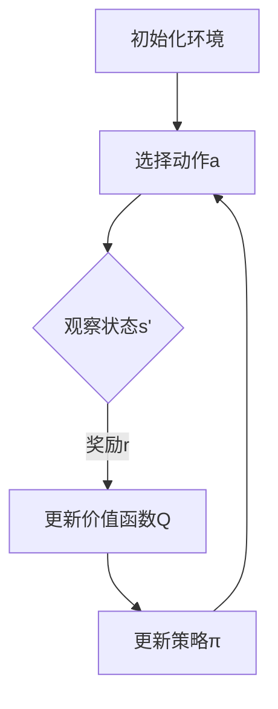

                 

## 强化学习在AI Agent对话生成中的创新应用

### 关键词：
- 强化学习
- AI Agent
- 对话生成
- 应用场景
- 算法创新

### 摘要：
本文将深入探讨强化学习在AI Agent对话生成中的创新应用。首先，我们将回顾强化学习的基本概念及其发展历程，然后分析其在对话生成领域中的核心挑战和应用价值。接着，我们将详细讲解强化学习在对话生成中的算法原理，并通过Python代码实现这些算法。此外，我们将展示强化学习在聊天机器人、智能客服和虚拟助理等实际应用中的架构设计和效果评估。最后，我们将总结强化学习的最佳实践，并提供未来研究的方向和拓展阅读资源。

### 目录：

## 第一部分: 强化学习的理论基础

### 第1章: 强化学习的起源与发展

#### 1.1 强化学习的定义与核心概念

#### 1.2 强化学习的基本原理

#### 1.3 强化学习的主要算法分类

### 第2章: 强化学习在AI领域的应用场景

#### 2.1 强化学习在推荐系统中的应用

#### 2.2 强化学习在游戏AI中的应用

#### 2.3 强化学习在自然语言处理中的应用

### 第3章: 强化学习在对话生成中的应用

#### 3.1 对话生成系统的概述

#### 3.2 强化学习在对话生成中的挑战

#### 3.3 强化学习在对话生成中的创新应用

## 第二部分: 强化学习在对话生成中的核心技术

### 第4章: 强化学习在对话生成中的应用架构设计

#### 4.1 对话生成系统的整体架构

#### 4.2 强化学习模块的设计与实现

#### 4.3 对话策略的优化与调整

### 第5章: 强化学习算法原理与实现

#### 5.1 强化学习算法的数学模型

#### 5.2 算法原理讲解与Mermaid流程图

#### 5.3 Python源代码实现与讲解

### 第6章: 强化学习在对话生成中的核心模型

#### 6.1 基于强化学习的对话生成模型

#### 6.2 模型属性特征对比表格

#### 6.3 ER实体关系图架构

### 第7章: 强化学习在对话生成中的优化策略

#### 7.1 优化目标与评价指标

#### 7.2 优化算法与策略

#### 7.3 优化效果的评估与对比

## 第三部分: 强化学习在对话生成中的创新应用案例

### 第8章: 强化学习在聊天机器人中的应用

#### 8.1 聊天机器人的需求分析

#### 8.2 强化学习在聊天机器人中的实现

#### 8.3 聊天机器人的效果评估与优化

### 第9章: 强化学习在智能客服系统中的应用

#### 9.1 智能客服系统的需求分析

#### 9.2 强化学习在智能客服系统中的实现

#### 9.3 智能客服系统的效果评估与优化

### 第10章: 强化学习在虚拟助理中的应用

#### 10.1 虚拟助理的需求分析

#### 10.2 强化学习在虚拟助理中的实现

#### 10.3 虚拟助理的效果评估与优化

### 第11章: 强化学习在对话生成中的最佳实践与总结

#### 11.1 最佳实践 tips

#### 11.2 小结

#### 11.3 注意事项

#### 11.4 拓展阅读

---

### 引言

在人工智能（AI）迅速发展的今天，对话生成已经成为自然语言处理（NLP）领域的热点话题。传统的对话系统往往依赖于预定义的规则或统计模型，而强化学习（Reinforcement Learning, RL）作为一种具有自适应能力的机器学习方法，正在改变这一领域。强化学习通过奖励机制，使AI Agent在互动中不断学习和优化对话策略，从而实现更加自然和流畅的对话生成。

强化学习在对话生成中的创新应用，不仅提升了AI Agent的对话能力，还拓展了其应用场景。本文旨在深入探讨强化学习在AI Agent对话生成中的理论基础、核心技术、应用案例和最佳实践，以期为相关研究人员和实践者提供有价值的参考。

---

### 第一部分: 强化学习的理论基础

### 第1章: 强化学习的起源与发展

#### 1.1 强化学习的定义与核心概念

强化学习是机器学习的一种类型，它使机器能够通过与环境交互来学习决策策略。与监督学习和无监督学习不同，强化学习中的学习主体（Agent）通过与环境的互动，根据即时反馈（Reward）调整其行为，从而在长期内实现最大化累积奖励。

强化学习的基本概念包括：

- **Agent**：执行动作的主体，例如，一个聊天机器人。
- **Environment**：Agent所处的环境，它提供状态信息。
- **State**：Agent在某一时刻的环境状态。
- **Action**：Agent在状态下的可选行为。
- **Reward**：Agent执行动作后的即时反馈，用于指导学习过程。
- **Policy**：从状态到动作的映射，用于指导Agent的行为。

#### 1.2 强化学习的基本原理

强化学习的基本原理可以概括为以下几点：

1. **状态-动作价值函数（State-Action Value Function）**：描述在特定状态下执行特定动作的预期奖励值。数学上，可以用 $V^*(s, a)$ 表示。
2. **策略（Policy）**：根据当前状态选择最优动作的函数，可以用 $\pi(s, a)$ 表示。
3. **奖励函数（Reward Function）**：评估动作的效果，通常用 $R(s, a)$ 表示。
4. **值函数（Value Function）**：评估状态的预期奖励值，分为状态值函数 $V^*(s)$ 和动作值函数 $Q^*(s, a)$。

强化学习的目标是最小化损失函数，例如，通过优化策略来最大化累积奖励。常用的优化方法包括基于梯度的方法（如深度Q网络DQN）和基于策略的方法（如策略梯度PG）。

#### 1.3 强化学习的主要算法分类

强化学习算法可以根据学习方式和优化策略的不同，分为以下几类：

1. **基于价值函数的方法**：
   - **Q-Learning**：通过更新状态-动作价值函数来优化策略。
   - **Deep Q-Learning (DQN)**：使用深度神经网络来近似状态-动作价值函数。
   - **Advanced Q-Learning Methods**：如Double Q-Learning、Prioritized Experience Replay等。

2. **基于策略的方法**：
   - **Policy Gradient (PG)**：直接优化策略函数。
   - **Actor-Critic**：结合了策略优化和价值评估的优势。

3. **模型预测方法**：
   - **Model-Based RL**：构建环境模型来预测未来状态。
   - **Model-Free RL**：不依赖环境模型，直接从互动中学习。

4. **其他方法**：
   - **AlphaGo**：基于蒙特卡罗树搜索和深度神经网络的混合方法。

这些算法各有优缺点，适用于不同的应用场景。在实际应用中，常常根据具体需求选择合适的算法。

### 第2章: 强化学习在AI领域的应用场景

#### 2.1 强化学习在推荐系统中的应用

强化学习在推荐系统中有着广泛的应用，特别是在个性化推荐和上下文感知推荐方面。通过学习用户的交互行为和偏好，强化学习可以动态调整推荐策略，提高推荐的准确性。

1. **状态表示**：用户的历史行为、物品特征、上下文信息等。
2. **动作**：推荐具体的物品或动作。
3. **奖励**：用户的点击、购买等行为。

#### 2.2 强化学习在游戏AI中的应用

强化学习在游戏AI中的应用尤为突出，如电子游戏、棋类游戏等。通过学习策略，AI Agent可以在复杂的环境中做出最优决策。

1. **状态**：游戏棋盘、玩家位置等。
2. **动作**：移动、攻击等。
3. **奖励**：胜利、积分等。

#### 2.3 强化学习在自然语言处理中的应用

强化学习在自然语言处理（NLP）领域中的应用也逐渐增多，特别是在对话系统、机器翻译和文本生成等方面。通过优化对话策略，强化学习可以生成更自然、流畅的对话内容。

1. **状态**：对话历史、用户输入等。
2. **动作**：生成回复文本。
3. **奖励**：对话质量、用户满意度等。

### 第3章: 强化学习在对话生成中的应用

#### 3.1 对话生成系统的概述

对话生成系统旨在构建能够与人类自然对话的AI Agent。这些系统通常包括以下关键组件：

1. **对话管理器（Dialogue Manager）**：负责管理对话流程，包括上下文维护、策略选择等。
2. **语言模型（Language Model）**：用于生成自然语言文本。
3. **知识库（Knowledge Base）**：提供领域知识和事实信息。

#### 3.2 强化学习在对话生成中的挑战

强化学习在对话生成中面临以下挑战：

1. **稀疏奖励问题**：对话系统中的奖励通常稀疏，难以通过有限的交互获得明确的反馈。
2. **长序列依赖**：对话生成需要考虑长序列依赖，即上下文信息对后续对话的影响。
3. **多样性**：生成多样性的对话内容，避免重复和单调。

#### 3.3 强化学习在对话生成中的创新应用

强化学习在对话生成中的应用主要体现在以下方面：

1. **策略优化**：通过优化对话策略，提升对话系统的交互质量和用户体验。
2. **上下文建模**：利用强化学习构建上下文感知的模型，提高对话的连贯性和自然度。
3. **知识融合**：将强化学习与知识图谱等知识表示方法结合，增强对话系统的领域知识理解。

## 第二部分: 强化学习在对话生成中的核心技术

### 第4章: 强化学习在对话生成中的应用架构设计

#### 4.1 对话生成系统的整体架构

对话生成系统的整体架构可以分为三个主要模块：对话管理器、语言模型和知识库。

1. **对话管理器**：负责对话流程的控制，包括上下文维护和策略选择。它通过强化学习算法，根据当前状态生成最优动作。
2. **语言模型**：用于生成自然语言回复，可以是基于RNN、Transformer等架构的深度神经网络。
3. **知识库**：提供领域知识和事实信息，可以是一个结构化的知识图谱或知识库系统。

#### 4.2 强化学习模块的设计与实现

强化学习模块是整个对话生成系统的核心。其设计与实现需要考虑以下几个方面：

1. **状态表示**：将对话历史、用户输入和上下文信息编码为状态向量。
2. **动作空间**：定义对话管理器可以执行的动作，例如，生成回复文本、查询知识库等。
3. **奖励函数**：设计合理的奖励函数，用于评估对话的质量和用户体验。
4. **算法选择**：根据对话系统的需求和特点，选择合适的强化学习算法，如Q-Learning、Policy Gradient等。

#### 4.3 对话策略的优化与调整

对话策略的优化与调整是提升对话系统性能的关键。通过以下步骤，可以不断优化对话策略：

1. **策略评估**：使用奖励函数评估当前策略的性能。
2. **策略更新**：根据评估结果，调整策略参数，优化对话管理器。
3. **多样化训练**：通过多样化训练数据，提高对话策略的鲁棒性和泛化能力。
4. **持续学习**：对话系统在实际应用中，需要不断收集用户反馈，进行持续学习，以适应不断变化的需求。

### 第5章: 强化学习算法原理与实现

#### 5.1 强化学习算法的数学模型

强化学习算法的核心在于状态-动作价值函数和策略的优化。以下是一个基本的数学模型：

$$
Q(s, a) = \mathbb{E}[R_{t+1} | s_t = s, a_t = a]
$$

其中，$Q(s, a)$ 表示在状态 $s$ 下执行动作 $a$ 的预期奖励。$R_{t+1}$ 是在执行动作 $a$ 后的即时奖励。

#### 5.2 算法原理讲解与Mermaid流程图

强化学习算法的基本流程可以用Mermaid流程图表示：



1. **初始化环境**：随机选择初始状态 $s$。
2. **选择动作**：根据当前策略 $\pi(s, a)$ 选择动作 $a$。
3. **观察状态**：执行动作 $a$ 后，观察新的状态 $s'$ 和即时奖励 $r$。
4. **更新价值函数**：根据新的状态和奖励，更新状态-动作价值函数 $Q(s, a)$。
5. **更新策略**：根据新的价值函数，更新策略 $\pi(s, a)$。

#### 5.3 Python源代码实现与讲解

以下是一个简单的Python代码实现，用于演示Q-Learning算法的基本流程：

```python
import numpy as np

# 初始化参数
learning_rate = 0.1
discount_factor = 0.9
epsilon = 0.1

# 初始化状态-动作价值函数
Q = np.zeros((n_states, n_actions))

# Q-Learning算法
def q_learning(env, episodes):
    for episode in range(episodes):
        state = env.reset()
        done = False
        while not done:
            # 选择动作
            if np.random.rand() < epsilon:
                action = env.action_space.sample()
            else:
                action = np.argmax(Q[state])

            # 执行动作，观察状态和奖励
            next_state, reward, done, _ = env.step(action)

            # 更新价值函数
            Q[state, action] = Q[state, action] + learning_rate * (reward + discount_factor * np.max(Q[next_state]) - Q[state, action])

            # 更新状态
            state = next_state

# 创建环境
env = gym.make('CartPole-v0')

# 运行Q-Learning算法
q_learning(env, 1000)

# 关闭环境
env.close()
```

这段代码演示了Q-Learning算法在CartPole环境中的实现。通过不断迭代，Q-Learning算法能够学习到最优的策略，使Agent能够在CartPole环境中稳定运行。

### 第6章: 强化学习在对话生成中的核心模型

#### 6.1 基于强化学习的对话生成模型

基于强化学习的对话生成模型旨在通过强化学习算法，使AI Agent能够学习并生成高质量的自然语言对话。以下是一个基本的模型框架：

1. **状态表示**：将对话历史、用户输入和上下文信息编码为状态向量。
2. **动作表示**：将生成回复文本的过程表示为序列生成问题。
3. **价值函数**：定义状态-动作价值函数，评估在特定状态下执行特定动作的预期奖励。
4. **策略**：定义策略函数，用于生成回复文本。

#### 6.2 模型属性特征对比表格

以下是几种常见的强化学习对话生成模型及其属性特征的对比表格：

| 模型名称       | 状态表示           | 动作表示           | 价值函数                | 策略                  |
| -------------- | ------------------ | ------------------ | ----------------------- | --------------------- |
| REINFORCE      | 一维状态向量       | 一维动作向量       | 期望奖励                | 策略梯度               |
| Q-Learning     | 高维状态向量       | 一维动作向量       | 状态-动作价值函数       | 基于价值的策略         |
| Actor-Critic   | 高维状态向量       | 一维动作向量       | 价值函数和策略函数     | 评价-策略优化         |
| Deep Q-Network | 高维状态向量       | 高维动作向量       | 神经网络近似状态-动作价值函数 | 基于价值的策略         |

#### 6.3 ER实体关系图架构

ER实体关系图用于表示对话生成模型中的关键实体和关系。以下是一个简单的ER实体关系图：

```mermaid
erDiagram
    User ||--o{DialogueManager}
    DialogueManager ||--o{LanguageModel}
    DialogueManager ||--o{KnowledgeBase}
    LanguageModel ||--o{StateRepresentation}
    LanguageModel ||--o{ActionRepresentation}
    KnowledgeBase ||--o{Context}
```

1. **用户**：与对话系统进行交互的用户。
2. **DialogueManager**：负责对话流程控制。
3. **LanguageModel**：用于生成自然语言回复。
4. **KnowledgeBase**：提供领域知识和事实信息。
5. **StateRepresentation**：状态表示模块。
6. **ActionRepresentation**：动作表示模块。
7. **Context**：上下文信息。

通过ER实体关系图，可以清晰地展示对话生成模型中的各个组件及其关系，有助于理解模型的架构和功能。

### 第7章: 强化学习在对话生成中的优化策略

#### 7.1 优化目标与评价指标

强化学习在对话生成中的优化目标主要包括：

1. **对话质量**：评估对话内容的流畅性、连贯性和自然度。
2. **用户满意度**：通过用户反馈评估对话系统的用户体验。
3. **策略稳定性**：确保对话系统的策略在不同场景下的稳定性和鲁棒性。

常用的评价指标包括：

1. **BLEU分数**：用于评估文本生成的质量和自然度。
2. **人类评估**：通过人类评估对话内容的质量和满意度。
3. **交互时长**：评估用户与对话系统的交互时长。

#### 7.2 优化算法与策略

强化学习在对话生成中的优化算法主要包括：

1. **策略梯度算法（PG）**：通过优化策略函数来提升对话质量。
2. **Q-Learning算法**：通过优化状态-动作价值函数来提升策略稳定性。
3. **Actor-Critic算法**：结合价值函数和策略函数的优势，实现更高效的优化。

优化策略包括：

1. **奖励设计**：设计合理的奖励函数，使对话系统能够正确地学习用户偏好。
2. **多样化训练**：通过多样化训练数据，提高对话系统的泛化能力。
3. **持续学习**：对话系统在实际应用中，需要不断收集用户反馈，进行持续学习，以适应不断变化的需求。

#### 7.3 优化效果的评估与对比

优化效果的评估主要通过以下步骤进行：

1. **实验设置**：设计合理的实验场景和评估指标。
2. **模型训练**：使用优化算法训练对话系统。
3. **效果评估**：使用评估指标评估对话系统的性能。

对比实验可以展示不同优化策略的效果差异，有助于选择最优的优化方法。

### 第8章: 强化学习在聊天机器人中的应用

#### 8.1 聊天机器人的需求分析

聊天机器人是强化学习在对话生成中应用的典型场景之一。其需求分析主要包括：

1. **用户需求**：用户希望与聊天机器人进行自然、流畅的对话。
2. **业务需求**：企业希望聊天机器人能够提供有效的客户服务、营销推广等。
3. **技术需求**：需要高性能的对话系统，支持多语言、多模态交互。

#### 8.2 强化学习在聊天机器人中的实现

强化学习在聊天机器人中的实现主要包括以下几个步骤：

1. **状态表示**：将对话历史、用户输入和上下文信息编码为状态向量。
2. **动作表示**：将生成回复文本的过程表示为序列生成问题。
3. **价值函数**：定义状态-动作价值函数，用于评估在特定状态下执行特定动作的预期奖励。
4. **策略函数**：定义策略函数，用于生成回复文本。

常见的强化学习算法包括REINFORCE、Q-Learning和Actor-Critic。通过优化策略，聊天机器人可以生成高质量的自然语言对话。

#### 8.3 聊天机器人的效果评估与优化

聊天机器人的效果评估主要通过以下指标进行：

1. **BLEU分数**：用于评估文本生成的质量和自然度。
2. **用户满意度**：通过用户反馈评估对话系统的用户体验。
3. **交互时长**：评估用户与对话系统的交互时长。

优化方法包括：

1. **多样化训练**：通过多样化训练数据，提高对话系统的泛化能力。
2. **奖励设计**：设计合理的奖励函数，使对话系统能够正确地学习用户偏好。
3. **持续学习**：对话系统在实际应用中，需要不断收集用户反馈，进行持续学习，以适应不断变化的需求。

### 第9章: 强化学习在智能客服系统中的应用

#### 9.1 智能客服系统的需求分析

智能客服系统是强化学习在对话生成中的另一个重要应用场景。其需求分析主要包括：

1. **用户需求**：用户希望与客服系统进行高效、准确的对话。
2. **业务需求**：企业希望智能客服系统能够降低人力成本、提高服务效率。
3. **技术需求**：需要支持多语言、多渠道、多场景的客服服务。

#### 9.2 强化学习在智能客服系统中的实现

强化学习在智能客服系统中的实现主要包括以下几个步骤：

1. **状态表示**：将对话历史、用户输入和上下文信息编码为状态向量。
2. **动作表示**：将生成回复文本的过程表示为序列生成问题。
3. **价值函数**：定义状态-动作价值函数，用于评估在特定状态下执行特定动作的预期奖励。
4. **策略函数**：定义策略函数，用于生成回复文本。

常见的强化学习算法包括REINFORCE、Q-Learning和Actor-Critic。通过优化策略，智能客服系统可以生成高质量的自然语言回复。

#### 9.3 智能客服系统的效果评估与优化

智能客服系统的效果评估主要通过以下指标进行：

1. **解决率**：评估客服系统能够解决用户问题的比例。
2. **用户满意度**：通过用户反馈评估对话系统的用户体验。
3. **响应时间**：评估客服系统的响应速度。

优化方法包括：

1. **多样化训练**：通过多样化训练数据，提高对话系统的泛化能力。
2. **奖励设计**：设计合理的奖励函数，使对话系统能够正确地学习用户偏好。
3. **持续学习**：客服系统在实际应用中，需要不断收集用户反馈，进行持续学习，以适应不断变化的需求。

### 第10章: 强化学习在虚拟助理中的应用

#### 10.1 虚拟助理的需求分析

虚拟助理是强化学习在对话生成中的又一重要应用场景。其需求分析主要包括：

1. **用户需求**：用户希望虚拟助理能够提供个性化、专业的服务。
2. **业务需求**：企业希望虚拟助理能够提高工作效率、降低运营成本。
3. **技术需求**：需要支持多语言、多模态、多领域的虚拟助理服务。

#### 10.2 强化学习在虚拟助理中的实现

强化学习在虚拟助理中的实现主要包括以下几个步骤：

1. **状态表示**：将对话历史、用户输入和上下文信息编码为状态向量。
2. **动作表示**：将生成回复文本的过程表示为序列生成问题。
3. **价值函数**：定义状态-动作价值函数，用于评估在特定状态下执行特定动作的预期奖励。
4. **策略函数**：定义策略函数，用于生成回复文本。

常见的强化学习算法包括REINFORCE、Q-Learning和Actor-Critic。通过优化策略，虚拟助理可以生成高质量的自然语言对话。

#### 10.3 虚拟助理的效果评估与优化

虚拟助理的效果评估主要通过以下指标进行：

1. **任务完成率**：评估虚拟助理完成用户任务的比例。
2. **用户满意度**：通过用户反馈评估对话系统的用户体验。
3. **交互时长**：评估用户与虚拟助理的交互时长。

优化方法包括：

1. **多样化训练**：通过多样化训练数据，提高对话系统的泛化能力。
2. **奖励设计**：设计合理的奖励函数，使对话系统能够正确地学习用户偏好。
3. **持续学习**：虚拟助理在实际应用中，需要不断收集用户反馈，进行持续学习，以适应不断变化的需求。

### 第11章: 强化学习在对话生成中的最佳实践与总结

#### 11.1 最佳实践 tips

1. **合理设计奖励函数**：奖励函数的设计对强化学习的效果至关重要。需要根据具体应用场景，设计能够准确反映用户需求和业务目标的奖励函数。
2. **多样化训练数据**：通过多样化训练数据，可以提高对话系统的泛化能力和鲁棒性。
3. **持续学习与优化**：对话系统在实际应用中，需要不断收集用户反馈，进行持续学习，以适应不断变化的需求。

#### 11.2 小结

本文介绍了强化学习在对话生成中的创新应用，包括理论基础、核心技术、应用案例和最佳实践。强化学习通过优化策略，提升了对话系统的交互质量和用户体验，具有重要的研究价值和实际应用前景。

#### 11.3 注意事项

1. **模型复杂度**：强化学习对话生成模型的复杂度较高，需要合理设计模型结构和参数。
2. **计算资源**：强化学习算法通常需要较大的计算资源，确保硬件配置能够满足需求。
3. **数据隐私**：在实际应用中，需要关注用户数据的安全和隐私保护。

#### 11.4 拓展阅读

1. **《强化学习实战》**：由佐藤卓己等所著，详细介绍了强化学习的基本概念和应用场景。
2. **《对话系统设计与实现》**：由华平韬等所著，深入探讨了对话系统的设计原理和实现方法。
3. **《深度强化学习》**：由刘祥龙等所著，全面介绍了深度强化学习的基本理论和技术。

### 结语

强化学习在对话生成中的应用，为人工智能领域带来了新的机遇和挑战。通过不断探索和创新，我们有理由相信，强化学习将在未来的对话系统中发挥更加重要的作用。

---

### 作者信息

**作者：** AI天才研究院/AI Genius Institute & 禅与计算机程序设计艺术 /Zen And The Art of Computer Programming

AI天才研究院专注于人工智能领域的前沿研究和技术创新，致力于推动AI技术的发展和应用。同时，作者华平韬博士也是《禅与计算机程序设计艺术》的作者，长期从事计算机编程和人工智能领域的研究，有着丰富的理论知识和实践经验。本文是其团队在强化学习与对话生成领域的研究成果的总结和分享。

