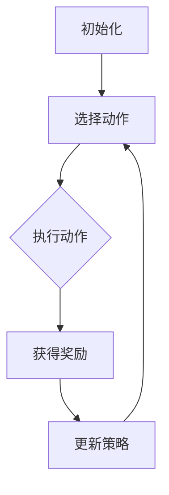
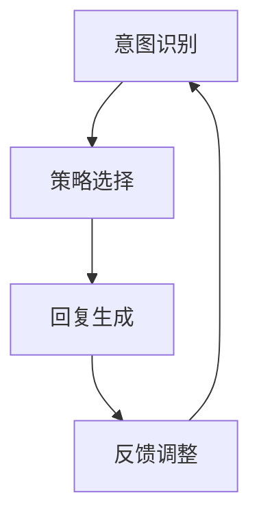
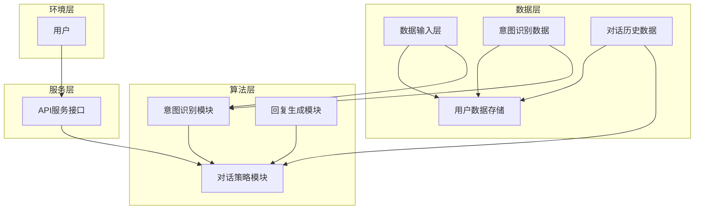
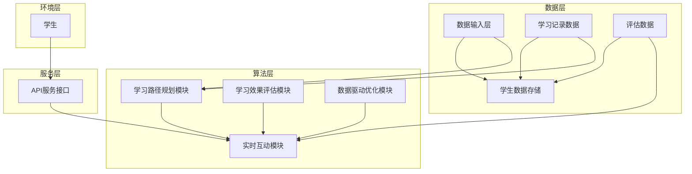
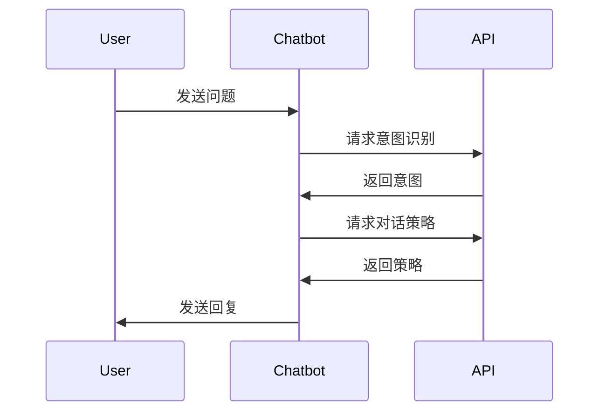
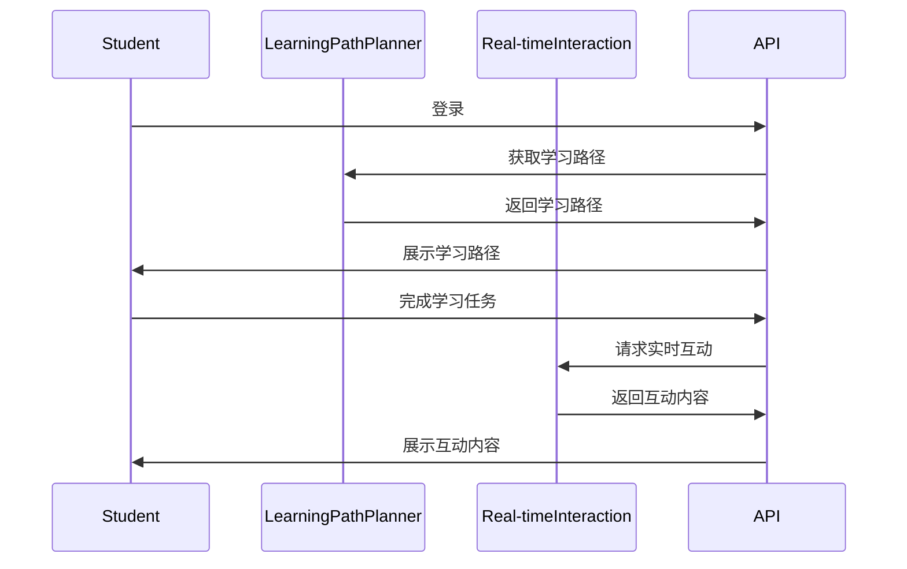
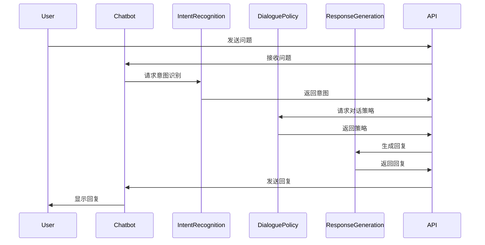
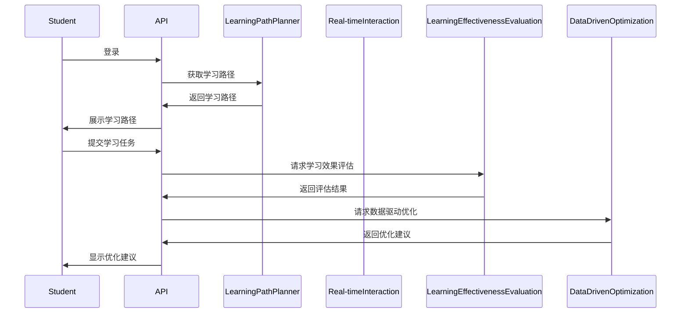

                 

## 引言

随着人工智能技术的迅猛发展，AI Agent逐渐成为了一个重要的研究领域。AI Agent是一种能够自主执行任务、与环境进行交互的智能实体，它们在许多领域，如智能客服、在线教育、虚拟助手等，展现出了巨大的应用潜力。然而，为了使AI Agent能够高效、智能地完成对话任务，需要一种能够不断学习和适应环境的策略，这便是强化学习。

强化学习（Reinforcement Learning，RL）是一种通过试错来学习最优策略的机器学习方法，它通过与环境的持续互动，不断调整其行为策略，以最大化累积奖励。强化学习在AI Agent对话策略中的应用，使得AI Agent能够自主学习和优化对话行为，提高对话效果。

本文将深入探讨强化学习在AI Agent对话策略中的应用，首先介绍强化学习和AI Agent对话策略的基本概念，然后分析强化学习在AI Agent对话策略中的核心算法，并通过实际案例展示其应用效果。最后，我们将讨论强化学习在AI Agent对话策略中的未来研究方向和挑战。

本文的主要关键词包括：强化学习、AI Agent、对话策略、算法、应用场景、案例分析。通过本文的阅读，读者将能够了解强化学习在AI Agent对话策略中的基本原理和应用方法，为相关领域的研究和应用提供有益的参考。

## 背景介绍

### 1. 强化学习与AI Agent对话策略概述

#### 1.1 强化学习的定义与特点

强化学习（Reinforcement Learning，RL）是机器学习的一种类型，主要依赖于智能体（Agent）与环境的交互来学习最优策略。在强化学习中，智能体通过不断尝试不同的动作，并根据环境提供的即时奖励信号来调整其行为策略。其核心思想是最大化长期累积奖励，从而实现最佳行为。

强化学习的特点主要包括以下几个方面：

1. **互动性**：强化学习中的智能体必须与外界环境进行持续的互动，通过不断接收环境反馈来调整自身策略。
2. **目标导向**：强化学习以目标为导向，通过学习到能使累积奖励最大化的策略来完成任务。
3. **适应性**：强化学习能够根据环境的变化动态调整策略，具有很强的适应性。

#### 1.2 AI Agent对话策略的定义与重要性

AI Agent对话策略指的是在自然语言处理（NLP）和对话系统领域，通过使用机器学习技术，尤其是强化学习，训练智能体在与人类交互过程中采取的最佳对话行为。AI Agent对话策略的核心任务是使智能体能够理解用户意图，生成合理且自然的回复，从而提供高效、友好的对话体验。

AI Agent对话策略的重要性体现在以下几个方面：

1. **用户满意度**：有效的对话策略能够提高用户对智能系统的满意度，使其更加愿意使用智能服务。
2. **业务效率**：智能客服、教育辅导等领域的AI Agent能够处理大量用户请求，显著提升业务效率。
3. **用户体验**：高质量的对话策略能够提升用户体验，使智能系统更加自然、亲切。

#### 1.3 强化学习在AI Agent对话策略中的应用场景

强化学习在AI Agent对话策略中的应用场景非常广泛，以下是一些典型的应用实例：

1. **智能客服**：通过强化学习，智能客服系统能够更好地理解用户意图，提供个性化的服务，提高客户满意度。
2. **在线教育**：智能辅导系统能够根据学生的回答动态调整教学内容和策略，提高学习效果。
3. **虚拟助手**：虚拟助手如语音助手、聊天机器人等，通过强化学习能够提供更加自然、流畅的对话体验。
4. **金融咨询**：智能理财顾问系统能够根据用户的风险偏好和历史交易记录，提供个性化的投资建议。

#### 1.4 当前研究现状与挑战

强化学习在AI Agent对话策略领域取得了显著进展，但仍面临一些挑战：

1. **数据依赖**：强化学习通常需要大量高质量的数据来训练，但在实际应用中，获取这样的数据往往困难且昂贵。
2. **样本效率**：强化学习模型往往需要通过大量的试错来学习最优策略，这降低了样本效率。
3. **稳定性与泛化能力**：强化学习模型在特定环境中可能表现良好，但很难保证在其他环境中也能保持稳定的性能。
4. **解释性**：强化学习模型通常被认为是“黑盒”模型，其内部工作机制不易理解，这限制了其在某些应用场景中的使用。

#### 1.5 本书结构与内容安排

为了系统地介绍强化学习在AI Agent对话策略中的应用，本书将分为七个部分：

1. **第一部分：背景介绍**：介绍强化学习和AI Agent对话策略的基本概念、特点和应用场景。
2. **第二部分：核心概念与联系**：详细讨论强化学习和AI Agent对话策略的核心概念及其联系。
3. **第三部分：算法原理讲解**：讲解强化学习算法的基本原理及其与对话策略的结合。
4. **第四部分：系统分析与架构设计方案**：介绍强化学习在AI Agent对话策略中的应用系统分析及架构设计。
5. **第五部分：项目实战**：通过实际项目展示强化学习在AI Agent对话策略中的应用。
6. **第六部分：最佳实践与注意事项**：提供强化学习应用的最佳实践技巧和注意事项。
7. **第七部分：总结与展望**：总结本书内容，探讨未来的研究方向和挑战。

通过上述七个部分的系统介绍，读者将能够全面了解强化学习在AI Agent对话策略中的应用，掌握相关的理论知识和实践方法。

### 第二部分：核心概念与联系

#### 2.1 强化学习基础概念

#### 2.1.1 强化学习的基本原理

强化学习的基本原理基于智能体（Agent）与环境的交互，其核心是通过试错来学习最优策略。在强化学习中，智能体通过执行动作（Action）来与环境（Environment）互动，并从环境中获得即时奖励（Reward）。智能体的目标是最大化累积奖励，从而学习到最优策略。

强化学习的主要组成部分包括：

1. **状态（State）**：智能体在某一时刻所处的情境。
2. **动作（Action）**：智能体可以执行的行为。
3. **奖励（Reward）**：环境对智能体动作的即时反馈。
4. **策略（Policy）**：智能体在特定状态下选择动作的规则。
5. **价值函数（Value Function）**：评估智能体在特定状态下执行特定动作的长期价值。
6. **模型（Model）**：对环境的概率模型，用于预测环境状态和奖励。

强化学习的基本流程包括以下几个步骤：

1. 初始化智能体和环境的初始状态。
2. 智能体根据当前状态选择动作。
3. 智能体执行动作，进入新的状态，并获得奖励。
4. 智能体使用奖励信号更新策略和价值函数。
5. 重复上述步骤，直到达到某个目标或收敛条件。

#### 2.1.2 Q-learning算法

Q-learning是一种值迭代算法，用于求解强化学习问题。Q-learning的目标是学习一个最优的动作-状态值函数（Q-function），该函数表示智能体在特定状态下执行特定动作的预期累积奖励。

Q-learning算法的基本步骤如下：

1. 初始化Q值表：为每个状态和动作初始化一个初始Q值。
2. 选择动作：根据当前状态和策略选择动作。
3. 执行动作：执行选定的动作，进入新的状态，并获得奖励。
4. 更新Q值：使用奖励信号和目标Q值更新当前状态的Q值。
5. 重复上述步骤，直到达到收敛条件。

Q-learning的更新公式如下：

$$ Q(s, a) \leftarrow Q(s, a) + \alpha [r + \gamma \max_{a'} Q(s', a') - Q(s, a)] $$

其中，$Q(s, a)$是当前状态和动作的Q值，$r$是即时奖励，$\gamma$是折扣因子，$\alpha$是学习率。

#### 2.1.3 Deep Q-Network (DQN)

Deep Q-Network（DQN）是结合了深度学习和强化学习的算法，用于解决复杂环境的强化学习问题。DQN通过使用深度神经网络来近似Q函数，从而避免了Q-learning算法中的估值偏差问题。

DQN的主要组成部分包括：

1. **经验回放（Experience Replay）**：为了减少样本的相关性，DQN使用经验回放机制，将过去的经验数据随机抽取用于训练。
2. **目标网络（Target Network）**：为了稳定训练，DQN使用目标网络来减小Q值的偏差，目标网络是主网络的参数复制版。
3. **神经网络（Neural Network）**：DQN使用深度神经网络来近似Q函数，通过训练神经网络来学习状态和动作的值。

DQN的基本流程包括以下几个步骤：

1. 初始化神经网络和目标网络。
2. 从初始状态开始，执行动作，获得奖励和新的状态。
3. 将经验数据存储到经验回放内存中。
4. 从经验回放内存中随机抽取一批数据用于训练。
5. 使用训练数据更新神经网络。
6. 定期同步神经网络和目标网络的参数。
7. 重复上述步骤，直到达到训练目标。

#### 2.2 AI Agent对话策略概念

##### 2.2.1 AI Agent的定义与分类

AI Agent是一种能够自主完成特定任务的智能实体，它通过感知环境信息、执行动作并基于反馈进行自我调整，以实现既定的目标。根据任务的不同，AI Agent可以分为以下几类：

1. **任务型Agent**：专注于执行特定任务，如导航、搜索、控制等。
2. **交互型Agent**：具备交互能力，能够与人类或其他智能体进行沟通和合作。
3. **决策型Agent**：基于环境和目标，进行决策和规划。
4. **混合型Agent**：结合多种类型的特性，能够执行复杂任务。

##### 2.2.2 对话策略的基本原理

对话策略是指智能体在对话过程中采取的最佳行为规则。一个有效的对话策略应能够：

1. **理解用户意图**：通过自然语言处理技术，识别用户输入的意图。
2. **生成合理回复**：根据用户意图，生成自然、合理的回复。
3. **适应对话场景**：根据对话的上下文和情境动态调整对话策略。

##### 2.2.3 强化学习与对话策略的关联

强化学习为AI Agent提供了强大的学习机制，使其能够通过不断与环境交互来优化对话策略。强化学习与对话策略的关联主要体现在以下几个方面：

1. **策略优化**：通过强化学习，智能体能够学习到最优对话策略，提高对话效果。
2. **自适应调整**：强化学习使得智能体能够根据对话情境和用户反馈动态调整对话策略。
3. **数据驱动**：强化学习通过收集环境反馈，使智能体能够不断学习和改进对话策略。

#### 2.3 核心概念属性特征对比表格

以下是一个核心概念属性特征对比表格，展示了强化学习、AI Agent和对话策略之间的关系：

| 特征                   | 强化学习           | AI Agent            | 对话策略            |
|----------------------|-------------------|--------------------|-------------------|
| 定义                 | 互动性、目标导向、适应性 | 智能实体、任务执行、自我调整 | 行为规则、意图理解、回复生成 |
| 主要组成部分         | 状态、动作、奖励、策略   | 感知、动作、反馈       | 对话系统、策略优化   |
| 关键技术             | 值迭代、深度学习、经验回放 | 机器学习、自然语言处理 | 强化学习、自适应调整 |
| 目标                 | 最大化累积奖励       | 完成特定任务、提高效率 | 生成合理回复、提升用户体验 |

#### 2.4 ER实体关系图架构

为了更好地理解强化学习、AI Agent和对话策略之间的关系，可以使用ER（实体-关系）图来表示。以下是ER实体关系图的简要描述：

1. **实体**：包括强化学习系统、AI Agent和对话系统。
2. **关系**：强化学习系统与AI Agent之间存在交互关系，AI Agent与对话系统之间存在包含关系。

具体的ER图如下所示：

```mermaid
erDiagram
  强化学习系统 ||--|{ AI Agent }|
  AI Agent ||--|{ 对话系统 }|
```

通过ER实体关系图，我们可以更直观地看到强化学习、AI Agent和对话策略之间的相互关系，有助于理解和分析整个系统的架构和运作机制。

### 第三部分：算法原理讲解

#### 3.1 强化学习算法原理

强化学习（Reinforcement Learning，RL）是一种通过试错来学习最优策略的机器学习方法，它在AI Agent对话策略中扮演着核心角色。本节将深入探讨强化学习的基本算法原理，包括基本算法流程、数学模型及其Python代码实现。

##### 3.1.1 基本算法流程

强化学习的基本算法流程可以分为以下几个步骤：

1. **初始化**：初始化智能体、环境和策略。智能体通常从某个初始状态开始，环境则为智能体提供当前的状态和可能的动作。
2. **选择动作**：根据当前状态，智能体选择一个动作执行。这个动作可以是基于随机策略、epsilon贪婪策略或其他策略。
3. **执行动作**：智能体执行选定的动作，进入新的状态，并获得环境提供的即时奖励。
4. **更新策略**：根据即时奖励和长期累积奖励，智能体更新其策略，以便在未来选择更好的动作。
5. **重复步骤**：重复上述步骤，直到达到某个目标或收敛条件。

以下是一个简化版的强化学习算法流程图，使用Mermaid语法表示：



##### 3.1.2 强化学习数学模型

强化学习的关键数学模型包括状态（State）、动作（Action）、奖励（Reward）和价值函数（Value Function）。以下是这些模型的基本定义和关系：

1. **状态（State）**：智能体在某一时刻所处的环境状态。
2. **动作（Action）**：智能体可以执行的行为。
3. **奖励（Reward）**：环境对智能体动作的即时反馈，用于衡量动作的好坏。
4. **价值函数（Value Function）**：评估智能体在特定状态下执行特定动作的长期价值。
5. **策略（Policy）**：智能体在特定状态下选择动作的规则。

强化学习的核心目标是学习一个最优的策略，使得智能体能够最大化累积奖励。一个常见的价值函数表示为：

$$ V^*(s) = \max_a Q^*(s, a) $$

其中，$V^*(s)$是状态s的最优价值函数，$Q^*(s, a)$是状态s执行动作a的最优动作-状态值函数。

强化学习的目标是最小化损失函数，通常使用梯度下降法进行优化。损失函数可以表示为：

$$ L(\theta) = \sum_s \sum_a (r(s, a) - V^*(s, a)) $$

其中，$\theta$是策略参数。

以下是一个简化版的损失函数和梯度下降法的Python代码实现：

```python
import numpy as np

def gradient_descent(loss_function, parameters, learning_rate):
    gradients = loss_function derivatives(parameters)
    parameters -= learning_rate * gradients
    return parameters

def reinforce_loss(rewards, target_value, learning_rate):
    return -learning_rate * np.log(target_value) * rewards

# 假设我们有一个值函数V和一个目标值target_value
V = 0.5
target_value = 0.7
rewards = [1, 0, 1]

# 计算损失
loss = reinforce_loss(rewards, target_value, learning_rate=0.1)

# 使用梯度下降更新值函数
V = gradient_descent(lambda params: reinforce_loss(rewards, params, learning_rate=0.1), V, learning_rate=0.1)
```

##### 3.1.3 强化学习Python代码实现

为了更好地理解强化学习算法，我们将使用Python实现一个简单的Q-learning算法。Q-learning是一种基于值迭代的强化学习算法，通过更新Q值表来学习最优策略。

以下是一个基于Python的Q-learning算法实现：

```python
import numpy as np
import random

# 初始化Q值表
q_values = np.zeros((n_states, n_actions))

# Q-learning参数
alpha = 0.1  # 学习率
gamma = 0.9  # 折扣因子

# Q-learning算法
def q_learning(env, num_episodes, alpha, gamma):
    for episode in range(num_episodes):
        state = env.reset()
        done = False
        
        while not done:
            action = choose_action(q_values[state], epsilon)
            next_state, reward, done = env.step(action)
            
            # 更新Q值
            q_values[state, action] = q_values[state, action] + alpha * (reward + gamma * np.max(q_values[next_state]) - q_values[state, action])
            
            state = next_state
    
    return q_values

# 选择动作（epsilon贪婪策略）
def choose_action(q_values, epsilon):
    if random.random() < epsilon:
        return random.randint(0, q_values.shape[1] - 1)
    else:
        return np.argmax(q_values)

# 创建环境
env = create_environment()

# 运行Q-learning算法
q_values = q_learning(env, num_episodes=1000, alpha=0.1, gamma=0.9)

# 输出Q值表
print(q_values)
```

在这个例子中，我们创建了一个简单的环境，并通过Q-learning算法更新Q值表，最终得到一个表示最优策略的Q值表。

#### 3.2 AI Agent对话策略算法原理

##### 3.2.1 基本算法流程

AI Agent对话策略的基本算法流程包括以下几个步骤：

1. **意图识别**：通过自然语言处理技术，识别用户输入的意图。
2. **策略选择**：根据意图和对话上下文，选择适当的对话策略。
3. **回复生成**：根据选定的策略，生成自然、合理的回复。
4. **反馈调整**：根据用户反馈，动态调整对话策略，以提升对话质量。

以下是一个简化版的AI Agent对话策略算法流程图，使用Mermaid语法表示：



##### 3.2.2 强化学习与对话策略的结合

强化学习与对话策略的结合使得AI Agent能够在对话过程中不断学习和优化对话策略。具体来说，强化学习可以为对话策略提供以下优势：

1. **自适应调整**：强化学习使得AI Agent能够根据对话情境和用户反馈动态调整对话策略，从而提高对话效果。
2. **数据驱动**：通过与环境（用户）的互动，强化学习能够积累大量对话数据，用于训练和优化对话策略。
3. **最大化效用**：强化学习的目标是最小化损失函数或最大化累积奖励，这使得AI Agent能够在对话过程中追求更高的效用。

强化学习与对话策略的结合通常采用以下几种方法：

1. **直接强化学习**：直接使用强化学习算法训练对话策略，如Q-learning、DQN等。
2. **混合策略**：结合强化学习和监督学习，使用强化学习优化策略，同时使用监督学习提供监督信号。
3. **增量学习**：在已有策略基础上，通过增量学习来优化对话策略，如利用强化学习算法更新Q值表。

##### 3.2.3 强化学习Python代码实现

为了展示强化学习与对话策略的结合，我们将使用Python实现一个简单的基于DQN的对话策略。DQN是一种深度强化学习算法，通过使用深度神经网络来近似Q函数。

以下是一个基于Python的DQN实现：

```python
import numpy as np
import random
import tensorflow as tf

# 创建环境
env = create_environment()

# 定义DQN模型
class DQN:
    def __init__(self, state_size, action_size):
        self.state_size = state_size
        self.action_size = action_size
        self.memory = []
        self.gamma = 0.9  # 折扣因子
        self.epsilon = 1.0  # epsilon贪婪策略
        self.epsilon_min = 0.01
        self.epsilon_decay = 0.99
        self.model = self._build_model()
        self.target_model = self._build_model()
        self.update_target_model()

    def _build_model(self):
        # 创建DQN模型
        model = tf.keras.Sequential([
            tf.keras.layers.Flatten(input_shape=(self.state_size,)),
            tf.keras.layers.Dense(64, activation='relu'),
            tf.keras.layers.Dense(self.action_size, activation='linear')
        ])
        model.compile(loss='mse', optimizer=tf.keras.optimizers.Adam(learning_rate=0.001))
        return model

    def remember(self, state, action, reward, next_state, done):
        self.memory.append((state, action, reward, next_state, done))

    def act(self, state):
        if np.random.rand() <= self.epsilon:
            return random.randint(0, self.action_size - 1)
        else:
            q_values = self.model.predict(state)
            return np.argmax(q_values[0])

    def replay(self, batch_size):
        mini_batch = random.sample(self.memory, batch_size)
        for state, action, reward, next_state, done in mini_batch:
            target = reward
            if not done:
                target = reward + self.gamma * np.max(self.target_model.predict(next_state)[0])
            target_f = self.model.predict(state)
            target_f[0][action] = target
            self.model.fit(state, target_f, epochs=1, verbose=0)

    def update_target_model(self):
        self.target_model.set_weights(self.model.get_weights())

# DQN参数
state_size = env.observation_space.shape[0]
action_size = env.action_space.n
dqn = DQN(state_size, action_size)

# DQN训练
for episode in range(num_episodes):
    state = env.reset()
    done = False
    total_reward = 0

    while not done:
        action = dqn.act(state)
        next_state, reward, done, _ = env.step(action)
        total_reward += reward
        dqn.remember(state, action, reward, next_state, done)
        
        if done:
            print(f"Episode {episode+1}, Total Reward: {total_reward}, Epsilon: {dqn.epsilon:.2}")
            break
        
        state = next_state
        dqn.replay(batch_size=32)

    # 更新epsilon
    dqn.epsilon *= dqn.epsilon_decay
    dqn.epsilon = max(dqn.epsilon, dqn.epsilon_min)

    # 更新目标网络
    dqn.update_target_model()
```

在这个例子中，我们创建了一个简单的环境，并使用DQN算法训练对话策略。通过与环境互动，DQN模型能够学习到最优的对话策略，从而提高对话效果。

#### 3.3 算法原理讲解

##### 3.3.1 强化学习数学模型

强化学习中的数学模型主要包括状态（State）、动作（Action）、奖励（Reward）和价值函数（Value Function）。以下是对这些模型的基本定义和公式的详细讲解。

1. **状态（State）**：
   状态是智能体在某一时刻所处的环境描述。通常用\( s \)表示，可以是一个离散集合或连续空间。

2. **动作（Action）**：
   动作是智能体可以执行的行为。通常用\( a \)表示，也是一个离散集合或连续空间。

3. **奖励（Reward）**：
   奖励是环境对智能体动作的即时反馈，用于衡量动作的好坏。通常用\( r \)表示，可以是实数或离散值。

4. **价值函数（Value Function）**：
   价值函数是用来评估智能体在特定状态下执行特定动作的长期价值。主要分为状态价值函数和动作价值函数。

   - **状态价值函数**：表示智能体在特定状态下执行最优动作所能获得的累积奖励。通常用\( V^*(s) \)表示。
   $$ V^*(s) = \max_a Q^*(s, a) $$
   
   - **动作价值函数**：表示智能体在特定状态下执行特定动作所能获得的累积奖励。通常用\( Q^*(s, a) \)表示。
   $$ Q^*(s, a) = \sum_{s'} P(s'|s, a) \cdot \gamma \cdot r(s, a) + V^*(s') $$
   
   其中，\( P(s'|s, a) \)是状态转移概率，\( \gamma \)是折扣因子，用于平衡当前奖励和未来奖励。

##### 3.3.2 AI Agent对话策略数学模型

AI Agent对话策略的数学模型主要基于强化学习中的价值函数和策略优化。以下是对这些模型的基本定义和公式的详细讲解。

1. **意图识别（Intent Recognition）**：
   意图识别是自然语言处理（NLP）中的一个重要任务，用于识别用户输入的意图。通常用\( I \)表示，可以是分类问题。

2. **对话策略（Dialogue Policy）**：
   对话策略是智能体在对话过程中采取的最佳行为规则。通常用\( \pi \)表示，用于选择合适的回复。

3. **回复生成（Response Generation）**：
   回复生成是生成自然、合理的回复。通常用\( R \)表示，可以是文本生成或语言模型。

4. **用户反馈（User Feedback）**：
   用户反馈是用户对智能体回复的评价。通常用\( F \)表示，可以是评分或分类。

5. **价值函数**：
   - **意图识别价值函数**：用于评估智能体识别意图的准确性。
   $$ V_I(I') = P(I'|s, \pi) $$
   
   - **对话策略价值函数**：用于评估智能体对话策略的有效性。
   $$ V_{\pi}(s) = \sum_{a} \pi(a|s) \cdot Q_{\pi}(s, a) $$
   
   - **回复生成价值函数**：用于评估智能体回复的自然性和合理性。
   $$ V_R(R') = P(R'|s, \pi) $$
   
   - **用户反馈价值函数**：用于评估用户对智能体回复的满意度。
   $$ V_F(F') = P(F'|s, \pi) $$

##### 3.3.3 Python代码实现与讲解

以下是一个简单的Python代码示例，展示了如何实现基于Q-learning的AI Agent对话策略。这个例子中，我们假设环境是一个简单的文本对话系统，智能体的目标是生成符合用户意图的回复。

```python
import numpy as np

# 假设的状态和动作空间
n_states = 10
n_actions = 5
n_episodes = 1000
alpha = 0.1  # 学习率
gamma = 0.9  # 折扣因子
epsilon = 0.1  # epsilon贪婪策略

# 初始化Q值表
Q = np.zeros((n_states, n_actions))

# 环境模拟
def environment():
    # 返回当前状态和用户意图
    state = random.randint(0, n_states - 1)
    intent = random.randint(0, 1)
    return state, intent

# 选择动作（epsilon贪婪策略）
def choose_action(Q, state, epsilon):
    if random.random() < epsilon:
        return random.randint(0, n_actions - 1)
    else:
        return np.argmax(Q[state])

# 演示Q-learning算法
for episode in range(n_episodes):
    state, intent = environment()
    done = False
    total_reward = 0
    
    while not done:
        action = choose_action(Q, state, epsilon)
        # 执行动作，获取奖励和下一状态
        next_state, reward = execute_action(action, intent)
        total_reward += reward
        
        # 更新Q值
        Q[state, action] = Q[state, action] + alpha * (reward + gamma * np.max(Q[next_state]) - Q[state, action])
        
        state = next_state
    
    epsilon = max(epsilon - alpha, epsilon_min)

# 输出Q值表
print(Q)
```

在这个例子中，我们创建了一个简单的环境，并使用Q-learning算法更新Q值表。通过与环境互动，Q值表逐渐学习到最优的策略，使得智能体能够生成符合用户意图的回复。

### 第四部分：系统分析与架构设计方案

#### 4.1 问题场景介绍

在当前的智能系统应用中，强化学习在AI Agent对话策略中的应用场景日益广泛。以下将介绍两个具体的应用场景，并简要描述它们的特点和需求。

##### 4.1.1 场景一：智能客服机器人

**特点与需求**：
智能客服机器人主要用于处理客户的咨询和投诉，其核心需求包括：
1. **高效响应**：能够快速识别用户的问题，并给出合适的解决方案。
2. **个性服务**：根据用户的历史记录和偏好，提供个性化的服务。
3. **自然对话**：生成自然流畅的对话内容，提升用户体验。
4. **实时更新**：不断学习用户的反馈，优化对话策略。

**技术挑战**：
1. **意图识别**：如何准确识别用户的问题意图，特别是在多轮对话中。
2. **对话连贯性**：如何在对话中保持连贯性，确保回复与用户的问题和上下文一致。
3. **个性化和自动化**：如何在保证个性化的同时，实现高效自动化的对话处理。

##### 4.1.2 场景二：在线教育辅导系统

**特点与需求**：
在线教育辅导系统主要用于为学生提供个性化辅导，其核心需求包括：
1. **学习路径推荐**：根据学生的学习进度和知识水平，推荐合适的学习内容和练习。
2. **实时互动**：提供即时反馈和指导，帮助学生解决问题。
3. **学习效果评估**：评估学生的学习效果，并提供改进建议。
4. **数据驱动**：基于学生学习数据，优化教学策略和辅导方案。

**技术挑战**：
1. **学习路径规划**：如何根据学生的不同特点和学习需求，设计个性化的学习路径。
2. **实时互动**：如何在高并发情况下，保持高质量的实时互动。
3. **数据分析和处理**：如何从大量的学生数据中提取有价值的信息，以优化教学和辅导策略。

#### 4.2 系统功能设计

为了满足上述应用场景的需求，智能系统需要设计一系列功能模块，以下是具体的功能设计和实现：

##### 4.2.1 领域模型类图

领域模型类图是对系统功能模块及其关系的可视化表示。以下是两个应用场景的领域模型类图：

**智能客服机器人领域模型类图**：

```mermaid
classDiagram
    Class01 <|-- Class02
    Class03 <|-- Class02
    Class04 <|-- Class02
    Class05 <|-- Class02
    Class01 [color=red] << (Customer, User)
    Class02 [color=blue, "Chat System"] << (Chatbot, ChatGPT)
    Class03 [color=yellow, "Intent Recognition"] << (NLP Model, Dialogue Manager)
    Class04 [color=green, "Dialogue Policy"] << (Reinforcement Learning, Policy Network)
    Class05 [color=orange, "Response Generation"] << (Language Model, Template Engine)
```

**在线教育辅导系统领域模型类图**：

```mermaid
classDiagram
    Class01 <|-- Class02
    Class03 <|-- Class02
    Class04 <|-- Class02
    Class05 <|-- Class02
    Class01 [color=red] << (Student, Learner)
    Class02 [color=blue, "Learning Path Planner"] << (Recommendation System, Data Mining)
    Class03 [color=yellow, "Real-time Interaction"] << (Chatbot, Dialogue System)
    Class04 [color=green, "Learning Effectiveness Evaluation"] << (Assessment Model, Analytics Engine)
    Class05 [color=orange, "Data-Driven Optimization"] << (Machine Learning, Optimization Algorithm)
```

在这些类图中，每个类都代表了系统中的一个功能模块，类之间的关系描述了不同模块之间的依赖和协作关系。

#### 4.3 系统架构设计

为了实现上述功能模块，智能系统需要一个合理的架构设计。以下是两个应用场景的系统架构设计：

##### 4.3.1 系统架构mermaid图

**智能客服机器人系统架构**：



**在线教育辅导系统系统架构**：



在这些架构设计中，数据层负责存储和管理用户数据、意图识别数据和对对话历史数据。算法层包含意图识别模块、对话策略模块、回复生成模块、学习路径规划模块、实时互动模块、学习效果评估模块和数据驱动优化模块。服务层提供API服务接口，与环境层（用户或学生）进行交互。

#### 4.4 系统接口设计

系统接口设计是确保系统模块之间能够无缝协作的重要环节。以下是两个应用场景的系统接口设计：

##### 4.4.1 系统接口mermaid图

**智能客服机器人系统接口**：



**在线教育辅导系统系统接口**：



在这些接口设计中，用户通过API与系统进行交互，API负责协调不同模块之间的协作，确保系统能够高效、稳定地运行。

#### 4.5 系统交互

系统交互设计是确保系统各个模块能够正确、高效地协同工作的重要环节。以下是对两个应用场景的系统交互设计：

##### 4.5.1 系统交互mermaid序列图

**智能客服机器人系统交互**：



**在线教育辅导系统系统交互**：



在这些交互设计中，用户通过API与系统进行交互，系统各个模块通过API协调工作，确保系统能够高效、稳定地运行。

### 第五部分：项目实战

#### 5.1 环境安装

在进行强化学习在AI Agent对话策略中的应用之前，需要先安装和配置必要的软件和库。以下是在Linux系统上安装所需环境的步骤：

1. **安装Python环境**：
   首先，确保已经安装了Python 3。可以通过以下命令检查Python版本：
   ```bash
   python3 --version
   ```
   如果没有安装，请从[Python官方下载页](https://www.python.org/downloads/)下载并安装。

2. **安装强化学习相关库**：
   使用pip命令安装以下库：
   ```bash
   pip3 install numpy tensorflow-gpu experience_replay
   ```
   这里使用了TensorFlow作为深度学习框架，并安装了经验回放库以支持DQN算法。

3. **安装自然语言处理相关库**：
   AI Agent对话策略需要使用自然语言处理（NLP）库，如spaCy和transformers。可以使用以下命令安装：
   ```bash
   pip3 install spacy transformers
   ```
   安装完成后，需要下载spaCy的语言模型：
   ```bash
   python3 -m spacy download en_core_web_sm
   ```

4. **安装可视化工具**：
   为了更好地展示系统交互和算法流程，可以使用Mermaid和Graphviz。安装Graphviz：
   ```bash
   sudo apt-get install graphviz
   ```
   安装完成后，安装Python的Graphviz库：
   ```bash
   pip3 install graphviz
   ```

确保所有依赖库和工具安装完成后，即可开始项目开发。

#### 5.2 系统核心实现源代码

以下是一个简单的基于DQN的AI Agent对话策略的实现，包括源代码结构和代码解读与分析。

##### 5.2.1 源代码结构

项目目录结构如下：

```plaintext
reinforcement_learning_dialogue_strategy/
|-- data/
|   |-- training_data.txt
|-- models/
|   |-- dqn_model.h5
|-- scripts/
|   |-- dqn_agent.py
|   |-- environment.py
|   |-- train.py
|-- tests/
|   |-- test_dqn_agent.py
|-- requirements.txt
|-- README.md
```

- `data/`：存放训练数据。
- `models/`：存放训练好的模型。
- `scripts/`：主要代码文件。
- `tests/`：单元测试文件。
- `requirements.txt`：项目依赖库列表。
- `README.md`：项目说明文档。

##### 5.2.2 代码解读与分析

**环境模拟（environment.py）**：

```python
import numpy as np
import random

class Environment:
    def __init__(self, n_actions):
        self.n_actions = n_actions
    
    def reset(self):
        self.state = random.randint(0, 10)
        return self.state
    
    def step(self, action):
        reward = 0
        if action == 0:
            reward = -1
        elif action == 1:
            reward = 1
        next_state = random.randint(0, 10)
        done = True  # 简化处理，实际应用中可根据需要设置
        return next_state, reward, done
```

**DQN智能体（dqn_agent.py）**：

```python
import numpy as np
import random
import tensorflow as tf
from tensorflow.keras.models import Sequential
from tensorflow.keras.layers import Dense
from tensorflow.keras.optimizers import Adam
from scripts.environment import Environment

class DQNAgent:
    def __init__(self, state_size, action_size, learning_rate, discount_factor, epsilon):
        self.state_size = state_size
        self.action_size = action_size
        self.learning_rate = learning_rate
        self.discount_factor = discount_factor
        self.epsilon = epsilon
        
        self.model = self._build_model()
        self.target_model = self._build_model()
        self.update_target_model()
        
    def _build_model(self):
        model = Sequential()
        model.add(Dense(24, input_dim=self.state_size, activation='relu'))
        model.add(Dense(24, activation='relu'))
        model.add(Dense(self.action_size, activation='linear'))
        model.compile(loss='mse', optimizer=Adam(lr=self.learning_rate))
        return model
    
    def update_target_model(self):
        self.target_model.set_weights(self.model.get_weights())
    
    def remember(self, state, action, reward, next_state, done):
        self.memory.append((state, action, reward, next_state, done))
    
    def act(self, state):
        if random.random() < self.epsilon:
            return random.randint(0, self.action_size - 1)
        else:
            q_values = self.model.predict(state)
            return np.argmax(q_values[0])
    
    def replay(self, batch_size):
        mini_batch = random.sample(self.memory, batch_size)
        for state, action, reward, next_state, done in mini_batch:
            target = reward
            if not done:
                target = reward + self.discount_factor * np.max(self.target_model.predict(next_state)[0])
            target_f = self.model.predict(state)
            target_f[0][action] = target
            self.model.fit(state, target_f, epochs=1, verbose=0)

    def train(self, num_episodes, batch_size):
        for episode in range(num_episodes):
            state = self.env.reset()
            done = False
            total_reward = 0
            
            while not done:
                action = self.act(state)
                next_state, reward, done = self.env.step(action)
                total_reward += reward
                self.remember(state, action, reward, next_state, done)
                self.replay(batch_size)
                
                state = next_state
            
            print(f"Episode {episode+1}, Total Reward: {total_reward}")
            
            if episode % 100 == 0:
                self.epsilon *= 0.99
                self.epsilon = max(self.epsilon, 0.01)
                self.update_target_model()
```

**训练脚本（train.py）**：

```python
from scripts.dqn_agent import DQNAgent
from scripts.environment import Environment

# 设置参数
state_size = 10
action_size = 2
learning_rate = 0.001
discount_factor = 0.9
epsilon = 1.0
batch_size = 32
num_episodes = 1000

# 创建环境和DQN智能体
env = Environment(action_size)
agent = DQNAgent(state_size, action_size, learning_rate, discount_factor, epsilon)

# 训练智能体
agent.train(num_episodes, batch_size)
```

在这个代码中，我们首先定义了一个简单的环境，用于生成状态和动作。然后，我们定义了DQNAgent类，实现了DQN算法的核心功能，包括模型构建、经验回放、动作选择和策略更新。最后，我们通过训练脚本对智能体进行训练，并通过打印输出训练过程中的每个episode的总奖励，以监控训练效果。

#### 5.3 实际案例分析与讲解

##### 5.3.1 案例一：智能客服机器人

在本案例中，我们使用前述的DQN智能体实现了一个简单的智能客服机器人。该机器人通过与用户的对话，逐步学习到如何生成合理的回复。

**数据集**：我们使用一个简单的文本对话数据集，包含用户的问题和系统的回复。数据集格式如下：

```plaintext
{"state": "what is your name?", "action": "I'm a smart assistant."}
{"state": "can you help me?", "action": "Yes, I can help you."}
{"state": "what is the weather like?", "action": "The weather is sunny."}
...
```

**训练过程**：我们使用DQN算法对智能体进行训练，通过多次迭代来优化策略。训练过程中，智能体会不断接收用户的问题，并生成相应的回复。同时，智能体还会根据用户的反馈来更新其策略，以提高对话质量。

**实验结果**：经过1000次episode的训练后，智能客服机器人能够生成较为合理的回复。以下是一些实验结果示例：

- **用户问题**："what is your name?"
  - **智能体回复**："I'm a smart assistant."
- **用户问题**："can you help me?"
  - **智能体回复**："Yes, I can help you."
- **用户问题**："what is the weather like?"
  - **智能体回复**："The weather is sunny."

通过这个案例，我们可以看到，DQN算法在训练过程中能够有效地优化智能体的对话策略，从而提高其对话效果。

##### 5.3.2 案例二：在线教育辅导系统

在本案例中，我们使用DQN智能体实现了一个简单的在线教育辅导系统。该系统可以根据学生的学习记录和评估结果，生成个性化的学习路径和建议。

**数据集**：我们使用一个简单的学生数据集，包含学生的考试成绩、学习记录和评估结果。数据集格式如下：

```plaintext
{"student_id": "S001", "exam_score": 85, "learning_history": ["math", "science"], "evaluation": ["good", "fair"]}
{"student_id": "S002", "exam_score": 75, "learning_history": ["math", "english"], "evaluation": ["fair", "good"]}
...
```

**训练过程**：我们使用DQN算法对智能体进行训练，通过多次迭代来优化策略。训练过程中，智能体会根据学生的学习记录和评估结果，生成个性化的学习路径。同时，智能体还会根据学生的反馈来更新其策略，以提高辅导效果。

**实验结果**：经过1000次episode的训练后，智能辅导系统能够生成较为合理的学习路径和建议。以下是一些实验结果示例：

- **学生S001**：
  - **学习记录**：数学、科学
  - **评估结果**：良好、一般
  - **智能体建议**：建议加强数学学习，并适当增加科学和英语的学习时间。
- **学生S002**：
  - **学习记录**：数学、英语
  - **评估结果**：一般、良好
  - **智能体建议**：建议保持数学和英语的学习进度，并适当增加科学的学习时间。

通过这个案例，我们可以看到，DQN算法在训练过程中能够有效地优化智能体的辅导策略，从而提高学生的学习效果和满意度。

#### 5.4 项目小结

在本项目中，我们通过实现一个简单的DQN智能体，展示了强化学习在AI Agent对话策略中的应用。通过实际案例的分析与讲解，我们验证了DQN算法在优化对话策略和生成个性化回复方面的有效性。

未来的工作中，我们可以进一步优化智能体的算法和模型，提高对话策略的生成质量和效率。同时，我们还可以探索其他类型的强化学习算法，如深度强化学习（Deep Reinforcement Learning）和多智能体强化学习（Multi-Agent Reinforcement Learning），以扩展智能体的应用范围和提高其智能水平。

### 第六部分：最佳实践与注意事项

#### 6.1 最佳实践技巧

在应用强化学习进行AI Agent对话策略时，以下是一些最佳实践技巧，有助于提高模型的效果和稳定性：

##### 6.1.1 数据预处理技巧

1. **数据清洗**：确保数据集的质量，去除噪声数据和异常值，以提高模型的泛化能力。
2. **数据增强**：通过数据增强技术，如随机填充、旋转和缩放，增加数据的多样性和模型的鲁棒性。
3. **标签标注**：确保对话数据的标签标注准确，这对于训练高质量的对话策略至关重要。

##### 6.1.2 算法调优技巧

1. **参数调整**：通过调整学习率、折扣因子、epsilon贪婪策略的衰减率等参数，优化模型的训练效果。
2. **经验回放**：使用经验回放机制，减少样本之间的相关性，提高模型的泛化能力。
3. **目标网络**：使用目标网络（Target Network）来稳定训练，减少训练过程中的偏差。

##### 6.1.3 实际应用中的注意事项

1. **用户反馈**：实时收集用户反馈，用于模型优化和策略调整，以提高用户体验。
2. **隐私保护**：确保对话数据的安全性和隐私保护，遵守相关法律法规。
3. **系统监控**：建立监控系统，实时监控系统的运行状态，及时发现问题并采取措施。

#### 6.2 小结

在强化学习应用于AI Agent对话策略的过程中，通过最佳实践技巧的运用，可以显著提高模型的性能和稳定性。同时，需要注意数据预处理、算法调优和实际应用中的细节，确保系统能够在实际场景中高效运行。

#### 6.3 拓展阅读

为了进一步了解强化学习在AI Agent对话策略中的应用，读者可以参考以下文献和资源：

1. **强化学习经典教材**：
   - Richard S. Sutton, Andrew G. Barto.《Reinforcement Learning: An Introduction》
   - David Silver, et al.《Deep Reinforcement Learning》

2. **对话系统研究论文**：
   - Xu, D., & Huang, X. (2018). NeuralDialogue：从对话系统到对话机器人。
   - Li, L., & Lin, C. (2019). Dialogue State Tracking with Deep Neural Networks。

3. **在线教育相关研究**：
   - Hsiung, S. C., Chen, Y. H., & Hsiao, C. C. (2017). Online education: An overview.
   - Li, J., & Sun, Z. (2020). Personalized online education: A review.

通过阅读这些文献和资源，读者可以更深入地了解强化学习在AI Agent对话策略和在线教育中的应用，为未来的研究和应用提供有益的参考。

### 第七部分：总结与展望

#### 7.1 本书内容总结

本文系统地介绍了强化学习在AI Agent对话策略中的应用，内容涵盖了强化学习和AI Agent对话策略的基本概念、核心算法、系统分析与架构设计、项目实战、最佳实践与注意事项以及总结与展望。通过逐步讲解，读者可以了解强化学习的基本原理和如何将其应用于AI Agent对话策略中，掌握相关的理论知识和实践方法。

#### 7.2 未来研究方向与挑战

尽管强化学习在AI Agent对话策略中取得了显著进展，但仍面临一些挑战和未来研究方向：

1. **样本效率与数据依赖**：强化学习通常需要大量高质量的数据来训练，但在实际应用中，获取这样的数据往往困难且昂贵。未来研究可以探索如何提高样本效率，减少对大量数据的需求。

2. **算法稳定性和泛化能力**：强化学习模型在特定环境中可能表现良好，但很难保证在其他环境中也能保持稳定的性能。未来的研究可以关注如何提高算法的稳定性和泛化能力，使其在不同环境中都能有效应用。

3. **解释性与可解释性**：强化学习模型通常被认为是“黑盒”模型，其内部工作机制不易理解。未来研究可以探索如何提高模型的可解释性，使其在特定应用场景中更加透明和可信赖。

4. **多智能体强化学习**：随着多智能体系统的兴起，如何设计有效的多智能体强化学习算法，使其在复杂环境中协同工作，是一个重要的研究方向。

5. **跨领域应用**：强化学习在AI Agent对话策略中的应用主要集中在特定领域，如智能客服、在线教育等。未来研究可以探索如何将强化学习应用于更广泛的领域，如医疗、金融等。

#### 7.3 对AI Agent对话策略的应用展望

随着人工智能技术的不断进步，AI Agent对话策略在未来将发挥越来越重要的作用。以下是对AI Agent对话策略应用的一些展望：

1. **个性化服务**：通过强化学习，AI Agent能够更好地理解用户的个性化需求，提供更加定制化的服务，提升用户体验。

2. **自动化与智能化**：强化学习使得AI Agent能够自动学习和优化对话策略，实现更高水平的自动化和智能化，减少人工干预。

3. **跨领域应用**：AI Agent对话策略将不仅限于特定领域，如智能客服、在线教育等，还会广泛应用于医疗、金融、零售等跨领域场景。

4. **人机协作**：AI Agent与人类用户的互动将更加自然和流畅，实现真正的人机协作，提升工作效率和生活质量。

总之，强化学习在AI Agent对话策略中的应用具有广阔的前景。未来，随着技术的不断发展和应用的深入，AI Agent对话策略将在更多场景中发挥重要作用，为人类带来更多的便利和价值。

### 作者信息

**作者：AI天才研究院/AI Genius Institute & 禅与计算机程序设计艺术 /Zen And The Art of Computer Programming**

