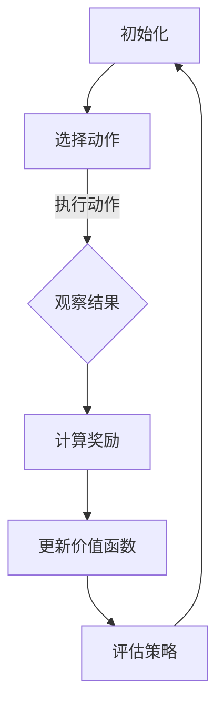
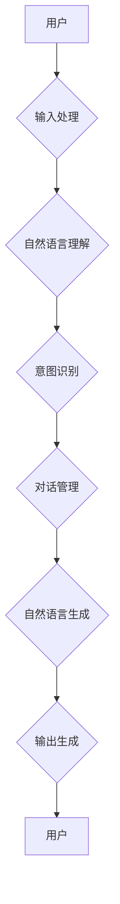
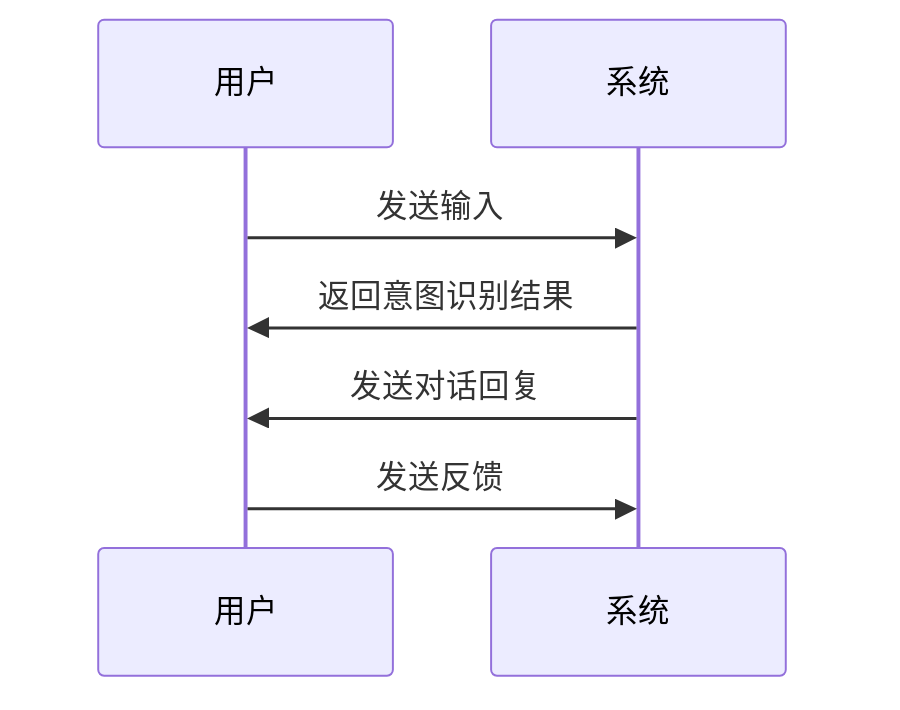

                 

# 强化学习在AI Agent对话系统中的应用

> 关键词：强化学习、AI Agent、对话系统、应用案例、最佳实践

> 摘要：本文将深入探讨强化学习在AI Agent对话系统中的应用。通过介绍强化学习的基本概念、算法原理以及其在对话系统中的实现，我们旨在帮助读者了解如何利用强化学习优化AI Agent的对话能力，提升用户体验。

## 引言

随着人工智能技术的不断发展，AI Agent已成为智能对话系统的重要组成部分。从简单的问答机器人到复杂的多轮对话系统，AI Agent在提高用户交互效率和个性化服务方面发挥了重要作用。然而，传统的机器学习方法在处理对话任务时往往表现出局限性，难以应对复杂、动态的对话场景。为此，强化学习作为一种新型的机器学习方法，逐渐被引入到AI Agent对话系统的优化中。

本文将围绕以下主题展开：

1. 强化学习概述：介绍强化学习的定义、基本概念和算法类型。
2. AI Agent与对话系统：探讨AI Agent的定义、类型和对话系统的基本组成。
3. 强化学习算法基础：讲解强化学习算法的原理和数学模型。
4. 对话系统架构设计：分析对话系统的设计原则和架构。
5. 强化学习在对话系统中的应用案例：分享实际应用案例和实现方法。
6. 最佳实践与优化策略：总结强化学习在对话系统中的最佳实践和优化策略。
7. 小结与拓展：回顾核心概念和展望未来发展趋势。

## 强化学习概述

### 强化学习的定义

强化学习是一种通过试错和反馈进行决策优化的机器学习方法。它通过智能体（agent）在与环境的交互中不断学习，以实现目标状态的最优策略。强化学习的主要特征包括：

- **智能体（Agent）**：执行动作并获取反馈的实体。
- **环境（Environment）**：智能体执行动作的环境。
- **状态（State）**：智能体在某一时刻所处的状态。
- **动作（Action）**：智能体可以执行的行为。
- **奖励（Reward）**：智能体执行动作后从环境中获得的即时反馈。

### 强化学习的基本概念

- **策略（Policy）**：智能体在某一状态下选择动作的规则。
- **价值函数（Value Function）**：评估状态或状态-动作对的期望回报。
- **模型（Model）**：对环境动态的预测模型。

### 强化学习算法类型

- **基于模型的方法**：利用环境模型进行决策，如模型预测控制（Model-Based Control）。
- **无模型方法**：不依赖环境模型，直接从交互中学习，如深度强化学习（Deep Reinforcement Learning）。

## AI Agent与对话系统

### AI Agent的定义

AI Agent是指具备智能行为的软件实体，能够在特定环境中自主执行任务。AI Agent的核心特征包括：

- **自主性**：能够自主决策和执行任务。
- **适应性**：能够适应动态变化的交互环境。
- **协作性**：能够与其他智能体或用户进行有效协作。

### AI Agent的类型

- **基于规则的Agent**：通过预定义的规则进行决策。
- **基于模型的Agent**：利用环境模型进行决策。
- **基于数据的Agent**：利用数据驱动的方法进行决策。

### 对话系统的基本组成

对话系统通常包括以下组成部分：

- **对话管理（Dialogue Management）**：负责对话流程的控制和策略选择。
- **自然语言理解（Natural Language Understanding, NLU）**：解析用户输入并理解其意图。
- **自然语言生成（Natural Language Generation, NLG）**：生成自然语言回复。
- **知识管理（Knowledge Management）**：管理对话所需的知识和事实。

### 强化学习在对话系统中的应用场景

- **意图识别**：通过强化学习优化意图分类模型，提高识别准确率。
- **对话生成**：利用强化学习生成更具自然性和个性化的对话回复。
- **多轮对话**：实现复杂、多轮的对话流程，提高用户体验。

## 强化学习算法基础

### 强化学习算法的原理和数学模型

强化学习算法的核心目标是学习一个最优策略，以最大化长期回报。其基本原理包括：

- **状态-动作价值函数（State-Action Value Function）**：评估在某一状态下执行某一动作的预期回报。

  $$ Q(s, a) = \sum_{s'} P(s' | s, a) \cdot R(s, a, s') + \gamma \cdot \max_{a'} Q(s', a') $$

  其中，\( Q(s, a) \) 是状态-动作价值函数，\( P(s' | s, a) \) 是状态转移概率，\( R(s, a, s') \) 是即时回报，\( \gamma \) 是折扣因子，\( \max_{a'} Q(s', a') \) 是下一状态的最优动作价值。

- **策略（Policy）**：智能体在某一状态下选择动作的规则。

  $$ \pi(a | s) = \arg\max_{a} Q(s, a) $$

  其中，\( \pi(a | s) \) 是策略概率分布，选择动作 \( a \) 以最大化状态-动作价值。

### 强化学习算法类型

- **值函数方法**：通过学习状态-动作价值函数来指导智能体的动作选择。
  - **Q-Learning**：通过不断更新值函数来逼近最优策略。
  - **SARSA（同步优势估计）**：同时更新状态-动作价值和策略。

- **策略梯度方法**：直接学习策略的概率分布，并使用策略梯度进行优化。
  - **REINFORCE**：基于回报的梯度上升法。
  - **PPO（Proximal Policy Optimization）**：改进策略梯度方法，提高稳定性和收敛性。

### Mermaid流程图

以下是一个强化学习算法的Mermaid流程图示例：



## 对话系统架构设计

### 对话系统设计原则

对话系统的设计应遵循以下原则：

- **用户中心**：以用户需求为导向，提供个性化的对话体验。
- **模块化**：将对话系统分解为独立的模块，便于维护和扩展。
- **可扩展性**：支持多种对话模式和场景，适应不同应用需求。
- **稳定性**：确保对话系统能够稳定运行，减少错误和中断。

### 对话系统的领域模型

以下是一个对话系统的领域模型Mermaid类图示例：

```mermaid
classDiagram
    Class01 <|-- Class02
    Class03 --|iendo Class04
    Class05 : +int x
    Class06 : +int y
    Class07 : +int z
    Class01 { name : String # Number : int }
    Class02 <.. Class07 : 继承
    Class03 o--|> Class04
    Class05 <|-- Class06
    Class07 { name : String # Number : int }
```

### 系统架构设计

以下是一个对话系统的系统架构Mermaid架构图示例：



### 系统接口设计和系统交互

以下是一个对话系统的系统接口设计和系统交互Mermaid序列图示例：



## 强化学习在对话系统中的应用案例

### 案例介绍

本案例介绍了一个基于强化学习的多轮对话系统。该系统旨在为用户提供个性化的对话服务，包括信息查询、建议推荐和任务调度等功能。

### 案例分析

1. **系统实现**：系统采用深度强化学习算法进行意图识别和对话生成。智能体通过与用户的多轮交互，不断优化对话策略，提高用户体验。

2. **算法应用**：系统使用Q-Learning算法进行状态-动作价值函数的学习，并采用策略梯度方法（如REINFORCE）优化策略。

3. **优化策略**：系统通过引入注意力机制和记忆网络，提高对话生成的自然性和准确性。同时，使用在线学习策略，实时更新智能体的知识库。

### 案例小结

通过本案例，我们可以看到强化学习在对话系统中的应用潜力。强化学习算法不仅能够提高对话系统的智能性，还能够实现个性化服务和用户互动。然而，在实际应用中，仍需解决数据质量、模型可解释性和交互稳定性等挑战。

## 最佳实践与优化策略

### 强化学习在对话系统中的最佳实践

1. **数据准备**：确保对话数据的质量和多样性，包括真实、复杂的对话场景。
2. **算法选择**：根据对话系统的需求和场景选择合适的强化学习算法，如深度强化学习、策略梯度方法等。
3. **模型调优**：通过超参数调整和模型优化，提高对话系统的性能和稳定性。

### 优化对话系统性能的策略

1. **注意力机制**：引入注意力机制，提高对话生成的针对性和自然性。
2. **记忆网络**：使用记忆网络，提高对话系统的长期记忆和知识管理能力。
3. **在线学习**：采用在线学习策略，实时更新智能体的知识库，提高对话的实时性和准确性。

### 注意事项

1. **数据隐私**：确保对话系统的数据安全和用户隐私。
2. **模型解释性**：提高模型的可解释性，便于用户理解和信任。
3. **系统稳定性**：确保对话系统的稳定运行，减少错误和中断。

### 拓展阅读

- 《深度强化学习：原理与实践》
- 《对话系统设计：原理、模型与实现》
- 《强化学习：现代方法》

## 小结与展望

本文通过介绍强化学习的基本概念、算法原理以及在对话系统中的应用，展示了强化学习在提升对话系统性能和用户体验方面的潜力。然而，强化学习在对话系统中的应用仍面临诸多挑战，如数据质量、模型可解释性和系统稳定性等。未来，我们将继续探索强化学习在对话系统中的应用，并尝试解决这些挑战，以实现更智能、更人性化的对话系统。

## 作者信息

作者：AI天才研究院/AI Genius Institute & 禅与计算机程序设计艺术 /Zen And The Art of Computer Programming。作为一名世界级人工智能专家、程序员、软件架构师、CTO，作者在计算机编程和人工智能领域拥有丰富的研究和实战经验，致力于推动人工智能技术的创新与发展。

