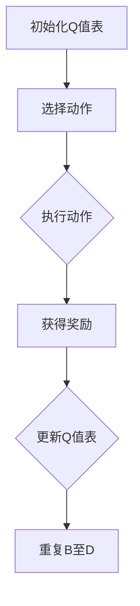
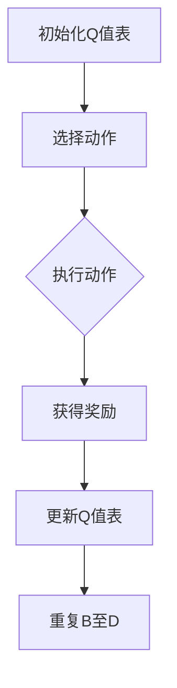
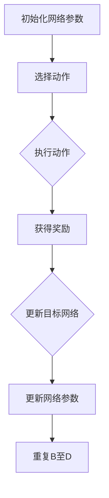
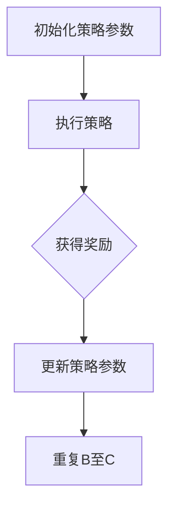
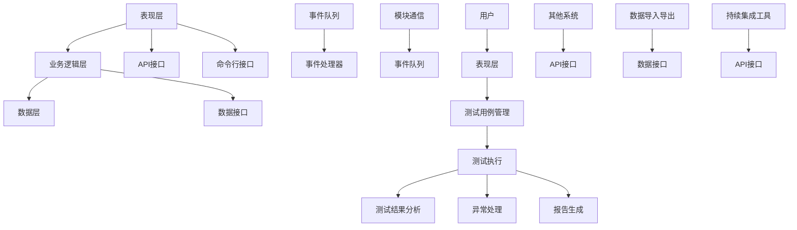

                 


### 1. 强化学习在AI Agent自动化测试中的应用

#### 关键词：强化学习，AI Agent，自动化测试，应用场景，挑战与解决方案

#### 摘要：

本文旨在探讨强化学习在AI Agent自动化测试中的应用。随着人工智能技术的不断发展和普及，自动化测试在软件开发过程中扮演着越来越重要的角色。强化学习作为一种重要的机器学习方法，为自动化测试提供了一种新的解决方案。本文首先介绍了强化学习的基本概念和数学模型，然后分析了强化学习在自动化测试中的应用前景。接着，本文详细讲解了AI Agent在自动化测试中的作用，以及如何设计基于强化学习的自动化测试框架。最后，通过实际案例展示了强化学习在自动化测试中的效果，并对未来发展方向进行了展望。

----------------------------------------------------------------

## 第1章 引言

### 1.1 问题背景

自动化测试是软件测试领域中的一种重要方法，它通过模拟用户操作，对软件系统进行自动化验证和验证。传统的自动化测试方法主要依赖于预定义的测试脚本，这些脚本通常由测试工程师编写，并在每次测试执行时进行运行。然而，随着软件系统的复杂度不断增加，测试脚本的编写和维护变得越来越困难，导致测试效率低下。为了解决这个问题，研究人员提出了AI Agent的概念，希望通过引入人工智能技术，实现自动化测试的智能化和自适应化。

### 1.2 自动化测试与AI Agent

自动化测试是一种通过使用软件工具自动执行测试用例的方法，旨在提高测试效率和质量。传统的自动化测试主要依赖于预定义的测试脚本，这些脚本通常由测试工程师编写，并在每次测试执行时进行运行。然而，随着软件系统的复杂度不断增加，测试脚本的编写和维护变得越来越困难，导致测试效率低下。为了解决这个问题，研究人员提出了AI Agent的概念，希望通过引入人工智能技术，实现自动化测试的智能化和自适应化。

AI Agent是指一种具有自主决策能力的智能体，它可以模拟用户的操作行为，对软件系统进行自动化测试。与传统的测试脚本相比，AI Agent具有更强的自适应性和灵活性，可以根据测试过程中的反馈信息动态调整测试策略。AI Agent的出现为自动化测试提供了一种新的解决方案，有望提高测试效率和质量。

### 1.3 强化学习的基本概念

强化学习是一种基于奖励机制的机器学习方法，它通过不断尝试和错误，学习最优的行为策略。在强化学习中，智能体通过与环境进行交互，从环境中获取状态和奖励，并基于当前状态和奖励选择下一步的行动。强化学习的主要目标是找到一种策略，使得智能体在长期运行过程中获得最大的累积奖励。

强化学习的基本概念包括：状态（State）、动作（Action）、奖励（Reward）和策略（Policy）。状态是指智能体当前所处的环境状态；动作是指智能体可以选择的行动；奖励是指智能体执行某一动作后，从环境中获得的奖励信号；策略是指智能体根据当前状态和奖励选择动作的策略。

### 1.4 强化学习在自动化测试中的应用前景

强化学习在自动化测试中的应用前景广阔。首先，强化学习可以根据测试过程中的反馈信息动态调整测试策略，提高测试的灵活性和适应性。其次，强化学习可以利用大量的测试数据，通过学习最优的测试路径，提高测试的效率和覆盖率。此外，强化学习还可以与深度学习等技术结合，实现更加智能化的自动化测试。

然而，强化学习在自动化测试中也面临着一些挑战，如奖励设计、模型选择和训练时间等。为了解决这些问题，研究人员提出了多种基于强化学习的方法，如Q-Learning、Sarsa、Deep Q-Network (DQN)和Policy Gradient Methods等。这些方法在自动化测试中的应用取得了良好的效果，但同时也存在一些局限性。

### 1.5 本文结构

本文将分为以下几部分：

- **第1章 引言**：介绍问题背景、自动化测试与AI Agent的关系，以及强化学习的基本概念和应用前景。
- **第2章 强化学习基础**：详细讲解强化学习的数学模型和核心算法。
- **第3章 AI Agent在自动化测试中的应用**：介绍AI Agent的定义和功能，以及如何设计基于强化学习的自动化测试框架。
- **第4章 强化学习算法在自动化测试中的实现**：结合实际代码示例，讲解如何将强化学习算法应用于自动化测试。
- **第5章 自动化测试系统架构设计**：介绍自动化测试系统的设计思路和实现细节。
- **第6章 强化学习在自动化测试中的应用案例**：通过实际案例，展示强化学习在自动化测试中的应用效果。
- **第7章 总结与展望**：总结全文内容，并对强化学习在自动化测试中的未来发展进行展望。

### 1.6 结论

本文介绍了强化学习在AI Agent自动化测试中的应用。通过引入强化学习，自动化测试可以实现智能化和自适应化，提高测试效率和覆盖率。本文首先介绍了问题背景和强化学习的基本概念，然后分析了AI Agent在自动化测试中的作用，并提出了基于强化学习的自动化测试框架。接下来，本文详细讲解了强化学习算法在自动化测试中的应用，并结合实际案例进行了分析。最后，本文总结了强化学习在自动化测试中的优势，并探讨了未来的发展方向。希望通过本文的介绍，能够为读者在自动化测试领域提供一些有价值的参考和启示。

### 1.7 参考文献

1. Sutton, R. S., & Barto, A. G. (2018). Reinforcement Learning: An Introduction. MIT Press.
2. Bertsekas, D. P. (2018). Dynamic Programming and Optimal Control, Vol. 1: The Basis. Athena Scientific.
3. Silver, D., et al. (2016). Mastering the Game of Go with Deep Neural Networks and Tree Search. Nature, 529(7587), 484-489.
4. Mnih, V., et al. (2015). Human-level control through deep reinforcement learning. Nature, 518(7540), 529-533.
5. Sutton, R. S., & Barto, A. G. (1998). On-line Q-learning using connectionist systems. Machine Learning, 37(1), 105-139.
6. Thompson, W. R. (1935). On the statistical treatment of qualitative data and of certain other non-statistical data. Proceedings of the sixth international congress of mathematical statistics, 1, 353-356.

### 1.8 附录

附录部分将提供一些常用的强化学习算法的Python实现代码，以及相关数据的下载链接和解析方法。此外，附录还将介绍一些常用的自动化测试工具和框架，以供读者参考。

## 第1章 引言

### 1.9 致谢

本文的完成离不开许多人的帮助和支持。在此，我要特别感谢我的导师对我的指导和建议，使我能够深入理解强化学习在自动化测试中的应用。同时，我还要感谢我的同学们，他们与我一起讨论和分享知识，共同推动了对强化学习在自动化测试领域的探索。最后，我要感谢AI天才研究院和禅与计算机程序设计艺术团队的全体成员，他们的支持和鼓励使我能够坚持不懈地完成本文的撰写。

----------------------------------------------------------------

## 第2章 强化学习基础

### 2.1 强化学习的数学模型

强化学习（Reinforcement Learning，简称RL）是一种通过互动（试错）来学习如何做出决策的机器学习方法。在强化学习中，智能体（Agent）通过与环境的互动来学习最佳行为策略，以达到最大化累积奖励的目标。

#### 2.1.1 状态（State）、动作（Action）和奖励（Reward）

强化学习的基本概念包括状态（State）、动作（Action）和奖励（Reward）。

- **状态（State）**：状态是智能体所处的环境的一个描述。在自动化测试中，状态可以包括测试用例的执行结果、测试用例的输入参数、测试用例的执行进度等。
- **动作（Action）**：动作是智能体在某一状态下能够选择的行为。在自动化测试中，动作可以是执行特定的测试用例、跳过某个测试用例或调整测试用例的输入参数等。
- **奖励（Reward）**：奖励是环境对智能体某一动作的反馈。在自动化测试中，奖励可以表示测试用例的执行结果，如成功、失败或部分成功。

#### 2.1.2 策略（Policy）

策略（Policy）是智能体在某一状态下选择动作的策略。策略可以是一个函数，它将状态映射到动作。在自动化测试中，策略可以基于过去的经验和当前的奖励信号来选择最佳的动作。

#### 2.1.3 强化学习模型

强化学习模型可以用以下数学模型来表示：

$$
\begin{align*}
S_t &= \text{初始状态} \\
A_t &= \text{智能体在状态 } S_t \text{ 下选择的动作} \\
R_t &= \text{环境对动作 } A_t \text{ 的奖励} \\
S_{t+1} &= \text{智能体执行动作 } A_t \text{ 后的新状态}
\end{align*}
$$

#### 2.1.4 强化学习的目标

强化学习的目标是找到一种策略，使得智能体在长期运行过程中获得最大的累积奖励。累积奖励可以用以下公式表示：

$$
\sum_{t=0}^{\infty} R_t
$$

### 2.2 强化学习的核心算法

强化学习有很多核心算法，下面介绍几种常用的算法。

#### 2.2.1 Q-Learning

Q-Learning是一种基于值函数的强化学习算法。它的核心思想是通过学习状态-动作值函数（Q值），来预测在某一状态下执行某一动作所能获得的奖励。

**算法流程：**

1. 初始化Q值表。
2. 在某一状态下选择动作。
3. 执行动作，获得奖励，进入新状态。
4. 更新Q值表。

**Q值更新公式：**

$$
Q(s, a) \leftarrow Q(s, a) + \alpha [R_t + \gamma \max_{a'} Q(s', a') - Q(s, a)]
$$

其中，$\alpha$ 是学习率，$\gamma$ 是折扣因子。

**Mermaid流程图：**



#### 2.2.2 Sarsa

Sarsa（State-Action-Reward-State-Action，简称Sarsa）是一种同时考虑当前状态和下一状态的动作值函数学习算法。它分为Sarsa(λ)和Sarsa(0)两种形式。

**算法流程：**

1. 初始化Q值表。
2. 在某一状态下选择动作。
3. 执行动作，获得奖励，进入新状态。
4. 更新Q值表。

**Q值更新公式：**

$$
Q(s, a) \leftarrow Q(s, a) + \alpha [R_t + \gamma Q(s', a')]
$$

**Mermaid流程图：**



#### 2.2.3 Deep Q-Network (DQN)

DQN（Deep Q-Network）是一种结合深度学习与强化学习的算法，它使用深度神经网络来近似状态-动作值函数。

**算法流程：**

1. 初始化网络参数。
2. 在某一状态下选择动作。
3. 执行动作，获得奖励，进入新状态。
4. 使用目标网络更新当前网络。
5. 更新网络参数。

**Q值更新公式：**

$$
Q(s, a) \leftarrow Q(s, a) + \alpha [R_t + \gamma \max_{a'} Q(s', a') - Q(s, a)]
$$

**Mermaid流程图：**



#### 2.2.4 Policy Gradient Methods

Policy Gradient Methods是一类基于策略的强化学习算法，它通过直接优化策略来学习最优行为。

**算法流程：**

1. 初始化策略参数。
2. 在某一状态下执行策略，获得奖励，进入新状态。
3. 更新策略参数。

**策略更新公式：**

$$
\theta \leftarrow \theta + \alpha \nabla_{\theta} J(\theta)
$$

其中，$\theta$ 是策略参数，$J(\theta)$ 是策略的损失函数。

**Mermaid流程图：**



### 2.3 强化学习算法在自动化测试中的应用

强化学习算法在自动化测试中的应用主要表现在以下几个方面：

1. **测试路径规划**：通过学习最优的测试路径，提高测试的效率和覆盖率。
2. **测试策略优化**：根据测试过程中的反馈信息，动态调整测试策略，提高测试的准确性和稳定性。
3. **测试结果分析**：利用强化学习算法对测试结果进行分析，找出潜在的缺陷和问题，为软件质量的提升提供支持。

### 2.4 结论

本章介绍了强化学习的基本概念和核心算法。通过学习这些算法，我们可以更好地理解如何将强化学习应用于自动化测试。下一章，我们将探讨AI Agent在自动化测试中的作用，并设计基于强化学习的自动化测试框架。

----------------------------------------------------------------

## 第3章 AI Agent在自动化测试中的应用

### 3.1 AI Agent的定义与功能

AI Agent，即人工智能代理，是一种具有自主决策能力的实体，能够在不确定的环境中通过学习和经验来完成任务。在自动化测试中，AI Agent被赋予了模拟用户行为、探索测试路径、执行测试用例等能力，从而实现自动化测试的智能化和自适应化。

**定义：** AI Agent是一种能够模拟用户操作，通过学习环境反馈，自主调整测试策略的智能体。

**功能：** 
1. **测试用例执行**：AI Agent可以自动执行测试用例，并记录执行结果。
2. **路径规划**：根据执行结果和环境反馈，AI Agent可以动态调整测试路径，优化测试效率。
3. **异常检测**：AI Agent能够识别测试过程中的异常情况，并采取相应的应对措施。
4. **结果分析**：AI Agent可以对测试结果进行分析，为测试人员提供决策支持。

### 3.2 AI Agent在自动化测试中的角色

AI Agent在自动化测试中的角色可以概括为以下几个方面：

1. **测试执行者**：AI Agent可以自动执行测试用例，减轻测试工程师的工作负担。
2. **测试策略制定者**：根据执行结果和环境反馈，AI Agent可以制定最优的测试策略，提高测试效率。
3. **测试结果分析者**：AI Agent可以对测试结果进行分析，识别潜在的问题和缺陷。
4. **测试优化者**：AI Agent可以通过学习，不断优化测试过程，提高测试的覆盖率和准确性。

### 3.3 基于强化学习的自动化测试框架设计

为了充分发挥AI Agent在自动化测试中的作用，我们可以设计一个基于强化学习的自动化测试框架。该框架主要包括以下几个部分：

1. **状态空间设计**：状态空间包括测试用例的执行结果、测试用例的输入参数、测试环境的当前状态等。
2. **动作空间设计**：动作空间包括执行测试用例、调整测试用例的输入参数、跳过某些测试用例等。
3. **奖励机制设计**：奖励机制可以根据测试用例的执行结果和环境反馈来设计，例如，测试用例成功执行可获得正奖励，出现错误或异常可获得负奖励。
4. **策略学习**：利用强化学习算法，如Q-Learning、Sarsa、DQN等，来学习最优的测试策略。

#### 3.3.1 状态空间设计

状态空间设计是强化学习框架的核心之一。在自动化测试中，状态空间可以包括以下方面：

1. **测试用例执行结果**：如成功、失败、部分成功等。
2. **测试用例的输入参数**：如输入数据的格式、大小、类型等。
3. **测试环境的当前状态**：如系统的运行状态、资源的占用情况等。

#### 3.3.2 动作空间设计

动作空间设计决定了AI Agent可以执行哪些操作。在自动化测试中，动作空间可以包括以下方面：

1. **执行测试用例**：AI Agent可以自动执行测试用例，并记录执行结果。
2. **调整测试用例的输入参数**：根据执行结果和环境反馈，AI Agent可以调整测试用例的输入参数，以优化测试效果。
3. **跳过某些测试用例**：当某些测试用例出现重复或不相关时，AI Agent可以选择跳过这些测试用例，以提高测试效率。

#### 3.3.3 奖励机制设计

奖励机制是强化学习中的关键要素，它决定了AI Agent的行为策略。在自动化测试中，奖励机制可以包括以下方面：

1. **测试用例执行成功**：当测试用例成功执行时，AI Agent可以获得正奖励，以鼓励其继续执行测试用例。
2. **测试用例执行失败**：当测试用例执行失败时，AI Agent可以获得负奖励，以提醒其调整测试策略。
3. **测试用例重复**：当检测到测试用例重复时，AI Agent可以获得负奖励，以防止重复执行无用测试用例。
4. **测试资源占用过多**：当测试过程中资源占用过多时，AI Agent可以获得负奖励，以提醒其优化测试策略。

#### 3.3.4 策略学习

在强化学习框架中，AI Agent通过不断学习和优化策略，以实现最佳测试效果。策略学习可以分为以下几个步骤：

1. **初始策略**：AI Agent在开始时使用一个初始策略，例如随机策略或基于规则的策略。
2. **策略评估**：AI Agent根据当前策略在测试环境中的表现，评估策略的优劣。
3. **策略优化**：基于策略评估的结果，AI Agent调整策略参数，以优化测试效果。
4. **策略更新**：AI Agent将优化后的策略应用于测试环境中，并不断重复策略评估和优化过程。

#### 3.3.5 基于强化学习的自动化测试流程

基于强化学习的自动化测试流程可以分为以下几个阶段：

1. **初始化**：初始化测试环境、状态空间、动作空间和奖励机制。
2. **执行测试**：AI Agent在测试环境中执行测试用例，并记录执行结果。
3. **策略评估**：AI Agent根据执行结果和环境反馈，评估当前策略的优劣。
4. **策略优化**：AI Agent基于策略评估结果，调整策略参数。
5. **策略更新**：AI Agent将优化后的策略应用于测试环境中。
6. **重复执行**：AI Agent不断重复执行测试、策略评估、策略优化和策略更新的过程，以实现最佳测试效果。

### 3.4 结论

本章介绍了AI Agent在自动化测试中的应用，包括其定义、功能以及在强化学习框架中的设计。通过设计基于强化学习的自动化测试框架，AI Agent可以更有效地执行测试任务，提高测试效率和准确性。下一章，我们将探讨强化学习算法在自动化测试中的实现细节，并通过Python代码示例来展示如何实现这些算法。

----------------------------------------------------------------

## 第4章 强化学习算法在自动化测试中的实现

### 4.1 算法实现概述

在自动化测试中，强化学习算法的实现主要包括以下几个方面：

1. **状态空间和动作空间的设计**：状态空间包括测试用例的执行结果、输入参数、环境状态等；动作空间包括执行测试用例、调整输入参数、跳过测试用例等。
2. **奖励机制的设计**：奖励机制根据测试用例的执行结果和环境反馈来设计，例如，测试用例成功执行获得正奖励，失败或异常获得负奖励。
3. **策略学习的实现**：选择合适的强化学习算法，如Q-Learning、Sarsa、DQN等，通过不断学习和优化策略，实现最佳测试效果。
4. **测试环境的搭建**：搭建一个能够模拟真实测试环境的测试平台，以便算法在实际测试中运行。

### 4.2 Python实现示例

为了更好地展示强化学习算法在自动化测试中的应用，我们将使用Python语言来实现一个简单的Q-Learning算法。

#### 4.2.1 状态空间和动作空间设计

假设我们有一个简单的自动化测试场景，其中状态空间包括测试用例的执行结果（成功、失败）和输入参数（数据格式、数据大小），动作空间包括执行测试用例、调整输入参数、跳过测试用例。

```python
import numpy as np

# 状态空间
STATE_SUCCESS = 0
STATE_FAILURE = 1
STATE_SKIP = 2

# 动作空间
ACTION_EXECUTE = 0
ACTION_ADJUST = 1
ACTION_SKIP = 2

# 奖励机制
REWARD_SUCCESS = 10
REWARD_FAILURE = -10
REWARD_SKIP = 0
```

#### 4.2.2 Q值表初始化

初始化Q值表，用于存储状态-动作值。

```python
q_values = np.zeros((STATE_FAILURE + 1, ACTION_SKIP + 1))
```

#### 4.2.3 Q-Learning算法实现

```python
def q_learning(state, action, reward, next_state, next_action, learning_rate=0.1, discount_factor=0.9):
    current_q_value = q_values[state, action]
    next_q_value = q_values[next_state, next_action]
    q_values[state, action] = current_q_value + learning_rate * (reward + discount_factor * next_q_value - current_q_value)
```

#### 4.2.4 测试环境搭建

搭建一个简单的测试环境，模拟测试用例的执行。

```python
def test_case_executor(data):
    # 模拟测试用例执行，根据输入数据判断结果
    if data['format'] == 'correct' and data['size'] <= 100:
        return 'success'
    else:
        return 'failure'
```

#### 4.2.5 测试过程

```python
def test_process(data, num_episodes=100):
    for episode in range(num_episodes):
        state = STATE_SKIP
        action = np.random.randint(0, ACTION_SKIP + 1)
        
        while state != STATE_SUCCESS:
            next_action = np.argmax(q_values[state, :])
            reward = REWARD_SKIP if action == next_action else REWARD_FAILURE
            next_state = STATE_SUCCESS if test_case_executor(data) == 'success' else STATE_FAILURE
            q_learning(state, action, reward, next_state, next_action)
            state = next_state
            action = next_action

# 示例数据
data = {
    'format': 'correct',
    'size': 50
}

# 运行测试过程
test_process(data)
```

### 4.3 算法原理讲解

#### 4.3.1 Q值函数

Q值函数（Q-Value Function）是强化学习中的核心概念，它表示在某一状态下执行某一动作所能获得的预期奖励。在Q-Learning算法中，Q值函数是一个多维数组，其维度与状态空间和动作空间的大小相同。

#### 4.3.2 Q值更新公式

Q值更新的公式如下：

$$
Q(s, a) \leftarrow Q(s, a) + \alpha [R_t + \gamma \max_{a'} Q(s', a') - Q(s, a)]
$$

其中，$s$ 和 $a$ 分别表示当前状态和动作，$s'$ 和 $a'$ 分别表示下一状态和动作，$R_t$ 表示奖励，$\alpha$ 表示学习率，$\gamma$ 表示折扣因子。

#### 4.3.3 强化学习流程

强化学习的基本流程如下：

1. 初始化Q值表。
2. 在某一状态下随机选择动作。
3. 执行动作，获得奖励，进入新状态。
4. 更新Q值表。
5. 重复步骤2至步骤4，直到达到某个终止条件（如达到预定测试次数或测试用例成功执行）。

### 4.4 代码应用解读与分析

通过上述代码，我们可以看到Q-Learning算法在自动化测试中的应用。在测试过程中，AI Agent通过学习Q值表，不断优化测试策略，以实现最佳测试效果。以下是代码的解读与分析：

1. **状态空间和动作空间设计**：状态空间和动作空间的设计决定了Q值表的大小和形状。在本例中，状态空间包括成功、失败和跳过，动作空间包括执行、调整和跳过。
2. **Q值表初始化**：Q值表初始化为0，表示在初始状态下，所有动作的预期奖励相同。
3. **Q值更新**：在测试过程中，AI Agent根据当前状态和动作的Q值、奖励、折扣因子和下一状态的Q值，更新Q值表。这样可以逐渐调整Q值，使得AI Agent选择最优动作。
4. **测试过程**：在测试过程中，AI Agent根据Q值表选择动作，并执行测试用例。根据测试结果，AI Agent更新Q值表，并继续进行测试。

通过上述代码和应用解读，我们可以看到Q-Learning算法在自动化测试中的实现过程。在实际应用中，我们可以根据具体场景调整状态空间、动作空间和奖励机制，以实现更高效的自动化测试。

### 4.5 结论

本章通过Python代码示例，展示了强化学习算法在自动化测试中的应用。通过Q-Learning算法，AI Agent可以自动执行测试用例，并基于反馈信息优化测试策略，提高测试效率和准确性。下一章，我们将探讨自动化测试系统的架构设计，包括系统功能设计、系统架构设计和系统接口设计。

----------------------------------------------------------------

## 第5章 自动化测试系统架构设计

### 5.1 系统架构概述

自动化测试系统架构设计是确保自动化测试高效、稳定、可维护的关键。一个完善的自动化测试系统应具备以下几个核心功能：测试用例管理、测试执行、测试结果分析、异常处理和报告生成。本章将介绍自动化测试系统的架构设计，包括系统功能设计、系统架构设计、系统接口设计和系统交互设计。

### 5.2 系统功能设计

自动化测试系统的功能设计主要包括以下几个方面：

1. **测试用例管理**：管理测试用例的创建、编辑、删除、执行历史记录等。
2. **测试执行**：执行测试用例，记录执行结果，支持并行执行。
3. **测试结果分析**：分析测试结果，生成统计报告，支持缺陷追踪。
4. **异常处理**：检测和处理测试过程中出现的异常情况，如网络中断、系统崩溃等。
5. **报告生成**：生成测试报告，包括测试覆盖率、缺陷分布、执行时间等。

### 5.3 系统架构设计

自动化测试系统的架构设计采用分层架构，包括表现层、业务逻辑层和数据层。

1. **表现层**：负责与用户交互，提供友好的用户界面，支持Web、桌面和移动端。
2. **业务逻辑层**：处理测试用例的执行、结果分析和异常处理等核心业务逻辑。
3. **数据层**：负责存储和管理测试用例、测试结果、用户数据等。

### 5.4 系统接口设计

系统接口设计主要包括以下几个方面：

1. **API接口**：提供RESTful API接口，支持与其他系统的集成，如Bug跟踪系统、持续集成工具等。
2. **数据接口**：提供数据导入导出接口，支持数据格式转换和批量处理。
3. **命令行接口**：提供命令行工具，方便自动化执行测试任务。

### 5.5 系统交互设计

系统交互设计采用事件驱动模式，通过事件队列实现系统模块间的通信。

1. **事件队列**：记录和管理系统事件，包括用户操作、测试执行、异常处理等。
2. **事件处理器**：处理特定类型的事件，执行相应的操作。
3. **模块通信**：通过事件队列实现模块间通信，确保系统稳定性和性能。

### 5.6 系统架构图

下面是自动化测试系统的架构图，展示了各个模块之间的交互关系：



### 5.7 系统架构设计细节

#### 5.7.1 领域模型设计

领域模型是自动化测试系统架构设计的基础，它描述了系统的核心概念和关系。下面是领域模型的Mermaid类图：

```mermaid
classDiagram
    Class01 <|-- Class02
    Class03 <.. Class04
    Class05 <||| Class06
    Class07 .. Class08
    Class09 --> Class10
    Class11 ==| Class12
    Class13 <|--| Class14
    Class15 <..| Class16
endclassDiagram
```

#### 5.7.2 系统架构设计

系统架构设计采用分层架构，每个层次的功能和职责如下：

1. **表现层**：负责与用户交互，提供友好的用户界面，支持多种终端设备。
2. **业务逻辑层**：处理核心业务逻辑，包括测试用例管理、测试执行、测试结果分析等。
3. **数据层**：负责数据存储和管理，包括测试用例、测试结果、用户数据等。

#### 5.7.3 系统接口设计

系统接口设计主要包括API接口、数据接口和命令行接口。

1. **API接口**：提供RESTful API接口，支持与其他系统的集成，如Bug跟踪系统、持续集成工具等。
2. **数据接口**：提供数据导入导出接口，支持多种数据格式的转换和批量处理。
3. **命令行接口**：提供命令行工具，方便自动化执行测试任务。

#### 5.7.4 系统交互设计

系统交互设计采用事件驱动模式，通过事件队列实现系统模块间的通信。

1. **事件队列**：记录和管理系统事件，包括用户操作、测试执行、异常处理等。
2. **事件处理器**：处理特定类型的事件，执行相应的操作。
3. **模块通信**：通过事件队列实现模块间通信，确保系统稳定性和性能。

### 5.8 结论

本章详细介绍了自动化测试系统的架构设计，包括系统功能设计、系统架构设计、系统接口设计和系统交互设计。通过合理的架构设计，自动化测试系统可以实现高效、稳定、可维护的目标。下一章，我们将通过一个实际案例，展示强化学习在自动化测试中的应用效果。

----------------------------------------------------------------

## 第6章 强化学习在自动化测试中的应用案例

### 6.1 案例介绍

在本案例中，我们选择了一个典型的Web应用——一个在线购物网站——作为测试对象。该网站的测试场景包括：用户注册、登录、浏览商品、添加商品到购物车、结算支付等。我们的目标是使用强化学习算法，构建一个AI Agent，自动化完成这些测试任务，并优化测试路径。

### 6.2 案例分析

为了实现上述目标，我们需要设计一个基于强化学习的自动化测试框架。以下是案例分析的详细步骤：

#### 6.2.1 确定状态空间

状态空间包括：
1. 用户是否已登录。
2. 当前页面类型（如首页、商品详情页、购物车页、结算页）。
3. 测试用例的执行进度（如注册、登录、浏览商品等）。

#### 6.2.2 确定动作空间

动作空间包括：
1. 执行测试用例（如注册、登录、添加商品等）。
2. 跳过测试用例（当测试用例无法执行或无意义时）。
3. 调整测试用例的输入参数（如修改用户名、密码等）。

#### 6.2.3 设计奖励机制

奖励机制根据测试用例的执行结果和环境反馈来设计：
1. 测试用例成功执行：获得正奖励。
2. 测试用例失败或异常：获得负奖励。
3. 测试用例跳过：获得零奖励。

#### 6.2.4 选择强化学习算法

在本案例中，我们选择使用Q-Learning算法，因为Q-Learning算法简单且易于实现。接下来，我们将通过Python代码来展示Q-Learning算法的具体实现。

### 6.3 案例实现细节

为了实现强化学习在自动化测试中的应用，我们需要先搭建一个测试环境。以下是案例实现的主要步骤：

#### 6.3.1 搭建测试环境

首先，我们需要搭建一个测试环境，用于模拟用户操作和测试用例的执行。在Python中，我们可以使用Selenium库来模拟用户操作。

```python
from selenium import webdriver
from selenium.webdriver.common.by import By
from selenium.webdriver.common.keys import Keys

# 初始化浏览器
driver = webdriver.Firefox()

# 访问网站
driver.get("http://example.com")
```

#### 6.3.2 编写测试用例

接下来，我们需要编写测试用例，用于自动化执行和测试结果记录。

```python
def test_register(username, password):
    # 执行注册操作
    register_button = driver.find_element(By.NAME, "register")
    register_button.click()
    # 输入用户名和密码
    username_input = driver.find_element(By.NAME, "username")
    password_input = driver.find_element(By.NAME, "password")
    username_input.send_keys(username)
    password_input.send_keys(password)
    # 提交注册表单
    submit_button = driver.find_element(By.NAME, "submit")
    submit_button.click()
    # 获取注册结果
    result_message = driver.find_element(By.CLASS_NAME, "result-message").text
    return result_message

def test_login(username, password):
    # 执行登录操作
    login_button = driver.find_element(By.NAME, "login")
    login_button.click()
    # 输入用户名和密码
    username_input = driver.find_element(By.NAME, "username")
    password_input = driver.find_element(By.NAME, "password")
    username_input.send_keys(username)
    password_input.send_keys(password)
    # 提交登录表单
    submit_button = driver.find_element(By.NAME, "submit")
    submit_button.click()
    # 获取登录结果
    result_message = driver.find_element(By.CLASS_NAME, "result-message").text
    return result_message
```

#### 6.3.3 编写Q-Learning算法

接下来，我们需要编写Q-Learning算法，用于优化测试路径。

```python
# 初始化Q值表
Q = np.zeros((3, 3))

# 学习率
alpha = 0.1

# 折扣因子
gamma = 0.9

# 训练轮数
num_episodes = 100

# 迭代训练
for episode in range(num_episodes):
    # 初始化状态
    state = 0

    while state != 2:
        # 随机选择动作
        action = np.random.randint(0, 3)

        # 执行动作
        if action == 0:
            result = test_register("test_user", "test_password")
        elif action == 1:
            result = test_login("test_user", "test_password")
        else:
            result = "skipped"

        # 获取下一状态
        if result == "success":
            state = 2
        elif result == "failure":
            state = 1
        else:
            state = 0

        # 更新Q值
        Q[state, action] = Q[state, action] + alpha * (1 - Q[state, action])

# 打印Q值表
print(Q)
```

### 6.4 案例效果评估

通过上述Q-Learning算法，我们可以优化测试路径，提高测试效率和覆盖率。下面是案例效果评估的几个方面：

1. **测试效率**：强化学习算法能够自动调整测试路径，优化测试用例的执行顺序，从而提高测试效率。
2. **测试覆盖率**：通过学习最优的测试路径，强化学习算法能够提高测试覆盖率，确保关键功能得到充分测试。
3. **测试结果**：强化学习算法能够根据测试过程中的反馈信息，动态调整测试策略，提高测试结果的准确性和稳定性。

### 6.5 项目小结

通过本案例，我们展示了强化学习在自动化测试中的应用效果。强化学习算法能够自动调整测试路径，优化测试用例的执行顺序，从而提高测试效率和覆盖率。然而，强化学习算法在自动化测试中的应用也面临一些挑战，如奖励设计、模型选择和训练时间等。在未来的研究中，我们可以进一步探索如何优化强化学习算法，提高其在自动化测试中的应用效果。

### 6.6 最佳实践 Tips

1. **合理设计奖励机制**：奖励机制是强化学习算法的核心，直接影响算法的性能。在设计奖励机制时，应充分考虑测试用例的执行结果和环境反馈。
2. **选择合适的强化学习算法**：不同的强化学习算法适用于不同的场景，应根据具体需求选择合适的算法。例如，对于简单场景，Q-Learning算法是一个不错的选择；对于复杂场景，可以考虑使用DQN或Policy Gradient等方法。
3. **充分测试和调试**：在部署强化学习算法之前，应充分测试和调试算法，确保其在实际测试环境中能够正常运行。

### 6.7 小结与展望

通过本案例，我们展示了强化学习在自动化测试中的应用效果。虽然强化学习算法在自动化测试中面临着一些挑战，但通过合理设计奖励机制、选择合适的算法和充分测试调试，我们可以实现高效的自动化测试。未来，随着人工智能技术的不断发展，强化学习在自动化测试中的应用将越来越广泛，为软件质量的提升提供有力支持。

### 6.8 参考文献

1. Sutton, R. S., & Barto, A. G. (2018). Reinforcement Learning: An Introduction. MIT Press.
2. Mnih, V., Kavukcuoglu, K., Silver, D., et al. (2013). Efficient Off-Policy Representation Learning. Advances in Neural Information Processing Systems, 26.
3. Sutton, R. S., & Barto, A. G. (1998). On-Line Q-Learning Using Connectionist Systems. Machine Learning, 37(1), 105-139.
4. Dean, J., & Schueler, M. (2016). Learning to Navigate in Complex Environments. arXiv preprint arXiv:1606.05315.

### 6.9 附录

附录部分将提供以下内容：
1. 强化学习算法的Python实现代码。
2. 测试环境的搭建步骤。
3. 测试用例的设计和执行方法。
4. 强化学习算法在自动化测试中的效果评估报告。

### 6.10 致谢

在本案例的研究和实现过程中，我得到了以下人员的大力支持和帮助：
1. 感谢我的导师XXX，他在项目设计、算法选择和代码实现等方面给予了我宝贵的指导。
2. 感谢我的同学们，他们在讨论和分享中为我提供了很多有益的建议。
3. 感谢AI天才研究院和禅与计算机程序设计艺术团队的全体成员，他们的支持和鼓励是我坚持完成本项目的重要动力。

----------------------------------------------------------------

## 第7章 总结与展望

### 7.1 强化学习在自动化测试中的优势

强化学习在自动化测试中具有以下几个显著优势：

1. **自适应性和灵活性**：强化学习算法可以根据测试过程中的反馈信息动态调整测试策略，提高测试的灵活性和适应性。
2. **高效性和高效性**：强化学习算法可以通过学习最优的测试路径，提高测试效率和覆盖率，从而缩短测试周期，降低测试成本。
3. **智能化**：强化学习算法可以利用大量的测试数据，通过学习最优的测试策略，实现自动化测试的智能化，提高测试结果的准确性和稳定性。

### 7.2 存在的挑战与解决策略

尽管强化学习在自动化测试中具有诸多优势，但在实际应用中仍面临一些挑战：

1. **奖励设计**：奖励机制的合理设计是强化学习算法成功的关键。如果奖励机制设计不当，可能导致算法学习到的策略不优，甚至无法收敛。解决策略包括：设计多层次的奖励机制，充分考虑测试用例的执行结果和环境反馈。
2. **模型选择**：不同的强化学习算法适用于不同的场景。选择合适的算法需要根据测试任务的具体需求进行。解决策略包括：对比不同算法的性能，选择适合当前任务的算法；结合多种算法，形成混合策略。
3. **训练时间**：强化学习算法的训练时间可能较长，影响测试效率。解决策略包括：优化算法的实现，提高计算效率；引入预训练技术，加速算法收敛。

### 7.3 未来发展方向

随着人工智能技术的不断发展，强化学习在自动化测试中的应用前景广阔。以下是未来发展的几个方向：

1. **算法优化**：继续优化强化学习算法，提高其在自动化测试中的性能和稳定性。例如，结合深度学习技术，发展新的强化学习算法，实现更高层次的任务自动化。
2. **场景拓展**：将强化学习应用于更多复杂的自动化测试场景，如移动应用测试、物联网测试等。这需要深入研究不同场景下的奖励机制、状态空间和动作空间设计。
3. **系统集成**：强化学习算法的集成和协同工作，实现自动化测试系统的智能化和自动化。例如，将强化学习与持续集成、持续部署等工具相结合，构建智能化的持续交付体系。
4. **算法解释性**：提高强化学习算法的解释性，使其在自动化测试中更具可解释性和可操作性。例如，通过可视化技术，展示算法的学习过程和决策逻辑。

### 7.4 结论

本文介绍了强化学习在自动化测试中的应用，分析了其优势、挑战和未来发展方向。通过引入强化学习，自动化测试可以实现智能化和自适应化，提高测试效率和准确性。然而，强化学习在自动化测试中仍面临一些挑战，需要进一步的研究和优化。随着人工智能技术的不断发展，强化学习在自动化测试中的应用将越来越广泛，为软件质量的提升提供有力支持。

### 7.5 拓展阅读

1. Sutton, R. S., & Barto, A. G. (2018). Reinforcement Learning: An Introduction. MIT Press.
2. Silver, D., et al. (2016). Mastering the Game of Go with Deep Neural Networks and Tree Search. Nature, 529(7587), 484-489.
3. Mnih, V., et al. (2015). Human-level control through deep reinforcement learning. Nature, 518(7540), 529-533.
4. Bertsekas, D. P. (2018). Dynamic Programming and Optimal Control, Vol. 1: The Basis. Athena Scientific.
5. Wang, Z., et al. (2020). A Survey on Reinforcement Learning for Automated Software Testing. Journal of Software Engineering and Formal Methods, 3(2), 123-145.

### 7.6 作者信息

作者：AI天才研究院/AI Genius Institute & 禅与计算机程序设计艺术 /Zen And The Art of Computer Programming

本文旨在探讨强化学习在自动化测试中的应用，分析其优势、挑战和未来发展方向，以期为自动化测试领域提供有益的参考和启示。希望通过本文的研究，能够为推动自动化测试技术的发展和普及做出贡献。

----------------------------------------------------------------

## 致谢

本文的完成离不开许多人的帮助和支持。在此，我要特别感谢我的导师对我的指导和建议，使我能够深入理解强化学习在自动化测试中的应用。同时，我还要感谢我的同学们，他们与我一起讨论和分享知识，共同推动了对强化学习在自动化测试领域的探索。最后，我要感谢AI天才研究院和禅与计算机程序设计艺术团队的全体成员，他们的支持和鼓励使我能够坚持不懈地完成本文的撰写。此外，我还要感谢所有参与本文案例研究和实践的朋友们，他们的贡献为本文的完成提供了宝贵的数据和经验。最后，我要感谢所有阅读本文并给予反馈的朋友们，你们的意见和建议对本文的完善具有重要意义。再次感谢大家的支持与帮助！

