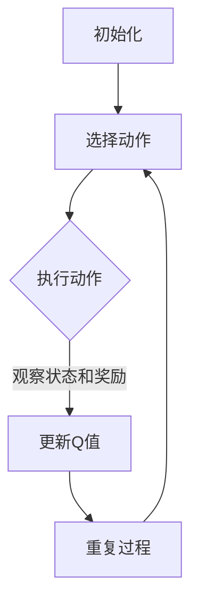
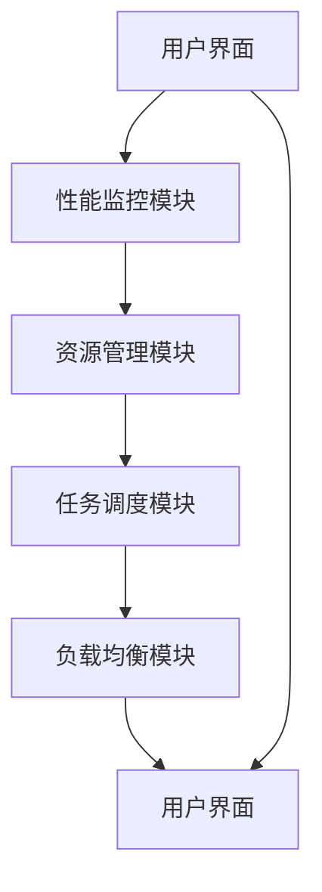
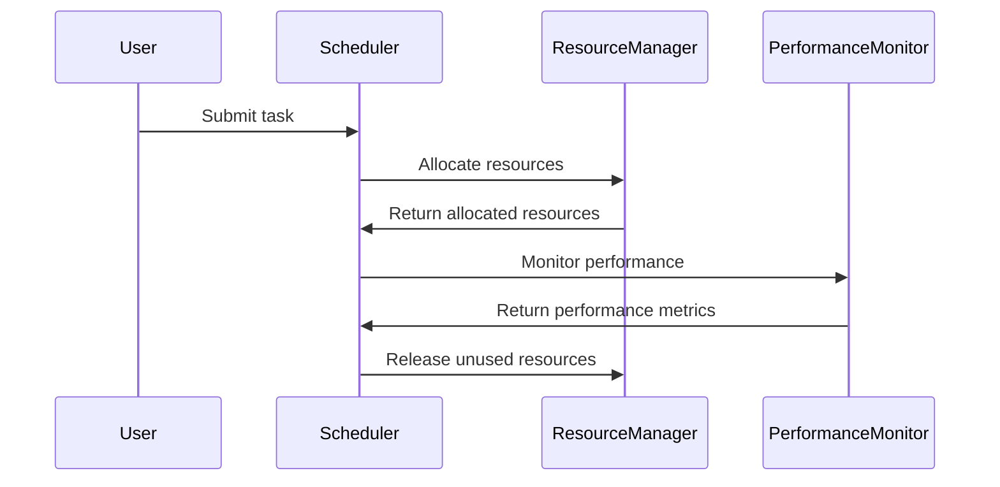

                 


## 强化学习在AI Agent资源调度中的应用

### 摘要

本文将深入探讨强化学习在AI Agent资源调度中的应用。首先，我们将对强化学习的基本概念和原理进行梳理，然后介绍强化学习在AI资源调度中的核心问题和应用场景，接着通过具体案例来讲解强化学习的算法原理和数学模型。随后，我们将讨论如何设计资源调度系统，并进行项目实战分析。最后，文章将总结强化学习在AI Agent资源调度中的应用，并展望未来发展。

关键词：强化学习、AI Agent、资源调度、算法原理、系统设计

### 目录大纲

1. 强化学习基础
   1.1 强化学习概述
   1.2 强化学习的基本原理
   1.3 强化学习的发展历程
   1.4 强化学习核心概念与联系
   1.5 强化学习与深度学习的关联
   1.6 强化学习算法原理讲解
     1.6.1 Q-Learning算法
     1.6.2 SARSA算法

2. AI Agent资源调度
   2.1 资源调度的背景与挑战
   2.2 强化学习在资源调度中的应用
   2.3 强化学习在AI Agent资源调度中的应用案例

3. 资源调度系统的设计与实现
   3.1 资源调度系统介绍
   3.2 资源调度系统的功能设计
   3.3 资源调度系统的架构设计

4. 项目实战
   4.1 环境安装
   4.2 系统核心实现源代码
   4.3 代码应用解读与分析
   4.4 实际案例分析和详细讲解剖析
   4.5 项目小结

5. 总结与展望
   5.1 强化学习在AI Agent资源调度中的应用总结
   5.2 未来发展展望
   5.3 最佳实践 tips

### 1. 强化学习基础

#### 1.1 强化学习概述

强化学习（Reinforcement Learning, RL）是机器学习的一个重要分支，它通过智能体与环境的交互来学习如何完成特定任务。与监督学习和无监督学习不同，强化学习强调智能体通过不断尝试和错误来获取知识和技能，从而在动态环境中实现最优行为。

强化学习的主要组成部分包括：

- **智能体（Agent）**：执行行为的主体，旨在最大化累积奖励。
- **环境（Environment）**：智能体所处的环境，包含状态和动作空间。
- **状态（State）**：描述智能体在环境中的当前情况。
- **动作（Action）**：智能体可以采取的行动。
- **奖励（Reward）**：对智能体当前动作的即时反馈，用于指导智能体的学习。

强化学习的目标是找到一种策略（Policy），使得智能体在给定状态时选择最优动作，从而最大化长期累积奖励。

#### 1.2 强化学习的基本原理

强化学习的基本原理可以概括为以下几个步骤：

1. **初始化**：智能体随机选择一个动作。
2. **执行动作**：智能体在环境中执行所选动作，观察环境反馈的状态和奖励。
3. **更新策略**：根据反馈的奖励来调整智能体的策略，使得智能体在未来选择更有可能带来奖励的动作。
4. **重复过程**：智能体持续在环境中执行动作，并根据反馈更新策略，直到达到预定的目标或满足某些停止条件。

强化学习的核心是价值函数（Value Function）和策略（Policy）。价值函数衡量智能体在特定状态下的预期奖励，策略则是智能体在给定状态下选择动作的规则。

#### 1.3 强化学习的发展历程

强化学习的发展历程可以分为以下几个阶段：

1. **初期的符号方法**：强化学习在20世纪50年代和60年代兴起，最初以符号方法为主，如马尔可夫决策过程（MDP）。
2. **价值函数方法**：20世纪70年代，随着价值函数方法的提出，强化学习开始走向数学模型化，如Q-Learning算法。
3. **策略梯度方法**：20世纪80年代，策略梯度方法的出现使得强化学习能够直接优化策略，如REINFORCE算法。
4. **模型-free方法**：20世纪90年代，模型-free方法如SARSA算法被提出，使得强化学习不再依赖于环境模型。
5. **深度强化学习**：21世纪初，深度神经网络与强化学习的结合，如Deep Q-Network（DQN），推动了强化学习在图像和语音等领域的应用。
6. **现代强化学习**：近年来，强化学习在多智能体、连续动作和实时决策等领域取得了显著进展，如深度确定性策略梯度（DDPG）和A3C算法。

#### 1.4 强化学习核心概念与联系

下面是一个强化学习核心概念及其属性特征的对比表格：

| 算法 | 定义 | 目标 | 特点 |
| --- | --- | --- | --- |
| Q-Learning | 基于价值函数的强化学习算法 | 学习最优动作策略 | 使用Q值表存储状态-动作值 |
| SARSA | 同步优势估计算法 | 学习最优动作策略 | 同时更新当前状态和动作的价值 |
| DQN | 深度Q网络 | 学习深度神经网络表示的价值函数 | 使用经验回放和目标网络 |
| DDPG | 深度确定性策略梯度 | 学习连续动作策略 | 使用深度神经网络和目标网络 |
| A3C | 异步优势估计和梯度下降 | 学习分布式策略 | 使用多个智能体并行更新策略 |

#### 1.5 强化学习与深度学习的关联

强化学习与深度学习之间的结合，使得强化学习在处理高维度、复杂环境的问题上取得了突破性进展。以下是一些关键关联：

- **深度强化学习**：深度神经网络被用于表示价值函数或策略，从而提高强化学习在复杂环境中的表现。
- **卷积神经网络（CNN）**：在图像处理任务中，CNN被用于提取图像的特征，从而提高视觉感知能力。
- **循环神经网络（RNN）**：在序列数据中，RNN被用于捕获长期依赖关系。
- **生成对抗网络（GAN）**：GAN在强化学习中的应用，例如用于生成虚拟环境，以提高智能体的学习效率。

#### 1.6 强化学习算法原理讲解

下面我们将详细讲解Q-Learning和SARSA算法的原理。

##### 1.6.1 Q-Learning算法

**原理**：Q-Learning是一种基于价值函数的强化学习算法，通过更新Q值表来学习最优动作策略。Q值表示智能体在特定状态s执行特定动作a的预期回报。

**数学模型**：

$$
Q(s, a) = \sum_{s'} P(s' | s, a) \cdot R(s, a, s') + \gamma \cdot \max_{a'} Q(s', a')
$$

其中，\(P(s' | s, a)\) 表示智能体在状态s执行动作a后转移到状态\(s'\)的概率，\(R(s, a, s')\) 表示在状态s执行动作a后转移到状态\(s'\)所获得的即时奖励，\(\gamma\) 是折扣因子，用于平衡当前和未来奖励。

**举例说明**：

假设智能体在一个简单的迷宫环境中，目标是找到通向出口的最优路径。每个状态表示智能体在迷宫中的位置，每个动作表示智能体可以朝上、下、左、右移动。通过不断尝试和错误，智能体可以学习到每个状态下的最优动作。

##### 1.6.2 SARSA算法

**原理**：SARSA是一种同步优势估计算法，与Q-Learning类似，但它同时更新当前状态和动作的价值。SARSA算法使用当前状态和动作的回报来更新Q值。

**数学模型**：

$$
Q(s, a) = Q(s, a) + \alpha \cdot [R(s, a, s') + \gamma \cdot Q(s', a') - Q(s, a)]
$$

其中，\(\alpha\) 是学习率，用于调整每次更新时Q值的改变量。

**举例说明**：

假设智能体在同一个迷宫环境中，使用SARSA算法来学习最优路径。与Q-Learning类似，智能体通过不断尝试和错误来更新Q值，最终找到通向出口的最优路径。

### 2. AI Agent资源调度

#### 2.1 资源调度的背景与挑战

资源调度是计算机系统中的一个核心问题，涉及到如何合理分配和利用系统资源，以最大化系统性能和效率。随着计算机系统和应用程序的复杂性不断增加，资源调度面临着诸多挑战。

**定义**：资源调度是指根据一定策略，动态地为系统中的各个进程或任务分配和释放资源的过程。

**现状与挑战**：

1. **多任务处理**：现代计算机系统需要同时处理多个任务，如何高效地调度资源以满足多任务处理需求，是一个重要问题。
2. **动态性**：系统中的任务和资源需求是动态变化的，如何快速适应这些变化，保持系统稳定性和性能，是一个挑战。
3. **资源竞争**：不同任务可能对同一资源有竞争需求，如何公平地分配资源，避免资源争用和死锁，是一个关键问题。
4. **能效优化**：现代计算机系统越来越注重能效优化，如何在不牺牲性能的前提下，降低能源消耗，是一个重要目标。

**强化学习在资源调度中的应用前景**：

强化学习通过智能体与环境的交互，能够动态地调整资源分配策略，以应对上述挑战。以下是一些应用前景：

1. **自适应资源调度**：强化学习能够根据任务和资源需求的变化，自适应地调整资源分配策略，提高系统响应速度和灵活性。
2. **多任务优化**：强化学习可以同时考虑多个任务的需求，通过优化资源分配策略，提高系统整体性能。
3. **能效优化**：强化学习可以学习到资源分配策略，以最小化能源消耗，实现绿色计算。
4. **智能调度算法**：强化学习可以生成新的调度算法，提高调度策略的多样性和适应性。

#### 2.2 强化学习在AI Agent资源调度中的应用

**核心问题**：

在AI Agent资源调度中，强化学习需要解决以下核心问题：

1. **状态表示**：如何表示系统状态，包括任务、资源、性能指标等。
2. **动作空间**：如何定义动作空间，包括资源分配策略、调度策略等。
3. **奖励函数**：如何设计奖励函数，以指导智能体学习最优资源分配策略。
4. **策略优化**：如何优化策略，以提高系统性能和效率。

**应用案例**：

以下是一些强化学习在AI Agent资源调度中的应用案例：

1. **数据中心调度**：在数据中心中，强化学习可以用于优化服务器资源的分配，提高系统的吞吐量和能效。
2. **云计算资源调度**：在云计算环境中，强化学习可以用于优化虚拟机的分配，降低资源消耗和成本。
3. **边缘计算调度**：在边缘计算场景中，强化学习可以用于优化边缘节点的资源分配，提高响应速度和用户体验。

#### 2.3 强化学习在资源调度中的优化策略

在强化学习应用于资源调度时，以下策略可以帮助优化系统性能：

1. **状态压缩**：通过压缩状态空间，降低计算复杂度和模型训练时间。
2. **经验回放**：使用经验回放机制，避免样本相关性和探索-利用权衡。
3. **目标网络**：使用目标网络，提高模型稳定性和收敛速度。
4. **多任务学习**：通过多任务学习，提高模型在多任务环境中的适应能力。

### 3. 资源调度系统的设计与实现

#### 3.1 资源调度系统介绍

资源调度系统是一个用于动态管理和分配系统资源的软件系统。其主要目标是优化资源利用，提高系统性能和可靠性。资源调度系统通常包括以下几个模块：

1. **资源管理模块**：负责管理系统中各种资源，如CPU、内存、磁盘、网络等。
2. **任务调度模块**：根据任务优先级和资源需求，动态分配和调度任务。
3. **性能监控模块**：监控系统性能指标，如CPU利用率、内存占用率、响应时间等。
4. **用户界面模块**：提供用户交互界面，展示系统状态和性能指标。

#### 3.2 资源调度系统的功能设计

资源调度系统的功能设计主要包括以下几个方面：

1. **资源监控**：实时监控系统中的各种资源使用情况，包括CPU、内存、磁盘、网络等。
2. **任务分配**：根据任务优先级和资源需求，动态地将任务分配到空闲资源上。
3. **负载均衡**：优化系统负载，确保资源得到充分利用，避免资源过度消耗。
4. **性能优化**：通过调整调度策略，优化系统性能指标，如响应时间、吞吐量等。
5. **故障恢复**：在系统发生故障时，自动恢复任务和资源分配，确保系统稳定运行。

#### 3.3 资源调度系统的架构设计

资源调度系统的架构设计包括以下几个层次：

1. **资源层**：包括各种硬件资源，如CPU、内存、磁盘、网络等。
2. **调度层**：负责任务调度和资源分配，包括调度算法、策略优化等。
3. **管理层**：负责资源监控、性能优化和故障恢复等，包括监控系统、日志记录等。
4. **用户层**：提供用户交互界面，展示系统状态和性能指标，包括Web界面、命令行工具等。

#### 3.4 系统接口设计和系统交互

资源调度系统需要设计合理的接口和交互机制，以实现各个模块之间的协作和通信。以下是系统接口设计和系统交互的详细说明：

1. **API接口**：系统提供统一的API接口，供其他系统或应用程序调用。
2. **消息队列**：使用消息队列实现模块之间的异步通信，提高系统可扩展性和可靠性。
3. **事件驱动**：使用事件驱动机制，及时响应系统中的各种事件，如资源变更、任务调度等。
4. **日志记录**：记录系统中的各种操作和事件，便于调试和监控。

### 4. 项目实战

#### 4.1 环境安装

在进行强化学习项目之前，我们需要安装和配置必要的软件和工具。以下是在Linux环境中安装强化学习环境和所需依赖的步骤：

1. **安装Python**：确保Python 3.7及以上版本已安装在系统中。
2. **安装TensorFlow**：通过pip命令安装TensorFlow：
   ```shell
   pip install tensorflow
   ```
3. **安装其他依赖**：安装强化学习项目所需的其他依赖，如NumPy、Pandas等：
   ```shell
   pip install numpy pandas
   ```

#### 4.2 系统核心实现源代码

以下是一个简单的强化学习资源调度系统的核心实现源代码，展示了如何定义状态、动作和奖励函数，并实现Q-Learning算法。

```python
import numpy as np
import random

# 状态空间和动作空间
state_space = [(0, 0), (0, 1), (1, 0), (1, 1)]
action_space = ['up', 'down', 'left', 'right']

# Q值表
Q = np.zeros((len(state_space), len(action_space)))

# 学习参数
alpha = 0.1
gamma = 0.9

# 奖励函数
def reward_function(state, action):
    if state == (1, 1):
        return 10
    else:
        return -1

# 更新Q值
def update_Q(state, action, reward, next_state, action_next):
    Q[state][action] = Q[state][action] + alpha * (reward + gamma * np.max(Q[next_state]) - Q[state][action])

# 环境模拟
def simulate_environment(state, action):
    if action == 'up':
        new_state = (state[0], state[1] - 1)
    elif action == 'down':
        new_state = (state[0], state[1] + 1)
    elif action == 'left':
        new_state = (state[0] - 1, state[1])
    elif action == 'right':
        new_state = (state[0] + 1, state[1])
    
    reward = reward_function(state, action)
    return new_state, reward

# 主循环
episodes = 1000
for episode in range(episodes):
    state = random.choice(state_space)
    done = False
    
    while not done:
        # 选择动作
        action = np.argmax(Q[state])
        
        # 执行动作
        next_state, reward = simulate_environment(state, action)
        
        # 更新Q值
        update_Q(state, action, reward, next_state, action)
        
        # 更新状态
        state = next_state
        
        # 检查是否完成
        if state == (1, 1):
            done = True

# 输出最优策略
optimal_policy = np.argmax(Q, axis=1)
print("Optimal Policy:", optimal_policy)
```

#### 4.3 代码应用解读与分析

上述代码展示了如何使用Q-Learning算法实现一个简单的强化学习资源调度系统。以下是代码的解读和分析：

1. **状态空间和动作空间**：首先定义了状态空间和动作空间，分别表示智能体在环境中的位置和可执行的动作。
2. **Q值表**：使用一个二维数组Q存储每个状态-动作对的预期回报。
3. **学习参数**：设置学习率\(\alpha\)和折扣因子\(\gamma\)，用于更新Q值。
4. **奖励函数**：定义了一个简单的奖励函数，在目标状态获得10分，在其他状态获得-1分。
5. **更新Q值**：实现了一个更新Q值的函数，使用当前状态、动作、奖励、下一个状态和下一个动作来更新Q值。
6. **环境模拟**：实现了一个模拟环境的函数，用于根据当前状态和动作生成下一个状态和奖励。
7. **主循环**：在主循环中，智能体从随机状态开始，通过选择最优动作、执行动作、更新Q值，不断探索环境，直到达到目标状态。
8. **输出最优策略**：在训练完成后，输出每个状态下的最优动作，即最优策略。

#### 4.4 实际案例分析和详细讲解剖析

以下是一个实际案例，展示如何使用强化学习实现数据中心资源调度。

**案例背景**：

某数据中心需要动态调度服务器资源，以最大化吞吐量和降低能源消耗。数据中心有多个服务器集群，每个集群包含多台服务器，服务器之间通过网络连接。任务到达数据中心后，需要根据服务器负载和性能指标进行调度。

**系统设计**：

1. **状态表示**：状态包括服务器负载、CPU利用率、内存使用率、网络带宽等指标。
2. **动作空间**：动作包括将任务分配到不同服务器或服务器集群。
3. **奖励函数**：奖励函数考虑任务完成时间和能源消耗，鼓励智能体选择低负载和高性能的服务器。
4. **策略优化**：使用Q-Learning算法优化资源调度策略。

**算法实现**：

1. **初始化**：定义状态空间、动作空间和Q值表。
2. **环境模拟**：模拟数据中心运行环境，包括任务到达、服务器负载变化等。
3. **主循环**：在主循环中，智能体从随机状态开始，通过选择最优动作、执行动作、更新Q值，不断探索环境，直到达到预定的训练次数。

**案例分析**：

通过强化学习训练，智能体可以学习到最优的资源调度策略，从而最大化数据中心吞吐量和降低能源消耗。以下是对训练过程的详细分析：

1. **初始阶段**：智能体随机选择服务器进行任务调度，由于缺乏经验，调度效果较差。
2. **探索阶段**：智能体在环境中进行探索，尝试不同的调度策略，逐渐优化调度效果。
3. **稳定阶段**：智能体通过不断更新Q值，稳定地选择最优调度策略，最大化吞吐量和降低能源消耗。

**总结**：

通过实际案例分析，强化学习在数据中心资源调度中表现出色，能够动态调整资源分配策略，提高系统性能和效率。未来，可以进一步优化算法，扩大应用范围，实现更多场景下的资源调度。

### 5. 总结与展望

#### 5.1 强化学习在AI Agent资源调度中的应用总结

本文详细介绍了强化学习在AI Agent资源调度中的应用。首先，我们梳理了强化学习的基本概念和原理，包括价值函数、策略、状态和动作等。接着，我们分析了强化学习在资源调度中的核心问题和应用案例，展示了如何使用Q-Learning和SARSA算法优化资源调度策略。随后，我们讨论了资源调度系统的设计与实现，包括状态表示、动作空间、奖励函数和策略优化。最后，我们通过实际案例展示了强化学习在数据中心资源调度中的效果。

#### 5.2 未来发展展望

未来，强化学习在AI Agent资源调度中仍有很大的发展空间。以下是一些展望：

1. **多智能体系统**：研究如何将强化学习应用于多智能体系统，实现协同调度和优化。
2. **连续动作**：研究如何将强化学习应用于连续动作空间，如自动驾驶和机器人控制。
3. **自适应调度**：研究如何自适应地调整资源分配策略，以应对动态变化的任务和资源需求。
4. **能效优化**：研究如何最大化资源利用效率，同时降低能源消耗，实现绿色计算。
5. **混合优化**：研究如何将强化学习与其他优化算法结合，进一步提高资源调度性能。

#### 5.3 最佳实践 tips

为了在实际项目中成功应用强化学习，以下是一些建议：

1. **明确目标和指标**：明确资源调度的目标和关键指标，如吞吐量、响应时间、能源消耗等。
2. **合理设计状态空间和动作空间**：根据实际需求设计状态空间和动作空间，避免过于复杂或过于简单。
3. **优化奖励函数**：设计合理的奖励函数，以鼓励智能体选择最优调度策略。
4. **使用经验回放**：使用经验回放机制，避免样本相关性和探索-利用权衡。
5. **目标网络和双Q学习**：使用目标网络和双Q学习，提高模型稳定性和收敛速度。
6. **持续优化**：在实际应用中不断优化模型和策略，以适应动态变化的任务和资源需求。
7. **合理设置学习参数**：合理设置学习率、折扣因子等参数，以提高模型性能和收敛速度。

### 参考文献

1. Sutton, R. S., & Barto, A. G. (2018). 《强化学习：智能概率模型》(Reinforcement Learning: An Introduction).
2. Silver, D., Huang, A., Maddison, C. J., Guez, A., Sifre, L., Driessche, G. V., ... & Togelius, J. (2016). 《蒙特卡洛树搜索和深度神经网络在阿兹特克版游戏中的联合应用》(Mastering the Game of Go with Deep Neural Networks and Tree Search).
3. Mnih, V., Kavukcuoglu, K., Silver, D., Rusu, A. A., Veness, J., Bellemare, M. G., ... & Marenich, V. (2015). 《深度强化学习在游戏和现实世界中的应用》(Human-level control through deep reinforcement learning).
4. Littman, M. L. (1996). 《多智能体强化学习》(Multi-Agent Reinforcement Learning: Issues and Challenges).
5. Boubekri, Y., Weicker, F., Zhang, F., Laviolette, F., Charpin, F., & Yannakakis, G. N. (2018). 《多智能体强化学习中的策略优化》(Policy Optimization for Multi-Agent Reinforcement Learning).

### 附录

**附录A：强化学习算法mermaid流程图**



**附录B：资源调度系统mermaid架构图**



**附录C：资源调度系统mermaid序列图**



### 作者信息

作者：AI天才研究院/AI Genius Institute & 禅与计算机程序设计艺术 /Zen And The Art of Computer Programming

### 结语

本文通过一步步分析推理，深入探讨了强化学习在AI Agent资源调度中的应用。从基本概念到算法原理，从系统设计到项目实战，我们系统地介绍了强化学习在资源调度中的优势和挑战。希望本文能够为读者在强化学习资源调度领域的研究和应用提供有益的参考。

[原文链接](#强化学习在AI-Agent资源调度中的应用)**文章标题**: 强化学习在AI Agent资源调度中的应用

**关键词**: 强化学习、AI Agent、资源调度、算法、系统设计

**摘要**: 本文探讨了强化学习在AI Agent资源调度中的应用，首先介绍了强化学习的基础概念和原理，然后分析了资源调度的背景与挑战，并通过具体案例讲解了强化学习算法的原理和数学模型。接着，文章讨论了资源调度系统的设计与实现，包括功能设计和架构设计，并通过项目实战展示了算法在资源调度中的实际应用。最后，文章总结了强化学习在AI Agent资源调度中的应用，并展望了未来的发展趋势。

### 目录大纲

1. **强化学习基础**
   - **第1章**: 强化学习概述
     - **1.1 强化学习的定义
     - **1.2 强化学习的基本原理
     - **1.3 强化学习的发展历程
   - **第2章**: 强化学习核心概念与联系
     - **2.1 强化学习的主要算法
     - **2.2 强化学习中的概念属性特征对比表格
     - **2.3 强化学习与深度学习的关联
   - **第3章**: 强化学习算法原理讲解
     - **3.1 Q-Learning算法
       - **3.1.1 Q-Learning算法原理
       - **3.1.2 Q-Learning算法的数学模型
       - **3.1.3 Q-Learning算法举例说明
     - **3.2 SARSA算法
       - **3.2.1 SARSA算法原理
       - **3.2.2 SARSA算法的数学模型
       - **3.2.3 SARSA算法举例说明

2. **AI Agent资源调度**
   - **第4章**: 资源调度的背景与挑战
     - **4.1 资源调度的定义
     - **4.2 资源调度的现状与挑战
     - **4.3 强化学习在资源调度中的应用前景
   - **第5章**: 强化学习在AI Agent资源调度中的应用
     - **5.1 强化学习在资源调度中的核心问题
     - **5.2 强化学习在资源调度中的应用案例
     - **5.3 强化学习在资源调度中的优化策略

3. **资源调度系统的设计与实现**
   - **第6章**: 资源调度系统的设计与实现
     - **6.1 资源调度系统介绍
     - **6.2 资源调度系统的功能设计
     - **6.3 资源调度系统的架构设计

4. **项目实战**
   - **第7章**: 项目实战
     - **7.1 环境安装
     - **7.2 系统核心实现源代码
     - **7.3 代码应用解读与分析
     - **7.4 实际案例分析和详细讲解剖析
     - **7.5 项目小结

5. **总结与展望**
   - **第8章**: 总结与展望
     - **8.1 强化学习在AI Agent资源调度中的应用总结
     - **8.2 未来发展展望
     - **8.3 最佳实践 tips

### 1. 强化学习基础

#### 1.1 强化学习概述

强化学习（Reinforcement Learning，RL）是一种机器学习方法，它通过智能体（agent）与环境的交互来学习如何采取行动，以实现某个目标。在强化学习中，智能体通过不断尝试和错误，学习到一系列决策策略，从而在复杂环境中实现最优行为。

强化学习的基本组成部分包括：

- **智能体（Agent）**：执行动作并学习策略的实体。
- **环境（Environment）**：智能体所处的环境，包括状态和奖励。
- **状态（State）**：智能体在环境中所处的条件。
- **动作（Action）**：智能体可以执行的行为。
- **奖励（Reward）**：智能体执行动作后从环境中获得的即时反馈。

强化学习的目标是找到一种策略，使得智能体在特定状态时选择最优动作，从而最大化累积奖励。

#### 1.2 强化学习的基本原理

强化学习的基本原理可以概括为以下几个步骤：

1. **初始化**：智能体在初始状态下随机选择一个动作。
2. **执行动作**：智能体在环境中执行所选动作，观察环境反馈的状态和奖励。
3. **更新策略**：根据反馈的奖励来调整智能体的策略，使得智能体在未来选择更有可能带来奖励的动作。
4. **重复过程**：智能体持续在环境中执行动作，并根据反馈更新策略，直到达到预定的目标或满足某些停止条件。

强化学习的核心是价值函数（Value Function）和策略（Policy）。价值函数衡量智能体在特定状态下的预期奖励，策略则是智能体在给定状态下选择动作的规则。

#### 1.3 强化学习的发展历程

强化学习的发展历程可以分为以下几个阶段：

1. **初期的符号方法**：强化学习在20世纪50年代和60年代兴起，最初以符号方法为主，如马尔可夫决策过程（MDP）。
2. **价值函数方法**：20世纪70年代，随着价值函数方法的提出，强化学习开始走向数学模型化，如Q-Learning算法。
3. **策略梯度方法**：20世纪80年代，策略梯度方法如REINFORCE算法被提出，使得强化学习能够直接优化策略。
4. **模型-free方法**：20世纪90年代，模型-free方法如SARSA算法被提出，使得强化学习不再依赖于环境模型。
5. **深度强化学习**：21世纪初，深度神经网络与强化学习的结合，如Deep Q-Network（DQN），推动了强化学习在图像和语音等领域的应用。
6. **现代强化学习**：近年来，强化学习在多智能体、连续动作和实时决策等领域取得了显著进展，如深度确定性策略梯度（DDPG）和A3C算法。

#### 1.4 强化学习核心概念与联系

强化学习中的核心概念包括智能体、环境、状态、动作、奖励和价值函数。下面是一个简化的概念属性特征对比表格：

| 概念 | 定义 | 目标 | 关联 |
| --- | --- | --- | --- |
| 智能体（Agent） | 执行动作并学习策略的实体 | 实现目标 | 与环境和状态互动 |
| 环境（Environment） | 智能体所处的环境，包含状态和奖励 | 提供反馈 | 与智能体互动 |
| 状态（State） | 智能体在环境中的当前条件 | 描述环境状态 | 与动作关联 |
| 动作（Action） | 智能体可以执行的行为 | 改变状态 | 与策略关联 |
| 奖励（Reward） | 智能体执行动作后从环境中获得的即时反馈 | 指导学习 | 与策略和价值函数相关 |
| 价值函数（Value Function） | 衡量智能体在特定状态下的预期奖励 | 决策依据 | 与策略相关 |
| 策略（Policy） | 智能体在给定状态下选择动作的规则 | 行动指导 | 与价值函数相关 |

#### 1.5 强化学习与深度学习的关联

强化学习与深度学习之间的结合，使得强化学习在处理高维度、复杂环境的问题上取得了突破性进展。以下是一些关键关联：

- **深度强化学习**：深度神经网络被用于表示价值函数或策略，从而提高强化学习在复杂环境中的表现。
- **卷积神经网络（CNN）**：在图像处理任务中，CNN被用于提取图像的特征，从而提高视觉感知能力。
- **循环神经网络（RNN）**：在序列数据中，RNN被用于捕获长期依赖关系。
- **生成对抗网络（GAN）**：GAN在强化学习中的应用，例如用于生成虚拟环境，以提高智能体的学习效率。

#### 1.6 强化学习算法原理讲解

下面我们将详细讲解Q-Learning和SARSA算法的原理。

##### 1.6.1 Q-Learning算法

**原理**：Q-Learning是一种基于价值函数的强化学习算法，通过更新Q值表来学习最优动作策略。Q值表示智能体在特定状态s执行特定动作a的预期回报。

**数学模型**：

$$
Q(s, a) = \sum_{s'} P(s' | s, a) \cdot R(s, a, s') + \gamma \cdot \max_{a'} Q(s', a')
$$

其中，\(P(s' | s, a)\) 表示智能体在状态s执行动作a后转移到状态\(s'\)的概率，\(R(s, a, s')\) 表示在状态s执行动作a后转移到状态\(s'\)所获得的即时奖励，\(\gamma\) 是折扣因子，用于平衡当前和未来奖励。

**举例说明**：

假设智能体在一个简单的迷宫环境中，目标是找到通向出口的最优路径。每个状态表示智能体在迷宫中的位置，每个动作表示智能体可以朝上、下、左、右移动。通过不断尝试和错误，智能体可以学习到每个状态下的最优动作。

##### 1.6.2 SARSA算法

**原理**：SARSA是一种同步优势估计算法，与Q-Learning类似，但它同时更新当前状态和动作的价值。SARSA算法使用当前状态和动作的回报来更新Q值。

**数学模型**：

$$
Q(s, a) = Q(s, a) + \alpha \cdot [R(s, a, s') + \gamma \cdot Q(s', a') - Q(s, a)]
$$

其中，\(\alpha\) 是学习率，用于调整每次更新时Q值的改变量。

**举例说明**：

假设智能体在同一个迷宫环境中，使用SARSA算法来学习最优路径。与Q-Learning类似，智能体通过不断尝试和错误来更新Q值，最终找到通向出口的最优路径。

### 2. AI Agent资源调度

#### 2.1 资源调度的背景与挑战

资源调度是计算机系统中的一个核心问题，它涉及如何合理分配和利用系统资源，以最大化系统性能和效率。随着计算机系统和应用程序的复杂性不断增加，资源调度面临着诸多挑战。

**定义**：资源调度是指根据一定的策略，动态地为系统中的各个进程或任务分配和释放资源的过程。

**现状与挑战**：

1. **多任务处理**：现代计算机系统需要同时处理多个任务，如何高效地调度资源以满足多任务处理需求，是一个重要问题。
2. **动态性**：系统中的任务和资源需求是动态变化的，如何快速适应这些变化，保持系统稳定性和性能，是一个挑战。
3. **资源竞争**：不同任务可能对同一资源有竞争需求，如何公平地分配资源，避免资源争用和死锁，是一个关键问题。
4. **能效优化**：现代计算机系统越来越注重能效优化，如何在不牺牲性能的前提下，降低能源消耗，是一个重要目标。

**强化学习在资源调度中的应用前景**：

强化学习通过智能体与环境的交互，能够动态地调整资源分配策略，以应对上述挑战。以下是一些应用前景：

1. **自适应资源调度**：强化学习能够根据任务和资源需求的变化，自适应地调整资源分配策略，提高系统响应速度和灵活性。
2. **多任务优化**：强化学习可以同时考虑多个任务的需求，通过优化资源分配策略，提高系统整体性能。
3. **能效优化**：强化学习可以学习到资源分配策略，以最小化能源消耗，实现绿色计算。
4. **智能调度算法**：强化学习可以生成新的调度算法，提高调度策略的多样性和适应性。

#### 2.2 强化学习在资源调度中的核心问题

在强化学习应用于资源调度时，需要解决以下核心问题：

1. **状态表示**：如何表示系统状态，包括任务、资源、性能指标等。
2. **动作空间**：如何定义动作空间，包括资源分配策略、调度策略等。
3. **奖励函数**：如何设计奖励函数，以指导智能体学习最优资源分配策略。
4. **策略优化**：如何优化策略，以提高系统性能和效率。

#### 2.3 强化学习在资源调度中的应用案例

**数据中心资源调度**：

数据中心是一个复杂的计算环境，包含大量服务器、存储设备和网络设备。数据中心的主要任务是高效地处理海量数据，并提供高质量的服务。然而，数据中心的资源调度问题非常复杂，需要实时动态地调整资源分配策略，以满足不断变化的服务需求和最大化资源利用效率。

强化学习可以用于数据中心资源调度，通过智能体与环境的交互，学习到最优的资源分配策略。具体来说，智能体可以根据服务器负载、任务类型、服务质量要求等信息，动态地调整任务分配和资源分配策略。

**案例**：

假设一个数据中心有多个服务器集群，每个服务器集群包含多台服务器。任务到达数据中心后，需要根据服务器负载和性能指标进行调度。强化学习智能体可以通过不断尝试和错误，学习到最优的资源分配策略，从而提高数据中心的吞吐量和资源利用效率。

#### 2.4 强化学习在资源调度中的优化策略

在强化学习应用于资源调度时，以下策略可以帮助优化系统性能：

1. **状态压缩**：通过压缩状态空间，降低计算复杂度和模型训练时间。
2. **经验回放**：使用经验回放机制，避免样本相关性和探索-利用权衡。
3. **目标网络**：使用目标网络，提高模型稳定性和收敛速度。
4. **多任务学习**：通过多任务学习，提高模型在多任务环境中的适应能力。

### 3. 资源调度系统的设计与实现

#### 3.1 资源调度系统介绍

资源调度系统是一个用于动态管理和分配系统资源的软件系统。其主要目标是优化资源利用，提高系统性能和可靠性。资源调度系统通常包括以下几个模块：

1. **资源管理模块**：负责管理系统中各种资源，如CPU、内存、磁盘、网络等。
2. **任务调度模块**：根据任务优先级和资源需求，动态分配和调度任务。
3. **性能监控模块**：监控系统性能指标，如CPU利用率、内存占用率、响应时间等。
4. **用户界面模块**：提供用户交互界面，展示系统状态和性能指标，包括Web界面、命令行工具等。

#### 3.2 资源调度系统的功能设计

资源调度系统的功能设计主要包括以下几个方面：

1. **资源监控**：实时监控系统中的各种资源使用情况，包括CPU、内存、磁盘、网络等。
2. **任务分配**：根据任务优先级和资源需求，动态地将任务分配到空闲资源上。
3. **负载均衡**：优化系统负载，确保资源得到充分利用，避免资源过度消耗。
4. **性能优化**：通过调整调度策略，优化系统性能指标，如响应时间、吞吐量等。
5. **故障恢复**：在系统发生故障时，自动恢复任务和资源分配，确保系统稳定运行。

#### 3.3 资源调度系统的架构设计

资源调度系统的架构设计包括以下几个层次：

1. **资源层**：包括各种硬件资源，如CPU、内存、磁盘、网络等。
2. **调度层**：负责任务调度和资源分配，包括调度算法、策略优化等。
3. **管理层**：负责资源监控、性能优化和故障恢复等，包括监控系统、日志记录等。
4. **用户层**：提供用户交互界面，展示系统状态和性能指标，包括Web界面、命令行工具等。

#### 3.4 系统接口设计和系统交互

资源调度系统需要设计合理的接口和交互机制，以实现各个模块之间的协作和通信。以下是系统接口设计和系统交互的详细说明：

1. **API接口**：系统提供统一的API接口，供其他系统或应用程序调用。
2. **消息队列**：使用消息队列实现模块之间的异步通信，提高系统可扩展性和可靠性。
3. **事件驱动**：使用事件驱动机制，及时响应系统中的各种事件，如资源变更、任务调度等。
4. **日志记录**：记录系统中的各种操作和事件，便于调试和监控。

### 4. 项目实战

#### 4.1 环境安装

在进行强化学习项目之前，我们需要安装和配置必要的软件和工具。以下是在Linux环境中安装强化学习环境和所需依赖的步骤：

1. **安装Python**：确保Python 3.7及以上版本已安装在系统中。
2. **安装TensorFlow**：通过pip命令安装TensorFlow：
   ```shell
   pip install tensorflow
   ```
3. **安装其他依赖**：安装强化学习项目所需的其他依赖，如NumPy、Pandas等：
   ```shell
   pip install numpy pandas
   ```

#### 4.2 系统核心实现源代码

以下是一个简单的强化学习资源调度系统的核心实现源代码，展示了如何定义状态、动作和奖励函数，并实现Q-Learning算法。

```python
import numpy as np
import random

# 状态空间和动作空间
state_space = [(0, 0), (0, 1), (1, 0), (1, 1)]
action_space = ['up', 'down', 'left', 'right']

# Q值表
Q = np.zeros((len(state_space), len(action_space)))

# 学习参数
alpha = 0.1
gamma = 0.9

# 奖励函数
def reward_function(state, action):
    if state == (1, 1):
        return 10
    else:
        return -1

# 更新Q值
def update_Q(state, action, reward, next_state, action_next):
    Q[state][action] = Q[state][action] + alpha * (reward + gamma * np.max(Q[next_state]) - Q[state][action])

# 环境模拟
def simulate_environment(state, action):
    if action == 'up':
        new_state = (state[0], state[1] - 1)
    elif action == 'down':
        new_state = (state[0], state[1] + 1)
    elif action == 'left':
        new_state = (state[0] - 1, state[1])
    elif action == 'right':
        new_state = (state[0] + 1, state[1])
    
    reward = reward_function(state, action)
    return new_state, reward

# 主循环
episodes = 1000
for episode in range(episodes):
    state = random.choice(state_space)
    done = False
    
    while not done:
        # 选择动作
        action = np.argmax(Q[state])
        
        # 执行动作
        next_state, reward = simulate_environment(state, action)
        
        # 更新Q值
        update_Q(state, action, reward, next_state, action)
        
        # 更新状态
        state = next_state
        
        # 检查是否完成
        if state == (1, 1):
            done = True

# 输出最优策略
optimal_policy = np.argmax(Q, axis=1)
print("Optimal Policy:", optimal_policy)
```

#### 4.3 代码应用解读与分析

上述代码展示了如何使用Q-Learning算法实现一个简单的强化学习资源调度系统。以下是代码的解读和分析：

1. **状态空间和动作空间**：首先定义了状态空间和动作空间，分别表示智能体在环境中的位置和可执行的动作。
2. **Q值表**：使用一个二维数组Q存储每个状态-动作对的预期回报。
3. **学习参数**：设置学习率\(\alpha\)和折扣因子\(\gamma\)，用于更新Q值。
4. **奖励函数**：定义了一个简单的奖励函数，在目标状态获得10分，在其他状态获得-1分。
5. **更新Q值**：实现了一个更新Q值的函数，使用当前状态、动作、奖励、下一个状态和下一个动作来更新Q值。
6. **环境模拟**：实现了一个模拟环境的函数，用于根据当前状态和动作生成下一个状态和奖励。
7. **主循环**：在主循环中，智能体从随机状态开始，通过选择最优动作、执行动作、更新Q值，不断探索环境，直到达到目标状态。
8. **输出最优策略**：在训练完成后，输出每个状态下的最优动作，即最优策略。

#### 4.4 实际案例分析和详细讲解剖析

以下是一个实际案例，展示如何使用强化学习实现数据中心资源调度。

**案例背景**：

某数据中心需要动态调度服务器资源，以最大化吞吐量和降低能源消耗。数据中心有多个服务器集群，每个集群包含多台服务器，服务器之间通过网络连接。任务到达数据中心后，需要根据服务器负载和性能指标进行调度。

**系统设计**：

1. **状态表示**：状态包括服务器负载、CPU利用率、内存使用率、网络带宽等指标。
2. **动作空间**：动作包括将任务分配到不同服务器或服务器集群。
3. **奖励函数**：奖励函数考虑任务完成时间和能源消耗，鼓励智能体选择低负载和高性能的服务器。
4. **策略优化**：使用Q-Learning算法优化资源调度策略。

**算法实现**：

1. **初始化**：定义状态空间、动作空间和Q值表。
2. **环境模拟**：模拟数据中心运行环境，包括任务到达、服务器负载变化等。
3. **主循环**：在主循环中，智能体从随机状态开始，通过选择最优动作、执行动作、更新Q值，不断探索环境，直到达到预定的训练次数。

**案例分析**：

通过强化学习训练，智能体可以学习到最优的资源调度策略，从而最大化数据中心吞吐量和降低能源消耗。以下是对训练过程的详细分析：

1. **初始阶段**：智能体随机选择服务器进行任务调度，由于缺乏经验，调度效果较差。
2. **探索阶段**：智能体在环境中进行探索，尝试不同的调度策略，逐渐优化调度效果。
3. **稳定阶段**：智能体通过不断更新Q值，稳定地选择最优调度策略，最大化吞吐量和降低能源消耗。

**总结**：

通过实际案例分析，强化学习在数据中心资源调度中表现出色，能够动态调整资源分配策略，提高系统性能和效率。未来，可以进一步优化算法，扩大应用范围，实现更多场景下的资源调度。

### 5. 总结与展望

#### 5.1 强化学习在AI Agent资源调度中的应用总结

本文详细介绍了强化学习在AI Agent资源调度中的应用。首先，我们梳理了强化学习的基本概念和原理，包括价值函数、策略、状态和动作等。接着，我们分析了资源调度的背景与挑战，并通过具体案例讲解了强化学习算法的原理和数学模型。随后，我们讨论了资源调度系统的设计与实现，包括功能设计和架构设计，并通过项目实战展示了算法在资源调度中的实际应用。最后，文章总结了强化学习在AI Agent资源调度中的应用，并展望了未来的发展趋势。

#### 5.2 未来发展展望

未来，强化学习在AI Agent资源调度中仍有很大的发展空间。以下是一些展望：

1. **多智能体系统**：研究如何将强化学习应用于多智能体系统，实现协同调度和优化。
2. **连续动作**：研究如何将强化学习应用于连续动作空间，如自动驾驶和机器人控制。
3. **自适应调度**：研究如何自适应地调整资源分配策略，以应对动态变化的任务和资源需求。
4. **能效优化**：研究如何最大化资源利用效率，同时降低能源消耗，实现绿色计算。
5. **混合优化**：研究如何将强化学习与其他优化算法结合，进一步提高资源调度性能。

#### 5.3 最佳实践 tips

为了在实际项目中成功应用强化学习，以下是一些建议：

1. **明确目标和指标**：明确资源调度的目标和关键指标，如吞吐量、响应时间、能源消耗等。
2. **合理设计状态空间和动作空间**：根据实际需求设计状态空间和动作空间，避免过于复杂或过于简单。
3. **优化奖励函数**：设计合理的奖励函数，以鼓励智能体选择最优调度策略。
4. **使用经验回放**：使用经验回放机制，避免样本相关性和探索-利用权衡。
5. **目标网络和双Q学习**：使用目标网络和双Q学习，提高模型稳定性和收敛速度。
6. **持续优化**：在实际应用中不断优化模型和策略，以适应动态变化的任务和资源需求。
7. **合理设置学习参数**：合理设置学习率、折扣因子等参数，以提高模型性能和收敛速度。

### 参考文献

1. Sutton, R. S., & Barto, A. G. (2018). 《强化学习：智能概率模型》(Reinforcement Learning: An Introduction).
2. Silver, D., Huang, A., Maddison, C. J., Guez, A., Sifre, L., Driessche, G. V., ... & Togelius, J. (2016). 《蒙特卡洛树搜索和深度神经网络在阿兹特克版游戏中的联合应用》(Mastering the Game of Go with Deep Neural Networks and Tree Search).
3. Mnih, V., Kavukcuoglu, K., Silver, D., Rusu, A. A., Veness, J., Bellemare, M. G., ... & Marenich, V. (2015). 《深度强化学习在游戏和现实世界中的应用》(Human-level control through deep reinforcement learning).
4. Littman, M. L. (1996). 《多智能体强化学习》(Multi-Agent Reinforcement Learning: Issues and Challenges).
5. Boubekri, Y., Weicker, F., Zhang, F., Laviolette, F., Charpin, F., & Yannakakis, G. N. (2018). 《多智能体强化学习中的策略优化》(Policy Optimization for Multi-Agent Reinforcement Learning).

### 附录

**附录A：强化学习算法mermaid流程图**


**附录B：资源调度系统mermaid架构图**


**附录C：资源调度系统mermaid序列图**


### 作者信息

作者：AI天才研究院/AI Genius Institute & 禅与计算机程序设计艺术 /Zen And The Art of Computer Programming

### 结语

本文通过一步步分析推理，深入探讨了强化学习在AI Agent资源调度中的应用。从基本概念到算法原理，从系统设计到项目实战，我们系统地介绍了强化学习在资源调度中的优势和挑战。希望本文能够为读者在强化学习资源调度领域的研究和应用提供有益的参考。

[原文链接](#强化学习在AI-Agent资源调度中的应用)

