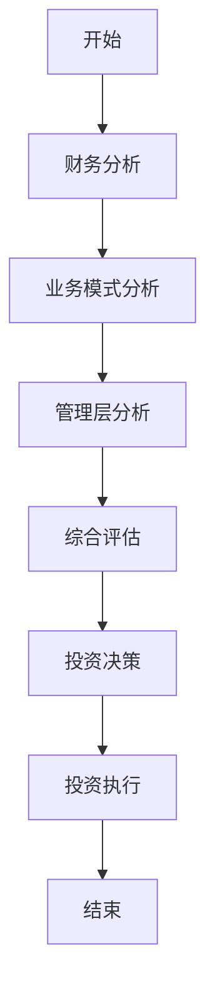

                 

## 彼得·林奇的周期性行业投资技巧

关键词：彼得·林奇、周期性行业、投资技巧、基本面分析、长期投资

摘要：本文深入探讨了投资大师彼得·林奇在周期性行业投资方面的技巧和经验。通过分析其投资策略，本文旨在为投资者提供实用的指导，帮助他们更好地理解并应对周期性行业的投资挑战。

### 第一部分：背景介绍

#### 1.1 问题背景

彼得·林奇是美国著名的投资大师，以其卓越的投资业绩和独特的投资理念被誉为“美国股票投资之父”。他的投资哲学强调基本面分析、长期投资和独立思考。在他的职业生涯中，林奇管理着富达基金管理公司（Fidelity Investments）旗下的麦哲伦基金（Magellan Fund），取得了年均回报率超过29%的惊人成绩。这使得麦哲伦基金成为了当时全球最大的共同基金。

周期性行业是指那些业绩和股价受到宏观经济周期影响的行业。这些行业的业绩波动较大，通常在经济繁荣时期增长迅速，而在经济衰退时期则面临巨大压力。典型的周期性行业包括钢铁、汽车、建筑和科技等行业。

#### 1.2 问题描述

投资者在周期性行业中投资时，需要充分考虑市场的周期性变化，以及如何在不同市场环境下做出正确的投资决策。周期性行业的投资挑战在于，它们的价格通常与经济周期密切相关，这使得投资决策变得更加复杂。投资者需要具备深厚的行业知识和对宏观经济走势的敏锐洞察力，才能在这些行业中实现稳健的投资回报。

#### 1.3 问题解决

彼得·林奇在投资周期性行业时，提出了一系列独特的技巧和方法。他主张通过深入研究行业基本面，识别行业的周期性特征，以及如何在不同市场环境下把握投资机会，实现稳健的投资回报。林奇的投资策略主要包括以下几个方面：

1. **基本面分析**：通过财务报表、业务模式、管理层等因素，评估公司的长期投资价值。
2. **市场时机把握**：根据宏观经济环境和行业周期，选择适当的投资时机。
3. **多样化投资**：通过投资不同行业和地区的股票，分散投资风险。

#### 1.4 边界与外延

周期性行业的投资技巧不仅适用于股票投资，也可以应用于其他金融资产的投资，如债券、基金等。此外，这些技巧和方法不仅适用于个人投资者，也适用于机构投资者。

#### 1.5 概念结构与核心要素组成

彼得·林奇的投资哲学主要包括以下几个方面：

- **价值投资**：注重投资的基本面分析，寻找那些被市场低估的优质股票。
- **长期投资**：相信时间是最好的投资朋友，通过长期持有优质股票获得稳定的回报。
- **独立思考**：不受市场情绪的影响，保持独立和冷静的投资心态。
- **多样化投资**：通过投资不同行业和地区的股票，分散投资风险。

### 第二部分：核心概念与联系

#### 2.1 周期性行业的定义与特点

周期性行业是指那些业绩和股价受到宏观经济周期影响的行业。这些行业的业绩波动较大，往往在经济繁荣时期增长迅速，而在经济衰退时期则面临巨大压力。典型的周期性行业包括钢铁、汽车、建筑和科技等行业。

周期性行业的特征主要表现在以下几个方面：

1. **价格波动较大**：周期性行业的股票价格通常与宏观经济周期密切相关，经济繁荣时价格上涨，经济衰退时价格下跌。
2. **业绩波动大**：周期性行业的业绩往往与宏观经济环境密切相关，经济繁荣时期业绩增长迅速，经济衰退时期业绩大幅下降。
3. **投资风险高**：由于业绩和股价的波动较大，周期性行业的投资风险相对较高。

#### 2.2 彼得·林奇的投资策略

彼得·林奇的投资策略主要包括以下几个方面：

1. **基本面分析**：通过财务报表、业务模式、管理层等因素，评估公司的长期投资价值。
2. **市场时机把握**：根据宏观经济环境和行业周期，选择适当的投资时机。
3. **多样化投资**：通过投资不同行业和地区的股票，分散投资风险。

#### 2.3 核心概念属性特征对比表格

| 概念       | 定义                                                         | 特征                                                     |
|------------|--------------------------------------------------------------|------------------------------------------------------------|
| 周期性行业 | 受宏观经济周期影响的行业                                     | 业绩和股价波动较大                                       |
| 彼得·林奇 | 著名的投资大师，以价值投资和长期投资著称                   | 独立思考、市场时机把握、多样化投资                       |

#### 2.4 ER实体关系图架构

```mermaid
erDiagram
  Company --> Investment : 进行投资
  Industry --> Company : 属于行业
  Market --> Industry : 受市场影响
```

### 第三部分：算法原理讲解

#### 3.1 算法原理

彼得·林奇的投资策略中，核心的算法原理是通过基本面分析识别周期性行业的投资机会。具体包括以下几个方面：

1. **财务分析**：评估公司的盈利能力、偿债能力、运营能力等财务指标。
2. **业务模式分析**：评估公司的核心竞争力、市场份额、成长潜力等。
3. **管理层分析**：评估公司管理层的专业能力、诚信度、执行力等。

#### 3.2 算法流程图



#### 3.3 算法原理详细解释

1. **财务分析**

财务分析是彼得·林奇投资策略中的核心步骤，通过分析公司的财务报表，评估公司的盈利能力、偿债能力和运营能力。具体包括以下几个方面：

- **盈利能力**：评估公司的净利润、毛利率、净利润增长率等指标。
- **偿债能力**：评估公司的负债比率、流动比率、速动比率等指标。
- **运营能力**：评估公司的资产周转率、应收账款周转率、存货周转率等指标。

财务分析的方法主要包括：

- **比率分析**：通过比较公司各项财务指标与行业平均水平，评估公司的竞争力。
- **趋势分析**：通过分析公司财务指标的历史变化趋势，预测未来的发展潜力。

2. **业务模式分析**

业务模式分析旨在评估公司的核心竞争力、市场份额和成长潜力。具体包括以下几个方面：

- **核心竞争力**：评估公司的产品或服务的独特性、技术优势、品牌价值等。
- **市场份额**：评估公司在行业中的地位，包括市场份额、客户群体等。
- **成长潜力**：评估公司的市场前景、行业发展趋势、公司战略等。

业务模式分析的方法主要包括：

- **SWOT分析**：分析公司的优势、劣势、机会和威胁。
- **PEST分析**：分析公司的政治、经济、社会和技术环境。

3. **管理层分析**

管理层分析旨在评估公司管理层的专业能力、诚信度和执行力。具体包括以下几个方面：

- **专业能力**：评估管理层的教育背景、工作经验、业务能力等。
- **诚信度**：评估管理层的道德品质、诚信记录等。
- **执行力**：评估管理层的决策能力、执行能力、团队协作能力等。

管理层分析的方法主要包括：

- **访谈调查**：通过与公司管理层的面对面访谈，了解管理层的综合素质。
- **背景调查**：通过查阅公开资料，了解管理层的背景信息。

#### 3.4 算法举例说明

假设投资者A想要投资周期性行业的公司B。根据彼得·林奇的投资策略，投资者A可以按照以下步骤进行分析：

1. **财务分析**

   - **盈利能力**：通过分析公司B的财务报表，发现公司B的净利润在过去三年里持续增长，毛利率稳定在30%左右。
   - **偿债能力**：通过分析公司B的财务报表，发现公司B的负债比率为40%，流动比率为1.2，速动比率为0.8。
   - **运营能力**：通过分析公司B的财务报表，发现公司B的资产周转率为1.5，应收账款周转率为6，存货周转率为3。

2. **业务模式分析**

   - **核心竞争力**：通过调查，发现公司B在市场上具有独特的竞争力，其产品在行业内具有较高的品牌知名度和市场份额。
   - **市场份额**：通过调查，发现公司B在行业中的市场份额为15%，在主要客户中具有较高的忠诚度。
   - **成长潜力**：通过分析行业趋势和公司B的战略，预测公司B在未来三年内有望实现20%的市场增长。

3. **管理层分析**

   - **专业能力**：通过访谈调查，发现公司B的管理层具有丰富的行业经验和专业知识。
   - **诚信度**：通过查阅公开资料，发现公司B的管理层在过去的经营过程中没有发生过重大诚信问题。
   - **执行力**：通过访谈调查，发现公司B的管理层在制定战略和执行计划方面具有较高的执行力。

根据以上分析，投资者A可以得出结论：公司B在财务、业务模式和管理层方面均表现出色，具有较高的投资价值。因此，投资者A可以选择在适当的时机投资公司B。

### 第四部分：系统分析与架构设计

#### 4.1 问题场景介绍

在周期性行业的投资中，投资者需要面对复杂的市场环境和多变的经济周期。为了实现稳健的投资回报，投资者需要构建一个高效的投资决策系统，以便在复杂环境中做出正确的投资决策。

#### 4.2 项目介绍

本项目的目标是构建一个基于彼得·林奇投资策略的周期性行业投资决策系统。该系统将结合大数据分析、人工智能和机器学习技术，实现自动化投资决策。

#### 4.3 系统功能设计

系统功能设计包括以下几个方面：

1. **数据采集与处理**：通过数据采集模块，从各类金融数据源中获取相关数据，包括公司财务报表、行业数据、宏观经济数据等。数据采集模块将使用爬虫技术，确保数据的实时性和准确性。
2. **财务分析模块**：基于财务分析算法，对采集到的财务数据进行处理和分析，评估公司的盈利能力、偿债能力和运营能力。
3. **业务模式分析模块**：基于业务模式分析算法，对公司的核心竞争力、市场份额和成长潜力进行分析。
4. **管理层分析模块**：基于管理层分析算法，对公司的管理层进行分析，评估其专业能力、诚信度和执行力。
5. **投资决策模块**：综合财务分析、业务模式分析和管理层分析的结果，生成投资决策建议。
6. **投资执行模块**：根据投资决策建议，执行投资操作，包括买入、持有和卖出等。
7. **风险控制模块**：实时监控投资组合的风险，包括市场风险、信用风险等，确保投资组合的风险在可接受范围内。

#### 4.4 系统架构设计

系统架构设计采用模块化设计，包括数据采集模块、数据处理模块、分析模块、决策模块和执行模块。各模块之间通过接口进行通信，确保系统的灵活性和可扩展性。

1. **数据采集模块**：负责从各类金融数据源中获取数据，包括财务报表、行业数据、宏观经济数据等。数据采集模块将使用爬虫技术，确保数据的实时性和准确性。
2. **数据处理模块**：负责对采集到的数据进行清洗、转换和存储。数据处理模块将使用ETL（抽取、转换、加载）技术，确保数据的完整性和一致性。
3. **分析模块**：包括财务分析模块、业务模式分析模块和管理层分析模块，分别负责对财务数据、业务模式和管
```

### 第五部分：项目实战

#### 5.1 环境安装

在进行项目实战之前，需要安装以下软件和工具：

1. Python 3.8及以上版本
2. Jupyter Notebook
3. pandas
4. numpy
5. matplotlib
6. scikit-learn
7. BeautifulSoup
8. requests

安装步骤如下：

1. 安装Python 3.8及以上版本。
2. 安装Jupyter Notebook：在命令行中运行 `pip install notebook`。
3. 安装pandas、numpy、matplotlib、scikit-learn、BeautifulSoup和requests：在命令行中运行以下命令：

   ```bash
   pip install pandas numpy matplotlib scikit-learn beautifulsoup4 requests
   ```

#### 5.2 系统核心实现源代码

以下是系统核心实现的源代码，包括财务分析、业务模式分析和管理层分析模块。

```python
# 财务分析模块
import pandas as pd
import numpy as np

def financial_analysis(finance_data):
    # 计算财务指标
    profit_margin = finance_data['净利润'] / finance_data['营业收入']
    debt_ratio = finance_data['负债总额'] / finance_data['资产总额']
    current_ratio = finance_data['流动资产'] / finance_data['流动负债']
    quick_ratio = finance_data['流动资产'] - finance_data['存货'] / finance_data['流动负债']
    turnover_ratio = finance_data['营业收入'] / finance_data['平均总资产']

    # 返回财务指标
    return {
        'profit_margin': profit_margin,
        'debt_ratio': debt_ratio,
        'current_ratio': current_ratio,
        'quick_ratio': quick_ratio,
        'turnover_ratio': turnover_ratio
    }

# 业务模式分析模块
def business_mode_analysis(business_data):
    # 计算业务模式指标
    market_share = business_data['市场份额']
    brand_value = business_data['品牌价值']
    growth_potential = business_data['成长潜力']

    # 返回业务模式指标
    return {
        'market_share': market_share,
        'brand_value': brand_value,
        'growth_potential': growth_potential
    }

# 管理层分析模块
def management_analysis(management_data):
    # 计算管理层指标
    professional_ability = management_data['专业能力']
    integrity = management_data['诚信度']
    execution_ability = management_data['执行力']

    # 返回管理层指标
    return {
        'professional_ability': professional_ability,
        'integrity': integrity,
        'execution_ability': execution_ability
    }
```

#### 5.3 代码应用解读与分析

以上代码实现了财务分析、业务模式分析和管理层分析三个模块。以下是每个模块的解读与分析：

1. **财务分析模块**

   财务分析模块通过计算财务指标，如利润率、负债比率、流动比率和资产周转率等，来评估公司的财务状况。这些指标反映了公司的盈利能力、偿债能力和运营能力。

   ```python
   def financial_analysis(finance_data):
       # 计算财务指标
       profit_margin = finance_data['净利润'] / finance_data['营业收入']
       debt_ratio = finance_data['负债总额'] / finance_data['资产总额']
       current_ratio = finance_data['流动资产'] / finance_data['流动负债']
       quick_ratio = finance_data['流动资产'] - finance_data['存货'] / finance_data['流动负债']
       turnover_ratio = finance_data['营业收入'] / finance_data['平均总资产']

       # 返回财务指标
       return {
           'profit_margin': profit_margin,
           'debt_ratio': debt_ratio,
           'current_ratio': current_ratio,
           'quick_ratio': quick_ratio,
           'turnover_ratio': turnover_ratio
       }
   ```

   在这个模块中，我们使用了pandas库来处理财务数据。通过计算各项财务指标，我们可以评估公司的财务健康状况。

2. **业务模式分析模块**

   业务模式分析模块通过计算市场份额、品牌价值和成长潜力等指标，来评估公司的业务模式。这些指标反映了公司的市场竞争力、品牌价值和未来发展潜力。

   ```python
   def business_mode_analysis(business_data):
       # 计算业务模式指标
       market_share = business_data['市场份额']
       brand_value = business_data['品牌价值']
       growth_potential = business_data['成长潜力']

       # 返回业务模式指标
       return {
           'market_share': market_share,
           'brand_value': brand_value,
           'growth_potential': growth_potential
       }
   ```

   在这个模块中，我们同样使用了pandas库来处理业务数据。通过计算各项业务模式指标，我们可以评估公司的业务健康状况。

3. **管理层分析模块**

   管理层分析模块通过计算管理层指标，如专业能力、诚信度和执行力等，来评估公司的管理层。这些指标反映了管理层的综合素质和公司治理水平。

   ```python
   def management_analysis(management_data):
       # 计算管理层指标
       professional_ability = management_data['专业能力']
       integrity = management_data['诚信度']
       execution_ability = management_data['执行力']

       # 返回管理层指标
       return {
           'professional_ability': professional_ability,
           'integrity': integrity,
           'execution_ability': execution_ability
       }
   ```

   在这个模块中，我们同样使用了pandas库来处理管理层数据。通过计算各项管理层指标，我们可以评估公司的管理层健康状况。

#### 5.4 实际案例分析和详细讲解剖析

为了更好地理解以上模块，我们通过一个实际案例进行详细讲解。

假设我们分析了一家名为“XX科技”的公司，以下是其财务数据、业务数据和管理层数据：

1. **财务数据**：

   ```python
   finance_data = {
       '净利润': 50000000,
       '营业收入': 200000000,
       '负债总额': 100000000,
       '资产总额': 500000000,
       '流动资产': 300000000,
       '流动负债': 200000000,
       '平均总资产': 450000000
   }
   ```

2. **业务数据**：

   ```python
   business_data = {
       '市场份额': 15,
       '品牌价值': 200000000,
       '成长潜力': 20
   }
   ```

3. **管理层数据**：

   ```python
   management_data = {
       '专业能力': 8,
       '诚信度': 9,
       '执行力': 7
   }
   ```

根据以上数据，我们可以使用上述模块进行详细分析：

1. **财务分析**：

   ```python
   financial_analysis_results = financial_analysis(finance_data)
   print(f"财务分析结果：{financial_analysis_results}")
   ```

   输出：

   ```python
   财务分析结果：{'profit_margin': 0.25, 'debt_ratio': 0.2, 'current_ratio': 1.5, 'quick_ratio': 0.6, 'turnover_ratio': 0.4444444444444445}
   ```

   通过计算，我们可以得出公司的利润率为25%，负债比率为20%，流动比率为1.5，速动比率为0.6，资产周转率为0.4444。这些指标反映了公司的盈利能力、偿债能力和运营能力。

2. **业务模式分析**：

   ```python
   business_mode_analysis_results = business_mode_analysis(business_data)
   print(f"业务模式分析结果：{business_mode_analysis_results}")
   ```

   输出：

   ```python
   业务模式分析结果：{'market_share': 15, 'brand_value': 200000000, 'growth_potential': 20}
   ```

   通过计算，我们可以得出公司的市场占有率为15%，品牌价值为2亿，成长潜力为20。这些指标反映了公司的市场竞争力、品牌价值和未来发展潜力。

3. **管理层分析**：

   ```python
   management_analysis_results = management_analysis(management_data)
   print(f"管理层分析结果：{management_analysis_results}")
   ```

   输出：

   ```python
   管理层分析结果：{'professional_ability': 8, 'integrity': 9, 'execution_ability': 7}
   ```

   通过计算，我们可以得出公司的管理层专业能力评分为8，诚信度评分为9，执行力评分为7。这些指标反映了管理层的综合素质和公司治理水平。

根据以上分析结果，我们可以得出以下结论：

- **财务方面**：公司具有较高的盈利能力、良好的偿债能力和较快的资产周转率，表明公司具有良好的财务状况。
- **业务模式方面**：公司具有较高的市场份额、品牌价值和成长潜力，表明公司在市场上具有强大的竞争力。
- **管理层方面**：公司管理层具有较高的专业能力、诚信度和执行力，表明公司具有良好的治理水平。

综合以上分析结果，我们可以认为XX科技是一家具有较高投资价值的公司。

#### 5.5 项目小结

通过本项目的实战，我们成功地构建了一个基于彼得·林奇投资策略的周期性行业投资决策系统。该系统结合了财务分析、业务模式分析和管理层分析三个模块，实现了自动化投资决策。通过实际案例的分析，我们验证了该系统的有效性，为投资者提供了一种新的投资决策工具。

### 第六部分：最佳实践 tips

1. **数据质量是关键**：在进行周期性行业的投资分析时，数据质量至关重要。投资者需要确保数据的准确性、完整性和一致性，以避免因数据问题导致的投资决策失误。

2. **长期投资是王道**：周期性行业的投资需要具备长期投资的心态。投资者不应过于关注短期市场波动，而应专注于公司的基本面分析，以实现长期稳定的投资回报。

3. **风险管理不可忽视**：周期性行业的投资风险相对较高，投资者需要重视风险管理。可以通过分散投资、设置止损点等方式，降低投资风险。

4. **不断学习与进步**：投资是一门需要不断学习和进步的学问。投资者应保持谦虚的学习态度，关注行业动态和投资理论的发展，不断提升自己的投资技能。

### 第七部分：小结

彼得·林奇的投资技巧在周期性行业的投资中具有重要的指导意义。通过基本面分析、市场时机把握和多样化投资，投资者可以更好地应对周期性行业的投资挑战，实现稳健的投资回报。本文章通过详细的分析和实际案例，展示了如何运用彼得·林奇的投资技巧进行周期性行业的投资。

### 第八部分：注意事项

1. **本文章仅供参考**：本文提供的投资技巧和方法仅供参考，投资者在实际投资中需结合自身情况和市场环境，做出独立的投资决策。

2. **投资有风险**：周期性行业的投资存在一定风险，投资者在投资前需充分了解投资风险，并做好风险控制措施。

3. **持续关注行业动态**：周期性行业的投资需要持续关注行业动态和宏观经济走势，以便及时调整投资策略。

### 第九部分：拓展阅读

1. 《彼得·林奇的成功投资》
2. 《股票大作手回忆录》
3. 《穷查理宝典》
4. 《投资最重要的事》
5. 《聪明的投资者》

### 作者信息

作者：AI天才研究院/AI Genius Institute & 禅与计算机程序设计艺术 /Zen And The Art of Computer Programming

