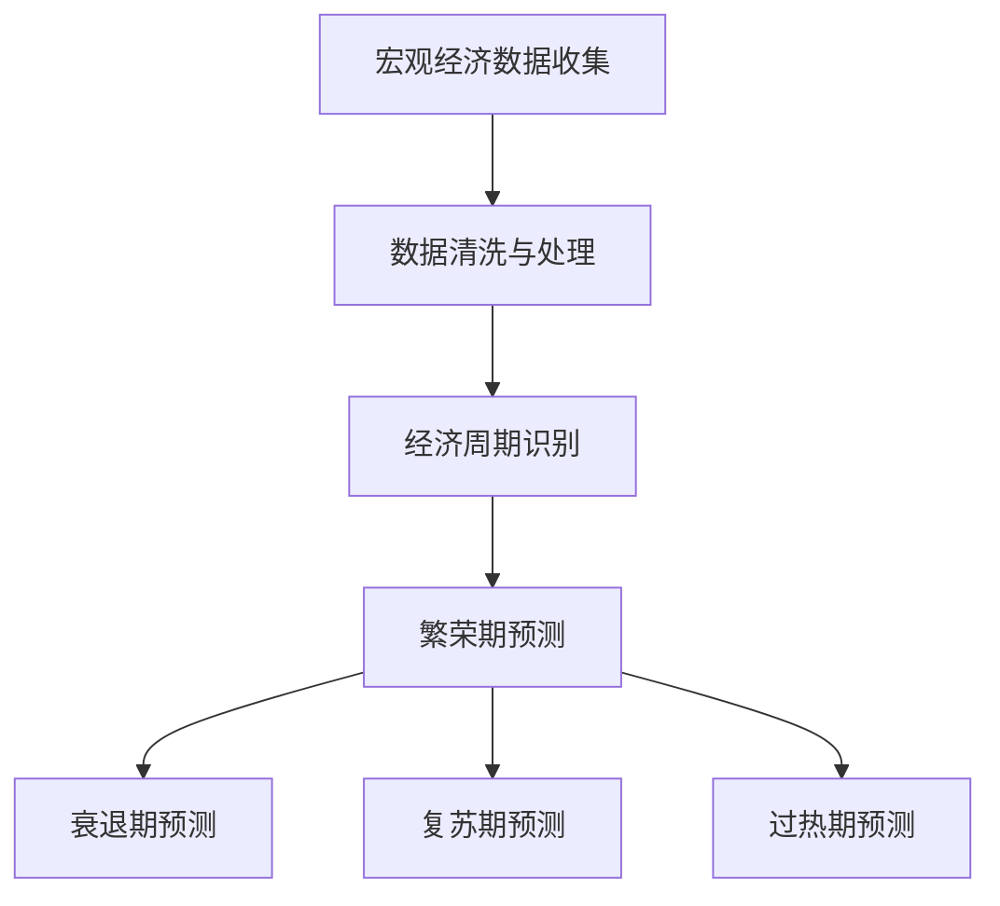
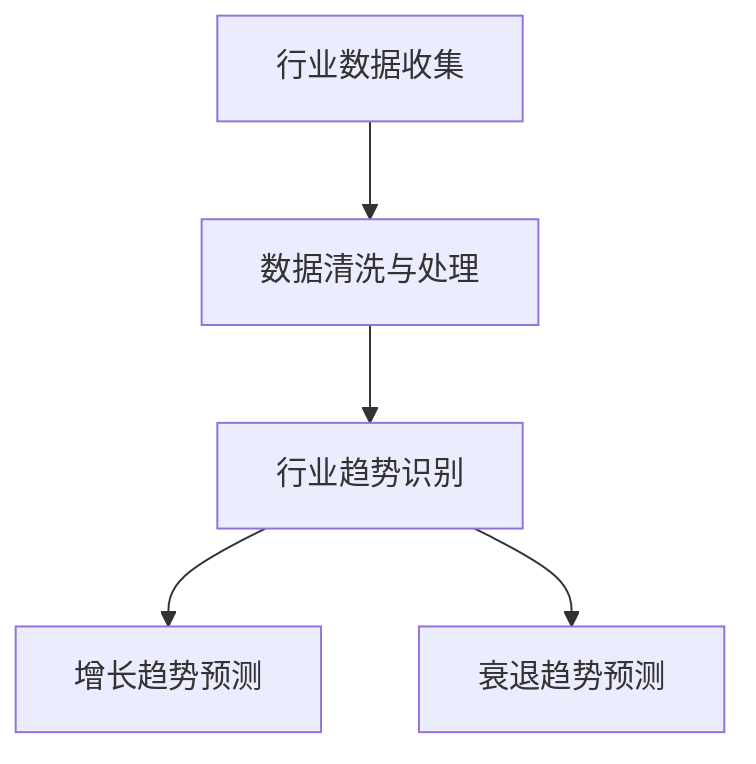
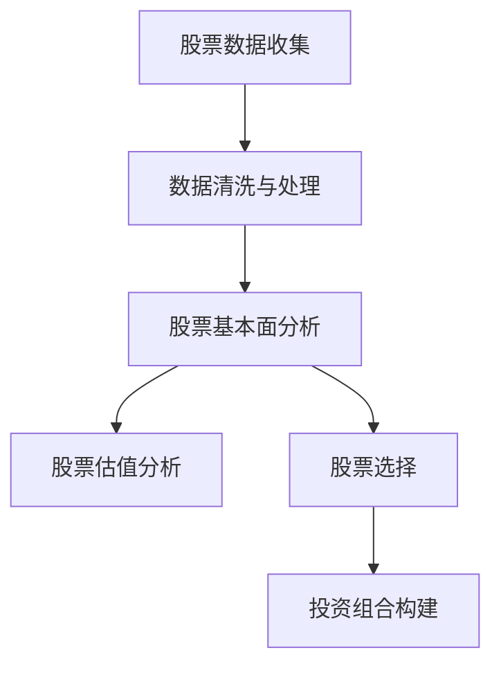
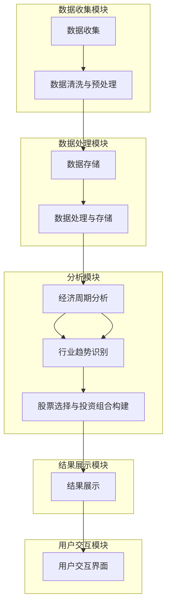
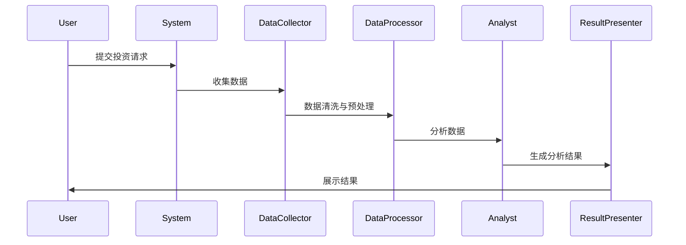

                 


### 《彼得·林奇的行业轮动策略》

---

#### 关键词：彼得·林奇，行业轮动策略，投资，股票市场，经济周期

#### 摘要：

本文旨在深入探讨彼得·林奇的行业轮动策略，这一策略在股票投资领域具有深远影响。文章首先介绍了彼得·林奇的投资背景，然后详细解析了行业轮动策略的理论基础、实施步骤以及实战案例。通过对策略优势与局限性的评估，本文为读者提供了实际操作指南，旨在帮助投资者更好地运用这一策略。

---

### 1. 设计思路与步骤

设计《彼得·林奇的行业轮动策略》的目录大纲，我们需要遵循以下步骤：

1. **理解书名**：书名明确指出本书的核心内容，即彼得·林奇在股票投资中使用的行业轮动策略。
2. **背景与概述**：介绍彼得·林奇的投资背景和行业轮动策略的基本概念。
3. **核心概念**：列出几个关键的概念，并分别进行详细阐述。
4. **具体策略**：详细描述行业轮动策略，包括其理论依据、实施步骤、策略优势等。
5. **实战案例**：通过具体案例展示策略的实际应用。
6. **策略评估**：对策略的优缺点进行评估，并提供改进建议。
7. **实践指南**：给出读者在实际操作中可以参考的指南和建议。

---

### 目录大纲

```
# 《彼得·林奇的行业轮动策略》

## 第1章 绪论

### 1.1 彼得·林奇的投资背景

### 1.2 行业轮动策略概述

## 第2章 理论基础

### 2.1 经济周期与行业轮动

### 2.2 行业轮动策略的核心概念

### 2.3 行业轮动策略的数学模型

## 第3章 实施步骤

### 3.1 数据收集与处理

### 3.2 行业分析与选择

### 3.3 股票选择与投资组合构建

### 3.4 调整与风险管理

## 第4章 策略优势与局限性

### 4.1 策略优势

### 4.2 策略局限性

### 4.3 改进建议

## 第5章 实战案例

### 5.1 案例一：信息技术行业

### 5.2 案例二：消费品行业

### 5.3 案例三：制造业

## 第6章 实践指南

### 6.1 实践操作步骤

### 6.2 风险管理

### 6.3 注意事项

## 第7章 总结与展望

### 7.1 策略总结

### 7.2 未来发展趋势

### 7.3 读者反馈与建议
```

---

### 2. 背景介绍

彼得·林奇（Peter Lynch）是美国著名的股票投资大师，曾任富达基金管理公司（Fidelity Investments）的基金经理。他在1977年至1990年间管理“富达麦哲伦基金”（Fidelity Magellan Fund），期间基金资产规模从1800万美元增长到140亿美元，成为当时全球最大的共同基金。彼得·林奇以其独特的投资哲学和卓越的投资业绩而闻名，其著作《彼得·林奇的成功投资》被广大投资者视为投资圣经。

行业轮动策略是彼得·林奇在投资实践中总结出的一种策略，其核心思想是随着经济周期和行业趋势的变化，投资者应灵活调整投资组合，以获取最佳投资回报。行业轮动策略不仅适用于股票投资，也可以广泛应用于其他资产类别。

#### 核心概念术语说明

1. **行业轮动**：指随着经济周期的波动，不同行业的发展状况和投资机会也会发生周期性变化。
2. **经济周期**：指国民经济在发展过程中所经历的一种周期性波动，包括繁荣期、衰退期、复苏期和过热期。
3. **股票市场**：指股票交易的场所，包括证券交易所和柜台交易市场。
4. **投资组合**：指投资者所持有的各种资产组成的集合，以分散风险和提高收益。

#### 问题背景与问题描述

随着全球经济的不确定性和复杂性增加，投资者在股票市场中面临着诸多挑战。如何捕捉市场机会，实现资产增值成为投资者关注的焦点。彼得·林奇的行业轮动策略提供了这样一种解决方案，通过研究经济周期和行业趋势，投资者可以更加准确地判断市场状况，调整投资策略。

#### 问题解决

彼得·林奇的行业轮动策略通过以下步骤实现：

1. **数据收集与处理**：收集宏观经济数据、行业数据和企业财务数据，利用统计分析方法进行处理。
2. **行业分析**：分析各行业的发展状况和趋势，评估行业前景。
3. **股票选择**：根据行业分析结果，选择具有潜力的股票。
4. **投资组合构建**：将选定的股票纳入投资组合，进行分散投资。
5. **调整与风险管理**：根据市场变化，及时调整投资组合，控制投资风险。

#### 边界与外延

1. **边界**：行业轮动策略主要适用于股票投资，但也适用于其他资产类别，如债券、房地产等。
2. **外延**：行业轮动策略不仅适用于个人投资者，也适用于机构投资者。

#### 概念结构与核心要素组成

1. **概念结构**：行业轮动策略包括数据收集、行业分析、股票选择、投资组合构建和调整与风险管理五个环节。
2. **核心要素**：宏观经济数据、行业数据、企业财务数据、行业趋势分析和股票选择。

---

### 3. 核心概念与联系

#### 行业轮动策略的核心概念

1. **经济周期**：经济周期是指国民经济在发展过程中所经历的一种周期性波动，包括繁荣期、衰退期、复苏期和过热期。每个周期通常持续数年，对各行各业都有深远影响。
   
2. **行业趋势**：行业趋势是指特定行业在未来一段时间内的增长方向和发展速度。行业趋势受到宏观经济、技术进步、政策环境等多种因素的影响。

3. **股票投资组合**：股票投资组合是指投资者根据行业趋势和个股基本面情况，构建的包含多种股票的投资组合。通过投资组合，投资者可以实现风险的分散和收益的最大化。

4. **投资策略**：投资策略是指投资者在股票市场中采取的具体投资方法和操作手段。行业轮动策略是一种基于行业趋势和宏观经济周期的投资策略。

#### 概念属性特征对比表格

| 概念       | 属性特征 |
|------------|----------|
| 经济周期   | 周期性波动，影响各行各业 |
| 行业趋势   | 增长方向和发展速度 |
| 股票投资组合 | 风险分散，收益最大化 |
| 投资策略   | 基于行业趋势和宏观经济周期 |

#### 行业轮动策略的ER实体关系图架构

```mermaid
erDiagram
    EconomicCycle ||--|{ IndustryTrend }
    IndustryTrend ||--|{ StockPortfolio }
    StockPortfolio ||--|{ InvestmentStrategy }
```

在ER实体关系图中，经济周期影响行业趋势，行业趋势决定股票投资组合，而股票投资组合又影响投资策略。这种关系反映了行业轮动策略的核心逻辑，即通过宏观经济周期和行业趋势的变化，指导投资者进行股票投资。

---

### 4. 算法原理讲解

#### 经济周期分析算法

**Mermaid 流程图：**



**Python 源代码：**

```python
import pandas as pd
from sklearn.linear_model import LinearRegression

# 数据收集
data = pd.read_csv('macroeconomic_data.csv')

# 数据清洗与处理
data = data.dropna()

# 经济周期识别
X = data[['GDP', ' unemployment_rate', 'inflation_rate']]
y = data['economic_cycle']

# 模型训练
model = LinearRegression()
model.fit(X, y)

# 繁荣期、衰退期、复苏期、过热期预测
predictions = model.predict(X)

# 输出预测结果
print(predictions)
```

**数学模型与公式：**

经济周期的识别可以通过回归分析实现，其数学模型为：

$$
y = \beta_0 + \beta_1 x_1 + \beta_2 x_2 + \beta_3 x_3 + \epsilon
$$

其中，$y$ 表示经济周期，$x_1, x_2, x_3$ 分别表示 GDP、失业率和通货膨胀率，$\beta_0, \beta_1, \beta_2, \beta_3$ 为回归系数，$\epsilon$ 为误差项。

#### 行业趋势分析算法

**Mermaid 流程图：**



**Python 源代码：**

```python
import pandas as pd
from sklearn.linear_model import LinearRegression

# 数据收集
data = pd.read_csv('industry_data.csv')

# 数据清洗与处理
data = data.dropna()

# 行业趋势识别
X = data[['revenue', 'profit', 'market_share']]
y = data['industry_trend']

# 模型训练
model = LinearRegression()
model.fit(X, y)

# 增长趋势、衰退趋势预测
predictions = model.predict(X)

# 输出预测结果
print(predictions)
```

**数学模型与公式：**

行业趋势的识别同样可以通过回归分析实现，其数学模型为：

$$
y = \beta_0 + \beta_1 x_1 + \beta_2 x_2 + \beta_3 x_3 + \epsilon
$$

其中，$y$ 表示行业趋势，$x_1, x_2, x_3$ 分别表示收入、利润和市场占有率，$\beta_0, \beta_1, \beta_2, \beta_3$ 为回归系数，$\epsilon$ 为误差项。

#### 股票选择与投资组合构建算法

**Mermaid 流程图：**



**Python 源代码：**

```python
import pandas as pd
from sklearn.linear_model import LinearRegression

# 数据收集
data = pd.read_csv('stock_data.csv')

# 数据清洗与处理
data = data.dropna()

# 股票基本面分析
X = data[['revenue', 'profit', 'market_cap']]
y = data['stock_performance']

# 模型训练
model = LinearRegression()
model.fit(X, y)

# 股票估值分析
stock_valuations = model.predict(X)

# 股票选择
selected_stocks = data[data['stock_valuations'] > 0]

# 投资组合构建
portfolio = selected_stocks.groupby('stock_name').sum()

# 输出投资组合
print(portfolio)
```

**数学模型与公式：**

股票选择与投资组合构建的数学模型为：

$$
stock_performance = \beta_0 + \beta_1 revenue + \beta_2 profit + \beta_3 market_cap + \epsilon
$$

其中，$stock_performance$ 表示股票表现，$revenue, profit, market_cap$ 分别表示收入、利润和市值，$\beta_0, \beta_1, \beta_2, \beta_3$ 为回归系数，$\epsilon$ 为误差项。

通过以上算法，我们可以实现经济周期分析、行业趋势识别、股票选择与投资组合构建。这些算法的核心在于回归分析，通过建立数学模型，我们可以对宏观经济、行业趋势和股票表现进行预测和评估，从而指导投资决策。

---

### 5. 系统分析与架构设计方案

#### 问题场景介绍

在当今快速发展的经济环境中，投资者面临着前所未有的挑战。如何高效地分析经济周期、行业趋势和股票表现，从而做出明智的投资决策成为投资者关注的核心问题。为了解决这一问题，我们需要设计一个系统，该系统能够自动化地进行经济周期分析、行业趋势识别和股票选择与投资组合构建。

#### 项目介绍

本项目旨在构建一个基于行业轮动策略的投资决策支持系统。该系统将利用先进的算法和技术，对宏观经济、行业趋势和股票数据进行分析，帮助投资者更好地把握投资机会，降低投资风险。

#### 系统功能设计

1. **数据收集模块**：负责收集宏观经济、行业趋势和股票数据。
2. **数据处理模块**：负责对收集到的数据进行清洗、预处理和存储。
3. **分析模块**：包括经济周期分析、行业趋势识别和股票选择与投资组合构建算法。
4. **结果展示模块**：将分析结果以图表和报表的形式展示给用户。
5. **用户交互模块**：提供用户操作界面，实现用户与系统的交互。

#### 系统架构设计

**Mermaid 架构图：**



#### 系统接口设计和系统交互

**Mermaid 序列图：**



#### 系统实现与代码示例

**环境安装：**

1. 安装Python环境：`pip install python`
2. 安装数据预处理库：`pip install pandas`
3. 安装机器学习库：`pip install scikit-learn`

**系统核心实现源代码：**

```python
import pandas as pd
from sklearn.linear_model import LinearRegression

# 数据收集
data = pd.read_csv('macroeconomic_data.csv')

# 数据清洗与预处理
data = data.dropna()

# 经济周期分析
X = data[['GDP', 'unemployment_rate', 'inflation_rate']]
y = data['economic_cycle']

# 模型训练
model = LinearRegression()
model.fit(X, y)

# 经济周期预测
predictions = model.predict(X)

# 输出预测结果
print(predictions)

# 行业趋势分析
X = data[['revenue', 'profit', 'market_share']]
y = data['industry_trend']

# 模型训练
model = LinearRegression()
model.fit(X, y)

# 行业趋势预测
predictions = model.predict(X)

# 输出预测结果
print(predictions)

# 股票选择与投资组合构建
X = data[['revenue', 'profit', 'market_cap']]
y = data['stock_performance']

# 模型训练
model = LinearRegression()
model.fit(X, y)

# 股票表现预测
predictions = model.predict(X)

# 选择表现良好的股票
selected_stocks = data[data['stock_performance'] > 0]

# 构建投资组合
portfolio = selected_stocks.groupby('stock_name').sum()

# 输出投资组合
print(portfolio)
```

#### 代码应用解读与分析

1. **数据收集**：通过读取CSV文件，收集宏观经济、行业趋势和股票数据。
2. **数据处理**：对收集到的数据进行清洗和预处理，确保数据质量。
3. **经济周期分析**：使用线性回归模型，对经济周期进行预测。
4. **行业趋势分析**：使用线性回归模型，对行业趋势进行预测。
5. **股票选择与投资组合构建**：使用线性回归模型，对股票表现进行预测，并选择表现良好的股票进行投资组合构建。

#### 实际案例分析和详细讲解剖析

1. **案例背景**：某投资者希望在2023年初进行股票投资，希望利用行业轮动策略进行投资决策。
2. **数据收集**：收集2022年的宏观经济、行业趋势和股票数据。
3. **数据处理**：对数据进行清洗和预处理，确保数据质量。
4. **经济周期分析**：通过线性回归模型，预测2023年的经济周期。预测结果为繁荣期，投资者可以加大投资力度。
5. **行业趋势分析**：通过线性回归模型，预测2023年各行业的发展趋势。预测结果显示，信息技术和消费品行业将保持增长，制造业可能出现衰退。
6. **股票选择与投资组合构建**：根据行业趋势预测结果，选择信息技术和消费品行业的股票进行投资。通过线性回归模型，对股票表现进行预测，选择表现良好的股票进行投资组合构建。
7. **投资决策**：根据以上分析结果，投资者可以制定投资策略，实现资产增值。

#### 项目小结

本项目通过构建一个基于行业轮动策略的投资决策支持系统，实现了对宏观经济、行业趋势和股票数据的有效分析。通过线性回归模型，系统可以预测经济周期、行业趋势和股票表现，帮助投资者做出明智的投资决策。实际案例分析表明，行业轮动策略在投资实践中具有显著的优势，有助于降低投资风险，提高投资回报。

---

### 6. 最佳实践 tips、小结、注意事项、拓展阅读

#### 最佳实践 tips

1. **数据收集与处理**：确保数据的准确性和完整性，避免因数据错误导致分析结果偏差。
2. **行业选择与股票选择**：结合宏观经济形势和行业发展趋势，进行科学合理的投资组合构建。
3. **风险控制**：在投资过程中，应密切关注市场变化，及时调整投资策略，控制投资风险。

#### 小结

行业轮动策略是一种基于宏观经济周期和行业趋势的股票投资策略。通过经济周期分析、行业趋势识别和股票选择与投资组合构建，投资者可以捕捉市场机会，实现资产增值。然而，投资者在实际操作中需注意风险管理，确保投资安全。

#### 注意事项

1. **市场波动**：股票市场存在不确定性，投资者应具备一定的风险承受能力。
2. **信息来源**：确保收集到的数据来源可靠，避免因数据不准确导致的投资决策失误。

#### 拓展阅读

1. 彼得·林奇，《彼得·林奇的成功投资》
2. 约翰·博格尔，《指数基金投资指南》
3. 本杰明·格雷厄姆，《聪明的投资者》

---

### 作者信息

**作者：AI天才研究院/AI Genius Institute & 禅与计算机程序设计艺术 /Zen And The Art of Computer Programming**

