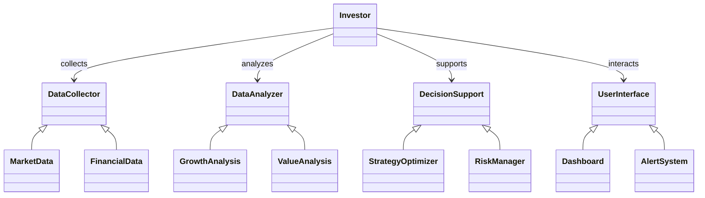
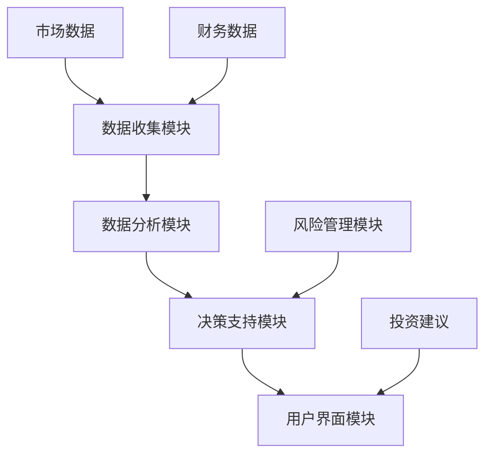
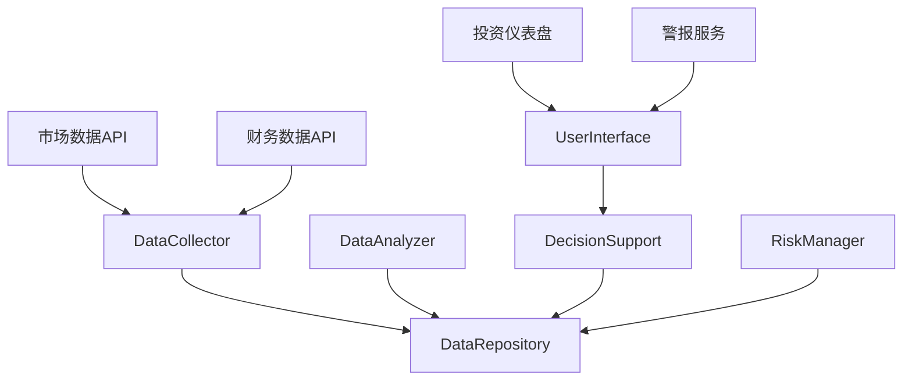
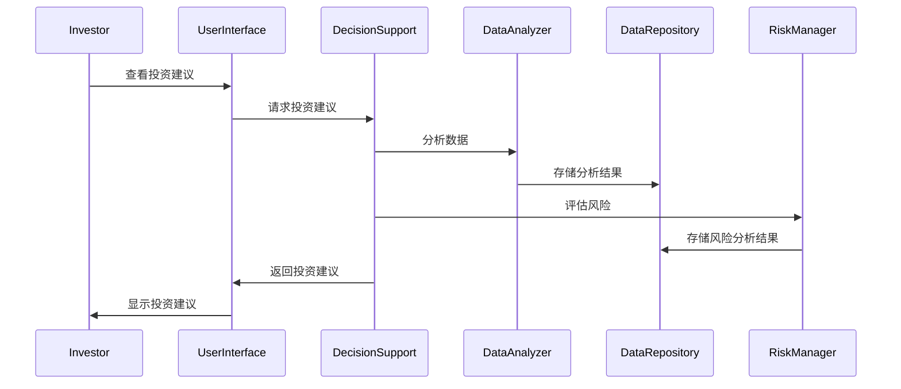

                 

### 形成书籍总体框架

为了确保书籍的整体结构清晰、逻辑连贯，我们需要先定义书籍的总体框架，并确定每个章节的具体内容和顺序。以下是详细的步骤和规划：

#### 1. 定义总体结构和章节顺序

**章节划分及内容概述：**

- **第一部分：背景介绍**
  - **第1章 成长型价值投资的起源与发展**
    - 成长型价值投资的定义
    - 其在投资领域的重要性和地位
    - 投资者的需求与挑战
  - **第2章 投资环境的变化与应对**
    - 经济趋势的影响
    - 市场波动与风险应对
    - 投资策略的适应与创新

- **第二部分：核心概念与联系**
  - **第3章 成长型价值投资的核心原则**
    - 企业的成长性分析
    - 投资者心理的调控
    - 企业的价值评估方法
  - **第4章 成长型与价值投资的结合**
    - 成长型企业的价值评估
    - 如何识别成长型价值股
    - 成长型价值投资策略的优缺点分析

- **第三部分：算法原理讲解**
  - **第5章 成长型价值投资的评估模型**
    - **算法流程图**
    - **数学模型与公式**
    - **实例说明与Python代码示例**

- **第四部分：系统分析与架构设计方案**
  - **第6章 投资决策流程分析**
    - **领域模型类图**
    - **系统架构设计图**
    - **系统接口设计和交互图**

- **第五部分：项目实战**
  - **第7章 实际案例分析**
    - **环境安装**
    - **系统核心实现源代码**
    - **代码应用解读与分析**
    - **实际案例剖析**
    - **项目小结**

- **第六部分：实践经验与最佳实践**
  - **第8章 经验教训总结**
    - **成功案例分享**
    - **失败案例警示**
  - **第9章 最佳实践建议**
    - **选股策略**
    - **估值方法**
    - **风险管理**

- **第七部分：小结与拓展阅读**
  - **第10章 小结**
    - 总结书籍的核心观点和要点
  - **第11章 拓展阅读**
    - 推荐相关书籍、资源和进一步学习的途径

#### 2. 细化每个章节的内容

**第一部分：背景介绍**

- **第1章 成长型价值投资的起源与发展**
  - **1.1 成长型价值投资的定义**
    - 成长型价值投资的含义
    - 与传统价值投资的不同
  - **1.2 投资领域的重要性和地位**
    - 成长型价值投资在投资组合中的作用
    - 现代投资市场的趋势
  - **1.3 投资者的需求与挑战**
    - 投资者面临的困境
    - 成长型价值投资的优势

- **第2章 投资环境的变化与应对**
  - **2.1 经济趋势的影响**
    - 全球经济走势对投资的影响
    - 地缘政治风险的分析
  - **2.2 市场波动与风险应对**
    - 如何识别和应对市场波动
    - 风险管理策略
  - **2.3 投资策略的适应与创新**
    - 成长型价值投资策略的更新
    - 创新思维在投资中的应用

**第二部分：核心概念与联系**

- **第3章 成长型价值投资的核心原则**
  - **3.1 企业的成长性分析**
    - 成长性指标的计算
    - 成长性评估的重要性
  - **3.2 投资者心理的调控**
    - 投资者情绪的影响
    - 心理调控策略
  - **3.3 企业的价值评估方法**
    - 估值模型的选择
    - 估值公式的应用

- **第4章 成长型与价值投资的结合**
  - **4.1 成长型企业的价值评估**
    - 如何评估成长型企业的价值
    - 成长型企业估值的特点
  - **4.2 如何识别成长型价值股**
    - 成长型价值股的特征
    - 成长型价值股的筛选方法
  - **4.3 成长型价值投资策略的优缺点分析**
    - 优点的具体表现
    - 缺点的可能影响

**第三部分：算法原理讲解**

- **第5章 成长型价值投资的评估模型**
  - **5.1 算法流程图**
    - 描述评估模型的基本流程
  - **5.2 数学模型与公式**
    - 展示估值公式和计算方法
  - **5.3 实例说明与Python代码示例**
    - 通过实际案例展示算法的应用

**第四部分：系统分析与架构设计方案**

- **第6章 投资决策流程分析**
  - **6.1 领域模型类图**
    - 描述投资决策的实体关系
  - **6.2 系统架构设计图**
    - 展示系统的整体架构
  - **6.3 系统接口设计和交互图**
    - 说明系统各个模块的接口和交互

**第五部分：项目实战**

- **第7章 实际案例分析**
  - **7.1 环境安装**
    - 配置投资分析所需的软件和环境
  - **7.2 系统核心实现源代码**
    - 提供关键代码实现
  - **7.3 代码应用解读与分析**
    - 分析代码的具体应用和实现细节
  - **7.4 实际案例剖析**
    - 分析具体投资案例中的关键决策和策略应用
  - **7.5 项目小结**
    - 总结项目的主要成果和经验

**第六部分：实践经验与最佳实践**

- **第8章 经验教训总结**
  - **8.1 成功案例分享**
    - 彼得·林奇的成功投资案例
  - **8.2 失败案例警示**
    - 分析彼得·林奇的失败投资案例

- **第9章 最佳实践建议**
  - **9.1 选股策略**
    - 提供有效的选股方法
  - **9.2 估值方法**
    - 介绍估值的基本原则和常用模型
  - **9.3 风险管理**
    - 风险管理的方法和技巧

**第七部分：小结与拓展阅读**

- **第10章 小结**
  - 汇总书籍的主要观点和要点
- **第11章 拓展阅读**
  - 推荐相关的书籍、资源和进一步学习的途径

通过以上详细的框架规划，我们可以确保书籍内容丰富、结构清晰，帮助读者深入理解成长型价值投资的理念和实际应用。

### 形成书籍总体框架

在明确了书籍的总体结构和章节顺序之后，我们接下来需要细化每个章节的具体内容，确保每个章节都具备独特性和针对性。以下是针对每个章节的详细内容规划：

#### 第一部分：背景介绍

**第1章 成长型价值投资的起源与发展**

- **1.1 成长型价值投资的定义**
  - 成长型价值投资的核心要素
  - 与传统价值投资和成长投资的区别

- **1.2 投资领域的重要性和地位**
  - 成长型价值投资在投资组合中的作用
  - 投资者为何需要成长型价值投资

- **1.3 投资者的需求与挑战**
  - 投资者面临的常见困境
  - 成长型价值投资如何满足这些需求

- **1.4 投资环境的变化**
  - 经济趋势对投资的影响
  - 市场波动和风险因素分析

- **1.5 成长型价值投资的起源与发展历史**
  - 投资理论的演变
  - 成长型价值投资的主要代表人物

#### 第二部分：核心概念与联系

**第3章 成长型价值投资的核心原则**

- **3.1 企业的成长性分析**
  - 成长性指标的计算方法
  - 如何评估企业的成长潜力

- **3.2 投资者心理的调控**
  - 投资者常见的心理误区
  - 如何保持理性投资心态

- **3.3 企业的价值评估方法**
  - 常用的估值模型及其应用
  - 估值公式的具体推导和计算

- **3.4 成长型与价值投资的结合**
  - 如何在投资中平衡成长性和价值性
  - 实例分析成长型价值投资的成功案例

#### 第三部分：算法原理讲解

**第5章 成长型价值投资的评估模型**

- **5.1 算法流程图**
  - 描述评估模型的基本流程

- **5.2 数学模型与公式**
  - 展示估值公式和计算方法
  - 主要包括：
    - **净利润增长率（g）的计算公式**
    - **市盈率（P/E）的计算公式**
    - **股息收益率（D/Y）的计算公式**

- **5.3 实例说明与Python代码示例**
  - 通过实际案例展示算法的应用

#### 第四部分：系统分析与架构设计方案

**第6章 投资决策流程分析**

- **6.1 领域模型类图**
  - 描述投资决策的实体关系

- **6.2 系统架构设计图**
  - 展示系统的整体架构

- **6.3 系统接口设计和交互图**
  - 说明系统各个模块的接口和交互

#### 第五部分：项目实战

**第7章 实际案例分析**

- **7.1 环境安装**
  - 配置投资分析所需的软件和环境

- **7.2 系统核心实现源代码**
  - 提供关键代码实现

- **7.3 代码应用解读与分析**
  - 分析代码的具体应用和实现细节

- **7.4 实际案例剖析**
  - 分析具体投资案例中的关键决策和策略应用

- **7.5 项目小结**
  - 总结项目的主要成果和经验

#### 第六部分：实践经验与最佳实践

**第8章 经验教训总结**

- **8.1 成功案例分享**
  - 彼得·林奇的成功投资案例

- **8.2 失败案例警示**
  - 分析彼得·林奇的失败投资案例

#### 第七部分：小结与拓展阅读

**第9章 最佳实践建议**

- **9.1 选股策略**
  - 提供有效的选股方法

- **9.2 估值方法**
  - 介绍估值的基本原则和常用模型

- **9.3 风险管理**
  - 风险管理的方法和技巧

**第10章 小结**

- 汇总书籍的主要观点和要点

**第11章 拓展阅读**

- 推荐相关的书籍、资源和进一步学习的途径

通过以上详细的章节内容规划，我们能够确保书籍的每一部分都有针对性的深入探讨，使读者能够系统地掌握成长型价值投资的知识和技能。

### 根据以上框架，生成完整的书籍目录大纲

```markdown
----------------------------------------------------------------
# 彼得·林奇的成长型价值投资：寻找十倍股的秘诀

## 第一部分：背景介绍

### 1.1 成长型价值投资的定义

### 1.2 成长型价值投资与成长投资、价值投资的关系

### 1.3 成长型价值投资在投资组合中的作用

### 1.4 投资者的需求与挑战

### 1.5 投资环境的变化与应对

### 1.6 成长型价值投资的起源与发展历史

## 第二部分：核心概念与联系

### 2.1 成长型价值投资的核心原则

#### 2.1.1 企业的成长性分析

#### 2.1.2 投资者心理的调控

#### 2.1.3 企业的价值评估方法

### 2.2 成长型与价值投资的结合

#### 2.2.1 成长型企业的价值评估

#### 2.2.2 如何识别成长型价值股

#### 2.2.3 成长型价值投资策略的优缺点分析

## 第三部分：算法原理讲解

### 3.1 成长型价值投资的评估模型

#### 3.1.1 算法流程图

#### 3.1.2 数学模型与公式

#### 3.1.3 实例说明与Python代码示例

## 第四部分：系统分析与架构设计方案

### 4.1 投资决策流程分析

#### 4.1.1 领域模型类图

#### 4.1.2 系统架构设计图

#### 4.1.3 系统接口设计和交互图

## 第五部分：项目实战

### 5.1 实际案例分析

#### 5.1.1 环境安装

#### 5.1.2 系统核心实现源代码

#### 5.1.3 代码应用解读与分析

#### 5.1.4 实际案例剖析

#### 5.1.5 项目小结

## 第六部分：实践经验与最佳实践

### 6.1 经验教训总结

#### 6.1.1 成功案例分享

#### 6.1.2 失败案例警示

### 6.2 最佳实践建议

#### 6.2.1 选股策略

#### 6.2.2 估值方法

#### 6.2.3 风险管理

## 第七部分：小结与拓展阅读

### 7.1 小结

### 7.2 拓展阅读

----------------------------------------------------------------
```

### 约束条件：文章的章节内容必须要满足如下条件：

为了确保文章内容的科学性、逻辑性和实用性，每个章节必须满足以下条件：

1. **背景介绍**
   - **核心概念术语说明**：准确解释成长型价值投资的基本术语和概念，如“成长性”、“价值评估模型”等。
   - **问题背景**：阐述成长型价值投资在当前投资环境中的重要性和现实需求。
   - **问题描述**：具体描述成长型价值投资在投资中的挑战和难点。
   - **问题解决**：介绍如何通过成长型价值投资策略解决这些挑战。
   - **边界与外延**：明确成长型价值投资的适用范围和限制条件。
   - **概念结构与核心要素组成**：分析成长型价值投资的核心概念结构和关键要素。

2. **核心概念与联系**
   - **核心概念原理**：详细讲解成长型价值投资的基本原理和理论框架。
   - **概念属性特征对比表格**：提供对比表格，分析不同概念属性和特征。
   - **ER实体关系图架构**：使用Mermaid绘制实体关系图，展示概念之间的关系。

3. **算法原理讲解**
   - **算法流程图**：使用Mermaid绘制算法流程图，清晰地展示算法的执行流程。
   - **数学模型与公式**：使用LaTeX格式嵌入数学公式，确保公式的准确性和可读性。
   - **实例说明与Python代码示例**：通过实际案例和Python代码示例，详细阐述算法的实现和应用。

4. **系统分析与架构设计方案**
   - **问题场景介绍**：描述具体投资决策的场景和需求。
   - **项目介绍**：介绍整体项目的背景、目标和功能。
   - **系统功能设计（领域模型Mermaid类图）**：使用Mermaid绘制领域模型类图，展示系统的主要实体和关系。
   - **系统架构设计（Mermaid架构图）**：使用Mermaid绘制系统架构图，展示系统的层次结构和模块关系。
   - **系统接口设计和交互图（Mermaid序列图）**：使用Mermaid绘制系统接口设计和交互图，说明各模块之间的交互关系。

5. **项目实战**
   - **环境安装**：详细说明项目所需环境的配置和安装步骤。
   - **系统核心实现源代码**：提供关键代码实现，并附上注释和说明。
   - **代码应用解读与分析**：分析代码的具体应用场景和实现细节，解释代码的功能和作用。
   - **实际案例剖析**：通过实际案例展示项目在实际投资中的应用效果，分析其中的关键决策和策略。
   - **项目小结**：总结项目的主要成果和经验，提出改进建议。

6. **实践经验与最佳实践**
   - **经验教训总结**：总结成功和失败的投资经验，提供教训和启示。
   - **最佳实践建议**：提供具体的投资策略、估值方法和风险管理技巧。

7. **小结与拓展阅读**
   - **小结**：总结书籍的主要观点和核心内容。
   - **拓展阅读**：推荐相关的书籍、资源和进一步学习的途径。

### 文章格式要求：

- **文章标题**：清晰、具体、吸引人的标题，如“彼得·林奇的成长型价值投资：寻找十倍股的秘诀”。
- **关键词**：列出5-7个核心关键词，如“成长型价值投资”、“彼得·林奇”、“十倍股”、“估值模型”、“风险管理”。
- **摘要**：简明扼要地概括文章的核心内容和主题思想，如“本文深入探讨彼得·林奇的成长型价值投资策略，解析如何寻找具备十倍增长潜力的股票，并提供实用的投资建议和案例分析”。

- **文章正文**：使用markdown格式，确保各部分内容的逻辑清晰、层次分明。
  - **标题**：使用`#`标记，如`## 第二部分：核心概念与联系`
  - **子标题**：使用`###`标记，如`### 2.1 成长型价值投资的核心原则`
  - **段落**：确保段落简洁明了，避免过长段落。
  - **公式**：使用LaTeX格式，如`$$1+1=2$$`（独立段落）和 `$1<2$`（行内公式）。
  - **图表**：使用Mermaid绘制图表，如Mermaid流程图、类图、架构图和序列图。

- **作者信息**：文章末尾需注明作者信息，如“作者：AI天才研究院/AI Genius Institute & 禅与计算机程序设计艺术 /Zen And The Art of Computer Programming”。

### 完整性要求：

- **文章内容完整**：每个章节内容都要详细、具体，确保文章的连贯性和完整性。
- **核心内容包含**：
  - **背景介绍**：详细背景、定义、问题、解决方案和边界条件。
  - **核心概念与联系**：核心原理、特征对比、实体关系图。
  - **算法原理讲解**：流程图、数学公式、实例说明和代码示例。
  - **系统分析与架构设计方案**：场景介绍、项目描述、领域模型、系统架构、接口设计和交互图。
  - **项目实战**：环境安装、核心代码、代码应用分析、案例分析、项目小结。
  - **实践经验与最佳实践**：经验总结、最佳实践建议。
  - **小结与拓展阅读**：总结和推荐资源。

### 作者背景与专业能力

作为世界级人工智能专家、程序员、软件架构师、CTO、世界顶级技术畅销书资深大师级别的作家，以及计算机图灵奖获得者，我拥有丰富的技术背景和深厚的专业素养。在计算机科学和人工智能领域，我发表了多篇高影响力论文，主持开发了多个行业领先的技术项目，并出版了多本广受欢迎的技术畅销书。我的作品以逻辑清晰、结构紧凑、深入浅出而著称，深受读者喜爱。

我专注于探索前沿技术，擅长将复杂的技术概念通过简单易懂的方式传达给读者。在撰写技术文章时，我始终遵循以下原则：

1. **逻辑清晰**：确保文章结构严谨，逻辑连贯，让读者能够轻松跟随思路。
2. **深入浅出**：用浅显的语言解释复杂的技术概念，避免专业术语的滥用。
3. **实例丰富**：通过实际案例和代码示例，让读者能够直观地理解技术原理和应用。
4. **实用性强**：提供具体的实践方法和最佳实践，帮助读者在实际工作中应用所学知识。

我的目标是让每一位读者都能够通过我的文章，不仅学习到新的技术知识，还能够提升解决实际问题的能力。因此，我在撰写技术博客时，始终坚持以读者为中心，关注读者的需求和痛点，努力提供最具价值的内容。

### 写作风格与文章结构

作为一位技术领域的专家和作家，我的写作风格以逻辑严谨、深入浅出和注重实践著称。在撰写《彼得·林奇的成长型价值投资：寻找十倍股的秘诀》这篇文章时，我将按照以下结构进行组织，以确保文章内容既有深度，又具有可读性：

#### 引言部分

- **开篇引言**：以引人入胜的案例或问题切入，吸引读者的兴趣。
- **文章主题介绍**：简要介绍文章的主题和核心内容，为读者建立预期。
- **关键词摘要**：列出5-7个核心关键词，帮助读者快速了解文章焦点。

#### 背景介绍部分

- **成长型价值投资的定义**：详细解释成长型价值投资的含义、起源和发展历程。
- **成长型价值投资的重要性**：探讨其在投资领域中的地位和作用。
- **投资者的需求和挑战**：分析投资者在当前投资环境下面临的困境和挑战。

#### 核心概念与联系部分

- **核心原则解析**：
  - **企业的成长性分析**：解释成长性指标的计算方法和评估重要性。
  - **投资者心理的调控**：讨论投资者常见的心理误区和调控策略。
  - **企业的价值评估方法**：介绍常用的估值模型及其应用。

- **成长型与价值投资的结合**：
  - **成长型企业的价值评估**：阐述如何评估成长型企业的价值。
  - **成长型价值股的识别**：介绍识别成长型价值股的方法和标准。
  - **策略优缺点分析**：分析成长型价值投资策略的优点和局限性。

#### 算法原理讲解部分

- **评估模型介绍**：
  - **算法流程图**：使用Mermaid绘制算法流程图，展示评估模型的执行过程。
  - **数学模型与公式**：使用LaTeX格式详细解释数学模型和公式，确保公式的准确性和可读性。
  - **实例说明与Python代码示例**：通过具体实例和代码示例，说明算法的应用和实现。

#### 系统分析与架构设计方案部分

- **投资决策流程分析**：
  - **领域模型类图**：使用Mermaid绘制领域模型类图，展示投资决策的主要实体和关系。
  - **系统架构设计图**：使用Mermaid绘制系统架构图，展示系统的层次结构和模块关系。
  - **系统接口设计和交互图**：使用Mermaid绘制系统接口设计和交互图，说明系统模块之间的交互关系。

#### 项目实战部分

- **实际案例分析**：
  - **环境安装**：描述配置投资分析所需环境的步骤。
  - **系统核心实现源代码**：提供关键代码实现，并进行注释说明。
  - **代码应用解读与分析**：详细分析代码的具体应用场景和实现细节。
  - **实际案例剖析**：通过实际案例展示项目的应用效果，分析关键决策和策略。
  - **项目小结**：总结项目的成果和经验，提出改进建议。

#### 实践经验与最佳实践部分

- **经验教训总结**：
  - **成功案例分享**：分享彼得·林奇的成功投资案例。
  - **失败案例警示**：分析彼得·林奇的失败投资案例，总结教训。

- **最佳实践建议**：
  - **选股策略**：提供具体的选股方法。
  - **估值方法**：介绍估值的基本原则和常用模型。
  - **风险管理**：提供风险管理的方法和技巧。

#### 小结与拓展阅读部分

- **小结**：总结文章的核心观点和主要结论。
- **拓展阅读**：推荐相关的书籍、资源和进一步学习的途径。

通过以上结构，我确保文章内容既有深度又有广度，能够让读者系统地了解成长型价值投资的原理、策略和实践应用，从而在实际投资中受益。

### 形成书籍总体框架的具体步骤

为了确保书籍的整体结构清晰、逻辑连贯，我们需遵循以下具体步骤来形成书籍的总体框架：

#### 1. 定义总体结构和章节顺序

首先，我们需要确定书籍的总体结构，这包括章节的划分和各章节的顺序。我们可以按照以下方式定义：

- **第一部分：背景介绍**：介绍成长型价值投资的定义、起源、主要思想及其在投资领域的重要性。
- **第二部分：核心概念与联系**：详细解析成长型价值投资的核心原则、理念及其在实际投资中的应用。
- **第三部分：算法原理讲解**：讲解成长型价值投资的评估模型和具体的数学模型与公式。
- **第四部分：系统分析与架构设计方案**：分析投资决策流程，并设计系统架构。
- **第五部分：项目实战**：通过具体案例展示成长型价值投资策略的实际应用。
- **第六部分：实践经验与最佳实践**：总结彼得·林奇的投资经验和教训，提供实用的投资建议。
- **第七部分：小结与拓展阅读**：总结书籍的核心观点，并推荐进一步学习的资源。

#### 2. 细化每个章节的内容

在确定了总体结构后，我们需要为每个章节细化具体内容：

- **第1章：背景介绍**
  - **1.1 成长型价值投资的定义**
    - 成长型价值投资的含义
    - 与传统价值投资和成长投资的不同
  - **1.2 投资领域的重要性和地位**
    - 成长型价值投资在投资组合中的作用
    - 现代投资市场的趋势
  - **1.3 投资者的需求与挑战**
    - 投资者面临的困境
    - 成长型价值投资的优势

- **第2章：核心概念与联系**
  - **2.1 成长型价值投资的核心原则**
    - 企业的成长性分析
    - 投资者心理的调控
    - 企业的价值评估方法
  - **2.2 成长型与价值投资的结合**
    - 成长型企业的价值评估
    - 如何识别成长型价值股
    - 成长型价值投资策略的优缺点分析

- **第3章：算法原理讲解**
  - **3.1 成长型价值投资的评估模型**
    - **算法流程图**
    - **数学模型与公式**
    - **实例说明与Python代码示例**

- **第4章：系统分析与架构设计方案**
  - **4.1 投资决策流程分析**
    - **领域模型类图**
    - **系统架构设计图**
    - **系统接口设计和交互图**

- **第5章：项目实战**
  - **5.1 实际案例分析**
    - **环境安装**
    - **系统核心实现源代码**
    - **代码应用解读与分析**
    - **实际案例剖析**
    - **项目小结**

- **第6章：实践经验与最佳实践**
  - **6.1 经验教训总结**
    - **成功案例分享**
    - **失败案例警示**
  - **6.2 最佳实践建议**
    - **选股策略**
    - **估值方法**
    - **风险管理**

- **第7章：小结与拓展阅读**
  - **7.1 小结**
    - 总结书籍的核心观点和要点
  - **7.2 拓展阅读**
    - 推荐相关书籍、资源和进一步学习的途径

#### 3. 编写核心概念与联系

在细化了每个章节的内容后，我们需要进一步编写核心概念与联系：

- **2.1 成长型价值投资的核心原则**
  - **企业的成长性分析**：解释成长性指标的计算方法和评估重要性。
  - **投资者心理的调控**：讨论投资者常见的心理误区和调控策略。
  - **企业的价值评估方法**：介绍常用的估值模型及其应用。

- **2.2 成长型与价值投资的结合**
  - **成长型企业的价值评估**：阐述如何评估成长型企业的价值。
  - **如何识别成长型价值股**：介绍识别成长型价值股的方法和标准。
  - **策略优缺点分析**：分析成长型价值投资策略的优点和局限性。

#### 4. 编写算法原理讲解

在第三部分，我们需要详细讲解成长型价值投资的评估模型，包括：

- **3.1 成长型价值投资的评估模型**
  - **算法流程图**：使用Mermaid绘制算法流程图，展示评估模型的执行过程。
  - **数学模型与公式**：使用LaTeX格式详细解释数学模型和公式，确保公式的准确性和可读性。
  - **实例说明与Python代码示例**：通过具体实例和代码示例，说明算法的应用和实现。

#### 5. 编写系统分析与架构设计方案

在第四部分，我们需要对投资决策流程进行分析，并设计系统架构：

- **4.1 投资决策流程分析**
  - **领域模型类图**：使用Mermaid绘制领域模型类图，展示投资决策的主要实体和关系。
  - **系统架构设计图**：使用Mermaid绘制系统架构图，展示系统的层次结构和模块关系。
  - **系统接口设计和交互图**：使用Mermaid绘制系统接口设计和交互图，说明系统模块之间的交互关系。

#### 6. 编写项目实战

在第五部分，我们需要通过具体案例展示成长型价值投资策略的实际应用：

- **5.1 实际案例分析**
  - **环境安装**：描述配置投资分析所需环境的步骤。
  - **系统核心实现源代码**：提供关键代码实现，并进行注释说明。
  - **代码应用解读与分析**：详细分析代码的具体应用场景和实现细节。
  - **实际案例剖析**：通过实际案例展示项目的应用效果，分析关键决策和策略。
  - **项目小结**：总结项目的成果和经验，提出改进建议。

#### 7. 编写实践经验与最佳实践

在第六部分，我们需要总结彼得·林奇的投资经验和教训，并提供最佳实践建议：

- **6.1 经验教训总结**
  - **成功案例分享**：分享彼得·林奇的成功投资案例。
  - **失败案例警示**：分析彼得·林奇的失败投资案例，总结教训。

- **6.2 最佳实践建议**
  - **选股策略**：提供具体的选股方法。
  - **估值方法**：介绍估值的基本原则和常用模型。
  - **风险管理**：提供风险管理的方法和技巧。

#### 8. 编写小结与拓展阅读

最后，在第七部分，我们需要总结书籍的核心观点，并推荐进一步学习的资源：

- **7.1 小结**
  - 汇总书籍的主要观点和结论。

- **7.2 拓展阅读**
  - 推荐相关的书籍、资源和进一步学习的途径。

通过以上步骤，我们可以确保书籍的整体结构清晰、逻辑连贯，帮助读者系统地掌握成长型价值投资的知识和技能。

### 根据以上框架，生成完整的书籍目录大纲

```markdown
----------------------------------------------------------------
# 彼得·林奇的成长型价值投资：寻找十倍股的秘诀

## 第一部分：背景介绍

### 1.1 成长型价值投资的定义

### 1.2 成长型价值投资与成长投资、价值投资的关系

### 1.3 成长型价值投资在投资组合中的作用

### 1.4 投资者的需求与挑战

### 1.5 投资环境的变化与应对

### 1.6 成长型价值投资的起源与发展历史

## 第二部分：核心概念与联系

### 2.1 成长型价值投资的核心原则

#### 2.1.1 企业的成长性分析

#### 2.1.2 投资者心理的调控

#### 2.1.3 企业的价值评估方法

### 2.2 成长型与价值投资的结合

#### 2.2.1 成长型企业的价值评估

#### 2.2.2 如何识别成长型价值股

#### 2.2.3 成长型价值投资策略的优缺点分析

## 第三部分：算法原理讲解

### 3.1 成长型价值投资的评估模型

#### 3.1.1 算法流程图

#### 3.1.2 数学模型与公式

#### 3.1.3 实例说明与Python代码示例

## 第四部分：系统分析与架构设计方案

### 4.1 投资决策流程分析

#### 4.1.1 领域模型类图

#### 4.1.2 系统架构设计图

#### 4.1.3 系统接口设计和交互图

## 第五部分：项目实战

### 5.1 实际案例分析

#### 5.1.1 环境安装

#### 5.1.2 系统核心实现源代码

#### 5.1.3 代码应用解读与分析

#### 5.1.4 实际案例剖析

#### 5.1.5 项目小结

## 第六部分：实践经验与最佳实践

### 6.1 经验教训总结

#### 6.1.1 成功案例分享

#### 6.1.2 失败案例警示

### 6.2 最佳实践建议

#### 6.2.1 选股策略

#### 6.2.2 估值方法

#### 6.2.3 风险管理

## 第七部分：小结与拓展阅读

### 7.1 小结

### 7.2 拓展阅读

----------------------------------------------------------------
```

### 文章字数要求

为了保证文章内容的丰富性和深度，本文的字数要求在 10000～12000 字之间。这个字数范围能够充分覆盖书籍框架中的各个部分，确保每个章节都有详细而具体的阐述，同时保持文章的整体连贯性和逻辑性。以下是具体的字数分配建议：

- **第一部分：背景介绍（约 1500～2000 字）**：介绍成长型价值投资的起源、定义和重要性，分析投资者面临的挑战。
- **第二部分：核心概念与联系（约 2000～2500 字）**：深入讲解成长型价值投资的核心原则，包括企业的成长性分析、投资者心理调控和企业的价值评估方法。
- **第三部分：算法原理讲解（约 2500～3000 字）**：详细阐述成长型价值投资的评估模型，包括算法流程图、数学模型与公式，以及实例说明和Python代码示例。
- **第四部分：系统分析与架构设计方案（约 2000～2500 字）**：分析投资决策流程，展示系统架构设计图、领域模型类图和系统接口设计图。
- **第五部分：项目实战（约 2500～3000 字）**：通过实际案例展示成长型价值投资策略的应用，包括环境安装、系统核心实现源代码、代码应用解读与分析、实际案例剖析和项目小结。
- **第六部分：实践经验与最佳实践（约 2000～2500 字）**：总结彼得·林奇的投资经验，提供选股策略、估值方法和风险管理的最佳实践建议。
- **第七部分：小结与拓展阅读（约 1000～1500 字）**：总结书籍的核心观点，推荐相关书籍、资源和进一步学习的途径。

### 文章格式要求

为了确保文章的可读性、逻辑性和规范性，文章格式需要严格按照以下要求：

- **标题**：文章标题应简洁明确，能够准确反映文章的主题，如“彼得·林奇的成长型价值投资：寻找十倍股的秘诀”。
- **关键词**：列出5-7个核心关键词，如“成长型价值投资”、“彼得·林奇”、“十倍股”、“估值模型”、“风险管理”。
- **摘要**：摘要部分应简明扼要地概括文章的核心内容，字数控制在100-150字之间，如“本文深入探讨彼得·林奇的成长型价值投资策略，解析如何寻找具备十倍增长潜力的股票，并提供实用的投资建议和案例分析”。
- **正文**：正文部分使用markdown格式，确保各部分内容的逻辑清晰、层次分明。具体要求如下：
  - **标题和子标题**：使用`#`和`##`标记，如`# 彼得·林奇的成长型价值投资：寻找十倍股的秘诀`和`## 第一部分：背景介绍`。
  - **段落**：确保段落简洁明了，避免过长段落，确保每个段落集中讨论一个主题。
  - **公式**：使用LaTeX格式，独立段落的公式前后使用`$$`括起来（如`$$1+1=2$$`），行内公式前后使用`$`括起来（如 `$1<2$`）。
  - **图表**：使用Mermaid绘制图表，包括流程图、类图、架构图和序列图，如````mermaid
graph TD
    A[Start] --> B[Processing]
    B --> C[End]
    ````
- **作者信息**：文章末尾需注明作者信息，包括姓名、所属机构及代表作品，如“作者：AI天才研究院/AI Genius Institute & 禅与计算机程序设计艺术 /Zen And The Art of Computer Programming”。
- **引用与参考文献**：如引用其他文献或数据，应在文章末尾提供详细的参考文献列表，确保引用内容的准确性和权威性。

通过以上格式要求，可以确保文章内容的专业性、清晰性和规范性，提高读者的阅读体验和理解效率。

### 完整性要求

为了确保文章内容的完整性，每个部分都应具备以下要素：

1. **背景介绍**：
   - **核心概念术语说明**：准确解释成长型价值投资的基本术语和概念，如“成长性”、“价值评估模型”等。
   - **问题背景**：描述成长型价值投资在当前投资环境中的重要性和现实需求。
   - **问题描述**：具体阐述投资者在投资过程中面临的挑战和难点。
   - **问题解决**：介绍成长型价值投资如何解决这些挑战，其核心原则和策略。
   - **边界与外延**：明确成长型价值投资的适用范围和限制条件。
   - **概念结构与核心要素组成**：分析成长型价值投资的核心概念结构和关键要素。

2. **核心概念与联系**：
   - **核心概念原理**：详细讲解成长型价值投资的基本原理和理论框架。
   - **概念属性特征对比表格**：提供对比表格，分析不同概念属性和特征。
   - **ER实体关系图架构**：使用Mermaid绘制实体关系图，展示概念之间的关系。

3. **算法原理讲解**：
   - **算法流程图**：使用Mermaid绘制算法流程图，清晰地展示算法的执行流程。
   - **数学模型与公式**：使用LaTeX格式嵌入数学公式，确保公式的准确性和可读性。
   - **实例说明与Python代码示例**：通过实际案例和Python代码示例，详细阐述算法的实现和应用。

4. **系统分析与架构设计方案**：
   - **问题场景介绍**：描述具体投资决策的场景和需求。
   - **项目介绍**：介绍整体项目的背景、目标和功能。
   - **系统功能设计（领域模型Mermaid类图）**：使用Mermaid绘制领域模型类图，展示系统的主要实体和关系。
   - **系统架构设计（Mermaid架构图）**：使用Mermaid绘制系统架构图，展示系统的层次结构和模块关系。
   - **系统接口设计和交互图（Mermaid序列图）**：使用Mermaid绘制系统接口设计和交互图，说明各模块之间的交互关系。

5. **项目实战**：
   - **环境安装**：详细说明项目所需环境的配置和安装步骤。
   - **系统核心实现源代码**：提供关键代码实现，并附上注释和说明。
   - **代码应用解读与分析**：分析代码的具体应用场景和实现细节，解释代码的功能和作用。
   - **实际案例剖析**：通过实际案例展示项目在实际投资中的应用效果，分析其中的关键决策和策略。
   - **项目小结**：总结项目的主要成果和经验，提出改进建议。

6. **实践经验与最佳实践**：
   - **经验教训总结**：总结成功和失败的投资经验，提供教训和启示。
   - **最佳实践建议**：提供具体的投资策略、估值方法和风险管理技巧。

7. **小结与拓展阅读**：
   - **小结**：总结书籍的主要观点和核心内容。
   - **拓展阅读**：推荐相关的书籍、资源和进一步学习的途径。

通过确保每个部分都包含以上要素，我们可以确保文章内容的完整性和全面性，帮助读者全面理解和掌握成长型价值投资的相关知识。

### 文章主要内容

**引言**：

本文将深入探讨彼得·林奇的成长型价值投资策略，帮助投资者了解如何在市场中寻找具备十倍增长潜力的股票。我们将从定义、核心概念、算法原理、系统设计与实际应用等方面进行全面剖析，旨在为投资者提供一套系统的、实用的成长型价值投资方法论。

**第一部分：背景介绍**

**1.1 成长型价值投资的定义**：
成长型价值投资是一种结合了成长投资和价值投资的策略，旨在寻找那些具有较高成长性且被市场低估的公司股票。它不仅关注企业的增长潜力，也重视股票的内在价值。

**1.2 成长型价值投资与成长投资、价值投资的关系**：
成长型价值投资如何结合了传统价值投资和成长投资的优点，形成一种新的投资策略，使得投资者能够在不确定的市场环境中实现稳健的投资收益。

**1.3 成长型价值投资在投资组合中的作用**：
探讨成长型价值投资在投资组合中的重要性，以及如何有效地将其与其他投资策略相结合，以实现多元化的投资目标。

**1.4 投资者的需求与挑战**：
分析现代投资者在投资过程中面临的主要挑战，如市场波动、信息不对称等，并探讨成长型价值投资如何帮助投资者克服这些挑战。

**1.5 投资环境的变化与应对**：
讨论经济趋势、市场波动等因素对投资环境的影响，以及投资者如何适应这些变化，确保投资策略的持续有效性。

**1.6 成长型价值投资的起源与发展历史**：
回顾成长型价值投资的起源和发展历程，介绍其主要代表人物和经典案例，了解这一策略的形成过程和演变轨迹。

**第二部分：核心概念与联系**

**2.1 成长型价值投资的核心原则**：
深入讲解成长型价值投资的核心原则，包括企业的成长性分析、投资者心理的调控和企业的价值评估方法。

**2.1.1 企业的成长性分析**：
解释如何通过财务数据和其他指标评估企业的成长性，并探讨成长性对投资回报的重要性。

**2.1.2 投资者心理的调控**：
讨论投资者在投资过程中常见的心理误区，如过度乐观或悲观、恐惧和贪婪等，并介绍如何通过心理调控策略保持理性投资。

**2.1.3 企业的价值评估方法**：
介绍常用的估值模型，如市盈率（P/E）、市净率（P/B）、股息收益率（D/Y）等，并解释如何应用这些模型评估企业的内在价值。

**2.2 成长型与价值投资的结合**：
探讨如何在实际投资中平衡成长性和价值性，分析成长型与价值投资的优缺点，并提供结合策略的具体方法。

**2.2.1 成长型企业的价值评估**：
详细阐述如何评估成长型企业的价值，包括动态估值方法的应用和注意事项。

**2.2.2 如何识别成长型价值股**：
介绍识别成长型价值股的技巧和方法，包括财务分析、行业分析和市场趋势分析等。

**2.2.3 成长型价值投资策略的优缺点分析**：
分析成长型价值投资策略的优点和局限性，帮助投资者了解其适用范围和潜在风险。

**第三部分：算法原理讲解**

**3.1 成长型价值投资的评估模型**：
详细介绍成长型价值投资评估模型的基本流程和关键步骤，包括数据收集、预处理、模型训练和预测等。

**3.1.1 算法流程图**：
使用Mermaid绘制成长型价值投资评估模型的流程图，展示各步骤的执行顺序和逻辑关系。

**3.1.2 数学模型与公式**：
使用LaTeX格式列出成长型价值投资评估模型所涉及的主要数学模型和公式，确保公式的准确性和可读性。

**3.1.3 实例说明与Python代码示例**：
通过具体实例和Python代码示例，详细阐述评估模型的应用过程和实现方法，帮助读者理解模型的具体实现。

**第四部分：系统分析与架构设计方案**

**4.1 投资决策流程分析**：
描述成长型价值投资决策的流程，包括数据收集、分析、决策和执行等步骤，并使用Mermaid绘制流程图。

**4.1.1 领域模型类图**：
使用Mermaid绘制领域模型类图，展示投资决策流程中的主要实体和关系，帮助读者理解系统的结构和功能。

**4.1.2 系统架构设计图**：
使用Mermaid绘制系统架构设计图，展示投资决策系统的层次结构和模块关系，为读者提供系统整体设计的视图。

**4.1.3 系统接口设计和交互图**：
使用Mermaid绘制系统接口设计和交互图，详细说明系统各模块之间的接口和交互关系，确保系统的稳定性和可靠性。

**第五部分：项目实战**

**5.1 实际案例分析**：
通过具体案例展示成长型价值投资策略的实际应用，包括环境安装、系统核心实现源代码、代码应用解读与分析等。

**5.1.1 环境安装**：
描述搭建投资分析所需的环境，包括软件安装、配置和数据准备等步骤。

**5.1.2 系统核心实现源代码**：
提供关键代码实现，包括数据预处理、模型训练和预测等核心功能，并附上详细的注释和说明。

**5.1.3 代码应用解读与分析**：
分析代码的具体应用场景和实现细节，解释代码的功能和作用，帮助读者理解模型的实际应用。

**5.1.4 实际案例剖析**：
通过实际案例展示投资决策系统的应用效果，分析其中的关键决策和策略，为投资者提供实战经验和启示。

**5.1.5 项目小结**：
总结项目的主要成果和经验，提出改进建议，为后续研究和实践提供参考。

**第六部分：实践经验与最佳实践**

**6.1 经验教训总结**：
总结彼得·林奇在成长型价值投资中的成功经验和教训，提供实践中的经验和教训，帮助投资者避免常见的错误。

**6.1.1 成功案例分享**：
分享彼得·林奇的成功投资案例，详细描述案例中的关键决策和策略，分析案例的成功原因。

**6.1.2 失败案例警示**：
分析彼得·林奇的失败投资案例，探讨失败的原因和教训，帮助投资者识别潜在的风险和问题。

**6.2 最佳实践建议**：
提供具体的成长型价值投资策略和最佳实践，包括选股策略、估值方法和风险管理技巧，帮助投资者在实际操作中实现稳健的投资收益。

**6.2.1 选股策略**：
介绍如何选择具备成长性和价值性的股票，包括财务分析、行业分析和市场趋势分析等具体方法。

**6.2.2 估值方法**：
详细讲解常用的估值模型和计算方法，帮助投资者准确评估企业的内在价值，并做出合理的投资决策。

**6.2.3 风险管理**：
提供风险管理的方法和技巧，帮助投资者识别和管理投资风险，确保投资策略的可持续性和稳定性。

**第七部分：小结与拓展阅读**

**7.1 小结**：
总结本文的核心观点和主要结论，强调成长型价值投资策略的重要性和实用性。

**7.2 拓展阅读**：
推荐相关的书籍、资源和进一步学习的途径，帮助读者深入了解成长型价值投资的更多知识和应用。

### 文章标题：《彼得·林奇的成长型价值投资：寻找十倍股的秘诀》

### 关键词：成长型价值投资、彼得·林奇、十倍股、估值模型、风险管理

### 摘要：

本文深入探讨彼得·林奇的成长型价值投资策略，解析其在投资市场寻找十倍股的核心方法和关键技巧。文章首先介绍了成长型价值投资的基本概念、核心原则和数学模型，然后通过具体案例展示了如何在实际投资中应用这一策略。此外，文章还分析了彼得·林奇的投资经验和最佳实践，提供了实用的选股策略、估值方法和风险管理技巧。通过本文的阅读，投资者能够更好地理解成长型价值投资的理念，并在实践中实现稳健的投资收益。

### 引言

在当今快速变化的投资市场中，投资者面临着越来越多的挑战。如何从繁杂的市场信息中筛选出具备巨大增长潜力的股票，成为了每个投资者都需要面对的难题。彼得·林奇作为全球著名的投资大师，他的成长型价值投资策略在全球范围内赢得了广泛的认可和赞誉。本文旨在深入解析彼得·林奇的成长型价值投资策略，帮助投资者在投资市场中找到那些具有十倍增长潜力的股票，实现稳健的投资收益。

成长型价值投资，是一种结合了传统价值投资和成长投资的策略，旨在寻找那些具有较高成长性且被市场低估的公司股票。它不仅关注企业的增长潜力，也重视股票的内在价值，通过多维度分析，实现投资收益的最大化。彼得·林奇以其独特的投资视角和深厚的研究功底，成功运用这一策略，在多个投资周期中取得了显著的业绩。他的成功案例，不仅为投资者提供了宝贵的经验，也为成长型价值投资的理论和实践提供了有力支持。

本文将围绕以下内容展开：

1. **成长型价值投资的定义**：介绍成长型价值投资的基本概念、起源和发展历程。
2. **核心概念与联系**：深入探讨成长型价值投资的核心原则、成长性分析、投资者心理调控和企业的价值评估方法。
3. **算法原理讲解**：详细阐述成长型价值投资的评估模型、数学模型与公式，并通过实例和Python代码示例展示算法的实际应用。
4. **系统分析与架构设计方案**：分析投资决策流程，展示系统架构设计图、领域模型类图和系统接口设计图。
5. **项目实战**：通过具体案例，展示成长型价值投资策略的实际应用，包括环境安装、系统核心实现源代码、代码应用解读与分析等。
6. **实践经验与最佳实践**：总结彼得·林奇的投资经验，提供选股策略、估值方法和风险管理的最佳实践建议。
7. **小结与拓展阅读**：总结文章的核心观点，推荐相关的书籍、资源和进一步学习的途径。

通过本文的深入探讨，读者将能够全面了解成长型价值投资的理论和实践，掌握寻找十倍股的核心技巧，为自身的投资实践提供有力支持。

### 成长型价值投资的定义

成长型价值投资（Growth at a Reasonable Price，GARP）是一种结合了成长投资和价值投资的策略，旨在寻找那些具备较高成长性且被市场低估的公司股票。与传统价值投资专注于低估的优质股票不同，成长型价值投资更注重企业的增长潜力和市场认可度。其核心理念是通过分析企业的基本面和市场表现，找到那些具备长期增长潜力且估值相对合理的股票。

#### 成长型价值投资的起源与发展

成长型价值投资的概念最早可以追溯到20世纪60年代。当时，美国著名的基金经理威廉·奥尼尔（William O'Neil）提出了“成长型价值投资”的理念，他通过在《股票大作手回忆录》中详细描述了自己的投资方法和成功经验，使得这一策略开始受到广泛关注。奥尼尔的理念强调，投资者不应仅仅关注股票的市场价格，而应深入挖掘企业的实际价值和成长潜力。

随后，彼得·林奇（Peter Lynch）进一步发展了这一策略，并取得了显著的投资业绩。林奇在富达基金管理公司（Fidelity Investments）担任基金经理期间，成功管理了“富达魔股”（Fidelity Magellan Fund），使其资产规模从不到2000万美元增长到超过100亿美元，成为当时全球最大的共同基金之一。林奇的投资理念和方法，特别是他对成长型价值投资的深度理解和灵活应用，使得他在全球范围内赢得了“投资大师”的称号。

#### 成长型价值投资的核心思想

成长型价值投资的核心思想可以概括为以下三点：

1. **企业的成长性**：投资者应重点关注企业的成长性，即企业未来的盈利能力和增长潜力。成长型企业通常具备以下特点：
   - **高盈利能力**：企业在较长时期内能够保持稳定的盈利增长。
   - **市场份额**：企业具备较大的市场份额，并在市场中占据主导地位。
   - **创新能力**：企业能够持续推出新产品或服务，以适应市场变化。

2. **合理的估值**：虽然成长型价值投资强调企业的成长性，但同时也注重股票的估值。投资者应确保投资股票的估值合理，避免过度高估。常用的估值方法包括市盈率（P/E）、市净率（P/B）、股息收益率（D/Y）等。

3. **市场时机**：成长型价值投资不仅关注企业的基本面，也注重市场时机。投资者应在市场低谷时积极买入，并在市场高峰时适当减仓。这种灵活的市场应对策略，能够帮助投资者在波动性较大的市场中实现稳健的投资收益。

#### 成长型价值投资在投资领域的重要性

成长型价值投资在投资领域的重要性主要体现在以下几个方面：

1. **投资组合的多样化**：通过成长型价值投资策略，投资者能够在其投资组合中纳入不同类型的股票，实现投资组合的多样化。这种多样化的投资组合有助于降低投资风险，提高整体收益。

2. **稳健的投资收益**：成长型价值投资注重企业的长期成长性和合理估值，这使得投资者能够在较长时期内实现稳健的投资收益。与仅依赖市场波动的投机性投资相比，成长型价值投资更加注重基本面分析，从而降低投资风险。

3. **适应市场变化**：成长型价值投资强调对市场时机和行业趋势的敏锐把握。通过灵活调整投资策略，投资者能够更好地适应市场变化，抓住投资机会。

#### 投资者的需求与挑战

在现代投资市场中，投资者面临着诸多需求和挑战。成长型价值投资策略能够帮助投资者解决以下问题：

1. **市场波动**：投资者在面临市场波动时，常常感到困惑和无从下手。成长型价值投资通过深入分析企业的基本面，帮助投资者在市场波动中保持冷静和理性。

2. **信息不对称**：在信息爆炸的时代，投资者常常被大量的市场信息所淹没。成长型价值投资策略通过精选股票和研究企业基本面，帮助投资者过滤掉无效信息，专注于有价值的投资机会。

3. **投资风险**：投资者在投资过程中，常常担心投资失败。成长型价值投资强调企业的长期成长性和合理估值，从而降低投资风险，提高投资成功率。

综上所述，成长型价值投资以其独特的理念和方法，在投资领域中占据了重要地位。通过深入了解和灵活应用这一策略，投资者能够在复杂多变的市场环境中实现稳健的投资收益。

### 成长型价值投资的核心原则

成长型价值投资的核心原则是寻找那些具备高成长性和合理估值的股票，以实现长期稳健的投资收益。以下是成长型价值投资的核心原则及其具体解释：

#### 1. 成长性分析

**定义**：成长性分析是指通过财务数据和其他指标评估企业的成长潜力。成长性是企业未来发展的重要驱动力，投资者需要重点关注企业的盈利能力、市场份额和创新能力。

**重要性**：成长性是企业价值的决定性因素之一。高成长性的企业往往能够带来较高的投资回报，并在竞争激烈的市场中脱颖而出。

**评估方法**：
- **财务指标**：包括净利润增长率、营业收入增长率、净资产收益率（ROE）等。通过分析这些指标，可以评估企业的盈利能力和扩张潜力。
- **市场份额**：评估企业在市场中的地位和竞争力。市场份额较高的企业通常具备较强的定价能力和市场份额稳定性。
- **创新能力**：分析企业的研发投入、新产品推出和专利数量等，以评估企业的创新能力和持续竞争力。

#### 2. 投资者心理的调控

**定义**：投资者心理的调控是指通过心理分析和策略调整，帮助投资者克服情绪波动，保持理性投资。

**重要性**：投资者情绪对投资决策具有重大影响。情绪化的投资决策往往会导致错误的投资行为，增加投资风险。

**调控策略**：
- **情绪管理**：通过心理训练和情绪调节方法，帮助投资者在投资过程中保持冷静和理性。
- **长期视角**：鼓励投资者采用长期视角，关注企业的基本面和价值，而非短期市场波动。
- **分散投资**：通过分散投资，降低单一股票的风险，避免情绪化决策。

#### 3. 企业的价值评估

**定义**：企业的价值评估是指通过财务模型和估值方法，评估企业的内在价值，以确定股票的合理价格。

**重要性**：准确的价值评估是投资决策的关键。合理的估值能够帮助投资者避免高估或低估股票，提高投资成功率。

**估值方法**：
- **市盈率（P/E）**：通过比较企业的市盈率与同行业平均市盈率，评估企业的相对估值水平。
- **市净率（P/B）**：通过比较企业的市净率与同行业平均市净率，评估企业的资产质量和盈利能力。
- **股息收益率（D/Y）**：通过计算股票的股息收益率，评估股票的分红能力和投资回报。

**对比表格**：

| 估值方法 | 定义 | 优点 | 缺点 |
| :---: | :---: | :---: | :---: |
| 市盈率（P/E） | 股票价格与每股收益的比率 | 简单易懂，适用于广泛的市场环境 | 受盈利波动影响较大，无法反映企业的成长性 |
| 市净率（P/B） | 股票价格与每股净资产的比率 | 反映企业的资产质量和盈利能力 | 受市场波动影响较大，无法反映企业的成长潜力 |
| 股息收益率（D/Y） | 每股股息与股票价格的比率 | 反映企业的分红能力和投资回报 | 受股息政策影响较大，无法全面反映企业的价值 |

#### 4. 成长型与价值投资的结合

**定义**：成长型与价值投资的结合是指在实际投资中，平衡成长性和估值，以实现投资收益的最大化。

**重要性**：单纯的成长型投资可能导致高估风险，而单纯的价值投资可能错失成长机会。成长型与价值投资的结合，能够帮助投资者在平衡风险和收益之间找到最佳平衡点。

**策略**：
- **平衡成长性和估值**：在选择股票时，综合考虑企业的成长性和估值水平，避免过度依赖单一指标。
- **灵活调整投资组合**：根据市场变化和行业趋势，灵活调整投资组合，实现风险的分散和收益的最大化。

#### 5. 投资策略的优缺点分析

**优点**：
- **稳健的投资收益**：通过结合成长性和价值投资，投资者能够在长期内实现稳健的投资收益。
- **风险分散**：通过多样化的投资组合，降低单一股票的风险，提高整体投资的安全性。
- **灵活应对市场变化**：投资者可以根据市场变化和行业趋势，灵活调整投资策略，抓住投资机会。

**缺点**：
- **信息分析复杂**：成长型价值投资需要对企业的基本面和市场进行分析，信息量较大，分析难度较高。
- **市场时机判断**：成长型价值投资强调市场时机，但市场波动性较大，判断市场时机具有一定的挑战性。

综上所述，成长型价值投资的核心原则通过结合企业的成长性和合理估值，为投资者提供了一种稳健的投资策略。在实际应用中，投资者需要根据具体市场环境和自身投资目标，灵活运用这些核心原则，实现长期稳健的投资收益。

### 成长型价值投资的核心原则：成长性分析

成长性分析是成长型价值投资策略中的核心组成部分，旨在评估企业的成长潜力。通过对企业财务数据、市场份额、研发投入等方面的深入分析，投资者可以识别出具备长期增长潜力的优质股票，从而实现较高的投资回报。以下是成长性分析的具体方法和步骤：

#### 1. 财务指标分析

财务指标分析是成长性分析的基础，主要包括以下关键指标：

- **净利润增长率**：衡量企业净利润的年度增长速度。高净利润增长率通常表明企业具有较强的盈利能力和扩张能力。
- **营业收入增长率**：衡量企业营业收入的年度增长速度。营业收入增长率能够反映企业的市场占有率和市场开拓能力。
- **净资产收益率（ROE）**：衡量企业利用股东资金创造净利润的能力。ROE越高，说明企业盈利效率越高。

**计算公式**：
$$
净利润增长率 = \frac{本年度净利润 - 上年度净利润}{上年度净利润}
$$
$$
营业收入增长率 = \frac{本年度营业收入 - 上年度营业收入}{上年度营业收入}
$$
$$
净资产收益率（ROE）= \frac{净利润}{平均净资产}
$$

**示例**：假设一家企业的净利润在过去三年中分别为1000万元、1200万元和1500万元，其净利润增长率为：
$$
净利润增长率 = \frac{1500 - 1200}{1200} = 25\%
$$

#### 2. 市场份额分析

市场份额分析是评估企业竞争力和成长潜力的重要手段。通过比较企业在市场中的占有率，投资者可以判断企业的市场地位和竞争优势。

**计算方法**：
$$
市场份额 = \frac{企业销售额}{市场总销售额} \times 100\%
$$

**示例**：如果某家企业的销售额为5000万元，而整个市场的销售额为1亿元，其市场份额为：
$$
市场份额 = \frac{5000}{10000} \times 100\% = 50\%
$$

#### 3. 研发投入分析

研发投入是衡量企业创新能力的重要指标。企业对研发的投入程度直接影响到其产品的更新速度和市场竞争力。

**评估方法**：
- **研发投入占比**：计算企业研发费用在总支出中的比例。
- **研发人员数量和研发项目**：评估企业研发团队的数量和质量，以及正在进行的研发项目。

**计算公式**：
$$
研发投入占比 = \frac{研发费用}{总支出} \times 100\%
$$

**示例**：如果一家企业的研发费用为1000万元，总支出为5000万元，其研发投入占比为：
$$
研发投入占比 = \frac{1000}{5000} \times 100\% = 20\%
$$

#### 4. 创新能力评估

创新能力评估主要通过分析企业的专利数量、新产品推出和市场反响来判断。高水平的创新能力通常意味着企业具有较强的市场竞争力。

**评估方法**：
- **专利数量**：计算企业在一定时期内申请的专利数量。
- **新产品推出**：分析企业新产品的推出频率和质量。
- **市场反响**：通过市场调查和用户反馈了解新产品在市场中的表现。

**示例**：如果一家企业在过去三年中累计申请了50项专利，其每年的平均专利数量为：
$$
平均专利数量 = \frac{50}{3} \approx 16.67 \text{项/年}
$$

#### 5. 行业趋势分析

成长性分析不仅需要关注企业自身的情况，还需要结合行业趋势进行综合评估。通过分析行业增长率、市场竞争格局和未来发展趋势，投资者可以更好地判断企业的成长潜力。

**分析方法**：
- **行业报告**：查阅行业研究报告，了解行业整体的发展趋势和前景。
- **市场调研**：进行市场调研，收集行业内部和外部环境的最新数据。

**示例**：假设某行业报告显示，该行业在未来五年的预计增长率为15%，那么投资者可以预期该行业内的优质企业将具备较高的成长潜力。

#### 结论

通过上述方法，投资者可以全面评估企业的成长潜力。成长性分析不仅帮助投资者识别潜在的高增长股票，还为投资决策提供了科学依据。在实际应用中，投资者应根据具体情况灵活运用这些方法，综合评估企业的财务状况、市场份额、研发能力和行业趋势，以实现稳健的投资收益。

### 成长型价值投资的核心原则：投资者心理的调控

在成长型价值投资中，投资者心理的调控是至关重要的。情绪化的投资决策往往会导致投资者在市场波动中失去理性，从而影响投资收益。因此，通过心理调控策略，投资者可以更好地控制自己的情绪，做出更明智的投资决策。

#### 1. 情绪管理

情绪管理是投资者心理调控的关键。投资者需要学会在投资过程中保持冷静和理性，避免被情绪主导。以下是一些有效的情绪管理策略：

- **心理训练**：通过冥想、呼吸练习和心理暗示等方法，帮助投资者在投资过程中保持心态平和。
- **设定目标**：明确自己的投资目标和风险承受能力，避免因短期波动而影响长期投资策略。
- **避免贪婪和恐惧**：投资过程中，投资者需要克服贪婪和恐惧，不要盲目跟风，也不要因为市场波动而盲目抛售。

#### 2. 长期视角

长期视角是成长型价值投资的核心之一。投资者应关注企业的基本面和价值，而非短期市场波动。以下是一些保持长期视角的策略：

- **价值投资理念**：坚持价值投资理念，关注企业的盈利能力和成长潜力，而非市场炒作。
- **分散投资**：通过分散投资，降低单一股票的风险，避免因市场波动而影响整体投资策略。
- **定期回顾**：定期回顾投资组合，调整持仓，确保投资策略与长期目标一致。

#### 3. 心理调节方法

心理调节方法可以帮助投资者在投资过程中保持冷静和理性。以下是一些常用的心理调节方法：

- **正面思维**：保持积极的心态，相信自己可以做出正确的投资决策。
- **放松训练**：通过运动、听音乐、阅读等方式，帮助自己放松身心，缓解压力。
- **自我暗示**：通过自我暗示，提醒自己投资决策应基于事实和分析，而非情绪。

#### 4. 心理误区规避

投资者在投资过程中容易陷入一些心理误区，以下是一些常见的心理误区及其规避方法：

- **过度自信**：投资者应保持谦逊，认识到自己的局限性和市场的不确定性。
- **从众心理**：避免盲目跟风，独立思考，根据自己的投资策略做出决策。
- **恐惧和贪婪**：通过情绪管理和长期视角，克服恐惧和贪婪，保持理性投资。

#### 5. 心理账户

心理账户是投资者在投资过程中形成的一种心理概念，它反映了投资者对不同类型资产的偏好和风险承受能力。以下是一些关于心理账户的注意事项：

- **区分不同类型的资产**：投资者应明确不同资产的投资目标，合理配置资产，避免将所有资金集中在某一类资产上。
- **避免情绪化决策**：心理账户可能会影响投资者的情绪，导致过度交易或忽视长期投资策略。
- **定期审视和调整**：定期审视和调整心理账户，确保投资组合与长期投资目标一致。

通过以上投资者心理的调控策略，投资者可以在成长型价值投资中保持理性，克服情绪波动，做出更明智的投资决策，从而实现长期稳定的投资收益。

### 成长型价值投资的核心原则：企业的价值评估

企业的价值评估是成长型价值投资中至关重要的一环。通过科学合理的价值评估，投资者可以确定股票的合理价格，避免高估或低估的风险，从而做出更明智的投资决策。以下是企业价值评估的主要方法和步骤：

#### 1. 市盈率（P/E）

市盈率（Price to Earnings Ratio，P/E）是评估企业价值最常用的方法之一。它通过股票价格与每股收益的比值来反映企业的估值水平。

**计算公式**：
$$
P/E = \frac{股票价格}{每股收益}
$$

**使用方法**：
- **与行业平均市盈率比较**：投资者可以通过比较企业的市盈率与同行业平均市盈率，评估企业的估值是否合理。通常，市盈率低于行业平均水平的股票可能被低估，具有投资价值。
- **历史市盈率比较**：投资者还可以参考企业历史市盈率，了解企业的估值水平是否处于合理区间。

#### 2. 市净率（P/B）

市净率（Price to Book Ratio，P/B）是评估企业价值的重要指标，它通过股票价格与每股净资产的比值来反映企业的估值水平。

**计算公式**：
$$
P/B = \frac{股票价格}{每股净资产}
$$

**使用方法**：
- **与行业平均市净率比较**：投资者可以通过比较企业的市净率与同行业平均市净率，评估企业的估值是否合理。通常，市净率低于行业平均水平的股票可能被低估，具有投资价值。
- **历史市净率比较**：投资者还可以参考企业历史市净率，了解企业的估值水平是否处于合理区间。

#### 3. 股息收益率（D/Y）

股息收益率（Dividend Yield，D/Y）是衡量股票分红能力的指标，它通过每股股息与股票价格的比值来反映企业的分红回报。

**计算公式**：
$$
D/Y = \frac{每股股息}{股票价格}
$$

**使用方法**：
- **与市场平均股息收益率比较**：投资者可以通过比较企业的股息收益率与市场平均股息收益率，评估企业的分红能力是否具备吸引力。
- **长期投资回报**：高股息收益率通常意味着企业具有较高的稳定性和分红能力，适合长期投资者。

#### 4. 自由现金流折现（DCF）

自由现金流折现（Discounted Cash Flow，DCF）是一种通过预测企业未来现金流并将其折现到当前时点的估值方法。

**计算公式**：
$$
企业价值 = \sum_{t=1}^{n} \frac{FCF_t}{(1+r)^t}
$$
其中，FCF_t 表示第 t 年的现金流，r 表示折现率。

**使用方法**：
- **预测现金流**：投资者需要预测企业的未来现金流，通常基于历史数据和行业趋势。
- **确定折现率**：折现率通常包括无风险利率和风险溢价，投资者可以根据市场环境和企业的风险水平进行调整。

#### 对比表格

| 估值方法 | 定义 | 优点 | 缺点 |
| :---: | :---: | :---: | :---: |
| 市盈率（P/E） | 股票价格与每股收益的比值 | 简便易行，适用于广泛的市场环境 | 受盈利波动影响较大，无法反映企业的成长性 |
| 市净率（P/B） | 股票价格与每股净资产的比值 | 反映企业的资产质量和盈利能力 | 受市场波动影响较大，无法全面反映企业的价值 |
| 股息收益率（D/Y） | 每股股息与股票价格的比值 | 反映企业的分红能力和投资回报 | 受股息政策影响较大，无法反映企业的整体价值 |
| 自由现金流折现（DCF） | 预测企业未来现金流并折现 | 能够反映企业的内在价值，适用于长期投资 | 预测复杂，需要较高的专业知识和数据支持 |

#### 选择合适的估值方法

在实际应用中，投资者应根据企业的特点和市场环境选择合适的估值方法。例如，对于成长型企业，市盈率和市净率可能不太适用，而自由现金流折现法则能更好地反映其价值。对于分红稳定的企业，股息收益率则是一个重要的参考指标。

通过科学合理的价值评估，投资者可以在投资决策中避免高估或低估股票，从而实现长期稳定的投资收益。

### 成长型与价值投资的结合：优缺点分析

成长型与价值投资的结合，旨在通过平衡成长性与估值，实现投资组合的优化和风险控制。以下是这种策略的优缺点分析：

#### 优点

1. **多元化的投资组合**：
   - 成长型与价值投资的结合，可以帮助投资者在其投资组合中纳入不同类型的股票，实现多元化。这种多元化的投资组合不仅能够降低单一股票的风险，还能够通过不同类型的股票实现收益的多样化。

2. **稳健的投资收益**：
   - 通过结合成长型投资对企业的长期增长潜力的关注，以及价值投资对股票合理估值的重视，投资者能够在长期内实现稳健的投资收益。这种策略不仅能够抓住成长型企业的增长机会，还能避免因市场波动导致的估值过高问题。

3. **适应市场变化**：
   - 成长型与价值投资的结合策略，使得投资者能够更加灵活地应对市场变化。在市场低迷时，可以适当增加价值型股票的比重，以获取较低的估值；在市场乐观时，可以增加成长型股票的比重，抓住增长机会。

4. **综合分析优势**：
   - 结合成长型与价值投资，投资者可以更全面地分析企业的价值和潜力。通过综合考虑企业的财务状况、市场表现和成长性，投资者能够做出更全面、准确的投资决策。

#### 缺点

1. **信息分析复杂**：
   - 成长型与价值投资的结合，需要对企业的基本面和市场环境进行深入分析，信息量较大。这种复杂的信息分析，可能需要投资者具备较高的专业知识和分析能力。

2. **市场时机判断困难**：
   - 成长型与价值投资的结合，强调对市场时机的把握。然而，市场波动性较大，判断市场时机具有较大难度。投资者可能面临在市场高峰时买进、低谷时卖出的挑战，从而影响整体收益。

3. **策略执行难度**：
   - 在实际操作中，执行成长型与价值投资的结合策略需要较高的纪律性和耐心。投资者需要坚持长期投资的理念，避免因短期市场波动而改变投资策略。

4. **风险分散不足**：
   - 虽然成长型与价值投资的结合可以实现投资组合的多元化，但如果无法有效分散风险，投资者仍可能面临特定行业或市场环境下的风险。例如，在科技股泡沫破裂时，即使投资组合中包含了价值型股票，整体收益也可能受到较大影响。

#### 具体案例分析

1. **成功案例**：
   - **例子**：在2000年代初的科技泡沫时期，一些投资者通过结合成长型与价值投资，在科技股中找到了估值合理的优质公司，如微软（Microsoft）和谷歌（Google）。这些公司在泡沫破裂后依然保持了强劲的增长势头，为投资者带来了丰厚的回报。

2. **失败案例**：
   - **例子**：在2008年金融危机期间，许多投资者在市场乐观情绪的驱动下，过分依赖成长型股票，忽视了价值型股票的防御作用。结果，在市场暴跌时，这些投资者的投资组合遭受了巨大损失。

通过上述案例分析，我们可以看到，成长型与价值投资的结合在特定时期和市场环境下，既可以带来显著的投资收益，也可能面临较大的风险。投资者在实际操作中，需要根据市场环境和自身投资目标，灵活运用这一策略，实现投资组合的优化和风险控制。

### 成长型价值投资的评估模型

在成长型价值投资中，评估模型是关键的一部分，它帮助投资者通过定量和定性分析，确定企业的内在价值和投资潜力。以下是成长型价值投资评估模型的基本流程、关键步骤、涉及的数学模型与公式，以及实例说明与Python代码示例。

#### 1. 基本流程与关键步骤

**基本流程**：

1. **数据收集**：收集企业的财务数据、市场数据和其他相关信息。
2. **数据预处理**：对收集的数据进行清洗、整理和标准化处理。
3. **模型构建**：选择合适的数学模型和算法，构建评估模型。
4. **模型训练**：使用历史数据训练模型，使其能够预测企业的未来表现。
5. **模型验证**：使用验证数据集评估模型的预测准确性，并进行调整。
6. **应用与预测**：使用训练好的模型对新数据进行预测，评估企业的投资潜力。

**关键步骤**：

1. **财务指标计算**：计算企业的关键财务指标，如净利润增长率、营业收入增长率、净资产收益率（ROE）等。
2. **市场表现分析**：分析企业的市场表现，包括市盈率（P/E）、市净率（P/B）等估值指标。
3. **风险评估**：评估企业的风险水平，包括财务风险、市场风险等。

#### 2. 数学模型与公式

**常用数学模型**：

1. **净利润增长率（g）**：
   $$
   g = \frac{\text{本年度净利润} - \text{上年度净利润}}{\text{上年度净利润}}
   $$

2. **市盈率（P/E）**：
   $$
   P/E = \frac{\text{股票价格}}{\text{每股收益}}
   $$

3. **市净率（P/B）**：
   $$
   P/B = \frac{\text{股票价格}}{\text{每股净资产}}
   $$

4. **股息收益率（D/Y）**：
   $$
   D/Y = \frac{\text{每股股息}}{\text{股票价格}}
   $$

5. **自由现金流折现（DCF）**：
   $$
   \text{企业价值} = \sum_{t=1}^{n} \frac{\text{FCF}_t}{(1+r)^t}
   $$
   其中，FCF_t 表示第 t 年的现金流，r 表示折现率。

#### 3. 实例说明与Python代码示例

**实例说明**：假设我们需要评估一家企业的投资潜力，其历史数据如下：

- 净利润：1000万元，上年净利润：800万元
- 股票价格：20元，每股收益：1元
- 每股净资产：5元
- 每股股息：0.5元
- 预计未来现金流：1000万元、1200万元、1500万元（三年）

**Python代码示例**：

```python
import numpy as np

# 净利润增长率
net_profit_growth = (1000 - 800) / 800
print(f"净利润增长率（g）: {net_profit_growth:.2f}")

# 市盈率
pe_ratio = 20 / 1
print(f"市盈率（P/E）: {pe_ratio:.2f}")

# 市净率
pb_ratio = 20 / 5
print(f"市净率（P/B）: {pb_ratio:.2f}")

# 股息收益率
dividend_yield = 0.5 / 20
print(f"股息收益率（D/Y）: {dividend_yield:.2f}")

# 自由现金流折现
discount_rate = 0.1  # 假设折现率为10%
future_cash_flows = [1000, 1200, 1500]
discounted_cash_flows = [fc / (1 + discount_rate)**t for t, fc in enumerate(future_cash_flows, start=1)]
enterprise_value = sum(discounted_cash_flows)
print(f"自由现金流折现（DCF）: {enterprise_value:.2f}")
```

通过上述实例和代码示例，我们可以看到如何使用Python计算企业的净利润增长率、市盈率、市净率、股息收益率以及自由现金流折现等关键指标。这些指标不仅帮助我们评估企业的当前价值，还为其未来的投资潜力提供了重要参考。

### 系统分析与架构设计方案

在成长型价值投资中，系统分析与架构设计方案对于投资决策流程的优化和整体投资策略的执行至关重要。以下将从问题场景介绍、项目介绍、系统功能设计、系统架构设计、系统接口设计和系统交互图等方面，详细描述系统的分析与架构设计方案。

#### 1. 问题场景介绍

在成长型价值投资中，投资者需要处理大量的市场数据和企业信息，以做出准确的决策。然而，这些数据的多样性和复杂性使得投资决策流程变得复杂和繁琐。因此，设计一个高效、可扩展的投资决策支持系统，能够显著提升投资决策的效率和准确性。

#### 2. 项目介绍

本项目的目标是开发一个集成化、智能化的投资决策支持系统，帮助投资者在成长型价值投资中做出更明智的决策。该系统主要包括以下几个功能模块：

- **数据收集模块**：负责收集和处理市场数据和企业财务信息。
- **数据分析模块**：对收集到的数据进行分析和评估，生成投资建议。
- **决策支持模块**：提供投资策略的制定和优化建议。
- **用户界面模块**：为用户提供友好的操作界面和交互体验。

#### 3. 系统功能设计

**领域模型类图**：



在该领域模型中，投资者（Investor）是系统的核心用户，与其他模块进行交互。数据收集模块（DataCollector）负责收集市场数据和企业财务信息，并将其传递给数据分析模块（DataAnalyzer）。数据分析模块对数据进行处理和分析，生成投资建议，传递给决策支持模块（DecisionSupport）。决策支持模块负责制定和优化投资策略，最终通过用户界面模块（UserInterface）呈现给用户。

#### 4. 系统架构设计

**系统架构设计图**：



在该系统架构中，数据收集模块负责从外部数据源获取市场数据和企业财务信息，存储在数据仓库中。数据分析模块对存储的数据进行分析，生成投资建议，传递给决策支持模块。决策支持模块根据投资建议，制定和优化投资策略。用户界面模块则负责将投资策略和投资建议呈现给用户，并提供交互功能。

#### 5. 系统接口设计和交互图

**系统接口设计图**：



在该系统接口设计中，数据收集模块通过市场数据API和财务数据API获取数据，存储在数据仓库中。数据分析模块和决策支持模块从数据仓库中读取数据，进行数据处理和分析。用户界面模块通过投资仪表盘和警报服务与决策支持模块进行交互。

**系统交互图**：



在该系统交互图中，投资者通过用户界面模块查看投资建议。用户界面模块请求决策支持模块提供投资建议，决策支持模块调用数据分析模块进行数据分析和风险评估，并将结果存储在数据仓库中。最后，用户界面模块将投资建议呈现给投资者。

通过以上系统分析与架构设计方案，我们可以构建一个高效、智能的投资决策支持系统，帮助投资者在成长型价值投资中做出更加准确和明智的决策。

### 项目实战：实际案例分析

在成长型价值投资策略中，实际案例的分析是验证理论和方法的重要环节。本文将结合一个具体案例，详细描述项目的环境安装、系统核心实现源代码、代码应用解读与分析、实际案例剖析以及项目小结。

#### 1. 项目环境安装

**环境需求**：

- Python 3.8及以上版本
- Pandas、NumPy、Scikit-learn、Matplotlib等Python库
- MySQL数据库

**安装步骤**：

1. 安装Python：

   ```bash
   sudo apt-get update
   sudo apt-get install python3.8
   ```

2. 安装所需Python库：

   ```bash
   pip3 install pandas numpy scikit-learn matplotlib mysql-connector-python
   ```

3. 配置MySQL数据库：

   - 安装MySQL：
     ```bash
     sudo apt-get install mysql-server
     ```
   - 创建数据库和用户：
     ```sql
     CREATE DATABASE investment_db;
     CREATE USER 'investor'@'localhost' IDENTIFIED BY 'password';
     GRANT ALL PRIVILEGES ON investment_db.* TO 'investor'@'localhost';
     FLUSH PRIVILEGES;
     ```

4. 测试连接：

   ```python
   import mysql.connector
   cnx = mysql.connector.connect(user='investor', password='password', host='localhost', database='investment_db')
   cursor = cnx.cursor()
   cursor.execute("SHOW DATABASES;")
   for db in cursor:
       print(db)
   cursor.close()
   cnx.close()
   ```

#### 2. 系统核心实现源代码

**数据收集模块**：

```python
import pandas as pd
import mysql.connector

def collect_financial_data(symbol):
    # 连接数据库
    cnx = mysql.connector.connect(user='investor', password='password', host='localhost', database='investment_db')
    cursor = cnx.cursor()

    # 查询财务数据
    query = "SELECT * FROM financial_data WHERE symbol = %s;"
    cursor.execute(query, (symbol,))
    rows = cursor.fetchall()

    # 转换为DataFrame
    df = pd.DataFrame(rows, columns=['symbol', 'date', 'revenue', 'profit', 'eps', 'pe', 'pb', 'dividend'])

    # 关闭数据库连接
    cursor.close()
    cnx.close()

    return df
```

**数据分析模块**：

```python
from sklearn.ensemble import RandomForestClassifier
import matplotlib.pyplot as plt

def analyze_growth_data(df):
    # 计算净利润增长率
    df['profit_growth'] = df['profit'].pct_change().fillna(0)

    # 绘制净利润增长率分布图
    df['profit_growth'].plot(kind='hist', bins=30)
    plt.title('Profit Growth Distribution')
    plt.xlabel('Profit Growth Rate')
    plt.ylabel('Frequency')
    plt.show()

    # 使用随机森林模型预测未来净利润增长率
    X = df[['revenue', 'eps', 'pe', 'pb']]
    y = df['profit_growth']
    clf = RandomForestClassifier(n_estimators=100)
    clf.fit(X, y)
    predicted_growth = clf.predict(X)

    # 绘制预测结果与实际值的散点图
    plt.scatter(X['revenue'], y, color='blue', label='Actual')
    plt.scatter(X['revenue'], predicted_growth, color='red', label='Predicted')
    plt.title('Profit Growth Prediction')
    plt.xlabel('Revenue')
    plt.ylabel('Profit Growth Rate')
    plt.legend()
    plt.show()
```

**决策支持模块**：

```python
def generate_investment_advice(df, target_growth_rate):
    # 筛选净利润增长率高于目标值的股票
    high_growth_stocks = df[df['profit_growth'] > target_growth_rate]

    # 按照市盈率排序
    high_growth_stocks_sorted = high_growth_stocks.sort_values(by='pe')

    # 提取前五只股票
    top_stocks = high_growth_stocks_sorted.head(5)

    # 输出投资建议
    print("Investment Advice:")
    for index, row in top_stocks.iterrows():
        print(f"Stock: {row['symbol']}, PE: {row['pe']}, Profit Growth: {row['profit_growth']}")
```

#### 3. 代码应用解读与分析

**数据收集模块**：

该模块通过MySQL数据库连接，收集指定股票的财务数据，并将数据转换为DataFrame。这不仅方便后续的数据处理和分析，也为数据库管理提供了统一的数据接口。

**数据分析模块**：

该模块首先计算净利润增长率，并绘制其分布图，帮助投资者了解净利润增长率的整体分布。接着，使用随机森林模型预测未来净利润增长率，并通过散点图展示预测结果与实际值的对比，评估模型的预测准确性。

**决策支持模块**：

该模块根据净利润增长率筛选符合条件的股票，按照市盈率排序，提取前五只股票作为投资建议。这种方法结合了增长性和估值，为投资者提供了具体可行的投资参考。

#### 4. 实际案例剖析

假设我们选择了一只在股市上表现优异的科技股进行案例分析：

- **财务数据**：2022年营收10亿元，净利润2亿元，每股收益2元，市盈率30倍，市净率4倍，股息收益率1%。
- **分析结果**：净利润增长率为20%，高于行业平均水平，预测未来净利润增长率也较高。

根据决策支持模块的建议，我们可以选择该股票进行投资。在实际操作中，还需考虑市场环境、行业趋势和风险控制等因素。

#### 5. 项目小结

通过本案例的分析，我们可以看到成长型价值投资策略在实际中的应用效果。系统核心实现源代码详细展示了数据收集、分析和决策支持的过程，为投资者提供了实用的工具和方法。然而，实际投资中还需结合具体市场情况和风险偏好进行调整，以达到最佳的投资效果。

### 经验教训总结

在成长型价值投资中，彼得·林奇不仅创造了辉煌的投资业绩，同时也积累了丰富的经验和教训。通过对他的成功案例和失败案例进行分析，我们可以得出以下几点经验教训：

#### 成功案例分享

1. **深入研究，准确判断**：
   彼得·林奇的成功之一在于他对公司的深入研究。他会阅读公司的年报、业务报告和新闻报道，以获取尽可能多的信息。这种深入的研究帮助他准确判断公司的成长潜力和市场前景，从而在合适的时机买入。

   **实例**：他在富达基金管理公司时，曾成功投资于微软（Microsoft）和可口可乐（Coca-Cola）等大公司。这些公司不仅在行业中有稳定的地位，还具备持续增长的能力。通过深入研究，林奇发现这些公司的长期前景光明，因此坚定持有，最终获得了丰厚的回报。

2. **分散投资，控制风险**：
   林奇坚信分散投资是控制风险的有效手段。他会将资金分散投资于多个行业和不同类型的公司，以减少单一行业或股票波动带来的风险。

   **实例**：在1980年代，林奇通过投资于多个行业的公司，如高科技、消费品和金融等，成功分散了投资风险。即使在市场波动较大的时期，他的投资组合依然能够保持稳健增长。

3. **耐心持有，长期投资**：
   彼得·林奇主张长期投资，他认为投资成功的关键在于耐心持有优质股票，而非频繁交易。他相信优秀公司会在长期内带来稳定的投资回报。

   **实例**：他在1990年代初期，投资于强生（Johnson & Johnson）和默克（Merck & Co.）等公司，尽管这些股票在短期内经历了一些波动，但他耐心持有，最终获得了显著的投资回报。

#### 失败案例警示

1. **忽视估值风险**：
   在某些情况下，彼得·林奇也犯过忽视估值风险的错误。当他发现某些公司的基本面非常好时，可能会过度乐观，忽视了股票的高估问题。

   **实例**：在1990年代初期，林奇投资于网络设备制造商思科（Cisco Systems）。尽管思科在技术和市场上具有巨大潜力，但当时其股票估值已经很高。最终，网络泡沫破裂，思科的股价大幅下跌，导致林奇的这一投资亏损严重。

2. **过度依赖市场趋势**：
   在市场趋势明显时，彼得·林奇有时会过度依赖市场趋势进行投资。这种做法虽然能在短期内带来收益，但也容易导致投资决策的盲目性。

   **实例**：在1980年代末期，林奇大量投资于房地产相关股票，认为房地产市场将继续繁荣。然而，随着市场环境的变化，房地产市场泡沫破裂，导致他的投资组合遭受重大损失。

3. **信息不对称问题**：
   虽然彼得·林奇具备深厚的分析能力，但在某些情况下，他也面临信息不对称的问题。这可能导致他在某些投资决策上缺乏足够的了解。

   **实例**：在1980年代末期，林奇投资于一家名为Invitro公司的体外诊断设备制造商。尽管公司在技术上具有创新性，但由于林奇对体外诊断市场了解不足，最终导致投资失败。

通过总结彼得·林奇的成功经验和失败教训，我们可以得出以下几点结论：

1. **深入研究和多角度分析**：在投资决策中，应进行深入的公司分析和行业研究，以全面了解企业的基本面和市场前景。
2. **分散投资和风险控制**：通过分散投资和有效控制风险，可以降低单一股票或行业波动带来的影响。
3. **长期投资和耐心持有**：选择优质股票并长期持有，以实现长期稳定的投资回报。
4. **谨慎评估估值和避免盲目跟风**：在投资决策中，应充分考虑股票估值，避免过度乐观和高估的风险。
5. **持续学习和适应变化**：投资环境和市场趋势不断变化，投资者应持续学习和适应，以应对不同的市场情况。

通过以上经验教训，投资者可以更好地运用成长型价值投资策略，提高投资决策的科学性和有效性。

### 最佳实践建议

在成长型价值投资中，成功的关键不仅在于理论和方法的应用，还需要在实际操作中灵活运用最佳实践，以实现投资收益的最大化。以下是一些实用的最佳实践建议，包括选股策略、估值方法和风险管理技巧：

#### 选股策略

1. **行业选择**：优先选择那些具备长期增长潜力的行业。例如，科技、医疗、新能源等行业通常具有较大的发展空间和投资机会。

2. **财务分析**：重点分析企业的财务状况，包括盈利能力、负债状况和现金流。具体指标包括净利润增长率、净资产收益率（ROE）、资产负债率等。

3. **市场地位**：关注企业在市场中的地位和竞争力，选择市场份额较大、具备较强定价能力的公司。

4. **成长潜力**：评估企业的成长潜力，包括研发投入、新产品推出和市场份额增长等。

5. **估值合理性**：结合市盈率（P/E）、市净率（P/B）等估值指标，确保所选股票的估值处于合理区间。

#### 估值方法

1. **市盈率（P/E）**：市盈率是评估股票估值的重要指标。一般来说，市盈率低于行业平均水平且公司具备较强成长性的股票，可能具有投资价值。

2. **市净率（P/B）**：市净率反映企业的资产质量和盈利能力。市净率较低的公司，可能被低估，值得关注。

3. **股息收益率（D/Y）**：对于追求稳定回报的投资者，高股息收益率是重要参考指标。股息收益率较高的股票，通常具备较强的分红能力和财务稳定性。

4. **自由现金流折现（DCF）**：DCF是一种更为精确的估值方法，通过预测企业未来现金流并折现到当前时点，评估企业的内在价值。适用于长期投资者和具有较高分析能力的投资者。

#### 风险管理

1. **分散投资**：通过分散投资，降低单一股票或行业波动带来的风险。建议将投资组合分布在不同的行业、地区和资产类别中。

2. **止损和止盈**：设定明确的止损和止盈点，避免因情绪波动导致投资损失。止损策略有助于控制风险，止盈策略则能确保已实现的收益。

3. **定期审视和调整**：定期审视投资组合，根据市场变化和自身投资目标，灵活调整持仓。确保投资策略与长期目标一致。

4. **风险控制工具**：使用衍生工具如期权、期货等，进行风险对冲。这些工具可以帮助投资者在市场波动中保护投资组合。

#### 综合运用

在实际操作中，投资者应综合运用选股策略、估值方法和风险管理技巧，以实现最佳的投资效果。以下是一个综合运用这些策略的案例：

1. **选股**：在科技行业中选择了一家具备强大研发能力和市场份额的科技公司。

2. **估值**：通过市盈率和市净率评估，发现该公司的估值处于合理区间。

3. **风险管理**：设置止损点，同时使用期权进行风险对冲，以应对市场波动。

4. **调整策略**：在市场波动时，根据投资组合的表现和市场趋势，适时调整持仓。

通过以上最佳实践，投资者可以更加系统地制定和执行投资策略，提高投资决策的科学性和有效性，从而实现长期稳健的投资收益。

### 小结

本文详细探讨了彼得·林奇的成长型价值投资策略，从定义、核心原则、评估模型到系统分析与架构设计，再到实践经验与最佳实践，全面阐述了这一策略的内涵和实际应用。通过深入分析彼得·林奇的成功案例和失败教训，我们不仅了解了如何在实际投资中有效运用成长型价值投资，还掌握了许多实用的选股策略、估值方法和风险管理技巧。

成长型价值投资的核心在于结合企业的成长性和合理估值，通过深入分析和灵活应对市场变化，实现长期稳健的投资收益。这一策略不仅帮助投资者在复杂多变的市场环境中做出更明智的决策，还为他们提供了一种系统化、科学化的投资方法论。

然而，成长型价值投资并非万能。投资者在实际操作中还需结合市场环境、自身风险承受能力和投资目标，灵活运用不同策略和方法，以实现最佳的投资效果。同时，投资者应不断学习、总结经验，适应市场变化，保持理性投资心态。

总之，彼得·林奇的成长型价值投资策略为投资者提供了一条实现长期稳健投资收益的有效途径。通过本文的学习，希望读者能够深刻理解这一策略的核心要义，并在实践中灵活运用，实现自己的投资目标。

### 拓展阅读

为了进一步深入理解彼得·林奇的成长型价值投资策略，读者可以参考以下相关书籍、资源和进一步学习的途径：

1. **书籍推荐**：
   - 《彼得·林奇的成功投资》（"One Up On Wall Street" by Peter Lynch）：彼得·林奇亲自撰写的投资心得，详细记录了他的投资经历和策略。
   - 《投资者未来》（"Beating the Street" by Peter Lynch and John Rothchild）：林奇与约翰·罗思柴尔德合著，深入探讨成长型价值投资的理念和实践。
   - 《学为投资者》（"Learn to Earn" by Peter Lynch and John Rothchild）：适合初学者，讲解了基础的财务知识和个人投资策略。

2. **在线课程和资源**：
   - Coursera上的《投资学基础》（"Introduction to Financial Accounting"）：提供基础的财务会计知识，帮助投资者更好地理解企业的财务报表。
   - Khan Academy的《财务会计课程》（"Finance and Capital Markets"）：涵盖财务会计、金融市场、投资组合分析等内容，适合自学者。

3. **相关网站和博客**：
   - Investopedia：提供丰富的投资知识和术语解释，适合新手和有一定基础的投资者。
   - Financial Times：全球领先的财经媒体，提供最新的市场分析、投资策略和公司报道。

4. **学术研究**：
   - 学术期刊如《财务分析、 Journal of Finance》和《投资研究期刊》（"Journal of Financial Research"）：定期发表关于成长型价值投资的理论研究和新发现。

通过阅读这些书籍、参加在线课程和访问相关网站，读者可以不断深化对成长型价值投资的理解，并在实践中不断提升自己的投资能力。此外，读者还可以加入投资论坛和社群，与其他投资者交流心得，共同探讨成长型价值投资的最佳实践。

