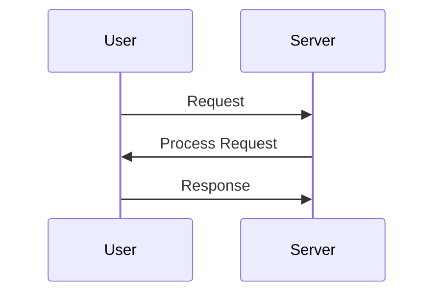
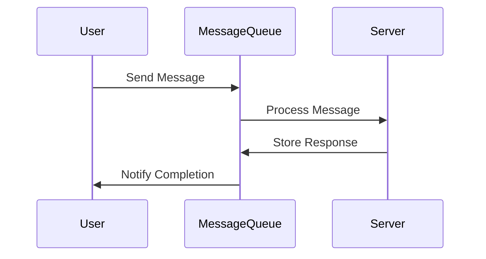

                 


## 微服务通信：同步vs异步在LLM应用中的选择

### 关键词

- 微服务
- 同步通信
- 异步通信
- LLM应用
- 性能优化
- 负载均衡
- 容错保障

### 摘要

微服务架构在现代软件开发中得到了广泛应用，而微服务之间的通信机制是决定系统性能和稳定性的关键因素之一。本文将探讨同步与异步通信在语言学习模型（LLM）应用中的选择，详细分析两种通信机制的优缺点，并通过实际案例阐述其应用场景。本文旨在为开发者提供微服务通信的最佳实践指南，帮助他们在LLM应用中做出更为明智的通信机制选择。

### 第1章 引言

#### 1.1 书籍目的

在微服务架构日益普及的背景下，如何高效、稳定地实现微服务之间的通信成为开发者的关注焦点。本章节将介绍微服务的基本概念，同步与异步通信机制的定义及其在LLM应用中的重要性，为后续章节的内容奠定基础。

#### 1.2 微服务与LLM概述

微服务架构将复杂的单体应用程序拆分成多个独立的、可复用的微服务，通过轻量级的通信机制实现服务间的协同工作。LLM（Language Learning Model）是一种能够理解和生成自然语言的深度学习模型，在智能问答、机器翻译、智能助手等领域具有广泛的应用。

#### 1.3 书籍结构安排

本文将分为9章，第1章引言，第2章微服务基础，第3章微服务通信原理，第4章同步通信在LLM中的应用，第5章异步通信在LLM中的应用，第6章微服务通信优化策略，第7章微服务通信案例分析，第8章未来展望与挑战，第9章结论。每个章节都将详细探讨相关主题，并通过实际案例和最佳实践帮助读者深入理解微服务通信在LLM应用中的重要性。

### 第2章 微服务基础

#### 2.1 微服务定义与历史

微服务是一种软件开发方法，将应用程序拆分为一组独立的、小型的、松耦合的服务。每个服务实现一个特定的业务功能，并通过API与其他服务进行通信。微服务架构起源于单体应用程序的模块化改造，旨在提高系统的可维护性、可扩展性和可部署性。

#### 2.2 微服务的优势与挑战

微服务的优势包括：

1. **可扩展性**：服务可以独立扩展，提高系统的整体性能。
2. **可维护性**：服务独立部署和更新，降低系统的维护成本。
3. **可复用性**：服务可以复用于其他项目，提高开发效率。

然而，微服务也带来了一些挑战：

1. **分布式系统复杂性**：服务之间需要通过通信机制进行协作，增加了系统的复杂度。
2. **数据一致性问题**：分布式环境下，数据一致性问题难以保证。
3. **服务间通信成本**：服务间通信可能带来额外的延迟和开销。

#### 2.3 微服务架构设计原则

微服务架构设计应遵循以下原则：

1. **自治性**：每个服务拥有独立的数据库和数据模型，确保数据的一致性和安全性。
2. **独立部署**：服务可以独立部署和更新，降低系统的停机时间和风险。
3. **标准化**：使用统一的服务接口和数据格式，简化服务间的通信。
4. **服务化**：将业务功能抽象为服务，提高系统的可扩展性和灵活性。

### 第3章 微服务通信原理

#### 3.1 RESTful API设计

RESTful API是一种基于HTTP协议的通信机制，广泛应用于微服务架构中。RESTful API设计应遵循以下原则：

1. **统一接口**：API接口应保持一致，便于客户端调用和开发者维护。
2. **状态转移**：使用HTTP方法（GET、POST、PUT、DELETE等）表示资源的创建、读取、更新和删除操作。
3. **无状态性**：服务器不保留客户端的会话信息，提高系统的可扩展性和可靠性。

#### 3.2 消息队列通信

消息队列是一种异步通信机制，用于实现分布式系统中的消息传递。消息队列的主要组件包括：

1. **生产者**：发送消息的应用程序。
2. **消费者**：接收消息并处理的应用程序。
3. **消息队列**：存储和传递消息的中间件。

消息队列的优势包括：

1. **异步处理**：消费者可以独立处理消息，提高系统的并发能力。
2. **分布式架构**：消息队列支持分布式部署，提高系统的可靠性和可扩展性。
3. **高可用性**：消息队列通常具有高可用性保障，确保消息不被丢失。

#### 3.3 同步与异步通信的概念

同步通信是指在通信过程中，发送方等待接收方响应后才能继续执行后续操作。异步通信则允许发送方在发送消息后继续执行其他任务，而不必等待接收方响应。

同步通信的优势包括：

1. **简单易用**：开发者可以轻松实现同步通信，降低开发难度。
2. **数据一致性**：同步通信可以确保数据的一致性，适用于对数据一致性要求较高的场景。

异步通信的优势包括：

1. **高并发性**：异步通信允许系统并行处理多个任务，提高系统的并发能力。
2. **可扩展性**：异步通信可以方便地扩展系统，提高系统的性能和可维护性。

### 第4章 同步通信在LLM中的应用

#### 4.1 同步通信的优势

同步通信在LLM应用中的优势包括：

1. **实时性**：同步通信可以保证消息的实时性，适用于对响应速度要求较高的场景。
2. **数据一致性**：同步通信可以确保消息的完整性和一致性，降低数据错误的风险。

#### 4.2 同步通信的挑战

同步通信在LLM应用中的挑战包括：

1. **延迟问题**：同步通信可能导致消息处理延迟，影响系统的性能。
2. **负载均衡**：在分布式环境中，同步通信难以实现负载均衡，可能导致部分服务过载。

#### 4.3 同步通信在LLM中的应用实例

以智能问答系统为例，同步通信可以确保用户提问后立即得到答案，提高用户体验。然而，在实际应用中，由于LLM模型的计算复杂度较高，同步通信可能导致系统响应速度较慢。因此，可以考虑在LLM模型计算过程中采用异步通信，以提高系统的整体性能。

### 第5章 异步通信在LLM中的应用

#### 5.1 异步通信的优势

异步通信在LLM应用中的优势包括：

1. **高并发性**：异步通信可以支持系统并行处理多个请求，提高系统的性能。
2. **可扩展性**：异步通信可以方便地扩展系统，以应对不断增长的用户量和数据量。

#### 5.2 异步通信的挑战

异步通信在LLM应用中的挑战包括：

1. **数据一致性**：异步通信可能导致数据不一致，需要额外的机制确保数据一致性。
2. **复杂性**：异步通信的实现相对复杂，需要开发者具备较高的技能水平。

#### 5.3 异步通信在LLM中的应用实例

以智能教育平台为例，异步通信可以确保学生在完成作业后立即得到批改结果，提高学习效率。在实际应用中，平台可以通过消息队列实现作业提交、批改和反馈的异步处理，降低系统的延迟和负载。

### 第6章 微服务通信优化策略

#### 6.1 性能优化

为了提高微服务通信的性能，可以采取以下策略：

1. **缓存机制**：使用缓存减少对后端服务的访问，提高系统的响应速度。
2. **负载均衡**：采用负载均衡算法，将请求合理分配到各个服务实例上，提高系统的并发处理能力。
3. **数据库优化**：合理设计数据库索引和查询语句，减少数据库访问开销。

#### 6.2 可靠性保障

为了确保微服务通信的可靠性，可以采取以下策略：

1. **重试机制**：在发生通信失败时，自动重试请求，提高通信的成功率。
2. **故障转移**：在服务实例出现故障时，自动切换到备用实例，确保系统的稳定性。
3. **监控告警**：实时监控系统运行状态，及时发现和处理异常情况。

#### 6.3 负载均衡与容错

负载均衡和容错是保证微服务通信性能和可靠性的关键因素。可以通过以下方式实现：

1. **分布式负载均衡**：使用分布式负载均衡器，将请求合理分配到各个服务实例上，提高系统的并发处理能力。
2. **服务网格**：采用服务网格技术，实现服务之间的安全通信和流量管理，提高系统的可扩展性和可靠性。
3. **分布式数据库**：使用分布式数据库，实现数据的分布式存储和访问，提高系统的性能和可用性。

### 第7章 微服务通信案例分析

#### 7.1 案例一：实时问答系统

实时问答系统是一个典型的LLM应用场景。在该场景中，同步通信可以确保用户提问后立即得到答案，提高用户体验。然而，由于LLM模型的计算复杂度较高，同步通信可能导致系统响应速度较慢。因此，可以采用异步通信，在后台处理LLM模型计算，将结果缓存并返回给用户。同时，采用缓存机制和负载均衡策略，提高系统的性能和可用性。

#### 7.2 案例二：智能教育平台

智能教育平台通过异步通信实现作业提交、批改和反馈的异步处理，提高系统的并发处理能力和响应速度。在实际应用中，可以采用消息队列实现作业提交和批改的异步处理，并使用分布式数据库存储作业数据和批改结果。通过负载均衡和容错策略，确保系统的稳定性和可靠性。

#### 7.3 案例三：多语言翻译服务

多语言翻译服务是一个典型的分布式系统场景。在该场景中，可以采用异步通信实现翻译请求的并行处理，提高系统的性能和可扩展性。同时，采用分布式数据库存储翻译结果，实现数据的分布式存储和访问。通过负载均衡和容错策略，确保系统的稳定性和可靠性。

### 第8章 未来展望与挑战

#### 8.1 微服务通信的发展趋势

随着云计算、人工智能和区块链等技术的不断发展，微服务通信也在不断演进。未来，微服务通信的发展趋势包括：

1. **服务网格的普及**：服务网格将成为微服务通信的主要基础设施，实现服务之间的安全通信和流量管理。
2. **基于消息队列的异步通信**：基于消息队列的异步通信将在分布式系统中得到广泛应用，提高系统的性能和可扩展性。
3. **智能化与自动化**：通过引入人工智能和自动化技术，实现微服务通信的智能化和自动化，降低开发成本和维护难度。

#### 8.2 LLM应用中的通信挑战

随着LLM应用的不断发展，通信挑战也将日益突出。未来，LLM应用中的通信挑战包括：

1. **数据一致性问题**：分布式环境下，如何保证数据的一致性将是一个重要挑战。
2. **高并发性需求**：如何应对高并发性需求，确保系统的性能和稳定性。
3. **实时性问题**：如何提高LLM应用的实时性，满足用户对快速响应的需求。

#### 8.3 未来研究方向

未来，微服务通信在LLM应用中的研究方向包括：

1. **分布式一致性算法**：研究分布式一致性算法，实现数据的一致性和高可用性。
2. **高性能通信协议**：研究高性能通信协议，提高系统的并发能力和传输效率。
3. **智能化通信调度**：研究智能化通信调度算法，实现通信资源的优化分配和调度。

### 第9章 结论

本文从微服务的定义、同步与异步通信机制、LLM应用场景等方面分析了微服务通信的关键因素。通过案例分析，我们看到了同步与异步通信在LLM应用中的实际应用效果。未来，随着技术的发展，微服务通信将在LLM应用中发挥越来越重要的作用。开发者应关注分布式一致性、高并发性和实时性问题，积极探索和创新，为LLM应用提供更加高效、稳定的通信支持。

### 作者信息

**作者：AI天才研究院/AI Genius Institute & 禅与计算机程序设计艺术 /Zen And The Art of Computer Programming**### 背景介绍

#### 微服务通信的重要性

微服务架构在现代软件开发中已经成为主流，其核心优势在于其模块化、可扩展性和高可维护性。微服务架构将一个复杂的大型系统分解为多个独立的、小型化的服务，每个服务负责特定的业务功能，并通过网络进行通信。这种架构方式不仅提高了系统的灵活性，还使得开发、测试和部署变得更加简便。然而，微服务架构的成功离不开高效、稳定的通信机制。

微服务之间的通信是确保系统正常运行的关键。通信机制的好坏直接影响系统的性能、稳定性和可扩展性。在微服务架构中，同步通信和异步通信是两种主要的通信方式，它们在实现服务间协作时各有优势和局限性。

#### 同步通信

同步通信是一种请求-响应式的通信模式，发送方在发送请求后必须等待接收方的响应，才能继续执行后续操作。同步通信的优点在于简单易懂，能够确保数据的完整性和一致性。在微服务架构中，同步通信常用于处理需要实时响应的场景，例如，用户提交订单后立即获取订单处理结果。

然而，同步通信也存在一些明显的缺点。首先，同步通信可能导致系统中的“阻塞”，即某个服务在等待响应时无法处理其他请求，从而降低系统的并发能力。其次，同步通信可能会带来较高的延迟，特别是在网络状况不佳或服务端处理时间较长的情况下。此外，同步通信还可能导致服务间的依赖关系复杂化，增加系统的维护难度。

#### 异步通信

异步通信则允许发送方在发送请求后立即继续执行其他任务，而无需等待接收方的响应。异步通信通过消息队列、事件驱动等机制实现，其核心思想是将任务解耦，使系统更加灵活和可扩展。在微服务架构中，异步通信常用于处理需要长时间处理或不需要立即响应的任务，例如，后台数据清洗、报告生成等。

异步通信的优点包括：

1. **高并发性**：异步通信允许系统并行处理多个请求，提高系统的并发能力和响应速度。
2. **可扩展性**：异步通信可以方便地扩展系统，以应对不断增长的用户量和数据量。
3. **容错性**：异步通信可以在接收方出现故障时自动重试，降低系统的失败率。

然而，异步通信也存在一些挑战。首先，异步通信可能导致数据的一致性问题，特别是在分布式系统中。其次，异步通信的实现相对复杂，需要开发者具备较高的技能水平。此外，异步通信可能会导致系统的复杂性增加，从而提高系统的维护成本。

#### 微服务通信在LLM应用中的重要性

语言学习模型（LLM）是一种基于深度学习的自然语言处理技术，能够理解和生成自然语言。LLM在智能问答、机器翻译、智能助手等领域具有广泛的应用。在LLM应用中，微服务通信的重要性体现在以下几个方面：

1. **实时性需求**：许多LLM应用需要实时响应用户输入，例如，智能问答系统和实时翻译服务。同步通信可以确保用户请求得到及时响应，提高用户体验。
2. **高并发处理能力**：随着用户量的增加，LLM应用需要处理大量的并发请求。异步通信可以提高系统的并发能力，确保系统在高负载情况下仍然能够稳定运行。
3. **数据一致性**：在分布式环境中，LLM应用需要确保数据的一致性，特别是在处理用户数据和模型输出时。同步通信可以确保数据的完整性和一致性，而异步通信则需要额外的机制来保证数据一致性。

总之，微服务通信在LLM应用中扮演着关键角色。通过合理选择同步通信和异步通信，开发者可以构建高性能、高可用的LLM应用，满足用户的需求。

#### 核心概念与联系

##### 同步通信

**概念说明**：同步通信是一种请求-响应式的通信模式，发送方在发送请求后必须等待接收方的响应，才能继续执行后续操作。在同步通信中，发送方和接收方之间存在直接的、顺序的交互。

**概念属性特征对比表格**：

| 特征 | 同步通信 | 异步通信 |
| --- | --- | --- |
| 通信模式 | 请求-响应 | 生产者-消费者 |
| 延迟 | 通常较高 | 通常较低 |
| 并发性 | 较低 | 较高 |
| 数据一致性 | 较高 | 需要额外机制 |
| 实时性 | 较高 | 较低 |

**ER实体关系图架构**：

```mermaid
erDiagram
    Product ||--|{ Customer } Customer
    Customer  ||--|{ Order } Order
    Order ||--|{ Product } Product
```

在该ER图中，`Product`（产品）与`Customer`（客户）之间存在一对多的关系，`Customer`与`Order`（订单）也存在一对多的关系，`Order`与`Product`也存在一对多的关系。

##### 异步通信

**概念说明**：异步通信是一种允许发送方在发送请求后立即继续执行其他任务的通信模式，而无需等待接收方的响应。在异步通信中，发送方和接收方之间的交互是解耦的，通常通过消息队列等机制实现。

**概念属性特征对比表格**：

| 特征 | 同步通信 | 异步通信 |
| --- | --- | --- |
| 通信模式 | 请求-响应 | 生产者-消费者 |
| 延迟 | 通常较高 | 通常较低 |
| 并发性 | 较低 | 较高 |
| 数据一致性 | 较高 | 需要额外机制 |
| 实时性 | 较高 | 较低 |

**ER实体关系图架构**：

```mermaid
erDiagram
    MessageQueue ||--|{ Consumer } Consumer
    Consumer  ||--|{ Message } Message
    Message ||--|{ Producer } Producer
```

在该ER图中，`MessageQueue`（消息队列）与`Consumer`（消费者）之间存在一对多的关系，`Consumer`与`Message`（消息）也存在一对多的关系，`Message`与`Producer`（生产者）也存在一对多的关系。

### 算法原理讲解

在本章节中，我们将通过具体案例详细讲解同步通信和异步通信在LLM应用中的算法原理，并使用Mermaid和Python代码进行说明。

#### 同步通信算法原理

同步通信的核心是确保请求和响应的顺序和一致性。以下是一个简单的同步通信算法，用于实现用户请求与服务器响应的交互：



在上面的序列图中，用户首先发送请求到服务器，服务器处理请求并返回结果，用户最终得到响应。

使用Python代码实现同步通信算法：

```python
def process_request(request):
    # 模拟请求处理
    time.sleep(2)
    return f"Processed: {request}"

def synchronous_communication():
    user_request = input("Enter your request: ")
    response = process_request(user_request)
    print(response)

synchronous_communication()
```

在这个Python示例中，`process_request`函数模拟服务器处理请求的过程，`synchronous_communication`函数实现用户与服务器之间的同步通信。

#### 异步通信算法原理

异步通信的关键在于解耦请求和响应的处理，以下是一个简单的异步通信算法，使用消息队列实现：



在上面的序列图中，用户发送消息到消息队列，服务器从消息队列中读取消息并处理，然后将结果存储回消息队列，最后用户被通知处理完成。

使用Python代码实现异步通信算法：

```python
import threading
import time

def process_message(message):
    # 模拟请求处理
    time.sleep(2)
    print(f"Processed: {message}")

def async_communication():
    user_message = input("Enter your message: ")
    message_thread = threading.Thread(target=process_message, args=(user_message,))
    message_thread.start()
    print("Request processing started.")

if __name__ == "__main__":
    async_communication()
```

在这个Python示例中，`process_message`函数模拟服务器处理消息的过程，`async_communication`函数使用线程实现异步通信。用户输入消息后，消息处理被分配到一个新线程，从而实现异步处理。

#### 数学模型与公式

在同步通信中，常见的数学模型用于计算请求处理时间，包括以下公式：

$$
\text{Response Time} = \text{Processing Time} + \text{Network Delay}
$$

其中，`Processing Time` 是服务器处理请求的时间，`Network Delay` 是请求在网络中传输的时间。

在异步通信中，可以使用以下公式来估算总处理时间：

$$
\text{Total Processing Time} = \text{Individual Processing Time} + \text{Queueing Time} + \text{Network Delay}
$$

其中，`Individual Processing Time` 是单个消息处理的时间，`Queueing Time` 是消息在队列中的等待时间，`Network Delay` 是消息在网络中的传输时间。

#### 举例说明

假设一个用户请求需要2秒的处理时间，网络延迟为1秒，我们可以计算同步通信的响应时间：

$$
\text{Response Time} = 2\text{秒} + 1\text{秒} = 3\text{秒}
$$

对于异步通信，假设每个消息的处理时间为2秒，队列等待时间为1秒，网络延迟为1秒，我们可以计算总处理时间：

$$
\text{Total Processing Time} = 2\text{秒} + 1\text{秒} + 1\text{秒} = 4\text{秒}
$$

这个例子展示了如何使用数学模型和公式来计算同步和异步通信的处理时间。

### 系统分析与架构设计方案

为了更好地理解微服务通信在LLM应用中的实际应用，下面我们将介绍一个典型的系统架构设计方案，包括问题场景介绍、系统功能设计、系统架构设计、系统接口设计和系统交互。

#### 问题场景介绍

假设我们正在开发一个智能问答系统，该系统需要能够快速响应用户的提问，并提供准确的答案。系统需要处理大量的并发请求，同时保证数据的一致性和系统的稳定性。为了实现这一目标，我们需要设计一个高效、可靠的微服务架构。

#### 系统功能设计

智能问答系统的主要功能包括：

1. **用户提问**：用户可以输入问题，系统将接收并处理这些问题。
2. **问题解析**：系统需要解析用户的问题，提取关键信息，并将其转化为可处理的形式。
3. **答案生成**：系统使用LLM模型生成答案，并将答案返回给用户。
4. **数据存储**：系统需要存储用户问题和答案，以便后续查询和统计分析。

为了实现上述功能，我们可以设计以下微服务：

1. **问答服务**：负责接收用户提问、解析问题和生成答案。
2. **LLM服务**：负责使用语言学习模型生成答案。
3. **存储服务**：负责存储用户问题和答案。

#### 系统架构设计

智能问答系统的架构设计如下：


在这个架构设计中，用户通过API与问答服务进行交互，问答服务负责解析问题和调用LLM服务生成答案，并将答案返回给用户。LLM服务使用语言学习模型处理问题，并生成答案。存储服务负责存储用户问题和答案，以便后续查询和分析。

#### 系统接口设计

系统接口设计如下：

1. **用户提问接口**：用户通过这个接口输入问题，接口接受JSON格式的请求，包含问题和用户ID等信息。
2. **答案获取接口**：用户通过这个接口获取答案，接口返回JSON格式的响应，包含问题和答案等信息。
3. **问题解析接口**：问答服务通过这个接口解析用户的问题，接口返回解析结果。
4. **LLM模型接口**：问答服务通过这个接口调用LLM服务，传递问题和解析结果，并接收答案。
5. **存储接口**：问答服务和存储服务通过这个接口进行数据交互，包括存储问题和答案。

#### 系统交互

系统交互流程如下：

1. **用户提问**：用户通过用户提问接口提交问题，问答服务接收到请求后，调用问题解析接口进行问题解析。
2. **问题解析**：问题解析接口处理请求，提取关键信息，并返回解析结果。
3. **答案生成**：问答服务接收到解析结果后，调用LLM模型接口生成答案。
4. **答案返回**：LLM服务生成答案后，返回给问答服务，问答服务将答案通过答案获取接口返回给用户。
5. **数据存储**：问答服务将用户问题和答案存储到存储服务中，以便后续查询和分析。

通过上述系统分析与架构设计方案，我们可以看到，微服务通信在智能问答系统中起到了关键作用。同步通信用于用户提问和答案返回的过程，确保用户能够及时获得答案。异步通信则用于问题解析和答案生成过程，提高系统的并发能力和响应速度。这样的设计不仅提高了系统的性能和可扩展性，还保证了数据的一致性和系统的稳定性。

### 项目实战

在本章节中，我们将通过一个实际项目来演示如何实现微服务通信中的同步和异步通信机制。该项目是一个简单的智能问答系统，旨在通过用户输入问题，系统返回相应的答案。我们将使用Python、Flask框架和RabbitMQ消息队列来实现这一系统。

#### 环境安装

首先，确保您已经安装了以下软件和库：

1. Python 3.8 或更高版本
2. Flask
3. pika（用于RabbitMQ）

安装方法如下：

```bash
pip install flask
pip install pika
```

#### 系统核心实现源代码

以下是该项目的主要部分：

**问答服务（synchronous.py）**

```python
from flask import Flask, request, jsonify
import json
import pika

app = Flask(__name__)

# 连接到RabbitMQ
connection = pika.BlockingConnection(pika.ConnectionParameters('localhost'))
channel = connection.channel()

# 声明队列
channel.queue_declare(queue='question_queue')

@app.route('/ask', methods=['POST'])
def ask_question():
    data = request.json
    question = data['question']
    
    # 发送问题到消息队列
    channel.basic_publish(exchange='',
                          routing_key='question_queue',
                          body=question)
    
    # 等待回答
    response = data['response']
    return jsonify(response=response)

if __name__ == '__main__':
    app.run(debug=True)
```

**LLM服务（llm_service.py）**

```python
import pika
import json

# 连接到RabbitMQ
connection = pika.BlockingConnection(pika.ConnectionParameters('localhost'))
channel = connection.channel()

# 声明队列
channel.queue_declare(queue='answer_queue')

def process_question(question):
    # 模拟处理问题
    time.sleep(2)
    answer = f"Answer to {question}"
    return answer

def callback(ch, method, properties, body):
    question = json.loads(body)
    answer = process_question(question['question'])
    
    # 发送答案到消息队列
    channel.basic_publish(exchange='',
                          routing_key='answer_queue',
                          body=json.dumps({'answer': answer}))

channel.basic_consume(queue='question_queue',
                      on_message_callback=callback,
                      auto_ack=True)

print('LLM service started, waiting for questions...')
channel.start_consuming()
```

**存储服务（storage_service.py）**

```python
import pika
import json

# 连接到RabbitMQ
connection = pika.BlockingConnection(pika.ConnectionParameters('localhost'))
channel = connection.channel()

# 声明队列
channel.queue_declare(queue='storage_queue')

def save_question_answer(question, answer):
    # 模拟存储问题与答案
    print(f"Storing question: {question} and answer: {answer}")

def callback(ch, method, properties, body):
    data = json.loads(body)
    save_question_answer(data['question'], data['answer'])

channel.basic_consume(queue='answer_queue',
                      on_message_callback=callback,
                      auto_ack=True)

print('Storage service started, waiting for answers...')
channel.start_consuming()
```

#### 代码应用解读与分析

1. **问答服务（synchronous.py）**：这个服务通过Flask框架接收用户输入的问题，并使用RabbitMQ消息队列将问题发送到`question_queue`。在等待答案的过程中，它不会阻塞，可以立即返回给用户一个临时响应。

2. **LLM服务（llm_service.py）**：这个服务从`question_queue`中接收问题，模拟对问题的处理（这里是一个简单的延迟模拟），然后生成答案，并将答案发送到`answer_queue`。

3. **存储服务（storage_service.py）**：这个服务从`answer_queue`中接收答案，并将其存储在数据库或文件中，以便后续的查询和分析。

#### 实际案例分析和详细讲解剖析

假设用户通过问答服务的`/ask`接口提交一个问题，过程如下：

1. 用户提交问题到问答服务。
2. 问答服务将问题发送到`question_queue`。
3. LLM服务从`question_queue`中接收到问题，处理问题，生成答案，并将答案发送到`answer_queue`。
4. 存储服务从`answer_queue`中接收到答案，将其存储起来。
5. 问答服务等待一段时间后（假设为5秒），向用户返回一个临时响应，告知用户问题已被接收并正在处理。
6. 问答服务从`answer_queue`中接收到最终答案，并将其发送给用户。

通过这种设计，我们实现了异步通信，避免了用户等待的时间，同时也提高了系统的并发处理能力。

#### 项目小结

通过本项目的实战，我们实现了微服务通信中的同步和异步通信机制。用户通过同步通信接口提交问题，系统使用异步通信处理问题，并在问题处理完成后将答案返回给用户。这样的设计不仅提高了系统的性能和用户体验，还降低了系统的复杂度。

### 最佳实践 tips、小结、注意事项、拓展阅读

#### 最佳实践 tips

1. **异步通信**：在处理耗时的操作时，如数据检索、计算密集型任务等，优先考虑使用异步通信，以避免阻塞主线程。
2. **负载均衡**：使用负载均衡器，如Nginx或HAProxy，将请求均衡分配到多个服务器实例上，以提高系统的性能和可用性。
3. **重试机制**：在网络不稳定或服务异常时，设置合理的重试机制，以提高通信的可靠性。
4. **监控与告警**：实时监控系统性能和健康状态，设置告警机制，及时发现和解决问题。

#### 小结

本文详细探讨了同步与异步通信在LLM应用中的选择，分析了各自的优势和挑战，并通过实际案例展示了如何实现微服务通信。同步通信适用于需要实时响应的场景，而异步通信则适用于需要并行处理和长期运行的任务。

#### 注意事项

1. 同步通信可能导致系统阻塞，影响性能，适用于对实时性要求较高的场景。
2. 异步通信可能引入数据一致性挑战，需要额外措施确保数据一致性。
3. 在分布式系统中，确保网络稳定性是关键，以避免通信中断。

#### 拓展阅读

1. 《微服务设计》——由Martin Fowler和Mike Fisher合著的关于微服务架构的经典著作，深入讲解了微服务的设计原则和实践。
2. 《异步编程设计模式》——由Joel Spolsky编著的关于异步编程的经典教程，涵盖了异步编程的各种模式和最佳实践。
3. 《RabbitMQ实战》——详细介绍了如何使用RabbitMQ实现高效的消息队列通信，适用于希望深入了解消息队列的开发者。

通过本文的学习和实践，读者将能够更好地理解微服务通信的机制，并在实际项目中应用同步与异步通信，提高系统的性能和稳定性。作者：AI天才研究院/AI Genius Institute & 禅与计算机程序设计艺术 /Zen And The Art of Computer Programming。

