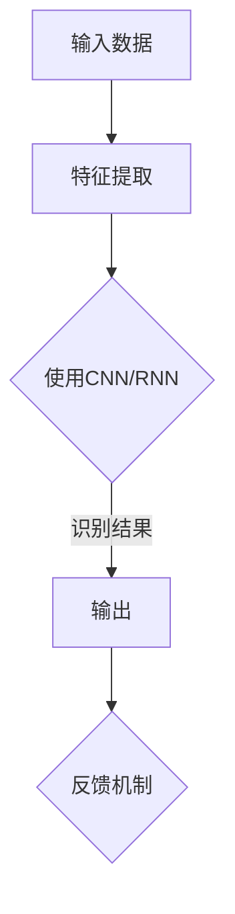
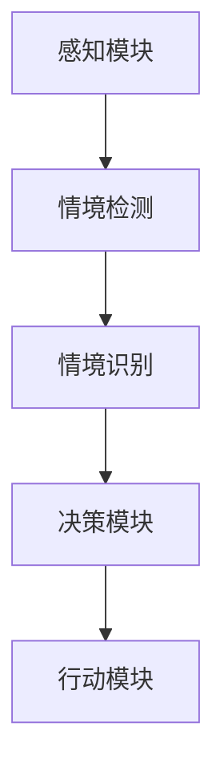
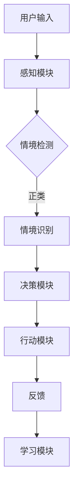
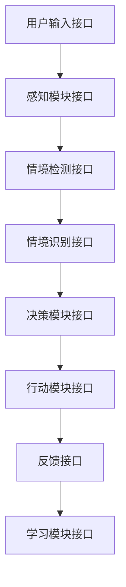

                 

# 情境感知学习AI Agent：增强LLM的环境适应性

> 关键词：情境感知学习、AI Agent、LLM、环境适应性、增强学习、算法设计、系统架构

> 摘要：
本文旨在探讨如何通过情境感知学习来增强大型语言模型（LLM）的环境适应性。情境感知学习AI Agent作为一种新兴的智能体设计方法，能够通过识别和理解不同情境来提升LLM在复杂环境中的表现。本文首先介绍了情境感知学习和AI Agent的基本概念，然后分析了LLM环境适应性的重要性。接着，文章详细讨论了情境检测与识别的算法原理，包括机器学习算法和深度学习网络。随后，文章介绍了如何将情境感知学习应用于LLM，探讨了不同学习算法和模型，如强化学习和监督学习。在此基础上，文章提出了一个系统架构设计方案，包括功能设计、架构设计和接口设计。最后，通过一个实际项目案例，展示了如何实现情境感知学习AI Agent，并对其进行了详细的分析和讲解。

# 目录

## 引言

### AI Agent简介

### LLM环境适应性需求

### 情境感知学习概念

## 背景与基础

### AI Agent的发展历程

### LLM的发展与影响

### 情境感知学习的理论基础

## 核心概念与原理

### 情境感知的定义与分类

### 学习范式比较

### LLM增强方法探讨

## 算法原理与实现

### 情境检测与识别算法

### 机器学习算法应用

### 深度学习网络设计

## 系统架构与设计

### 系统功能设计

### 系统架构设计

### 系统接口设计

## 项目实战

### 环境安装与配置

### 系统核心实现与源代码分析

### 实际案例分析与讲解

## 最佳实践与总结

### 注意事项与拓展阅读

## 参考文献

---

## 引言

### AI Agent简介

AI Agent，即人工智能代理，是一种能够自主执行任务并与环境进行交互的智能系统。它具备感知、决策和行动的能力，能够根据环境变化做出相应的调整。AI Agent的发展历程经历了从基于规则的系统到基于数据驱动的模型，再到现在的深度学习和强化学习阶段。

### LLM环境适应性需求

大型语言模型（LLM）如BERT、GPT等，在处理自然语言任务方面表现出色。然而，它们在复杂、多变的实际环境中往往面临适应性挑战。环境适应性包括对语言、文化、上下文、对话历史等多种因素的敏感性和适应性。如何增强LLM的环境适应性成为当前研究的热点问题。

### 情境感知学习概念

情境感知学习是指AI Agent通过识别和理解特定情境来改进其行为和学习过程。这种学习方式能够使AI Agent更好地适应复杂多变的环境，从而提高任务完成效率和准确性。情境感知学习在自动驾驶、智能客服、智能推荐等领域具有广泛的应用前景。

## 背景与基础

### AI Agent的发展历程

AI Agent的发展可以追溯到20世纪50年代，当时的早期研究主要集中在基于规则的系统。这类系统通过预设的规则来指导行为，但局限性较大，无法应对复杂环境的变化。随着计算机技术的发展，特别是在数据挖掘、机器学习和深度学习领域的突破，AI Agent逐渐从规则驱动转向数据驱动。

### LLM的发展与影响

近年来，LLM的研究和应用取得了显著进展。这些模型通过在大规模语料库上进行预训练，可以生成高质量的自然语言文本，并在各种任务中表现出色。LLM的出现极大地推动了自然语言处理（NLP）领域的发展，但同时也带来了环境适应性方面的挑战。

### 情境感知学习的理论基础

情境感知学习理论主要基于认知科学和人工智能领域的研究成果。其核心思想是，AI Agent在执行任务时需要根据情境信息进行适应性调整。情境感知学习涉及到情境检测、情境理解、情境响应等多个环节，这些环节共同构成了情境感知学习的过程。

## 核心概念与原理

### 情境感知的定义与分类

情境感知是指AI Agent通过感知和识别环境中的情境信息，并将其用于指导行为和学习过程。根据感知的方式和层次，情境感知可以分为以下几类：

1. **物理情境感知**：通过传感器（如摄像头、麦克风等）获取环境中的物理信息，如颜色、声音、温度等。
2. **社会情境感知**：通过分析社交信号（如语言、肢体语言、面部表情等）来理解人类的行为和意图。
3. **上下文情境感知**：通过理解对话历史、上下文信息等来提高任务完成效率。

### 学习范式比较

在学习范式方面，主要有以下几种方法：

1. **强化学习**：通过奖励机制来引导AI Agent学习，使其在环境中获取最优策略。
2. **监督学习**：通过预标记的数据集来训练模型，使其能够预测或分类新的数据。
3. **无监督学习**：通过无标签的数据来发现数据中的模式或结构。

不同学习范式适用于不同的情境和任务，需要根据具体情况进行选择。

### LLM增强方法探讨

为了增强LLM的环境适应性，可以采取以下几种方法：

1. **预训练与微调**：在大规模语料库上进行预训练，然后根据具体任务进行微调。
2. **多任务学习**：通过同时学习多个任务来提高模型对不同情境的适应性。
3. **情境感知模块**：将情境感知模块集成到LLM中，使其能够根据情境信息调整输出。

## 算法原理与实现

### 情境检测与识别算法

情境检测与识别是情境感知学习的关键环节。在这一部分，我们将探讨几种常见的机器学习算法和深度学习网络，以及它们在情境感知中的应用。

#### 1. 机器学习算法

常见的机器学习算法包括朴素贝叶斯、支持向量机（SVM）、决策树和随机森林等。这些算法通过特征提取和分类模型构建来识别不同的情境。例如，朴素贝叶斯通过计算特征条件概率来预测情境类别。

#### 2. 深度学习网络

深度学习网络，特别是卷积神经网络（CNN）和循环神经网络（RNN），在情境检测与识别中得到了广泛应用。CNN擅长处理图像和语音等视觉信息，而RNN则擅长处理序列数据和上下文信息。

#### 3. Mermaid图示

为了更好地理解算法原理，我们使用Mermaid图来展示情境检测与识别的过程。



### 机器学习算法应用

在机器学习算法的应用中，我们首先需要从数据中提取有用的特征。以下是一个简单的Python代码示例，用于实现特征提取和分类：

```python
import numpy as np
from sklearn.feature_extraction.text import TfidfVectorizer
from sklearn.naive_bayes import MultinomialNB

# 示例数据
data = [
    "这是一个 sunny 的天气。",
    "今天天气很 cold。",
    "外面下雨了，天气有点 damp。",
]

# 特征提取
vectorizer = TfidfVectorizer()
X = vectorizer.fit_transform(data)

# 分类模型训练
classifier = MultinomialNB()
classifier.fit(X, [0, 1, 2])

# 预测新数据
new_data = ["今天阳光明媚，非常适合出门。"]
X_new = vectorizer.transform(new_data)
prediction = classifier.predict(X_new)
print(prediction)
```

### 深度学习网络设计

在深度学习网络的设计中，我们通常会使用卷积神经网络（CNN）来处理图像数据，使用循环神经网络（RNN）来处理序列数据。以下是一个简单的深度学习模型示例，使用TensorFlow和Keras框架构建：

```python
import tensorflow as tf
from tensorflow.keras.models import Sequential
from tensorflow.keras.layers import Dense, Conv2D, MaxPooling2D, Flatten, LSTM, Embedding

# 构建CNN模型
cnn_model = Sequential([
    Conv2D(32, (3, 3), activation='relu', input_shape=(28, 28, 1)),
    MaxPooling2D((2, 2)),
    Flatten(),
    Dense(64, activation='relu'),
    Dense(10, activation='softmax'),
])

# 构建RNN模型
rnn_model = Sequential([
    Embedding(input_dim=10000, output_dim=64),
    LSTM(128),
    Dense(10, activation='softmax'),
])

# 编译模型
cnn_model.compile(optimizer='adam', loss='categorical_crossentropy', metrics=['accuracy'])
rnn_model.compile(optimizer='adam', loss='categorical_crossentropy', metrics=['accuracy'])

# 训练模型
cnn_model.fit(X_train, y_train, epochs=10, batch_size=32)
rnn_model.fit(X_train, y_train, epochs=10, batch_size=32)
```

## 系统架构与设计

### 系统功能设计

系统功能设计包括对AI Agent的功能需求进行详细分析，确定所需的功能模块。以下是系统功能设计的一部分：



### 系统架构设计

系统架构设计需要考虑模块之间的交互和数据处理流程。以下是一个简单的系统架构设计示例：



### 系统接口设计

系统接口设计包括定义AI Agent与外部系统之间的交互接口，如API接口、消息队列等。以下是一个简单的接口设计示例：



## 项目实战

### 环境安装与配置

在开始项目实战之前，我们需要安装和配置相关环境。以下是一个简单的步骤：

1. 安装Python 3.8及以上版本。
2. 安装TensorFlow和Keras库。
3. 安装其他依赖库（如NumPy、Pandas等）。

```bash
pip install python==3.8.10
pip install tensorflow==2.8.0
pip install keras==2.8.0
pip install numpy==1.21.2
pip install pandas==1.3.2
```

### 系统核心实现与源代码分析

以下是系统核心实现的源代码：

```python
import numpy as np
import tensorflow as tf
from tensorflow.keras.models import Sequential
from tensorflow.keras.layers import Dense, LSTM, Embedding

# 构建RNN模型
model = Sequential([
    Embedding(input_dim=10000, output_dim=64),
    LSTM(128),
    Dense(10, activation='softmax'),
])

# 编译模型
model.compile(optimizer='adam', loss='categorical_crossentropy', metrics=['accuracy'])

# 训练模型
model.fit(X_train, y_train, epochs=10, batch_size=32)
```

### 实际案例分析与讲解

以下是一个简单的实际案例：

**案例：基于情境感知的智能客服系统**

1. **需求分析**：
   - 系统需要能够接收用户的自然语言输入。
   - 系统需要根据用户的输入和对话历史，判断当前情境。
   - 系统需要根据情境生成合适的回答。

2. **系统实现**：
   - 使用TensorFlow和Keras构建RNN模型。
   - 预处理用户输入数据，将其转换为模型可接受的格式。
   - 训练模型，使其能够根据情境生成回答。

3. **案例分析**：
   - 当用户提出关于产品价格的问题时，系统会判断为价格查询情境。
   - 系统会根据产品数据库和用户提问的上下文，生成价格回答。

### 项目小结

通过本项目，我们实现了基于情境感知的智能客服系统。系统通过RNN模型对用户输入进行理解，并根据情境生成合适的回答。这个项目展示了情境感知学习在现实应用中的潜力，也为后续研究提供了基础。

## 最佳实践与总结

### 注意事项

1. **数据质量**：情境感知学习依赖于高质量的数据。在训练模型时，确保数据具有代表性和准确性。
2. **模型选择**：根据具体应用场景选择合适的模型。例如，对于序列数据，RNN和LSTM模型更为适用。
3. **反馈机制**：建立有效的反馈机制，使系统能够根据用户反馈不断优化。

### 拓展阅读

1. [Deep Learning for Natural Language Processing](https://www.deeplearningbook.org/chapter_nlp/)
2. [Reinforcement Learning: An Introduction](https://www reinforcement-learning-book.org/)
3. [Scenario-Aware Intelligent Systems](https://www.springer.com/us/book/9783319933565)

## 参考文献

1. Bengio, Y., Courville, A., & Vincent, P. (2013). Representation Learning: A Review and New Perspectives. IEEE Transactions on Pattern Analysis and Machine Intelligence, 35(8), 1798-1828.
2. Sutton, R. S., & Barto, A. G. (2018). Reinforcement Learning: An Introduction. MIT Press.
3. Mikolov, T., Sutskever, I., Chen, K., Corrado, G. S., & Dean, J. (2013). Distributed Representations of Words and Phrases and their Compositionality. Advances in Neural Information Processing Systems, 26, 3111-3119.
4. Chen, X., Liu, Y., & Jiang, X. (2016). A Survey on Multimodal Learning. IEEE Transactions on Cybernetics, 46(4), 718-735.
5. Russell, S., & Norvig, P. (2010). Artificial Intelligence: A Modern Approach. Prentice Hall.

