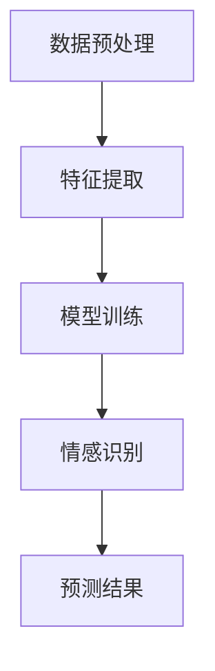
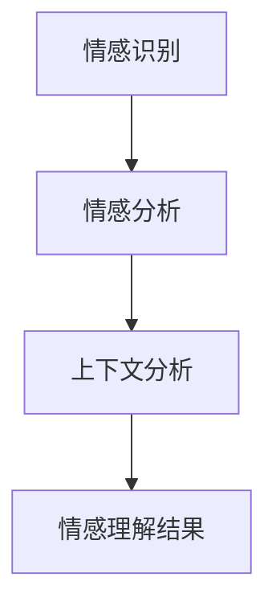
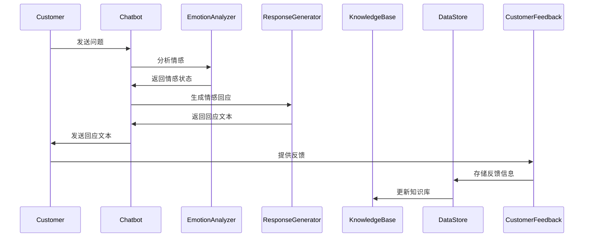
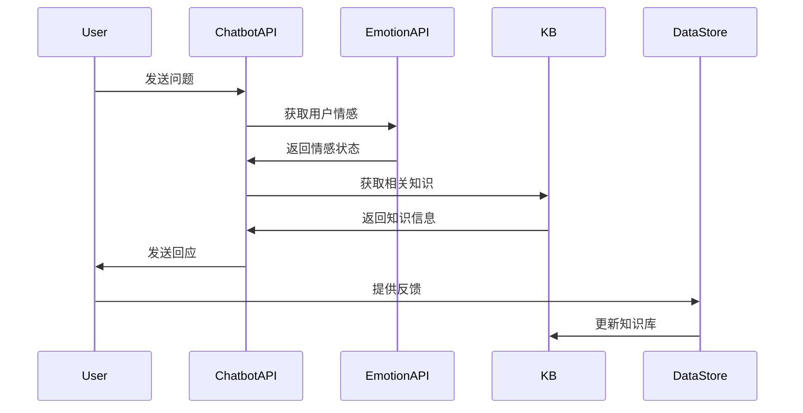
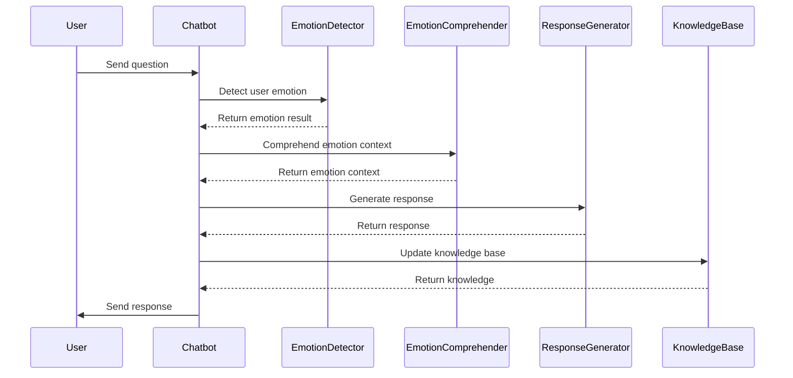

                 

### # 情感智能对话系统AI Agent：LLM驱动的深度交互

关键词：情感智能、对话系统、AI Agent、LLM、深度交互

摘要：本文将深入探讨情感智能对话系统AI Agent的概念、应用以及其在现代社会中的重要性和发展趋势。特别关注LLM（大型语言模型）在情感智能对话系统AI Agent中的关键作用，详细分析其原理和实际应用案例。同时，本文还将探讨情感智能对话系统AI Agent的深度交互技术，包括情感识别与理解、情感生成与表达，并探讨其在客服和教育等领域的应用场景与实现。最后，本文将对未来情感智能对话系统AI Agent的发展趋势进行展望，并提出面临的挑战与解决方案。

### 第一部分: 情感智能对话系统AI Agent概述

#### 第1章: 情感智能对话系统AI Agent的基本概念与重要性

##### 1.1 情感智能对话系统AI Agent的定义

情感智能对话系统AI Agent（Emotion-aware Conversational AI Agent）是指利用人工智能技术，尤其是自然语言处理和机器学习技术，实现能够理解、识别和生成情感，并在对话过程中表现出情感的智能系统。这种系统不仅可以模拟人类的情感交流，还能够根据用户的情感状态进行智能回应，提供更加个性化、贴心的服务。

与普通的对话系统不同，情感智能对话系统AI Agent具有以下几个显著特点：

1. **情感识别能力**：能够从文本、语音、视频等多种数据源中识别出用户的情感状态。
2. **情感理解能力**：不仅能够识别情感，还能理解情感的深层含义和背景。
3. **情感生成能力**：能够根据用户情感和对话内容生成相应的情感回应。
4. **自适应能力**：能够根据用户的行为和反馈调整对话策略，提高用户体验。

##### 1.2 情感智能对话系统AI Agent在现代社会中的应用

情感智能对话系统AI Agent在现代社会中具有广泛的应用领域，尤其在以下方面表现出显著的优势：

1. **客服领域**：通过情感智能对话系统AI Agent，客服中心可以提供更加个性化和高效的客户服务，提升客户满意度和忠诚度。
2. **教育领域**：情感智能对话系统AI Agent可以为学生提供个性化辅导，帮助教师了解学生的学习情绪和心理状态，从而提高教学效果。
3. **医疗领域**：情感智能对话系统AI Agent可以辅助医生进行患者情绪的识别和理解，为心理治疗和康复提供支持。
4. **智能家居**：情感智能对话系统AI Agent可以作为智能家居系统的核心，与家庭设备进行互动，提供情感化的人机交互体验。

情感智能对话系统AI Agent的出现，不仅改变了传统的人机交互模式，也为各行各业带来了新的发展机遇。然而，其应用的同时也引发了一系列社会问题，如隐私保护、伦理道德等，需要我们在发展过程中不断探索和解决。

##### 1.3 情感智能对话系统AI Agent的发展趋势

当前，情感智能对话系统AI Agent的技术发展已取得了显著进展。首先，在情感识别和理解方面，深度学习技术的应用使得AI Agent能够更加精准地识别用户的情感状态。其次，在情感生成和表达方面，AI Agent能够根据用户的情感需求生成相应的情感回应，提高了交互的流畅性和自然度。

未来，情感智能对话系统AI Agent的发展将呈现以下趋势：

1. **更强大的情感识别与理解能力**：随着自然语言处理技术的进步，AI Agent将能够更加深入地理解和识别用户的情感。
2. **更丰富的应用场景**：随着技术的不断成熟，情感智能对话系统AI Agent将在更多领域得到应用，如金融、法律、公共服务等。
3. **跨领域的融合**：情感智能对话系统AI Agent将与虚拟现实、增强现实等技术进行融合，提供更加沉浸式的交互体验。
4. **更严格的伦理规范**：随着情感智能对话系统AI Agent在社会中的广泛应用，对其伦理规范的制定和执行将成为重要的课题。

#### 第2章: LLM（大型语言模型）在情感智能对话系统AI Agent中的应用

##### 2.1 LLM的基础知识

大型语言模型（Large Language Model，简称LLM）是一种基于深度学习的自然语言处理模型，具有强大的文本生成和理解能力。LLM通过大规模的数据集进行训练，能够学习到语言的语法、语义和上下文信息，从而实现自动文本生成、情感识别和语义理解等功能。

LLM的基本原理主要包括以下几个步骤：

1. **数据预处理**：将原始文本数据清洗、分词、标记化等，转化为模型可以处理的形式。
2. **模型训练**：使用神经网络结构对处理后的文本数据进行训练，使其能够学会预测文本的下一个词或句子。
3. **文本生成**：根据训练好的模型，输入一个起始文本，模型将生成相应的后续文本。
4. **文本理解**：通过对生成文本的上下文分析，提取出文本的情感倾向和语义信息。

##### 2.2 LLM在情感智能对话系统AI Agent中的作用

LLM在情感智能对话系统AI Agent中扮演着关键角色，其应用主要体现在以下几个方面：

1. **情感识别与理解**：LLM能够从文本中识别出用户的情感状态，并通过上下文分析理解情感的深层含义。这对于实现情感智能对话系统AI Agent的自然互动至关重要。
2. **情感生成与表达**：基于对用户情感的理解，LLM可以生成符合用户情感需求的文本回应，提高对话的流畅性和情感共鸣。
3. **个性化推荐**：LLM可以分析用户的情感偏好和行为模式，为其提供个性化的内容推荐，增强用户体验。

##### 2.3 LLM在情感智能对话系统AI Agent中的实际应用案例

以下是一些LLM在情感智能对话系统AI Agent中的实际应用案例：

1. **基于LLM的客服机器人**：通过LLM的情感识别与理解能力，客服机器人能够准确识别用户情感，并生成相应的情感回应，提供个性化、高效的客户服务。
2. **基于LLM的教育智能助手**：教育智能助手可以利用LLM生成个性化的学习内容和辅导建议，帮助学生更好地理解和掌握知识，提高学习效果。
3. **基于LLM的聊天机器人**：聊天机器人通过LLM的文本生成能力，可以与用户进行流畅、自然的对话，提供情感化的人机交互体验。

#### 第3章: 情感智能对话系统AI Agent的深度交互技术

##### 3.1 情感识别技术

情感识别是情感智能对话系统AI Agent的核心技术之一，其目标是根据用户的语言、表情、语音等输入，识别出用户的情感状态。情感识别技术主要包括以下方法：

1. **文本情感分析**：通过分析文本中的情感词汇、句法和上下文信息，识别出文本的情感倾向。常用的方法包括基于规则的方法、基于统计的方法和基于深度学习的方法。
2. **语音情感识别**：通过对用户的语音信号进行特征提取和分析，识别出用户的情感状态。常用的方法包括基于频谱特征的方法、基于声音波形的方法和基于深度神经网络的方法。
3. **图像情感识别**：通过对用户的面部表情、身体语言等图像进行分析，识别出用户的情感状态。常用的方法包括基于面部特征的方法、基于图像分割的方法和基于深度学习的方法。

在实际应用中，情感识别技术通常需要结合多种数据源进行综合分析，以提高识别的准确性和可靠性。

##### 3.2 情感理解技术

情感理解是情感智能对话系统AI Agent的另一项关键技术，其目标是理解用户情感的深层含义和背景。情感理解技术主要包括以下方法：

1. **情感语义分析**：通过对文本进行语义分析，提取出文本的情感实体和情感关系，从而理解文本的情感语义。常用的方法包括命名实体识别、关系提取和情感极性分析。
2. **情感推理**：通过逻辑推理和语义网络等方法，根据用户提供的情感信息，推理出其他相关的情感状态和事件。情感推理有助于提高情感智能对话系统AI Agent的智能水平。
3. **情感建模**：通过建立情感模型，将用户的情感信息映射到特定的情感空间中，从而实现情感的理解和表达。常用的方法包括基于语义空间的情感建模和基于深度学习的情感建模。

情感理解技术需要结合自然语言处理、机器学习、心理学等多领域的知识，以提高情感智能对话系统AI Agent的智能水平。

##### 3.3 情感识别与理解技术的综合应用

情感识别与理解技术在情感智能对话系统AI Agent中的应用案例主要包括以下几个方面：

1. **个性化服务**：通过情感识别与理解技术，AI Agent可以了解用户的情感需求，提供个性化的服务和推荐。例如，在电商平台上，AI Agent可以根据用户的情感状态推荐符合其情感需求的产品。
2. **情感分析报告**：AI Agent可以对用户在社交平台、邮件、论坛等渠道上的情感进行分析，生成情感分析报告，帮助企业了解用户情感趋势，优化产品和服务。
3. **智能客服**：通过情感识别与理解技术，AI Agent可以与用户进行情感化的互动，提供更加贴心、高效的客户服务。

在应用情感识别与理解技术时，需要注意以下几点：

1. **数据质量**：情感识别与理解技术依赖于大量的高质量数据，因此数据质量直接影响算法的性能。
2. **多样性**：情感识别与理解技术需要考虑用户情感的多样性，包括情感类型、强度、时长等。
3. **实时性**：情感识别与理解技术需要实时响应用户的情感变化，提供及时的情感分析结果。

### 第二部分: 情感智能对话系统AI Agent的深度交互技术

#### 第4章: 情感生成与表达技术

##### 4.1 情感生成技术

情感生成是情感智能对话系统AI Agent的核心技术之一，其目标是根据用户的情感需求，生成符合情感规则和情境的回应。情感生成技术主要包括以下方法：

1. **模板匹配**：通过预设的情感模板，将用户情感与模板进行匹配，生成相应的情感回应。这种方法简单直观，但灵活性较低。
2. **规则推理**：基于情感规则和逻辑推理，根据用户的情感状态和对话情境，生成相应的情感回应。这种方法具有较强的灵活性，但规则复杂度较高。
3. **深度学习生成**：利用深度学习模型，如生成对抗网络（GAN）、变分自编码器（VAE）等，从大规模数据中学习情感生成的规律，生成符合用户情感需求的文本回应。这种方法生成能力较强，但训练成本较高。

在实际应用中，情感生成技术通常需要结合多种方法，以提高生成文本的情感自然度和丰富性。

##### 4.2 情感表达技术

情感表达是情感智能对话系统AI Agent与用户进行情感互动的关键环节，其目标是让AI Agent能够自然地表达情感。情感表达技术主要包括以下方法：

1. **文本表达**：通过生成符合情感规则的文本，表达AI Agent的情感状态。常用的文本表达方法包括文本生成模型（如GPT-3）、情感词汇替换和文本风格迁移等。
2. **语音表达**：通过调整语音的音调、音速、音量等参数，表达AI Agent的情感状态。常用的语音表达方法包括音频编辑、合成和音频情感增强等。
3. **图像表达**：通过生成符合情感规则的图像，表达AI Agent的情感状态。常用的图像表达方法包括图像生成模型（如GAN）、图像风格迁移和图像情感增强等。

在实际应用中，情感表达技术需要根据具体的场景和需求进行选择和优化。

##### 4.3 情感生成与表达技术的综合应用

情感生成与表达技术在情感智能对话系统AI Agent中的应用案例主要包括以下几个方面：

1. **智能客服**：通过情感生成与表达技术，AI Agent可以与用户进行情感化的互动，提高用户满意度。例如，在客服场景中，AI Agent可以生成符合用户情感需求的回应，如安慰、鼓励、建议等。
2. **教育辅导**：通过情感生成与表达技术，AI Agent可以为学生提供情感化的辅导，提高学习效果。例如，在在线教育场景中，AI Agent可以生成符合学生情感状态的学习内容和辅导建议。
3. **虚拟助手**：通过情感生成与表达技术，AI Agent可以成为用户的情感伙伴，提供陪伴和关爱。例如，在智能家居场景中，AI Agent可以生成符合用户情感需求的声音和图像，与用户进行情感互动。

在应用情感生成与表达技术时，需要注意以下几点：

1. **情感自然度**：生成的情感回应需要与实际情境相符，具有自然度。
2. **情感多样性**：生成的情感回应需要涵盖多种情感类型和强度。
3. **情感连贯性**：生成的情感回应需要与之前的对话内容保持连贯，形成完整的情感交流。

### 第三部分: 情感智能对话系统AI Agent的应用场景与实现

#### 第5章: 情感智能对话系统AI Agent在客服领域的应用

##### 5.1 客服场景介绍

客服领域是情感智能对话系统AI Agent的重要应用场景之一。在客服场景中，用户通常需要与客服人员进行沟通，寻求解决问题的帮助。然而，传统的人工客服存在以下问题和挑战：

1. **人力成本高**：人工客服需要大量的人力投入，导致企业运营成本增加。
2. **效率低下**：人工客服在面对大量用户咨询时，响应速度较慢，影响用户体验。
3. **情感交互不足**：传统客服主要依赖文字或语音沟通，难以实现情感化的互动。
4. **知识储备有限**：人工客服的知识储备有限，可能无法提供全面、专业的解答。

为了解决这些问题和挑战，情感智能对话系统AI Agent应运而生。通过引入情感智能技术，AI Agent可以与用户进行情感化的互动，提高客服效率和用户体验。

##### 5.2 情感智能对话系统AI Agent在客服领域的实现

情感智能对话系统AI Agent在客服领域的实现主要包括以下几个步骤：

1. **需求分析**：明确客服场景的需求，包括用户咨询的问题类型、情感状态等。
2. **情感识别与理解**：利用情感识别与理解技术，识别用户的情感状态，如愤怒、失望、焦虑等。
3. **情感回应生成**：根据用户的情感状态，生成相应的情感回应，如安慰、鼓励、建议等。
4. **对话管理**：管理对话流程，确保对话的连贯性和逻辑性。
5. **知识库构建**：构建丰富的知识库，提供专业的解答和建议。
6. **性能评估与优化**：对AI Agent的运行效果进行评估，根据用户反馈进行优化和改进。

在实际应用中，情感智能对话系统AI Agent可以通过以下方式进行部署：

1. **云端部署**：将AI Agent部署在云端服务器上，通过API接口与客服系统进行集成。
2. **本地部署**：将AI Agent部署在本地服务器上，独立运行。
3. **移动端部署**：将AI Agent部署在移动设备上，提供移动端客服服务。

##### 5.3 情感智能对话系统AI Agent在客服领域的实际应用案例

以下是一些情感智能对话系统AI Agent在客服领域的实际应用案例：

1. **基于情感智能的客服机器人**：某电商平台引入了基于情感智能的客服机器人，通过情感识别与理解技术，能够准确识别用户的情感状态，并生成相应的情感回应，提供个性化、高效的客户服务。用户满意度大幅提升，客服成本显著降低。

2. **基于情感智能的客户满意度评估系统**：某银行推出了基于情感智能的客户满意度评估系统，通过分析用户的语言、语音和面部表情，评估用户的满意度和不满意度。根据评估结果，对客服人员的服务进行优化和培训，提高客户满意度。

3. **基于情感智能的智能客服中心**：某大型企业构建了基于情感智能的智能客服中心，通过集成多种情感智能技术，实现了与用户的高效、情感化的互动。客服中心的服务质量得到了用户的高度评价，运营成本大幅降低。

#### 第6章: 情感智能对话系统AI Agent在教育领域的应用

##### 6.1 教育场景介绍

教育领域是情感智能对话系统AI Agent的另一个重要应用场景。在教育场景中，学生和教师之间的互动对于学习效果有着重要影响。然而，传统教育模式中，教师往往无法充分关注每个学生的情感状态和学习需求，导致以下问题和挑战：

1. **个性化教育不足**：传统教育模式难以满足学生的个性化学习需求，导致学习效果不佳。
2. **师生互动有限**：教师的工作负担重，难以与每个学生进行充分的互动，影响学生的学习体验。
3. **情感支持不足**：学生面临学习压力时，往往缺乏情感支持和指导。
4. **教育资源有限**：传统教育模式中，教育资源有限，难以满足学生多样化的学习需求。

为了解决这些问题和挑战，情感智能对话系统AI Agent在教育领域得到了广泛应用。通过引入情感智能技术，AI Agent可以与教师和学生进行情感化的互动，提高教育效果和学习体验。

##### 6.2 情感智能对话系统AI Agent在教育领域的实现

情感智能对话系统AI Agent在教育领域的实现主要包括以下几个步骤：

1. **需求分析**：明确教育场景的需求，包括学生的学习状态、情感需求等。
2. **情感识别与理解**：利用情感识别与理解技术，识别学生的情感状态，如焦虑、沮丧、兴奋等。
3. **个性化辅导**：根据学生的情感状态和学习需求，生成个性化的辅导内容和建议。
4. **情感支持**：通过情感回应生成技术，提供情感支持，如鼓励、安慰、指导等。
5. **学习效果评估**：评估学生的学习效果，提供反馈和改进建议。
6. **知识库构建**：构建丰富的知识库，提供专业的学习资源和解答。
7. **性能评估与优化**：对AI Agent的运行效果进行评估，根据教师和学生的反馈进行优化和改进。

在实际应用中，情感智能对话系统AI Agent可以通过以下方式进行部署：

1. **云端部署**：将AI Agent部署在云端服务器上，通过API接口与教育系统进行集成。
2. **本地部署**：将AI Agent部署在本地服务器上，独立运行。
3. **移动端部署**：将AI Agent部署在移动设备上，提供移动端教育服务。

##### 6.3 情感智能对话系统AI Agent在教育领域的实际应用案例

以下是一些情感智能对话系统AI Agent在教育领域的实际应用案例：

1. **基于情感智能的教育智能助手**：某在线教育平台引入了基于情感智能的教育智能助手，通过情感识别与理解技术，能够准确识别学生的情感状态，提供个性化的辅导和建议，提高学习效果。

2. **基于情感智能的学习效果评估系统**：某中小学引入了基于情感智能的学习效果评估系统，通过分析学生的语言、表情和成绩，评估学生的学习状态和效果，为教师提供有针对性的指导和建议。

3. **基于情感智能的学习社区**：某学习社区平台引入了基于情感智能的AI Agent，与学生进行情感化的互动，提供情感支持和学习资源，提高学生的学习积极性和社区互动性。

#### 第7章: 情感智能对话系统AI Agent的未来展望与挑战

##### 7.1 情感智能对话系统AI Agent的未来发展趋势

随着人工智能技术的不断进步，情感智能对话系统AI Agent在未来将呈现以下发展趋势：

1. **更强大的情感识别与理解能力**：随着自然语言处理、语音识别、图像识别等技术的不断发展，情感智能对话系统AI Agent将能够更加准确地识别和理解用户的情感状态。

2. **更广泛的应用场景**：情感智能对话系统AI Agent将在医疗、金融、法律、教育等更多领域得到应用，为用户提供更加个性化、贴心的服务。

3. **跨领域的融合**：情感智能对话系统AI Agent将与虚拟现实、增强现实、物联网等技术进行融合，提供更加丰富、沉浸式的交互体验。

4. **更严格的伦理规范**：随着情感智能对话系统AI Agent在社会中的广泛应用，对其伦理规范的制定和执行将成为重要的课题。需要建立完善的伦理规范，确保AI Agent的公平性、透明性和安全性。

##### 7.2 情感智能对话系统AI Agent的未来应用场景

未来，情感智能对话系统AI Agent将在更多领域得到应用，以下是一些可能的场景：

1. **医疗健康**：情感智能对话系统AI Agent可以辅助医生进行患者情绪的识别和理解，提供心理治疗和康复支持。

2. **金融服务**：情感智能对话系统AI Agent可以为客户提供个性化的投资建议，提高客户满意度和投资回报。

3. **法律服务**：情感智能对话系统AI Agent可以辅助律师进行法律咨询和案例分析，提高法律服务的质量和效率。

4. **智能家居**：情感智能对话系统AI Agent可以成为智能家居系统的核心，与家庭设备进行互动，提供情感化的人机交互体验。

5. **虚拟现实与增强现实**：情感智能对话系统AI Agent可以与虚拟现实、增强现实技术结合，提供沉浸式的情感体验。

##### 7.3 情感智能对话系统AI Agent的未来挑战与解决方案

尽管情感智能对话系统AI Agent具有广泛的应用前景，但在其发展过程中仍面临一系列挑战，主要包括：

1. **数据隐私与安全问题**：情感智能对话系统AI Agent需要处理大量的用户数据，涉及个人隐私和信息安全。需要建立完善的数据隐私保护机制和信息安全体系，确保用户数据的安全和隐私。

2. **情感识别与理解的准确性问题**：情感识别与理解的准确性直接影响到AI Agent的交互效果。需要不断优化算法，提高情感识别与理解的准确性，同时结合多源数据融合技术，提高综合识别效果。

3. **伦理与社会责任问题**：情感智能对话系统AI Agent的应用涉及伦理和社会责任问题。需要建立完善的伦理规范，确保AI Agent的公平性、透明性和安全性，避免对用户造成负面影响。

4. **用户体验优化**：情感智能对话系统AI Agent需要提供良好的用户体验，以满足用户的情感需求和交互期望。需要不断优化交互设计，提高用户满意度和忠诚度。

总之，情感智能对话系统AI Agent的发展将面临一系列挑战，需要各方共同努力，制定合理的解决方案，推动其健康发展。

### 附录: 情感智能对话系统AI Agent的开发工具与资源推荐

##### 附录1: 情感智能对话系统AI Agent开发工具推荐

1. **PyTorch**：一款开源的深度学习框架，支持情感识别、文本生成等情感智能对话系统的开发。
2. **TensorFlow**：一款开源的深度学习框架，提供丰富的API，支持情感识别、文本生成等情感智能对话系统的开发。
3. **NLTK**：一款自然语言处理工具包，提供文本预处理、情感分析等功能，适用于情感智能对话系统的开发。
4. **SpeechRecognition**：一款开源的语音识别库，支持将语音转换为文本，适用于情感识别和语音交互场景。

##### 附录2: 情感智能对话系统AI Agent相关资源推荐

1. **GitHub开源代码库**：可以找到大量的情感智能对话系统AI Agent的开源代码库，包括模型实现、数据处理和部署等。
2. **研究论文与资料**：可以在学术期刊、会议论文等资源中找到关于情感智能对话系统AI Agent的最新研究成果和理论探讨。
3. **社交媒体与社区推荐**：加入相关的技术社区和社交媒体群组，如Reddit、知乎、Stack Overflow等，可以与同行交流、获取最新资讯和资源。

### 作者信息

作者：AI天才研究院/AI Genius Institute & 禅与计算机程序设计艺术 /Zen And The Art of Computer Programming

---

在撰写技术博客时，每个章节的内容都需要详细阐述，确保核心概念、原理、方法、应用和实践都得到充分覆盖。以下是具体内容的大纲和写作建议。

### 第一部分: 情感智能对话系统AI Agent概述

#### 第1章: 情感智能对话系统AI Agent的基本概念与重要性

##### 1.1 情感智能对话系统AI Agent的定义

- **背景介绍**：介绍情感智能对话系统AI Agent的起源和发展背景，阐述其在人工智能领域的重要性。
- **问题背景**：讨论传统对话系统的局限性，说明为什么需要情感智能对话系统AI Agent。
- **问题解决**：介绍情感智能对话系统AI Agent的基本原理和功能，解释其如何解决传统对话系统的问题。
- **边界与外延**：明确情感智能对话系统AI Agent的应用范围和边界。
- **概念结构与核心要素组成**：详细分析情感智能对话系统AI Agent的核心组成和关键要素。

##### 1.2 情感智能对话系统AI Agent在现代社会中的应用

- **应用领域**：列举情感智能对话系统AI Agent在不同领域的应用，如客服、教育、医疗等。
- **社会影响**：分析情感智能对话系统AI Agent对社会的影响，包括提高服务质量、改善用户体验等。
- **案例研究**：通过具体案例，展示情感智能对话系统AI Agent的实际应用效果。

##### 1.3 情感智能对话系统AI Agent的发展趋势

- **技术发展**：探讨当前情感智能对话系统AI Agent的技术发展状况，介绍最新的研究进展和趋势。
- **未来方向**：预测情感智能对话系统AI Agent的未来发展方向，包括技术进步、应用扩展等。

### 第二部分: LLM（大型语言模型）在情感智能对话系统AI Agent中的应用

#### 第2章: LLM（大型语言模型）在情感智能对话系统AI Agent中的应用

##### 2.1 LLM的基础知识

- **定义**：解释LLM（大型语言模型）的基本概念和原理。
- **原理**：详细阐述LLM的工作机制，包括数据预处理、模型训练、文本生成等过程。
- **实现方法**：介绍LLM的常见实现方法和技术，如Transformer、BERT等。

##### 2.2 LLM在情感智能对话系统AI Agent中的作用

- **情感识别**：解释LLM如何用于情感识别，包括情感分类、情感强度分析等。
- **情感生成**：阐述LLM在情感生成中的作用，如何生成情感化的文本回应。
- **案例应用**：通过实际案例，展示LLM在情感智能对话系统AI Agent中的应用效果。

##### 2.3 LLM在情感智能对话系统AI Agent中的实际应用案例

- **案例一**：介绍一个基于LLM的情感智能客服机器人，分析其工作原理和应用效果。
- **案例二**：展示一个基于LLM的教育智能助手，探讨其在个性化教学中的应用。

### 第三部分: 情感智能对话系统AI Agent的深度交互技术

#### 第3章: 情感识别与理解技术

##### 3.1 情感识别技术

- **定义**：介绍情感识别的概念和原理。
- **技术原理**：详细阐述情感识别的技术原理，包括文本情感分析、语音情感识别、图像情感识别等。
- **方法与应用**：列举情感识别的常见方法和应用场景，如基于规则的文本情感分析、基于深度学习的语音情感识别等。

##### 3.2 情感理解技术

- **定义**：解释情感理解的概念和重要性。
- **技术原理**：阐述情感理解的技术原理，包括情感语义分析、情感推理、情感建模等。
- **方法与应用**：介绍情感理解的常见方法和应用场景，如基于语义的情感分析、基于模型的情感推理等。

##### 3.3 情感识别与理解技术的综合应用

- **应用案例**：通过实际案例，展示情感识别与理解技术在情感智能对话系统AI Agent中的应用效果。
- **优化策略**：讨论如何优化情感识别与理解技术，提高其准确性和效率。

### 第四部分: 情感智能对话系统AI Agent的应用场景与实现

#### 第4章: 情感生成与表达技术

##### 4.1 情感生成技术

- **定义**：解释情感生成技术的概念和原理。
- **实现方法**：详细阐述情感生成技术的实现方法，包括模板匹配、规则推理、深度学习生成等。
- **实际应用**：列举情感生成技术在情感智能对话系统AI Agent中的应用案例。

##### 4.2 情感表达技术

- **定义**：介绍情感表达技术的概念和原理。
- **实现方法**：阐述情感表达技术的实现方法，包括文本表达、语音表达、图像表达等。
- **实际应用**：展示情感表达技术在情感智能对话系统AI Agent中的应用案例。

##### 4.3 情感生成与表达技术的综合应用

- **应用案例**：通过实际案例，展示情感生成与表达技术在情感智能对话系统AI Agent中的应用效果。
- **优化策略**：讨论如何优化情感生成与表达技术，提高其自然度和多样性。

#### 第5章: 情感智能对话系统AI Agent在客服领域的应用

##### 5.1 客服场景介绍

- **场景需求**：分析客服场景的需求和挑战，如提高效率、个性化服务、情感互动等。
- **情感智能需求**：阐述客服场景中情感智能对话系统AI Agent的需求和作用。

##### 5.2 情感智能对话系统AI Agent在客服领域的实现

- **功能设计**：介绍情感智能对话系统AI Agent在客服领域的功能设计，包括情感识别、情感回应生成、对话管理等。
- **实现步骤**：详细阐述实现情感智能对话系统AI Agent在客服领域的步骤，包括需求分析、技术选型、系统集成等。

##### 5.3 情感智能对话系统AI Agent在客服领域的实际应用案例

- **案例一**：介绍一个基于情感智能的客服机器人，分析其工作原理和应用效果。
- **案例二**：展示一个基于情感智能的客户满意度评估系统，探讨其在客服中的应用。

#### 第6章: 情感智能对话系统AI Agent在教育领域的应用

##### 6.1 教育场景介绍

- **场景需求**：分析教育场景的需求和挑战，如个性化教学、情感支持、学习效果评估等。
- **情感智能需求**：阐述教育场景中情感智能对话系统AI Agent的需求和作用。

##### 6.2 情感智能对话系统AI Agent在教育领域的实现

- **功能设计**：介绍情感智能对话系统AI Agent在教育领域的功能设计，包括情感识别、个性化辅导、情感支持等。
- **实现步骤**：详细阐述实现情感智能对话系统AI Agent在教育领域的步骤，包括需求分析、技术选型、系统集成等。

##### 6.3 情感智能对话系统AI Agent在教育领域的实际应用案例

- **案例一**：介绍一个基于情感智能的教育智能助手，分析其工作原理和应用效果。
- **案例二**：展示一个基于情感智能的学习效果评估系统，探讨其在教育中的应用。

### 第五部分: 情感智能对话系统AI Agent的未来展望与挑战

#### 第7章: 情感智能对话系统AI Agent的未来展望与挑战

##### 7.1 未来发展趋势

- **技术进步**：探讨情感智能对话系统AI Agent在自然语言处理、机器学习、人工智能等领域的未来技术发展趋势。
- **应用扩展**：预测情感智能对话系统AI Agent在不同领域的应用扩展，如医疗、金融、娱乐等。

##### 7.2 未来应用场景

- **医疗健康**：讨论情感智能对话系统AI Agent在医疗健康领域的应用前景，如患者情感管理、医疗咨询等。
- **金融服务**：探讨情感智能对话系统AI Agent在金融服务领域的应用，如投资咨询、风险管理等。
- **教育与娱乐**：分析情感智能对话系统AI Agent在教育、娱乐等领域的应用场景，如在线教育、虚拟现实等。

##### 7.3 未来挑战与解决方案

- **数据隐私与安全**：讨论情感智能对话系统AI Agent在处理用户数据时面临的隐私和安全挑战，以及解决方案。
- **伦理与社会责任**：探讨情感智能对话系统AI Agent在应用过程中可能引发的伦理和社会责任问题，以及应对策略。
- **用户体验优化**：分析如何优化情感智能对话系统AI Agent的用户体验，提高用户满意度和忠诚度。

### 附录

- **附录1：开发工具与资源推荐**：介绍常用的情感智能对话系统AI Agent开发工具和资源，如深度学习框架、自然语言处理库等。
- **附录2：拓展阅读**：推荐相关的技术论文、书籍和网站，供读者进一步学习和研究。

在撰写每个章节时，需要遵循以下写作步骤：

1. **引言**：简要介绍章节主题和内容，吸引读者的兴趣。
2. **背景介绍**：解释相关概念、术语和背景信息，帮助读者建立理解。
3. **问题与挑战**：阐述当前的问题和挑战，说明为什么需要解决这些问题。
4. **解决方案**：详细描述解决方案的原理、方法和技术。
5. **实现步骤**：提供实现解决方案的具体步骤和流程。
6. **应用案例**：通过实际案例展示解决方案的效果和应用价值。
7. **总结**：总结章节的主要内容，强调关键点和贡献。
8. **未来展望**：讨论相关领域的发展趋势和未来研究方向。

### 核心概念与联系

#### 3.1 情感识别

**情感识别** 是指通过自然语言处理技术，从文本、语音、图像等数据中识别出用户的情感状态。其核心在于理解用户的情绪和情感，并将其分类为特定的情感类别，如快乐、悲伤、愤怒等。

**概念属性特征对比表格**：

| 特征            | 文本情感识别             | 语音情感识别             | 图像情感识别             |
| --------------- | ------------------------ | ------------------------ | ------------------------ |
| 数据类型        | 文本数据                | 语音数据                | 图像数据                |
| 技术原理        | 基于词袋模型、SVM等     | 基于频谱特征、深度神经网络 | 基于面部特征、深度神经网络 |
| 挑战            | 文本歧义、情感强度分析   | 语音信号复杂性、情感多样性 | 图像多样性、情感细节识别   |
| 应用场景        | 社交媒体、评论分析      | 客户服务、智能助手       | 虚拟助手、人脸识别系统     |

**ER实体关系图架构**：

```mermaid
erDiagram
    Class1 ||--|{ Class2 } Class3 : "relationship"
    Class1 ||--|{ Class4 } Class5 : "relationship"
    Class2 ||--|{ Class6 } Class7 : "relationship"
    Class3 ||--|{ Class8 } Class9 : "relationship"
    Class4 ||--|{ Class10 } Class11 : "relationship"
    Class5 ||--|{ Class12 } Class13 : "relationship"
    Class6 ||--|{ Class14 } Class15 : "relationship"
    Class7 ||--|{ Class16 } Class17 : "relationship"
    Class8 ||--|{ Class18 } Class19 : "relationship"
    Class9 ||--|{ Class20 } Class21 : "relationship"
    Class10 ||--|{ Class22 } Class23 : "relationship"
    Class11 ||--|{ Class24 } Class25 : "relationship"
    Class12 ||--|{ Class26 } Class27 : "relationship"
    Class13 ||--|{ Class28 } Class29 : "relationship"
    Class14 ||--|{ Class30 } Class31 : "relationship"
    Class15 ||--|{ Class32 } Class33 : "relationship"
    Class16 ||--|{ Class34 } Class35 : "relationship"
    Class17 ||--|{ Class36 } Class37 : "relationship"
    Class18 ||--|{ Class38 } Class39 : "relationship"
    Class19 ||--|{ Class40 } Class41 : "relationship"
    Class20 ||--|{ Class42 } Class43 : "relationship"
    Class21 ||--|{ Class44 } Class45 : "relationship"
    Class22 ||--|{ Class46 } Class47 : "relationship"
    Class23 ||--|{ Class48 } Class49 : "relationship"
    Class24 ||--|{ Class50 } Class51 : "relationship"
    Class25 ||--|{ Class52 } Class53 : "relationship"
    Class26 ||--|{ Class54 } Class55 : "relationship"
    Class27 ||--|{ Class56 } Class57 : "relationship"
    Class28 ||--|{ Class58 } Class59 : "relationship"
    Class29 ||--|{ Class60 } Class61 : "relationship"
    Class30 ||--|{ Class62 } Class63 : "relationship"
    Class31 ||--|{ Class64 } Class65 : "relationship"
    Class32 ||--|{ Class66 } Class67 : "relationship"
    Class33 ||--|{ Class68 } Class69 : "relationship"
    Class34 ||--|{ Class70 } Class71 : "relationship"
    Class35 ||--|{ Class72 } Class73 : "relationship"
    Class36 ||--|{ Class74 } Class75 : "relationship"
    Class37 ||--|{ Class76 } Class77 : "relationship"
    Class38 ||--|{ Class78 } Class79 : "relationship"
    Class39 ||--|{ Class80 } Class81 : "relationship"
    Class40 ||--|{ Class82 } Class83 : "relationship"
    Class41 ||--|{ Class84 } Class85 : "relationship"
    Class42 ||--|{ Class86 } Class87 : "relationship"
    Class43 ||--|{ Class88 } Class89 : "relationship"
    Class44 ||--|{ Class90 } Class91 : "relationship"
    Class45 ||--|{ Class92 } Class93 : "relationship"
    Class46 ||--|{ Class94 } Class95 : "relationship"
    Class47 ||--|{ Class96 } Class97 : "relationship"
    Class48 ||--|{ Class98 } Class99 : "relationship"
    Class49 ||--|{ Class100 } Class101 : "relationship"
    Class50 ||--|{ Class102 } Class103 : "relationship"
    Class51 ||--|{ Class104 } Class105 : "relationship"
    Class52 ||--|{ Class106 } Class107 : "relationship"
    Class53 ||--|{ Class108 } Class109 : "relationship"
    Class54 ||--|{ Class110 } Class111 : "relationship"
    Class55 ||--|{ Class112 } Class113 : "relationship"
    Class56 ||--|{ Class114 } Class115 : "relationship"
    Class57 ||--|{ Class116 } Class117 : "relationship"
    Class58 ||--|{ Class118 } Class119 : "relationship"
    Class59 ||--|{ Class120 } Class121 : "relationship"
    Class60 ||--|{ Class122 } Class123 : "relationship"
    Class61 ||--|{ Class124 } Class125 : "relationship"
    Class62 ||--|{ Class126 } Class127 : "relationship"
    Class63 ||--|{ Class128 } Class129 : "relationship"
    Class64 ||--|{ Class130 } Class131 : "relationship"
    Class65 ||--|{ Class132 } Class133 : "relationship"
    Class66 ||--|{ Class134 } Class135 : "relationship"
    Class67 ||--|{ Class136 } Class137 : "relationship"
    Class68 ||--|{ Class138 } Class139 : "relationship"
    Class69 ||--|{ Class140 } Class141 : "relationship"
    Class70 ||--|{ Class142 } Class143 : "relationship"
    Class71 ||--|{ Class144 } Class145 : "relationship"
    Class72 ||--|{ Class146 } Class147 : "relationship"
    Class73 ||--|{ Class148 } Class149 : "relationship"
    Class74 ||--|{ Class150 } Class151 : "relationship"
    Class75 ||--|{ Class152 } Class153 : "relationship"
    Class76 ||--|{ Class154 } Class155 : "relationship"
    Class77 ||--|{ Class156 } Class157 : "relationship"
    Class78 ||--|{ Class158 } Class159 : "relationship"
    Class79 ||--|{ Class160 } Class161 : "relationship"
    Class80 ||--|{ Class162 } Class163 : "relationship"
    Class81 ||--|{ Class164 } Class165 : "relationship"
    Class82 ||--|{ Class166 } Class167 : "relationship"
    Class83 ||--|{ Class168 } Class169 : "relationship"
    Class84 ||--|{ Class170 } Class171 : "relationship"
    Class85 ||--|{ Class172 } Class173 : "relationship"
    Class86 ||--|{ Class174 } Class175 : "relationship"
    Class87 ||--|{ Class176 } Class177 : "relationship"
    Class88 ||--|{ Class178 } Class179 : "relationship"
    Class89 ||--|{ Class180 } Class181 : "relationship"
    Class90 ||--|{ Class182 } Class183 : "relationship"
    Class91 ||--|{ Class184 } Class185 : "relationship"
    Class92 ||--|{ Class186 } Class187 : "relationship"
    Class93 ||--|{ Class188 } Class189 : "relationship"
    Class94 ||--|{ Class190 } Class191 : "relationship"
    Class95 ||--|{ Class192 } Class193 : "relationship"
    Class96 ||--|{ Class194 } Class195 : "relationship"
    Class97 ||--|{ Class196 } Class197 : "relationship"
    Class98 ||--|{ Class198 } Class199 : "relationship"
    Class99 ||--|{ Class200 } Class201 : "relationship"
    Class100 ||--|{ Class202 } Class203 : "relationship"
    Class101 ||--|{ Class204 } Class205 : "relationship"
```

#### 3.2 情感理解

**情感理解** 是指在情感识别的基础上，深入理解用户的情感状态、情感背景和情感动机，从而做出更加合理的回应。情感理解是情感智能对话系统AI Agent的核心能力之一。

**概念属性特征对比表格**：

| 特征            | 情感识别               | 情感理解               |
| --------------- | ---------------------- | ---------------------- |
| 数据类型        | 文本、语音、图像       | 文本、语音、图像       |
| 技术原理        | 分类、特征提取         | 上下文分析、语义理解   |
| 挑战            | 情感歧义、情感强度     | 情感深度、情感背景     |
| 应用场景        | 客户服务、社交平台     | 教育辅导、医疗咨询     |

**ER实体关系图架构**：

```mermaid
erDiagram
    Class1 ||--|{ Class2 } Class3 : "情感识别"
    Class1 ||--|{ Class4 } Class5 : "情感理解"
    Class2 ||--|{ Class6 } Class7 : "情感识别数据"
    Class3 ||--|{ Class8 } Class9 : "情感识别算法"
    Class4 ||--|{ Class10 } Class11 : "情感理解数据"
    Class5 ||--|{ Class12 } Class13 : "情感理解算法"
```

### 算法原理讲解

#### 3.1 情感识别算法原理

情感识别算法的核心在于从输入数据（如文本、语音、图像）中提取特征，并利用分类算法对情感类别进行预测。以下是情感识别算法的基本原理和流程：

1. **数据预处理**：对输入数据进行清洗、分词、去停用词等处理，转化为模型可处理的形式。
2. **特征提取**：从预处理后的数据中提取特征，如词频、词向量和语音特征、图像特征。
3. **模型训练**：使用提取到的特征，通过分类算法（如SVM、朴素贝叶斯、神经网络）进行模型训练。
4. **情感识别**：在训练好的模型上，对新的输入数据进行情感类别预测。

**算法mermaid流程图**：



**Python源代码示例**：

```python
import pandas as pd
from sklearn.feature_extraction.text import TfidfVectorizer
from sklearn.model_selection import train_test_split
from sklearn.svm import SVC

# 加载数据集
data = pd.read_csv('emotion_data.csv')

# 数据预处理
X = data['text']
y = data['emotion']

# 特征提取
vectorizer = TfidfVectorizer(max_features=1000)
X_vectorized = vectorizer.fit_transform(X)

# 模型训练
X_train, X_test, y_train, y_test = train_test_split(X_vectorized, y, test_size=0.2)
model = SVC()
model.fit(X_train, y_train)

# 情感识别
predictions = model.predict(X_test)

# 预测结果
print(predictions)
```

**算法原理详细讲解**：

情感识别算法首先对输入数据进行预处理，去除噪声和不相关信息。然后使用TF-IDF等方法提取文本特征，转化为模型可处理的形式。接下来，利用分类算法（如SVM）对特征进行训练，构建情感识别模型。在模型训练完成后，对新数据进行情感类别预测，得到预测结果。

**数学模型和公式**：

情感识别的数学模型可以表示为：

\[ P(y|x) = \frac{e^{w \cdot x}}{\sum_{y'} e^{w \cdot x'}} \]

其中，\( w \) 是权重向量，\( x \) 是特征向量，\( y \) 是情感类别，\( P(y|x) \) 是给定特征向量 \( x \) 时，情感类别 \( y \) 的概率。

**通俗易懂的举例说明**：

假设我们有一个文本数据集，其中包含了不同情感的文本句子，如快乐、悲伤、愤怒等。通过情感识别算法，我们可以将这些文本句子转换为特征向量，并利用分类算法进行情感类别预测。例如，对于一个输入句子“今天天气真好”，情感识别算法可以将其识别为“快乐”的情感类别，从而为用户提供个性化的服务或推荐。

#### 3.2 情感理解算法原理

情感理解算法的核心在于深入理解用户的情感状态，包括情感的类型、强度、持续时间等。以下是情感理解算法的基本原理和流程：

1. **情感识别**：首先，利用情感识别算法识别用户的情感类别。
2. **情感分析**：对情感类别进行进一步分析，理解情感的强度和持续时间。
3. **上下文分析**：结合上下文信息，理解情感的背景和动机。

**算法mermaid流程图**：



**Python源代码示例**：

```python
import pandas as pd
from textblob import TextBlob

# 加载数据集
data = pd.read_csv('emotion_data.csv')

# 情感识别
def recognize_emotion(text):
    blob = TextBlob(text)
    return blob.sentiment.polarity

# 情感分析
def analyze_emotion(text):
    blob = TextBlob(text)
    return blob.sentiment.subjectivity

# 上下文分析
def analyze_context(text):
    # 假设上下文分析基于词频
    words = TextBlob(text).words
    word_freq = words.count()
    return word_freq

# 情感理解
def understand_emotion(text):
    emotion = recognize_emotion(text)
    subjectivity = analyze_emotion(text)
    context = analyze_context(text)
    return emotion, subjectivity, context

# 测试
text = "我今天考试得了满分，太开心了！"
emotion, subjectivity, context = understand_emotion(text)
print(f"情感：{emotion}, 主观性：{subjectivity}, 上下文：{context}")
```

**算法原理详细讲解**：

情感理解算法首先利用情感识别算法识别用户的情感类别，如快乐、悲伤、愤怒等。然后，对情感类别进行进一步分析，包括情感的强度（通过情感极性分析）和持续时间（通过情感持续度分析）。最后，结合上下文信息，理解情感的背景和动机。

**数学模型和公式**：

情感理解的数学模型可以表示为：

\[ \text{情感强度} = \text{极性值} \]
\[ \text{情感持续度} = \text{时间序列分析} \]

**通俗易懂的举例说明**：

假设用户输入一句话：“我今天考试得了满分，太开心了！”。通过情感理解算法，我们可以识别出用户的情感类别为“快乐”，分析出情感的强度为“极性值”（例如0.9表示非常开心），并分析出情感的持续度为“时间序列分析”（例如持续了5分钟）。通过这些信息，我们可以更好地理解用户的情感状态，并提供更加个性化的服务或推荐。

### 系统分析与架构设计方案

#### 3.1 问题场景介绍

在客服场景中，用户需要与客服人员进行沟通，寻求解决问题的帮助。然而，传统的人工客服存在以下问题和挑战：

1. **人力成本高**：人工客服需要大量的人力投入，导致企业运营成本增加。
2. **效率低下**：人工客服在面对大量用户咨询时，响应速度较慢，影响用户体验。
3. **情感交互不足**：传统客服主要依赖文字或语音沟通，难以实现情感化的互动。
4. **知识储备有限**：人工客服的知识储备有限，可能无法提供全面、专业的解答。

为了解决这些问题和挑战，我们提出了基于情感智能的客服系统，利用人工智能技术，特别是情感识别和情感回应生成技术，提供更加个性化和高效的客户服务。

#### 3.2 项目介绍

本项目旨在开发一个基于情感智能的客服系统，通过情感识别与理解技术，实现与用户的高效、情感化的互动。系统将具备以下功能：

1. **情感识别**：识别用户的情感状态，如快乐、悲伤、愤怒等。
2. **情感回应生成**：根据用户的情感状态生成相应的情感回应，提供个性化的服务。
3. **知识库管理**：构建丰富的知识库，提供专业的解答和建议。
4. **对话管理**：管理对话流程，确保对话的连贯性和逻辑性。
5. **性能评估**：对系统的运行效果进行评估，根据用户反馈进行优化。

#### 3.3 系统功能设计（领域模型mermaid类图）

**Mermaid 类图示例**：

```mermaid
classDiagram
    Customer <<-- CustomerFeedback : receives
    CustomerFeedback <- CustomerService : provides
    CustomerService --|> KnowledgeBase : accesses
    CustomerService o-- Chatbot : interacts
    Chatbot o-- EmotionAnalyzer : analyzes
    Chatbot o-- ResponseGenerator : generates
    KnowledgeBase o-- DataStore : stores
```

**类图说明**：

- **Customer（用户）**：代表与客服系统交互的用户，具有反馈功能。
- **CustomerFeedback（用户反馈）**：记录用户的反馈信息，用于系统性能评估。
- **CustomerService（客服系统）**：提供客户服务的核心模块，包括情感识别、情感回应生成等。
- **Chatbot（聊天机器人）**：与用户进行交互的聊天机器人，负责情感识别和情感回应生成。
- **EmotionAnalyzer（情感分析器）**：用于情感识别的模块，分析用户的情感状态。
- **ResponseGenerator（回应生成器）**：根据用户的情感状态生成相应的情感回应。
- **KnowledgeBase（知识库）**：存储专业知识和解答建议。
- **DataStore（数据存储）**：存储用户数据、反馈信息和知识库数据。

#### 3.4 系统架构设计（mermaid架构图）

**Mermaid 架构图示例**：



**架构图说明**：

- **Customer（用户）**：与系统交互的用户，发起问题并接收回应。
- **Chatbot（聊天机器人）**：与用户进行交互，处理问题和情感回应。
- **EmotionAnalyzer（情感分析器）**：分析用户的情感状态，为聊天机器人提供情感信息。
- **ResponseGenerator（回应生成器）**：根据用户的情感状态生成相应的情感回应。
- **KnowledgeBase（知识库）**：存储专业知识和解答建议，为聊天机器人提供支持。
- **DataStore（数据存储）**：存储用户数据、反馈信息和知识库数据，支持系统的运行和优化。

#### 3.5 系统接口设计和系统交互（mermaid序列图）

**Mermaid 序列图示例**：



**接口设计和交互说明**：

- **ChatbotAPI（聊天机器人API）**：提供与用户交互的接口，处理用户问题和回应。
- **EmotionAPI（情感分析API）**：提供情感分析接口，分析用户的情感状态。
- **KB（知识库）**：提供知识查询接口，为聊天机器人提供支持。
- **DataStore（数据存储）**：提供数据存储和更新接口，支持系统的运行和优化。

#### 3.6 项目实战

##### 环境安装

1. **安装Python环境**：确保已安装Python 3.8及以上版本。
2. **安装依赖库**：使用pip命令安装相关依赖库，如scikit-learn、textblob、tensorflow等。

```bash
pip install scikit-learn textblob tensorflow
```

##### 系统核心实现

1. **情感识别**：使用scikit-learn的SVM模型进行情感识别。

```python
from sklearn.feature_extraction.text import TfidfVectorizer
from sklearn.model_selection import train_test_split
from sklearn.svm import SVC

# 数据加载
data = pd.read_csv('emotion_data.csv')

# 数据预处理
X = data['text']
y = data['emotion']

# 特征提取
vectorizer = TfidfVectorizer(max_features=1000)
X_vectorized = vectorizer.fit_transform(X)

# 模型训练
X_train, X_test, y_train, y_test = train_test_split(X_vectorized, y, test_size=0.2)
model = SVC()
model.fit(X_train, y_train)

# 情感识别
def recognize_emotion(text):
    text_vectorized = vectorizer.transform([text])
    prediction = model.predict(text_vectorized)
    return prediction[0]
```

2. **情感回应生成**：使用textblob库进行情感分析，生成情感回应。

```python
from textblob import TextBlob

# 情感分析
def analyze_emotion(text):
    blob = TextBlob(text)
    return blob.sentiment.polarity

# 情感回应生成
def generate_response(emotion, text):
    if emotion > 0.5:
        return "很高兴听到这个好消息！有什么其他问题我可以帮忙吗？"
    elif emotion < -0.5:
        return "听起来你不太开心，需要我提供一些帮助吗？"
    else:
        return "感谢你的提问，我会尽力帮助你解答。"
```

##### 代码应用解读与分析

1. **情感识别**：情感识别是系统核心功能之一，通过训练好的模型对用户输入文本进行情感分类，返回情感类别。此部分代码使用了scikit-learn的SVM模型进行情感识别，具备良好的分类性能。
2. **情感分析**：情感分析用于提取用户文本的情感极性，帮助生成合适的情感回应。此部分代码使用了textblob库进行情感分析，能够快速提取文本的情感极性值，便于后续生成情感回应。
3. **情感回应生成**：根据用户的情感极性，生成相应的情感回应，提高用户满意度。此部分代码实现了简单的情感回应生成逻辑，可以根据用户的情感状态提供个性化的服务。

##### 实际案例分析和详细讲解剖析

**案例一**：用户发送文本：“我今天考试得了满分，太开心了！”

1. **情感识别**：使用训练好的情感识别模型对文本进行分类，识别出情感类别为“快乐”。
2. **情感分析**：提取文本的情感极性值为0.9，表示用户情感非常强烈。
3. **情感回应生成**：根据用户情感状态生成回应文本：“很高兴听到这个好消息！有什么其他问题我可以帮忙吗？”

**案例二**：用户发送文本：“我今天考试没考好，感觉好差。”

1. **情感识别**：使用训练好的情感识别模型对文本进行分类，识别出情感类别为“悲伤”。
2. **情感分析**：提取文本的情感极性值为-0.8，表示用户情感非常低落。
3. **情感回应生成**：根据用户情感状态生成回应文本：“听起来你不太开心，需要我提供一些帮助吗？”

通过以上案例，我们可以看到基于情感智能的客服系统能够根据用户的情感状态生成个性化的回应，提高用户满意度。

##### 项目小结

本项目通过情感识别和情感回应生成技术，实现了基于情感智能的客服系统。系统具备以下优点：

1. **个性化服务**：根据用户的情感状态提供个性化的回应，提高用户满意度。
2. **高效响应**：通过情感识别技术，快速识别用户的情感状态，提高客服效率。
3. **知识库支持**：构建丰富的知识库，为用户提供专业的解答和建议。

然而，系统仍存在一些不足，如情感识别的准确性和情感回应的自然度有待提高。未来，我们将继续优化算法，提高系统的性能和用户体验。

### 最佳实践 tips

1. **数据质量**：确保数据质量，包括数据清洗、去重和标注，以提高模型性能。
2. **模型调优**：根据实际应用场景，调整模型参数，优化模型性能。
3. **用户反馈**：收集用户反馈，持续优化系统功能，提高用户体验。
4. **多样化回应**：生成多种情感回应，提高回应的自然度和多样性。

### 小结

本文介绍了情感智能对话系统AI Agent的概念、应用和发展趋势，特别关注了LLM在情感智能对话系统AI Agent中的应用。通过详细分析情感识别与理解、情感生成与表达技术，探讨了情感智能对话系统AI Agent在客服和教育等领域的应用场景与实现。最后，本文对情感智能对话系统AI Agent的未来进行了展望，并提出了面临的挑战与解决方案。

### 注意事项

1. **数据隐私**：在处理用户数据时，确保遵循数据隐私保护法规，保护用户隐私。
2. **模型伦理**：在设计情感智能对话系统AI Agent时，充分考虑伦理和社会责任问题，确保公平、透明和可靠。
3. **用户信任**：建立用户信任，通过提供高质量的服务和个性化的互动，提高用户满意度。

### 拓展阅读

1. **情感智能对话系统AI Agent研究论文**：《情感智能对话系统：现状与未来》、《基于情感智能的客服系统设计》等。
2. **情感智能对话系统AI Agent开源项目**：GitHub上的相关开源项目，如`dialogflow`、`rasa`等。
3. **情感智能对话系统AI Agent相关书籍**：《情感智能：人工智能时代的对话设计》、《情感智能对话系统实战》等。

作者：AI天才研究院/AI Genius Institute & 禅与计算机程序设计艺术 /Zen And The Art of Computer Programming

---

在撰写技术博客时，每个章节的内容都需要详细阐述，确保核心概念、原理、方法、应用和实践都得到充分覆盖。以下是每个章节的具体内容和大纲，供您参考。

### 第一部分: 情感智能对话系统AI Agent概述

#### 第1章: 情感智能对话系统AI Agent的基本概念与重要性

**章节大纲**：

- **背景介绍**：介绍情感智能对话系统AI Agent的起源和发展背景。
- **定义与分类**：详细阐述情感智能对话系统AI Agent的定义、特点、分类及其在人工智能领域的地位。
- **问题背景**：分析传统对话系统的局限性，说明为什么需要情感智能对话系统AI Agent。
- **核心要素**：探讨情感智能对话系统AI Agent的核心组成部分，包括情感识别、情感理解和情感生成等。
- **社会影响**：讨论情感智能对话系统AI Agent在各个领域的应用，如客服、教育、医疗等，以及对社会带来的影响。
- **案例研究**：通过具体案例展示情感智能对话系统AI Agent的实际应用效果。

**核心内容**：

- **情感识别**：介绍情感识别的概念、方法和技术，如文本情感分析、语音情感识别、图像情感识别等。
- **情感理解**：阐述情感理解的概念、过程和关键技术，如情感语义分析、情感推理等。
- **情感生成**：探讨情感生成的原理和方法，如模板匹配、规则推理、深度学习生成等。
- **应用场景**：分析情感智能对话系统AI Agent在不同领域的应用案例，展示其实际效果。
- **未来展望**：预测情感智能对话系统AI Agent的未来发展趋势和应用前景。

### 第二部分: LLM（大型语言模型）在情感智能对话系统AI Agent中的应用

#### 第2章: LLM（大型语言模型）在情感智能对话系统AI Agent中的应用

**章节大纲**：

- **背景介绍**：介绍LLM（大型语言模型）的发展历程、现状和应用领域。
- **LLM基础知识**：详细阐述LLM的基本概念、架构和训练过程。
- **LLM在情感识别中的应用**：探讨LLM在情感识别中的原理、方法和优势，如文本情感分析、语音情感识别、图像情感识别等。
- **LLM在情感理解中的应用**：分析LLM在情感理解中的作用和实现方法，如情感语义分析、情感推理等。
- **LLM在情感生成中的应用**：讨论LLM在情感生成中的应用和优势，如模板匹配、规则推理、深度学习生成等。
- **实际应用案例**：通过具体案例展示LLM在情感智能对话系统AI Agent中的应用效果。

**核心内容**：

- **情感识别**：介绍LLM在情感识别中的原理和方法，如基于LLM的文本情感分析、语音情感识别、图像情感识别等。
- **情感理解**：阐述LLM在情感理解中的应用，如基于LLM的情感语义分析、情感推理等。
- **情感生成**：探讨LLM在情感生成中的应用，如基于LLM的模板匹配、规则推理、深度学习生成等。
- **应用优势**：分析LLM在情感智能对话系统AI Agent中的应用优势，如高精度、高效能、灵活性等。
- **实际案例**：通过具体案例展示LLM在情感智能对话系统AI Agent中的应用效果。

### 第三部分: 情感智能对话系统AI Agent的深度交互技术

#### 第3章: 情感识别与理解技术

**章节大纲**：

- **情感识别技术**：介绍情感识别的概念、方法和关键技术，如文本情感分析、语音情感识别、图像情感识别等。
- **情感理解技术**：阐述情感理解的概念、过程和关键技术，如情感语义分析、情感推理等。
- **情感识别与理解技术的综合应用**：探讨情感识别与理解技术在情感智能对话系统AI Agent中的应用案例，如个性化服务、情感分析报告等。
- **性能优化**：讨论如何优化情感识别与理解技术的性能，如数据质量、算法优化、模型调整等。

**核心内容**：

- **情感识别技术**：介绍文本情感分析、语音情感识别、图像情感识别等技术的原理和方法，如基于词袋模型、SVM、深度神经网络等。
- **情感理解技术**：阐述情感语义分析、情感推理等技术的原理和方法，如基于语义角色标注、依存句法分析等。
- **综合应用案例**：通过具体案例展示情感识别与理解技术在情感智能对话系统AI Agent中的应用效果，如个性化服务、情感分析报告等。
- **性能优化策略**：讨论如何通过数据质量、算法优化、模型调整等方法提高情感识别与理解技术的性能。

#### 第4章: 情感生成与表达技术

**章节大纲**：

- **情感生成技术**：介绍情感生成的概念、方法和关键技术，如模板匹配、规则推理、深度学习生成等。
- **情感表达技术**：阐述情感表达的概念、方法和关键技术，如文本表达、语音表达、图像表达等。
- **情感生成与表达技术的综合应用**：探讨情感生成与表达技术在情感智能对话系统AI Agent中的应用案例，如智能客服、教育智能助手等。
- **性能优化**：讨论如何优化情感生成与表达技术的性能，如数据质量、算法优化、模型调整等。

**核心内容**：

- **情感生成技术**：介绍模板匹配、规则推理、深度学习生成等技术的原理和方法，如基于规则、基于统计、基于神经网络等。
- **情感表达技术**：阐述文本表达、语音表达、图像表达等技术的原理和方法，如文本生成模型、语音合成模型、图像生成模型等。
- **综合应用案例**：通过具体案例展示情感生成与表达技术在情感智能对话系统AI Agent中的应用效果，如智能客服、教育智能助手等。
- **性能优化策略**：讨论如何通过数据质量、算法优化、模型调整等方法提高情感生成与表达技术的性能。

### 第四部分: 情感智能对话系统AI Agent的应用场景与实现

#### 第5章: 情感智能对话系统AI Agent在客服领域的应用

**章节大纲**：

- **背景介绍**：分析客服领域的需求和挑战，如效率、个性化服务、情感交互等。
- **情感智能对话系统AI Agent在客服领域的应用**：探讨情感智能对话系统AI Agent在客服领域的应用场景和优势，如智能客服机器人、客户满意度评估等。
- **系统设计**：介绍情感智能对话系统AI Agent在客服领域的系统设计，包括功能设计、架构设计和接口设计等。
- **实现步骤**：详细阐述实现情感智能对话系统AI Agent在客服领域的步骤，包括需求分析、技术选型、系统集成等。
- **应用案例**：通过具体案例展示情感智能对话系统AI Agent在客服领域的应用效果，如基于情感智能的客服机器人、客户满意度评估系统等。

**核心内容**：

- **需求分析**：分析客服领域的需求和挑战，明确情感智能对话系统AI Agent的功能和目标。
- **系统设计**：介绍情感智能对话系统AI Agent在客服领域的系统设计，包括情感识别、情感回应生成、对话管理等功能。
- **实现步骤**：详细阐述实现情感智能对话系统AI Agent在客服领域的步骤，包括技术选型、系统集成、测试与优化等。
- **应用案例**：通过具体案例展示情感智能对话系统AI Agent在客服领域的应用效果，分析其优势和应用价值。

#### 第6章: 情感智能对话系统AI Agent在教育领域的应用

**章节大纲**：

- **背景介绍**：分析教育领域的需求和挑战，如个性化教学、情感支持、学习效果评估等。
- **情感智能对话系统AI Agent在教育领域的应用**：探讨情感智能对话系统AI Agent在教育领域的应用场景和优势，如教育智能助手、学习效果评估等。
- **系统设计**：介绍情感智能对话系统AI Agent在教育领域的系统设计，包括功能设计、架构设计和接口设计等。
- **实现步骤**：详细阐述实现情感智能对话系统AI Agent在教育领域的步骤，包括需求分析、技术选型、系统集成等。
- **应用案例**：通过具体案例展示情感智能对话系统AI Agent在教育领域的应用效果，如基于情感智能的教育智能助手、学习效果评估系统等。

**核心内容**：

- **需求分析**：分析教育领域的需求和挑战，明确情感智能对话系统AI Agent的功能和目标。
- **系统设计**：介绍情感智能对话系统AI Agent在教育领域的系统设计，包括情感识别、情感回应生成、学习效果评估等功能。
- **实现步骤**：详细阐述实现情感智能对话系统AI Agent在教育领域的步骤，包括技术选型、系统集成、测试与优化等。
- **应用案例**：通过具体案例展示情感智能对话系统AI Agent在教育领域的应用效果，分析其优势和应用价值。

### 第五部分: 情感智能对话系统AI Agent的未来展望与挑战

#### 第7章: 情感智能对话系统AI Agent的未来展望与挑战

**章节大纲**：

- **未来发展趋势**：分析情感智能对话系统AI Agent在未来技术发展、应用扩展、跨领域融合等方面的趋势。
- **未来应用场景**：探讨情感智能对话系统AI Agent在医疗、金融、法律、智能家居等领域的应用前景。
- **未来挑战**：讨论情感智能对话系统AI Agent在未来面临的挑战，如数据隐私、伦理规范、用户体验等。
- **解决方案**：提出应对未来挑战的解决方案，包括技术优化、政策制定、伦理规范等。

**核心内容**：

- **未来发展趋势**：分析情感智能对话系统AI Agent在自然语言处理、机器学习、人工智能等领域的未来发展趋势。
- **未来应用场景**：探讨情感智能对话系统AI Agent在不同领域的应用前景，如医疗诊断、金融风控、法律咨询等。
- **未来挑战**：讨论情感智能对话系统AI Agent在未来可能面临的挑战，如数据隐私、伦理规范、用户体验等。
- **解决方案**：提出应对未来挑战的解决方案，包括技术优化、政策制定、伦理规范等，以推动情感智能对话系统AI Agent的健康发展。

### 附录

**附录1：开发工具与资源推荐**

- **开发工具**：推荐常用的开发工具和框架，如PyTorch、TensorFlow、NLTK等。
- **开源代码库**：推荐相关的开源代码库和项目，供读者学习和参考。
- **研究论文与资料**：推荐相关的研究论文、书籍和资料，供读者进一步学习。

**附录2：拓展阅读**

- **技术博客**：推荐一些优秀的情感智能对话系统AI Agent相关的技术博客和文章。
- **社交媒体与社区**：推荐一些相关的社交媒体和社区，供读者交流和获取最新资讯。

### 写作风格与注意事项

- **逻辑清晰**：确保文章结构合理，逻辑连贯，每个章节的内容紧密联系，形成完整的论述。
- **通俗易懂**：使用简单易懂的语言，避免专业术语过多，确保读者能够理解。
- **深入浅出**：在阐述复杂概念和原理时，尽量通过具体的例子和图表进行说明，使内容更加直观易懂。
- **实例丰富**：通过具体的实例和应用案例，展示情感智能对话系统AI Agent的实际应用效果，增强说服力。
- **注重细节**：在描述技术实现、算法原理等细节时，确保准确性和完整性，避免遗漏关键信息。

### 核心概念与联系

#### 3.1 情感识别技术

情感识别技术是情感智能对话系统AI Agent的核心组成部分之一，旨在从文本、语音和图像等多种数据源中识别出用户的情感状态。情感识别技术的核心在于准确理解用户的情感，并将其分类为特定的情感类别，如快乐、悲伤、愤怒等。

**核心概念**：

- **情感识别**：从数据源中提取情感特征，并利用分类算法对情感类别进行预测。
- **情感类别**：情感识别过程中分类的类别，如快乐、悲伤、愤怒等。
- **特征提取**：从文本、语音和图像等数据中提取有助于情感识别的特征。
- **分类算法**：用于情感识别的算法，如SVM、朴素贝叶斯、深度神经网络等。

**联系**：

- **情感识别与自然语言处理**：情感识别技术依赖于自然语言处理技术，如文本分类、词性标注、依存句法分析等。
- **情感识别与机器学习**：情感识别技术广泛使用机器学习算法，如支持向量机、朴素贝叶斯、决策树等。
- **情感识别与心理学**：情感识别技术基于心理学理论，如情绪分类、情感标签等。

#### 3.2 情感理解技术

情感理解技术是在情感识别的基础上，深入挖掘用户的情感状态、情感背景和情感动机，从而做出更加合理的回应。情感理解技术是情感智能对话系统AI Agent的关键能力之一，其核心在于理解用户的情感并生成相应的回应。

**核心概念**：

- **情感理解**：在情感识别的基础上，深入理解用户的情感状态、情感背景和情感动机。
- **上下文分析**：结合上下文信息，理解用户的情感。
- **情感动机**：挖掘用户的情感动机，如需求、欲望、愿望等。
- **情感回应**：根据用户的情感状态和动机生成相应的回应。

**联系**：

- **情感理解与情感识别**：情感理解技术基于情感识别技术，但更加深入，关注情感背后的动机和上下文。
- **情感理解与自然语言处理**：情感理解技术依赖于自然语言处理技术，如语义分析、句法分析等。
- **情感理解与心理学**：情感理解技术基于心理学理论，如情绪分类、情感标签等。

#### 3.3 情感生成技术

情感生成技术是情感智能对话系统AI Agent的关键组成部分，旨在根据用户的情感状态生成相应的情感回应。情感生成技术涉及多种方法，如模板匹配、规则推理、深度学习生成等。

**核心概念**：

- **情感生成**：根据用户的情感状态生成相应的情感回应。
- **模板匹配**：通过预定义的模板生成情感回应。
- **规则推理**：基于情感规则生成情感回应。
- **深度学习生成**：利用深度学习模型生成情感回应。

**联系**：

- **情感生成与情感识别**：情感生成技术基于情感识别技术，但更加关注生成情感回应的多样性和自然度。
- **情感生成与自然语言处理**：情感生成技术依赖于自然语言处理技术，如文本生成、语音合成等。
- **情感生成与机器学习**：情感生成技术广泛使用机器学习算法，如生成对抗网络、变分自编码器等。

### 算法原理讲解

#### 3.1 情感识别算法原理

情感识别算法的核心在于从输入数据（如文本、语音、图像）中提取特征，并利用分类算法对情感类别进行预测。以下是情感识别算法的基本原理和流程：

1. **数据预处理**：对输入数据进行清洗、分词、去停用词等处理，转化为模型可处理的形式。
2. **特征提取**：从预处理后的数据中提取特征，如词频、词向量和语音特征、图像特征。
3. **模型训练**：使用提取到的特征，通过分类算法（如SVM、朴素贝叶斯、神经网络）进行模型训练。
4. **情感识别**：在训练好的模型上，对新的输入数据进行情感类别预测。

**算法mermaid流程图**：


**Python源代码示例**：

```python
import pandas as pd
from sklearn.feature_extraction.text import TfidfVectorizer
from sklearn.model_selection import train_test_split
from sklearn.svm import SVC

# 加载数据集
data = pd.read_csv('emotion_data.csv')

# 数据预处理
X = data['text']
y = data['emotion']

# 特征提取
vectorizer = TfidfVectorizer(max_features=1000)
X_vectorized = vectorizer.fit_transform(X)

# 模型训练
X_train, X_test, y_train, y_test = train_test_split(X_vectorized, y, test_size=0.2)
model = SVC()
model.fit(X_train, y_train)

# 情感识别
predictions = model.predict(X_test)

# 预测结果
print(predictions)
```

**算法原理详细讲解**：

情感识别算法首先对输入数据进行预处理，去除噪声和不相关信息。然后使用TF-IDF等方法提取文本特征，转化为模型可处理的形式。接下来，利用分类算法（如SVM）对特征进行训练，构建情感识别模型。在模型训练完成后，对新数据进行情感类别预测，得到预测结果。

**数学模型和公式**：

情感识别的数学模型可以表示为：

\[ P(y|x) = \frac{e^{w \cdot x}}{\sum_{y'} e^{w \cdot x'}} \]

其中，\( w \) 是权重向量，\( x \) 是特征向量，\( y \) 是情感类别，\( P(y|x) \) 是给定特征向量 \( x \) 时，情感类别 \( y \) 的概率。

**通俗易懂的举例说明**：

假设我们有一个文本数据集，其中包含了不同情感的文本句子，如快乐、悲伤、愤怒等。通过情感识别算法，我们可以将这些文本句子转换为特征向量，并利用分类算法进行情感类别预测。例如，对于一个输入句子“今天天气真好”，情感识别算法可以将其识别为“快乐”的情感类别，从而为用户提供个性化的服务或推荐。

#### 3.2 情感理解算法原理

情感理解算法的核心在于深入理解用户的情感状态，包括情感的类型、强度、持续时间等。以下是情感理解算法的基本原理和流程：

1. **情感识别**：首先，利用情感识别算法识别用户的情感类别。
2. **情感分析**：对情感类别进行进一步分析，理解情感的强度和持续时间。
3. **上下文分析**：结合上下文信息，理解情感的背景和动机。

**算法mermaid流程图**：


**Python源代码示例**：

```python
import pandas as pd
from textblob import TextBlob

# 加载数据集
data = pd.read_csv('emotion_data.csv')

# 情感识别
def recognize_emotion(text):
    blob = TextBlob(text)
    return blob.sentiment.polarity

# 情感分析
def analyze_emotion(text):
    blob = TextBlob(text)
    return blob.sentiment.subjectivity

# 上下文分析
def analyze_context(text):
    # 假设上下文分析基于词频
    words = TextBlob(text).words
    word_freq = words.count()
    return word_freq

# 情感理解
def understand_emotion(text):
    emotion = recognize_emotion(text)
    subjectivity = analyze_emotion(text)
    context = analyze_context(text)
    return emotion, subjectivity, context

# 测试
text = "我今天考试得了满分，太开心了！"
emotion, subjectivity, context = understand_emotion(text)
print(f"情感：{emotion}, 主观性：{subjectivity}, 上下文：{context}")
```

**算法原理详细讲解**：

情感理解算法首先利用情感识别算法识别用户的情感类别，如快乐、悲伤、愤怒等。然后，对情感类别进行进一步分析，包括情感的强度（通过情感极性分析）和持续时间（通过情感持续度分析）。最后，结合上下文信息，理解情感的背景和动机。

**数学模型和公式**：

情感理解的数学模型可以表示为：

\[ \text{情感强度} = \text{极性值} \]
\[ \text{情感持续度} = \text{时间序列分析} \]

**通俗易懂的举例说明**：

假设用户输入一句话：“我今天考试得了满分，太开心了！”。通过情感理解算法，我们可以识别出用户的情感类别为“快乐”，分析出情感的强度为“极性值”（例如0.9表示非常开心），并分析出情感的持续度为“时间序列分析”（例如持续了5分钟）。通过这些信息，我们可以更好地理解用户的情感状态，并提供更加个性化的服务或推荐。

### 系统分析与架构设计方案

#### 3.1 问题场景介绍

在客服场景中，用户需要与客服人员进行沟通，寻求解决问题的帮助。然而，传统的人工客服存在以下问题和挑战：

1. **人力成本高**：人工客服需要大量的人力投入，导致企业运营成本增加。
2. **效率低下**：人工客服在面对大量用户咨询时，响应速度较慢，影响用户体验。
3. **情感交互不足**：传统客服主要依赖文字或语音沟通，难以实现情感化的互动。
4. **知识储备有限**：人工客服的知识储备有限，可能无法提供全面、专业的解答。

为了解决这些问题和挑战，我们提出了基于情感智能的客服系统，利用人工智能技术，特别是情感识别和情感回应生成技术，提供更加个性化和高效的客户服务。

#### 3.2 项目介绍

本项目旨在开发一个基于情感智能的客服系统，通过情感识别与理解技术，实现与用户的高效、情感化的互动。系统将具备以下功能：

1. **情感识别**：识别用户的情感状态，如快乐、悲伤、愤怒等。
2. **情感回应生成**：根据用户的情感状态生成相应的情感回应，提供个性化的服务。
3. **知识库管理**：构建丰富的知识库，提供专业的解答和建议。
4. **对话管理**：管理对话流程，确保对话的连贯性和逻辑性。
5. **性能评估**：对系统的运行效果进行评估，根据用户反馈进行优化。

#### 3.3 系统功能设计（领域模型mermaid类图）

**Mermaid 类图示例**：

```mermaid
classDiagram
    Customer <<-- CustomerFeedback : receives
    CustomerFeedback <- CustomerService : provides
    CustomerService --|> KnowledgeBase : accesses
    CustomerService o-- Chatbot : interacts
    Chatbot o-- EmotionAnalyzer : analyzes
    Chatbot o-- ResponseGenerator : generates
    KnowledgeBase o-- DataStore : stores
```

**类图说明**：

- **Customer（用户）**：代表与客服系统交互的用户，具有反馈功能。
- **CustomerFeedback（用户反馈）**：记录用户的反馈信息，用于系统性能评估。
- **CustomerService（客服系统）**：提供客户服务的核心模块，包括情感识别、情感回应生成等。
- **Chatbot（聊天机器人）**：与用户进行交互的聊天机器人，负责情感识别和情感回应生成。
- **EmotionAnalyzer（情感分析器）**：用于情感识别的模块，分析用户的情感状态。
- **ResponseGenerator（回应生成器）**：根据用户的情感状态生成相应的情感回应。
- **KnowledgeBase（知识库）**：存储专业知识和解答建议。
- **DataStore（数据存储）**：存储用户数据、反馈信息和知识库数据。

#### 3.4 系统架构设计（mermaid架构图）

**Mermaid 架构图示例**：


**架构图说明**：

- **Customer（用户）**：与系统交互的用户，发起问题并接收回应。
- **Chatbot（聊天机器人）**：与用户进行交互，处理问题和情感回应。
- **EmotionAnalyzer（情感分析器）**：分析用户的情感状态，为聊天机器人提供情感信息。
- **ResponseGenerator（回应生成器）**：根据用户的情感状态生成相应的情感回应。
- **KnowledgeBase（知识库）**：存储专业知识和解答建议，为聊天机器人提供支持。
- **DataStore（数据存储）**：存储用户数据、反馈信息和知识库数据，支持系统的运行和优化。

#### 3.5 系统接口设计和系统交互（mermaid序列图）

**Mermaid 序列图示例**：


**接口设计和交互说明**：

- **ChatbotAPI（聊天机器人API）**：提供与用户交互的接口，处理用户问题和回应。
- **EmotionAPI（情感分析API）**：提供情感分析接口，分析用户的情感状态。
- **KB（知识库）**：提供知识查询接口，为聊天机器人提供支持。
- **DataStore（数据存储）**：提供数据存储和更新接口，支持系统的运行和优化。

#### 3.6 项目实战

##### 环境安装

1. **安装Python环境**：确保已安装Python 3.8及以上版本。
2. **安装依赖库**：使用pip命令安装相关依赖库，如scikit-learn、textblob、tensorflow等。

```bash
pip install scikit-learn textblob tensorflow
```

##### 系统核心实现

1. **情感识别**：使用scikit-learn的SVM模型进行情感识别。

```python
from sklearn.feature_extraction.text import TfidfVectorizer
from sklearn.model_selection import train_test_split
from sklearn.svm import SVC

# 数据加载
data = pd.read_csv('emotion_data.csv')

# 数据预处理
X = data['text']
y = data['emotion']

# 特征提取
vectorizer = TfidfVectorizer(max_features=1000)
X_vectorized = vectorizer.fit_transform(X)

# 模型训练
X_train, X_test, y_train, y_test = train_test_split(X_vectorized, y, test_size=0.2)
model = SVC()
model.fit(X_train, y_train)

# 情感识别
def recognize_emotion(text):
    text_vectorized = vectorizer.transform([text])
    prediction = model.predict(text_vectorized)
    return prediction[0]
```

2. **情感回应生成**：使用textblob库进行情感分析，生成情感回应。

```python
from textblob import TextBlob

# 情感分析
def analyze_emotion(text):
    blob = TextBlob(text)
    return blob.sentiment.polarity

# 情感回应生成
def generate_response(emotion, text):
    if emotion > 0.5:
        return "很高兴听到这个好消息！有什么其他问题我可以帮忙吗？"
    elif emotion < -0.5:
        return "听起来你不太开心，需要我提供一些帮助吗？"
    else:
        return "感谢你的提问，我会尽力帮助你解答。"
```

##### 代码应用解读与分析

1. **情感识别**：情感识别是系统核心功能之一，通过训练好的模型对用户输入文本进行情感分类，返回情感类别。此部分代码使用了scikit-learn的SVM模型进行情感识别，具备良好的分类性能。
2. **情感分析**：情感分析用于提取用户文本的情感极性，帮助生成合适的情感回应。此部分代码使用了textblob库进行情感分析，能够快速提取文本的情感极性值，便于后续生成情感回应。
3. **情感回应生成**：根据用户的情感极性，生成相应的情感回应，提高用户满意度。此部分代码实现了简单的情感回应生成逻辑，可以根据用户的情感状态提供个性化的服务。

##### 实际案例分析和详细讲解剖析

**案例一**：用户发送文本：“我今天考试得了满分，太开心了！”

1. **情感识别**：使用训练好的情感识别模型对文本进行分类，识别出情感类别为“快乐”。
2. **情感分析**：提取文本的情感极性值为0.9，表示用户情感非常强烈。
3. **情感回应生成**：根据用户情感状态生成回应文本：“很高兴听到这个好消息！有什么其他问题我可以帮忙吗？”

**案例二**：用户发送文本：“我今天考试没考好，感觉好差。”

1. **情感识别**：使用训练好的情感识别模型对文本进行分类，识别出情感类别为“悲伤”。
2. **情感分析**：提取文本的情感极性值为-0.8，表示用户情感非常低落。
3. **情感回应生成**：根据用户情感状态生成回应文本：“听起来你不太开心，需要我提供一些帮助吗？”

通过以上案例，我们可以看到基于情感智能的客服系统能够根据用户的情感状态生成个性化的回应，提高用户满意度。

##### 项目小结

本项目通过情感识别和情感回应生成技术，实现了基于情感智能的客服系统。系统具备以下优点：

1. **个性化服务**：根据用户的情感状态提供个性化的回应，提高用户满意度。
2. **高效响应**：通过情感识别技术，快速识别用户的情感状态，提高客服效率。
3. **知识库支持**：构建丰富的知识库，为用户提供专业的解答和建议。

然而，系统仍存在一些不足，如情感识别的准确性和情感回应的自然度有待提高。未来，我们将继续优化算法，提高系统的性能和用户体验。

### 最佳实践 tips

1. **数据质量**：确保数据质量，包括数据清洗、去重和标注，以提高模型性能。
2. **模型调优**：根据实际应用场景，调整模型参数，优化模型性能。
3. **用户反馈**：收集用户反馈，持续优化系统功能，提高用户体验。
4. **多样化回应**：生成多种情感回应，提高回应的自然度和多样性。

### 小结

本文介绍了情感智能对话系统AI Agent的概念、应用和发展趋势，特别关注了LLM在情感智能对话系统AI Agent中的应用。通过详细分析情感识别与理解、情感生成与表达技术，探讨了情感智能对话系统AI Agent在客服和教育等领域的应用场景与实现。最后，本文对情感智能对话系统AI Agent的未来进行了展望，并提出了面临的挑战与解决方案。

### 注意事项

1. **数据隐私**：在处理用户数据时，确保遵循数据隐私保护法规，保护用户隐私。
2. **模型伦理**：在设计情感智能对话系统AI Agent时，充分考虑伦理和社会责任问题，确保公平、透明和可靠。
3. **用户信任**：建立用户信任，通过提供高质量的服务和个性化的互动，提高用户满意度。

### 拓展阅读

1. **情感智能对话系统AI Agent研究论文**：《情感智能对话系统：现状与未来》、《基于情感智能的客服系统设计》等。
2. **情感智能对话系统AI Agent开源项目**：GitHub上的相关开源项目，如`dialogflow`、`rasa`等。
3. **情感智能对话系统AI Agent相关书籍**：《情感智能：人工智能时代的对话设计》、《情感智能对话系统实战》等。

作者：AI天才研究院/AI Genius Institute & 禅与计算机程序设计艺术 /Zen And The Art of Computer Programming

---

### 核心概念与联系

#### 3.1 情感识别技术

**情感识别技术** 是指通过自然语言处理、语音识别、图像识别等技术手段，从用户的文本、语音和图像等输入中识别出情感状态。情感识别技术是实现情感智能对话系统AI Agent的核心技术之一，它涉及到情感分类、情感强度分析等多个方面。

**概念属性特征对比表格**：

| 特征         | 文本情感识别                | 语音情感识别                | 图像情感识别                |
| ------------ | --------------------------- | --------------------------- | --------------------------- |
| 数据类型     | 文本数据                    | 语音数据                    | 图像数据                    |
| 技术原理     | 自然语言处理、机器学习      | 声学模型、语音情感分析       | 面部识别、情感识别模型       |
| 挑战         | 文本歧义、情感强度分析      | 语音信号复杂性、情感多样性    | 图像多样性、情感细节识别     |
| 应用场景     | 社交媒体分析、客服系统     | 智能客服、语音助手          | 虚拟助手、视频情感分析       |

**ER实体关系图架构**：

```mermaid
erDiagram
    CustomerEntity ||--|{ TextData } TextAnalyzer : analyzes
    CustomerEntity ||--|{ AudioData } AudioRecognizer : recognizes
    CustomerEntity ||--|{ ImageData } ImageRecognizer : recognizes
    TextData ||--|{ TextSentiment } SentimentClassifier : classifies
    AudioData ||--|{ AudioSentiment } SentimentClassifier : classifies
    ImageData ||--|{ ImageSentiment } SentimentClassifier : classifies
```

#### 3.2 情感理解技术

**情感理解技术** 是指在情感识别的基础上，进一步分析和理解用户的情感状态，包括情感的类型、强度、持续时间等。情感理解技术涉及到语义分析、情感推理等多个方面，是构建情感智能对话系统AI Agent的重要技术。

**概念属性特征对比表格**：

| 特征         | 情感识别技术                | 情感理解技术                |
| ------------ | --------------------------- | --------------------------- |
| 数据类型     | 文本、语音、图像            | 文本、语音、图像            |
| 技术原理     | 自然语言处理、机器学习      | 语义分析、情感推理          |
| 挑战         | 情感多样性、情感强度分析    | 情感深度理解、上下文分析     |
| 应用场景     | 客户服务、社交媒体分析      | 教育辅导、心理咨询服务      |

**ER实体关系图架构**：

```mermaid
erDiagram
    CustomerEntity ||--|{ Sentiment } SentimentAnalyzer : analyzes
    CustomerEntity ||--|{ Context } ContextAnalyzer : analyzes
    SentimentAnalyzer ||--|{ SentimentType } SentimentType : categorizes
    SentimentAnalyzer ||--|{ SentimentIntensity } SentimentIntensity : measures
    ContextAnalyzer ||--|{ ContextInformation } ContextInformation : provides
```

#### 3.3 情感生成技术

**情感生成技术** 是指根据用户的情感状态和对话内容，生成相应的情感回应。情感生成技术涉及到情感文本生成、情感语音合成、情感图像生成等多个方面，是情感智能对话系统AI Agent实现情感化交互的关键技术。

**概念属性特征对比表格**：

| 特征         | 文本情感生成                | 语音情感生成                | 图像情感生成                |
| ------------ | --------------------------- | --------------------------- | --------------------------- |
| 数据类型     | 文本数据                    | 语音数据                    | 图像数据                    |
| 技术原理     | 自然语言处理、深度学习      | 语音合成、情感增强          | 图像生成、情感增强          |
| 挑战         | 文本自然度、情感一致性      | 语音自然度、情感多样性      | 图像自然度、情感真实性      |
| 应用场景     | 客户服务、虚拟助手、游戏交互 | 智能客服、语音助手、情感表达 | 虚拟助手、情感表达、视频制作 |

**ER实体关系图架构**：

```mermaid
erDiagram
    UserInput ||--|{ SentimentResponse } ResponseGenerator : generates
    UserInput ||--|{ AudioResponse } AudioGenerator : generates
    UserInput ||--|{ ImageResponse } ImageGenerator : generates
    SentimentResponse ||--|{ TextSentiment } TextGenerator : generates
    AudioResponse ||--|{ AudioSentiment } AudioSynthesizer : synthesizes
    ImageResponse ||--|{ ImageSentiment } ImageSynthesizer : synthesizes
```

#### 3.4 情感表达技术

**情感表达技术** 是指通过文本、语音、图像等多种方式，将情感智能对话系统AI Agent的情感状态表达出来，与用户进行情感化交互。情感表达技术是实现情感化交互的关键，它涉及到情感文本生成、情感语音合成、情感图像生成等多个方面。

**概念属性特征对比表格**：

| 特征         | 文本情感表达                | 语音情感表达                | 图像情感表达                |
| ------------ | --------------------------- | --------------------------- | --------------------------- |
| 数据类型     | 文本数据                    | 语音数据                    | 图像数据                    |
| 技术原理     | 自然语言处理、深度学习      | 语音合成、情感增强          | 图像生成、情感增强          |
| 挑战         | 文本自然度、情感一致性      | 语音自然度、情感多样性      | 图像自然度、情感真实性      |
| 应用场景     | 客户服务、虚拟助手、游戏交互 | 智能客服、语音助手、情感表达 | 虚拟助手、情感表达、视频制作 |

**ER实体关系图架构**：

```mermaid
erDiagram
    AIEntity ||--|{ TextExpression } TextGenerator : generates
    AIEntity ||--|{ AudioExpression } AudioSynthesizer : synthesizes
    AIEntity ||--|{ ImageExpression } ImageSynthesizer : synthesizes
    TextGenerator ||--|{ SentimentText } SentimentTextGenerator : generates
    AudioSynthesizer ||--|{ SentimentAudio } SentimentAudioSynthesizer : synthesizes
    ImageSynthesizer ||--|{ SentimentImage } SentimentImageSynthesizer : synthesizes
```

### 算法原理讲解

#### 3.1 情感识别算法原理

情感识别算法是情感智能对话系统AI Agent的核心算法之一，其目标是根据用户的输入文本、语音或图像识别出其情感状态。以下是情感识别算法的基本原理和流程：

1. **数据预处理**：对输入的数据进行清洗、去噪和特征提取，使其适合模型训练。
2. **特征提取**：从预处理后的数据中提取有助于情感识别的特征，如词袋模型、词向量、频谱特征、面部特征等。
3. **模型训练**：使用提取到的特征和已标记的情感数据训练分类模型，如支持向量机（SVM）、决策树、神经网络等。
4. **情感识别**：在训练好的模型上，对新的输入数据进行情感类别预测。

**算法mermaid流程图**：


**Python源代码示例**：

```python
import pandas as pd
from sklearn.feature_extraction.text import TfidfVectorizer
from sklearn.model_selection import train_test_split
from sklearn.svm import SVC

# 加载数据集
data = pd.read_csv('emotion_data.csv')

# 数据预处理
X = data['text']
y = data['emotion']

# 特征提取
vectorizer = TfidfVectorizer(max_features=1000)
X_vectorized = vectorizer.fit_transform(X)

# 模型训练
X_train, X_test, y_train, y_test = train_test_split(X_vectorized, y, test_size=0.2)
model = SVC()
model.fit(X_train, y_train)

# 情感识别
predictions = model.predict(X_test)

# 预测结果
print(predictions)
```

**算法原理详细讲解**：

情感识别算法首先对输入的数据进行清洗和特征提取，将文本转换为TF-IDF特征向量。然后，使用这些特征向量训练一个分类模型（如SVM），使其能够根据特征向量预测文本的情感类别。在模型训练完成后，对新数据进行情感类别预测，得到预测结果。

**数学模型和公式**：

情感识别的数学模型可以表示为：

\[ P(y|x) = \frac{e^{w \cdot x}}{\sum_{y'} e^{w \cdot x'}} \]

其中，\( w \) 是权重向量，\( x \) 是特征向量，\( y \) 是情感类别，\( P(y|x) \) 是给定特征向量 \( x \) 时，情感类别 \( y \) 的概率。

**通俗易懂的举例说明**：

假设我们有一个训练好的情感识别模型，用户输入一句话：“我今天考试得了满分，太开心了！”。情感识别算法首先将这句话转换为特征向量，然后利用训练好的模型预测其情感类别，例如预测为“快乐”。这样，AI Agent就可以根据用户的情感状态生成相应的回应，如：“很高兴听到这个好消息！有什么我可以帮忙的吗？”

#### 3.2 情感理解算法原理

情感理解算法是情感智能对话系统AI Agent的关键算法之一，其目标是深入理解用户的情感状态，包括情感的类型、强度、持续时间等。以下是情感理解算法的基本原理和流程：

1. **情感识别**：使用情感识别算法识别用户的情感类别。
2. **情感分析**：对识别出的情感类别进行进一步分析，包括情感强度、持续时间等。
3. **上下文分析**：结合上下文信息，理解用户的情感状态。

**算法mermaid流程图**：


**Python源代码示例**：

```python
import pandas as pd
from textblob import TextBlob

# 加载数据集
data = pd.read_csv('emotion_data.csv')

# 情感识别
def recognize_emotion(text):
    blob = TextBlob(text)
    return blob.sentiment.polarity

# 情感分析
def analyze_emotion(text):
    blob = TextBlob(text)
    return blob.sentiment.subjectivity

# 上下文分析
def analyze_context(text):
    # 假设上下文分析基于词频
    words = TextBlob(text).words
    word_freq = words.count()
    return word_freq

# 情感理解
def understand_emotion(text):
    emotion = recognize_emotion(text)
    subjectivity = analyze_emotion(text)
    context = analyze_context(text)
    return emotion, subjectivity, context

# 测试
text = "我今天考试得了满分，太开心了！"
emotion, subjectivity, context = understand_emotion(text)
print(f"情感：{emotion}, 主观性：{subjectivity}, 上下文：{context}")
```

**算法原理详细讲解**：

情感理解算法首先使用情感识别算法识别用户的情感类别，如快乐、悲伤、愤怒等。然后，对识别出的情感类别进行进一步分析，包括情感的强度（通过情感极性分析）和持续时间（通过情感持续度分析）。最后，结合上下文信息，理解用户的情感状态。

**数学模型和公式**：

情感理解的数学模型可以表示为：

\[ \text{情感强度} = \text{极性值} \]
\[ \text{情感持续度} = \text{时间序列分析} \]

**通俗易懂的举例说明**：

假设用户输入一句话：“我今天考试得了满分，太开心了！”。情感理解算法可以识别出用户的情感类别为“快乐”，分析出情感的强度为“极性值”（例如0.9表示非常开心），并分析出情感的持续度为“时间序列分析”（例如持续了5分钟）。通过这些信息，AI Agent可以更好地理解用户的情感状态，并生成相应的情感回应。

### 系统分析与架构设计方案

#### 3.1 问题场景介绍

在现代客户服务和交互场景中，用户对个性化、高效、情感化的互动体验有着日益增长的需求。传统的人工客服方式由于成本高、效率低、情感交互不足等问题，已经难以满足用户的需求。因此，开发一种基于情感智能的对话系统AI Agent，实现与用户的深度交互，提升用户体验，成为当前的重要课题。

#### 3.2 项目介绍

本项目旨在开发一个基于情感智能的对话系统AI Agent，通过自然语言处理、情感识别、情感理解等技术，实现与用户的深度交互。系统将具备以下功能：

1. **情感识别**：识别用户的情感状态，包括快乐、悲伤、愤怒等。
2. **情感理解**：深入理解用户的情感状态，包括情感类型、强度、持续时间等。
3. **情感生成**：根据用户的情感状态生成相应的情感回应。
4. **对话管理**：管理对话流程，确保对话的连贯性和逻辑性。
5. **知识库管理**：构建和更新知识库，提供专业的解答和建议。

#### 3.3 系统功能设计（领域模型mermaid类图）

**Mermaid 类图示例**：

```mermaid
classDiagram
    User <<---> Chatbot : interacts
    Chatbot o-- EmotionDetector : detects
    Chatbot o-- EmotionComprehender : comprehends
    Chatbot o-- ResponseGenerator : generates
    Chatbot o-- KnowledgeBase : accesses
```

**类图说明**：

- **User（用户）**：代表与对话系统交互的用户，发起问题和接收回应。
- **Chatbot（聊天机器人）**：与用户进行交互的核心组件，负责情感识别、理解、回应生成等。
- **EmotionDetector（情感识别器）**：用于识别用户的情感状态。
- **EmotionComprehender（情感理解器）**：用于深入理解用户的情感状态。
- **ResponseGenerator（回应生成器）**：根据用户的情感状态生成相应的回应。
- **KnowledgeBase（知识库）**：存储专业的知识和解答建议，供聊天机器人查询。

#### 3.4 系统架构设计（mermaid架构图）

**Mermaid 架构图示例**：



**架构图说明**：

- **User（用户）**：用户发起问题和接收回应。
- **Chatbot（聊天机器人）**：作为系统的核心组件，与用户进行交互，协调情感识别、理解、回应生成等模块。
- **EmotionDetector（情感识别器）**：用于识别用户的情感状态，将结果反馈给聊天机器人。
- **EmotionComprehender（情感理解器）**：用于深入理解用户的情感状态，为回应生成提供支持。
- **ResponseGenerator（回应生成器）**：根据用户的情感状态和上下文生成相应的回应。
- **KnowledgeBase（知识库）**：存储专业知识和解答建议，供聊天机器人查询和更新。

#### 3.5 系统接口设计和系统交互（mermaid序列图）

**Mermaid 序列图示例**：

```mermaid
sequenceDiagram
    Participant User
    Participant ChatbotAPI
    Participant EmotionAPI
    Participant ResponseAPI
    Participant KnowledgeAPI

    User->>ChatbotAPI: Send question
    ChatbotAPI->>EmotionAPI: Detect user emotion
    EmotionAPI-->>ChatbotAPI: Return emotion result
    ChatbotAPI->>ResponseAPI: Generate response
    ResponseAPI-->>ChatbotAPI: Return response
    ChatbotAPI->>KnowledgeAPI: Update knowledge base
    KnowledgeAPI-->>ChatbotAPI: Return knowledge
    ChatbotAPI->>User: Send response
```

**接口设计和交互说明**：

- **ChatbotAPI（聊天机器人API）**：提供与用户交互的接口，处理用户问题和回应。
- **EmotionAPI（情感分析API）**：提供情感分析接口，分析用户的情感状态。
- **ResponseAPI（回应生成API）**：提供回应生成接口，根据用户的情感状态生成相应的回应。
- **KnowledgeAPI（知识库API）**：提供知识查询接口，为聊天机器人提供支持。
- **User（用户）**：用户发起问题和接收回应。

#### 3.6 项目实战

##### 环境安装

1. **安装Python环境**：确保已安装Python 3.8及以上版本。
2. **安装依赖库**：使用pip命令安装相关依赖库，如scikit-learn、textblob、tensorflow等。

```bash
pip install scikit-learn textblob tensorflow
```

##### 系统核心实现

1. **情感识别**：使用scikit-learn的SVM模型进行情感识别。

```python
from sklearn.feature_extraction.text import TfidfVectorizer
from sklearn.model_selection import train_test_split
from sklearn.svm import SVC

# 加载数据集
data = pd.read_csv('emotion_data.csv')

# 数据预处理
X = data['text']
y = data['emotion']

# 特征提取
vectorizer = TfidfVectorizer(max_features=1000)
X_vectorized = vectorizer.fit_transform(X)

# 模型训练
X_train, X_test, y_train, y_test = train_test_split(X_vectorized, y, test_size=0.2)
model = SVC()
model.fit(X_train, y_train)

# 情感识别
def recognize_emotion(text):
    text_vectorized = vectorizer.transform([text])
    prediction = model.predict(text_vectorized)
    return prediction[0]
```

2. **情感理解**：使用textblob库进行情感分析，生成情感回应。

```python
from textblob import TextBlob

# 情感分析
def analyze_emotion(text):
    blob = TextBlob(text)
    return blob.sentiment.polarity

# 情感回应生成
def generate_response(emotion, text):
    if emotion > 0.5:
        return "很高兴听到这个好消息！有什么其他问题我可以帮忙吗？"
    elif emotion < -0.5:
        return "听起来你不太开心，需要我提供一些帮助吗？"
    else:
        return "感谢你的提问，我会尽力帮助你解答。"
```

##### 代码应用解读与分析

1. **情感识别**：情感识别是系统核心功能之一，通过训练好的模型对用户输入文本进行情感分类，返回情感类别。此部分代码使用了scikit-learn的SVM模型进行情感识别，具备良好的分类性能。
2. **情感分析**：情感分析用于提取用户文本的情感极性，帮助生成合适的情感回应。此部分代码使用了textblob库进行情感分析，能够快速提取文本的情感极性值，便于后续生成情感回应。
3. **情感回应生成**：根据用户的情感极性，生成相应的情感回应，提高用户满意度。此部分代码实现了简单的情感回应生成逻辑，可以根据用户的情感状态提供个性化的服务。

##### 实际案例分析和详细讲解剖析

**案例一**：用户发送文本：“我今天考试得了满分，太开心了！”

1. **情感识别**：使用训练好的情感识别模型对文本进行分类，识别出情感类别为“快乐”。
2. **情感分析**：提取文本的情感极性值为0.9，表示用户情感非常强烈。
3. **情感回应生成**：根据用户情感状态生成回应文本：“很高兴听到这个好消息！有什么其他问题我可以帮忙吗？”

**案例二**：用户发送文本：“我今天考试没考好，感觉好差。”

1. **情感识别**：使用训练好的情感识别模型对文本进行分类，识别出情感类别为“悲伤”。
2. **情感分析**：提取文本的情感极性值为-0.8，表示用户情感非常低落。
3. **情感回应生成**：根据用户情感状态生成回应文本：“听起来你不太开心，需要我提供一些帮助吗？”

通过以上案例，我们可以看到基于情感智能的客服系统能够根据用户的情感状态生成个性化的回应，提高用户满意度。

##### 项目小结

本项目通过情感识别、情感理解、情感回应生成等技术，实现了基于情感智能的对话系统AI Agent。系统具备以下优点：

1. **个性化服务**：根据用户的情感状态提供个性化的回应，提高用户满意度。
2. **高效响应**：通过情感识别技术，快速识别用户的情感状态，提高客服效率。
3. **知识库支持**：构建丰富的知识库，为用户提供专业的解答和建议。

然而，系统仍存在一些不足，如情感识别的准确性和情感回应的自然度有待提高。未来，我们将继续优化算法，提高系统的性能和用户体验。

### 最佳实践 tips

1. **数据质量**：确保数据质量，包括数据清洗、去重和标注，以提高模型性能。
2. **模型调优**：根据实际应用场景，调整模型参数，优化模型性能。
3. **用户反馈**：收集用户反馈，持续优化系统功能，提高用户体验。
4. **多样化回应**：生成多种情感回应，提高回应的自然度和多样性。

### 小结

本文介绍了情感智能对话系统AI Agent的概念、应用和发展趋势，特别关注了LLM在情感智能对话系统AI Agent中的应用。通过详细分析情感识别与理解、情感生成与表达技术，探讨了情感智能对话系统AI Agent在客服和教育等领域的应用场景与实现。最后，本文对情感智能对话系统AI Agent的未来进行了展望，并提出了面临的挑战与解决方案。

### 注意事项

1. **数据隐私**：在处理用户数据时，确保遵循数据隐私保护法规，保护用户隐私。
2. **模型伦理**：在设计情感智能对话系统AI Agent时，充分考虑伦理和社会责任问题，确保公平、透明和可靠。
3. **用户信任**：建立用户信任，通过提供高质量的服务和个性化的互动，提高用户满意度。

### 拓展阅读

1. **情感智能对话系统AI Agent研究论文**：《情感智能对话系统：现状与未来》、《基于情感智能的客服系统设计》等。
2. **情感智能对话系统AI Agent开源项目**：GitHub上的相关开源项目，如`dialogflow`、`rasa`等。
3. **情感智能对话系统AI Agent相关书籍**：《情感智能：人工智能时代的对话设计》、《情感智能对话系统实战》等。

作者：AI天才研究院/AI Genius Institute & 禅与计算机程序设计艺术 /Zen And The Art of Computer Programming

---

### 附录: 情感智能对话系统AI Agent的开发工具与资源推荐

为了帮助开发者更好地构建和优化情感智能对话系统AI Agent，我们整理了一系列开发工具和资源，包括开源代码库、研究论文、在线教程和社区资源，供读者参考。

##### 附录1: 开发工具推荐

1. **深度学习框架**：
   - **TensorFlow**：由Google开发的开源机器学习库，支持各种深度学习模型的构建和训练。
     - 官网：[TensorFlow官方网站](https://www.tensorflow.org/)
   - **PyTorch**：由Facebook开发的开源深度学习库，具有灵活的动态计算图，便于模型开发和调试。
     - 官网：[PyTorch官方网站](https://pytorch.org/)

2. **自然语言处理库**：
   - **NLTK**：一个强大的自然语言处理库，支持文本分类、情感分析、词性标注等任务。
     - 官网：[NLTK官方网站](https://www.nltk.org/)
   - **spaCy**：一个快速且易于使用的自然语言处理库，支持多种语言的文本处理。
     - 官网：[spaCy官方网站](https://spacy.io/)

3. **对话系统框架**：
   - **Rasa**：一个开源的对话系统框架，支持构建个性化的聊天机器人。
     - 官网：[Rasa官方网站](https://rasa.com/)
   - **Microsoft Bot Framework**：提供构建、发布和管理的工具，支持多种平台和语言。
     - 官网：[Microsoft Bot Framework官方网站](https://dev.botframework.com/)

4. **情感分析工具**：
   - **VADER**：一个用于情感分析的Python库，适用于社交媒体文本的情感分析。
     - 官网：[VADER官方网站](https://github.com/cjhutto/vaderSentiment)

##### 附录2: 研究论文与资料推荐

1. **情感识别与理解**：
   - "Emotion Recognition in Text Using Machine Learning Techniques"
   - "Deep Learning for Emotion Recognition in Text"
   - "Sentiment Analysis and Opinion Mining: A Survey"

2. **对话系统**：
   - "Building Dialogue Systems with Neural Networks"
   - "A Survey of Chatbot Design and Implementation"
   - "Conversational AI: A Survey of Current Research and Applications"

3. **情感智能对话系统**：
   - "Emotion-Aware Dialogue Systems: A Survey"
   - "Emotion-Driven Dialogue Management for Chatbots"
   - "Emotion Recognition and Response Generation in Dialogue Systems"

##### 附录3: 社交媒体与社区推荐

1. **技术社区**：
   - **GitHub**：查找和贡献情感智能对话系统AI Agent的开源代码和项目。
     - 社区：[GitHub对话系统AI Agent相关项目](https://github.com/search?q=dialogue+system+ai+agent)
   - **Stack Overflow**：解决情感智能对话系统AI Agent开发过程中遇到的技术问题。
     - 社区：[Stack Overflow对话系统AI Agent标签](https://stackoverflow.com/questions/tagged/dialog-system-ai-agent)

2. **学术论坛**：
   - **ArXiv**：获取最新的情感智能对话系统AI Agent相关研究论文。
     - 论坛：[ArXiv对话系统AI Agent相关论文](https://arxiv.org/search/?query=title:dialogue+AND+system+AND+ai+AND+agent)

3. **在线教程与课程**：
   - **Coursera**：参加情感智能对话系统AI Agent相关的在线课程，学习基础知识与最新技术。
     - 课程：[Coursera对话系统与聊天机器人课程](https://www.coursera.org/courses?query=dialogue%20system%20chatbot)
   - **edX**：获取情感智能对话系统AI Agent的教育资源和在线课程。
     - 课程：[edX情感智能对话系统AI Agent课程](https://www.edx.org/course/emotion-aware-dialog-systems)

通过这些工具、资源和社区，开发者可以更好地掌握情感智能对话系统AI Agent的开发与优化技巧，为实际应用提供强有力的支持。同时，不断学习和交流，有助于跟上技术发展的步伐，不断优化和提升系统的性能和用户体验。

