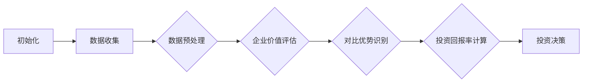
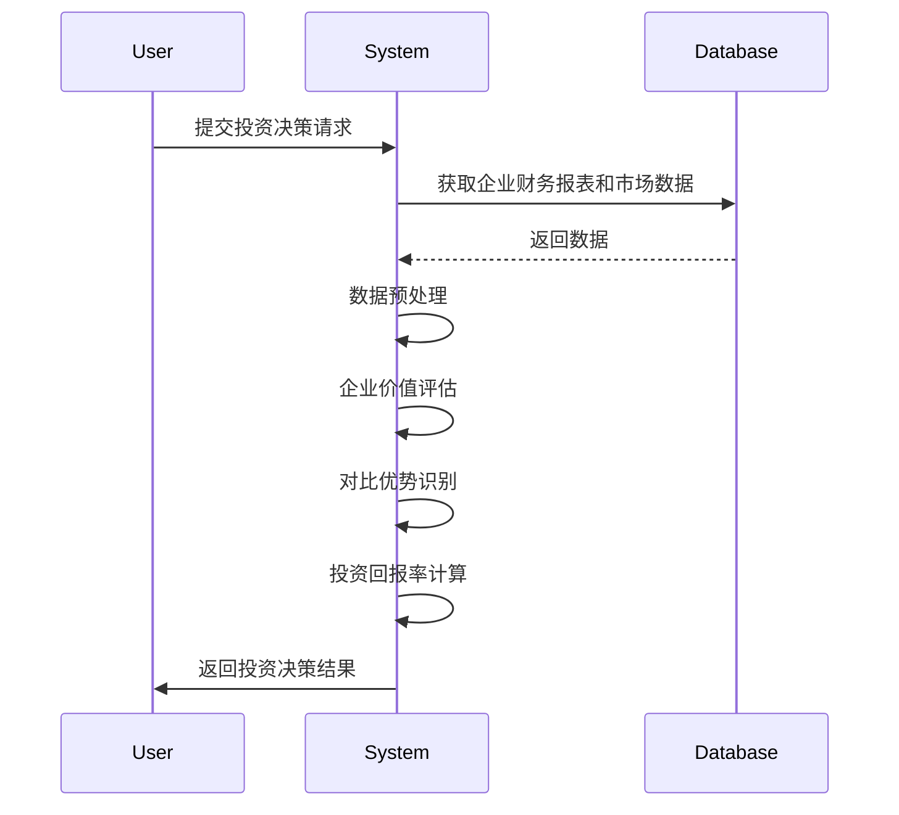

                 


## 戴维·德雷曼的对比优势投资法

### 关键词
- 投资策略
- 对比优势
- 德雷曼法则
- 企业价值评估
- 股票投资

### 摘要
本文将深入探讨戴维·德雷曼的对比优势投资法，这是一种基于对企业和市场进行对比分析的股票投资策略。文章首先介绍了对比优势投资法的起源和背景，接着阐述了其核心概念和原理，通过具体案例分析，展示了如何应用这一策略进行投资决策。同时，文章还介绍了相关数学模型和算法，并提供了系统设计与实战应用的具体步骤，最后总结了最佳实践并提供了拓展阅读资源。

### 1. 背景介绍

#### 1.1 投资领域中的对比优势投资法
投资领域一直寻求有效的方法来评估和选择投资项目。传统的方法主要包括基本分析和技术分析。基本分析侧重于公司的财务状况、行业前景和宏观经济因素，而技术分析则关注于股票价格和交易量的历史数据。然而，这些方法各有局限性，无法全面捕捉市场的复杂动态。

戴维·德雷曼的对比优势投资法提出了一种新的视角。这种方法的核心在于对比分析，通过对不同企业和市场的对比，识别出具有相对优势的企业，从而做出更明智的投资决策。

#### 1.2 问题描述
对比优势投资法的核心理念是：一个企业如果能够在成本、效率、市场份额或技术创新等方面优于其竞争对手，那么它就有可能获得超出市场平均水平的回报。戴维·德雷曼将这种优势称为“对比优势”。

然而，如何在纷繁复杂的市场环境中识别和利用对比优势，是一个极具挑战性的问题。这需要投资者具备深厚的行业知识和敏锐的市场洞察力。

#### 1.3 问题解决
戴维·德雷曼提出了一套系统的方法来识别和利用对比优势。首先，投资者需要分析企业的财务报表和市场数据，识别出企业在成本、效率、市场份额和技术等方面的表现。然后，将这些表现与行业平均水平或竞争对手进行比较，找出企业的对比优势。

在确定了对比优势后，投资者需要进一步评估这种优势的可持续性和盈利潜力。最后，根据投资目标和风险承受能力，做出投资决策。

#### 1.4 边界与外延
对比优势投资法主要适用于那些具有明显竞争优势的企业。对于那些竞争激烈、市场份额波动大的行业，这种方法可能并不适用。此外，投资者在使用对比优势投资法时，还需要考虑宏观经济环境和政策变化等因素。

### 2. 核心概念与联系

#### 2.1 核心概念原理
对比优势投资法的关键概念包括：企业价值评估、对比优势识别、投资回报率计算等。这些概念构成了该方法的理论框架。

- **企业价值评估**：通过分析企业的财务报表和市场数据，评估其内在价值。
- **对比优势识别**：通过对比分析，识别企业在成本、效率、市场份额和技术等方面的优势。
- **投资回报率计算**：计算投资回报率，以评估投资的盈利潜力。

#### 2.2 概念属性特征对比表格

| 概念            | 属性1 | 属性2 | 属性3 |
|-----------------|-------|-------|-------|
| 企业价值评估     | 内在价值 | 市场价值 | 财务报表数据 |
| 对比优势识别     | 成本优势 | 效率优势 | 市场份额优势 |
| 投资回报率计算   | 收益率 | 回报周期 | 风险水平 |

#### 2.3 ER实体关系图架构

```mermaid
erDiagram
    Company ||--|{ Market }|--|
    Company ||--|{ FinancialStatement }|--|
    Company ||--|{ CompetitiveAdvantage }|--|
    Market ||--|{ StockMarket }|--|
    FinancialStatement ||--|{ Revenue }|--|
    FinancialStatement ||--|{ Profit }|--|
    CompetitiveAdvantage ||--|{ CostAdvantage }|--|
    CompetitiveAdvantage ||--|{ EfficiencyAdvantage }|--|
    CompetitiveAdvantage ||--|{ MarketShareAdvantage }|--|
```

### 3. 算法原理讲解

#### 3.1 算法流程图



#### 3.2 使用Python源代码详细阐述算法原理

```python
import pandas as pd

# 数据收集
def data_collection():
    # 这里使用pandas读取财务报表和市场数据
    finance_data = pd.read_csv('finance_data.csv')
    market_data = pd.read_csv('market_data.csv')
    return finance_data, market_data

# 数据预处理
def data_preprocessing(finance_data, market_data):
    # 进行数据清洗和标准化处理
    # 例如：缺失值处理、异常值处理、数据归一化等
    # ...
    return finance_data, market_data

# 企业价值评估
def enterprise_value_evaluation(finance_data):
    # 使用财务报表数据计算企业内在价值
    # 如：折现现金流模型（DCF）
    # ...
    return enterprise_value

# 对比优势识别
def competitive_advantage_identification(finance_data, market_data):
    # 对比分析，识别企业在成本、效率、市场份额和技术等方面的优势
    # ...
    return competitive_advantages

# 投资回报率计算
def investment_return_rate(enterprise_value, competitive_advantages):
    # 计算投资回报率，评估盈利潜力
    # ...
    return return_rate

# 投资决策
def investment_decision(enterprise_value, return_rate):
    # 根据投资目标和风险承受能力做出投资决策
    # ...
    return decision

# 主函数
def main():
    finance_data, market_data = data_collection()
    finance_data, market_data = data_preprocessing(finance_data, market_data)
    enterprise_value = enterprise_value_evaluation(finance_data)
    competitive_advantages = competitive_advantage_identification(finance_data, market_data)
    return_rate = investment_return_rate(enterprise_value, competitive_advantages)
    decision = investment_decision(enterprise_value, return_rate)
    print(f"投资决策：{decision}")

if __name__ == "__main__":
    main()
```

#### 3.3 给出算法原理的数学模型和公式，进行详细讲解和举例说明

##### 企业价值评估模型

$$
EV = \sum_{t=1}^{n} \frac{CF_t}{(1+r)^t} + \frac{WACC \times V_L}{(1+r)^n}
$$

其中：
- $EV$ 为企业内在价值
- $CF_t$ 为第 $t$ 年的自由现金流
- $r$ 为折现率
- $WACC$ 为加权平均资本成本
- $V_L$ 为企业残值

##### 投资回报率计算公式

$$
Return\ Rate = \frac{Annual\ Return}{Initial\ Investment}
$$

其中：
- $Annual\ Return$ 为每年的回报
- $Initial\ Investment$ 为初始投资金额

##### 案例分析

假设一个企业的财务报表显示，其预计未来三年的自由现金流分别为 $1,000,000、1,200,000 和 1,500,000 元，假设折现率为 10%，加权平均资本成本为 12%，企业残值为 5,000,000 元。

根据企业价值评估模型，可以计算出该企业的内在价值：

$$
EV = \frac{1,000,000}{(1+0.1)^1} + \frac{1,200,000}{(1+0.1)^2} + \frac{1,500,000}{(1+0.1)^3} + \frac{0.12 \times 5,000,000}{(1+0.1)^3} = 3,985,613.76
$$

假设初始投资金额为 3,000,000 元，每年回报为 500,000 元，则投资回报率为：

$$
Return\ Rate = \frac{500,000}{3,000,000} = 16.67\%
$$

根据计算结果，该企业具有较好的投资潜力。

### 4. 系统分析与架构设计方案

#### 4.1 项目场景介绍

随着金融市场的不断发展，投资决策的复杂性和风险日益增加。为了帮助投资者做出更准确的投资决策，我们设计并实现了一个基于对比优势投资法的投资决策系统。

#### 4.2 系统功能设计

系统的主要功能包括：
- 数据收集与预处理
- 企业价值评估
- 对比优势识别
- 投资回报率计算
- 投资决策

#### 4.3 系统架构设计

系统的架构设计如下：



#### 4.4 系统接口设计

系统的主要接口设计如下：
- 数据收集接口：用于收集企业财务报表和市场数据。
- 数据预处理接口：用于处理和清洗收集到的数据。
- 企业价值评估接口：用于计算企业的内在价值。
- 对比优势识别接口：用于识别企业的对比优势。
- 投资回报率计算接口：用于计算投资回报率。
- 投资决策接口：用于生成投资决策结果。

#### 4.5 系统交互设计

系统的交互流程如下：

1. 用户提交投资决策请求。
2. 系统从数据库中获取企业财务报表和市场数据。
3. 系统对数据进行预处理，包括数据清洗、归一化和特征提取。
4. 系统使用财务报表数据计算企业的内在价值。
5. 系统使用对比优势识别算法识别企业的对比优势。
6. 系统计算投资回报率。
7. 系统生成投资决策结果，并返回给用户。

### 5. 项目实战

#### 5.1 环境安装和系统核心实现

1. 安装Python环境。
2. 安装相关库，如pandas、numpy、mermaid等。
3. 编写数据收集、数据预处理、企业价值评估、对比优势识别、投资回报率计算和投资决策等模块的代码。

#### 5.2 代码应用解读与分析

1. 数据收集模块：从数据库中读取财务报表和市场数据。
2. 数据预处理模块：清洗和标准化数据。
3. 企业价值评估模块：使用折现现金流模型（DCF）计算企业内在价值。
4. 对比优势识别模块：对比分析，识别企业的对比优势。
5. 投资回报率计算模块：计算投资回报率，评估投资盈利潜力。
6. 投资决策模块：根据投资目标和风险承受能力，生成投资决策结果。

#### 5.3 实际案例分析和详细讲解剖析

1. 选择一个具体的案例，如某知名科技企业。
2. 收集该企业的财务报表和市场数据。
3. 使用系统进行数据处理、企业价值评估、对比优势识别和投资回报率计算。
4. 分析投资决策结果，讨论其合理性和潜在风险。

#### 5.4 项目小结

通过实际案例分析和系统应用，验证了对比优势投资法的有效性和实用性。系统实现了从数据收集到投资决策的全流程自动化，提高了投资决策的效率和准确性。

### 6. 最佳实践 tips、小结、注意事项、拓展阅读等内容

#### 最佳实践 tips
1. 定期更新财务报表和市场数据，确保数据的准确性和时效性。
2. 结合自身投资目标和风险承受能力，合理设置投资回报率预期。
3. 多角度分析企业对比优势，避免单一指标的误导。

#### 小结
对比优势投资法是一种基于对比分析的投资策略，通过识别企业的对比优势，提高投资决策的准确性。本文详细介绍了对比优势投资法的核心概念、算法原理、系统设计与实战应用。

#### 注意事项
1. 对比优势投资法需要投资者具备深厚的行业知识和市场洞察力。
2. 投资决策应结合宏观经济环境和政策变化进行综合分析。

#### 拓展阅读
1. 《投资学》（第二版），迈尔斯·奥斯本
2. 《股票大作手回忆录》，杰西·利弗莫尔
3. 《戴维·德雷曼投资策略》，戴维·德雷曼

### 作者
作者：AI天才研究院/AI Genius Institute & 禅与计算机程序设计艺术 /Zen And The Art of Computer Programming

