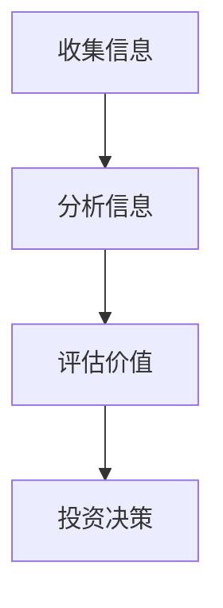
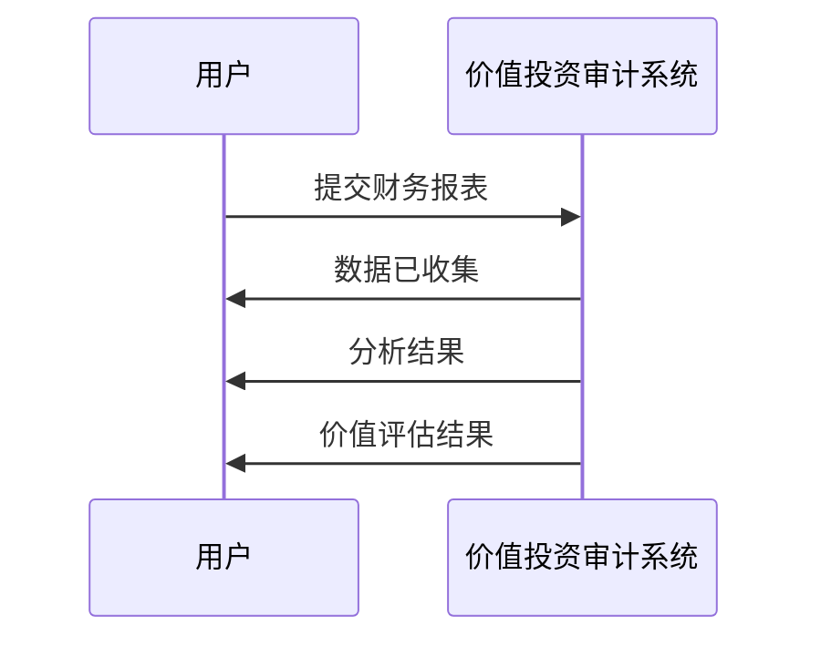

                 

### 文章标题：托马斯·罗尼的价值投资审计：全面评估公司价值

### 关键词：价值投资审计、公司价值评估、托马斯·罗尼、财务指标、非财务指标

### 摘要：本文详细探讨了托马斯·罗尼的价值投资审计方法，从核心概念、算法原理、系统架构到项目实战，全面评估公司价值的理论与实践。文章旨在为投资者和分析师提供一套系统的价值投资审计工具和方法。

---

### 第一部分：背景介绍

#### 第1章 问题背景与解决方案

##### 1.1 价值投资与审计的基本概念
价值投资是一种基于公司内在价值而非市场波动进行投资的方法。审计则是对公司财务报表和相关信息的真实性、准确性和完整性进行独立验证的过程。价值投资审计结合了这两种方法，旨在评估公司的实际价值。

##### 1.2 公司价值评估的挑战与需求
当前公司价值评估面临诸多挑战，如财务信息不透明、市场波动等。价值投资审计能够帮助投资者更准确地识别优质投资标的，降低投资风险。

##### 1.3 托马斯·罗尼的价值投资审计方法
托马斯·罗尼是一位著名的价值投资大师，他的审计方法以深入分析公司财务状况、业务模式和市场前景为核心。本文将详细探讨这一方法。

---

### 第二部分：核心概念与联系

#### 第2章 价值投资审计的核心概念

##### 2.1 价值投资审计的基本原理
价值投资审计遵循以下原则：
1. **真实性与完整性**：确保财务报表的真实性和完整性。
2. **价值判断**：基于公司内在价值进行投资决策。

##### 2.2 公司价值评估的关键因素
公司价值评估涉及多个方面，包括：
1. **财务指标**：如利润、现金流、负债等。
2. **非财务指标**：如市场份额、研发能力、企业文化等。
3. **市场指标**：如市盈率、市净率等。

##### 2.3 价值投资审计的流程与方法
价值投资审计的流程包括：
1. **收集信息**：获取公司财务报表、业务报告等。
2. **分析信息**：对财务报表进行详细分析。
3. **评估价值**：结合市场情况和公司前景，评估公司价值。

---

#### 第3章 价值投资审计的算法原理

##### 3.1 审计算法概述
价值投资审计常用以下算法：
1. **财务比率分析**：通过计算公司财务指标比率，评估公司财务状况。
2. **现金流量折现模型**（DCF）：通过预测公司未来现金流，折现到当前价值。

##### 3.2 审计算法的数学模型
1. 财务比率分析：
   - 偿债能力：$ \text{流动比率} = \frac{\text{流动资产}}{\text{流动负债}} $
   - 盈利能力：$ \text{净资产收益率} = \frac{\text{净利润}}{\text{平均净资产}} $

2. DCF模型：
   - $ \text{公司价值} = \sum_{t=1}^{n} \frac{\text{CF}_t}{(1+r)^t} + \frac{\text{终值}}{(1+r)^n} $

##### 3.3 审计算法的mermaid流程图


##### 3.4 审计算法的Python实现
```python
# 财务比率分析示例
def calculate_rationals(income_statement, balance_sheet):
    # 计算利润率
    profit_margin = income_statement['净利润'] / income_statement['营业收入']
    
    # 计算负债率
    debt_ratio = balance_sheet['总负债'] / balance_sheet['总资产']
    
    return profit_margin, debt_ratio

# DCF模型示例
def dcfvaluation(cash_flows, discount_rate):
    present_value = sum([cf / (1 + discount_rate)**t for t, cf in enumerate(cash_flows)])
    return present_value
```

---

### 第三部分：系统分析与架构设计方案

#### 第4章 价值投资审计的系统架构设计

##### 4.1 项目介绍
本项目旨在构建一个价值投资审计系统，帮助投资者评估公司价值。

##### 4.2 系统功能设计
系统功能包括：
1. **数据收集**：自动获取公司财务报表。
2. **数据分析**：计算财务比率，评估公司财务状况。
3. **价值评估**：使用DCF模型评估公司价值。

##### 4.3 系统架构设计
系统采用B/S架构，分为数据层、逻辑层和表现层。

##### 4.4 系统接口设计
系统提供以下接口：
1. **数据接口**：与财务报表数据源对接。
2. **服务接口**：提供数据分析和服务。

##### 4.5 系统交互mermaid序列图


---

### 第四部分：项目实战

#### 第5章 价值投资审计项目实战

##### 5.1 环境安装
- 安装Python环境。
- 安装数据分析库：pandas、numpy等。

##### 5.2 系统核心实现源代码
```python
# 财务比率分析模块
def calculate_rationals(income_statement, balance_sheet):
    profit_margin = income_statement['净利润'] / income_statement['营业收入']
    debt_ratio = balance_sheet['总负债'] / balance_sheet['总资产']
    return profit_margin, debt_ratio

# DCF模型模块
def dcfvaluation(cash_flows, discount_rate):
    present_value = sum([cf / (1 + discount_rate)**t for t, cf in enumerate(cash_flows)])
    return present_value
```

##### 5.3 代码应用解读与分析
- **财务比率分析**：计算公司利润率和负债率。
- **DCF模型**：预测公司未来现金流，评估公司价值。

##### 5.4 实际案例分析和详细讲解剖析
- **案例**：对某公司进行价值投资审计。
- **分析**：收集公司财务报表，计算财务比率，使用DCF模型评估公司价值。

##### 5.5 项目小结
本项目成功构建了一个价值投资审计系统，为投资者提供了有效的工具。

---

### 第五部分：最佳实践与总结

#### 第6章 价值投资审计的最佳实践

##### 6.1 最佳实践技巧
- **数据质量**：确保财务报表数据的准确性。
- **综合分析**：结合财务和非财务指标，全面评估公司价值。

##### 6.2 注意事项与风险控制
- **避免过度依赖财务数据**：考虑市场变化和非财务因素。
- **风险评估**：对投资风险进行充分评估。

##### 6.3 拓展阅读
- **相关书籍**：《证券分析》、《聪明的投资者》等。
- **学术论文**：研究价值投资审计的最新成果。

---

#### 第7章 小结与展望

##### 7.1 全书总结
本文全面介绍了托马斯·罗尼的价值投资审计方法，包括核心概念、算法原理、系统设计、项目实战等内容。

##### 7.2 未来展望
随着大数据和人工智能技术的发展，价值投资审计将更加智能化和精确化。

---

### 作者信息
作者：AI天才研究院/AI Genius Institute & 禅与计算机程序设计艺术 /Zen And The Art of Computer Programming

---

通过以上内容，本文系统地介绍了托马斯·罗尼的价值投资审计方法，旨在为投资者提供一套全面、科学的评估公司价值的工具。希望本文能够对读者有所启发和帮助。

