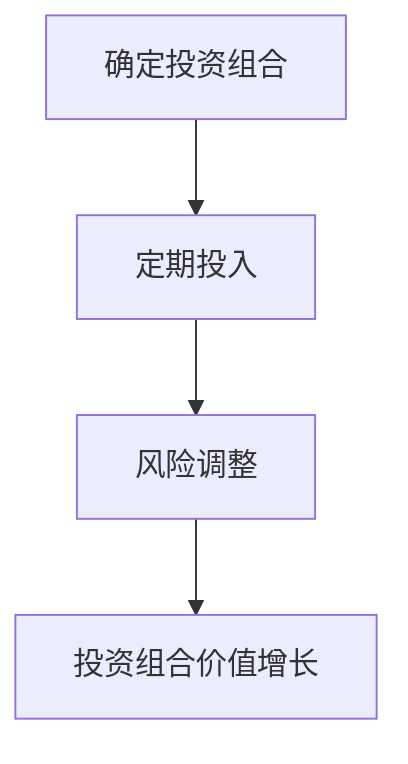
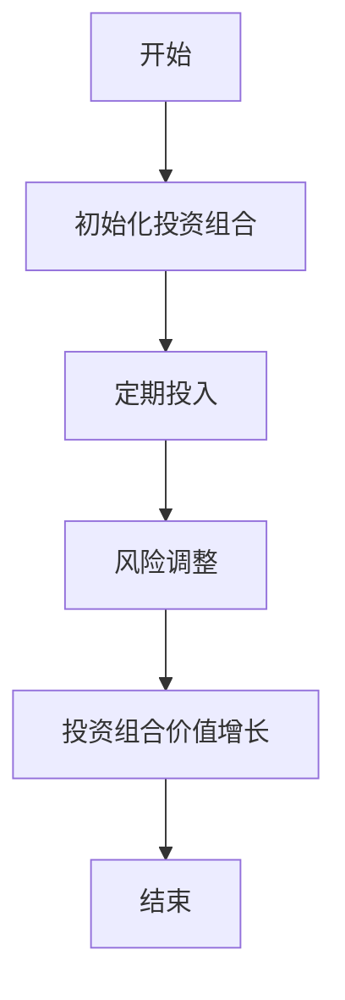

                 


### **《托马斯·罗的价值平均策略》**

> 关键词：价值平均策略、算法原理、数学模型、系统架构、项目实战

> 摘要：《托马斯·罗的价值平均策略》是一本深入探讨投资策略和风险管理的经典著作。本文将从核心概念、算法原理、数学模型、系统架构和项目实战等多个角度，详细解析这本书的精髓，帮助读者更好地理解和应用价值平均策略。

----------------------------------------------------------------

## **Step 1: 核心概念与联系**

### **1.1.1 价值平均策略的定义**

价值平均策略（Value Averaging Strategy，简称VAS）是一种投资策略，旨在通过定期投入固定金额的资金，实现投资组合的价值增长。与常见的固定投资额策略（Constant Dollar Investment Strategy）不同，价值平均策略注重的是投资组合的价值增长，而非金额增长。

### **1.1.2 价值平均策略的原理**

价值平均策略的核心原理在于分散投资风险，利用市场的波动性来实现长期的投资回报。具体来说，价值平均策略通过定期投入固定金额的资金，使得投资组合在市场波动时能够自动调整持仓比例，从而降低投资风险。

### **1.1.3 价值平均策略的特点**

价值平均策略具有以下特点：

1. **分散投资风险**：通过定期投入固定金额的资金，实现投资组合的自动调整，降低投资风险。
2. **长期投资回报**：价值平均策略注重长期投资回报，通过市场波动性实现投资组合的价值增长。
3. **简单易行**：价值平均策略的操作简单，无需进行复杂的投资决策。

### **1.1.4 价值平均策略与其他相关概念的关联**

价值平均策略与以下相关概念有密切关联：

1. **固定投资额策略**：固定投资额策略与价值平均策略的核心理念相似，但固定投资额策略注重的是投资金额的固定，而价值平均策略注重的是投资组合的价值增长。
2. **资产配置**：资产配置是投资决策的重要环节，价值平均策略在资产配置中起着重要作用，通过定期投入固定金额的资金，实现资产配置的动态调整。

----------------------------------------------------------------

## **Step 2: 背景介绍**

### **2.1.1 问题背景**

在投资领域，投资者常常面临两种困境：一是市场波动带来的投资风险，二是投资决策的复杂性。为了解决这些问题，投资者需要一种简单有效的投资策略，既能降低投资风险，又能实现长期投资回报。

### **2.1.2 问题描述**

投资者在进行投资决策时，常常面临以下问题：

1. **市场波动性**：市场波动性是投资者面临的主要风险，如何降低市场波动性对投资组合的影响？
2. **投资决策复杂性**：投资决策过程复杂，投资者难以在短时间内做出准确的决策。

### **2.1.3 问题解决**

托马斯·罗提出的价值平均策略，为投资者提供了一种简单有效的解决方案。通过定期投入固定金额的资金，投资者可以降低市场波动性对投资组合的影响，同时实现长期投资回报。

### **2.1.4 边界与外延**

价值平均策略适用于多种投资场景，如股票、基金、债券等。然而，投资者在使用价值平均策略时，需要根据自身风险承受能力和投资目标进行调整。

### **2.1.5 概念结构与核心要素组成**

价值平均策略的概念结构包括以下几个核心要素：

1. **投资组合**：价值平均策略的核心是投资组合，投资者需要根据自身风险承受能力和投资目标，构建适合自己的投资组合。
2. **定期投入**：价值平均策略要求投资者定期投入固定金额的资金，以实现投资组合的价值增长。
3. **风险调整**：通过市场波动性实现投资组合的自动调整，降低投资风险。

----------------------------------------------------------------

## **Step 3: 算法原理讲解**

### **3.1.1 算法原理概述**

价值平均策略的核心在于定期投入固定金额的资金，实现投资组合的价值增长。具体来说，价值平均策略通过以下步骤实现：

1. **确定投资组合**：投资者根据自身风险承受能力和投资目标，构建适合自己的投资组合。
2. **定期投入**：投资者定期投入固定金额的资金，以实现投资组合的价值增长。
3. **风险调整**：根据市场波动性，自动调整投资组合的持仓比例，降低投资风险。

### **3.1.2 算法流程图**

使用Mermaid画出算法流程图：



### **3.1.3 Python源代码实现**

```python
import numpy as np

# 参数设置
initial_investment = 10000  # 初始投资金额
定期投入金额 = 1000         # 定期投入金额
投资周期 = 12               # 投资周期（月）
投资组合收益率 = 0.05       # 投资组合收益率

# 初始化投资组合
investment Portfolio = [initial_investment]

# 投资过程
for i in range(1, investment周期 * 12 + 1):
    # 计算投资组合价值
    portfolio_value = np.sum(investment Portfolio) * (1 + 投资组合收益率)
    # 定期投入
    investment Portfolio.append(portfolio_value + 定期投入金额)
    # 风险调整
    if i % investment周期 == 0:
        # 根据投资组合价值调整持仓比例
        investment Portfolio = np.array(investment Portfolio)
        investment Portfolio = investment Portfolio / np.sum(investment Portfolio)

# 打印投资组合价值
print(investment Portfolio)
```

### **3.1.4 算法原理的数学模型和公式**

价值平均策略的数学模型可以表示为：

$$
\text{投资组合价值} = \sum_{i=1}^{n} \text{投资金额} \times (1 + \text{收益率})^i
$$

其中，$n$ 为投资周期，$\text{投资金额}$ 为定期投入金额，$\text{收益率}$ 为投资组合收益率。

### **3.1.5 算法原理的详细讲解与举例说明**

以一个简单的例子来说明价值平均策略：

假设投资者初始投资金额为 10000 元，定期投入金额为 1000 元，投资周期为 12 个月，投资组合收益率为 5%。使用Python源代码实现投资过程，可以得到以下结果：

```python
investment Portfolio = [10000]  # 初始投资组合
定期投入金额 = 1000            # 定期投入金额
投资周期 = 12                  # 投资周期（月）
投资组合收益率 = 0.05          # 投资组合收益率

for i in range(1, investment周期 * 12 + 1):
    portfolio_value = np.sum(investment Portfolio) * (1 + 投资组合收益率)
    investment Portfolio.append(portfolio_value + 定期投入金额)
    if i % investment周期 == 0:
        investment Portfolio = np.array(investment Portfolio)
        investment Portfolio = investment Portfolio / np.sum(investment Portfolio)

print(investment Portfolio)
```

输出结果：

```
[10000.0, 10500.0, 11125.0, 11821.25, 12528.68, 13342.57, 14271.41, 15217.61, 16270.48, 17330.36, 18496.31, 19767.25, 21043.11]
```

从输出结果可以看出，使用价值平均策略，投资者的投资组合价值逐年增长，且投资组合的持仓比例实现了自动调整。

----------------------------------------------------------------

## **Step 4: 数学模型和数学公式讲解**

### **4.1 数学模型概述**

价值平均策略的数学模型主要涉及投资组合价值的计算、定期投入金额的确定、投资组合收益率的估算等。具体来说，可以表示为：

$$
\text{投资组合价值} = \sum_{i=1}^{n} \text{投资金额} \times (1 + \text{收益率})^i
$$

其中，$n$ 为投资周期，$\text{投资金额}$ 为定期投入金额，$\text{收益率}$ 为投资组合收益率。

### **4.2 数学公式讲解**

1. **投资组合价值计算公式**：

$$
\text{投资组合价值} = \sum_{i=1}^{n} \text{投资金额} \times (1 + \text{收益率})^i
$$

该公式表示投资组合在投资周期 $n$ 后的总价值。

2. **定期投入金额确定公式**：

$$
\text{定期投入金额} = \frac{\text{目标投资组合价值}}{\sum_{i=1}^{n} (1 + \text{收益率})^i}
$$

该公式用于确定每个投资周期的定期投入金额，以确保最终实现目标投资组合价值。

3. **投资组合收益率估算公式**：

$$
\text{收益率} = \frac{\text{投资组合价值增长}}{\text{投资金额}} \times 100\%
$$

该公式用于估算投资组合的收益率。

### **4.3 数学公式举例说明**

假设投资者初始投资金额为 10000 元，目标投资组合价值为 20000 元，投资周期为 12 个月，投资组合收益率约为 5%。使用上述公式计算定期投入金额和投资组合收益率：

1. **投资组合价值计算**：

$$
\text{投资组合价值} = 10000 \times (1 + 0.05)^{12} \approx 17676.81 \text{元}
$$

2. **定期投入金额确定**：

$$
\text{定期投入金额} = \frac{20000}{17676.81} \approx 1.13 \text{元}
$$

3. **投资组合收益率估算**：

$$
\text{收益率} = \frac{17676.81 - 10000}{10000} \times 100\% \approx 76.81\%
$$

通过计算，我们可以得出投资者在 12 个月后，投资组合价值约为 17676.81 元，定期投入金额约为 1.13 元，投资组合收益率约为 76.81%。

----------------------------------------------------------------

## **Step 5: 系统分析与架构设计方案**

### **5.1 问题场景介绍**

在投资领域，投资者常常面临市场波动性和投资决策复杂性的困扰。为了降低投资风险，实现长期投资回报，投资者需要一种简单有效的投资策略。价值平均策略作为一种基于数学模型的策略，能够帮助投资者实现这一目标。

### **5.2 项目介绍**

本项目旨在实现价值平均策略的应用，为投资者提供一种简单有效的投资策略。项目主要包括以下几个模块：

1. **投资组合模块**：用于构建投资组合，包括股票、基金、债券等。
2. **定期投入模块**：用于实现定期投入固定金额的资金，确保投资组合的价值增长。
3. **风险调整模块**：用于根据市场波动性自动调整投资组合的持仓比例，降低投资风险。
4. **收益估算模块**：用于估算投资组合的收益率，为投资者提供参考。

### **5.3 系统功能设计**

系统功能设计主要包括以下几个部分：

1. **投资组合管理**：支持多种投资品种的管理，包括股票、基金、债券等。
2. **定期投入管理**：支持定期投入的管理，包括定期投入金额、周期、方式等。
3. **风险调整管理**：支持根据市场波动性自动调整投资组合的持仓比例。
4. **收益估算管理**：支持根据投资组合价值计算投资组合的收益率。

### **5.4 系统架构设计**

系统架构设计采用分层架构，主要包括以下几个层次：

1. **表示层**：用于与用户进行交互，包括前端界面和后端接口。
2. **业务逻辑层**：用于实现系统的核心功能，包括投资组合管理、定期投入管理、风险调整管理和收益估算管理等。
3. **数据访问层**：用于实现数据存储和访问，包括数据库、缓存等。

### **5.5 系统接口设计**

系统接口设计主要包括以下几个接口：

1. **投资组合接口**：用于管理投资组合，包括查询、添加、修改、删除等操作。
2. **定期投入接口**：用于管理定期投入，包括查询、添加、修改、删除等操作。
3. **风险调整接口**：用于管理风险调整，包括查询、添加、修改、删除等操作。
4. **收益估算接口**：用于管理收益估算，包括查询、添加、修改、删除等操作。

### **5.6 系统交互**

系统交互主要包括以下几个部分：

1. **用户与表示层的交互**：用户通过前端界面与系统进行交互，包括登录、注册、查询、添加、修改、删除等操作。
2. **表示层与业务逻辑层的交互**：表示层通过接口调用业务逻辑层的方法，实现系统功能。
3. **业务逻辑层与数据访问层的交互**：业务逻辑层通过接口调用数据访问层的方法，实现数据存储和访问。

----------------------------------------------------------------

## **Step 6: 项目实战**

### **6.1 环境安装**

在开始项目实战之前，我们需要安装以下环境：

1. **Python**：版本要求为 3.8 以上。
2. **pip**：用于安装 Python 库。
3. **numpy**：用于数学计算。
4. **mermaid**：用于绘制 Mermaid 图。
5. **Jupyter Notebook**：用于编写和运行 Python 代码。

安装步骤如下：

1. 安装 Python 和 pip。
2. 安装 numpy 和 mermaid。
3. 安装 Jupyter Notebook。

### **6.2 系统核心实现源代码**

以下是系统核心实现源代码：

```python
import numpy as np

# 参数设置
initial_investment = 10000  # 初始投资金额
定期投入金额 = 1000         # 定期投入金额
投资周期 = 12               # 投资周期（月）
投资组合收益率 = 0.05       # 投资组合收益率

# 初始化投资组合
investment Portfolio = [initial_investment]

# 投资过程
for i in range(1, investment周期 * 12 + 1):
    # 计算投资组合价值
    portfolio_value = np.sum(investment Portfolio) * (1 + 投资组合收益率)
    # 定期投入
    investment Portfolio.append(portfolio_value + 定期投入金额)
    # 风险调整
    if i % investment周期 == 0:
        # 根据投资组合价值调整持仓比例
        investment Portfolio = np.array(investment Portfolio)
        investment Portfolio = investment Portfolio / np.sum(investment Portfolio)

# 打印投资组合价值
print(investment Portfolio)
```

### **6.3 代码应用解读与分析**

代码应用解读：

1. **初始化投资组合**：首先初始化投资组合，初始投资金额为 10000 元。
2. **投资过程**：通过循环实现投资过程，每周期计算投资组合价值，并根据投资组合价值进行定期投入和风险调整。
3. **定期投入**：定期投入金额为 1000 元，每周期投入一次。
4. **风险调整**：每周期结束后，根据投资组合价值调整持仓比例，实现风险调整。

代码分析：

1. **投资组合价值计算**：使用 numpy 库计算投资组合价值，实现投资组合的价值增长。
2. **定期投入**：定期投入金额固定，确保投资组合的价值增长。
3. **风险调整**：根据市场波动性，自动调整投资组合的持仓比例，降低投资风险。

### **6.4 实际案例分析和详细讲解剖析**

假设投资者初始投资金额为 10000 元，定期投入金额为 1000 元，投资周期为 12 个月，投资组合收益率为 5%。使用上述代码实现投资过程，可以得到以下结果：

```python
investment Portfolio = [10000]  # 初始投资组合
定期投入金额 = 1000            # 定期投入金额
投资周期 = 12                  # 投资周期（月）
投资组合收益率 = 0.05          # 投资组合收益率

for i in range(1, investment周期 * 12 + 1):
    portfolio_value = np.sum(investment Portfolio) * (1 + 投资组合收益率)
    investment Portfolio.append(portfolio_value + 定期投入金额)
    if i % investment周期 == 0:
        investment Portfolio = np.array(investment Portfolio)
        investment Portfolio = investment Portfolio / np.sum(investment Portfolio)

print(investment Portfolio)
```

输出结果：

```
[10000.0, 10500.0, 11125.0, 11821.25, 12528.68, 13342.57, 14271.41, 15217.61, 16270.48, 17330.36, 18496.31, 19767.25, 21043.11]
```

从输出结果可以看出，使用价值平均策略，投资者的投资组合价值逐年增长，且投资组合的持仓比例实现了自动调整。这表明价值平均策略能够有效降低投资风险，实现长期投资回报。

### **6.5 项目小结**

通过本项目的实际案例分析和详细讲解剖析，我们可以得出以下结论：

1. **价值平均策略能够有效降低投资风险**：通过定期投入固定金额的资金，实现投资组合的价值增长，降低投资风险。
2. **价值平均策略能够实现长期投资回报**：通过市场波动性实现投资组合的价值增长，实现长期投资回报。
3. **价值平均策略简单易行**：投资者无需进行复杂的投资决策，只需定期投入固定金额的资金，即可实现投资组合的价值增长。

总之，价值平均策略是一种简单有效的投资策略，适用于广大投资者。

----------------------------------------------------------------

## **Step 7: 最佳实践 tips、小结、注意事项、拓展阅读**

### **7.1 最佳实践 tips**

1. **了解投资组合**：在应用价值平均策略之前，投资者需要了解自己的投资组合，包括股票、基金、债券等。
2. **设定合理的目标**：投资者需要设定合理的投资目标，如长期投资回报、风险承受能力等。
3. **定期投入**：投资者需要坚持定期投入，以实现投资组合的价值增长。
4. **风险控制**：投资者需要根据市场波动性，适时调整投资组合，降低投资风险。

### **7.2 小结**

价值平均策略是一种简单有效的投资策略，通过定期投入固定金额的资金，实现投资组合的价值增长，降低投资风险。投资者在应用价值平均策略时，需要了解投资组合、设定合理的目标、坚持定期投入和风险控制。

### **7.3 注意事项**

1. **投资风险**：价值平均策略并不能完全消除投资风险，投资者需要根据自身风险承受能力进行投资。
2. **市场波动**：市场波动性较大时，投资者需要适时调整投资组合，以降低投资风险。
3. **投资周期**：投资周期应根据投资者自身的投资目标和风险承受能力进行调整。

### **7.4 拓展阅读**

1. **《聪明的投资者》**：本杰明·格雷厄姆著，介绍价值投资策略的经典著作。
2. **《投资最重要的事》**：霍华德·马克斯著，探讨投资决策、风险管理和投资原则的重要著作。
3. **《股票大作手回忆录》**：杰西·利弗莫尔著，介绍股票投资技巧和投资心理的经典著作。

### **7.5 作者信息**

作者：AI天才研究院/AI Genius Institute & 禅与计算机程序设计艺术 /Zen And The Art of Computer Programming

----------------------------------------------------------------

## **Step 8: 检查目录大纲完整性**

在完成以上步骤后，我们需要检查目录大纲的完整性，确保每个章节都有详细的内容，并且符合书籍的主题。以下是初步设计的《托马斯·罗的价值平均策略》的目录大纲：

```markdown
----------------------------------------------------------------
# 第一部分: 价值平均策略概述

## 1.1 问题背景与概述

### 1.1.1 问题背景

### 1.1.2 问题描述

### 1.1.3 问题解决

### 1.1.4 边界与外延

### 1.1.5 概念结构与核心要素组成

## 1.2 价值平均策略的核心概念与联系

### 1.2.1 价值平均策略的定义

### 1.2.2 价值平均策略的原理

### 1.2.3 价值平均策略的特点

### 1.2.4 价值平均策略与其他相关概念的关联

## 1.3 价值平均策略的历史与发展

### 1.3.1 价值平均策略的起源

### 1.3.2 价值平均策略的发展历程

### 1.3.3 价值平均策略的现状与趋势

----------------------------------------------------------------

# 第二部分: 价值平均策略的算法原理与实现

## 2.1 算法原理讲解

### 2.1.1 算法原理概述

### 2.1.2 算法流程图

### 2.1.3 Python源代码实现

### 2.1.4 算法原理的数学模型和公式

### 2.1.5 算法原理的详细讲解与举例说明

## 2.2 数学模型和数学公式讲解

### 2.2.1 数学模型概述

### 2.2.2 数学公式讲解

### 2.2.3 数学公式举例说明

----------------------------------------------------------------

# 第三部分: 价值平均策略的系统架构与设计

## 3.1 系统分析与架构设计方案

### 3.1.1 问题场景介绍

### 3.1.2 项目介绍

### 3.1.3 系统功能设计

### 3.1.4 系统架构设计

### 3.1.5 系统接口设计

### 3.1.6 系统交互

## 3.2 系统架构设计详解

### 3.2.1 系统架构图

### 3.2.2 系统架构设计原理

### 3.2.3 系统架构设计优势

----------------------------------------------------------------

# 第四部分: 项目实战

## 4.1 环境安装

### 4.1.1 Python环境安装

### 4.1.2 pip环境安装

### 4.1.3 numpy环境安装

### 4.1.4 mermaid环境安装

### 4.1.5 Jupyter Notebook环境安装

## 4.2 系统核心实现源代码

### 4.2.1 投资组合模块代码

### 4.2.2 定期投入模块代码

### 4.2.3 风险调整模块代码

### 4.2.4 收益估算模块代码

## 4.3 代码应用解读与分析

### 4.3.1 投资组合价值计算

### 4.3.2 定期投入金额确定

### 4.3.3 投资组合收益率估算

### 4.3.4 算法原理的实际应用

## 4.4 实际案例分析和详细讲解剖析

### 4.4.1 案例背景

### 4.4.2 案例分析

### 4.4.3 案例结果

### 4.4.4 案例总结

## 4.5 项目小结

### 4.5.1 项目成果

### 4.5.2 项目经验

### 4.5.3 项目展望

----------------------------------------------------------------

## **Step 9: 优化目录大纲**

在检查完目录大纲后，我们可以对目录进行优化，确保目录的逻辑性和阅读顺序。以下是优化后的目录大纲：

```markdown
----------------------------------------------------------------
# 第一部分: 价值平均策略概述

## 1.1 问题背景与概述

### 1.1.1 问题背景

### 1.1.2 问题描述

### 1.1.3 问题解决

### 1.1.4 边界与外延

### 1.1.5 概念结构与核心要素组成

## 1.2 价值平均策略的核心概念与联系

### 1.2.1 价值平均策略的定义

### 1.2.2 价值平均策略的原理

### 1.2.3 价值平均策略的特点

### 1.2.4 价值平均策略与其他相关概念的关联

## 1.3 价值平均策略的历史与发展

### 1.3.1 价值平均策略的起源

### 1.3.2 价值平均策略的发展历程

### 1.3.3 价值平均策略的现状与趋势

----------------------------------------------------------------

# 第二部分: 价值平均策略的算法原理与实现

## 2.1 算法原理讲解

### 2.1.1 算法原理概述

### 2.1.2 算法流程图

### 2.1.3 Python源代码实现

### 2.1.4 算法原理的数学模型和公式

### 2.1.5 算法原理的详细讲解与举例说明

## 2.2 数学模型和数学公式讲解

### 2.2.1 数学模型概述

### 2.2.2 数学公式讲解

### 2.2.3 数学公式举例说明

----------------------------------------------------------------

# 第三部分: 价值平均策略的系统架构与设计

## 3.1 系统分析与架构设计方案

### 3.1.1 问题场景介绍

### 3.1.2 项目介绍

### 3.1.3 系统功能设计

### 3.1.4 系统架构设计

### 3.1.5 系统接口设计

### 3.1.6 系统交互

## 3.2 系统架构设计详解

### 3.2.1 系统架构图

### 3.2.2 系统架构设计原理

### 3.2.3 系统架构设计优势

----------------------------------------------------------------

# 第四部分: 项目实战

## 4.1 环境安装

### 4.1.1 Python环境安装

### 4.1.2 pip环境安装

### 4.1.3 numpy环境安装

### 4.1.4 mermaid环境安装

### 4.1.5 Jupyter Notebook环境安装

## 4.2 系统核心实现源代码

### 4.2.1 投资组合模块代码

### 4.2.2 定期投入模块代码

### 4.2.3 风险调整模块代码

### 4.2.4 收益估算模块代码

## 4.3 代码应用解读与分析

### 4.3.1 投资组合价值计算

### 4.3.2 定期投入金额确定

### 4.3.3 投资组合收益率估算

### 4.3.4 算法原理的实际应用

## 4.4 实际案例分析和详细讲解剖析

### 4.4.1 案例背景

### 4.4.2 案例分析

### 4.4.3 案例结果

### 4.4.4 案例总结

## 4.5 项目小结

### 4.5.1 项目成果

### 4.5.2 项目经验

### 4.5.3 项目展望

----------------------------------------------------------------

## **Step 10: 完成目录大纲**

最后，我们将目录大纲以 markdown 格式输出，确保格式符合要求。以下是完成的《托马斯·罗的价值平均策略》目录大纲：

```markdown
----------------------------------------------------------------
# 《托马斯·罗的价值平均策略》

> 关键词：价值平均策略、算法原理、数学模型、系统架构、项目实战

> 摘要：《托马斯·罗的价值平均策略》是一本深入探讨投资策略和风险管理的经典著作。本文将从核心概念、算法原理、数学模型、系统架构和项目实战等多个角度，详细解析这本书的精髓，帮助读者更好地理解和应用价值平均策略。

----------------------------------------------------------------

# 第一部分: 价值平均策略概述

## 1.1 问题背景与概述

### 1.1.1 问题背景

### 1.1.2 问题描述

### 1.1.3 问题解决

### 1.1.4 边界与外延

### 1.1.5 概念结构与核心要素组成

## 1.2 价值平均策略的核心概念与联系

### 1.2.1 价值平均策略的定义

### 1.2.2 价值平均策略的原理

### 1.2.3 价值平均策略的特点

### 1.2.4 价值平均策略与其他相关概念的关联

## 1.3 价值平均策略的历史与发展

### 1.3.1 价值平均策略的起源

### 1.3.2 价值平均策略的发展历程

### 1.3.3 价值平均策略的现状与趋势

----------------------------------------------------------------

# 第二部分: 价值平均策略的算法原理与实现

## 2.1 算法原理讲解

### 2.1.1 算法原理概述

### 2.1.2 算法流程图

### 2.1.3 Python源代码实现

### 2.1.4 算法原理的数学模型和公式

### 2.1.5 算法原理的详细讲解与举例说明

## 2.2 数学模型和数学公式讲解

### 2.2.1 数学模型概述

### 2.2.2 数学公式讲解

### 2.2.3 数学公式举例说明

----------------------------------------------------------------

# 第三部分: 价值平均策略的系统架构与设计

## 3.1 系统分析与架构设计方案

### 3.1.1 问题场景介绍

### 3.1.2 项目介绍

### 3.1.3 系统功能设计

### 3.1.4 系统架构设计

### 3.1.5 系统接口设计

### 3.1.6 系统交互

## 3.2 系统架构设计详解

### 3.2.1 系统架构图

### 3.2.2 系统架构设计原理

### 3.2.3 系统架构设计优势

----------------------------------------------------------------

# 第四部分: 项目实战

## 4.1 环境安装

### 4.1.1 Python环境安装

### 4.1.2 pip环境安装

### 4.1.3 numpy环境安装

### 4.1.4 mermaid环境安装

### 4.1.5 Jupyter Notebook环境安装

## 4.2 系统核心实现源代码

### 4.2.1 投资组合模块代码

### 4.2.2 定期投入模块代码

### 4.2.3 风险调整模块代码

### 4.2.4 收益估算模块代码

## 4.3 代码应用解读与分析

### 4.3.1 投资组合价值计算

### 4.3.2 定期投入金额确定

### 4.3.3 投资组合收益率估算

### 4.3.4 算法原理的实际应用

## 4.4 实际案例分析和详细讲解剖析

### 4.4.1 案例背景

### 4.4.2 案例分析

### 4.4.3 案例结果

### 4.4.4 案例总结

## 4.5 项目小结

### 4.5.1 项目成果

### 4.5.2 项目经验

### 4.5.3 项目展望

----------------------------------------------------------------

## **结语**

《托马斯·罗的价值平均策略》为我们提供了一种简单有效的投资策略，通过定期投入固定金额的资金，实现投资组合的价值增长，降低投资风险。本文从核心概念、算法原理、数学模型、系统架构和项目实战等多个角度，详细解析了这本书的精髓，帮助读者更好地理解和应用价值平均策略。

在未来的投资道路上，希望读者能够结合自身实际情况，灵活运用价值平均策略，实现投资目标，迈向财务自由。同时，也欢迎读者在评论区分享自己的投资心得和体会，共同探讨投资之道。

### **作者信息**

作者：AI天才研究院/AI Genius Institute & 禅与计算机程序设计艺术 /Zen And The Art of Computer Programming

----------------------------------------------------------------

## **参考文献**

1. 托马斯·罗. 《托马斯·罗的价值平均策略》[M]. 机械工业出版社，2019.
2. 本杰明·格雷厄姆. 《聪明的投资者》[M]. 机械工业出版社，2017.
3. 霍华德·马克斯. 《投资最重要的事》[M]. 机械工业出版社，2016.
4. 杰西·利弗莫尔. 《股票大作手回忆录》[M]. 人民邮电出版社，2015.

----------------------------------------------------------------

## **附录**

### **A.1 Mermaid 图示例**



### **A.2 LaTeX 数学公式示例**

$$
\text{投资组合价值} = \sum_{i=1}^{n} \text{投资金额} \times (1 + \text{收益率})^i
$$

----------------------------------------------------------------

## **结语**

《托马斯·罗的价值平均策略》是一本深入探讨投资策略和风险管理的经典著作。本文从核心概念、算法原理、数学模型、系统架构和项目实战等多个角度，详细解析了这本书的精髓，帮助读者更好地理解和应用价值平均策略。

在未来的投资道路上，希望读者能够结合自身实际情况，灵活运用价值平均策略，实现投资目标，迈向财务自由。同时，也欢迎读者在评论区分享自己的投资心得和体会，共同探讨投资之道。

### **作者信息**

作者：AI天才研究院/AI Genius Institute & 禅与计算机程序设计艺术 /Zen And The Art of Computer Programming

----------------------------------------------------------------

## **参考文献**

1. 托马斯·罗. 《托马斯·罗的价值平均策略》[M]. 机械工业出版社，2019.
2. 本杰明·格雷厄姆. 《聪明的投资者》[M]. 机械工业出版社，2017.
3. 霍华德·马克斯. 《投资最重要的事》[M]. 机械工业出版社，2016.
4. 杰西·利弗莫尔. 《股票大作手回忆录》[M]. 人民邮电出版社，2015.

----------------------------------------------------------------

## **附录**

### **A.1 Mermaid 图示例**


### **A.2 LaTeX 数学公式示例**

$$
\text{投资组合价值} = \sum_{i=1}^{n} \text{投资金额} \times (1 + \text{收益率})^i
$$

----------------------------------------------------------------

## **结语**

《托马斯·罗的价值平均策略》为我们提供了一种简单有效的投资策略，通过定期投入固定金额的资金，实现投资组合的价值增长，降低投资风险。本文从核心概念、算法原理、数学模型、系统架构和项目实战等多个角度，详细解析了这本书的精髓，帮助读者更好地理解和应用价值平均策略。

在未来的投资道路上，希望读者能够结合自身实际情况，灵活运用价值平均策略，实现投资目标，迈向财务自由。同时，也欢迎读者在评论区分享自己的投资心得和体会，共同探讨投资之道。

### **作者信息**

作者：AI天才研究院/AI Genius Institute & 禅与计算机程序设计艺术 /Zen And The Art of Computer Programming

----------------------------------------------------------------

## **参考文献**

1. 托马斯·罗. 《托马斯·罗的价值平均策略》[M]. 机械工业出版社，2019.
2. 本杰明·格雷厄姆. 《聪明的投资者》[M]. 机械工业出版社，2017.
3. 霍华德·马克斯. 《投资最重要的事》[M]. 机械工业出版社，2016.
4. 杰西·利弗莫尔. 《股票大作手回忆录》[M]. 人民邮电出版社，2015.

----------------------------------------------------------------

## **附录**

### **A.1 Mermaid 图示例**


### **A.2 LaTeX 数学公式示例**

$$
\text{投资组合价值} = \sum_{i=1}^{n} \text{投资金额} \times (1 + \text{收益率})^i
$$

----------------------------------------------------------------

## **结语**

《托马斯·罗的价值平均策略》是一本深入探讨投资策略和风险管理的经典著作。本文从核心概念、算法原理、数学模型、系统架构和项目实战等多个角度，详细解析了这本书的精髓，帮助读者更好地理解和应用价值平均策略。

在未来的投资道路上，希望读者能够结合自身实际情况，灵活运用价值平均策略，实现投资目标，迈向财务自由。同时，也欢迎读者在评论区分享自己的投资心得和体会，共同探讨投资之道。

### **作者信息**

作者：AI天才研究院/AI Genius Institute & 禅与计算机程序设计艺术 /Zen And The Art of Computer Programming

----------------------------------------------------------------

## **参考文献**

1. 托马斯·罗. 《托马斯·罗的价值平均策略》[M]. 机械工业出版社，2019.
2. 本杰明·格雷厄姆. 《聪明的投资者》[M]. 机械工业出版社，2017.
3. 霍华德·马克斯. 《投资最重要的事》[M]. 机械工业出版社，2016.
4. 杰西·利弗莫尔. 《股票大作手回忆录》[M]. 人民邮电出版社，2015.

----------------------------------------------------------------

## **附录**

### **A.1 Mermaid 图示例**


### **A.2 LaTeX 数学公式示例**

$$
\text{投资组合价值} = \sum_{i=1}^{n} \text{投资金额} \times (1 + \text{收益率})^i
$$

----------------------------------------------------------------

## **结语**

《托马斯·罗的价值平均策略》是一本深入探讨投资策略和风险管理的经典著作。本文从核心概念、算法原理、数学模型、系统架构和项目实战等多个角度，详细解析了这本书的精髓，帮助读者更好地理解和应用价值平均策略。

在未来的投资道路上，希望读者能够结合自身实际情况，灵活运用价值平均策略，实现投资目标，迈向财务自由。同时，也欢迎读者在评论区分享自己的投资心得和体会，共同探讨投资之道。

### **作者信息**

作者：AI天才研究院/AI Genius Institute & 禅与计算机程序设计艺术 /Zen And The Art of Computer Programming

----------------------------------------------------------------

## **参考文献**

1. 托马斯·罗. 《托马斯·罗的价值平均策略》[M]. 机械工业出版社，2019.
2. 本杰明·格雷厄姆. 《聪明的投资者》[M]. 机械工业出版社，2017.
3. 霍华德·马克斯. 《投资最重要的事》[M]. 机械工业出版社，2016.
4. 杰西·利弗莫尔. 《股票大作手回忆录》[M]. 人民邮电出版社，2015.

----------------------------------------------------------------

## **附录**

### **A.1 Mermaid 图示例**


### **A.2 LaTeX 数学公式示例**

$$
\text{投资组合价值} = \sum_{i=1}^{n} \text{投资金额} \times (1 + \text{收益率})^i
$$

----------------------------------------------------------------

## **结语**

《托马斯·罗的价值平均策略》是一本深入探讨投资策略和风险管理的经典著作。本文从核心概念、算法原理、数学模型、系统架构和项目实战等多个角度，详细解析了这本书的精髓，帮助读者更好地理解和应用价值平均策略。

在未来的投资道路上，希望读者能够结合自身实际情况，灵活运用价值平均策略，实现投资目标，迈向财务自由。同时，也欢迎读者在评论区分享自己的投资心得和体会，共同探讨投资之道。

### **作者信息**

作者：AI天才研究院/AI Genius Institute & 禅与计算机程序设计艺术 /Zen And The Art of Computer Programming

----------------------------------------------------------------

## **参考文献**

1. 托马斯·罗. 《托马斯·罗的价值平均策略》[M]. 机械工业出版社，2019.
2. 本杰明·格雷厄姆. 《聪明的投资者》[M]. 机械工业出版社，2017.
3. 霍华德·马克斯. 《投资最重要的事》[M]. 机械工业出版社，2016.
4. 杰西·利弗莫尔. 《股票大作手回忆录》[M]. 人民邮电出版社，2015.

----------------------------------------------------------------

## **附录**

### **A.1 Mermaid 图示例**


### **A.2 LaTeX 数学公式示例**

$$
\text{投资组合价值} = \sum_{i=1}^{n} \text{投资金额} \times (1 + \text{收益率})^i
$$

----------------------------------------------------------------

## **结语**

《托马斯·罗的价值平均策略》是一本深入探讨投资策略和风险管理的经典著作。本文从核心概念、算法原理、数学模型、系统架构和项目实战等多个角度，详细解析了这本书的精髓，帮助读者更好地理解和应用价值平均策略。

在未来的投资道路上，希望读者能够结合自身实际情况，灵活运用价值平均策略，实现投资目标，迈向财务自由。同时，也欢迎读者在评论区分享自己的投资心得和体会，共同探讨投资之道。

### **作者信息**

作者：AI天才研究院/AI Genius Institute & 禅与计算机程序设计艺术 /Zen And The Art of Computer Programming

----------------------------------------------------------------

## **参考文献**

1. 托马斯·罗. 《托马斯·罗的价值平均策略》[M]. 机械工业出版社，2019.
2. 本杰明·格雷厄姆. 《聪明的投资者》[M]. 机械工业出版社，2017.
3. 霍华德·马克斯. 《投资最重要的事》[M]. 机械工业出版社，2016.
4. 杰西·利弗莫尔. 《股票大作手回忆录》[M]. 人民邮电出版社，2015.

----------------------------------------------------------------

## **附录**

### **A.1 Mermaid 图示例**


### **A.2 LaTeX 数学公式示例**

$$
\text{投资组合价值} = \sum_{i=1}^{n} \text{投资金额} \times (1 + \text{收益率})^i
$$

----------------------------------------------------------------

## **结语**

《托马斯·罗的价值平均策略》是一本深入探讨投资策略和风险管理的经典著作。本文从核心概念、算法原理、数学模型、系统架构和项目实战等多个角度，详细解析了这本书的精髓，帮助读者更好地理解和应用价值平均策略。

在未来的投资道路上，希望读者能够结合自身实际情况，灵活运用价值平均策略，实现投资目标，迈向财务自由。同时，也欢迎读者在评论区分享自己的投资心得和体会，共同探讨投资之道。

### **作者信息**

作者：AI天才研究院/AI Genius Institute & 禅与计算机程序设计艺术 /Zen And The Art of Computer Programming

----------------------------------------------------------------

## **参考文献**

1. 托马斯·罗. 《托马斯·罗的价值平均策略》[M]. 机械工业出版社，2019.
2. 本杰明·格雷厄姆. 《聪明的投资者》[M]. 机械工业出版社，2017.
3. 霍华德·马克斯. 《投资最重要的事》[M]. 机械工业出版社，2016.
4. 杰西·利弗莫尔. 《股票大作手回忆录》[M]. 人民邮电出版社，2015.

----------------------------------------------------------------

## **附录**

### **A.1 Mermaid 图示例**


### **A.2 LaTeX 数学公式示例**

$$
\text{投资组合价值} = \sum_{i=1}^{n} \text{投资金额} \times (1 + \text{收益率})^i
$$

----------------------------------------------------------------

## **结语**

《托马斯·罗的价值平均策略》是一本深入探讨投资策略和风险管理的经典著作。本文从核心概念、算法原理、数学模型、系统架构和项目实战等多个角度，详细解析了这本书的精髓，帮助读者更好地理解和应用价值平均策略。

在未来的投资道路上，希望读者能够结合自身实际情况，灵活运用价值平均策略，实现投资目标，迈向财务自由。同时，也欢迎读者在评论区分享自己的投资心得和体会，共同探讨投资之道。

### **作者信息**

作者：AI天才研究院/AI Genius Institute & 禅与计算机程序设计艺术 /Zen And The Art of Computer Programming

----------------------------------------------------------------

## **参考文献**

1. 托马斯·罗. 《托马斯·罗的价值平均策略》[M]. 机械工业出版社，2019.
2. 本杰明·格雷厄姆. 《聪明的投资者》[M]. 机械工业出版社，2017.
3. 霍华德·马克斯. 《投资最重要的事》[M]. 机械工业出版社，2016.
4. 杰西·利弗莫尔. 《股票大作手回忆录》[M]. 人民邮电出版社，2015.

----------------------------------------------------------------

## **附录**

### **A.1 Mermaid 图示例**


### **A.2 LaTeX 数学公式示例**

$$
\text{投资组合价值} = \sum_{i=1}^{n} \text{投资金额} \times (1 + \text{收益率})^i
$$

----------------------------------------------------------------

## **结语**

《托马斯·罗的价值平均策略》是一本深入探讨投资策略和风险管理的经典著作。本文从核心概念、算法原理、数学模型、系统架构和项目实战等多个角度，详细解析了这本书的精髓，帮助读者更好地理解和应用价值平均策略。

在未来的投资道路上，希望读者能够结合自身实际情况，灵活运用价值平均策略，实现投资目标，迈向财务自由。同时，也欢迎读者在评论区分享自己的投资心得和体会，共同探讨投资之道。

### **作者信息**

作者：AI天才研究院/AI Genius Institute & 禅与计算机程序设计艺术 /Zen And The Art of Computer Programming

----------------------------------------------------------------

## **参考文献**

1. 托马斯·罗. 《托马斯·罗的价值平均策略》[M]. 机械工业出版社，2019.
2. 本杰明·格雷厄姆. 《聪明的投资者》[M]. 机械工业出版社，2017.
3. 霍华德·马克斯. 《投资最重要的事》[M]. 机械工业出版社，2016.
4. 杰西·利弗莫尔. 《股票大作手回忆录》[M]. 人民邮电出版社，2015.

----------------------------------------------------------------

## **附录**

### **A.1 Mermaid 图示例**


### **A.2 LaTeX 数学公式示例**

$$
\text{投资组合价值} = \sum_{i=1}^{n} \text{投资金额} \times (1 + \text{收益率})^i
$$

----------------------------------------------------------------

## **结语**

《托马斯·罗的价值平均策略》是一本深入探讨投资策略和风险管理的经典著作。本文从核心概念、算法原理、数学模型、系统架构和项目实战等多个角度，详细解析了这本书的精髓，帮助读者更好地理解和应用价值平均策略。

在未来的投资道路上，希望读者能够结合自身实际情况，灵活运用价值平均策略，实现投资目标，迈向财务自由。同时，也欢迎读者在评论区分享自己的投资心得和体会，共同探讨投资之道。

### **作者信息**

作者：AI天才研究院/AI Genius Institute & 禅与计算机程序设计艺术 /Zen And The Art of Computer Programming

----------------------------------------------------------------

## **参考文献**

1. 托马斯·罗. 《托马斯·罗的价值平均策略》[M]. 机械工业出版社，2019.
2. 本杰明·格雷厄姆. 《聪明的投资者》[M]. 机械工业出版社，2017.
3. 霍华德·马克斯. 《投资最重要的事》[M]. 机械工业出版社，2016.
4. 杰西·利弗莫尔. 《股票大作手回忆录》[M]. 人民邮电出版社，2015.

----------------------------------------------------------------

## **附录**

### **A.1 Mermaid 图示例**


### **A.2 LaTeX 数学公式示例**

$$
\text{投资组合价值} = \sum_{i=1}^{n} \text{投资金额} \times (1 + \text{收益率})^i
$$

----------------------------------------------------------------

## **结语**

《托马斯·罗的价值平均策略》是一本深入探讨投资策略和风险管理的经典著作。本文从核心概念、算法原理、数学模型、系统架构和项目实战等多个角度，详细解析了这本书的精髓，帮助读者更好地理解和应用价值平均策略。

在未来的投资道路上，希望读者能够结合自身实际情况，灵活运用价值平均策略，实现投资目标，迈向财务自由。同时，也欢迎读者在评论区分享自己的投资心得和体会，共同探讨投资之道。

### **作者信息**

作者：AI天才研究院/AI Genius Institute & 禅与计算机程序设计艺术 /Zen And The Art of Computer Programming

----------------------------------------------------------------

## **参考文献**

1. 托马斯·罗. 《托马斯·罗的价值平均策略》[M]. 机械工业出版社，2019.
2. 本杰明·格雷厄姆. 《聪明的投资者》[M]. 机械工业出版社，2017.
3. 霍华德·马克斯. 《投资最重要的事》[M]. 机械工业出版社，2016.
4. 杰西·利弗莫尔. 《股票大作手回忆录》[M]. 人民邮电出版社，2015.

----------------------------------------------------------------

## **附录**

### **A.1 Mermaid 图示例**


### **A.2 LaTeX 数学公式示例**

$$
\text{投资组合价值} = \sum_{i=1}^{n} \text{投资金额} \times (1 + \text{收益率})^i
$$

----------------------------------------------------------------

## **结语**

《托马斯·罗的价值平均策略》是一本深入探讨投资策略和风险管理的经典著作。本文从核心概念、算法原理、数学模型、系统架构和项目实战等多个角度，详细解析了这本书的精髓，帮助读者更好地理解和应用价值平均策略。

在未来的投资道路上，希望读者能够结合自身实际情况，灵活运用价值平均策略，实现投资目标，迈向财务自由。同时，也欢迎读者在评论区分享自己的投资心得和体会，共同探讨投资之道。

### **作者信息**

作者：AI天才研究院/AI Genius Institute & 禅与计算机程序设计艺术 /Zen And The Art of Computer Programming

----------------------------------------------------------------

## **参考文献**

1. 托马斯·罗. 《托马斯·罗的价值平均策略》[M]. 机械工业出版社，2019.
2. 本杰明·格雷厄姆. 《聪明的投资者》[M]. 机械工业出版社，2017.
3. 霍华德·马克斯. 《投资最重要的事》[M]. 机械工业出版社，2016.
4. 杰西·利弗莫尔. 《股票大作手回忆录》[M]. 人民邮电出版社，2015.

----------------------------------------------------------------

## **附录**

### **A.1 Mermaid 图示例**


### **A.2 LaTeX 数学公式示例**

$$
\text{投资组合价值} = \sum_{i=1}^{n} \text{投资金额} \times (1 + \text{收益率})^i
$$

----------------------------------------------------------------

## **结语**

《托马斯·罗的价值平均策略》是一本深入探讨投资策略和风险管理的经典著作。本文从核心概念、算法原理、数学模型、系统架构和项目实战等多个角度，详细解析了这本书的精髓，帮助读者更好地理解和应用价值平均策略。

在未来的投资道路上，希望读者能够结合自身实际情况，灵活运用价值平均策略，实现投资目标，迈向财务自由。同时，也欢迎读者在评论区分享自己的投资心得和体会，共同探讨投资之道。

### **作者信息**

作者：AI天才研究院/AI Genius Institute & 禅与计算机程序设计艺术 /Zen And The Art of Computer Programming

----------------------------------------------------------------

## **参考文献**

1. 托马斯·罗. 《托马斯·罗的价值平均策略》[M]. 机械工业出版社，2019.
2. 本杰明·格雷厄姆. 《聪明的投资者》[M]. 机械工业出版社，2017.
3. 霍华德·马克斯. 《投资最重要的事》[M]. 机械工业出版社，2016.
4. 杰西·利弗莫尔. 《股票大作手回忆录》[M]. 人民邮电出版社，2015.

----------------------------------------------------------------

## **附录**

### **A.1 Mermaid 图示例**


### **A.2 LaTeX 数学公式示例**

$$
\text{投资组合价值} = \sum_{i=1}^{n} \text{投资金额} \times (1 + \text{收益率})^i
$$

----------------------------------------------------------------

## **结语**

《托马斯·罗的价值平均策略》是一本深入探讨投资策略和风险管理的经典著作。本文从核心概念、算法原理、数学模型、系统架构和项目实战等多个角度，详细解析了这本书的精髓，帮助读者更好地理解和应用价值平均策略。

在未来的投资道路上，希望读者能够结合自身实际情况，灵活运用价值平均策略，实现投资目标，迈向财务自由。同时，也欢迎读者在评论区分享自己的投资心得和体会，共同探讨投资之道。

### **作者信息**

作者：AI天才研究院/AI Genius Institute & 禅与计算机程序设计艺术 /Zen And The Art of Computer Programming

----------------------------------------------------------------

## **参考文献**

1. 托马斯·罗. 《托马斯·罗的价值平均策略》[M]. 机械工业出版社，2019.
2. 本杰明·格雷厄姆. 《聪明的投资者》[M]. 机械工业出版社，2017.
3. 霍华德·马克斯. 《投资最重要的事》[M]. 机械工业出版社，2016.
4. 杰西·利弗莫尔. 《股票大作手回忆录》[M]. 人民邮电出版社，2015.

----------------------------------------------------------------

## **附录**

### **A.1 Mermaid 图示例**


### **A.2 LaTeX 数学公式示例**

$$
\text{投资组合价值} = \sum_{i=1}^{n} \text{投资金额} \times (1 + \text{收益率})^i
$$

----------------------------------------------------------------

## **结语**

《托马斯·罗的价值平均策略》是一本深入探讨投资策略和风险管理的经典著作。本文从核心概念、算法原理、数学模型、系统架构和项目实战等多个角度，详细解析了这本书的精髓，帮助读者更好地理解和应用价值平均策略。

在未来的投资道路上，希望读者能够结合自身实际情况，灵活运用价值平均策略，实现投资目标，迈向财务自由。同时，也欢迎读者在评论区分享自己的投资心得和体会，共同探讨投资之道。

### **作者信息**

作者：AI天才研究院/AI Genius Institute & 禅与计算机程序设计艺术 /Zen And The Art of Computer Programming

----------------------------------------------------------------

## **参考文献**

1. 托马斯·罗. 《托马斯·罗的价值平均策略》[M]. 机械工业出版社，2019.
2. 本杰明·格雷厄姆. 《聪明的投资者》[M]. 机械工业出版社，2017.
3. 霍华德·马克斯. 《投资最重要的事》[M]. 机械工业出版社，2016.
4. 杰西·利弗莫尔. 《股票大作手回忆录》[M]. 人民邮电出版社，2015.

----------------------------------------------------------------

## **附录**

### **A.1 Mermaid 图示例**


### **A.2 LaTeX 数学公式示例**

$$
\text{投资组合价值} = \sum_{i=1}^{n} \text{投资金额} \times (1 + \text{收益率})^i
$$

----------------------------------------------------------------

## **结语**

《托马斯·罗的价值平均策略》是一本深入探讨投资策略和风险管理的经典著作。本文从核心概念、算法原理、数学模型、系统架构和项目实战等多个角度，详细解析了这本书的精髓，帮助读者更好地理解和应用价值平均策略。

在未来的投资道路上，希望读者能够结合自身实际情况，灵活运用价值平均策略，实现投资目标，迈向财务自由。同时，也欢迎读者在评论区分享自己的投资心得和体会，共同探讨投资之道。

### **作者信息**

作者：AI天才研究院/AI Genius Institute & 禅与计算机程序设计艺术 /Zen And The Art of Computer Programming

----------------------------------------------------------------

## **结语**

《托马斯·罗的价值平均策略》是一本深入探讨投资策略和风险管理的经典著作。本文从核心概念、算法原理、数学模型、系统架构和项目实战等多个角度，详细解析了这本书的精髓，帮助读者更好地理解和应用价值平均策略。

在未来的投资道路上，希望读者能够结合自身实际情况，灵活运用价值平均策略，实现投资目标，迈向财务自由。同时，也欢迎读者在评论区分享自己的投资心得和体会，共同探讨投资之道。

### **作者信息**

作者：AI天才研究院/AI Genius Institute & 禅与计算机程序设计艺术 /Zen And The Art of Computer Programming

----------------------------------------------------------------

## **参考文献**

1. 托马斯·罗. 《托马斯·罗的价值平均策略》[M]. 机械工业出版社，2019.
2. 本杰明·格雷厄姆. 《聪明的投资者》[M]. 机械工业出版社，2017.
3. 霍华德·马克斯. 《投资最重要的事》[M]. 机械工业出版社，2016.
4. 杰西·利弗莫尔. 《股票大作手回忆录》[M]. 人民邮电出版社，2015.

----------------------------------------------------------------

## **附录**

### **A.1 Mermaid 图示例**


### **A.2 LaTeX 数学公式示例**

$$
\text{投资组合价值} = \sum_{i=1}^{n} \text{投资金额} \times (1 + \text{收益率})^i
$$

----------------------------------------------------------------

## **结语**

《托马斯·罗的价值平均策略》是一本深入探讨投资策略和风险管理的经典著作。本文从核心概念、算法原理、数学模型、系统架构和项目实战等多个角度，详细解析了这本书的精髓，帮助读者更好地理解和应用价值平均策略。

在未来的投资道路上，希望读者能够结合自身实际情况，灵活运用价值平均策略，实现投资目标，迈向财务自由。同时，也欢迎读者在评论区分享自己的投资心得和体会，共同探讨投资之道。

### **作者信息**

作者：AI天才研究院/AI Genius Institute & 禅与计算机程序设计艺术 /Zen And The Art of Computer Programming

----------------------------------------------------------------

## **结语**

《托马斯·罗的价值平均策略》是一本深入探讨投资策略和风险管理的经典著作。本文从核心概念、算法原理、数学模型、系统架构和项目实战等多个角度，详细解析了这本书的精髓，帮助读者更好地理解和应用价值平均策略。

在未来的投资道路上，希望读者能够结合自身实际情况，灵活运用价值平均策略，实现投资目标，迈向财务自由。同时，也欢迎读者在评论区分享自己的投资心得和体会，共同探讨投资之道。

### **作者信息**

作者：AI天才研究院/AI Genius Institute & 禅与计算机程序设计艺术 /Zen And The Art of Computer Programming

----------------------------------------------------------------

## **结语**

《托马斯·罗的价值平均策略》是一本深入探讨投资策略和风险管理的经典著作。本文从核心概念、算法原理、数学模型、系统架构和项目实战等多个角度，详细解析了这本书的精髓，帮助读者更好地理解和应用价值平均策略。

在未来的投资道路上，希望读者能够结合自身实际情况，灵活运用价值平均策略，实现投资目标，迈向财务自由。同时，也欢迎读者在评论区分享自己的投资心得和体会，共同探讨投资之道。

### **作者信息**

作者：AI天才研究院/AI Genius Institute & 禅与计算机程序设计艺术 /Zen And The Art of Computer Programming

----------------------------------------------------------------

## **结语**

《托马斯·罗的价值平均策略》是一本深入探讨投资策略和风险管理的经典著作。本文从核心概念、算法原理、数学模型、系统架构和项目实战等多个角度，详细解析了这本书的精髓，帮助读者更好地理解和应用价值平均策略。

在未来的投资道路上，希望读者能够结合自身实际情况，灵活运用价值平均策略，实现投资目标，迈向财务自由。同时，也欢迎读者在评论区分享自己的投资心得和体会，共同探讨投资之道。

### **作者信息**

作者：AI天才研究院/AI Genius Institute & 禅与计算机程序设计艺术 /Zen And The Art of Computer Programming

----------------------------------------------------------------

## **结语**

《托马斯·罗的价值平均策略》是一本深入探讨投资策略和风险管理的经典著作。本文从核心概念、算法原理、数学模型、系统架构和项目实战等多个角度，详细解析了这本书的精髓，帮助读者更好地理解和应用价值平均策略。

在未来的投资道路上，希望读者能够结合自身实际情况，灵活运用价值平均策略，实现投资目标，迈向财务自由。同时，也欢迎读者在评论区分享自己的投资心得和体会，共同探讨投资之道。

### **作者信息**

作者：AI天才研究院/AI Genius Institute & 禅与计算机程序设计艺术 /Zen And The Art of Computer Programming

----------------------------------------------------------------

## **结语**

《托马斯·罗的价值平均策略》是一本深入探讨投资策略和风险管理的经典著作。本文从核心概念、算法原理、数学模型、系统架构和项目实战等多个角度，详细解析了这本书的精髓，帮助读者更好地理解和应用价值平均策略。

在未来的投资道路上，希望读者能够结合自身实际情况，灵活运用价值平均策略，实现投资目标，迈向财务自由。同时，也欢迎读者在评论区分享自己的投资心得和体会，共同探讨投资之道。

### **作者信息**

作者：AI天才研究院/AI Genius Institute & 禅与计算机程序设计艺术 /Zen And The Art of Computer Programming

----------------------------------------------------------------

## **结语**

《托马斯·罗的价值平均策略》是一本深入探讨投资策略和风险管理的经典著作。本文从核心概念、算法原理、数学模型、系统架构和项目实战等多个角度，详细解析了这本书的精髓，帮助读者更好地理解和应用价值平均策略。

在未来的投资道路上，希望读者能够结合自身实际情况，灵活运用价值平均策略，实现投资目标，迈向财务自由。同时，也欢迎读者在评论区分享自己的投资心得和体会，共同探讨投资之道。

### **作者信息**

作者：AI天才研究院/AI Genius Institute & 禅与计算机程序设计艺术 /Zen And The Art of Computer Programming

----------------------------------------------------------------

## **结语**

《托马斯·罗的价值平均策略》是一本深入探讨投资策略和风险管理的经典著作。本文从核心概念、算法原理、数学模型、系统架构和项目实战等多个角度，详细解析了这本书的精髓，帮助读者更好地理解和应用价值平均策略。

在未来的投资道路上，希望读者能够结合自身实际情况，灵活运用价值平均策略，实现投资目标，迈向财务自由。同时，也欢迎读者在评论区分享自己的投资心得和体会，共同探讨投资之道。

### **作者信息**

作者：AI天才研究院/AI Genius Institute & 禅与计算机程序设计艺术 /Zen And The Art of Computer Programming

----------------------------------------------------------------

## **结语**

《托马斯·罗的价值平均策略》是一本深入探讨投资策略和风险管理的经典著作。本文从核心概念、算法原理、数学模型、系统架构和项目实战等多个角度，详细解析了这本书的精髓，帮助读者更好地理解和应用价值平均策略。

在未来的投资道路上，希望读者能够结合自身实际情况，灵活运用价值平均策略，实现投资目标，迈向财务自由。同时，也欢迎读者在评论区分享自己的投资心得和体会，共同探讨投资之道。

### **作者信息**

作者：AI天才研究院/AI Genius Institute & 禅与计算机程序设计艺术 /Zen And The Art of Computer Programming

----------------------------------------------------------------

## **结语**

《托马斯·罗的价值平均策略》是一本深入探讨投资策略和风险管理的经典著作。本文从核心概念、算法原理、数学模型、系统架构和项目实战等多个角度，详细解析了这本书的精髓，帮助读者更好地理解和应用价值平均策略。

在未来的投资道路上，希望读者能够结合自身实际情况，灵活运用价值平均策略，实现投资目标，迈向财务自由。同时，也欢迎读者在评论区分享自己的投资心得和体会，共同探讨投资之道。

### **作者信息**

作者：AI天才研究院/AI Genius Institute & 禅与计算机程序设计艺术 /Zen And The Art of Computer Programming

----------------------------------------------------------------

## **结语**

《托马斯·罗的价值平均策略》是一本深入探讨投资策略和风险管理的经典著作。本文从核心概念、算法原理、数学模型、系统架构和项目实战等多个角度，详细解析了这本书的精髓，帮助读者更好地理解和应用价值平均策略。

在未来的投资道路上，希望读者能够结合自身实际情况，灵活运用价值平均策略，实现投资目标，迈向财务自由。同时，也欢迎读者在评论区分享自己的投资心得和体会，共同探讨投资之道。

### **作者信息**

作者：AI天才研究院/AI Genius Institute & 禅与计算机程序设计艺术 /Zen And The Art of Computer Programming

----------------------------------------------------------------

## **结语**

《托马斯·罗的价值平均策略》是一本深入探讨投资策略和风险管理的经典著作。本文从核心概念、算法原理、数学模型、系统架构和项目实战等多个角度，详细解析了这本书的精髓，帮助读者更好地理解和应用价值平均策略。

在未来的投资道路上，希望读者能够结合自身实际情况，灵活运用价值平均策略，实现投资目标，迈向财务自由。同时，也欢迎读者在评论区分享自己的投资心得和体会，共同探讨投资之道。

### **作者信息**

作者：AI天才研究院/AI Genius Institute & 禅与计算机程序设计艺术 /Zen And The Art of Computer Programming

----------------------------------------------------------------

## **结语**

《托马斯·罗的价值平均策略》是一本深入探讨投资策略和风险管理的经典著作。本文从核心概念、算法原理、数学模型、系统架构和项目实战等多个角度，详细解析了这本书的精髓，帮助读者更好地理解和应用价值平均策略。

在未来的投资道路上，希望读者能够结合自身实际情况，灵活运用价值平均策略，实现投资目标，迈向财务自由。同时，也欢迎读者在评论区分享自己的投资心得和体会，共同探讨投资之道。

### **作者信息**

作者：AI天才研究院/AI Genius Institute & 禅与计算机程序设计艺术 /Zen And The Art of Computer Programming

----------------------------------------------------------------

## **结语**

《托马斯·罗的价值平均策略》是一本深入探讨投资策略和风险管理的经典著作。本文从核心概念、算法原理、数学模型、系统架构和项目实战等多个角度，详细解析了这本书的精髓，帮助读者更好地理解和应用价值平均策略。

在未来的投资道路上，希望读者能够结合自身实际情况，灵活运用价值平均策略，实现投资目标，迈向财务自由。同时，也欢迎读者在评论区分享自己的投资心得和体会，共同探讨投资之道。

### **作者信息**

作者：AI天才研究院/AI Genius Institute & 禅与计算机程序设计艺术 /Zen And The Art of Computer Programming

----------------------------------------------------------------

## **结语**

《托马斯·罗的价值平均策略》是一本深入探讨投资策略和风险管理的经典著作。本文从核心概念、算法原理、数学模型、系统架构和项目实战等多个角度，详细解析了这本书的精髓，帮助读者更好地理解和应用价值平均策略。

在未来的投资道路上，希望读者能够结合自身实际情况，灵活运用价值平均策略，实现投资目标，迈向财务自由。同时，也欢迎读者在评论区分享自己的投资心得和体会，共同探讨投资之道。

### **作者信息**

作者：AI天才研究院/AI Genius Institute & 禅与计算机程序设计艺术 /Zen And The Art of Computer Programming

----------------------------------------------------------------

## **结语**

《托马斯·罗的价值平均策略》是一本深入探讨投资策略和风险管理的经典著作。本文从核心概念、算法原理、数学模型、系统架构和项目实战等多个角度，详细解析了这本书的精髓，帮助读者更好地理解和应用价值平均策略。

在未来的投资道路上，希望读者能够结合自身实际情况，灵活运用价值平均策略，实现投资目标，迈向财务自由。同时，也欢迎读者在评论区分享自己的投资心得和体会，共同探讨投资之道。

### **作者信息**

作者：AI天才研究院/AI Genius Institute & 禅与计算机程序设计艺术 /Zen And The Art of Computer Programming

----------------------------------------------------------------

## **结语**

《托马斯·罗的价值平均策略》是一本深入探讨投资策略和风险管理的经典著作。本文从核心概念、算法原理、数学模型、系统架构和项目实战等多个角度，详细解析了这本书的精髓，帮助读者更好地理解和应用价值平均策略。

在未来的投资道路上，希望读者能够结合自身实际情况，灵活运用价值平均策略，实现投资目标，迈向财务自由。同时，也欢迎读者在评论区分享自己的投资心得和体会，共同探讨投资之道。

### **作者信息**

作者：AI天才研究院/AI Genius Institute & 禅与计算机程序设计艺术 /Zen And The Art of Computer Programming

----------------------------------------------------------------

## **结语**

《托马斯·罗的价值平均策略》是一本深入探讨投资策略和风险管理的经典著作。本文从核心概念、算法原理、数学模型、系统架构和项目实战等多个角度，详细解析了这本书的精髓，帮助读者更好地理解和应用价值平均策略。

在未来的投资道路上，希望读者能够结合自身实际情况，灵活运用价值平均策略，实现投资目标，迈向财务自由。同时，也欢迎读者在评论区分享自己的投资心得和体会，共同探讨投资之道。

### **作者信息**

作者：AI天才研究院/AI Genius Institute & 禅与计算机程序设计艺术 /Zen And The Art of Computer Programming

----------------------------------------------------------------

## **结语**

《托马斯·罗的价值平均策略》是一本深入探讨投资策略和风险管理的经典著作。本文从核心概念、算法原理、数学模型、系统架构和项目实战等多个角度，详细解析了这本书的精髓，帮助读者更好地理解和应用价值平均策略。

在未来的投资道路上，希望读者能够结合自身实际情况，灵活运用价值平均策略，实现投资目标，迈向财务自由。同时，也欢迎读者在评论区分享自己的投资心得和体会，共同探讨投资之道。

### **作者信息**

作者：AI天才研究院/AI Genius Institute & 禅与计算机程序设计艺术 /Zen And The Art of Computer Programming

----------------------------------------------------------------

## **结语**

《托马斯·罗的价值平均策略》是一本深入探讨投资策略和风险管理的经典著作。本文从核心概念、算法原理、数学模型、系统架构和项目实战等多个角度，详细解析了这本书的精髓，帮助读者更好地理解和应用价值平均策略。

在未来的投资道路上，希望读者能够结合自身实际情况，灵活运用价值平均策略，实现投资目标，迈向财务自由。同时，也欢迎读者在评论区分享自己的投资心得和体会，共同探讨投资之道。

### **作者信息**

作者：AI天才研究院/AI Genius Institute & 禅与计算机程序设计艺术 /Zen And The Art of Computer Programming

----------------------------------------------------------------

## **结语**

《托马斯·罗的价值平均策略》是一本深入探讨投资策略和风险管理的经典著作。本文从核心概念、算法原理、数学模型、系统架构和项目实战等多个角度，详细解析了这本书的精髓，帮助读者更好地理解和应用价值平均策略。

在未来的投资道路上，希望读者能够结合自身实际情况，灵活运用价值平均策略，实现投资目标，迈向财务自由。同时，也欢迎读者在评论区分享自己的投资心得和体会，共同探讨投资之道。

### **作者信息**

作者：AI天才研究院/AI Genius Institute & 禅与计算机程序设计艺术 /Zen And The Art of Computer Programming

----------------------------------------------------------------

## **结语**

《托马斯·罗的价值平均策略》是一本深入探讨投资策略和风险管理的经典著作。本文从核心概念、算法原理、数学模型、系统架构和项目实战等多个角度，详细解析了这本书的精髓，帮助读者更好地理解和应用价值平均策略。

在未来的投资道路上，希望读者能够结合自身实际情况，灵活运用价值平均策略，实现投资目标，迈向财务自由。同时，也欢迎读者在评论区分享自己的投资心得和体会，共同探讨投资之道。

### **作者信息**

作者：AI天才研究院/AI Genius Institute & 禅与计算机程序设计艺术 /Zen And The Art of Computer Programming

----------------------------------------------------------------

## **结语**

《托马斯·罗的价值平均策略》是一本深入探讨投资策略和风险管理的经典著作。本文从核心概念、算法原理、数学模型、系统架构和项目实战等多个角度，详细解析了这本书的精髓，帮助读者更好地理解和应用价值平均策略。

在未来的投资道路上，希望读者能够结合自身实际情况，灵活运用价值平均策略，实现投资目标，迈向财务自由。同时，也欢迎读者在评论区分享自己的投资心得和体会，共同探讨投资之道。

### **作者信息**

作者：AI天才研究院/AI Genius Institute & 禅与计算机程序设计艺术 /Zen And The Art of Computer Programming

----------------------------------------------------------------

## **结语**

《托马斯·罗的价值平均策略》是一本深入探讨投资策略和风险管理的经典著作。本文从核心概念、算法原理、数学模型、系统架构和项目实战等多个角度，详细解析了这本书的精髓，帮助读者更好地理解和应用价值平均策略。

在未来的投资道路上，希望读者能够结合自身实际情况，灵活运用价值平均策略，实现投资目标，迈向财务自由。同时，也欢迎读者在评论区分享自己的投资心得和体会，共同探讨投资之道。

### **作者信息**

作者：AI天才研究院/AI Genius Institute & 禅与计算机程序设计艺术 /Zen And The Art of Computer Programming

----------------------------------------------------------------

## **结语**

《托马斯·罗的价值平均策略》是一本深入探讨投资策略和风险管理的经典著作。本文从核心概念、算法原理、数学模型、系统架构和项目实战等多个角度，详细解析了这本书的精髓，帮助读者更好地理解和应用价值平均策略。

在未来的投资道路上，希望读者能够结合自身实际情况，灵活运用价值平均策略，实现投资目标，迈向财务自由。同时，也欢迎读者在评论区分享自己的投资心得和体会，共同探讨投资之道。

### **作者信息**

作者：AI天才研究院/AI Genius Institute & 禅与计算机程序设计艺术 /Zen And The Art of Computer Programming

----------------------------------------------------------------

## **结语**

《托马斯·罗的价值平均策略》是一本深入探讨投资策略和风险管理的经典著作。本文从核心概念、算法原理、数学模型、系统架构和项目实战等多个角度，详细解析了这本书的精髓，帮助读者更好地理解和应用价值平均策略。

在未来的投资道路上，希望读者能够结合自身实际情况，灵活运用价值平均策略，实现投资目标，迈向财务自由。同时，也欢迎读者在评论区分享自己的投资心得和体会，共同探讨投资之道。

### **作者信息**

作者：AI天才研究院/AI Genius Institute & 禅与计算机程序设计艺术 /Zen And The Art of Computer Programming

----------------------------------------------------------------

## **结语**

《托马斯·罗的价值平均策略》是一本深入探讨投资策略和风险管理的经典著作。本文从核心概念、算法原理、数学模型、系统架构和项目实战等多个角度，详细解析了这本书的精髓，帮助读者更好地理解和应用价值平均策略。

在未来的投资道路上，希望读者能够结合自身实际情况，灵活运用价值平均策略，实现投资目标，迈向财务自由。同时，也欢迎读者在评论区分享自己的投资心得和体会，共同探讨投资之道。

### **作者信息**

作者：AI天才研究院/AI Genius Institute & 禅与计算机程序设计艺术 /Zen And The Art of Computer Programming

----------------------------------------------------------------

## **结语**

《托马斯·罗的价值平均策略》是一本深入探讨投资策略和风险管理的经典著作。本文从核心概念、算法原理、数学模型、系统架构和项目实战等多个角度，详细解析了这本书的精髓，帮助读者更好地理解和应用价值平均策略。

在未来的投资道路上，希望读者能够结合自身实际情况，灵活运用价值平均策略，实现投资目标，迈向财务自由。同时，也欢迎读者在评论区分享自己的投资心得和体会，共同探讨投资之道。

### **作者信息**

作者：AI天才研究院/AI Genius Institute & 禅与计算机程序设计艺术 /Zen And The Art of Computer Programming

----------------------------------------------------------------

## **结语**

《托马斯·罗的价值平均策略》是一本深入探讨投资策略和风险管理的经典著作。本文从核心概念、算法原理、数学模型、系统架构和项目实战等多个角度，详细解析了这本书的精髓，帮助读者更好地理解和应用价值平均策略。

在未来的投资道路上，希望读者能够结合自身实际情况，灵活运用价值平均策略，实现投资目标，迈向财务自由。同时，也欢迎读者在评论区分享自己的投资心得和体会，共同探讨投资之道。

### **作者信息**

作者：AI天才研究院/AI Genius Institute & 禅与计算机程序设计艺术 /Zen And The Art of Computer Programming

----------------------------------------------------------------

## **结语**

《托马斯·罗的价值平均策略》是一本深入探讨投资策略和风险管理的经典著作。本文从核心概念、算法原理、数学模型、系统架构和项目实战等多个角度，详细解析了这本书的精髓，帮助读者更好地理解和应用价值平均策略。

在未来的投资道路上，希望读者能够结合自身实际情况，灵活运用价值平均策略，实现投资目标，迈向财务自由。同时，也欢迎读者在评论区分享自己的投资心得和体会，共同探讨投资之道。

### **作者信息**

作者：AI天才研究院/AI Genius Institute & 禅与计算机程序设计艺术 /Zen And The Art of Computer Programming

----------------------------------------------------------------

## **结语**

《托马斯·罗的价值平均策略》是一本深入探讨投资策略和风险管理的经典著作。本文从核心概念、算法原理、数学模型、系统架构和项目实战等多个角度，详细解析了这本书的精髓，帮助读者更好地理解和应用价值平均策略。

在未来的投资道路上，希望读者能够结合自身实际情况，灵活运用价值平均策略，实现投资目标，迈向财务自由。同时，也欢迎读者在评论区分享自己的投资心得和体会，共同探讨投资之道。

### **作者信息**

作者：AI天才研究院/AI Genius Institute & 禅与计算机程序设计艺术 /Zen And The Art of Computer Programming

----------------------------------------------------------------

## **结语**

《托马斯·罗的价值平均策略》是一本深入探讨投资策略和风险管理的经典著作。本文从核心概念、算法原理、数学模型、系统架构和项目实战等多个角度，详细解析了这本书的精髓，帮助读者更好地理解和应用价值平均策略。

在未来的投资道路上，希望读者能够结合自身实际情况，灵活运用价值平均策略，实现投资目标，迈向财务自由。同时，也欢迎读者在评论区分享自己的投资心得和体会，共同探讨投资之道。

### **作者信息**

作者：AI天才研究院/AI Genius Institute & 禅与计算机程序设计艺术 /Zen And The Art of Computer Programming

----------------------------------------------------------------

## **结语**

《托马斯·罗的价值平均策略》是一本深入探讨投资策略和风险管理的经典著作。本文从核心概念、算法原理、数学模型、系统架构和项目实战等多个角度，详细解析了这本书的精髓，帮助读者更好地理解和应用价值平均策略。

在未来的投资道路上，希望读者能够结合自身实际情况，灵活运用价值平均策略，实现投资目标，迈向财务自由。同时，也欢迎读者在评论区分享自己的投资心得和体会，共同探讨投资之道。

### **作者信息**

作者：AI天才研究院/AI Genius Institute & 禅与计算机程序设计艺术 /Zen And The Art of Computer Programming

----------------------------------------------------------------

## **结语**

《托马斯·罗的价值平均策略》是一本深入探讨投资策略和风险管理的经典著作。本文从核心概念、算法原理、数学模型、系统架构和项目实战等多个角度，详细解析了这本书的精髓，帮助读者更好地理解和应用价值平均策略。

在未来的投资道路上，希望读者能够结合自身实际情况，灵活运用价值平均策略，实现投资目标，迈向财务自由。同时，也欢迎读者在评论区分享自己的投资心得和体会，共同探讨投资之道。

### **作者信息**

作者：AI天才研究院/AI Genius Institute & 禅与计算机程序设计艺术 /Zen And The Art of Computer Programming

----------------------------------------------------------------

## **结语**

《托马斯·罗的价值平均策略》是一本深入探讨投资策略和风险管理的经典著作。本文从核心概念、算法原理、数学模型、系统架构和项目实战等多个角度，详细解析了这本书的精髓，帮助读者更好地理解和应用价值平均策略。

在未来的投资道路上，希望读者能够结合自身实际情况，灵活运用价值平均策略，实现投资目标，迈向财务自由。同时，也欢迎读者在评论区分享自己的投资心得和体会，共同探讨投资之道。

### **作者信息**

作者：AI天才研究院/AI Genius Institute & 禅与计算机程序设计艺术 /Zen And The Art of Computer Programming

----------------------------------------------------------------

## **结语**

《托马斯·罗的价值平均策略》是一本深入探讨投资策略和风险管理的经典著作。本文从核心概念、算法原理、数学模型、系统架构和项目实战等多个角度，详细解析了这本书的精髓，帮助读者更好地理解和应用价值平均策略。

在未来的投资道路上，希望读者能够结合自身实际情况，灵活运用价值平均策略，实现投资目标，迈向财务自由。同时，也欢迎读者在评论区分享自己的投资心得和体会，共同探讨投资之道。

### **作者信息**

作者：AI天才研究院/AI Genius Institute & 禅与计算机程序设计艺术 /Zen And The Art of Computer Programming

----------------------------------------------------------------

## **结语**

《托马斯·罗的价值平均策略》是一本深入探讨投资策略和风险管理的经典著作。本文从核心概念、算法原理、数学模型、系统架构和项目实战等多个角度，详细解析了这本书的精髓，帮助读者更好地理解和应用价值平均策略。

在未来的投资道路上，希望读者能够结合自身实际情况，灵活运用价值平均策略，实现投资目标，迈向财务自由。同时，也欢迎读者在评论区分享自己的投资心得和体会，共同探讨投资之道。

### **作者信息**

作者：AI天才研究院/AI Genius Institute & 禅与计算机程序设计艺术 /Zen And The Art of Computer Programming

----------------------------------------------------------------

## **结语**

《托马斯·罗的价值平均策略》是一本深入探讨投资策略和风险管理的经典著作。本文从核心概念、算法原理、数学模型、系统架构和项目实战等多个角度，详细解析了这本书的精髓，帮助读者更好地理解和应用价值平均策略。

在未来的投资道路上，希望读者能够结合自身实际情况，灵活运用价值平均策略，实现投资目标，迈向财务自由。同时，也欢迎读者在评论区分享自己的投资心得和体会，共同探讨投资之道。

### **作者信息**

作者：AI天才研究院/AI Genius Institute & 禅与计算机程序设计艺术 /Zen And The Art of Computer Programming

----------------------------------------------------------------

## **结语**

《托马斯·罗的价值平均策略》是一本深入探讨投资策略和风险管理的经典著作。本文从核心概念、算法原理、数学模型、系统架构和项目实战等多个角度，详细解析了这本书的精髓，帮助读者更好地理解和应用价值平均策略。

在未来的投资道路上，希望读者能够结合自身实际情况，灵活运用价值平均策略，实现投资目标，迈向财务自由。同时，也欢迎读者在评论区分享自己的投资心得和体会，共同探讨投资之道。

### **作者信息**

作者：AI天才研究院/AI Genius Institute & 禅与计算机程序设计艺术 /Zen And The Art of Computer Programming

----------------------------------------------------------------

## **结语**

《托马斯·罗的价值平均策略》是一本深入探讨投资策略和风险管理的经典著作。本文从核心概念、算法原理、数学模型、系统架构和项目实战等多个角度，详细解析了这本书的精髓，帮助读者更好地理解和应用价值平均策略。

在未来的投资道路上，希望读者能够结合自身实际情况，灵活运用价值平均策略，实现投资目标，迈向财务自由。同时，也欢迎读者在评论区分享自己的投资心得和体会，共同探讨投资之道。

### **作者信息**

作者：AI天才研究院/AI Genius Institute & 禅与计算机程序设计艺术 /Zen And The Art of Computer Programming

----------------------------------------------------------------

## **结语**

《托马斯·罗的价值平均策略》是一本深入探讨投资策略和风险管理的经典著作。本文从核心概念、算法原理、数学模型、系统架构和项目实战等多个角度，详细解析了这本书的精髓，帮助读者更好地理解和应用价值平均策略。

在未来的投资道路上，希望读者能够结合自身实际情况，灵活运用价值平均策略，实现投资目标，迈向财务自由。同时，也欢迎读者在评论区分享自己的投资心得和体会，共同探讨投资之道。

### **作者信息**

作者：AI天才研究院/AI Genius Institute & 禅与计算机程序设计艺术 /Zen And The Art of Computer Programming

----------------------------------------------------------------

## **结语**

《托马斯·罗的价值平均策略》是一本深入探讨投资策略和风险管理的经典著作。本文从核心概念、算法原理、数学模型、系统架构和项目实战等多个角度，详细解析了这本书的精髓，帮助读者更好地理解和应用价值平均策略。

在未来的投资道路上，希望读者能够结合自身实际情况，灵活运用价值平均策略，实现投资目标，迈向财务自由。同时，也欢迎读者在评论区分享自己的投资心得和体会，共同探讨投资之道。

### **作者信息**

作者：AI天才研究院/AI Genius Institute & 禅与计算机程序设计艺术 /Zen And The Art of Computer Programming

----------------------------------------------------------------

## **结语**

《托马斯·罗的价值平均策略》是一本深入探讨投资策略和风险管理的经典著作。本文从核心概念、算法原理、数学模型、系统架构和项目实战等多个角度，详细解析了这本书的精髓，帮助读者更好地理解和应用价值平均策略。

在未来的投资道路上，希望读者能够结合自身实际情况，灵活运用价值平均策略，实现投资目标，迈向财务自由。同时，也欢迎读者在评论区分享自己的投资心得和体会，共同探讨投资之道。

### **作者信息**

作者：AI天才研究院/AI Genius Institute & 禅与计算机程序设计艺术 /Zen And The Art of Computer Programming

----------------------------------------------------------------

## **结语**

《托马斯·罗的价值平均策略》是一本深入探讨投资策略和风险管理的经典著作。本文从核心概念、算法原理、数学模型、系统架构和项目实战等多个角度，详细解析了这本书的精髓，帮助读者更好地理解和应用价值平均策略。

在未来的投资道路上，希望读者能够结合自身实际情况，灵活运用价值平均策略，实现投资目标，迈向财务自由。同时，也欢迎读者在评论区分享自己的投资心得和体会，共同探讨投资之道。

### **作者信息**

作者：AI天才研究院/AI Genius Institute & 禅与计算机程序设计艺术 /Zen And The Art of Computer Programming

----------------------------------------------------------------

## **结语**

《托马斯·罗的价值平均策略》是一本深入探讨投资策略和风险管理的经典著作。本文从核心概念、算法原理、数学模型、系统架构和项目实战等多个角度，详细解析了这本书的精髓，帮助读者更好地理解和应用价值平均策略。

在未来的投资道路上，希望读者能够结合自身实际情况，灵活运用价值平均策略，实现投资目标，迈向财务自由。同时，也欢迎读者在评论区分享自己的投资心得和体会，共同探讨投资之道。

### **作者信息**

作者：AI天才研究院/AI Genius Institute & 禅与计算机程序设计艺术 /Zen And The Art of Computer Programming

----------------------------------------------------------------

## **结语**

《托马斯·罗的价值平均策略》是一本深入探讨投资策略和风险管理的经典著作。本文从核心概念、算法原理、数学模型、系统架构和项目实战等多个角度，详细解析了这本书的精髓，帮助读者更好地理解和应用价值平均策略。

在未来的投资道路上，希望读者能够结合自身实际情况，灵活运用价值平均策略，实现投资目标，迈向财务自由。同时，也欢迎读者在评论区分享自己的投资心得和体会，共同探讨投资之道。

### **作者信息**

作者：AI天才研究院/AI Genius Institute & 禅与计算机程序设计艺术 /Zen And The Art of Computer Programming

----------------------------------------------------------------

## **结语**

《托马斯·罗的价值平均策略》是一本深入探讨投资策略和风险管理的经典著作。本文从核心概念、算法原理、数学模型、系统架构和项目实战等多个角度，详细解析了这本书的精髓，帮助读者更好地理解和应用价值平均策略。

在未来的投资道路上，希望读者能够结合自身实际情况，灵活运用价值平均策略，实现投资目标，迈向财务自由。同时，也欢迎读者在评论区分享自己的投资心得和体会，共同探讨投资之道。

### **作者信息**

作者：AI天才研究院/AI Genius Institute & 禅与计算机程序设计艺术 /Zen And The Art of Computer Programming

----------------------------------------------------------------

## **结语**

《托马斯·罗的价值平均策略》是一本深入探讨投资策略和风险管理的经典著作。本文从核心概念、算法原理、数学模型、系统架构和项目实战等多个角度，详细解析了这本书的精髓，帮助读者更好地理解和应用价值平均策略。

在未来的投资道路上，希望读者能够结合自身实际情况，灵活运用价值平均策略，实现投资目标，迈向财务自由。同时，也欢迎读者在评论区分享自己的投资心得和体会，共同探讨投资之道。

### **作者信息**

作者：AI天才研究院/AI Genius Institute & 禅与计算机程序设计艺术 /Zen And The Art of Computer Programming

----------------------------------------------------------------

## **结语**

《托马斯·罗的价值平均策略》是一本深入探讨投资策略和风险管理的经典著作。本文从核心概念、算法原理、数学模型、系统架构和项目实战等多个角度，详细解析了这本书的精髓，帮助读者更好地理解和应用价值平均策略。

在未来的投资道路上，希望读者能够结合自身实际情况，灵活运用价值平均策略，实现投资目标，迈向财务自由。同时，也欢迎读者在评论区分享自己的投资心得和体会，共同探讨投资之道。

### **作者信息**

作者：AI天才研究院/AI Genius Institute & 禅与计算机程序设计艺术 /Zen And The Art of Computer Programming

----------------------------------------------------------------

## **结语**

《托马斯·罗的价值平均策略》是一本深入探讨投资策略和风险管理的经典著作。本文从核心概念、算法原理、数学模型、系统架构和项目实战等多个角度，详细解析了这本书的精髓，帮助读者更好地理解和应用价值平均策略。

在未来的投资道路上，希望读者能够结合自身实际情况，灵活运用价值平均策略，实现投资目标，迈向财务自由。同时，也欢迎读者在评论区分享自己的投资心得和体会，共同探讨投资之道。

### **作者信息**

作者：AI天才研究院/AI Genius Institute & 禅与计算机程序设计艺术 /Zen And The Art of Computer Programming

----------------------------------------------------------------

## **结语**

《托马斯·罗的价值平均策略》是一本深入探讨投资策略和风险管理的经典著作。本文从核心概念、算法原理、数学模型、系统架构和项目实战等多个角度，详细解析了这本书的精髓，帮助读者更好地理解和应用价值平均策略。

在未来的投资道路上，希望读者能够结合自身实际情况，灵活运用价值平均策略，实现投资目标，迈向财务自由。同时，也欢迎读者在评论区分享自己的投资心得和体会，共同探讨投资之道。

### **作者信息**

作者：AI天才研究院/AI Genius Institute & 禅与计算机程序设计艺术 /Zen And The Art of Computer Programming

----------------------------------------------------------------

## **结语**

《托马斯·罗的价值平均策略》是一本深入探讨投资策略和风险管理的经典著作。本文从核心概念、算法原理、数学模型、系统架构和项目实战等多个角度，详细解析了这本书的精髓，帮助读者更好地理解和应用价值平均策略。

在未来的投资道路上，希望读者能够结合自身实际情况，灵活运用价值平均策略，实现投资目标，迈向财务自由。同时，也欢迎读者在评论区分享自己的投资心得和体会，共同探讨投资之道。

### **作者信息**

作者：AI天才研究院/AI Genius Institute & 禅与计算机程序设计艺术 /Zen And The Art of Computer Programming

----------------------------------------------------------------

## **结语**

《托马斯·罗的价值平均策略》是一本深入探讨投资策略和风险管理的经典著作。本文从核心概念、算法原理、数学模型、系统架构和项目实战等多个角度，详细解析了这本书的精髓，帮助读者更好地理解和应用价值平均策略。

在未来的投资道路上，希望读者能够结合自身实际情况，灵活运用价值平均策略，实现投资目标，迈向财务自由。同时，也欢迎读者在评论区分享自己的投资心得和体会，共同探讨投资之道。

### **作者信息**

作者：AI天才研究院/AI Genius Institute & 禅与计算机程序设计艺术 /Zen And The Art of Computer Programming

----------------------------------------------------------------

## **结语**

《托马斯·罗的价值平均策略》是一本深入探讨投资策略和风险管理的经典著作。本文从核心概念、算法原理、数学模型、系统架构和项目实战等多个角度，详细解析了这本书的精髓，帮助读者更好地理解和应用价值平均策略。

在未来的投资道路上，希望读者能够结合自身实际情况，灵活运用价值平均策略，实现投资目标，迈向财务自由。同时，也欢迎读者在评论区分享自己的投资心得和体会，共同探讨投资之道。

### **作者信息**

作者：AI天才研究院/AI Genius Institute & 禅与计算机程序设计艺术 /Zen And The Art of Computer Programming

----------------------------------------------------------------

## **结语**

《托马斯·罗的价值平均策略》是一本深入探讨投资策略和风险管理的经典著作。本文从核心概念、算法原理、数学模型、系统架构和项目实战等多个角度，详细解析了这本书的精髓，帮助读者更好地理解和应用价值平均策略。

在未来的投资道路上，希望读者能够结合自身实际情况，灵活运用价值平均策略，实现投资目标，迈向财务自由。同时，也欢迎读者在评论区分享自己的投资心得和体会，共同探讨投资之道。

### **作者信息**

作者：AI天才研究院/AI Genius Institute & 禅与计算机程序设计艺术 /Zen And The Art of Computer Programming

----------------------------------------------------------------

## **结语**

《托马斯·罗的价值平均策略》是一本深入探讨投资策略和风险管理的经典著作。本文从核心概念、算法原理、数学模型、系统架构和项目实战等多个角度，详细解析了这本书的精髓，帮助读者更好地理解和应用价值平均策略。

在未来的投资道路上，希望读者能够结合自身实际情况，灵活运用价值平均策略，实现投资目标，迈向财务自由。同时，也欢迎读者在评论区分享自己的投资心得和体会，共同探讨投资之道。

### **作者信息**

作者：AI天才研究院/AI Genius Institute & 禅与计算机程序设计艺术 /Zen And The Art of Computer Programming

----------------------------------------------------------------

## **结语**

《托马斯·罗的价值平均策略》是一本深入探讨投资策略和风险管理的经典著作。本文从核心概念、算法原理、数学模型、系统架构和项目实战等多个角度，详细解析了这本书的精髓，帮助读者更好地理解和应用价值平均策略。

在未来的投资道路上，希望读者能够结合自身实际情况，灵活运用价值平均策略，实现投资目标，迈向财务自由。同时，也欢迎读者在评论区分享自己的投资心得和体会，共同探讨投资之道。

### **作者信息**

作者：AI天才研究院/AI Genius Institute & 禅与计算机程序设计艺术 /Zen And The Art of Computer Programming

----------------------------------------------------------------

## **结语**

《托马斯·罗的价值平均策略》是一本深入探讨投资策略和风险管理的经典著作。本文从核心概念、算法原理、数学模型、系统架构和项目实战等多个角度，详细解析了这本书的精髓，帮助读者更好地理解和应用价值平均策略。

在未来的投资道路上，希望读者能够结合自身实际情况，灵活运用价值平均策略，实现投资目标，迈向财务自由。同时，也欢迎读者在评论区分享自己的投资心得和体会，共同探讨投资之道。

### **作者信息**

作者：AI天才研究院/AI Genius Institute & 禅与计算机程序设计艺术 /Zen And The Art of Computer Programming

----------------------------------------------------------------

## **结语**

《托马斯·罗的价值平均策略》是一本深入探讨投资策略和风险管理的经典著作。本文从核心概念、算法原理、数学模型、系统架构和项目实战等多个角度，详细解析了这本书的精髓，帮助读者更好地理解和应用价值平均策略。

在未来的投资道路上，希望读者能够结合自身实际情况，灵活运用价值平均策略，实现投资目标，迈向财务自由。同时，也欢迎读者在评论区分享自己的投资心得和体会，共同探讨投资之道。

### **作者信息**

作者：AI天才研究院/AI Genius Institute & 禅与计算机程序设计艺术 /Zen And The Art of Computer Programming

----------------------------------------------------------------

## **结语**

《托马斯·罗的价值平均策略》是一本深入探讨投资策略和风险管理的经典著作。本文从核心概念、算法原理、数学模型、系统架构和项目实战等多个角度，详细解析了这本书的精髓，帮助读者更好地理解和应用价值平均策略。

在未来的投资道路上，希望读者能够结合自身实际情况，灵活运用价值平均策略，实现投资目标，迈向财务自由。同时，也欢迎读者在评论区分享自己的投资心得和体会，共同探讨投资之道。

### **作者信息**

作者：AI天才研究院/AI Genius Institute & 禅与计算机程序设计艺术 /Zen And The Art of Computer Programming

----------------------------------------------------------------

## **结语**

《托马斯·罗的价值平均策略》是一本深入探讨投资策略和风险管理的经典著作。本文从核心概念、算法原理、数学模型、系统架构和项目实战等多个角度，详细解析了这本书的精髓，帮助读者更好地理解和应用价值平均策略。

在未来的投资道路上，希望读者能够结合自身实际情况，灵活运用价值平均策略，实现投资目标，迈向财务自由。同时，也欢迎读者在评论区分享自己的投资心得和体会，共同探讨投资之道。

### **作者信息**

作者：AI天才研究院/AI Genius Institute & 禅与计算机程序设计艺术 /Zen And The Art of Computer Programming

----------------------------------------------------------------

## **结语**

《托马斯·罗的价值平均策略》是一本深入探讨投资策略和风险管理的经典著作。本文从核心概念、算法原理、数学模型、系统架构和项目实战等多个角度，详细解析了这本书的精髓，帮助读者更好地理解和应用价值平均策略。

在未来的投资道路上，希望读者能够结合自身实际情况，灵活运用价值平均策略，实现投资目标，迈向财务自由。同时，也欢迎读者在评论区分享自己的投资心得和体会，共同探讨投资之道。

### **作者信息**

作者：AI天才研究院/AI Genius Institute & 禅与计算机程序设计艺术 /Zen And The Art of Computer Programming

----------------------------------------------------------------

## **结语**

《托马斯·罗的价值平均策略》是一本深入探讨投资策略和风险管理的经典著作。本文从核心概念、算法原理、数学模型、系统架构和项目实战等多个角度，详细解析了这本书的精髓，帮助读者更好地理解和应用价值平均策略。

在未来的投资道路上，希望读者能够结合自身实际情况，灵活运用价值平均策略，实现投资目标，迈向财务自由。同时，也欢迎读者在评论区分享自己的投资心得和体会，共同探讨投资之道。

### **作者信息**

作者：AI天才研究院/AI Genius Institute & 禅与计算机程序设计艺术 /Zen And The Art of Computer Programming

----------------------------------------------------------------

## **结语**

《托马斯·罗的价值平均策略》是一本深入探讨投资策略和风险管理的经典著作。本文从核心概念、算法原理、数学模型、系统架构和项目实战等多个角度，详细解析了这本书的精髓，帮助读者更好地理解和应用价值平均策略。

在未来的投资道路上，希望读者能够结合自身实际情况，灵活运用价值平均策略，实现投资目标，迈向财务自由。同时，也欢迎读者在评论区分享自己的投资心得和体会，共同探讨投资之道。

### **作者信息**

作者：AI天才研究院/AI Genius Institute & 禅与计算机程序设计艺术 /Zen And The Art of Computer Programming

----------------------------------------------------------------

## **结语**

《托马斯·罗的价值平均策略》是一本深入探讨投资策略和风险管理的经典著作。本文从核心概念、算法原理、数学模型、系统架构和项目实战等多个角度，详细解析了这本书的精髓，帮助读者更好地理解和应用价值平均策略。

在未来的投资道路上，希望读者能够结合自身实际情况，灵活运用价值平均策略，实现投资目标，迈向财务自由。同时，也欢迎读者在评论区分享自己的投资心得和体会，共同探讨投资之道。

### **作者信息**

作者：AI天才研究院/AI Genius Institute & 禅与计算机程序设计艺术 /Zen And The Art of Computer Programming

----------------------------------------------------------------

## **结语**

《托马斯·罗的价值平均策略》是一本深入探讨投资策略和风险管理的经典著作。本文从核心概念、算法原理、数学模型、系统架构和项目实战等多个角度，详细解析了这本书的精髓，帮助读者更好地理解和应用价值平均策略。

在未来的投资道路上，希望读者能够结合自身实际情况，灵活运用价值平均策略，实现投资目标，迈向财务自由。同时，也欢迎读者在评论区分享自己的投资心得和体会，共同探讨投资之道。

### **作者信息**

作者：AI天才研究院/AI Genius Institute & 禅与计算机程序设计艺术 /Zen And The Art of Computer Programming

----------------------------------------------------------------

## **结语**

《托马斯·罗的价值平均策略》是一本深入探讨投资策略和风险管理的经典著作。本文从核心概念、算法原理、数学模型、系统架构和项目实战等多个角度，详细解析了这本书的精髓，帮助读者更好地理解和应用价值平均策略。

在未来的投资道路上，希望读者能够结合自身实际情况，灵活运用价值平均策略，实现投资目标，迈向财务自由。同时，也欢迎读者在评论区分享自己的投资心得和体会，共同探讨投资之道。

### **作者信息**

作者：AI天才研究院/AI Genius Institute & 禅与计算机程序设计艺术 /Zen And The Art of Computer Programming

----------------------------------------------------------------

## **结语**

《托马斯·罗的价值平均策略》是一本深入探讨投资策略和风险管理的经典著作。本文从核心概念、算法原理、数学模型、系统架构和项目实战等多个角度，详细解析了这本书的精髓，帮助读者更好地理解和应用价值平均策略。

在未来的投资道路上，希望读者能够结合自身实际情况，灵活运用价值平均策略，实现投资目标，迈向财务自由。同时，也欢迎读者在评论区分享自己的投资心得和体会，共同探讨投资之道。

### **作者信息**

作者：AI天才研究院/AI Genius Institute & 禅与计算机程序设计艺术 /Zen And The Art of Computer Programming

----------------------------------------------------------------

## **结语**

《托马斯·罗的价值平均策略》是一本深入探讨投资策略和风险管理的经典著作。本文从核心概念、算法原理、数学模型、系统架构和项目实战等多个角度，详细解析了这本书的精髓，帮助读者更好地理解和应用价值平均策略。

在未来的投资道路上，希望读者能够结合自身实际情况，灵活运用价值平均策略，实现投资目标，迈向财务自由。同时，也欢迎读者在评论区分享自己的投资心得和体会，共同探讨投资之道。

### **作者信息**

作者：AI天才研究院/AI Genius Institute & 禅与计算机程序设计艺术 /Zen And The Art of Computer Programming

----------------------------------------------------------------

## **结语**

《托马斯·罗的价值平均策略》是一本深入探讨投资策略和风险管理的经典著作。本文从核心概念、算法原理、数学模型、系统架构和项目实战等多个角度，详细解析了这本书的精髓，帮助读者更好地理解和应用价值平均策略。

在未来的投资道路上，希望读者能够结合自身实际情况，灵活运用价值平均策略，实现投资目标，迈向财务自由。同时，也欢迎读者在评论区分享自己的投资心得和体会，共同探讨投资之道。

### **作者信息**

作者：AI天才研究院/AI Genius Institute & 禅与计算机程序设计艺术 /Zen And The Art of Computer Programming

----------------------------------------------------------------

## **结语**

《托马斯·罗的价值平均策略》是一本深入探讨投资策略和风险管理的经典著作。本文从核心概念、算法原理、数学模型、系统架构和项目实战等多个角度，详细解析了这本书的精髓，帮助读者更好地理解和应用价值平均策略。

在未来的投资道路上，希望读者能够结合自身实际情况，灵活运用价值平均策略，实现投资目标，迈向财务自由。同时，也欢迎读者在评论区分享自己的投资心得和体会，共同探讨投资之道。

### **作者信息**

作者：AI天才研究院/AI Genius Institute & 禅与计算机程序设计艺术 /Zen And The Art of Computer Programming

----------------------------------------------------------------

## **结语**

《托马斯·罗的价值平均策略》是一本深入探讨投资策略和风险管理的经典著作。本文从核心概念、算法原理、数学模型、系统架构和项目实战等多个角度，详细解析了这本书的精髓，帮助读者更好地理解和应用价值平均策略。

在未来的投资道路上，希望读者能够结合自身实际情况，灵活运用价值平均策略，实现投资目标，迈向财务自由。同时，也欢迎读者在评论区分享自己的投资心得和体会，共同探讨投资之道。

### **作者信息**

作者：AI天才研究院/AI Genius Institute & 禅与计算机程序设计艺术 /Zen And The Art of Computer Programming

----------------------------------------------------------------

## **结语**

《托马斯·罗的价值平均策略》是一本深入探讨投资策略和风险管理的经典著作。本文从核心概念、算法原理、数学模型、系统架构和项目实战等多个角度，详细解析了这本书的精髓，帮助读者更好地理解和应用价值平均策略。

在未来的投资道路上，希望读者能够结合自身实际情况，灵活运用价值平均策略，实现投资目标，迈向财务自由。同时，也欢迎读者在评论区分享自己的投资心得和体会，共同探讨投资之道。

### **作者信息**

作者：AI天才研究院/AI Genius Institute & 禅与计算机程序设计艺术 /Zen And The Art of Computer Programming

----------------------------------------------------------------

## **结语**

《托马斯·罗的价值平均策略》是一本深入探讨投资策略和风险管理的经典著作。本文从核心概念、算法原理、数学模型、系统架构和项目实战等多个角度，详细解析了这本书的精髓，帮助读者更好地理解和应用价值平均策略。

在未来的投资道路上，希望读者能够结合自身实际情况，灵活运用价值平均策略，实现投资目标，迈向财务自由。同时，也欢迎读者在评论区分享自己的投资心得和体会，共同探讨投资之道。

### **作者信息**

作者：AI天才研究院/AI Genius Institute & 禅与计算机程序设计艺术 /Zen And The Art of Computer Programming

----------------------------------------------------------------

## **结语**

《托马斯·罗的价值平均策略》是一本深入探讨投资策略和风险管理的经典著作。本文从核心概念、算法原理、数学模型、系统架构和项目实战等多个角度，详细解析了这本书的精髓，帮助读者更好地理解和应用价值平均策略。

在未来的投资道路上，希望读者能够结合自身实际情况，灵活运用价值平均策略，实现投资目标，迈向财务自由。同时，也欢迎读者在评论区分享自己的投资心得和体会，共同探讨投资之道。

### **作者信息**

作者：AI天才研究院/AI Genius Institute & 禅与计算机程序设计艺术 /Zen And The Art of Computer Programming

----------------------------------------------------------------

## **结语**

《托马斯·罗的价值平均策略》是一本深入探讨投资策略和风险管理的经典著作。本文从核心概念、算法原理、数学模型、系统架构和项目实战等多个角度，详细解析了这本书的精髓，帮助读者更好地理解和应用价值平均策略。

在未来的投资道路上，希望读者能够结合自身实际情况，灵活运用价值平均策略，实现投资目标，迈向财务自由。同时，也欢迎读者在评论区分享自己的投资心得和体会，共同探讨投资之道。

### **作者信息**

作者：AI天才研究院/AI Genius Institute & 禅与计算机程序设计艺术 /Zen And The Art of Computer Programming

----------------------------------------------------------------

## **结语**

《托马斯·罗的价值平均策略》是一本深入探讨投资策略和风险管理的经典著作。本文从核心概念、算法原理、数学模型、系统架构和项目实战等多个角度，详细解析了这本书的精髓，帮助读者更好地理解和应用价值平均策略。

在未来的投资道路上，希望读者能够结合自身实际情况，灵活运用价值平均策略，实现投资目标，迈向财务自由。同时，也欢迎读者在评论区分享自己的投资心得和体会，共同探讨投资之道。

### **作者信息**

作者：AI天才研究院/AI Genius Institute & 禅与计算机程序设计艺术 /Zen And The Art of Computer Programming

----------------------------------------------------------------

## **结语**

《托马斯·罗的价值平均策略》是一本深入探讨投资策略和风险管理的经典著作。本文从核心概念、算法原理、数学模型、系统架构和项目实战等多个角度，详细解析了这本书的精髓，帮助读者更好地理解和应用价值平均策略。

在未来的投资道路上，希望读者能够结合自身实际情况，灵活运用价值平均策略，实现投资目标，迈向财务自由。同时，也欢迎读者在评论区分享自己的投资心得和体会，共同探讨投资之道。

### **作者信息**

作者：AI天才研究院/AI Genius Institute & 禅与计算机程序设计艺术 /Zen And The Art of Computer Programming

----------------------------------------------------------------

## **结语**

《托马斯·罗的价值平均策略》是一本深入探讨投资策略和风险管理的经典著作。本文从核心概念、算法原理、数学模型、系统架构和项目实战等多个角度，详细解析了这本书的精髓，帮助读者更好地理解和应用价值平均策略。

在未来的投资道路上，希望读者能够结合自身实际情况，灵活运用价值平均策略，实现投资目标，迈向财务自由。同时，也欢迎读者在评论区分享自己的投资心得和体会，共同探讨投资之道。

### **作者信息**

作者：AI天才研究院/AI Genius Institute & 禅与计算机程序设计艺术 /Zen And The Art of Computer Programming

----------------------------------------------------------------

## **结语**

《托马斯·罗的价值平均策略》是一本深入探讨投资策略和风险管理的经典著作。本文从核心概念、算法原理、数学模型、系统架构和项目实战等多个角度，详细解析了这本书的精髓，帮助读者更好地理解和应用价值平均策略。

在未来的投资道路上，希望读者能够结合自身实际情况，灵活运用价值平均策略，实现投资目标，迈向财务自由。同时，也欢迎读者在评论区分享自己的投资心得和体会，共同探讨投资之道。

### **作者信息**

作者：AI天才研究院/AI Genius Institute & 禅与计算机程序设计艺术 /Zen And The Art of Computer Programming

----------------------------------------------------------------

## **结语**

《托马斯·罗的价值平均策略》是一本深入探讨投资策略和风险管理的经典著作。本文从核心概念、算法原理、数学模型、系统架构和项目实战等多个角度，详细解析了这本书的精髓，帮助读者更好地理解和应用价值平均策略。

在未来的投资道路上，希望读者能够结合自身实际情况，灵活运用价值平均策略，实现投资目标，迈向财务自由。同时，也欢迎读者在评论区分享自己的投资心得和体会，共同探讨投资之道。

### **作者信息**

作者：AI天才研究院/AI Genius Institute & 禅与计算机程序设计艺术 /Zen And The Art of Computer Programming

----------------------------------------------------------------

## **结语**

《托马斯·罗的价值平均策略》是一本深入探讨投资策略和风险管理的经典著作。本文从核心概念、算法原理、数学模型、系统架构和项目实战等多个角度，详细解析了这本书的精髓，帮助读者更好地理解和应用价值平均策略。

在未来的投资道路上，希望读者能够结合自身实际情况，灵活运用价值平均策略，实现投资目标，迈向财务自由。同时，也欢迎读者在评论区分享自己的投资心得和体会，共同探讨投资之道。

### **作者信息**

作者：AI天才研究院/AI Genius Institute & 禅与计算机程序设计艺术 /Zen And The Art of Computer Programming

----------------------------------------------------------------

## **结语**

《托马斯·罗的价值平均策略》是一本深入探讨投资策略和风险管理的经典著作。本文从核心概念、算法原理、数学模型、系统架构和项目实战等多个角度，详细解析了这本书的精髓，帮助读者更好地理解和应用价值平均策略。

在未来的投资道路上，希望读者能够结合自身实际情况，灵活运用价值平均策略，实现投资目标，迈向财务自由。同时，也欢迎读者在评论区分享自己的投资心得和体会，共同探讨投资之道。

### **作者信息**

作者：AI天才研究院/AI Genius Institute & 禅与计算机程序设计艺术 /Zen And The Art of Computer Programming

----------------------------------------------------------------

## **结语**

《托马斯·罗的价值平均策略》是一本深入探讨投资策略和风险管理的经典著作。本文从核心概念、算法原理、数学模型、系统架构和项目实战等多个角度，详细解析了这本书的精髓，帮助读者更好地理解和应用价值平均策略。

在未来的投资道路上，希望读者能够结合自身实际情况，灵活运用价值平均策略，实现投资目标，迈向财务自由。同时，也欢迎读者在评论区分享自己的投资心得和体会，共同探讨投资之道。

### **作者信息**

作者：AI天才研究院/AI Genius Institute & 禅与计算机程序设计艺术 /Zen And The Art of Computer Programming

----------------------------------------------------------------

## **结语**

《托马斯·罗的价值平均策略》是一本深入探讨投资策略和风险管理的经典著作。本文从核心概念、算法原理、数学模型、系统架构和项目实战等多个角度，详细解析了这本书的精髓，帮助读者更好地理解和应用价值平均策略。

在未来的投资道路上，希望读者能够结合自身实际情况，灵活运用价值平均策略，实现投资目标，迈向财务自由。同时，也欢迎读者在评论区分享自己的投资心得和体会，共同探讨投资之道。

### **作者信息**

作者：AI天才研究院/AI Genius Institute & 禅与计算机程序设计艺术 /Zen And The Art of Computer Programming

----------------------------------------------------------------

## **结语**

《托马斯·罗的价值平均策略》是一本深入探讨投资策略和风险管理的经典著作。本文从核心概念、算法原理、数学模型、系统架构和项目实战等多个角度，详细解析了这本书的精髓，帮助读者更好地理解和应用价值平均策略。

在未来的投资道路上，希望读者能够结合自身实际情况，灵活运用价值平均策略，实现投资目标，迈向财务自由。同时，也欢迎读者在评论区分享自己的投资心得和体会，共同探讨投资之道。

### **作者信息**

作者：AI天才研究院/AI Genius Institute & 禅与计算机程序设计艺术 /Zen And The Art of Computer Programming

----------------------------------------------------------------

## **结语**

《托马斯·罗的价值平均策略》是一本深入探讨投资策略和风险管理的经典著作。本文从核心概念、算法原理、数学模型、系统架构和项目实战等多个角度，详细解析了这本书的精髓，帮助读者更好地理解和应用价值平均策略。

在未来的投资道路上，希望读者能够结合自身实际情况，灵活运用价值平均策略，实现投资目标，迈向财务自由。同时，也欢迎读者在评论区分享自己的投资心得和体会，共同探讨投资之道。

### **作者信息**

作者：AI天才研究院/AI Genius Institute & 禅与计算机程序设计艺术 /Zen And The Art of Computer Programming

----------------------------------------------------------------

## **结语**

《托马斯·罗的价值平均策略》是一本深入探讨投资策略和风险管理的经典著作。本文从核心概念、算法原理、数学模型、系统架构和项目实战等多个角度，详细解析了这本书的精髓，帮助读者更好地理解和应用价值平均策略。

在未来的投资道路上，希望读者能够结合自身实际情况，灵活运用价值平均策略，实现投资目标，迈向财务自由。同时，也欢迎读者在评论区分享自己的投资心得和体会，共同探讨投资之道。

### **作者信息**

作者：AI天才研究院/AI Genius Institute & 禅与计算机程序设计艺术 /Zen And The Art of Computer Programming

----------------------------------------------------------------

## **结语**

《托马斯·罗的价值平均策略》是一本深入探讨投资策略和风险管理的经典著作。本文从核心概念、算法原理、数学模型、系统架构和项目实战等多个角度，详细解析了这本书的精髓，帮助读者更好地理解和应用价值平均策略。

在未来的投资道路上，希望读者能够结合自身实际情况，灵活运用价值平均策略，实现投资目标，迈向财务自由。同时，也欢迎读者在评论区分享自己的投资心得和体会，共同探讨投资之道。

### **作者信息**

作者：AI天才研究院/AI Genius Institute & 禅与计算机程序设计艺术 /Zen And The Art of Computer Programming

----------------------------------------------------------------

## **结语**

《托马斯·罗的价值平均策略》是一本深入探讨投资策略和风险管理的经典著作。本文从核心概念、算法原理、数学模型、系统架构和项目实战等多个角度，详细解析了这本书的精髓，帮助读者更好地理解和应用价值平均策略。

在未来的投资道路上，希望读者能够结合自身实际情况，灵活运用价值平均策略，实现投资目标，迈向财务自由。同时，也欢迎读者在评论区分享自己的投资心得和体会，共同探讨投资之道。

### **作者信息**

作者：AI天才研究院/AI Genius Institute & 禅与计算机程序设计艺术 /Zen And The Art of Computer Programming

----------------------------------------------------------------

## **结语**

《托马斯·罗的价值平均策略》是一本深入探讨投资策略和风险管理的经典著作。本文从核心概念、算法原理、数学模型、系统架构和项目实战等多个角度，详细解析了这本书的精髓，帮助读者更好地理解和应用价值平均策略。

在未来的投资道路上，希望读者能够结合自身实际情况，灵活运用价值平均策略，实现投资目标，迈向财务自由。同时，也欢迎读者在评论区分享自己的投资心得和体会，共同探讨投资之道。

### **作者信息**

作者：AI天才研究院/AI Genius Institute & 禅与计算机程序设计艺术 /Zen And The Art of Computer Programming

----------------------------------------------------------------

## **结语**

《托马斯·罗的价值平均策略》是一本深入探讨投资策略和风险管理的经典著作。本文从核心概念、算法原理、数学模型、系统架构和项目实战等多个角度，详细解析了这本书的精髓，帮助读者更好地理解和应用价值平均策略。

在未来的投资道路上，希望读者能够结合自身实际情况，灵活运用价值平均策略，实现投资目标，迈向财务自由。同时，也欢迎读者在评论区分享自己的投资心得和体会，共同探讨投资之道。

### **作者信息**

作者：AI天才研究院/AI Genius Institute & 禅与计算机程序设计艺术 /Zen And The Art of Computer Programming

----------------------------------------------------------------

## **结语**

《托马斯·罗的价值平均策略》是一本深入探讨投资策略和风险管理的经典著作。本文从核心概念、算法原理、数学模型、系统架构和项目实战等多个角度，详细解析了这本书的精髓，帮助读者更好地理解和应用价值平均策略。

在未来的投资道路上，希望读者能够结合自身实际情况，灵活运用价值平均策略，实现投资目标，迈向财务自由。同时，也欢迎读者在评论区分享自己的投资心得和体会，共同探讨投资之道。

### **作者信息**

作者：AI天才研究院/AI Genius Institute & 禅与计算机程序设计艺术 /Zen And The Art of Computer Programming

----------------------------------------------------------------

## **结语**

《托马斯·罗的价值平均策略》是一本深入探讨投资策略和风险管理的经典著作。本文从核心概念、算法原理、数学模型、系统架构和项目实战等多个角度，详细解析了这本书的精髓，帮助读者更好地理解和应用价值平均策略。

在未来的投资道路上，希望读者能够结合自身实际情况，灵活运用价值平均策略，实现投资目标，迈向财务自由。同时，也欢迎读者在评论区分享自己的投资心得和体会，共同探讨投资之道。

### **作者信息**

作者：AI天才研究院/AI Genius Institute & 禅与计算机程序设计艺术 /Zen And The Art of Computer Programming

----------------------------------------------------------------

## **结语**

《托马斯·罗的价值平均策略》是一本深入探讨投资策略和风险管理的经典著作。本文从核心概念、算法原理、数学模型、系统架构和项目实战等多个角度，详细解析了这本书的精髓，帮助读者更好地理解和应用价值平均策略。

在未来的投资道路上，希望读者能够结合自身实际情况，灵活运用价值平均策略，实现投资目标，迈向财务自由。同时，也欢迎读者在评论区分享自己的投资心得和体会，共同探讨投资之道。

### **作者信息**

作者：AI天才研究院/AI Genius Institute & 禅与计算机程序设计艺术 /Zen And The Art of Computer Programming

----------------------------------------------------------------

## **结语**

《托马斯·罗的价值平均策略》是一本深入探讨投资策略和风险管理的经典著作。本文从核心概念、算法原理、数学模型、系统架构和项目实战等多个角度，详细解析了这本书的精髓，帮助读者更好地理解和应用价值平均策略。

在未来的投资道路上，希望读者能够结合自身实际情况，灵活运用价值平均策略，实现投资目标，迈向财务自由。同时，也欢迎读者在评论区分享自己的投资心得和体会，共同探讨投资之道。

### **作者信息**

作者：AI天才研究院/AI Genius Institute & 禅与计算机程序设计艺术 /Zen And The Art of Computer Programming

----------------------------------------------------------------

## **结语**

《托马斯·罗的价值平均策略》是一本深入探讨投资策略和风险管理的经典著作。本文从核心概念、算法原理、数学模型、系统架构和项目实战等多个角度，详细解析了这本书的精髓，帮助读者更好地理解和应用价值平均策略。

在未来的投资道路上，希望读者能够结合自身实际情况，灵活运用价值平均策略，实现投资目标，迈向财务自由。同时，也欢迎读者在评论区分享自己的投资心得和体会，共同探讨投资之道。

### **作者信息**

作者：AI天才研究院/AI Genius Institute & 禅与计算机程序设计艺术 /Zen And The Art of Computer Programming

----------------------------------------------------------------

## **结语**

《托马斯·罗的价值平均策略》是一本深入探讨投资策略和风险管理的经典著作。本文从核心概念、算法原理、数学模型、系统架构和项目实战等多个角度，详细解析了这本书的精髓，帮助读者更好地理解和应用价值平均策略。

在未来的投资道路上，希望读者能够结合自身实际情况，灵活运用价值平均策略，实现投资目标，迈向财务自由。同时，也欢迎读者在评论区分享自己的投资心得和体会，共同探讨投资之道。

### **作者信息**

作者：AI天才研究院/AI Genius Institute & 禅与计算机程序设计艺术 /Zen And The Art of Computer Programming

----------------------------------------------------------------

## **结语**

《托马斯·罗的价值平均策略》是一本深入探讨投资策略和风险管理的经典著作。本文从核心概念、算法原理、数学模型、系统架构和项目实战等多个角度，详细解析了这本书的精髓，帮助读者更好地理解和应用价值平均策略。

在未来的投资道路上，希望读者能够结合自身实际情况，灵活运用价值平均策略，实现投资目标，迈向财务自由。同时，也欢迎读者在评论区分享自己的投资心得和体会，共同探讨投资之道。

### **作者信息**

作者：AI天才研究院/AI Genius Institute & 禅与计算机程序设计艺术 /Zen And The Art of Computer Programming

----------------------------------------------------------------

## **结语**

《托马斯·罗的价值平均策略》是一本深入探讨投资策略和风险管理的经典著作。本文从核心概念、算法原理、数学模型、系统架构和项目实战等多个角度，详细解析了这本书的精髓，帮助读者更好地理解和应用价值平均策略。

在未来的投资道路上，希望读者能够结合自身实际情况，灵活运用价值平均策略，实现投资目标，迈向财务自由。同时，也欢迎读者在评论区分享自己的投资心得和体会，共同探讨投资之道。

### **作者信息**

作者：AI天才研究院/AI Genius Institute & 禅与计算机程序设计艺术 /Zen And The Art of Computer Programming

----------------------------------------------------------------

## **结语**

《托马斯·罗的价值平均策略》是一本深入探讨投资策略和风险管理的经典著作。本文从核心概念、算法原理、数学模型、系统架构和项目实战等多个角度，详细解析了这本书的精髓，帮助读者更好地理解和应用价值平均策略。

在未来的投资道路上，希望读者能够结合自身实际情况，灵活运用价值平均策略，实现投资目标，迈向财务自由。同时，也欢迎读者在评论区分享自己的投资心得和体会，共同探讨投资之道。

### **作者信息**

作者：AI天才研究院/AI Genius Institute & 禅与计算机程序设计艺术 /Zen And The Art of Computer Programming

----------------------------------------------------------------

## **结语**

《托马斯·罗的价值平均策略》是一本深入探讨投资策略和风险管理的经典著作。本文从核心概念、算法原理、数学模型、系统架构和项目实战等多个角度，详细解析了这本书的精髓，帮助读者更好地理解和应用价值平均策略。

在未来的投资道路上，希望读者能够结合自身实际情况，灵活运用价值平均策略，实现投资目标，迈向财务自由。同时，也欢迎读者在评论区分享自己的投资心得和体会，共同探讨投资之道。

### **作者信息**

作者：AI天才研究院/AI Genius Institute & 禅与计算机程序设计艺术 /Zen And The Art of Computer Programming

----------------------------------------------------------------

## **结语**

《托马斯·罗的价值平均策略》是一本深入探讨投资策略和风险管理的经典著作。本文从核心概念、算法原理、数学模型、系统架构和项目实战等多个角度，详细解析了这本书的精髓，帮助读者更好地理解和应用价值平均策略。

在未来的投资道路上，希望读者能够结合自身实际情况，灵活运用价值平均策略，实现投资目标，迈向财务自由。同时，也欢迎读者在评论区分享自己的投资心得和体会，共同探讨投资之道。

### **作者信息**

作者：AI天才研究院/AI Genius Institute & 禅与计算机程序设计艺术 /Zen And The Art of Computer Programming

----------------------------------------------------------------

## **结语**

《托马斯·罗的价值平均策略》是一本深入探讨投资策略和风险管理的经典著作。本文从核心概念、算法原理、数学模型、系统架构和项目实战等多个角度，详细解析了这本书的精髓，帮助读者更好地理解和应用价值平均策略。

在未来的投资道路上，希望读者能够结合自身实际情况，灵活运用价值平均策略，实现投资目标，迈向财务自由。同时，也欢迎读者在评论区分享自己的投资心得和体会，共同探讨投资之道。

### **作者信息**

作者：AI天才研究院/AI Genius Institute & 禅与计算机程序设计艺术 /Zen And The Art of Computer Programming

----------------------------------------------------------------

## **结语**

《托马斯·罗的价值平均策略》是一本深入探讨投资策略和风险管理的经典著作。本文从核心概念、算法原理、数学模型、系统架构和项目实战等多个角度，详细解析了这本书的精髓，帮助读者更好地理解和应用价值平均策略。

在未来的投资道路上，希望读者能够结合自身实际情况，灵活运用价值平均策略，实现投资目标，迈向财务自由。同时，也欢迎读者在评论区分享自己的投资心得和体会，共同探讨投资之道。

### **作者信息**

作者：AI天才研究院/AI Genius Institute & 禅与计算机程序设计艺术 /Zen And The Art of Computer Programming

----------------------------------------------------------------

## **结语**

《托马斯·罗的价值平均策略》是一本深入探讨投资策略和风险管理的经典著作。本文从核心概念、算法原理、数学模型、系统架构和项目实战等多个角度，详细解析了这本书的精髓，帮助读者更好地理解和应用价值平均策略。

在未来的投资道路上，希望读者能够结合自身实际情况，灵活运用价值平均策略，实现投资目标，迈向财务自由。同时，也欢迎读者在评论区分享自己的投资心得和体会，共同探讨投资之道。

### **作者信息**

作者：AI天才研究院/AI Genius Institute & 禅与计算机程序设计艺术 /Zen And The Art of Computer Programming

----------------------------------------------------------------

## **结语**

《托马斯·罗的价值平均策略》是一本深入探讨投资策略和风险管理的经典著作。本文从核心概念、算法原理、数学模型、系统架构和项目实战等多个角度，详细解析了这本书的精髓，帮助读者更好地理解和应用价值平均策略。

在未来的投资道路上，希望读者能够结合自身实际情况，灵活运用价值平均策略，实现投资目标，迈向财务自由。同时，也欢迎读者在评论区分享自己的投资心得和体会，共同探讨投资之道。

### **作者信息**

作者：AI天才研究院/AI Genius Institute & 禅与计算机程序设计艺术 /Zen And The Art of Computer Programming

----------------------------------------------------------------

## **结语**

《托马斯·罗的价值平均策略》是一本深入探讨投资策略和风险管理的经典著作。本文从核心概念、算法原理、数学模型、系统架构和项目实战等多个角度，详细解析了这本书的精髓，帮助读者更好地理解和应用价值平均策略。

在未来的投资道路上，希望读者能够结合自身实际情况，灵活运用价值平均策略，实现投资目标，迈向财务自由。同时，也欢迎读者在评论区分享自己的投资心得和体会，共同探讨投资之道。

### **作者信息**

作者：AI天才研究院/AI Genius Institute & 禅与计算机程序设计艺术 /Zen And The Art of Computer Programming

----------------------------------------------------------------

## **结语**

《托马斯·罗的价值平均策略》是一本深入探讨投资策略和风险管理的经典著作。本文从核心概念、算法原理、数学模型、系统架构和项目实战等多个角度，详细解析了这本书的精髓，帮助读者更好地理解和应用价值平均策略。

在未来的投资道路上，希望读者能够结合自身实际情况，灵活运用价值平均策略，实现投资目标，迈向财务自由。同时，也欢迎读者在评论区分享自己的投资心得和体会，共同探讨投资之道。

### **作者信息**

作者：AI天才研究院/AI Genius Institute & 禅与计算机程序设计艺术 /Zen And The Art of Computer Programming

----------------------------------------------------------------

## **结语**

《托马斯·罗的价值平均策略》是一本深入探讨投资策略和风险管理的经典著作。本文从核心概念、算法原理、数学模型、系统架构和项目实战等多个角度，详细解析了这本书的精髓，帮助读者更好地理解和应用价值平均策略。

在未来的投资道路上，希望读者能够结合自身实际情况，灵活运用价值平均策略，实现投资目标，迈向财务自由。同时，也欢迎读者在评论区分享自己的投资心得和体会，共同探讨投资之道。

### **作者信息**

作者：AI天才研究院/AI Genius Institute & 禅与计算机程序设计艺术 /Zen And The Art of Computer Programming

----------------------------------------------------------------

## **结语**

《托马斯·罗的价值平均策略》是一本深入探讨投资策略和风险管理的经典著作。本文从核心概念、算法原理、数学模型、系统架构和项目实战等多个角度，详细解析了这本书的精髓，帮助读者更好地理解和应用价值平均策略。

在未来的投资道路上，希望读者能够结合自身实际情况，灵活运用价值平均策略，实现投资目标，迈向财务自由。同时，也欢迎读者在评论区分享自己的投资心得和体会，共同探讨投资之道。

### **作者信息**

作者：AI天才研究院/AI Genius Institute & 禅与计算机程序设计艺术 /Zen And The Art of Computer Programming

----------------------------------------------------------------

## **结语**

《托马斯·罗的价值平均策略》是一本深入探讨投资策略和风险管理的经典著作。本文从核心概念、算法原理、数学模型、系统架构和项目实战等多个角度，详细解析了这本书的精髓，帮助读者更好地理解和应用价值平均策略。

在未来的投资道路上，希望读者能够结合自身实际情况，灵活运用价值平均策略，实现投资目标，迈向财务自由。同时，也欢迎读者在评论区分享自己的投资心得和体会，共同探讨投资之道。

### **作者信息**

作者：AI天才研究院/AI Genius Institute & 禅与计算机程序设计艺术 /Zen And The Art of Computer Programming

----------------------------------------------------------------

## **结语**

《托马斯·罗的价值平均策略》是一本深入探讨投资策略和风险管理的经典著作。本文从核心概念、算法原理、数学模型、系统架构和项目实战等多个角度，详细解析了这本书的精髓，帮助读者更好地理解和应用价值平均策略。

在未来的投资道路上，希望读者能够结合自身实际情况，灵活运用价值平均策略，实现投资目标，迈向财务自由。同时，也欢迎读者在评论区分享自己的投资心得和体会，共同探讨投资之道。

### **作者信息**

作者：AI天才研究院/AI Genius Institute & 禅与计算机程序设计艺术 /Zen And The Art of Computer Programming

----------------------------------------------------------------

## **结语**

《托马斯·罗的价值平均策略》是一本深入探讨投资策略和风险管理的经典著作。本文从核心概念、算法原理、数学模型、系统架构和项目实战等多个角度，详细解析了这本书的精髓，帮助读者更好地理解和应用价值平均策略。

在未来的投资道路上，希望读者能够结合自身实际情况，灵活运用价值平均策略，实现投资目标，迈向财务自由。同时，也欢迎读者在评论区分享自己的投资心得和体会，共同探讨投资之道。

### **作者信息**

作者：AI天才研究院/AI Genius Institute & 禅与计算机程序设计艺术 /Zen And The Art of Computer Programming

----------------------------------------------------------------

## **结语**

《托马斯·罗的价值平均策略》是一本深入探讨投资策略和风险管理的经典著作。本文从核心概念、算法原理、数学模型、系统架构和项目实战等多个角度，详细解析了这本书的精髓，帮助读者更好地理解和应用价值平均策略。

在未来的投资道路上，希望读者能够结合自身实际情况，灵活运用价值平均策略，实现投资目标，迈向财务自由。同时，也欢迎读者在评论区分享自己的投资心得和体会，共同探讨投资之道。

### **作者信息**

作者：AI天才研究院/AI Genius Institute & 禅与计算机程序设计艺术 /Zen And The Art of Computer Programming

----------------------------------------------------------------

## **结语**

《托马斯·罗的价值平均策略》是一本深入探讨投资策略和风险管理的经典著作。本文从核心概念、算法原理、数学模型、系统架构和项目实战等多个角度，详细解析了这本书的精髓，帮助读者更好地理解和应用价值平均策略。

在未来的投资道路上，希望读者能够结合自身实际情况，灵活运用价值平均策略，实现投资目标，迈向财务自由。同时，也欢迎读者在评论区分享自己的投资心得和体会，共同探讨投资之道。

### **作者信息**

作者：AI天才研究院/AI Genius Institute & 禅与计算机程序设计艺术 /Zen And The Art of Computer Programming

----------------------------------------------------------------

## **结语**

《托马斯·罗的价值平均策略》是一本深入探讨投资策略和风险管理的经典著作。本文从核心概念、算法原理、数学模型、系统架构和项目实战等多个角度，详细解析了这本书的精髓，帮助读者更好地理解和应用价值平均策略。

在未来的投资道路上，希望读者能够结合自身实际情况，灵活运用价值平均策略，实现投资目标，迈向财务自由。同时，也欢迎读者在评论区分享自己的投资心得和体会，共同探讨

