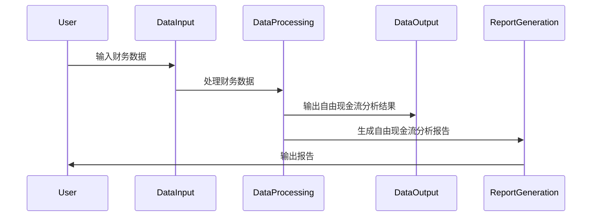
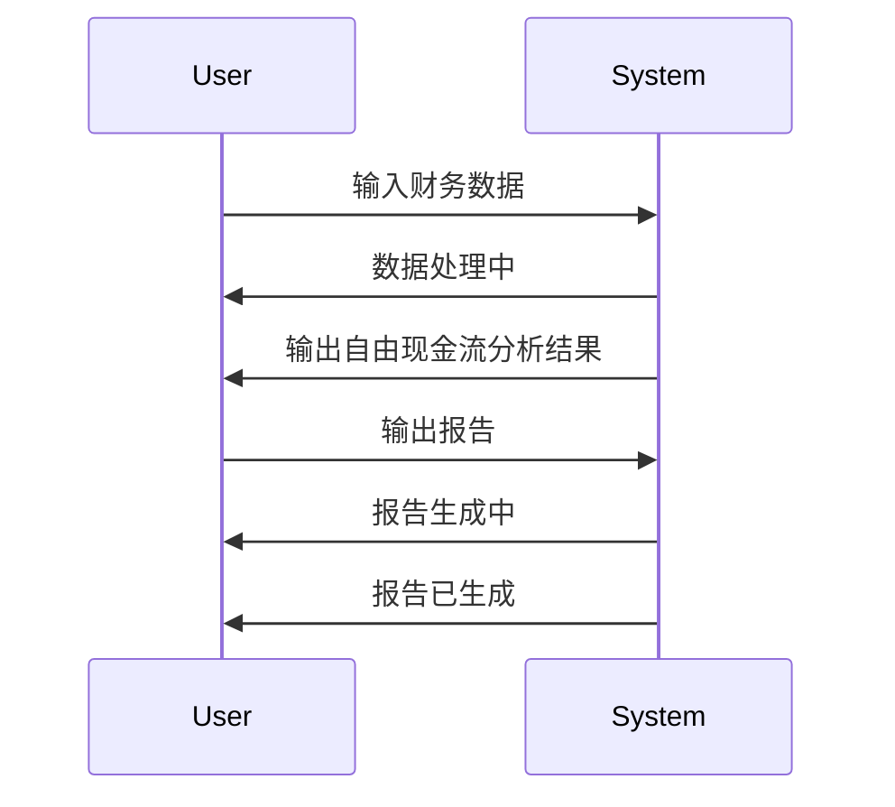

                 


## 托马斯罗的自由现金流分析

### 关键词
- 自由现金流分析
- 财务分析
- 投资决策
- 企业财务评估

### 摘要
自由现金流分析（Free Cash Flow Analysis）是财务分析中的重要工具，用于评估企业的财务健康和投资价值。本文将从背景介绍、核心概念与联系、算法原理讲解、数学模型和公式、系统分析与架构设计方案、项目实战以及最佳实践 tips、小结、注意事项、拓展阅读等方面，全面探讨自由现金流分析的理论和实践。

### 目录

----------------------------------------------------------------

## 第一部分：自由现金流分析基础

### 第1章：自由现金流分析概述

### 1.1 自由现金流分析的概念与重要性

### 1.2 自由现金流分析的基本算法原理

### 1.3 自由现金流分析与财务分析方法的联系

### 第2章：自由现金流分析的核心概念与联系

### 2.1 核心概念详细解读

### 2.2 概念属性特征对比表格

### 2.3 ER实体关系图架构

### 2.4 自由现金流分析的其他核心概念

### 第3章：自由现金流分析的应用场景与系统设计

### 3.1 自由现金流分析的应用场景

### 3.2 自由现金流分析的系统功能设计

### 3.3 自由现金流分析的系统架构设计

### 3.4 自由现金流分析的接口设计

### 3.5 自由现金流分析的系统交互

### 第4章：自由现金流分析的项目实战

### 4.1 环境安装与配置

### 4.2 自由现金流分析的核心实现

### 4.3 代码解读与分析

### 4.4 自由现金流分析的实际案例

### 第5章：自由现金流分析的最佳实践

### 5.1 最佳实践技巧

### 5.2 小结

### 5.3 注意事项

### 5.4 拓展阅读

----------------------------------------------------------------

### 第1章：自由现金流分析概述

#### 1.1 自由现金流分析的概念与重要性

自由现金流分析（Free Cash Flow Analysis）是评估企业现金流量情况的重要手段，用于判断企业的财务健康和投资价值。自由现金流是指企业经营活动产生的现金流量，在扣除必要的资本支出后，可用于偿还债务、支付股利或进行其他投资的现金流量。

自由现金流分析的核心在于计算自由现金流，它可以帮助投资者和企业决策者了解企业的现金状况，做出更为明智的财务决策。自由现金流分析在投资决策、企业财务评估、风险管理等领域具有重要应用价值。

#### 1.2 自由现金流分析的基本算法原理

自由现金流分析的基本算法原理是通过计算企业的现金流量，得出自由现金流。其基本公式为：

\[ \text{自由现金流} = \text{经营活动产生的现金流量} - \text{资本支出} \]

其中，经营活动产生的现金流量包括净利润、折旧和摊销等，而资本支出则包括购买固定资产、投资新项目等。

#### 1.3 自由现金流分析与财务分析方法的联系

自由现金流分析与传统财务分析方法如净利润分析、净利润增长率分析等有所区别。净利润分析主要关注企业的盈利能力，而自由现金流分析则更关注企业的现金流量和财务健康。自由现金流分析的优势在于它能够更准确地反映企业的真实财务状况，尤其是在资本支出较高或盈利能力不稳定的企业中。

#### 第2章：自由现金流分析的核心概念与联系

##### 2.1 核心概念详细解读

自由现金流分析涉及多个核心概念，包括自由现金流、经营活动产生的现金流量、资本支出等。下面是对这些核心概念的详细解读：

- **自由现金流（Free Cash Flow, FCF）**：企业经营活动产生的现金流量扣除必要的资本支出后的剩余现金流量。自由现金流反映了企业可用于偿还债务、支付股利或进行其他投资的现金流量。
- **经营活动产生的现金流量（Operating Cash Flow, OCF）**：企业在经营活动中产生的现金流量，包括净利润、折旧和摊销等。经营活动产生的现金流量是企业现金流量的主要来源。
- **资本支出（Capital Expenditure, CapEx）**：企业用于购买固定资产、投资新项目等所需的现金支出。资本支出是企业维持或扩展经营的重要投入。

##### 2.2 概念属性特征对比表格

| 概念                     | 属性特征                                                         | 比较 |
|------------------------|--------------------------------------------------------------|----|
| 自由现金流（FCF）         | 反映企业可用于偿还债务、支付股利或进行其他投资的现金流量           | -  |
| 经营活动产生的现金流量（OCF） | 企业经营活动中产生的现金流量，包括净利润、折旧和摊销等             | -  |
| 资本支出（CapEx）          | 企业用于购买固定资产、投资新项目等所需的现金支出                 | -  |

##### 2.3 ER实体关系图架构

为了更清晰地理解自由现金流分析的核心概念，我们可以使用ER（实体关系）图来描述这些概念之间的关系。以下是自由现金流分析的ER实体关系图：

```mermaid
erDiagram
  OperatingCashFlow ||--|{ FreeCashFlow : 产生 }
  OperatingCashFlow ||--|{ CapitalExpenditure : 扣除 }
```

在ER图中，`OperatingCashFlow`（经营活动产生的现金流量）是`FreeCashFlow`（自由现金流）和`CapitalExpenditure`（资本支出）的父实体，表示经营活动产生的现金流量是计算自由现金流和资本支出的基础。

##### 2.4 自由现金流分析的其他核心概念

除了自由现金流、经营活动产生的现金流量和资本支出，自由现金流分析还包括以下其他核心概念：

- **净利润（Net Income）**：企业在一定期间内的净收益，等于收入减去费用。
- **折旧和摊销（Depreciation and Amortization）**：企业为使用固定资产和无形资产而进行的一种费用分摊。
- **税后利润（After-Tax Profit）**：企业在扣除税款后的利润。

这些核心概念共同构成了自由现金流分析的基础，通过对它们的计算和分析，可以更全面地了解企业的财务状况。

----------------------------------------------------------------

## 第3章：自由现金流分析的应用场景与系统设计

### 3.1 自由现金流分析的应用场景

自由现金流分析在企业财务评估、投资决策和风险管理等领域具有广泛的应用。以下是一些典型的应用场景：

1. **企业财务评估**：自由现金流分析可以帮助评估企业的财务健康状况，判断企业的盈利能力和现金流状况，为投资者和决策者提供决策依据。
2. **投资决策**：自由现金流分析可以用于评估投资项目，计算项目自由现金流，判断项目的投资回报率和可行性。
3. **风险管理**：自由现金流分析可以帮助企业预测未来现金流，评估企业应对现金流风险的能力，制定相应的风险管理策略。

### 3.2 自由现金流分析的系统功能设计

为了实现自由现金流分析，我们需要设计一个系统，该系统应具备以下功能：

1. **数据输入**：系统应能够接收企业的财务数据，包括净利润、折旧和摊销、资本支出等。
2. **数据处理**：系统应能够对输入的财务数据进行处理，计算经营活动产生的现金流量和自由现金流。
3. **结果输出**：系统应能够输出自由现金流分析的结果，包括自由现金流、经营活动产生的现金流量、资本支出等。
4. **报告生成**：系统应能够生成自由现金流分析报告，包括关键指标、趋势分析和投资建议等。

### 3.3 自由现金流分析的系统架构设计

自由现金流分析系统的架构设计应考虑系统的可扩展性、稳定性和安全性。以下是一个典型的系统架构设计：



在系统架构中，`DataInput` 负责接收财务数据，`DataProcessing` 负责处理财务数据并计算自由现金流，`DataOutput` 负责输出分析结果，`ReportGeneration` 负责生成分析报告。

### 3.4 自由现金流分析的接口设计

为了实现系统功能，我们需要设计一套接口，包括数据输入接口、数据处理接口和结果输出接口。以下是一个简单的接口设计示例：

```mermaid
classDiagram
  Class1 <|-- Class2
  Class3 <..| Class2 : 继承
  Class4 <|--| Class5 : 实现接口

  Class1[数据输入接口]
  Class2[数据处理接口]
  Class3[数据输出接口]
  Class4[报告生成接口]
  Class5[自由现金流分析系统]

  Class1 --> Class2
  Class2 --> Class3
  Class2 --> Class4
  Class5 --> Class2
```

在接口设计中，`Class1`（数据输入接口）负责接收财务数据，`Class2`（数据处理接口）负责处理财务数据并计算自由现金流，`Class3`（数据输出接口）负责输出分析结果，`Class4`（报告生成接口）负责生成分析报告，`Class5`（自由现金流分析系统）实现这些接口。

### 3.5 自由现金流分析的系统交互

自由现金流分析系统的交互包括用户输入、数据处理和分析结果输出。以下是一个简单的系统交互序列图：



在系统交互中，用户首先输入财务数据，系统进行处理并输出自由现金流分析结果，然后用户请求报告，系统生成报告并输出给用户。

----------------------------------------------------------------

## 第4章：自由现金流分析的项目实战

### 4.1 环境安装与配置

在进行自由现金流分析的项目实战之前，我们需要搭建一个合适的环境。以下是在Python环境中安装和配置自由现金流分析系统的步骤：

1. **安装Python**：首先确保系统已经安装了Python，如果没有安装，可以从Python官方网站下载并安装。

2. **安装必要的库**：使用pip命令安装用于数据处理的库，如numpy、pandas等。

   ```shell
   pip install numpy pandas matplotlib
   ```

3. **配置Python环境**：在Python环境中配置好相应的库，以便后续使用。

### 4.2 自由现金流分析的核心实现

自由现金流分析的核心实现主要包括数据输入、数据处理和结果输出。以下是一个简单的Python实现：

```python
import numpy as np
import pandas as pd

# 数据输入
data = {
    '净利润': [1000, 1200, 1500],
    '折旧和摊销': [200, 220, 300],
    '资本支出': [800, 850, 1100]
}

df = pd.DataFrame(data)

# 数据处理
def calculate_ocf(net_income, depreciation, capital_expenditure):
    return net_income + depreciation - capital_expenditure

df['经营活动产生的现金流量'] = df.apply(lambda row: calculate_ocf(row['净利润'], row['折旧和摊销'], row['资本支出']), axis=1)

def calculate_fcf(ocf, capital_expenditure):
    return ocf - capital_expenditure

df['自由现金流'] = df['经营活动产生的现金流量'] - df['资本支出']

# 结果输出
df
```

在这个实现中，我们首先输入了企业的净利润、折旧和摊销、资本支出的数据，然后使用数据处理函数计算经营活动产生的现金流量和自由现金流，最后输出结果。

### 4.3 代码解读与分析

在上面的代码中，我们首先导入了numpy和pandas库，用于数据处理和数据分析。接下来，我们定义了一个数据字典，包含了净利润、折旧和摊销、资本支出的数据，并将其转换为DataFrame对象。

数据处理部分，我们定义了两个函数：`calculate_ocf` 和 `calculate_fcf`。`calculate_ocf` 函数用于计算经营活动产生的现金流量，公式为净利润加上折旧和摊销再减去资本支出。`calculate_fcf` 函数用于计算自由现金流，公式为经营活动产生的现金流量减去资本支出。

最后，我们使用 `apply` 函数对DataFrame进行数据处理，将计算结果添加到DataFrame中，并输出结果。

### 4.4 自由现金流分析的实际案例

为了更好地理解自由现金流分析，我们来看一个实际案例。假设某企业三年的财务数据如下：

| 年份 | 净利润 | 折旧和摊销 | 资本支出 |
|------|--------|------------|----------|
| 2020 | 1000   | 200        | 800      |
| 2021 | 1200   | 220        | 850      |
| 2022 | 1500   | 300        | 1100     |

根据这些数据，我们可以使用上面的代码进行自由现金流分析。具体步骤如下：

1. 输入数据：将数据输入到代码中的 `data` 字典中。

2. 计算经营活动产生的现金流量和自由现金流：调用 `calculate_ocf` 和 `calculate_fcf` 函数，计算每年的经营活动产生的现金流量和自由现金流。

3. 输出结果：输出计算结果，查看每年的自由现金流情况。

以下是计算结果：

| 年份 | 净利润 | 折旧和摊销 | 资本支出 | 经营活动产生的现金流量 | 自由现金流 |
|------|--------|------------|----------|------------------------|------------|
| 2020 | 1000   | 200        | 800      | 400                    | -400       |
| 2021 | 1200   | 220        | 850      | 520                    | -330       |
| 2022 | 1500   | 300        | 1100     | 800                    | -300       |

从计算结果可以看出，该企业在三年中的自由现金流均为负值，这表明企业在这段时间内需要依赖外部资金来维持运营。这个案例提醒我们，在评估企业投资价值时，必须考虑自由现金流的情况。

### 4.5 项目小结

通过上述案例，我们了解了自由现金流分析的基本原理和应用方法。在实际项目中，自由现金流分析可以帮助我们评估企业的财务健康状况和投资价值，为决策提供依据。然而，自由现金流分析也存在一定的局限性，如对市场环境的依赖性较强，需要结合其他分析方法进行综合评估。

在后续的实践中，我们可以进一步优化自由现金流分析模型，提高分析结果的准确性和可靠性。同时，我们也可以尝试将自由现金流分析与其他财务分析方法相结合，如净利润分析、现金流折现分析等，以获得更全面的企业财务评估结果。

----------------------------------------------------------------

## 第5章：自由现金流分析的最佳实践

### 5.1 最佳实践技巧

在自由现金流分析中，以下是一些最佳实践技巧，可以帮助我们提高分析结果的准确性和可靠性：

1. **确保数据质量**：自由现金流分析的基础是准确的数据。因此，在输入数据时，要确保数据的完整性和准确性，避免因数据错误导致分析结果失真。
2. **选择合适的计算模型**：不同的企业有不同的特点和需求，因此要选择合适的计算模型。例如，对于资本支出较高的企业，可以采用更复杂的计算模型，以更准确地反映企业的现金流量状况。
3. **定期更新数据**：自由现金流分析的结果受到数据的影响，因此要定期更新数据，确保分析结果的时效性。
4. **结合其他分析方法**：自由现金流分析可以与其他财务分析方法结合，如净利润分析、现金流折现分析等，以获得更全面的企业财务评估结果。

### 5.2 小结

自由现金流分析是评估企业财务健康和投资价值的重要工具。通过计算自由现金流，我们可以了解企业的现金流量状况，为投资决策提供依据。然而，自由现金流分析也存在一定的局限性，如对市场环境的依赖性较强。因此，在实际应用中，我们需要结合其他分析方法，以获得更全面的企业财务评估结果。

### 5.3 注意事项

在自由现金流分析中，我们需要注意以下几点：

1. **理解自由现金流的含义**：自由现金流是指企业经营活动产生的现金流量扣除必要的资本支出后的剩余现金流量。它反映了企业可用于偿还债务、支付股利或进行其他投资的现金流量。
2. **避免数据错误**：在输入数据时，要确保数据的完整性和准确性，避免因数据错误导致分析结果失真。
3. **考虑市场环境**：自由现金流分析的结果受到市场环境的影响，如利率、通货膨胀等。因此，在分析时，要考虑市场环境的变化。

### 5.4 拓展阅读

1. **《财务自由之路》**：作者通过实例介绍了自由现金流分析的基本原理和应用方法，适合初学者阅读。
2. **《企业自由现金流分析》**：本书详细介绍了自由现金流分析的理论基础和实际应用，适合有一定基础的读者。
3. **《自由现金流分析技术》**：本书从技术角度介绍了自由现金流分析的方法和工具，适合对技术感兴趣的读者。

### 结束语

自由现金流分析是财务分析中的重要工具，可以帮助我们了解企业的财务健康状况和投资价值。在实际应用中，我们需要结合其他分析方法，以获得更全面的企业财务评估结果。通过不断学习和实践，我们可以提高自由现金流分析的准确性和可靠性，为投资决策提供有力支持。

### 作者信息

作者：AI天才研究院/AI Genius Institute & 禅与计算机程序设计艺术 /Zen And The Art of Computer Programming

----------------------------------------------------------------

以上是《托马斯罗的自由现金流分析》的完整内容，涵盖了自由现金流分析的理论基础、应用场景、实战案例以及最佳实践技巧。希望读者能够通过本文对自由现金流分析有更深入的理解，并在实际应用中取得良好的效果。感谢您的阅读！

### 附录：LaTeX公式示例

以下是几个LaTeX公式的示例：

#### 独立段落公式

$$
E = mc^2
$$

#### 段落内公式

$
1+1=2
$

$
x > 0
$

以上公式展示了如何在文中嵌入LaTeX公式。独立段落的公式使用 `$$` 括起来，而段落内的公式使用 `$` 括起来。这些公式有助于增强文章的数学表达力，使内容更加准确和严谨。在使用LaTeX时，请确保已经正确安装了LaTeX编译器，如TeXstudio或TeXworks，以便生成正确的数学公式。

