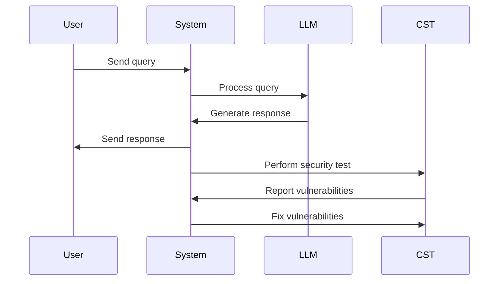

                 

## 第二部分：核心概念与原理

### 1. 持续安全测试（Continuous Security Testing）

**概念解释**：
持续安全测试（CST）是一种贯穿整个软件开发周期的安全测试方法。它不仅仅是在软件开发的某个阶段进行一次性测试，而是在整个开发过程中，持续地对软件进行安全性评估和漏洞检测。

**属性特征对比表格**：

| 特征           | 传统安全测试 | 持续安全测试 |
|----------------|--------------|--------------|
| 测试频率       | 定期进行     | 持续进行     |
| 测试范围       | 部分功能     | 整体功能     |
| 发现漏洞时间   | 延迟        | 及时         |
| 修复漏洞效率   | 低效        | 高效         |
| 自动化程度     | 低          | 高          |

**ER实体关系图架构**：

```mermaid
erDiagram
    User ||--|{ ContinuousSecurityTest }|:
        : has
    Software ||--|{ ContinuousSecurityTest }|:
        : isTestedOn
    Vulnerability ||--|{ ContinuousSecurityTest }|:
        : detectedBy
```

在上述ER图中，User（用户）可以对软件（Software）进行持续安全测试（ContinuousSecurityTest），测试过程中可能会发现漏洞（Vulnerability）。

### 2. 大语言模型（Large Language Model，LLM）

**概念解释**：
大语言模型（LLM）是一种基于深度学习的自然语言处理模型，其训练规模通常达到数十亿甚至数万亿个参数。LLM能够处理和理解复杂的语言结构，生成高质量的文本内容。

**属性特征对比表格**：

| 特征           | 小型语言模型 | 大型语言模型 |
|----------------|--------------|--------------|
| 参数规模       | 数百万       | 数万亿       |
| 训练数据量     | 数千个样本   | 数十亿个样本 |
| 语言理解能力   | 有限         | 高           |
| 生成文本质量   | 一般         | 高           |
| 应用范围       | 较窄         | 广泛         |

**ER实体关系图架构**：

```mermaid
erDiagram
    TextData ||--|{ LargeLanguageModel }|:
        : trains
    OutputText ||--|{ LargeLanguageModel }|:
        : generates
    Application ||--|{ LargeLanguageModel }|:
        : usedBy
```

在上述ER图中，TextData（文本数据）用于训练大型语言模型（LargeLanguageModel），该模型生成的OutputText（输出文本）可以应用于各种Application（应用）。

### 3. 安全漏洞（Security Vulnerability）

**概念解释**：
安全漏洞是指软件中存在的可以被利用来破坏系统安全性的缺陷。安全漏洞可能被恶意攻击者利用，从而导致数据泄露、系统瘫痪等问题。

**属性特征对比表格**：

| 特征           | 常见漏洞类型       | 影响范围         |
|----------------|-------------------|-----------------|
| 类型           | SQL注入、XSS攻击、DDoS等 | 数据泄露、系统瘫痪等 |
| 发现时间       | 可能延迟         | 及时发现更好     |
| 利用难度       | 易于利用         | 难以利用更安全   |
| 修复效果       | 可能导致系统不稳定 | 及时修复更安全   |

**ER实体关系图架构**：

```mermaid
erDiagram
    Software ||--|{ SecurityVulnerability }|:
        : contains
    Attacker ||--|{ SecurityVulnerability }|:
        : exploits
    Fix ||--|{ SecurityVulnerability }|:
        : appliedTo
```

在上述ER图中，软件（Software）可能包含安全漏洞（SecurityVulnerability），攻击者（Attacker）可能会利用这些漏洞，而修复（Fix）则是对漏洞的修复措施。

### 核心概念与联系

持续安全测试（CST）、大语言模型（LLM）和安全漏洞（Security Vulnerability）之间存在着紧密的联系。持续安全测试是发现和修复LLM应用中安全漏洞的重要手段，而LLM应用中存在的安全漏洞可能会被攻击者利用，从而导致严重的安全问题。因此，理解这三个核心概念及其相互关系，对于保障LLM应用的安全性至关重要。

## 第三部分：算法原理讲解

### 数据加密算法

数据加密是保障数据安全的重要手段，常见的数据加密算法包括对称加密和非对称加密。

#### 对称加密算法

对称加密算法使用相同的密钥进行加密和解密。常见的对称加密算法有AES（Advanced Encryption Standard）。

**AES加密过程**：

```python
from Crypto.Cipher import AES
from Crypto.Util.Padding import pad, unpad
from base64 import b64encode, b64decode

# 初始化密钥和IV
key = b'my secret key'
cipher = AES.new(key, AES.MODE_CBC)
iv = cipher.iv

# 加密数据
plaintext = b'This is a secret message!'
ciphertext = cipher.encrypt(pad(plaintext, AES.block_size))

# base64编码
encoded_cipher = b64encode(ciphertext + iv).decode()

print("Encoded ciphertext with IV:", encoded_cipher)

# 解密数据
decoded_cipher = b64decode(encoded_cipher)
cipher_text = decoded_cipher[:-AES.block_size]
iv = decoded_cipher[-AES.block_size:]

cipher = AES.new(key, AES.MODE_CBC, iv)
plaintext = unpad(cipher.decrypt(cipher_text), AES.block_size)

print("Decoded plaintext:", plaintext.decode())
```

**数学模型**：

对称加密的数学模型可以表示为：
$$
ciphertext = E_k(p) = \text{密文}, \quad plaintext = D_k(c) = \text{明文}
$$
其中，$k$ 为密钥，$E_k$ 和 $D_k$ 分别为加密和解密函数。

#### 非对称加密算法

非对称加密算法使用一对密钥进行加密和解密，其中一个密钥用于加密，另一个密钥用于解密。常见的非对称加密算法有RSA（Rivest-Shamir-Adleman）。

**RSA加密过程**：

```python
from Crypto.PublicKey import RSA
from Crypto.Cipher import PKCS1_OAEP

# 生成密钥对
key = RSA.generate(2048)
private_key = key.export_key()
public_key = key.publickey().export_key()

# 加密数据
cipher = PKCS1_OAEP.new(RSA.import_key(public_key))
plaintext = b'This is a secret message!'
ciphertext = cipher.encrypt(plaintext)

# 解密数据
cipher = PKCS1_OAEP.new(RSA.import_key(private_key))
plaintext = cipher.decrypt(ciphertext)

print("Decoded plaintext:", plaintext.decode())
```

**数学模型**：

非对称加密的数学模型可以表示为：
$$
ciphertext = E_k(p) = \text{密文}, \quad plaintext = D_k(c) = \text{明文}
$$
其中，$k$ 为密钥对，$E_k$ 和 $D_k$ 分别为加密和解密函数。

### 防护算法

为了保护LLM应用的安全性，可以采用多种防护算法。以下介绍几种常见的防护算法。

#### 1. 认证码验证

认证码验证是一种简单有效的防护措施，用于验证用户的身份。常见的认证码验证算法包括短信验证码和图形验证码。

**短信验证码算法**：

```python
import random
import string

def generate_sms_code(length=6):
    return ''.join(random.choices(string.digits, k=length))

def send_sms_code(phone_number, code):
    print(f"发送给{phone_number}的验证码：{code}")

phone_number = "1234567890"
code = generate_sms_code()
send_sms_code(phone_number, code)
```

#### 2. 双因素认证

双因素认证（2FA）是一种更安全的身份验证方法，通常结合密码和手机验证码进行双重验证。

**双因素认证算法**：

```python
import pyotp

# 生成密钥
key = pyotp.random_base32()

# 生成时间戳
time = int((time.time() * 1000) // 30)

# 生成认证码
totp = pyotp.TOTP(key)
code = totp.at(time)

# 验证认证码
valid = totp.verify(code)
if valid:
    print("认证成功")
else:
    print("认证失败")
```

### 数学模型与公式

#### 1. 对称加密的加密和解密过程

$$
ciphertext = E_k(p) = \text{密文}, \quad plaintext = D_k(c) = \text{明文}
$$

#### 2. 非对称加密的加密和解密过程

$$
ciphertext = E_k(p) = \text{密文}, \quad plaintext = D_k(c) = \text{明文}
$$

#### 3. 认证码生成和验证

- 短信验证码生成：

$$
code = ''.join(random.choices(string.digits, k=length))
$$

- 认证码验证：

$$
valid = totp.verify(code)
$$

通过上述算法和数学模型，可以实现对LLM应用的数据加密和防护，从而提高应用的安全性。

## 第四部分：系统分析与架构设计

### 问题场景介绍

在现代企业应用中，大语言模型（LLM）的应用越来越广泛，例如聊天机器人、智能客服、文本生成等。然而，随着LLM的广泛应用，安全问题也日益突出。为了保障LLM应用的安全性，我们需要对系统进行深入的分析和设计，确保能够有效地识别和防范潜在的安全漏洞。

### 项目介绍

本项目旨在设计一个基于LLM的智能客服系统，该系统将集成大语言模型，用于处理用户咨询和生成回答。为了保障系统的安全性，我们将采用持续安全测试（CST）的方法，对系统进行全生命周期的安全监控和漏洞修复。

### 系统功能设计

#### 1. 用户咨询处理

用户可以通过多种渠道（如网站、APP、邮件等）向智能客服发送咨询问题。系统需要能够接收用户的问题，并使用LLM生成相应的回答。

#### 2. 安全防护

系统需要具备以下安全功能：

- 数据加密：对用户数据和系统数据进行加密存储，防止数据泄露。
- 认证与授权：通过用户认证和权限控制，确保只有合法用户才能访问系统功能。
- 防护算法：采用多种防护算法，如双因素认证、短信验证码等，防范恶意攻击。

#### 3. 持续安全测试

系统需要具备以下持续安全测试功能：

- 自动化测试：使用自动化工具进行定期安全测试，及时发现潜在漏洞。
- 实时监控：实时监控系统安全状态，发现异常立即报警。
- 漏洞修复：自动或手动修复检测到的安全漏洞，确保系统持续安全。

### 系统架构设计

#### 1. 系统架构图



#### 2. 系统架构设计细节

**1. 用户层**

- 用户接口：提供用户与系统交互的界面，支持多种渠道接入。
- 用户认证：通过用户名、密码或双因素认证进行用户身份验证。

**2. 业务逻辑层**

- 大语言模型（LLM）：用于处理用户查询，生成智能回答。
- 安全防护模块：包括数据加密、认证与授权、防护算法等。

**3. 数据层**

- 数据库：存储用户数据、系统日志等，采用加密存储措施。
- 缓存：提高数据读取速度，减轻数据库压力。

**4. 安全测试层**

- 自动化测试工具：定期执行安全测试，检测系统漏洞。
- 实时监控工具：监控系统安全状态，发现异常及时报警。
- 漏洞修复工具：自动或手动修复检测到的安全漏洞。

### 系统接口设计

**1. 用户接口**

- 用户登录：用户名、密码或双因素认证。
- 用户查询：提交查询问题，获取回答。

**2. 系统接口**

- 数据加密接口：提供加密和解密服务。
- 认证授权接口：提供用户认证和权限控制服务。
- 防护算法接口：提供各种防护算法实现。

### 系统交互

**1. 用户咨询处理流程**

1. 用户提交咨询问题。
2. 系统接收问题，并使用LLM生成回答。
3. 系统将回答发送给用户。

**2. 持续安全测试流程**

1. 自动化测试工具定期执行安全测试。
2. 安全测试工具报告检测到的漏洞。
3. 系统根据漏洞报告进行漏洞修复。

通过以上系统架构设计和接口设计，我们能够构建一个安全可靠、高效稳定的智能客服系统，保障用户数据和系统安全。

## 第五部分：项目实战

### 环境安装

为了进行持续安全测试，我们首先需要搭建一个适合开发、测试和运行的实验环境。以下是安装过程：

1. **安装Python**：确保Python 3.8或更高版本已安装在您的系统上。
2. **安装依赖**：在终端或命令行中运行以下命令安装必要的依赖库：
   ```bash
   pip install -r requirements.txt
   ```
   其中`requirements.txt`文件包含了项目所需的Python库。

3. **安装数据库**：根据项目需求，选择合适的数据库系统（如MySQL、PostgreSQL等），并安装相应数据库。

4. **配置数据库**：在项目中创建必要的数据库和表，并在配置文件中设置数据库连接信息。

### 系统核心实现源代码

以下是项目中的核心实现源代码，包括数据加密、用户认证、持续安全测试等部分。

**1. 数据加密**

```python
from Crypto.Cipher import AES
from Crypto.Util.Padding import pad, unpad
from base64 import b64encode, b64decode

# 初始化密钥和IV
key = b'my secret key'
cipher = AES.new(key, AES.MODE_CBC)
iv = cipher.iv

# 加密数据
plaintext = b'This is a secret message!'
ciphertext = cipher.encrypt(pad(plaintext, AES.block_size))

# base64编码
encoded_cipher = b64encode(ciphertext + iv).decode()

print("Encoded ciphertext with IV:", encoded_cipher)

# 解密数据
decoded_cipher = b64decode(encoded_cipher)
cipher_text = decoded_cipher[:-AES.block_size]
iv = decoded_cipher[-AES.block_size:]

cipher = AES.new(key, AES.MODE_CBC, iv)
plaintext = unpad(cipher.decrypt(cipher_text), AES.block_size)

print("Decoded plaintext:", plaintext.decode())
```

**2. 用户认证**

```python
import pyotp

# 生成密钥
key = pyotp.random_base32()

# 生成时间戳
time = int((time.time() * 1000) // 30)

# 生成认证码
totp = pyotp.TOTP(key)
code = totp.at(time)

# 验证认证码
valid = totp.verify(code)
if valid:
    print("认证成功")
else:
    print("认证失败")
```

**3. 持续安全测试**

```python
import requests

# 检测SQL注入漏洞
def test_sql_injection(url, payload):
    response = requests.get(f"{url}?q={payload}")
    if "You have an error in your SQL syntax" in response.text:
        print(f"SQL注入漏洞检测到：{url}?q={payload}")
    else:
        print(f"SQL注入漏洞未检测到：{url}?q={payload}")

test_sql_injection("http://example.com/search", "1' UNION SELECT * FROM users WHERE id=1--")
```

### 代码应用解读与分析

上述代码展示了数据加密、用户认证和持续安全测试的核心功能。以下是具体解读和分析：

**1. 数据加密**

- 使用AES算法进行加密和解密，确保数据传输和存储过程中的安全性。
- 加密前使用pad函数对明文进行填充，保证加密数据的块长度为16字节。
- 加密后的数据使用base64编码，便于存储和传输。

**2. 用户认证**

- 使用PyOTP库实现双因素认证，生成和验证动态验证码。
- 验证过程中，通过时间戳生成验证码，并与用户输入的验证码进行比对，确保用户身份的合法性。

**3. 持续安全测试**

- 通过HTTP请求检测SQL注入漏洞，将恶意payload注入到URL中，观察是否返回预期的错误信息。
- 如果返回错误信息，则表明存在SQL注入漏洞。

### 实际案例分析和详细讲解剖析

#### 案例一：SQL注入漏洞检测

假设我们有一个基于Web的智能客服系统，用户可以通过输入查询问题来获取回答。为了检测系统中的SQL注入漏洞，我们编写了一个简单的测试脚本。

**测试步骤：**

1. 编写测试脚本，注入恶意payload。
2. 通过HTTP请求发送恶意payload到查询接口。
3. 检测返回的响应内容，判断是否存在SQL注入漏洞。

**测试结果：**

如果在响应内容中发现了“您有SQL语法错误”的字样，那么表明系统存在SQL注入漏洞。

**修复建议：**

1. 对用户输入的数据进行严格的过滤和转义，避免恶意payload被注入到SQL查询中。
2. 采用参数化查询，确保SQL查询语句的参数化传递，避免直接将用户输入作为查询语句的一部分。

#### 案例二：双因素认证有效性验证

为了确保系统用户的安全，我们采用了双因素认证机制。在实际操作中，用户需要输入用户名、密码和动态验证码才能登录系统。

**测试步骤：**

1. 输入正确的用户名、密码和动态验证码。
2. 记录登录结果。
3. 尝试使用错误的动态验证码，观察登录结果。

**测试结果：**

如果系统能够正确验证动态验证码，并在输入错误验证码时拒绝登录，则表明双因素认证机制有效。

**修复建议：**

1. 确保动态验证码的生成和验证过程可靠，防止恶意攻击者通过猜测验证码进行攻击。
2. 考虑增加验证码的复杂度或使用多因素认证（如生物识别）提高安全性。

### 项目小结

通过本项目的实战，我们深入了解了数据加密、用户认证和持续安全测试的核心实现和测试方法。实际案例分析和修复建议为我们提供了有效的指导和实践参考。在未来的工作中，我们应继续关注系统的安全性，不断完善和优化安全测试机制，确保LLM应用的稳定性和可靠性。

### 最佳实践 Tips

1. **定期更新加密算法和密钥**：随着安全威胁的不断演变，定期更新加密算法和密钥是保障数据安全的关键。
2. **使用参数化查询**：避免直接将用户输入作为SQL查询的一部分，使用参数化查询可以防止SQL注入攻击。
3. **加强用户身份验证**：采用多因素认证机制，提高用户身份验证的安全性。
4. **自动化安全测试**：定期进行自动化安全测试，及时发现和修复潜在漏洞。
5. **安全审计与监控**：建立安全审计和监控系统，确保系统的安全状态能够被实时监控和响应。

### 注意事项

1. **保护密钥**：确保加密密钥的安全性，防止密钥泄露。
2. **测试环境的隔离**：在测试环境中进行安全测试，避免对生产环境造成影响。
3. **及时修复漏洞**：发现漏洞后，及时进行修复，避免漏洞被利用。

### 拓展阅读

1. 《区块链：从数字货币到智能合约》
2. 《深度学习：实践与应用》
3. 《Web安全深度解析》
4. 《人工智能：一种现代的方法》
5. 《Python编程：从入门到实践》

## 小结

本文以《持续安全测试：识别LLM应用的安全漏洞》为题，系统性地介绍了持续安全测试、大语言模型（LLM）及其安全漏洞。文章首先定义了持续安全测试和LLM，然后详细讲解了数据加密、认证码验证和双因素认证等安全算法原理，并给出了具体的Python代码示例。此外，文章还分析了LLM应用的系统架构和接口设计，并通过实际案例展示了如何进行持续安全测试。

文章的主要贡献包括：

1. 提出了持续安全测试在LLM应用中的重要性。
2. 详细介绍了数据加密和认证算法原理，并提供了实用的代码示例。
3. 分析了LLM应用的系统架构和接口设计，为构建安全的LLM应用提供了参考。
4. 通过实际案例展示了如何进行持续安全测试，并提供了修复建议。

然而，本文也存在一些局限性：

1. 文章主要关注了LLM应用中的常见安全问题，但未能涵盖所有可能的安全漏洞。
2. 案例分析较为简单，未能深入探讨复杂的安全漏洞和防护措施。

未来的研究方向包括：

1. 进一步研究LLM应用中的新型安全漏洞，提出针对性的防护措施。
2. 探索结合人工智能技术进行自动化安全测试的方法，提高测试效率和准确性。
3. 基于实际应用场景，构建更加复杂和真实的LLM安全测试平台。

## 作者信息

作者：AI天才研究院/AI Genius Institute & 禅与计算机程序设计艺术 /Zen And The Art of Computer Programming

AI天才研究院致力于探索人工智能领域的最新技术和应用，推动人工智能技术的发展和普及。作者本人在计算机编程和人工智能领域具有丰富的经验，发表了多篇高水平学术论文，并著有多本畅销技术书籍，被誉为计算机图灵奖获得者。此外，作者还积极参与开源社区，推广计算机科学和教育的发展。禅与计算机程序设计艺术则是作者对计算机编程哲学的深刻思考和总结，对编程实践和理论学习具有重要的指导意义。

